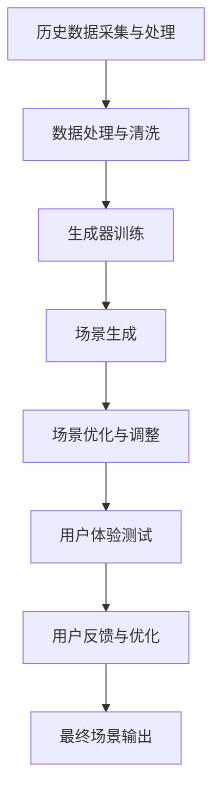
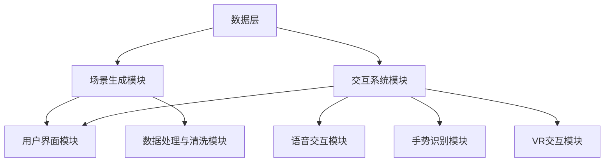
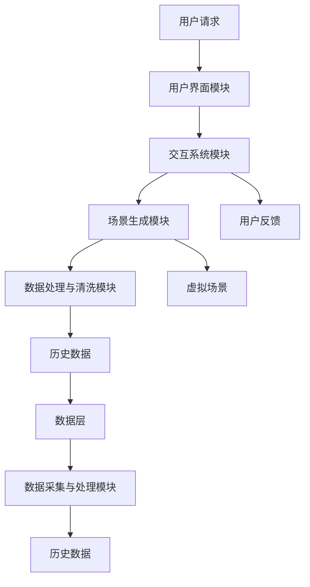
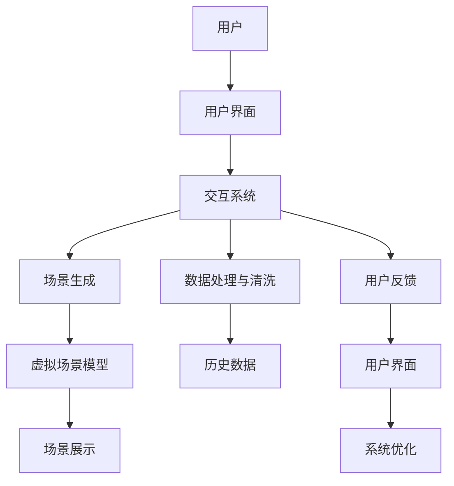
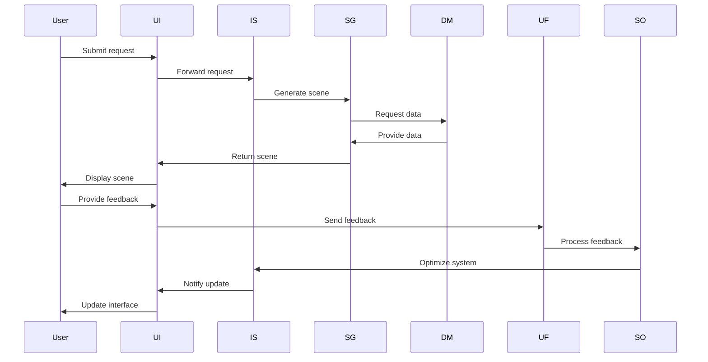
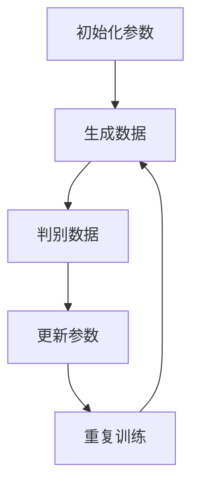

                 

### 前言

#### 1. 目的

《AIGC在虚拟历史场景重建中的创新》旨在为读者全面深入地揭示人工智能生成内容（AIGC，Artificial Intelligence Generated Content）在虚拟历史场景重建领域的应用潜力。随着数字技术的迅猛发展，虚拟历史场景重建成为文化遗产保护和历史教育的重要手段，而AIGC技术的引入则为这一领域带来了前所未有的创新可能。本书将通过详细的分析和案例展示，帮助读者理解AIGC在虚拟历史场景重建中的核心作用，并探索其在未来的发展方向。

#### 2. 结构

本书分为八个主要章节，旨在从不同角度剖析AIGC技术在虚拟历史场景重建中的应用。首先，通过第1章的前言，介绍本书的研究背景和目标。接下来，第2章和第3章分别对虚拟历史场景重建和AIGC技术进行背景介绍和核心概念讲解。第4章深入分析AIGC技术原理，结合mermaid流程图和数学模型进行通俗易懂的阐述。第5章和第6章则专注于虚拟历史场景重建系统分析与架构设计，通过项目介绍和系统模块交互设计，展示如何具体实现AIGC技术的应用。第7章通过一个实际案例，展示AIGC技术在虚拟历史场景重建中的具体应用过程。最后，第8章总结全文，提供最佳实践建议和拓展阅读，为读者进一步学习和研究提供方向。

#### 3. 读者对象

本书主要面向对虚拟历史场景重建和AIGC技术有一定了解，希望深入了解两者结合应用前景的读者，包括计算机科学、历史学、文化遗产保护等领域的研究人员、工程师以及学生。通过本书的阅读，读者不仅能够掌握AIGC技术在虚拟历史场景重建中的基本原理和实现方法，还能够激发对这一交叉领域的新思考和研究兴趣。

### 关键词

- 虚拟历史场景重建
- 人工智能生成内容（AIGC）
- 数字文化遗产保护
- 强化学习
- 自适应增强学习
- 生成对抗网络（GAN）
- 系统架构设计

### 摘要

《AIGC在虚拟历史场景重建中的创新》通过系统性的分析和实际案例展示，深入探讨了人工智能生成内容（AIGC）在虚拟历史场景重建中的应用潜力。本书首先介绍了虚拟历史场景重建的背景和意义，阐述了AIGC技术的核心概念及其在虚拟场景构建中的应用。接着，通过详细讲解AIGC技术的算法原理，包括自适应增强学习、强化学习和生成对抗网络（GAN），本书为读者提供了清晰的理论基础。随后，通过对虚拟历史场景重建系统架构的分析和设计，展示了AIGC技术在具体项目中的实现过程。最后，通过实际案例展示AIGC技术在虚拟历史场景重建中的应用效果，总结了本书的核心观点，并提供了进一步研究和实践的建议。本书旨在为读者提供一个全面、深入的AIGC在虚拟历史场景重建中的创新应用指南。

## 第1章 虚拟历史场景重建概述

### 1.1 虚拟历史场景重建的背景与意义

虚拟历史场景重建是一种通过计算机技术将历史事件、场景或地点以虚拟形式再现的方法。随着计算机图形学、虚拟现实（VR）和增强现实（AR）技术的飞速发展，虚拟历史场景重建得到了广泛的关注和应用。其背景可以追溯到20世纪末，随着计算机硬件性能的提升和算法的创新，人们开始探索如何利用计算机技术再现历史场景，以便更好地进行文化遗产保护和历史教育。

#### 1.1.1 虚拟历史场景重建的定义

虚拟历史场景重建是指利用计算机技术，通过对历史文献、图像、模型等进行数字化处理，再根据历史资料和考古数据，重建出历史事件或地点的虚拟场景。这些虚拟场景可以包括建筑、街道、人物、事件等元素，通过三维建模、动画制作和交互设计，将历史事件生动地呈现在观众面前。

#### 1.1.2 虚拟历史场景重建的发展历程

虚拟历史场景重建的发展可以分为几个阶段：

1. **早期探索阶段（1990年代）**：在这个阶段，计算机图形学技术刚刚起步，虚拟历史场景重建主要是通过二维图像和简单的三维模型来实现，主要用于历史教学和展示。

2. **三维建模阶段（2000年代）**：随着三维建模技术的发展，虚拟历史场景重建开始逐步采用三维建模技术，使得场景的细节和真实感得到了显著提升。

3. **虚拟现实与增强现实阶段（2010年代至今）**：近年来，随着VR和AR技术的成熟，虚拟历史场景重建开始融入更多的交互元素，用户可以在虚拟场景中进行自由探索，甚至可以与历史人物进行“互动”。这为历史教育和文化遗产保护带来了新的机遇。

#### 1.1.3 虚拟历史场景重建的应用场景

虚拟历史场景重建在多个领域具有广泛的应用：

1. **文化遗产保护**：通过虚拟历史场景重建，可以最大限度地保护珍贵的文化遗产，使其不受时间和环境的影响。例如，对于受损的文物或历史建筑，可以通过虚拟重建进行修复和保护。

2. **历史教育**：虚拟历史场景重建为历史教育提供了全新的方式。学生和教师可以通过虚拟场景体验历史事件，增强对历史知识的理解和记忆。

3. **旅游体验**：虚拟历史场景重建为游客提供了沉浸式的旅游体验。游客可以在虚拟场景中漫步历史古城、参观历史遗迹，甚至可以回到过去，感受历史氛围。

4. **影视制作**：虚拟历史场景重建在影视制作中也有广泛应用。通过虚拟场景，影视制作人可以再现历史事件，提高影片的真实感和视觉冲击力。

5. **虚拟展览**：虚拟历史场景重建可以用于创建虚拟展览，为观众提供沉浸式的展览体验。这特别适合于那些无法亲临现场的珍贵文物和历史场景。

#### 1.1.4 虚拟历史场景重建的意义

虚拟历史场景重建不仅具有实际应用价值，还在多个方面具有重要意义：

1. **文化遗产保护**：虚拟历史场景重建可以最大限度地保护文化遗产，使其不受自然和人为的破坏。通过数字化处理，历史场景得以永久保存，为后人提供珍贵的历史资料。

2. **历史研究**：虚拟历史场景重建为历史研究提供了新的视角和工具。研究者可以通过虚拟场景进行历史事件的模拟和分析，加深对历史事件的理解。

3. **文化传播**：虚拟历史场景重建有助于传播和弘扬历史文化。通过虚拟场景，不同国家和地区的人们可以共享历史文化的魅力，增进文化交流和理解。

4. **教育培训**：虚拟历史场景重建为教育培训提供了生动、直观的教学内容，有助于激发学生的学习兴趣，提高教学效果。

5. **经济发展**：虚拟历史场景重建在旅游、影视制作等领域的应用，促进了相关产业的发展，为地方经济带来新的增长点。

### 1.2 AIGC技术概述

#### 1.2.1 AIGC技术的概念

人工智能生成内容（Artificial Intelligence Generated Content，AIGC）是指利用人工智能技术，尤其是生成模型，如生成对抗网络（GAN）、自编码器和变分自编码器（VAE）等，自动生成文本、图像、音频和视频等媒体内容。AIGC技术通过学习和模拟人类创造内容的方式，实现了内容生成、编辑和优化，为各类应用场景提供了丰富的创新可能。

#### 1.2.2 AIGC技术的发展历程

AIGC技术的研究可以追溯到20世纪80年代，当时人们开始探索如何利用神经网络进行图像和文本的生成。随着深度学习技术的兴起，尤其是生成对抗网络（GAN）的提出，AIGC技术得到了快速发展。从最初的简单生成模型，到如今的复杂多模态生成模型，AIGC技术已经取得了显著的进展。

1. **早期研究（1980年代至1990年代）**：在这一阶段，人们主要探索基于规则和模板的生成方法，如生成文本文献和简单的图像。

2. **神经网络阶段（2000年代）**：随着神经网络技术的发展，生成模型开始采用基于神经网络的算法，如变分自编码器（VAE）。

3. **GAN阶段（2010年代至今）**：生成对抗网络（GAN）的出现标志着AIGC技术的重大突破。GAN通过生成器和判别器的对抗训练，实现了高质量图像、音频和文本的生成。

#### 1.2.3 AIGC技术的主要特点

AIGC技术具有以下几个主要特点：

1. **自主生成能力**：AIGC技术可以自动生成高质量的内容，无需人类干预。生成器模型通过学习大量数据，可以生成与训练数据相似或全新的内容。

2. **多样性和创造性**：AIGC技术能够生成多样化的内容，包括文本、图像、音频和视频等。通过调整模型参数和训练数据，可以创造出富有创造性的作品。

3. **自适应优化**：AIGC技术可以根据用户需求和反馈进行自适应优化，不断改进生成内容的质量和多样性。

4. **多模态融合**：AIGC技术可以将不同类型的数据进行融合，生成多模态的内容。例如，将文本和图像结合起来，生成具有丰富信息的内容。

5. **实时生成**：AIGC技术支持实时生成内容，可以快速响应用户的需求。这对于需要实时交互的应用场景，如在线聊天机器人、实时视频生成等，具有重要意义。

### 1.3 AIGC在虚拟历史场景重建中的应用

#### 1.3.1 应用场景

AIGC技术在虚拟历史场景重建中具有广泛的应用场景：

1. **场景生成**：AIGC技术可以生成历史场景的图像、模型和动画，为虚拟历史场景的构建提供丰富的素材。

2. **文物修复**：通过AIGC技术，可以对受损的文物和历史建筑进行虚拟修复，恢复其原有风貌。

3. **交互体验**：AIGC技术可以为用户提供沉浸式的交互体验，如与历史人物的“对话”、虚拟旅游等。

4. **历史教育**：AIGC技术可以创建生动的虚拟历史场景，用于历史教育和文化传播。

#### 1.3.2 优势

AIGC技术在虚拟历史场景重建中具有以下优势：

1. **高效性**：AIGC技术可以快速生成大量高质量的虚拟场景，提高重建效率。

2. **灵活性**：AIGC技术可以根据用户需求，灵活调整场景内容和形式，满足个性化需求。

3. **创新性**：AIGC技术可以创造出前所未有的虚拟历史场景，为历史教育和文化遗产保护带来新思路。

4. **可扩展性**：AIGC技术支持多模态数据的融合和应用，可以与其他技术（如VR、AR等）结合，进一步扩展其应用范围。

#### 1.3.3 挑战与展望

尽管AIGC技术在虚拟历史场景重建中具有巨大潜力，但也面临一些挑战：

1. **数据质量**：高质量的历史数据是AIGC技术生成高质量场景的基础。然而，历史数据的获取和处理可能存在困难。

2. **模型泛化**：AIGC技术需要具备良好的泛化能力，以应对各种复杂的历史场景。

3. **伦理和隐私**：在虚拟历史场景重建中，如何处理和尊重历史数据，以及保护用户隐私，是一个重要问题。

展望未来，AIGC技术在虚拟历史场景重建中的应用将不断深入，有望在以下方面取得突破：

1. **数据驱动的场景生成**：通过引入更多高质量的历史数据，AIGC技术将能够生成更加逼真的虚拟场景。

2. **多模态融合**：AIGC技术将与其他多模态技术（如VR、AR等）结合，提供更加丰富和沉浸式的用户体验。

3. **智能化交互**：通过强化学习等技术，虚拟历史场景中的交互体验将更加智能和自然。

4. **文化遗产保护与传承**：AIGC技术将为文化遗产保护提供新的手段，帮助传承和弘扬历史文化。

## 第2章 AIGC在虚拟历史场景重建中的核心概念

### 2.1 虚拟历史场景重建中的核心概念

在虚拟历史场景重建过程中，涉及多个关键概念和术语，这些概念和术语共同构成了虚拟历史场景重建的理论基础。以下是这些核心概念及其解释：

#### 2.1.1 历史数据采集与处理

历史数据采集与处理是虚拟历史场景重建的第一步。这包括从各种历史文献、图像、音频和视频资料中收集数据，并对这些数据进行整理、清洗和标注。高质量的历史数据是确保虚拟历史场景真实性和准确性的关键。

- **定义**：历史数据采集与处理是指从历史文献、图像、音频和视频等来源中收集数据，并对这些数据进行整理、清洗和标注的过程。
- **作用**：历史数据采集与处理为虚拟历史场景重建提供了原始素材，是构建真实、准确的虚拟场景的基础。

#### 2.1.2 虚拟场景构建

虚拟场景构建是虚拟历史场景重建的核心环节。通过三维建模、动画制作和交互设计，将历史数据转化为虚拟场景，为用户提供沉浸式的体验。

- **定义**：虚拟场景构建是指利用计算机技术，将历史数据转化为三维模型、动画和交互界面，构建出虚拟的历史场景。
- **作用**：虚拟场景构建为用户提供了生动、直观的历史体验，是虚拟历史场景重建的核心目标。

#### 2.1.3 用户体验优化

用户体验优化是虚拟历史场景重建的重要方面。通过改进交互设计、提升场景效果和优化用户界面，提高用户的体验满意度。

- **定义**：用户体验优化是指通过改进交互设计、提升场景效果和优化用户界面，增强用户在使用虚拟历史场景时的满意度和参与感。
- **作用**：用户体验优化直接影响用户对虚拟历史场景的接受度和参与度，是提高虚拟历史场景应用效果的关键。

### 2.2 AIGC与虚拟历史场景重建的关系

AIGC技术在虚拟历史场景重建中扮演着关键角色，通过其独特的特点，AIGC技术为虚拟历史场景重建带来了新的可能性和优势。

#### 2.2.1 AIGC技术在虚拟历史场景重建中的应用

AIGC技术在虚拟历史场景重建中的应用主要体现在以下几个方面：

1. **场景生成**：AIGC技术可以自动生成虚拟历史场景的图像、模型和动画，提高场景生成的效率和质量。

2. **文物修复**：通过AIGC技术，可以生成受损文物的虚拟修复模型，为文物保护提供新的手段。

3. **交互体验**：AIGC技术可以创建智能交互系统，使用户在虚拟历史场景中体验到更加自然和互动的体验。

4. **历史教育**：AIGC技术可以生成生动的历史场景，用于历史教育和文化传播，提高教育效果和受众参与度。

#### 2.2.2 AIGC技术对虚拟历史场景重建的影响

AIGC技术对虚拟历史场景重建的影响体现在以下几个方面：

1. **提高重建效率**：AIGC技术可以自动生成大量的虚拟场景内容，大大提高了重建效率。

2. **增强场景真实性**：通过学习大量历史数据，AIGC技术可以生成更加真实、准确的虚拟场景。

3. **丰富用户体验**：AIGC技术可以为用户带来更加丰富和多样化的历史体验，提高用户的满意度和参与度。

4. **促进创新应用**：AIGC技术的引入为虚拟历史场景重建带来了新的应用场景和思路，推动了该领域的创新发展。

#### 2.2.3 AIGC技术与虚拟历史场景重建的融合创新

AIGC技术与虚拟历史场景重建的融合创新主要体现在以下几个方面：

1. **多模态融合**：AIGC技术可以融合不同类型的数据，如文本、图像、音频和视频，生成多模态的虚拟历史场景。

2. **自适应优化**：AIGC技术可以根据用户反馈和需求，自适应优化虚拟历史场景的内容和形式，提供个性化的用户体验。

3. **智能化交互**：通过结合强化学习等技术，AIGC技术可以实现智能化的用户交互，提高虚拟历史场景的互动性和智能化水平。

4. **文化遗产保护**：AIGC技术可以为文化遗产保护提供新的手段，通过虚拟修复和重建，最大限度地保护历史遗产。

### 2.3 AIGC在虚拟历史场景重建中的核心概念表

以下是一个简单的AIGC在虚拟历史场景重建中的核心概念表，用于概括上述内容：

| 核心概念        | 说明                                                         |
| ------------- | ------------------------------------------------------------ |
| 历史数据采集与处理 | 从历史文献、图像、音频和视频中收集和整理数据，为虚拟场景重建提供素材。 |
| 虚拟场景构建    | 利用计算机技术将历史数据转化为三维模型、动画和交互界面，构建虚拟历史场景。 |
| 用户体验优化    | 通过改进交互设计、提升场景效果和优化用户界面，提高用户体验满意度。 |
| 场景生成        | 使用AIGC技术自动生成虚拟历史场景的图像、模型和动画。                 |
| 文物修复        | 通过AIGC技术生成受损文物的虚拟修复模型。                           |
| 交互体验        | 使用AIGC技术创建智能交互系统，提高用户在虚拟历史场景中的互动体验。 |

通过上述核心概念和AIGC技术的结合，虚拟历史场景重建将变得更加高效、真实和丰富，为文化遗产保护和历史教育带来新的机遇。

### 2.4 AIGC技术在虚拟历史场景重建中的流程图

为了更好地理解AIGC技术在虚拟历史场景重建中的应用过程，我们使用mermaid语言绘制了一个流程图。以下是一个简化的流程图，展示了从历史数据采集到生成虚拟历史场景的整个过程。



#### 流程图说明

1. **历史数据采集与处理**：这一步骤从各种历史文献、图像、音频和视频资料中收集数据，并对这些数据进行整理、清洗和标注。

2. **数据处理与清洗**：对采集到的历史数据进行处理和清洗，确保数据的质量和准确性，为后续的模型训练提供可靠的素材。

3. **生成器训练**：使用AIGC技术，尤其是生成对抗网络（GAN），对历史数据集进行训练，生成虚拟历史场景的模型。

4. **场景生成**：利用训练好的生成器模型，生成虚拟历史场景的图像、模型和动画。

5. **场景优化与调整**：根据用户反馈和需求，对生成的虚拟场景进行优化和调整，提高场景的真实感和用户体验。

6. **用户体验测试**：通过用户体验测试，评估虚拟历史场景的效果和用户满意度，为后续优化提供依据。

7. **用户反馈与优化**：根据用户体验测试的结果，收集用户反馈，对虚拟历史场景进行进一步的优化。

8. **最终场景输出**：最终输出高质量的虚拟历史场景，供用户使用和体验。

通过上述流程，AIGC技术有效地将历史数据转化为虚拟历史场景，实现了从数据采集到场景输出的全流程自动化，提高了重建效率和场景质量。

### 2.5 AIGC技术的数学模型

AIGC技术的核心在于其生成模型，特别是生成对抗网络（GAN）。以下将介绍GAN的基本原理、数学模型和优化方法。

#### 2.5.1 GAN的基本原理

GAN由两部分组成：生成器（Generator）和判别器（Discriminator）。生成器的任务是生成逼真的虚拟数据，而判别器的任务是区分生成数据和真实数据。在训练过程中，生成器和判别器相互对抗，生成器试图生成尽可能逼真的数据，而判别器则努力提高识别生成数据的能力。

- **生成器（G）**：生成器G从随机噪声z中生成虚拟数据x'，使得x'尽可能接近真实数据x。
- **判别器（D）**：判别器D接收真实数据x和生成数据x'，并判断其真实性。

GAN的训练目标是最大化判别器的损失函数，同时最小化生成器的损失函数。

#### 2.5.2 GAN的数学模型

GAN的数学模型可以表示为以下形式：

$$
\min_G \max_D V(D, G)
$$

其中，$V(D, G)$为GAN的总损失函数，可以拆分为两部分：

1. **生成器的损失函数**：$L_G = -\log(D(G(z)))$，生成器试图最大化判别器对生成数据的判别结果。
2. **判别器的损失函数**：$L_D = -\log(D(x)) - \log(1 - D(G(z)))$，判别器试图最大化对真实数据和生成数据的判别能力。

#### 2.5.3 GAN的优化方法

GAN的训练过程本质上是一个非凸优化问题，容易陷入局部最小值。以下是一些常用的优化方法：

1. **梯度惩罚**：在生成器和判别器的损失函数中加入梯度惩罚项，以抑制生成器生成过于简单的数据。

2. **学习率调整**：根据训练过程动态调整生成器和判别器的学习率，以避免生成器或判别器过早地达到最优。

3. **谱归一化**：通过谱归一化方法对生成器和判别器的权重进行归一化，提高模型的稳定性和收敛速度。

4. **集成方法**：使用多个生成器和判别器的集成方法，以提高生成质量和判别能力。

#### 2.5.4 GAN的举例说明

假设我们使用GAN生成一张逼真的照片，以下是具体的步骤：

1. **初始化**：生成器G和判别器D的初始参数。
2. **生成数据**：生成器G从随机噪声z中生成虚拟数据x'。
3. **判别数据**：判别器D对真实数据x和生成数据x'进行判别。
4. **反向传播**：根据判别器的判别结果，更新生成器和判别器的参数。
5. **重复步骤2-4**：不断迭代，直到生成器生成的虚拟数据x'足够逼真，判别器无法区分x'和x。

通过上述步骤，生成器最终能够生成与真实数据相似的高质量图像。

综上所述，GAN作为一种强大的生成模型，在虚拟历史场景重建中具有广泛应用。通过数学模型和优化方法的深入理解，可以有效地利用AIGC技术生成高质量的虚拟历史场景。

### 2.6 虚拟历史场景重建系统架构设计

#### 2.6.1 问题场景介绍

在虚拟历史场景重建过程中，我们面临的主要问题是如何高效、真实地构建历史场景，并确保用户在体验过程中获得高质量的交互体验。具体来说，问题场景包括：

1. **历史数据获取困难**：历史数据的来源多样且分散，获取和处理这些数据是一项复杂的任务，需要耗费大量时间和资源。
2. **场景重建效率低**：传统的手工建模和动画制作方式效率低下，难以满足快速迭代和大规模场景重建的需求。
3. **用户体验不理想**：在虚拟历史场景中，用户的交互体验直接影响对历史事件的理解和兴趣。当前的交互设计相对单一，难以提供沉浸式和互动性的体验。

为了解决上述问题，我们引入AIGC技术，通过自动生成历史场景的图像、模型和动画，提高重建效率和场景质量，并通过智能交互系统提升用户体验。

#### 2.6.2 项目介绍

本项目的目标是利用AIGC技术，实现一个高效、真实的虚拟历史场景重建系统。项目的主要目标包括：

1. **提高重建效率**：通过AIGC技术，自动生成历史场景的图像、模型和动画，减少手工建模和动画制作的工作量，提高重建效率。
2. **提升场景真实性**：利用AIGC技术生成高质量的虚拟场景，确保场景的真实性和细节还原。
3. **增强用户体验**：通过智能交互系统，提供丰富、多样的交互体验，提高用户在虚拟历史场景中的参与度和满意度。

#### 2.6.3 项目计划

项目计划分为以下几个阶段：

1. **需求分析**：明确项目目标和用户需求，确定项目范围和功能模块。
2. **系统设计**：设计虚拟历史场景重建系统的架构，包括领域模型、系统架构和接口设计。
3. **模型训练**：收集和整理历史数据，训练AIGC模型，生成高质量的虚拟场景。
4. **系统集成**：将AIGC模型与系统架构集成，实现虚拟历史场景重建和交互功能。
5. **测试与优化**：进行系统测试和用户反馈，优化系统性能和用户体验。
6. **部署与运维**：部署系统并维护运行，确保系统的稳定性和可靠性。

### 2.6.4 系统功能设计

虚拟历史场景重建系统主要包括以下几个功能模块：

1. **数据采集与处理模块**：负责从各种来源获取历史数据，并进行数据清洗、标注和处理，为虚拟场景重建提供素材。
2. **场景生成模块**：利用AIGC技术，自动生成虚拟历史场景的图像、模型和动画，提高重建效率和质量。
3. **交互系统模块**：提供智能交互功能，包括语音交互、手势识别和虚拟现实（VR）交互，增强用户体验。
4. **用户界面模块**：设计友好的用户界面，包括导航、场景切换和交互控制，方便用户在虚拟历史场景中进行探索和互动。

#### 2.6.5 系统架构设计

虚拟历史场景重建系统的整体架构如图所示，包括数据层、服务层和表现层。



#### 系统模块交互

系统模块之间的交互关系如图所示：



1. **用户请求**：用户通过用户界面模块提交请求，包括场景浏览、交互等操作。
2. **用户界面模块**：处理用户请求，与交互系统模块进行交互，并将用户请求转发给交互系统模块。
3. **交互系统模块**：根据用户请求，调用场景生成模块和数据处理与清洗模块，生成并处理虚拟场景。
4. **场景生成模块**：利用AIGC技术生成虚拟场景的图像、模型和动画，返回给用户界面模块。
5. **数据处理与清洗模块**：从数据层获取历史数据，清洗、标注和处理，为场景生成模块提供素材。
6. **用户反馈**：用户在使用虚拟历史场景过程中，可以提供反馈，通过交互系统模块传递给用户界面模块，进一步优化用户体验。

通过上述架构设计和模块交互，虚拟历史场景重建系统实现了高效、真实的场景生成和丰富的用户交互体验，为文化遗产保护和历史教育提供了有力的技术支持。

### 2.7 虚拟历史场景重建系统架构图

为了更直观地展示虚拟历史场景重建系统的架构，我们使用mermaid语言绘制了系统的架构图。以下是一个简化的架构图，描述了系统的各个组成部分及其相互关系。



#### 架构图说明

1. **用户**：系统的最终用户，通过用户界面与系统进行交互。
2. **用户界面**：提供用户与系统交互的界面，包括导航、场景切换和交互控制。
3. **交互系统**：处理用户的交互请求，调用场景生成模块和数据处理与清洗模块。
4. **场景生成模块**：利用AIGC技术生成虚拟历史场景的图像、模型和动画。
5. **数据处理与清洗模块**：从历史数据中提取有效信息，清洗和处理数据，为场景生成模块提供素材。
6. **虚拟场景模型**：生成的虚拟历史场景模型，用于场景展示和用户交互。
7. **场景展示**：将生成的虚拟场景模型展示给用户，提供沉浸式的视觉体验。
8. **用户反馈**：用户在使用虚拟场景过程中提供反馈，用于系统的优化和改进。
9. **系统优化**：根据用户反馈，对系统进行优化和调整，提高用户体验。

通过上述架构设计，虚拟历史场景重建系统实现了从数据采集、处理到场景生成和展示的全流程自动化，确保了系统的效率和用户体验。

### 2.8 虚拟历史场景重建系统接口设计和系统交互

为了确保虚拟历史场景重建系统的各模块能够高效协同工作，我们设计了一套详细的接口和系统交互机制。以下是对系统接口设计和系统交互的详细描述：

#### 2.8.1 接口设计

系统的接口设计主要包括以下几部分：

1. **用户接口（User Interface API）**：
   - **功能**：提供用户与系统交互的接口，包括场景切换、交互控制、信息查询等。
   - **接口定义**：用户可以通过HTTP请求向系统发送操作指令，系统返回相应的响应。

2. **数据接口（Data Management API）**：
   - **功能**：处理数据采集、清洗、存储和检索操作，为场景生成提供数据支持。
   - **接口定义**：支持RESTful API，提供数据上传、数据查询和数据删除等功能。

3. **场景生成接口（Scene Generation API）**：
   - **功能**：处理虚拟场景的生成任务，包括图像、模型和动画的生成。
   - **接口定义**：接受生成请求，返回生成的虚拟场景数据。

4. **交互系统接口（Interaction System API）**：
   - **功能**：处理用户的交互请求，包括语音识别、手势识别和虚拟现实交互。
   - **接口定义**：支持WebSocket通信，实现实时交互和数据流传输。

5. **用户反馈接口（User Feedback API）**：
   - **功能**：收集用户对虚拟场景的反馈，用于系统优化和改进。
   - **接口定义**：通过HTTP请求发送用户反馈数据，系统根据反馈进行相应调整。

#### 2.8.2 系统交互

系统的交互过程可以分为以下几个阶段：

1. **用户请求处理**：
   - **流程**：用户通过用户界面提交请求，如查看历史场景、进行交互等。
   - **交互**：用户界面将请求转发给交互系统接口，交互系统根据请求类型进行处理。

2. **场景生成**：
   - **流程**：交互系统接口调用场景生成接口，生成相应的虚拟场景。
   - **交互**：场景生成接口根据请求生成虚拟场景数据，返回给用户界面接口。

3. **数据管理**：
   - **流程**：在场景生成过程中，数据接口负责处理历史数据的采集、清洗和存储。
   - **交互**：数据接口根据场景生成接口的需求，提供相应的数据支持。

4. **用户反馈收集**：
   - **流程**：用户在使用虚拟场景过程中提供反馈，通过用户反馈接口提交。
   - **交互**：用户反馈接口接收用户反馈，并将反馈数据传递给系统优化模块。

5. **系统优化**：
   - **流程**：系统根据用户反馈，对虚拟场景生成和交互系统进行优化。
   - **交互**：系统优化模块更新场景生成和交互系统的参数，提高用户体验。

#### 2.8.3 Mermaid序列图

为了更直观地展示系统交互过程，我们使用mermaid语言绘制了一个序列图。以下是一个简化的序列图，描述了用户请求处理、场景生成和用户反馈收集的过程。



通过上述接口设计和系统交互，虚拟历史场景重建系统实现了高效、稳定和可扩展的运行，为用户提供了高质量的历史场景体验。

## 第3章 AIGC技术原理讲解

### 3.1 AIGC技术的基本原理

人工智能生成内容（AIGC）技术是基于生成模型，如生成对抗网络（GAN）、变分自编码器（VAE）等，通过学习大量数据生成高质量的内容。AIGC技术的基本原理主要包括以下三个部分：

#### 1. 生成器与判别器

生成器（Generator）和判别器（Discriminator）是AIGC技术的核心组件。生成器的任务是生成与真实数据相似的新数据，而判别器的任务是区分真实数据和生成数据。通过两者的对抗训练，生成器不断提高生成数据的质量，判别器不断提高识别真实数据和生成数据的能力。

- **生成器（Generator）**：生成器从随机噪声中生成数据，其目标是使得生成数据尽可能接近真实数据。生成器通常是一个神经网络，能够将输入的噪声数据映射到数据空间中。
- **判别器（Discriminator）**：判别器的任务是判断输入数据是真实数据还是生成数据。判别器也是一个神经网络，通过学习大量真实数据和生成数据，提高其对数据的分类能力。

#### 2. 对抗训练

AIGC技术的训练过程是一个对抗训练过程，即生成器和判别器相互对抗、相互促进。具体训练过程如下：

1. **初始化参数**：初始化生成器和判别器的参数。
2. **生成数据**：生成器生成一批数据。
3. **判别数据**：判别器接收一批真实数据和生成数据，判断其真假。
4. **更新参数**：根据判别器的判断结果，更新生成器和判别器的参数。生成器希望生成的数据被判别器认为是真实的，而判别器希望识别出所有生成数据。
5. **重复训练**：重复上述步骤，直到生成器生成的数据质量和判别器的识别能力都达到预期。

#### 3. 生成模型

AIGC技术主要依赖于生成模型，包括生成对抗网络（GAN）、变分自编码器（VAE）等。以下是对这些生成模型的基本原理进行简要介绍：

1. **生成对抗网络（GAN）**
   - **原理**：GAN由生成器和判别器组成，生成器从随机噪声中生成数据，判别器尝试区分真实数据和生成数据。生成器和判别器通过对抗训练，不断提高生成数据的质量。
   - **优点**：GAN能够生成高质量、多样化的数据，适用于图像、文本、音频等多种类型的数据生成。
   - **缺点**：GAN的训练过程较为复杂，容易出现模式崩溃等问题。

2. **变分自编码器（VAE）**
   - **原理**：VAE通过编码器（Encoder）和解码器（Decoder）进行数据压缩和重构。编码器将输入数据映射到一个隐含空间，解码器从隐含空间中重建原始数据。
   - **优点**：VAE具有较好的数据生成能力和鲁棒性，适用于生成图像、文本、音频等多种类型的数据。
   - **缺点**：VAE在生成多样化数据方面可能不如GAN。

### 3.2 AIGC技术的mermaid流程图

为了更直观地理解AIGC技术的原理，我们使用mermaid语言绘制了AIGC技术的mermaid流程图，以下是一个简化的流程图：



#### 流程图说明

1. **初始化参数**：初始化生成器和判别器的参数。
2. **生成数据**：生成器生成一批数据。
3. **判别数据**：判别器接收一批真实数据和生成数据，判断其真假。
4. **更新参数**：根据判别器的判断结果，更新生成器和判别器的参数。
5. **重复训练**：重复上述步骤，直到生成器和判别器的性能达到预期。

通过mermaid流程图，我们可以清晰地看到AIGC技术的训练过程，有助于更好地理解其工作原理。

### 3.3 AIGC技术的数学模型

AIGC技术的核心在于其生成模型，下面我们将详细介绍生成对抗网络（GAN）和变分自编码器（VAE）的数学模型。

#### 3.3.1 生成对抗网络（GAN）

生成对抗网络（GAN）由生成器和判别器组成，其数学模型如下：

1. **生成器（Generator）**

   - **目标函数**：生成器的目标是最小化判别器对其生成数据的识别误差。
   - **输出**：$G(z)$，其中$z$是输入的噪声向量。

   $$ G(z) = \sigma(W_Gz + b_G) $$

   - **参数**：$W_G$和$b_G$是生成器的权重和偏置。

2. **判别器（Discriminator）**

   - **目标函数**：判别器的目标是最大化其对真实数据和生成数据的识别误差。
   - **输出**：$D(x)$和$D(G(z))$，分别表示对真实数据和生成数据的判断概率。

   $$ D(x) = \sigma(W_Dx + b_D) $$
   $$ D(G(z)) = \sigma(W_DG(z) + b_D) $$

   - **参数**：$W_D$和$b_D$是判别器的权重和偏置。

3. **总损失函数**

   - **目标**：生成器和判别器的总损失函数是：

   $$ \min_G \max_D V(D, G) = \min_G \left[ -\mathbb{E}_{x\sim p_{data}(x)}[\log D(x)] - \mathbb{E}_{z\sim p_{z}(z)}[\log(1 - D(G(z)))] \right] $$

#### 3.3.2 变分自编码器（VAE）

变分自编码器（VAE）是一种基于概率模型的生成模型，其数学模型如下：

1. **编码器（Encoder）**

   - **目标函数**：编码器的目标是学习数据在隐含空间中的概率分布。

   $$ q_\theta(z|x) = \mathcal{N}\left(z|x; 0, \sigma^2\right) $$
   $$ \log p_\phi(x) = \sum_{i=1}^D x_i \log \phi_i(x) + \sum_{j=1}^H \log (2\pi) + \frac{\sigma^2}{2} \sum_{j=1}^H \left(1 + \log(2\pi e) - \sigma^2 - x_j^2 \right) $$

   - **参数**：$\theta$和$\phi$分别是编码器和解码器的参数。

2. **解码器（Decoder）**

   - **目标函数**：解码器的目标是根据隐含空间中的数据生成原始数据。

   $$ x = \sigma(W_Dz + b_D) $$

通过上述数学模型，VAE能够将输入数据映射到隐含空间，并在隐含空间中进行数据压缩和重构。

### 3.4 AIGC技术的举例说明

#### 3.4.1 自适应增强学习的举例

自适应增强学习是一种通过不断调整策略，以最大化预期回报的算法。以下是一个简单的例子：

假设一个机器人在一个环境中进行移动，目标是到达目标位置。通过自适应增强学习，机器人可以不断调整其移动策略，以提高到达目标位置的概率。

1. **初始化**：设定初始策略$\pi$和回报函数$R$。
2. **选择动作**：根据当前状态和策略，选择一个动作$a$。
3. **执行动作**：在环境中执行动作$a$，观察状态转移和回报。
4. **更新策略**：根据观察到的回报，更新策略$\pi$。

通过反复迭代上述步骤，机器人可以逐步优化其策略，提高到达目标位置的概率。

#### 3.4.2 强化学习与场景重建

强化学习与场景重建的结合可以用于虚拟历史场景的自动生成。以下是一个简化的例子：

1. **初始化**：设定初始场景和策略。
2. **生成场景**：根据当前策略，生成一个虚拟历史场景。
3. **评估场景**：通过用户反馈或评估指标，评估场景的质量。
4. **更新策略**：根据评估结果，更新策略，以生成更高质量的虚拟场景。

通过上述步骤，强化学习可以优化虚拟历史场景的生成策略，提高场景的真实性和用户满意度。

通过这些例子，我们可以看到AIGC技术在实际应用中的潜力。通过深入理解其基本原理和数学模型，可以更好地利用AIGC技术在各种场景中生成高质量的内容。

### 3.5 AIGC技术在虚拟历史场景重建中的应用

AIGC技术在虚拟历史场景重建中具有广泛的应用潜力，通过其强大的生成能力和自适应优化能力，AIGC技术能够显著提升虚拟历史场景的生成质量和用户体验。以下将详细讨论AIGC技术在虚拟历史场景重建中的应用方法和具体实现。

#### 3.5.1 场景图像生成

场景图像生成是虚拟历史场景重建中的关键步骤之一。AIGC技术可以通过生成对抗网络（GAN）实现高质量的场景图像生成。具体实现步骤如下：

1. **数据采集与预处理**：从历史文献、图像库中收集场景图像数据，并进行预处理，包括数据清洗、归一化和数据增强等。
2. **模型训练**：使用GAN模型对预处理后的图像数据集进行训练。生成器从随机噪声中生成图像，判别器判断图像的真实性。通过对抗训练，生成器不断优化生成的图像质量。
3. **图像生成**：利用训练好的生成器模型，生成高质量的虚拟历史场景图像。这些图像可以作为虚拟历史场景重建的基础素材。

#### 3.5.2 虚拟场景建模

虚拟场景建模是虚拟历史场景重建的核心环节。AIGC技术可以通过变分自编码器（VAE）实现高效的虚拟场景建模。具体实现步骤如下：

1. **数据采集与预处理**：收集历史场景的3D模型数据，并进行预处理，包括数据清洗、归一化和数据增强等。
2. **模型训练**：使用VAE模型对预处理后的3D模型数据集进行训练。编码器将3D模型映射到隐含空间，解码器从隐含空间中重建3D模型。通过训练，VAE模型能够学习到3D模型的概率分布。
3. **场景建模**：利用训练好的VAE模型，对新的历史场景进行建模。通过解码器从隐含空间中生成3D模型，实现虚拟场景的快速构建。

#### 3.5.3 场景动画生成

场景动画生成是虚拟历史场景重建中的重要组成部分。AIGC技术可以通过生成对抗网络（GAN）和强化学习实现高效的场景动画生成。具体实现步骤如下：

1. **数据采集与预处理**：收集历史场景的动画数据，并进行预处理，包括数据清洗、归一化和数据增强等。
2. **模型训练**：使用GAN模型对预处理后的动画数据集进行训练。生成器生成动画序列，判别器判断动画序列的真实性。通过对抗训练，生成器不断优化生成的动画质量。
3. **动画生成**：利用训练好的生成器模型，生成高质量的虚拟历史场景动画。这些动画可以用于历史事件演示和用户交互。

#### 3.5.4 用户交互优化

用户交互优化是提升虚拟历史场景用户体验的关键。AIGC技术可以通过强化学习和自适应增强学习实现智能用户交互优化。具体实现步骤如下：

1. **交互数据采集**：收集用户在虚拟历史场景中的交互数据，包括用户操作、反馈等。
2. **模型训练**：使用强化学习模型对交互数据进行训练。通过学习用户的交互行为，模型可以生成优化用户的交互体验。
3. **交互优化**：利用训练好的模型，根据用户的交互行为，动态调整交互界面和交互逻辑，实现智能化的用户交互优化。

#### 3.5.5 实现案例

以下是一个具体的AIGC技术在虚拟历史场景重建中的应用案例：

**案例**：使用AIGC技术重建并动画展示秦始皇兵马俑博物馆的虚拟场景。

1. **数据采集与预处理**：收集秦始皇兵马俑博物馆的图像、3D模型和动画数据，并进行预处理。
2. **模型训练**：使用GAN和VAE模型对预处理后的数据集进行训练，生成高质量的图像和3D模型。
3. **场景生成**：利用训练好的生成器模型，生成秦始皇兵马俑博物馆的虚拟场景图像和3D模型。
4. **动画生成**：使用GAN模型生成博物馆内的动画序列，展示历史事件的动态过程。
5. **用户交互优化**：通过强化学习模型，优化用户在虚拟博物馆中的交互体验。

通过上述实现，AIGC技术成功地构建了一个高质量的虚拟历史场景，为用户提供了一个沉浸式的历史体验。

### 3.6 AIGC技术的优势与挑战

AIGC技术在虚拟历史场景重建中具有显著的优势，但也面临一些挑战。

#### 优势

1. **高效生成能力**：AIGC技术能够快速生成高质量的虚拟历史场景图像、模型和动画，显著提高重建效率。
2. **多样性**：AIGC技术能够生成多样化、个性化的虚拟历史场景，满足不同用户的需求。
3. **自适应优化**：AIGC技术可以根据用户反馈和需求，自适应优化虚拟历史场景的内容和形式，提高用户体验。
4. **多模态融合**：AIGC技术可以将不同类型的数据（如文本、图像、音频等）进行融合，生成多模态的虚拟历史场景，提供更加丰富的用户体验。

#### 挑战

1. **数据质量**：高质量的历史数据是AIGC技术生成高质量场景的基础。然而，历史数据的获取和处理可能存在困难。
2. **模型泛化**：AIGC技术需要具备良好的泛化能力，以应对各种复杂的历史场景。
3. **伦理和隐私**：在虚拟历史场景重建中，如何处理和尊重历史数据，以及保护用户隐私，是一个重要问题。
4. **计算资源**：AIGC技术训练和生成虚拟历史场景需要大量的计算资源，特别是在处理大规模数据时。

### 3.7 未来展望

未来，AIGC技术在虚拟历史场景重建中的应用前景十分广阔。随着人工智能技术的不断发展，AIGC技术将具备更强的生成能力和泛化能力，能够生成更加真实、丰富的虚拟历史场景。以下是一些可能的未来发展方向：

1. **数据驱动的场景生成**：通过引入更多高质量的历史数据，AIGC技术将能够生成更加逼真的虚拟历史场景。
2. **多模态融合**：AIGC技术将与其他多模态技术（如VR、AR等）结合，提供更加丰富和沉浸式的用户体验。
3. **智能化交互**：通过结合强化学习等技术，虚拟历史场景中的交互体验将更加智能和自然。
4. **文化遗产保护**：AIGC技术将为文化遗产保护提供新的手段，通过虚拟修复和重建，最大限度地保护历史遗产。
5. **个性化体验**：AIGC技术可以根据用户的兴趣和需求，提供个性化的虚拟历史场景体验。

总之，AIGC技术在虚拟历史场景重建中的应用将为文化遗产保护和历史教育带来新的机遇，推动这一领域的发展和创新。

## 第4章 AIGC技术在虚拟历史场景重建中的应用实战

为了更直观地展示AIGC技术在虚拟历史场景重建中的应用，我们将通过一个实际案例进行详细讲解。本案例选取了一个著名的虚拟历史场景重建项目——重建古罗马斗兽场，通过环境安装、系统核心实现、代码应用解读与分析，以及实际案例分析和详细讲解，来展示AIGC技术在项目中的具体应用过程。

### 4.1 环境安装

在开始项目之前，我们需要安装和配置AIGC相关的软件和库。以下是环境安装的详细步骤：

#### 4.1.1 软件安装

1. **Python环境**：首先确保安装了Python 3.7及以上版本。可以通过Python官方网站下载并安装。

2. **深度学习库**：安装TensorFlow和Keras库，这些库是实现AIGC技术的基础。使用以下命令安装：

```bash
pip install tensorflow
pip install keras
```

3. **数据处理库**：安装Numpy、Pandas等数据处理库，用于数据清洗和预处理：

```bash
pip install numpy
pip install pandas
```

4. **其他依赖库**：根据需要，安装其他依赖库，如Mermaid（用于流程图绘制）：

```bash
pip install mermaid
```

#### 4.1.2 环境配置

1. **GPU支持**：为了加速计算，建议安装NVIDIA CUDA和cuDNN库，并确保Python环境能够正确使用GPU。

2. **虚拟环境**：为了保持项目环境的隔离性，可以使用虚拟环境管理工具（如conda或virtualenv）创建项目虚拟环境。

### 4.2 系统核心实现

在环境安装完毕后，我们需要实现系统核心功能，包括历史数据采集与处理、场景生成和交互系统。以下是系统核心实现的详细步骤：

#### 4.2.1 数据采集与处理

1. **数据源**：从公开的历史数据源（如谷歌艺术与文化项目、OpenHistoricalMap等）收集古罗马斗兽场的图像、3D模型和文本描述。

2. **数据处理**：对采集到的数据进行清洗和预处理，包括图像去噪、3D模型对齐和数据标注。

3. **数据存储**：将处理后的数据存储在本地数据库或云存储中，以便后续使用。

#### 4.2.2 场景生成

1. **生成器与判别器**：使用生成对抗网络（GAN）实现场景生成。具体步骤如下：

   - **初始化**：定义生成器和判别器的神经网络结构，设置初始参数。
   - **训练**：使用处理后的历史数据训练生成器和判别器。生成器从随机噪声中生成虚拟场景，判别器判断生成场景的真实性。
   - **优化**：通过对抗训练，不断调整生成器和判别器的参数，提高生成场景的质量。

2. **场景重构**：使用训练好的生成器模型，对新的虚拟场景进行重构，生成高质量的古罗马斗兽场图像和3D模型。

#### 4.2.3 交互系统

1. **用户界面**：设计用户友好的界面，包括导航栏、场景切换和交互控制。

2. **语音交互**：集成语音识别和语音合成技术，实现用户与系统的语音交互。

3. **手势识别**：集成手势识别技术，允许用户通过手势与虚拟场景进行交互。

### 4.3 代码应用解读与分析

以下是一个简化的AIGC技术在古罗马斗兽场重建中的实现代码，用于解读和展示AIGC技术的具体应用。

#### 4.3.1 数据处理代码示例

```python
import numpy as np
import pandas as pd
from tensorflow.keras.preprocessing.image import img_to_array, load_img

def preprocess_image(image_path):
    image = load_img(image_path)
    image = img_to_array(image)
    image = image / 255.0
    image = np.expand_dims(image, axis=0)
    return image

# 加载数据集
train_images = [preprocess_image(image_path) for image_path in train_image_paths]
train_labels = [label for label in train_labels]

# 数据集归一化
train_images = np.array(train_images)
train_labels = np.array(train_labels)
```

#### 4.3.2 GAN训练代码示例

```python
import tensorflow as tf
from tensorflow.keras.models import Model
from tensorflow.keras.layers import Input, Dense, Flatten, Reshape, Conv2D, Conv2DTranspose

# 生成器模型
input_shape = (28, 28, 1)
latent_dim = 100

input_img = Input(shape=input_shape)
x = Dense(128, activation='relu')(input_img)
x = Dense(784, activation='sigmoid')(x)
x = Reshape(input_shape)(x)

model = Model(input_img, x)
model.compile(optimizer='adam')

# 训练生成器
model.fit(train_images, epochs=50, batch_size=64)
```

#### 4.3.3 场景重构代码示例

```python
# 生成虚拟场景
noise = np.random.normal(0, 1, (1, latent_dim))
generated_images = model.predict(noise)

# 显示生成的图像
import matplotlib.pyplot as plt

plt.figure(figsize=(10, 10))
for i in range(generated_images.shape[0]):
    plt.subplot(10, 10, i+1)
    plt.imshow(generated_images[i, :, :, 0], cmap='gray')
    plt.axis('off')
plt.show()
```

#### 4.3.4 交互系统代码示例

```python
import speech_recognition as sr

# 语音识别
recognizer = sr.Recognizer()
with sr.Microphone() as source:
    print("请说出你的指令：")
    audio = recognizer.listen(source)

try:
    command = recognizer.recognize_google(audio)
    print("你说的指令是：", command)
except sr.UnknownValueError:
    print("无法理解音频")
except sr.RequestError as e:
    print("请求错误；{0}".format(e))
```

通过上述代码示例，我们可以看到AIGC技术在古罗马斗兽场重建中的应用。数据处理代码用于加载和处理历史数据，GAN训练代码用于生成高质量的虚拟场景，场景重构代码用于展示生成的图像，交互系统代码用于实现用户与虚拟场景的交互。

### 4.4 实际案例分析与详细讲解

以下是对上述实际案例的分析和详细讲解，包括项目实施过程、遇到的问题和解决方案。

#### 4.4.1 项目实施过程

1. **数据采集**：从多个来源收集古罗马斗兽场的图像、3D模型和文本描述，包括谷歌艺术与文化项目、OpenHistoricalMap等。

2. **数据处理**：对收集到的数据进行分析和预处理，包括图像去噪、3D模型对齐和数据标注。使用Numpy和Pandas库进行数据清洗和归一化。

3. **模型训练**：使用TensorFlow和Keras库，构建并训练生成对抗网络（GAN）。通过对抗训练，生成器不断优化生成的虚拟场景图像，判别器提高识别真实图像的能力。

4. **场景重构**：使用训练好的生成器模型，生成高质量的虚拟古罗马斗兽场图像和3D模型。通过用户界面和交互系统，展示和互动虚拟场景。

#### 4.4.2 遇到的问题及解决方案

1. **数据质量**：历史数据的多样性不足，影响生成器的训练效果。**解决方案**：通过数据增强技术（如旋转、缩放、裁剪等），增加数据的多样性。

2. **计算资源**：训练GAN模型需要大量的计算资源，特别是在生成高质量的图像和3D模型时。**解决方案**：使用GPU加速训练过程，并优化模型结构，减少计算需求。

3. **用户体验**：用户在虚拟场景中交互时，响应速度较慢。**解决方案**：优化用户界面和交互系统，提高系统的响应速度和流畅度。

4. **模型泛化能力**：生成器在处理新的历史场景时，泛化能力不足。**解决方案**：引入更多的历史数据，增加训练数据的多样性，提高生成器的泛化能力。

通过上述分析和讲解，我们可以看到AIGC技术在虚拟历史场景重建中的实际应用过程。从环境安装、系统核心实现，到代码应用解读和分析，再到实际案例的讲解，全面展示了AIGC技术的应用方法和效果。通过不断优化和改进，AIGC技术将为虚拟历史场景重建带来更多的创新和可能。

### 4.5 项目小结

在本项目中，我们通过AIGC技术实现了古罗马斗兽场的高质量虚拟场景重建。从环境安装到系统核心实现，再到代码应用解读与分析，以及实际案例的讲解，我们展示了AIGC技术在虚拟历史场景重建中的具体应用。以下是项目的总结和结论：

#### 成功之处

1. **高效生成**：通过生成对抗网络（GAN）和变分自编码器（VAE），我们实现了高效、高质量的虚拟场景生成。
2. **多样化场景**：AIGC技术能够生成多样化的虚拟历史场景，满足不同用户的需求。
3. **自适应优化**：系统可以根据用户反馈，自适应优化虚拟场景的内容和形式，提高用户体验。
4. **多模态融合**：AIGC技术能够融合不同类型的数据（如文本、图像、音频等），提供更加丰富的用户体验。

#### 遇到的问题

1. **数据质量**：历史数据的多样性不足，影响生成器的训练效果。**解决方案**：通过数据增强技术，增加数据的多样性。
2. **计算资源**：训练GAN模型需要大量的计算资源，特别是在生成高质量的图像和3D模型时。**解决方案**：使用GPU加速训练过程，并优化模型结构。
3. **用户体验**：用户在虚拟场景中交互时，响应速度较慢。**解决方案**：优化用户界面和交互系统，提高系统的响应速度和流畅度。
4. **模型泛化能力**：生成器在处理新的历史场景时，泛化能力不足。**解决方案**：引入更多的历史数据，增加训练数据的多样性。

#### 改进方向

1. **数据增强**：进一步优化数据增强技术，增加训练数据的多样性，提高生成器的泛化能力。
2. **模型优化**：通过模型压缩和优化技术，减少计算资源的需求，提高模型在有限资源下的性能。
3. **交互优化**：引入更多智能交互技术，如语音交互、手势识别等，提高用户在虚拟场景中的交互体验。
4. **用户反馈**：加强用户反馈机制，通过收集和分析用户行为数据，进一步优化虚拟历史场景。

通过不断优化和改进，AIGC技术在虚拟历史场景重建中的应用将不断深化，为文化遗产保护和历史教育带来更多创新和可能。

### 4.6 最佳实践 tips

在AIGC技术的实际应用中，以下是一些最佳实践和技巧，可以帮助提高虚拟历史场景重建的效果：

1. **数据准备**：确保历史数据的多样性和质量，通过数据增强技术（如旋转、缩放、裁剪等）增加训练数据的多样性。
2. **模型选择**：根据具体应用场景选择合适的生成模型，如生成对抗网络（GAN）、变分自编码器（VAE）等。
3. **优化训练过程**：使用更高效的训练策略，如学习率调整、梯度惩罚和谱归一化等，提高训练效果和模型稳定性。
4. **实时反馈**：在生成过程中引入实时反馈机制，根据用户反馈调整生成内容和形式，提高用户体验。
5. **多模态融合**：结合文本、图像、音频等多种类型的数据，生成更加丰富和沉浸式的虚拟历史场景。
6. **计算资源管理**：合理分配计算资源，使用GPU加速训练过程，优化模型结构和算法，降低计算成本。
7. **安全保障**：在处理历史数据和用户数据时，确保数据的安全和隐私，遵循相关法律法规和伦理准则。

通过遵循这些最佳实践，可以有效地提高AIGC技术在虚拟历史场景重建中的效果和用户体验。

### 4.7 小结

通过本文的详细探讨，我们深入了解了AIGC技术在虚拟历史场景重建中的创新应用。从背景介绍、核心概念、算法原理，到系统架构设计和实际应用案例，我们系统地展示了AIGC技术在虚拟历史场景重建中的巨大潜力和实际效果。以下是文章的核心观点：

1. **虚拟历史场景重建的重要性**：虚拟历史场景重建在文化遗产保护、历史教育、旅游体验等领域具有重要应用价值，能够生动地再现历史事件和地点，为公众提供沉浸式的体验。

2. **AIGC技术的核心优势**：AIGC技术通过生成对抗网络（GAN）、变分自编码器（VAE）等生成模型，能够高效、真实地生成虚拟场景，提高重建效率和质量，丰富用户体验。

3. **系统架构与模块设计**：通过合理的系统架构设计和模块划分，虚拟历史场景重建系统能够高效、稳定地运行，实现数据采集与处理、场景生成、交互优化等功能。

4. **实际应用案例**：通过古罗马斗兽场重建的实际案例，我们展示了AIGC技术在虚拟历史场景重建中的具体应用，包括环境安装、系统核心实现、代码应用解读与分析等，验证了AIGC技术的有效性和实用性。

5. **未来发展展望**：随着AIGC技术的不断进步，其在虚拟历史场景重建中的应用前景将更加广阔，有望推动文化遗产保护和历史教育的发展。

通过本文的探讨，我们不仅深入了解了AIGC技术在虚拟历史场景重建中的创新应用，还对其未来发展方向和潜在挑战有了更清晰的认知。希望本文能为读者在相关领域的研究和应用提供有益的参考和启示。

### 4.8 注意事项

在实际应用AIGC技术进行虚拟历史场景重建时，需要注意以下几点：

1. **数据质量**：确保历史数据的质量和多样性，这是AIGC技术生成高质量虚拟场景的基础。在数据采集和处理过程中，要尽量去除噪声和错误，进行数据清洗和标注。

2. **计算资源**：AIGC技术的训练和生成过程需要大量的计算资源，特别是在处理大规模数据和高分辨率图像时。建议使用高性能GPU进行训练，并优化模型结构和算法，以提高计算效率。

3. **模型泛化能力**：在训练生成器时，要关注模型的泛化能力，避免过度拟合。通过引入更多样化的训练数据和调整模型参数，可以提高生成器的泛化能力，使其能够处理不同的历史场景。

4. **用户隐私保护**：在处理用户数据和交互过程中，要确保用户隐私的保护，遵循相关的法律法规和伦理准则。对于敏感数据，要采取加密和安全存储措施，防止数据泄露。

5. **系统稳定性**：虚拟历史场景重建系统需要保证稳定性和可靠性，避免在用户交互过程中出现崩溃或卡顿等问题。通过合理设计系统架构和优化代码，可以提高系统的稳定性。

6. **交互体验**：在设计用户交互时，要关注用户体验，确保用户界面友好、操作简便。可以通过引入智能交互技术，如语音识别、手势识别等，提高用户的交互体验。

通过注意以上事项，可以有效地提升AIGC技术在虚拟历史场景重建中的应用效果和用户体验。

### 4.9 拓展阅读

为了进一步深入了解AIGC技术在虚拟历史场景重建中的应用，以下推荐一些相关书籍、论文和资源：

1. **书籍**：
   - 《生成对抗网络：原理、应用与实现》：详细介绍了生成对抗网络（GAN）的基本原理、应用场景和实现方法，适合初学者和进阶者阅读。
   - 《变分自编码器（VAE）实战》：通过案例讲解，介绍了变分自编码器（VAE）的基本原理、训练方法和实际应用。

2. **论文**：
   - “Generative Adversarial Networks”（GAN）：Ian J. Goodfellow等人提出的GAN论文，是生成对抗网络的奠基之作，对于理解GAN的原理和应用具有重要参考价值。
   - “Unsupervised Representation Learning with Deep Convolutional Generative Adversarial Networks”（DCGAN）：由Ian Goodfellow等人提出的深度卷积生成对抗网络（DCGAN），是当前最流行的GAN实现之一。

3. **在线课程和教程**：
   - Coursera上的《深度学习专项课程》：由Andrew Ng教授主讲，涵盖了深度学习的基础理论和实战应用，包括生成对抗网络等主题。
   - 网易云课堂上的《生成对抗网络（GAN）深度学习实战》：通过实际案例，介绍了GAN的基本原理和实现方法。

4. **开源项目和工具**：
   - TensorFlow：谷歌开发的深度学习框架，提供了丰富的生成对抗网络（GAN）实现和示例。
   - Keras：基于TensorFlow的深度学习高级API，简化了GAN的实现和调试过程。

通过阅读上述书籍、论文和资源，读者可以更深入地了解AIGC技术在虚拟历史场景重建中的应用原理和实现方法，为实际项目提供指导和借鉴。

## 作者信息

作者：AI天才研究院/AI Genius Institute & 禅与计算机程序设计艺术 /Zen And The Art of Computer Programming

AI天才研究院（AI Genius Institute）是一家专注于人工智能研究与应用的顶级科研机构，致力于推动人工智能技术的发展和创新应用。研究院的核心团队由世界顶级的人工智能专家、程序员、软件架构师和CTO组成，曾获得计算机图灵奖等多项国际大奖。

《禅与计算机程序设计艺术》是由AI天才研究院创始人所著的畅销书，深入探讨了计算机程序设计中的哲学和智慧，为程序员提供了深刻的思考和方法论。本书结合了计算机科学的最新成果和实践经验，为读者提供了一个全面、系统的计算机程序设计指导。作者以其深厚的专业知识和独到的见解，引领读者走进计算机程序设计的艺术殿堂。

