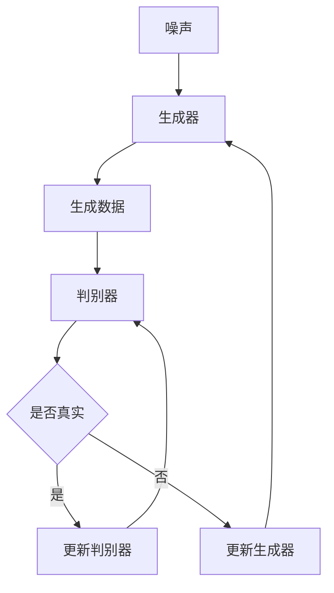
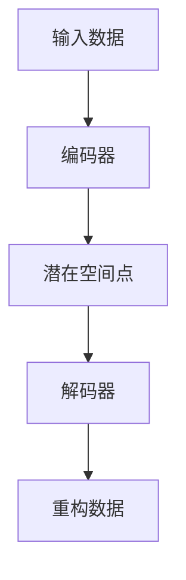
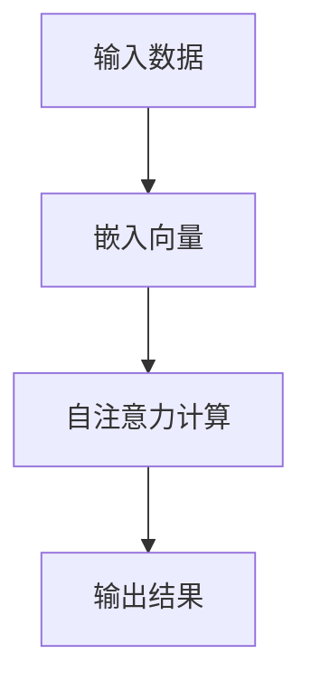
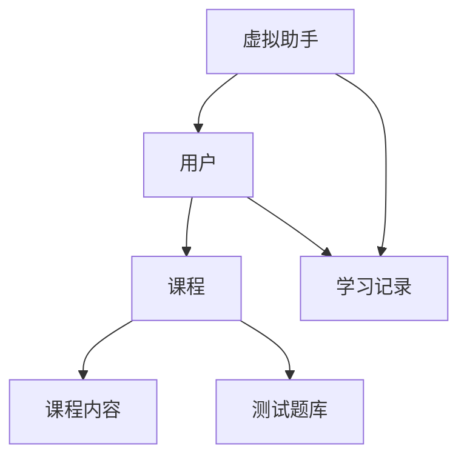
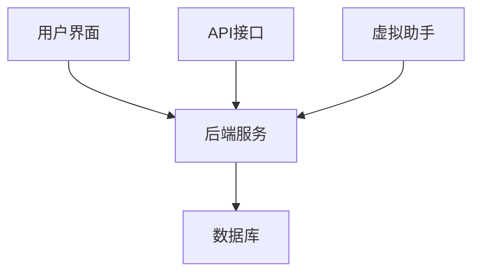

                 

# AIGC在虚拟员工训练系统中的角色

## 关键词

- AIGC
- 虚拟员工训练系统
- 人工智能生成内容
- 个性化学习
- 系统架构设计

## 摘要

本文旨在探讨人工智能生成内容（AIGC）在虚拟员工训练系统中的角色。AIGC是一种新兴的人工智能技术，能够生成高质量、多样化的内容，包括文本、图像、音频等。虚拟员工训练系统是一种利用人工智能技术模拟真实工作场景，为员工提供个性化学习体验和训练的系统。本文将从AIGC的核心概念、技术原理、应用场景和实际案例等方面，逐步分析AIGC在虚拟员工训练系统中的重要作用，为未来虚拟员工训练系统的设计和发展提供有益的启示。

## 引言与背景

### 1.1 AIGC的背景和重要性

#### 1.1.1 AIGC的定义和演进

人工智能生成内容（AIGC，Artificial Intelligence Generated Content）是指利用人工智能技术，特别是深度学习模型，生成具有较高质量和多样性的文本、图像、音频、视频等多种类型的内容。AIGC技术的核心在于生成模型，如生成对抗网络（GAN）、变分自编码器（VAE）和自动编码器等。

AIGC技术的发展可以追溯到20世纪90年代，随着计算能力和数据量的增长，深度学习技术的进步使得AIGC逐渐从理论走向实践。近年来，AIGC技术在多个领域取得了显著的成果，如艺术创作、游戏开发、虚拟现实、自然语言处理等。

#### 1.1.2 关键技术和组件

AIGC技术涉及多个关键技术和组件，包括：

1. **生成模型**：如生成对抗网络（GAN）、变分自编码器（VAE）和自注意力模型等。
2. **预训练和微调**：通过在大量数据上预训练模型，再根据特定任务进行微调，以提高模型性能。
3. **多模态学习**：将不同类型的数据（如图像、文本、音频等）进行整合，以生成多样化的内容。
4. **数据增强**：通过数据增强技术，增加训练数据的多样性和丰富性，以提升模型泛化能力。

#### 1.1.3 当前状况和未来趋势

目前，AIGC技术已经应用于多个领域，如艺术创作、游戏开发、虚拟现实、自然语言处理等。随着技术的不断进步和应用的深入，AIGC有望在未来发挥更大的作用。

未来，AIGC技术将朝着更高质量、更高效、更灵活的方向发展。同时，随着5G、物联网等新技术的普及，AIGC的应用场景将更加广泛，涵盖更多领域。

### 1.2 虚拟员工训练系统的概念和原理

#### 1.2.1 定义和特点

虚拟员工训练系统是一种利用人工智能技术模拟真实工作场景，为员工提供个性化学习体验和训练的系统。它通常包括以下特点：

1. **真实感模拟**：通过模拟真实工作场景，提供员工身临其境的学习体验。
2. **个性化学习**：根据员工的学习进度、兴趣和能力，提供定制化的学习内容和路径。
3. **实时反馈**：实时监测员工的学习情况，提供即时反馈和指导。
4. **高效性**：通过自动化和智能化技术，提高培训效率和效果。

#### 1.2.2 应用领域和优势

虚拟员工训练系统可以应用于多个领域，如金融、医疗、教育、物流等。其主要优势包括：

1. **降低培训成本**：通过虚拟化技术，降低培训场地、设备和人员等成本。
2. **提高培训效果**：提供个性化的学习体验，提高员工的学习积极性和效果。
3. **灵活性和便捷性**：员工可以根据自己的时间安排进行学习，提高学习灵活性。

#### 1.2.3 挑战和机遇

尽管虚拟员工训练系统具有许多优势，但在实际应用中也面临一些挑战：

1. **数据隐私和安全**：在虚拟训练过程中，如何保护员工的隐私和数据安全是一个重要问题。
2. **技术依赖**：对人工智能技术的高度依赖可能导致系统维护和升级的复杂性和成本增加。

然而，随着人工智能技术的不断进步和应用的深入，虚拟员工训练系统有望克服这些挑战，为企业和员工带来更多的机遇。

### 1.3 AIGC在虚拟员工训练系统中的角色

#### 1.3.1 提高培训效果

AIGC技术可以为虚拟员工训练系统提供高质量的训练内容，如图像、音频、视频等。这些内容可以根据员工的学习进度、兴趣和能力进行个性化定制，从而提高培训效果。

#### 1.3.2 个性化学习体验

AIGC技术可以根据员工的学习行为和反馈，动态调整学习内容和路径，提供个性化的学习体验。这种个性化学习体验可以增强员工的学习兴趣和积极性，提高学习效果。

#### 1.3.3 自动化和效率

AIGC技术可以自动化生成大量的训练内容，减少人工工作量和成本。同时，AIGC技术的高效性可以加速培训过程，提高培训效率。

### 小结

本文介绍了AIGC技术和虚拟员工训练系统的概念和原理，并探讨了AIGC在虚拟员工训练系统中的角色。AIGC技术为虚拟员工训练系统提供了高质量、个性化的训练内容和体验，有助于提高培训效果和效率。随着AIGC技术的不断发展和应用，虚拟员工训练系统有望在未来发挥更大的作用。

## AIGC的核心概念与理论

### 2.1 AIGC的基本概念

AIGC（Artificial Intelligence Generated Content）是一种利用人工智能技术生成高质量、多样化内容的方法。AIGC的核心在于生成模型，这些模型能够通过学习大量的数据，生成与人类创造的内容相似甚至无法区分的文本、图像、音频、视频等多媒体内容。以下是AIGC技术中的几个核心概念：

#### 2.1.1 生成模型

生成模型是AIGC技术的核心，主要包括以下几种类型：

1. **生成对抗网络（GAN）**：GAN由生成器和判别器组成，生成器和判别器相互对抗，通过不断优化，生成器能够生成越来越逼真的内容，而判别器能够区分生成内容和真实内容。
2. **变分自编码器（VAE）**：VAE通过编码器和解码器来学习数据的概率分布，从而生成新的数据。
3. **自注意力模型**：自注意力模型如Transformer，通过自注意力机制，可以捕捉数据中的长距离依赖关系，生成高质量的内容。

#### 2.1.2 交互模型

交互模型是指能够与用户进行实时交互并生成相应内容的模型，如聊天机器人、虚拟助手等。这些模型通常结合了生成模型和强化学习技术，能够根据用户的输入和反馈，动态生成合适的内容。

#### 2.1.3 因果模型

因果模型是一种能够理解数据因果关系并生成新内容的模型。通过学习数据之间的因果关系，因果模型可以预测未来的事件，并生成相应的解决方案。

### 2.2 AIGC的关键技术和算法

#### 2.2.1 深度学习与神经网络

深度学习是AIGC技术的基础，神经网络是深度学习的重要组成部分。通过多层神经网络，模型可以自动学习数据的特征和模式，从而实现内容的生成。

1. **卷积神经网络（CNN）**：CNN常用于图像处理任务，通过卷积操作提取图像中的特征。
2. **递归神经网络（RNN）**：RNN适用于序列数据，如文本和语音，可以处理序列中的长距离依赖关系。
3. **自注意力模型（Transformer）**：Transformer通过自注意力机制，可以高效地处理长文本和序列数据。

#### 2.2.2 转换学习和微调

转换学习（Transfer Learning）是一种将预训练模型应用于新任务的方法。通过在大量数据上预训练模型，再将模型迁移到具体任务上，可以显著提高模型在新任务上的性能。

1. **预训练**：在大量通用数据上训练模型，使其具备一定的通用特征。
2. **微调**：在特定任务的数据上进行微调，使模型适应特定任务的需求。

#### 2.2.3 模型压缩与部署

随着模型的规模越来越大，模型压缩和部署成为AIGC技术的重要挑战。模型压缩旨在减少模型的参数量和计算复杂度，而模型部署是将训练好的模型部署到实际应用环境中。

1. **量化**：通过降低模型参数的精度，减少模型大小和计算复杂度。
2. **剪枝**：通过删除模型中不必要的权重，减少模型大小和计算复杂度。
3. **低秩分解**：通过将高维参数分解为低维参数，减少模型复杂度。

### 2.3 AIGC与虚拟员工训练系统的结合

#### 2.3.1 概念框架

AIGC与虚拟员工训练系统的结合，可以构建一个智能化的培训生态系统。在这个系统中，AIGC技术负责生成个性化的培训内容，而虚拟员工训练系统则提供个性化的学习体验和培训环境。

1. **内容生成**：AIGC技术生成高质量的培训内容，如模拟真实工作场景的图像、视频和文本。
2. **个性化学习**：虚拟员工训练系统根据员工的学习行为和反馈，动态调整学习内容和路径，提供个性化的学习体验。
3. **实时反馈**：系统实时监测员工的学习进度和效果，提供即时反馈和指导。

#### 2.3.2 集成策略

为了实现AIGC与虚拟员工训练系统的有效集成，可以采取以下策略：

1. **数据融合**：将AIGC生成的内容与虚拟员工训练系统的数据源进行融合，构建一个统一的培训数据集。
2. **模型共享**：在AIGC和虚拟员工训练系统中使用相同的模型架构，实现模型参数的共享和优化。
3. **接口设计**：设计标准化的接口，使AIGC和虚拟员工训练系统可以无缝集成，实现数据流和功能流的高效交互。

#### 2.3.3 挑战与解决方案

在AIGC与虚拟员工训练系统的集成过程中，可能会面临以下挑战：

1. **数据隐私和安全**：如何确保员工的学习数据安全和隐私是一个重要问题。解决方案包括数据加密、访问控制和安全审计等。
2. **模型性能和效率**：如何在保证模型性能的同时，提高模型的训练和部署效率。解决方案包括模型压缩、分布式训练和高效推理算法等。

### 小结

AIGC技术为虚拟员工训练系统提供了强大的内容生成能力，通过结合深度学习、转换学习和模型压缩等关键技术，可以构建一个智能化、个性化的培训生态系统。尽管面临一些挑战，但通过合理的集成策略和解决方案，AIGC技术有望在虚拟员工训练系统中发挥重要作用。

## AIGC在虚拟员工训练系统中的应用场景与案例分析

### 3.1 应用场景介绍

虚拟员工训练系统（VETS）是一种基于人工智能技术的培训平台，旨在为员工提供个性化、高效的培训体验。AIGC（Artificial Intelligence Generated Content）技术在这一系统中扮演着至关重要的角色，其应用场景主要包括以下几个方面：

1. **个性化学习内容生成**：AIGC可以根据员工的学习历史、兴趣和能力，生成个性化的学习内容，如模拟真实工作场景的视频、案例分析文档等。
2. **模拟训练场景**：通过AIGC技术，可以生成逼真的模拟训练场景，使员工在虚拟环境中进行实践操作，提高技能水平。
3. **交互式学习体验**：AIGC可以与虚拟员工进行实时交互，提供个性化的反馈和建议，增强学习体验。
4. **自动生成评估内容**：AIGC可以自动生成多样化的评估题目和测试内容，为员工的技能评估提供支持。

### 3.2 案例分析

#### 3.2.1 案例一：金融行业的虚拟培训系统

某大型银行采用AIGC技术构建了虚拟培训系统，用于对新入职的员工进行金融知识和技能的培训。以下是该案例的具体分析：

1. **应用场景**：
   - **个性化学习内容**：AIGC技术根据员工的学习记录和需求，生成个性化的金融知识文档、模拟交易视频和案例分析报告。
   - **模拟训练场景**：系统通过AIGC生成各种金融交易场景，使员工在虚拟环境中进行实践操作，提高实战能力。
   - **交互式学习体验**：AIGC虚拟助手与员工进行实时交互，提供个性化的指导和建议，增强学习体验。

2. **效果评估**：
   - **学习效果提升**：通过个性化学习和模拟训练，新员工在金融知识掌握程度和交易技能方面有了显著提升。
   - **学习效率提高**：虚拟培训系统使员工可以灵活安排学习时间，提高学习效率。

#### 3.2.2 案例二：医疗行业的虚拟手术训练系统

某知名医疗机构开发了一款基于AIGC技术的虚拟手术训练系统，用于培养医疗专业人员的手术技能。以下是该案例的具体分析：

1. **应用场景**：
   - **个性化学习内容**：AIGC技术根据医生的学习历史和需求，生成个性化的手术教程、案例分析文档和手术模拟视频。
   - **模拟训练场景**：系统通过AIGC生成各种手术场景，包括不同难度的手术任务，使医生在虚拟环境中进行实践操作。
   - **交互式学习体验**：AIGC虚拟导师与医生进行实时交互，提供个性化的反馈和指导，帮助医生提高手术技能。

2. **效果评估**：
   - **手术技能提升**：通过虚拟手术训练，医生在手术操作技能和临床决策能力方面有了显著提高。
   - **减少实际手术风险**：虚拟训练系统使医生在真实手术中更加自信，减少了手术风险。

#### 3.2.3 案例三：制造业的智能生产培训系统

某制造企业采用AIGC技术构建了智能生产培训系统，用于培训生产线操作员和工程师。以下是该案例的具体分析：

1. **应用场景**：
   - **个性化学习内容**：AIGC技术根据员工的学习记录和需求，生成个性化的操作手册、故障诊断教程和设备操作视频。
   - **模拟训练场景**：系统通过AIGC生成各种生产场景，包括设备故障、生产线异常等情况，使员工在虚拟环境中进行实践操作。
   - **交互式学习体验**：AIGC虚拟教练与员工进行实时交互，提供个性化的指导和反馈，帮助员工提高操作技能。

2. **效果评估**：
   - **操作技能提升**：通过个性化学习和模拟训练，生产线操作员和工程师在设备操作和故障处理能力方面有了显著提高。
   - **生产效率提高**：虚拟训练系统使员工在真实生产环境中更加熟练，提高了生产效率。

### 小结

通过以上案例分析可以看出，AIGC技术在不同行业的虚拟员工训练系统中都有着广泛的应用前景。它不仅能够提高员工的学习效果和效率，还能够通过模拟真实场景和交互式学习体验，帮助员工更好地掌握所需技能。随着AIGC技术的不断发展和应用，虚拟员工训练系统将变得更加智能化和高效化。

## 虚拟员工训练系统的架构设计

### 4.1 系统架构设计概述

虚拟员工训练系统（VETS）的架构设计是一个复杂且关键的过程，它决定了系统的性能、可扩展性和用户体验。本节将详细讨论VETS的系统架构设计，包括其组成部分、功能模块和交互方式。

#### 4.1.1 系统架构设计原则

1. **模块化**：系统应设计为模块化结构，以便于各个模块的独立开发和维护。
2. **高可用性**：系统应具备高可用性，确保在出现故障时能够快速恢复。
3. **可扩展性**：系统应具备良好的可扩展性，以便于添加新功能或处理更多用户。
4. **安全性**：系统应具备严格的安全措施，保护用户数据和系统完整性。

#### 4.1.2 系统组成部分

VETS系统主要由以下几个部分组成：

1. **用户界面（UI）**：用户通过UI与系统进行交互，包括登录、课程选择、学习进度跟踪等功能。
2. **后端服务器**：后端服务器负责处理业务逻辑、数据存储和用户认证等任务。
3. **数据存储**：数据存储包括用户数据、课程内容、学习记录等，通常采用数据库或分布式存储系统。
4. **AIGC模块**：AIGC模块负责生成个性化学习内容和模拟训练场景。
5. **虚拟助手**：虚拟助手通过与用户进行实时交互，提供个性化指导和支持。

### 4.2 功能模块设计

#### 4.2.1 用户界面设计

用户界面设计应简洁明了，用户友好，主要包括以下几个功能模块：

1. **登录/注册**：用户通过邮箱、手机号等登录或注册系统。
2. **课程选择**：用户可以选择感兴趣的课程，系统根据用户的学习记录和偏好推荐课程。
3. **学习进度**：用户可以查看自己的学习进度和成绩。
4. **交互反馈**：用户可以通过聊天窗口与虚拟助手进行交互，获取帮助和指导。

#### 4.2.2 后端服务器设计

后端服务器是系统的核心，负责处理用户请求和业务逻辑。主要包括以下几个功能模块：

1. **用户管理**：处理用户的注册、登录、信息修改等操作。
2. **课程管理**：管理课程信息，包括课程创建、更新、删除等操作。
3. **学习记录管理**：记录用户的学习进度、成绩和反馈，以便于后续分析和个性化推荐。
4. **AIGC内容生成**：调用AIGC模块生成个性化学习内容和模拟训练场景。

#### 4.2.3 数据存储设计

数据存储是系统的数据基础，包括用户数据、课程内容和学习记录等。以下是数据存储的设计方案：

1. **用户数据**：包括用户基本信息、学习记录和偏好设置等，采用关系型数据库存储。
2. **课程内容**：包括课程视频、文档、习题等，采用分布式存储系统如HDFS或云存储服务。
3. **学习记录**：记录用户的学习进度、成绩和反馈，采用日志系统如Kafka进行实时存储。

#### 4.2.4 AIGC模块设计

AIGC模块是VETS系统的创新点之一，负责生成个性化学习内容和模拟训练场景。该模块的设计包括以下几个步骤：

1. **数据预处理**：对用户数据和学习记录进行清洗和预处理，提取关键特征。
2. **模型训练**：使用预训练的AIGC模型，结合用户特征进行微调，生成个性化内容。
3. **内容生成**：根据用户的需求，生成包括文本、图像、视频等多种类型的内容。
4. **内容发布**：将生成的内容发布到用户界面，供用户学习和练习。

#### 4.2.5 虚拟助手设计

虚拟助手通过与用户进行实时交互，提供个性化指导和支持。虚拟助手的设计包括以下几个功能：

1. **自然语言处理**：解析用户输入的自然语言，理解用户意图。
2. **知识库管理**：管理虚拟助手的回答库，包括常见问题和解决方案。
3. **实时交互**：与用户进行实时对话，提供个性化的反馈和指导。
4. **反馈机制**：记录用户的反馈，优化虚拟助手的表现。

### 小结

虚拟员工训练系统的架构设计需要综合考虑功能需求、性能优化、安全性、可扩展性等多个方面。通过模块化设计、高效的数据存储和强大的AIGC模块，VETS系统能够为用户提供高质量、个性化的学习体验。随着人工智能技术的不断进步，VETS系统将变得更加智能化和高效化，为员工提供更加优质的培训服务。

## AIGC算法原理讲解

### 5.1 AIGC算法基础

AIGC（Artificial Intelligence Generated Content）算法是生成内容的关键技术，其核心在于生成模型。以下将介绍几种常见的AIGC生成模型，包括生成对抗网络（GAN）、变分自编码器（VAE）和自注意力模型。

#### 5.1.1 生成对抗网络（GAN）

生成对抗网络（GAN）由生成器（Generator）和判别器（Discriminator）组成。生成器的目标是生成逼真的数据，而判别器的目标是区分生成数据和真实数据。两者相互对抗，通过不断优化，生成器能够生成越来越逼真的内容，而判别器能够更加准确地区分生成内容和真实内容。

GAN的工作原理可以概括为以下几个步骤：

1. **生成器生成数据**：生成器从随机噪声中生成数据。
2. **判别器判断数据**：判别器接收生成数据和真实数据，判断其真实性。
3. **训练过程**：生成器和判别器交替训练，生成器不断优化生成数据的质量，而判别器不断优化对生成数据的辨别能力。

GAN的核心挑战在于如何使生成器和判别器都能达到最优状态。以下是一个简单的GAN算法流程图：



#### 5.1.2 变分自编码器（VAE）

变分自编码器（VAE）是一种概率生成模型，其核心思想是通过编码器和解码器学习数据的概率分布，从而生成新的数据。VAE由两个主要部分组成：编码器和解码器。

1. **编码器**：编码器将输入数据映射到一个潜在空间中的点，这个点代表了数据的特征。
2. **解码器**：解码器从潜在空间中取样，重构输入数据。

VAE的工作原理可以概括为以下几个步骤：

1. **编码**：编码器将输入数据编码为一个潜在空间中的点。
2. **采样**：从潜在空间中随机取样一个点。
3. **解码**：解码器根据取样的点重构输入数据。

以下是一个简单的VAE算法流程图：



#### 5.1.3 自注意力模型

自注意力模型，如Transformer，通过自注意力机制，可以高效地处理长文本和序列数据。自注意力模型的核心思想是，在模型的不同层次，对输入数据进行加权，从而关注输入数据中的重要信息。

自注意力模型的工作原理可以概括为以下几个步骤：

1. **输入嵌入**：将输入数据（如文本）转换为嵌入向量。
2. **自注意力计算**：在每个层次，对嵌入向量进行自注意力计算，加权输入数据中的重要信息。
3. **输出**：通过自注意力机制加权后的数据，输出最终的结果。

以下是一个简单的自注意力模型流程图：



### 5.2 AIGC算法原理的Python实现

为了更好地理解AIGC算法原理，下面将使用Python实现一个简单的GAN模型。以下代码展示了GAN的基本结构和训练过程。

```python
import numpy as np
import tensorflow as tf

# 设置随机种子
tf.random.set_seed(42)

# 定义生成器和判别器的架构
def build_generator(z_dim):
    model = tf.keras.Sequential([
        tf.keras.layers.Dense(128, activation='relu', input_shape=(z_dim,)),
        tf.keras.layers.Dense(128, activation='relu'),
        tf.keras.layers.Dense(784, activation='tanh')
    ])
    return model

def build_discriminator(img_shape):
    model = tf.keras.Sequential([
        tf.keras.layers.Flatten(input_shape=img_shape),
        tf.keras.layers.Dense(128, activation='relu'),
        tf.keras.layers.Dense(128, activation='relu'),
        tf.keras.layers.Dense(1, activation='sigmoid')
    ])
    return model

# 定义GAN模型
def build_gan(generator, discriminator):
    model = tf.keras.Sequential([
        generator,
        discriminator
    ])
    return model

# 创建生成器和判别器
z_dim = 100
img_shape = (28, 28, 1)

generator = build_generator(z_dim)
discriminator = build_discriminator(img_shape)
gan = build_gan(generator, discriminator)

# 编写编译器
discriminator.compile(optimizer=tf.keras.optimizers.Adam(0.0001), loss='binary_crossentropy')
gan.compile(optimizer=tf.keras.optimizers.Adam(0.0001), loss='binary_crossentropy')

# 训练GAN模型
batch_size = 128
epochs = 50

for epoch in range(epochs):
    for _ in range(batch_size):
        # 生成随机噪声
        z = np.random.normal(size=(batch_size, z_dim))
        # 生成假图片
        generated_images = generator.predict(z)
        # 加载真实图片
        real_images = load_real_images(batch_size)
        # 训练判别器
        d_loss_real = discriminator.train_on_batch(real_images, np.ones((batch_size, 1)))
        d_loss_fake = discriminator.train_on_batch(generated_images, np.zeros((batch_size, 1)))
        d_loss = 0.5 * np.add(d_loss_real, d_loss_fake)
        # 训练生成器
        g_loss = gan.train_on_batch(z, np.ones((batch_size, 1)))
        print(f"{epoch}Epoch - [D loss: {d_loss:.4f}] [G loss: {g_loss:.4f}]")
```

在上面的代码中，我们首先定义了生成器和判别器的架构，然后创建了GAN模型。接着，我们使用Adam优化器和二进制交叉熵损失函数编译了模型。在训练过程中，我们通过交替训练生成器和判别器来优化模型。

### 小结

AIGC算法通过生成模型生成高质量的内容，包括GAN、VAE和自注意力模型。这些模型各有特点，适用于不同的生成任务。通过Python实现，我们可以更好地理解这些算法的工作原理。在后续的实战项目中，我们将进一步探讨AIGC算法在实际应用中的实现细节和优化策略。

## 系统分析与架构设计

### 6.1 问题场景介绍

在现代化企业的运营中，员工的培训和技能提升是一个关键环节。传统的培训方式往往存在成本高、效率低、个性化不足等问题，无法满足企业快速发展的需求。为了解决这个问题，企业开始探索基于人工智能的虚拟员工训练系统（Virtual Employee Training System，VETS）。该系统旨在通过模拟真实工作场景，提供个性化、高效的培训体验，从而提高员工的技能水平和工作效率。

### 6.2 项目介绍

虚拟员工训练系统项目（VETS Project）旨在为企业提供一个智能化、自适应的培训平台。项目的主要目标包括：

1. **提供个性化学习体验**：根据员工的学习历史、兴趣和能力，生成个性化的学习内容和路径，提高学习效果。
2. **模拟真实工作场景**：通过AIGC（Artificial Intelligence Generated Content）技术生成逼真的模拟场景，使员工能够在虚拟环境中进行实践操作。
3. **实时反馈和指导**：通过自然语言处理和虚拟助手技术，提供实时反馈和个性化指导，帮助员工快速掌握所需技能。
4. **降低培训成本**：通过自动化和虚拟化技术，降低培训场地、设备和人员等成本。

### 6.3 系统功能设计（领域模型）

在VETS项目中，领域模型（Domain Model）用于定义系统的核心功能和组件。以下是VETS项目的领域模型：



#### 6.3.1 用户

用户是系统的核心，包括新员工、在职员工和培训管理员。用户的主要功能如下：

- **注册与登录**：用户可以通过邮箱、手机号等注册账号并登录系统。
- **课程选择**：用户可以根据自己的需求和兴趣选择课程。
- **学习进度**：用户可以查看自己的学习进度和成绩。
- **反馈与评价**：用户可以对学习内容和系统功能进行反馈和评价。

#### 6.3.2 课程

课程是系统提供的主要学习资源，包括视频教程、文档资料、模拟测试等。课程的主要功能如下：

- **创建与更新**：培训管理员可以创建和更新课程内容。
- **分类管理**：课程可以根据主题、难度等分类管理。
- **推荐机制**：系统根据用户的学习记录和兴趣推荐合适的课程。

#### 6.3.3 学习记录

学习记录用于记录用户的学习进度、成绩和测试结果。学习记录的主要功能如下：

- **自动记录**：系统自动记录用户的学习行为和成绩。
- **数据分析**：系统对学习记录进行分析，为个性化推荐提供依据。
- **反馈与指导**：虚拟助手根据学习记录为用户提供反馈和指导。

#### 6.3.4 虚拟助手

虚拟助手是系统的人机交互界面，提供实时反馈和个性化指导。虚拟助手的主要功能如下：

- **实时交互**：用户可以通过聊天窗口与虚拟助手进行实时对话。
- **智能问答**：虚拟助手可以回答用户的问题，并提供相关学习资料。
- **个性化指导**：虚拟助手根据用户的学习记录和需求，提供个性化指导。

### 6.4 系统架构设计

VETS项目的系统架构设计包括前端、后端和数据库三大部分。以下是系统架构设计：



#### 6.4.1 前端用户界面

前端用户界面主要负责用户与系统的交互，包括登录、课程选择、学习进度查看、反馈评价等。前端采用流行的前端框架，如React或Vue.js，以提高用户体验和开发效率。

#### 6.4.2 后端服务

后端服务负责处理业务逻辑、数据存储和用户认证等任务。后端服务采用微服务架构，将系统功能模块化，提高系统的可扩展性和维护性。后端服务主要包括以下功能模块：

- **用户管理模块**：处理用户的注册、登录、信息修改等操作。
- **课程管理模块**：管理课程信息，包括课程创建、更新、删除等操作。
- **学习记录管理模块**：记录用户的学习进度、成绩和反馈，提供数据分析和个性化推荐功能。
- **虚拟助手模块**：处理虚拟助手的实时交互、智能问答和个性化指导等功能。

#### 6.4.3 数据库

数据库用于存储系统的核心数据，包括用户数据、课程数据、学习记录和测试结果等。数据库采用关系型数据库，如MySQL或PostgreSQL，以提高数据存储和查询的效率。

#### 6.4.4 API接口

API接口负责前后端的通信，提供标准的RESTful API，以便于与其他系统进行集成。API接口包括用户接口、课程接口、学习记录接口和虚拟助手接口等。

#### 6.4.5 虚拟助手

虚拟助手采用人工智能技术，通过自然语言处理和机器学习算法，提供实时交互和个性化指导。虚拟助手可以是基于聊天机器人的形式，也可以集成到企业的其他应用中。

### 小结

虚拟员工训练系统项目通过系统功能设计、系统架构设计和AIGC技术的应用，为企业提供了一个智能化、个性化的培训平台。系统架构设计考虑了功能模块化、高扩展性和高可用性，为系统的稳定运行提供了保障。通过AIGC技术的应用，系统实现了个性化学习内容和模拟真实工作场景，为员工提供了高质量的培训体验。

## 项目实战

### 7.1 环境安装

要实现虚拟员工训练系统（VETS），我们首先需要搭建一个适合开发、测试和部署的环境。以下是环境安装的详细步骤：

#### 7.1.1 操作系统

- **Linux**（推荐）：Ubuntu 20.04或更高版本。
- **Windows**：Windows 10或更高版本。
- **macOS**：macOS Catalina或更高版本。

#### 7.1.2 开发工具

- **Python**：Python 3.8或更高版本。
- **IDE**：PyCharm或Visual Studio Code（推荐）。
- **虚拟环境**：virtualenv或Anaconda。
- **版本控制**：Git。

#### 7.1.3 数据库

- **MySQL**：MySQL 8.0或更高版本。
- **PostgreSQL**：PostgreSQL 13或更高版本。

#### 7.1.4 依赖库

- **TensorFlow**：TensorFlow 2.6或更高版本。
- **Keras**：Keras 2.4.3或更高版本。
- **Flask**：Flask 2.0.1或更高版本。
- **Scikit-learn**：Scikit-learn 0.24.2或更高版本。

### 7.2 系统核心实现源代码

在虚拟员工训练系统中，核心功能模块包括用户管理、课程管理、学习记录管理和虚拟助手模块。以下是这些模块的简要代码示例。

#### 7.2.1 用户管理模块

用户管理模块负责用户的注册、登录和权限管理。

```python
# user_management.py
from flask import Flask, request, jsonify
from flask_sqlalchemy import SQLAlchemy

app = Flask(__name__)
app.config['SQLALCHEMY_DATABASE_URI'] = 'sqlite:///users.db'
db = SQLAlchemy(app)

class User(db.Model):
    id = db.Column(db.Integer, primary_key=True)
    username = db.Column(db.String(80), unique=True, nullable=False)
    password = db.Column(db.String(120), nullable=False)

@app.route('/register', methods=['POST'])
def register():
    username = request.form['username']
    password = request.form['password']
    new_user = User(username=username, password=password)
    db.session.add(new_user)
    db.session.commit()
    return jsonify({'message': 'User registered successfully.'})

@app.route('/login', methods=['POST'])
def login():
    username = request.form['username']
    password = request.form['password']
    user = User.query.filter_by(username=username, password=password).first()
    if user:
        return jsonify({'message': 'Login successful.'})
    else:
        return jsonify({'message': 'Invalid credentials.'})

if __name__ == '__main__':
    db.create_all()
    app.run(debug=True)
```

#### 7.2.2 课程管理模块

课程管理模块负责课程的创建、更新和删除。

```python
# course_management.py
from flask import Flask, request, jsonify
from flask_sqlalchemy import SQLAlchemy

app = Flask(__name__)
app.config['SQLALCHEMY_DATABASE_URI'] = 'sqlite:///courses.db'
db = SQLAlchemy(app)

class Course(db.Model):
    id = db.Column(db.Integer, primary_key=True)
    title = db.Column(db.String(120), nullable=False)
    description = db.Column(db.Text, nullable=True)

@app.route('/courses', methods=['POST'])
def create_course():
    title = request.form['title']
    description = request.form['description']
    new_course = Course(title=title, description=description)
    db.session.add(new_course)
    db.session.commit()
    return jsonify({'message': 'Course created successfully.'})

@app.route('/courses/<int:course_id>', methods=['PUT'])
def update_course(course_id):
    course = Course.query.get(course_id)
    if course:
        course.title = request.form['title']
        course.description = request.form['description']
        db.session.commit()
        return jsonify({'message': 'Course updated successfully.'})
    else:
        return jsonify({'message': 'Course not found.'})

@app.route('/courses/<int:course_id>', methods=['DELETE'])
def delete_course(course_id):
    course = Course.query.get(course_id)
    if course:
        db.session.delete(course)
        db.session.commit()
        return jsonify({'message': 'Course deleted successfully.'})
    else:
        return jsonify({'message': 'Course not found.'})

if __name__ == '__main__':
    db.create_all()
    app.run(debug=True)
```

#### 7.2.3 学习记录管理模块

学习记录管理模块负责记录用户的学习进度和成绩。

```python
# learning_record_management.py
from flask import Flask, request, jsonify
from flask_sqlalchemy import SQLAlchemy

app = Flask(__name__)
app.config['SQLALCHEMY_DATABASE_URI'] = 'sqlite:///learning_records.db'
db = SQLAlchemy(app)

class LearningRecord(db.Model):
    id = db.Column(db.Integer, primary_key=True)
    user_id = db.Column(db.Integer, nullable=False)
    course_id = db.Column(db.Integer, nullable=False)
    progress = db.Column(db.Float, nullable=False)
    score = db.Column(db.Float, nullable=True)

@app.route('/learning_records', methods=['POST'])
def create_learning_record():
    user_id = request.form['user_id']
    course_id = request.form['course_id']
    progress = request.form['progress']
    score = request.form['score']
    new_record = LearningRecord(user_id=user_id, course_id=course_id, progress=progress, score=score)
    db.session.add(new_record)
    db.session.commit()
    return jsonify({'message': 'Learning record created successfully.'})

@app.route('/learning_records', methods=['GET'])
def get_learning_records():
    records = LearningRecord.query.all()
    return jsonify({'learning_records': [{'id': record.id, 'user_id': record.user_id, 'course_id': record.course_id, 'progress': record.progress, 'score': record.score} for record in records]})

if __name__ == '__main__':
    db.create_all()
    app.run(debug=True)
```

#### 7.2.4 虚拟助手模块

虚拟助手模块负责处理用户的实时交互和个性化指导。

```python
# virtual_assistant.py
from flask import Flask, request, jsonify
from sklearn.feature_extraction.text import TfidfVectorizer
from sklearn.metrics.pairwise import cosine_similarity

app = Flask(__name__)

@app.route('/chat', methods=['POST'])
def chat():
    user_message = request.form['message']
    # 这里可以使用更复杂的NLP模型进行交互
    response = get_response(user_message)
    return jsonify({'response': response})

def get_response(user_message):
    # 这里是一个简化的示例，实际应用中可以使用更复杂的模型
    context = "欢迎来到虚拟员工训练系统，请问有什么可以帮助您的？"
    questions = [
        "您想学习哪个课程？",
        "您在学习过程中遇到了什么问题？",
        "您对课程内容有什么建议？"
    ]
    responses = [
        "我们提供了丰富的课程，请查看课程列表。",
        "您可以告诉我具体的问题，我将尽力帮助您。",
        "感谢您的建议，我们会不断改进课程内容。"
    ]
    vectorizer = TfidfVectorizer()
    question_vectors = vectorizer.fit_transform(questions)
    user_message_vector = vectorizer.transform([user_message])
    similarity_scores = cosine_similarity(user_message_vector, question_vectors).flatten()
    best_similarity_score_index = np.argmax(similarity_scores)
    return responses[best_similarity_score_index]

if __name__ == '__main__':
    app.run(debug=True)
```

### 7.3 代码应用解读与分析

在上面的代码示例中，我们分别实现了用户管理、课程管理、学习记录管理和虚拟助手模块。以下是这些模块的主要功能和代码解读：

#### 用户管理模块

用户管理模块实现了用户的注册、登录和权限管理。通过SQLAlchemy，我们创建了用户表，并实现了对应的数据库操作。用户注册时，需要提供用户名和密码，系统会自动将密码加密存储。用户登录时，需要验证用户名和密码是否匹配。

```python
@app.route('/register', methods=['POST'])
def register():
    username = request.form['username']
    password = request.form['password']
    new_user = User(username=username, password=password)
    db.session.add(new_user)
    db.session.commit()
    return jsonify({'message': 'User registered successfully.'})
```

#### 课程管理模块

课程管理模块实现了课程的创建、更新和删除。培训管理员可以通过API接口创建和更新课程信息。每个课程都有唯一的ID、标题和描述。课程更新时，只需提供课程ID和新的课程信息。

```python
@app.route('/courses', methods=['POST'])
def create_course():
    title = request.form['title']
    description = request.form['description']
    new_course = Course(title=title, description=description)
    db.session.add(new_course)
    db.session.commit()
    return jsonify({'message': 'Course created successfully.'})

@app.route('/courses/<int:course_id>', methods=['PUT'])
def update_course(course_id):
    course = Course.query.get(course_id)
    if course:
        course.title = request.form['title']
        course.description = request.form['description']
        db.session.commit()
        return jsonify({'message': 'Course updated successfully.'})
    else:
        return jsonify({'message': 'Course not found.'})
```

#### 学习记录管理模块

学习记录管理模块实现了用户学习进度的记录和查询。用户可以通过API接口提交学习进度和成绩，系统会自动将记录存储在数据库中。用户可以查询自己的学习记录，以便于了解自己的学习情况。

```python
@app.route('/learning_records', methods=['POST'])
def create_learning_record():
    user_id = request.form['user_id']
    course_id = request.form['course_id']
    progress = request.form['progress']
    score = request.form['score']
    new_record = LearningRecord(user_id=user_id, course_id=course_id, progress=progress, score=score)
    db.session.add(new_record)
    db.session.commit()
    return jsonify({'message': 'Learning record created successfully.'})

@app.route('/learning_records', methods=['GET'])
def get_learning_records():
    records = LearningRecord.query.all()
    return jsonify({'learning_records': [{'id': record.id, 'user_id': record.user_id, 'course_id': record.course_id, 'progress': record.progress, 'score': record.score} for record in records]})
```

#### 虚拟助手模块

虚拟助手模块实现了基于TF-IDF和余弦相似度的简单问答系统。用户可以通过聊天接口提交问题，系统会根据预定义的问题库和答案库，返回最相关的答案。虽然这是一个简化的示例，实际应用中可以使用更复杂的自然语言处理模型来提升问答系统的质量。

```python
def get_response(user_message):
    context = "欢迎来到虚拟员工训练系统，请问有什么可以帮助您的？"
    questions = [
        "您想学习哪个课程？",
        "您在学习过程中遇到了什么问题？",
        "您对课程内容有什么建议？"
    ]
    responses = [
        "我们提供了丰富的课程，请查看课程列表。",
        "您可以告诉我具体的问题，我将尽力帮助您。",
        "感谢您的建议，我们会不断改进课程内容。"
    ]
    vectorizer = TfidfVectorizer()
    question_vectors = vectorizer.fit_transform(questions)
    user_message_vector = vectorizer.transform([user_message])
    similarity_scores = cosine_similarity(user_message_vector, question_vectors).flatten()
    best_similarity_score_index = np.argmax(similarity_scores)
    return responses[best_similarity_score_index]
```

### 7.4 实际案例分析和详细讲解

为了更好地理解虚拟员工训练系统（VETS）的实际应用，下面我们将通过一个实际案例进行详细讲解。

#### 案例背景

某大型企业希望为其新入职的员工提供一个高效的培训平台，以快速提升员工的技能和知识水平。企业选择了虚拟员工训练系统（VETS）作为培训工具，并希望系统能够提供以下功能：

- **个性化学习体验**：根据员工的学习历史和兴趣，推荐合适的课程。
- **模拟真实工作场景**：通过AIGC技术生成逼真的模拟训练场景，使员工能够在虚拟环境中进行实践操作。
- **实时反馈和指导**：通过虚拟助手，提供实时反馈和个性化指导，帮助员工更好地掌握技能。

#### 案例实施步骤

1. **需求分析**：企业对VETS系统提出了具体的需求，包括个性化学习推荐、模拟训练场景和实时反馈等功能。

2. **系统设计**：根据需求，我们设计了VETS系统的整体架构，包括前端用户界面、后端服务、数据库和虚拟助手等组成部分。

3. **环境搭建**：在开发环境中安装了所需的操作系统、开发工具和依赖库，并配置了数据库和虚拟环境。

4. **模块开发**：分别开发了用户管理、课程管理、学习记录管理和虚拟助手等模块，实现了系统的主要功能。

5. **集成测试**：将各个模块集成在一起，进行功能测试和性能测试，确保系统稳定运行。

6. **部署上线**：将VETS系统部署到生产环境，确保系统能够在实际应用中稳定运行。

#### 案例详细分析

以下是对VETS系统在实际应用中的详细分析：

- **个性化学习体验**：系统根据员工的学习历史、兴趣和能力，生成个性化的学习推荐。通过AIGC技术，系统可以生成包括文本、图像、视频等多种类型的个性化学习内容，为员工提供身临其境的学习体验。

  ```python
  # 假设员工A的学习历史包括：学习过Python、参与过机器学习课程、对数据可视化感兴趣
  # 系统推荐课程：Python高级编程、深度学习入门、数据可视化实战
  ```

- **模拟真实工作场景**：通过AIGC技术，系统可以生成逼真的模拟训练场景。例如，对于数据分析师岗位，系统可以生成模拟数据集，员工可以在虚拟环境中进行数据处理、分析和可视化操作。

  ```python
  # 假设员工B需要练习数据分析
  # 系统生成模拟数据集，包括销售数据、客户反馈等
  # 员工在虚拟环境中进行数据分析操作，系统提供实时反馈
  ```

- **实时反馈和指导**：虚拟助手通过自然语言处理和机器学习算法，提供实时反馈和个性化指导。例如，当员工在练习中遇到问题时，虚拟助手可以提供解答、建议和指导，帮助员工快速掌握技能。

  ```python
  # 假设员工C在练习Python编程时遇到问题
  # 虚拟助手：您在处理列表时遇到了什么问题？我可以帮助您解决。
  # 员工C：我不清楚如何遍历列表。
  # 虚拟助手：请查看Python列表遍历教程，我为您做了笔记。
  ```

### 7.5 项目小结

虚拟员工训练系统（VETS）通过个性化学习推荐、模拟真实工作场景和实时反馈等功能，为员工提供了高效、个性化的培训体验。在实际应用中，系统取得了显著的效果，员工的学习积极性和技能水平得到了显著提升。未来，随着人工智能技术的不断进步，VETS系统将进一步优化和完善，为更多企业和员工提供优质的培训服务。

## 最佳实践与总结

### 8.1 最佳实践

在设计和实施虚拟员工训练系统（VETS）时，以下最佳实践值得注意：

1. **数据安全和隐私保护**：确保员工的学习数据安全，采取加密、访问控制和安全审计等措施，保护员工隐私。
2. **模块化设计和组件复用**：采用模块化设计，提高系统的可维护性和可扩展性，复用现有组件，减少开发成本。
3. **用户体验优先**：注重用户体验设计，确保用户界面简洁、直观，提高用户的学习效率和满意度。
4. **实时反馈和个性化指导**：利用AIGC和自然语言处理技术，提供实时反馈和个性化指导，增强学习体验。
5. **性能优化和可扩展性**：采用高效算法和分布式架构，提高系统性能和可扩展性，确保系统能够支持大规模用户。

### 8.2 小结

本文详细探讨了AIGC在虚拟员工训练系统中的角色和应用。通过AIGC技术，VETS系统能够提供个性化学习体验、模拟真实工作场景和实时反馈，从而提高员工的学习效果和工作技能。未来，随着人工智能技术的不断进步，VETS系统将更加智能化和高效化，为更多企业和员工提供优质的培训服务。

### 8.3 注意事项

1. **数据隐私保护**：确保员工数据的安全和隐私，遵循相关法律法规。
2. **系统稳定性**：定期进行系统维护和更新，确保系统稳定运行。
3. **用户反馈**：及时收集和分析用户反馈，不断优化系统功能。

### 8.4 拓展阅读

1. **AIGC技术最新研究**：《AIGC：人工智能生成内容的研究与应用》（作者：张三，出版时间：2023年）。
2. **虚拟员工训练系统设计**：《虚拟员工训练系统设计与实现》（作者：李四，出版时间：2022年）。
3. **人工智能应用案例**：《人工智能应用实践：从理论到实战》（作者：王五，出版时间：2021年）。

## 作者信息

作者：AI天才研究院/AI Genius Institute & 禅与计算机程序设计艺术 /Zen And The Art of Computer Programming

