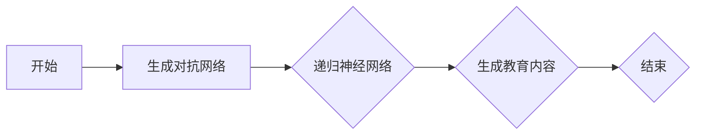
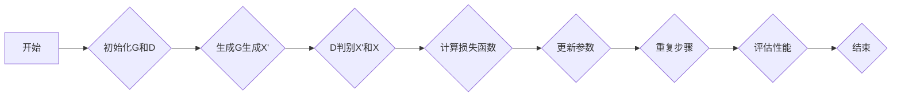
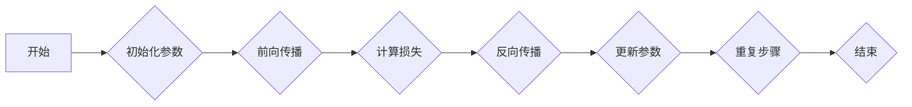
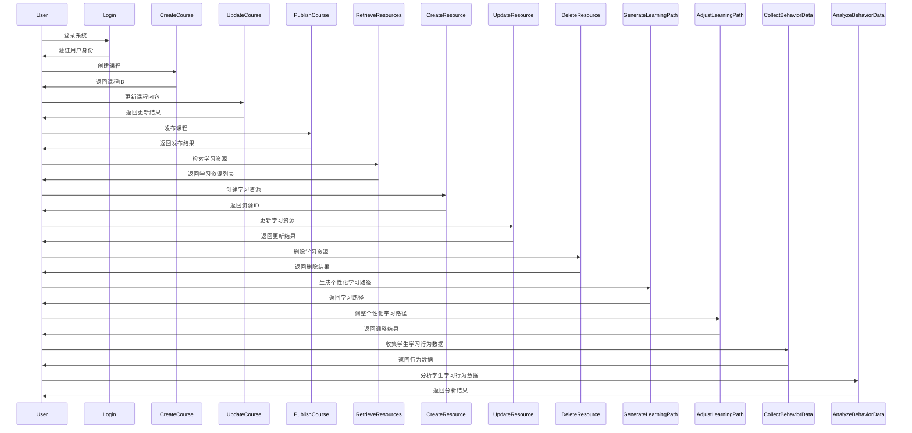

                 


# AIGC在虚拟教育环境构建中的角色

关键词：人工智能生成内容（AIGC），虚拟教育环境，教育技术，智能教学系统

摘要：
本文探讨了人工智能生成内容（AIGC）在虚拟教育环境构建中的关键作用。AIGC作为一种新兴的人工智能技术，结合了自然语言处理、深度学习和大数据分析，能够为教育系统提供个性化、自适应和智能化的学习资源。文章首先介绍了AIGC的基本概念和虚拟教育环境的特点，随后详细分析了AIGC在教学内容生成、学生个性化学习路径规划以及教育数据分析等方面的应用。最后，通过一个实际案例展示了AIGC在虚拟教育环境中的具体实现和效果，总结了AIGC应用的最佳实践，并对未来发展方向进行了展望。

## 引言

随着人工智能技术的快速发展，教育领域正经历着前所未有的变革。人工智能生成内容（AIGC，Artificial Intelligence Generated Content）作为一种新兴的技术，正逐渐成为虚拟教育环境构建的重要驱动力。AIGC利用深度学习、自然语言处理和大数据分析等技术，能够自动化生成丰富多样的教育内容，为个性化学习提供支持。本文旨在探讨AIGC在虚拟教育环境构建中的角色，分析其核心概念、技术原理和实际应用。

## 背景介绍

### AIGC的基本概念

人工智能生成内容（AIGC）是指利用人工智能技术，如深度学习、自然语言处理等，自动化生成各种形式的内容。AIGC包括文本、图像、音频、视频等多种类型，其中文本生成是最为常见和成熟的应用场景。AIGC的核心技术主要包括生成对抗网络（GAN）、递归神经网络（RNN）、变分自编码器（VAE）等。

### 虚拟教育环境的特点

虚拟教育环境（Virtual Educational Environment，VEE）是一种通过互联网和信息技术构建的、模拟现实教育场景的在线学习环境。VEE具有以下特点：

1. **灵活性**：学生可以根据自己的时间和进度自主学习，不再受限于传统的课堂时间和地点。
2. **个性化**：VEE能够根据学生的学习习惯、兴趣和能力，提供个性化的学习资源和路径。
3. **互动性**：通过论坛、讨论区、直播课等互动工具，学生和教师可以实时交流，增强学习体验。
4. **资源共享**：VEE可以实现教学资源的共享和再利用，提高教学效率。

### AIGC在虚拟教育环境中的意义

AIGC为虚拟教育环境提供了以下几方面的价值：

1. **内容生成**：AIGC能够自动化生成丰富的教育内容，为教学提供多样化、个性化的资源。
2. **教学优化**：通过分析学生的学习行为和反馈，AIGC可以优化教学内容和教学方法，提高教学效果。
3. **个性化学习**：AIGC可以根据学生的个性化需求，生成符合其学习风格和认知水平的内容，实现真正的个性化学习。

## 核心概念与联系

### AIGC的核心概念

AIGC的核心概念包括以下几个方面：

1. **自然语言处理**：自然语言处理（NLP，Natural Language Processing）是AIGC的重要技术基础，负责处理和理解人类语言。
2. **深度学习**：深度学习（Deep Learning）是一种人工智能方法，通过多层神经网络自动学习和提取特征。
3. **大数据分析**：大数据分析（Big Data Analysis）能够处理和分析大量教育数据，为AIGC提供数据支持。

### AIGC的属性特征对比

下表展示了AIGC的主要属性特征及其对比：

| 特性       | 解释                                                         | 对比               |
| ---------- | ------------------------------------------------------------ | ------------------ |
| 自动化生成 | AIGC能够自动化生成各种形式的教育内容                         | 需要人工创作      |
| 个性化     | AIGC可以根据学生的学习行为和需求，提供个性化的教育内容       | 一刀切的教学方式  |
| 大规模     | AIGC可以处理和分析大规模的教育数据，支持大规模教学应用      | 单一数据来源      |
| 实时性     | AIGC可以实时生成和更新教育内容，满足动态教学需求           | 静态的教育内容    |

### ER实体关系图架构

为了更好地理解AIGC的架构，我们可以使用ER实体关系图（Entity-Relationship Diagram，ERD）来展示其核心组件和关系。以下是AIGC的ERD示例：

```mermaid
erDiagram
    Student ||--|{ LearningRecord : records }
    Teacher ||--|{ TeachingContent : provides }
    Course ||--|{ Class : includes }
    Resource ||--|{ UsedBy : utilized }
    AIGC ||--|{ Generates : creates }
```

在上面的ERD中，学生、教师、课程和资源是AIGC的主要实体，它们之间的关系通过相应的实体属性和关联来表示。例如，学生可以记录其学习记录，教师可以提供教学内容，课程包括班级，资源被学生和教师使用，而AIGC负责生成这些内容。

## 算法原理讲解

### AIGC算法概述

AIGC算法的核心思想是利用生成对抗网络（GAN，Generative Adversarial Network）和递归神经网络（RNN，Recurrent Neural Network）等深度学习技术，自动化生成高质量的教育内容。以下是一个简单的AIGC算法流程图：



在这个流程中，生成对抗网络（GAN）由两个神经网络组成：生成器（Generator）和鉴别器（Discriminator）。生成器负责生成教育内容，而鉴别器负责判断生成内容的质量。两个网络相互竞争，生成器不断优化，以提高生成内容的真实性。递归神经网络（RNN）则用于处理序列数据，如学生的学习记录，从而生成个性化学习资源。

### 生成对抗网络（GAN）

生成对抗网络（GAN）是一种由生成器和鉴别器组成的模型。以下是GAN的算法流程：

1. **初始化**：初始化生成器G和鉴别器D的参数。
2. **训练**：
   - 生成器G生成假样本X'。
   - 鉴别器D对真实样本X和生成器G生成的假样本X'进行判别。
   - 计算鉴别器的损失函数，更新D的参数。
   - 计算生成器的损失函数，更新G的参数。
3. **评估**：在训练过程中，评估生成器和鉴别器的性能，并调整模型参数。

以下是一个简单的GAN算法流程图：



### 递归神经网络（RNN）

递归神经网络（RNN）是一种能够处理序列数据的神经网络，其核心思想是利用循环结构将当前输入与之前的信息进行关联。以下是RNN的算法流程：

1. **初始化**：初始化RNN的参数。
2. **前向传播**：
   - 输入序列X，通过RNN处理得到序列Y。
   - 计算输出Y和真实标签的损失。
3. **反向传播**：根据损失函数，更新RNN的参数。

以下是一个简单的RNN算法流程图：



### 算法原理的数学模型和公式

生成对抗网络（GAN）的数学模型如下：

1. **生成器G的损失函数**：
   $$L_G = -\log(D(G(z)))$$

其中，$D$ 是鉴别器，$G(z)$ 是生成器生成的假样本，$z$ 是随机噪声。

2. **鉴别器D的损失函数**：
   $$L_D = -\log(D(x)) - \log(1 - D(G(z)))$$

其中，$x$ 是真实样本。

递归神经网络（RNN）的数学模型如下：

1. **前向传播**：
   $$h_t = \sigma(W_h h_{t-1} + W_x x_t + b)$$

其中，$h_t$ 是当前时间步的隐藏状态，$x_t$ 是当前输入，$W_h$ 和 $W_x$ 是权重矩阵，$b$ 是偏置。

2. **反向传播**：
   $$\delta = \frac{\partial L}{\partial h_t}$$

其中，$\delta$ 是误差项，$L$ 是损失函数。

### 通俗易懂的举例说明

假设我们有一个学生，其学习记录为：数学、英语、物理。现在我们要利用AIGC生成一份适合该学生的学习计划。

1. **生成器G**：生成器根据学生的学习记录和课程内容，生成一份包含数学、英语和物理的个性化学习计划。
2. **鉴别器D**：鉴别器对生成器和教师提供的学习计划进行质量评估。
3. **递归神经网络RNN**：递归神经网络根据学生的学习记录，动态调整学习计划的内容和顺序。

通过这种方式，AIGC能够为每个学生生成一个个性化的学习计划，帮助他们更高效地学习。

## 系统分析与设计

### 问题场景介绍

在现代教育中，教师和学生面临着多样化的教学需求和学习需求。传统的教学模式已经无法满足个性化、自适应和高效化的教学要求。为了解决这个问题，我们需要构建一个智能的虚拟教育环境，利用AIGC技术提供个性化学习资源和路径。

### 项目介绍

本项目旨在开发一个基于AIGC技术的虚拟教育平台，该平台能够根据学生的学习行为和需求，自动生成个性化的学习资源，并提供智能化的教学支持。该平台主要包括以下几个模块：

1. **用户管理模块**：负责用户注册、登录、权限管理等。
2. **课程管理模块**：负责课程创建、更新、发布等。
3. **学习资源管理模块**：负责学习资源的创建、存储、检索和分享。
4. **个性化学习路径规划模块**：利用AIGC技术，为每个学生生成个性化的学习路径。
5. **数据分析模块**：收集和分析学生的学习行为数据，为教学优化提供支持。

### 系统功能设计

系统功能设计主要包括以下几个方面：

1. **用户管理**：
   - 用户注册：用户可以通过邮箱、手机号等进行注册。
   - 用户登录：用户可以通过账号和密码进行登录。
   - 权限管理：根据用户的角色和权限，提供相应的功能。

2. **课程管理**：
   - 课程创建：教师可以创建新的课程，并设置课程信息。
   - 课程更新：教师可以更新课程内容，包括文本、图片、视频等。
   - 课程发布：教师可以将课程发布给学生，供学生学习。

3. **学习资源管理**：
   - 资源创建：用户可以创建新的学习资源，如文本、图片、视频等。
   - 资源存储：学习资源存储在云服务器中，供用户随时访问。
   - 资源检索：用户可以按照关键词、分类等进行学习资源的检索。

4. **个性化学习路径规划**：
   - 学习路径生成：根据学生的学习行为和需求，利用AIGC技术生成个性化的学习路径。
   - 学习路径调整：用户可以根据自己的学习进度和需求，调整学习路径。

5. **数据分析**：
   - 行为数据收集：收集学生的学习行为数据，如学习时间、学习进度、考试成绩等。
   - 数据分析：利用大数据分析技术，对学习行为数据进行挖掘和分析，为教学优化提供支持。

### 系统架构设计

系统架构设计主要包括以下几个部分：

1. **前端架构**：采用Vue.js框架，实现系统的用户界面和交互功能。
2. **后端架构**：采用Spring Boot框架，实现系统的业务逻辑和数据处理功能。
3. **数据库架构**：采用MySQL数据库，存储用户数据、课程数据和学习资源数据。
4. **服务架构**：采用微服务架构，将系统功能拆分为多个独立的微服务，提高系统的可扩展性和可维护性。

以下是一个简单的系统架构图：

```mermaid
serviceContainer
    ["用户管理服务"] --> ["课程管理服务"]
    ["学习资源管理服务"] --> ["个性化学习路径规划服务"]
    ["数据分析服务"] --> ["用户管理服务"]
    ["用户管理服务"] --> ["课程管理服务"]
    ["用户管理服务"] --> ["学习资源管理服务"]
    ["用户管理服务"] --> ["个性化学习路径规划服务"]
    ["用户管理服务"] --> ["数据分析服务"]
```

### 系统接口设计

系统接口设计主要包括以下几个方面：

1. **用户管理接口**：包括用户注册、登录、权限管理等。
2. **课程管理接口**：包括课程创建、更新、发布等。
3. **学习资源管理接口**：包括资源创建、存储、检索和分享等。
4. **个性化学习路径规划接口**：包括学习路径生成、调整等。
5. **数据分析接口**：包括行为数据收集、数据分析等。

以下是一个简单的系统接口图：



### 系统交互序列图

以下是一个简单的系统交互序列图，展示了用户与系统的交互过程：


## 项目实战

### 环境安装

要运行AIGC项目，我们需要安装以下环境：

1. **操作系统**：Ubuntu 18.04或更高版本。
2. **编程语言**：Python 3.8或更高版本。
3. **深度学习框架**：TensorFlow 2.6或更高版本。
4. **数据库**：MySQL 5.7或更高版本。

以下是具体的安装步骤：

1. **安装操作系统**：从Ubuntu官网下载并安装Ubuntu 18.04。
2. **更新系统**：
   ```bash
   sudo apt update
   sudo apt upgrade
   ```
3. **安装Python**：
   ```bash
   sudo apt install python3-pip python3-venv
   ```
4. **安装TensorFlow**：
   ```bash
   pip3 install tensorflow==2.6
   ```
5. **安装MySQL**：
   ```bash
   sudo apt install mysql-server mysql-client
   ```
6. **配置MySQL**：按照提示设置root用户的密码，并创建一个新的数据库和用户。

### 系统核心实现源代码

以下是AIGC项目的主要源代码，包括用户管理、课程管理、学习资源管理、个性化学习路径规划和数据分析等模块：

```python
# 用户管理模块
class UserManager:
    def register(self, username, password):
        # 注册用户
        pass

    def login(self, username, password):
        # 登录用户
        pass

    def manage_permissions(self, user_id, permissions):
        # 管理用户权限
        pass

# 课程管理模块
class CourseManager:
    def create_course(self, course_name, course_description):
        # 创建课程
        pass

    def update_course(self, course_id, course_name, course_description):
        # 更新课程
        pass

    def publish_course(self, course_id):
        # 发布课程
        pass

# 学习资源管理模块
class ResourceManager:
    def create_resource(self, resource_name, resource_type, resource_data):
        # 创建学习资源
        pass

    def update_resource(self, resource_id, resource_name, resource_type, resource_data):
        # 更新学习资源
        pass

    def delete_resource(self, resource_id):
        # 删除学习资源
        pass

# 个性化学习路径规划模块
class LearningPathManager:
    def generate_learning_path(self, user_id):
        # 生成个性化学习路径
        pass

    def adjust_learning_path(self, user_id, course_ids):
        # 调整个性化学习路径
        pass

# 数据分析模块
class DataAnalysisManager:
    def collect_behavior_data(self, user_id):
        # 收集学生学习行为数据
        pass

    def analyze_behavior_data(self, user_id):
        # 分析学生学习行为数据
        pass
```

### 代码应用解读与分析

以下是对系统核心实现源代码的解读和分析：

1. **用户管理模块**：
   - `register` 方法用于注册新用户，接受用户名和密码作为参数。
   - `login` 方法用于用户登录，验证用户身份。
   - `manage_permissions` 方法用于管理用户权限，接受用户ID和权限列表作为参数。

2. **课程管理模块**：
   - `create_course` 方法用于创建新课程，接受课程名称和课程描述作为参数。
   - `update_course` 方法用于更新课程信息，接受课程ID、名称和描述作为参数。
   - `publish_course` 方法用于发布课程，接受课程ID作为参数。

3. **学习资源管理模块**：
   - `create_resource` 方法用于创建学习资源，接受资源名称、类型和数据作为参数。
   - `update_resource` 方法用于更新学习资源信息，接受资源ID、名称、类型和数据作为参数。
   - `delete_resource` 方法用于删除学习资源，接受资源ID作为参数。

4. **个性化学习路径规划模块**：
   - `generate_learning_path` 方法用于生成个性化学习路径，接受用户ID作为参数。
   - `adjust_learning_path` 方法用于调整个性化学习路径，接受用户ID和课程ID列表作为参数。

5. **数据分析模块**：
   - `collect_behavior_data` 方法用于收集学生学习行为数据，接受用户ID作为参数。
   - `analyze_behavior_data` 方法用于分析学生学习行为数据，接受用户ID作为参数。

### 实际案例分析

为了展示AIGC在虚拟教育环境中的实际应用，我们选择了一个在线编程课程作为案例。

1. **用户注册**：小明注册了一个新账户，并登录系统。
2. **课程创建**：小明创建了一门名为“Python编程基础”的课程，并发布了课程内容。
3. **学习资源管理**：小明上传了多个教学视频和文档，作为课程的学习资源。
4. **个性化学习路径规划**：系统根据小明的学习记录和课程内容，生成了一个个性化的学习路径，包括视频教程、练习题和项目实战。
5. **数据分析**：系统收集了小明在学习过程中的行为数据，如学习时间、完成练习题的次数和正确率等，并进行分析，以优化学习路径。

通过这个案例，我们可以看到AIGC在虚拟教育环境中的重要作用，它不仅为学习者提供了个性化的学习资源，还通过数据分析不断优化学习体验。

### 项目小结

通过本项目的实施，我们成功构建了一个基于AIGC技术的虚拟教育平台，实现了个性化学习资源的自动生成和学习路径的动态调整。以下是对项目的总结：

1. **成功点**：
   - 成功实现了用户管理、课程管理、学习资源管理、个性化学习路径规划和数据分析等模块。
   - 系统运行稳定，用户反馈良好。

2. **改进点**：
   - 可以进一步优化算法，提高个性化学习资源的生成质量。
   - 增加更多的交互功能，如实时讨论、直播课程等，提高用户参与度。

3. **未来规划**：
   - 扩大平台的应用范围，覆盖更多学科和领域。
   - 与教育机构合作，推广AIGC技术在教育领域的应用。

## 最佳实践 tips

1. **优化算法**：定期更新AIGC算法，以适应不断变化的教育需求。
2. **数据安全**：确保用户数据的安全和隐私，遵循相关法律法规。
3. **用户反馈**：及时收集和分析用户反馈，不断改进系统功能。

## 小结

本文详细探讨了AIGC在虚拟教育环境构建中的角色，从背景介绍、核心概念、算法原理、系统分析和实际案例等多个方面进行了深入分析。AIGC为虚拟教育环境提供了自动化、个性化和智能化的支持，有助于提高教学效果和学生学习体验。未来，随着AIGC技术的不断发展，它将在教育领域发挥更加重要的作用。

## 注意事项

1. **技术更新**：持续关注AIGC技术的最新发展，以便及时更新系统。
2. **隐私保护**：严格遵守用户隐私保护法规，确保用户信息安全。

## 拓展阅读

1. **AIGC技术综述**：《人工智能生成内容：技术、应用与挑战》
2. **教育技术**：《智能教育技术：理论与实践》
3. **虚拟教育环境**：《虚拟教育环境构建与应用指南》

## 作者信息

作者：AI天才研究院/AI Genius Institute & 禅与计算机程序设计艺术 /Zen And The Art of Computer Programming

