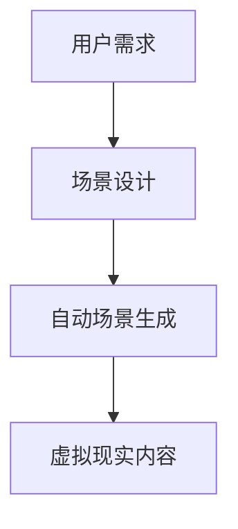
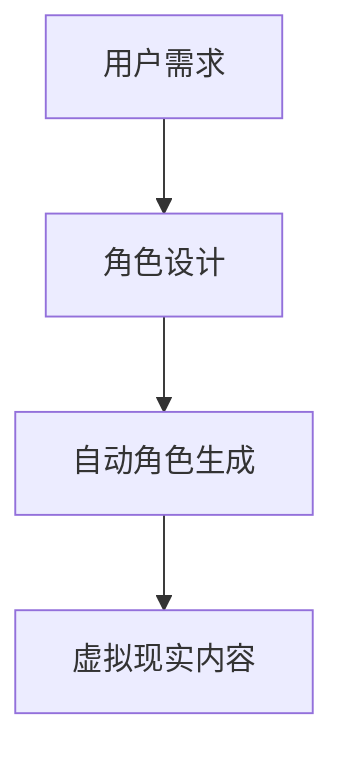
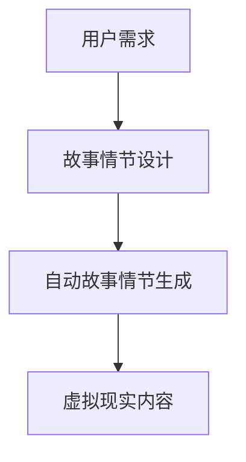
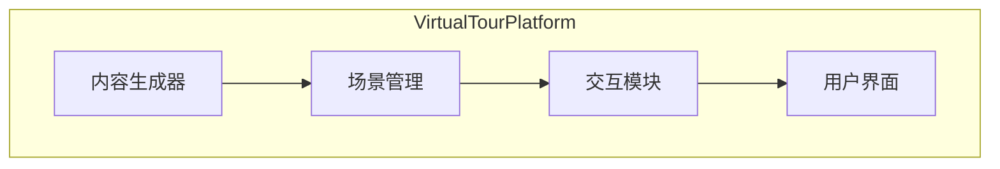
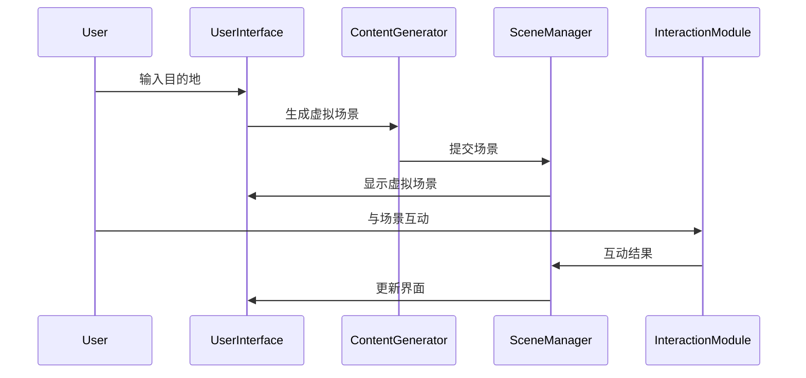

                 

# AIGC在虚拟现实内容创作中的应用：沉浸式体验设计

## 关键词

- 虚拟现实（VR）
- 人工智能生成内容（AIGC）
- 沉浸式体验设计
- 内容创作
- 交互设计
- 用户参与度

## 摘要

本文探讨了人工智能生成内容（AIGC）在虚拟现实（VR）内容创作中的应用，以及如何通过沉浸式体验设计提升用户体验。首先，文章介绍了AIGC的背景、定义、技术发展历程和核心优势。随后，详细阐述了AIGC技术在VR内容创作流程中的具体应用，包括场景设计、角色生成和故事情节生成。此外，文章分析了AIGC在沉浸式体验设计中的原则和实践，提供了系统分析与架构设计，以及项目实战案例，总结了最佳实践和未来研究方向。

## 第一部分: 背景介绍

### 1.1 问题背景

随着互联网和计算技术的飞速发展，虚拟现实（VR）已经成为当今科技界的热门话题。VR技术通过创造一个沉浸式的环境，使用户能够与现实世界进行互动，从而带来全新的体验。然而，虚拟现实内容的创作仍然是一个充满挑战的任务。

### 1.2 问题描述

虚拟现实内容创作面临着诸多挑战，包括：

- **内容创造的高成本和复杂性**：创作高质量的VR内容需要专业的技术知识和昂贵的硬件设备。
- **用户参与的局限性**：大多数VR内容都是单向的，缺乏互动性和个性化体验。
- **实时交互的延迟和延迟感**：VR内容创作过程中，实时交互的处理延迟会影响用户体验。

### 1.3 问题解决

为了解决上述问题，AIGC（AI-Generated Content）技术应运而生。AIGC利用人工智能技术自动生成内容，从而降低了内容创作的成本和复杂性。此外，AIGC还可以实现实时交互，提高用户参与的深度和体验。

### 1.4 边界与外延

AIGC在虚拟现实内容创作中的应用主要集中在以下几个方面：

- **内容生成**：利用AI技术自动生成VR内容，如场景、角色、故事等。
- **交互增强**：通过AI技术实现实时交互，提高用户体验。
- **个性化定制**：根据用户行为和偏好，为用户提供个性化的VR内容。

### 1.5 概念结构与核心要素组成

AIGC在虚拟现实内容创作中的核心要素包括：

- **AI模型**：用于生成和增强VR内容的核心技术。
- **数据集**：用于训练AI模型的数据资源。
- **算法**：用于指导AI模型生成和增强VR内容的计算方法。
- **用户界面**：用于用户与VR内容互动的交互界面。

### 1.6 本章小结

本章介绍了AIGC在虚拟现实内容创作中的应用背景、问题描述、问题解决方法以及核心要素。下一章将深入探讨AIGC技术的基本原理和应用场景。

---

## 第二部分: AIGC技术基础

### 第2章: AIGC技术概述

### 2.1 AI生成内容（AIGC）的定义

#### 2.1.1 AIGC的概念

AIGC（AI-Generated Content）指的是利用人工智能技术自动生成内容的过程。它涉及多种机器学习和深度学习技术，包括生成对抗网络（GAN）、变分自编码器（VAE）和预训练语言模型（如GPT）等。

#### 2.1.2 AIGC与VR内容的关联

AIGC与VR内容创作的关联在于，它能够自动生成VR所需的各类元素，如图像、视频、音频和三维模型，从而大幅降低内容创作的复杂性和成本。AIGC技术为VR内容创作者提供了丰富的素材库和创意工具。

### 2.2 AIGC技术的发展历程

#### 2.2.1 AIGC的起源

AIGC技术的发展可以追溯到生成对抗网络（GAN）的提出。GAN由Ian Goodfellow等人于2014年首次提出，其核心思想是通过两个神经网络——生成器和判别器之间的对抗训练，生成逼真的数据。

#### 2.2.2 AIGC的关键技术

AIGC的关键技术包括：

- **生成对抗网络（GAN）**：通过生成器和判别器的对抗训练，生成逼真的图像、视频和音频。
- **变分自编码器（VAE）**：通过编码器和解码器的结构，学习数据的高效表示，生成数据。
- **预训练语言模型（如GPT）**：通过大规模语言数据进行预训练，能够生成高质量的文本。

#### 2.2.3 AIGC在VR领域的应用现状

目前，AIGC已经在VR内容创作中得到了广泛应用。例如，通过GAN和VAE技术，可以自动生成高质量的VR场景和角色；而通过预训练语言模型，可以自动生成故事情节和交互文本。

### 2.3 AIGC在VR内容创作中的核心优势

#### 2.3.1 降低创作成本

AIGC技术通过自动化生成内容，减少了创作者的时间和人力资源投入，从而降低了创作成本。

#### 2.3.2 提高创作效率

AIGC技术能够快速生成高质量的内容，提高了创作效率，使得创作者能够更快地推出新的作品。

#### 2.3.3 实现个性化体验

AIGC技术可以根据用户的行为和偏好，生成个性化的VR内容，提供更加丰富的用户体验。

### 2.4 本章小结

本章介绍了AIGC技术的定义、发展历程和核心优势。在下一章中，我们将深入探讨AIGC技术的原理和应用场景。

---

### 第3章: AIGC技术原理

### 3.1 常见的AIGC算法

#### 3.1.1 生成对抗网络（GAN）

生成对抗网络（GAN）是一种由生成器和判别器组成的对抗模型。生成器的目的是生成与真实数据尽可能相似的数据，而判别器的目的是区分生成数据和真实数据。通过这种对抗训练，生成器逐渐学习到如何生成高质量的数据。

#### 3.1.2 变分自编码器（VAE）

变分自编码器（VAE）是一种基于概率模型的生成模型。它由编码器和解码器组成，编码器将输入数据编码为一个低维的潜在空间表示，解码器则从潜在空间中生成原始数据。

#### 3.1.3 预训练语言模型（如GPT）

预训练语言模型（如GPT）通过在大规模文本数据上进行预训练，学习到语言的结构和语义。在生成文本时，GPT可以根据上下文预测下一个单词或句子，从而生成连贯且具有语义的文本。

### 3.2 AIGC算法的工作原理

#### 3.2.1 GAN的工作原理

GAN的工作原理可以分为以下几个步骤：

1. **生成器（Generator）**：生成器从随机噪声中生成数据。这个数据可以是图像、视频或文本。
2. **判别器（Discriminator）**：判别器的任务是判断输入的数据是真实的还是生成的。判别器接收真实数据和生成数据，通过对抗训练来提高其判断能力。
3. **对抗训练**：生成器和判别器交替训练。生成器尝试生成更真实的数据，而判别器尝试提高判断能力，从而使得生成器生成的数据越来越接近真实数据。

#### 3.2.2 VAE的工作原理

VAE的工作原理可以分为以下几个步骤：

1. **编码器（Encoder）**：编码器将输入数据映射到一个低维的潜在空间，得到潜在空间中的表示。
2. **解码器（Decoder）**：解码器从潜在空间中生成原始数据。
3. **重参数化**：VAE使用重参数化技巧，将潜在空间的采样与一个概率分布相关联，从而使得生成过程具有灵活性。

#### 3.2.3 GPT的工作原理

GPT的工作原理可以分为以下几个步骤：

1. **预训练**：GPT在大规模文本数据上进行预训练，学习到语言的结构和语义。
2. **生成文本**：在生成文本时，GPT根据上下文预测下一个单词或句子，通过递归的方式逐步生成整个文本。

### 3.3 AIGC算法的应用场景

#### 3.3.1 图像生成

图像生成是AIGC技术的一个重要应用场景。通过GAN和VAE技术，可以生成高质量、多样化的图像，如人脸、风景、动物等。这些图像可以用于虚拟现实场景的构建，提升用户体验。

#### 3.3.2 视频生成

视频生成是另一个重要的应用场景。通过GAN和VAE技术，可以生成高质量、连续的视频序列。这些视频可以用于虚拟现实中的动画、电影等，提供更加沉浸式的体验。

#### 3.3.3 文本生成

文本生成是AIGC技术在VR内容创作中的一个关键应用。通过预训练语言模型（如GPT），可以生成高质量、连贯的文本。这些文本可以用于虚拟现实中的故事情节、交互对话等，提供更加丰富的内容。

### 3.4 本章小结

本章详细介绍了AIGC技术中的常见算法，包括GAN、VAE和GPT，以及这些算法的工作原理和应用场景。在下一章中，我们将探讨AIGC技术在VR内容创作流程中的具体应用。

---

## 第三部分: 虚拟现实内容创作流程

### 第4章: AIGC技术在VR内容创作中的应用

#### 4.1 VR内容创作的基本流程

虚拟现实内容创作的基本流程通常包括以下几个阶段：

1. **需求分析**：明确项目目标、用户需求和内容主题。
2. **场景设计**：设计虚拟现实中的场景布局和环境细节。
3. **角色设计**：创建虚拟现实中的角色外观和动作。
4. **故事情节设计**：构建虚拟现实中的故事线和发展情节。

#### 4.2 AIGC技术在VR内容创作中的应用

AIGC技术在VR内容创作中的应用可以贯穿整个创作流程，从场景设计到故事情节生成，都有显著的提升。

##### 4.2.1 自动场景生成

AIGC技术可以通过GAN和VAE算法自动生成高质量的虚拟现实场景。这些算法可以从大量真实场景数据中学习，生成逼真的环境。例如，利用GAN可以生成具有多样性的城市景观、室内空间等。

**概念属性特征对比表格**：

| 特征       | GAN          | VAE          |
|------------|--------------|--------------|
| 生成质量   | 高          | 高          |
| 训练数据量 | 大量         | 中等         |
| 计算资源   | 高          | 中          |
| 应用场景   | 图像生成     | 数据恢复、图像生成 |

**ER实体关系图架构的 Mermaid 流程图**：



##### 4.2.2 自动角色生成

通过AIGC技术，可以自动生成虚拟现实中的角色。这些角色可以是人类、动物或虚构的生物。生成角色时，可以使用GAN来创建个性化的外观，使用VAE来生成角色的动作和表情。

**概念属性特征对比表格**：

| 特征       | GAN          | VAE          |
|------------|--------------|--------------|
| 外观多样性 | 高          | 中          |
| 动作真实性 | 高          | 中          |
| 计算资源   | 高          | 中          |
| 应用场景   | 角色生成     | 角色动作生成 |

**ER实体关系图架构的 Mermaid 流程图**：



##### 4.2.3 自动故事情节生成

AIGC技术还可以用于自动生成虚拟现实中的故事情节。通过预训练语言模型（如GPT），可以根据用户的需求和角色设定，生成连贯且具有吸引力的故事线。

**概念属性特征对比表格**：

| 特征       | GPT          |
|------------|--------------|
| 文本连贯性 | 高          |
| 故事丰富性 | 中          |
| 计算资源   | 高          |
| 应用场景   | 文本生成     |

**ER实体关系图架构的 Mermaid 流 流程图**：



### 4.3 AIGC在VR内容创作中的优势与挑战

##### 4.3.1 优势分析

- **提高创作效率**：AIGC技术可以自动生成场景、角色和故事情节，大幅缩短创作周期。
- **降低创作成本**：通过减少人力和资源的投入，降低VR内容创作的成本。
- **增强个性化体验**：根据用户的行为和偏好，生成个性化的VR内容，提升用户体验。

##### 4.3.2 挑战分析

- **数据质量和多样性**：高质量的训练数据和多样化的数据对于AIGC算法的性能至关重要。
- **计算资源需求**：AIGC算法通常需要大量的计算资源，对于一些资源有限的场景，可能难以实现。
- **用户体验的一致性**：自动生成的VR内容需要确保用户体验的一致性和质量。

### 4.4 本章小结

本章详细介绍了AIGC技术在VR内容创作流程中的应用，包括场景设计、角色生成和故事情节生成。通过AIGC技术，可以大幅提高VR内容创作的效率和降低成本，但同时也面临一些挑战。在下一章中，我们将探讨如何在虚拟现实沉浸式体验设计中应用AIGC技术，进一步提升用户体验。

---

## 第四部分：虚拟现实沉浸式体验设计

### 第5章：虚拟现实沉浸式体验设计

#### 5.1 沉浸式体验设计的原则

沉浸式体验设计的目标是创造一个使用户完全投入其中的虚拟环境，以下是一些关键原则：

1. **用户参与度**：设计应该鼓励用户积极参与，提供互动性的功能，如控制虚拟物体、与虚拟角色互动等。
2. **互动性**：用户在虚拟环境中应该能够与环境和其他用户进行自然互动，增强真实感。
3. **环境真实性**：虚拟环境的视觉、听觉和触觉效果应尽可能接近现实，以提高用户的沉浸感。
4. **故事性**：虚拟体验应具有引人入胜的故事情节，提供连贯且吸引人的故事线。

#### 5.2 AIGC在沉浸式体验设计中的应用

AIGC技术在沉浸式体验设计中发挥着关键作用，通过以下方式提升用户体验：

1. **自动内容生成**：AIGC可以自动生成复杂的虚拟环境，包括逼真的场景和角色，减少设计时间和人力成本。
2. **实时交互增强**：AIGC技术可以实时生成和更新虚拟环境中的内容，提高交互的流畅性和真实性。
3. **个性化定制**：根据用户的行为和偏好，AIGC可以生成个性化的虚拟内容，提供更加个性化的体验。

### 5.3 AIGC在沉浸式体验设计中的实际应用

以下是一些AIGC技术在沉浸式体验设计中的实际应用案例：

1. **虚拟旅游**：通过AIGC技术自动生成逼真的景点和城市环境，用户可以在虚拟环境中进行互动式的旅游体验。
2. **虚拟教育**：AIGC可以自动生成虚拟课堂中的场景、角色和教材，提供互动式的学习体验，提高教育效果。
3. **虚拟会议**：通过AIGC技术自动生成虚拟会议室的布局和角色，提供逼真的远程会议体验。

#### 5.4 案例分析：虚拟旅游体验

以下是一个关于虚拟旅游体验的案例分析，展示AIGC技术在沉浸式体验设计中的应用：

**项目介绍**：虚拟旅游平台利用AIGC技术生成逼真的旅游景点，用户可以在虚拟环境中进行互动式的游览。

**系统功能设计（领域模型Mermaid类图）**：

```mermaid
classDiagram
    User <<Class>> 
    Scene <<Class>>
    ContentGenerator <<Class>>
    InteractionModule <<Class>>

    UserNavigatesTo(Scene)
    Scene->>ContentGenerator: GenerateContent
    Scene-->(InteractionModule)
```

**系统架构设计（Mermaid架构图）**：



**系统接口设计和系统交互（Mermaid序列图）**：



**实际案例分析和详细讲解剖析**：

在虚拟旅游项目中，AIGC技术通过以下步骤提升用户体验：

1. **用户需求分析**：平台收集用户输入的目的地信息。
2. **自动场景生成**：利用GAN和VAE算法，自动生成逼真的旅游场景，包括建筑、植被、人群等。
3. **交互设计**：平台提供与虚拟场景的互动功能，如导航、拍照、互动等。
4. **个性化定制**：根据用户行为和偏好，提供个性化的旅游建议和内容。

**项目小结**：

虚拟旅游项目通过AIGC技术实现了沉浸式体验，大幅提升了用户体验。用户可以在虚拟环境中进行互动式的旅游，享受与真实旅游相似的感受。

### 5.5 最佳实践 Tips

以下是一些关于AIGC在沉浸式体验设计中的最佳实践：

1. **数据多样化**：使用多种类型的数据进行训练，如图像、视频、音频等，以生成更丰富的虚拟内容。
2. **实时交互优化**：优化AIGC算法的实时生成性能，确保交互的流畅性和真实性。
3. **用户反馈收集**：收集用户反馈，根据用户行为和偏好调整AIGC生成的虚拟内容，提供个性化的体验。

### 5.6 本章小结

本章探讨了虚拟现实沉浸式体验设计的原则和AIGC技术的应用。通过AIGC技术，可以自动生成逼真的虚拟内容，提高用户的沉浸感。在下一章中，我们将进一步探讨AIGC技术的未来发展和潜在挑战。

---

## 第五部分：总结与展望

### 第6章：总结与展望

#### 6.1 总结

本文详细探讨了AIGC在虚拟现实内容创作中的应用，以及如何通过沉浸式体验设计提升用户体验。我们首先介绍了AIGC的背景、定义、技术发展历程和核心优势，然后详细阐述了AIGC技术在VR内容创作流程中的应用，包括场景设计、角色生成和故事情节生成。接着，我们分析了AIGC在沉浸式体验设计中的原则和实践，提供了系统分析与架构设计，以及项目实战案例。

#### 6.2 展望

AIGC技术在虚拟现实内容创作中的应用前景广阔，但仍面临一些挑战。未来，随着技术的不断进步，AIGC有望在以下几个方面取得突破：

1. **实时交互性能提升**：优化AIGC算法，提高实时生成性能，确保虚拟体验的流畅性和真实性。
2. **个性化体验增强**：进一步研究用户行为和偏好，提供更加个性化的虚拟内容。
3. **多模态内容生成**：探索AIGC技术在多模态内容生成中的应用，如结合图像、视频、音频和文本，提供更加丰富的虚拟体验。
4. **跨领域应用扩展**：AIGC技术不仅限于虚拟现实，还可以应用于游戏、影视、教育等领域，带来更多创新。

#### 6.3 小结

本文全面探讨了AIGC在虚拟现实内容创作中的应用，总结了其优势、挑战和未来发展趋势。通过AIGC技术，我们可以实现更加高效、个性化、沉浸式的虚拟体验，为用户带来全新的互动体验。

### 6.4 注意事项

- **数据质量和多样性**：确保训练数据的质量和多样性，对于AIGC算法的性能至关重要。
- **计算资源**：根据项目的需求，合理配置计算资源，确保AIGC算法的运行效率。
- **用户反馈**：定期收集用户反馈，不断优化AIGC生成的虚拟内容。

### 6.5 拓展阅读

- **AIGC技术基础**：《生成对抗网络（GAN）原理与应用》
- **沉浸式体验设计**：《沉浸式体验设计：虚拟现实与增强现实的应用》
- **AIGC在VR中的应用案例**：《AIGC技术在虚拟现实中的应用与挑战》

### 6.6 作者信息

**作者：AI天才研究院/AI Genius Institute & 禅与计算机程序设计艺术 /Zen And The Art of Computer Programming**

