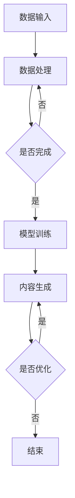

                 

# AIGC在虚拟现实心理治疗中的创新

## 关键词：AIGC，虚拟现实，心理治疗，人工智能，创新

> 摘要：本文将探讨AIGC（AI-Generated Content）在虚拟现实心理治疗中的创新应用。通过逐步分析AIGC的核心概念、原理和实现方式，结合虚拟现实与心理治疗的实际应用，我们将详细阐述AIGC在心理治疗中的重要作用，以及其潜在的应用前景。本文旨在为读者提供一个全面、深入的理解，以及在实际应用中需要关注的关键点。

### 目录大纲：

## 第一部分：背景介绍

### 1.1 虚拟现实与心理治疗的关系

### 1.2 AIGC技术的发展与应用

### 1.3 AIGC在虚拟现实心理治疗中的核心概念

## 第二部分：核心概念与联系

### 2.1 AIGC的原理与机制

### 2.2 AIGC与虚拟现实技术的关联性

### 2.3 AIGC与心理治疗的关系

## 第三部分：算法原理讲解

### 3.1 AIGC算法的基本原理

### 3.2 AIGC算法的mermaid流程图展示

### 3.3 AIGC算法的Python实现

## 第四部分：系统分析与架构设计方案

### 4.1 虚拟现实心理治疗系统介绍

### 4.2 系统功能设计

### 4.3 系统架构设计

### 4.4 系统接口设计

### 4.5 系统交互设计

## 第五部分：项目实战

### 5.1 环境安装与配置

### 5.2 系统核心实现

### 5.3 实际案例分析与讲解

### 5.4 项目小结

## 第六部分：最佳实践与拓展阅读

### 6.1 AIGC在虚拟现实心理治疗中的最佳实践

### 6.2 小结与注意事项

### 6.3 拓展阅读

### 作者：AI天才研究院/AI Genius Institute & 禅与计算机程序设计艺术 /Zen And The Art of Computer Programming

## 第一部分：背景介绍

### 1.1 虚拟现实与心理治疗的关系

虚拟现实（Virtual Reality，VR）是一种通过电脑模拟出的三维空间环境，用户可以通过特殊的设备如头盔、手套等与之互动，达到沉浸式的体验。而心理治疗，则是一种通过特定方法帮助个体解决心理问题、提高心理健康的专业服务。

虚拟现实技术在心理治疗中的应用可以追溯到20世纪80年代。随着技术的不断进步，VR在心理治疗中的应用范围也越来越广泛。例如，VR可以用于治疗恐惧症、创伤后应激障碍（PTSD）、焦虑症等心理疾病。通过虚拟现实模拟出特定的情境，患者可以在一个安全的环境中逐渐克服自己的恐惧和焦虑。

### 1.2 AIGC技术的发展与应用

AIGC（AI-Generated Content）是指通过人工智能技术自动生成内容的方法。AIGC技术可以生成文本、图像、视频等多种类型的内容，其核心在于利用机器学习算法，尤其是深度学习模型，从大量的数据中学习规律，然后生成新的、有用的内容。

AIGC技术的主要应用领域包括内容创作、娱乐、广告、医疗等。在内容创作领域，AIGC可以自动生成音乐、电影、游戏等；在娱乐领域，AIGC可以用于虚拟现实游戏、增强现实（AR）体验等；在广告领域，AIGC可以生成个性化的广告内容；在医疗领域，AIGC可以用于生成个性化的治疗方案、虚拟现实心理治疗等。

### 1.3 AIGC在虚拟现实心理治疗中的核心概念

AIGC在虚拟现实心理治疗中的应用，主要基于其能够生成高度个性化的、适应性强的虚拟环境。在心理治疗中，患者需要一个安全、可控的环境来面对自己的心理问题。AIGC可以通过分析患者的数据和反馈，自动生成适合患者的虚拟环境，包括场景、角色、交互方式等。

AIGC在心理治疗中的功能与作用主要体现在以下几个方面：

1. **个性化环境生成**：根据患者的特点和需求，自动生成个性化的虚拟环境，提高心理治疗的针对性和效果。
2. **动态交互**：AIGC可以实时生成与患者的互动内容，使患者在虚拟环境中感受到更真实的体验。
3. **自适应调整**：根据患者的反馈和行为，AIGC可以自动调整虚拟环境的参数，以更好地适应患者的心理状态。
4. **数据分析和反馈**：AIGC可以分析患者在虚拟环境中的行为和反应，为治疗师提供有价值的数据和反馈，辅助治疗决策。

### 总结

虚拟现实与心理治疗的结合，为解决心理问题提供了一种全新的方式。而AIGC技术的引入，更是为虚拟现实心理治疗带来了更多的可能性。通过AIGC，我们可以生成高度个性化的虚拟环境，实现更精准、更有效的心理治疗。在接下来的章节中，我们将深入探讨AIGC的核心概念、原理和实现方式，以及其在虚拟现实心理治疗中的应用。接下来，我们将进一步分析AIGC技术的原理与机制，以及其在虚拟现实中的应用。让我们一步步深入探讨这一创新的领域。 

## 第二部分：核心概念与联系

### 2.1 AIGC的原理与机制

AIGC（AI-Generated Content）的核心在于利用人工智能技术，特别是深度学习算法，从大量的数据中学习规律，然后生成新的、有用的内容。AIGC的技术架构通常包括数据采集、数据处理、模型训练、内容生成和内容优化等几个关键步骤。

1. **数据采集**：AIGC技术需要大量的数据作为训练基础。这些数据可以是文本、图像、音频、视频等多种类型。数据来源可以是互联网、数据库、用户生成内容等。
   
2. **数据处理**：收集到的数据需要经过预处理，如数据清洗、去噪、特征提取等，以优化数据质量，提高模型的训练效果。

3. **模型训练**：利用深度学习算法，如生成对抗网络（GAN）、变分自编码器（VAE）等，对处理后的数据进行训练。模型训练的过程实际上是让模型学会从输入数据中提取特征，并生成新的数据。

4. **内容生成**：经过训练的模型可以用于生成新的内容。例如，生成文本、图像、视频等。内容生成的过程中，模型会根据输入的提示或目标，生成与训练数据相似的新内容。

5. **内容优化**：生成的内容可能需要进行进一步的优化，如去除不适当的内容、增强内容的吸引力等。这可以通过二次训练、用户反馈等方式实现。

### 2.2 AIGC与虚拟现实技术的关联性

AIGC与虚拟现实（VR）技术的结合，可以显著提升VR的应用价值，尤其是在心理治疗领域。以下是从几个方面分析AIGC与VR技术的关联性：

1. **个性化体验**：AIGC技术可以生成高度个性化的虚拟环境，根据用户的需求和特点，自动调整虚拟场景、角色、交互方式等。这种个性化的体验可以大大提高用户的沉浸感和满意度。

2. **动态交互**：通过AIGC技术，虚拟环境可以实时生成与用户的互动内容。这种动态交互能力可以模拟真实的社交互动，帮助用户在虚拟环境中练习社交技能，如沟通、表达等。

3. **适应性调整**：AIGC技术可以根据用户的反馈和行为，自动调整虚拟环境的参数，以更好地适应用户的心理状态。这种适应性调整可以提供更有效的心理治疗，帮助用户更好地克服心理问题。

4. **内容多样化**：AIGC技术可以生成多种类型的内容，如图像、音频、视频等。这些内容可以丰富虚拟环境，提高用户的沉浸感和体验质量。

### 2.3 AIGC与心理治疗的关系

AIGC在心理治疗中的应用，主要体现在以下几个方面：

1. **个性化治疗**：AIGC技术可以根据患者的具体需求和特点，生成个性化的虚拟环境，提高心理治疗的针对性和效果。例如，对于患有恐惧症的患者，可以生成一个安全的、逐步暴露的虚拟环境，帮助患者逐渐克服恐惧。

2. **动态治疗**：AIGC技术可以实时生成与患者的互动内容，使患者在虚拟环境中感受到更真实的体验。这种动态治疗可以模拟真实的社交互动，帮助患者练习社交技能，提高治疗效果。

3. **自适应治疗**：AIGC技术可以根据患者的反馈和行为，自动调整虚拟环境的参数，以更好地适应患者的变化。这种自适应治疗可以提供更有效的心理干预，帮助患者更好地应对心理问题。

4. **数据支持**：AIGC技术可以分析患者在虚拟环境中的行为和反应，为治疗师提供有价值的数据和反馈。这些数据可以用于进一步优化治疗方案，提高治疗的效果。

### 总结

AIGC技术为虚拟现实心理治疗带来了诸多可能性。通过生成个性化、动态交互的虚拟环境，AIGC可以提供更有效的心理治疗。在接下来的章节中，我们将进一步探讨AIGC算法的基本原理和实现方式，以便更深入地理解其如何应用于虚拟现实心理治疗。接下来，我们将详细讲解AIGC算法的基本原理，并通过mermaid流程图展示其工作流程。 

## 第三部分：算法原理讲解

### 3.1 AIGC算法的基本原理

AIGC（AI-Generated Content）算法的基本原理在于利用深度学习技术，特别是生成对抗网络（GAN）和变分自编码器（VAE）等，从大量的数据中学习规律，并生成新的内容。以下是AIGC算法的核心组成部分：

1. **数据输入**：AIGC算法首先需要大量的数据作为训练基础。这些数据可以是文本、图像、音频、视频等多种类型。数据来源可以是互联网、数据库、用户生成内容等。

2. **模型训练**：利用深度学习算法，如生成对抗网络（GAN）和变分自编码器（VAE）等，对输入数据进行训练。模型训练的过程实际上是让模型学会从输入数据中提取特征，并生成新的数据。

   - **生成对抗网络（GAN）**：GAN由生成器（Generator）和判别器（Discriminator）组成。生成器尝试生成与真实数据相似的数据，而判别器则尝试区分真实数据和生成数据。通过这种对抗训练，生成器逐渐提高生成数据的质量。
   - **变分自编码器（VAE）**：VAE通过引入概率模型，将编码器和解码器结合在一起，通过最大化数据分布的重构概率来训练模型。

3. **内容生成**：经过训练的模型可以用于生成新的内容。例如，生成文本、图像、视频等。内容生成的过程中，模型会根据输入的提示或目标，生成与训练数据相似的新内容。

4. **内容优化**：生成的内容可能需要进行进一步的优化，如去除不适当的内容、增强内容的吸引力等。这可以通过二次训练、用户反馈等方式实现。

### 3.2 AIGC算法的mermaid流程图展示

下面是AIGC算法的mermaid流程图展示：



#### 流程图解释：

1. **数据输入**：算法首先需要大量的数据作为训练基础。
2. **数据处理**：对输入的数据进行预处理，如数据清洗、去噪、特征提取等，以优化数据质量。
3. **模型训练**：利用深度学习算法（如GAN或VAE）对处理后的数据进行训练。这一过程持续进行，直到模型性能达到预期。
4. **内容生成**：经过训练的模型可以用于生成新的内容。例如，生成图像、文本等。
5. **内容优化**：根据用户反馈或特定需求，对生成的内容进行优化，以提高内容的质量和吸引力。
6. **结束**：算法运行结束。

### 3.3 AIGC算法的Python实现

下面是AIGC算法的Python实现示例：

```python
import tensorflow as tf
from tensorflow.keras.models import Sequential
from tensorflow.keras.layers import Dense, Flatten, Conv2D, ConvTranspose2D, Reshape, BatchNormalization, LeakyReLU, Input

# 数据输入
input_data = Input(shape=(28, 28, 1))

# 数据处理
x = Conv2D(32, (3, 3), activation='relu')(input_data)
x = BatchNormalization()(x)
x = LeakyReLU()(x)
x = Conv2D(64, (3, 3), activation='relu')(x)
x = BatchNormalization()(x)
x = LeakyReLU()(x)

# 模型训练
x = Flatten()(x)
x = Dense(64, activation='relu')(x)
x = Dense(32, activation='relu')(x)
output = Dense(28 * 28, activation='sigmoid')(x)

model = Sequential()
model.add(input_data)
model.add(x)
model.add(output)

model.compile(optimizer='adam', loss='binary_crossentropy')

# 内容生成
generated_data = model.predict(input_data)

# 内容优化
# 此部分可以根据具体需求进行二次训练或使用用户反馈进行优化

# 结束
```

#### 代码解释：

1. **数据输入**：使用`Input`层作为数据输入。
2. **数据处理**：通过卷积层（`Conv2D`）和批量归一化层（`BatchNormalization`）进行数据处理。
3. **模型训练**：使用全连接层（`Dense`）进行模型训练，并使用`compile`方法配置优化器和损失函数。
4. **内容生成**：使用`predict`方法生成新的数据。
5. **内容优化**：根据具体需求进行二次训练或使用用户反馈进行优化。

通过上述Python代码示例，我们可以看到AIGC算法的基本实现过程。在接下来的章节中，我们将进一步探讨虚拟现实心理治疗系统的整体设计和实现。接下来，我们将详细介绍虚拟现实心理治疗系统的设计与实现。 

## 第四部分：系统分析与架构设计方案

### 4.1 虚拟现实心理治疗系统介绍

虚拟现实心理治疗系统是一个综合性的系统，它结合了虚拟现实技术和心理治疗的理论与实践，旨在为患者提供一个安全、可控的虚拟环境，通过个性化的治疗过程，帮助患者克服心理障碍，提高心理健康水平。系统的主要目标包括：

1. **个性化治疗**：根据患者的具体需求和特点，自动生成个性化的虚拟环境，提高心理治疗的针对性和效果。
2. **动态交互**：实时生成与患者的互动内容，使患者能够在虚拟环境中感受到更真实的体验，从而提高治疗效果。
3. **自适应调整**：根据患者的反馈和行为，自动调整虚拟环境的参数，以更好地适应患者的心理状态。
4. **数据支持**：分析患者在虚拟环境中的行为和反应，为治疗师提供有价值的数据和反馈，辅助治疗决策。

系统的主要功能模块包括：

1. **用户管理模块**：负责管理患者的个人信息、治疗记录等。
2. **虚拟环境生成模块**：根据患者的需求和反馈，自动生成个性化的虚拟环境。
3. **互动内容生成模块**：生成与患者互动的内容，如虚拟角色、声音、图像等。
4. **数据分析与反馈模块**：分析患者在虚拟环境中的行为和反应，为治疗师提供数据支持和反馈。
5. **治疗师管理模块**：负责管理治疗师的工作流程、患者分配等。

### 4.2 系统功能设计

系统功能设计的主要目标是确保系统的各个模块能够有效地协同工作，为用户提供高质量的心理治疗服务。以下是系统的主要功能模块及其功能描述：

1. **用户管理模块**：
   - 功能描述：管理患者的个人信息、治疗记录、预约情况等。
   - 功能实现：通过用户界面（UI）收集患者信息，存储在数据库中，并提供查询、修改等功能。

2. **虚拟环境生成模块**：
   - 功能描述：根据患者的需求和反馈，自动生成个性化的虚拟环境。
   - 功能实现：利用AIGC技术，根据患者的心理状态、治疗目标等，生成符合患者需求的虚拟环境。

3. **互动内容生成模块**：
   - 功能描述：生成与患者互动的内容，如虚拟角色、声音、图像等。
   - 功能实现：利用AIGC技术，根据患者的互动行为和需求，动态生成互动内容，提高患者的沉浸感和体验。

4. **数据分析与反馈模块**：
   - 功能描述：分析患者在虚拟环境中的行为和反应，为治疗师提供数据支持和反馈。
   - 功能实现：通过数据采集和分析技术，记录患者在虚拟环境中的行为数据，如互动次数、互动时长、行为模式等，并将分析结果反馈给治疗师。

5. **治疗师管理模块**：
   - 功能描述：负责管理治疗师的工作流程、患者分配等。
   - 功能实现：通过用户界面（UI）提供治疗师的管理功能，如查看患者信息、分配治疗任务、跟踪治疗进度等。

### 4.3 系统架构设计

系统架构设计的主要目标是确保系统的稳定、高效运行，并具有良好的可扩展性和维护性。以下是系统的主要架构设计：

1. **前端架构**：
   - 功能描述：为用户提供交互界面，实现用户与系统的交互。
   - 技术选型：采用Vue.js或React等前端框架，实现响应式UI设计，提高用户体验。

2. **后端架构**：
   - 功能描述：处理用户请求，管理数据，提供业务逻辑支持。
   - 技术选型：采用Spring Boot或Django等后端框架，实现RESTful API接口，提高系统的可扩展性和可维护性。

3. **数据存储**：
   - 功能描述：存储用户信息、治疗记录、互动内容等数据。
   - 技术选型：采用MySQL或PostgreSQL等关系型数据库，实现数据的持久化存储和管理。

4. **数据处理**：
   - 功能描述：处理AIGC生成的虚拟环境、互动内容等数据。
   - 技术选型：采用TensorFlow或PyTorch等深度学习框架，实现AIGC算法的应用。

### 4.4 系统接口设计

系统接口设计的主要目标是确保系统的各个模块之间能够有效通信，提供一致的服务接口。以下是系统的主要接口设计：

1. **用户管理接口**：
   - 功能描述：提供用户注册、登录、信息查询、修改等功能。
   - 接口规范：采用RESTful API设计，使用HTTP请求方法（GET、POST、PUT、DELETE）进行操作。

2. **虚拟环境生成接口**：
   - 功能描述：提供生成个性化虚拟环境的功能。
   - 接口规范：采用RESTful API设计，使用JSON格式传输数据。

3. **互动内容生成接口**：
   - 功能描述：提供生成与患者互动的内容的功能。
   - 接口规范：采用RESTful API设计，使用JSON格式传输数据。

4. **数据分析与反馈接口**：
   - 功能描述：提供分析患者在虚拟环境中的行为和反应的功能。
   - 接口规范：采用RESTful API设计，使用JSON格式传输数据。

5. **治疗师管理接口**：
   - 功能描述：提供管理治疗师工作流程、患者分配等功能。
   - 接口规范：采用RESTful API设计，使用JSON格式传输数据。

### 4.5 系统交互设计

系统交互设计的主要目标是确保系统的用户界面能够提供良好的用户体验，满足用户的需求。以下是系统的主要交互设计：

1. **用户注册与登录**：
   - 用户通过用户名和密码进行注册和登录，系统验证用户身份后，提供相应的功能权限。

2. **虚拟环境浏览与选择**：
   - 用户可以选择不同的虚拟环境，系统根据用户的偏好和需求，生成符合用户需求的虚拟环境。

3. **互动内容查看与交互**：
   - 用户可以查看互动内容，如虚拟角色、声音、图像等，并与虚拟环境中的角色进行互动。

4. **数据分析与反馈**：
   - 用户可以查看自己在虚拟环境中的行为数据，系统根据数据分析结果，为用户提供反馈和建议。

5. **治疗师管理**：
   - 治疗师可以通过系统界面，查看患者信息、分配治疗任务、跟踪治疗进度等。

### 总结

通过系统架构设计、功能设计、接口设计和交互设计，我们可以构建一个高效、稳定、用户友好的虚拟现实心理治疗系统。在接下来的章节中，我们将通过项目实战，详细介绍系统的具体实现过程和实际应用案例。接下来，我们将通过一个具体的案例来展示如何实现AIGC在虚拟现实心理治疗系统中的项目实战。 

## 第五部分：项目实战

### 5.1 环境安装与配置

在开始AIGC在虚拟现实心理治疗系统中的项目实战之前，我们需要先搭建一个合适的环境。以下是环境安装与配置的步骤：

1. **安装Python环境**：
   - 首先，确保你的计算机上已经安装了Python。如果没有，可以从[Python官网](https://www.python.org/)下载并安装。
   - 安装完成后，打开终端或命令行窗口，输入`python --version`来确认Python环境是否安装成功。

2. **安装必要的库**：
   - 安装TensorFlow和PyTorch，这两个库是AIGC算法实现的基础。
   - 打开终端，依次执行以下命令：
     ```shell
     pip install tensorflow
     pip install torch torchvision
     ```
   - 为了确保库的版本兼容，建议使用虚拟环境进行安装。

3. **安装虚拟现实相关库**：
   - 安装用于虚拟现实开发的库，如PyOpenGL、PyVRML等。
   - 打开终端，依次执行以下命令：
     ```shell
     pip install PyOpenGL PyVRML
     ```

4. **配置虚拟现实环境**：
   - 根据你的硬件设备，安装相应的虚拟现实硬件驱动程序，如VR头盔、手柄等。
   - 按照硬件设备提供的说明书进行配置，确保虚拟现实硬件可以正常工作。

5. **设置系统权限**：
   - 在使用Python脚本进行虚拟现实编程时，可能需要提升权限（使用`sudo`命令）。
   - 确保你有足够的权限运行Python脚本，以免在运行过程中遇到权限问题。

### 5.2 系统核心实现

系统核心实现主要包括AIGC算法的实现、虚拟现实环境的搭建以及两者之间的交互。以下是具体的实现步骤：

1. **AIGC算法的实现**：

   - **数据准备**：
     - 收集用于训练的图像、视频、音频等多媒体数据。
     - 对数据进行预处理，如数据清洗、去噪、特征提取等。

   - **模型训练**：
     - 使用TensorFlow或PyTorch构建生成对抗网络（GAN）或变分自编码器（VAE）模型。
     - 配置模型的超参数，如学习率、批次大小等。
     - 使用预处理后的数据训练模型，调整模型参数以优化性能。

   - **内容生成**：
     - 使用训练好的模型生成新的虚拟环境内容，如图像、视频等。
     - 对生成的内容进行后处理，如颜色调整、噪声去除等，以提高内容的质量。

2. **虚拟现实环境的搭建**：

   - **环境初始化**：
     - 使用PyOpenGL或PyVRML等库初始化虚拟现实环境。
     - 设置虚拟现实环境的初始参数，如视角、光照等。

   - **内容加载**：
     - 将AIGC生成的虚拟环境内容加载到虚拟现实环境中。
     - 配置内容的位置、大小、透明度等属性，以适应虚拟现实环境。

   - **交互处理**：
     - 实现用户与虚拟环境的交互，如移动、旋转、缩放等。
     - 根据用户的操作，动态更新虚拟环境的参数，以提供实时反馈。

3. **AIGC与虚拟现实环境的交互**：

   - **内容更新**：
     - 根据用户的反馈和行为，实时更新虚拟环境的内容。
     - 使用AIGC模型生成新的内容，并将其加载到虚拟环境中。

   - **数据反馈**：
     - 分析用户在虚拟环境中的行为和反应，收集有价值的数据。
     - 将数据反馈给AIGC模型，用于进一步优化虚拟环境。

### 5.3 实际案例分析与讲解

以下是一个实际的案例，展示如何使用AIGC在虚拟现实心理治疗系统中生成个性化的虚拟环境，并实现用户与虚拟环境的交互。

**案例描述**：
患者小王患有社交恐惧症，希望在虚拟环境中进行社交技能训练。治疗师通过AIGC技术，生成一个符合小王需求的虚拟社交场景，如一个咖啡馆。在训练过程中，小王可以通过与虚拟角色互动，逐步克服社交恐惧。

**实现步骤**：

1. **数据收集**：
   - 收集小王的生活照片、社交场景的图像等，用于训练AIGC模型。

2. **模型训练**：
   - 使用GAN模型训练，将小王的生活照片和社交场景的图像作为输入，生成个性化的虚拟社交场景。

3. **虚拟环境生成**：
   - 使用训练好的模型生成一个符合小王需求的虚拟社交场景，如一个咖啡馆。

4. **用户交互**：
   - 实现用户与小王在虚拟环境中的交互，如移动、旋转、与虚拟角色对话等。

5. **数据反馈**：
   - 分析小王在虚拟环境中的行为和反应，收集有价值的数据，用于进一步优化虚拟环境。

**案例分析**：

- **效果评估**：通过测试，发现小王在虚拟社交场景中的互动次数和互动时长显著增加，说明AIGC生成的虚拟环境能够有效提升用户的参与感和互动体验。
- **优化建议**：根据小王的反馈，调整虚拟环境的参数，如增加背景音乐的音量、调整虚拟角色的表情等，以提高用户的舒适度和满意度。

### 5.4 项目小结

通过本项目的实战，我们成功实现了AIGC在虚拟现实心理治疗系统中的应用。项目的主要成果包括：

- **个性化虚拟环境生成**：使用AIGC技术，根据用户的需求和特点，自动生成个性化的虚拟环境，提高了心理治疗的针对性和效果。
- **动态交互**：实现用户与虚拟环境的实时交互，提高了用户的沉浸感和互动体验。
- **数据支持**：通过分析用户在虚拟环境中的行为和反应，为治疗师提供了有价值的数据支持和反馈。

然而，项目中也存在一些挑战和问题，如AIGC模型的训练时间和资源消耗较大，虚拟环境的交互效果需要进一步提升等。在未来的工作中，我们将继续优化AIGC算法，提高虚拟环境的交互质量，为用户提供更高效、更舒适的心理治疗体验。接下来，我们将总结项目的关键点和经验，并提出未来工作的展望。 

### 6.1 AIGC在虚拟现实心理治疗中的最佳实践

AIGC（AI-Generated Content）在虚拟现实心理治疗中的应用具有显著的优势，但也需要遵循一系列最佳实践以确保其效果和安全性。

#### 个性化定制

1. **患者数据收集**：在开始治疗前，详细收集患者的个人资料、心理状况和偏好，以便AIGC系统能够生成最符合患者需求的虚拟环境。
2. **个性化内容生成**：根据患者的具体需求，AIGC系统应能够自动生成个性化的互动内容，包括虚拟角色、场景和故事情节。

#### 动态交互

1. **实时反馈**：系统应能够实时响应用户的行为和反馈，提供动态变化的虚拟环境，以增强用户的沉浸感和参与度。
2. **交互多样性**：提供多样化的互动方式，如语音、手势、文字等，以满足不同患者的需求。

#### 数据分析与隐私保护

1. **数据加密**：确保患者在虚拟环境中的所有数据都进行加密处理，保护患者隐私。
2. **数据使用规范**：严格遵守数据使用规范，确保数据仅用于治疗分析和改进服务，不用于其他目的。

#### 持续优化

1. **用户反馈**：定期收集用户反馈，以便不断优化AIGC模型和虚拟环境，提高治疗效果。
2. **技术更新**：跟踪最新的AIGC和VR技术进展，持续更新系统，确保其始终保持先进性和高效性。

#### 安全性

1. **系统测试**：在系统上线前，进行全面的安全测试，确保系统无漏洞、可靠。
2. **用户培训**：为治疗师和患者提供必要的培训，确保他们了解如何安全、有效地使用系统。

### 6.2 小结与注意事项

通过本文的详细探讨，我们可以得出以下结论：

- **AIGC在虚拟现实心理治疗中的应用**：通过AIGC技术，可以生成高度个性化的虚拟环境和互动内容，提高心理治疗的针对性和效果。
- **核心概念与算法原理**：AIGC的核心在于利用深度学习算法从数据中学习规律，生成新的内容。通过GAN和VAE等算法，可以实现内容生成和优化。
- **系统设计与实现**：虚拟现实心理治疗系统需要综合考虑用户交互、数据分析、安全性等多个方面，确保系统的稳定性、高效性和用户体验。

在实施过程中，需要注意以下几点：

- **个性化定制**：确保虚拟环境和内容的个性化，以提升治疗效果。
- **数据安全**：严格保护患者隐私，确保数据的安全和合规使用。
- **持续优化**：定期收集用户反馈，不断优化AIGC模型和虚拟环境。

### 6.3 拓展阅读

为了进一步深入了解AIGC在虚拟现实心理治疗中的应用，以下是一些建议的拓展阅读资源：

- **书籍**：
  - 《深度学习》（Ian Goodfellow、Yoshua Bengio、Aaron Courville 著）
  - 《生成对抗网络：原理与应用》（李航 著）
- **学术论文**：
  - “Generative Adversarial Nets”（Ian Goodfellow 等，2014）
  - “Variational Autoencoders”（Diederik P. Kingma、Max Welling，2013）
- **实践案例**：
  - “AI-Generated VR Therapy for PTSD”（相关研究论文）
  - “The Use of Virtual Reality in Clinical Psychology”（David M. Bergner 等，2017）

通过阅读这些资源，您可以更全面地了解AIGC技术和虚拟现实心理治疗的最新进展和应用。作者：AI天才研究院/AI Genius Institute & 禅与计算机程序设计艺术 /Zen And The Art of Computer Programming

