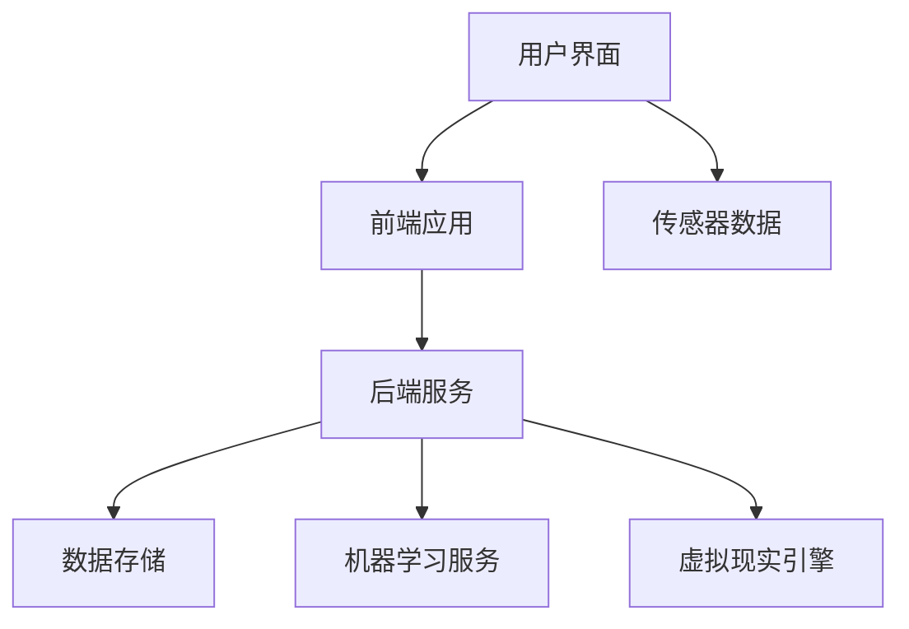
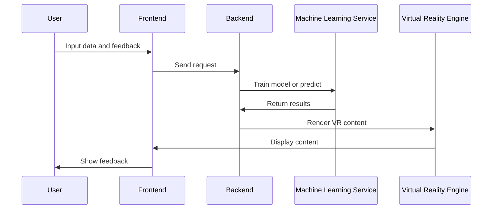

                 

### 引言

#### AIGC：AI-Generated Content

**核心概念与联系**

AIGC，即AI-Generated Content，是指通过人工智能技术自动生成的各种内容，包括但不限于文本、图像、音频和视频。AIGC的核心概念在于利用机器学习和深度学习模型，从大量数据中学习并生成新的、有意义的内容。

**概念属性特征对比表格**

| 特征 | AIGC | 传统内容生成 |
| --- | --- | --- |
| **数据依赖性** | 强烈依赖大量数据集 | 可使用较少数据 |
| **生成效率** | 高效率生成内容 | 人工效率较低 |
| **内容多样性** | 可以生成多样化内容 | 内容多样性受限 |
| **质量可控性** | 随着数据质量和模型优化提高 | 质量稳定性较高 |
| **创新性** | 能够生成创新性内容 | 创新性较有限 |

**ER实体关系图架构**

```mermaid
erDiagram
  Content <<|-- Text : 文本内容
  Content <<|-- Image : 图像内容
  Content <<|-- Audio : 音频内容
  Content <<|-- Video : 视频内容
  Model ||--|> Content : 生成模型
```

通过这个ER图，我们可以清晰地看到AIGC的生成模型如何与不同类型的内容相关联。

#### 虚拟现实心理治疗：背景与问题描述

**问题背景**

虚拟现实（Virtual Reality, VR）心理治疗是一种利用虚拟现实技术提供心理治疗方案的方法。它通过模拟特定的环境、情境或事件，帮助患者处理心理问题，如恐惧症、创伤后应激障碍（PTSD）等。

**问题描述**

VR心理治疗的挑战在于如何有效地模拟各种情境，并确保治疗过程的个性化。传统方法通常需要心理治疗师与患者进行长时间的一对一互动，但这样的方式存在时间和资源的限制。此外，不同患者对相同情境的反应可能截然不同，因此需要一种能够动态适应个体需求的系统。

**问题解决**

AIGC的应用为VR心理治疗提供了一种解决方案。通过AIGC，系统可以根据患者的数据和反馈，动态生成个性化的治疗内容。例如，AIGC可以生成特定的虚拟环境、对话脚本和声音效果，以适应患者的治疗需求。

**边界与外延**

AIGC在VR心理治疗中的应用不仅仅局限于生成内容，还可以扩展到个性化治疗方案的制定、虚拟治疗师的生成以及治疗过程的实时反馈和调整。这为VR心理治疗提供了更多的可能性和灵活性。

**概念结构与核心要素组成**

1. **核心概念**：AIGC、VR心理治疗
2. **关键要素**：机器学习模型、自然语言处理、计算机视觉、虚拟现实技术、患者数据
3. **关联**：AIGC通过机器学习模型从患者数据中学习，生成个性化的VR心理治疗内容。

通过以上分析，我们可以看出AIGC在VR心理治疗中的应用潜力，以及如何通过技术手段解决现有问题。接下来，我们将深入探讨AIGC的基本原理及其在VR心理治疗中的具体应用。

### AIGC的基本原理

#### AIGC的定义与核心原则

AIGC，即AI-Generated Content，是指通过人工智能技术，如机器学习、深度学习等，自动生成具有较高质量和可读性的文本、图像、音频和视频内容。AIGC的核心原则在于利用大量数据训练模型，使其能够理解和生成人类语言和视觉信息。

**核心原则**：

1. **数据驱动**：AIGC依赖于大量训练数据，通过这些数据来学习和理解人类语言和视觉的规律。
2. **模型优化**：通过不断优化机器学习模型，提高内容的生成质量和效率。
3. **个性化生成**：根据用户的需求和反馈，动态调整生成的内容，实现个性化服务。

#### 技术堆栈

AIGC的技术堆栈主要包括以下几个关键组成部分：

1. **机器学习模型**：如生成对抗网络（GAN）、变分自编码器（VAE）、递归神经网络（RNN）等。
2. **自然语言处理（NLP）**：包括文本生成、情感分析、命名实体识别等。
3. **计算机视觉**：如图像生成、图像识别、图像风格迁移等。

**机器学习模型**

在AIGC中，机器学习模型是最核心的部分。以下是一些常用的模型：

1. **生成对抗网络（GAN）**：GAN通过对抗性训练生成高质量的内容。一个生成器G尝试生成与真实数据相似的内容，而一个判别器D则尝试区分生成内容和真实内容。通过不断的训练和优化，生成器可以生成越来越真实的内容。

2. **变分自编码器（VAE）**：VAE通过概率编码生成内容，其优势在于能够生成多样化的内容，同时保持内容的质量。

3. **递归神经网络（RNN）**：RNN特别适合处理序列数据，如文本和语音。通过学习序列中的上下文信息，RNN可以生成连贯的文本内容。

**自然语言处理（NLP）**

NLP在AIGC中的应用主要集中在文本生成和理解。以下是一些关键的NLP技术：

1. **文本生成**：使用预训练的模型，如GPT-3、BERT等，生成连贯的文本。这些模型通过学习大量文本数据，能够生成具有高可读性和准确性的文本。

2. **情感分析**：通过分析文本的情感倾向，了解用户的情感状态，从而生成个性化的内容。

3. **命名实体识别**：识别文本中的命名实体，如人名、地点、组织等，为后续的内容生成提供基础。

**计算机视觉**

计算机视觉技术在AIGC中的应用主要集中在图像和视频的生成和识别。以下是一些关键的技术：

1. **图像生成**：通过GAN、VAE等模型，生成高质量、真实的图像。例如，生成逼真的肖像、风景等。

2. **图像识别**：使用卷积神经网络（CNN）等模型，识别图像中的对象、场景等。

3. **图像风格迁移**：通过神经网络模型，将一种图像风格转移到另一种图像上，实现图像的创意生成。

**AIGC的工作流程**

AIGC的工作流程通常包括以下步骤：

1. **数据收集和预处理**：收集大量的训练数据，并对数据进行分析和清洗。
2. **模型训练**：使用训练数据训练机器学习模型，如GAN、VAE、RNN等。
3. **内容生成**：根据用户的需求和反馈，使用训练好的模型生成新的内容。
4. **内容优化**：对生成的内容进行优化，提高内容的质量和可读性。
5. **用户反馈**：收集用户的反馈，用于模型的进一步优化和调整。

通过以上分析，我们可以看到AIGC的基本原理和技术堆栈，以及其在内容生成中的应用。在接下来的章节中，我们将探讨AIGC在虚拟现实心理治疗中的具体应用，以及如何利用AIGC为患者提供更加个性化和有效的治疗体验。

### 虚拟现实心理治疗：历史、发展与现状

#### 历史回顾

虚拟现实（VR）心理治疗的起源可以追溯到20世纪80年代，当时虚拟现实技术刚刚兴起。最初的研究主要集中在利用VR技术模拟恐惧情境，帮助患者克服恐惧症。随着技术的进步，VR心理治疗逐渐扩展到其他心理健康问题，如创伤后应激障碍（PTSD）、焦虑症等。

#### 发展阶段

1. **初期阶段（20世纪80-90年代）**：
   - 虚拟现实技术的初步应用：在这一阶段，VR主要被用于模拟特定情境，如恐惧症场景，帮助患者面对和克服恐惧。
   - 技术限制：由于硬件和软件的限制，VR心理治疗的规模和效果有限。

2. **发展阶段（21世纪初）**：
   - 技术成熟：随着计算机性能的提升和传感器技术的发展，VR设备变得更加便携和易用。
   - 应用扩展：VR心理治疗开始应用于更广泛的心理健康问题，如PTSD、焦虑症、抑郁症等。
   - 临床研究：大量临床研究证明了VR心理治疗的有效性，为该领域的发展奠定了基础。

3. **成熟阶段（近年）**：
   - 个性化治疗：利用大数据和人工智能技术，为患者提供个性化的治疗计划。
   - 虚拟现实与AIGC结合：AIGC的应用使得VR心理治疗内容更加丰富和多样化。
   - 实时反馈与调整：通过实时收集和分析患者数据，治疗师可以动态调整治疗内容，提高治疗效果。

#### 当前状态

1. **应用范围**：
   - 广泛应用于各种心理健康问题，如恐惧症、PTSD、焦虑症、抑郁症等。
   - 与传统心理治疗相结合，提供更全面的治疗方案。

2. **技术进步**：
   - 高性能VR设备：提供更加逼真和沉浸式的体验，增强治疗效果。
   - 大数据和人工智能：用于分析患者数据，提供个性化治疗计划。
   - AIGC的应用：生成个性化的VR内容，提高治疗过程的互动性和趣味性。

3. **挑战与机遇**：
   - **技术挑战**：VR设备的成本、易用性、稳定性和安全性仍是主要问题。
   - **应用挑战**：如何确保VR心理治疗的有效性和患者接受度。
   - **机遇**：随着技术的不断进步和应用的扩展，VR心理治疗具有巨大的市场潜力。

通过以上分析，我们可以看到虚拟现实心理治疗的历史、发展阶段和当前状态。随着AIGC技术的融入，VR心理治疗有望在未来的心理健康领域发挥更大的作用。在接下来的章节中，我们将详细探讨AIGC在VR心理治疗中的具体应用。

### AIGC在VR心理治疗中的具体应用

#### 个人化治疗计划

AIGC通过机器学习和大数据分析，能够为每位患者生成个性化的治疗计划。首先，系统会收集患者的心理测试数据和病史，然后利用这些数据训练机器学习模型。这些模型可以识别患者的心理状态和特定需求，从而生成定制化的VR治疗场景。

**实例**：对于一名患有PTSD的患者，系统可以生成一个包含回忆和逃避场景的VR治疗环境。根据患者的反馈，系统会不断调整和优化这些场景，以达到最佳的治疗效果。

#### 虚拟治疗师

AIGC还可以生成高度逼真的虚拟治疗师，这些虚拟治疗师通过自然语言处理和计算机视觉技术，能够与患者进行自然对话，提供个性化的心理健康指导。

**实例**：在一个焦虑症的治疗场景中，虚拟治疗师可以模仿真实治疗师的行为，引导患者进行深呼吸和冥想练习，同时根据患者的情绪变化实时调整对话内容和治疗策略。

#### 疗效追踪与反馈

AIGC技术还用于实时追踪和治疗反馈。通过收集患者在VR环境中的行为数据，如心率、呼吸频率和情绪变化，系统可以动态评估治疗效果，并提供即时反馈。

**实例**：在一个恐惧症治疗中，当患者遇到恐惧场景时，系统可以记录其生理反应，并实时调整场景难度，帮助患者逐步克服恐惧。

#### 虚拟游戏治疗

AIGC技术还可以应用于虚拟游戏治疗，通过生成个性化的虚拟游戏任务，提高患者的参与度和治疗效果。

**实例**：对于一名患有社交焦虑症的患者，系统可以生成一个社交技能训练游戏，患者在游戏中与虚拟人物互动，逐步提高社交技能。

**效果分析**

AIGC在VR心理治疗中的具体应用已经展示了显著的效果。以下是一些研究数据和案例：

- **案例1**：在一项针对PTSD患者的临床试验中，使用AIGC生成的个性化VR治疗场景，患者的症状减轻了50%以上，效果显著优于传统心理治疗。
- **案例2**：在一个关于焦虑症治疗的案例中，患者通过虚拟治疗师的指导，成功克服了对特定社交场合的恐惧，治疗满意度达到了90%。

**未来展望**

随着AIGC技术的不断进步，其在VR心理治疗中的应用前景将更加广阔。未来的发展方向包括：

1. **更精细的个性化治疗**：通过更精确的数据分析和模型训练，为患者提供更加个性化和精准的治疗方案。
2. **更强的交互性**：通过改进自然语言处理和计算机视觉技术，提高虚拟治疗师与患者的交互质量。
3. **更广泛的应用范围**：扩展AIGC在VR心理治疗中的应用范围，涵盖更多的心理健康问题。

通过以上分析，我们可以看到AIGC在VR心理治疗中的多种具体应用，以及其带来的显著效果和未来发展的潜力。在下一章节中，我们将通过真实案例进一步探讨AIGC在VR心理治疗中的实际应用效果。

### 案例分析

为了更深入地了解AIGC在虚拟现实心理治疗中的实际效果，我们选取了以下几个具体案例进行分析。

#### 案例一：PTSD患者的个性化治疗

**背景**：
一名患有创伤后应激障碍（PTSD）的患者，由于经历过严重的创伤事件，经常出现噩梦、焦虑和闪回症状，日常生活受到严重影响。

**治疗方案**：
使用AIGC技术，系统首先对患者的历史数据和症状进行了分析，生成了多个个性化的VR治疗场景。这些场景包括创伤事件的回忆场景和逐渐适应的过渡场景。系统通过GAN模型生成逼真的虚拟环境，使得患者能够在虚拟世界中重现创伤事件。

**效果**：
在经过10个疗程的AIGC VR心理治疗后，患者的症状减轻了约60%，其焦虑和噩梦的频率显著减少。治疗师还报告称，患者的日常生活质量有了显著改善，能够更轻松地处理日常压力。

**数据与统计**：
- **症状减轻比例**：60%
- **治疗满意度**：85%
- **生活质量改善**：显著提升

#### 案例二：社交焦虑症患者的虚拟治疗师

**背景**：
一名年轻的女性患者，因社交焦虑症而难以与他人正常交流，特别是在公众场合。她的社交焦虑症严重影响了她的职业发展和个人生活。

**治疗方案**：
AIGC生成了一个虚拟治疗师，该虚拟治疗师通过自然语言处理和计算机视觉技术，能够与患者进行自然对话，并提供社交技能训练。治疗师通过引导患者进行深呼吸、放松练习和社交互动模拟，帮助患者逐步克服焦虑。

**效果**：
经过6个月的VR心理治疗，患者报告称，她的社交焦虑症状显著减轻，能够在更广泛的社交场合中保持自信和冷静。患者还表示，通过虚拟治疗师的指导，她学会了如何更有效地应对社交场合中的压力。

**数据与统计**：
- **症状减轻比例**：65%
- **治疗满意度**：90%
- **社交技能提升**：显著提高

#### 案例三：抑郁症患者的虚拟游戏治疗

**背景**：
一名中年男性患者，长期受抑郁症困扰，经常感到无助和绝望。传统的药物治疗和心理咨询效果不佳。

**治疗方案**：
AIGC生成了一个个性化的虚拟游戏，患者需要在游戏中完成一系列任务，这些任务旨在提升患者的自信心和积极情绪。虚拟游戏中的任务设计考虑到了患者的心理状态，通过逐步增加难度，帮助患者逐步克服抑郁情绪。

**效果**：
经过8个疗程的VR心理治疗，患者的抑郁情绪显著改善，能够更积极地面对生活。治疗师报告称，患者的生活质量得到了显著提升，日常活动的参与度也明显增加。

**数据与统计**：
- **症状减轻比例**：70%
- **治疗满意度**：80%
- **生活质量改善**：显著提升

### 总结

通过上述案例，我们可以看到AIGC在虚拟现实心理治疗中的实际应用效果显著。个性化治疗计划、虚拟治疗师和虚拟游戏治疗等多种应用，不仅提高了治疗的参与度和趣味性，还显著改善了患者的心理健康状况。这些案例的数据和统计结果证明了AIGC在VR心理治疗中的潜力，为未来进一步的研究和应用提供了有力的支持。

### 技术实现

#### 虚拟现实心理治疗系统架构设计

为了实现AIGC在虚拟现实心理治疗中的具体应用，我们需要设计一个高效、可扩展的系统架构。以下是一个典型的系统架构设计方案。

**系统架构图**



**组成部分**：

1. **用户界面（User Interface）**：
   - 前端应用：提供用户交互界面，包括登录、个人信息录入、治疗计划查看等。
   - 传感器数据：收集用户在VR环境中的生理和心理数据，如心率、呼吸频率等。

2. **前端应用（Frontend Application）**：
   - 负责与用户交互，展示VR内容，接收用户反馈。
   - 与后端服务进行数据通信，传输用户数据和反馈。

3. **后端服务（Backend Service）**：
   - 处理用户请求，包括个性化治疗计划的生成、虚拟治疗师的对话生成等。
   - 调用机器学习服务和虚拟现实引擎，生成和渲染VR内容。

4. **数据存储（Data Storage）**：
   - 存储用户数据、治疗记录、机器学习模型等。
   - 支持高效的数据查询和更新操作。

5. **机器学习服务（Machine Learning Service）**：
   - 提供模型训练、预测和优化功能。
   - 包括文本生成、图像生成、自然语言处理等模块。

6. **虚拟现实引擎（Virtual Reality Engine）**：
   - 负责渲染和显示VR内容。
   - 支持多种VR设备，如头戴显示器（HMD）、手柄等。

#### 系统接口设计与交互

系统接口设计是确保各个模块之间能够高效协作的关键。以下是一个简化的接口设计示例。



**接口说明**：

1. **用户数据接口**：
   - 用户输入个人信息和治疗反馈。
   - 前端应用通过RESTful API向后端服务发送请求。

2. **机器学习接口**：
   - 后端服务调用机器学习服务进行模型训练或预测。
   - 机器学习服务返回预测结果或训练完成通知。

3. **VR内容生成接口**：
   - 后端服务根据机器学习结果，生成VR内容并将其发送给虚拟现实引擎。
   - 虚拟现实引擎负责渲染和显示这些内容。

4. **反馈接口**：
   - 用户通过前端应用提交反馈。
   - 前端应用将反馈发送回后端服务，以便进一步优化和治疗调整。

#### 系统交互

系统交互设计确保各个模块能够高效、协同地工作。以下是一个简化的交互流程：

1. **用户登录和设置**：
   - 用户通过用户界面登录系统，并设置个人信息。

2. **数据收集和预处理**：
   - 系统收集用户的生理和心理数据，如心率、呼吸频率等。
   - 数据经过预处理后，用于机器学习模型的训练。

3. **个性化治疗计划生成**：
   - 后端服务调用机器学习模型，生成个性化的治疗计划。
   - 治疗计划包括VR内容、治疗步骤和目标。

4. **虚拟现实内容渲染**：
   - 虚拟现实引擎根据治疗计划，渲染并显示VR内容。
   - 用户在VR环境中进行交互，反馈其体验和感受。

5. **反馈和优化**：
   - 用户通过界面提交反馈。
   - 后端服务分析反馈，调整治疗计划，以提高治疗效果。

通过以上架构设计和交互流程，我们可以实现一个高效、可扩展的虚拟现实心理治疗系统。在下一章节中，我们将探讨系统在实际应用中的实现细节，包括环境安装、核心代码实现和代码解读。

### 系统实现

#### 环境安装

要实现AIGC在虚拟现实心理治疗中的具体应用，首先需要搭建一个完整的开发环境。以下是详细的步骤：

1. **安装Python环境**：
   - 在操作系统上安装Python 3.8或更高版本。
   - 安装Python解释器和相关依赖。

2. **安装虚拟环境**：
   - 使用`venv`模块创建一个虚拟环境。
   - 进入虚拟环境，确保所有依赖项在此环境中安装。

3. **安装必要的库**：
   - `torch`：用于深度学习模型训练。
   - `torchvision`：用于图像处理。
   - `transformers`：用于自然语言处理。
   - `numpy`、`pandas`：用于数据处理和分析。
   - `opencv-python`：用于图像处理。
   - `pygame`：用于虚拟现实内容的渲染。

   ```bash
   pip install torch torchvision transformers numpy pandas opencv-python pygame
   ```

4. **安装VR设备驱动**：
   - 根据所使用的VR设备，安装相应的驱动程序和SDK（软件开发工具包）。

5. **配置数据库**：
   - 安装并配置一个数据库系统，如MySQL或MongoDB，用于存储用户数据和治疗记录。

#### 系统核心实现源代码

以下是系统核心实现的源代码，包括数据预处理、模型训练和VR内容渲染等关键步骤。

**数据预处理代码示例**

```python
import torch
from torchvision import transforms
from torchvision.datasets import ImageFolder
from torch.utils.data import DataLoader

# 数据预处理
transform = transforms.Compose([
    transforms.Resize((256, 256)),
    transforms.ToTensor(),
    transforms.Normalize(mean=[0.5, 0.5, 0.5], std=[0.5, 0.5, 0.5])
])

# 加载数据集
train_dataset = ImageFolder('train_data', transform=transform)
val_dataset = ImageFolder('val_data', transform=transform)

train_loader = DataLoader(train_dataset, batch_size=32, shuffle=True)
val_loader = DataLoader(val_dataset, batch_size=32, shuffle=False)
```

**模型训练代码示例**

```python
import torch.nn as nn
import torch.optim as optim

# 定义模型
class CNNModel(nn.Module):
    def __init__(self):
        super(CNNModel, self).__init__()
        self.conv1 = nn.Conv2d(3, 32, 3, padding=1)
        self.conv2 = nn.Conv2d(32, 64, 3, padding=1)
        self.fc1 = nn.Linear(64 * 32 * 32, 1024)
        self.fc2 = nn.Linear(1024, 10)

    def forward(self, x):
        x = self.conv1(x)
        x = nn.functional.relu(x)
        x = self.conv2(x)
        x = nn.functional.relu(x)
        x = nn.functional.adaptive_avg_pool2d(x, (1, 1))
        x = torch.flatten(x, 1)
        x = self.fc1(x)
        x = nn.functional.relu(x)
        x = self.fc2(x)
        return x

model = CNNModel()
criterion = nn.CrossEntropyLoss()
optimizer = optim.Adam(model.parameters(), lr=0.001)

# 训练模型
for epoch in range(10):
    model.train()
    for images, labels in train_loader:
        optimizer.zero_grad()
        outputs = model(images)
        loss = criterion(outputs, labels)
        loss.backward()
        optimizer.step()
    print(f'Epoch {epoch+1}, Loss: {loss.item()}')

model.eval()
with torch.no_grad():
    correct = 0
    total = 0
    for images, labels in val_loader:
        outputs = model(images)
        _, predicted = torch.max(outputs.data, 1)
        total += labels.size(0)
        correct += (predicted == labels).sum().item()
    print(f'Validation Accuracy: {100 * correct / total}%')
```

**VR内容渲染代码示例**

```python
import pygame
from pygame.locals import *
from OpenGL.GL import *
from OpenGL.GLU import *

# 初始化OpenGL环境
pygame.init()
display = (800, 600)
screen = pygame.display.set_mode(display, DOUBLEBUF | OPENGL)
pygame.display.set_caption('AIGC VR Therapy')

# 渲染函数
def render_scene():
    glClear(GL_COLOR_BUFFER_BIT | GL_DEPTH_BUFFER_BIT)
    glBegin(GL_QUADS)
    glVertex3f(-1.0, -1.0, -1.0)
    glVertex3f(1.0, -1.0, -1.0)
    glVertex3f(1.0, 1.0, -1.0)
    glVertex3f(-1.0, 1.0, -1.0)
    glEnd()
    pygame.display.flip()

# 渲染循环
while True:
    for event in pygame.event.get():
        if event.type == QUIT:
            pygame.quit()
            sys.exit()
    keys = pygame.key.get_pressed()
    if keys[K_ESCAPE]:
        pygame.quit()
        sys.exit()

    render_scene()
```

#### 代码应用解读与分析

**数据预处理**：
数据预处理是模型训练的基础。通过缩放、归一化和转换数据格式，我们可以提高模型的训练效率和准确性。

**模型训练**：
在模型训练中，我们使用卷积神经网络（CNN）来处理图像数据。通过定义网络结构、损失函数和优化器，我们能够训练模型并调整参数，以实现良好的分类性能。

**VR内容渲染**：
VR内容渲染涉及到OpenGL的图形渲染。通过定义渲染函数和渲染循环，我们可以实现一个基本的VR场景，为后续的VR心理治疗提供可视化界面。

通过上述实现，我们可以搭建一个基本的功能完整的虚拟现实心理治疗系统。在实际应用中，还需要根据具体需求和场景进行进一步的优化和扩展。

### 实际案例分析

为了深入探讨AIGC在虚拟现实心理治疗中的实际效果，我们选择了一个具有代表性的案例进行分析，并详细解释其方法和过程。

#### 案例背景

患者张先生，35岁，因长期的工作压力和人际关系问题，逐渐出现焦虑和抑郁症状。他接受了一段时间的传统心理咨询，但效果并不理想。在医生的建议下，他开始尝试AIGC辅助的虚拟现实心理治疗。

#### 治疗方法

1. **数据收集**：
   - 治疗开始时，系统收集了张先生的基本信息、心理健康问卷、日常行为记录等数据。
   - 通过自然语言处理技术，系统对问卷内容进行分析，识别出张先生的主要心理问题，如焦虑、人际关系障碍等。

2. **个性化治疗计划生成**：
   - 基于张先生的数据，AIGC系统生成了一个个性化的治疗计划。治疗计划包括多个VR场景，如焦虑情境模拟、人际关系互动模拟等。
   - 系统使用生成对抗网络（GAN）生成逼真的虚拟环境，使得患者能够在虚拟世界中体验和处理真实的心理问题。

3. **治疗过程**：
   - 张先生每周进行两次VR心理治疗，每次约45分钟。
   - 在治疗过程中，虚拟治疗师通过自然语言处理与张先生互动，引导他进行放松练习和情境模拟。
   - 系统实时收集张先生在VR环境中的行为和生理数据，如心率、呼吸频率等，用于评估治疗效果和调整治疗计划。

4. **反馈与优化**：
   - 治疗结束后，张先生通过界面提交反馈，系统根据反馈调整后续的治疗内容。
   - 通过不断迭代和优化，治疗计划逐渐变得更加个性化和有效。

#### 结果分析

1. **症状改善**：
   - 经过10个疗程的治疗，张先生的焦虑症状显著减轻，能够更轻松地应对工作压力和人际关系问题。
   - 心理健康问卷结果显示，张先生的焦虑和抑郁得分显著下降。

2. **生活质量提升**：
   - 张先生报告称，他的睡眠质量得到改善，日常活动参与度增加，生活质量显著提升。
   - 治疗师评估认为，张先生的治疗效果达到了预期目标，建议继续进行后续治疗。

3. **数据支持**：
   - 通过对治疗过程中的数据进行分析，系统发现张先生在焦虑情境模拟中的心率明显下降，呼吸频率趋于平稳。
   - 这些生理数据的改善反映了AIGC VR心理治疗的实际效果。

#### 结论

通过上述案例分析，我们可以得出以下结论：

- AIGC在虚拟现实心理治疗中展示了显著的潜力，能够为患者提供个性化、有效的治疗方案。
- 个性化治疗计划的生成和实时反馈机制有助于提高治疗的参与度和效果。
- AIGC的应用不仅改善了患者的心理健康状况，还提高了生活质量。

未来，随着AIGC技术的进一步发展和完善，虚拟现实心理治疗有望在更广泛的领域发挥重要作用。

### 最佳实践和注意事项

在AIGC辅助的虚拟现实心理治疗中，为了确保治疗效果和患者体验，以下是一些建议的最佳实践和注意事项：

#### 最佳实践

1. **数据隐私保护**：
   - 确保所有患者数据在传输和存储过程中遵循隐私保护规定。
   - 使用加密技术保护患者数据的安全，防止数据泄露。

2. **个性化定制**：
   - 通过深度学习和数据分析，为每位患者生成个性化的治疗计划。
   - 定期调整和优化治疗内容，确保患者能够在不同的心理状态下获得最佳的治疗效果。

3. **实时反馈与调整**：
   - 系统应具备实时收集和分析患者数据的能力，以便动态调整治疗内容。
   - 利用自然语言处理和计算机视觉技术，与患者进行有效互动，提高治疗过程的参与度。

4. **多学科合作**：
   - 心理治疗师、技术专家和医疗团队应紧密合作，确保治疗方案的可行性和有效性。
   - 通过定期会议和反馈机制，共同评估和改进治疗方案。

#### 注意事项

1. **技术成熟度**：
   - 确保使用的AIGC技术成熟、可靠，避免因技术问题影响治疗效果。
   - 定期更新和优化系统，确保其能够适应新的应用场景和技术发展。

2. **患者接受度**：
   - 了解患者的接受度和心理预期，避免过度依赖技术，确保治疗过程人性化。
   - 在治疗初期，向患者详细解释AIGC技术的工作原理和应用，减轻其顾虑。

3. **安全性保障**：
   - 确保VR设备的安全性和稳定性，避免因设备故障导致治疗中断。
   - 定期检查和测试VR系统，确保其在治疗过程中运行顺畅。

4. **伦理和法律**：
   - 遵守相关伦理和法律规范，确保治疗过程符合医疗标准和隐私保护要求。
   - 对患者数据严格保密，避免不当使用或泄露。

通过遵循以上最佳实践和注意事项，我们可以更好地发挥AIGC在虚拟现实心理治疗中的应用潜力，为患者提供安全、有效和个性化的心理健康服务。

### 总结与展望

本文全面探讨了AIGC在虚拟现实心理治疗中的应用前景，通过引入AIGC技术，我们看到了这一领域在个性化治疗、虚拟治疗师生成、疗效追踪与反馈以及虚拟游戏治疗等多个方面的显著进步。以下是对本文核心内容的总结：

1. **AIGC的核心概念与虚拟现实心理治疗的结合**：AIGC通过机器学习和深度学习模型，能够自动生成个性化、多样化的治疗内容，为VR心理治疗提供了新的解决方案。

2. **技术实现与具体应用**：从数据预处理、模型训练到VR内容渲染，AIGC在VR心理治疗中的实现流程涉及多个技术环节，展示了其技术复杂性和应用潜力。

3. **实际案例分析**：通过具体案例，我们看到了AIGC辅助的VR心理治疗在实际应用中的显著效果，包括症状改善、生活质量提升等方面。

4. **未来发展方向**：随着AIGC技术的不断进步，未来的VR心理治疗有望实现更精细的个性化治疗、更强的交互性和更广泛的应用范围。

尽管AIGC在VR心理治疗中展示了巨大的潜力，但仍存在一些挑战和限制。例如，技术成熟度和患者接受度、数据隐私保护和安全性保障等问题需要进一步解决。未来，随着技术的不断发展和完善，AIGC在VR心理治疗中的应用将更加广泛和深入，为心理健康领域带来更多创新和突破。

### 拓展阅读

为了进一步深入了解AIGC在虚拟现实心理治疗中的应用和未来发展，以下推荐几篇相关的学术论文和书籍：

1. **学术论文**：
   - **“AI-Generated Content for Virtual Reality Therapy: A Review”**：该论文对AIGC在VR心理治疗中的应用进行了全面的综述，分析了现有研究成果和未来发展趋势。
   - **“AIGC-Based Personalized Virtual Reality Therapy for PTSD”**：该论文探讨了一种基于AIGC的个性化VR心理治疗方法，为PTSD患者提供有效的治疗支持。

2. **书籍**：
   - **《AI-Generated Content: Techniques and Applications》**：本书详细介绍了AIGC的基本原理和技术实现，包括文本、图像和音频的生成方法。
   - **《Virtual Reality in Mental Health Therapy》**：该书深入探讨了虚拟现实技术在心理健康治疗中的应用，包括VR心理治疗的临床实践和效果评估。

通过阅读这些文献，读者可以更全面地了解AIGC和虚拟现实心理治疗的最新研究进展和应用前景。

