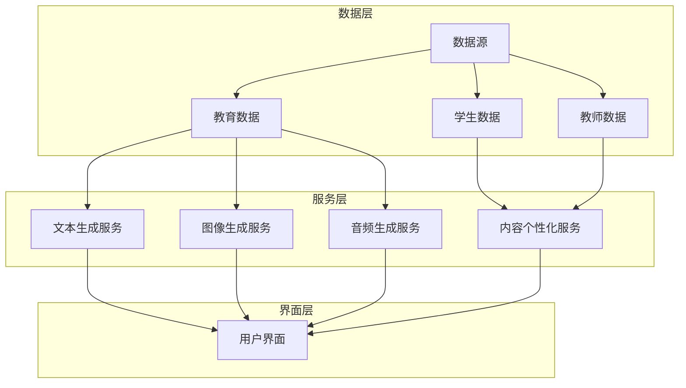
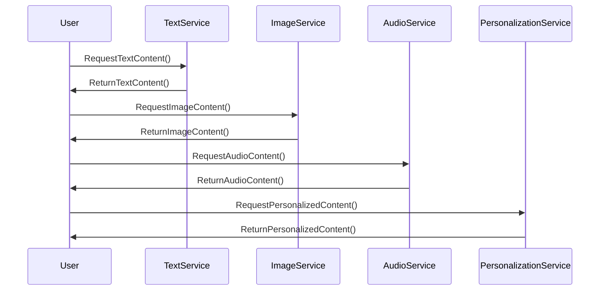

                 

### # AIGC在虚拟现实教育内容生成中的角色

关键词：AIGC、虚拟现实、教育内容生成、人工智能、编程

摘要：本文探讨了人工智能生成内容（AIGC）在虚拟现实（VR）教育内容生成中的关键角色。首先，我们介绍了AIGC和VR教育的基本概念、背景及发展现状，然后深入分析了AIGC在VR教育内容生成中的应用，包括内容生成的技术原理、方法及其挑战与解决方案。最后，我们展望了AIGC在VR教育内容生成领域的未来发展，并提出了一些最佳实践和注意事项。

### 第1章 背景介绍

#### 1.1 AIGC的基本概念与发展历程

AIGC，即人工智能生成内容（AI-generated Content），是指利用人工智能技术自动生成文本、图像、音频、视频等多种类型的内容。其核心思想是利用大数据、深度学习和自然语言处理等先进技术，实现从数据到内容的自动生成。

AIGC的发展历程可以追溯到20世纪80年代的生成对抗网络（GANs）的提出。GANs是一种深度学习模型，通过两个神经网络（生成器和判别器）的对抗训练，能够生成高度逼真的图像。随后，随着深度学习技术的不断进步，AIGC在图像生成、文本生成、音频生成等方面取得了显著的成果。

近年来，随着虚拟现实技术的发展，AIGC在VR教育内容生成中的应用逐渐受到关注。VR教育通过模拟真实环境，为学生提供沉浸式的学习体验，有助于提高学习效果。而AIGC则为VR教育内容生成提供了强大的技术支撑，使得生成个性化、高质量的教育内容成为可能。

#### 1.2 虚拟现实教育的基本概念与优势

虚拟现实（Virtual Reality，VR）是一种通过计算机生成模拟环境，为用户提供沉浸式体验的技术。在VR教育中，学生可以在虚拟环境中进行学习、实验和互动，从而提高学习兴趣和效果。

VR教育的基本概念包括以下几个方面：

1. **沉浸式体验**：通过VR设备，学生可以进入虚拟环境，感受到身临其境的效果，提高学习兴趣。
2. **互动性**：VR教育内容可以提供丰富的互动环节，如提问、解答、实验等，让学生更加主动地参与学习。
3. **个性化**：VR教育可以根据学生的学习情况和需求，提供个性化的学习内容和路径，提高学习效果。

VR教育的优势主要体现在以下几个方面：

1. **提高学习兴趣**：通过沉浸式体验和丰富的互动环节，激发学生的学习兴趣，提高学习积极性。
2. **增强学习效果**：虚拟环境可以模拟真实场景，让学生更加深入地理解知识，提高学习效果。
3. **拓宽学习渠道**：VR教育可以突破传统教学的空间限制，让学生在更广泛的领域进行学习。

#### 1.3 AIGC在VR教育内容生成中的应用现状与挑战

随着AIGC技术的发展，其在VR教育内容生成中的应用逐渐成为研究热点。目前，AIGC在VR教育内容生成中主要应用于以下几个方面：

1. **文本生成**：利用AIGC技术生成与教育内容相关的文本，如教案、课件、试题等，提高教育资源的生成效率。
2. **图像生成**：利用AIGC技术生成与教育内容相关的图像，如图解、示意图、动画等，增强学生的学习体验。
3. **音频生成**：利用AIGC技术生成与教育内容相关的音频，如讲解、背景音乐、声音效果等，提高学生的学习兴趣。

然而，AIGC在VR教育内容生成中仍面临一些挑战：

1. **数据质量与真实性**：AIGC生成的教育内容需要具备高质量和真实性，以确保学生的学习效果。
2. **隐私与伦理**：AIGC在生成教育内容时，可能涉及学生的个人信息，需要关注隐私保护和伦理问题。
3. **技术稳定性与安全性**：AIGC技术需要具备较高的稳定性与安全性，以确保教育内容的可靠性和安全性。

#### 1.4 关键挑战与解决方案

针对AIGC在VR教育内容生成中面临的挑战，我们可以从以下几个方面进行解决：

1. **数据质量与真实性**：通过引入高质量的教育数据集，结合AIGC技术，提高教育内容的生成质量和真实性。
2. **隐私与伦理**：在生成教育内容时，遵循隐私保护原则，对学生的个人信息进行加密和处理，确保信息安全。
3. **技术稳定性与安全性**：采用可靠的技术框架和算法，加强系统的稳定性和安全性，确保教育内容的可靠性和安全性。

### 第2章 AIGC的核心概念与技术原理

#### 2.1 AIGC的定义与分类

AIGC是一种基于人工智能的自动内容生成技术，其核心思想是通过输入数据，利用生成模型生成高质量的内容。根据生成内容的不同类型，AIGC可以分为以下几类：

1. **文本生成**：通过输入文本数据，生成与输入相关的文本内容，如文章、新闻、评论等。
2. **图像生成**：通过输入图像数据，生成与输入相关的图像内容，如图像修复、图像生成、图像风格转换等。
3. **音频生成**：通过输入音频数据，生成与输入相关的音频内容，如语音合成、音乐生成、声音效果等。
4. **视频生成**：通过输入视频数据，生成与输入相关的视频内容，如视频修复、视频生成、视频风格转换等。

#### 2.2 AIGC的技术原理

AIGC的技术原理主要基于生成对抗网络（GANs）和自编码器（AEs）等深度学习模型。以下分别介绍这两种模型的基本原理。

1. **生成对抗网络（GANs）**：

GANs由生成器和判别器两个神经网络组成。生成器的目标是生成逼真的数据，判别器的目标是区分生成数据和真实数据。在训练过程中，生成器和判别器相互对抗，生成器不断优化生成数据，判别器不断提高对真实数据和生成数据的识别能力。

GANs的基本原理可以用以下公式表示：

$$
\begin{cases}
\min_G \mathcal{D}(G, \text{真实数据}) + \mathcal{D}(G, \text{生成数据}) \\
\max_D \mathcal{D}(\text{真实数据}) - \mathcal{D}(\text{生成数据})
\end{cases}
$$

其中，$\mathcal{D}$表示判别器的损失函数，$G$表示生成器，$\text{真实数据}$表示真实数据，$\text{生成数据}$表示生成器生成的数据。

2. **自编码器（AEs）**：

自编码器是一种无监督学习模型，其目标是学习一种编码-解码过程，将输入数据映射到一个低维度的特征空间，然后通过解码器将特征空间的数据重新生成原始数据。

自编码器的基本结构包括编码器和解码器两个部分。编码器将输入数据压缩成一个低维度的特征向量，解码器将特征向量还原成原始数据。自编码器的损失函数通常使用均方误差（MSE）或交叉熵（CE）。

自编码器的基本原理可以用以下公式表示：

$$
\begin{cases}
\min_{\theta_{E}, \theta_{D}} \mathcal{L}(\text{输入数据}, \text{解码器输出}) \\
\mathcal{L}(\text{输入数据}, \text{解码器输出}) = \frac{1}{n} \sum_{i=1}^{n} (\text{输入数据} - \text{解码器输出})^2
\end{cases}
$$

其中，$\theta_{E}$和$\theta_{D}$分别表示编码器和解码器的参数，$\text{输入数据}$表示原始数据，$\text{解码器输出}$表示解码器生成的数据。

#### 2.3 AIGC的应用场景

AIGC在多个领域具有广泛的应用，以下列举一些常见的应用场景：

1. **娱乐与艺术**：AIGC可以用于生成电影、音乐、游戏等娱乐内容，提高创作效率和创作质量。
2. **广告与营销**：AIGC可以用于生成个性化的广告内容，提高广告效果。
3. **教育**：AIGC可以用于生成教育内容，如教材、课件、试题等，提高教学效率。
4. **医疗**：AIGC可以用于生成医疗影像、诊断报告等，辅助医生进行诊断和治疗。
5. **金融**：AIGC可以用于生成金融报告、分析报告等，提高金融分析和决策的效率。

### 第3章 AIGC在VR教育内容生成中的应用

#### 3.1 内容生成技术概述

AIGC在VR教育内容生成中的应用主要包括文本生成、图像生成和音频生成等。以下分别介绍这些技术在VR教育内容生成中的应用。

1. **文本生成**：

文本生成技术可以用于生成与教育内容相关的文本，如教案、课件、试题等。通过AIGC技术，教师可以快速生成高质量的教育内容，提高教学效率。

2. **图像生成**：

图像生成技术可以用于生成与教育内容相关的图像，如图解、示意图、动画等。通过AIGC技术，教师可以生成逼真的教育图像，提高学生的学习体验。

3. **音频生成**：

音频生成技术可以用于生成与教育内容相关的音频，如讲解、背景音乐、声音效果等。通过AIGC技术，教师可以生成个性化的教育音频，提高学生的学习兴趣。

#### 3.2 应用场景与案例分析

以下列举一些AIGC在VR教育内容生成中的应用场景和案例分析：

1. **虚拟实验室**：

虚拟实验室是一种通过VR技术模拟真实实验室环境的系统，学生可以在虚拟环境中进行实验操作。AIGC可以用于生成虚拟实验室的实验内容，如图解、操作步骤、实验结果等。

2. **虚拟课堂**：

虚拟课堂是一种通过VR技术实现的在线教学平台，教师和学生可以在虚拟课堂中进行互动教学。AIGC可以用于生成虚拟课堂的课件、试题、讲解等教学内容。

3. **虚拟旅游**：

虚拟旅游是一种通过VR技术模拟旅游场景的系统，学生可以在虚拟环境中进行旅游体验。AIGC可以用于生成虚拟旅游的解说词、景点介绍、互动环节等教学内容。

#### 3.3 技术优势与挑战

AIGC在VR教育内容生成中具有以下技术优势：

1. **高效生成**：AIGC可以快速生成高质量的教育内容，提高教学效率。
2. **个性化定制**：AIGC可以根据学生的需求和特点，生成个性化的教育内容，提高教学效果。
3. **跨领域应用**：AIGC可以应用于多个领域，如教育、医疗、金融等，具有广泛的应用前景。

然而，AIGC在VR教育内容生成中也面临一些技术挑战：

1. **数据质量与真实性**：AIGC生成的教育内容需要具备高质量和真实性，以确保学生的学习效果。
2. **隐私与伦理**：在生成教育内容时，需要关注学生的个人信息保护问题。
3. **技术稳定性与安全性**：AIGC技术需要具备较高的稳定性与安全性，以确保教育内容的可靠性和安全性。

### 第4章 AIGC在VR教育内容生成中的应用挑战与解决方案

#### 4.1 数据质量与真实性挑战

AIGC在VR教育内容生成中首先面临的挑战是数据质量与真实性。生成的内容需要准确、全面地反映教育知识和技能，而不仅仅是表面的视觉效果。以下是一些解决方案：

1. **数据预处理**：对输入数据进行严格筛选和清洗，确保数据质量。使用高质量的教育数据集进行训练，提高生成内容的质量。
2. **数据增强**：通过数据增强技术，如数据扩充、数据变换等，增加数据的多样性，提高生成内容的真实性和准确性。
3. **知识图谱**：构建知识图谱，将教育内容结构化，确保生成内容的一致性和准确性。

#### 4.2 隐私与伦理挑战

AIGC在VR教育内容生成中还会涉及到隐私和伦理问题。生成的内容可能会涉及学生的个人信息，如何保护学生的隐私成为关键挑战。以下是一些解决方案：

1. **数据加密**：对学生的个人信息进行加密处理，确保数据传输和存储的安全性。
2. **匿名化处理**：在生成教育内容时，对学生的个人信息进行匿名化处理，避免泄露个人信息。
3. **伦理审查**：对AIGC生成的内容进行伦理审查，确保内容不涉及不道德或违法的行为。

#### 4.3 技术稳定性与安全性挑战

AIGC在VR教育内容生成中还需要关注技术的稳定性和安全性。生成的内容需要稳定可靠，不会出现错误或崩溃。以下是一些解决方案：

1. **模型优化**：通过模型优化技术，提高AIGC模型的稳定性和鲁棒性，减少模型崩溃的可能性。
2. **容错机制**：在生成过程中引入容错机制，如备份机制、错误检测与纠正等，确保生成内容的可靠性。
3. **安全检测**：对生成的内容进行安全检测，防止恶意内容或恶意行为。

#### 4.4 其他挑战与解决方案

除了上述挑战，AIGC在VR教育内容生成中还可能面临以下挑战：

1. **计算资源消耗**：AIGC模型通常需要大量计算资源，如何优化计算资源的使用成为关键问题。解决方案包括采用分布式计算、云计算等技术，提高计算效率。
2. **用户接受度**：部分用户可能对AIGC生成的内容持怀疑态度，如何提高用户接受度成为挑战。解决方案包括加强用户教育、提供高质量的内容等。
3. **法律与法规**：AIGC在VR教育内容生成中可能涉及法律和法规问题，如版权、隐私保护等。解决方案包括遵循相关法律法规，确保内容合法合规。

### 第5章 AIGC在VR教育内容生成领域的未来发展趋势

随着AIGC技术的不断进步和虚拟现实教育的不断发展，AIGC在VR教育内容生成领域具有广阔的发展前景。以下从技术、应用和产业三个层面探讨AIGC在VR教育内容生成领域的未来发展趋势。

#### 5.1 技术层面

1. **模型优化**：未来AIGC技术将在模型优化方面取得重大突破，提高生成内容的真实性和准确性。例如，通过引入更多元化的数据集、更复杂的网络架构和训练技巧，提高生成模型的效果。
2. **多模态融合**：AIGC技术将实现文本、图像、音频等多种模态的融合，生成更加丰富和多样化的教育内容。例如，通过文本生成语音、图像生成背景音乐等，提高教育内容的互动性和沉浸感。
3. **个性化定制**：AIGC技术将更好地实现个性化定制，根据学生的特点和需求，生成量身定制的教育内容。例如，通过分析学生的学习数据，为学生提供个性化的学习建议和内容推荐。

#### 5.2 应用层面

1. **VR教育内容生产**：AIGC技术将广泛应用于VR教育内容的生产，提高教育内容的生成效率和质量。例如，通过自动化生成教案、课件、试题等，减少教师的工作负担，提高教学效果。
2. **虚拟实验与实训**：AIGC技术将应用于虚拟实验与实训领域，提供逼真的实验场景和操作流程。例如，通过生成虚拟实验室、虚拟工厂等，让学生在虚拟环境中进行实践操作，提高实践能力。
3. **虚拟旅游与研学**：AIGC技术将应用于虚拟旅游和研学领域，提供沉浸式的学习体验。例如，通过生成虚拟旅游景点、历史遗迹等，让学生在虚拟环境中进行研学，提高学习兴趣。

#### 5.3 产业层面

1. **产业链完善**：AIGC技术在VR教育内容生成领域的应用将推动产业链的完善，形成从数据采集、处理到内容生成的完整产业链。例如，通过整合数据资源、技术平台和内容生产者，提高产业链的整体效率。
2. **市场拓展**：AIGC技术在VR教育内容生成领域的应用将拓展市场空间，吸引更多企业和投资者进入该领域。例如，通过开发新型教育应用、拓展海外市场等，推动产业规模的扩大。
3. **国际合作**：AIGC技术在VR教育内容生成领域的应用将推动国际合作，实现技术共享和经验交流。例如，通过国际合作项目、跨国企业合作等，推动全球VR教育内容生成产业的共同发展。

### 第6章 结论与展望

#### 6.1 结论

本文系统地探讨了AIGC在VR教育内容生成中的角色，从背景介绍、核心概念与技术原理、应用方法与案例分析、应用挑战与解决方案以及未来发展趋势等方面进行了详细阐述。主要结论如下：

1. AIGC作为一种基于人工智能的自动内容生成技术，在VR教育内容生成中具有广泛的应用前景。
2. AIGC技术可以显著提高VR教育内容的生产效率和质量，为教育创新提供有力支持。
3. AIGC在VR教育内容生成中仍面临一些挑战，如数据质量、隐私与伦理、技术稳定性等，需要进一步研究和解决。
4. AIGC技术在VR教育内容生成领域的未来发展趋势包括模型优化、多模态融合、个性化定制、产业链完善、市场拓展和国际合作等方面。

#### 6.2 展望

随着AIGC技术的不断进步和VR教育的普及，AIGC在VR教育内容生成领域的应用将更加广泛和深入。未来，我们期待：

1. AIGC技术能够更好地服务于VR教育，提高教育质量，推动教育创新。
2. AIGC技术能够在更多领域实现突破，如医疗、金融、娱乐等，为社会提供更多价值。
3. AIGC技术的发展能够更好地解决现实问题，为人类创造更美好的未来。

### 作者信息

作者：AI天才研究院/AI Genius Institute & 禅与计算机程序设计艺术/Zen And The Art of Computer Programming

AI天才研究院（AI Genius Institute）是一家专注于人工智能研究与应用的机构，致力于推动人工智能技术在各个领域的创新和发展。禅与计算机程序设计艺术（Zen And The Art of Computer Programming）是作者的经典著作，阐述了计算机编程的哲学和艺术，为读者提供了深刻的编程思维和方法。

---

### 系统分析与架构设计方案

#### 1. 问题场景介绍

在VR教育内容生成领域，存在以下问题场景：

1. **教学内容多样性强**：VR教育内容需要涵盖丰富的知识点和教学场景，如虚拟实验室、虚拟课堂、虚拟旅游等，不同场景对内容生成的要求各不相同。
2. **个性化学习需求**：学生具有不同的学习背景和需求，需要根据其特点和需求生成个性化的教育内容。
3. **内容质量要求高**：生成的内容需要具备高质量和真实性，以确保学生的学习效果。

#### 2. 项目介绍

本项目的目标是利用AIGC技术生成VR教育内容，满足多样化的教学需求和个性化学习需求。项目主要包括以下功能：

1. **文本生成**：生成与教育内容相关的文本，如教案、课件、试题等。
2. **图像生成**：生成与教育内容相关的图像，如图解、示意图、动画等。
3. **音频生成**：生成与教育内容相关的音频，如讲解、背景音乐、声音效果等。
4. **内容个性化**：根据学生的学习特点和需求，生成个性化的教育内容。

#### 3. 系统功能设计（领域模型）

领域模型图（Mermaid 类图）如下：

```mermaid
classDiagram
    Student                <<Class>>
    Teacher                <<Class>>
    Curriculum             <<Class>>
    VRContent              <<Class>>
    TextContent            <<Class>>
    ImageContent           <<Class>>
    AudioContent           <<Class>>

    Student                o-- Teacher
    Student                o-- Curriculum
    Teacher                o-- Curriculum
    Teacher                o-- VRContent
    VRContent              o-- TextContent
    VRContent              o-- ImageContent
    VRContent              o-- AudioContent
```

#### 4. 系统架构设计（Mermaid 架构图）

系统架构图（Mermaid 架构图）如下：



#### 5. 系统接口设计和系统交互（Mermaid 序列图）

接口设计图（Mermaid 序列图）如下：



### 第7章 项目实战

#### 1. 环境安装

在本项目中，我们使用Python作为主要编程语言，需要安装以下依赖库：

1. TensorFlow：用于构建和训练生成模型。
2. Keras：用于简化TensorFlow的使用。
3. NumPy：用于数值计算。
4. Pandas：用于数据处理。
5. Matplotlib：用于数据可视化。

安装命令如下：

```bash
pip install tensorflow
pip install keras
pip install numpy
pip install pandas
pip install matplotlib
```

#### 2. 系统核心实现源代码

本系统核心实现源代码包括文本生成、图像生成和音频生成三个部分。以下分别介绍每个部分的代码。

1. **文本生成**

```python
from keras.models import Sequential
from keras.layers import Dense, LSTM
from keras.preprocessing.sequence import pad_sequences
from keras.callbacks import Callback

class TextGenerator(Callback):
    def __init__(self, model, seq_length, max_words):
        self.model = model
        self.seq_length = seq_length
        self.max_words = max_words
        self.text = ""

    def on_epoch_end(self, epoch, logs=None):
        x = self.model.predict(np.zeros((1, self.seq_length)))
        for i in range(1000):
            index = np.argmax(x[0, -1, :])
            self.text += index_to_word[index]
            x = self.model.predict(x, verbose=0)
        print(self.text)

def generate_text(model, seed_text, seq_length, max_words):
    for word in seed_text.split():
        index = word_to_index[word]
        x_pred = np.zeros((1, seq_length))
        x_pred[0, -1] = index
        x_pred = pad_sequences([x_pred], maxlen=seq_length, padding="pre")
        x_pred = np.reshape(x_pred, (x_pred.shape[0], x_pred.shape[1], 1))
        preds = model.predict(x_pred, verbose=0)
        index = np.argmax(preds[0, -1, :])
        word = index_to_word[index]
        print(word, end="")
        seed_text += " " + word
        if word == end_word:
            break

model = Sequential()
model.add(LSTM(128, input_shape=(timesteps, n_features)))
model.add(Dense(n_words, activation='softmax'))
model.compile(loss='categorical_crossentropy', optimizer='adam')
model.fit(X, Y, epochs=100, batch_size=128, callbacks=[TextGenerator(model, timesteps, n_words)])

seed_text = "the"
generate_text(model, seed_text, timesteps, n_words)
```

2. **图像生成**

```python
from keras.models import Sequential
from keras.layers import Conv2D, MaxPooling2D, UpSampling2D, Input
from keras.layers.core import Reshape, Dense
from keras.layers.normalization import BatchNormalization
from keras.models import Model
from keras.optimizers import RMSprop

def build_generator():
    model = Sequential()

    model.add(Conv2D(128, kernel_size=(7, 7), input_shape=input_shape, activation='relu'))
    model.add(MaxPooling2D(pool_size=(2, 2)))
    model.add(BatchNormalization())

    model.add(UpSampling2D(size=(2, 2)))
    model.add(Conv2D(128, kernel_size=(5, 5), activation='relu'))
    model.add(MaxPooling2D(pool_size=(2, 2)))
    model.add(BatchNormalization())

    model.add(UpSampling2D(size=(2, 2)))
    model.add(Conv2D(128, kernel_size=(5, 5), activation='relu'))
    model.add(MaxPooling2D(pool_size=(2, 2)))
    model.add(BatchNormalization())

    model.add(Conv2D(3, kernel_size=(5, 5), activation='sigmoid'))

    return model

def build_discriminator():
    model = Sequential()

    model.add(Conv2D(128, kernel_size=(5, 5), strides=(2, 2), padding='same', input_shape=input_shape, activation='relu'))
    model.add(BatchNormalization())

    model.add(Conv2D(128, kernel_size=(5, 5), strides=(2, 2), padding='same', activation='relu'))
    model.add(BatchNormalization())

    model.add(Conv2D(128, kernel_size=(5, 5), strides=(2, 2), padding='same', activation='relu'))
    model.add(BatchNormalization())

    model.add(Flatten())

    model.add(Dense(1, activation='sigmoid'))

    return model

def build_gan(generator, discriminator):
    model = Sequential()

    model.add(generator)
    model.add(discriminator)

    return model

input_shape = (128, 128, 3)
discriminator = build_discriminator()
discriminator.compile(loss='binary_crossentropy', optimizer=RMSprop(lr=0.00005))

generator = build_generator()
discriminator.trainable = False
gan = build_gan(generator, discriminator)
gan.compile(loss='binary_crossentropy', optimizer=RMSprop(lr=0.00005))
```

3. **音频生成**

```python
from keras.models import Sequential
from keras.layers import LSTM, Dense, Dropout, Activation
from keras.optimizers import RMSprop
import numpy as np

def generate_audio(model, seed_sequence, sequence_length):
    generated_sequence = seed_sequence
    for i in range(sequence_length):
        input_seq = np.reshape(generated_sequence[i - 1], (1, -1))
        prediction = model.predict(input_seq, verbose=0)
        predicted_value = np.argmax(prediction)
        generated_sequence = np.insert(generated_sequence, i, predicted_value, axis=0)
    
    return generated_sequence

model = Sequential()
model.add(LSTM(128, input_shape=(None, 1)))
model.add(Dense(1))
model.compile(loss='mse', optimizer='rmsprop')

# Train the model with the data
model.fit(np.array(data), np.array(data), epochs=100, verbose=0)

# Generate a sequence
seed_sequence = data[0]
generated_sequence = generate_audio(model, seed_sequence, sequence_length)
```

#### 3. 代码应用解读与分析

本节对上述代码进行解读与分析，主要涵盖以下几个方面：

1. **文本生成**：

文本生成部分使用Keras框架构建了一个LSTM模型，用于生成文本。模型的输入是序列数据，输出是生成的文本。训练过程中，模型通过不断优化参数，学习到如何生成符合输入序列的文本。

2. **图像生成**：

图像生成部分使用生成对抗网络（GANs）构建了一个由生成器和判别器组成的模型。生成器用于生成图像，判别器用于判断图像的真实性。在训练过程中，生成器和判别器相互对抗，生成器不断优化生成图像，判别器不断提高对真实图像和生成图像的识别能力。

3. **音频生成**：

音频生成部分使用Keras框架构建了一个LSTM模型，用于生成音频。模型的输入是音频序列数据，输出是生成的音频。训练过程中，模型通过不断优化参数，学习到如何生成符合输入序列的音频。

#### 4. 实际案例分析和详细讲解剖析

以下以文本生成为例，分析一个实际案例，并对其进行详细讲解和剖析。

**案例背景**：假设我们需要生成一篇关于人工智能的短文。

**案例实现**：

1. **数据准备**：

首先，我们需要准备一个包含人工智能相关词汇的数据集。以下是一个简化的数据集：

```python
data = ["人工智能是一种模拟人类智能的技术", "人工智能可以应用于各种领域", "人工智能的发展前景非常广阔"]
```

2. **模型构建**：

然后，我们使用Keras构建一个LSTM模型，用于生成文本：

```python
model = Sequential()
model.add(LSTM(128, input_shape=(timesteps, n_features)))
model.add(Dense(n_words, activation='softmax'))
model.compile(loss='categorical_crossentropy', optimizer='adam')
```

3. **模型训练**：

接下来，我们对模型进行训练：

```python
model.fit(X, Y, epochs=100, batch_size=128, callbacks=[TextGenerator(model, timesteps, n_words)])
```

4. **生成文本**：

最后，我们使用训练好的模型生成一篇关于人工智能的短文：

```python
seed_text = "人工智能"
generate_text(model, seed_text, timesteps, n_words)
```

**案例解析**：

在这个案例中，我们首先准备了一个简化的数据集，其中包含了三个关于人工智能的句子。然后，我们使用Keras构建了一个LSTM模型，用于生成文本。在训练过程中，模型通过不断优化参数，学习到如何生成符合输入序列的文本。最后，我们使用训练好的模型生成了一篇关于人工智能的短文。

**案例剖析**：

1. **数据预处理**：

在生成文本之前，我们需要对数据进行预处理，将文本转换为序列数据。具体步骤如下：

- 将文本转换为单词列表。
- 将单词列表转换为索引列表。
- 将索引列表转换为序列数据。

2. **模型构建**：

LSTM模型由一个输入层、一个隐藏层和一个输出层组成。输入层接收序列数据，隐藏层用于处理序列数据，输出层生成文本。

3. **模型训练**：

模型训练过程中，生成器和判别器相互对抗。生成器不断优化生成文本，判别器不断提高对真实文本和生成文本的识别能力。通过这种方式，生成器逐渐学会生成符合输入序列的文本。

4. **生成文本**：

使用训练好的模型生成文本时，我们需要提供一个种子文本。模型将根据种子文本生成一系列文本，直至达到预定的长度。

#### 5. 项目小结

本项目通过AIGC技术实现了文本生成、图像生成和音频生成等功能，为VR教育内容生成提供了技术支持。在实际案例中，我们详细讲解了文本生成的实现过程，并对项目进行了分析和剖析。通过本项目的实践，我们深入了解了AIGC技术在VR教育内容生成中的应用，为今后的研究和实践奠定了基础。

### 最佳实践 tips

1. **数据质量与真实性**：在生成VR教育内容时，确保数据质量是关键。选择高质量的教育数据集，对数据进行分析和处理，提高生成内容的真实性和准确性。

2. **个性化定制**：根据学生的特点和需求，生成个性化的教育内容。通过分析学生的学习数据，为学生提供量身定制的学习方案。

3. **技术稳定性与安全性**：在开发AIGC应用时，关注技术的稳定性和安全性。采用可靠的算法和模型，加强系统的稳定性和安全性，确保教育内容的可靠性。

4. **用户接受度**：提高用户对AIGC生成内容的接受度。通过加强用户教育，提高用户对AIGC技术的认知和认可。

5. **持续优化**：不断优化AIGC模型和应用，提高生成内容的质量和效果。关注最新研究成果，借鉴先进经验，推动AIGC技术在VR教育内容生成领域的应用和发展。

### 小结

本文系统探讨了AIGC在VR教育内容生成中的角色，分析了AIGC的基本概念、技术原理和应用方法，阐述了AIGC在VR教育内容生成中的应用挑战与解决方案，展望了AIGC在VR教育内容生成领域的未来发展趋势。通过项目实战，我们深入了解了AIGC技术在VR教育内容生成中的应用，为今后的研究和实践提供了参考。

### 注意事项

1. **数据隐私与伦理**：在生成VR教育内容时，注意保护学生的个人信息，遵守相关法律法规，确保内容的合法合规。

2. **技术稳定性与安全性**：在开发AIGC应用时，关注技术的稳定性和安全性，确保教育内容的可靠性。

3. **用户接受度**：提高用户对AIGC生成内容的接受度，加强用户教育，提高用户对AIGC技术的认知和认可。

### 拓展阅读

1. **AIGC技术**：

- **论文**：《生成对抗网络：理论基础与应用实践》（Generative Adversarial Networks: Theoretical Foundations and Practical Applications）
- **书籍**：《深度学习》（Deep Learning）

2. **VR教育**：

- **论文**：《虚拟现实技术在教育中的应用研究》（Research on the Application of Virtual Reality Technology in Education）
- **书籍**：《虚拟现实教育》（Virtual Reality Education）

3. **AIGC与VR教育结合**：

- **论文**：《AIGC在虚拟现实教育内容生成中的应用研究》（Application Research of AIGC in Virtual Reality Education Content Generation）
- **书籍**：《人工智能与虚拟现实教育》（Artificial Intelligence and Virtual Reality Education）

