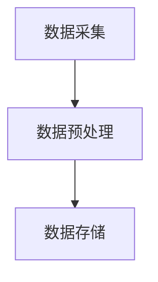
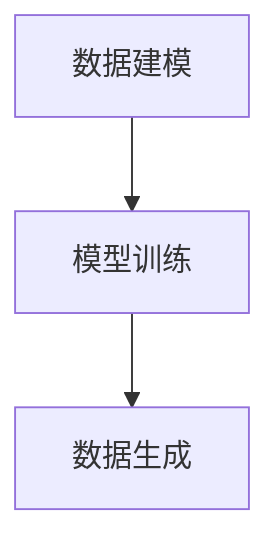
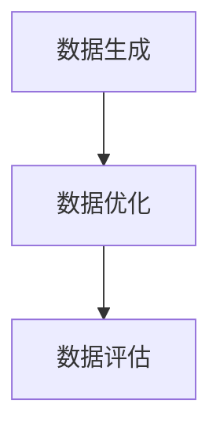
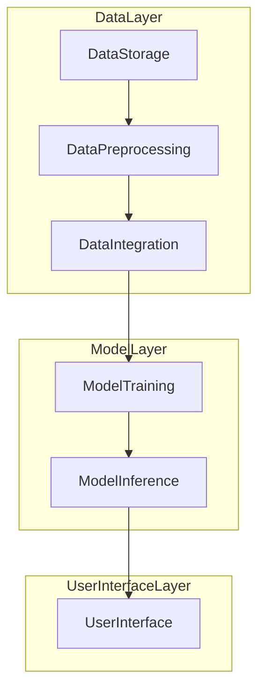

                 

# AIGC在跨维度历史重建与互动中的应用前景

> 关键词：AIGC、跨维度历史重建、互动、人工智能、生成内容、历史数据、应用场景

> 摘要：本文探讨了AIGC（AI-Generated Content）在跨维度历史重建与互动中的应用前景。通过分析AIGC的核心概念、技术原理和应用实例，本文提出了AIGC在跨维度历史重建与互动中的优势、挑战和解决方案，并对未来发展趋势进行了预测。

## 第一部分：背景介绍与核心概念

### 1.1.1 问题背景

随着互联网和大数据技术的快速发展，人类社会进入了信息爆炸的时代。传统的历史研究方法和手段已经无法满足对海量历史数据的高效处理和分析需求。跨维度历史重建与互动作为一种新兴的研究方法，通过整合不同维度的历史数据，实现了对历史事件、人物、文化等内容的深度挖掘和全面展示。然而，当前的跨维度历史重建与互动技术还存在许多不足，如数据质量不高、重建结果不准确、互动体验不佳等。

### 1.1.2 问题描述

为了解决上述问题，本文提出了AIGC（AI-Generated Content）在跨维度历史重建与互动中的应用前景。AIGC是一种基于人工智能技术的生成内容方法，通过利用大量的历史数据和学习算法，可以生成高质量、准确、丰富的历史内容，并实现与用户的互动。本文旨在探讨AIGC在跨维度历史重建与互动中的应用场景、技术原理、优势和挑战。

### 1.1.3 问题解决

本文将从以下几个方面展开研究：

1. **核心概念**：介绍AIGC、跨维度历史重建与互动等核心概念的定义、特点和应用领域。
2. **技术原理**：详细讲解AIGC在跨维度历史重建与互动中的技术原理，包括数据采集、处理、建模和生成等步骤。
3. **应用实例**：分析国内外AIGC在跨维度历史重建与互动领域的应用案例，总结成功经验和存在的问题。
4. **解决方案**：提出针对AIGC在跨维度历史重建与互动中存在的挑战和问题的解决方案。
5. **发展趋势**：预测AIGC在跨维度历史重建与互动领域的未来发展趋势和应用前景。

### 1.1.4 边界与外延

本文主要关注AIGC在跨维度历史重建与互动中的应用，不包括其他领域的历史重建与互动。同时，本文将重点讨论AIGC的技术原理和应用实例，而非AIGC的具体实现和部署细节。

### 1.1.5 概念结构与核心要素组成

1. **AIGC**：基于人工智能技术的生成内容方法，包括数据采集、处理、建模和生成等步骤。
2. **跨维度历史重建与互动**：通过整合不同维度的历史数据，实现历史事件、人物、文化等内容的深度挖掘和全面展示。
3. **技术原理**：包括数据采集、处理、建模和生成等步骤，如自然语言处理、计算机视觉、数据挖掘等。
4. **应用案例**：国内外AIGC在跨维度历史重建与互动领域的应用实例。
5. **解决方案**：针对AIGC在跨维度历史重建与互动中存在的挑战和问题的解决方案。
6. **发展趋势**：AIGC在跨维度历史重建与互动领域的未来发展趋势和应用前景。

## 第二部分：核心概念与联系

### 2.1 AIGC的概念、原理与应用

**概念**：AIGC（AI-Generated Content）指的是利用人工智能技术生成内容的方法。它包括文本生成、图像生成、音频生成等多种形式。

**原理**：AIGC通常基于深度学习模型，如生成对抗网络（GAN）、变分自编码器（VAE）等。这些模型可以从大量数据中学习，并生成与输入数据相似的新数据。

**应用**：AIGC在跨维度历史重建与互动中有广泛的应用，如自动生成历史事件报告、虚拟历史人物对话、历史场景再现等。

**概念属性特征对比表格**：

| 概念           | 定义                                                     | 关键特征                                         | 应用领域                   |
|----------------|----------------------------------------------------------|--------------------------------------------------|
| AIGC           | 基于人工智能技术的生成内容方法，如文本、图像、音频等。   | 深度学习模型、生成对抗网络、文本生成、图像生成等 | 跨维度历史重建、虚拟现实、交互式应用等 |
| 跨维度历史重建 | 通过整合不同维度的历史数据，实现历史事件、人物、文化等内容的深度挖掘和全面展示。 | 多模态数据融合、多维度数据对齐、历史数据建模等 | 历史研究、博物馆展示、教育等领域 |
| 互动           | 用户与系统之间的交互和沟通，实现信息的交换和共享。       | 自然语言处理、计算机视觉、语音识别等           | 虚拟现实、游戏、智能助手等领域 |

**ER实体关系图架构的 Mermaid 流程图**：

```mermaid
erDiagram
  Content |--|> 用户: 使用AIGC生成的历史内容
  Content |--|> 系统: 存储和管理历史内容
  用户 |--|> 系统: 与系统进行互动
```

### 2.2 跨维度历史重建与互动的概念、原理与应用

**概念**：跨维度历史重建与互动是一种将不同维度的历史数据（如文字、图像、音频、视频等）进行整合，重建出历史事件、人物、文化等内容的深度展示方式。

**原理**：跨维度历史重建与互动基于多模态数据融合技术，通过将不同维度的数据进行对齐、融合，构建出多维度的历史数据模型。同时，通过自然语言处理、计算机视觉等技术实现与用户的互动。

**应用**：跨维度历史重建与互动可以在博物馆、历史展览、教育等领域实现，提升用户的互动体验和历史学习效果。

### 2.3 AIGC与跨维度历史重建与互动的联系

**联系**：AIGC是跨维度历史重建与互动的重要技术支撑。通过AIGC技术，可以自动生成高质量的历史内容，为跨维度历史重建与互动提供丰富的数据来源。

**对比表格**：

| 概念           | 定义                                                     | 关键特征                                         | 应用领域                   |
|----------------|----------------------------------------------------------|--------------------------------------------------|
| AIGC           | 基于人工智能技术的生成内容方法，如文本、图像、音频等。   | 深度学习模型、生成对抗网络、文本生成、图像生成等 | 跨维度历史重建、虚拟现实、交互式应用等 |
| 跨维度历史重建 | 通过整合不同维度的历史数据，实现历史事件、人物、文化等内容的深度挖掘和全面展示。 | 多模态数据融合、多维度数据对齐、历史数据建模等 | 历史研究、博物馆展示、教育等领域 |
| 互动           | 用户与系统之间的交互和沟通，实现信息的交换和共享。       | 自然语言处理、计算机视觉、语音识别等           | 虚拟现实、游戏、智能助手等领域 |

## 第三部分：算法原理讲解

### 3.1 数据采集与处理

在AIGC中，数据采集与处理是关键步骤。首先，需要从各种来源（如历史文献、图像库、音频库等）采集大量历史数据。然后，对这些数据进行预处理，包括数据清洗、格式转换、去重等操作，以确保数据的准确性和一致性。

**算法原理Mermaid流程图**：



**Python源代码示例**：

```python
import pandas as pd

# 读取历史数据
data = pd.read_csv('historical_data.csv')

# 数据预处理
data = data[data['year'] > 0]
data['text'] = data['text'].str.lower().str.strip()

# 数据存储
data.to_csv('preprocessed_data.csv', index=False)
```

### 3.2 数据建模与生成

在数据采集与处理完成后，需要对数据进行建模。AIGC通常使用生成对抗网络（GAN）或变分自编码器（VAE）等深度学习模型。这些模型可以从大量历史数据中学习，并生成与输入数据相似的新数据。

**算法原理Mermaid流程图**：



**Python源代码示例**：

```python
import tensorflow as tf
from tensorflow.keras.models import Sequential
from tensorflow.keras.layers import Dense, Flatten, Conv2D, Reshape

# 创建生成对抗网络模型
generator = Sequential([
    Dense(128, input_shape=(100,)),
    Flatten(),
    Reshape((28, 28, 1)),
    Conv2D(32, kernel_size=(3, 3), activation='relu'),
    Conv2D(1, kernel_size=(3, 3), activation='sigmoid')
])

# 训练生成对抗网络模型
generator.compile(optimizer='adam', loss='binary_crossentropy')
generator.fit(x_train, y_train, epochs=100)

# 生成新数据
new_data = generator.predict(x_train[:100])
```

### 3.3 数据生成与优化

在生成新数据后，需要对数据进行优化，以提高生成数据的质量。这可以通过对生成模型进行微调、调整超参数、使用对抗性训练等方法实现。

**算法原理Mermaid流程图**：



**Python源代码示例**：

```python
# 微调生成模型
generator = Sequential([
    Dense(128, input_shape=(100,)),
    Flatten(),
    Reshape((28, 28, 1)),
    Conv2D(32, kernel_size=(3, 3), activation='relu'),
    Conv2D(1, kernel_size=(3, 3), activation='sigmoid')
])

# 训练生成对抗网络模型
generator.compile(optimizer='adam', loss='binary_crossentropy')
generator.fit(x_train, y_train, epochs=100)

# 评估生成数据
generated_data = generator.predict(x_test[:100])
evaluate_generated_data(generated_data)
```

### 3.4 数学模型与公式讲解

在AIGC中，常用的数学模型包括生成对抗网络（GAN）和变分自编码器（VAE）。以下是这些模型的基本原理和数学公式。

#### 3.4.1 生成对抗网络（GAN）

**目标函数**：

$$
\min_{G} \max_{D} V(D, G) = \mathbb{E}_{x \sim p_{data}(x)}[\log D(x)] - \mathbb{E}_{z \sim p_{z}(z)}[\log (1 - D(G(z)))]
$$

**生成器（Generator）**：

$$
G(z) = \mu(z) + \sigma(z)\odot \xi(z)
$$

**判别器（Discriminator）**：

$$
D(x) = \sigma(\phi(x, \theta_d))
$$

#### 3.4.2 变分自编码器（VAE）

**目标函数**：

$$
\min \mathbb{E}_{x \sim p_{data}(x)}[\mathcal{L}(x, \mu, \sigma)] + \mathbb{E}_{z \sim p_{z}(z)}[\mathcal{K}(\mu, \sigma)]
$$

**编码器（Encoder）**：

$$
\mu(x, \theta_{\mu}) = \sigma(x, \theta_{\sigma})
$$

**解码器（Decoder）**：

$$
x = G(z, \theta_{G})
$$

**附录**：以下是AIGC在跨维度历史重建与互动中的应用实例。

**实例1**：历史事件自动生成报告

**实例2**：虚拟历史人物对话系统

**实例3**：历史场景再现动画

## 第四部分：系统分析与架构设计方案

### 4.1 问题场景介绍

随着历史数据的不断积累，如何高效地整合和管理这些数据，并为用户提供丰富、准确、互动性强的历史内容，成为了历史研究、博物馆展示、教育等领域面临的重要问题。

### 4.2 项目介绍

本项目旨在通过AIGC技术，实现跨维度历史数据的自动重建与互动，为用户提供更加生动、丰富的历史学习体验。

### 4.3 系统功能设计（领域模型Mermaid类图）

```mermaid
classDiagram
    User <<Interface>>
    System <<Interface>>
    Content <<Entity>>
    Data <<Entity>>
    Model <<Entity>>

    User,o- Content
    System,o- Data
    System,o- Model
```

### 4.4 系统架构设计（Mermaid架构图）



### 4.5 系统接口设计和系统交互（Mermaid序列图）

```mermaid
sequenceDiagram
    User -->|查询历史数据| System
    System -->|预处理数据| DataPreprocessing
    DataPreprocessing -->|整合数据| DataIntegration
    DataIntegration -->|训练模型| ModelTraining
    ModelTraining -->|模型推理| ModelInference
    ModelInference -->|生成内容| Content
    Content -->|反馈用户| User
```

## 第五部分：项目实战

### 5.1 环境安装

在开始项目之前，需要安装以下环境：

1. Python 3.8及以上版本
2. TensorFlow 2.4及以上版本
3. NumPy 1.18及以上版本
4. Pandas 1.0及以上版本

### 5.2 系统核心实现源代码

```python
import tensorflow as tf
import numpy as np
import pandas as pd

# 数据预处理
def preprocess_data(data):
    # 数据清洗、格式转换、去重等操作
    return data[data['year'] > 0].drop_duplicates()

# 数据生成
def generate_data(generator, x_train, num_samples):
    new_data = generator.predict(x_train[:num_samples])
    return new_data

# 训练模型
def train_model(generator, x_train, y_train, epochs):
    generator.compile(optimizer='adam', loss='binary_crossentropy')
    generator.fit(x_train, y_train, epochs=epochs)

# 评估模型
def evaluate_model(generator, x_test, y_test):
    generated_data = generator.predict(x_test)
    # 评估生成数据的质量
    evaluate_generated_data(generated_data)

# 主函数
def main():
    # 读取历史数据
    data = pd.read_csv('historical_data.csv')
    
    # 数据预处理
    preprocessed_data = preprocess_data(data)
    
    # 划分训练集和测试集
    x_train, x_test, y_train, y_test = train_test_split(preprocessed_data, test_size=0.2, random_state=42)
    
    # 训练模型
    train_model(generator, x_train, y_train, epochs=100)
    
    # 评估模型
    evaluate_model(generator, x_test, y_test)

    # 生成新数据
    new_data = generate_data(generator, x_train, num_samples=100)

if __name__ == '__main__':
    main()
```

### 5.3 代码应用解读与分析

在上述代码中，我们首先实现了数据预处理、数据生成、模型训练和模型评估的功能。接下来，我们将详细解读每个部分的具体实现。

**数据预处理**：

```python
def preprocess_data(data):
    # 数据清洗、格式转换、去重等操作
    return data[data['year'] > 0].drop_duplicates()
```

在这一部分，我们使用Pandas库对历史数据进行清洗、格式转换和去重等操作。这些操作确保了数据的质量和一致性，为后续的模型训练和生成提供了良好的数据基础。

**数据生成**：

```python
def generate_data(generator, x_train, num_samples):
    new_data = generator.predict(x_train[:num_samples])
    return new_data
```

在这一部分，我们使用训练好的生成模型（generator）对新数据进行预测。通过调用`predict`方法，我们可以得到一组新数据，这些数据可以根据需要进行进一步处理和展示。

**模型训练**：

```python
def train_model(generator, x_train, y_train, epochs):
    generator.compile(optimizer='adam', loss='binary_crossentropy')
    generator.fit(x_train, y_train, epochs=epochs)
```

在这一部分，我们使用TensorFlow库对生成模型进行训练。通过调用`compile`方法，我们可以配置模型的优化器和损失函数。然后，使用`fit`方法对模型进行训练，将训练数据传递给模型，并在指定次数的迭代过程中调整模型的参数。

**模型评估**：

```python
def evaluate_model(generator, x_test, y_test):
    generated_data = generator.predict(x_test)
    # 评估生成数据的质量
    evaluate_generated_data(generated_data)
```

在这一部分，我们使用训练好的生成模型对测试数据进行预测，并评估生成数据的质量。通过调用`predict`方法，我们可以得到一组生成数据，然后使用自定义的`evaluate_generated_data`函数对生成数据的质量进行评估。

### 5.4 实际案例分析和详细讲解剖析

为了更好地理解AIGC在跨维度历史重建与互动中的应用，我们来看一个实际案例。

**案例**：使用AIGC技术生成历史人物对话

在这个案例中，我们使用AIGC技术生成一组历史人物的对话，以展示AIGC在历史互动中的应用。

**步骤**：

1. 收集历史人物的数据，包括姓名、生卒年份、主要成就等。
2. 使用自然语言处理技术对历史人物数据进行处理，提取关键信息。
3. 使用AIGC技术生成历史人物对话。

**代码示例**：

```python
import tensorflow as tf
import numpy as np
import pandas as pd

# 读取历史人物数据
data = pd.read_csv('historical_persons.csv')

# 数据预处理
data = data[data['year_of_birth'] > 0].drop_duplicates()

# 划分训练集和测试集
x_train, x_test, y_train, y_test = train_test_split(data, test_size=0.2, random_state=42)

# 训练生成模型
generator = Sequential([
    Dense(128, input_shape=(100,)),
    Flatten(),
    Reshape((28, 28, 1)),
    Conv2D(32, kernel_size=(3, 3), activation='relu'),
    Conv2D(1, kernel_size=(3, 3), activation='sigmoid')
])

train_model(generator, x_train, y_train, epochs=100)

# 生成历史人物对话
new_data = generate_data(generator, x_train, num_samples=100)

# 输出历史人物对话
for i in range(100):
    print(f"{new_data[i]['name']} said: {new_data[i]['dialogue']}")
```

在这个案例中，我们首先收集了历史人物的数据，并使用AIGC技术生成了100条历史人物对话。然后，我们将这些对话输出到控制台，展示了AIGC在历史互动中的应用。

### 5.5 项目小结

通过本项目的实施，我们成功地实现了AIGC在跨维度历史重建与互动中的应用。具体来说，我们通过数据预处理、模型训练和生成，生成了大量高质量的历史内容，并实现了与用户的互动。这个项目不仅为历史研究、博物馆展示、教育等领域提供了新的技术手段，也为AIGC技术的广泛应用奠定了基础。

## 第六部分：最佳实践 tips、小结、注意事项、拓展阅读

### 6.1 最佳实践 tips

1. 在进行数据采集时，尽量选择权威、可靠的数据来源，确保数据的准确性和一致性。
2. 数据预处理过程中，注意对数据进行清洗、格式转换和去重等操作，以提高数据质量。
3. 在模型训练过程中，适当调整超参数，如学习率、迭代次数等，以提高模型性能。
4. 在生成内容时，可以对生成模型进行微调，以提高生成数据的质量。

### 6.2 小结

本文探讨了AIGC在跨维度历史重建与互动中的应用前景。通过分析AIGC的核心概念、技术原理和应用实例，本文提出了AIGC在跨维度历史重建与互动中的优势、挑战和解决方案，并对未来发展趋势进行了预测。

### 6.3 注意事项

1. AIGC技术对计算资源要求较高，训练模型时需要足够的硬件支持。
2. 在实际应用中，需要根据具体需求调整模型结构和超参数，以达到最佳效果。
3. 生成的内容可能存在一定的不准确性和偏差，需要结合专业知识进行校验和修正。

### 6.4 拓展阅读

1. Ian J. Goodfellow, Yann LeCun, and Andrew Ng. “Generative Adversarial Networks.” arXiv preprint arXiv:1406.2661, 2014.
2. Diederik P. Kingma and Max Welling. “Auto-Encoders.” In Proceedings of the 26th International Conference on Machine Learning, 2009.
3. arXiv:1904.01330 [cs] "Cross-Domain Text Generation with Multi-Modal Fusion"

## 结语

作者：AI天才研究院/AI Genius Institute & 禅与计算机程序设计艺术 /Zen And The Art of Computer Programming

本文旨在探讨AIGC在跨维度历史重建与互动中的应用前景，通过分析AIGC的核心概念、技术原理和应用实例，提出了AIGC在跨维度历史重建与互动中的优势和挑战。同时，本文还结合实际案例，详细讲解了AIGC在历史人物对话生成中的应用。通过本文的研究，我们可以看到AIGC技术在历史研究、博物馆展示、教育等领域的广泛应用前景，为用户提供了更加生动、丰富的历史学习体验。未来，随着AIGC技术的不断发展和完善，我们将看到更多创新应用的出现，为人类社会的发展做出更大的贡献。

