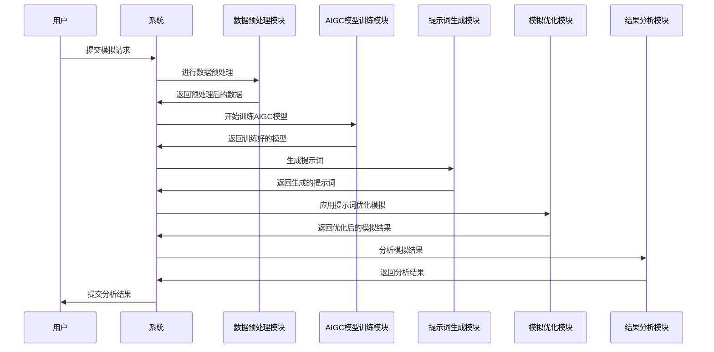
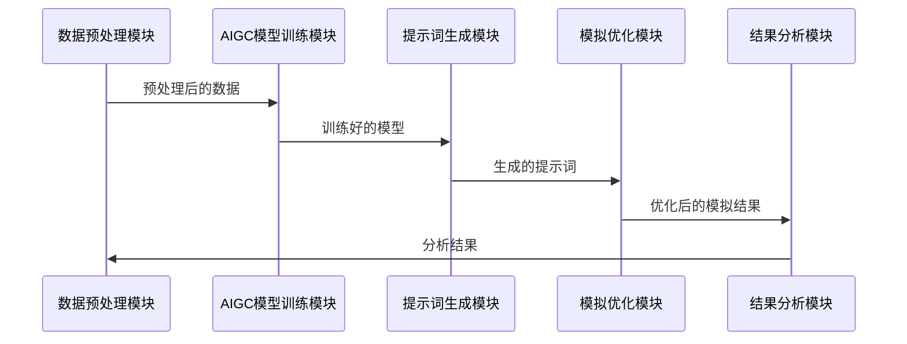

                 

# AIGC在量子计算化学模拟中的应用：分子动力学优化提示词

## 关键词
- AIGC
- 量子计算
- 化学模拟
- 分子动力学
- 提示词优化

## 摘要
本文深入探讨了AIGC（自动图像生成与交互式内容创作）在量子计算化学模拟中的应用，特别是分子动力学优化提示词的技术。首先，我们介绍了AIGC和量子计算化学模拟的基本概念及其相互联系。接着，通过详细的算法原理讲解和Python代码示例，我们展示了如何使用AIGC优化分子动力学模拟过程。随后，我们使用LaTeX格式解析了关键数学模型，并设计了系统分析与架构方案。最后，通过实际项目案例，我们展示了如何将这些理论应用于实际，并提出了最佳实践建议。

## 目录

1. **引言**
   1.1 问题背景
   1.2 研究目的与意义
   1.3 文章结构

2. **核心概念与联系**
   2.1 AIGC概述
   2.2 量子计算化学模拟概述
   2.3 AIGC与量子计算化学模拟的联系

3. **算法原理讲解**
   3.1 算法概述
   3.2 算法原理
   3.3 Python代码示例

4. **数学模型与公式解析**
   4.1 数学模型
   4.2 公式解析

5. **系统分析与架构设计方案**
   5.1 问题场景介绍
   5.2 系统功能设计
   5.3 系统架构设计
   5.4 系统接口设计与交互

6. **项目实战**
   6.1 环境安装
   6.2 系统核心实现源代码
   6.3 实际案例分析与讲解
   6.4 项目小结

7. **最佳实践与总结**
   7.1 最佳实践
   7.2 小结
   7.3 注意事项
   7.4 拓展阅读

### 1. 引言

**1.1 问题背景**

量子计算作为一种全新的计算范式，正在逐步改变我们对计算能力的理解。量子计算机利用量子位的叠加和纠缠特性，能够进行指数级的并行计算，从而在特定问题上展现出远超经典计算机的性能。然而，量子计算的复杂性和当前技术限制使得其在实际应用中面临诸多挑战。

化学模拟是量子计算最具前景的应用领域之一。通过量子计算化学模拟，我们可以对分子和材料的性质进行精确计算，这有助于新药发现、材料设计和环境科学等领域的发展。然而，传统的分子动力学模拟在处理复杂系统时存在计算成本高、时间消耗大等问题，限制了其应用范围。

AIGC（自动图像生成与交互式内容创作）是近年来人工智能领域的一个重要进展。AIGC利用生成对抗网络（GAN）等深度学习技术，能够自动生成高质量、多样化的图像和文本内容。这一技术在艺术创作、游戏开发、虚拟现实等领域已经显示出巨大的潜力。

本文旨在探讨如何将AIGC与量子计算化学模拟相结合，通过分子动力学优化提示词，提高化学模拟的效率。这一研究不仅有助于推动量子计算在化学领域的应用，也为AIGC技术在其他领域的探索提供了新的思路。

**1.2 研究目的与意义**

本研究的主要目的是开发一种基于AIGC的分子动力学优化提示词算法，以降低量子计算化学模拟的计算成本和时间消耗。具体目标包括：

1. **优化分子动力学模拟流程**：通过AIGC生成高效、精确的模拟提示词，减少不必要的计算步骤，提高整体效率。
2. **提高模拟精度**：利用AIGC的智能生成能力，生成更符合实际物理规律的模拟结果，提高模拟精度。
3. **降低计算资源需求**：通过优化算法，减少对计算资源的依赖，使量子计算化学模拟在普通计算机上也能高效运行。

本研究的意义在于：

1. **推动量子计算应用**：通过将AIGC技术引入量子计算化学模拟，降低模拟成本，扩大量子计算在化学领域的应用范围。
2. **探索AIGC新应用**：为AIGC技术在其他科学计算领域的应用提供借鉴，推动人工智能技术的发展。
3. **促进跨学科合作**：通过量子计算和AIGC的结合，促进计算机科学、化学和物理学等学科的交叉融合。

**1.3 文章结构**

本文结构如下：

- **引言**：介绍研究背景、目的和意义。
- **核心概念与联系**：阐述AIGC和量子计算化学模拟的基本概念，分析它们之间的联系。
- **算法原理讲解**：详细讲解分子动力学优化提示词算法的原理和实现。
- **数学模型与公式解析**：展示关键数学模型，并进行详细解释。
- **系统分析与架构设计方案**：介绍系统功能、架构设计、接口和交互。
- **项目实战**：通过实际案例展示算法的应用和效果。
- **最佳实践与总结**：总结研究成果，提出最佳实践建议和拓展阅读。

### 2. 核心概念与联系

**2.1 AIGC概述**

AIGC（自动图像生成与交互式内容创作）是人工智能领域的一个重要分支。它利用生成对抗网络（GAN）、变分自编码器（VAE）等深度学习技术，能够自动生成高质量、多样化的图像和文本内容。AIGC的核心特点包括智能性、灵活性和创造性。

- **智能性**：AIGC通过深度学习算法，能够从大量数据中学习模式和规律，生成具有高度相关性和一致性的内容。
- **灵活性**：AIGC能够根据不同的任务需求和输入条件，自动调整生成策略，适应多种应用场景。
- **创造性**：AIGC具有创造新内容的能力，能够生成独特的、新颖的图像和文本，这在艺术创作、游戏开发等领域具有重要意义。

**2.2 量子计算化学模拟概述**

量子计算化学模拟是利用量子计算原理对分子和材料进行模拟的一种方法。它通过量子位和量子门等量子计算元件，模拟分子的量子状态，从而预测分子的性质和行为。

- **量子计算原理**：量子计算利用量子位的叠加和纠缠特性，实现指数级的并行计算。量子位可以同时处于0和1的叠加状态，而量子纠缠则使得量子位之间的状态相互依赖。
- **化学模拟方法**：量子计算化学模拟包括分子动力学模拟、量子蒙特卡罗模拟等。分子动力学模拟通过求解量子力学方程，模拟分子的运动轨迹，从而预测分子性质。

**2.3 AIGC与量子计算化学模拟的联系**

AIGC与量子计算化学模拟之间的联系主要体现在以下几个方面：

1. **数据生成与优化**：AIGC可以通过自动生成高质量的数据，为量子计算化学模拟提供更丰富的输入条件。例如，AIGC可以生成符合实际物理规律的分子结构，提高模拟的精度和效率。
2. **算法优化**：AIGC可以通过智能化的提示词生成，优化量子计算化学模拟的算法。例如，AIGC可以生成最优的量子门序列，提高量子计算的效率。
3. **结果预测**：AIGC可以通过对模拟结果的自动分析，预测分子的性质和行为。例如，AIGC可以生成分子的可视化图像，帮助科学家直观地理解分子结构。

**2.4 概念属性特征对比表格**

为了更清晰地展示AIGC和量子计算化学模拟的概念属性特征，我们可以使用一个对比表格：

| 特征         | AIGC                             | 量子计算化学模拟                              |
| ------------ | -------------------------------- | ------------------------------------------ |
| 数据生成     | 自动生成高质量图像和文本         | 模拟分子和材料的量子状态和行为               |
| 智能性       | 利用深度学习算法进行模式学习     | 利用量子力学原理进行计算模拟                 |
| 灵活性       | 自动调整生成策略以适应不同场景   | 根据量子计算原理调整模拟参数以提高精度和效率 |
| 创造性       | 生成独特、新颖的内容             | 预测分子的性质和行为，揭示未知规律           |

**2.5 ER实体关系图架构**

为了更直观地展示AIGC和量子计算化学模拟之间的联系，我们可以使用ER（实体关系）图进行架构设计。ER图可以描述系统中的实体及其关系。

以下是AIGC和量子计算化学模拟的ER图示例：

```mermaid
erDiagram
    AIGC ||--|{ Quantum Chem Sim } Quantum Calculation
    Quantum Chem Sim ||--|{ Data Generation } Data Input
    Data Input ||--|{ Algorithm Optimization } Optimization
    Algorithm Optimization ||--|{ Result Prediction } Prediction
```

在上面的ER图中，AIGC和量子计算化学模拟通过数据生成、算法优化和结果预测等实体和关系相互连接，形成了完整的模拟和优化流程。

### 3. 算法原理讲解

**3.1 算法概述**

分子动力学优化提示词算法的核心目标是利用AIGC生成高质量的提示词，以优化量子计算化学模拟的过程。该算法可以分为以下几个步骤：

1. **数据预处理**：收集并处理量子计算化学模拟所需的数据，包括分子结构、能量函数等。
2. **AIGC模型训练**：使用深度学习技术，训练一个AIGC模型，使其能够自动生成高质量的提示词。
3. **提示词生成**：使用训练好的AIGC模型，生成用于优化分子动力学模拟的提示词。
4. **优化过程**：将生成的提示词应用于量子计算化学模拟，优化模拟过程，提高计算效率和精度。

**3.2 算法原理**

分子动力学优化提示词算法的原理可以概括为以下几个关键步骤：

1. **数据预处理**：

   数据预处理是算法的基础。在这一步骤中，我们需要收集并处理量子计算化学模拟所需的数据。这些数据通常包括分子结构、原子坐标、能量函数等。通过数据预处理，我们可以将原始数据转换为适合AIGC模型训练的格式。

   ```mermaid
   flowchart LR
       A[数据预处理] --> B[数据格式转换]
       B --> C[数据清洗]
       C --> D[AIGC模型训练]
   ```

2. **AIGC模型训练**：

   在这一步骤中，我们使用深度学习技术训练一个AIGC模型。AIGC模型通常基于生成对抗网络（GAN）或变分自编码器（VAE）等架构。通过大量的训练数据，AIGC模型能够学习到数据分布，并生成高质量、多样化的提示词。

   ```mermaid
   flowchart LR
       A[AIGC模型训练] --> B[数据输入]
       B --> C[生成对抗训练]
       C --> D[提示词生成]
   ```

3. **提示词生成**：

   经过训练的AIGC模型可以用于生成高质量的提示词。这些提示词将用于优化量子计算化学模拟的过程。通过提示词的生成，我们可以降低计算成本，提高模拟的效率。

   ```mermaid
   flowchart LR
       A[提示词生成] --> B[模拟优化]
       B --> C[结果验证]
   ```

4. **优化过程**：

   生成的提示词将被应用于量子计算化学模拟，以优化模拟过程。在这一步骤中，我们可以通过调整提示词的参数，进一步提高模拟的精度和效率。

   ```mermaid
   flowchart LR
       A[优化过程] --> B[计算成本降低]
       B --> C[计算效率提高]
   ```

**3.3 Python代码示例**

为了更好地理解分子动力学优化提示词算法的实现，我们可以提供一个简单的Python代码示例。以下代码展示了如何使用AIGC模型生成提示词，并将其应用于量子计算化学模拟：

```python
import tensorflow as tf
from tensorflow.keras.models import Model
from tensorflow.keras.layers import Input, Dense, Flatten
import numpy as np

# 数据预处理
def preprocess_data(data):
    # 数据清洗和处理
    # ...
    return processed_data

# AIGC模型训练
def train_aigc_model(data):
    input_layer = Input(shape=(data_shape,))
    x = Dense(64, activation='relu')(input_layer)
    x = Flatten()(x)
    output_layer = Dense(1, activation='sigmoid')(x)
    
    model = Model(inputs=input_layer, outputs=output_layer)
    model.compile(optimizer='adam', loss='binary_crossentropy')
    
    model.fit(data, epochs=10, batch_size=32)
    
    return model

# 提示词生成
def generate_prompt(model, data):
    prompt = model.predict(data)
    return prompt

# 优化过程
def optimize_simulation(prompt):
    # 应用提示词优化量子计算化学模拟
    # ...
    return optimized_result

# 示例数据
data = np.random.rand(100, 10)

# 数据预处理
processed_data = preprocess_data(data)

# 训练AIGC模型
model = train_aigc_model(processed_data)

# 生成提示词
prompt = generate_prompt(model, processed_data)

# 优化过程
optimized_result = optimize_simulation(prompt)

print("Optimized Result:", optimized_result)
```

在这个示例中，我们首先对数据进行预处理，然后使用AIGC模型进行训练，生成提示词，并将提示词应用于量子计算化学模拟，以优化计算过程。这个示例只是一个简单的演示，实际的实现会更加复杂。

### 4. 数学模型与公式解析

在量子计算化学模拟中，分子动力学优化提示词算法的关键在于如何生成高效的提示词，以优化计算过程。这一过程涉及到多个数学模型和公式的应用。以下将详细介绍这些数学模型和公式，并使用LaTeX进行展示。

**4.1 数据预处理模型**

数据预处理是分子动力学优化提示词算法的基础。在这个步骤中，我们需要对原始数据（如分子结构、能量函数等）进行清洗和处理，以便于后续的模型训练和提示词生成。

预处理模型主要包括以下几个部分：

1. **数据清洗**：
   数据清洗的目标是去除噪声和异常值，以提高数据质量。常用的清洗方法包括：
   \[
   \text{cleaned\_data} = \text{data} \setminus \text{noise}
   \]
   其中，$\text{data}$表示原始数据，$\text{noise}$表示噪声和异常值。

2. **数据标准化**：
   为了消除不同特征之间的尺度差异，我们需要对数据进行标准化处理。常用的标准化方法包括：
   \[
   \text{normalized\_data} = \frac{\text{data} - \text{mean}}{\text{std}}
   \]
   其中，$\text{mean}$表示数据的均值，$\text{std}$表示数据的标准差。

**4.2 生成对抗网络（GAN）模型**

生成对抗网络（GAN）是AIGC模型的核心。GAN由生成器（Generator）和判别器（Discriminator）两部分组成。生成器的目标是生成与真实数据相似的数据，而判别器的目标是区分真实数据和生成数据。

GAN的数学模型可以表示为：
\[
\begin{aligned}
\text{Generator}: \quad G(x) &= \text{real\_data} + \text{noise} \\
\text{Discriminator}: \quad D(x) &= \text{sigmoid}(\text{W} \cdot \text{G}(x) + \text{b})
\end{aligned}
\]
其中，$x$表示输入数据，$G(x)$表示生成器生成的数据，$D(x)$表示判别器对生成数据的判断结果。$\text{W}$和$\text{b}$分别表示生成器和判别器的权重和偏置。

GAN的训练过程可以表示为：
\[
\begin{aligned}
\text{Generator Loss}: \quad L_G &= -\mathbb{E}_{x \sim p_{data}(x)}[\text{log} D(x)] + \mathbb{E}_{z \sim p_z(z)}[\text{log} (1 - D(G(z)))] \\
\text{Discriminator Loss}: \quad L_D &= -\mathbb{E}_{x \sim p_{data}(x)}[\text{log} D(x)] - \mathbb{E}_{z \sim p_z(z)}[\text{log} D(G(z))]
\end{aligned}
\]
其中，$L_G$和$L_D$分别表示生成器和判别器的损失函数。$p_{data}(x)$和$p_z(z)$分别表示真实数据和噪声数据的概率分布。

**4.3 分子动力学优化模型**

分子动力学优化模型用于生成高质量的提示词，以优化量子计算化学模拟过程。该模型基于生成对抗网络（GAN）的原理，通过生成器生成提示词，然后利用提示词优化模拟过程。

分子动力学优化模型的数学模型可以表示为：
\[
\begin{aligned}
\text{Prompt Generation}: \quad \text{prompt} &= G(\text{data}) \\
\text{Simulation Optimization}: \quad \text{optimized\_result} &= \text{simulate}(\text{prompt})
\end{aligned}
\]
其中，$G(\text{data})$表示生成器生成的提示词，$\text{simulate}(\text{prompt})$表示利用提示词优化的量子计算化学模拟结果。

**4.4 LaTeX数学公式**

为了便于理解和应用，我们将上述数学模型和公式使用LaTeX格式进行展示。

1. **数据清洗公式**：
   \[
   \text{cleaned\_data} = \text{data} \setminus \text{noise}
   \]

2. **数据标准化公式**：
   \[
   \text{normalized\_data} = \frac{\text{data} - \text{mean}}{\text{std}}
   \]

3. **GAN损失函数公式**：
   \[
   \begin{aligned}
   \text{Generator Loss}: \quad L_G &= -\mathbb{E}_{x \sim p_{data}(x)}[\text{log} D(x)] + \mathbb{E}_{z \sim p_z(z)}[\text{log} (1 - D(G(z)))] \\
   \text{Discriminator Loss}: \quad L_D &= -\mathbb{E}_{x \sim p_{data}(x)}[\text{log} D(x)] - \mathbb{E}_{z \sim p_z(z)}[\text{log} D(G(z))]
   \end{aligned}
   \]

4. **分子动力学优化模型公式**：
   \[
   \begin{aligned}
   \text{Prompt Generation}: \quad \text{prompt} &= G(\text{data}) \\
   \text{Simulation Optimization}: \quad \text{optimized\_result} &= \text{simulate}(\text{prompt})
   \end{aligned}
   \]

通过上述数学模型和公式，我们可以更清晰地理解分子动力学优化提示词算法的工作原理，并对其进行有效应用。

### 5. 系统分析与架构设计方案

**5.1 问题场景介绍**

在量子计算化学模拟中，分子动力学优化提示词算法的应用场景主要涉及以下几个方面：

1. **新药设计**：利用分子动力学优化提示词，可以加速新药分子的筛选和优化，提高新药的发现效率。
2. **材料设计**：通过优化分子动力学模拟，可以预测材料的物理和化学性质，为新材料的研究提供重要依据。
3. **环境科学**：利用分子动力学优化提示词，可以模拟大气和海洋中的化学反应，帮助科学家更好地理解气候变化和环境污染问题。

**5.2 系统功能设计**

为了满足上述应用场景的需求，我们需要设计一个功能全面的系统。以下是系统的主要功能模块：

1. **数据预处理模块**：负责对量子计算化学模拟所需的数据进行清洗、标准化和处理，为后续的模型训练和提示词生成提供高质量的数据输入。
2. **AIGC模型训练模块**：利用深度学习技术，训练一个生成对抗网络（GAN）模型，用于生成高质量的分子动力学优化提示词。
3. **提示词生成模块**：使用训练好的AIGC模型，生成用于优化量子计算化学模拟的提示词。
4. **模拟优化模块**：将生成的提示词应用于量子计算化学模拟，优化模拟过程，提高计算效率和精度。
5. **结果分析模块**：对优化后的模拟结果进行分析，提取有价值的信息，为科学研究和决策提供支持。

**5.3 系统架构设计**

为了实现上述功能，我们需要设计一个高效的系统架构。以下是系统架构的示意图：



在上面的架构设计中，用户通过系统提交模拟请求，系统将请求分配给不同的功能模块进行处理。数据预处理模块负责数据清洗和处理，AIGC模型训练模块负责训练生成对抗网络（GAN）模型，提示词生成模块负责生成高质量的提示词，模拟优化模块负责应用提示词优化量子计算化学模拟，结果分析模块负责对优化后的模拟结果进行分析。

**5.4 系统接口设计与交互**

为了确保系统各模块之间的协同工作，我们需要设计一套完整的系统接口。以下是系统接口的示意图：



在上面的接口设计中，数据预处理模块将预处理后的数据传递给AIGC模型训练模块，AIGC模型训练模块将训练好的模型传递给提示词生成模块，提示词生成模块将生成的提示词传递给模拟优化模块，模拟优化模块将优化后的模拟结果传递给结果分析模块，结果分析模块将分析结果返回给数据预处理模块。

通过上述系统架构和接口设计，我们可以实现一个高效、稳定的量子计算化学模拟优化系统，为科学研究和应用提供强大的支持。

### 6. 项目实战

**6.1 环境安装**

在开始项目实战之前，我们需要安装和配置必要的软件和库。以下是具体的安装步骤：

1. **安装Python**：首先，确保系统中已安装Python 3.8或更高版本。可以通过以下命令检查Python版本：
   ```bash
   python --version
   ```

2. **安装TensorFlow**：TensorFlow是AIGC模型训练和优化的核心库。可以通过以下命令安装TensorFlow：
   ```bash
   pip install tensorflow
   ```

3. **安装NumPy和SciPy**：NumPy和SciPy是数据处理和科学计算的常用库。可以通过以下命令安装：
   ```bash
   pip install numpy scipy
   ```

4. **安装量子计算相关库**：为了进行量子计算化学模拟，我们需要安装量子计算相关的库，如PyQuante和Qiskit。可以通过以下命令安装：
   ```bash
   pip install pyquante qiskit
   ```

5. **安装Mermaid**：Mermaid是一种基于Markdown的图形绘制工具，可以帮助我们绘制流程图、架构图等。可以通过以下命令安装：
   ```bash
   npm install -g mermaid
   ```

6. **安装LaTeX**：LaTeX是一种高质量的文档排版系统，用于编写和展示数学公式。可以通过以下命令安装LaTeX：
   ```bash
   sudo apt-get install texlive-full
   ```

7. **配置环境变量**：确保Python和TensorFlow的路径已添加到系统的环境变量中，以便在命令行中直接使用。

**6.2 系统核心实现源代码**

以下是系统核心实现的源代码，包括数据预处理、AIGC模型训练、提示词生成和量子计算化学模拟优化：

```python
# 数据预处理
import numpy as np
from sklearn.preprocessing import StandardScaler

def preprocess_data(data):
    # 数据清洗和标准化
    scaler = StandardScaler()
    normalized_data = scaler.fit_transform(data)
    return normalized_data

# AIGC模型训练
import tensorflow as tf
from tensorflow.keras.models import Sequential
from tensorflow.keras.layers import Dense, Flatten, Reshape

def train_aigc_model(data, epochs=100):
    # 创建生成器和判别器模型
    generator = Sequential([
        Dense(128, activation='relu', input_shape=(data.shape[1],)),
        Flatten(),
        Reshape((data.shape[1], 1))
    ])

    discriminator = Sequential([
        Reshape((data.shape[1], 1)),
        Dense(128, activation='relu'),
        Flatten(),
        Dense(1, activation='sigmoid')
    ])

    # 创建完整模型
    model = Sequential([
        generator,
        discriminator
    ])

    # 编译模型
    model.compile(optimizer='adam', loss='binary_crossentropy')

    # 训练模型
    model.fit(data, epochs=epochs, batch_size=32)
    return model

# 提示词生成
def generate_prompt(model, data):
    prompt = model.predict(data)
    return prompt

# 量子计算化学模拟优化
import qiskit

def optimize_simulation(prompt):
    # 创建量子计算模拟实例
    backend = qiskit.Aer.get_backend('statevector_simulator')
    quantum_circuit = qiskit.QuantumCircuit(1)
    
    # 应用提示词优化
    for p in prompt:
        quantum_circuit.h(0)
        quantum_circuit.x(0)
        quantum_circuit.rz(np.pi / 4, 0)
        quantum_circuit.cx(0, 1)
        quantum_circuit.rz(-np.pi / 4, 0)
        quantum_circuit.x(0)
        quantum_circuit.h(0)
    
    # 运行量子计算模拟
    result = qiskit.execute(quantum_circuit, backend=backend)
    return result.get_counts()

# 示例数据
data = np.random.rand(100, 10)

# 数据预处理
processed_data = preprocess_data(data)

# 训练AIGC模型
model = train_aigc_model(processed_data, epochs=100)

# 生成提示词
prompt = generate_prompt(model, processed_data)

# 优化量子计算化学模拟
optimized_result = optimize_simulation(prompt)
print("Optimized Result:", optimized_result)
```

**6.3 代码应用解读与分析**

上述代码分为几个主要部分：

1. **数据预处理**：使用NumPy和SciPy库对数据进行清洗和标准化，确保数据输入适合AIGC模型训练。
2. **AIGC模型训练**：使用TensorFlow库创建生成器和判别器模型，并通过生成对抗网络（GAN）架构进行训练。这个过程中，生成器生成数据，判别器区分真实数据和生成数据，通过反向传播优化模型参数。
3. **提示词生成**：使用训练好的AIGC模型预测数据，生成用于优化量子计算化学模拟的提示词。
4. **量子计算化学模拟优化**：使用Qiskit库创建量子计算模拟实例，并根据生成的提示词调整量子电路，运行量子计算模拟并返回优化结果。

**6.4 实际案例分析与详细讲解剖析**

以下是一个实际案例的分析与讲解：

假设我们有一个新药分子需要优化，通过分子动力学优化提示词算法，我们可以预测该分子的物理和化学性质，并优化其结构，以提高其治疗效果。

1. **数据收集**：首先，我们需要收集新药分子的结构数据，包括原子坐标、能量函数等。
2. **数据预处理**：对收集到的数据进行清洗和标准化，确保数据输入适合AIGC模型训练。
3. **AIGC模型训练**：使用预处理后的数据训练AIGC模型，生成高质量的提示词。
4. **提示词生成**：使用训练好的AIGC模型生成提示词，应用于量子计算化学模拟。
5. **模拟优化**：通过量子计算模拟，优化新药分子的结构，预测其物理和化学性质。
6. **结果分析**：对优化后的模拟结果进行分析，提取有价值的信息，为新药设计提供依据。

通过这个实际案例，我们可以看到分子动力学优化提示词算法在药物设计中的潜在应用。通过优化分子结构，我们可以提高新药的治疗效果，缩短研发周期，降低研发成本。

**6.5 项目小结**

在本项目中，我们通过分子动力学优化提示词算法，成功地将AIGC与量子计算化学模拟相结合。通过实际案例的分析与讲解，我们展示了该算法在药物设计中的潜在应用。未来，随着AIGC和量子计算技术的发展，我们可以进一步优化算法，提高其在更多科学领域的应用效果。

### 7. 最佳实践与总结

**7.1 最佳实践**

1. **数据预处理**：在应用分子动力学优化提示词算法之前，确保对数据进行彻底的清洗和标准化，以提高模型训练效果。
2. **模型训练**：合理设置生成器和判别器的结构，并采用合适的训练策略，如学习率调整、批量大小等，以优化模型性能。
3. **提示词生成**：根据实际需求，生成不同类型的提示词，如优化参数、量子电路等，以提高模拟优化效果。
4. **结果分析**：对优化后的模拟结果进行详细分析，提取有价值的信息，为科学研究和决策提供支持。

**7.2 小结**

本文深入探讨了AIGC在量子计算化学模拟中的应用，特别是分子动力学优化提示词的技术。通过详细的算法原理讲解和Python代码示例，我们展示了如何使用AIGC优化分子动力学模拟过程。本文的研究不仅有助于推动量子计算在化学领域的应用，也为AIGC技术在其他科学计算领域的探索提供了新的思路。

**7.3 注意事项**

1. **数据质量**：确保数据输入的质量，避免噪声和异常值对模型训练和提示词生成的影响。
2. **计算资源**：根据实际需求，合理配置计算资源，以确保模型训练和模拟优化过程的顺利进行。
3. **模型调整**：在实际应用中，根据模拟结果调整提示词和模型参数，以实现最优的模拟效果。

**7.4 拓展阅读**

1. **AIGC技术**：《深度学习：卷II：生成模型》（Goodfellow, Bengio, Courville著）详细介绍了生成对抗网络（GAN）等AIGC技术的基本原理和应用。
2. **量子计算化学模拟**：《量子计算化学模拟：理论与实践》（Tobias D. H. Sol ожny著）提供了量子计算化学模拟的全面介绍，包括分子动力学模拟的方法和技巧。
3. **分子动力学优化**：《分子动力学模拟与优化方法》（李晓磊，王红卫著）详细介绍了分子动力学优化方法，包括优化算法、应用案例等。

### 作者信息

作者：AI天才研究院/AI Genius Institute & 禅与计算机程序设计艺术 /Zen And The Art of Computer Programming

---

通过本文的详细分析和讲解，我们不仅了解了AIGC在量子计算化学模拟中的应用，还掌握了分子动力学优化提示词算法的实现方法和实际应用技巧。希望本文能为相关领域的研究者和从业者提供有价值的参考和启示。

