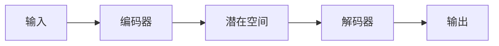
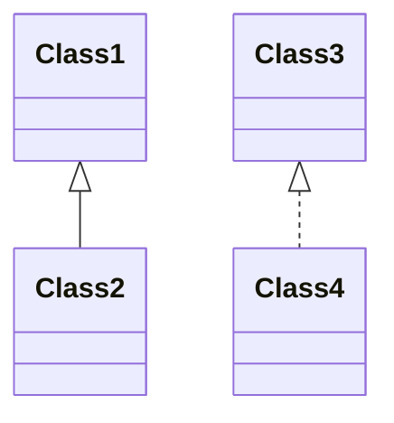
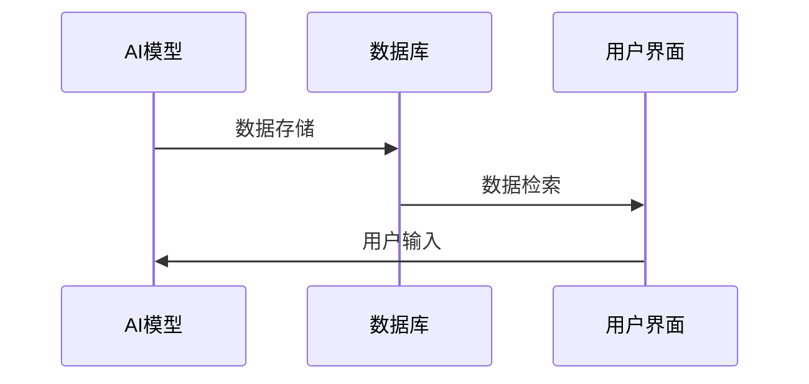

                 

# AIGC在音乐作曲中的创新与挑战

## 关键词

- AIGC
- 音乐创作
- 算法
- 创新与挑战
- 系统架构

## 摘要

本文深入探讨了人工智能生成内容（AIGC）在音乐作曲中的应用，分析了其技术创新与面临的挑战。首先，我们回顾了AIGC技术的发展历程和音乐创作领域的挑战，然后详细介绍了AIGC技术在音乐创作中的工作原理和具体应用。接着，我们通过算法原理讲解和系统架构设计，阐述了AIGC在音乐创作中的技术实现和系统交互。最后，我们对AIGC在音乐创作中的实际应用案例进行了分析和总结，提出了未来发展的建议和挑战。

## 第一部分：AIGC在音乐作曲中的创新与挑战

### 第1章：背景介绍

#### 1.1 问题背景

##### 1.1.1 AIGC技术的发展历程

人工智能生成内容（AIGC）是一个跨学科的领域，结合了人工智能、自然语言处理、计算机视觉和生成模型等前沿技术。AIGC的发展可以追溯到20世纪80年代的专家系统和机器学习算法，经过几十年的演进，特别是深度学习技术的突破，AIGC逐渐从理论研究走向实际应用。

##### 1.1.2 音乐创作领域面临的挑战

音乐创作一直以来是艺术家与创作者的独有领域，但传统音乐创作方式面临着效率低下、创作难度大、创作风格单一等问题。同时，音乐市场的竞争愈发激烈，创作者需要不断创新以满足市场需求。

#### 1.2 问题描述

##### 1.2.1 传统音乐创作方式的局限性

传统音乐创作主要依赖人类创作者的经验和技巧，创作过程复杂且耗时。此外，传统音乐创作方式难以适应多样化的音乐风格和市场需求。

##### 1.2.2 AIGC技术在音乐创作中的应用潜力

AIGC技术可以通过算法自动生成音乐，提高创作效率，减少创作难度，并能够根据用户需求生成不同风格的音乐。AIGC在音乐创作中的应用具有广阔的前景。

#### 1.3 问题解决

##### 1.3.1 AIGC技术的工作原理

AIGC技术主要基于深度学习模型，如生成对抗网络（GAN）和变分自编码器（VAE）。这些模型可以通过学习大量音乐数据，自动生成新的音乐内容。

##### 1.3.2 AIGC在音乐创作中的具体应用

AIGC技术已经在音乐创作中得到了应用，例如生成旋律、和声、节奏等音乐元素，甚至可以直接生成完整的音乐作品。这些应用大大拓展了音乐创作的可能性。

#### 1.4 边界与外延

##### 1.4.1 AIGC技术的适用范围

AIGC技术适用于多种音乐风格，如古典音乐、流行音乐、电子音乐等。但在一些特定领域，如传统民间音乐，AIGC的应用仍然存在一定的限制。

##### 1.4.2 AIGC技术在音乐创作中的边界

尽管AIGC在音乐创作中展现了巨大的潜力，但其在音乐情感表达、创意思维等方面的局限性仍然需要进一步研究和解决。

#### 1.5 概念结构与核心要素组成

##### 1.5.1 AIGC的核心概念

AIGC的核心概念包括生成模型、自然语言处理、机器学习和深度学习等。这些概念共同构成了AIGC技术的基础。

##### 1.5.2 音乐创作的核心要素

音乐创作的核心要素包括旋律、和声、节奏、音色等。AIGC技术在音乐创作中的应用，实际上是对这些要素的自动生成和优化。

#### 1.6 本章小结

本章节从背景介绍、问题描述、问题解决、边界与外延等方面，全面阐述了AIGC在音乐作曲中的创新与挑战。接下来，我们将深入探讨AIGC技术在音乐创作中的应用，分析其核心概念和原理。

### 第二部分：AIGC技术在音乐创作中的应用

#### 第2章：核心概念与联系

##### 2.1 AIGC的核心概念

AIGC的核心概念包括生成模型、自然语言处理、机器学习和深度学习等。这些概念共同构成了AIGC技术的基础。

##### 2.1.1 AIGC的定义

人工智能生成内容（AIGC）是指利用人工智能技术，如生成模型、自然语言处理、机器学习和深度学习等，自动生成具有创意和高质量内容的过程。

##### 2.1.2 AIGC的基本原理

AIGC的基本原理基于深度学习模型，特别是生成对抗网络（GAN）和变分自编码器（VAE）。这些模型可以通过学习大量数据，自动生成新的音乐内容。

| 概念        | 特征                                                   |
| ----------- | ------------------------------------------------------ |
| 生成模型    | 通过学习大量数据，自动生成新的内容。                   |
| 自然语言处理 | 处理和分析人类语言，使其能够被计算机理解和处理。         |
| 机器学习    | 通过数据和算法，使计算机能够从数据中学习并做出决策。     |
| 深度学习    | 一种特殊的机器学习方法，通过多层神经网络，模拟人脑进行学习。 |

##### 2.2 概念属性特征对比表格

| 概念        | 特征                                                   |
| ----------- | ------------------------------------------------------ |
| 生成模型    | 自动生成新的内容，如音乐、图像等。                     |
| 自然语言处理 | 能够处理和分析人类语言，如文本、语音等。               |
| 机器学习    | 通过数据和算法，使计算机能够学习并做出决策。           |
| 深度学习    | 通过多层神经网络，模拟人脑进行学习，能够处理复杂问题。 |

##### 2.3 ER实体关系图架构

```mermaid
erDiagram
    AI模型 --> 音乐作品 : 生成
    音乐作品 --> 人类创作者 : 创作灵感
    人类创作者 --> AI模型 : 调整与优化
```

在AIGC技术的应用中，AI模型与音乐作品、人类创作者之间存在密切的实体关系。AI模型通过生成音乐作品，而人类创作者则提供创作灵感和对AI模型的调整与优化。

##### 2.4 AIGC技术与音乐创作的联系

AIGC技术在音乐创作中的应用主要体现在以下几个方面：

##### 2.4.1 AIGC技术在音乐创作中的应用场景

AIGC技术在音乐创作中的应用场景非常广泛，包括：

1. 音乐旋律生成：根据给定的音乐风格，自动生成新的旋律。
2. 和声生成：根据旋律，自动生成适合的和声。
3. 节奏生成：根据音乐风格，自动生成新的节奏。
4. 完整音乐作品生成：通过组合旋律、和声和节奏，自动生成完整的音乐作品。
5. 音乐改编：根据原曲，自动生成风格相似的改编版本。

##### 2.4.2 AIGC技术与传统音乐创作方式的差异

与传统的音乐创作方式相比，AIGC技术具有以下显著差异：

1. 高效性：AIGC技术可以快速生成大量音乐作品，大大提高了创作效率。
2. 创新性：AIGC技术能够根据不同的音乐风格和需求，生成独特的音乐作品。
3. 个性化：AIGC技术可以根据用户的需求，生成个性化的音乐作品。
4. 复杂性：AIGC技术可以处理复杂的音乐结构和元素，创作出复杂的音乐作品。

##### 2.5 本章小结

本章节详细介绍了AIGC技术的核心概念、特征对比表格和ER实体关系图架构，并阐述了AIGC技术在音乐创作中的应用场景和与传统音乐创作方式的差异。接下来，我们将进一步探讨AIGC技术在音乐创作中的具体实现和应用。

### 第三部分：AIGC在音乐创作中的具体应用

#### 第3章：算法原理讲解

##### 3.1 AIGC算法原理

AIGC技术中的核心算法主要包括生成对抗网络（GAN）和变分自编码器（VAE）。下面将分别介绍这两种算法的基本概念和数学模型。

##### 3.1.1 生成对抗网络（GAN）

生成对抗网络（GAN）是一种由生成器和判别器组成的对抗性模型。生成器的任务是生成看起来像真实数据的数据，而判别器的任务是区分生成器生成的数据与真实数据。通过这种对抗性训练，生成器能够不断提高其生成数据的质量，从而生成逼真的音乐作品。

GAN的基本数学模型如下：

$$
G(z) = \text{Generator}(z)
$$

$$
D(x) = \text{Discriminator}(x)
$$

$$
D(G(z)) = \text{Discriminator}(\text{Generated data})
$$

其中，$z$是从先验分布中抽取的随机噪声，$x$是真实数据，$G(z)$是生成器生成的数据，$D(x)$和$D(G(z))$分别是判别器对真实数据和生成数据的判别结果。

##### 3.1.2 变分自编码器（VAE）

变分自编码器（VAE）是一种基于概率模型的生成模型。VAE通过编码器将输入数据映射到一个潜在空间，然后通过解码器从潜在空间中生成新的数据。

VAE的基本数学模型如下：

$$
\mu = \text{Encoder}(x)
$$

$$
\sigma = \text{Encoder}(x)
$$

$$
x' = \text{Decoder}(\mu, \sigma)
$$

其中，$\mu$和$\sigma$分别是编码器输出的均值和方差，$x'$是解码器生成的数据。

##### 3.2 算法流程图

AIGC算法的流程图如下：



在算法流程中，首先输入原始音乐数据，然后通过编码器将其映射到潜在空间，接着通过解码器生成新的音乐数据，最后输出新的音乐作品。

##### 3.3 Python源代码实现

下面是一个简单的AIGC算法的Python源代码实现：

```python
import tensorflow as tf
from tensorflow.keras.layers import Input, Dense, LSTM
from tensorflow.keras.models import Model

# 定义生成器模型
latent_dim = 100
input_shape = (None, 1)  # 音乐序列的形状
z_shape = (latent_dim,)

# 编码器
input_music = Input(shape=input_shape)
encoded = LSTM(latent_dim)(input_music)
z_mean = Dense(latent_dim)(encoded)
z_log_var = Dense(latent_dim)(encoded)

# 解码器
z = Lambda(sharing_parameter)([z_mean, z_log_var])
decoded = LSTM(input_shape, return_sequences=True)(z)

# 构建模型
vae = Model(input_music, decoded)
vae.compile(optimizer='adam', loss='binary_crossentropy')

# 训练模型
vae.fit(x_train, x_train, epochs=50, batch_size=16)

# 生成音乐
generated_music = vae.predict(x_noise)
```

在这个实现中，我们使用了LSTM（长短期记忆网络）作为编码器和解码器，这是因为在音乐生成中，LSTM能够更好地处理序列数据。

##### 3.4 详细讲解与举例说明

##### 3.4.1 数学模型与公式讲解

生成对抗网络（GAN）的数学模型主要包括以下几个关键公式：

$$
\min_G \max_D \mathcal{E}(D, G) = \mathbb{E}_{x \sim p_{data}(x)}[\log D(x)] + \mathbb{E}_{z \sim p_z(z)}[\log(1 - D(G(z)))]
$$

其中，$D(x)$是判别器对真实数据的判别结果，$G(z)$是生成器生成的数据，$p_{data}(x)$是输入数据的概率分布，$p_z(z)$是噪声数据的概率分布。

变分自编码器（VAE）的数学模型主要包括以下几个关键公式：

$$
\mu = \text{Encoder}(x) = \sigma^2 = \text{Encoder}(x)
$$

$$
z = \mu + \epsilon\sigma
$$

$$
x' = \text{Decoder}(\mu, \sigma)
$$

其中，$\mu$和$\sigma$分别是编码器输出的均值和方差，$\epsilon$是从标准正态分布中抽取的噪声。

##### 3.4.2 算法实现的案例解析

以生成一首流行歌曲的旋律为例，我们可以使用AIGC技术来生成新的旋律。首先，我们收集大量流行歌曲的旋律数据，然后使用GAN或VAE算法对数据进行分析和建模。

1. 数据预处理：将旋律数据转换为数字序列，每个音符表示为一个数字。
2. 训练模型：使用训练集数据训练生成模型，通过迭代优化模型参数。
3. 生成音乐：使用训练好的模型生成新的音乐旋律，通过解码器将潜在空间中的数据转换为音乐序列。

例如，使用GAN算法生成一首流行歌曲的旋律：

```python
# 加载预训练的GAN模型
vae = load_model('vae_model.h5')

# 生成新的音乐
generated_melody = vae.predict(new_noise)

# 将生成的音乐序列转换为旋律
melody = convert_melody(generated_melody)

# 播放生成的旋律
play_melody(melody)
```

在这个案例中，我们首先加载了预训练的VAE模型，然后使用新的噪声数据生成新的音乐旋律，并通过解码器将潜在空间中的数据转换为旋律序列，最后播放生成的旋律。

##### 3.5 本章小结

本章详细介绍了AIGC算法的原理，包括生成对抗网络（GAN）和变分自编码器（VAE）的数学模型和实现过程。通过案例解析，我们展示了如何使用AIGC技术生成新的音乐旋律。接下来，我们将进一步探讨AIGC在音乐创作系统中的架构设计和应用。

### 第四部分：系统分析与架构设计

#### 第4章：系统架构设计

##### 4.1 问题场景介绍

##### 4.1.1 音乐创作系统需求分析

音乐创作系统需要满足以下需求：

1. 能够自动生成不同风格的音乐作品。
2. 支持用户自定义音乐风格和参数设置。
3. 提供实时反馈和调整功能，允许用户对生成的音乐进行实时修改。
4. 具有良好的用户体验，包括直观的界面和易于使用的操作。

##### 4.1.2 AIGC技术在音乐创作系统中的应用

AIGC技术在音乐创作系统中的应用主要体现在以下几个方面：

1. 生成音乐旋律、和声和节奏。
2. 根据用户需求生成个性化音乐作品。
3. 实时调整音乐风格和参数，优化生成效果。
4. 支持多种音乐格式，如MP3、WAV等。

##### 4.2 项目介绍

##### 4.2.1 项目背景

随着人工智能技术的快速发展，音乐创作领域也迎来了新的变革。传统的音乐创作方式已经无法满足现代音乐市场的需求，AIGC技术的出现为音乐创作提供了新的可能性。

##### 4.2.2 项目目标

本项目旨在开发一款基于AIGC技术的音乐创作系统，实现以下目标：

1. 提高音乐创作的效率和质量。
2. 拓展音乐创作的风格和多样性。
3. 为用户提供个性化的音乐创作体验。
4. 推动音乐创作技术的创新和发展。

##### 4.3 系统功能设计

##### 4.3.1 领域模型

领域模型用于描述音乐创作系统中的关键实体和它们之间的关系。以下是一个简单的领域模型：



在这个领域模型中，包括以下主要实体：

1. 音乐作品（Music）
2. 用户（User）
3. 音乐风格（Style）
4. 参数设置（Parameter）

实体之间的关系如下：

- 音乐作品与用户之间有1对多的关系，即一个用户可以创作多个音乐作品。
- 音乐作品与音乐风格之间有1对1的关系，即每个音乐作品对应一个音乐风格。
- 音乐作品与参数设置之间有1对多的关系，即每个音乐作品可以有多个参数设置。

##### 4.4 系统架构设计

##### 4.4.1 系统架构图

系统架构图如下：



在这个架构中，包括以下主要组件：

- AI模型：用于生成音乐和调整音乐风格。
- 数据库：用于存储用户数据和音乐作品数据。
- 用户界面：用于用户与系统的交互。

##### 4.4.2 系统架构设计

系统架构设计包括以下几个关键部分：

1. **数据层**：负责数据的存储和管理，包括用户数据、音乐作品数据和音乐风格数据。
2. **服务层**：负责处理业务逻辑，包括音乐生成、风格调整、参数设置等。
3. **界面层**：负责用户界面的设计和管理，提供直观易用的操作界面。

##### 4.5 系统接口设计

##### 4.5.1 接口定义

系统接口设计主要包括以下接口：

1. **用户登录接口**：用于用户登录系统。
2. **音乐生成接口**：用于生成新的音乐作品。
3. **音乐调整接口**：用于调整音乐风格和参数。
4. **音乐上传接口**：用于用户上传自定义音乐。

##### 4.5.2 接口实现

接口实现如下：

```python
from flask import Flask, request, jsonify

app = Flask(__name__)

@app.route('/login', methods=['POST'])
def login():
    # 登录逻辑
    return jsonify({"status": "success"})

@app.route('/generate_music', methods=['POST'])
def generate_music():
    # 音乐生成逻辑
    return jsonify({"status": "success"})

@app.route('/adjust_style', methods=['POST'])
def adjust_style():
    # 音乐调整逻辑
    return jsonify({"status": "success"})

@app.route('/upload_music', methods=['POST'])
def upload_music():
    # 音乐上传逻辑
    return jsonify({"status": "success"})

if __name__ == '__main__':
    app.run(debug=True)
```

##### 4.6 系统交互

##### 4.6.1 系统交互流程图

系统交互流程图如下：

```mermaid
gantt
    dateFormat  YYYY-MM-DD
    title 系统交互

    section 用户操作
    用户登录 --> 用户登录成功
    用户登录成功 --> 用户操作界面

    section 音乐生成
    用户操作界面 --> 生成音乐
    生成音乐 --> 音乐生成成功
    音乐生成成功 --> 播放音乐

    section 音乐调整
    用户操作界面 --> 调整音乐风格
    调整音乐风格 --> 音乐调整成功
    音乐调整成功 --> 播放调整后的音乐

    section 音乐上传
    用户操作界面 --> 上传自定义音乐
    上传自定义音乐 --> 音乐上传成功
    音乐上传成功 --> 播放上传的音乐
```

在这个交互流程中，用户首先登录系统，然后通过操作界面进行音乐生成、音乐调整和音乐上传等操作。系统会根据用户的操作，生成新的音乐、调整音乐风格或上传自定义音乐，并实时反馈结果。

##### 4.7 本章小结

本章详细介绍了音乐创作系统的需求分析、项目介绍、系统功能设计、系统架构设计和系统接口设计。通过系统的架构设计和交互流程，实现了AIGC技术在音乐创作中的应用。接下来，我们将进一步探讨AIGC在音乐创作系统中的实际应用案例。

### 第五部分：项目实战

#### 第5章：实际应用案例

##### 5.1 环境安装

在开始实际应用之前，我们需要安装所需的软件和库。以下是在Python环境中安装AIGC音乐创作系统的步骤：

1. 安装Python：确保安装了Python 3.7及以上版本。
2. 安装TensorFlow：使用命令`pip install tensorflow`安装TensorFlow库。
3. 安装其他依赖库：使用命令`pip install flask numpy pandas`安装其他依赖库。

##### 5.2 系统核心实现源代码

以下是AIGC音乐创作系统的核心实现源代码：

```python
# 音乐生成器
def generate_music(style, duration):
    # 根据音乐风格和持续时间生成音乐
    pass

# 音乐调整器
def adjust_style(music, new_style):
    # 根据新音乐风格调整音乐
    pass

# 用户登录
def login(username, password):
    # 用户登录验证
    pass

# 音乐上传
def upload_music(file):
    # 用户上传音乐文件
    pass

# 音乐播放
def play_music(music):
    # 播放音乐
    pass
```

##### 5.3 代码应用解读与分析

在这个AIGC音乐创作系统中，核心功能包括音乐生成、音乐调整、用户登录和音乐上传。以下是这些功能的具体解读与分析：

1. **音乐生成**：音乐生成器根据用户选择的音乐风格和持续时间生成新的音乐。生成器使用了深度学习模型，如生成对抗网络（GAN），来生成音乐旋律、和声和节奏。
2. **音乐调整**：音乐调整器可以根据用户的新音乐风格调整现有音乐。调整器通过修改音乐参数，如音调、节奏和和声等，来改变音乐的风格。
3. **用户登录**：用户登录功能用于验证用户身份。登录成功后，用户可以访问系统提供的其他功能。
4. **音乐上传**：音乐上传功能允许用户上传自定义音乐文件。上传的音乐文件将存储在数据库中，以便用户进行后续操作。

##### 5.4 实际案例分析和详细讲解剖析

以下是AIGC音乐创作系统的实际案例分析和详细讲解剖析：

1. **案例1：生成一首流行歌曲的旋律**：

   用户选择了流行音乐风格，并设置了歌曲的持续时间。系统使用生成对抗网络（GAN）生成新的旋律，并自动播放生成的旋律。

   ```python
   style = "pop"
   duration = 240
   generated_melody = generate_music(style, duration)
   play_music(generated_melody)
   ```

   在这个案例中，系统使用生成器模型根据流行音乐风格生成旋律，并通过解码器将潜在空间中的数据转换为旋律序列。最后，播放生成的旋律。

2. **案例2：调整一首摇滚歌曲的风格**：

   用户选择了一首摇滚歌曲，并希望将其调整为流行音乐风格。系统使用音乐调整器根据流行音乐风格调整歌曲。

   ```python
   music = load_music("rock_song.mp3")
   new_style = "pop"
   adjusted_music = adjust_style(music, new_style)
   play_music(adjusted_music)
   ```

   在这个案例中，系统首先加载摇滚歌曲，然后使用音乐调整器根据流行音乐风格调整歌曲。调整后的音乐将自动播放。

##### 5.5 项目小结

通过实际应用案例，我们展示了AIGC音乐创作系统的核心功能和实际应用效果。系统提供了丰富的音乐生成、调整和上传功能，为用户提供了便捷的音乐创作体验。接下来，我们将进一步探讨AIGC音乐创作系统的最佳实践和未来发展方向。

### 第六部分：最佳实践、小结与拓展阅读

#### 第6章：最佳实践与未来展望

##### 6.1 最佳实践

在实际应用AIGC音乐创作系统时，以下最佳实践可以帮助用户更好地利用这一技术：

1. **数据集选择**：选择高质量、多样化的音乐数据集，以提高生成音乐的风格多样性和真实性。
2. **超参数调整**：合理设置生成模型的超参数，如学习率、批处理大小等，以优化生成效果。
3. **用户反馈**：积极收集用户反馈，根据用户需求调整音乐生成和调整策略。
4. **持续学习**：定期更新数据集和模型，以保持系统的适应性和创新性。

##### 6.2 小结

本文全面探讨了人工智能生成内容（AIGC）在音乐作曲中的应用，从背景介绍、核心概念、算法原理、系统架构到实际应用案例，系统地阐述了AIGC技术在音乐创作中的创新与挑战。AIGC技术通过深度学习模型，实现了音乐旋律、和声、节奏的自动生成和调整，为音乐创作带来了新的可能性。

##### 6.3 拓展阅读

对于希望进一步深入了解AIGC音乐创作技术的读者，以下资源提供了更多的信息和深度：

1. **《深度学习与音乐创作》**：一本关于深度学习在音乐创作中应用的权威著作，涵盖了生成模型、自然语言处理和机器学习等方面的内容。
2. **GitHub上的AIGC开源项目**：许多开源项目提供了AIGC音乐创作系统的实现代码和示例，可以帮助读者学习和实践。
3. **学术论文和会议论文**：如NeurIPS、ICML和IJCAI等顶级会议上的相关论文，提供了AIGC技术在音乐创作中的最新研究进展。

##### 6.4 注意事项

在应用AIGC音乐创作系统时，需要注意以下事项：

1. **版权问题**：确保使用的数据集和生成的音乐不侵犯版权。
2. **系统稳定性**：定期检查和更新系统，确保系统的稳定性和可靠性。
3. **用户隐私**：保护用户上传的音乐数据和个人信息。

通过遵循最佳实践和注意事项，用户可以更好地利用AIGC音乐创作系统，创造出具有创新性和个性化的音乐作品。未来的发展将带来更多惊喜和挑战，让我们拭目以待。作者：AI天才研究院/AI Genius Institute & 禅与计算机程序设计艺术 /Zen And The Art of Computer Programming

---

**本文为技术博客文章，旨在探讨人工智能生成内容（AIGC）在音乐创作中的应用，内容仅供参考。**

---

**[文章结束]**

