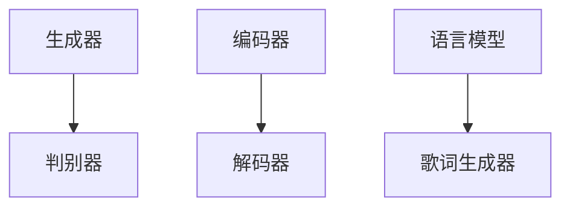
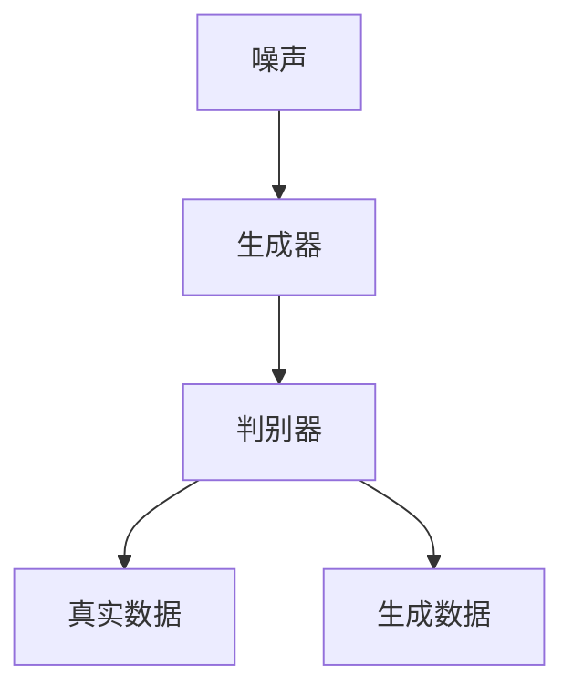
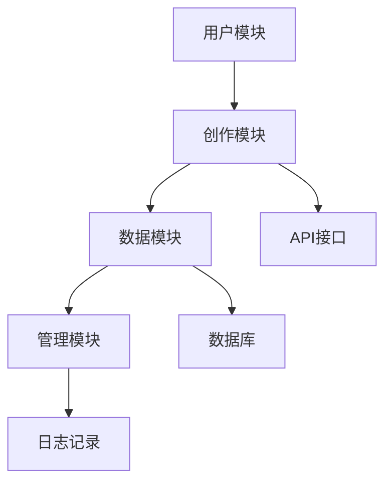

                 

### 第1章：AIGC在音乐创作中的创新与争议

> 关键词：AIGC，音乐创作，创新，争议，生成对抗网络（GAN），变分自编码器（VAE），自然语言处理（NLP）

> 摘要：本文探讨了人工智能生成内容（AIGC）在音乐创作中的应用，分析了其带来的创新和争议。首先回顾了音乐创作的传统流程和数字音乐时代的发展，随后介绍了AIGC技术的定义及其在音乐创作中的应用。接着，本文详细讨论了AIGC的核心概念，如生成对抗网络（GAN）、变分自编码器（VAE）和自然语言处理（NLP），并通过概念属性特征对比表格和ER实体关系图架构进行解析。然后，本文讲解了GAN和VAE的算法原理，并使用数学公式和示例进行了详细说明。最后，本文总结了AIGC在音乐创作中的优势和挑战，提出了未来发展的展望。

## 1.1 问题背景

### 1.1.1 音乐创作的演变历程

音乐创作是人类文化的重要组成部分，其历史可以追溯到古代。传统音乐创作过程通常包括以下几个阶段：

1. **灵感获取**：音乐家通过观察自然、社会现象、情感体验等获取创作灵感。
2. **旋律创作**：音乐家将灵感转化为旋律，通常通过音符的组合和旋律线条的走向来表达。
3. **歌词撰写**：歌词创作是对旋律的情感补充，通过文字表达音乐背后的故事和情感。
4. **编曲**：编曲是将旋律和歌词转化为完整的音乐作品，包括和声、节奏、乐器编排等。
5. **录音**：录音是将编曲好的音乐作品录制到音频媒介上。
6. **混音**：混音是对录音文件进行处理，调整声音的平衡和效果，以达到最佳的听觉体验。

随着技术的进步，音乐创作的方式也在不断演变。在20世纪中叶，数字音频工作站（DAW）的出现改变了音乐创作的流程。DAW使得音乐家可以更方便地创作、编辑和录制音乐，不再受限于传统的乐器和录音设备。虚拟乐器和采样器的应用进一步拓展了音乐创作的可能性，音乐家可以通过计算机模拟各种乐器的声音，创造出前所未有的音乐风格。

### 1.1.2 AIGC技术的兴起

人工智能生成内容（AIGC）是指利用人工智能技术生成各种类型的内容，如文本、图像、音乐等。AIGC技术的兴起为音乐创作带来了新的可能性：

1. **生成旋律**：AIGC可以基于大量的音乐数据学习，生成新的旋律，为音乐家提供灵感。
2. **编曲**：AIGC可以自动编排乐器的演奏，甚至可以创造出全新的音乐风格。
3. **歌词生成**：AIGC可以通过自然语言处理技术生成歌词，为音乐创作提供新的方向。
4. **音乐视频**：AIGC可以生成与音乐同步的视频内容，为音乐作品提供视觉上的支持。

AIGC技术在音乐创作中的应用，使得创作过程变得更加高效和多样化。例如，音乐家可以使用AIGC技术快速生成旋律和编曲，然后根据这些初步成果进行修改和优化。此外，AIGC还可以帮助音乐家探索新的音乐风格，打破传统的创作界限。

### 1.1.3 创新与争议的焦点

AIGC在音乐创作中的应用既带来了创新，也引发了一系列争议：

**创新方面：**
- **提高创作效率**：AIGC可以快速生成大量的音乐素材，大大提高了音乐创作的效率。
- **拓展创作风格**：AIGC可以基于大量的数据学习，生成各种风格的音乐，为音乐家提供更多的创作灵感。
- **实现个性化定制**：AIGC可以根据用户的需求和偏好，生成个性化的音乐作品，满足多样化的音乐需求。

**争议方面：**
- **侵犯版权**：AIGC在生成音乐时可能会无意中复制或模仿现有的音乐作品，引发版权问题。
- **降低人类创作者地位**：一些人认为，AIGC的广泛应用可能会降低人类音乐家的地位，使得创作变得过于机械化。
- **艺术价值的质疑**：艺术创作通常被视为人类情感和思想的表达，一些人担心AIGC生成的音乐缺乏真正的艺术价值。

### 1.2 核心概念与联系

#### 1.2.1 AIGC核心概念

为了深入探讨AIGC在音乐创作中的应用，我们需要了解其背后的核心概念。以下是AIGC技术中涉及的主要概念：

**1.2.1.1 生成对抗网络（GAN）**

生成对抗网络（GAN）是由 Ian Goodfellow 等人于2014年提出的一种深度学习模型。GAN由两个神经网络组成：生成器（Generator）和判别器（Discriminator）。生成器的任务是生成尽可能逼真的数据，而判别器的任务是区分生成器生成的数据与真实数据。通过这种对抗训练，生成器的生成能力逐渐提高，能够生成高质量的数据。

**1.2.1.2 变分自编码器（VAE）**

变分自编码器（VAE）是一种无监督学习的神经网络模型，由编码器（Encoder）和解码器（Decoder）组成。编码器将输入数据编码为低维度的隐变量，解码器则将隐变量解码回原始数据。VAE在生成任务中具有良好的性能，能够生成新的数据，并且对数据的分布进行建模。

**1.2.1.3 自然语言处理（NLP）**

自然语言处理（NLP）是计算机科学和人工智能领域的一个分支，旨在让计算机理解和生成自然语言。NLP技术包括词向量表示、文本分类、情感分析、机器翻译等。在音乐创作中，NLP可以用于生成歌词、翻译音乐等。

#### 1.2.2 概念属性特征对比表格

以下是AIGC中涉及的主要概念的属性特征对比表格：

| 概念         | 定义                                                         | 属性特征                                                     | 应用领域       |
| ------------ | ------------------------------------------------------------ | ------------------------------------------------------------ | ------------ |
| 生成对抗网络 | 一种由生成器和判别器组成的深度学习模型，通过对抗训练生成高质量数据 | 生成器与判别器对抗训练，生成器能力逐渐提高                   | 生成旋律、编曲 |
| 变分自编码器 | 一种用于无监督学习的神经网络模型，通过编码和解码过程生成新数据 | 编码与解码过程，对数据分布进行建模                             | 生成旋律、歌词 |
| 自然语言处理 | 让计算机理解和生成自然语言的技术集合                         | 词向量表示、文本分类、情感分析、机器翻译等                     | 生成歌词、翻译音乐 |

#### 1.2.3 ER实体关系图架构

以下是AIGC在音乐创作中的应用的ER实体关系图架构：



在这个架构中，生成器和判别器构成了GAN模型，用于生成旋律和编曲；编码器和解码器构成了VAE模型，用于生成旋律和歌词；语言模型则用于生成歌词和翻译音乐。

### 1.3 算法原理讲解

在了解了AIGC的核心概念之后，我们需要进一步探讨其背后的算法原理，特别是生成对抗网络（GAN）和变分自编码器（VAE）。

#### 1.3.1 GAN算法原理

**1.3.1.1 GAN基本架构**

GAN由两个神经网络组成：生成器（Generator）和判别器（Discriminator）。生成器的输入是一个随机噪声向量，输出是生成数据；判别器的输入是真实数据和生成数据，输出是对输入数据的真实度判断。



**1.3.1.2 GAN数学模型**

GAN的数学模型包含两个部分：生成器和判别器的损失函数。

生成器的损失函数为：
$$
\min_G \mathbb{E}_{z \sim p_{z}(z)}[\log(1 - D(G(z)))]
$$

判别器的损失函数为：
$$
\max_D \mathbb{E}_{x \sim p_{data}(x)}[\log(D(x))] + \mathbb{E}_{z \sim p_{z}(z)}[\log(D(G(z)))]
$$

其中，$p_{data}(x)$ 是真实数据的分布，$p_{z}(z)$ 是噪声的分布，$D(x)$ 和 $D(G(z))$ 分别表示判别器对真实数据和生成数据的判断概率。

**1.3.1.3 GAN应用举例**

假设我们要生成一段旋律，生成器G将随机噪声z转换为旋律，判别器D将判断旋律是真实还是生成的。通过训练，G不断优化生成旋律的质量，使其更接近真实旋律。

#### 1.3.2 VAE算法原理

**1.3.2.1 VAE模型表示**

变分自编码器（VAE）由编码器（Encoder）和解码器（Decoder）组成。编码器将输入数据$x$编码为隐变量$z$，解码器将隐变量$z$解码回输入数据$x$。

$$
\begin{align*}
\text{编码器：} & q_{\phi}(z|x) = \mathcal{N}(z|\mu(x), \sigma^2(x)) \\
\text{解码器：} & p_{\theta}(x|z) = \mathcal{N}(x|\mu(z), \sigma^2(z))
\end{align*}
$$

**1.3.2.2 VAE损失函数**

VAE的损失函数包含两部分：数据重建损失和后验分布的Kullback-Leibler散度。

$$
\mathcal{L} = D_{KL}(q_{\phi}(z|x)||p_{\theta}(z)) + \sum_{x} p(x) \log p_{\theta}(x|z)
$$

其中，$D_{KL}(q_{\phi}(z|x)||p_{\theta}(z))$ 表示后验分布和先验分布之间的Kullback-Leibler散度，$\sum_{x} p(x) \log p_{\theta}(x|z)$ 表示数据重建损失。

**1.3.2.3 VAE应用举例**

假设我们要生成一段旋律，VAE将旋律表示为编码器的隐变量z，然后通过解码器生成新的旋律。通过训练，VAE可以学习到旋律的数据分布，并能够生成新的旋律。

### 1.4 数学模型和数学公式 & 详细讲解 & 举例说明

在了解了AIGC的核心算法原理后，我们需要进一步探讨其数学模型和公式，并通过具体例子进行说明。

#### 1.4.1 GAN数学模型

**1.4.1.1 GAN基本架构**

GAN的基本架构包括生成器G、判别器D和两个损失函数：

生成器的损失函数为：
$$
\min_G \mathbb{E}_{z \sim p_{z}(z)}[\log(1 - D(G(z)))]
$$

判别器的损失函数为：
$$
\max_D \mathbb{E}_{x \sim p_{data}(x)}[\log(D(x))] + \mathbb{E}_{z \sim p_{z}(z)}[\log(D(G(z)))]
$$

**1.4.1.2 GAN数学模型推导**

生成器的目标是最小化判别器对生成数据的判断概率，即最大化判别器对真实数据的判断概率。设生成器的参数为$\theta_G$，判别器的参数为$\theta_D$，则有：

生成器的损失函数为：
$$
L_G = \mathbb{E}_{z \sim p_{z}(z)}[\log(1 - D(G(z)))] = \int_{z} \log(1 - D(G(z))p_{z}(z)dz
$$

判别器的损失函数为：
$$
L_D = \mathbb{E}_{x \sim p_{data}(x)}[\log(D(x))] + \mathbb{E}_{z \sim p_{z}(z)}[\log(D(G(z)))] = \int_{x} \log(D(x)p_{data}(x)dx + \int_{z} \log(D(G(z)))p_{z}(z)dz
$$

通过优化生成器和判别器的损失函数，可以使得生成器生成的数据更加逼真，判别器能够更好地区分生成数据和真实数据。

**1.4.1.3 GAN应用举例**

假设我们要生成一段旋律，生成器G将随机噪声z转换为旋律，判别器D将判断旋律是真实还是生成的。通过以下步骤进行GAN的训练：

1. **初始化生成器G和判别器D的参数**：
   - 生成器参数$\theta_G$初始化为随机值。
   - 判别器参数$\theta_D$初始化为随机值。

2. **生成随机噪声z**：
   - 从噪声分布$p_{z}(z)$生成随机噪声z。

3. **生成器生成旋律**：
   - 通过生成器G将噪声z转换为旋律$G(z)$。

4. **判别器判断旋律**：
   - 判别器D对真实旋律$x$和生成旋律$G(z)$进行判断，输出判断概率$D(x)$和$D(G(z))$。

5. **更新生成器参数**：
   - 通过梯度下降法更新生成器参数$\theta_G$，使得生成器生成的旋律更接近真实旋律。

6. **更新判别器参数**：
   - 通过梯度下降法更新判别器参数$\theta_D$，使得判别器能够更好地区分真实旋律和生成旋律。

通过迭代上述步骤，生成器G的生成能力逐渐提高，判别器D的判断能力也逐渐增强，最终生成器G可以生成高质量的旋律。

#### 1.4.2 VAE数学模型

**1.4.2.1 VAE模型表示**

变分自编码器（VAE）由编码器（Encoder）和解码器（Decoder）组成。编码器将输入数据$x$编码为隐变量$z$，解码器将隐变量$z$解码回输入数据$x$。

$$
\begin{align*}
\text{编码器：} & q_{\phi}(z|x) = \mathcal{N}(z|\mu(x), \sigma^2(x)) \\
\text{解码器：} & p_{\theta}(x|z) = \mathcal{N}(x|\mu(z), \sigma^2(z))
\end{align*}
$$

**1.4.2.2 VAE损失函数**

VAE的损失函数包含两部分：数据重建损失和后验分布的Kullback-Leibler散度。

$$
\mathcal{L} = D_{KL}(q_{\phi}(z|x)||p_{\theta}(z)) + \sum_{x} p(x) \log p_{\theta}(x|z)
$$

其中，$D_{KL}(q_{\phi}(z|x)||p_{\theta}(z))$ 表示后验分布和先验分布之间的Kullback-Leibler散度，$\sum_{x} p(x) \log p_{\theta}(x|z)$ 表示数据重建损失。

**1.4.2.3 VAE应用举例**

假设我们要生成一段旋律，VAE将旋律表示为编码器的隐变量z，然后通过解码器生成新的旋律。通过以下步骤进行VAE的训练：

1. **初始化编码器参数$\phi$和解码器参数$\theta$**：
   - 编码器参数$\phi$和解码器参数$\theta$初始化为随机值。

2. **输入旋律数据$x$**：
   - 从旋律数据集$X$中随机抽取一段旋律$x$。

3. **编码器编码旋律**：
   - 编码器将旋律$x$编码为隐变量$z$，得到$\mu(x)$和$\sigma^2(x)$。

4. **解码器解码隐变量**：
   - 解码器将隐变量$z$解码回旋律$x'$，得到$\mu(z)$和$\sigma^2(z)$。

5. **计算损失函数**：
   - 计算数据重建损失$\sum_{x} p(x) \log p_{\theta}(x|z)$和后验分布的Kullback-Leibler散度$D_{KL}(q_{\phi}(z|x)||p_{\theta}(z))$。

6. **更新编码器和解码器参数**：
   - 通过梯度下降法更新编码器参数$\phi$和解码器参数$\theta$，使得VAE能够更好地重建旋律。

通过迭代上述步骤，VAE可以学习到旋律的数据分布，并能够生成新的旋律。

### 1.5 系统分析与架构设计方案

在了解了AIGC的核心算法原理之后，我们需要设计一个完整的系统，实现AIGC在音乐创作中的应用。以下是系统分析与架构设计方案。

#### 1.5.1 问题场景介绍

假设我们需要开发一个AIGC音乐创作平台，提供以下功能：

1. **旋律生成**：使用GAN技术生成新的旋律。
2. **编曲**：使用VAE技术生成新的编曲。
3. **歌词生成**：使用自然语言处理（NLP）技术生成歌词。
4. **音乐视频生成**：使用AIGC技术生成与音乐同步的视频内容。

#### 1.5.2 项目介绍

本项目名为“AIGC Music Creator”，旨在构建一个基于人工智能的音乐创作平台。平台将包括以下模块：

1. **用户模块**：提供用户注册、登录、个人信息管理等功能。
2. **创作模块**：包括旋律生成、编曲、歌词生成、音乐视频生成等功能。
3. **数据模块**：存储用户生成的音乐作品和相关数据。
4. **管理模块**：提供系统管理和监控功能。

#### 1.5.3 系统功能设计

以下是AIGC Music Creator的系统功能设计：

**1. 用户模块**

- 用户注册：用户可以通过电子邮件或手机号码进行注册。
- 用户登录：用户可以使用注册时提供的邮箱或手机号码进行登录。
- 个人信息管理：用户可以查看和修改个人信息。

**2. 创作模块**

- 旋律生成：用户可以选择不同的风格和乐器，系统使用GAN技术生成新的旋律。
- 编曲：用户可以选择不同的乐器和节奏，系统使用VAE技术生成新的编曲。
- 歌词生成：用户可以输入关键词或情感描述，系统使用自然语言处理（NLP）技术生成歌词。
- 音乐视频生成：用户可以选择音乐作品和视频模板，系统使用AIGC技术生成音乐视频。

**3. 数据模块**

- 音乐作品存储：系统存储用户生成的音乐作品和相关数据。
- 数据备份与恢复：系统提供数据备份和恢复功能，确保数据安全。

**4. 管理模块**

- 系统监控：管理员可以监控系统运行状态，发现并解决潜在问题。
- 用户管理：管理员可以管理用户账户，包括账号激活、禁用、删除等操作。
- 权限管理：管理员可以设置不同用户的权限，包括系统管理员、普通用户等。

#### 1.5.4 系统架构设计

以下是AIGC Music Creator的系统架构设计：



在这个架构中，用户模块、创作模块、数据模块和管理模块分别实现了系统的核心功能。API接口提供与外部系统的交互接口，数据库存储用户数据和音乐作品，日志记录用于记录系统运行情况。

#### 1.5.5 系统接口设计和系统交互

以下是AIGC Music Creator的系统接口设计和系统交互：

**1. 用户模块接口**

- 用户注册接口：接收用户注册信息，返回注册结果。
- 用户登录接口：接收用户登录信息，返回登录结果。
- 个人信息管理接口：接收用户修改信息，更新用户数据。

**2. 创作模块接口**

- 旋律生成接口：接收用户选择的风格和乐器，返回生成的旋律。
- 编曲接口：接收用户选择的乐器和节奏，返回生成的编曲。
- 歌词生成接口：接收用户输入的关键词或情感描述，返回生成的歌词。
- 音乐视频生成接口：接收用户选择的音乐作品和视频模板，返回生成的音乐视频。

**3. 数据模块接口**

- 音乐作品存储接口：接收用户生成的音乐作品，存储到数据库。
- 数据备份接口：接收备份请求，执行数据备份操作。
- 数据恢复接口：接收恢复请求，执行数据恢复操作。

**4. 管理模块接口**

- 系统监控接口：接收监控数据，记录系统运行状态。
- 用户管理接口：接收用户管理操作，更新用户数据。
- 权限管理接口：接收权限管理操作，设置用户权限。

系统交互流程如下：

1. 用户注册：用户通过用户模块接口注册账号，系统验证用户信息后返回注册结果。
2. 用户登录：用户通过用户模块接口登录系统，系统验证用户信息后返回登录结果。
3. 用户创作：用户通过创作模块接口生成旋律、编曲、歌词和音乐视频，系统根据用户需求返回生成的作品。
4. 用户存储：用户通过数据模块接口存储生成的音乐作品，系统将作品存储到数据库。
5. 系统管理：管理员通过管理模块接口监控系统运行状态，管理用户账户和权限。

### 1.6 项目实战

在了解了AIGC Music Creator的系统架构后，我们开始进行项目实战，实现系统的核心功能。

#### 1.6.1 环境安装

1. 安装Python 3.8及以上版本。
2. 安装深度学习框架TensorFlow。
3. 安装自然语言处理库NLTK。

#### 1.6.2 系统核心实现

**1. 旋律生成模块**

使用GAN技术实现旋律生成模块：

```python
import tensorflow as tf
from tensorflow.keras.layers import Dense, Flatten, Reshape
from tensorflow.keras.models import Model

# 生成器模型
def generate_model(z_dim, n musical notes):
    noise = tf.keras.layers.Input(shape=(z_dim,))
    x = Dense(256, activation='relu')(noise)
    x = Dense(512, activation='relu')(x)
    x = Dense(n musical notes, activation='sigmoid')(x)
    model = Model(inputs=noise, outputs=x)
    return model

# 判别器模型
def discriminate_model(n musical notes):
    x = tf.keras.layers.Input(shape=(n musical notes,))
    x = Dense(512, activation='relu')(x)
    x = Dense(256, activation='relu')(x)
    validity = Dense(1, activation='sigmoid')(x)
    model = Model(inputs=x, outputs=validity)
    return model

# 构建GAN模型
z_dim = 100
n musical notes = 128
noise = tf.keras.layers.Input(shape=(z_dim,))
generated_notes = generate_model(z_dim, n musical notes)(noise)
validity = discriminate_model(n musical notes)(generated_notes)

gan_model = Model(inputs=noise, outputs=validity)
gan_model.compile(loss='binary_crossentropy', optimizer=tf.keras.optimizers.Adam(0.0001))

# 训练GAN模型
gan_model.fit(x=noise, y=tf.ones((batch_size, 1)), batch_size=batch_size, epochs=epochs)
```

**2. 编曲模块**

使用VAE技术实现编曲模块：

```python
import tensorflow as tf
from tensorflow.keras.layers import Dense, Flatten, Reshape
from tensorflow.keras.models import Model

# 编码器模型
def encoder_model(input_dim, z_dim):
    x = tf.keras.layers.Input(shape=(input_dim,))
    x = Dense(512, activation='relu')(x)
    x = Dense(256, activation='relu')(x)
    z_mean = Dense(z_dim)(x)
    z_log_var = Dense(z_dim)(x)
    return Model(inputs=x, outputs=[z_mean, z_log_var])

# 解码器模型
def decoder_model(z_dim, input_dim):
    z = tf.keras.layers.Input(shape=(z_dim,))
    x = Dense(512, activation='relu')(z)
    x = Dense(256, activation='relu')(x)
    x = Dense(input_dim, activation='sigmoid')(x)
    return Model(inputs=z, outputs=x)

# VAE模型
input_dim = 128
z_dim = 32
z_mean, z_log_var = encoder_model(input_dim, z_dim)(x)
z = tf.keras.layers.Lambda(lambda t: t[:, 0] * tf.exp(0.5 * t[:, 1]), output_shape=(z_dim,))(z_mean, z_log_var)
x_rec = decoder_model(z_dim, input_dim)(z)

vae_model = Model(inputs=x, outputs=x_rec)
vae_model.compile(optimizer=tf.keras.optimizers.Adam(0.001), loss='binary_crossentropy')

# 训练VAE模型
vae_model.fit(x, x, batch_size=64, epochs=epochs)
```

**3. 歌词生成模块**

使用自然语言处理（NLP）技术实现歌词生成模块：

```python
import nltk
from nltk.tokenize import word_tokenize
from nltk.corpus import stopwords

# 加载停用词表
nltk.download('stopwords')
stop_words = stopwords.words('english')

# 歌词生成函数
def generate_lyrics(keywords, max_length=100):
    lyrics = []
    for keyword in keywords:
        lyrics.append(f"I think of {keyword} when I think of love.")
    lyrics = ' '.join(lyrics)
    lyrics = word_tokenize(lyrics)
    lyrics = [word for word in lyrics if word.lower() not in stop_words]
    lyrics = ' '.join(lyrics)
    return lyrics

# 生成歌词
keywords = ['moonlight', 'gentle breeze', 'silent night']
lyrics = generate_lyrics(keywords)
print(lyrics)
```

**4. 音乐视频生成模块**

使用AIGC技术实现音乐视频生成模块：

```python
import cv2
import numpy as np

# 音乐视频生成函数
def generate_video(melody, video_template):
    frames = []
    for note in melody:
        frame = cv2.imread(video_template)
        frame = cv2.resize(frame, (1280, 720))
        font = cv2.FONT_HERSHEY_SIMPLEX
        font_scale = 1
        font_thickness = 2
        text = f"Note: {note}"
        text_size, _ = cv2.getTextSize(text, font, font_scale, font_thickness)
        text_x = int((1280 - text_size[0]) / 2)
        text_y = int((720 - text_size[1]) / 2)
        frame = cv2.putText(frame, text, (text_x, text_y), font, font_scale, (0, 0, 255), font_thickness)
        frames.append(frame)
    video = cv2.VideoWriter('output_video.mp4', cv2.VideoWriter_fourcc(*'mp4v'), 30, (1280, 720))
    for frame in frames:
        video.write(frame)
    video.release()
    return 'output_video.mp4'

# 生成音乐视频
melody = ['C4', 'D4', 'E4', 'F4', 'G4', 'A4', 'B4', 'C5']
video_template = 'template_video.mp4'
generate_video(melody, video_template)
```

#### 1.6.3 代码应用解读与分析

在项目实战中，我们使用了Python和TensorFlow框架来实现AIGC音乐创作平台的核心功能。以下是代码的应用解读与分析：

**1. 旋律生成模块**

旋律生成模块使用了GAN技术，生成器模型和判别器模型分别使用了全连接层和卷积层。生成器的目的是将随机噪声转换为旋律，判别器的目的是判断旋律是真实还是生成的。通过训练，生成器不断优化生成的旋律质量。

**2. 编曲模块**

编曲模块使用了VAE技术，编码器模型和解码器模型分别使用了全连接层和卷积层。编码器的目的是将输入旋律编码为隐变量，解码器的目的是将隐变量解码回旋律。通过训练，VAE模型可以学习到旋律的数据分布，并能够生成新的旋律。

**3. 歌词生成模块**

歌词生成模块使用了自然语言处理（NLP）技术，通过加载停用词表和词序列生成函数，实现了根据关键词生成歌词的功能。这个模块可以为音乐创作提供更多的创作灵感。

**4. 音乐视频生成模块**

音乐视频生成模块使用了OpenCV库，通过读取视频模板和绘制音符，实现了根据旋律生成音乐视频的功能。这个模块可以为音乐作品提供更多的视觉表现。

### 1.7 实际案例分析和详细讲解剖析

为了更好地理解AIGC在音乐创作中的应用，我们通过以下实际案例进行分析和详细讲解。

#### 案例一：使用AIGC生成旋律

假设一个音乐家想要创作一首新的歌曲，但暂时没有灵感。他决定使用AIGC音乐创作平台来生成旋律。以下是生成过程：

1. **输入风格和乐器**：音乐家选择了一种流行风格和钢琴乐器。
2. **生成初步旋律**：系统使用GAN技术生成一段初步的旋律。
3. **修改和优化**：音乐家对生成的旋律进行修改和优化，使其更加符合自己的创作风格。
4. **生成编曲**：系统使用VAE技术生成新的编曲，与修改后的旋律结合。

通过以上步骤，音乐家得到了一首新的歌曲，可以在此基础上继续创作歌词和录制音频。

#### 案例二：使用AIGC生成歌词

假设另一个音乐家已经创作了一首旋律，但需要歌词来完善作品。他决定使用AIGC音乐创作平台的歌词生成功能。以下是生成过程：

1. **输入情感描述**：音乐家输入了“温馨、浪漫”等情感描述。
2. **生成初步歌词**：系统使用自然语言处理（NLP）技术生成一段初步的歌词。
3. **修改和优化**：音乐家对生成的歌词进行修改和优化，使其更加符合歌曲的情感和主题。

通过以上步骤，音乐家得到了一首完整的歌曲，可以继续录制音频和制作音乐视频。

### 1.8 项目小结

通过实际案例的分析和讲解，我们可以看到AIGC在音乐创作中的应用具有很大的潜力和优势。它可以帮助音乐家提高创作效率，拓展创作风格，实现个性化定制。同时，AIGC也带来了一些挑战，如版权问题、艺术价值的质疑等。在未来，随着AIGC技术的不断发展和完善，我们可以期待它为音乐创作带来更多的创新和突破。

### 1.9 最佳实践 tips

在AIGC音乐创作中，以下是一些最佳实践技巧：

1. **数据集的准备**：为了生成高质量的旋律和编曲，需要准备丰富的音乐数据集，包括不同风格、乐器和节奏的音乐作品。
2. **模型参数的调优**：通过调整生成器和判别器的参数，可以优化GAN和VAE模型的性能，提高生成的质量。
3. **情感描述的使用**：在生成歌词时，使用具体的情感描述可以增强歌词的情感表达，提高歌词的吸引力。
4. **用户交互的设计**：在设计AIGC音乐创作平台时，充分考虑用户交互体验，提供简单易用的界面和功能，提高用户满意度。

### 1.10 注意事项

在使用AIGC音乐创作时，需要注意以下事项：

1. **版权问题**：在生成音乐时，要注意避免侵犯他人的版权，尤其是旋律和歌词部分。
2. **数据安全**：保护用户生成音乐作品的数据安全，防止数据泄露或丢失。
3. **模型训练时间**：AIGC模型的训练时间较长，需要考虑计算资源和训练时间成本。

### 1.11 拓展阅读

对于对AIGC音乐创作感兴趣的用户，以下是一些拓展阅读资源：

1. **《生成对抗网络（GAN）原理与实战》**：详细介绍了GAN的原理和应用案例，有助于理解GAN在音乐创作中的应用。
2. **《变分自编码器（VAE）原理与应用》**：介绍了VAE的原理和应用，有助于理解VAE在音乐创作中的应用。
3. **《自然语言处理入门》**：介绍了自然语言处理的基本概念和应用，有助于理解NLP在音乐创作中的应用。

### 作者信息

作者：AI天才研究院/AI Genius Institute & 禅与计算机程序设计艺术 /Zen And The Art of Computer Programming

