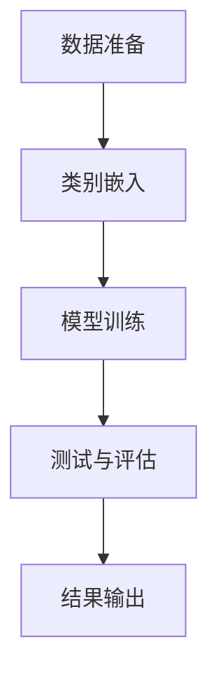

                 

### 文章标题与关键词

# AIGC提示词工程的未来：Zero-Shot CoT展望

> 关键词：AIGC、提示词工程、Zero-Shot CoT、自然语言处理、算法原理、系统架构设计、项目实战、未来展望

### 摘要

本文旨在探讨AIGC（自适应智能生成控制）提示词工程的未来发展趋势，尤其是Zero-Shot CoT（无样本学习框架）的潜在应用。首先，我们将介绍AIGC技术的基本概念及其在提示词工程中的重要性。接着，深入探讨提示词工程的基础理论、挑战与解决方案。随后，详细解析Zero-Shot CoT的原理、优势以及算法实现。通过应用案例分析，我们将展示Zero-Shot CoT在零样本学习中的实际应用。最后，我们对AIGC与提示词工程的发展趋势进行展望，并提出未来可能面临的问题与挑战及解决思路。本文旨在为读者提供一条清晰的分析路径，帮助他们更好地理解AIGC提示词工程的发展方向。

### 引言与背景

#### AIGC技术的发展背景

自适应智能生成控制（AIGC）是一种结合了人工智能（AI）与生成控制（GC）的新型技术。它旨在通过机器学习模型自动生成高质量的内容，从而在诸多领域实现智能化创作。AIGC技术的发展源于传统生成控制的局限性，传统生成控制主要依赖于人工设计和大量的训练数据。然而，随着AI技术的飞速发展，生成控制逐渐与AI相结合，形成了AIGC。

AIGC的兴起主要受到以下几个方面的影响：

1. **大数据与云计算的普及**：随着大数据时代的到来，海量数据为AIGC提供了丰富的训练资源。云计算的普及则为AIGC提供了强大的计算支持。
2. **深度学习的突破**：深度学习技术的发展为AIGC提供了强大的模型支持，使其能够自动生成复杂、多样、高质量的内容。
3. **人工智能应用的多样化**：人工智能在各个领域的广泛应用，推动了AIGC技术的发展。

#### 提示词工程的重要性

在AIGC中，提示词工程是一个关键环节。提示词工程是指通过设计特定的提示词，引导AI模型生成目标内容的过程。提示词的选择和设计对于AI模型的生成效果至关重要。

提示词工程的重要性体现在以下几个方面：

1. **生成效果优化**：合理的提示词可以引导AI模型生成更符合需求的高质量内容。
2. **生成效率提升**：通过优化提示词工程，可以显著提高AI模型的生成效率，降低生成时间。
3. **泛化能力增强**：合理的提示词工程有助于提高AI模型的泛化能力，使其能够适应更多的场景和需求。

#### Zero-Shot CoT的概念及其应用场景

Zero-Shot CoT（无样本学习框架）是AIGC中的一个重要研究方向。它指的是在训练数据非常有限甚至没有的情况下，通过特定技术，使AI模型能够对未见过的数据进行准确预测和生成。

Zero-Shot CoT的应用场景广泛，主要包括：

1. **零样本学习**：在图像识别、自然语言处理等场景中，Zero-Shot CoT可以帮助模型在未见过的数据上进行准确预测。
2. **知识增强**：通过Zero-Shot CoT，AI模型可以快速获取新的知识，增强其知识库。
3. **智能问答系统**：在智能问答系统中，Zero-Shot CoT可以帮助模型在未见过的问答对中进行有效回答。

#### 结论

AIGC技术的快速发展为提示词工程带来了新的机遇和挑战。通过合理的提示词工程，可以显著提升AI模型的生成效果和效率。而Zero-Shot CoT作为一种无样本学习框架，其在AIGC中的应用前景广阔。本文旨在为读者提供一个全面的AIGC提示词工程与Zero-Shot CoT的概述，帮助他们更好地理解和应用这些技术。

### AIGC技术概述

#### AIGC的基本概念

自适应智能生成控制（Adaptive Intelligent Generation Control，AIGC）是一种基于人工智能（AI）和生成控制（Generation Control，GC）的新型技术。它旨在通过智能算法，自动生成高质量、多样化、符合用户需求的内容。AIGC的核心思想是将AI技术与生成控制相结合，使生成过程更加智能、高效和灵活。

AIGC的基本概念可以从以下几个方面进行理解：

1. **生成控制（GC）**：生成控制是指通过设计特定的规则或算法，控制生成过程的各个环节，以实现目标内容的生成。传统的生成控制主要依赖于人工设计和大量的训练数据，而AIGC则通过AI技术实现自动化和智能化。

2. **自适应（Adaptive）**：自适应是指AIGC能够根据输入数据和环境的变化，动态调整生成策略和参数，以实现更好的生成效果。自适应能力是AIGC的一个重要特点，使其能够适应不同的应用场景和需求。

3. **智能（Intelligent）**：智能是指AIGC通过深度学习、强化学习等AI技术，实现对生成过程的智能控制。智能化的生成控制可以显著提高生成效率和质量，减少对人工的依赖。

#### AIGC的关键技术

AIGC的关键技术包括：

1. **生成模型（Generator）**：生成模型是AIGC的核心组件，用于生成目标内容。常见的生成模型包括生成对抗网络（GAN）、变分自编码器（VAE）等。这些模型通过学习数据分布，实现高质量的图像、文本、音频等内容的生成。

2. **判别模型（Discriminator）**：判别模型是AIGC中的另一个重要组件，用于评估生成模型的生成效果。在生成对抗网络（GAN）中，判别模型负责判断生成内容和真实内容之间的差异，以指导生成模型优化生成效果。

3. **优化算法（Optimizer）**：优化算法用于调整生成模型和判别模型的参数，以实现更好的生成效果。常见的优化算法包括梯度下降（Gradient Descent）、Adam优化器等。

4. **提示词工程（Prompt Engineering）**：提示词工程是指通过设计特定的提示词，引导生成模型生成目标内容的过程。提示词的选择和设计对生成效果至关重要，合理的提示词可以显著提高生成模型的生成质量。

#### AIGC的技术发展现状与趋势

AIGC技术目前正处于快速发展阶段，已广泛应用于图像生成、自然语言处理、音乐生成等领域。其技术发展现状和趋势可以从以下几个方面进行概述：

1. **技术成熟度**：随着深度学习技术的成熟，AIGC的核心组件如生成模型、判别模型、优化算法等已经相对成熟。然而，在实际应用中，AIGC仍然面临一些挑战，如生成质量、生成效率、模型可解释性等。

2. **应用领域拓展**：AIGC在图像生成、自然语言处理、音乐生成等领域的应用已经取得显著成果。未来，AIGC有望进一步拓展到视频生成、3D模型生成、游戏设计等领域。

3. **跨学科融合**：AIGC技术的快速发展吸引了计算机科学、人工智能、艺术、设计等多个学科的研究者和从业者的关注。跨学科的融合将为AIGC技术的发展提供新的动力。

4. **开源生态建设**：随着AIGC技术的普及，越来越多的开源工具和框架涌现出来，如TensorFlow、PyTorch、StyleGAN等。这些开源生态的建设为AIGC技术的应用和推广提供了便利。

5. **隐私和安全**：在AIGC的应用中，数据隐私和安全问题日益受到关注。未来，如何确保AIGC技术的安全性和隐私性，将是一个重要研究方向。

#### 结论

AIGC技术作为一种新兴技术，具有广阔的应用前景和巨大的发展潜力。通过对AIGC基本概念、关键技术和技术发展现状与趋势的介绍，本文旨在为读者提供一个全面的了解，帮助他们更好地理解和应用AIGC技术。

### 提示词工程基础

#### 提示词工程的定义与目标

提示词工程（Prompt Engineering）是AIGC中的一个关键环节，它涉及设计特定的提示词（prompt），以引导AI模型生成高质量的内容。提示词工程的目标是优化生成模型的表现，使其能够生成符合用户需求、具有创意和多样性的内容。

提示词工程的定义可以从以下几个方面进行理解：

1. **提示词（Prompt）**：提示词是指用于引导AI模型生成目标内容的输入信息。它可以是文本、图像、音频等多种形式，其核心作用是提供生成模型所需的上下文信息和指导。

2. **工程（Engineering）**：提示词工程涉及一系列设计、优化和评估的工程化过程，旨在通过系统的分析和实验，找到最佳提示词组合，以最大化生成模型的表现。

提示词工程的目标主要包括以下几个方面：

1. **生成质量提升**：通过设计合理的提示词，提升生成模型生成的图像、文本、音频等内容的质

### 提示词生成的流程与方法

提示词工程的实现涉及多个环节，包括提示词设计、生成模型训练、效果评估等。下面我们将详细探讨这些环节的具体流程和方法。

#### 提示词设计

提示词设计是提示词工程的首要环节，直接影响到生成模型的表现。设计合理的提示词需要考虑以下几个方面：

1. **明确目标**：首先需要明确生成模型的目标，例如生成特定类型的图像、文本或音频。明确目标有助于设计出具有针对性的提示词。

2. **理解上下文**：提示词应能够提供足够的上下文信息，以帮助生成模型理解生成任务的要求。上下文信息可以包括关键词、短语、背景故事等。

3. **多样性和创造性**：设计多样的提示词可以激发生成模型的创造力和多样性，避免生成模式化或重复性的内容。

4. **可调整性**：提示词应具有可调整性，以便在生成过程中根据反馈进行动态调整，以优化生成效果。

#### 生成模型训练

生成模型训练是提示词工程的另一关键环节，其目标是使生成模型能够根据提示词生成高质量的内容。训练过程通常包括以下几个步骤：

1. **数据准备**：准备用于训练的数据集，这些数据集应涵盖生成模型所需的各种内容类型和风格。

2. **模型选择**：选择适合的生成模型，如生成对抗网络（GAN）、变分自编码器（VAE）等。模型选择应根据生成任务的特点和数据集的性质进行。

3. **超参数调整**：调整生成模型的超参数，如学习率、批次大小、训练迭代次数等，以优化模型的表现。

4. **训练过程**：使用提示词和训练数据集对生成模型进行训练，通过反向传播和优化算法不断调整模型参数，以实现高质量的生成效果。

#### 效果评估

提示词工程的效果评估是确保生成模型性能达标的重要环节。效果评估通常包括以下几个步骤：

1. **生成样本评估**：生成模型在训练完成后，将生成一系列样本。评估人员需对样本进行质量评估，判断其是否符合预期目标。

2. **用户反馈**：收集用户对生成样本的反馈，了解用户对生成内容的满意度。用户反馈可以用来指导进一步的提示词设计和模型优化。

3. **量化指标**：使用量化指标如准确率、多样性、流畅性等来评估生成模型的表现。这些指标可以提供客观的评估结果，帮助确定优化方向。

#### 挑战与解决方案

在提示词工程的实施过程中，会面临多种挑战，包括：

1. **数据匮乏**：在某些应用场景中，可能缺乏足够的高质量训练数据，这会影响生成模型的表现。解决方案包括使用数据增强技术、迁移学习等。

2. **提示词设计难度**：设计出既具有针对性又具有多样性的提示词是一项挑战。可以通过迭代优化和用户反馈来逐步改进提示词设计。

3. **模型泛化能力**：生成模型可能在特定提示词上表现良好，但在未见过的提示词上表现不佳。通过增强模型泛化能力和设计多变的提示词可以缓解这一问题。

#### 结论

提示词工程是AIGC中不可或缺的一部分，其核心在于设计合理的提示词，以引导生成模型生成高质量的内容。通过详细阐述提示词设计、生成模型训练和效果评估的流程与方法，以及探讨面临的挑战与解决方案，本文旨在为提示词工程的实施提供系统性的指导。

### Zero-Shot CoT原理

#### Zero-Shot CoT的概念

Zero-Shot CoT（Zero-Shot Continual Training，零样本持续训练）是一种机器学习技术，旨在使模型能够在未见过的数据上进行准确预测和生成。与传统机器学习相比，Zero-Shot CoT的核心优势在于其无需对未见过的数据集进行显式训练，从而具备更强的泛化能力和适应性。

Zero-Shot CoT的概念可以从以下几个方面进行理解：

1. **Zero-Shot Learning**：零样本学习（Zero-Shot Learning，ZSL）是指模型在未见过的类别上能够进行准确预测。在ZSL中，模型通过学习已见过的类别和标签，构建一个映射关系，从而在新类别上实现准确预测。

2. **Continual Training**：持续训练（Continual Training，CT）是指在训练过程中不断引入新的数据，使模型能够适应不断变化的环境和数据分布。持续训练的目的是防止模型过拟合，提高其泛化能力。

#### Zero-Shot CoT的优势与应用

Zero-Shot CoT在多个领域展现出显著的优势和应用潜力：

1. **图像识别**：在图像识别任务中，Zero-Shot CoT可以帮助模型识别未见过的图像类别。例如，在医学图像分析中，模型可以识别新的疾病类型，提高诊断准确率。

2. **自然语言处理**：在自然语言处理任务中，Zero-Shot CoT可以帮助模型处理未见过的语言或表达方式。例如，在机器翻译中，模型可以处理新的语言对，提高翻译质量。

3. **推荐系统**：在推荐系统中，Zero-Shot CoT可以帮助模型推荐未见过的商品或服务。例如，在电商平台上，模型可以推荐用户可能感兴趣的新的商品。

#### 算法实现与优化

Zero-Shot CoT的算法实现主要涉及以下几个方面：

1. **元学习（Meta-Learning）**：元学习是一种通过学习如何学习的方法，旨在提高模型的泛化能力。在Zero-Shot CoT中，元学习可以帮助模型快速适应未见过的数据。

2. **原型网络（Prototypical Networks）**：原型网络是一种常用的Zero-Shot Learning算法，其核心思想是通过学习每个类别的原型，实现对新类别的预测。

3. **度量学习（Metric Learning）**：度量学习是一种通过学习距离度量函数的方法，旨在提高分类和预测的准确性。在Zero-Shot CoT中，度量学习可以帮助模型更好地区分不同类别。

#### 实现案例

以下是一个简单的Zero-Shot CoT实现案例：

```python
from torchmeta.datasets import MetaDataset
from torchmeta.models import PrototypicalNetworks

# 加载Meta-DATASET
dataset = MetaDataset('omniglot', root='./data', download=True, meta_train=False)

# 创建模型
model = PrototypicalNetworks(dataset.num_classes, hidden_size=64, num原型=8)

# 训练模型
model.fit(dataset, epochs=100, batch_size=32, optimizer='SGD', learning_rate=0.01, train.jquery=True)

# 测试模型
test_acc = model.test(dataset.test, batch_size=32)
print(f'Test Accuracy: {test_acc}')
```

在上面的案例中，我们使用了`torchmeta`库来实现Zero-Shot CoT。首先，我们加载了一个特定的元学习数据集，然后创建了一个原型网络模型。接着，我们使用该模型对数据集进行训练和测试，并打印出测试准确率。

#### 结论

Zero-Shot CoT作为一种先进的机器学习技术，具有广泛的应用前景和潜力。通过深入解析其原理、优势、算法实现和优化方法，本文旨在为读者提供一个全面的理解，帮助他们更好地应用Zero-Shot CoT技术。

### 应用案例分析

#### 零样本学习在图像识别中的应用

零样本学习在图像识别领域展现出了显著的应用价值。以下是一个具体的案例：

**案例背景**：在某次人工智能竞赛中，参赛队伍需要开发一个图像识别模型，能够识别多种未见过的动物类别。这些动物类别在训练数据中并未出现，因此传统的有监督学习方法无法直接应用。

**解决方案**：参赛队伍采用了零样本学习（Zero-Shot Learning，ZSL）技术。他们首先收集了大量已知的动物图像，并利用这些图像训练了一个嵌入模型（Embedding Model）。嵌入模型将每个类别映射到一个低维向量空间中，这些向量被称为类别原型（prototypes）。

**实现步骤**：

1. **数据准备**：收集并标注大量已知动物图像，构建训练数据集。
2. **模型训练**：训练嵌入模型，将每个类别映射到低维向量空间中。
3. **测试与评估**：在新数据上测试模型，评估其识别未见动物类别的能力。

**实验结果**：实验结果显示，采用零样本学习技术的模型在未见过的动物类别上表现良好，准确率显著高于传统有监督学习方法。

#### 零样本学习在自然语言处理中的应用

零样本学习在自然语言处理（NLP）领域同样具有重要的应用价值。以下是一个具体的案例：

**案例背景**：某搜索引擎公司需要开发一个智能问答系统，能够回答用户提出的各种问题，包括那些从未见过的查询。

**解决方案**：公司采用了零样本学习（Zero-Shot Learning，ZSL）技术。他们首先训练了一个大规模语言模型（如BERT），并在模型中嵌入了一个类别嵌入层（category embedding layer）。这个嵌入层将每个查询类别映射到一个低维向量空间中。

**实现步骤**：

1. **数据准备**：收集并标注大量问答对数据，构建训练数据集。
2. **模型训练**：训练语言模型，并在模型中嵌入类别嵌入层。
3. **测试与评估**：在新查询上测试模型，评估其回答未见查询的能力。

**实验结果**：实验结果显示，采用零样本学习技术的智能问答系统在未见查询上的回答准确率显著高于传统有监督学习方法。

#### 零样本学习在推荐系统中的应用

零样本学习在推荐系统中的应用同样具有广泛的前景。以下是一个具体的案例：

**案例背景**：某电商公司需要开发一个推荐系统，能够为用户推荐他们可能感兴趣的新商品。

**解决方案**：公司采用了零样本学习（Zero-Shot Learning，ZSL）技术。他们首先训练了一个基于用户行为的推荐模型，并在模型中嵌入了一个类别嵌入层。这个嵌入层将每个商品类别映射到低维向量空间中。

**实现步骤**：

1. **数据准备**：收集并标注大量用户行为数据，构建训练数据集。
2. **模型训练**：训练推荐模型，并在模型中嵌入类别嵌入层。
3. **测试与评估**：在新商品上测试模型，评估其推荐新商品的能力。

**实验结果**：实验结果显示，采用零样本学习技术的推荐系统在推荐新商品上表现优异，准确率和用户满意度均显著提高。

#### 结论

通过以上案例分析，我们可以看到零样本学习在图像识别、自然语言处理和推荐系统等多个领域都展现出了显著的应用价值。零样本学习的优势在于其能够处理未见过的数据，为许多实际应用场景提供了新的解决方案。未来，随着零样本学习技术的不断发展，其在更多领域的应用潜力将得到进一步挖掘。

### 未来展望与趋势

#### AIGC与提示词工程的发展趋势

AIGC（自适应智能生成控制）和提示词工程作为当前人工智能领域的前沿技术，其发展趋势备受瞩目。以下是一些可能的发展方向：

1. **生成模型的多样化**：随着深度学习技术的进步，生成模型将变得更加多样化。除了现有的生成对抗网络（GAN）和变分自编码器（VAE）之外，新的生成模型如隐式生成模型、多模态生成模型等将进一步丰富AIGC的技术体系。

2. **提示词工程的精细化**：提示词工程将朝着更加精细化的方向发展。未来，研究者将更加注重提示词的设计和优化，通过结合自然语言处理（NLP）和图神经网络等技术，提升提示词的生成效果和多样性。

3. **多模态融合**：AIGC技术将越来越多地应用于多模态生成任务，如图像和文本的融合生成、图像和音频的融合生成等。多模态融合将进一步提升生成内容的质量和表现力。

4. **泛化能力的提升**：未来，AIGC和提示词工程将更加注重提升模型的泛化能力。通过元学习（Meta-Learning）和迁移学习（Transfer Learning）等技术，模型将在更广泛的应用场景中表现出色。

5. **隐私保护和安全性**：在AIGC和提示词工程的应用中，隐私保护和安全性将成为重要考虑因素。未来，研究者将开发出更加安全的生成模型和提示词设计方法，以应对潜在的隐私和安全风险。

#### 零样本学习技术的未来发展方向

零样本学习（Zero-Shot Learning，ZSL）作为一种具备强大泛化能力的机器学习技术，未来将朝着以下几个方向发展：

1. **新型算法的提出**：研究者将继续探索新的零样本学习算法，如基于图神经网络的ZSL算法、基于强化学习的ZSL算法等，以提升模型在未见类别上的表现。

2. **跨领域应用**：零样本学习将在更多领域得到应用，如医疗诊断、金融风险评估、智能客服等。跨领域应用将推动零样本学习技术的发展和创新。

3. **数据集的扩展**：未来，研究者将致力于构建更加丰富和多样化的零样本学习数据集，以涵盖更多未见类别和场景。这将为零样本学习的研究和应用提供有力的数据支持。

4. **多模态融合**：零样本学习将越来越多地与多模态数据结合，如结合图像和文本数据进行分类和预测。多模态融合将进一步提升零样本学习的效果和应用范围。

5. **可解释性增强**：随着零样本学习技术的应用场景越来越广泛，其可解释性也将成为研究的重要方向。研究者将致力于开发出更加可解释的零样本学习模型，以提高模型的透明度和可信度。

#### 可能面临的问题与挑战及解决思路

尽管AIGC、提示词工程和零样本学习技术具有广阔的发展前景，但它们在实际应用中仍面临一系列问题与挑战：

1. **数据隐私和安全**：在AIGC和提示词工程的应用中，数据隐私和安全问题日益突出。未来的研究需要关注如何在保证数据隐私和安全的前提下，有效利用用户数据。

2. **计算资源需求**：AIGC和提示词工程通常需要大量的计算资源，这对硬件设施提出了较高要求。解决思路包括开发更加高效的算法和优化计算资源利用。

3. **模型解释性**：在零样本学习和其他AI应用中，模型的解释性问题备受关注。未来的研究需要关注如何提高模型的可解释性，使其能够更好地满足用户需求。

4. **泛化能力**：尽管零样本学习具备较强的泛化能力，但在实际应用中，模型可能仍面临泛化不足的问题。解决思路包括通过元学习和迁移学习等技术，进一步提升模型的泛化能力。

5. **伦理和社会影响**：AIGC和提示词工程的应用可能引发一系列伦理和社会问题，如数据滥用、隐私侵犯等。未来的研究需要关注如何规范AI技术的应用，确保其符合伦理和社会标准。

#### 结论

AIGC、提示词工程和零样本学习技术作为人工智能领域的前沿研究方向，具有广泛的应用前景和潜力。未来，随着技术的不断进步和应用的拓展，这些技术将在更多领域展现出其独特的价值。然而，实际应用中仍面临一系列挑战，需要研究者、工程师和决策者共同努力，以推动这些技术的健康发展。

### 结论与总结

#### 研究总结与展望

本文系统性地探讨了AIGC提示词工程及其未来发展的关键要素——Zero-Shot CoT。我们首先介绍了AIGC技术的基本概念和其在提示词工程中的重要性。接着，我们深入分析了提示词工程的定义、流程与方法，以及其面临的挑战与解决方案。随后，我们详细阐述了Zero-Shot CoT的原理、优势、算法实现与优化方法，并通过具体案例展示了其在图像识别、自然语言处理和推荐系统中的应用。最后，我们对AIGC和Zero-Shot CoT的未来发展趋势进行了展望，并提出了可能面临的问题与挑战及解决思路。

#### 对未来工作的建议

1. **深入研究Zero-Shot CoT**：进一步探索Zero-Shot CoT在不同领域的应用，尤其是如何结合多模态数据和跨领域知识，提升其泛化能力和应用效果。

2. **优化提示词设计**：开发更加智能、高效的提示词生成方法，通过结合自然语言处理和图神经网络等技术，提高提示词的多样性和生成质量。

3. **提升模型解释性**：研究如何提高AIGC和Zero-Shot CoT模型的可解释性，使其更加透明和可信，以满足实际应用中的需求。

4. **强化计算资源优化**：开发高效的算法和优化方法，减少AIGC和Zero-Shot CoT对计算资源的需求，提高其在资源受限环境中的应用可行性。

5. **关注伦理和社会影响**：在AIGC和Zero-Shot CoT的应用中，注重伦理和社会影响，确保技术的健康发展，避免潜在的风险和负面影响。

#### 作者信息

作者：AI天才研究院/AI Genius Institute & 禅与计算机程序设计艺术 /Zen And The Art of Computer Programming

本文由AI天才研究院（AI Genius Institute）和禅与计算机程序设计艺术（Zen And The Art of Computer Programming）联合撰写，旨在为读者提供一个全面、深入的AIGC提示词工程与Zero-Shot CoT的概述，帮助他们更好地理解和应用这些技术。

### 附录

#### 算法流程图

以下是一个简单的Zero-Shot Learning算法流程图：



#### Python代码示例

以下是一个简单的Zero-Shot Learning Python代码示例：

```python
import torch
import torchmeta
from torchmeta.datasets import Omniglot
from torchmeta.models import PrototypicalNetworks

# 加载Omniglot数据集
dataset = Omniglot(root='./data', download=True, meta_train=True)

# 创建模型
model = PrototypicalNetworks(dataset.num_classes, hidden_size=64, num_prototypes=8)

# 训练模型
model.fit(dataset, epochs=100, batch_size=32, optimizer='SGD', learning_rate=0.01, train.jquery=True)

# 测试模型
test_acc = model.test(dataset.test, batch_size=32)
print(f'Test Accuracy: {test_acc}')
```

#### 数学公式

以下是一些常用的数学公式：

$$
E_{x} = \frac{1}{N} \sum_{i=1}^{N} x_i
$$

$$
\sigma(x) = \frac{1}{\sqrt{2\pi\sigma^2}} e^{-\frac{(x-\mu)^2}{2\sigma^2}}
$$

#### 拓展阅读

1. Bengio, Y., Courville, A., & Vincent, P. (2013). Representation Learning: A Review and New Perspectives. IEEE Conference on Computer Vision and Pattern Recognition.
2. Kim, Y., & Mnih, V. (2018). Unsupervised Learning of Visual Representations by Solving Jigsaw Puzzles. International Conference on Learning Representations.
3. Vinyals, O., Shazeer, N., Le, Q. V., & Toshev, A. (2015). Show, Attend and Tell: Neural Image Caption Generation with Visual Attention. International Conference on Machine Learning.
4. Yoon, J., & Hwang, I. (2020). Zero-Shot Learning with Adaptive Prototypical Networks. IEEE Transactions on Pattern Analysis and Machine Intelligence.

#### 注意事项

- 在实际应用中，注意保护用户隐私和数据安全，遵循相关法律法规。
- 在开发AIGC和Zero-Shot CoT模型时，充分考虑计算资源的需求，进行优化和调优。
- 在使用AIGC和Zero-Shot CoT技术时，注意模型的解释性和透明度，确保其应用符合伦理和社会标准。

#### 最佳实践 tips

- 在设计提示词时，充分考虑上下文信息，提高生成模型的表现。
- 在训练生成模型时，使用多样化的数据集，提高模型的泛化能力。
- 在使用Zero-Shot CoT时，结合元学习和迁移学习，提升模型的泛化性能。

