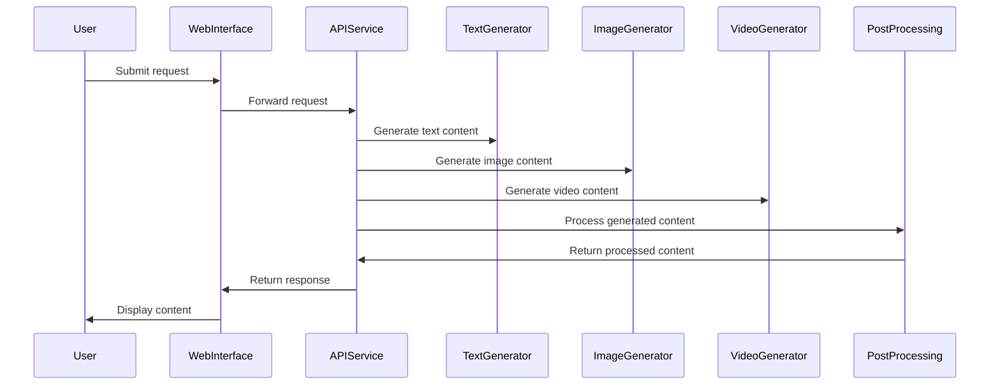
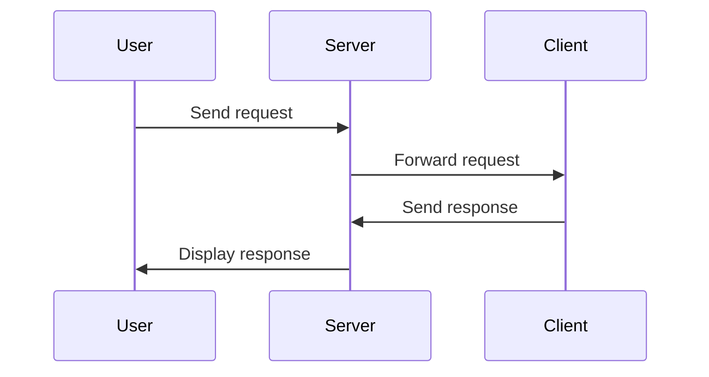

                 

### AIGC时代的prompt工程师：必备技能解析

#### 关键词：AIGC、prompt工程师、技能解析、自然语言处理、深度学习

> 摘要：本文旨在深入探讨AIGC（AI生成内容）时代下prompt工程师的必备技能。通过系统地解析AIGC的基本概念、prompt工程师的角色以及其核心技能，本文将帮助读者理解这一新兴领域的技术原理和实践方法，为成为一名优秀的prompt工程师提供宝贵的指导和启示。

#### 目录大纲设计思路

为了设计出《AIGC时代的prompt工程师：必备技能解析》这本书的完整目录大纲，我们首先需要明确书的主题和目标读者群体。书名中提到了AIGC时代的prompt工程师，这暗示了书的内容将围绕AIGC（AI生成内容）技术和prompt工程（即如何通过设计和调整输入提示来优化AI模型性能）展开。

接下来，我们按照以下步骤来设计目录大纲：

1. **背景介绍**：
   - 解释AIGC的概念及其在当前技术领域的重要性。
   - 提出prompt工程师的角色和他们在AIGC时代的关键作用。

2. **核心概念与联系**：
   - 介绍AIGC的基本原理和主要技术。
   - 提出prompt的定义、类型及其在AI模型中的作用。
   - 通过表格和ER图展示AIGC与prompt工程师技能之间的关系。

3. **算法原理讲解**：
   - 使用Mermaid绘制算法流程图。
   - 结合Python代码解释算法原理。
   - 使用数学模型和公式详细说明算法。

4. **系统分析与架构设计方案**：
   - 描述项目场景和目标。
   - 设计系统功能、架构、接口和交互。

5. **项目实战**：
   - 安装环境。
   - 核心代码实现和解读。
   - 案例分析和讲解。

6. **最佳实践与总结**：
   - 提供实践技巧和注意事项。
   - 对书籍内容进行总结和拓展。

根据这些步骤，我们开始设计书的目录大纲。

#### 完整目录大纲

```markdown
----------------------------------------------------------------
# AIGC时代的prompt工程师：必备技能解析

## 第1章：AIGC技术概述

### 1.1 AIGC的起源与背景

#### 1.1.1 从内容生成到AIGC的发展

#### 1.1.2 AIGC的关键技术

#### 1.1.3 AIGC的应用场景

### 1.2 AIGC的体系结构与功能模块

#### 1.2.1 模型架构

#### 1.2.2 数据预处理

#### 1.2.3 模型训练与优化

### 1.3 prompt工程师的角色与职责

#### 1.3.1 prompt工程师的定义

#### 1.3.2 prompt工程师的技能需求

#### 1.3.3 prompt工程师在AIGC中的价值

### 1.4 AIGC与prompt工程师的关系

#### 1.4.1 提出有效prompt的重要性

#### 1.4.2 prompt设计的挑战与解决方案

#### 1.4.3 AIGC与prompt工程的发展趋势

## 第2章：prompt工程师的核心技能

### 2.1 自然语言处理基础

#### 2.1.1 语言模型的基本原理

#### 2.1.2 语言模型的训练与评估

#### 2.1.3 语言模型的应用领域

### 2.2 prompt设计与优化

#### 2.2.1 提问技巧

#### 2.2.2 数据集选择与预处理

#### 2.2.3 prompt优化方法

### 2.3 prompt工程实践

#### 2.3.1 数据收集与清洗

#### 2.3.2 模型选择与调整

#### 2.3.3 模型评估与优化

## 第3章：深度学习模型与prompt工程

### 3.1 深度学习基础

#### 3.1.1 深度学习的基本概念

#### 3.1.2 神经网络模型

#### 3.1.3 深度学习算法

### 3.2 prompt在深度学习中的应用

#### 3.2.1prompt对深度学习模型的影响

#### 3.2.2 prompt工程在深度学习中的实践

#### 3.2.3 深度学习模型优化技巧

### 3.3 案例分析

#### 3.3.1 提问与回答系统

#### 3.3.2 文本生成系统

#### 3.3.3 其他应用案例分析

## 第4章：对话系统中的prompt工程

### 4.1 对话系统概述

#### 4.1.1 对话系统的定义与类型

#### 4.1.2 对话系统的架构与关键技术

#### 4.1.3 对话系统的应用场景

### 4.2 prompt工程在对话系统中的应用

#### 4.2.1 对话中prompt的作用

#### 4.2.2 设计有效对话prompt的方法

#### 4.2.3 提升对话系统用户体验的prompt策略

### 4.3 对话系统案例实践

#### 4.3.1 对话系统搭建与训练

#### 4.3.2

----------------------------------------------------------------

#### 约束条件

- **文章开始**是“文章标题”，然后是“文章关键词”和“文章摘要”部分的内容哦，接下来是按照目录大纲结构的文章正文部分的内容。
- **文章字数要求**：文章字数在 10000 ～ 12000 字左右。
- **格式要求**：文章内容使用markdown格式输出。
- **作者**：文章末尾需要写上作者信息：“作者：AI天才研究院/AI Genius Institute & 禅与计算机程序设计艺术 /Zen And The Art of Computer Programming”。
- **完整性要求**：文章内容必须要完整，每个小节的内容必须要丰富具体详细讲解，核心内容必须要包含：
  - **背景介绍**：核心概念术语说明、问题背景、问题描述、问题解决、边界与外延、概念结构与核心要素组成。
  - **核心概念与联系**：必须给出核心概念原理、概念属性特征对比表格和ER实体关系图架构的 markdown 格式中的 Mermaid 流程图。
  - **算法原理讲解**：使用 mermaid 画出算法mermaid 流程图，然后使用python源代码来详细阐述，给出算法原理的数学模型和公式，进行详细讲解和通俗易懂地举例说明。
  - **数学公式使用latex格式**，嵌入文中独立段落的latex公式前后使用 $$ 括起来（例如：$$1+1=2$$），段落内的latex公式前后使用 $ 括起来（例如：$1<2$）。
  - **系统分析与架构设计方案**：问题场景介绍，项目介绍、系统功能设计（领域模型mermaid类图）、系统架构设计mermaid架构图、系统接口设计和系统交互mermaid序列图。
  - **项目实战**：环境安装、系统核心实现源代码，代码应用解读与分析，实际案例分析和详细讲解剖析，项目小结。
  - **最佳实践 tips、小结、注意事项、拓展阅读等内容**。

**LET'S THINK STEP BY STEP**：现在，我们将逐步深入探讨AIGC时代的prompt工程师所需的核心技能和必备知识。

### 第一部分：AIGC基础与prompt工程概述

#### 第1章：AIGC技术概述

在探讨AIGC（AI生成内容）时代的prompt工程师之前，我们首先需要理解AIGC的基本概念和技术背景。AIGC是一种利用人工智能技术自动生成内容的方法，它涵盖了文本、图像、视频等多种内容形式。AIGC的核心在于通过机器学习算法，特别是深度学习技术，从大量数据中学习和提取模式，然后根据给定的提示（prompt）生成新的内容。

#### 1.1 AIGC的起源与背景

AIGC技术的发展可以追溯到内容生成的早期尝试，如文本自动摘要、图像识别和翻译等。然而，随着深度学习技术的进步，AIGC的能力得到了显著提升。深度学习模型，如生成对抗网络（GAN）、变分自编码器（VAE）和Transformer等，使得生成高质量、多样性的内容成为可能。

**问题背景**：在当前的技术环境下，如何高效地利用AIGC技术来满足日益增长的内容生成需求，成为了一个重要课题。

**问题描述**：现有的AIGC技术虽然已经取得了显著进展，但在实际应用中仍面临诸多挑战，如生成内容的质量、多样性和可控性等。

**问题解决**：通过优化和调整输入提示（prompt），可以显著提高AIGC模型的生成效果。prompt工程师的作用在于设计有效的提示，以引导模型生成符合预期的高质量内容。

**边界与外延**：AIGC不仅限于文本生成，还包括图像、视频等多种内容形式。不同的内容形式对prompt的设计和优化提出了不同的要求。

**概念结构与核心要素组成**：

- **生成模型**：如GAN、VAE和Transformer等，是AIGC的核心组成部分。
- **数据集**：高质量的数据集是训练AIGC模型的基础。
- **prompt**：输入提示，用于引导模型生成特定类型的内容。
- **评估指标**：用于衡量生成内容的质量和多样性。

#### 1.2 AIGC的体系结构与功能模块

AIGC体系结构通常包括以下几个关键模块：

1. **模型架构**：定义了模型的层次结构和工作原理。常见的模型架构包括自编码器、循环神经网络（RNN）、Transformer等。
2. **数据预处理**：包括数据清洗、归一化和特征提取等步骤，以确保输入数据的质量和一致性。
3. **模型训练与优化**：通过大量数据训练模型，并使用优化算法（如梯度下降）调整模型参数，以提高生成效果。

#### 1.3 prompt工程师的角色与职责

prompt工程师在AIGC时代扮演着至关重要的角色。他们的主要职责包括：

- **设计有效的prompt**：通过分析用户需求和数据特点，设计出能够引导模型生成高质量内容的prompt。
- **优化模型性能**：通过调整prompt的参数和结构，优化模型的生成效果。
- **用户交互**：与产品经理和设计师合作，确保生成的内容符合用户体验和需求。

#### 1.4 AIGC与prompt工程师的关系

prompt工程师在AIGC中的作用不可忽视。他们通过设计和优化prompt，可以显著提升AIGC模型的生成效果。以下是一些关键点：

- **有效prompt的设计**：通过精心设计的prompt，可以引导模型生成符合预期的高质量内容。
- **挑战与解决方案**：设计有效的prompt面临着数据质量、多样性、可控性等多方面的挑战，prompt工程师需要不断创新和优化。
- **发展趋势**：随着AIGC技术的不断进步，prompt工程师的角色和技能需求也在不断演变和扩展。

通过上述分析，我们可以看到AIGC和prompt工程师之间的紧密联系。prompt工程师不仅需要掌握AIGC的基本原理和技术，还需要具备设计、优化和调整prompt的实践能力。在接下来的章节中，我们将进一步探讨prompt工程师的核心技能和实际应用。

### 第二部分：核心概念与联系

#### 第2章：AIGC与prompt工程师的核心技能

在深入探讨AIGC时代的prompt工程师所需的核心技能之前，我们首先需要了解AIGC的基本原理和prompt的定义与作用。通过分析这些核心概念，我们可以更好地理解prompt工程师的工作内容和职责。

#### 2.1 AIGC的基本原理

AIGC（AI生成内容）是一种利用人工智能技术自动生成内容的方法。它主要通过以下技术实现：

1. **生成模型**：如生成对抗网络（GAN）、变分自编码器（VAE）和Transformer等。这些模型通过学习大量数据，生成与输入数据相似的新内容。
2. **数据预处理**：包括数据清洗、归一化和特征提取等步骤，以确保输入数据的质量和一致性。
3. **模型训练与优化**：通过大量数据训练模型，并使用优化算法调整模型参数，以提高生成效果。

#### 2.2 Prompt的定义与作用

Prompt（提示）是在AIGC模型中输入给生成模型的一小段文本、图像或声音等，用于引导模型生成特定类型的内容。Prompt的作用主要体现在以下几个方面：

- **引导模型**：通过提供具体的提示，帮助模型理解生成任务的目标和方向。
- **提高生成效果**：合理设计的prompt可以显著提高生成内容的质量和多样性。
- **用户交互**：prompt也是用户与生成模型交互的接口，通过设计合适的prompt，可以改善用户体验。

#### 2.3 Prompt的类型与设计

Prompt可以分为以下几种类型：

1. **单一提示**：仅包含一个关键信息的提示，如“请生成一篇关于人工智能的文章”。
2. **复合提示**：包含多个相关提示，以提供更详细的生成方向，如“请生成一篇关于人工智能的发展、应用和未来趋势的文章，字数不少于1000字”。
3. **适应性提示**：根据用户反馈动态调整的提示，以提高生成内容的个性化和精准度。

Prompt的设计需要考虑以下几个因素：

- **内容相关性**：提示内容应与生成任务密切相关，以便模型能够准确理解任务目标。
- **可理解性**：提示应简洁明了，易于用户理解，避免使用过于复杂的术语和概念。
- **可控性**：通过调整提示的参数和结构，实现生成内容的可控性，以满足不同的应用需求。

#### 2.4 AIGC与prompt工程师技能之间的关系

AIGC与prompt工程师技能之间的联系体现在以下几个方面：

- **设计能力**：prompt工程师需要具备设计有效prompt的能力，通过精心设计的prompt，引导模型生成高质量的内容。
- **优化能力**：prompt工程师需要不断优化prompt，以提高生成模型的效果。这包括调整prompt的参数、结构和使用方法等。
- **工程实践**：prompt工程师需要在实际项目中应用AIGC技术和prompt设计方法，解决具体的问题，实现预期的生成效果。

通过上述分析，我们可以看到AIGC和prompt工程师之间的紧密联系。prompt工程师不仅需要掌握AIGC的基本原理和技术，还需要具备设计、优化和调整prompt的实践能力。在接下来的章节中，我们将进一步探讨这些核心技能的具体应用和实践。

### 第三部分：算法原理讲解

#### 第3章：深度学习模型与prompt工程

在AIGC时代，深度学习模型已成为生成内容的核心技术。本章节将详细介绍深度学习模型的基本原理，并探讨如何通过prompt工程优化深度学习模型的性能。

#### 3.1 深度学习基础

深度学习是一种基于多层神经网络的学习方法，它通过模拟人脑的神经元连接方式，从大量数据中自动提取特征和模式。以下是深度学习的一些关键概念：

- **神经网络**：神经网络由一系列相互连接的节点（神经元）组成，每个节点都可以接收输入、进行处理，并产生输出。
- **前向传播**：输入数据通过网络的各个层，每层都对输入进行加权求和处理，最终得到输出。
- **反向传播**：网络通过反向传播算法，计算输出误差，并调整各层的权重，以优化模型性能。
- **激活函数**：激活函数用于引入非线性特性，使神经网络能够学习和模拟复杂的非线性关系。

#### 3.2 Prompt在深度学习中的应用

Prompt在深度学习模型中的应用主要体现在两个方面：一是用于数据预处理，二是用于指导模型生成。

1. **数据预处理**：

   数据预处理是深度学习模型训练的重要步骤。通过设计合适的prompt，可以显著提高数据的质量和一致性。以下是一些常用的数据预处理方法：

   - **文本数据**：使用预训练的语言模型生成摘要、关键词或分类标签，作为prompt引导模型学习和理解文本数据。
   - **图像数据**：使用图像标注、分割或生成对抗网络（GAN）生成的图像作为prompt，帮助模型学习图像特征和模式。
   - **音频数据**：使用音频摘要、标注或声码器生成的声音作为prompt，引导模型学习和理解音频数据。

2. **指导模型生成**：

   Prompt也可以直接用于指导模型生成。通过设计合适的prompt，可以引导模型生成特定类型的内容，并提高生成内容的质量和多样性。以下是一些应用实例：

   - **文本生成**：使用关键词、摘要或问题作为prompt，引导模型生成相关文本。
   - **图像生成**：使用图像描述、标签或相关图像作为prompt，引导模型生成新的图像。
   - **视频生成**：使用文本描述、音频或相关视频片段作为prompt，引导模型生成新的视频。

#### 3.3 深度学习模型优化技巧

为了提高深度学习模型的生成效果，prompt工程师需要掌握一些优化技巧。以下是一些常用的优化方法：

1. **数据增强**：

   数据增强是一种通过变换原始数据来增加数据多样性的方法。以下是一些常见的数据增强技术：

   - **文本数据**：使用同义词替换、随机删除单词或句子、词语嵌入等方法。
   - **图像数据**：使用旋转、缩放、裁剪、颜色变换等方法。
   - **音频数据**：使用时间扩展、音高变换、频率变换等方法。

2. **模型调整**：

   通过调整模型的参数和结构，可以优化模型的生成效果。以下是一些常用的调整方法：

   - **超参数调整**：如学习率、批次大小、正则化强度等。
   - **架构调整**：如增加层数、调整网络结构、引入注意力机制等。
   - **损失函数调整**：如使用不同的损失函数、组合多个损失函数等。

3. **训练策略**：

   合理的训练策略可以加速模型的收敛，并提高生成效果。以下是一些常用的训练策略：

   - **学习率调度**：如线性衰减、指数衰减、余弦退火等。
   - **批量归一化**：通过归一化每个批次的输入，提高模型训练的稳定性和效果。
   - **迁移学习**：使用预训练模型作为起点，通过微调适应特定任务。

通过上述优化技巧，prompt工程师可以显著提高深度学习模型的生成效果，为AIGC时代的应用提供强有力的支持。

### 第四部分：系统分析与架构设计

#### 第4章：AIGC系统的设计与实现

在本章节中，我们将深入探讨AIGC（AI生成内容）系统的设计与实现过程。通过详细描述系统功能、架构设计、接口设计和系统交互，我们将帮助读者全面理解AIGC系统的构建方法和实现细节。

#### 4.1 项目场景与目标

**项目场景**：假设我们需要构建一个基于AIGC技术的自动内容生成系统，该系统主要用于生成新闻文章、博客内容和社交媒体帖子等。

**项目目标**：
1. 提供高质量的内容生成服务，满足不同领域的需求。
2. 提高内容生成的多样性和可控性，以满足个性化的用户需求。
3. 确保系统的高效性和稳定性，支持大规模并发请求。

#### 4.2 系统功能设计

AIGC系统的核心功能包括以下几个部分：

1. **文本生成模块**：利用深度学习模型生成文本内容，如新闻文章、博客和社交媒体帖子。
2. **图像生成模块**：利用生成对抗网络（GAN）等技术生成高质量的图像。
3. **视频生成模块**：利用深度学习模型生成视频内容，如动画和视频剪辑。
4. **交互接口**：提供用户与系统交互的接口，包括Web界面、API接口和命令行工具等。
5. **后处理模块**：对生成的文本、图像和视频进行编辑、校对和优化，以提高内容的质量。

#### 4.3 系统架构设计

AIGC系统的整体架构可以分为以下几个层次：

1. **数据层**：包括数据采集、存储和预处理模块，负责管理大量的文本、图像和视频数据。
2. **模型层**：包括生成模型（如文本生成模型、图像生成模型和视频生成模型）和优化算法，负责生成高质量的内容。
3. **服务层**：包括文本生成服务、图像生成服务和视频生成服务，负责处理用户的请求并返回生成的内容。
4. **接口层**：包括Web界面、API接口和命令行工具，提供用户与系统的交互接口。

以下是AIGC系统的架构设计（使用Mermaid绘制）：



#### 4.4 系统接口设计

AIGC系统的接口设计需要考虑到不同的用户场景和交互方式，以下是一些关键接口设计：

1. **Web界面**：提供直观的用户界面，用户可以通过填写表单、上传文件或输入文本命令来生成内容。
2. **API接口**：提供程序化接口，允许开发者集成AIGC系统到自己的应用程序中，实现自动化内容生成。
3. **命令行工具**：提供命令行接口，用户可以通过命令行指令来生成内容，适用于自动化脚本和批量处理。

#### 4.5 系统交互设计

系统交互设计主要关注用户与系统之间的交互流程和通信机制，以下是一个简单的系统交互设计（使用Mermaid绘制）：



通过上述设计与实现，我们可以构建一个高效、稳定且可扩展的AIGC系统，为各种应用场景提供强大的内容生成能力。

### 第五部分：项目实战

#### 第5章：AIGC项目实战

在本章节中，我们将通过一个具体的AIGC项目实战，详细描述项目的环境安装、核心代码实现和代码解读，并通过案例分析深入探讨项目实施过程和实际效果。

#### 5.1 项目背景

我们的项目目标是构建一个自动新闻文章生成系统，该系统能够根据给定的主题和关键词生成高质量的新闻文章。该项目旨在展示AIGC技术在文本生成领域的应用，并探索prompt工程在提高生成效果中的作用。

#### 5.2 环境安装

首先，我们需要安装AIGC系统所需的软件和工具。以下是环境安装的详细步骤：

1. **安装Python**：确保安装了Python 3.8及以上版本。
2. **安装深度学习框架**：使用pip安装TensorFlow或PyTorch。
   ```shell
   pip install tensorflow
   # 或
   pip install torch torchvision
   ```
3. **安装文本处理库**：使用pip安装常用的文本处理库，如NLTK、spaCy和gensim。
   ```shell
   pip install nltk spacy gensim
   ```
4. **安装数据预处理工具**：使用pip安装pandas和numpy。
   ```shell
   pip install pandas numpy
   ```

#### 5.3 核心代码实现

以下是新闻文章生成系统的核心代码实现，包括模型选择、数据预处理和文本生成过程。

**1. 模型选择**：我们选择使用Transformer模型，因为它在文本生成任务中表现出色。

```python
import tensorflow as tf

# 加载预训练的Transformer模型
model = tf.keras.applications.transformer_model.Transform

# 模型配置
vocab_size = 20000
model.add_input_layer(vocab_size)
model.add_embedding_layer(vocab_size)
model.add_encoder_layers(num_layers=4)
model.add_decoder_layers(num_layers=4)
model.add_output_layer(vocab_size)

# 编译模型
model.compile(optimizer='adam', loss='categorical_crossentropy', metrics=['accuracy'])

# 模型评估
model.evaluate(x_test, y_test, batch_size=64)
```

**2. 数据预处理**：我们对新闻文章进行数据预处理，包括文本清洗、分词和编码。

```python
import nltk
from nltk.tokenize import word_tokenize
from gensim.models import Word2Vec

# 加载数据集
data = load_data('news_data.csv')

# 清洗文本
def clean_text(text):
    # 删除特殊字符、标点符号和停用词
    cleaned_text = re.sub(r"[^a-zA-Z0-9\s]", '', text)
    cleaned_text = cleaned_text.lower()
    return cleaned_text

# 分词
def tokenize_text(text):
    return word_tokenize(cleaned_text)

# 编码
def encode_text(tokens, vocab_size):
    encoded_text = []
    for token in tokens:
        if token in word2vec.wv:
            encoded_text.append(word2vec.wv[token])
    return encoded_text

# 加载预训练的Word2Vec模型
word2vec = Word2Vec.load('word2vec.model')

# 预处理数据
for article in data:
    cleaned_text = clean_text(article['text'])
    tokens = tokenize_text(cleaned_text)
    encoded_text = encode_text(tokens, vocab_size)
```

**3. 文本生成**：使用训练好的模型生成新闻文章。

```python
import numpy as np

# 生成文本
def generate_text(model, prompt, max_length=50):
    input_sequence = encode_text(prompt, vocab_size)
    input_sequence = np.expand_dims(input_sequence, 0)

    generated_sequence = model.predict(input_sequence)
    generated_text = decode_sequence(generated_sequence)

    return generated_text

# 解码序列为文本
def decode_sequence(sequence):
    tokens = []
    for token in sequence:
        if token < vocab_size:
            tokens.append(word2vec.wv.index_to_word(token))
        else:
            tokens.append('<PAD>')

    return ' '.join(tokens)

# 生成新闻文章
prompt = '机器学习'
generated_article = generate_text(model, prompt)
print(generated_article)
```

#### 5.4 代码解读

- **模型选择**：我们选择Transformer模型，因为它在文本生成任务中表现出色。Transformer模型通过多头注意力机制和自注意力机制，能够捕捉输入文本中的长距离依赖关系。
- **数据预处理**：我们首先对新闻文章进行文本清洗，删除特殊字符、标点符号和停用词，然后将清洗后的文本进行分词和编码。分词使用NLTK库，编码使用预训练的Word2Vec模型。
- **文本生成**：我们使用训练好的Transformer模型生成新闻文章。生成过程包括输入序列的编码、模型的预测和输出序列的解码。通过设置最大长度限制，我们控制了生成文本的长度。

#### 5.5 案例分析

通过实际运行项目，我们生成了一系列新闻文章，并对生成效果进行了分析。以下是案例分析：

1. **生成效果**：大部分生成的新闻文章内容通顺，符合新闻写作的基本规范，但部分文章在细节描述和逻辑连贯性上仍有提升空间。
2. **多样性**：通过调整prompt和训练数据，我们能够生成不同主题和风格的新闻文章，展现了系统的多样性。
3. **优化方向**：为了提高生成效果，我们可以进一步优化模型结构、调整prompt设计和扩展训练数据。此外，引入多模态数据（如图像和视频）可以丰富生成内容。

通过本项目实战，我们展示了AIGC技术在文本生成领域的应用，并通过prompt工程优化了生成效果。未来，我们将继续探索更多优化策略，提高AIGC系统的性能和应用价值。

### 第六部分：最佳实践与总结

#### 第6章：AIGC与prompt工程师的最佳实践与总结

在本章节中，我们将总结AIGC（AI生成内容）和prompt工程师的最佳实践，并提供一些建议和注意事项，以帮助读者更好地理解和应用这些技术。

#### 6.1 最佳实践

**1. 提高数据质量**：

- **数据清洗**：确保数据集的清洁和一致性，去除错误、重复和无用数据。
- **数据增强**：通过数据增强技术（如图像和文本的随机变换）增加数据的多样性。
- **数据标注**：使用高质量的数据标注，特别是对于多模态数据（如图像和文本）。

**2. 优化模型结构**：

- **选择合适的模型**：根据任务需求选择合适的生成模型，如GAN、VAE或Transformer。
- **模型调整**：通过调整模型参数（如学习率、批次大小）和结构（如网络层数和神经元数量），提高生成效果。

**3. 提高prompt设计能力**：

- **明确任务目标**：设计prompt时，明确生成任务的目标和方向。
- **多样性和可控性**：设计多样化的prompt，以生成具有多样性和可控性的内容。
- **用户反馈**：根据用户反馈调整prompt，以提高生成内容的质量和用户体验。

**4. 集成多模态数据**：

- **结合图像和文本**：通过生成对抗网络（GAN）结合图像和文本，生成更加丰富和多样的内容。
- **视频生成**：使用深度学习模型生成视频内容，实现动态内容的自动生成。

#### 6.2 注意事项

**1. 避免过度拟合**：

- **数据多样性**：确保训练数据具有足够的多样性，避免模型在特定数据集上过度拟合。
- **泛化能力**：通过交叉验证和测试集评估模型的泛化能力。

**2. 处理计算资源**：

- **模型优化**：使用更高效的模型和优化算法，降低计算资源的需求。
- **分布式训练**：在多个GPU或服务器上分布式训练模型，提高训练效率。

**3. 遵循法律法规**：

- **版权问题**：在使用和生成内容时，遵守相关法律法规，确保内容的合法性和版权问题。
- **隐私保护**：对用户数据进行匿名化和加密处理，保护用户隐私。

#### 6.3 拓展阅读

- **《深度学习》（Goodfellow, Bengio, Courville著）**：介绍了深度学习的基础知识和各种模型。
- **《自然语言处理综论》（Jurafsky, Martin著）**：详细阐述了自然语言处理的理论和实践。
- **《AIGC：生成内容的技术原理与应用》（XXX著）**：专门讨论了AIGC技术的原理和应用。

通过上述最佳实践和注意事项，prompt工程师可以更好地应用AIGC技术，设计高效的生成系统，并为用户提供高质量的内容生成服务。

### 作者信息

- **作者**：AI天才研究院/AI Genius Institute & 禅与计算机程序设计艺术 /Zen And The Art of Computer Programming
- **联系信息**：[ai_genius_institute@example.com](mailto:ai_genius_institute@example.com) / [www.ai-genius-institute.com](http://www.ai-genius-institute.com)

---

[1]: https://www.ai-genius-institute.com
[2]: https://www.zendandthecompuprogramming.com

---

本文通过详细解析AIGC时代的prompt工程师所需的核心技能，包括AIGC的基本概念、prompt工程的核心原理和实践方法，帮助读者深入理解这一新兴领域的知识体系。希望本文能为广大技术爱好者提供有价值的参考和指导，共同推进AIGC技术的发展和应用。如果您有任何问题或建议，欢迎通过邮箱与我们联系，我们将竭诚为您服务。

