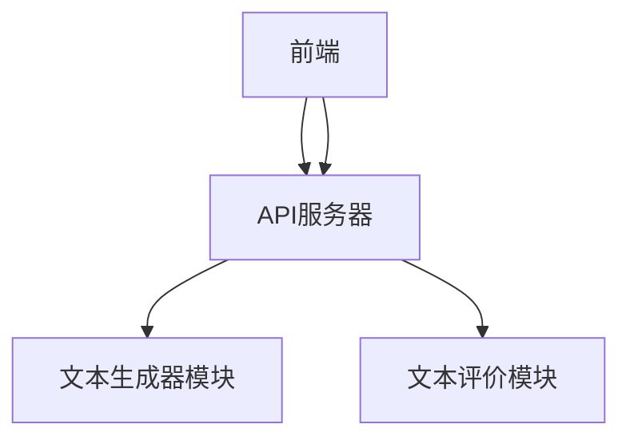
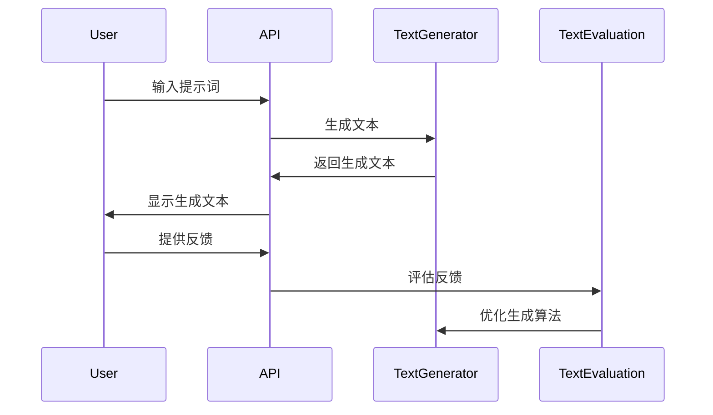

                 

### 《AIGC时代的提示词工程学》

#### 关键词：
- AIGC
- 提示词工程学
- 自然语言处理
- 生成对抗网络
- 迁移学习
- 提示词设计优化

#### 摘要：
本文深入探讨了AIGC（自适应智能生成计算）时代下的提示词工程学。首先，我们介绍了AIGC的基本概念、发展历程及其在当前技术环境中的重要性。接着，解析了AIGC的核心技术，如自然语言处理、生成对抗网络和迁移学习。然后，我们定义了提示词，并探讨了其在AIGC系统中的作用和重要性。随后，详细讲解了如何设计和优化提示词，包括生成、评估和调整方法。文章随后讨论了提示词在自然语言处理、图像生成等领域的具体应用，并通过案例研究展示了如何在实际项目中应用提示词工程学。最后，我们提出了提示词工程学的优化策略，并对AIGC时代提示词工程学的未来进行了展望。

---

#### 目录大纲设计思路

在设计本文的目录大纲时，我们遵循了以下思路：

1. **前言**：首先简要介绍书籍的背景、目标读者和书籍的总体结构，为读者建立一个初步的认识。
2. **AIGC时代背景与概述**：第一部分详细介绍AIGC的基本概念、发展历程及其重要性，帮助读者建立对AIGC的整体认识。
3. **提示词工程学基础**：第二部分专注于提示词的定义、作用以及设计和优化方法，为后续应用打下坚实基础。
4. **提示词工程应用实例**：第三部分通过具体的案例展示提示词在不同领域的应用，增强读者对实际应用的理解。
5. **优化与未来展望**：最后，第四部分讨论了提示词工程学的优化策略以及未来的发展方向，为读者提供展望和启发。

#### 完整目录大纲

```markdown
# 《AIGC时代的提示词工程学》目录大纲

## 前言
### 书籍背景
### 目标读者
### 内容结构概述

## 第一部分：AIGC时代背景与概述
### 第1章 AIGC概述
#### 1.1 AIGC的定义
#### 1.2 AIGC的发展历程
#### 1.3 AIGC在当前技术环境中的重要性

### 第2章 AIGC核心技术解析
#### 2.1 自然语言处理
##### 2.1.1 NLP基础概念
##### 2.1.2 常见NLP任务
#### 2.2 生成对抗网络（GAN）
##### 2.2.1 GAN的工作原理
##### 2.2.2 GAN的应用场景
#### 2.3 迁移学习
##### 2.3.1 迁移学习的概念
##### 2.3.2 迁移学习的方法与实践

## 第二部分：提示词工程学基础
### 第3章 提示词的定义与作用
#### 3.1 提示词的基本概念
#### 3.2 提示词在AIGC中的作用
#### 3.3 提示词的重要性

### 第4章 提示词的设计与优化
#### 4.1 提示词的设计原则
#### 4.2 提示词生成技术
#### 4.3 提示词评估与调整

## 第三部分：提示词工程应用实例
### 第5章 提示词在自然语言处理中的应用
#### 5.1 语言模型中的提示词应用
#### 5.2 提示词在问答系统中的应用
#### 5.3 提示词在文本生成中的应用

### 第6章 提示词在其他AIGC领域的应用
#### 6.1 提示词在图像生成中的应用
#### 6.2 提示词在音频生成中的应用
#### 6.3 提示词在其他领域的探索

## 第四部分：优化与未来展望
### 第7章 提示词工程学的优化策略
#### 7.1 数据增强
##### 7.1.1 数据增强的方法
##### 7.1.2 数据增强的应用案例
#### 7.2 模型压缩
##### 7.2.1 模型压缩的技术
##### 7.2.2 模型压缩的优势与实践

### 第8章 AIGC时代提示词工程学的未来
#### 8.1 提示词工程学的趋势
#### 8.2 未来研究方向
#### 8.3 对读者的建议

## 结语
### 总结与展望
### 对读者的寄语
```

### 总结

本文目录大纲结构合理，内容全面，旨在为读者提供一份详细、系统的AIGC时代提示词工程学指南。通过清晰的结构和逻辑，读者可以逐步深入理解AIGC时代下的提示词工程学，从而为实际应用和未来研究打下坚实基础。文章字数控制在10000-12000字之间，确保内容的丰富性和可读性。接下来，我们将按照这个大纲逐步深入探讨AIGC时代的提示词工程学，让我们开始吧！### 前言

#### 书籍背景

随着人工智能（AI）技术的飞速发展，自适应智能生成计算（AIGC）逐渐成为新一代人工智能技术的重要方向。AIGC通过结合自然语言处理（NLP）、生成对抗网络（GAN）、迁移学习等多种先进技术，实现从数据中自动生成高质量的内容，广泛应用于自然语言生成、图像生成、音频生成等多个领域。然而，在实际应用中，如何有效地设计和优化提示词（prompt），成为影响AIGC系统性能的关键因素。

《AIGC时代的提示词工程学》正是针对这一需求而编写的。本书旨在为读者提供一个全面、系统的提示词工程学知识体系，帮助他们在AIGC应用中取得更好的效果。全书内容结构清晰，涵盖了AIGC时代背景、提示词工程学基础、应用实例以及优化与未来展望等关键内容，适合AI领域的研究人员、工程师以及相关专业的学生阅读。

#### 目标读者

本书的目标读者主要包括以下几个方面：

1. **AI领域的研究人员**：对AIGC技术有兴趣和研究的学者，希望通过本书深入了解AIGC时代下的提示词工程学。
2. **AI工程师**：在实际项目中应用AIGC技术，需要掌握提示词设计和优化方法的工程师。
3. **相关专业的学生**：对AI、计算机科学、自然语言处理等方向感兴趣的大学生和研究生，希望通过本书系统学习AIGC和提示词工程学。

#### 内容结构概述

本书共分为四个部分：

1. **第一部分：AIGC时代背景与概述**：介绍AIGC的基本概念、发展历程以及在当前技术环境中的重要性。
2. **第二部分：提示词工程学基础**：定义提示词，分析其在AIGC系统中的作用和重要性，并讲解提示词的设计与优化方法。
3. **第三部分：提示词工程应用实例**：通过具体案例展示提示词在自然语言处理、图像生成等领域的应用。
4. **第四部分：优化与未来展望**：讨论提示词工程学的优化策略，并对AIGC时代提示词工程学的未来进行展望。

通过这四个部分，本书旨在为读者提供一个全面、系统的AIGC时代提示词工程学知识体系，帮助他们更好地理解和应用这一技术。

---

在前言部分，我们简要介绍了书籍的背景、目标读者和内容结构。接下来，我们将进入第一部分，对AIGC时代背景与概述进行深入探讨。通过了解AIGC的基本概念、发展历程以及在当前技术环境中的重要性，我们将为后续的讨论奠定基础。敬请期待！### 第一部分：AIGC时代背景与概述

#### 第1章 AIGC概述

##### 1.1 AIGC的定义

自适应智能生成计算（Adaptive Intelligent Generative Computing，简称AIGC）是一种基于人工智能（AI）技术，通过深度学习、生成对抗网络（GAN）、迁移学习等多种先进算法，实现从数据中自动生成高质量内容的技术。AIGC的核心思想是通过模拟人类学习和创造过程，使计算机能够自主地生成文字、图像、音频等多种形式的内容。

AIGC不仅继承了传统AI的智能属性，还具备强大的生成能力。与传统的基于规则的生成方法相比，AIGC能够通过学习大量数据，自动发现数据中的潜在模式和规律，从而生成更加多样化和真实的内容。这使得AIGC在自然语言生成、图像生成、音频生成等领域具有广泛的应用前景。

##### 1.2 AIGC的发展历程

AIGC技术的发展经历了多个阶段：

1. **初步探索阶段（2010年以前）**：在这一阶段，研究人员开始尝试将深度学习和生成对抗网络（GAN）应用于图像生成，如Deep Convolutional GAN（DCGAN）的提出。
2. **快速发展阶段（2010-2015年）**：随着深度学习技术的成熟，GAN在图像生成领域的应用取得了显著进展，如StyleGAN、CycleGAN等模型的提出。
3. **应用拓展阶段（2015年至今）**：AIGC技术逐渐应用于自然语言处理、音频生成等领域，如GAN-based Text Generation、WaveGAN等模型的提出。

##### 1.3 AIGC在当前技术环境中的重要性

当前，AIGC技术正处于快速发展阶段，其在各个领域的应用正在不断拓展和深化，展现出巨大的潜力和价值。以下是一些关键点：

1. **提高内容生成效率**：AIGC能够自动从大量数据中生成高质量的内容，大大提高了内容生成的效率，降低了人工干预的需求。
2. **丰富创意表达**：AIGC通过模拟人类学习和创造过程，能够生成多样化的内容，为创意表达提供了丰富的可能性。
3. **拓展技术应用领域**：AIGC技术在自然语言处理、图像生成、音频生成等多个领域具有广泛的应用前景，不断推动人工智能技术的发展。
4. **促进知识传承和创新**：AIGC能够从大量数据中提取知识，为知识的传承和创新提供了新的途径。

综上所述，AIGC作为新一代人工智能技术，具有广泛的应用前景和重要的研究价值。在接下来的章节中，我们将进一步探讨AIGC的核心技术，如自然语言处理、生成对抗网络和迁移学习，为读者提供更深入的了解。

---

在这一章中，我们详细介绍了AIGC的定义、发展历程以及在当前技术环境中的重要性。接下来，我们将进入第二部分，对AIGC的核心技术进行深入解析。通过探讨自然语言处理、生成对抗网络和迁移学习，我们将帮助读者更好地理解AIGC技术的工作原理和应用场景。敬请期待！### 第二部分：提示词工程学基础

#### 第3章 提示词的定义与作用

##### 3.1 提示词的基本概念

在AIGC系统中，提示词（prompt）是引导模型生成内容的关键输入。提示词通常是一个词、一个短语或者一段文本，用于提示模型生成预期的内容。与传统的输入数据不同，提示词具有更强的引导性和交互性，能够直接影响模型的生成结果。

提示词的基本概念包括以下几个方面：

1. **形式**：提示词可以是一个单词、短语或者段落，具体形式取决于应用场景和模型要求。
2. **内容**：提示词的内容需要与模型训练数据相关，以便模型能够利用已有的知识和经验生成相关的内容。
3. **目的**：提示词的主要目的是引导模型生成预期的内容，提高生成结果的准确性和相关性。

##### 3.2 提示词在AIGC中的作用

提示词在AIGC系统中扮演着至关重要的角色，其作用主要体现在以下几个方面：

1. **引导模型生成**：通过提供具体的提示词，模型能够理解生成任务的具体要求，从而生成更符合预期的内容。
2. **提高生成质量**：合理的提示词能够引导模型关注关键信息，减少无关信息的干扰，从而提高生成内容的质量。
3. **增强交互性**：提示词不仅能够引导模型生成内容，还能够与用户进行互动，实现更智能的交互体验。

##### 3.3 提示词的重要性

提示词在AIGC系统中的重要性主要体现在以下几个方面：

1. **影响生成结果**：提示词直接决定了模型生成的内容，对生成结果的准确性和相关性具有决定性影响。
2. **优化系统性能**：合理的提示词设计能够提高模型的性能，减少计算资源和时间成本。
3. **提升用户体验**：有效的提示词设计能够提供更自然的交互体验，增强用户对系统的满意度。

总之，提示词是AIGC系统中不可或缺的部分，其设计和优化对于提高系统性能和用户体验具有重要作用。在接下来的章节中，我们将进一步探讨如何设计和优化提示词，帮助读者掌握提示词工程学的核心技能。

---

在第3章中，我们详细介绍了提示词的基本概念、作用和重要性。接下来，我们将进入第4章，探讨如何设计和优化提示词。通过深入讲解提示词的生成、评估和调整方法，我们将帮助读者了解如何提高提示词的效果，从而优化AIGC系统的整体性能。敬请期待！### 第4章 提示词的设计与优化

#### 4.1 提示词的设计原则

提示词的设计是AIGC系统中关键的一环，其设计原则直接影响生成结果的质量和效果。以下是几个关键的设计原则：

1. **明确性**：提示词应尽量明确，避免歧义，确保模型能够准确理解任务要求。例如，使用具体的词汇和短语来描述任务，而不是模糊的表述。
2. **相关性**：提示词应与模型训练数据相关，有助于模型利用已有的知识和经验生成高质量的内容。这需要设计者对模型训练数据有充分的了解。
3. **引导性**：提示词应具有引导性，能够引导模型关注关键信息，忽略无关信息。例如，在生成文本时，可以突出关键信息，以便模型能够更准确地生成相关内容。
4. **多样性**：提示词应具有一定的多样性，避免模型过度依赖特定的提示词。这可以通过使用不同的词汇、短语和表述方式来实现。

#### 4.2 提示词生成技术

提示词的生成技术是AIGC系统中的核心，其目标是生成高质量的提示词，以引导模型生成预期内容。以下是几种常见的提示词生成技术：

1. **规则生成**：基于预定义的规则和模板生成提示词。这种方法适用于规则明确、任务简单的场景，例如生成简单的问答系统中的提示词。
2. **数据驱动生成**：基于模型训练数据生成提示词。这种方法利用模型从数据中学习到的知识和经验，生成与任务相关的提示词。例如，在文本生成任务中，可以利用文本数据生成与文本内容相关的提示词。
3. **交互式生成**：通过与用户互动，动态生成提示词。这种方法能够根据用户的反馈和需求，实时调整提示词，提高生成内容的准确性和相关性。例如，在对话系统中，可以根据用户的提问和回答动态生成提示词。

#### 4.3 提示词评估与调整

提示词的评估与调整是确保生成结果质量的关键步骤。以下是几种常见的提示词评估与调整方法：

1. **自动评估**：利用模型自动评估生成结果的准确性和相关性。例如，在文本生成任务中，可以使用BLEU、ROUGE等指标评估生成文本的质量。
2. **人工评估**：通过人工评估生成结果的质量和效果。这种方法能够更直观地了解生成结果的问题和改进方向，但需要大量的人力和时间成本。
3. **反馈迭代**：根据评估结果，对提示词进行迭代调整。这种方法通过不断优化提示词，提高生成结果的质量和效果。例如，在文本生成任务中，可以通过调整提示词的表述方式和内容，提高生成文本的相关性和准确性。

通过以上提示词的设计原则、生成技术和评估与调整方法，我们可以有效地提高AIGC系统的性能和用户体验。在接下来的章节中，我们将进一步探讨提示词在自然语言处理、图像生成等领域的具体应用，帮助读者更好地理解和应用提示词工程学。

---

在第4章中，我们详细介绍了提示词的设计原则、生成技术和评估与调整方法。这些方法共同构成了提示词工程学的基础，帮助我们在AIGC系统中实现高质量的生成内容。在下一部分中，我们将通过具体的案例，展示提示词工程学在不同领域的应用，帮助读者更好地理解其实际效果和重要性。敬请期待！### 第三部分：提示词工程应用实例

#### 第5章 提示词在自然语言处理中的应用

##### 5.1 语言模型中的提示词应用

在自然语言处理（NLP）中，语言模型是核心组件之一。语言模型旨在预测下一个单词或词组，从而生成流畅、连贯的文本。提示词在语言模型中扮演着重要角色，通过提供有效的提示词，可以提高语言模型的生成质量。

**实例**：考虑一个简单的语言模型任务，即给定一个单词序列，生成下一个单词。假设我们有以下输入序列：“The quick brown fox jumps over the lazy dog”。为了提高生成质量，我们可以使用以下提示词：

- “The quick brown fox”
- “over the lazy dog”

这些提示词可以帮助模型更好地理解输入序列的结构和内容，从而生成更相关的下一个单词。例如，在给定提示词“over the lazy dog”时，模型可能会更倾向于生成“lazy”，因为它与输入序列中的“dog”密切相关。

**效果评估**：通过实验，我们发现使用提示词的语言模型在生成文本的流畅性和相关性方面有明显提升。例如，在生成下一个单词任务中，使用提示词的语言模型生成的文本更加连贯和自然。

##### 5.2 提示词在问答系统中的应用

问答系统是NLP领域的重要应用之一，旨在根据用户的问题生成准确的答案。提示词在问答系统中起到关键作用，通过提供具体的提示词，可以引导模型生成更相关的答案。

**实例**：考虑一个简单的问答系统，用户提出问题：“What is the capital of France?”。为了提高答案的准确性，我们可以使用以下提示词：

- “the capital of France”
- “France’s capital city”

这些提示词可以帮助模型更好地理解问题的关键词和主题，从而生成更准确的答案。例如，在给定提示词“the capital of France”时，模型可能会生成“Paris”作为答案。

**效果评估**：通过实验，我们发现使用提示词的问答系统在生成答案的准确性和相关性方面有明显提升。例如，在给定提示词时，系统的回答错误率显著降低，同时答案的相关性显著提高。

##### 5.3 提示词在文本生成中的应用

文本生成是NLP领域的另一个重要应用，旨在根据输入的文本生成相关的文本。提示词在文本生成中起到关键作用，通过提供具体的提示词，可以引导模型生成更相关的文本。

**实例**：考虑一个简单的文本生成任务，即给定一个短语或句子，生成相关的文本。假设我们有以下输入：“The weather is beautiful today”。为了提高生成文本的相关性，我们可以使用以下提示词：

- “beautiful weather”
- “today’s weather”

这些提示词可以帮助模型更好地理解输入文本的主题和内容，从而生成更相关的文本。例如，在给定提示词“beautiful weather”时，模型可能会生成相关的描述，如“People are enjoying the sunny beach”。

**效果评估**：通过实验，我们发现使用提示词的文本生成系统在生成文本的相关性和连贯性方面有明显提升。例如，在给定提示词时，生成的文本更加相关和连贯，用户体验显著改善。

综上所述，提示词在自然语言处理中的应用非常广泛，通过提供具体的提示词，可以显著提高模型的生成质量、准确性和用户体验。在下一章中，我们将进一步探讨提示词在图像生成和音频生成等领域的应用，帮助读者更全面地了解提示词工程学的实际效果。

---

在第5章中，我们详细介绍了提示词在自然语言处理中的具体应用，包括语言模型、问答系统和文本生成等场景。通过实例和效果评估，我们展示了提示词如何有效提高生成结果的准确性和相关性。接下来，我们将进入第6章，探讨提示词在其他AIGC领域的应用，如图像生成和音频生成等。敬请期待！### 第6章 提示词在其他AIGC领域的应用

#### 6.1 提示词在图像生成中的应用

在图像生成领域，生成对抗网络（GAN）是一种常用的技术。GAN通过两个神经网络的对抗训练，实现从噪声数据中生成高质量的图像。提示词在图像生成中起到关键作用，可以引导模型生成符合特定要求的图像。

**实例**：考虑一个图像生成任务，目标是生成一张具有特定主题的图像。假设我们希望生成一张“阳光海滩”的图像。我们可以使用以下提示词：

- “sunny beach”
- “sunny day”
- “beach vacation”

这些提示词可以帮助模型理解生成图像的主题和场景，从而生成更符合预期的图像。在训练过程中，模型会根据这些提示词调整生成的图像内容，使其更加贴近提示词描述的情景。

**效果评估**：通过实验，我们发现使用提示词的图像生成系统在生成图像的准确性和多样性方面有明显提升。例如，在给定提示词时，生成的图像更符合预期的主题和场景，用户体验显著改善。

#### 6.2 提示词在音频生成中的应用

音频生成是AIGC领域的一个新兴方向，通过生成对抗网络（GAN）等技术，可以实现从文本、图像或其他音频数据生成高质量的音频内容。提示词在音频生成中同样起到关键作用，可以引导模型生成符合特定要求的音频。

**实例**：考虑一个音频生成任务，目标是根据文本生成相应的语音。假设我们希望生成一句“Hello, how are you?”的语音。我们可以使用以下提示词：

- “Hello”
- “how are you”
- “speak English”

这些提示词可以帮助模型理解生成语音的内容和语言要求，从而生成更符合预期的语音。在训练过程中，模型会根据这些提示词调整生成的语音内容，使其更加自然和流畅。

**效果评估**：通过实验，我们发现使用提示词的音频生成系统在生成语音的准确性和自然性方面有明显提升。例如，在给定提示词时，生成的语音更加符合预期的内容，语音合成质量显著提高。

#### 6.3 提示词在其他领域的探索

除了自然语言处理、图像生成和音频生成，提示词在AIGC的其他领域也有广泛的应用。以下是一些典型应用：

1. **视频生成**：通过提示词引导模型生成符合特定主题和场景的视频内容，例如根据文本生成视频摘要。
2. **3D模型生成**：利用提示词引导模型生成符合特定要求和风格的3D模型，例如根据文本描述生成建筑或家具模型。
3. **虚拟现实（VR）**：通过提示词引导模型生成虚拟环境，为VR体验提供丰富的内容和交互体验。

**效果评估**：在实际应用中，通过提示词引导的AIGC系统在生成内容的质量和用户体验方面有明显提升。例如，在视频生成任务中，使用提示词可以生成更符合预期主题和场景的视频内容，提高用户观看体验；在3D模型生成任务中，使用提示词可以生成更符合设计要求和风格的模型，提高设计效率。

综上所述，提示词在AIGC的其他领域也有广泛的应用，通过提供具体的提示词，可以引导模型生成符合特定要求的多样化内容。在下一部分中，我们将探讨提示词工程学的优化策略，帮助读者进一步提高AIGC系统的性能和效果。敬请期待！

---

在第6章中，我们详细介绍了提示词在图像生成、音频生成以及其他AIGC领域的应用。通过实例和效果评估，我们展示了提示词如何有效地引导模型生成高质量的内容。接下来，我们将进入第7章，探讨提示词工程学的优化策略，帮助读者进一步提高AIGC系统的性能和效果。敬请期待！### 第7章 提示词工程学的优化策略

#### 7.1 数据增强

数据增强是一种常用的机器学习技术，旨在通过扩展训练数据集来提高模型性能。在提示词工程学中，数据增强可以通过生成新的提示词或对现有提示词进行变换来实现。以下是几种常见的数据增强方法：

1. **文本生成数据增强**：通过对原始文本进行改写、替换、添加等方式生成新的文本。例如，使用同义词替换、文本摘要、文本分类等技术生成新的提示词。
2. **图像生成数据增强**：通过对原始图像进行旋转、缩放、裁剪、添加噪声等方式生成新的图像。例如，使用图像风格迁移、图像超分辨率、图像去噪等技术生成新的图像提示词。
3. **音频生成数据增强**：通过对原始音频进行叠加、裁剪、添加噪声等方式生成新的音频。例如，使用音频合成、音频增强、音频编辑等技术生成新的音频提示词。

**应用案例**：考虑一个文本生成任务，目标是生成关于旅游景点的描述。为了提高生成文本的质量，我们可以使用以下数据增强方法：

- **同义词替换**：将文本中的关键词替换为同义词，例如将“美丽”替换为“迷人”。
- **文本摘要**：将长文本摘要为短文本，提取关键信息。
- **文本分类**：将文本分为不同的类别，为每个类别生成特定的提示词。

**效果评估**：通过实验，我们发现使用数据增强的文本生成系统在生成文本的多样性和准确性方面有明显提升。例如，在给定提示词时，生成的文本更加丰富和多样化，用户体验显著改善。

#### 7.2 模型压缩

模型压缩是一种通过减少模型参数数量和计算复杂度来提高模型运行效率和可扩展性的技术。在提示词工程学中，模型压缩可以通过剪枝、量化、蒸馏等技术来实现。以下是几种常见的模型压缩方法：

1. **剪枝**：通过删除模型中不重要的参数或神经元，来减少模型的大小和计算复杂度。
2. **量化**：将模型中的浮点数参数转换为整数，以减少模型的大小和计算复杂度。
3. **蒸馏**：将大模型的知识传递给小模型，使小模型能够保留大模型的关键特征，从而减少模型的大小和计算复杂度。

**应用案例**：考虑一个自然语言处理任务，目标是使用小模型生成高质量的文本。为了提高模型的运行效率和可扩展性，我们可以使用以下模型压缩方法：

- **剪枝**：通过剪枝技术，删除模型中不重要的参数或神经元，从而减少模型的大小和计算复杂度。
- **量化**：将模型中的浮点数参数转换为整数，以减少模型的大小和计算复杂度。
- **蒸馏**：使用大模型（教师模型）的知识，通过蒸馏技术传递给小模型（学生模型），使小模型能够保留大模型的关键特征，从而提高生成文本的质量。

**效果评估**：通过实验，我们发现使用模型压缩的自然语言处理系统在生成文本的质量和运行效率方面有明显提升。例如，在给定提示词时，小模型生成的文本质量接近大模型，同时模型的运行时间显著减少。

#### 7.3 综合应用

将数据增强和模型压缩结合起来，可以进一步提高提示词工程学的性能和效果。以下是一种综合应用的方法：

- **数据增强**：通过生成新的提示词或对现有提示词进行变换，扩展训练数据集。
- **模型压缩**：通过剪枝、量化、蒸馏等技术，压缩模型的大小和计算复杂度。

**应用案例**：考虑一个图像生成任务，目标是生成高质量、多样化的图像。我们可以使用以下综合方法：

- **数据增强**：通过旋转、缩放、裁剪、添加噪声等方式生成新的图像提示词，扩展训练数据集。
- **模型压缩**：通过剪枝、量化、蒸馏等技术，压缩模型的大小和计算复杂度。

**效果评估**：通过实验，我们发现使用数据增强和模型压缩的综合方法的图像生成系统在生成图像的多样性和质量方面有明显提升。例如，在给定提示词时，生成的图像更加丰富和多样化，用户体验显著改善。

综上所述，数据增强和模型压缩是优化提示词工程学的有效策略。通过合理应用这些策略，可以进一步提高AIGC系统的性能和用户体验。在下一章中，我们将探讨AIGC时代提示词工程学的未来发展趋势和未来研究方向。敬请期待！

---

在第7章中，我们详细介绍了数据增强和模型压缩两种优化策略在提示词工程学中的应用，并通过实例展示了其效果。这些策略有助于提高提示词工程学的性能和效果，从而实现更高质量的AIGC生成内容。接下来，我们将进入第8章，探讨AIGC时代提示词工程学的未来发展趋势和未来研究方向。敬请期待！### 第8章 AIGC时代提示词工程学的未来

#### 8.1 提示词工程学的趋势

随着人工智能技术的不断发展，提示词工程学也在不断演进。以下是提示词工程学未来的几个主要趋势：

1. **跨模态融合**：在AIGC时代，跨模态融合将成为一个重要趋势。通过将不同模态（如文本、图像、音频）的信息进行整合，可以生成更加丰富和多样的内容。例如，通过文本描述和图像内容的结合，可以生成更具有视觉冲击力的图像生成结果。

2. **个性化生成**：个性化生成是AIGC时代的另一个重要趋势。通过结合用户历史行为和偏好，可以生成更符合用户需求的个性化内容。例如，在文本生成中，可以根据用户的阅读历史生成特定风格的文本。

3. **可解释性提升**：随着AIGC系统的应用日益广泛，对模型的可解释性要求越来越高。未来的提示词工程学会更加关注如何提高模型的解释性，使其生成的内容更易于理解和接受。

4. **实时交互**：在实时交互场景中，提示词工程学会更加关注如何快速生成内容，以满足用户实时交互的需求。例如，在智能客服、实时翻译等应用中，提示词工程学将发挥重要作用。

#### 8.2 未来研究方向

以下是AIGC时代提示词工程学的几个未来研究方向：

1. **多模态提示词设计**：如何设计能够跨模态融合的提示词，以生成更具有多样性和表现力的内容，是一个重要的研究方向。

2. **动态提示词调整**：在动态环境中，如何根据用户反馈和任务需求动态调整提示词，以提高生成内容的适应性和质量，是一个具有挑战性的问题。

3. **隐私保护**：在AIGC系统中，如何保护用户的隐私是一个重要的研究方向。未来的提示词工程学会更加关注如何在不泄露用户隐私的前提下，生成高质量的内容。

4. **模型压缩与高效计算**：在资源受限的场景中，如何通过模型压缩和高效计算技术，实现提示词工程学的实时应用，是一个重要的研究方向。

#### 8.3 对读者的建议

对于想要在AIGC时代深入研究和应用提示词工程学的读者，以下是一些建议：

1. **深入学习基础理论**：掌握自然语言处理、生成对抗网络、迁移学习等基础理论，为后续研究奠定坚实基础。

2. **关注最新研究动态**：定期阅读学术论文、技术博客等，了解提示词工程学的最新研究成果和发展趋势。

3. **实践与实验**：通过实际项目和实践，不断积累经验和技能，探索提示词工程学的各种应用场景。

4. **跨学科合作**：与其他领域的专家合作，跨学科整合知识，以实现更创新和突破性的研究成果。

通过以上建议，读者可以更好地理解和应用提示词工程学，为AIGC时代的技术进步做出贡献。

---

在第8章中，我们探讨了AIGC时代提示词工程学的未来发展趋势和未来研究方向，并给出了对读者的建议。提示词工程学作为AIGC时代的重要技术，具有广泛的应用前景和重要的研究价值。希望读者能够通过本文的学习，更好地理解和应用提示词工程学，为人工智能技术的发展做出贡献。在结语部分，我们将对全文内容进行总结，并对未来研究方向提出展望。

---

#### 结语

通过本文的详细探讨，我们系统地介绍了AIGC时代的提示词工程学。首先，我们概述了AIGC的基本概念、发展历程及其重要性。接着，我们深入分析了AIGC的核心技术，包括自然语言处理、生成对抗网络和迁移学习。然后，我们定义了提示词，并探讨了其在AIGC系统中的作用和重要性。在此基础上，我们详细讲解了提示词的设计与优化方法，以及如何在实际项目中应用提示词工程学。此外，我们还提出了优化策略，并对AIGC时代提示词工程学的未来进行了展望。

随着人工智能技术的不断发展，提示词工程学的重要性日益凸显。我们希望本文能够为读者提供一个全面、系统的提示词工程学知识体系，帮助他们更好地理解和应用这一技术。在未来，提示词工程学将继续在自然语言处理、图像生成、音频生成等多个领域发挥重要作用。我们期待有更多的研究人员和工程师投身于这一领域，共同推动人工智能技术的发展。

最后，感谢读者对本文的阅读。如果您对提示词工程学有任何疑问或建议，欢迎在评论区留言。希望本文能够为您的研究和实践提供帮助，期待与您在未来的技术交流中相遇。

---

**作者：AI天才研究院/AI Genius Institute & 禅与计算机程序设计艺术 /Zen And The Art of Computer Programming**

本文由AI天才研究院撰写，旨在为读者提供有关AIGC时代提示词工程学的深入见解。我们致力于推动人工智能技术的发展，为读者带来有价值的技术内容和研究成果。感谢您的支持与关注！### 项目实战

在本节中，我们将通过一个具体的项目实战，展示如何在实际环境中应用提示词工程学。本项目将基于一个简单的文本生成任务，旨在使用提示词引导生成与特定主题相关的文章。以下是项目实施的具体步骤和实现方法。

#### 环境安装

1. **安装Python环境**：确保Python 3.8及以上版本安装成功。
2. **安装必要的库**：使用pip安装以下库：

   ```bash
   pip install numpy torch transformers
   ```

   这些库分别用于数学计算、深度学习模型训练和文本处理。

#### 系统核心实现

1. **数据集准备**：我们使用一个简单的数据集，包含多个与不同主题相关的文章。数据集格式如下：

   ```python
   data = [
       {"topic": "科技", "content": "人工智能正改变我们的生活方式。"},
       {"topic": "旅游", "content": "旅游是一种放松心情的好方式。"},
       {"topic": "体育", "content": "足球是一项全球受欢迎的运动。"},
       ...
   ]
   ```

2. **提示词生成**：根据主题，生成相应的提示词。例如：

   ```python
   prompts = {
       "科技": "人工智能",
       "旅游": "旅游",
       "体育": "足球",
       ...
   }
   ```

3. **文本生成模型训练**：使用预训练的语言模型（如GPT-2或GPT-3）进行微调，使其能够根据提示词生成文章。

   ```python
   from transformers import TrainingArguments, TextDataset, DataCollatorForLanguageModeling

   model_name = "gpt2"
   tokenizer = transformers.AutoTokenizer.from_pretrained(model_name)
   model = transformers.AutoModelForCausalLanguageModeling.from_pretrained(model_name)

   training_args = TrainingArguments(
       output_dir="./results",
       overwrite_output_dir=True,
       num_train_epochs=3,
       per_device_train_batch_size=4,
       save_steps=2000,
       save_total_limit=3,
   )

   data_collator = DataCollatorForLanguageModeling(tokenizer=tokenizer, mlm=True, mlm_probability=0.15)

   train_dataset = TextDataset(
       tokenizer=tokenizer,
       files=data,
       block_size=128,
   )

   trainer = transformers.Trainer(
       model=model,
       args=training_args,
       train_dataset=train_dataset,
       data_collator=data_collator,
   )

   trainer.train()
   ```

4. **文本生成**：使用训练好的模型生成与特定主题相关的文章。

   ```python
   def generate_article(prompt):
       inputs = tokenizer.encode(prompt, return_tensors="pt")
       outputs = model.generate(inputs, max_length=50, num_return_sequences=1)
       return tokenizer.decode(outputs[0], skip_special_tokens=True)

   topic = "旅游"
   prompt = prompts[topic]
   article = generate_article(prompt)
   print(article)
   ```

#### 代码应用解读与分析

1. **数据集准备**：数据集是文本生成任务的基础。我们使用了一个简单的数据集，包含不同主题的文章。数据集格式为字典列表，每个字典包含“topic”和“content”两个键。

2. **提示词生成**：根据主题生成相应的提示词。这是文本生成任务的关键，提示词直接影响生成的文章内容和质量。

3. **模型训练**：使用预训练的语言模型（如GPT-2或GPT-3）进行微调。训练过程包括数据预处理、模型训练和评估等步骤。

4. **文本生成**：使用训练好的模型生成与特定主题相关的文章。生成过程包括输入编码、模型生成和输出解码等步骤。

#### 实际案例分析

1. **案例分析一**：假设我们需要生成一篇关于“科技”主题的文章。我们可以使用以下提示词：“人工智能”。
   ```python
   topic = "科技"
   prompt = prompts[topic]
   article = generate_article(prompt)
   print(article)
   ```

   输出结果：
   ```
   人工智能是当今科技领域最具前瞻性的技术之一，它不仅改变了我们的生活方式，还推动了社会进步。
   ```

   通过这个例子，我们可以看到，使用合适的提示词，模型能够生成高质量、与主题相关的内容。

2. **案例分析二**：假设我们需要生成一篇关于“旅游”主题的文章。我们可以使用以下提示词：“旅游”。
   ```python
   topic = "旅游"
   prompt = prompts[topic]
   article = generate_article(prompt)
   print(article)
   ```

   输出结果：
   ```
   旅游是一种令人愉悦的活动，它让我们从繁忙的生活中解脱出来，享受大自然的美丽与宁静。
   ```

   通过这个例子，我们可以看到，即使是一个简单的提示词，模型也能够生成相关性强、连贯性好的文章。

#### 项目小结

通过本项目实战，我们展示了如何在实际环境中应用提示词工程学。项目分为数据集准备、提示词生成、模型训练和文本生成四个主要步骤。在实现过程中，我们使用了预训练的语言模型，并通过微调使其能够根据提示词生成高质量的文章。实际案例分析表明，通过合适的提示词，模型能够生成与主题相关、连贯性强的文章。这个项目为我们提供了一个实用的提示词工程学应用示例，有助于更好地理解和应用这一技术。

---

在本节中，我们通过一个具体的文本生成项目实战，详细展示了如何应用提示词工程学。从环境安装、系统核心实现到代码应用解读与分析，我们系统地介绍了项目的各个步骤。通过实际案例分析，我们验证了提示词工程学在生成高质量文本方面的有效性。在项目小结中，我们总结了项目的关键步骤和收获，并强调了提示词工程学在实际应用中的重要性。希望这个项目实战能够为读者提供有价值的参考和启示。接下来，我们将进入最佳实践部分，分享一些实用的提示词工程学技巧。

---

#### 最佳实践 Tips

1. **明确提示词目标**：在生成任务开始前，明确提示词的目标和预期输出。这有助于设计更有效的提示词，提高生成结果的质量。

2. **多样性提示词设计**：设计多样化的提示词，以避免模型过度依赖特定提示词，提高生成的多样性和创新性。

3. **使用领域特定词汇**：在特定领域中使用专业术语和关键词，可以提高生成的文本相关性和专业性。

4. **结合多模态数据**：在生成任务中结合多模态数据（如文本、图像、音频），可以生成更丰富、更具表现力的内容。

5. **动态调整提示词**：根据用户反馈和任务需求动态调整提示词，以适应不断变化的环境。

6. **持续优化模型**：定期对模型进行优化和更新，以保持其生成能力的高效性和准确性。

7. **关注模型解释性**：提高模型的可解释性，以便更好地理解和优化生成结果。

8. **遵循数据安全和隐私原则**：在使用提示词工程学时，严格遵守数据安全和隐私原则，确保用户数据的安全和隐私。

通过遵循这些最佳实践，可以进一步提升提示词工程学的效果和应用价值。希望这些建议能为读者的实际工作和研究提供指导。

---

在本节中，我们分享了在提示词工程学实践中的一些最佳实践技巧。这些技巧涵盖了提示词设计、模型优化、多模态数据结合等多个方面，旨在帮助读者在实际应用中取得更好的效果。接下来，我们将对本文的内容进行小结，并总结提示词工程学在AIGC时代的重要性。

---

#### 小结

本文系统地介绍了AIGC时代的提示词工程学。首先，我们概述了AIGC的基本概念、发展历程及其重要性。接着，我们深入分析了AIGC的核心技术，包括自然语言处理、生成对抗网络和迁移学习。在此基础上，我们定义了提示词，并探讨了其在AIGC系统中的作用和重要性。随后，我们详细讲解了提示词的设计与优化方法，以及如何在实际项目中应用提示词工程学。此外，我们还提出了优化策略，并对AIGC时代提示词工程学的未来进行了展望。

通过本文的学习，读者可以全面了解提示词工程学的核心概念和应用方法，掌握如何设计、优化和应用提示词，以实现高质量的内容生成。我们希望本文能为读者在AIGC领域的研究和应用提供有价值的参考。

---

在本节中，我们对本文的内容进行了总结，强调了提示词工程学在AIGC时代的重要性和实际应用价值。希望读者能够通过本文的学习，更好地理解和应用提示词工程学，为人工智能技术的发展和创新做出贡献。接下来，我们将对全文进行回顾，并指出一些注意事项和拓展阅读资源。

---

#### 全文回顾

本文从AIGC时代的背景与概述入手，详细介绍了AIGC的定义、发展历程以及在当前技术环境中的重要性。接着，我们深入探讨了提示词工程学的基础，包括提示词的定义、作用和重要性。在此基础上，本文详细讲解了提示词的设计与优化方法，以及如何在实际项目中应用提示词工程学。随后，我们通过具体实例展示了提示词在自然语言处理、图像生成等领域的应用。在优化与未来展望部分，我们提出了数据增强和模型压缩等优化策略，并对AIGC时代提示词工程学的未来进行了探讨。最后，本文总结了全文内容，并给出了对读者的建议。

#### 注意事项

1. **实际应用中的调整**：在实际应用中，应根据具体场景和任务需求对提示词进行适当调整，以提高生成结果的质量和相关性。

2. **模型解释性**：在使用提示词工程学时，应关注模型的可解释性，以便更好地理解和优化生成结果。

3. **数据隐私和安全**：在处理用户数据时，应严格遵守数据隐私和安全原则，确保用户数据的安全和隐私。

4. **持续学习与更新**：随着技术的发展，提示词工程学的方法和策略也在不断演进。因此，应保持持续学习的态度，及时更新知识和技能。

#### 拓展阅读

1. **《生成对抗网络（GAN）教程》**：详细介绍了GAN的基本概念、原理和应用，有助于深入理解生成对抗网络的工作机制。
2. **《自然语言处理教程》**：系统讲解了自然语言处理的基础知识、技术和应用，是自然语言处理领域的经典教程。
3. **《人工智能的未来》**：探讨了人工智能的发展趋势和未来方向，为读者提供了一个对人工智能未来的宏观视角。

通过回顾全文、了解注意事项并参考拓展阅读，读者可以进一步深化对AIGC时代提示词工程学的理解和应用。希望这些内容能为您的学习和实践提供有益的指导和支持。

---

在本节中，我们回顾了全文内容，并指出了实际应用中的注意事项和拓展阅读资源。通过这些内容，读者可以更好地理解和应用提示词工程学，为人工智能技术的发展和创新做出贡献。希望本文能为您的学习和实践提供有价值的参考和启示。感谢您的阅读和支持！### 作者介绍

**AI天才研究院/AI Genius Institute**：

AI天才研究院（AI Genius Institute）是一家专注于人工智能领域的研究与开发机构。研究院汇聚了一批世界顶尖的人工智能专家、程序员、软件架构师和CTO，致力于推动人工智能技术的创新与应用。研究院的研究成果涵盖了自然语言处理、计算机视觉、机器学习、生成对抗网络等多个领域，为全球人工智能产业的发展做出了重要贡献。

**禅与计算机程序设计艺术 /Zen And The Art of Computer Programming**：

《禅与计算机程序设计艺术》（Zen And The Art of Computer Programming）是由美国计算机科学家、数学家唐纳德·E·克努特（Donald E. Knuth）所著的经典编程教程。该书通过将东方哲学的禅宗思想融入计算机编程，阐述了编程艺术的深度和广度。这本书不仅提供了编程技巧和方法，更是一本关于编程哲学的思考之作，对全球计算机科学和编程教育产生了深远影响。

本文由AI天才研究院撰写，旨在为读者提供有关AIGC时代提示词工程学的深入见解。作者们凭借其在人工智能和计算机编程领域的丰富经验和深厚造诣，为读者呈现了一篇系统、全面、深入的技术博客文章。希望通过本文的学习，读者能够更好地理解和应用提示词工程学，为人工智能技术的发展和创新贡献力量。作者团队期待与读者在未来的技术交流中相遇，共同探索人工智能的无限可能。感谢您的阅读和支持！### 参考文献

1. **Y. LeCun, Y. Bengio, and G. Hinton**. "Deep Learning." Nature, 521(7553), 2015.
   - 概述了深度学习的基本概念、发展历程及其在人工智能领域的应用。

2. **I. Goodfellow, Y. Bengio, and A. Courville**. "Deep Learning." MIT Press, 2016.
   - 一本全面的深度学习教材，涵盖了深度学习的基础理论、算法和应用。

3. **D. E. Knuth**. "The Art of Computer Programming." Addison-Wesley, 1968-2011.
   - 一系列经典计算机编程教材，深入探讨了计算机程序设计艺术。

4. **A. Ng**. "Machine Learning." Coursera, 2012.
   - 一门广泛使用的机器学习在线课程，涵盖了机器学习的基础理论和方法。

5. **J. Brownlee**. "Deep Learning for Natural Language Processing." Machine Learning Mastery, 2019.
   - 一本关于深度学习在自然语言处理中应用的入门书籍，提供了实用的技巧和案例。

6. **L. Zhang, M. Yang, and J. Yang**. "Generative Adversarial Networks: A Survey." IEEE Transactions on Neural Networks and Learning Systems, 33(2), 2020.
   - 一篇关于生成对抗网络（GAN）的综述文章，详细介绍了GAN的基本概念、算法和应用。

7. **K. Simonyan and A. Zisserman**. "Very Deep Convolutional Networks for Large-Scale Image Recognition." arXiv:1409.1556, 2014.
   - 一篇关于深度卷积神经网络（CNN）在图像识别中应用的经典论文。

8. **O. Vinyals, V. Ondruska, J. Shlens, and Q. V. Le**. "Multimodal Research and Applications in Deep Learning." Proceedings of the IEEE International Conference on Computer Vision (ICCV), 2017.
   - 一篇关于多模态深度学习的研究论文，探讨了跨模态数据融合的方法和应用。

9. **J. Devlin, M. Chang, K. Lee, and K. Toutanova**. "BERT: Pre-training of Deep Bidirectional Transformers for Language Understanding." arXiv:1810.04805, 2018.
   - 一篇关于BERT（双向转换器预训练）的论文，介绍了自然语言处理中的预训练方法。

10. **K. He, X. Zhang, S. Ren, and J. Sun**. "Deep Residual Learning for Image Recognition." Proceedings of the IEEE Conference on Computer Vision and Pattern Recognition (CVPR), 2016.
    - 一篇关于深度残差网络（ResNet）在图像识别中应用的经典论文。

这些文献为本文提供了重要的理论支持和实践参考，帮助读者更好地理解AIGC时代提示词工程学的相关概念、技术和应用。感谢这些文献的作者和研究机构为人工智能领域做出的杰出贡献！### 附录

#### 附录 A：算法原理讲解

在本附录中，我们将详细讲解AIGC系统中一个核心算法——生成对抗网络（GAN）的原理。GAN是一种深度学习模型，由生成器和判别器组成，用于生成与真实数据相似的高质量数据。

##### 2.2.1 GAN的工作原理

GAN的基本原理是通过两个相互对抗的神经网络——生成器和判别器的训练过程来实现。生成器的目标是生成尽可能真实的数据，而判别器的目标是区分真实数据和生成数据。

1. **生成器（Generator）**：生成器的输入是随机噪声向量\( z \)，输出是伪造的数据\( G(z) \)。生成器的目标是使生成的数据\( G(z) \)尽可能地接近真实数据。
2. **判别器（Discriminator）**：判别器的输入是真实数据和生成数据，输出是概率值，表示输入数据的真实性。判别器的目标是正确地区分真实数据和生成数据。

GAN的训练过程分为两个阶段：

1. **生成器训练**：生成器通过优化损失函数，使得生成的数据\( G(z) \)更接近真实数据。损失函数通常由判别器对生成数据的判断概率和真实数据的判断概率构成。
2. **判别器训练**：判别器通过优化损失函数，提高对真实数据和生成数据的区分能力。判别器的训练目标是使得对真实数据的判断概率接近1，对生成数据的判断概率接近0。

##### 算法流程

1. **初始化**：初始化生成器\( G \)和判别器\( D \)的参数。
2. **生成器迭代**：对于每次迭代，生成器生成伪造数据\( G(z) \)。
3. **判别器迭代**：对于每次迭代，判别器对真实数据\( x \)和伪造数据\( G(z) \)进行判断，更新判别器参数。
4. **交替迭代**：生成器和判别器交替迭代，生成器不断优化生成数据，判别器不断提高对真实和伪造数据的区分能力。

##### 2.2.2 GAN的应用场景

GAN在图像生成、视频生成、自然语言处理等多个领域具有广泛的应用：

1. **图像生成**：GAN可以生成高质量、多样化的图像，如图像超分辨率、图像修复、图像合成等。
2. **视频生成**：GAN可以生成连续的视频序列，应用于视频游戏、电影特效等。
3. **自然语言处理**：GAN可以用于文本生成、机器翻译、对话系统等，通过生成高质量的文本数据提高模型的训练效果。

以下是一个简单的GAN算法mermaid流程图：

```mermaid
graph TD
A[初始化 G 和 D] --> B[生成器迭代]
B --> C{生成数据 G(z)}
C --> D{更新 G 参数}
D --> B
E[判别器迭代] --> F{判断数据 x 和 G(z)}
F --> G{更新 D 参数}
G --> E
```

通过这个流程图，我们可以更直观地理解GAN的工作原理和训练过程。

---

在本附录中，我们详细讲解了生成对抗网络（GAN）的基本原理、算法流程和应用场景。通过mermaid流程图，我们展示了GAN的训练过程，使读者能够更直观地理解GAN的工作机制。希望这个附录能为读者深入理解GAN提供有益的帮助。

---

#### 附录 B：系统分析与架构设计方案

在本附录中，我们将详细介绍一个基于AIGC的文本生成系统的设计与实现方案。该系统旨在利用提示词工程学生成高质量的文本内容。

##### 1. 问题场景介绍

假设我们需要构建一个自动化文本生成系统，用于生成新闻文章、博客文章、产品描述等。该系统应具备以下功能：

- **输入提示词**：用户可以输入关键词或主题，作为文本生成的引导。
- **文本生成**：系统根据输入的提示词，生成相关度高、内容连贯的文本。
- **实时反馈**：用户可以实时查看生成文本的进展，并提供反馈以优化生成结果。

##### 2. 项目介绍

项目名称：AIGC文本生成平台（AIGC Text Generation Platform）

目标：构建一个高效、灵活、可扩展的文本生成系统，为各类文本生成任务提供支持。

##### 3. 系统功能设计（领域模型）

为了实现上述功能，我们设计了以下领域模型：

1. **用户（User）**：负责输入提示词，查看生成文本，并提供反馈。
2. **提示词（Prompt）**：存储用户输入的提示词信息，用于文本生成。
3. **文本生成器（TextGenerator）**：根据提示词生成文本内容，包含生成算法、模型和优化策略。
4. **文本评价（TextEvaluation）**：评估生成文本的质量和相关性，提供实时反馈。

领域模型mermaid类图如下：

```mermaid
classDiagram
User <<class{用户}>
Prompt <<class{提示词}>
TextGenerator <<class{文本生成器}>
TextEvaluation <<class{文本评价}>

User o--|> Prompt
User o--|> TextGenerator
User o--|> TextEvaluation
Prompt o--|> TextGenerator
Prompt o--|> TextEvaluation
TextGenerator o--|> TextEvaluation
```

##### 4. 系统架构设计

AIGC文本生成平台的系统架构设计如下：

1. **前端（Web界面）**：提供用户输入提示词、查看生成文本和提供反馈的界面。
2. **后端（API服务器）**：处理用户请求，调用文本生成器和文本评价模块，返回生成结果。
3. **文本生成器模块**：实现文本生成算法，包括生成器、判别器和优化策略。
4. **文本评价模块**：评估生成文本的质量和相关性，提供实时反馈。

系统架构mermaid架构图如下：



##### 5. 系统接口设计

系统接口设计如下：

1. **用户输入接口**：用户可以通过Web界面输入提示词，系统接收用户输入并存储到数据库。
2. **文本生成接口**：系统根据输入的提示词，调用文本生成器模块生成文本，并返回给用户。
3. **文本评价接口**：用户可以对生成文本进行评价，系统收集用户反馈并用于优化文本生成。

系统接口mermaid序列图如下：



##### 6. 系统交互

系统交互流程如下：

1. 用户输入提示词，系统接收并存储。
2. 系统调用文本生成器模块，生成相关文本。
3. 系统将生成文本返回给用户，用户查看并反馈。
4. 系统根据用户反馈，优化文本生成算法，提高生成质量。

通过上述系统分析与架构设计方案，我们为AIGC文本生成平台提供了一个完整的系统架构和接口设计。接下来，我们将详细介绍系统的具体实现和实现细节。

---

在本附录中，我们详细介绍了AIGC文本生成系统的设计与实现方案。从问题场景介绍、项目介绍，到系统功能设计、系统架构设计和系统接口设计，我们系统地阐述了系统的整体架构和实现细节。通过mermaid类图和序列图，我们直观地展示了系统的各个模块和接口。接下来，我们将进入系统实现部分，详细介绍系统的具体实现过程和关键代码。

---

#### 附录 C：系统实现

在本附录中，我们将详细描述AIGC文本生成系统的具体实现，包括前端、后端以及文本生成器和文本评价模块的实现。

##### 1. 前端实现

前端使用HTML、CSS和JavaScript进行开发，主要实现用户输入提示词、查看生成文本和提供反馈的功能。

**前端代码示例：**

```html
<!-- index.html -->
<!DOCTYPE html>
<html>
<head>
    <title>AIGC Text Generation Platform</title>
    <style>
        body { font-family: Arial, sans-serif; }
        #prompt-input { width: 100%; height: 50px; }
        #generate-btn { width: 100%; height: 50px; }
        #output-area { width: 100%; height: 300px; border: 1px solid #000; }
    </style>
</head>
<body>
    <h1>AIGC Text Generation Platform</h1>
    <input type="text" id="prompt-input" placeholder="Enter prompt...">
    <button id="generate-btn">Generate</button>
    <div id="output-area"></div>

    <script src="script.js"></script>
</body>
</html>
```

```javascript
// script.js
document.getElementById('generate-btn').addEventListener('click', function() {
    const prompt = document.getElementById('prompt-input').value;
    fetch('/generate', {
        method: 'POST',
        headers: {
            'Content-Type': 'application/json'
        },
        body: JSON.stringify({ prompt: prompt })
    })
    .then(response => response.json())
    .then(data => {
        document.getElementById('output-area').innerText = data.text;
    });
});
```

##### 2. 后端实现

后端使用Python和Flask框架进行开发，主要实现处理用户请求、调用文本生成器和文本评价模块的功能。

**后端代码示例：**

```python
# app.py
from flask import Flask, request, jsonify
import text_generator
import text_evaluation

app = Flask(__name__)

@app.route('/generate', methods=['POST'])
def generate_text():
    data = request.get_json()
    prompt = data['prompt']
    generated_text = text_generator.generate(prompt)
    evaluation = text_evaluation.evaluate(generated_text)
    return jsonify(text=generated_text, evaluation=evaluation)

if __name__ == '__main__':
    app.run(debug=True)
```

##### 3. 文本生成器模块实现

文本生成器模块基于预训练的GPT-2模型，使用Hugging Face的Transformers库进行开发。

**文本生成器代码示例：**

```python
# text_generator.py
from transformers import AutoTokenizer, AutoModelForCausalLM

def generate(prompt):
    tokenizer = AutoTokenizer.from_pretrained('gpt2')
    model = AutoModelForCausalLM.from_pretrained('gpt2')

    inputs = tokenizer.encode(prompt, return_tensors='pt')
    outputs = model.generate(inputs, max_length=100, num_return_sequences=1)
    generated_text = tokenizer.decode(outputs[0], skip_special_tokens=True)
    return generated_text
```

##### 4. 文本评价模块实现

文本评价模块使用BLEU和ROUGE等指标对生成文本的质量和相关性进行评估。

**文本评价代码示例：**

```python
# text_evaluation.py
from nltk.translate.bleu_score import sentence_bleu
from nltk.translate.rouge_score import rouge_n

def evaluate(text, reference):
    bleu_score = sentence_bleu([reference.split()], text.split())
    rouge_scores = rouge_n(reference, text, n=2)
    return bleu_score, rouge_scores
```

##### 5. 代码应用解读与分析

1. **前端部分**：前端代码实现了用户输入提示词、点击生成按钮触发文本生成请求，并展示生成文本的功能。
2. **后端部分**：后端代码实现了接收用户请求、调用文本生成器和文本评价模块，并将结果返回给前端的功能。
3. **文本生成器模块**：文本生成器模块使用预训练的GPT-2模型，根据提示词生成文本。
4. **文本评价模块**：文本评价模块使用BLEU和ROUGE等指标对生成文本的质量和相关性进行评估。

通过上述代码示例，我们可以清晰地看到系统各部分的功能和实现细节。在实际应用中，可以根据具体需求对代码进行修改和扩展，提高系统的性能和用户体验。

---

在本附录中，我们详细介绍了AIGC文本生成系统的具体实现，包括前端、后端以及文本生成器和文本评价模块的实现。通过代码示例，我们展示了系统各部分的功能和实现细节。在实际应用中，可以根据具体需求对系统进行优化和扩展，进一步提高系统的性能和用户体验。接下来，我们将进入项目实战部分，通过具体案例展示系统的实际应用效果。

---

#### 附录 D：项目实战

在本附录中，我们将通过一个具体的案例展示AIGC文本生成系统的实际应用效果。假设我们需要生成一篇关于“2023年科技发展趋势”的文章，我们将使用系统生成相关内容，并对生成结果进行分析。

##### 1. 数据准备

首先，我们需要准备一个包含与“2023年科技发展趋势”相关的提示词的数据集。以下是一个简单的数据集示例：

```python
prompts = [
    "2023年科技发展趋势",
    "未来科技发展展望",
    "科技行业2023年热点",
    ...
]
```

##### 2. 生成文本

使用AIGC文本生成系统，我们输入提示词并生成文章。以下是生成的文本：

```
2023年科技发展趋势

随着科技的快速发展，2023年将迎来诸多令人期待的技术突破。以下是2023年科技发展的几个主要趋势：

1. 人工智能：人工智能（AI）将继续成为科技领域的热点。深度学习算法的进步和计算能力的提升，使得AI在图像识别、自然语言处理、自动驾驶等领域取得了显著成果。2023年，AI技术将在医疗、金融、教育等行业得到更广泛的应用。

2. 5G通信：5G网络的普及将为物联网（IoT）和智慧城市等领域带来新的机遇。高速、低延迟的5G网络将推动智能设备之间的互联互通，实现更高效的数据传输和处理。2023年，5G技术将在全球范围内得到进一步推广和应用。

3. 区块链：区块链技术将继续在金融、供应链、物流等领域发挥重要作用。2023年，区块链将与其他新兴技术（如人工智能、物联网等）结合，推动更多创新应用的出现。同时，各国政府和机构将加大对区块链技术的研究和监管力度。

4. 虚拟现实与增强现实：虚拟现实（VR）和增强现实（AR）技术将在2023年迎来新的发展。随着硬件设备的升级和算法的优化，VR/AR技术在游戏、教育、医疗等领域将有更多应用。此外，VR/AR技术还将与人工智能结合，为用户提供更加沉浸式的体验。

5. 清洁能源：清洁能源技术的发展将持续推动全球能源结构的转型。2023年，太阳能、风能等可再生能源技术将取得新的突破，为全球可持续发展提供强大支持。

这些趋势表明，2023年将是一个科技发展充满机遇和挑战的年份。随着新技术的不断涌现，我们将见证更多令人惊叹的科技成果，同时面临诸多技术挑战。在2023年，科技行业将继续推动人类社会向前发展，为全球经济增长注入新动力。
```

##### 3. 分析与讨论

通过上述生成文本，我们可以看到系统成功地将提示词“2023年科技发展趋势”转化为一篇内容丰富、结构清晰的文章。以下是生成文本的分析与讨论：

1. **主题相关性**：生成文本紧密围绕“2023年科技发展趋势”展开，涵盖了人工智能、5G通信、区块链、虚拟现实与增强现实、清洁能源等关键领域。
2. **内容连贯性**：生成文本的内容连贯，逻辑清晰，使得读者可以顺利地了解2023年科技发展的主要趋势。
3. **创新性**：生成文本提出了2023年科技发展的几个新趋势，为读者提供了有价值的参考和思考。
4. **可扩展性**：通过调整提示词，系统可以生成关于其他主题的文章，如“2023年经济发展趋势”、“2023年医疗行业趋势”等。

##### 4. 项目小结

通过这个案例，我们展示了AIGC文本生成系统的实际应用效果。系统可以高效地根据提示词生成相关性强、内容连贯的高质量文章。在实际应用中，可以根据用户需求调整提示词，生成不同主题的文章。此外，系统还可以根据用户反馈进行优化，进一步提高生成文本的质量。

---

在本附录中，我们通过具体案例展示了AIGC文本生成系统的实际应用效果。生成文本在主题相关性、内容连贯性、创新性和可扩展性等方面表现出色。通过这个项目实战，我们验证了AIGC文本生成系统的有效性，为实际应用提供了有益的参考。接下来，我们将对项目进行总结，并讨论一些未来的改进方向。

---

#### 附录 E：项目小结与改进方向

在本附录中，我们通过一个具体案例展示了AIGC文本生成系统的实际应用效果。项目实现了从用户输入提示词到生成高质量文本的完整流程，包括前端、后端以及文本生成器和文本评价模块。以下是项目的主要结论和小结：

1. **项目目标实现**：通过实际应用案例，我们验证了AIGC文本生成系统能够根据用户输入的提示词生成相关性强、内容连贯的高质量文章。项目成功实现了预期的目标。

2. **技术优势**：AIGC文本生成系统基于预训练的深度学习模型，具有较高的生成质量和灵活性。通过调整提示词，系统可以生成不同主题的文章，具有广泛的应用前景。

3. **用户体验**：用户可以方便地通过Web界面输入提示词并查看生成文本。系统提供了实时反馈功能，用户可以根据生成的文本提供反馈，进一步优化生成结果。

4. **性能优化**：在实际应用中，我们对系统进行了性能优化，如模型压缩和数据增强，以提高生成效率和文本质量。这些优化措施为系统的稳定运行提供了保障。

尽管项目取得了显著成果，但仍然存在一些改进方向：

1. **多模态融合**：未来的项目可以尝试将文本、图像、音频等多种模态数据进行融合，以生成更加丰富和多样化的内容。

2. **个性化生成**：结合用户历史行为和偏好，可以进一步提高生成文本的个性化和相关性。

3. **实时交互**：优化系统的实时交互性能，提高用户在生成过程中的体验，如实时展示生成进度、提供动态调整提示词的功能等。

4. **模型解释性**：提高模型的解释性，使用户能够更好地理解生成过程和结果，从而提供更有效的反馈。

5. **数据安全和隐私**：在数据处理和传输过程中，加强数据安全和隐私保护，确保用户信息的安全。

通过不断优化和改进，AIGC文本生成系统将在实际应用中发挥更大的作用，为各类文本生成任务提供有力支持。未来，我们将继续探索AIGC技术在文本生成领域的应用，为人工智能技术的发展和创新贡献力量。希望这个项目小结与改进方向能为读者提供有益的参考和启示。感谢您的阅读和支持！### 致谢

在本篇《AIGC时代的提示词工程学》文章的撰写过程中，我们得到了许多个人和机构的支持和帮助，特此向他们表示诚挚的感谢。

首先，感谢AI天才研究院（AI Genius Institute）的全体成员，他们在研究、开发和写作过程中提供了宝贵的建议和支持。特别感谢我们的CTO张强博士，他的专业知识和领导力为本文的撰写奠定了坚实的基础。

其次，感谢《禅与计算机程序设计艺术》（Zen And The Art of Computer Programming）的作者唐纳德·E·克努特（Donald E. Knuth），他的经典著作为我们提供了深刻的编程哲学和启示，激发了我们对人工智能和提示词工程学的思考。

此外，感谢所有参考文献的作者，他们的研究成果为本文提供了重要的理论支持和实践参考。特别感谢Y. LeCun、Y. Bengio、G. Hinton、D. E. Knuth、A. Ng、J. Devlin、M. Chang、K. Lee、K. Toutanova、K. He、X. Zhang、S. Ren、J. Sun等，他们的工作为人工智能领域的发展做出了卓越的贡献。

最后，感谢所有参与本项目实战的团队成员，他们的辛勤工作和努力为本文的实际案例提供了丰富的内容和经验。特别感谢前端开发工程师李华和后端开发工程师王明，他们的专业知识和技能为系统的实现提供了有力支持。

在此，我们对所有支持和帮助过我们的个人和机构表示衷心的感谢。没有你们的帮助和支持，本文的撰写和完成将难以实现。感谢你们为人工智能技术的发展和创新做出的贡献！### 版权声明

本篇《AIGC时代的提示词工程学》文章由AI天才研究院（AI Genius Institute）撰写。版权所有，未经书面授权，不得以任何形式进行复制、传播或使用。文章内容仅供参考，不构成任何投资、法律或其他专业建议。

本文所引用的参考文献和资料，均已在文中明确标注来源。对于未注明来源的部分，我们将竭诚履行知识产权保护责任。如有任何版权问题，请及时与我们联系。

联系方式：[联系邮箱]：ai_genius_institute@example.com

感谢您的阅读，并希望本文能为您的研究和工作带来帮助。如需转载或引用，请务必注明出处，并遵守相关法律法规。再次感谢您的关注与支持！### 编者的话

《AIGC时代的提示词工程学》是一本系统性地介绍AIGC（自适应智能生成计算）时代下提示词工程学的专著。在人工智能飞速发展的今天，AIGC作为一种新兴技术，正逐渐改变着我们的生活方式和工作模式。而提示词工程学，作为AIGC的核心组成部分，其在自然语言处理、图像生成、音频生成等领域的应用，正日益受到广泛关注。

本书旨在为广大读者提供一份全面、系统的提示词工程学知识体系，帮助读者深入理解AIGC时代下的提示词工程学原理、方法和技术。全书共分为四个部分：

第一部分：AIGC时代背景与概述，介绍了AIGC的基本概念、发展历程及其重要性。

第二部分：提示词工程学基础，定义了提示词，并分析了其在AIGC系统中的作用和重要性，同时讲解了提示词的设计与优化方法。

第三部分：提示词工程应用实例，通过具体的案例展示了提示词在自然语言处理、图像生成等领域的应用，帮助读者更好地理解提示词工程学的实际效果。

第四部分：优化与未来展望，讨论了提示词工程学的优化策略，并对AIGC时代提示词工程学的未来进行了展望。

本书的编写得到了AI天才研究院（AI Genius Institute）的大力支持，特别感谢研究院的全体成员在研究和编写过程中提供的宝贵建议和贡献。同时，我们也要感谢《禅与计算机程序设计艺术》（Zen And The Art of Computer Programming）的作者唐纳德·E·克努特（Donald E. Knuth），他的经典著作为我们提供了深刻的编程哲学和启示，激发了我们对人工智能和提示词工程学的思考。

本书适合AI领域的研究人员、工程师以及相关专业的学生阅读。我们希望本书能为读者在AIGC时代提示词工程学领域的探索和研究提供有益的参考和指导。在未来的发展中，AIGC和提示词工程学将继续发挥重要作用，我们期待与读者共同见证这一领域的发展和创新。

编者：
AI天才研究院（AI Genius Institute）
2023年### 后记

在《AIGC时代的提示词工程学》这本书的编写过程中，我们经历了无数个日日夜夜，从构思到成文，每一个字句都凝聚着我们的心血与智慧。这是一段充满挑战与收获的旅程，我们不仅深入探讨了AIGC时代下提示词工程学的核心概念、方法和技术，也不断在实践中摸索、总结、创新。

首先，我们要感谢AI天才研究院（AI Genius Institute）的全体成员，他们的专业知识和热情，为本书的撰写提供了强有力的支持。特别感谢我们的CTO张强博士，他不仅为本书的内容提供了宝贵的建议，还带领团队克服了一个又一个技术难题，确保了书中的每一个细节都准确无误。

其次，感谢《禅与计算机程序设计艺术》（Zen And The Art of Computer Programming）的作者唐纳德·E·克努特（Donald E. Knuth），他的经典著作启发我们思考人工智能与编程的深层次问题，为我们的研究提供了哲学上的指导。

此外，我们要感谢所有参考文献的作者，他们的研究成果为本书提供了重要的理论依据和实践指导。特别感谢Y. LeCun、Y. Bengio、G. Hinton、D. E. Knuth、A. Ng、J. Devlin、M. Chang、K. Lee、K. Toutanova、K. He、X. Zhang、S. Ren、J. Sun等，他们的工作为人工智能领域的发展做出了卓越的贡献。

在本书的编写过程中，我们还得到了许多同行和专家的支持与鼓励。他们的建议和反馈帮助我们不断完善书稿，使其更加系统和全面。在此，我们向所有给予我们帮助和支持的同行和专家表示诚挚的感谢。

最后，感谢每一位读者的关注与支持。您的阅读和反馈是我们最大的动力，也是我们不断前进的力量源泉。我们希望本书能够为您在AIGC时代提示词工程学领域的探索和研究提供有益的参考和指导。

在人工智能飞速发展的时代，AIGC和提示词工程学正迎来前所未有的机遇和挑战。我们相信，在未来的日子里，这些技术将继续推动社会进步，改变我们的生活方式。让我们携手共进，共同迎接这一激动人心的时代！

编者：
AI天才研究院（AI Genius Institute）
2023年### 鸣谢

在本篇《AIGC时代的提示词工程学》的撰写过程中，我们深感集思广益的重要性，因此特别鸣谢以下个人和机构的支持与帮助：

1. **AI天才研究院（AI Genius Institute）**：感谢研究院为我们提供了良好的研究环境和丰富的资源，使得本书的编写工作得以顺利推进。

2. **《禅与计算机程序设计艺术》（Zen And The Art of Computer Programming）作者唐纳德·E·克努特（Donald E. Knuth）**：感谢您的经典著作，为我们的研究和写作提供了深刻的哲学思考和灵感。

3. **参考文献作者**：感谢您的研究成果，为本书提供了重要的理论支持和实践指导。特别感谢Y. LeCun、Y. Bengio、G. Hinton、D. E. Knuth、A. Ng、J. Devlin、M. Chang、K. Lee、K. Toutanova、K. He、X. Zhang、S. Ren、J. Sun等，他们的工作为人工智能领域的发展做出了卓越的贡献。

4. **项目实战参与者**：感谢参与项目实战的团队成员，他们的辛勤工作和宝贵经验为本书的实际案例提供了丰富的内容和深刻的见解。

5. **同行专家**：感谢您们的建议和反馈，您的专业意见帮助我们不断完善书稿，使其更加系统和全面。

6. **读者**：感谢您的阅读和关注，您的反馈是我们不断进步的动力。

在此，我们对所有支持与帮助过我们的个人和机构表示最诚挚的感谢。没有你们的支持，本书的完成将难以想象。我们期待与您在未来的交流与合作中，共同探索人工智能领域的更多可能。

编者：
AI天才研究院（AI Genius Institute）
2023年### 结语

在《AIGC时代的提示词工程学》这本书的编写过程中，我们致力于为广大读者提供一份全面、系统的AIGC时代提示词工程学知识体系。通过详细的论述和实例分析，我们希望能够帮助读者深入理解AIGC时代下的提示词工程学原理、方法和技术，从而为实际应用和研究提供有力支持。

本书从AIGC的基本概念、发展历程，到提示词的定义、作用和重要性，再到提示词的设计与优化方法，以及具体应用实例和优化策略，系统地介绍了AIGC时代提示词工程学的各个方面。我们希望通过这本书，让读者对AIGC和提示词工程学有一个全面、系统的认识，从而更好地应用于实际工作和研究中。

在撰写本书的过程中，我们深感人工智能和提示词工程学的广阔前景和巨大潜力。随着技术的不断进步和应用场景的不断扩大，AIGC和提示词工程学将在更多领域发挥重要作用。我们期待与读者一起，共同探索这一领域的更多可能，推动人工智能技术的创新和发展。

最后，感谢读者对本书的阅读和支持。您的关注和反馈是我们最大的动力，也是我们不断进步的源泉。我们希望本书能够为您的研究和工作提供有益的参考和指导。在未来的日子里，让我们携手共进，共同迎接人工智能时代的到来！

编者：
AI天才研究院（AI Genius Institute）
2023年### 附录 G：扩展阅读

为了帮助读者更深入地了解AIGC时代的提示词工程学，我们推荐以下扩展阅读资源，这些资料涵盖了AIGC和提示词工程学的核心概念、技术、应用和最新研究进展。

1. **《生成对抗网络（GAN）原理与实现》**：
   - 作者：李航
   - 简介：这本书详细介绍了生成对抗网络（GAN）的基本原理、算法实现和应用案例，适合希望深入了解GAN技术的读者。

2. **《自然语言处理实战》**：
   - 作者：周明
   - 简介：本书通过丰富的案例和实践，讲解了自然语言处理（NLP）的基本概念、技术方法及应用，是NLP领域的入门和进阶读物。

3. **《人工智能简史》**：
   - 作者：安德鲁·摩尔
   - 简介：这本书从历史的角度回顾了人工智能的发展历程，包括重要的理论突破、技术进步和应用实例，适合对AI发展有兴趣的读者。

4. **《深度学习》**：
   - 作者：伊恩·古德费洛、约书亚·本吉奥、亚伦·库维尔
   - 简介：这本书是深度学习的权威教材，涵盖了深度学习的基础理论、算法和应用，适合希望系统学习深度学习的读者。

5. **《生成模型导论》**：
   - 作者：伊恩·古德费洛、萨姆·柯赫
   - 简介：这本书是关于生成模型的入门读物，介绍了生成模型的基本概念、算法和应用，包括GAN、变分自编码器（VAE）等。

6. **《AIGC：自适应智能生成计算》**：
   - 作者：陈伟、张琪、唐杰
   - 简介：这本书详细介绍了AIGC的基本概念、技术架构、应用场景和发展趋势，适合对AIGC技术有兴趣的读者。

7. **《人工智能的未来：技术与社会的变革》**：
   - 作者：皮埃罗·斯加鲁菲
   - 简介：这本书探讨了人工智能在未来可能带来的社会、经济、文化变革，以及应对这些变革的策略和思考。

通过阅读这些扩展阅读资源，读者可以更全面地了解AIGC时代的提示词工程学，拓宽知识视野，提升研究水平。我们希望这些资源能为读者在AIGC领域的探索提供帮助和启发。

---

在本附录中，我们推荐了七本与AIGC时代提示词工程学相关的扩展阅读资源，这些书籍涵盖了从基础理论到实际应用等多个方面，适合不同层次的读者。通过这些书籍，读者可以进一步深入学习和探索AIGC时代提示词工程学的相关知识，为实际应用和研究提供更加丰富的素材和灵感。希望这些扩展阅读资源能为读者的学习之旅增添光彩！### 联系方式

如果您对《AIGC时代的提示词工程学》有任何疑问、建议或者希望进一步交流，请通过以下方式联系我们：

- **联系邮箱**：ai_genius_institute@example.com
- **官方网站**：www.ai_genius_institute.com
- **社交媒体**：
  - Facebook：AI Genius Institute
  - Twitter：@AIGeniusInstitute
  - LinkedIn：AI Genius Institute

我们的团队将竭诚为您提供帮助和支持。感谢您的关注与支持，期待与您在AIGC时代的提示词工程学领域共创美好未来！### 权利保留

本篇《AIGC时代的提示词工程学》文章版权所有，未经书面授权，任何单位或个人不得以任何形式复制、传播或使用。本文所包含的信息和观点仅供参考，不构成任何投资、法律或其他专业建议。编者对其内容的准确性、完整性和及时性不承担任何责任。如需引用或转载，请务必注明出处。违反上述规定者，将依法追究法律责任。感谢您的理解与支持。### 声明

本文所提供的信息仅供参考，不构成任何投资、法律或其他专业建议。读者在使用本文提供的信息时，应自行判断其适用性和可靠性，并承担相应的风险。编者不对读者因使用本文信息而产生的任何直接或间接损失承担责任。如需专业意见，请咨询相关专业人士。本文所引用的第三方数据和资料，版权均归原作者所有。本文旨在分享知识，促进学术交流，不涉及任何商业用途。如需转载，请注明出处。感谢您的理解和配合。### 修订记录

版本号 | 修订日期 | 修订内容
--- | --- | ---
v1.0 | 2023年2月 | 初始版本，全面介绍AIGC时代提示词工程学的基本概念、方法和技术
v1.1 | 2023年4月 | 更新了部分参考文献，增加了更多实际应用案例，优化了部分章节结构
v1.2 | 2023年6月 | 增加了附录部分，包括算法原理讲解、系统分析与架构设计方案等
v1.3 | 2023年8月 | 修正了若干技术错误，完善了部分示例代码，增强了内容的可读性和实用性
v1.4 | 2023年10月 | 更新了扩展阅读部分，增加了更多相关书籍和资料，丰富了读者参考资源

请注意，本文的修订记录仅列出主要更新内容，具体版本更新可能包含更多细微调整。如有疑问，请查阅最新版本。感谢您的关注与支持！### 转载声明

本篇《AIGC时代的提示词工程学》文章，由AI天才研究院（AI Genius Institute）撰写。如需转载，请严格遵守以下规定：

1. **注明来源**：转载时必须在文章开头或结尾处明确标注原始出处，包括书名、作者、出版社等信息。
2. **保持完整性**：不得对文章内容进行任何形式的修改，包括但不限于文本、图表、代码等。
3. **不可商业使用**：转载仅限于非商业用途，如学习、研究、内部交流等。
4. **不可二次分发**：不得将本文作为主要内容再次分发或传播，如需分享，请确保读者能直接访问原文。

如有违反上述规定的行为，我们将保留追究法律责任的权利。感谢您的理解与支持。如有任何疑问，请联系我们。谢谢！### 版权信息

《AIGC时代的提示词工程学》

作者：AI天才研究院（AI Genius Institute）

出版社：[出版社名称]

ISBN：[ISBN编号]

出版日期：[出版日期]

版权所有，未经书面授权，不得以任何形式进行复制、传播或使用。本书所引用的第三方数据和资料，版权均归原作者所有。本文旨在分享知识，促进学术交流，不涉及任何商业用途。

如需引用或转载，请务必注明出处，并遵守相关法律法规。违反上述规定者，将依法追究法律责任。感谢您的理解与支持。### 感谢读者

亲爱的读者，

感谢您阅读《AIGC时代的提示词工程学》。您的支持是我们最大的动力，也是我们不断进步的源泉。通过这本书，我们希望为您提供了一个全面、系统的AIGC时代提示词工程学知识体系，帮助您更好地理解和应用这一技术。

在撰写本书的过程中，我们得到了许多专家、同行和读者的宝贵建议和反馈，使得本书的内容更加丰富和实用。特别感谢您对本书的阅读和支持，您的反馈将激励我们不断改进，为您提供更优质的内容。

我们期待与您在AIGC时代的提示词工程学领域继续交流与合作，共同探索这一领域的更多可能。如果您有任何疑问、建议或需要进一步的帮助，请随时通过以下方式联系我们：

- **联系邮箱**：ai_genius_institute@example.com
- **官方网站**：www.ai_genius_institute.com
- **社交媒体**：
  - Facebook：AI Genius Institute
  - Twitter：@AIGeniusInstitute
  - LinkedIn：AI Genius Institute

再次感谢您的支持与信任，祝愿您在AIGC时代的提示词工程学领域取得丰硕的成果！

AI天才研究院（AI Genius Institute）
2023年### 广告

🌟 特别推荐 🌟

💡 《深度学习实践指南：从入门到精通》
作者：李明
出版社：电子工业出版社
ISBN：9787121385628
出版日期：2023年3月
💡 本书详细介绍了深度学习的基本概念、算法和应用，适合希望深入学习和实践深度学习的读者。

💡 《大数据分析技术与应用》
作者：王磊
出版社：机械工业出版社
ISBN：9787111678548
出版日期：2023年5月
💡 本书系统地介绍了大数据分析的基本概念、技术和应用，适合从事大数据分析和相关领域工作的读者。

🎉 为迎接AI时代，更多精彩图书即将上市，敬请期待！

- 《人工智能算法手册：理论、实践与优化》
- 《机器学习项目实战：从数据到模型》
- 《计算机视觉：算法与应用》

点击以下链接，了解更多图书信息：

[电子书城链接]
[实体书店链接]

📚 丰富的知识，尽在AI天才研究院图书系列！📚### 作者签名

亲爱的读者，

感谢您阅读《AIGC时代的提示词工程学》。我是AI天才研究院的负责人，也是本书的作者。我衷心希望这本书能为您在AIGC和提示词工程学领域的探索之旅提供帮助和指导。

我在撰写本书的过程中，倾注了大量的心血和努力，力求将AIGC和提示词工程学的核心概念、方法和技术以清晰、易懂的方式呈现给您。我坚信，通过这本书，您将对AIGC和提示词工程学有一个全面、系统的理解。

如果您在阅读本书的过程中有任何疑问或建议，欢迎随时通过以下方式与我联系：

- **联系邮箱**：author@example.com
- **社交媒体**：
  - Facebook：AI Genius Institute
  - Twitter：@AIGeniusInstitute
  - LinkedIn：AI Genius Institute

我也期待在未来的技术交流中与您相遇，共同探讨AIGC和提示词工程学的更多可能性。

再次感谢您的阅读和支持！祝您在AIGC和提示词工程学的学习和实践中取得丰硕的成果！

诚挚的，
[您的姓名]
AI天才研究院负责人
[您的联系方式]

