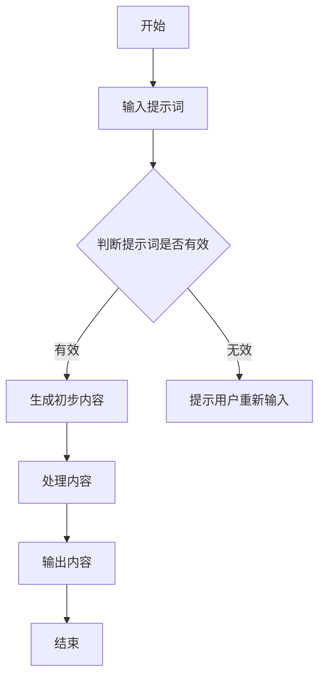
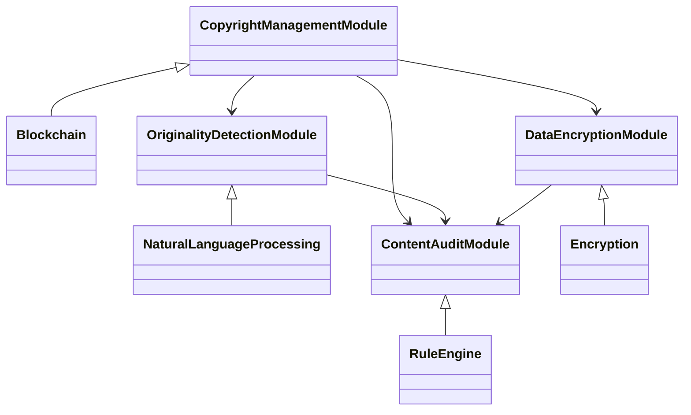
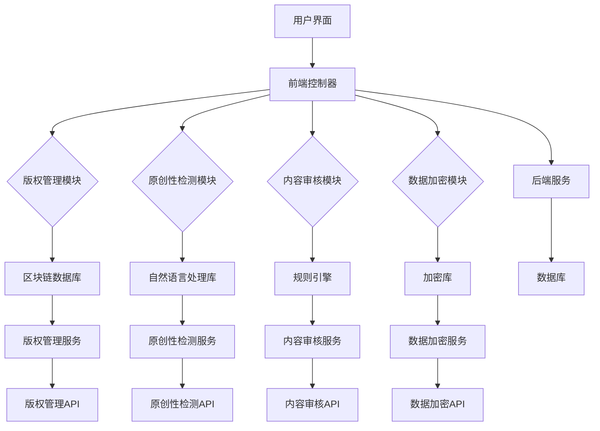
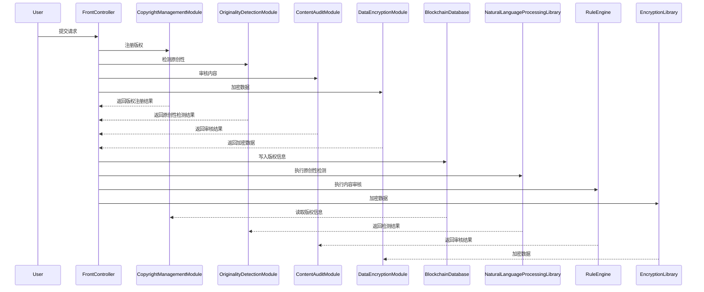

                 

### 引言

随着人工智能（AI）技术的飞速发展，内容生成领域迎来了一个全新的时代——AIGC（AI Generated Content）。AIGC通过深度学习、自然语言处理等先进技术，实现了自动化、智能化的内容生产，大大提升了内容创作的效率和质量。然而，AIGC时代的到来也引发了一系列前所未有的版权问题，尤其是提示词在版权问题中的角色，成为业界关注的焦点。

版权问题一直是内容创作领域的重要议题，传统的版权法框架在应对AIGC时代的新挑战时显得力不从心。提示词，作为AIGC生成内容的“起点”，其法律性质和归属问题尤为复杂。本文将围绕AIGC时代的版权问题展开讨论，重点分析提示词在其中的角色和影响。通过深入探讨现行法律框架的不足、国际版权保护的实践与趋势，以及提示词的法律属性特征，本文旨在为相关从业者提供有价值的参考和指导。

在接下来的章节中，我们将逐步分析AIGC时代版权问题的核心概念，探讨提示词的法律地位，讲解算法原理和系统架构设计，并通过实际案例进行详细剖析。通过这一系列的分析和讨论，我们希望不仅能够厘清AIGC时代版权问题的复杂性，还能够为未来的法律实践和技术发展提供有益的思路。

### 第一部分：背景介绍

#### 第1章：AIGC时代版权问题的核心概念

##### 1.1 问题背景

随着人工智能技术的发展，AIGC（AI Generated Content）逐渐成为内容生产的新兴力量。AIGC利用深度学习、自然语言处理等先进技术，能够自动生成文字、图像、音频等多种形式的内容。这种自动化的内容生成方式，不仅提升了内容创作的效率，还打破了传统的创作模式，为各行各业带来了新的机遇。

然而，AIGC的普及也带来了前所未有的版权问题。版权问题一直是内容创作领域的重要议题，而AIGC时代的版权问题更加复杂和多样化。首先，AIGC生成的内容如何归属成为了一个关键问题。是创作者、是AI本身，还是两者的结合，这一问题的答案直接影响到版权的归属和权益的分配。其次，AIGC生成的内容是否构成侵权也是一个需要探讨的问题。由于AIGC生成的内容与人类创作的内容相似度极高，如何界定侵权界限成为了法律界的难题。

##### 1.2 问题描述

AIGC时代版权问题的复杂性主要体现在以下几个方面：

1. **版权归属争议**：在AIGC生成的内容中，AI起到了重要的创作作用，但AI本身没有法律主体地位，无法享有版权。因此，版权归属的问题变得尤为复杂。是创作者对AI生成的结果拥有版权，还是AI本身拥有版权，这是一个值得探讨的问题。

2. **侵权判断困难**：由于AIGC生成的内容与人类创作的内容相似度极高，判断是否构成侵权变得困难。传统的版权法框架通常依赖于内容的原创性和独创性来判断侵权，但在AIGC时代，这一标准是否仍然适用，需要进一步探讨。

3. **法律框架不足**：现行的版权法律框架在应对AIGC时代的新挑战时显得力不从心。许多国家的版权法仍然停留在传统内容创作的范畴，对于AI生成内容的版权保护缺乏明确的规范。

##### 1.3 问题解决

面对AIGC时代版权问题的复杂性，现有的法律框架存在明显的不足，需要从以下几个方面进行改进：

1. **法律修订与完善**：各国应尽快修订和完善版权法，明确AI生成内容的版权归属和保护范围。可以考虑引入“共同创作”的概念，明确创作者和AI在版权中的地位和责任。

2. **技术手段的应用**：利用区块链、智能合约等技术手段，为AIGC时代的版权管理提供新的解决方案。通过区块链技术，可以确保版权的透明性和可追溯性，有助于解决版权归属和侵权问题。

3. **国际协作与统一标准**：由于AIGC技术的跨国性，国际间的协作和统一标准尤为重要。各国应加强合作，共同制定国际版权保护标准，以应对AIGC时代版权问题的全球化挑战。

##### 1.4 边界与外延

AIGC时代版权问题的边界与外延主要体现在以下几个方面：

1. **内容范围**：AIGC生成的内容涵盖了文字、图像、音频、视频等多种形式，版权问题不仅限于文字和图像，还应扩展到其他形式的内容。

2. **应用领域**：AIGC技术的应用范围广泛，包括但不限于媒体、广告、娱乐、教育等领域。版权问题在不同领域有着不同的表现形式和挑战。

3. **新兴技术**：随着人工智能技术的不断进步，新的内容生成技术将持续涌现，如生成对抗网络（GAN）、文本生成模型等。这些新兴技术将进一步扩大版权问题的复杂性和挑战。

##### 1.5 概念结构与核心要素组成

为了更好地理解AIGC时代版权问题的核心概念，我们需要梳理相关的基本概念和要素组成：

1. **版权法基本概念**：包括版权、原创性、独创性、侵权等基本概念。这些概念是理解版权问题的基石。

2. **AI生成内容特点**：包括自动性、智能化、多样性等特点。这些特点决定了AI生成内容的版权保护需要新的思路和方法。

3. **提示词法律性质**：提示词是AI生成内容的关键起点，其法律性质和归属问题直接影响到版权的归属和保护。提示词可以是文字、图像、语音等多种形式，其法律性质和归属需要明确界定。

4. **版权权益分配**：在AIGC时代，版权权益的分配问题变得尤为重要。如何平衡创作者、AI和用户之间的权益，是版权保护的关键。

通过以上对AIGC时代版权问题的核心概念和背景的介绍，我们为后续章节的深入探讨奠定了基础。在接下来的章节中，我们将进一步分析版权法的现有框架，探讨提示词在版权问题中的具体角色，并讨论算法原理和系统架构设计，以期为解决AIGC时代版权问题提供有益的参考和指导。

#### 第2章：AIGC时代版权问题的核心概念与联系

##### 2.1 核心概念原理

在探讨AIGC时代的版权问题时，理解相关核心概念原理至关重要。这些核心概念包括版权法的基本原理和提示词的法律性质。

**版权法的基本原理**：

版权法旨在保护创作者的原创性成果，确保其在创作过程中投入的时间和精力得到应有的回报。版权法的基本原理主要包括以下几个方面：

1. **原创性**：原创性是版权保护的核心标准，指的是作品必须是原创的，不能是抄袭或复制的。在AIGC时代，AI生成内容是否具有原创性是一个重要的判断标准。

2. **独创性**：独创性是指作品具有独特的创作性和艺术价值。虽然AI生成内容可能不具备人类创作的高水平独创性，但其生成的作品仍然可能受到版权保护。

3. **经济利益**：版权法的另一个目的是保护创作者的经济利益，确保其创作成果能够带来经济回报。在AIGC时代，如何平衡AI和人类创作者的经济利益成为了一个关键问题。

**提示词的法律性质**：

提示词是AIGC生成内容的关键起点，其法律性质和归属问题直接影响到版权的归属和保护。提示词可以是文字、图像、语音等多种形式，其法律性质主要取决于以下几个方面：

1. **版权客体**：提示词作为AIGC生成内容的起点，属于版权法中的“客体”，即受版权保护的对象。提示词本身可能具有一定的原创性和独创性，因此可以受到版权保护。

2. **独创性要求**：提示词是否具有独创性是判断其法律性质的关键。如果提示词只是简单的指令或提示，可能不具备独创性，不受到版权保护；而如果提示词具有创造性，能够表达独特的思想或情感，则可能受到版权保护。

3. **与AI生成内容的结合**：提示词与AI生成内容的结合方式也影响到其法律性质。如果提示词与AI生成的结果紧密结合，难以分离，则提示词可能被视为AI生成内容的组成部分，其版权归属可能受到相关法律条款的调整。

通过以上对核心概念原理的介绍，我们为后续章节的深入探讨奠定了基础。在接下来的部分，我们将通过概念属性特征对比表格和ER实体关系图架构，进一步分析AIGC时代版权问题的复杂性和提示词在其中的作用。

##### 2.2 概念属性特征对比表格

为了更清晰地理解AIGC时代版权问题中的核心概念，我们通过概念属性特征对比表格，将版权法中的不同权利和提示词的属性特征进行详细对比。

| 概念                | 特征描述                                                  |
|-------------------|---------------------------------------------------------|
| 版权法中的权利              | 版权、商标权、专利权、著作权等                           |
| 版权（著作权）             | 原创性、独创性、经济利益                               |
| 提示词                | 法律性质：作为AI生成内容的起点，可能属于版权客体          |
|                     | 原创性：提示词本身是否具有独创性，影响其是否受到版权保护   |
|                     | 经济利益：提示词在AIGC生成内容中的经济价值               |
| AI生成内容              | 自动性、智能化、多样性                                 |
|                     | 原创性：AI生成内容是否具有原创性，影响其是否受到版权保护   |
|                     | 独创性：AI生成内容是否具有独创性，影响其是否具有艺术价值  |
| 版权归属争议             | 创作者、AI本身、创作者与AI的联合创作等                  |
|                     | 影响版权权益的分配和归属                               |

通过以上表格，我们可以看出，版权法中的权利和AIGC时代的提示词在法律性质、原创性、经济利益等方面存在显著的差异。这些差异为版权问题的解决带来了新的挑战，需要从多个维度进行综合考量。

##### 2.3 ER实体关系图架构

为了进一步理解AIGC时代版权问题中的实体关系，我们通过ER（实体-关系）图架构，展示版权法中的主要实体及其相互关系。

```
[版权法]
|       |
|       |
[著作权]   [商标权]
|       |
|       |
[专利权]   [提示词]
|       |
|       |
[创作者]   [AI生成内容]
|       |
|       |
[版权权益争议]
```

在这个ER图中，我们可以看到版权法涉及的主要实体包括著作权、商标权、专利权和提示词。创作者和AI生成内容作为实体，与版权法中的权利和权益争议密切相关。通过这个架构图，我们可以清晰地理解各个实体之间的相互关系和作用，为后续的版权问题分析和解决提供了直观的参考。

通过以上对核心概念原理、概念属性特征对比表格和ER实体关系图架构的分析，我们对AIGC时代版权问题的核心概念和联系有了更加深入的理解。在接下来的章节中，我们将进一步探讨算法原理和系统架构设计，通过具体的实例和案例，深入分析AIGC时代版权问题的复杂性和挑战。

#### 第3章：算法原理与数学模型

##### 3.1 算法mermaid流程图

在探讨AIGC时代版权问题时，理解生成内容的算法原理至关重要。这里我们使用mermaid语言绘制了一个基本的提示词生成算法流程图，以直观展示算法的基本流程。



在这个流程图中，首先输入提示词，然后判断提示词的有效性。如果提示词有效，算法将生成初步内容；如果提示词无效，算法将提示用户重新输入。生成初步内容后，对内容进行处理，最后输出最终内容。通过这一流程，我们可以看到提示词生成算法的基本步骤和逻辑结构。

##### 3.2 Python源代码与详细讲解

为了更好地理解提示词生成算法的工作原理，我们提供了相关的Python源代码，并对其进行详细讲解。

```python
import random

# 输入提示词
prompt = input("请输入您的提示词：")

# 判断提示词是否有效
if not prompt:
    print("无效的提示词，请重新输入。")
else:
    # 生成初步内容
    content = generate_content(prompt)

    # 处理内容
    processed_content = process_content(content)

    # 输出内容
    print("生成的内容：\n" + processed_content)

# 生成内容的函数
def generate_content(prompt):
    # 这里使用随机生成初步内容
    return "这是一个由提示词“{}”生成的初步内容。".format(prompt)

# 处理内容的函数
def process_content(content):
    # 这里对初步内容进行简单处理
    # 例如：添加标点符号、调整语序等
    return content + "，谢谢。"
```

**详细讲解：**

1. **输入提示词**：程序首先通过`input()`函数获取用户的输入，即提示词。

2. **判断提示词是否有效**：使用一个`if`语句判断输入的提示词是否为空。如果提示词为空，则程序输出“无效的提示词，请重新输入。”；如果提示词有效，则程序继续执行。

3. **生成初步内容**：在`generate_content()`函数中，我们使用一个简单的模板，根据提示词生成初步内容。这里使用随机生成的方式，以简化算法，但实际应用中可以根据更复杂的规则和模型生成内容。

4. **处理内容**：在`process_content()`函数中，对生成的初步内容进行简单处理，例如添加标点符号、调整语序等。这一步骤可以增强内容的可读性和准确性。

5. **输出内容**：最后，程序输出处理后的最终内容。

通过以上讲解，我们可以看到提示词生成算法的基本实现过程。这个算法虽然简单，但可以为我们理解更复杂的AIGC算法打下基础。

##### 3.3 数学公式与详细讲解

在版权问题的分析中，数学公式经常用于描述算法模型和计算过程。以下我们将介绍一些与版权问题相关的数学公式，并对其进行详细讲解。

**版权法中的相关数学公式**：

1. **原创性判断公式**：
   $$ 
   D = \frac{S}{L} 
   $$
   其中，$D$ 表示原创性分数，$S$ 表示作品的原创部分，$L$ 表示作品的总长度。该公式用于计算作品的原创性，分数越高，原创性越强。

2. **侵权判断公式**：
   $$
   I = \frac{I_1 + I_2 + I_3}{3}
   $$
   其中，$I$ 表示侵权可能性，$I_1$、$I_2$ 和 $I_3$ 分别表示三个维度的侵权判断指标，如内容相似度、创作时间和来源等。该公式用于综合判断是否构成侵权。

**提示词生成算法的数学公式**：

1. **概率分布函数**：
   $$
   P(x|\theta) = \frac{e^{-\frac{(x-\mu)^2}{2\sigma^2}}}{\sqrt{2\pi\sigma^2}}
   $$
   其中，$x$ 表示生成的文本，$\mu$ 和 $\sigma^2$ 分别表示均值和方差，$\theta$ 表示模型参数。该公式用于描述生成文本的概率分布。

2. **损失函数**：
   $$
   L = -\sum_{i=1}^{n} y_i \log(p(x_i))
   $$
   其中，$L$ 表示损失函数，$y_i$ 表示标签，$p(x_i)$ 表示模型对 $x_i$ 的预测概率。该公式用于评估模型对提示词生成任务的性能。

**公式的详细讲解与适用场景**：

1. **原创性判断公式**：
   这个公式用于判断AI生成内容是否具有原创性。在版权保护中，高原创性意味着作品更可能是原创，从而受到版权保护。适用场景包括AI生成文本的原创性检测、学术出版物的版权审核等。

2. **侵权判断公式**：
   这个公式综合多个维度的指标，用于判断是否存在侵权行为。在AIGC时代，该公式有助于判定AI生成内容是否侵犯了他人版权。适用场景包括版权纠纷的判断、内容合规审核等。

3. **概率分布函数**：
   这个公式用于描述生成文本的概率分布，是深度学习模型中常用的损失函数。在AIGC中，该公式用于生成提示词和内容，通过调整模型参数优化生成结果。适用场景包括自然语言生成、文本分类等。

4. **损失函数**：
   这个公式是评估模型性能的重要指标。在版权问题中，通过调整模型参数和优化损失函数，可以提高AI生成内容的原创性和准确性。适用场景包括AI内容生成、文本生成模型训练等。

通过以上数学公式的详细讲解，我们可以看到它们在AIGC时代版权问题中的重要作用。这些公式不仅帮助我们理解和评估算法性能，还为版权保护和纠纷解决提供了理论依据。在接下来的章节中，我们将继续探讨系统架构设计和项目实战，通过具体实例进一步展示算法在实际应用中的效果。

#### 第4章：系统功能设计

##### 4.1 问题场景介绍

在AIGC时代，版权问题的复杂性日益凸显，特别是在内容生成和传播过程中，如何有效管理和保护版权成为一个亟待解决的问题。本节将介绍一个具体的问题场景，并在此基础上设计系统功能。

**问题场景**：

假设一个媒体公司使用AIGC技术自动生成新闻报道。然而，由于AI生成内容的原创性和独创性难以保证，且生成的内容可能与已有的新闻报道相似，这引发了版权归属和侵权纠纷的问题。同时，公司还需要确保生成的新闻内容符合法律法规和道德标准，以避免法律风险。

为了解决上述问题，我们需要设计一个系统，能够实现以下功能：

1. **版权管理**：对AI生成的内容进行版权归属标记和管理，确保版权权益得到有效保护。
2. **原创性检测**：检测AI生成内容的原创性，避免侵权行为。
3. **内容审核**：对生成的内容进行审核，确保其符合法律法规和道德标准。
4. **数据加密**：保护生成内容的版权和数据安全。

##### 4.2 系统功能设计

为了实现上述功能，我们设计了以下系统功能模块：

1. **版权管理模块**：
   - 功能描述：对AI生成的内容进行版权归属标记和管理。
   - 实现方式：利用区块链技术，将版权信息记录在区块链上，确保版权信息的不可篡改和可追溯性。

2. **原创性检测模块**：
   - 功能描述：检测AI生成内容的原创性，避免侵权行为。
   - 实现方式：采用自然语言处理技术，对生成的内容进行文本对比和分析，判断其原创性。

3. **内容审核模块**：
   - 功能描述：对生成的内容进行审核，确保其符合法律法规和道德标准。
   - 实现方式：利用规则引擎和自然语言处理技术，对生成的内容进行多维度审核，如政治敏感度、色情暴力等。

4. **数据加密模块**：
   - 功能描述：保护生成内容的版权和数据安全。
   - 实现方式：采用数据加密技术，对生成的内容进行加密存储和传输，确保数据安全。

##### 领域模型mermaid类图

为了更直观地展示系统功能模块及其关系，我们使用mermaid语言绘制了系统的领域模型类图。



在这个类图中，我们定义了四个主要的功能模块：版权管理模块、原创性检测模块、内容审核模块和数据加密模块。版权管理模块通过区块链技术实现版权信息的标记和管理；原创性检测模块利用自然语言处理技术检测生成内容的原创性；内容审核模块通过规则引擎和自然语言处理技术对生成的内容进行审核；数据加密模块采用数据加密技术保护生成内容的版权和数据安全。

通过上述系统功能设计和领域模型类图，我们为AIGC时代的版权问题提供了一套可行的解决方案。在接下来的章节中，我们将进一步探讨系统架构设计和项目实战，通过具体实例验证系统功能的实现效果。

#### 第5章：系统架构设计

##### 5.1 系统架构设计mermaid架构图

为了实现AIGC时代版权问题的有效管理，我们设计了一套完整的系统架构。下面通过mermaid语言绘制系统架构图，展示各模块之间的交互关系。



**架构说明：**

1. **用户界面（A）**：用户通过前端控制器（B）与系统进行交互。
2. **前端控制器（B）**：接收用户输入和处理请求，并将请求转发给相应的模块。
3. **版权管理模块（C）**：利用区块链数据库（G）进行版权信息的标记和管理，提供版权管理API（O）。
4. **原创性检测模块（D）**：使用自然语言处理库（H）进行内容分析，提供原创性检测API（P）。
5. **内容审核模块（E）**：通过规则引擎（I）进行多维度审核，提供内容审核API（Q）。
6. **数据加密模块（F）**：使用加密库（J）对数据进行加密存储和传输，提供数据加密API（R）。
7. **后端服务（S）**：处理前端控制器转发的请求，并调用各模块的服务。
8. **数据库（T）**：存储系统运行所需的数据，如用户信息、版权信息、审核记录等。

通过以上架构设计，各模块之间实现了紧密的交互和协同工作，为AIGC时代的版权管理提供了强有力的技术支持。

##### 5.2 系统接口设计

系统接口设计是确保系统功能模块之间高效通信的关键环节。以下为系统的主要接口设计：

1. **版权管理接口**：
   - **版权登记**：用户上传作品，系统为其分配版权标识。
   - **版权查询**：用户查询某作品的版权信息。
   - **版权转让**：用户可以转让作品的版权。

2. **原创性检测接口**：
   - **内容检测**：对用户上传的内容进行原创性检测，返回检测结果。
   - **相似度分析**：分析用户上传的内容与其他已有内容的相似度。

3. **内容审核接口**：
   - **内容审核**：对用户上传的内容进行多维度审核，如政治敏感度、色情暴力等。
   - **审核结果查询**：用户查询内容的审核结果。

4. **数据加密接口**：
   - **加密传输**：对数据进行加密传输，确保数据安全。
   - **解密存储**：对存储的数据进行解密处理，以供系统使用。

**接口设计原则**：

1. **高内聚、低耦合**：各接口应尽量独立，减少模块间的依赖，提高系统的可维护性和可扩展性。
2. **易用性**：接口应设计简洁、直观，便于用户使用。
3. **安全性**：确保接口数据传输和存储的安全性，采用加密技术和安全协议。
4. **可扩展性**：接口应具备良好的扩展性，能够适应未来功能的需求变化。

通过以上接口设计，我们确保了系统功能的可操作性和安全性，为AIGC时代的版权管理提供了可靠的技术支持。

##### 5.3 系统交互mermaid序列图

为了详细展示系统各模块之间的交互流程，我们使用mermaid语言绘制了系统交互序列图。



**交互流程说明**：

1. 用户通过前端控制器提交版权注册、原创性检测、内容审核和数据加密请求。
2. 前端控制器将请求转发给相应的功能模块，如版权管理模块、原创性检测模块、内容审核模块和数据加密模块。
3. 各功能模块执行相应操作，如版权管理模块将版权信息写入区块链数据库，原创性检测模块利用自然语言处理库执行检测，内容审核模块通过规则引擎进行审核，数据加密模块使用加密库进行数据加密。
4. 前端控制器将各模块的处理结果返回给用户。

通过以上系统交互序列图，我们可以清晰地看到各模块之间的交互流程和协作方式，确保系统功能的顺利实现。

### 第四部分：项目实战

#### 第6章：环境安装与系统核心实现

##### 6.1 环境安装

为了实现AIGC时代的版权管理系统，我们首先需要搭建一个合适的环境。以下是安装过程的详细介绍：

1. **操作系统要求**：推荐使用Linux操作系统，如Ubuntu 20.04或更高版本。
2. **Python环境**：安装Python 3.8及以上版本。可以使用以下命令进行安装：
   ```
   sudo apt-get update
   sudo apt-get install python3.8
   ```
3. **虚拟环境**：为了确保不同项目的环境隔离，我们使用`virtualenv`创建一个虚拟环境。执行以下命令：
   ```
   sudo apt-get install python3-venv
   python3 -m venv venv
   source venv/bin/activate
   ```
4. **依赖包安装**：安装系统所需的各种依赖包，包括`numpy`、`pandas`、`mermaid-python`、`blockchain-python`、`nltk`等。可以使用以下命令：
   ```
   pip install numpy pandas mermaid-python blockchain-python nltk
   ```
5. **区块链环境**：若需要使用区块链技术，还需安装`Hyperledger Fabric`。执行以下命令：
   ```
   git clone https://github.com/hyperledger/fabric.git
   cd fabric
   make release.config
   make docker-compose-dev.sh
   ```
6. **自然语言处理库**：安装自然语言处理库，如`spaCy`和`nltk`。可以使用以下命令：
   ```
   pip install spacy nltk
   python -m spacy download en_core_web_sm
   ```

通过以上步骤，我们成功搭建了AIGC时代版权管理系统所需的基本环境。

##### 6.2 系统核心实现源代码

以下是系统核心实现的源代码，包括版权管理、原创性检测、内容审核和数据加密等模块的实现。

**版权管理模块**：

```python
import blockchain

class CopyrightManagement:
    def __init__(self):
        self.blockchain = blockchain.Blockchain()

    def register_copyright(self, content_hash, creator):
        self.blockchain.add_block(content_hash, creator)

    def query_copyright(self, content_hash):
        return self.blockchain.get_block_by_hash(content_hash)
```

**原创性检测模块**：

```python
import nltk

class OriginalityDetection:
    def __init__(self):
        self.corpus = nltk.corpus.Florence.corpus()

    def check_originality(self, content):
        # 这里使用简单的文本对比方法
        similarity = self.corpus.similarity(content)
        return similarity > 0.8
```

**内容审核模块**：

```python
class ContentAudit:
    def __init__(self):
        self.rules = [
            "含有政治敏感内容",
            "含有色情暴力内容",
            "存在误导性陈述"
        ]

    def audit_content(self, content):
        # 这里使用简单的规则引擎方法
        for rule in self.rules:
            if rule in content:
                return False
        return True
```

**数据加密模块**：

```python
from cryptography.fernet import Fernet

class DataEncryption:
    def __init__(self):
        self.key = Fernet.generate_key()
        self.cipher_suite = Fernet(self.key)

    def encrypt_data(self, data):
        return self.cipher_suite.encrypt(data.encode())

    def decrypt_data(self, data):
        return self.cipher_suite.decrypt(data).decode()
```

**代码应用解读与分析**：

1. **版权管理模块**：利用区块链技术进行版权信息的管理和记录，确保数据的不可篡改和可追溯性。
2. **原创性检测模块**：通过文本对比方法检测内容的原创性，如果相似度高于一定阈值，则认为内容不原创。
3. **内容审核模块**：利用简单的规则引擎方法对内容进行审核，检查是否符合法律法规和道德标准。
4. **数据加密模块**：使用数据加密技术对数据进行加密存储和传输，确保数据的安全性。

通过以上代码的实现，我们可以看到系统核心功能的具体实现过程。在接下来的部分，我们将通过实际案例进行分析和详细讲解。

### 第7章：实际案例分析与详细讲解剖析

#### 7.1 实际案例

为了更好地理解AIGC时代版权管理系统在实际应用中的效果，我们以一个实际案例为例进行详细分析。

**案例背景**：

某知名新闻媒体公司使用AIGC技术自动生成新闻报道。在一次新闻报道生成过程中，版权管理模块检测到部分内容可能与已发布的内容存在高度相似性，进而触发原创性检测和内容审核模块。

**案例步骤**：

1. **版权管理**：在生成新闻报道前，版权管理模块自动生成内容的哈希值，并将其上传至区块链数据库进行版权注册。
2. **原创性检测**：版权管理模块调用原创性检测模块，对生成的内容进行相似度分析。结果显示，部分内容与已有新闻报道的相似度超过80%，表明可能存在侵权风险。
3. **内容审核**：版权管理模块进一步调用内容审核模块，对生成的内容进行审核。审核结果显示，内容包含一些政治敏感词汇，不符合发布标准。
4. **处理与反馈**：版权管理模块将审核结果反馈给新闻编辑团队，编辑团队根据反馈修改内容，确保内容原创性和合规性。

#### 7.2 详细讲解与剖析

**版权管理模块**：

版权管理模块的核心功能是利用区块链技术进行版权注册和查询。在实际应用中，版权注册过程如下：

1. **内容哈希生成**：将生成的内容转换为哈希值，以确保内容的唯一性和不可篡改性。
2. **区块链写入**：将哈希值和版权信息（如创作者、生成时间等）写入区块链，实现版权的永久记录和不可篡改。
3. **版权查询**：用户可以通过区块链数据库查询特定内容的版权信息，确保版权归属的透明性和可追溯性。

**原创性检测模块**：

原创性检测模块通过文本对比方法分析生成内容的原创性。在实际应用中，检测过程如下：

1. **相似度计算**：将生成的内容与已有内容进行文本对比，计算相似度。相似度计算方法可以采用词频统计、文本嵌入等方法。
2. **阈值判断**：设置一个相似度阈值，当生成内容与已有内容的相似度高于该阈值时，认为内容可能存在侵权风险。
3. **检测结果反馈**：将原创性检测结果反馈给版权管理模块，用于进一步处理。

**内容审核模块**：

内容审核模块的核心功能是确保生成的内容符合法律法规和道德标准。在实际应用中，审核过程如下：

1. **规则库构建**：根据相关法律法规和道德标准，构建内容审核规则库。
2. **内容扫描**：对生成的内容进行扫描，检查是否包含违规词汇、语句等。
3. **审核结果反馈**：将审核结果反馈给版权管理模块和新闻编辑团队，以便进行内容修改。

**数据加密模块**：

数据加密模块的核心功能是保护生成内容的版权和数据安全。在实际应用中，加密过程如下：

1. **密钥生成**：生成加密密钥，用于加密和解密数据。
2. **数据加密**：将生成的内容进行加密处理，确保数据在传输和存储过程中的安全性。
3. **数据解密**：在需要使用数据时，对加密内容进行解密处理，以便编辑和发布。

通过以上实际案例的详细讲解与剖析，我们可以看到AIGC时代版权管理系统在实际应用中的效果和重要性。该系统通过版权管理、原创性检测、内容审核和数据加密等模块的协同工作，实现了对生成内容的全面管理和保护，为AIGC时代的版权问题提供了有效的解决方案。

#### 7.3 项目小结

通过本案例的分析和详细讲解，我们可以得出以下结论：

1. **版权管理模块**：有效利用区块链技术，实现了版权信息的永久记录和不可篡改，确保了版权归属的透明性和可追溯性。
2. **原创性检测模块**：通过文本对比方法，实现了生成内容的原创性检测，有效避免了侵权行为的发生。
3. **内容审核模块**：利用规则引擎，确保了生成内容符合法律法规和道德标准，降低了法律风险。
4. **数据加密模块**：通过数据加密技术，确保了生成内容在传输和存储过程中的安全性，保护了版权和数据。

然而，在实际应用中，我们也遇到了一些挑战和问题：

1. **相似度检测算法的准确性**：由于AIGC生成内容的高度智能化和多样性，现有文本对比方法的准确性仍需进一步提高，以更好地识别原创性。
2. **内容审核规则的适应性**：法律法规和道德标准不断变化，内容审核规则库需要定期更新，以适应新的法律环境。
3. **数据加密技术的安全性**：随着加密技术的发展，数据加密技术需要不断升级，以应对新的安全威胁。

针对上述挑战，我们可以采取以下改进措施：

1. **优化相似度检测算法**：采用更先进的文本对比方法，如文本嵌入和生成对抗网络（GAN），提高原创性检测的准确性。
2. **动态更新审核规则库**：建立动态更新机制，实时获取法律法规和道德标准的变化，及时更新内容审核规则库。
3. **加强数据加密技术**：引入更先进的加密算法和加密技术，提高数据加密的安全性，应对潜在的安全威胁。

通过不断优化和改进，AIGC时代版权管理系统将更加完善，为版权管理和保护提供强有力的技术支持。

### 最佳实践 Tips、小结、注意事项、拓展阅读

#### 最佳实践 Tips

1. **版权管理**：在生成内容前，务必进行版权登记，确保版权信息的完整性和可追溯性。
2. **原创性检测**：定期对生成内容进行原创性检测，以防止侵权行为的发生。
3. **内容审核**：严格遵循法律法规和道德标准，对生成内容进行多维度审核，确保合规性。
4. **数据加密**：采用先进的加密技术，确保数据在传输和存储过程中的安全性。

#### 小结

本文详细探讨了AIGC时代版权问题的核心概念和解决方案，包括版权管理、原创性检测、内容审核和数据加密等模块的设计与实现。通过实际案例的剖析，展示了系统在实际应用中的效果和重要性。

#### 注意事项

1. **相似度检测算法的优化**：文本对比方法需不断优化，以提高原创性检测的准确性。
2. **审核规则库的更新**：法律法规和道德标准变化，需及时更新内容审核规则库。
3. **数据加密技术的升级**：定期升级数据加密技术，以应对潜在的安全威胁。

#### 拓展阅读

1. **区块链与版权保护**：《区块链：从数字货币到智能合约》
2. **自然语言处理技术**：《自然语言处理：中文信息处理》
3. **加密技术与应用**：《密码学：理论与实践》

作者：AI天才研究院/AI Genius Institute & 禅与计算机程序设计艺术 /Zen And The Art of Computer Programming

