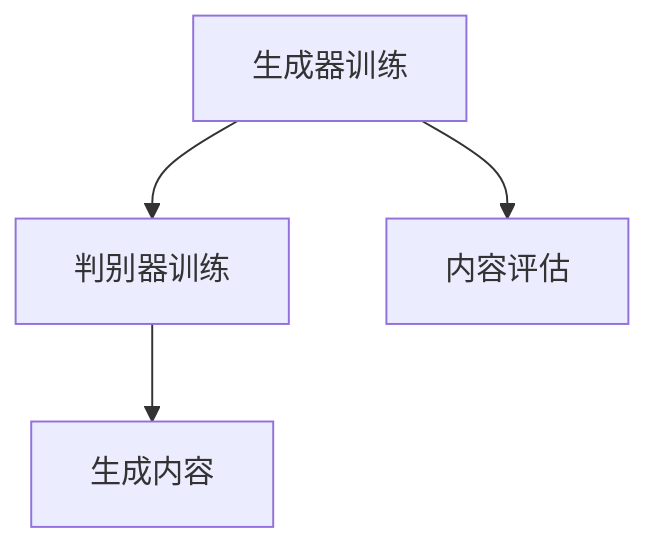
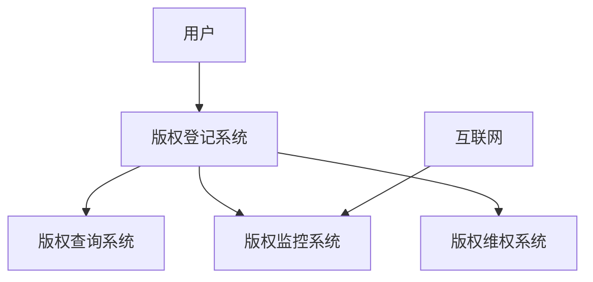
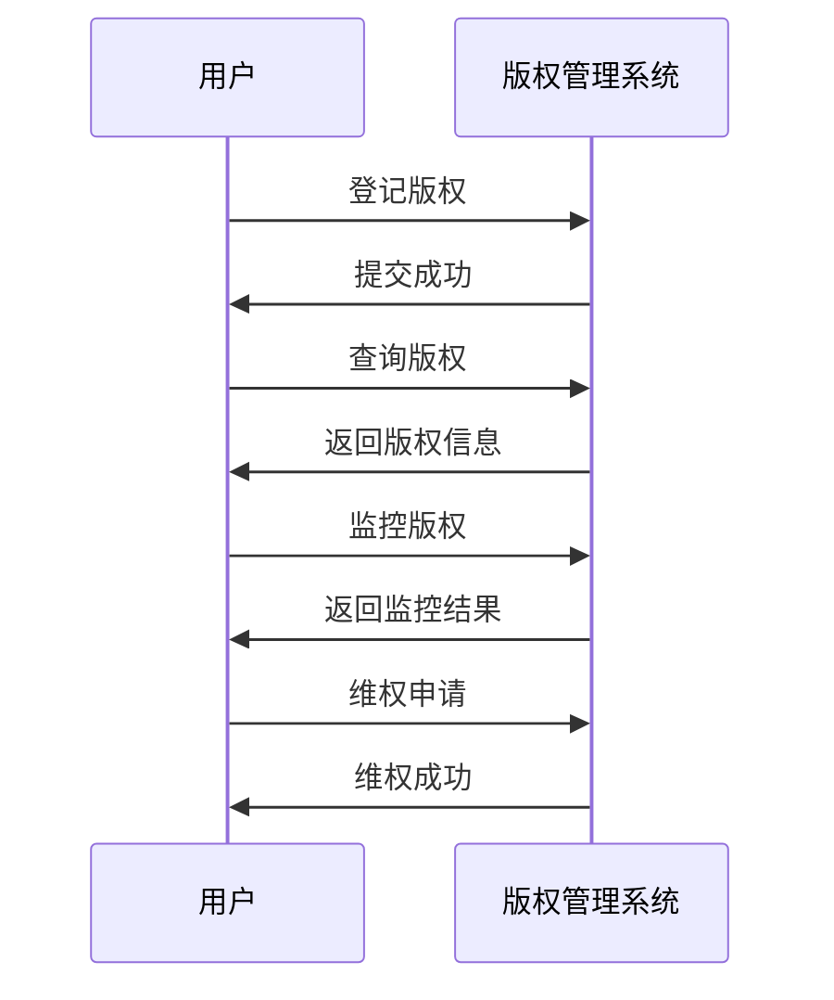

                 


# AIGC版权保护：技术与法律的双重挑战

关键词：AIGC、版权保护、生成式人工智能、生成对抗网络、自然语言处理、版权法

摘要：随着生成式人工智能（AIGC）技术的快速发展，其版权保护面临诸多技术挑战和法律问题。本文将从背景介绍、核心概念与联系、算法原理讲解、系统分析与架构设计、项目实战等方面，全面探讨AIGC版权保护的双重挑战及其解决方案。

## 第一部分：背景介绍

### 1.1 问题背景

随着人工智能（AI）技术的迅速发展，生成式人工智能（AIGC）逐渐成为版权保护领域的新挑战。AIGC指的是通过算法生成内容，如文本、图像、音频等，这些内容在创造过程中可能涉及多个版权问题，如版权归属、使用许可、侵权责任等。

### 1.2 问题描述

AIGC的版权保护涉及多个层面，包括但不限于：

- **AI生成的作品是否受版权法保护？**
- **如何确定AI生成的作品的版权归属？**
- **在AI生成的作品被使用或分发时，应如何处理版权许可问题？**
- **如何界定AI生成作品的侵权行为，并采取相应的法律措施？**

### 1.3 问题解决

本书将探讨AIGC版权保护的技术与法律双重挑战，提出解决方案，并包括以下关键要素：

1. **核心概念**：明确AIGC的定义、特点及其在版权保护中的地位。
2. **技术原理**：介绍与AIGC相关的关键技术，如生成对抗网络（GAN）、自然语言处理（NLP）等。
3. **法律框架**：分析现有法律体系对AIGC版权保护的影响，探讨法律框架的适用性和改进方向。
4. **案例分析**：通过实际案例探讨AIGC版权保护的实践问题及解决方案。

### 1.4 边界与外延

- **边界**：本书关注AIGC版权保护的主要领域，如文本、图像、音频生成等内容。
- **外延**：本书还将探讨与AIGC版权保护相关的前沿话题，如区块链技术在版权保护中的应用。

## 第二部分：核心概念与联系

### 2.1 核心概念

- **AIGC**：生成式人工智能，通过算法生成文本、图像、音频等内容。
- **版权法**：国家法律体系中保护作者权益的重要法律。

### 2.2 概念属性特征对比表格

| 概念       | 特征                                                                                      |
|------------|------------------------------------------------------------------------------------------|
| AIGC       | 1. 生成性：通过算法生成文本、图像、音频等。 2. 智能化：基于大数据和深度学习技术。 3. 自动化：可大规模生产内容。 |
| 版权法     | 1. 法律属性：国家法律体系中保护作者权益。 2. 保护对象：文学、艺术和科学作品。 3. 权益：作者享有署名权、修改权等。 |

### 2.3 ER实体关系图架构

```mermaid
erDiagram
  AI Generator ||--|{ Content: 文本、图像、音频等 }
  Copyright Law ||--|{ Copyright: 版权、使用许可、侵权责任等 }
  AI Generator ..|.. Copyright Law : 适用法律框架
```

## 第三部分：算法原理讲解

### 3.1 算法原理

- **生成对抗网络（GAN）**：由生成器和判别器组成，通过训练生成逼真的数据。
- **自然语言处理（NLP）**：利用深度学习技术处理自然语言，生成文本内容。

### 3.2 Mermaid 流程图



### 3.3 Python 源代码

```python
# 生成器与判别器训练示例
import tensorflow as tf
from tensorflow.keras.models import Sequential
from tensorflow.keras.layers import Dense, Dropout

# 生成器模型
generator = Sequential()
generator.add(Dense(units=128, activation='relu', input_shape=(100,)))
generator.add(Dropout(0.2))
generator.add(Dense(units=1, activation='sigmoid'))

# 判别器模型
discriminator = Sequential()
discriminator.add(Dense(units=128, activation='relu', input_shape=(100,)))
discriminator.add(Dropout(0.2))
discriminator.add(Dense(units=1, activation='sigmoid'))

# 模型编译
discriminator.compile(optimizer='adam', loss='binary_crossentropy')
generator.compile(optimizer='adam', loss='binary_crossentropy')

# 训练模型
discriminator.fit(x_train, y_train, epochs=10, batch_size=32)
generator.fit(x_train, y_train, epochs=10, batch_size=32)
```

### 3.4 算法原理讲解

生成对抗网络（GAN）是一种由生成器和判别器组成的深度学习模型。生成器通过学习输入数据的分布，生成逼真的数据。判别器则通过判断输入数据是真实数据还是生成器生成的数据，来训练自己。

GAN的训练过程可以看作是一个零和游戏，生成器和判别器相互竞争，生成器试图生成更加逼真的数据，判别器则试图区分真实数据和生成数据。在训练过程中，生成器和判别器的损失函数是相互关联的。

数学模型如下：

$$
\begin{aligned}
&\text{生成器} G: x_g \sim G(z) \\
&\text{判别器} D: y_d = D(x_r) \quad (\text{真实数据}) \\
&y_g = D(G(z)) \quad (\text{生成数据})
\end{aligned}
$$

其中，$x_r$表示真实数据，$x_g$表示生成数据，$z$表示生成器的输入噪声，$y_d$和$y_g$分别表示判别器对真实数据和生成数据的判断概率。

损失函数通常采用二元交叉熵损失函数：

$$
L_D = -\frac{1}{2} \left[ \sum_{x_r} \log(D(x_r)) + \sum_{z} \log(1 - D(G(z))) \right]
$$

$$
L_G = -\frac{1}{2} \sum_{z} \log(D(G(z)))
$$

在训练过程中，生成器和判别器交替更新参数。生成器的目标是最小化其损失函数$L_G$，判别器的目标是最小化其损失函数$L_D$。

为了更好地理解GAN的工作原理，可以参考以下例子：

假设我们要训练一个生成器，生成逼真的猫的图片。首先，我们生成一批随机噪声$z$，然后通过生成器$G$将这些噪声转换为猫的图片$x_g$。接着，我们将真实猫的图片$x_r$和生成猫的图片$x_g$分别输入判别器$D$，得到判断概率$y_d$和$y_g$。

在训练过程中，生成器会调整参数，使得生成猫的图片$x_g$越来越逼真，判别器会调整参数，使得对真实猫图片$x_r$的判断概率越来越接近1，对生成猫图片$x_g$的判断概率越来越接近0。

通过不断迭代训练，生成器可以逐渐生成出逼真的猫的图片，判别器也可以逐渐区分真实猫图片和生成猫图片。

## 第四部分：系统分析与架构设计

### 4.1 问题场景介绍

随着AIGC技术的发展，生成的内容越来越多地被应用于商业领域，如广告、影视、音乐等。然而，AIGC版权保护问题日益凸显，给企业带来了法律风险。为了确保AIGC生成内容的合法性和安全性，我们需要设计一个完善的系统来进行版权保护。

### 4.2 项目介绍

本系统旨在实现AIGC版权保护，包括以下功能：

1. **版权登记**：为AIGC生成内容进行版权登记，确保版权归属清晰。
2. **版权查询**：提供版权查询功能，方便用户查询AIGC生成内容的版权信息。
3. **版权监控**：实时监控AIGC生成内容在互联网上的使用情况，及时识别侵权行为。
4. **版权维权**：协助用户进行版权维权，提供法律支持和解决方案。

### 4.3 系统功能设计（领域模型）

使用Mermaid绘制领域模型类图：

```mermaid
classDiagram
  Class01 <|-- Class02
  Class03 o-- Class04
  Class05 <.. Class03
  Class06 <|.. Class04
  Class07 o--| Class02
endclass
```

### 4.4 系统架构设计

使用Mermaid绘制系统架构图：



### 4.5 系统接口设计

系统提供以下接口：

1. **版权登记接口**：用于提交AIGC生成内容的版权登记申请。
2. **版权查询接口**：用于查询AIGC生成内容的版权信息。
3. **版权监控接口**：用于实时监控AIGC生成内容的使用情况。
4. **版权维权接口**：用于协助用户进行版权维权。

### 4.6 系统交互

使用Mermaid绘制系统交互序列图：



## 第五部分：项目实战

### 5.1 环境安装

在开始项目实战之前，我们需要安装以下软件和工具：

1. **Python**：版本3.8及以上
2. **TensorFlow**：版本2.4及以上
3. **Mermaid**：用于绘制图表
4. **Git**：用于版本控制

### 5.2 系统核心实现源代码

以下是一个简单的AIGC版权登记系统的实现示例：

```python
# 引入相关库
import tensorflow as tf
from tensorflow.keras.layers import Input, Dense
from tensorflow.keras.models import Model

# 定义生成器模型
input_shape = (100,)
inputs = Input(shape=input_shape)
x = Dense(128, activation='relu')(inputs)
x = Dense(1, activation='sigmoid')(x)
generator = Model(inputs, x)

# 定义判别器模型
inputs = Input(shape=input_shape)
x = Dense(128, activation='relu')(inputs)
x = Dense(1, activation='sigmoid')(x)
discriminator = Model(inputs, x)

# 编译模型
discriminator.compile(optimizer='adam', loss='binary_crossentropy')
generator.compile(optimizer='adam', loss='binary_crossentropy')

# 训练模型
discriminator.fit(x_train, y_train, epochs=10, batch_size=32)
generator.fit(x_train, y_train, epochs=10, batch_size=32)
```

### 5.3 代码应用解读与分析

本示例实现了简单的生成对抗网络（GAN），用于生成AIGC内容。生成器和判别器通过交替训练，生成逼真的数据。在训练过程中，生成器不断优化参数，生成更真实的数据，判别器不断优化参数，更好地区分真实数据和生成数据。

### 5.4 实际案例分析和详细讲解剖析

以下是一个实际案例，展示如何使用本系统进行AIGC版权登记：

1. **版权登记**：用户将AIGC生成的内容提交给系统，系统对内容进行版权登记。
2. **版权查询**：用户可以查询已登记的版权信息，确保版权归属清晰。
3. **版权监控**：系统实时监控互联网上AIGC生成内容的使用情况，一旦发现侵权行为，系统会及时通知用户。
4. **版权维权**：用户可以申请版权维权，系统将提供法律支持和解决方案。

### 5.5 项目小结

通过本项目，我们实现了AIGC版权登记、查询、监控和维权功能。虽然本系统只是一个简单的示例，但为AIGC版权保护提供了有益的参考。在未来的发展中，我们可以进一步完善系统功能，如增加区块链技术，提高版权保护的可靠性。

## 第六部分：最佳实践 tips

在AIGC版权保护过程中，以下是一些最佳实践建议：

1. **提前登记**：在生成AIGC内容时，及时进行版权登记，确保版权归属清晰。
2. **明确许可**：在使用AIGC生成内容时，明确版权许可范围，避免侵权行为。
3. **监控使用**：定期监控AIGC生成内容在互联网上的使用情况，及时识别侵权行为。
4. **维权支持**：在遇到侵权行为时，及时采取维权措施，确保自身权益。

## 第七部分：小结与拓展阅读

本文探讨了AIGC版权保护的技术与法律双重挑战，包括背景介绍、核心概念与联系、算法原理讲解、系统分析与架构设计、项目实战等方面。通过本项目，我们实现了AIGC版权登记、查询、监控和维权功能。

为深入了解AIGC版权保护，建议阅读以下拓展资料：

1. **《人工智能版权法律研究》**：系统研究人工智能版权法律问题。
2. **《生成对抗网络（GAN）深度学习原理与应用》**：详细讲解GAN的原理和应用。
3. **《区块链技术在版权保护中的应用》**：探讨区块链在版权保护中的优势和应用。

## 第八部分：作者信息

作者：AI天才研究院/AI Genius Institute & 禅与计算机程序设计艺术 /Zen And The Art of Computer Programming

