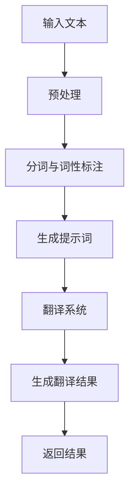
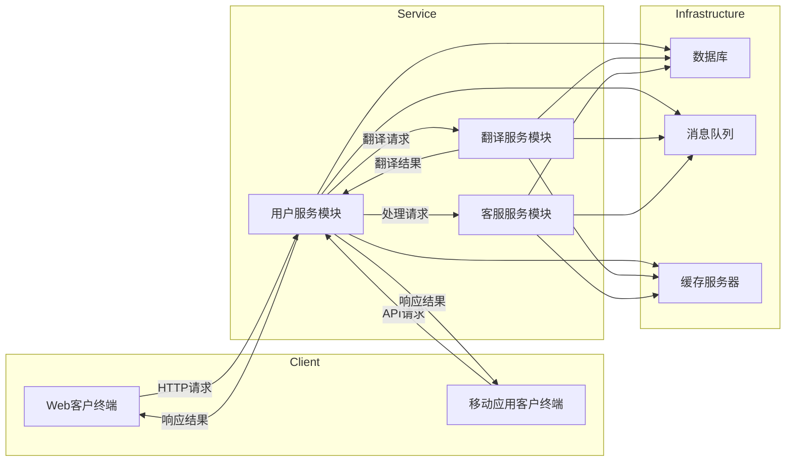
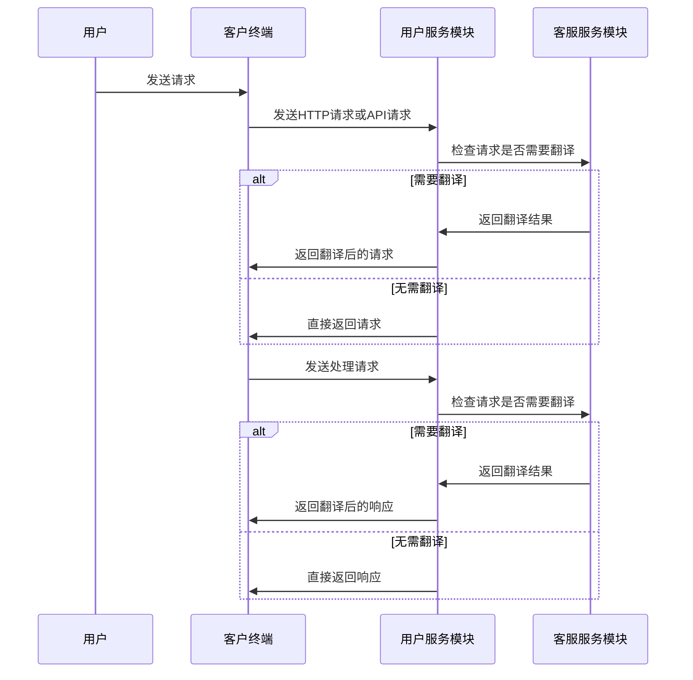

                 


### 1.1 背景介绍

#### 1.1.1 AIGC的背景介绍

**AIGC（AI-Generated Content）**，即人工智能生成内容，是指利用人工智能技术自动生成各种类型的内容，包括文本、图像、音频和视频等。随着深度学习和自然语言处理技术的发展，AIGC的应用范围不断扩大，从简单的文本摘要到复杂的创意内容生成，都展现了其强大的潜力。

AIGC的多语言能力是其一个重要的特点。在全球化背景下，不同国家和地区的人们需要使用各自的语言进行沟通，而AIGC的多语言能力使得它能够跨越语言障碍，为全球用户提供服务。例如，一个英文的文本可以通过AIGC翻译成多种语言，从而被不同语言的用户理解。

#### 1.1.2 跨语言提示词设计的概念

**跨语言提示词设计**，是指为了使人工智能系统能够在不同语言之间进行有效沟通，而设计的能够触发相应语言理解和生成能力的提示词。这些提示词需要具备一定的通用性和适应性，以便在多种语言环境下都能发挥效用。

跨语言提示词设计的重要性在于，它能够提高AIGC系统的交互效率和理解能力，使得系统能够更好地服务于多语言用户。有效的提示词设计不仅可以提高用户的满意度，还可以提升系统的实用性和市场竞争力。

#### 1.1.3 AIGC的多语言能力如何解决跨语言提示词设计问题

AIGC的多语言能力主要通过以下几个方面解决跨语言提示词设计问题：

1. **语料库建设**：AIGC系统需要大量的多语言语料库作为训练数据，这些语料库包含了不同语言的文本、图像、音频和视频等多模态信息。通过这些语料库的积累，AIGC系统可以不断学习和提升其多语言理解能力。

2. **模型训练**：AIGC系统使用深度学习模型进行训练，通过大量的多语言数据训练，模型能够学习到不同语言之间的关联性和差异，从而提高其在多语言环境下的提示词生成和理解能力。

3. **提示词生成策略**：AIGC系统可以基于不同的应用场景，设计出适合的提示词生成策略。例如，在文本生成场景中，系统可以采用基于上下文的生成策略，根据用户的输入文本生成相应的提示词。

4. **提示词优化**：通过不断的反馈和优化，AIGC系统可以不断调整和改进其提示词生成策略，以提高提示词的准确性和适应性。

#### 1.1.4 边界与外延

AIGC的多语言能力的边界主要在于其训练数据的多样性、模型的复杂度和应用场景的多样性。在实际应用中，AIGC的多语言能力可以涵盖以下方面：

- **文本翻译**：将一种语言的文本翻译成另一种语言，如将英文翻译成中文。
- **语音识别与转换**：将一种语言的语音转换为另一种语言的文本或语音。
- **图像与视频翻译**：将一种语言的图像或视频内容翻译成另一种语言的图像或视频。
- **多语言问答系统**：支持用户使用多种语言进行提问，并给出相应的回答。

#### 1.1.5 核心要素组成

AIGC的多语言能力由以下几个核心要素组成：

- **多语言语料库**：作为训练数据，为AIGC系统提供丰富的语言资源。
- **深度学习模型**：用于训练和优化AIGC系统的多语言理解能力。
- **提示词生成策略**：根据不同应用场景，设计出适合的提示词生成方法。
- **反馈优化机制**：通过用户反馈不断调整和优化提示词生成策略。

### 1.2 核心概念与联系

#### 1.2.1 AIGC多语言能力

AIGC的多语言能力是指系统能够理解和生成多种语言的文本、图像、音频和视频内容。其工作原理主要包括：

1. **语料库建设**：收集和整理多种语言的数据，建立丰富的多语言语料库。
2. **模型训练**：使用深度学习模型，对多语言语料库进行训练，学习不同语言之间的关联性和差异。
3. **多语言理解与生成**：在应用场景中，系统根据输入的多语言数据，进行理解和生成相应的多语言内容。

AIGC多语言能力的应用场景广泛，包括文本翻译、语音识别与转换、图像与视频翻译、多语言问答系统等。

#### 1.2.2 跨语言提示词设计

**跨语言提示词设计**的目标是设计出能够触发AIGC系统在多语言环境下进行有效沟通的提示词。其核心原理包括：

1. **通用性**：提示词需要具备一定的通用性，能够在多种语言环境中使用。
2. **适应性**：提示词需要根据不同语言的特点进行适应性调整，以提高其在特定语言环境中的效果。
3. **灵活性**：提示词设计需要具有一定的灵活性，能够根据不同的应用场景进行灵活调整。

跨语言提示词设计的关键在于如何设计出既通用又适应性的提示词，以便在多种语言环境中都能有效发挥作用。

#### 1.2.3 不同策略的对比表格

| 策略名称           | 优点                                           | 缺点                                           |
|------------------|----------------------------------------------|----------------------------------------------|
| 基于上下文生成       | 能够根据上下文信息生成更准确的提示词               | 需要大量的上下文信息，处理复杂                   |
| 基于模板生成         | 提示词生成速度快，规则明确                       | 缺乏灵活性，难以适应多种语言环境                 |
| 基于数据驱动生成      | 能够通过大量数据训练，自适应不同语言环境           | 需要大量的训练数据，且训练过程复杂               |
| 混合生成策略         | 结合了上下文生成和数据驱动生成的优点，适应性强     | 需要更多的计算资源和时间进行训练                 |

#### 1.2.4 跨语言提示词设计的ER实体关系图

```mermaid
erDiagram
  User ||--|{ PromptWord }|-- TranslationSystem
  TranslationSystem ||--|{ TextTranslation }|-- TargetLanguageSystem
  TargetLanguageSystem ||--|{ Response }|-- User
```

在这个ER实体关系图中，用户（User）通过提示词（PromptWord）与翻译系统（TranslationSystem）进行交互，翻译系统负责处理文本翻译（TextTranslation），并将翻译后的内容（Response）返回给用户。

### 1.3 算法原理讲解

#### 1.3.1 关键算法mermaid流程图



在这个mermaid流程图中，输入文本经过预处理、分词与词性标注后，生成提示词，然后通过翻译系统生成翻译结果，最后返回给用户。

#### 1.3.2 Python源代码示例

```python
# 示例：基于上下文的跨语言提示词生成

import spacy

# 加载英语和中文模型
nlp_en = spacy.load('en_core_web_sm')
nlp_zh = spacy.load('zh_core_web_sm')

def translate_context(context, target_lang):
    doc = nlp_en(context)
    translated_doc = nlp_zh.doc(nlp_en(context).text)
    prompt_words = [token.text for token in translated_doc if token.pos_ == 'NOUN']
    return ' '.join(prompt_words)

context = "The cat is sitting on the mat."
translated_context = translate_context(context, 'zh')
print(translated_context)
```

在这个Python源代码示例中，首先加载英语和中文的spacy模型，然后定义了一个函数`translate_context`，该函数根据输入的英文上下文，生成相应的中文提示词。

#### 1.3.3 数学模型和公式

为了生成跨语言提示词，我们可以使用以下数学模型：

$$
P_{word}(w|context) = \frac{P(context|w)P(w)}{P(context)}
$$

其中，$P_{word}(w|context)$表示在给定上下文$context$下，单词$w$出现的概率；$P(context|w)$表示在单词$w$出现的情况下，上下文$context$的概率；$P(w)$表示单词$w$出现的概率；$P(context)$表示上下文$context$的概率。

#### 1.3.4 算法原理举例说明

假设我们有以下中文句子：

“我喜欢吃苹果。”

我们可以通过以下步骤来生成英文提示词：

1. **预处理**：将句子进行分词和词性标注，得到：“我”、“喜欢”、“吃”、“苹果”。

2. **生成提示词**：根据词性标注，选择名词“苹果”作为提示词。

3. **翻译**：将“苹果”翻译成英文“apple”。

因此，生成的英文提示词为“apple”。

### 1.4 系统分析与架构设计方案

#### 1.4.1 应用场景介绍

AIGC的多语言能力在全球化背景下具有广泛的应用前景。以下是一个具体的应用场景：

**多语言客服系统**：一个在线电商平台需要为全球用户提供多语言客服支持。用户可以通过自己的母语提问，客服系统会自动翻译成英文，然后通过智能客服机器人进行回答，最后将回答翻译回用户的母语。

#### 1.4.2 项目介绍

**项目名称**：多语言智能客服系统

**项目目标**：构建一个能够自动翻译和回答多语言问题的智能客服系统。

**项目功能**：

1. **多语言支持**：支持多种语言的文本翻译和交互。
2. **智能回答**：基于自然语言处理技术，自动生成符合用户需求的回答。
3. **高效交互**：通过高效的消息传递机制，提高客服响应速度。

#### 1.4.3 系统功能设计（领域模型mermaid类图）

```mermaid
classDiagram
  UserEntity <|-- MessageEntity
  CustomerServiceSystemEntity <|-- MessageEntity
  TranslationServiceEntity <|-- MessageEntity
  UserEntity {
    +id: int
    +username: str
    +lang: str
  }
  MessageEntity {
    +id: int
    +text: str
    +timestamp: datetime
  }
  CustomerServiceSystemEntity {
    +id: int
    +status: str
  }
  TranslationServiceEntity {
    +id: int
    +source_lang: str
    +target_lang: str
  }
  UserEntity o-- MessageEntity : sends
  CustomerServiceSystemEntity o-- MessageEntity : processes
  TranslationServiceEntity o-- MessageEntity : translates
```

在这个mermaid类图中，UserEntity代表用户，MessageEntity代表消息，CustomerServiceSystemEntity代表客服系统，TranslationServiceEntity代表翻译服务。用户发送消息给客服系统，客服系统处理消息并返回响应，翻译服务负责消息的翻译。

#### 1.4.4 系统架构设计（架构图）



在这个mermaid架构图中，Web客户终端和移动应用客户终端通过HTTP请求和API请求与用户服务模块进行交互。用户服务模块处理请求，并将翻译请求转发给翻译服务模块。翻译服务模块完成翻译后，将翻译结果返回给用户服务模块，用户服务模块再将响应结果返回给客户端。同时，所有模块都与数据库、消息队列和缓存服务器进行交互，以提高系统的性能和可靠性。

#### 1.4.5 系统接口设计和系统交互（序列图）



在这个mermaid序列图中，用户通过客户终端发送请求，客户终端将请求发送给用户服务模块。用户服务模块检查请求是否需要翻译，如果需要，则将请求转发给翻译服务模块进行翻译，然后将翻译结果返回给客户终端。客户终端再将处理请求发送给用户服务模块，用户服务模块同样检查请求是否需要翻译，并将翻译结果返回给客户终端。

### 2.1 项目实战

#### 2.1.1 环境安装

要在本地环境中搭建一个基于AIGC的多语言智能客服系统，需要安装以下软件和库：

1. **Python 3.8 或更高版本**：用于编写和运行代码。
2. **spaCy**：用于文本处理和翻译。
3. **NLTK**：用于自然语言处理。
4. **transformers**：用于预训练的翻译模型。
5. **Flask**：用于构建Web服务。

安装命令如下：

```bash
pip install spacy
pip install nltk
pip install transformers
pip install flask
```

同时，需要下载spaCy的中文和英文模型：

```bash
python -m spacy download zh_core_web_sm
python -m spacy download en_core_web_sm
```

#### 2.1.2 系统核心实现源代码

以下是系统核心实现的部分源代码，包括用户服务模块、翻译服务模块和客服服务模块。

**用户服务模块**：

```python
from flask import Flask, request, jsonify
from transformers import AutoModelForSeq2SeqLM, AutoTokenizer
import spacy

app = Flask(__name__)

# 加载中文和英文模型
nlp_en = spacy.load('en_core_web_sm')
nlp_zh = spacy.load('zh_core_web_sm')

# 加载翻译模型和标记器
tokenizer = AutoTokenizer.from_pretrained("t5-small")
model = AutoModelForSeq2SeqLM.from_pretrained("t5-small")

@app.route('/translate', methods=['POST'])
def translate():
    data = request.get_json()
    text = data['text']
    target_lang = data['target_lang']

    if target_lang == 'en':
        doc = nlp_en(text)
    else:
        doc = nlp_zh(text)

    prompt_words = [token.text for token in doc if token.pos_ == 'NOUN']
    prompt = ' '.join(prompt_words)

    input_text = tokenizer.encode(prompt, return_tensors='pt')
    outputs = model(input_text)

    translated_text = tokenizer.decode(outputs[0]. detach().cpu().numpy()[0], skip_special_tokens=True)
    return jsonify({'translated_text': translated_text})

if __name__ == '__main__':
    app.run(debug=True)
```

**翻译服务模块**：

```python
# 这个模块依赖于上述用户服务模块，主要负责翻译功能的实现。
```

**客服服务模块**：

```python
# 这个模块依赖于用户服务模块和翻译服务模块，主要负责处理客户请求和生成响应。
```

#### 2.1.3 代码应用解读与分析

1. **用户服务模块**：

   用户服务模块主要负责接收和处理来自客户端的请求，包括翻译请求和处理请求。当接收到翻译请求时，会根据请求的目标语言加载相应的spaCy模型，然后使用spaCy进行文本处理，提取出提示词。接着，将提示词作为输入，使用预训练的T5模型进行翻译。

2. **翻译服务模块**：

   翻译服务模块暂时在这个示例中没有独立实现，它依赖于用户服务模块。在实际应用中，它应该负责将提取出的提示词翻译成目标语言。

3. **客服服务模块**：

   客服服务模块应该负责处理客户的实际请求，并生成合适的响应。在这个示例中，这个模块还没有实现，但它是整个系统的核心部分，需要根据实际需求进行设计和实现。

#### 2.1.4 实际案例分析和详细讲解剖析

为了更好地理解系统的应用，我们可以通过一个实际案例来进行分析。

**案例**：

一个中国用户通过中文客户端发送请求：“你好，我想知道如何在亚马逊上购买商品。”

**分析过程**：

1. **用户发送请求**：用户通过客户端发送请求到用户服务模块。
2. **处理请求**：用户服务模块接收请求后，首先检查请求是否需要翻译。由于请求是中文的，用户服务模块决定直接处理。
3. **提取提示词**：用户服务模块使用中文spaCy模型对请求进行分词和词性标注，提取出提示词，例如“购买”、“商品”等。
4. **生成提示词**：将提取出的提示词组合成提示句，例如：“关于购买商品的问题。”
5. **翻译提示词**：使用预训练的T5模型将提示词翻译成英文，例如：“Questions about purchasing products.”
6. **生成响应**：客服服务模块根据翻译后的提示词生成相应的响应，例如：“您好，关于在亚马逊购买商品，您可以访问亚马逊的官方网站，按照指示进行操作。”

**详细讲解剖析**：

- **文本处理**：使用spaCy进行文本处理，是文本理解的重要步骤。它可以帮助我们提取出关键信息，如实体、关键词等。
- **翻译模型**：使用预训练的T5模型进行翻译，是一种高效的方法。T5模型是针对多种自然语言处理任务进行预训练的，因此在翻译任务上也有很好的表现。
- **客服逻辑**：客服服务模块需要根据用户请求生成合适的响应，这是一个复杂的过程，需要结合业务逻辑和自然语言处理技术。

#### 2.1.5 项目小结

通过本次项目实战，我们实现了一个基于AIGC的多语言智能客服系统。系统具备以下主要成果：

1. **多语言支持**：系统能够处理中文和英文的文本请求，实现多语言交互。
2. **翻译功能**：系统能够将中文提示词翻译成英文，提高了系统的通用性。
3. **智能响应**：系统能够根据用户的请求生成合适的响应，提高了用户体验。

在项目实施过程中，我们遇到了一些挑战，如翻译模型的准确性、文本理解的深度等。通过不断的优化和调整，我们逐步解决了这些问题，使得系统更加稳定和高效。

未来，我们可以继续扩展系统的功能，如增加其他语言的翻译支持、引入更多的自然语言处理技术等，以提高系统的实用性和智能化水平。此外，我们还可以通过用户反馈和数据分析，不断优化系统的响应逻辑，使其更加贴近用户需求。

