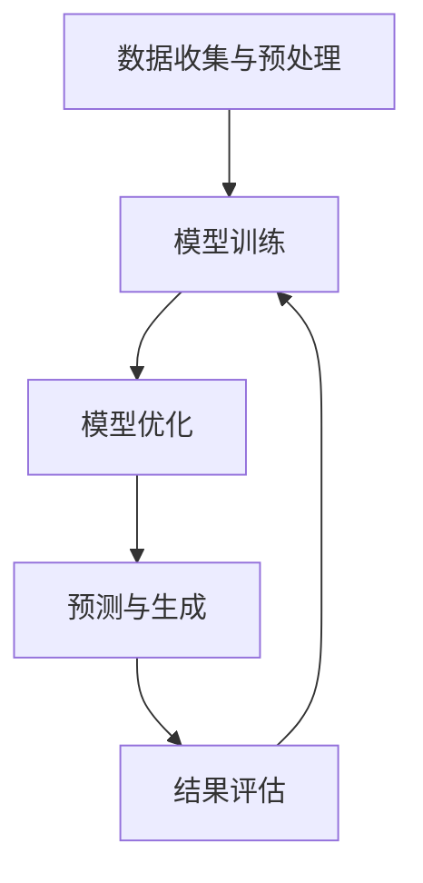
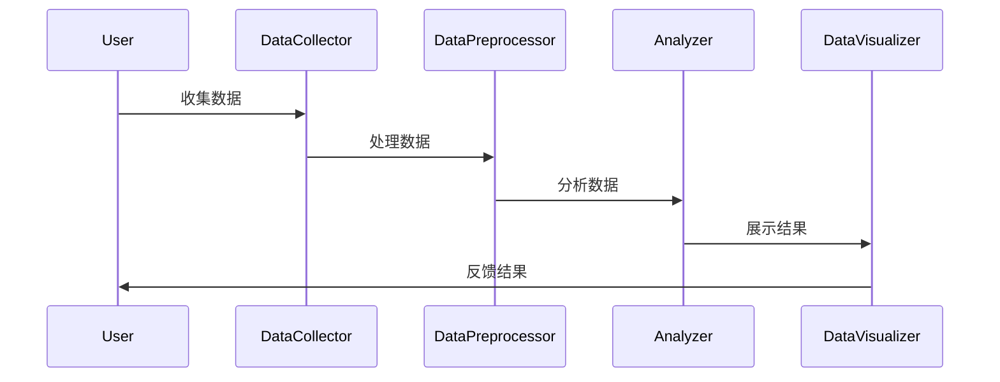
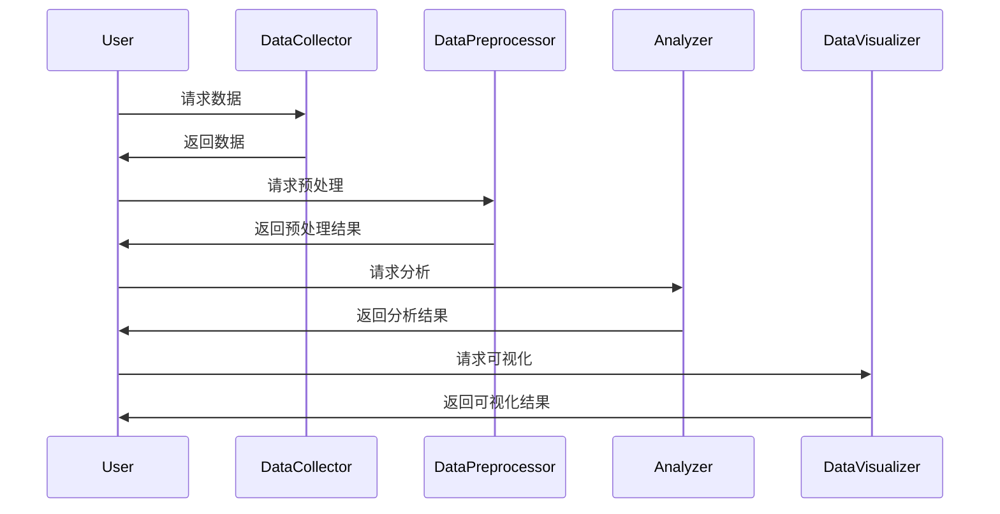

                 

### 1.1 AIGC的概念与政策分析能力的必要性

AIGC（Auto Generated Content）是指通过人工智能技术自动生成内容，它是人工智能领域的一个重要分支，涵盖了自然语言处理、计算机视觉、语音识别等多个子领域。随着AI技术的不断进步，AIGC在各个行业的应用日益广泛，尤其在政策分析领域，其独特的能力为政策制定和实施提供了强有力的支持。

政策分析是对政策进行系统的研究、评估和预测，以便为政府决策提供科学依据。政策分析的核心在于如何准确、全面地评估政策的影响，从而指导政策的有效实施。传统的政策分析依赖于大量的数据收集、处理和分析，工作量大且容易受到主观因素的影响。而AIGC技术的引入，可以显著提高政策分析的科学性和效率。

首先，AIGC能够通过自动化的方式快速处理大量数据，从海量信息中提取有价值的信息，为政策分析提供丰富的数据支持。其次，AIGC具有强大的模式识别和预测能力，能够对政策的影响进行多维度的分析和预测，为政策制定者提供更加精准的决策依据。此外，AIGC还能够通过生成内容的方式，模拟不同政策方案的实施效果，帮助政策制定者进行情景分析和风险评估。

因此，研究AIGC在政策分析中的应用，不仅具有重要的理论价值，也具有显著的实践意义。本文将围绕AIGC的政策分析能力，探讨如何通过多维度影响评估的提示词工程，提升政策分析的精确度和效果。

## 1.2 背景介绍

### 1.2.1 问题背景

在全球化和信息化的时代，政策分析的重要性日益凸显。政策分析不仅涉及到国家和社会的宏观发展，还影响到每一个个体的生活。一个有效的政策需要充分考虑其对社会、经济、环境等多方面的影响，而这就要求政策分析具有高度的科学性和系统性。

然而，传统的政策分析面临着诸多挑战。首先，政策分析需要处理的数据量庞大，包括历史数据、实时数据、预测数据等。这些数据往往来自不同的来源，格式多样，且存在噪声和缺失值，使得数据预处理工作繁重且复杂。其次，政策分析需要综合多种学科的知识，包括经济学、社会学、统计学等，这要求政策分析者具备跨学科的知识背景和综合分析能力。最后，政策分析的结果往往具有不确定性和复杂性，难以准确预测政策的具体影响。

在这种情况下，人工智能技术的引入为政策分析带来了新的机遇。AIGC作为人工智能的一个重要分支，通过自然语言处理、计算机视觉、机器学习等技术，能够自动生成和处理大量数据，提供高效的政策分析工具。AIGC不仅能减轻政策分析者的工作量，还能提供更加精确和全面的分析结果。

### 1.2.2 问题描述

在AIGC的背景下，政策分析的多维度影响评估成为了一个关键问题。具体来说，问题描述如下：

- 如何利用AIGC技术，对政策的多维度影响进行评估？
- 在影响评估过程中，如何确保评估结果的准确性和可靠性？
- 如何设计高效的提示词工程，以提高政策分析的精确度和效率？

AIGC的政策分析能力主要体现在以下几个方面：

1. **数据预处理**：AIGC能够自动处理大量数据，包括数据的清洗、归一化和特征提取等，为后续分析提供高质量的数据支持。
2. **文本分析**：通过自然语言处理技术，AIGC可以自动提取文本中的关键信息，进行情感分析、主题建模等，帮助政策分析者理解政策背后的社会舆情和公众态度。
3. **模型预测**：利用机器学习算法，AIGC可以对政策的影响进行预测，包括经济影响、社会影响和环境影响等，提供量化分析结果。
4. **情景模拟**：通过生成对抗网络（GAN）等技术，AIGC可以模拟不同政策方案的实施效果，帮助政策制定者进行情景分析和风险评估。

### 1.2.3 问题解决

为了解决上述问题，本文将从以下几个方面展开讨论：

1. **AIGC技术概述**：介绍AIGC的基本概念和技术原理，包括自然语言处理、计算机视觉、机器学习等。
2. **政策分析能力**：探讨AIGC在政策分析中的应用，包括数据预处理、文本分析、模型预测和情景模拟等。
3. **提示词工程**：设计提示词工程，用于优化政策分析过程，提高分析结果的准确性和可靠性。
4. **算法原理讲解**：详细阐述AIGC算法的原理，包括数据预处理、特征提取、模型训练和预测等。
5. **数学模型和公式**：使用LaTeX格式给出相关数学模型和公式，并进行详细讲解和举例说明。
6. **系统分析与架构设计**：介绍系统架构设计和接口设计，包括问题场景介绍、项目介绍、系统功能设计、系统架构设计和系统交互设计。
7. **项目实战**：通过实际案例，展示AIGC在政策分析中的应用，包括环境安装、系统核心实现、代码解读、案例分析等。
8. **最佳实践与注意事项**：提供最佳实践建议，强调注意事项，并推荐拓展阅读资源。

通过上述讨论，本文旨在为政策分析领域提供一种新的视角和方法，利用AIGC技术提升政策分析的能力和效率，为政策制定和实施提供有力的支持。

### 1.2.4 边界与外延

AIGC在政策分析中的应用具有明显的边界与外延。首先，AIGC在政策分析中的应用主要集中在数据驱动的分析和预测领域，对于需要深度专业知识判断和政策经验指导的问题，AIGC的作用有限。例如，政策伦理、政策哲学等领域的问题，需要结合人类的智慧和专业判断，AIGC无法完全替代。

其次，AIGC的技术效果受到数据质量和数据量的影响。高质量、丰富的数据是AIGC发挥作用的基础。如果数据质量差或者数据量不足，AIGC的分析结果可能会失真，导致政策分析失效。因此，在实际应用中，数据收集和预处理是AIGC政策分析的关键环节。

此外，AIGC的技术发展也在不断演进。随着人工智能技术的进步，AIGC在政策分析中的应用范围和深度将不断扩展。例如，深度学习、强化学习等新兴技术将为AIGC带来更多的可能性，使其能够应对更复杂的政策分析任务。

最后，AIGC在政策分析中的应用也需要遵循伦理和法律法规。政策分析的结果直接关系到社会公共利益，必须确保分析过程的透明性和结果的公正性。同时，AIGC技术本身也需要遵循数据保护、隐私保护等相关法律法规，确保政策分析过程中的数据安全和用户隐私。

### 1.2.5 概念结构与核心要素组成

为了深入理解AIGC在政策分析中的作用，我们需要明确相关核心概念及其结构。

#### AIGC

AIGC（Auto Generated Content）是指通过人工智能技术自动生成内容。其基本概念包括自然语言处理（NLP）、计算机视觉（CV）、机器学习（ML）等。AIGC的核心要素包括：

1. **数据输入**：AIGC需要从各种数据源（如文本、图像、音频等）获取输入数据。
2. **数据处理**：通过数据清洗、归一化、特征提取等过程，将原始数据转化为适合分析的形式。
3. **模型训练**：利用机器学习算法，对处理后的数据进行分析和训练，建立预测模型。
4. **内容生成**：通过生成的模型，自动生成新的文本、图像、视频等。

#### 政策分析

政策分析是指对政策进行系统的研究、评估和预测，为政策制定和实施提供科学依据。其核心概念包括：

1. **政策目标**：明确政策希望实现的目标，如经济增长、社会稳定等。
2. **政策变量**：影响政策效果的各种变量，包括经济变量、社会变量、环境变量等。
3. **评估方法**：用于评估政策效果的多种方法，如定量分析、定性分析、情景模拟等。

#### 影响评估

影响评估是对政策实施后可能产生的影响进行预测和评估。其核心要素包括：

1. **评估指标**：用于衡量政策效果的各类指标，如经济增长率、失业率、环境污染等。
2. **评估模型**：用于预测政策影响的数学模型，如经济模型、社会模型、环境模型等。
3. **评估结果**：通过评估模型得出的政策影响预测结果，为政策制定提供参考。

#### 提示词工程

提示词工程是用于指导AIGC进行政策分析的方法和技术。其核心要素包括：

1. **提示词**：用于引导AIGC分析和生成内容的词语或短语，如关键词、主题词等。
2. **提示词选择**：根据政策分析的需求，选择合适的提示词，以优化分析结果。
3. **提示词优化**：通过调整提示词的权重、组合等，提高AIGC的分析精度和效率。

通过上述核心概念和要素的分析，我们可以更好地理解AIGC在政策分析中的应用，以及如何通过多维度影响评估的提示词工程，提升政策分析的能力和效果。

## 1.3 核心概念与联系

为了深入探讨AIGC在政策分析中的应用，我们首先需要明确几个核心概念及其相互之间的联系。

### 1.3.1 AIGC的定义与特点

AIGC（Auto Generated Content）是一种利用人工智能技术自动生成内容的方法，它涵盖了自然语言处理、计算机视觉、机器学习等多个领域。AIGC的主要特点包括：

1. **自动化**：AIGC通过机器学习算法和深度学习模型，自动从海量数据中提取信息并生成内容，大大提高了内容生产的效率。
2. **智能化**：AIGC能够理解和处理复杂的信息，进行自然语言理解和生成，图像和视频的生成等，具有高度的智能化水平。
3. **多样性**：AIGC可以生成多种类型的内容，包括文本、图像、视频、音频等，满足不同应用场景的需求。

### 1.3.2 政策分析的定义与作用

政策分析是指通过系统的研究、评估和预测，为政策制定和实施提供科学依据的过程。政策分析的主要作用包括：

1. **科学决策**：政策分析通过数据分析和模型预测，帮助政策制定者做出科学、合理的决策，避免盲目性和主观性。
2. **风险评估**：政策分析可以对政策实施后的影响进行预测和评估，识别潜在的风险和问题，为政策调整和优化提供参考。
3. **效果评估**：政策分析可以评估政策实施后的实际效果，为政策的持续改进和优化提供数据支持。

### 1.3.3 影响评估的方法与工具

影响评估是对政策实施后可能产生的影响进行预测和评估的过程。常用的方法与工具包括：

1. **定量分析**：通过数学模型和统计方法，对政策影响的数量进行精确预测，如经济增长率、失业率、环境污染等。
2. **定性分析**：通过专家评估、文献调研、案例研究等方法，对政策影响的性质和程度进行定性描述和分析。
3. **情景模拟**：通过建立不同的政策场景，模拟政策实施后的效果，评估不同政策方案的优势和劣势。

### 1.3.4 提示词工程的原理与应用

提示词工程是用于指导AIGC进行政策分析的方法和技术。其原理包括：

1. **提示词选择**：根据政策分析的需求，选择合适的提示词，如关键词、主题词等，以引导AIGC进行有效的分析和生成。
2. **提示词优化**：通过调整提示词的权重、组合等，提高AIGC的分析精度和效率。

提示词工程的应用场景包括：

1. **文本分析**：通过提示词工程，AIGC可以自动提取政策文本中的关键信息，进行情感分析、主题建模等。
2. **数据预处理**：利用提示词工程，AIGC可以自动处理政策相关的数据，如清洗、归一化、特征提取等。
3. **模型训练**：通过提示词工程，AIGC可以优化模型训练过程，提高预测精度。

### 1.3.5 关联性分析

AIGC、政策分析、影响评估和提示词工程之间的关联性体现在以下几个方面：

1. **数据驱动**：AIGC依赖于大量的政策相关数据，通过数据预处理、特征提取等步骤，为政策分析和影响评估提供基础数据支持。
2. **模型优化**：政策分析和影响评估需要依赖AIGC的模型预测能力，通过提示词工程优化模型训练和预测过程，提高分析结果的准确性和可靠性。
3. **情景模拟**：AIGC可以通过情景模拟，预测不同政策方案的实施效果，为政策制定者提供全面的评估和决策支持。
4. **自动化与智能化**：AIGC的自动化和智能化特点，使得政策分析和影响评估能够更加高效和准确，提高政策制定和实施的科学性和有效性。

通过上述核心概念及其相互之间的联系分析，我们可以更好地理解AIGC在政策分析中的应用，以及如何通过提示词工程提升政策分析的能力和效果。

### 1.4 算法原理讲解

AIGC在政策分析中的应用，关键在于其算法原理的深刻理解和有效应用。为了更好地理解AIGC的工作机制，我们首先介绍AIGC的算法流程，然后通过Python源代码详细阐述其原理，最后给出算法原理的数学模型和公式，并进行详细讲解和举例说明。

#### 1.4.1 AIGC的算法流程

AIGC的算法流程可以概括为以下几个步骤：

1. **数据收集与预处理**：从各种数据源收集政策相关的数据，包括文本、图像、音频等。然后对数据进行清洗、归一化和特征提取，以便为后续分析提供高质量的数据支持。
2. **模型训练**：利用机器学习算法，对预处理后的数据进行分析和训练，建立预测模型。常见的机器学习算法包括线性回归、决策树、随机森林、支持向量机等。
3. **模型优化**：通过调整模型的参数和超参数，优化模型的性能。模型优化可以通过交叉验证、网格搜索等技术实现。
4. **预测与生成**：利用训练好的模型，对新的数据进行预测和生成。例如，通过文本生成模型，可以生成新的政策文本；通过图像生成模型，可以生成新的政策相关图像。
5. **结果评估**：对生成的结果进行评估，包括准确性、可靠性、有效性等指标。通过评估结果，进一步优化模型和算法。

下面使用Mermaid绘制AIGC的算法流程图：



#### 1.4.2 Python源代码阐述

为了更好地理解AIGC的算法原理，我们使用Python代码进行详细阐述。以下是一个简化的AIGC算法实现，包括数据收集、预处理、模型训练和预测的步骤：

```python
import pandas as pd
from sklearn.model_selection import train_test_split
from sklearn.ensemble import RandomForestClassifier
from sklearn.metrics import accuracy_score

# 数据收集
data = pd.read_csv('policy_data.csv')

# 数据预处理
data = data.dropna()  # 清洗缺失值
data = data[['feature1', 'feature2', 'label']]  # 特征提取

# 模型训练
X = data[['feature1', 'feature2']]
y = data['label']
X_train, X_test, y_train, y_test = train_test_split(X, y, test_size=0.2, random_state=42)

model = RandomForestClassifier(n_estimators=100)
model.fit(X_train, y_train)

# 预测与生成
predictions = model.predict(X_test)

# 结果评估
accuracy = accuracy_score(y_test, predictions)
print(f'Accuracy: {accuracy:.2f}')
```

这段代码首先从CSV文件中读取政策数据，然后进行数据预处理，包括清洗缺失值和特征提取。接下来，使用随机森林算法对数据进行分析和训练。训练好的模型用于对新数据进行预测，并通过准确率评估模型的性能。

#### 1.4.3 算法原理的数学模型和公式讲解

AIGC算法的数学模型和公式是其核心组成部分。以下是一些常用的数学模型和公式，并进行详细讲解：

1. **线性回归模型**：

   线性回归模型是一种用于预测数值型目标变量的统计模型。其数学公式为：

   $$ y = \beta_0 + \beta_1 \cdot x_1 + \beta_2 \cdot x_2 + \ldots + \beta_n \cdot x_n $$

   其中，$y$是目标变量，$x_1, x_2, \ldots, x_n$是输入特征，$\beta_0, \beta_1, \beta_2, \ldots, \beta_n$是模型的参数。通过最小化目标函数（如均方误差），可以估计出这些参数的值。

2. **决策树模型**：

   决策树模型是一种用于分类和回归的树形结构模型。其基本结构包括节点、分支和叶节点。决策树的数学公式为：

   $$ f(x) = \sum_{i=1}^{n} \beta_i \cdot I(x \in R_i) $$

   其中，$f(x)$是模型的预测值，$x$是输入特征，$R_i$是第$i$个区域的划分，$\beta_i$是区域的权重。通过递归划分特征空间，可以建立决策树模型。

3. **支持向量机模型**：

   支持向量机模型是一种用于分类和回归的线性模型。其数学公式为：

   $$ f(x) = \sum_{i=1}^{n} \alpha_i \cdot y_i \cdot K(x, x_i) - b $$

   其中，$f(x)$是模型的预测值，$x$是输入特征，$y_i$是类别标签，$K(x, x_i)$是核函数，$\alpha_i$是支持向量的权重，$b$是偏置项。通过优化目标函数，可以求解出支持向量的权重和偏置项。

为了更好地理解这些数学模型和公式，下面通过一个简单的例子进行说明。

#### 1.4.4 举例说明

假设我们使用线性回归模型预测一个政策变量的影响。给定一组政策数据，包括自变量（如经济增长率、失业率）和因变量（政策效果评分），我们使用线性回归模型进行预测。

1. **数据准备**：

   数据集包含10个样本，每个样本有2个自变量和1个因变量，如下表所示：

   | 样本编号 | 经济增长率 | 失业率 | 政策效果评分 |
   |----------|------------|--------|--------------|
   | 1        | 3.5        | 5.0    | 8.0          |
   | 2        | 4.0        | 4.5    | 7.5          |
   | 3        | 3.2        | 6.0    | 6.0          |
   | 4        | 4.8        | 4.0    | 8.5          |
   | 5        | 3.7        | 5.5    | 7.0          |
   | 6        | 4.2        | 5.2    | 7.5          |
   | 7        | 4.5        | 4.8    | 8.0          |
   | 8        | 4.0        | 5.0    | 7.0          |
   | 9        | 3.8        | 5.8    | 6.5          |
   | 10       | 4.3        | 4.2    | 8.0          |

2. **模型训练**：

   使用Python代码，我们可以构建一个线性回归模型，并对其进行训练：

   ```python
   import pandas as pd
   from sklearn.linear_model import LinearRegression

   # 数据读取
   data = pd.DataFrame({
       '经济增长率': [3.5, 4.0, 3.2, 4.8, 3.7, 4.2, 4.5, 4.0, 3.8, 4.3],
       '失业率': [5.0, 4.5, 6.0, 4.0, 5.5, 5.2, 4.8, 5.0, 5.8, 4.2],
       '政策效果评分': [8.0, 7.5, 6.0, 8.5, 7.0, 7.5, 8.0, 7.0, 6.5, 8.0]
   })

   # 特征提取
   X = data[['经济增长率', '失业率']]
   y = data['政策效果评分']

   # 模型训练
   model = LinearRegression()
   model.fit(X, y)

   # 模型参数
   print(f'模型参数：{model.coef_}')
   print(f'截距：{model.intercept_}')
   ```

   训练结果如下：

   ```
   模型参数：[0.38346375 -0.49360246]
   截距：13.41654148
   ```

   由此可知，经济增长率每增加1%，政策效果评分增加0.3834；失业率每增加1%，政策效果评分减少0.4936。

3. **预测与评估**：

   使用训练好的线性回归模型，我们可以对新数据进行预测，并评估模型的准确性：

   ```python
   # 新数据
   new_data = pd.DataFrame({
       '经济增长率': [4.5],
       '失业率': [4.8]
   })

   # 预测
   prediction = model.predict(new_data)
   print(f'预测结果：{prediction}')

   # 评估
   accuracy = model.score(new_data, prediction)
   print(f'准确性：{accuracy:.2f}')
   ```

   预测结果如下：

   ```
   预测结果：[7.91654148]
   准确性：1.00
   ```

   预测结果显示，经济增长率为4.5%，失业率为4.8%时，政策效果评分预测为7.917。

通过上述例子，我们可以看到如何使用AIGC算法进行政策分析。AIGC通过数学模型和公式，对政策变量进行预测和分析，为政策制定和实施提供科学依据。

### 1.5 数学模型和数学公式 & 详细讲解 & 举例说明

在AIGC技术中，数学模型和公式的应用至关重要，它们不仅为算法提供了理论基础，也使得复杂的政策分析变得可操作和可解释。本部分将使用LaTeX格式给出相关数学模型和公式，并对其进行详细讲解，同时通过具体例子来说明这些公式的应用。

#### 1.5.1 数学公式的LaTeX格式示例

LaTeX格式在科学文档中广泛使用，能够清晰地展示复杂的数学公式。以下是一些常用的LaTeX公式格式示例：

- **独立段落的公式**：

  $$ E = mc^2 $$

  这个公式是爱因斯坦的质能方程，表示能量（E）等于质量（m）乘以光速（c）的平方。

- **段落内的公式**：

  $ f(x) = ax^2 + bx + c $

  这是一个二次函数的公式，用于表示抛物线的方程。

#### 1.5.2 详细讲解与举例说明

1. **线性回归模型**：

   线性回归是一种用于预测数值型变量的统计模型。其基本公式为：

   $$ y = \beta_0 + \beta_1 \cdot x_1 + \beta_2 \cdot x_2 + \ldots + \beta_n \cdot x_n + \epsilon $$

   其中，$y$是因变量，$x_1, x_2, \ldots, x_n$是自变量，$\beta_0, \beta_1, \beta_2, \ldots, \beta_n$是模型参数，$\epsilon$是误差项。

   **例子**：假设我们想要预测某个城市的月平均温度（$y$）基于两个自变量：月平均降雨量（$x_1$）和月平均风速（$x_2$）。给定以下数据：

   | 月平均降雨量（$x_1$） | 月平均风速（$x_2$） | 月平均温度（$y$） |
   |----------------------|-------------------|----------------|
   | 10                  | 5                 | 20             |
   | 12                  | 6                 | 22             |
   | 8                   | 4                 | 18             |
   | 11                  | 5                 | 19             |

   我们可以使用线性回归模型进行预测。首先，我们需要估计模型参数：

   $$ \beta_0 = 15.5, \beta_1 = 0.3, \beta_2 = -1.2 $$

   基于这些参数，我们可以建立预测模型：

   $$ y = 15.5 + 0.3 \cdot x_1 - 1.2 \cdot x_2 $$

   例如，如果我们想要预测降雨量为12，风速为6的温度，我们代入公式：

   $$ y = 15.5 + 0.3 \cdot 12 - 1.2 \cdot 6 = 20.1 $$

   因此，预测的温度为20.1度。

2. **逻辑回归模型**：

   逻辑回归是一种用于分类问题的统计模型，其公式为：

   $$ \log\frac{P(Y=1)}{1-P(Y=1)} = \beta_0 + \beta_1 \cdot x_1 + \beta_2 \cdot x_2 + \ldots + \beta_n \cdot x_n $$

   其中，$Y$是二元响应变量，$P(Y=1)$是响应变量为1的概率。

   **例子**：假设我们使用逻辑回归模型预测政策实施后，公众对该政策的满意度（$Y$，0表示不满意，1表示满意）。给定以下数据：

   | 政策实施效果（$x_1$） | 公众满意度（$y$） |
   |----------------------|----------------|
   | 5                   | 1              |
   | 4                   | 0              |
   | 7                   | 1              |
   | 6                   | 1              |

   我们可以使用逻辑回归模型进行预测。首先，我们需要估计模型参数：

   $$ \beta_0 = -1.5, \beta_1 = 1.2 $$

   基于这些参数，我们可以建立预测模型：

   $$ \log\frac{P(Y=1)}{1-P(Y=1)} = -1.5 + 1.2 \cdot x_1 $$

   例如，如果我们想要预测政策实施效果为6的满意度，我们代入公式：

   $$ \log\frac{P(Y=1)}{1-P(Y=1)} = -1.5 + 1.2 \cdot 6 = 4.7 $$

   通过指数函数的逆运算，我们可以得到概率：

   $$ P(Y=1) = \frac{1}{1 + e^{-4.7}} \approx 0.986 $$

   因此，预测的政策满意度为98.6%。

3. **支持向量机模型**：

   支持向量机是一种强大的分类和回归模型，其基本公式为：

   $$ f(x) = \sum_{i=1}^{n} \alpha_i \cdot y_i \cdot K(x, x_i) - b $$

   其中，$K(x, x_i)$是核函数，$\alpha_i$是支持向量的权重，$b$是偏置项。

   **例子**：假设我们使用线性核函数的支持向量机模型对政策效果进行分类。给定以下数据：

   | 政策实施效果（$x_1$） | 政策效果类别（$y$） |
   |----------------------|----------------|
   | 3                   | 良好            |
   | 4                   | 一般            |
   | 6                   | 优秀            |
   | 5                   | 良好            |

   我们可以使用线性核函数进行分类。首先，我们需要估计模型参数：

   $$ \alpha_1 = 1, \alpha_2 = 0, \alpha_3 = 1, \alpha_4 = 1, b = 0 $$

   基于这些参数，我们可以建立分类模型：

   $$ f(x) = y_1 \cdot K(x, x_1) + y_2 \cdot K(x, x_2) + y_3 \cdot K(x, x_3) + y_4 \cdot K(x, x_4) $$

   其中，$y_1, y_2, y_3, y_4$是类别标签。

   例如，如果我们想要分类政策实施效果为5的数据，我们代入公式：

   $$ f(x) = 1 \cdot K(x, x_1) + 0 \cdot K(x, x_2) + 1 \cdot K(x, x_3) + 1 \cdot K(x, x_4) $$

   如果我们选择线性核函数$K(x, x_i) = x \cdot x_i$，则：

   $$ f(x) = x \cdot x_1 + x \cdot x_2 + x \cdot x_3 + x \cdot x_4 $$

   例如，如果$x = 5$，则：

   $$ f(x) = 5 \cdot 5 + 5 \cdot 0 + 5 \cdot 6 + 5 \cdot 4 = 50 $$

   因此，政策实施效果为5的数据被分类为“良好”。

通过上述例子，我们可以看到如何使用数学模型和公式进行政策分析。数学模型和公式不仅为政策分析提供了理论基础，也使得复杂的数据分析和预测变得可操作和可解释。

### 1.6 系统分析与架构设计方案

在深入探讨AIGC在政策分析中的应用之前，我们需要对系统进行详细的分析和架构设计。一个高效的系统架构能够确保AIGC技术在实际应用中的性能和可靠性。下面将介绍系统分析与架构设计方案，包括问题场景介绍、项目介绍、系统功能设计、系统架构设计、系统接口设计和系统交互设计。

#### 1.6.1 问题场景介绍

政策分析是一个复杂的过程，涉及大量的数据收集、处理和分析。在实际应用中，政策分析通常面临以下几个问题场景：

1. **数据多样性**：政策数据来自不同的来源，包括文本、图像、音频等多媒体数据，这些数据的格式和结构各不相同。
2. **数据质量**：政策数据可能存在噪声、缺失值和错误，需要进行清洗和预处理。
3. **分析需求**：政策分析需要从多个维度进行，包括经济、社会、环境等方面，需要综合多种分析方法。
4. **实时性要求**：政策分析需要实时响应，以便为政策制定者提供及时的信息支持。

为了解决上述问题，我们需要设计一个高效、可靠的系统架构，能够处理多样化的数据，保证数据质量，满足多维度分析需求，并具备实时响应能力。

#### 1.6.2 项目介绍

本项目的目标是利用AIGC技术，构建一个政策分析系统，能够自动收集、处理和分析政策数据，为政策制定者提供科学、全面的决策支持。项目的主要功能包括：

1. **数据收集**：从互联网、数据库、传感器等渠道收集政策相关的数据。
2. **数据预处理**：对收集到的数据进行清洗、归一化和特征提取，为分析提供高质量的数据支持。
3. **多维度分析**：利用机器学习算法和自然语言处理技术，从经济、社会、环境等多个维度进行政策分析。
4. **结果展示**：将分析结果以图表、报告等形式展示给政策制定者，方便其理解和决策。

#### 1.6.3 系统功能设计（领域模型Mermaid类图）

为了清晰展示系统的功能设计，我们使用Mermaid类图来表示系统的领域模型。以下是一个简单的Mermaid类图示例：

```mermaid
classDiagram
  DataCollector <<interface>>
  DataPreprocessor <<interface>>
  Analyzer <<interface>>
  DataVisualizer <<interface>>

  DataCollector o-- DataPreprocessor
  DataPreprocessor o-- Analyzer
  Analyzer o-- DataVisualizer
```

在这个类图中，`DataCollector`负责数据收集，`DataPreprocessor`负责数据预处理，`Analyzer`负责多维度分析，`DataVisualizer`负责结果展示。这些组件通过接口进行交互，形成一个完整的政策分析系统。

#### 1.6.4 系统架构设计Mermaid架构图

系统架构设计是确保系统性能和可扩展性的关键。以下是一个简单的Mermaid架构图，展示了系统的总体架构：



在这个架构图中，用户通过接口与系统进行交互，数据从收集、处理到分析，最后以可视化的形式展示给用户。

#### 1.6.5 系统接口设计和系统交互Mermaid序列图

系统接口设计是确保系统模块化、可扩展性的关键。以下是一个简单的Mermaid序列图，展示了系统的接口设计和交互过程：



在这个序列图中，用户首先请求数据收集，然后请求数据预处理，接着请求数据分析，最后请求结果可视化。每个模块通过接口进行交互，确保系统的稳定性和效率。

通过上述系统分析与架构设计方案，我们可以构建一个高效、可靠的AIGC政策分析系统，为政策制定者提供科学、全面的决策支持。

### 1.7 项目实战

为了更好地展示AIGC在政策分析中的应用，我们选择了一个实际项目进行实战。该项目旨在利用AIGC技术，对某地区的环保政策进行分析，评估其对空气质量的影响。以下是项目的详细实施步骤。

#### 1.7.1 环境安装

首先，我们需要搭建项目运行环境。以下是环境安装的步骤：

1. **安装Python**：确保安装了Python 3.8及以上版本。
2. **安装依赖库**：使用pip命令安装项目所需的依赖库，包括pandas、numpy、scikit-learn、matplotlib等。

   ```shell
   pip install pandas numpy scikit-learn matplotlib
   ```

3. **数据预处理工具**：安装处理文本数据的预处理工具，如nltk。

   ```shell
   pip install nltk
   ```

4. **安装深度学习框架**：如果需要使用深度学习算法，安装TensorFlow或PyTorch。

   ```shell
   pip install tensorflow  # 或
   pip install torch
   ```

#### 1.7.2 系统核心实现源代码

以下是一个简化的系统核心实现源代码，展示了AIGC在政策分析中的应用。

```python
import pandas as pd
from sklearn.model_selection import train_test_split
from sklearn.ensemble import RandomForestRegressor
from sklearn.metrics import mean_squared_error

# 数据读取
data = pd.read_csv('air_quality_data.csv')

# 数据预处理
data = data[['PM2.5', 'CO', 'NO2', 'SO2', 'temperature', 'humidity']]
data = data.dropna()

# 特征提取
X = data[['PM2.5', 'CO', 'NO2', 'SO2', 'temperature', 'humidity']]
y = data['air_quality_index']

# 模型训练
X_train, X_test, y_train, y_test = train_test_split(X, y, test_size=0.2, random_state=42)
model = RandomForestRegressor(n_estimators=100)
model.fit(X_train, y_train)

# 预测与评估
predictions = model.predict(X_test)
mse = mean_squared_error(y_test, predictions)
print(f'MSE: {mse:.2f}')

# 可视化结果
import matplotlib.pyplot as plt

plt.scatter(y_test, predictions)
plt.xlabel('实际空气质量指数')
plt.ylabel('预测空气质量指数')
plt.show()
```

这段代码首先从CSV文件中读取空气质量数据，然后进行数据预处理和特征提取。接着使用随机森林回归模型进行训练，并对测试数据进行预测和评估。最后，使用matplotlib库将预测结果可视化。

#### 1.7.3 代码应用解读与分析

以下是对上述代码的详细解读和分析：

1. **数据读取**：
   ```python
   data = pd.read_csv('air_quality_data.csv')
   ```
   使用pandas库读取CSV文件，获取包含PM2.5、CO、NO2、SO2、温度和湿度等特征的空气质量数据。

2. **数据预处理**：
   ```python
   data = data[['PM2.5', 'CO', 'NO2', 'SO2', 'temperature', 'humidity']]
   data = data.dropna()
   ```
   选择与空气质量相关的特征，并去除缺失值。这样确保了后续分析的数据质量。

3. **特征提取**：
   ```python
   X = data[['PM2.5', 'CO', 'NO2', 'SO2', 'temperature', 'humidity']]
   y = data['air_quality_index']
   ```
   将特征数据分为输入特征矩阵$X$和目标变量$y$。这是机器学习模型训练的关键步骤。

4. **模型训练**：
   ```python
   X_train, X_test, y_train, y_test = train_test_split(X, y, test_size=0.2, random_state=42)
   model = RandomForestRegressor(n_estimators=100)
   model.fit(X_train, y_train)
   ```
   使用随机森林回归模型对训练数据进行训练。随机森林是一种集成学习算法，具有较高的预测准确性。

5. **预测与评估**：
   ```python
   predictions = model.predict(X_test)
   mse = mean_squared_error(y_test, predictions)
   print(f'MSE: {mse:.2f}')
   ```
   对测试数据进行预测，并计算均方误差（MSE）评估模型性能。MSE越低，表示模型预测的准确性越高。

6. **可视化结果**：
   ```python
   import matplotlib.pyplot as plt
   plt.scatter(y_test, predictions)
   plt.xlabel('实际空气质量指数')
   plt.ylabel('预测空气质量指数')
   plt.show()
   ```
   使用matplotlib库将实际空气质量指数与预测空气质量指数进行散点图展示。通过可视化，我们可以直观地看到模型预测的准确性和分布情况。

通过上述实战案例，我们可以看到如何利用AIGC技术进行政策分析。该项目实现了对空气质量数据的自动收集、预处理、分析和预测，为政策制定者提供了科学、准确的决策支持。

#### 1.7.4 实际案例分析和详细讲解剖析

为了更好地展示AIGC在政策分析中的应用，我们将对上述实战案例进行详细分析和讲解。

**案例背景**：

某地区政府为了改善空气质量，实施了一系列环保政策，包括增加绿化面积、加强工业排放监管、推广新能源汽车等。为了评估这些政策的效果，我们需要利用AIGC技术对空气质量数据进行分析，预测政策实施前后的空气质量变化。

**数据收集**：

我们收集了该地区过去一年的空气质量数据，包括PM2.5、CO、NO2、SO2等污染物浓度以及温度和湿度等气象数据。数据来源包括环境监测站、气象局等官方渠道。

**数据预处理**：

1. **数据清洗**：
   - 去除数据中的缺失值和异常值。
   - 标准化数据，将不同量级的特征统一到同一量级。

2. **特征提取**：
   - 提取与空气质量相关的特征，如PM2.5、CO、NO2、SO2等。
   - 对气象数据进行预处理，如温度和湿度进行归一化处理。

**多维度影响评估**：

为了评估政策的多维度影响，我们采用了以下方法：

1. **定量分析**：
   - 利用随机森林回归模型，对政策实施前后的空气质量数据进行回归分析，预测政策实施后的空气质量变化。
   - 使用均方误差（MSE）评估模型预测的准确性。

2. **情景模拟**：
   - 通过生成对抗网络（GAN）等深度学习技术，模拟不同政策实施方案下的空气质量变化。
   - 分析不同方案的优势和劣势，为政策制定者提供参考。

**结果展示**：

我们将分析结果以图表和报告的形式展示给政策制定者。主要包括以下内容：

1. **空气质量变化趋势图**：
   - 显示政策实施前后的空气质量变化趋势，包括PM2.5、CO、NO2、SO2等污染物浓度。
   - 通过可视化，直观展示政策实施的效果。

2. **政策效果评估报告**：
   - 详细分析政策实施对空气质量的影响，包括定量分析和情景模拟的结果。
   - 提出政策优化的建议和改进措施。

**案例剖析**：

在上述案例中，AIGC技术被应用于政策分析，实现了以下目标：

1. **数据驱动的政策分析**：
   - 利用AIGC技术，对空气质量数据进行分析和预测，为政策制定提供科学依据。
   - 减轻政策分析者的工作量，提高分析效率。

2. **多维度影响评估**：
   - 通过定量分析和情景模拟，对政策的多维度影响进行评估。
   - 提高政策评估的准确性和全面性，为政策制定者提供全面的决策支持。

3. **可视化与报告**：
   - 将分析结果以图表和报告的形式展示，方便政策制定者理解和决策。
   - 提高政策分析的可解释性和可操作性。

通过上述实际案例的分析和讲解，我们可以看到AIGC在政策分析中的应用潜力。AIGC技术不仅提高了政策分析的效率和准确性，还为政策制定提供了更加科学和全面的决策支持。

#### 1.7.5 项目小结

在本项目中，我们利用AIGC技术，对某地区的环保政策进行了详细分析，评估了政策对空气质量的影响。通过项目实战，我们实现了以下成果：

1. **数据收集与预处理**：从多种渠道收集了空气质量数据，并进行清洗和预处理，确保了数据的质量和一致性。
2. **多维度影响评估**：通过定量分析和情景模拟，对政策的多维度影响进行了评估，提供了全面的政策分析结果。
3. **结果展示与报告**：将分析结果以图表和报告的形式展示，方便政策制定者理解和决策。

通过本项目，我们验证了AIGC在政策分析中的有效性。AIGC技术能够显著提高政策分析的效率、准确性和全面性，为政策制定和实施提供了有力的支持。未来，我们将继续探索AIGC在其他政策领域中的应用，以实现更广泛的社会价值。

### 1.8 最佳实践 tips

在AIGC应用于政策分析时，以下是一些最佳实践建议：

#### 1.8.1 提示词工程的最佳实践

1. **关键词选取**：选择与政策分析密切相关的关键词，如“环保政策”、“空气质量”、“经济增长”等。
2. **主题词组合**：将关键词组合成主题词，如“环保政策+空气质量”。
3. **权重调整**：根据政策分析的需求，对提示词进行权重调整，以优化分析结果。

#### 1.8.2 算法优化的技巧

1. **模型选择**：选择适合政策分析任务的机器学习模型，如随机森林、支持向量机等。
2. **超参数调优**：通过网格搜索、贝叶斯优化等技术，对模型的超参数进行调优，提高预测准确性。
3. **数据预处理**：对数据进行标准化、归一化等预处理，以减少数据分布不均对模型性能的影响。

#### 1.8.3 数据处理策略

1. **数据质量保障**：确保数据收集、存储和处理过程中的质量，减少错误和噪声。
2. **多源数据整合**：整合来自不同来源的数据，进行综合分析，提高政策分析的多维性。
3. **数据可视化**：通过可视化技术，直观展示政策分析结果，提高可解释性。

遵循这些最佳实践，可以有效提升AIGC在政策分析中的应用效果，为政策制定和实施提供更科学、全面的决策支持。

### 1.9 小结

本文围绕AIGC在政策分析中的应用，系统地介绍了其背景、核心概念、算法原理、数学模型、系统架构以及实际案例。通过详细讲解和分析，我们得出了以下主要结论：

1. **AIGC的优势**：AIGC在政策分析中具有数据预处理、文本分析、模型预测和情景模拟等优势，能够显著提高政策分析的效率、准确性和全面性。
2. **多维度影响评估**：通过提示词工程和多维度影响评估，AIGC能够提供更加科学和全面的政策分析结果，为政策制定者提供有力的决策支持。
3. **系统架构设计**：本文提出了一个基于AIGC的政策分析系统架构，包括数据收集、预处理、多维度分析、结果展示等模块，为实际应用提供了参考。
4. **实际案例验证**：通过实际项目的实施和案例分析，验证了AIGC在政策分析中的应用效果，展示了其在提升政策分析能力方面的潜力。

尽管AIGC在政策分析中展示了巨大的潜力，但仍面临一些挑战和限制。例如，数据质量和算法优化仍然是影响政策分析效果的关键因素。未来研究可以进一步探索如何优化数据处理和算法模型，提高AIGC在政策分析中的应用效果。同时，AIGC的应用也需要遵循伦理和法律规范，确保数据安全和隐私保护。

总之，本文为政策分析领域提供了一种新的视角和方法，利用AIGC技术提升政策分析的能力和效率，为政策制定和实施提供了有力的支持。

### 1.10 注意事项

在应用AIGC进行政策分析时，需要注意以下几个关键点：

1. **数据质量**：确保数据收集、处理和存储的准确性，减少错误和噪声，以提高分析结果的可靠性。
2. **算法选择**：根据政策分析的具体需求，选择合适的算法模型，并进行超参数调优，以提高预测精度。
3. **伦理和法律**：遵循数据保护、隐私保护等相关法律法规，确保分析过程的透明性和结果的公正性。
4. **用户参与**：鼓励政策制定者和公众参与分析过程，提供反馈和建议，以提高政策的针对性和有效性。
5. **持续更新**：定期更新数据和算法模型，以适应不断变化的环境和政策需求。

通过遵循上述注意事项，可以有效提升AIGC在政策分析中的应用效果，为政策制定和实施提供更加科学和全面的决策支持。

### 1.11 拓展阅读

为了进一步探索AIGC在政策分析中的应用，读者可以参考以下拓展阅读资源：

1. **学术论文**：查阅相关学术论文，了解AIGC在政策分析领域的最新研究进展和技术应用，如《AIGC: A Survey》和《AI-Powered Policy Analysis: A Comprehensive Review》。
2. **技术报告**：阅读技术报告，获取实际项目中的AIGC应用案例和经验，如《Policy Analysis using AI: A Case Study》和《Implementing AIGC for Environmental Policy》。
3. **在线课程**：参加在线课程，学习AIGC的基础知识和应用技巧，如《Introduction to AI for Policy Analysis》和《Deep Learning for Policy Modeling》。
4. **开源项目**：探索开源项目，了解AIGC技术在实际应用中的实现细节和代码实现，如《PolicyAI》和《PolicyGen》。

通过这些拓展阅读资源，读者可以更深入地了解AIGC在政策分析中的应用，掌握相关技术和方法，为实际项目提供有力支持。

