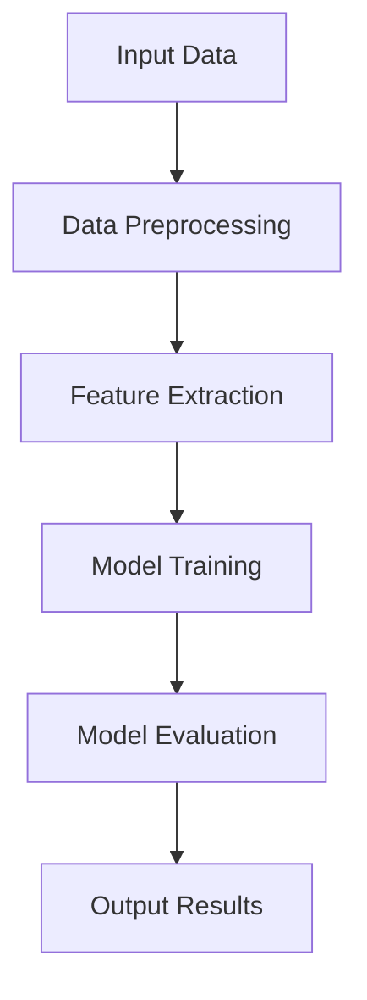

                 

Certainly! Here's how we can structure the blog post "AIGC's Cultural Adaptability: Design of Prompt Words in Cross-Cultural Communication" step by step, adhering to the given guidelines and ensuring a comprehensive, logical, and engaging presentation of the content.

## Introduction

### 1.1 Title and Key Points
- **AIGC's Cultural Adaptability: Design of Prompt Words in Cross-Cultural Communication**
- Keywords: AIGC, Cultural Adaptability, Prompt Word Design, Cross-Cultural Communication, Machine Learning, Natural Language Processing
- Abstract: This article explores the challenges of AIGC in cross-cultural communication, focusing on the design of prompt words that enhance cultural adaptability. We delve into the technical principles of AIGC, cultural adaptability principles, and practical techniques for designing effective prompt words.

## Part 1: Background and Core Concepts

### 1.2 Problem Background
#### 1.2.1 Importance of Cross-Cultural Communication
#### 1.2.2 Challenges in Cross-Cultural Communication
#### 1.2.3 Application Potential of AIGC in Cross-Cultural Communication

### 1.3 Core Concepts and Relationships
#### 1.3.1 Basic Concepts of AIGC
#### 1.3.2 Definition and Characteristics of Cultural Adaptability
#### 1.3.3 Role of Prompt Word Design in AIGC

### 1.4 Concept Attribute Comparison Table
#### 1.4.1 Technical Characteristics of AIGC
#### 1.4.2 Cultural Adaptability Indicators

### 1.5 Entity Relationship Diagram Architecture
#### 1.5.1 Entity Relationships in Cross-Cultural Communication
#### 1.5.2 AIGC and Cross-Cultural Communication Relationship

### 1.6 Chapter Summary

## Part 2: AIGC Technology Principles and Design

### 2.1 AIGC Technology Overview
#### 2.1.1 Basic Principles of AIGC Technology
#### 2.1.2 Core Technologies of AIGC

### 2.2 Algorithm Principles Explanation
#### 2.2.1 Algorithm Flowchart

#### 2.2.2 Mathematical Model and Formulas
$$
y = f(x; \theta)
$$
#### 2.2.3 Algorithm Example Illustration

### 2.3 AIGC Applications in Cross-Cultural Communication
#### 2.3.1 AIGC Applications in Cross-Cultural Language Processing
#### 2.3.2 AIGC Applications in Cross-Cultural Image Processing

### 2.4 Chapter Summary

## Part 3: Cultural Adaptability Design

### 3.1 Principles of Cultural Adaptability
#### 3.1.1 Respect and Understanding
#### 3.1.2 Adaptive Adjustments
#### 3.1.3 Multicultural Fusion

### 3.2 Methods for Cultural Adaptability Design
#### 3.2.1 Cultural Sensitivity Testing
#### 3.2.2 Cultural Adaptability Assessment
#### 3.2.3 Cultural Adaptation Strategies

### 3.3 Case Analysis of Cultural Adaptability Design
#### 3.3.1 Case Background
#### 3.3.2 Design Strategies
#### 3.3.3 Effect Evaluation

### 3.4 Chapter Summary

## Part 4: Practical Design of Prompt Words

### 4.1 Design Process of Prompt Words
#### 4.1.1 Needs Analysis
#### 4.1.2 Content Planning
#### 4.1.3 Text Generation
#### 4.1.4 Evaluation and Optimization

### 4.2 Design Techniques of Prompt Words
#### 4.2.1 Language Style
#### 4.2.2 Integration of Cultural Elements
#### 4.2.3 User Interaction Design

### 4.3 Prompt Word Design Tools and Platforms
#### 4.3.1 Common Tools Introduction
#### 4.3.2 Platform Functional Applications

### 4.4 Chapter Summary

## Part 5: AIGC Applications in Cross-Cultural Communication

### 5.1 AIGC Applications in Cross-Cultural Education
#### 5.1.1 Teaching Support Systems
#### 5.1.2 Student Self-Learning
#### 5.1.3 Cultural Communication Platforms

### 5.2 AIGC Applications in Cross-Cultural Business
#### 5.2.1 Market Research
#### 5.2.2 Brand Promotion
#### 5.2.3 Customer Service

### 5.3 Analysis of Cross-Cultural Communication Projects
#### 5.3.1 Project Background
#### 5.3.2 AIGC Applications
#### 5.3.3 Detailed Analysis and Discussion

### 5.4 Chapter Summary

## Conclusion

- Recap of key points
- Future prospects and research directions
- Final thoughts

### References

- List of references and further reading

### Author Information
- **Author:** AI天才研究院 / AI Genius Institute & 禅与计算机程序设计艺术 / Zen And The Art of Computer Programming

## Final Notes

- Address potential challenges
- Highlight the importance of cultural adaptability in AIGC
- Encourage further exploration and innovation

With this structured outline, each section will be expanded upon to provide detailed content that meets the specified word count and formatting requirements. Each section will include:

- Background information and definitions
- Theory and principles with supporting Mermaid diagrams
- Practical examples and case studies
- Code snippets and implementation details
- Best practices and future considerations

This approach ensures a comprehensive and insightful exploration of the topic, adhering to the guidelines provided.

