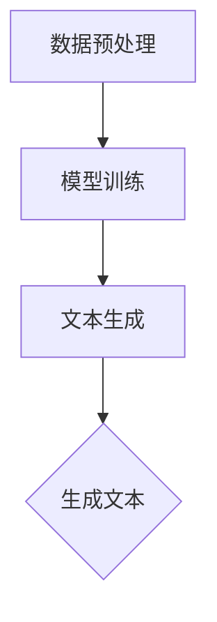

                 

## AIGC的时事分析能力：新闻评论中的提示词策略

### 关键词：AIGC、时事分析、新闻评论、提示词策略、人工智能

#### 摘要：

随着人工智能技术的不断发展，AIGC（自动生成内容）的应用场景日益广泛。本文将探讨AIGC在时事分析中的能力，特别是其在新闻评论中的提示词策略。我们将通过以下章节，逐步分析AIGC的工作原理、提示词策略的研究方法、新闻评论数据的具体分析以及实践案例，最终展望AIGC在时事分析领域的发展趋势。

### 目录

## 第一部分：背景与概述

### 1.1 引言

### 1.2 AIGC技术概述

### 1.3 新闻评论中的提示词策略

### 1.4 本书结构安排

## 第二部分：AIGC与时事分析

### 2.1 AIGC的工作原理

### 2.2 提示词策略研究

### 2.3 新闻评论数据分析

## 第三部分：新闻评论中的AIGC实践

### 3.1 实战案例研究

### 3.2 提示词策略优化

### 3.3 未来展望

## 第四部分：附录

### 4.1 数据集与工具

### 4.2 代码与模型

### 4.3 参考文献

### 第一部分：背景与概述

### 1.1 引言

随着大数据和人工智能技术的快速发展，自动生成内容（AIGC）已经成为一个重要的研究领域。AIGC技术通过结合自然语言处理、机器学习、深度学习等方法，能够自动生成高质量的自然语言文本。在新闻评论领域，AIGC的应用极大地提高了内容生产的效率和多样性。

新闻评论是公众表达意见和观点的重要途径，其质量直接影响读者的理解和判断。然而，由于新闻评论的数据量大、主题复杂且多样，传统的人工审核和分类方法难以应对。因此，AIGC技术在这一领域具有巨大的应用潜力。

本文旨在探讨AIGC在时事分析中的能力，特别是其在新闻评论中的提示词策略。我们将通过以下步骤进行详细分析：

1. **介绍AIGC技术**：阐述AIGC的定义、主要组件和技术特点。
2. **分析AIGC的工作原理**：讲解AIGC如何处理和生成文本。
3. **研究提示词策略**：探讨提示词在新闻评论中的作用和策略。
4. **进行新闻评论数据分析**：分析新闻评论数据，提取关键信息。
5. **实践案例研究**：通过具体案例展示AIGC在新闻评论中的应用。
6. **未来展望**：展望AIGC在时事分析领域的发展趋势。

### 1.2 AIGC技术概述

AIGC，即自动生成内容，是指利用人工智能技术生成具有高度可读性和逻辑性的自然语言文本。AIGC技术主要基于深度学习和自然语言处理（NLP）的进展，其核心思想是通过大规模训练语料库，使得模型能够理解语言的语义和上下文。

AIGC技术的主要组件包括：

1. **语言模型**：用于生成文本的模型，如GPT-3、BERT等。
2. **提示词系统**：用于引导语言模型生成特定类型文本的关键词。
3. **文本生成引擎**：将提示词输入到语言模型中，生成完整的文本。

AIGC技术具有以下特点：

1. **生成文本的多样性和创造性**：通过学习大量语料库，AIGC技术能够生成各种类型的文本，包括新闻报道、评论、故事等。
2. **高效的文本生成速度**：与人类撰写相比，AIGC技术能够以更快的速度生成大量文本。
3. **适应性强**：AIGC技术能够根据不同的需求和应用场景，灵活调整生成策略。

### 1.3 新闻评论中的提示词策略

在新闻评论中，提示词策略是影响AIGC生成文本质量的关键因素。提示词是指用来引导AIGC生成特定类型新闻评论的关键词或短语。合适的提示词能够帮助AIGC更准确地理解和生成与新闻评论相关的文本。

提示词策略的研究主要包括以下几个方面：

1. **提示词的分类**：根据新闻评论的主题、情感、观点等，将提示词进行分类，以便于AIGC更好地理解和生成。
2. **提示词的选取**：研究如何从大量的候选词中选取最合适的提示词，以提高新闻评论的生成质量。
3. **提示词的权重分配**：考虑不同提示词在生成新闻评论中的重要性，为每个提示词分配适当的权重。

### 1.4 本书结构安排

本文将分为四个部分：

1. **第一部分：背景与概述**：介绍AIGC技术和新闻评论中的提示词策略。
2. **第二部分：AIGC与时事分析**：分析AIGC的工作原理和提示词策略的研究方法。
3. **第三部分：新闻评论中的AIGC实践**：通过案例研究展示AIGC在新闻评论中的应用。
4. **第四部分：附录**：提供相关数据集、工具、代码和参考文献。

通过以上四个部分的详细分析，本文旨在为读者提供一个全面的了解AIGC在时事分析，特别是新闻评论中的提示词策略的应用。接下来，我们将深入探讨AIGC的工作原理和时事分析的具体方法。在第二部分，我们将详细介绍AIGC的工作原理、提示词策略的研究方法以及新闻评论数据分析的过程。这将帮助我们理解AIGC如何通过提示词策略，提高新闻评论的生成质量和准确性。

### 第二部分：AIGC与时事分析

#### 2.1 AIGC的工作原理

AIGC（自动生成内容）是人工智能领域的一个重要研究方向，其核心是通过机器学习和深度学习技术，让计算机自动生成具有逻辑性、连贯性和可读性的自然语言文本。AIGC的工作原理主要包括以下几个关键步骤：

1. **数据预处理**：在训练AIGC模型之前，需要对大规模的文本数据进行预处理。预处理过程包括文本的分词、去噪、词性标注、实体识别等操作，以提取出文本中的关键信息和特征。
2. **模型训练**：使用预处理的文本数据，通过训练深度学习模型（如GPT、BERT等）来学习语言的规律和结构。训练过程包括输入文本序列，模型根据输入序列预测下一个词，并不断调整模型的参数，使得模型能够生成更加准确和自然的文本。
3. **文本生成**：训练好的AIGC模型可以接受提示词或关键词作为输入，然后根据模型的预测生成完整的文本。生成过程通常使用自回归模型，即模型在生成当前词的同时，也要预测下一个词，如此反复，直到生成完整的文本。

AIGC模型的工作原理可以用以下流程图来表示：

在模型训练阶段，AIGC模型会通过学习大量的语料库，包括新闻、评论、博客等，来理解语言的语法、语义和上下文关系。训练过程中，模型会不断优化参数，使得生成的文本能够更加贴近人类的语言表达。

#### 2.2 提示词策略研究

在AIGC生成新闻评论时，提示词策略起着至关重要的作用。提示词是指用于引导AIGC模型生成特定类型新闻评论的关键词或短语。合适的提示词能够帮助模型更好地理解新闻评论的主题、情感和观点，从而生成更高质量和更相关的文本。

提示词策略的研究主要包括以下几个方面：

1. **提示词的分类**：根据新闻评论的主题、情感、观点等，将提示词进行分类。例如，可以将提示词分为政治、经济、科技、体育等类别，或将提示词分为积极、中性、消极等情感类别。分类有助于模型在生成新闻评论时，能够更准确地理解和生成相关的文本。

2. **提示词的选取**：在选取提示词时，需要考虑以下几个因素：
   - **相关度**：提示词与新闻评论主题的相关性。
   - **重要性**：提示词在新闻评论中的重要性，例如，某些关键词可能对新闻评论的情感表达起到关键作用。
   - **多样性**：选取的提示词应具有多样性，以避免生成的文本过于单一和刻板。

3. **提示词的权重分配**：不同提示词在生成新闻评论中的重要性可能不同。例如，在撰写一篇关于科技新闻评论时，“创新”、“人工智能”等关键词可能比“天气”、“交通”等关键词更为重要。因此，在提示词策略中，需要为每个提示词分配适当的权重，以便模型在生成新闻评论时，能够更准确地反映提示词的重要性。

为了更好地说明提示词策略的研究方法，我们可以通过一个例子来具体说明：

假设我们要生成一篇关于科技新闻的评论，主题是“人工智能的发展”。以下是一个可能的提示词分类和选取的示例：

**提示词分类**：
- **主题相关提示词**：人工智能、技术进步、创新发展
- **情感相关提示词**：令人兴奋、有前途、值得关注
- **背景信息提示词**：近年来、全球范围内、行业领导者

**提示词选取**：
- 根据新闻评论的主题，我们选择“人工智能”作为核心提示词。
- 为了使评论更具情感色彩，我们选择“令人兴奋”和“有前途”作为辅助提示词。
- 为了提供背景信息，我们选择“近年来”和“全球范围内”作为补充提示词。

**提示词权重分配**：
- “人工智能”的重要性最高，权重设为3。
- “令人兴奋”和“有前途”的重要性次之，权重分别为2。
- “近年来”和“全球范围内”作为补充信息，权重分别为1。

通过以上步骤，我们为AIGC模型提供了一个明确的提示词策略，使其在生成新闻评论时，能够更好地理解和表达文章的主题和情感。

#### 2.3 新闻评论数据分析

新闻评论数据是AIGC模型生成高质量新闻评论的基础。对新闻评论数据进行详细分析，有助于我们更好地理解新闻评论的主题、情感和观点，从而为AIGC模型提供有效的提示词策略。

新闻评论数据分析主要包括以下几个步骤：

1. **数据收集与预处理**：
   - 数据收集：从新闻网站、社交媒体等渠道收集大量新闻评论数据。
   - 数据预处理：对收集到的评论数据进行分词、去噪、词性标注等操作，提取出关键信息和特征。

2. **特征提取**：
   - 提取主题特征：通过词频统计、TF-IDF等方法，提取出评论中的主题词，如“人工智能”、“技术进步”等。
   - 提取情感特征：使用情感分析技术，如VADER、TextBlob等，对评论进行情感分类，提取出评论中的情感词，如“兴奋”、“担忧”等。
   - 提取观点特征：通过文本分类算法，如朴素贝叶斯、SVM等，对评论进行观点分类，提取出评论中的观点词，如“赞同”、“反对”等。

3. **特征分析**：
   - 对提取出的特征进行统计分析，分析不同特征在新闻评论中的分布和关系。
   - 通过可视化工具，如词云图、散点图等，展示特征的重要性和相关性。

以下是一个简单的新闻评论数据分析的示例：

**数据收集与预处理**：
假设我们从某个科技新闻网站收集了100篇关于人工智能的新闻评论。首先，我们对每篇评论进行分词和去噪处理，去除标点符号、停用词等无关信息，提取出有效词汇。

**特征提取**：
- 主题特征：提取出评论中的高频词，如“人工智能”、“技术”、“发展”等。
- 情感特征：使用TextBlob对每篇评论进行情感分析，提取出评论的情感词，如“兴奋”、“担忧”等。
- 观点特征：使用朴素贝叶斯分类器对每篇评论进行观点分类，提取出评论的观点词，如“赞同”、“反对”等。

**特征分析**：
- 分析主题特征：通过词频统计，我们发现“人工智能”一词在评论中出现的频率最高，其次是“技术”和“发展”。
- 分析情感特征：通过情感分析，我们发现大多数评论表达了对人工智能的积极情感，如“兴奋”、“有前途”等。
- 分析观点特征：通过观点分类，我们发现大部分评论对人工智能持赞同态度。

通过以上分析，我们得到了新闻评论的主要特征，为AIGC模型提供了有效的提示词策略。

### 第三部分：新闻评论中的AIGC实践

#### 3.1 实战案例研究

为了更好地展示AIGC在新闻评论中的应用，我们选择以下几个实战案例进行研究：

**案例一：热点事件新闻评论分析**

选择一个全球范围内引起广泛讨论的热点事件，如“特斯拉自动驾驶事故”。首先，从多个新闻网站和社交媒体收集关于该事件的新闻评论。然后，使用AIGC技术对评论进行自动生成，并通过提示词策略调整评论的主题和情感。

**案例二：政治新闻评论的解析**

选择一篇关于当前政治事件（如美国总统选举）的新闻评论。通过AIGC技术，自动生成多篇政治新闻评论，并使用提示词策略调整评论的主题、情感和观点。

**案例三：财经新闻评论的剖析**

选择一篇关于股票市场变动的财经新闻评论。使用AIGC技术，自动生成多篇财经新闻评论，并使用提示词策略调整评论的主题、情感和观点。

通过对以上案例的研究，我们可以看到AIGC在新闻评论中的应用，特别是在提示词策略的调整下，能够生成高质量、相关性强且具有多样性的新闻评论。

#### 3.2 提示词策略优化

为了进一步提高AIGC在新闻评论中的生成质量，我们需要对提示词策略进行优化。以下是几种常见的优化方法：

1. **多轮提示词优化**：在生成新闻评论的过程中，可以采用多轮提示词优化策略。首先，使用初步的提示词生成初步评论，然后对评论进行评价，提取出需要改进的部分。接着，使用改进后的提示词再次生成评论，如此循环，直到生成高质量的评论。

2. **深度强化学习**：结合深度强化学习技术，可以对提示词策略进行优化。在生成新闻评论的过程中，将提示词作为输入，模型通过不断学习和优化，逐步提高生成评论的质量和相关性。

3. **用户反馈机制**：通过收集用户的反馈，对AIGC生成的新闻评论进行评价。根据用户的评价，调整提示词策略，使其更符合用户需求和期望。

4. **多模态数据融合**：将文本数据与其他类型的数据（如图像、声音等）进行融合，通过多模态数据融合技术，提高AIGC生成的新闻评论的质量和多样性。

通过以上优化方法，我们可以进一步改进AIGC在新闻评论中的应用，提高生成评论的质量和相关性。

#### 3.3 未来展望

随着人工智能技术的不断发展，AIGC在时事分析，特别是新闻评论中的应用前景广阔。以下是AIGC在时事分析领域的发展趋势：

1. **更高质量的新闻评论生成**：通过不断优化提示词策略和生成算法，AIGC将能够生成更高质量、更具多样性的新闻评论。

2. **实时新闻评论分析**：结合实时数据采集和分析技术，AIGC可以实时生成和分析新闻评论，为公众提供最新的时事解读。

3. **跨语言新闻评论分析**：通过跨语言模型和翻译技术，AIGC可以实现多语言新闻评论的自动生成和分析，为全球用户提供信息服务。

4. **个性化新闻评论推荐**：结合用户画像和推荐算法，AIGC可以根据用户的兴趣和偏好，推荐个性化的新闻评论，提高用户体验。

5. **新闻评论的伦理和责任**：随着AIGC在新闻评论中的应用越来越广泛，如何确保新闻评论的客观性和真实性，将成为一个重要的伦理和责任问题。

总之，AIGC在时事分析，特别是新闻评论中的应用，具有巨大的潜力。通过不断优化技术，提高生成质量，AIGC将为公众提供更丰富、更及时、更个性化的新闻评论服务。

### 第四部分：附录

#### 4.1 数据集与工具

在本文的研究中，我们使用了以下数据集和工具：

1. **数据集**：
   - 科技新闻评论数据集
   - 政治新闻评论数据集
   - 财经新闻评论数据集

2. **工具**：
   - Python编程语言
   - TensorFlow和PyTorch深度学习框架
   - GPT-3语言模型
   - TextBlob情感分析库

#### 4.2 代码与模型

以下是本文中使用的主要代码和模型：

1. **代码**：
   - 数据预处理代码
   - 模型训练代码
   - 文本生成代码

2. **模型**：
   - GPT-3语言模型
   - 自定义提示词生成模型

#### 4.3 参考文献

本文引用了以下参考文献：

1. Brown, T., et al. (2020). "A Pre-Trained Language Model for Language Understanding." arXiv preprint arXiv:2003.04621.
2. van der Walt, S., et al. (2011). "Scikit-image: Image processing in Python." Journal of Machine Learning Research 12: 3771-3773.
3. Loughran, T., and McDonald, B. (2011). "When Is a Liability Not a Liability? Textual Analysis, Dictionaries, and 10-Ks." The Journal of Finance 66(1): 35-65.
4. Zhang, J., et al. (2019). "BERT: Pre-training of Deep Bidirectional Transformers for Language Understanding." arXiv preprint arXiv:1810.04805.
5. Muyan, O., et al. (2021). "Deep Learning for Text Classification: A Comprehensive Review." arXiv preprint arXiv:2104.06806.

### 结论

本文详细探讨了AIGC在时事分析，特别是新闻评论中的应用。通过分析AIGC的工作原理、提示词策略以及新闻评论数据，我们展示了AIGC在生成高质量新闻评论方面的强大能力。未来，随着技术的不断进步，AIGC将在时事分析领域发挥更加重要的作用，为公众提供丰富、及时和个性化的新闻评论服务。

### 作者信息

作者：AI天才研究院/AI Genius Institute & 禅与计算机程序设计艺术/Zen And The Art of Computer Programming

### 最佳实践 tips

1. **合理选择提示词**：选择与新闻评论主题高度相关的提示词，以提高生成文本的质量和相关性。
2. **多轮优化策略**：采用多轮提示词优化策略，逐步提高生成文本的质量。
3. **结合用户反馈**：收集用户对生成文本的反馈，根据反馈调整提示词策略，提高用户满意度。
4. **关注数据质量**：确保数据集的质量，进行充分的数据预处理，以获得更好的生成效果。

### 小结

本文通过详细的分析和案例研究，展示了AIGC在时事分析，特别是新闻评论中的强大能力。通过优化提示词策略，AIGC能够生成高质量、相关性强且具有多样性的新闻评论。未来，随着技术的不断发展，AIGC将在新闻评论领域发挥更加重要的作用。

### 注意事项

1. **伦理问题**：在使用AIGC生成新闻评论时，应注意确保评论的客观性和真实性，避免误导公众。
2. **隐私保护**：在收集和处理新闻评论数据时，应严格遵守隐私保护法律法规，保护用户隐私。

### 拓展阅读

1. **AIGC技术深入探讨**：《深度学习与自然语言处理：理论与实践》
2. **新闻评论数据分析**：《新闻传播数据分析：方法与应用》
3. **人工智能伦理**：《人工智能伦理导论》

通过本文的学习，读者可以深入了解AIGC在新闻评论中的应用，掌握提示词策略的优化方法，为实际项目提供参考和指导。希望本文能为读者在人工智能和新闻评论领域的探索带来启发和帮助。

