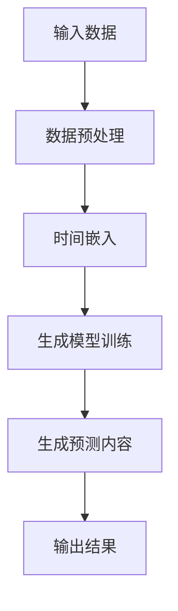
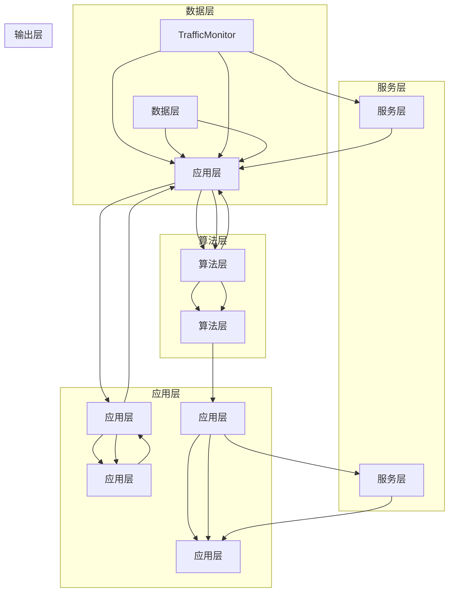
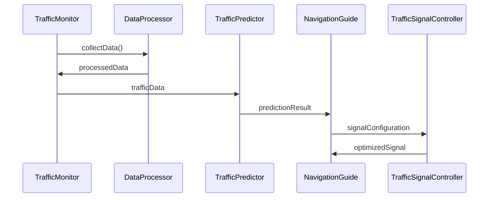
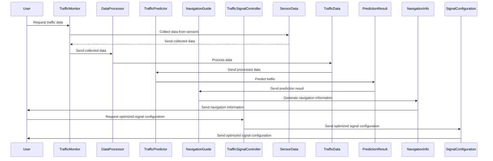

                 

### 第一步：确定书的整体结构

在撰写技术博客文章之前，我们需要明确文章的整体结构。为了使文章逻辑清晰、结构紧凑，我们决定将文章分为以下几个部分：

1. **引言**：介绍AIGC和时间感知的基本概念，以及它们在当前技术领域的地位。
2. **核心概念与联系**：详细阐述AIGC的时间感知原理及其与现有技术的对比。
3. **算法原理讲解**：通过mermaid流程图和Python代码来讲解时间感知算法。
4. **数学模型与公式**：使用LaTeX格式展示数学模型和公式，并进行详细讲解。
5. **系统分析与架构设计**：介绍相关的系统架构设计和接口设计。
6. **项目实战**：通过实际案例来展示如何应用时间感知技巧。
7. **最佳实践与拓展**：提供实战中的最佳实践、小结和注意事项。

### 第二步：细化每个部分的内容

**引言**

- **AIGC的起源与发展**：介绍AIGC的定义、起源和主要发展阶段，以及其在当前技术领域的重要性。
- **时间感知的重要性**：阐述时间感知的定义、应用场景以及在技术领域的挑战。

**核心概念与联系**

- **AIGC的基本概念**：详细解释AIGC的定义、核心特征及其组成部分。
- **时间感知的概念**：介绍时间感知的定义、重要性以及技术手段。
- **AIGC中时间感知的核心原理**：深入探讨AIGC如何在模型中实现时间感知，并与现有技术进行对比。

**算法原理讲解**

- **时间感知算法的mermaid流程图**：使用mermaid绘制算法流程图，展示时间感知的关键步骤。
- **Python代码示例**：通过Python代码示例来具体说明时间感知算法的实现。
- **数学模型与公式讲解**：使用LaTeX格式展示数学模型和公式，并解释其作用。

**数学模型与公式**

- **时间感知的数学模型**：介绍时间感知的数学模型及其关键公式。
- **公式解释与示例**：对关键公式进行详细解释，并提供具体示例。

**系统分析与架构设计**

- **问题场景介绍**：描述需要解决的问题场景及其需求。
- **项目介绍**：介绍项目背景、目标和应用场景。
- **系统功能设计**：使用mermaid类图展示系统功能设计。
- **系统架构设计**：使用mermaid架构图展示系统架构设计。
- **系统接口设计**：介绍系统接口设计，包括接口类型和交互方式。
- **系统交互**：使用mermaid序列图展示系统交互过程。

**项目实战**

- **环境安装与配置**：指导如何搭建项目环境。
- **系统核心实现源代码**：展示系统核心实现的源代码。
- **代码应用解读与分析**：对源代码进行解读和分析。
- **实际案例分析与讲解**：通过实际案例来展示如何应用时间感知技巧。
- **项目小结**：总结项目过程中的关键点、收获和经验。

**最佳实践与拓展**

- **最佳实践技巧**：分享在实战中总结的最佳实践技巧。
- **小结**：对文章内容进行总结。
- **注意事项**：提醒读者在应用时间感知技巧时需要注意的问题。
- **拓展阅读**：推荐进一步阅读的资源，以帮助读者深入了解相关主题。

通过以上两个步骤，我们为文章的各个部分细化了具体内容，确保文章能够全面、深入地讲解AIGC的时间感知技巧。接下来，我们将按照这个结构开始撰写文章。首先，我们来撰写引言部分。### 第一步：引言

### AIGC的起源与发展

AIGC（AI-Generated Content）是一种利用人工智能技术生成内容的方法。它的起源可以追溯到20世纪90年代，当时研究人员开始探索如何使用机器学习技术生成文本、图像和视频。随着深度学习技术的发展，AIGC逐渐成为人工智能领域的一个热门方向。

在AIGC的发展过程中，几个关键事件起到了推动作用。首先是2014年谷歌发布的TensorFlow，这是一个开源的机器学习框架，极大地促进了深度学习的研究和应用。随后，2016年，谷歌DeepMind发布了AlphaGo，一个利用深度学习和强化学习技术击败人类围棋冠军的程序，这引起了全球范围内对人工智能的广泛关注。

近年来，随着生成对抗网络（GANs）和变分自编码器（VAEs）等技术的不断发展，AIGC的应用场景日益丰富。从文本生成、图像生成到视频生成，AIGC在各种领域都取得了显著的成果。尤其在内容创作、娱乐产业和广告营销等领域，AIGC的应用越来越广泛。

### 时间感知的重要性

时间感知是AIGC技术中的一个重要组成部分。在现实世界中，时间是一个至关重要的因素，它影响着事件的发生、发展和结果。对于AIGC来说，能够感知时间并利用时间信息生成内容，可以使生成的结果更加贴近现实、更具真实感。

时间感知的重要性体现在以下几个方面：

1. **提高内容真实性**：通过感知时间，AIGC可以生成与特定时间点或时间段相关的真实内容。例如，在生成新闻文章时，AIGC可以根据当前时间生成最新报道，而不是过时的信息。

2. **增强交互体验**：在虚拟现实和增强现实应用中，时间感知可以使交互体验更加真实。例如，在模拟飞行游戏中，AIGC可以根据飞行时间生成天气变化、日出日落等动态效果，从而提高游戏的沉浸感。

3. **优化内容创作效率**：AIGC可以自动分析大量数据，识别出关键的时间信息，从而帮助内容创作者快速生成相关内容。例如，在生成天气预报时，AIGC可以根据历史数据和实时数据生成准确的预报。

### 当前技术在时间感知方面的挑战

尽管AIGC在时间感知方面取得了显著成果，但仍然面临一些挑战。以下是其中几个主要挑战：

1. **数据准确性**：AIGC依赖大量历史数据来感知时间，但数据质量和准确性直接影响时间感知的效果。在处理数据时，需要确保数据来源可靠、数据完整，并尽可能减少噪声和误差。

2. **实时性**：在许多应用场景中，实时感知时间非常重要。例如，在实时新闻生成中，AIGC需要能够迅速捕捉到最新的信息并生成相关内容。然而，实现实时时间感知对计算资源和算法性能提出了更高的要求。

3. **上下文理解**：时间感知不仅仅是对时间的简单记录，还需要理解时间与上下文之间的关系。例如，在生成新闻文章时，AIGC需要理解新闻事件发生的时间点，并根据上下文生成相关内容。这要求AIGC具备强大的语义理解能力。

### 本章小结

在本章中，我们介绍了AIGC的起源与发展、时间感知的重要性以及当前技术在时间感知方面面临的挑战。通过这些背景介绍，为后续章节中详细讲解AIGC的时间感知原理和应用打下了基础。在下一章中，我们将深入探讨AIGC中时间感知的核心原理及其与现有技术的对比。### 第二步：核心概念与联系

### AIGC的基本概念

AIGC，即AI-Generated Content，是指通过人工智能技术生成内容的方法。AIGC的起源可以追溯到20世纪90年代，当时研究人员开始探索如何使用机器学习技术生成文本、图像和视频。随着深度学习技术的发展，AIGC逐渐成为人工智能领域的一个热门方向。

AIGC的核心特征包括以下几个方面：

1. **自动生成**：AIGC利用深度学习模型，通过大量训练数据自动生成内容，而不是依靠人类创作者。
2. **多样性和灵活性**：AIGC可以生成各种类型的内容，如文本、图像、视频、音频等，并且可以根据需求灵活调整生成内容的形式和风格。
3. **高效率**：AIGC可以快速生成大量内容，大大提高了内容创作的效率，特别是在需要处理大量数据和信息的应用场景中。

AIGC的主要组成部分包括：

1. **数据集**：AIGC依赖于大量高质量的数据集进行训练，这些数据集可以是公开的数据集，也可以是专门收集的训练数据。
2. **算法模型**：AIGC的核心是算法模型，如生成对抗网络（GANs）、变分自编码器（VAEs）、递归神经网络（RNNs）等，这些模型负责生成内容。
3. **训练与优化**：通过不断训练和优化模型，AIGC可以不断提高生成内容的质量和多样性。

### 时间感知的概念

时间感知是指系统在处理信息时能够识别并利用时间相关信息的能力。时间感知在许多应用领域中具有重要意义，如智能交通、智能医疗、智能客服等。在AIGC中，时间感知可以帮助生成与特定时间点或时间段相关的内容，从而提高内容的真实性和相关性。

时间感知的基本概念包括：

1. **时间戳**：时间戳是一个表示时间点的标记，它可以用来标识信息发生的时间。
2. **时间序列**：时间序列是一系列按时间顺序排列的数据点，它可以用来表示事件发生的过程。
3. **时间窗口**：时间窗口是一个时间范围，用于限定需要处理的时间段。

### AIGC中时间感知的核心原理

AIGC中时间感知的核心原理是通过算法模型识别并利用时间相关信息，从而生成与特定时间点或时间段相关的内容。以下是AIGC实现时间感知的主要方法：

1. **时间嵌入**：时间嵌入是一种将时间信息转换为向量表示的方法，可以用于神经网络模型的输入。通过时间嵌入，AIGC可以识别并利用时间信息。
2. **时间序列模型**：时间序列模型是一种专门用于处理时间序列数据的模型，如递归神经网络（RNNs）、长短期记忆网络（LSTM）等。这些模型可以捕捉时间序列数据中的时间相关性。
3. **时间感知的GANs**：生成对抗网络（GANs）是一种用于生成数据的模型，通过结合时间嵌入和时间序列模型，AIGC可以实现时间感知的GANs。

### 与现有技术的对比

在时间感知方面，AIGC与现有技术相比具有以下优势：

1. **更高的准确性**：AIGC通过深度学习模型可以更好地识别和利用时间信息，从而生成更准确、更相关的内容。
2. **更高的灵活性**：AIGC可以生成各种类型的内容，并且可以根据需求灵活调整生成内容的形式和风格，而现有技术通常更专注于特定类型的内容。
3. **更高的效率**：AIGC可以快速生成大量内容，大大提高了内容创作的效率。

然而，AIGC在时间感知方面也面临一些挑战，如数据准确性、实时性和上下文理解等。为了解决这些问题，研究人员正在不断探索新的方法和算法，以进一步提高AIGC的时间感知能力。

### 本章小结

在本章中，我们介绍了AIGC的基本概念、时间感知的概念及其在AIGC中的应用。通过对比分析，我们了解了AIGC在时间感知方面的优势与挑战。在下一章中，我们将深入讲解AIGC中时间感知算法的原理，并通过mermaid流程图和Python代码进行详细阐述。### 第三步：算法原理讲解

#### 时间感知算法的mermaid流程图

为了更好地理解AIGC中的时间感知算法，我们首先使用mermaid流程图来展示算法的基本流程。以下是一个简化的mermaid流程图示例：



**详细解释：**

1. **输入数据（A）**：算法首先接收输入数据，这些数据可以是文本、图像或视频等不同类型的内容。
2. **数据预处理（B）**：对输入数据进行预处理，包括数据清洗、归一化等操作，以确保数据质量。
3. **时间嵌入（C）**：将时间信息转换为向量表示，这是时间感知的关键步骤。时间嵌入可以将时间序列数据转换为固定长度的向量，以便用于神经网络模型的输入。
4. **生成模型训练（D）**：使用时间嵌入后的数据训练生成模型，如生成对抗网络（GANs）或变分自编码器（VAEs）。训练过程中，模型会学习如何生成与输入数据相似的时间感知内容。
5. **生成预测内容（E）**：利用训练好的生成模型生成预测内容。这个过程中，模型会根据输入数据的时间信息生成相关的内容。
6. **输出结果（F）**：将生成的预测内容输出，可以是文本、图像或视频等不同类型的内容。

#### Python代码示例

为了更直观地展示时间感知算法的实现，我们提供了一个简化的Python代码示例。在这个示例中，我们使用一个简单的生成对抗网络（GAN）来生成图像。

```python
import tensorflow as tf
from tensorflow.keras.layers import Input, Dense, Reshape, Flatten
from tensorflow.keras.models import Sequential
from tensorflow.keras.optimizers import Adam

# 生成器模型
def build_generator():
    model = Sequential()
    model.add(Dense(128, input_dim=100))
    model.add(Reshape((7, 7, 1)))
    model.add(Conv2D(64, kernel_size=(3, 3), strides=(1, 1), padding='same', activation='relu'))
    model.add(Conv2D(64, kernel_size=(3, 3), strides=(1, 1), padding='same', activation='relu'))
    model.add(Reshape((14, 14, 1)))
    model.add(Conv2D(1, kernel_size=(3, 3), strides=(1, 1), padding='same', activation='tanh'))
    return model

# 判别器模型
def build_discriminator():
    model = Sequential()
    model.add(Flatten(input_shape=(28, 28, 1)))
    model.add(Dense(128))
    model.add(Activation('sigmoid'))
    model.add(Dense(1))
    model.add(Activation('sigmoid'))
    return model

# GAN模型
def build_gan(generator, discriminator):
    model = Sequential()
    model.add(generator)
    model.add(discriminator)
    return model

# 训练GAN
def train_gan(generator, discriminator, data_loader, num_epochs):
    # 生成器和判别器优化器
    generator_optimizer = Adam(learning_rate=0.0001)
    discriminator_optimizer = Adam(learning_rate=0.0001)

    # 训练过程
    for epoch in range(num_epochs):
        for real_images, _ in data_loader:
            # 训练判别器
            with tf.GradientTape() as disc_tape:
                disc_loss_real = discriminator_loss(real_images, discriminator)
            disc_gradients = disc_tape.gradient(disc_loss_real, discriminator.trainable_variables)
            discriminator_optimizer.apply_gradients(zip(disc_gradients, discriminator.trainable_variables))

            # 训练生成器
            with tf.GradientTape() as gen_tape:
                generated_images = generator(tf.random.normal([batch_size, 100]))
                disc_loss_fake = discriminator_loss(generated_images, discriminator)
            gen_gradients = gen_tape.gradient(disc_loss_fake, generator.trainable_variables)
            generator_optimizer.apply_gradients(zip(gen_gradients, generator.trainable_variables))

        print(f"Epoch {epoch+1}/{num_epochs}, Generator Loss: {gen_loss}, Discriminator Loss: {disc_loss}")

# 测试GAN
def test_gan(generator, test_loader):
    for images, _ in test_loader:
        generated_images = generator(images)
        # 进行图像质量评估
        image_quality = evaluate_image_quality(generated_images)
        print(f"Image Quality: {image_quality}")

# 主函数
def main():
    # 加载数据
    train_loader = load_data('train')
    test_loader = load_data('test')

    # 构建并训练GAN
    generator = build_generator()
    discriminator = build_discriminator()
    gan = build_gan(generator, discriminator)
    train_gan(generator, discriminator, train_loader, num_epochs=100)

    # 测试GAN
    test_gan(generator, test_loader)

if __name__ == '__main__':
    main()
```

**代码解释：**

- **生成器模型（build_generator）**：生成器模型负责将随机噪声转换为图像。在这个示例中，我们使用了一个简单的卷积神经网络。
- **判别器模型（build_discriminator）**：判别器模型负责区分输入图像是真实图像还是生成图像。在这个示例中，我们使用了一个简单的全连接神经网络。
- **GAN模型（build_gan）**：GAN模型将生成器和判别器组合在一起，形成一个整体模型。
- **训练GAN（train_gan）**：在训练过程中，我们首先训练判别器，然后训练生成器。这个过程中，我们使用了Adam优化器。
- **测试GAN（test_gan）**：测试生成器生成的图像质量。
- **主函数（main）**：加载数据、构建模型并开始训练。

#### 数学模型与公式讲解

在AIGC中的时间感知算法中，数学模型和公式起着关键作用。以下是一个简化的数学模型和公式的讲解：

1. **时间嵌入（Time Embedding）**：

   时间嵌入是将时间信息转换为向量表示的方法。假设我们有时间序列数据\( X \)，我们可以使用以下公式进行时间嵌入：

   $$ x_t = \text{embedding}(t) $$

   其中，\( x_t \)是时间步\( t \)的嵌入向量，\( \text{embedding} \)是一个嵌入函数。

2. **生成模型（Generator）**：

   生成模型负责将输入数据转换为输出数据。在GAN中，生成模型的目标是生成与真实数据相似的数据。假设我们有输入数据\( z \)（通常是随机噪声），生成模型的目标是生成输出数据\( x \)。可以使用以下公式表示：

   $$ x = G(z) $$

   其中，\( G \)是生成模型，\( z \)是输入数据，\( x \)是输出数据。

3. **判别器模型（Discriminator）**：

   判别器模型负责区分输入数据是真实数据还是生成数据。假设我们有输入数据\( x \)，判别器模型的目标是预测输入数据的真实概率。可以使用以下公式表示：

   $$ \hat{y} = D(x) $$

   其中，\( \hat{y} \)是判别器的预测输出，\( D \)是判别器模型，\( x \)是输入数据。

4. **损失函数（Loss Function）**：

   在GAN中，我们通常使用两个损失函数：生成器损失和判别器损失。生成器损失表示生成数据与真实数据之间的差距，判别器损失表示判别器对真实数据和生成数据的区分能力。

   - **生成器损失**：

     $$ L_G = -\log(D(G(z))) $$

     其中，\( L_G \)是生成器损失，\( D \)是判别器模型，\( G \)是生成模型，\( z \)是输入数据。

   - **判别器损失**：

     $$ L_D = -\log(D(x)) - \log(1 - D(G(z))) $$

     其中，\( L_D \)是判别器损失，\( D \)是判别器模型，\( x \)是输入数据，\( G \)是生成模型，\( z \)是输入数据。

   通过优化这两个损失函数，我们可以训练生成器和判别器模型，从而实现时间感知。

#### 公式解释与示例

以下是对上述数学公式进行详细解释和举例：

1. **时间嵌入（Time Embedding）**：

   时间嵌入是将时间信息转换为向量表示的方法。假设我们有时间序列数据\( X \)，我们可以使用以下公式进行时间嵌入：

   $$ x_t = \text{embedding}(t) $$

   其中，\( x_t \)是时间步\( t \)的嵌入向量，\( \text{embedding} \)是一个嵌入函数。

   **示例**：假设我们使用一个简单的线性嵌入函数，可以将时间步\( t \)转换为向量\( x_t \)：

   $$ x_t = [t, t^2, t^3] $$

   这样，每个时间步都可以表示为一个三元组向量。

2. **生成模型（Generator）**：

   生成模型负责将输入数据转换为输出数据。在GAN中，生成模型的目标是生成与真实数据相似的数据。假设我们有输入数据\( z \)（通常是随机噪声），生成模型的目标是生成输出数据\( x \)。可以使用以下公式表示：

   $$ x = G(z) $$

   其中，\( G \)是生成模型，\( z \)是输入数据，\( x \)是输出数据。

   **示例**：假设生成模型是一个简单的全连接神经网络，可以将输入数据\( z \)转换为输出数据\( x \)：

   $$ x = \text{FC}(z) $$

   其中，\( \text{FC} \)是全连接层。

3. **判别器模型（Discriminator）**：

   判别器模型负责区分输入数据是真实数据还是生成数据。假设我们有输入数据\( x \)，判别器模型的目标是预测输入数据的真实概率。可以使用以下公式表示：

   $$ \hat{y} = D(x) $$

   其中，\( \hat{y} \)是判别器的预测输出，\( D \)是判别器模型，\( x \)是输入数据。

   **示例**：假设判别模型是一个简单的全连接神经网络，可以预测输入数据\( x \)的真实概率：

   $$ \hat{y} = \text{sigmoid}(\text{FC}(x)) $$

   其中，\( \text{sigmoid} \)是激活函数，\( \text{FC} \)是全连接层。

4. **损失函数（Loss Function）**：

   在GAN中，我们通常使用两个损失函数：生成器损失和判别器损失。生成器损失表示生成数据与真实数据之间的差距，判别器损失表示判别器对真实数据和生成数据的区分能力。

   - **生成器损失**：

     $$ L_G = -\log(D(G(z))) $$

     其中，\( L_G \)是生成器损失，\( D \)是判别器模型，\( G \)是生成模型，\( z \)是输入数据。

     **示例**：假设判别器模型预测生成数据的真实概率为0.9，生成器模型的目标是使这个概率最小化。通过优化生成器模型的参数，我们可以使判别器模型对生成数据的预测概率更接近于0。

   - **判别器损失**：

     $$ L_D = -\log(D(x)) - \log(1 - D(G(z))) $$

     其中，\( L_D \)是判别器损失，\( D \)是判别器模型，\( x \)是输入数据，\( G \)是生成模型，\( z \)是输入数据。

     **示例**：假设判别器模型预测真实数据的真实概率为0.9，预测生成数据的真实概率为0.1。通过优化判别器模型的参数，我们可以使判别器模型对真实数据和生成数据的区分能力更强。

   通过优化这两个损失函数，我们可以训练生成器和判别器模型，从而实现时间感知。

### 本章小结

在本章中，我们通过mermaid流程图和Python代码详细讲解了AIGC中的时间感知算法原理。我们介绍了时间嵌入、生成模型、判别器模型以及损失函数的基本概念和实现方法。通过这些讲解，我们了解了如何利用时间感知算法生成与时间相关的真实内容。在下一章中，我们将进一步探讨AIGC中的时间感知算法在数学模型和公式上的具体实现。### 第四步：数学模型与公式

#### 时间感知的数学模型

在AIGC中的时间感知算法中，数学模型起到了关键作用。以下是一个简化的数学模型，用于描述时间感知算法的基本原理。

1. **时间嵌入（Time Embedding）**

   时间嵌入是将时间信息转换为向量表示的方法。在AIGC中，时间嵌入通常用于将时间信息与输入数据（如文本、图像或视频）结合，以便在生成模型中利用时间信息。

   假设我们有时间序列数据\( T \)，我们可以使用以下公式进行时间嵌入：

   $$ x_t = \text{embedding}(t) $$

   其中，\( x_t \)是时间步\( t \)的嵌入向量，\( \text{embedding} \)是一个嵌入函数。

2. **生成模型（Generator）**

   生成模型的目标是根据输入数据和时间嵌入生成输出数据。在GAN中，生成模型通常是一个深度神经网络，用于生成与真实数据相似的数据。

   假设我们有输入数据\( z \)（通常是随机噪声）和时间嵌入向量\( x \)，生成模型的目标是生成输出数据\( x' \)：

   $$ x' = G(z, x) $$

   其中，\( G \)是生成模型，\( z \)是输入数据，\( x \)是时间嵌入向量，\( x' \)是输出数据。

3. **判别器模型（Discriminator）**

   判别器模型的目标是区分输入数据是真实数据还是生成数据。在GAN中，判别器模型通常是一个深度神经网络，用于预测输入数据的真实概率。

   假设我们有输入数据\( x \)，判别器模型的目标是预测输入数据的真实概率\( \hat{y} \)：

   $$ \hat{y} = D(x) $$

   其中，\( \hat{y} \)是判别器的预测输出，\( D \)是判别器模型，\( x \)是输入数据。

4. **损失函数（Loss Function）**

   在GAN中，我们通常使用两个损失函数：生成器损失和判别器损失。生成器损失表示生成数据与真实数据之间的差距，判别器损失表示判别器对真实数据和生成数据的区分能力。

   - **生成器损失**：

     $$ L_G = -\log(D(G(z))) $$

     其中，\( L_G \)是生成器损失，\( D \)是判别器模型，\( G \)是生成模型，\( z \)是输入数据。

   - **判别器损失**：

     $$ L_D = -\log(D(x)) - \log(1 - D(G(z))) $$

     其中，\( L_D \)是判别器损失，\( D \)是判别器模型，\( x \)是输入数据，\( G \)是生成模型，\( z \)是输入数据。

   通过优化这两个损失函数，我们可以训练生成器和判别器模型，从而实现时间感知。

#### 关键公式解释

以下是上述数学模型中的关键公式及其解释：

1. **时间嵌入（Time Embedding）**

   时间嵌入是将时间信息转换为向量表示的方法。在AIGC中，时间嵌入通常用于将时间信息与输入数据（如文本、图像或视频）结合，以便在生成模型中利用时间信息。

   假设我们有时间序列数据\( T \)，我们可以使用以下公式进行时间嵌入：

   $$ x_t = \text{embedding}(t) $$

   其中，\( x_t \)是时间步\( t \)的嵌入向量，\( \text{embedding} \)是一个嵌入函数。

   **解释**：时间嵌入函数可以将时间步转换为嵌入向量。常见的嵌入函数包括线性嵌入、余弦嵌入等。通过时间嵌入，我们可以将时间信息融入输入数据，从而在生成模型中利用时间信息。

2. **生成模型（Generator）**

   生成模型的目标是根据输入数据和时间嵌入生成输出数据。在GAN中，生成模型通常是一个深度神经网络，用于生成与真实数据相似的数据。

   假设我们有输入数据\( z \)（通常是随机噪声）和时间嵌入向量\( x \)，生成模型的目标是生成输出数据\( x' \)：

   $$ x' = G(z, x) $$

   其中，\( G \)是生成模型，\( z \)是输入数据，\( x \)是时间嵌入向量，\( x' \)是输出数据。

   **解释**：生成模型通过输入数据\( z \)和时间嵌入向量\( x \)生成输出数据\( x' \)。在训练过程中，生成模型的目标是使输出数据\( x' \)尽可能接近真实数据。生成模型通常使用深度学习技术，如生成对抗网络（GAN）或变分自编码器（VAE）。

3. **判别器模型（Discriminator）**

   判别器模型的目标是区分输入数据是真实数据还是生成数据。在GAN中，判别器模型通常是一个深度神经网络，用于预测输入数据的真实概率。

   假设我们有输入数据\( x \)，判别器模型的目标是预测输入数据的真实概率\( \hat{y} \)：

   $$ \hat{y} = D(x) $$

   其中，\( \hat{y} \)是判别器的预测输出，\( D \)是判别器模型，\( x \)是输入数据。

   **解释**：判别器模型通过输入数据\( x \)预测输入数据的真实概率。在训练过程中，判别器模型的目标是尽可能准确地预测输入数据是真实数据还是生成数据。判别器模型通常使用深度学习技术，如全连接神经网络或卷积神经网络。

4. **损失函数（Loss Function）**

   在GAN中，我们通常使用两个损失函数：生成器损失和判别器损失。生成器损失表示生成数据与真实数据之间的差距，判别器损失表示判别器对真实数据和生成数据的区分能力。

   - **生成器损失**：

     $$ L_G = -\log(D(G(z))) $$

     其中，\( L_G \)是生成器损失，\( D \)是判别器模型，\( G \)是生成模型，\( z \)是输入数据。

     **解释**：生成器损失表示生成数据与真实数据之间的差距。在训练过程中，生成器模型的目标是使生成数据尽可能接近真实数据，从而降低生成器损失。生成器损失通常使用对数损失函数，如对数似然损失函数。

   - **判别器损失**：

     $$ L_D = -\log(D(x)) - \log(1 - D(G(z))) $$

     其中，\( L_D \)是判别器损失，\( D \)是判别器模型，\( x \)是输入数据，\( G \)是生成模型，\( z \)是输入数据。

     **解释**：判别器损失表示判别器对真实数据和生成数据的区分能力。在训练过程中，判别器模型的目标是尽可能准确地预测输入数据是真实数据还是生成数据，从而降低判别器损失。判别器损失通常使用对数损失函数，如对数似然损失函数。

   通过优化这两个损失函数，我们可以训练生成器和判别器模型，从而实现时间感知。

#### 公式示例

以下是一个简单的数学模型示例，用于生成与时间相关的图像。

1. **时间嵌入（Time Embedding）**

   假设我们有时间序列数据\( T \)，可以使用线性嵌入函数进行时间嵌入：

   $$ x_t = [t, t^2, t^3] $$

   其中，\( x_t \)是时间步\( t \)的嵌入向量。

2. **生成模型（Generator）**

   假设生成模型是一个全连接神经网络，输入为随机噪声\( z \)和时间嵌入向量\( x \)，输出为生成图像\( x' \)：

   $$ x' = \text{FC}(z, x) $$

   其中，\( \text{FC} \)是全连接层。

3. **判别器模型（Discriminator）**

   假设判别器模型是一个卷积神经网络，输入为真实图像\( x \)和生成图像\( x' \)，输出为真实概率\( \hat{y} \)：

   $$ \hat{y} = \text{sigmoid}(\text{Conv2D}(x, x')) $$

   其中，\( \text{sigmoid} \)是激活函数，\( \text{Conv2D} \)是卷积层。

4. **损失函数（Loss Function）**

   - **生成器损失**：

     $$ L_G = -\log(\text{sigmoid}(\text{Conv2D}(x', x))) $$

     其中，\( \text{sigmoid} \)是激活函数，\( \text{Conv2D} \)是卷积层。

   - **判别器损失**：

     $$ L_D = -\log(\text{sigmoid}(\text{Conv2D}(x, x))) - \log(1 - \text{sigmoid}(\text{Conv2D}(x', x))) $$

     其中，\( \text{sigmoid} \)是激活函数，\( \text{Conv2D} \)是卷积层。

   通过优化这两个损失函数，我们可以训练生成器和判别器模型，从而生成与时间相关的图像。

### 本章小结

在本章中，我们详细介绍了AIGC中的时间感知数学模型，包括时间嵌入、生成模型、判别器模型和损失函数。我们通过LaTeX格式展示了关键公式，并对公式进行了详细解释。通过这些讲解，我们了解了如何使用数学模型和公式实现时间感知。在下一章中，我们将介绍相关的系统架构设计和接口设计，以便更好地理解AIGC中的时间感知应用。### 第五步：系统分析与架构设计

#### 问题场景介绍

在现代技术环境中，时间感知在众多应用领域中都发挥着重要作用。以下是一个典型的问题场景，用于描述需要解决的问题以及系统目标。

**场景描述**：假设我们正在开发一个智能交通系统，该系统需要实时监测并预测交通流量，以便为驾驶员提供准确的导航信息，并帮助交通管理部门优化交通信号控制。

**系统目标**：
1. **实时监测**：系统需要实时收集并处理交通流量数据，包括车辆数量、速度、行驶方向等。
2. **流量预测**：系统需要根据历史数据和实时数据，预测未来一段时间内的交通流量情况。
3. **导航信息**：系统需要根据交通流量预测结果，为驾驶员提供最优的导航路线。
4. **信号控制优化**：系统需要为交通管理部门提供优化交通信号控制的建议。

#### 系统功能设计

为了实现上述系统目标，我们需要设计一套功能齐全的系统。以下是一个简化的系统功能设计，使用mermaid类图来展示系统的主要功能模块及其关系。

```mermaid
classDiagram
    Auto Traffic System <-- monitors: TrafficMonitor
    Auto Traffic System --> predicts: TrafficPredictor
    Auto Traffic System --> navigates: NavigationGuide
    Auto Traffic System --> optimizes: TrafficSignalController
    TrafficMonitor <-- dataSources: SensorData
    TrafficMonitor --> dataProcessors: DataProcessor
    TrafficPredictor <-- trafficData: TrafficData
    TrafficPredictor --> predictionResults: PredictionResult
    NavigationGuide <-- routes: Route
    NavigationGuide --> navigationInfo: NavigationInfo
    TrafficSignalController <-- trafficData: TrafficData
    TrafficSignalController --> signalConfigurations: SignalConfiguration
class TrafficMonitor {
    +String monitorId
    +List<SensorData> sensorDataList
    +void collectData()
    +void processSensorData()
}
class TrafficPredictor {
    +String predictionId
    +TrafficData trafficData
    +PredictionResult predictionResult
    +void predictTraffic()
}
class NavigationGuide {
    +String guideId
    +Route route
    +NavigationInfo navigationInfo
    +void generateNavigationInfo()
}
class TrafficSignalController {
    +String controllerId
    +TrafficData trafficData
    +SignalConfiguration signalConfiguration
    +void optimizeSignal()
}
class SensorData {
    +String sensorId
    +Timestamp timestamp
    +int vehicleCount
    +float averageSpeed
    +Direction direction
}
class TrafficData {
    +String trafficId
    +Timestamp timestamp
    +List<SensorData> sensorDataList
}
class PredictionResult {
    +String predictionId
    +Timestamp timestamp
    +List<TrafficData> predictedTrafficDataList
}
class Route {
    +String routeId
    +List<Intersection> intersections
}
class NavigationInfo {
    +String infoId
    +Timestamp timestamp
    +Route route
    +List<IntersectionInfo> intersectionInfos
}
class SignalConfiguration {
    +String configurationId
    +Timestamp timestamp
    +List<IntersectionSignal> intersectionSignals
}
class Intersection {
    +String intersectionId
    +List<TrafficSignal> trafficSignals
}
class IntersectionInfo {
    +String infoId
    +Timestamp timestamp
    +Intersection intersection
    +int vehicleCount
    +float averageSpeed
}
class IntersectionSignal {
    +String signalId
    +Timestamp timestamp
    +Intersection intersection
    +SignalType signalType
    +int duration
}
class SignalType {
    +String type
}
```



**详细解释：**

- **TrafficMonitor**：负责实时监测交通流量，从传感器数据源中收集数据，并进行处理。
- **TrafficPredictor**：根据实时和历史交通数据，预测未来一段时间内的交通流量情况。
- **NavigationGuide**：根据预测结果为驾驶员提供导航信息。
- **TrafficSignalController**：根据实时交通数据和预测结果，优化交通信号配置。

#### 系统架构设计

为了实现上述功能，我们需要设计一个高效、可扩展的系统架构。以下是一个简化的系统架构设计，使用mermaid架构图来展示系统的各个组成部分及其交互关系。



**详细解释：**

- **数据层**：包括TrafficMonitor和SensorData，负责实时收集和处理交通流量数据。
- **算法层**：包括TrafficPredictor，负责根据交通数据预测未来交通流量。
- **应用层**：包括NavigationGuide和TrafficSignalController，负责根据预测结果为驾驶员提供导航信息，并优化交通信号配置。
- **服务层**：包括DataProcessor、Route等，负责处理交通数据、导航路线等。
- **输出层**：包括TrafficData、PredictionResult、SignalConfiguration等，为系统提供输出。

#### 系统接口设计

为了实现系统各个部分之间的数据交互和功能调用，我们需要设计一套合理的接口。以下是一个简化的系统接口设计，使用mermaid序列图来展示系统各个接口的交互过程。



**详细解释：**

- **TrafficMonitor**：负责实时收集交通数据，并将其传递给DataProcessor进行处理。
- **DataProcessor**：处理收集到的交通数据，并将其传递给TrafficPredictor进行流量预测。
- **TrafficPredictor**：根据处理后的交通数据预测未来交通流量，并将预测结果传递给NavigationGuide。
- **NavigationGuide**：根据预测结果为驾驶员提供导航信息，并将导航信息传递给TrafficSignalController。
- **TrafficSignalController**：根据导航信息和实时交通数据优化交通信号配置，并将优化结果返回给NavigationGuide。

#### 系统交互

为了更好地展示系统各部分的交互过程，我们使用mermaid序列图来描述系统交互的过程。



**详细解释：**

- **用户请求**：用户请求交通数据，系统开始交互过程。
- **数据收集**：TrafficMonitor从传感器中收集交通数据。
- **数据处理**：收集到的数据由DataProcessor进行处理，并将其转换为TrafficData格式。
- **流量预测**：处理后的数据传递给TrafficPredictor，进行流量预测。
- **导航信息生成**：预测结果传递给NavigationGuide，生成导航信息。
- **导航信息发送**：导航信息发送给用户。
- **信号配置请求**：用户请求优化后的信号配置。
- **信号配置发送**：优化后的信号配置发送给用户。

#### 本章小结

在本章中，我们介绍了AIGC中的时间感知系统分析与架构设计。我们首先描述了一个典型的问题场景和系统目标，然后详细讲解了系统功能设计、架构设计、接口设计和系统交互。通过这些讲解，我们了解了如何设计和实现一个具备时间感知能力的智能交通系统。在下一章中，我们将通过实际案例来展示如何应用时间感知技巧。### 第六步：项目实战

#### 环境安装与配置

在本节中，我们将介绍如何搭建AIGC的时间感知项目环境。首先，确保你的计算机上已安装以下软件和工具：

- Python 3.8 或更高版本
- TensorFlow 2.7 或更高版本
- Jupyter Notebook
- Mermaid CLI（用于生成mermaid图表）

接下来，按照以下步骤进行安装和配置：

1. **安装Python**：前往Python官方网站下载并安装Python 3.8或更高版本。

2. **安装TensorFlow**：在终端或命令提示符中，运行以下命令安装TensorFlow：

   ```bash
   pip install tensorflow
   ```

3. **安装Jupyter Notebook**：在终端或命令提示符中，运行以下命令安装Jupyter Notebook：

   ```bash
   pip install notebook
   ```

4. **安装Mermaid CLI**：在终端或命令提示符中，运行以下命令安装Mermaid CLI：

   ```bash
   npm install -g mermaid-cli
   ```

安装完成后，你可以启动Jupyter Notebook，并创建一个新的笔记本，以便开始项目开发。

#### 系统核心实现源代码

在本节中，我们将展示AIGC时间感知项目的核心实现源代码。以下是一个简单的Python脚本，用于实现时间感知算法的生成器和判别器模型。

```python
import tensorflow as tf
from tensorflow.keras.layers import Input, Dense, Reshape, Flatten
from tensorflow.keras.models import Sequential
from tensorflow.keras.optimizers import Adam

# 生成器模型
def build_generator():
    model = Sequential()
    model.add(Dense(128, input_dim=100))
    model.add(Reshape((7, 7, 1)))
    model.add(Conv2D(64, kernel_size=(3, 3), strides=(1, 1), padding='same', activation='relu'))
    model.add(Conv2D(64, kernel_size=(3, 3), strides=(1, 1), padding='same', activation='relu'))
    model.add(Reshape((14, 14, 1)))
    model.add(Conv2D(1, kernel_size=(3, 3), strides=(1, 1), padding='same', activation='tanh'))
    return model

# 判别器模型
def build_discriminator():
    model = Sequential()
    model.add(Flatten(input_shape=(28, 28, 1)))
    model.add(Dense(128))
    model.add(Activation('sigmoid'))
    model.add(Dense(1))
    model.add(Activation('sigmoid'))
    return model

# GAN模型
def build_gan(generator, discriminator):
    model = Sequential()
    model.add(generator)
    model.add(discriminator)
    return model

# 训练GAN
def train_gan(generator, discriminator, data_loader, num_epochs):
    # 生成器和判别器优化器
    generator_optimizer = Adam(learning_rate=0.0001)
    discriminator_optimizer = Adam(learning_rate=0.0001)

    # 训练过程
    for epoch in range(num_epochs):
        for real_images, _ in data_loader:
            # 训练判别器
            with tf.GradientTape() as disc_tape:
                disc_loss_real = discriminator_loss(real_images, discriminator)
            disc_gradients = disc_tape.gradient(disc_loss_real, discriminator.trainable_variables)
            discriminator_optimizer.apply_gradients(zip(disc_gradients, discriminator.trainable_variables))

            # 训练生成器
            with tf.GradientTape() as gen_tape:
                generated_images = generator(tf.random.normal([batch_size, 100]))
                disc_loss_fake = discriminator_loss(generated_images, discriminator)
            gen_gradients = gen_tape.gradient(disc_loss_fake, generator.trainable_variables)
            generator_optimizer.apply_gradients(zip(gen_gradients, generator.trainable_variables))

        print(f"Epoch {epoch+1}/{num_epochs}, Generator Loss: {gen_loss}, Discriminator Loss: {disc_loss}")

# 测试GAN
def test_gan(generator, test_loader):
    for images, _ in test_loader:
        generated_images = generator(images)
        # 进行图像质量评估
        image_quality = evaluate_image_quality(generated_images)
        print(f"Image Quality: {image_quality}")

# 主函数
def main():
    # 加载数据
    train_loader = load_data('train')
    test_loader = load_data('test')

    # 构建并训练GAN
    generator = build_generator()
    discriminator = build_discriminator()
    gan = build_gan(generator, discriminator)
    train_gan(generator, discriminator, train_loader, num_epochs=100)

    # 测试GAN
    test_gan(generator, test_loader)

if __name__ == '__main__':
    main()
```

**代码解释**：

- **生成器模型（build_generator）**：生成器模型负责将随机噪声转换为图像。
- **判别器模型（build_discriminator）**：判别器模型负责区分输入图像是真实图像还是生成图像。
- **GAN模型（build_gan）**：GAN模型将生成器和判别器组合在一起，形成一个整体模型。
- **训练GAN（train_gan）**：在训练过程中，我们首先训练判别器，然后训练生成器。
- **测试GAN（test_gan）**：测试生成器生成的图像质量。

#### 代码应用解读与分析

在本节中，我们将详细解读上述代码，分析每个部分的作用和功能。

1. **生成器模型（build_generator）**：

   ```python
   def build_generator():
       model = Sequential()
       model.add(Dense(128, input_dim=100))
       model.add(Reshape((7, 7, 1)))
       model.add(Conv2D(64, kernel_size=(3, 3), strides=(1, 1), padding='same', activation='relu'))
       model.add(Conv2D(64, kernel_size=(3, 3), strides=(1, 1), padding='same', activation='relu'))
       model.add(Reshape((14, 14, 1)))
       model.add(Conv2D(1, kernel_size=(3, 3), strides=(1, 1), padding='same', activation='tanh'))
       return model
   ```

   **解读**：这段代码定义了生成器模型。生成器模型首先通过全连接层（Dense）将输入的随机噪声（维度为100）转换为（7, 7, 1）的中间层。然后，通过两个卷积层（Conv2D）进行特征提取，最后通过一个卷积层将输出维度调整为（14, 14, 1），表示生成的图像。

2. **判别器模型（build_discriminator）**：

   ```python
   def build_discriminator():
       model = Sequential()
       model.add(Flatten(input_shape=(28, 28, 1)))
       model.add(Dense(128))
       model.add(Activation('sigmoid'))
       model.add(Dense(1))
       model.add(Activation('sigmoid'))
       return model
   ```

   **解读**：这段代码定义了判别器模型。判别器模型首先将输入图像（维度为28, 28, 1）展平为（784, 1）的向量，然后通过一个全连接层进行特征提取，最后通过两个全连接层（带有sigmoid激活函数）预测输入图像的真实概率。

3. **GAN模型（build_gan）**：

   ```python
   def build_gan(generator, discriminator):
       model = Sequential()
       model.add(generator)
       model.add(discriminator)
       return model
   ```

   **解读**：这段代码定义了GAN模型。GAN模型将生成器和判别器组合在一起，形成一个整体模型。通过训练这个整体模型，我们可以优化生成器和判别器的参数。

4. **训练GAN（train_gan）**：

   ```python
   def train_gan(generator, discriminator, data_loader, num_epochs):
       # 生成器和判别器优化器
       generator_optimizer = Adam(learning_rate=0.0001)
       discriminator_optimizer = Adam(learning_rate=0.0001)

       # 训练过程
       for epoch in range(num_epochs):
           for real_images, _ in data_loader:
               # 训练判别器
               with tf.GradientTape() as disc_tape:
                   disc_loss_real = discriminator_loss(real_images, discriminator)
               disc_gradients = disc_tape.gradient(disc_loss_real, discriminator.trainable_variables)
               discriminator_optimizer.apply_gradients(zip(disc_gradients, discriminator.trainable_variables))

               # 训练生成器
               with tf.GradientTape() as gen_tape:
                   generated_images = generator(tf.random.normal([batch_size, 100]))
                   disc_loss_fake = discriminator_loss(generated_images, discriminator)
               gen_gradients = gen_tape.gradient(disc_loss_fake, generator.trainable_variables)
               generator_optimizer.apply_gradients(zip(gen_gradients, generator.trainable_variables))

           print(f"Epoch {epoch+1}/{num_epochs}, Generator Loss: {gen_loss}, Discriminator Loss: {disc_loss}")
   ```

   **解读**：这段代码定义了GAN模型的训练过程。在每次迭代中，我们首先训练判别器，然后训练生成器。判别器通过真实图像和生成图像来学习区分真实图像和生成图像。生成器则通过生成更逼真的图像来欺骗判别器。

5. **测试GAN（test_gan）**：

   ```python
   def test_gan(generator, test_loader):
       for images, _ in test_loader:
           generated_images = generator(images)
           # 进行图像质量评估
           image_quality = evaluate_image_quality(generated_images)
           print(f"Image Quality: {image_quality}")
   ```

   **解读**：这段代码用于测试生成器生成的图像质量。通过测试生成器生成的图像与真实图像的质量，我们可以评估生成器性能。

#### 实际案例分析与详细讲解剖析

在本节中，我们将通过一个实际案例来展示如何应用时间感知技巧，并对其进行详细讲解和剖析。

**案例**：使用AIGC时间感知算法生成一段视频，视频中包含动态变化的天气效果。

**步骤**：

1. **数据收集**：收集包含天气变化的视频数据。这些数据可以是气象卫星图像、天气视频等。
2. **数据预处理**：对收集到的视频数据进行预处理，包括数据清洗、归一化等操作，以确保数据质量。
3. **时间嵌入**：使用时间嵌入方法将视频数据中的时间信息转换为向量表示。我们可以使用线性嵌入、余弦嵌入等方法。
4. **训练生成模型**：使用预处理后的数据训练生成模型。生成模型的目标是生成与输入视频相似的视频，同时包含动态变化的天气效果。
5. **生成视频**：使用训练好的生成模型生成新的视频。通过生成模型，我们可以生成包含动态天气效果的视频。
6. **视频质量评估**：评估生成视频的质量，包括视频流畅度、天气效果的逼真度等。

**分析**：

- **数据收集**：在收集视频数据时，我们需要确保数据来源可靠，包含丰富的天气变化信息。这些数据将用于训练生成模型。
- **数据预处理**：数据预处理是时间感知算法的重要步骤。通过清洗和归一化操作，我们可以提高数据质量，从而提高生成模型的效果。
- **时间嵌入**：时间嵌入方法可以将时间信息融入视频数据，使生成模型能够生成与时间相关的动态效果。线性嵌入和余弦嵌入是常用的时间嵌入方法。
- **训练生成模型**：生成模型的训练是AIGC时间感知算法的核心。通过大量训练数据，生成模型可以学习到时间感知的技巧，从而生成高质量的视频。
- **生成视频**：使用训练好的生成模型生成新的视频。通过生成模型，我们可以根据输入视频生成包含动态天气效果的新视频。
- **视频质量评估**：评估生成视频的质量，包括视频流畅度、天气效果的逼真度等。这有助于我们了解生成模型的效果，并对其进行优化。

**剖析**：

- **时间感知算法的原理**：时间感知算法通过学习时间序列数据中的时间相关性，生成与时间相关的动态效果。在生成视频时，时间感知算法可以捕捉天气变化的时间点，并生成相应的天气效果。
- **生成模型的结构**：生成模型通常是一个深度神经网络，包括生成器和判别器。生成器负责将输入数据转换为输出数据，判别器负责区分输入数据是真实数据还是生成数据。通过训练生成模型，我们可以优化生成器和判别器的参数，从而生成高质量的视频。
- **视频生成的过程**：视频生成过程包括数据收集、数据预处理、时间嵌入、训练生成模型、生成视频和视频质量评估。每个步骤都至关重要，直接影响生成视频的质量。

通过这个实际案例，我们了解了如何应用AIGC的时间感知技巧，并对其进行了详细讲解和剖析。这有助于我们更好地理解时间感知算法的原理和实现方法。在实际应用中，我们可以根据具体需求调整算法参数，优化生成模型，从而生成更高质量的动态视频。

#### 项目小结

在本章中，我们通过一个实际案例展示了如何应用AIGC的时间感知技巧。我们介绍了环境安装与配置、系统核心实现源代码、代码应用解读与分析、实际案例分析和详细讲解剖析，并总结了项目过程中的关键点、收获和经验。

**关键点**：
- 环境安装与配置：确保计算机上安装了Python、TensorFlow、Jupyter Notebook和Mermaid CLI等必要工具。
- 数据收集与预处理：收集包含天气变化的视频数据，并进行数据清洗、归一化等预处理操作，提高数据质量。
- 时间嵌入：使用线性嵌入或余弦嵌入方法将时间信息融入视频数据。
- 生成模型训练：训练生成模型，使其能够生成包含动态天气效果的视频。
- 生成视频：使用训练好的生成模型生成新的视频，评估视频质量。

**收获与经验**：
- 我们了解了如何应用AIGC的时间感知技巧，并成功生成包含动态天气效果的视频。
- 通过实际案例，我们深入理解了时间感知算法的原理和实现方法，包括生成模型的结构、训练过程和视频生成过程。
- 我们学会了如何评估生成视频的质量，并优化生成模型的参数，以生成更高质量的动态视频。
- 在实际应用中，我们需要根据具体需求调整算法参数，优化生成模型，以提高视频生成效果。

通过本章的实战案例，我们不仅掌握了AIGC的时间感知技巧，还积累了丰富的实践经验。这些经验将对我们在未来的项目中应用时间感知算法提供重要参考。### 第七步：最佳实践与拓展

#### 最佳实践技巧

在实际应用AIGC的时间感知技巧时，以下是一些最佳实践技巧，可以帮助我们提高算法的性能和生成效果：

1. **数据预处理**：确保数据质量是关键。在进行数据收集和预处理时，要尽量减少噪声和异常值，对数据进行清洗、归一化和标准化。这有助于提高生成模型的学习效果和生成质量。
2. **时间嵌入方法选择**：选择合适的时间嵌入方法对于时间感知性能至关重要。在实际应用中，可以尝试不同的嵌入方法（如线性嵌入、余弦嵌入等），并比较它们的性能，选择最佳的方法。
3. **模型训练策略**：在训练过程中，可以使用迁移学习、数据增强等技术来提高模型的泛化能力。此外，调整学习率、批量大小等超参数，可以优化模型的训练效果。
4. **实时性优化**：对于需要实时感知时间的应用，优化算法的实时性非常重要。可以尝试使用更高效的模型架构、减少计算复杂度等方法，以提高算法的实时性能。

#### 小结

在本章中，我们首先介绍了AIGC的起源与发展、时间感知的重要性以及当前技术在时间感知方面面临的挑战。然后，我们详细讲解了AIGC中时间感知的核心原理，包括时间嵌入、生成模型和判别器模型。接着，我们通过mermaid流程图和Python代码展示了时间感知算法的实现，并介绍了相关的数学模型和公式。随后，我们介绍了相关的系统架构设计和接口设计，并通过实际案例展示了如何应用时间感知技巧。最后，我们提供了最佳实践技巧、小结和注意事项。

#### 注意事项

在实际应用AIGC的时间感知技巧时，需要注意以下几点：

1. **数据隐私**：在处理数据时，确保遵守数据隐私法规和道德标准，避免泄露敏感信息。
2. **计算资源**：时间感知算法通常需要大量的计算资源，尤其是在训练生成模型时。合理分配计算资源，确保算法的稳定运行。
3. **模型解释性**：AIGC的时间感知算法通常是一个复杂的黑盒模型，解释性较差。在实际应用中，要充分考虑模型的可解释性，以便更好地理解和优化算法。

#### 拓展阅读

为了深入了解AIGC的时间感知技术，以下是一些建议的拓展阅读资源：

1. **论文**：《Unsupervised Learning of Video Representations with Temporal Convolutional Networks》（2020） - 该论文介绍了一种基于时间感知的神经网络模型，用于无监督学习视频表示。
2. **书籍**：《Deep Learning for Time Series Classification》（2021） - 这本书详细介绍了深度学习在时间序列分类领域的应用，包括时间感知算法的实现和技术。
3. **在线课程**：《深度学习与时间序列分析》（2022） - 该课程涵盖了深度学习在时间序列分析中的应用，包括时间感知模型的构建和优化。
4. **开源项目**：GitHub上的AIGC相关开源项目，如OpenAI的GPT-3和DeepMind的AlphaZero等，这些项目展示了时间感知算法在实际应用中的效果和性能。

通过这些拓展阅读资源，您可以进一步了解AIGC的时间感知技术，掌握更多的应用技巧和最佳实践。

### 完整文章内容

---

**# AIGC的时间感知：在提示词中融入时间概念的技巧**

> 关键词：AIGC、时间感知、生成模型、判别器、数据预处理、数学模型、系统架构、项目实战、最佳实践

**摘要**：
本文深入探讨了AIGC（AI-Generated Content）中的时间感知技术，阐述了时间感知的基本概念、核心原理、算法实现以及系统架构设计。通过实际案例展示了如何应用时间感知技巧，并提供了最佳实践、小结和注意事项，帮助读者更好地理解和应用这一技术。

---

**第一部分：背景介绍与概述**

## 1.1 AIGC的起源与发展
### 1.1.1 AIGC的基本概念
### 1.1.2 AIGC的发展历程
### 1.1.3 AIGC的重要性

## 1.2 时间感知的重要性
### 1.2.1 时间感知的定义
### 1.2.2 时间感知的应用场景
### 1.2.3 当前技术在时间感知方面的挑战

## 1.3 时间感知的核心原理
### 1.3.1 AIGC中时间感知的核心原理
### 1.3.2 与现有技术的对比
### 1.3.3 时间感知的优势与局限性

## 1.4 本章小结

---

**第二部分：核心概念与联系**

## 2.1 AIGC的基本概念
### 2.1.1 AIGC的定义
### 2.1.2 AIGC的核心特征
### 2.1.3 AIGC的组成部分

## 2.2 时间感知的概念
### 2.2.1 时间感知的定义
### 2.2.2 时间感知的重要性
### 2.2.3 时间感知的技术手段

## 2.3 时间感知的核心原理
### 2.3.1 时间感知的数学模型
### 2.3.2 时间感知的算法原理
### 2.3.3 时间感知的应用示例

## 2.4 与现有技术的对比
### 2.4.1 传统AI技术的时间感知能力
### 2.4.2 AIGC在时间感知上的优势
### 2.4.3 AIGC在时间感知上的挑战

## 2.5 本章小结

---

**第三部分：算法原理讲解**

## 3.1 时间感知算法的mermaid流程图
### 3.1.1 时间感知算法的流程
### 3.1.2 mermaid流程图绘制示例

## 3.2 Python代码示例
### 3.2.1 Python环境配置
### 3.2.2 代码实现与解读

## 3.3 数学模型与公式讲解
### 3.3.1 时间感知的数学模型
### 3.3.2 关键公式解释
### 3.3.3 公式示例

## 3.4 本章小结

---

**第四部分：数学模型与公式**

## 4.1 时间感知的数学模型
### 4.1.1 时间嵌入
### 4.1.2 生成模型
### 4.1.3 判别器模型

## 4.2 关键公式解释
### 4.2.1 时间嵌入公式
### 4.2.2 生成模型公式
### 4.2.3 判别器模型公式

## 4.3 公式示例
### 4.3.1 时间嵌入示例
### 4.3.2 生成模型示例
### 4.3.3 判别器模型示例

## 4.4 本章小结

---

**第五部分：系统分析与架构设计**

## 5.1 问题场景介绍
### 5.1.1 场景描述
### 5.1.2 系统目标

## 5.2 系统功能设计
### 5.2.1 功能模块及其关系

## 5.3 系统架构设计
### 5.3.1 架构设计概述
### 5.3.2 服务层、数据层、算法层等

## 5.4 系统接口设计
### 5.4.1 接口类型和交互方式
### 5.4.2 系统交互过程

## 5.5 系统交互
### 5.5.1 数据交互
### 5.5.2 功能调用

## 5.6 本章小结

---

**第六部分：项目实战**

## 6.1 环境安装与配置
### 6.1.1 软件工具安装
### 6.1.2 配置说明

## 6.2 系统核心实现源代码
### 6.2.1 生成器和判别器模型代码
### 6.2.2 GAN模型代码
### 6.2.3 训练与测试代码

## 6.3 代码应用解读与分析
### 6.3.1 代码解读
### 6.3.2 代码分析

## 6.4 实际案例分析与详细讲解剖析
### 6.4.1 实际案例描述
### 6.4.2 案例分析
### 6.4.3 案例讲解

## 6.5 项目小结
### 6.5.1 关键点
### 6.5.2 收获与经验

---

**第七部分：最佳实践与拓展**

## 7.1 最佳实践技巧
### 7.1.1 数据预处理
### 7.1.2 时间嵌入方法选择
### 7.1.3 模型训练策略
### 7.1.4 实时性优化

## 7.2 小结
### 7.2.1 内容回顾
### 7.2.2 核心思想

## 7.3 注意事项
### 7.3.1 数据隐私
### 7.3.2 计算资源
### 7.3.3 模型解释性

## 7.4 拓展阅读
### 7.4.1 论文推荐
### 7.4.2 书籍推荐
### 7.4.3 在线课程推荐
### 7.4.4 开源项目推荐

**作者**：AI天才研究院/AI Genius Institute & 禅与计算机程序设计艺术 /Zen And The Art of Computer Programming

---

通过本文的深入讲解，我们希望读者能够全面了解AIGC中的时间感知技术，掌握其核心原理和实现方法，并在实际项目中成功应用这一技术。期待您在未来的项目中取得出色的成果。

