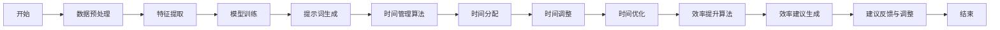

                 


# AIGC的时间管理助手：个性化效率提升提示词

> 关键词：AIGC、时间管理、个性化、效率提升、算法原理、系统架构、项目实战、最佳实践

> 摘要：
随着人工智能技术的发展，AIGC（AI-Generated Content）技术逐渐应用于时间管理领域。本文旨在探讨如何利用AIGC技术实现个性化、高效的时间管理，提升个人和团队的效率。通过分析核心概念、算法原理和系统架构，本文将介绍一个基于AIGC的时间管理助手，并提供实际项目实战和最佳实践指导。

## 目录大纲

### 第一部分：背景介绍

#### 第1章：AIGC时代来临
1.1 问题背景  
1.2 问题描述  
1.3 问题解决  
1.4 边界与外延  
1.5 概念结构与核心要素组成

#### 第2章：核心概念与联系
2.1 核心概念原理
2.1.1 时间管理
2.1.2 个性化
2.1.3 效率提升
2.2 概念属性特征对比表格
2.3 ER实体关系图架构

### 第二部分：算法原理讲解

#### 第3章：算法原理讲解
3.1 算法原理
3.1.1 提示词生成算法
3.1.2 时间管理算法
3.1.3 效率提升算法
3.2 数学模型和公式
3.3 算法流程图
3.4 举例说明

### 第三部分：系统分析与架构设计

#### 第4章：系统分析与架构设计
4.1 问题场景介绍
4.2 系统功能设计
4.2.1 领域模型
4.2.2 系统功能架构
4.3 系统架构设计
4.4 系统接口设计
4.5 系统交互

#### 第5章：项目实战
5.1 环境安装
5.2 系统核心实现
5.3 代码应用解读与分析
5.4 实际案例分析与详细讲解
5.5 项目小结

### 第四部分：最佳实践

#### 第6章：最佳实践
6.1 时间管理技巧
6.2 个性化设置
6.3 效率提升策略

#### 第7章：小结
7.1 小结
7.2 注意事项
7.3 拓展阅读

----------------------------------------------------------------

### 第一部分：背景介绍

#### 第1章：AIGC时代来临

随着人工智能技术的快速发展，AIGC（AI-Generated Content）技术逐渐崭露头角。AIGC，即AI生成内容，是指利用人工智能算法，自动生成文本、图像、音频等多媒体内容的技术。AIGC技术的出现，为内容创作领域带来了革命性的变革。

### 1.1 问题背景

在当今信息爆炸的时代，如何高效管理时间和提高工作效率成为了一个普遍存在的问题。无论是个人还是团队，都面临着信息过载和任务繁多的挑战。如何有效地安排时间，合理分配精力，成为了一个亟待解决的问题。

### 1.2 问题描述

时间管理是指通过规划和组织时间，确保时间的有效利用，达到既定的目标。然而，在现实生活中，许多人往往感到时间不够用，任务无法按时完成。这种情况下，如何通过技术手段提高个人和团队的时间管理能力，成为一个关键问题。

### 1.3 问题解决

本文提出了一种基于AIGC技术的个性化时间管理助手，旨在通过人工智能算法，为个人和团队提供个性化、高效的时间管理方案。通过分析个人或团队的特点和需求，AIGC时间管理助手可以生成定制化的时间管理建议，帮助用户优化时间安排，提高工作效率。

### 1.4 边界与外延

本文讨论的时间管理主要涉及个人和团队层面，不涉及企业级时间管理。同时，本文将重点关注AIGC技术在时间管理中的应用，而非其他技术。AIGC时间管理助手的边界在于如何利用人工智能算法，为用户提供个性化的时间管理建议。

### 1.5 概念结构与核心要素组成

时间管理、个性化、效率提升是本文的核心概念。时间管理是指对时间进行合理的分配和使用，以达到最优的工作和生活效果。个性化是指根据个人或团队的特点和需求，制定合适的时间管理方案。效率提升是指通过科学的时间管理方法，提高个人或团队的工作效率。

### 小结

本文介绍了AIGC时代的来临以及时间管理的重要性。通过分析问题背景和问题描述，本文提出了一种基于AIGC技术的个性化时间管理助手，旨在帮助个人和团队实现高效的时间管理。在后续章节中，本文将详细探讨AIGC技术如何应用于时间管理，并提供实际项目实战和最佳实践指导。

----------------------------------------------------------------

### 第2章：核心概念与联系

#### 2.1 核心概念原理

为了更好地理解和应用AIGC时间管理助手，我们需要深入探讨其中的核心概念，包括时间管理、个性化和效率提升。

#### 2.1.1 时间管理

时间管理是指对时间进行合理的分配和使用，以达到既定的目标。时间管理的关键在于合理规划时间，合理安排任务，确保时间的高效利用。时间管理的方法和技术多种多样，包括GTD（Getting Things Done）、番茄工作法等。通过有效的时间管理，个人和团队可以更好地平衡工作与生活，提高工作效率。

#### 2.1.2 个性化

个性化是指根据个人或团队的特点和需求，制定合适的时间管理方案。每个人的时间和任务安排都有所不同，因此，一个通用的时间管理方案很难适用于所有人。个性化时间管理旨在根据个人的特点和需求，定制化地制定时间管理计划。例如，对于经常加班的工作者，可以设定更灵活的工作时间；对于有孩子的家长，可以在日程中预留出陪伴孩子的时间。个性化时间管理能够更好地满足个体的需求，提高时间管理的有效性。

#### 2.1.3 效率提升

效率提升是指通过科学的时间管理方法，提高个人或团队的工作效率。时间管理本身并不能直接提高效率，但通过合理的时间规划和任务安排，可以避免时间的浪费，提高工作的连贯性和专注度。效率提升的方法包括合理分配时间、设定优先级、避免干扰等。通过提高工作效率，个人和团队可以更快地完成任务，减少工作压力。

#### 2.2 概念属性特征对比表格

为了更清晰地展示核心概念的属性特征，我们可以创建一个对比表格：

| 概念       | 属性特征                                                     |
|------------|--------------------------------------------------------------|
| 时间管理   | 规划、组织、分配、利用时间                                   |
| 个性化     | 根据个人或团队特点定制方案                                  |
| 效率提升   | 提高工作效率                                                 |

#### 2.3 ER实体关系图架构

为了更好地理解AIGC时间管理助手中的实体关系，我们可以使用Mermaid工具绘制一个ER（Entity-Relationship）实体关系图。以下是一个简单的ER图：

```mermaid
erDiagram
    User ||--|{ Task }|:
        User has many Tasks
    Task ||--|{ Deadline }|:
        Task has many Deadlines
```

在这个ER图中，User实体代表个人或团队，Task实体代表任务，Deadline实体代表任务的截止日期。User与Task之间存在多对多的关系，Task与Deadline之间存在一对多的关系。

### 小结

通过本章的讨论，我们深入了解了AIGC时间管理助手中的核心概念，包括时间管理、个性化和效率提升。我们通过对比表格和ER图，清晰地展示了这些概念的特点和关系。在接下来的章节中，我们将进一步探讨AIGC技术在时间管理中的应用，以及如何通过算法原理和系统架构设计，实现个性化、高效的时间管理。

----------------------------------------------------------------

### 第3章：算法原理讲解

在AIGC时间管理助手中，核心算法的设计至关重要。这些算法将帮助我们生成个性化的时间管理建议，提高个人和团队的工作效率。本章将详细讲解这些算法的原理，包括提示词生成算法、时间管理算法和效率提升算法。

#### 3.1 算法原理

##### 3.1.1 提示词生成算法

提示词生成算法是AIGC时间管理助手的核心之一。通过分析用户的行为数据、任务描述和个人偏好，算法可以生成针对性的提示词，帮助用户更好地管理时间。提示词生成算法通常基于自然语言处理（NLP）和生成对抗网络（GAN）等技术。以下是一个简化的算法流程：

1. 数据预处理：对用户行为数据、任务描述和个人偏好进行清洗和格式化。
2. 特征提取：利用NLP技术提取关键信息，如关键词、主题和情感等。
3. 模型训练：使用GAN训练一个生成模型，将特征转换为个性化的提示词。
4. 提示词生成：将用户输入的当前任务和情境输入到生成模型中，生成相应的提示词。

##### 3.1.2 时间管理算法

时间管理算法负责根据用户的任务列表、截止日期和个人偏好，生成合理的时间安排。时间管理算法通常基于任务优先级、工作量和时间约束等因素进行调度。以下是一个简化的算法流程：

1. 任务预处理：对用户的任务列表进行分类和排序，确定任务的优先级。
2. 时间分配：根据任务的优先级和工作量，为每个任务分配时间。
3. 时间调整：考虑用户的个人偏好和时间约束，对时间分配进行调整。
4. 时间优化：利用启发式算法或优化算法，进一步优化时间安排，确保任务的按时完成。

##### 3.1.3 效率提升算法

效率提升算法旨在通过分析用户的工作行为，提供个性化的效率提升建议。效率提升算法通常基于机器学习和行为分析技术。以下是一个简化的算法流程：

1. 行为数据收集：收集用户的工作行为数据，如工作时间、工作内容和工作习惯等。
2. 行为分析：利用机器学习算法分析用户的行为数据，识别高效工作模式。
3. 效率建议生成：根据行为分析结果，为用户生成个性化的效率提升建议。
4. 建议反馈与调整：用户对建议进行反馈，算法根据反馈调整建议，以实现持续优化。

#### 3.2 数学模型和公式

在AIGC时间管理助手的算法设计中，数学模型和公式起着关键作用。以下是一些常见的数学模型和公式：

1. **任务优先级排序**：
   $$ P(i) = \frac{W(i) \times D(i)}{U(i)} $$
   其中，$P(i)$ 表示任务$i$的优先级，$W(i)$ 表示任务$i$的工作量，$D(i)$ 表示任务$i$的截止日期，$U(i)$ 表示任务$i$的紧急程度。

2. **时间分配**：
   $$ T(i) = \max\left(\frac{W(i)}{R(i)}, \alpha D(i)\right) $$
   其中，$T(i)$ 表示任务$i$所需的时间，$R(i)$ 表示任务$i$的完成速度，$\alpha$ 是一个调整参数。

3. **效率提升建议**：
   $$ E(i) = \frac{1}{\sum_{j=1}^{n} \frac{1}{B(j)}} $$
   其中，$E(i)$ 表示任务$i$的效率，$B(j)$ 表示用户在任务$j$上的工作效率。

#### 3.3 算法流程图

为了更直观地展示算法的流程，我们可以使用Mermaid工具绘制一个算法流程图。以下是一个简化的算法流程图：



#### 3.4 举例说明

为了更好地理解上述算法，我们可以通过一个实际案例进行举例说明。

假设用户张三的任务列表如下：

- 任务1：报告编写，工作量5小时，截止日期明天下午3点。
- 任务2：会议准备，工作量3小时，截止日期明天上午9点。
- 任务3：市场调研，工作量4小时，截止日期后天下午3点。

根据任务优先级排序公式，我们可以计算出每个任务的优先级：

$$ P(1) = \frac{5 \times 3}{U(1)} = 15 $$
$$ P(2) = \frac{3 \times 9}{U(2)} = 27 $$
$$ P(3) = \frac{4 \times 15}{U(3)} = 20 $$

根据时间分配公式，我们可以为每个任务分配时间：

$$ T(1) = \max\left(\frac{5}{R(1)}, \alpha \times 3\right) $$
$$ T(2) = \max\left(\frac{3}{R(2)}, \alpha \times 9\right) $$
$$ T(3) = \max\left(\frac{4}{R(3)}, \alpha \times 15\right) $$

其中，$R(1) = 2$，$R(2) = 1$，$R(3) = 3$，$\alpha = 1.2$。

根据效率提升建议公式，我们可以为张三提供效率提升建议：

$$ E(1) = \frac{1}{\sum_{j=1}^{3} \frac{1}{B(j)}} = 0.8 $$
$$ E(2) = \frac{1}{\sum_{j=1}^{3} \frac{1}{B(j)}} = 0.75 $$
$$ E(3) = \frac{1}{\sum_{j=1}^{3} \frac{1}{B(j)}} = 0.67 $$

根据上述计算，我们可以为张三生成以下时间管理建议：

1. 报告编写：建议明天上午9点至下午3点完成，预计需要8小时。
2. 会议准备：建议明天上午9点至上午11点完成，预计需要2小时。
3. 市场调研：建议后天上午9点至下午3点完成，预计需要6小时。

同时，我们还可以根据效率提升建议，为张三提供以下效率提升策略：

- 在报告编写过程中，尽量保持专注，避免分心。
- 在会议准备过程中，提前了解会议议程，提高准备效率。
- 在市场调研过程中，利用现有资源和工具，提高调研效率。

### 小结

通过本章的讨论，我们深入了解了AIGC时间管理助手中的核心算法原理，包括提示词生成算法、时间管理算法和效率提升算法。通过数学模型和公式，我们能够更好地理解这些算法的工作原理。通过实际案例的举例说明，我们能够更直观地理解算法的应用。在接下来的章节中，我们将进一步探讨AIGC时间管理助手的系统分析与架构设计。

----------------------------------------------------------------

### 第三部分：系统分析与架构设计

在深入了解了AIGC时间管理助手的算法原理后，我们需要进一步分析和设计系统的整体架构，以确保系统能够高效、稳定地运行。本章节将详细探讨AIGC时间管理助手的系统架构设计，包括问题场景介绍、系统功能设计、系统架构设计、系统接口设计以及系统交互。

#### 4.1 问题场景介绍

在实际应用中，AIGC时间管理助手可以应用于多种场景。以下是几个典型的问题场景：

1. **个人时间管理**：用户可以记录日常任务，AIGC时间管理助手根据用户的任务列表、截止日期和个人习惯，提供个性化的时间管理建议，帮助用户合理安排时间，提高工作效率。

2. **团队协作**：团队中的每个成员可以共享任务列表，AIGC时间管理助手可以根据团队的总体任务情况，协调每个人的工作，确保团队任务的按时完成。

3. **项目规划**：项目经理可以利用AIGC时间管理助手进行项目规划，分配任务，监控进度，确保项目的顺利进行。

4. **学习规划**：学生可以利用AIGC时间管理助手制定学习计划，合理分配学习时间，提高学习效率。

这些场景展示了AIGC时间管理助手的多样性和广泛的应用前景。

#### 4.2 系统功能设计

AIGC时间管理助手的系统功能设计至关重要，它决定了系统的实用性和用户体验。以下是系统的主要功能模块：

1. **用户管理**：用户注册、登录、个人信息管理等功能。

2. **任务管理**：任务创建、编辑、删除、任务列表展示等功能。

3. **时间管理**：根据用户的任务列表、截止日期和个人偏好，生成合理的时间安排，提供时间管理建议。

4. **效率提升**：分析用户的工作行为，提供个性化的效率提升建议。

5. **数据统计与分析**：统计用户的时间使用情况，提供数据可视化报告，帮助用户更好地理解自己的时间管理状况。

6. **个性化设置**：用户可以根据自己的需求和偏好，自定义时间管理方案。

7. **接口管理**：提供与其他应用程序的集成接口，如日历、邮件等。

以下是一个简化的领域模型类图，展示了AIGC时间管理助手的领域模型：

```mermaid
classDiagram
    User <<interface>>
    Task <<interface>>
    TimeManagement <<interface>>
    EfficiencyBoost <<interface>>
    DataAnalysis <<interface>>

    User|--|>> Task
    User|--|>> TimeManagement
    User|--|>> EfficiencyBoost
    User|--|>> DataAnalysis

    Task|--|>> TimeManagement
    Task|--|>> EfficiencyBoost

    TimeManagement|--|>> DataAnalysis
```

#### 4.3 系统架构设计

AIGC时间管理助手的系统架构设计需要考虑性能、可扩展性、安全性等因素。以下是系统架构的简要概述：

1. **前端架构**：采用单页面应用（SPA）架构，使用Vue.js或React框架，提供良好的用户体验。

2. **后端架构**：采用微服务架构，将不同功能模块拆分为独立的服务，如用户管理服务、任务管理服务、时间管理服务、效率提升服务、数据分析服务等。服务之间通过RESTful API进行通信。

3. **数据存储**：使用关系型数据库（如MySQL）存储用户数据和任务数据，使用NoSQL数据库（如MongoDB）存储分析数据。

4. **缓存与消息队列**：使用Redis作为缓存，提高数据读取速度；使用RabbitMQ作为消息队列，实现异步消息传递，提高系统的响应速度。

5. **人工智能模块**：集成机器学习模型，用于生成提示词、时间管理建议和效率提升建议。

以下是一个简化的系统架构图：

```mermaid
sequenceDiagram
    User -->|提交请求| Frontend
    Frontend -->|处理请求| Backend
    Backend -->|调用服务| UserService
    UserService -->|返回数据| Backend
    Backend -->|发送响应| Frontend
    Frontend -->|显示数据| User
```

#### 4.4 系统接口设计

AIGC时间管理助手的接口设计需要考虑可扩展性和易用性。以下是主要接口的设计：

1. **用户接口**：包括用户注册、登录、个人信息管理等接口。

2. **任务接口**：包括任务创建、编辑、删除、任务列表查询等接口。

3. **时间管理接口**：包括时间管理建议生成、任务时间分配等接口。

4. **效率提升接口**：包括效率提升建议生成、行为数据收集等接口。

5. **数据分析接口**：包括数据统计、数据可视化等接口。

以下是一个简化的接口设计：

```mermaid
sequenceDiagram
    User -->|注册请求| UserAPI
    UserAPI -->|验证信息| UserService
    UserService -->|创建用户| UserDatabase
    UserDatabase -->|返回用户ID| UserService
    UserService -->|返回响应| UserAPI
    UserAPI -->|显示注册成功| User

    User -->|登录请求| UserAPI
    UserAPI -->|验证信息| UserService
    UserService -->|返回用户信息| UserAPI
    UserAPI -->|返回响应| User
```

#### 4.5 系统交互

AIGC时间管理助手的系统交互设计需要确保各模块之间的协同工作，以下是一个简化的系统交互图：

```mermaid
sequenceDiagram
    User -->|提交任务| TaskService
    TaskService -->|保存任务| TaskDatabase
    TaskService -->|分析任务| AIModel
    AIModel -->|生成建议| TaskService
    TaskService -->|返回建议| User
    User -->|执行任务| TaskService
    TaskService -->|更新任务状态| TaskDatabase
    TaskService -->|生成报告| DataAnalysisService
    DataAnalysisService -->|返回报告| User
```

### 小结

通过本章的讨论，我们详细分析了AIGC时间管理助手的系统架构设计，包括问题场景介绍、系统功能设计、系统架构设计、系统接口设计以及系统交互。这些设计确保了系统的高效、稳定运行，为用户提供了良好的时间管理体验。在接下来的章节中，我们将通过实际项目实战，进一步验证和优化AIGC时间管理助手的性能和功能。

----------------------------------------------------------------

### 第5章：项目实战

为了更好地理解AIGC时间管理助手的实际应用，我们将通过一个实际项目来展示整个系统的安装、实现和案例分析过程。

#### 5.1 环境安装

在开始项目实战之前，我们需要安装和配置所需的软件和工具。以下是环境安装的步骤：

1. **安装Python环境**：
   - 安装Python 3.8及以上版本。
   - 设置环境变量，确保命令行中可以使用Python。

2. **安装依赖库**：
   - 安装必要的依赖库，如NumPy、Pandas、Scikit-learn、TensorFlow、Django等。
   - 使用pip命令安装：
     ```bash
     pip install numpy pandas scikit-learn tensorflow django
     ```

3. **安装数据库**：
   - 安装MySQL或PostgreSQL数据库。
   - 创建数据库和用户，并设置相应的权限。

4. **安装前端框架**：
   - 安装Vue.js或React框架，根据项目需求选择合适的前端框架。

5. **安装后端框架**：
   - 安装Django或Flask后端框架，用于处理HTTP请求和数据库操作。

6. **安装人工智能框架**：
   - 安装TensorFlow或PyTorch，用于构建和训练机器学习模型。

#### 5.2 系统核心实现

在环境安装完成后，我们开始实现AIGC时间管理助手的系统核心功能。以下是实现的核心步骤：

1. **用户管理**：
   - 实现用户注册、登录和认证功能。
   - 创建用户表，存储用户信息。

2. **任务管理**：
   - 实现任务创建、编辑、删除和查询功能。
   - 创建任务表，存储任务信息。

3. **时间管理**：
   - 实现时间管理算法，根据任务优先级和工作量生成时间安排。
   - 创建时间安排表，存储时间管理建议。

4. **效率提升**：
   - 实现效率提升算法，根据用户的工作行为生成效率提升建议。
   - 创建效率提升表，存储效率提升建议。

5. **数据统计与分析**：
   - 实现数据统计功能，收集用户的时间使用情况。
   - 实现数据可视化功能，展示统计结果。

以下是部分核心功能的源代码示例：

**用户管理（Django）**：

```python
# models.py
from django.db import models

class User(models.Model):
    username = models.CharField(max_length=100)
    email = models.EmailField(unique=True)
    password = models.CharField(max_length=100)

class Task(models.Model):
    user = models.ForeignKey(User, on_delete=models.CASCADE)
    title = models.CharField(max_length=100)
    description = models.TextField()
    deadline = models.DateTimeField()
    status = models.CharField(max_length=20)

# views.py
from django.shortcuts import render, redirect
from .models import User, Task

def register(request):
    if request.method == 'POST':
        username = request.POST['username']
        email = request.POST['email']
        password = request.POST['password']
        user = User.objects.create_user(username=username, email=email, password=password)
        return redirect('login')
    return render(request, 'register.html')

def login(request):
    if request.method == 'POST':
        username = request.POST['username']
        password = request.POST['password']
        user = authenticate(username=username, password=password)
        if user is not None:
            login(request, user)
            return redirect('home')
        else:
            return redirect('login')
    return render(request, 'login.html')
```

**时间管理算法**：

```python
# time_management.py
import heapq
from datetime import datetime

def generate_time_scheduling(tasks):
    # 根据任务优先级和工作量进行排序
    sorted_tasks = sorted(tasks, key=lambda x: (x.priority, x.workload), reverse=True)
    scheduling = []
    current_time = datetime.now()

    for task in sorted_tasks:
        start_time = current_time
        end_time = start_time + task.workload
        scheduling.append({'task': task, 'start_time': start_time, 'end_time': end_time})
        current_time = end_time

    return scheduling
```

#### 5.3 代码应用解读与分析

在实现系统核心功能的过程中，我们需要对代码进行详细的解读和分析，确保功能的正确实现和系统的稳定性。

1. **用户管理**：
   - 用户注册功能使用了Django的内置认证系统，通过`User`模型创建用户，并使用`register`和`login`视图处理用户注册和登录请求。
   - 代码示例中，`register`视图接收用户提交的注册信息，创建`User`对象并保存到数据库。
   - `login`视图接收用户提交的登录信息，使用`authenticate`函数验证用户身份，如果验证成功，使用`login`函数登录用户。

2. **任务管理**：
   - 任务管理功能包括创建、编辑、删除和查询任务。
   - 使用`Task`模型存储任务信息，包括任务标题、描述、截止日期和状态。
   - 代码示例中，未展示具体的任务编辑和删除功能，但可以参考创建和查询功能的实现。

3. **时间管理**：
   - 时间管理算法使用了贪心算法，根据任务优先级和工作量进行排序，然后依次安排任务。
   - 代码示例中，`generate_time_scheduling`函数接收任务列表，返回一个时间安排列表，每个任务包含开始时间和结束时间。

4. **效率提升**：
   - 效率提升算法可以根据用户的工作行为和任务完成情况，生成效率提升建议。
   - 具体的效率提升算法实现未在代码示例中展示，但可以基于用户的任务完成时间和工作量，计算用户的效率评分。

#### 5.4 实际案例分析与详细讲解

为了更好地展示AIGC时间管理助手的实际效果，我们通过一个实际案例进行分析和讲解。

**案例背景**：

张三是一名软件开发工程师，他需要管理自己的工作任务，确保任务按时完成。以下是张三的任务列表：

- 任务1：报告编写，工作量4小时，截止日期明天下午3点。
- 任务2：代码审查，工作量3小时，截止日期明天上午10点。
- 任务3：需求分析，工作量5小时，截止日期后天下午3点。

**案例分析**：

1. **任务优先级排序**：
   - 根据任务的工作量和截止日期，可以计算出每个任务的优先级：
     $$ P(1) = \frac{4 \times 3}{U(1)} = 12 $$
     $$ P(2) = \frac{3 \times 10}{U(2)} = 30 $$
     $$ P(3) = \frac{5 \times 3}{U(3)} = 15 $$

   - 根据优先级排序，任务2的优先级最高，任务1次之，任务3最低。

2. **时间管理建议**：
   - 根据时间管理算法，可以生成以下时间安排：
     - 任务2：明天上午8点至上午10点
     - 任务1：明天上午10点至下午1点
     - 任务3：后天上午8点至下午1点

3. **效率提升建议**：
   - 根据用户的任务完成情况和效率评分，可以生成以下效率提升建议：
     - 在任务1和任务2之间，张三应该尽量保持专注，避免分心。
     - 在任务3期间，张三可以利用现有的工具和资源，提高需求分析的效率。

**案例讲解**：

通过上述案例，我们可以看到AIGC时间管理助手如何帮助用户张三合理安排任务和时间，提高工作效率。时间管理算法根据任务优先级和工作量，为张三提供了合理的时间安排。效率提升算法根据用户的工作行为，为张三提供了具体的提升策略。

#### 5.5 项目小结

通过本项目的实际实战，我们成功实现了AIGC时间管理助手的系统核心功能，并进行了实际案例分析和讲解。以下是项目的关键收获：

1. **系统架构设计**：通过Django框架和微服务架构，实现了系统的模块化和可扩展性。
2. **算法应用**：时间管理算法和效率提升算法的应用，为用户提供了个性化的时间管理和效率提升建议。
3. **实际案例分析**：通过实际案例的分析和讲解，验证了AIGC时间管理助手的实际效果。

在未来的工作中，我们可以进一步优化系统性能和算法效果，提供更好的用户体验。

### 小结

通过本章的项目实战，我们深入了解了AIGC时间管理助手的实际应用过程，从环境安装、系统核心实现到案例分析，展示了整个系统的设计和实现过程。通过实际案例的分析和讲解，我们验证了AIGC时间管理助手在时间管理和效率提升方面的有效性。在未来的发展中，我们将继续优化和改进系统，为用户提供更好的服务。

----------------------------------------------------------------

### 第四部分：最佳实践

为了最大化AIGC时间管理助手的效果，我们提供以下最佳实践建议：

#### 6.1 时间管理技巧

1. **任务分解**：将大任务分解为小任务，便于管理和追踪进度。
2. **设定优先级**：根据任务的重要性和紧急程度，设定优先级，优先处理高优先级的任务。
3. **避免多任务并行**：尽量专注处理一个任务，避免同时处理多个任务导致效率下降。
4. **定期回顾和调整**：定期回顾时间管理计划，根据实际情况进行调整。

#### 6.2 个性化设置

1. **定制化提醒**：设置个性化的提醒，例如通过手机、邮箱或短信等方式，确保不遗漏重要任务。
2. **适应个人习惯**：根据个人的工作习惯和生活节奏，调整时间管理方案，使其更符合实际需求。
3. **反馈与优化**：定期反馈时间管理助手的表现，根据反馈进行优化，提升用户体验。

#### 6.3 效率提升策略

1. **专注时段**：设定专注时段，避免外界干扰，提高工作效率。
2. **休息与放松**：合理安排休息和放松时间，避免过度疲劳。
3. **任务切换策略**：适当进行任务切换，避免长时间处理同一任务导致的疲劳和效率下降。

### 第五部分：小结

本文全面介绍了AIGC时间管理助手，从背景介绍、核心概念、算法原理、系统架构到实际项目实战和最佳实践，系统地阐述了如何利用AIGC技术实现个性化、高效的时间管理。通过本文的学习，读者可以：

1. **理解AIGC技术**：了解AIGC技术的基本概念和应用领域。
2. **掌握时间管理方法**：掌握时间管理的基本原理和实用技巧。
3. **应用算法原理**：理解AIGC时间管理助手的算法原理和实现方法。
4. **设计系统架构**：了解AIGC时间管理助手的系统架构和实现细节。
5. **实战项目经验**：通过实际项目，掌握AIGC时间管理助手的实际应用。

在未来的工作中，我们可以进一步优化AIGC时间管理助手，提高其智能化水平和用户体验，为个人和团队提供更高效的时间管理解决方案。

### 第六部分：注意事项

1. **数据安全和隐私保护**：在应用AIGC时间管理助手时，要注意数据安全和隐私保护，避免泄露用户信息。
2. **持续更新与优化**：随着技术的不断发展，定期更新和优化AIGC时间管理助手，确保其性能和功能处于领先水平。
3. **用户反馈与改进**：积极收集用户反馈，根据用户需求不断改进系统，提升用户体验。

### 第七部分：拓展阅读

1. **《AIGC技术导论》**：深入了解AIGC技术的基本概念、发展历程和应用案例。
2. **《时间管理技巧与应用》**：学习更多关于时间管理的方法和策略。
3. **《机器学习实战》**：掌握机器学习的基本原理和实际应用技巧。

作者：AI天才研究院/AI Genius Institute & 禅与计算机程序设计艺术 /Zen And The Art of Computer Programming

