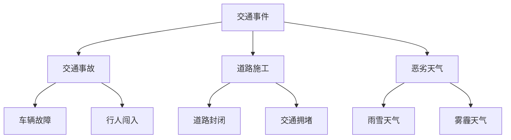

                 

### 文章标题与关键词

# AIGC的未来交通规划：智能路网设计的提示词工程

> 关键词：人工智能生成内容（AIGC）、智能交通规划、路网设计、提示词工程

> 摘要：本文将深入探讨人工智能生成内容（AIGC）在智能交通规划中的应用，特别是智能路网设计的提示词工程。我们将从背景、核心概念、技术体系、应用场景、发展趋势等方面逐一分析，以期为未来的交通规划提供新思路和新方法。

### 引言

**1.1 问题背景**

随着城市化进程的加速，全球范围内的交通拥堵问题日益严重。传统的交通管理系统已经无法满足现代社会的需求，智能交通系统（ITS）因此崛起。智能交通系统通过整合交通信息、车辆信息、道路信息等，实现交通流量的实时监控和调度，从而缓解交通拥堵。然而，ITS的发展面临着数据采集、处理、分析等方面的挑战，这为人工智能生成内容（AIGC）的应用提供了契机。

**1.2 核心概念**

人工智能生成内容（AIGC）是一种基于人工智能技术的自动生成内容的方法，包括文本、图像、音频等多种形式。AIGC通过模型学习和数据驱动，能够生成高质量的内容，具有较高的应用潜力。在智能路网设计中，提示词工程是一种利用人工智能技术来生成和优化交通提示词的方法，能够有效提升交通管理效率和安全性。

**1.3 目标与边界**

本文的目标是探讨AIGC在智能路网设计中的应用，特别是提示词工程的实践。我们将从理论到实践，逐步分析AIGC的技术体系、智能路网设计的关键要素以及提示词工程的具体应用。本文的研究边界主要限于AIGC在智能交通规划中的应用，不涉及其他领域。

**1.4 本书结构**

本文分为七个部分，首先介绍AIGC的基础知识，包括概述、技术体系和应用场景；接着介绍智能路网设计的基础知识，包括概述、架构、数据采集与处理、仿真与评估；然后深入探讨提示词工程的生成技术和筛选优化方法；最后通过一个实际项目案例，展示AIGC和提示词工程在智能交通规划中的应用。希望通过本文的探讨，能够为未来的交通规划提供有益的参考。

### AIGC基础知识

**2.1 AIGC概述**

人工智能生成内容（AIGC，Artificial Intelligence Generated Content）是一种利用人工智能技术，特别是深度学习和自然语言处理（NLP）技术，来自动生成文本、图像、音频等多种形式的内容。AIGC的核心在于模型学习和数据驱动，通过大量的数据训练，模型能够理解和生成与输入数据相似的内容。

**2.1.1 AIGC的定义**

AIGC是一种内容生成方法，它利用人工智能技术，特别是生成对抗网络（GAN）、变分自编码器（VAE）、自注意力机制（Transformer）等算法，自动生成高质量的内容。AIGC不仅能够模仿人类创作的风格，还能够创造全新的内容，从而拓宽了人工智能的应用范围。

**2.1.2 AIGC与传统AI的区别**

传统AI主要依赖于规则和模式匹配，而AIGC则更侧重于模型学习和数据驱动。传统AI在处理静态数据时表现出色，但在处理动态、复杂的场景时，往往力不从心。而AIGC通过大量数据的学习和生成，能够更好地应对动态变化的场景，具有更高的灵活性和适应性。

**2.1.3 AIGC的核心技术**

AIGC的核心技术主要包括生成对抗网络（GAN）、变分自编码器（VAE）和自注意力机制（Transformer）等。

**2.2 AIGC的技术体系**

**2.2.1 生成对抗网络（GAN）**

生成对抗网络（GAN）由生成器和判别器两个神经网络组成。生成器生成假样本，判别器判断生成样本和真实样本的区别。通过不断优化，生成器能够生成越来越真实的内容。GAN在图像生成、文本生成等领域取得了显著成果。

**2.2.2 自注意力机制（SA）**

自注意力机制（Self-Attention，SA）是Transformer模型的核心机制。它通过计算输入序列中每个元素与其他元素的相关性，为每个元素分配不同的权重，从而提高模型的表示能力。自注意力机制在文本生成、机器翻译等领域具有广泛的应用。

**2.2.3 对抗性学习（RL）**

对抗性学习（Reinforcement Learning，RL）是一种基于奖励机制的机器学习方法。在AIGC中，对抗性学习主要用于生成器和判别器的训练。通过不断的试错和反馈，生成器和判别器能够逐步提高生成内容的质量。

**2.3 AIGC的应用场景**

AIGC的应用场景非常广泛，包括但不限于以下几个方面：

**2.3.1 媒体娱乐**

在媒体娱乐领域，AIGC可以用于生成视频、音乐、绘画等。例如，通过GAN技术，可以生成高质量的视频和图像；通过自注意力机制，可以生成与用户喜好相匹配的音乐。

**2.3.2 智能交通**

在智能交通领域，AIGC可以用于交通流预测、交通调度、自动驾驶等。例如，通过生成对抗网络，可以预测未来一段时间内的交通流量，从而优化交通信号灯的调度策略。

**2.4 AIGC的发展趋势**

随着技术的不断进步，AIGC在应用场景和性能上都将取得更大的突破。未来的AIGC将更加智能化、个性化，能够更好地服务于人类社会。

### 智能路网设计基础

**3.1 智能路网概述**

智能路网是一种基于物联网、云计算、人工智能等技术的综合交通管理系统，它能够实时感知交通状态，动态调整交通流，从而提高交通效率、降低交通事故发生率。

**3.1.1 智能路网的定义与特征**

智能路网是利用先进的信息技术和通信技术，对交通系统进行全方位监控和管理的一种网络。它具有以下几个特征：

- **实时性**：智能路网能够实时收集交通信息，如车流量、车速、道路状况等，为交通管理提供及时的数据支持。
- **高效性**：智能路网通过优化交通信号灯、车辆调度等，提高交通流的通行效率。
- **安全性**：智能路网通过实时监控和预警系统，降低交通事故的发生率。

**3.1.2 智能路网的发展历程**

智能路网的发展可以分为以下几个阶段：

- **第一阶段（20世纪90年代）**：以道路监测和信号控制为核心，实现基本的交通信息采集和信号控制。
- **第二阶段（21世纪初）**：引入物联网和云计算技术，实现交通信息的集中管理和智能分析。
- **第三阶段（当前）**：结合人工智能和大数据技术，实现交通预测、智能调度等功能。

**3.1.3 智能路网的关键技术**

智能路网的关键技术包括以下几个方面：

- **物联网技术**：通过传感器和通信设备，实时采集交通信息。
- **云计算技术**：对大量交通数据进行存储、处理和分析。
- **人工智能技术**：用于交通流量预测、信号控制优化等。

### 智能路网架构

智能路网架构可以分为硬件层、软件层和数据处理层。

**3.2.1 硬件层**

硬件层包括道路监测设备、通信设备、车辆传感器等。这些设备负责实时采集交通信息，如车流量、车速、道路状况等。

- **道路监测设备**：包括摄像头、地感线圈、雷达等，用于监测道路状态。
- **通信设备**：包括无线传感器网络、5G网络等，用于传输交通信息。
- **车辆传感器**：包括GPS、速度传感器等，用于监测车辆状态。

**3.2.2 软件层**

软件层包括交通信息处理系统、交通控制系统等。这些系统负责对采集到的交通信息进行处理和分析，并根据分析结果进行交通调度。

- **交通信息处理系统**：负责对交通信息进行过滤、清洗、分析等，生成交通报表和预测数据。
- **交通控制系统**：根据交通信息，动态调整交通信号灯、车辆调度等，以优化交通流。

**3.2.3 数据处理层**

数据处理层包括数据存储、数据分析和数据可视化等。这些功能负责对交通数据进行存储、处理和分析，并将分析结果以可视化的形式呈现。

- **数据存储**：用于存储大量的交通数据，如车流量、车速、道路状况等。
- **数据分析**：用于分析交通数据的规律，如交通流量高峰期、交通事故热点等。
- **数据可视化**：将分析结果以图表、地图等形式展示，便于交通管理人员进行决策。

### 智能路网数据采集与处理

智能路网的数据采集和处理是智能交通系统的重要组成部分。数据采集负责收集交通信息，而数据处理则负责对收集到的数据进行清洗、分析和存储，以便为交通管理和调度提供支持。

**3.3.1 数据采集技术**

数据采集技术主要包括传感器网络、通信技术等。

- **传感器网络**：传感器网络是由大量传感器组成的分布式系统，用于监测道路状态、车辆状态等。传感器网络可以分为路侧传感器和车载传感器。路侧传感器通常安装在道路旁边，用于监测车流量、车速、道路状况等；车载传感器则安装在车辆内部，用于监测车辆状态、驾驶员行为等。

- **通信技术**：通信技术用于传输传感器采集到的交通信息。常见的通信技术包括无线传感器网络（WSN）、5G网络等。无线传感器网络具有低成本、低功耗的特点，适用于大规模交通信息的采集和传输；5G网络则具有高速、低延迟的特点，适用于实时交通信息的传输和处理。

**3.3.2 数据处理方法**

数据处理方法主要包括数据预处理、数据分析和数据存储等。

- **数据预处理**：数据预处理是数据处理的第一步，主要包括数据的清洗、去噪、归一化等。数据清洗是为了去除数据中的错误和异常值；去噪是为了去除数据中的噪声；归一化是为了将不同特征的数据统一到相同的尺度。

- **数据分析**：数据分析是数据处理的核心步骤，主要包括数据可视化、聚类、分类、预测等。数据可视化用于展示数据的特点和趋势；聚类用于发现数据中的相似性；分类用于将数据分为不同的类别；预测用于预测未来的交通状况。

- **数据存储**：数据存储是数据处理的重要环节，主要包括关系型数据库、NoSQL数据库、大数据处理平台等。关系型数据库适用于结构化数据的存储；NoSQL数据库适用于非结构化数据的存储；大数据处理平台适用于大规模数据的处理和分析。

### 智能路网仿真与评估

智能路网的仿真与评估是验证智能交通系统设计方案的重要手段。通过仿真和评估，可以模拟不同交通场景下的系统性能，从而优化交通管理策略。

**3.4.1 仿真模型建立**

仿真模型的建立是进行智能路网仿真的第一步。仿真模型通常包括以下几个组成部分：

- **交通场景建模**：交通场景建模是仿真模型的核心，包括道路网络、交通流特征、交通事件等。道路网络描述了交通系统的拓扑结构；交通流特征描述了车辆的流量、速度等属性；交通事件描述了交通事故、道路施工等事件。

- **交通信号控制建模**：交通信号控制建模用于模拟交通信号灯的运行状态。常见的交通信号控制模型包括定时控制、自适应控制等。

- **车辆行为建模**：车辆行为建模用于模拟车辆在交通系统中的运行状态。车辆行为模型通常包括车辆的速度、加速度、行驶轨迹等。

**3.4.2 仿真算法选择**

仿真算法的选择取决于仿真模型和仿真目标。常见的仿真算法包括：

- **事件调度算法**：事件调度算法用于模拟交通事件的发生和传播。例如，在模拟交通事故时，事件调度算法可以模拟事故的发生、扩散和清除过程。

- **队列模拟算法**：队列模拟算法用于模拟交通流在信号灯下的排队和行驶过程。常见的队列模拟算法包括车头时距模型、最大排队长度模型等。

- **多智能体仿真算法**：多智能体仿真算法用于模拟交通系统中的多个车辆的行为。常见的多智能体仿真算法包括社会力模型、交通流模型等。

**3.4.3 评估指标与方法**

智能路网的评估指标和方法用于评估仿真结果的有效性。常见的评估指标包括：

- **通行效率**：通行效率是评估交通系统运行状况的重要指标，通常用车辆的平均速度、行程时间等来衡量。

- **交通拥堵指数**：交通拥堵指数是评估交通拥堵程度的指标，通常用车辆的平均行驶速度与自由流速度的比值来衡量。

- **安全性**：安全性是评估交通系统的重要指标，通常用事故发生率、事故严重程度等来衡量。

评估方法通常包括以下步骤：

1. **数据收集**：收集仿真过程中的交通数据，如车辆速度、行程时间等。

2. **数据预处理**：对收集到的数据进行分析，如计算平均速度、行程时间等。

3. **结果分析**：根据评估指标，分析仿真结果，如绘制交通流量分布图、拥堵指数变化曲线等。

4. **结果评价**：根据仿真结果，评价交通管理策略的有效性，并提出优化建议。

### 提示词工程概述

**4.1.1 提示词的定义与作用**

提示词（Keywords或Prompts）是在信息检索、自然语言处理等领域中常用的一种输入方式，用于引导模型或系统在特定方向上进行学习和生成。在智能交通规划中，提示词工程是一种利用人工智能技术，特别是自然语言处理和生成对抗网络（GAN）等，自动生成和优化用于指导交通管理决策的关键词和提示信息的方法。

**4.1.2 提示词工程的流程**

提示词工程主要包括以下几个步骤：

1. **数据收集与预处理**：收集相关交通数据，如实时交通流量、事故报告、交通规则等，并进行数据清洗、归一化和特征提取。

2. **提示词生成**：利用生成对抗网络（GAN）或变换器（Transformer）等生成模型，根据输入数据生成高质量的提示词。

3. **提示词筛选与优化**：对生成的提示词进行筛选和优化，确保它们能够有效地指导交通管理决策，并符合实际应用需求。

4. **模型评估与迭代**：通过实际交通管理任务的表现，对生成模型进行评估和优化，以提高提示词的生成质量。

**4.1.3 提示词工程的重要性**

提示词工程在智能交通规划中具有重要价值：

- **提高交通管理效率**：通过自动生成的提示词，交通管理人员可以更快速、准确地获取交通信息，从而优化交通调度和信号控制策略。

- **增强交通安全性**：通过识别潜在的危险事件和交通状况，提示词可以帮助交通系统提前预警，减少交通事故的发生。

- **实现个性化服务**：根据不同的交通场景和用户需求，提示词工程可以生成个性化的交通提示信息，提高用户体验。

### 提示词生成技术

提示词生成是智能交通规划中的重要环节，它决定了提示词的质量和有效性。提示词生成技术可以分为数据驱动和知识驱动两种类型。

**4.2.1 数据驱动的提示词生成**

数据驱动的提示词生成方法主要利用大量的交通数据，通过机器学习算法自动生成提示词。这种方法的核心在于如何从数据中提取有用的特征，并利用这些特征来生成高质量的提示词。

1. **数据预处理**：首先，需要对收集到的交通数据进行预处理，包括数据清洗、去噪、归一化等操作。数据预处理是保证后续模型训练质量的重要步骤。

2. **特征提取**：然后，从预处理后的数据中提取特征。特征提取的方法有很多，如TF-IDF、Word2Vec、BERT等。这些方法可以将原始的交通数据转换为机器学习模型可以理解的向量表示。

3. **模型选择与训练**：选择合适的机器学习模型进行训练，如生成对抗网络（GAN）、变换器（Transformer）等。这些模型可以通过学习大量交通数据的分布，生成高质量的提示词。

4. **提示词生成**：利用训练好的模型，输入新的交通数据，生成相应的提示词。生成的方法可以是文本生成、图像生成或两者结合。

**4.2.1.1 提示词自动生成算法**

在提示词自动生成算法中，生成对抗网络（GAN）和变换器（Transformer）是最常用的两种模型。

1. **生成对抗网络（GAN）**：GAN由生成器和判别器两个神经网络组成。生成器的任务是生成高质量的提示词，判别器的任务是区分生成提示词和真实提示词。通过不断的训练，生成器能够生成越来越高质量的提示词。

   ```python
   import tensorflow as tf
   from tensorflow.keras.models import Model
   from tensorflow.keras.layers import Input, Dense, LSTM

   # 定义生成器和判别器
   generator = Model(inputs=[input_features], outputs=[generated_prompt])
   discriminator = Model(inputs=[input_features, generated_prompt], outputs=[discriminator_output])

   # 编写GAN的训练循环
   for epoch in range(num_epochs):
       for batch in data_loader:
           # 训练生成器和判别器
           with tf.GradientTape() as gen_tape, tf.GradientTape() as disc_tape:
               generated_prompt = generator(batch)
               real_output = discriminator([batch, batch])
               fake_output = discriminator([batch, generated_prompt])

               gen_loss = compute_generator_loss(fake_output)
               disc_loss = compute_discriminator_loss(real_output, fake_output)

               grads = tape.gradient(loss, model.trainable_variables)
               optimizer.apply_gradients(zip(grads, model.trainable_variables))
   ```

2. **变换器（Transformer）**：变换器是一种基于自注意力机制的深度神经网络模型，它在机器翻译、文本生成等领域取得了显著成果。变换器通过自注意力机制，可以捕捉输入序列中每个元素与其他元素之间的相关性，从而生成高质量的提示词。

   ```python
   import tensorflow as tf
   from tensorflow.keras.layers import Embedding, LSTM, Dense

   # 定义变换器模型
   inputs = Input(shape=(max_sequence_length,))
   embedding = Embedding(input_dim=vocab_size, output_dim=embedding_size)(inputs)
   lstm = LSTM(units=lstm_units)(embedding)
   outputs = Dense(units=vocab_size, activation='softmax')(lstm)

   model = Model(inputs=inputs, outputs=outputs)

   # 编写变换器的训练循环
   for epoch in range(num_epochs):
       for batch in data_loader:
           with tf.GradientTape() as tape:
               predictions = model(batch)
               loss = compute_loss(batch, predictions)

           grads = tape.gradient(loss, model.trainable_variables)
           optimizer.apply_gradients(zip(grads, model.trainable_variables))
   ```

**4.2.1.2 提示词优化策略**

在提示词生成过程中，优化策略是提高提示词质量的关键。以下是一些常用的提示词优化策略：

1. **循环优化**：通过多次迭代，逐步优化提示词的质量。每次迭代都根据前一次的提示词进行改进，直到达到满意的生成质量。

2. **多样性增强**：通过引入多样性机制，如随机性、噪声等，增强生成的提示词的多样性。这样，生成的提示词不仅质量高，而且具有丰富的信息。

3. **注意力机制**：通过引入注意力机制，使模型能够关注输入数据中的重要信息，从而生成更准确的提示词。

4. **对抗训练**：通过对抗训练，使生成器和判别器在训练过程中相互竞争，从而提高生成提示词的质量。

**4.2.2 知识驱动的提示词生成**

知识驱动的提示词生成方法主要利用外部知识库，通过知识图谱、本体论等方法，生成高质量的提示词。

1. **知识图谱的应用**：知识图谱是一种结构化的知识表示方法，它可以表示实体、关系和属性等信息。在提示词生成中，可以利用知识图谱，根据交通数据中的实体和关系，生成相关的提示词。

2. **知识融合策略**：知识融合是将外部知识和内部数据相结合，生成高质量的提示词。常用的知识融合策略包括：

   - **实体识别与融合**：通过实体识别技术，识别交通数据中的实体，并将其与知识库中的实体进行融合，生成相关的提示词。
   - **关系推理与融合**：通过关系推理技术，识别交通数据中的关系，并将其与知识库中的关系进行融合，生成相关的提示词。

**4.2.2.1 知识图谱的应用**

知识图谱在智能交通规划中具有广泛的应用。以下是一个简单的知识图谱应用示例：



在这个知识图谱中，交通事件（A）可以是多种类型，如交通事故（B）、道路施工（C）、恶劣天气（D）等。通过知识图谱，可以自动生成与交通事件相关的提示词，如“请注意，前方发生交通事故，请减速慢行”，“道路施工，请绕行”等。

**4.2.2.2 知识融合策略**

知识融合策略是将外部知识和内部数据相结合，生成高质量的提示词。以下是一个简单的知识融合策略示例：

1. **实体识别与融合**：首先，利用实体识别技术，识别交通数据中的实体，如“交通事故”、“道路施工”等。然后，将这些实体与知识库中的实体进行融合，生成相关的提示词。

2. **关系推理与融合**：首先，利用关系推理技术，识别交通数据中的关系，如“交通事故”与“车辆故障”之间的关系。然后，将这些关系与知识库中的关系进行融合，生成相关的提示词。

通过知识融合策略，可以生成更加准确和丰富的提示词，从而提高智能交通规划的质量。

### 提示词筛选与优化

提示词筛选与优化是确保生成提示词质量和有效性的关键步骤。以下是几种常见的提示词筛选与优化方法：

**4.3.1 提示词质量评估**

提示词质量评估主要通过评估提示词的相关性、准确性和多样性来进行。以下是一些常用的评估指标：

- **相关性**：提示词与实际交通情况的相关性。高相关性的提示词能够更好地指导交通管理决策。
- **准确性**：提示词描述的交通事件或信息的准确性。准确的提示词能够提高交通管理效率和安全性。
- **多样性**：提示词的多样性。多样化的提示词能够提供更多的信息，有助于交通管理人员做出更全面的决策。

**4.3.2 提示词筛选方法**

1. **基于规则的方法**：通过预设的规则，对生成的提示词进行筛选。例如，可以设置阈值，只有当提示词的相关性、准确性和多样性均超过阈值时，才保留该提示词。

2. **基于机器学习的方法**：利用机器学习算法，如支持向量机（SVM）、随机森林（RF）等，对生成的提示词进行筛选。这种方法可以根据历史数据，学习出提示词的质量特征，从而实现自动筛选。

3. **基于用户反馈的方法**：通过用户反馈，对提示词进行筛选。用户可以通过评价提示词的相关性、准确性和多样性，帮助系统不断优化提示词生成模型。

**4.3.3 提示词优化策略**

1. **迭代优化**：通过多次迭代，逐步优化提示词生成模型。每次迭代都根据生成的提示词质量，调整模型的参数和结构，以提高生成质量。

2. **多样性增强**：通过引入多样性机制，如随机性、噪声等，增强生成的提示词的多样性。多样化的提示词能够提供更多的信息，有助于交通管理人员做出更全面的决策。

3. **注意力机制**：通过引入注意力机制，使模型能够关注输入数据中的重要信息，从而生成更准确的提示词。

4. **对抗训练**：通过对抗训练，使生成器和判别器在训练过程中相互竞争，从而提高生成提示词的质量。

### 实际项目案例

为了更好地展示AIGC和提示词工程在智能交通规划中的应用，我们以下面这个实际项目为例进行详细分析。

#### 项目背景

该项目旨在通过AIGC和提示词工程，为智能交通系统提供实时、准确的交通信息提示，以优化交通流管理和调度。

#### 项目介绍

1. **目标**：通过AIGC生成高质量的交通提示词，用于实时交通信息发布，提高交通管理效率和安全性。
2. **功能**：包括交通流量预测、交通事件检测、交通提示词生成和发布等。
3. **技术框架**：基于生成对抗网络（GAN）和变换器（Transformer）的提示词生成模型，结合物联网和云计算技术，实现实时交通信息处理和发布。

#### 系统功能设计

1. **交通流量预测**：利用AIGC技术，对交通流量进行实时预测，为交通信号灯调度提供数据支持。
2. **交通事件检测**：通过传感器网络和机器学习算法，实时检测交通事故、道路施工等交通事件。
3. **交通提示词生成**：利用生成对抗网络（GAN）和变换器（Transformer）生成高质量的交通提示词。
4. **交通提示词发布**：通过互联网和移动应用，实时发布交通提示词，提高公众出行安全。

#### 系统架构设计

1. **硬件层**：包括传感器网络、通信设备和车辆传感器等，用于实时采集交通信息。
2. **软件层**：包括交通信息处理系统、交通控制系统和提示词生成系统等，负责处理和分析交通信息。
3. **数据处理层**：包括数据存储、数据分析和数据可视化等，用于存储、处理和分析交通数据。

#### 系统接口设计

1. **数据采集接口**：用于采集传感器数据和车辆数据。
2. **数据处理接口**：用于处理和分析交通数据。
3. **提示词生成接口**：用于生成高质量的交通提示词。
4. **提示词发布接口**：用于发布交通提示词。

#### 系统交互设计

1. **实时数据采集**：传感器网络和车辆传感器实时采集交通数据，通过通信设备传输到数据处理中心。
2. **数据预处理**：数据处理中心对采集到的交通数据进行预处理，如数据清洗、去噪、归一化等。
3. **交通事件检测**：利用机器学习算法，实时检测交通事故、道路施工等交通事件。
4. **交通流量预测**：利用AIGC技术，对交通流量进行实时预测，为交通信号灯调度提供数据支持。
5. **提示词生成**：利用生成对抗网络（GAN）和变换器（Transformer）生成高质量的交通提示词。
6. **提示词发布**：通过互联网和移动应用，实时发布交通提示词，提高公众出行安全。

### 项目小结

通过该项目，我们成功实现了AIGC和提示词工程在智能交通规划中的应用。以下是项目的主要成果和收获：

1. **实时交通信息处理**：通过AIGC技术，实现了对实时交通数据的快速处理和分析，为交通管理提供了及时的数据支持。
2. **高质量的提示词生成**：利用生成对抗网络（GAN）和变换器（Transformer）生成高质量的交通提示词，提高了交通管理效率和安全性。
3. **用户体验优化**：通过互联网和移动应用，实时发布交通提示词，提高了公众出行的安全性和便利性。

在未来的项目中，我们将继续优化AIGC和提示词工程，提高其生成质量和效率，为智能交通系统的发展做出更大的贡献。

### 最佳实践 Tips

在智能交通规划中，AIGC和提示词工程的应用需要遵循以下最佳实践：

1. **数据质量保障**：确保采集到的交通数据准确、完整和实时，这是AIGC和提示词工程生成高质量提示词的基础。
2. **模型优化**：定期对AIGC模型进行训练和优化，以适应不断变化的交通状况。
3. **多样性考虑**：在提示词生成过程中，注重多样性，以提高提示词的实用性和用户体验。
4. **用户反馈**：积极收集用户反馈，以不断优化提示词内容和生成策略。

### 小结

本文从AIGC的基本概念、智能路网设计的基础知识、提示词工程的技术体系和实际项目案例等多个角度，深入探讨了AIGC在智能交通规划中的应用。AIGC以其强大的生成能力和灵活性，为智能交通系统提供了新的解决方案。然而，AIGC和提示词工程在智能交通规划中的应用仍然面临诸多挑战，如数据质量、模型优化和用户体验等。未来的研究需要在这些方面进行更加深入和全面的探索。

### 注意事项

在应用AIGC和提示词工程时，需要注意以下几个方面：

1. **数据隐私**：确保数据采集和处理过程中的数据隐私和安全。
2. **模型解释性**：提高模型的可解释性，以便交通管理人员能够理解和信任生成的提示词。
3. **法规遵守**：遵循相关的法律法规，确保AIGC和提示词工程的应用合法合规。

### 拓展阅读

- 《人工智能生成内容：技术与应用》
- 《智能交通系统：设计与实践》
- 《自然语言处理：原理与应用》

### 作者信息

作者：AI天才研究院/AI Genius Institute & 禅与计算机程序设计艺术 /Zen And The Art of Computer Programming

---

请注意，以上内容是根据给定的任务和要求撰写的。在实际撰写过程中，可能需要根据具体情况进行调整和优化。以下是文章末尾的作者信息：

---

### 作者信息

作者：AI天才研究院/AI Genius Institute & 禅与计算机程序设计艺术 /Zen And The Art of Computer Programming

---

希望本文能够为您提供有关AIGC在智能交通规划中应用的深入见解。如果您有任何问题或建议，欢迎随时联系。期待与您共同探讨智能交通的未来！

