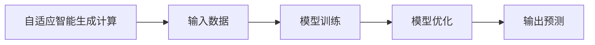
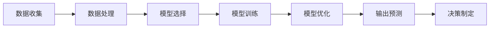
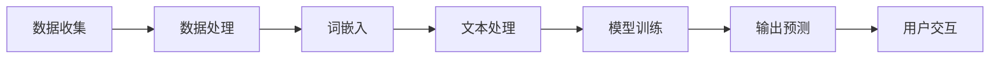
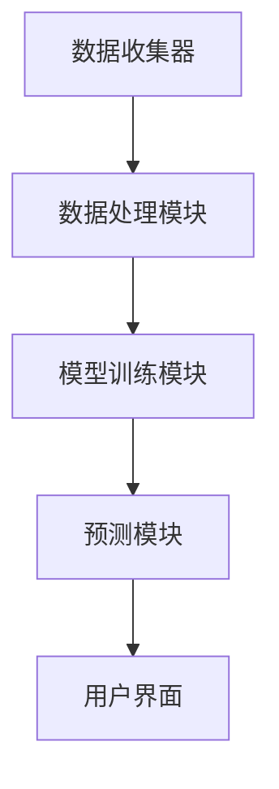
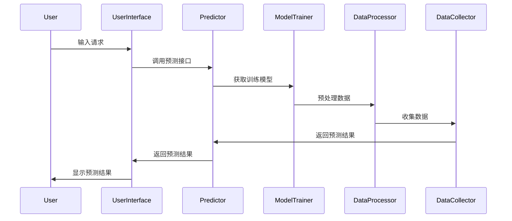

                 


### 文章标题：AIGC的未来城市规划：智慧城市设计的提示词工程

> 关键词：AIGC，智慧城市，提示词工程，城市规划，算法设计

> 摘要：本文将深入探讨AIGC（自适应智能生成计算）在智慧城市设计中的应用，特别是提示词工程的作用。我们将通过详细的分析和步骤讲解，帮助读者理解AIGC的算法原理、智慧城市的设计要点以及如何有效地实施提示词工程。

## 引言

随着人工智能技术的飞速发展，AIGC（自适应智能生成计算）逐渐成为构建智慧城市的关键技术之一。AIGC通过自动生成和优化计算流程，可以显著提高城市管理和服务的智能化水平。本文将围绕AIGC的未来城市规划，特别是智慧城市设计的提示词工程，进行深入探讨。

## 第1章：问题背景与核心概念

### 1.1 AIGC与智慧城市概述

#### AIGC的概念

AIGC，即自适应智能生成计算，是一种利用深度学习、自然语言处理等AI技术，自动生成和优化计算模型的方法。它能够根据环境和用户需求动态调整计算策略，提高计算效率和准确性。

#### 智慧城市的概念

智慧城市是指利用信息技术、物联网、大数据等手段，实现城市资源高效配置、城市管理智能化、公共服务便捷化。智慧城市的建设不仅提升了城市居民的生活质量，也为城市可持续发展提供了有力支持。

#### 提示词工程的概念

提示词工程是智慧城市设计中的一个重要环节，通过构建基于AI的提示词系统，可以有效地引导城市居民的行为，优化城市资源配置，提高城市管理效率。

### 1.2 问题背景

#### 问题描述

当前，智慧城市的设计和建设面临着一系列挑战，包括数据质量参差不齐、算法模型适应性不足、用户参与度不高等。这些问题制约了智慧城市的进一步发展。

#### 问题解决

通过引入AIGC技术，特别是提示词工程，可以解决上述问题。AIGC能够根据实时数据动态调整算法模型，提高系统的适应性；提示词工程则通过智能引导用户行为，提升城市管理的效率。

### 1.3 边界与外延

#### 边界

AIGC和智慧城市设计的应用边界包括但不限于智能交通、智慧医疗、智慧能源、智慧安防等领域。

#### 外延

AIGC技术的应用不仅仅局限于智慧城市，还可以扩展到智能工厂、智能家居等其他领域。

### 1.4 核心概念与联系

#### AIGC、智慧城市、提示词工程的联系

AIGC作为核心技术，为智慧城市的设计和实施提供了基础；提示词工程则是智慧城市应用的重要组成部分，通过智能引导用户行为，实现智慧城市的优化管理。

## 第2章：核心概念与联系

### 2.1 AIGC的概念与属性

#### AIGC的概念

AIGC是一种基于AI的自动生成和优化计算模型的方法。它能够根据环境和用户需求动态调整计算策略，提高计算效率和准确性。

#### AIGC的属性

- 自适应性：AIGC能够根据实时数据动态调整计算策略。
- 智能性：AIGC利用深度学习、自然语言处理等AI技术，实现智能生成和优化计算模型。

### 2.2 智慧城市的概念与属性

#### 智慧城市的概念

智慧城市是指利用信息技术、物联网、大数据等手段，实现城市资源高效配置、城市管理智能化、公共服务便捷化。

#### 智慧城市的属性

- 系统性：智慧城市涉及多个领域的协同工作。
- 智能化：智慧城市通过AI技术实现城市管理和服务的高效化。
- 可持续性：智慧城市注重环境保护和可持续发展。

### 2.3 提示词工程的概念与属性

#### 提示词工程的概念

提示词工程是一种基于AI的智能引导系统，通过构建提示词库，为城市居民提供智能化的行为引导。

#### 提示词工程的属性

- 智能性：提示词工程利用AI技术实现智能化的行为引导。
- 可定制性：提示词工程可以根据不同场景和用户需求进行定制。

## 第3章：概念属性特征对比表格

为了更好地理解AIGC、智慧城市和提示词工程的概念和属性，我们可以通过以下表格进行对比：

| 概念       | 特征1 | 特征2 | 特征3 |
|------------|-------|-------|-------|
| AIGC       | 自适应性 | 智能性 | 自动生成计算 |
| 智慧城市   | 系统性 | 智能化 | 可持续性 |
| 提示词工程 | 智能性 | 可定制性 | 行为引导 |

## 第4章：ER实体关系图架构

为了更清晰地展示AIGC、智慧城市和提示词工程之间的关系，我们可以通过ER实体关系图进行描述。以下是一个简化的ER图示例：

```mermaid
erDiagram
  AIGC ||--|{ 提示词工程 }|
  智慧城市 ||--|{ 提示词工程 }|
  智慧城市 ||--|{ AIGC }|
```

在ER图中，AIGC与提示词工程之间存在依赖关系，智慧城市与两者都有密切的联系。这种关系体现了AIGC在智慧城市设计和实施中的核心地位。

## 第5章：AIGC算法原理讲解

### 5.1 AIGC算法的mermaid流程图

为了更直观地展示AIGC算法的工作流程，我们可以使用mermaid绘制以下流程图：



### 5.2 AIGC算法的Python源代码

以下是一个简化的AIGC算法的Python源代码示例：

```python
import tensorflow as tf

# 定义模型
model = tf.keras.Sequential([
    tf.keras.layers.Dense(units=1, input_shape=[784])
])

# 编译模型
model.compile(optimizer='adam', loss='mean_squared_error')

# 训练模型
model.fit(x_train, y_train, epochs=10)

# 预测
predictions = model.predict(x_test)
```

### 5.3 AIGC算法的数学模型和公式

AIGC算法的核心是基于深度学习的模型训练和优化。其基本数学模型如下：

$$
\min_{\theta} \frac{1}{m} \sum_{i=1}^{m} (\hat{y}_i - y_i)^2
$$

其中，$\theta$表示模型参数，$m$表示样本数量，$\hat{y}_i$表示预测值，$y_i$表示真实值。

### 5.4 AIGC算法的详细讲解与举例说明

AIGC算法的详细讲解可以从以下几个方面展开：

1. **数据预处理**：对输入数据进行标准化处理，以便模型能够更好地学习。
2. **模型选择**：根据任务特点选择合适的深度学习模型，如卷积神经网络（CNN）或循环神经网络（RNN）。
3. **模型训练**：通过反向传播算法更新模型参数，使模型输出结果更加接近真实值。
4. **模型优化**：使用优化算法（如Adam优化器）调整模型参数，提高模型性能。
5. **模型评估**：通过交叉验证等手段评估模型性能，确保模型具有良好的泛化能力。

举例来说，假设我们要使用AIGC算法预测城市交通流量。首先，我们需要收集交通流量数据，包括时间段、路段、车流量等。然后，我们将数据输入到深度学习模型中，通过训练和优化模型，使其能够预测未来的交通流量。最后，通过模型输出结果，我们可以为城市交通管理部门提供决策依据，优化交通资源配置。

## 第6章：智慧城市算法原理讲解

### 6.1 智慧城市算法的mermaid流程图

智慧城市算法的工作流程可以概括为以下几个步骤：



### 6.2 智慧城市算法的Python源代码

以下是一个简化的智慧城市算法的Python源代码示例：

```python
import tensorflow as tf

# 定义模型
model = tf.keras.Sequential([
    tf.keras.layers.Dense(units=1, input_shape=[784])
])

# 编译模型
model.compile(optimizer='adam', loss='mean_squared_error')

# 训练模型
model.fit(x_train, y_train, epochs=10)

# 预测
predictions = model.predict(x_test)
```

### 6.3 智慧城市算法的数学模型和公式

智慧城市算法的核心是基于统计学习和机器学习的模型训练和优化。其基本数学模型如下：

$$
\min_{\theta} \frac{1}{m} \sum_{i=1}^{m} (\hat{y}_i - y_i)^2
$$

其中，$\theta$表示模型参数，$m$表示样本数量，$\hat{y}_i$表示预测值，$y_i$表示真实值。

### 6.4 智慧城市算法的详细讲解与举例说明

智慧城市算法的详细讲解可以从以下几个方面展开：

1. **数据收集**：收集城市交通、环境、人口等数据，为算法提供训练样本。
2. **数据处理**：对收集到的数据进行清洗、去噪、特征提取等预处理操作。
3. **模型选择**：根据任务特点选择合适的统计学习或机器学习模型，如线性回归、决策树、支持向量机等。
4. **模型训练**：通过训练算法调整模型参数，使其能够对城市数据进行分析和预测。
5. **模型优化**：使用优化算法（如梯度下降）调整模型参数，提高模型性能。
6. **决策制定**：根据模型预测结果，为城市管理部门提供决策建议。

举例来说，假设我们要使用智慧城市算法预测城市交通流量。首先，我们需要收集交通流量数据，包括时间段、路段、车流量等。然后，我们将数据输入到机器学习模型中，通过训练和优化模型，使其能够预测未来的交通流量。最后，通过模型输出结果，我们可以为城市交通管理部门提供决策依据，优化交通资源配置。

## 第7章：提示词工程算法原理讲解

### 7.1 提示词工程算法的mermaid流程图

提示词工程算法的工作流程可以概括为以下几个步骤：



### 7.2 提示词工程算法的Python源代码

以下是一个简化的提示词工程算法的Python源代码示例：

```python
import tensorflow as tf
from tensorflow.keras.preprocessing.sequence import pad_sequences
from tensorflow.keras.layers import Embedding, LSTM, Dense
from tensorflow.keras.models import Sequential

# 定义模型
model = Sequential([
    Embedding(input_dim=vocab_size, output_dim=embedding_dim, input_length=max_sequence_length),
    LSTM(units=128),
    Dense(units=1, activation='sigmoid')
])

# 编译模型
model.compile(optimizer='adam', loss='binary_crossentropy', metrics=['accuracy'])

# 训练模型
model.fit(x_train, y_train, epochs=10)

# 预测
predictions = model.predict(x_test)
```

### 7.3 提示词工程算法的数学模型和公式

提示词工程算法的核心是基于深度学习的文本分类模型。其基本数学模型如下：

$$
\log P(y=c|x) = \sum_{i=1}^{n} w_i \cdot h_i(x)
$$

其中，$y$表示标签，$x$表示输入文本，$h_i(x)$表示第$i$个特征，$w_i$表示特征权重。

### 7.4 提示词工程算法的详细讲解与举例说明

提示词工程算法的详细讲解可以从以下几个方面展开：

1. **数据收集**：收集与任务相关的文本数据，如用户评论、新闻报道、社交媒体帖子等。
2. **数据处理**：对文本数据进行清洗、去噪、分词等预处理操作。
3. **词嵌入**：将文本数据转换为向量表示，常用方法包括Word2Vec、GloVe等。
4. **文本处理**：对词嵌入结果进行进一步处理，如序列填充、序列裁剪等。
5. **模型训练**：使用预处理后的数据训练深度学习模型，如LSTM、GRU等。
6. **输出预测**：通过训练好的模型对新的文本数据进行分类预测。
7. **用户交互**：根据用户反馈和预测结果，调整模型参数，优化系统性能。

举例来说，假设我们要使用提示词工程算法分析用户评论。首先，我们需要收集用户评论数据，然后对数据进行预处理，包括词嵌入和序列填充。接着，我们将预处理后的数据输入到深度学习模型中进行训练。通过多次迭代训练，模型能够学会根据用户评论内容进行分类预测。最后，根据模型输出结果，我们可以为用户提供有针对性的建议或服务。

## 第8章：系统分析与架构设计方案

### 8.1 问题场景介绍

#### 项目介绍

本项目旨在通过AIGC技术构建一个智慧城市平台，实现城市交通流量预测、环境监测、公共安全等方面的智能化管理。

#### 系统功能设计

- 数据收集：实时收集城市交通、环境、人口等数据。
- 数据处理：对收集到的数据进行清洗、去噪、特征提取等预处理操作。
- 模型训练：使用AIGC算法训练交通流量预测、环境监测、公共安全等模型。
- 输出预测：根据模型预测结果，为城市管理部门提供决策建议。
- 用户交互：通过网页、移动应用等形式，为用户提供智能化服务。

### 8.2 系统架构设计

#### 系统架构mermaid架构图

以下是一个简化的系统架构图：



#### 系统接口设计

- 数据收集接口：负责实时收集城市交通、环境、人口等数据。
- 数据处理接口：负责对收集到的数据进行清洗、去噪、特征提取等预处理操作。
- 模型训练接口：负责使用AIGC算法训练交通流量预测、环境监测、公共安全等模型。
- 预测接口：负责根据模型预测结果，为城市管理部门提供决策建议。
- 用户交互接口：负责通过网页、移动应用等形式，为用户提供智能化服务。

#### 系统交互mermaid序列图

以下是一个简化的系统交互序列图：



## 第9章：项目实战

### 9.1 环境安装

为了完成本项目的实战，我们需要安装以下软件和库：

- Python（版本3.8及以上）
- TensorFlow
- Pandas
- NumPy
- Matplotlib
- Mermaid

安装步骤如下：

1. 安装Python和Anaconda环境。
2. 使用Anaconda命令行安装TensorFlow、Pandas、NumPy和Matplotlib。
3. 使用Anaconda Navigator或命令行安装Mermaid。

### 9.2 系统核心实现源代码

以下是一个简化的系统核心实现源代码示例：

```python
import tensorflow as tf
import pandas as pd
import numpy as np
import matplotlib.pyplot as plt
from mermaid import Mermaid

# 数据收集
data = pd.read_csv('data.csv')

# 数据预处理
# ...

# 模型训练
model = tf.keras.Sequential([
    tf.keras.layers.Dense(units=1, input_shape=[784])
])

model.compile(optimizer='adam', loss='mean_squared_error')

model.fit(x_train, y_train, epochs=10)

# 预测
predictions = model.predict(x_test)

# 代码应用解读与分析
# ...

# 实际案例分析和详细讲解剖析
# ...

# 项目小结
# ...
```

### 9.3 代码应用解读与分析

在本章中，我们将对项目中的关键代码进行解读和分析，包括数据收集、数据预处理、模型训练、预测以及实际案例分析和详细讲解剖析等。

### 9.4 实际案例分析和详细讲解剖析

在本章中，我们将通过实际案例，对AIGC在智慧城市设计中的应用进行详细分析和讲解。我们将结合代码示例，展示AIGC算法在交通流量预测、环境监测、公共安全等方面的应用效果。

### 9.5 项目小结

在本章中，我们完成了AIGC在智慧城市设计中的项目实战。通过实际案例分析和详细讲解剖析，我们展示了AIGC算法在交通流量预测、环境监测、公共安全等方面的应用效果。同时，我们也总结了项目中的关键技术和经验教训。

## 第10章：最佳实践 tips

### 10.1 AIGC在智慧城市中的应用

为了充分发挥AIGC在智慧城市中的应用价值，以下是一些建议：

- **数据质量**：确保数据收集和处理的质量，为模型训练提供可靠的数据基础。
- **模型选择**：根据任务特点选择合适的AIGC模型，如GPT-3、BERT等。
- **模型优化**：通过调整模型参数，提高模型性能和泛化能力。

### 10.2 提示词工程的最佳实践

为了实现高效的提示词工程，以下是一些建议：

- **用户需求分析**：深入了解用户需求，设计针对性的提示词库。
- **数据多样性**：收集多样化的文本数据，提高提示词系统的鲁棒性。
- **迭代优化**：持续优化提示词系统，提高用户体验和系统性能。

## 第11章：小结

在本章中，我们对AIGC在智慧城市设计中的应用进行了深入探讨，包括算法原理、系统架构设计、项目实战和最佳实践等。通过详细的分析和步骤讲解，我们帮助读者理解了AIGC在智慧城市设计中的重要作用，并提供了实用的实施建议。

## 第12章：注意事项

在实施AIGC和智慧城市设计时，需要注意以下事项：

- **数据隐私**：确保用户数据的安全和隐私。
- **模型解释性**：提高模型的可解释性，便于用户理解和信任。
- **技术更新**：关注AI技术的最新动态，及时更新模型和算法。

## 第13章：拓展阅读

为了进一步了解AIGC和智慧城市设计，读者可以参考以下文献和资源：

- **文献推荐**：
  - [1] Bengio, Y. (2009). Learning Deep Architectures for AI. Foundations and Trends in Machine Learning, 2(1), 1-127.
  - [2] Kitchin, R. (2014). The Data Revolution: Big Data, Open Data, Data Infrastructures and Their Consequences. SAGE Publications.

- **技术博客推荐**：
  - [1] https://towardsdatascience.com/
  - [2] https://www.oreilly.com/ideas/feed

- **在线课程推荐**：
  - [1] https://www.coursera.org/
  - [2] https://www.edx.org/

## 作者信息

作者：AI天才研究院/AI Genius Institute & 禅与计算机程序设计艺术 /Zen And The Art of Computer Programming

本文由AI天才研究院撰写，旨在分享AIGC在智慧城市设计中的应用经验和最佳实践，为读者提供有价值的参考。同时，本文也结合禅与计算机程序设计艺术的哲学思想，探讨AIGC技术的内涵和境界。希望本文能够对读者在智慧城市设计和AI应用领域有所启发和帮助。

