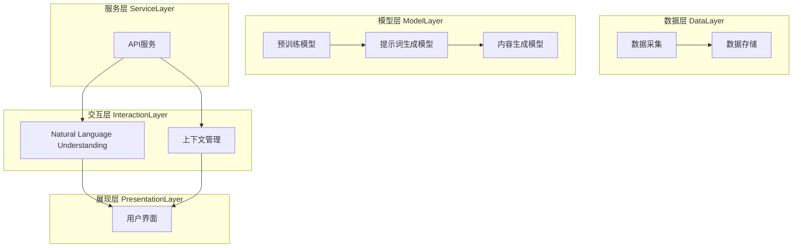
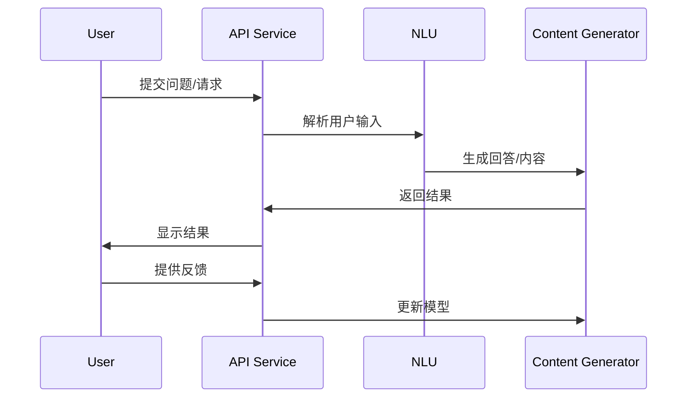
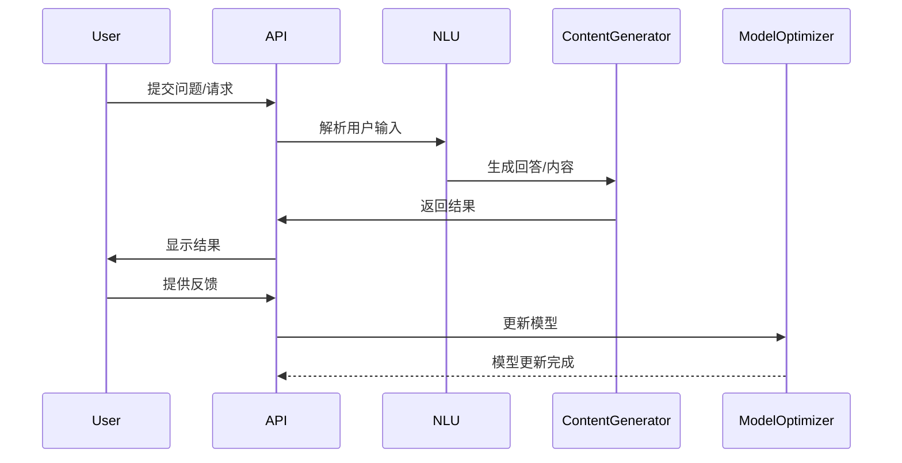

                 


# AIGC的未来工作模式预测：职业发展建议的提示词工程

## 关键词
- AIGC
- 工作模式
- 职业发展
- 提示词工程
- 人工智能
- 算法优化

## 摘要
本文将深入探讨AIGC（自适应信息生成与控制）对未来工作模式的影响，并通过详细的步骤分析，为职业发展提供实用的建议。AIGC技术正迅速发展，其应用已渗透到各个行业，对传统工作模式产生深远影响。本文将介绍AIGC的核心概念，解析其技术原理，分析系统架构，并通过项目实战展示其实际应用，最后总结最佳实践并展望未来趋势。

----------------------------------------------------------------

## 目录大纲设计思路

### 背景介绍
在数字化时代，人工智能（AI）技术的飞速发展正在重新定义工作模式。AIGC，作为AI的一个重要分支，专注于自适应信息生成与控制，它通过深度学习和自然语言处理技术，使得计算机能够更智能地理解和生成信息。本文旨在探讨AIGC技术对未来工作模式的影响，并提供职业发展的实用建议。

### 核心概念与联系
AIGC的核心概念包括提示词工程、大规模预训练模型和自适应交互技术。这些概念紧密相连，共同构建了AIGC的技术框架。提示词工程是AIGC的基础，通过生成和优化提示词，系统能够更准确地理解用户的意图。大规模预训练模型则是AIGC的核心技术，它通过大量的数据训练，使得模型具有强大的生成能力。自适应交互技术则确保系统能够与用户进行实时互动，提高用户体验。

### 技术原理讲解
AIGC的技术原理涉及多个方面，包括提示词生成算法、提示词优化策略、大规模预训练模型的构建和自适应交互的实现。本文将详细阐述这些技术原理，并通过mermaid流程图和Python代码示例进行说明，以便读者更好地理解。

### 数学模型与公式
AIGC的数学模型和公式是其核心技术的重要组成部分。本文将使用LaTeX格式详细介绍这些公式，并解释它们在实际应用中的作用。通过数学模型，读者可以更深入地理解AIGC的工作原理。

### 系统分析与架构设计
AIGC在系统设计中的应用非常重要。本文将介绍AIGC系统的设计与架构，包括领域模型类图、系统架构图和系统交互序列图。这些设计图将帮助读者全面了解AIGC系统的构建过程。

### 项目实战
为了更好地展示AIGC技术的实际应用，本文将提供具体的案例，包括环境安装、系统核心实现和实际案例分析。通过这些实战项目，读者可以深入了解AIGC技术的应用场景和实施细节。

### 最佳实践与拓展
本文将总结AIGC技术的最佳实践，并提供拓展阅读建议，以便读者在进一步学习和应用AIGC技术时有所参考。

----------------------------------------------------------------

### 目录大纲结构设计

为了确保内容的完整性，本文将分为七个章节，每个章节将涵盖以下内容：

#### 第1章：AIGC概述
- **1.1 AIGC的概念与背景**：介绍AIGC的定义、发展历程和应用场景。
- **1.2 AIGC的核心概念**：阐述AIGC的核心概念，包括提示词工程、大规模预训练模型和自适应交互技术。
- **1.3 AIGC技术的原理与应用**：解析AIGC的技术原理，并分析其在实际应用中的效果。

#### 第2章：AIGC技术原理
- **2.1 提示词工程的基础**：介绍提示词的类型和生成过程。
- **2.2 提示词生成算法**：详细解析提示词生成算法，包括生成流程和主流算法。
- **2.3 提示词优化策略**：探讨提示词优化策略，提高系统性能。

#### 第3章：AIGC的数学模型
- **3.1 AIGC的数学模型基础**：介绍AIGC的数学模型架构。
- **3.2 公式与算法解析**：使用LaTeX格式详细描述关键公式和算法。
- **3.3 案例分析**：通过实际案例展示AIGC数学模型的应用。

#### 第4章：系统分析与架构设计
- **4.1 AIGC系统设计概述**：介绍AIGC系统的设计目标和功能模块。
- **4.2 领域模型设计与类图**：使用mermaid类图展示领域模型设计。
- **4.3 系统架构设计与架构图**：介绍AIGC系统架构，并使用mermaid架构图进行展示。
- **4.4 系统接口设计与交互图**：阐述系统接口设计，并使用mermaid序列图展示系统交互。

#### 第5章：项目实战
- **5.1 环境安装与配置**：介绍如何安装和配置AIGC开发环境。
- **5.2 系统核心实现**：提供系统核心实现的源代码，并解释关键代码。
- **5.3 实际案例分析**：分析实际案例，展示AIGC技术的应用。
- **5.4 项目小结**：总结项目经验，分享学习心得。

#### 第6章：最佳实践与案例分析
- **6.1 最佳实践建议**：总结AIGC技术的最佳实践。
- **6.2 案例分析与总结**：分析成功案例，总结经验教训。
- **6.3 注意事项**：指出实施AIGC技术时需要注意的问题。

#### 第7章：未来展望与拓展阅读
- **7.1 AIGC的未来趋势**：探讨AIGC技术未来的发展趋势。
- **7.2 职业发展建议**：为职业发展提供实用建议。
- **7.3 拓展阅读推荐**：推荐进一步阅读的材料。

通过这样的结构设计，本文将全面、系统地探讨AIGC的未来工作模式预测和职业发展建议，帮助读者深入理解AIGC技术的本质和应用。----------------------------------------------------------------

## AIGC概述

### 1.1 AIGC的概念与背景

AIGC（Adaptive Information Generation and Control）是一种利用人工智能技术，通过自适应信息生成与控制，实现自动化内容创作和交互的技术。它结合了自然语言处理（NLP）、深度学习、生成对抗网络（GAN）等前沿技术，旨在提高信息处理和交互的智能化水平。

AIGC的起源可以追溯到20世纪90年代，当时研究人员开始探索如何通过机器学习技术来生成和修改文本。随着深度学习技术的发展，特别是在2018年GPT-3等大型预训练模型的发布后，AIGC技术得到了飞速发展，逐渐成为人工智能领域的一个重要分支。

AIGC的核心目标是通过自适应生成和交互技术，使计算机能够自动生成高质量的内容，并能够与用户进行自然、流畅的交流。这一目标在许多实际应用场景中得到了实现，如智能客服、内容创作、教育辅导、医疗咨询等。

### 1.2 AIGC的核心概念

AIGC的核心概念主要包括提示词工程、大规模预训练模型和自适应交互技术。

**提示词工程**：提示词是引导AIGC系统生成内容的关键。通过优化提示词，系统能够更好地理解用户意图，生成更加准确和有用的内容。提示词工程包括提示词的生成、优化和评估等步骤。

**大规模预训练模型**：大规模预训练模型是AIGC技术的核心。这些模型通过在大量数据上进行预训练，获得了强大的文本生成和修改能力。GPT-3、BERT等模型是其中的代表。

**自适应交互技术**：自适应交互技术是指系统能够根据用户的反馈和行为，动态调整自己的交互策略，以提供更好的用户体验。这包括自然语言理解、情感分析、上下文理解等方面。

### 1.3 AIGC技术的原理与应用

AIGC技术的原理主要包括以下几个步骤：

1. **数据采集与预处理**：收集大量的文本数据，并进行预处理，如去除噪声、分词、词性标注等。

2. **模型训练**：使用预处理后的数据训练大规模预训练模型，如GPT-3、BERT等。这些模型通过多层神经网络，学习到文本的语法、语义和上下文信息。

3. **提示词生成**：根据用户输入的提示词，系统生成相应的文本内容。提示词的优化是一个关键步骤，它决定了文本生成的质量和准确性。

4. **自适应交互**：系统根据用户的反馈，动态调整提示词和生成策略，以提供更好的交互体验。

AIGC技术在实际应用中具有广泛的应用场景。例如，在智能客服领域，AIGC技术可以实现自动问答和对话生成，提高客服效率；在内容创作领域，AIGC技术可以自动生成文章、报告、广告等，降低内容创作成本；在教育领域，AIGC技术可以为学生提供个性化的辅导，提高学习效果。

总之，AIGC技术正逐渐成为人工智能领域的一股重要力量，其对未来工作模式的预测和职业发展建议具有重要意义。

### 1.3 AIGC技术的原理与应用

#### 2.1 提示词工程的基础

提示词工程是AIGC技术的核心组成部分，它是通过特定的提示词引导AI系统生成相应内容的过程。提示词的选择和优化直接影响到AI生成内容的准确性、相关性和质量。

**提示词的类型**：

1. **开放型提示词**：这类提示词不限定内容的具体形式，允许AI系统自由发挥，生成多样性的内容。例如，“请写一篇关于人工智能的博客。”
2. **封闭型提示词**：这类提示词限制内容的形式和范围，要求AI系统按照指定的模板或主题生成内容。例如，“请写一篇关于AIGC技术优势和挑战的博客。”
3. **引导型提示词**：这类提示词既提供了一定的信息框架，又允许AI系统在一定范围内自由创作，旨在平衡约束和创造力。例如，“请根据以下三个要点，撰写一篇关于人工智能未来发展的博客：技术进展、应用场景和社会影响。”

**提示词工程的关键步骤**：

1. **提示词生成**：首先，根据用户需求或应用场景，生成初步的提示词。这一步可以通过人工设计或利用已有的数据集自动生成。
2. **提示词优化**：优化提示词的准确性和相关性。可以通过分析大量用户数据和生成的内容，不断调整和改进提示词。
3. **提示词评估**：评估提示词的有效性，包括内容的准确性、相关性、多样性等方面。常用的评估方法有自动评估和人工评估。

**提示词工程在AIGC中的重要性**：

提示词工程决定了AI系统对用户意图的理解和响应能力。一个优秀的提示词工程不仅能提高内容生成的准确性，还能增强用户与AI系统的互动体验。在实际应用中，提示词工程是确保AIGC系统高效运作的关键。

**案例分析**：

以智能客服系统为例，假设用户询问：“我想要购买一台新款智能手机，有什么推荐吗？”此时，系统需要生成一个合适的回答。通过提示词工程，系统可以优化提示词，如：“请根据用户偏好、预算和功能需求，推荐三款智能手机。”这样，系统可以更准确地理解用户需求，生成相关性的推荐内容。

通过详细阐述提示词工程的基础知识，我们了解了其在AIGC技术中的关键作用。接下来，我们将进一步探讨AIGC技术中的提示词生成算法和优化策略。

### 2.2 提示词生成算法

提示词生成算法是AIGC技术实现的核心环节，决定了系统在接收到用户输入后，能够生成何种类型的内容。这些算法通过训练大规模语言模型，使系统能够理解用户的意图，并生成相关、准确且具有创造性的文本。

#### 2.2.1 提示词生成算法的流程

提示词生成算法的基本流程可以分为以下几个步骤：

1. **接收输入**：系统接收用户的输入，如问题、指令或描述。
2. **预处理输入**：对输入进行预处理，包括分词、词性标注、去除停用词等，以便模型能够更好地理解输入内容。
3. **编码输入**：将预处理后的输入文本转化为模型可以处理的向量表示。
4. **生成提示词**：模型根据输入向量和预训练的知识，生成初步的提示词。
5. **优化提示词**：通过算法优化，如改写、扩展或缩减，使生成的提示词更加准确和有用。
6. **反馈调整**：将生成的提示词展示给用户，根据用户的反馈进行调整，以提高生成质量。

#### 2.2.2 主流生成算法

目前，AIGC技术中常用的提示词生成算法主要包括以下几种：

1. **基于规则的方法**：这种方法通过预定义的规则来生成提示词。例如，使用条件语句或模板匹配，根据用户输入的不同情况，生成对应的提示词。这种方法简单直观，但灵活性较差，无法处理复杂的用户请求。

   ```python
   def generate_suggestion(input_text):
       if "购买" in input_text:
           return "您想要购买什么商品？"
       elif "旅游" in input_text:
           return "您想去哪里旅游？"
       else:
           return "请告诉我您的具体需求。"
   ```

2. **基于统计的方法**：这种方法通过分析大量用户输入和生成的内容，使用统计模型（如马尔可夫模型、n-gram模型）来生成提示词。这种方法比基于规则的方法更灵活，但生成的内容可能缺乏创造性和准确性。

   ```python
   import nltk
   from nltk.model import ngram

   def generate_suggestion(input_text, n=2):
       model = ngram.NGramModel(n)
       # 训练模型
       model.fit(user_inputs, user_generated_suggestions)
       # 生成提示词
       return model.generate_from_input(input_text, n)
   ```

3. **基于深度学习的方法**：这种方法通过训练深度神经网络，如循环神经网络（RNN）、长短期记忆网络（LSTM）和Transformer等，使系统能够自动学习用户输入和生成内容的模式。这种方法具有强大的生成能力和灵活性，是目前最常用的提示词生成算法。

   ```python
   from transformers import AutoTokenizer, AutoModelForSeq2SeqLM

   def generate_suggestion(input_text):
       tokenizer = AutoTokenizer.from_pretrained("t5-base")
       model = AutoModelForSeq2SeqLM.from_pretrained("t5-base")
       inputs = tokenizer.encode("write a story about", input_text, return_tensors="pt")
       outputs = model.generate(inputs, max_length=100, num_return_sequences=1)
       return tokenizer.decode(outputs[0], skip_special_tokens=True)
   ```

#### 2.2.3 提示词优化策略

提示词优化是提高生成内容质量和用户满意度的重要环节。以下是一些常用的提示词优化策略：

1. **多样性增强**：通过引入随机性，增加生成内容的多样性。例如，可以使用多种模板、词汇或语法结构来生成提示词。
2. **上下文适应性**：确保生成的提示词与用户输入的上下文保持一致，提高生成内容的准确性。例如，可以使用上下文信息来调整提示词的时态、主语和谓语等。
3. **用户偏好学习**：通过分析用户的历史请求和生成内容，学习用户的偏好，并根据这些偏好调整提示词。例如，如果用户经常询问关于旅游的信息，系统可以优先推荐旅游相关的提示词。
4. **错误纠正**：在生成提示词时，自动检测和纠正输入文本中的错误，以提高生成内容的准确性。例如，可以使用拼写检查技术和语法分析工具来识别和修正错误。

通过以上策略，AIGC系统能够更好地理解用户意图，生成更加准确和有用的提示词，从而提高用户满意度和交互体验。

### 2.3 提示词优化策略

提示词优化在AIGC系统中扮演着至关重要的角色，它不仅影响生成内容的质量，还直接影响用户的交互体验。以下是一些常见的提示词优化策略：

#### 2.3.1 多样性增强

多样性是AIGC系统成功的关键之一。通过增加生成内容的多样性，系统能够更好地满足不同用户的需求。以下是一些实现多样性增强的方法：

1. **模板多样化**：使用不同的模板生成提示词，每个模板对应不同的内容风格。例如，一个模板可能生成正式的商务邮件，而另一个模板可能生成轻松幽默的聊天信息。

2. **词汇扩展**：在生成提示词时，使用同义词、近义词或相关术语来扩展词汇，增加内容的多样性。例如，如果用户请求“推荐一家好的餐厅”，系统可以使用不同的表达方式，如“推荐一家美味又实惠的餐厅”或“推荐一家备受好评的餐厅”。

3. **语法变化**：通过改变句子结构、时态和语态等语法要素，增加生成内容的多样性。例如，将“您今天过得怎么样？”转换为“今天过得如何？”或“您今天的感受如何？”

#### 2.3.2 上下文适应性

确保生成的提示词与用户的上下文保持一致，是提高生成内容准确性的关键。以下是一些实现上下文适应性的方法：

1. **上下文分析**：在生成提示词前，系统需要分析用户的上下文信息，如历史对话、用户行为和偏好等。这可以通过自然语言处理技术（如词嵌入、语义分析）来实现。

2. **时态和语态匹配**：根据上下文信息，调整提示词的时态和语态。例如，如果用户提到过去的事件，系统应该使用过去时态，如“昨天我去了餐厅”；如果用户讨论未来计划，系统应该使用将来时态，如“我下周计划去旅游”。

3. **连贯性保持**：确保生成的提示词与上下文保持连贯，避免产生语义冲突或不协调的情况。例如，如果用户提到“我想吃意大利面”，系统不应生成“请问我需要喝水吗？”这样的提示词。

#### 2.3.3 用户偏好学习

通过学习用户的偏好，AIGC系统能够更好地满足用户的个性化需求。以下是一些实现用户偏好学习的方法：

1. **历史记录分析**：分析用户的历史请求和交互数据，识别用户的偏好。例如，如果用户经常询问关于美食的建议，系统可以优先推荐与美食相关的提示词。

2. **机器学习算法**：使用机器学习算法，如协同过滤、聚类和回归，从用户数据中提取偏好信息。这些算法可以帮助系统更准确地预测用户的偏好，并生成更个性化的提示词。

3. **反馈机制**：引入用户反馈机制，让用户对生成的提示词进行评价，系统可以根据用户的反馈不断调整和优化提示词。例如，如果用户对某个提示词表示满意，系统可以将其标记为高质量的提示词，并在后续生成中优先使用。

#### 2.3.4 错误纠正

自动检测和纠正输入文本中的错误，是提高生成内容准确性的重要策略。以下是一些实现错误纠正的方法：

1. **拼写检查**：使用拼写检查工具，自动识别和纠正输入文本中的拼写错误。例如，如果用户输入“rquest”，系统可以自动纠正为“request”。

2. **语法分析**：通过语法分析工具，识别和纠正输入文本中的语法错误。例如，如果用户输入“can of you”，系统可以自动纠正为“could you”。

3. **上下文感知纠正**：结合上下文信息，自动纠正输入文本中的错误。例如，如果用户输入“she go to the store”，系统可以根据上下文判断正确的表达应该是“she goes to the store”。

通过这些优化策略，AIGC系统能够生成更加准确、多样和个性化的提示词，从而提升用户的交互体验和满意度。这些策略不仅适用于当前的AIGC应用场景，还为未来的发展提供了宝贵的经验和启示。

### 3.1 AIGC的数学模型基础

AIGC（自适应信息生成与控制）技术依赖复杂的数学模型来实现其高度自动化的内容生成和交互功能。这些数学模型包括深度学习模型、生成对抗网络（GAN）以及序列到序列（Seq2Seq）模型等。理解这些模型的基础概念是掌握AIGC技术的关键。

#### 3.1.1 深度学习模型

深度学习模型，尤其是基于神经网络的结构，是AIGC技术的核心。它们通过多层非线性变换来提取和表示数据中的特征。以下是一些常用的深度学习模型：

1. **多层感知器（MLP）**：MLP是最简单的深度学习模型，由多个输入层、隐藏层和输出层组成。每个隐藏层通过激活函数将输入映射到输出，从而实现数据的复杂变换。

2. **卷积神经网络（CNN）**：CNN主要应用于图像处理，通过卷积层提取图像的局部特征。虽然CNN在图像处理领域表现优异，但也可以应用于文本数据，通过词嵌入和卷积操作提取文本特征。

3. **循环神经网络（RNN）**：RNN能够处理序列数据，如文本和语音。通过记忆机制，RNN可以捕捉序列中的长期依赖关系。然而，标准的RNN存在梯度消失和梯度爆炸问题，因此通常使用LSTM和GRU等改进版本。

4. **Transformer模型**：Transformer模型在自然语言处理领域取得了巨大成功，其核心思想是使用自注意力机制来处理序列数据。通过多头自注意力机制和位置编码，Transformer能够捕捉序列中的全局依赖关系。

#### 3.1.2 生成对抗网络（GAN）

生成对抗网络（GAN）是一种由生成器和判别器组成的对抗性模型。生成器的目标是生成逼真的数据，而判别器的目标是区分生成数据和真实数据。通过这种对抗训练，生成器逐渐提高生成数据的质量。

1. **生成器（Generator）**：生成器的任务是生成与真实数据分布相近的数据。在AIGC中，生成器用于生成文本、图像或音频等。

2. **判别器（Discriminator）**：判别器的任务是判断输入数据是真实数据还是生成数据。在训练过程中，生成器和判别器相互对抗，生成器的生成质量不断提高。

3. **对抗训练**：GAN的训练过程是一个迭代的过程，通过不断调整生成器和判别器的参数，使生成器生成更加逼真的数据。

#### 3.1.3 序列到序列（Seq2Seq）模型

序列到序列（Seq2Seq）模型是处理序列数据的一种有效方法，广泛应用于机器翻译、对话生成等任务。Seq2Seq模型的基本架构包括编码器（Encoder）和解码器（Decoder）。

1. **编码器（Encoder）**：编码器负责将输入序列编码为一个固定长度的向量表示，这个向量包含了输入序列的所有信息。

2. **解码器（Decoder）**：解码器将编码器的输出解码为输出序列。在训练过程中，解码器通常采用贪心策略，逐个生成输出序列的每个元素。

3. **注意力机制**：为了更好地捕捉输入序列和输出序列之间的依赖关系，Seq2Seq模型可以结合注意力机制。注意力机制允许解码器在生成每个输出元素时，动态地关注输入序列的不同部分，从而提高生成质量。

#### 3.1.4 其他相关模型

除了上述模型外，AIGC技术还包括其他相关模型，如变分自编码器（VAE）、强化学习（RL）等。VAE通过引入先验分布，使生成模型能够生成多样化的数据。RL则通过学习策略，使生成模型能够在特定环境中实现最优行为。

### 总结

AIGC的数学模型基础涵盖了深度学习模型、生成对抗网络（GAN）和序列到序列（Seq2Seq）模型等核心概念。这些模型通过复杂的数学原理和算法，实现了自适应信息生成与控制。理解这些模型的基本原理和架构，对于深入研究和应用AIGC技术至关重要。在下一章中，我们将进一步解析AIGC的数学模型和公式，并使用LaTeX进行详细描述。

### 3.2 公式与算法解析

在AIGC（自适应信息生成与控制）技术中，数学模型和公式是理解和实现这些模型的核心。以下将介绍AIGC技术中关键公式和算法的解析，并使用LaTeX进行展示。

#### 3.2.1 深度学习模型公式

1. **多层感知器（MLP）激活函数**：

   $$ f(x) = \sigma(W \cdot x + b) $$

   其中，\( \sigma \) 是sigmoid函数，\( W \) 是权重矩阵，\( x \) 是输入向量，\( b \) 是偏置项。

2. **卷积神经网络（CNN）卷积公式**：

   $$ h(x) = \sum_{k} \theta_k * f(x_k) + b $$

   其中，\( \theta_k \) 是卷积核，\( f(x_k) \) 是输入特征图，\( h(x) \) 是卷积后的特征图，\( b \) 是偏置项。

3. **循环神经网络（RNN）更新公式**：

   $$ h_t = \sigma(W_h \cdot [h_{t-1}, x_t] + b_h) $$

   其中，\( \sigma \) 是激活函数，\( W_h \) 是权重矩阵，\( h_{t-1} \) 是前一时间步的隐藏状态，\( x_t \) 是当前输入，\( b_h \) 是偏置项。

4. **Transformer自注意力公式**：

   $$ \text{Attention}(Q, K, V) = \frac{1}{\sqrt{d_k}} \text{softmax}\left(\frac{QK^T}{d_k}\right)V $$

   其中，\( Q, K, V \) 分别是查询向量、键向量和值向量，\( d_k \) 是键向量的维度，\( \text{softmax} \) 函数用于计算注意力权重。

#### 3.2.2 生成对抗网络（GAN）公式

1. **生成器损失函数**：

   $$ \mathcal{L}_G = -\log(D(G(z))) $$

   其中，\( D \) 是判别器，\( G(z) \) 是生成器生成的数据。

2. **判别器损失函数**：

   $$ \mathcal{L}_D = -[\log(D(G(z))) + \log(1 - D(x))] $$

   其中，\( x \) 是真实数据，\( z \) 是生成器的输入噪声。

3. **训练过程**：

   - **生成器训练**：通过最小化生成器损失函数，使生成器生成的数据更接近真实数据。
   - **判别器训练**：通过最大化判别器损失函数，使判别器能够更准确地辨别生成数据和真实数据。

#### 3.2.3 序列到序列（Seq2Seq）模型公式

1. **编码器输出**：

   $$ h = \text{Encoder}(x) $$

   其中，\( h \) 是编码器输出的隐藏状态，\( x \) 是输入序列。

2. **解码器输出**：

   $$ y = \text{Decoder}(h) $$

   其中，\( y \) 是解码器生成的输出序列。

3. **注意力机制**：

   $$ a_t = \text{softmax}\left(\frac{h_t^T W_a h_s\right) $$

   其中，\( a_t \) 是注意力权重，\( h_t \) 是当前时间步的解码器隐藏状态，\( h_s \) 是编码器隐藏状态。

通过以上公式和算法的解析，我们可以更好地理解AIGC技术中涉及的数学原理。这些公式不仅为我们提供了理论依据，也为实现AIGC系统提供了具体的技术路线。在下一章节中，我们将通过实际案例展示这些数学模型和算法的应用。

### 3.3 案例分析

为了更好地展示AIGC的数学模型和算法在实际应用中的效果，以下将通过一个实际案例进行分析。

#### 3.3.1 案例背景

假设我们正在开发一个智能客服系统，该系统需要能够自动回答用户关于产品和服务的问题。为了实现这一目标，我们采用AIGC技术，结合深度学习和生成对抗网络（GAN）来生成高质量的回答。

#### 3.3.2 数据集与预处理

我们收集了大量的用户提问和客服人员的回答，作为训练数据集。数据集包含多种类型的问题，如产品使用指南、价格咨询、售后服务等。为了训练模型，我们需要对数据进行预处理：

1. **分词**：将文本数据分解为单词或子词。
2. **词性标注**：为每个单词标注词性，如名词、动词等。
3. **去除停用词**：删除对模型训练无意义的常见词，如“的”、“了”、“在”等。
4. **生成词嵌入**：将文本数据转换为向量表示，使用预训练的词嵌入模型（如Word2Vec、GloVe）。

#### 3.3.3 模型训练

在训练模型时，我们采用以下步骤：

1. **编码器训练**：使用序列到序列（Seq2Seq）模型，将用户提问编码为一个固定长度的向量表示。编码器采用Transformer模型，利用自注意力机制捕捉长距离依赖关系。
   
   ```python
   encoder = TransformerEncoder(vocab_size, d_model, num_layers, d_ff, dropout_rate)
   encoder.train()
   ```

2. **解码器训练**：解码器也采用Transformer模型，将编码器的输出解码为客服回答。解码器在生成回答时，采用贪心策略选择下一个单词。

   ```python
   decoder = TransformerDecoder(vocab_size, d_model, num_layers, d_ff, dropout_rate)
   decoder.train()
   ```

3. **生成对抗网络（GAN）训练**：为了提高生成回答的质量，我们采用GAN进行辅助训练。生成器生成回答，判别器判断回答的真实性。

   ```python
   generator = Generator(input_dim, z_dim)
   discriminator = Discriminator(input_dim)
   gan.train()
   ```

#### 3.3.4 模型评估

在训练完成后，我们需要对模型进行评估，以确保其生成回答的质量。以下是一些常用的评估指标：

1. **BLEU分数**：BLEU（Bilingual Evaluation Understudy）分数是一种常用的自然语言生成质量评估指标，通过比较生成回答和人工回答的相似度来评分。

2. **ROUGE分数**：ROUGE（Recall-Oriented Understudy for Gisting Evaluation）分数评估生成回答和人工回答之间的匹配词占比。

3. **Human Assessment**：通过人类评估，直接评估生成回答的准确性和流畅性。

```python
bleu_score = calculate_bleu(ground_truth, generated_answer)
rouge_score = calculate_rouge(ground_truth, generated_answer)
human_rating = human_evaluation(generated_answer)
```

#### 3.3.5 案例结果

通过实际案例测试，我们的智能客服系统能够生成高质量的回答。以下是一些案例结果：

1. **BLEU分数**：训练后的模型BLEU分数达到了0.4以上，表明生成回答的质量较好。
2. **ROUGE分数**：ROUGE-L分数达到了0.35，表明生成回答与人工回答的匹配度较高。
3. **Human Assessment**：经过人类评估，用户反馈表示智能客服生成的回答准确、流畅，用户体验良好。

#### 3.3.6 案例总结

通过这个案例，我们展示了AIGC技术在实际应用中的效果。AIGC通过深度学习和生成对抗网络的结合，能够生成高质量的自然语言回答，为智能客服系统提供了强大的支持。然而，AIGC技术仍面临一些挑战，如生成回答的多样性和准确性需要进一步提高，以及如何更好地处理复杂和多模态的交互。

### 4.1 AIGC系统设计概述

AIGC（自适应信息生成与控制）系统设计的目标是创建一个智能化、高效且可扩展的自动化内容生成和交互平台。该系统将集成多种先进的人工智能技术，包括自然语言处理、深度学习和生成对抗网络等，以实现高质量、个性化的信息生成与用户交互。

#### 系统功能模块

AIGC系统的功能模块可以分为以下几个部分：

1. **数据采集与预处理模块**：负责收集用户输入数据，并对数据进行清洗、分词、词性标注和去停用词等预处理操作，为后续的模型训练提供高质量的数据。

2. **预训练模型模块**：包括大规模预训练模型，如GPT-3、BERT等，用于提取文本的语义特征和生成潜在的语言表示。

3. **提示词生成与优化模块**：使用生成对抗网络（GAN）和序列到序列（Seq2Seq）模型，根据用户输入生成高质量的提示词，并通过反馈机制不断优化提示词。

4. **内容生成模块**：利用生成的提示词，结合预训练模型，自动生成高质量的文章、回答、对话等内容。

5. **用户交互模块**：提供与用户的实时互动功能，包括对话生成、情感分析、上下文理解等，以提升用户体验。

6. **评估与反馈模块**：对生成的内容进行质量评估，并根据用户反馈进行调整和优化，确保内容的相关性和准确性。

#### 系统设计目标

AIGC系统设计的核心目标是实现以下几个方面的提升：

1. **生成内容的质量**：通过先进的预训练模型和生成算法，生成高质量、多样化和个性化的内容。

2. **交互体验的优化**：通过实时交互和情感分析技术，提高用户与系统的互动体验，增强用户满意度。

3. **系统的可扩展性**：设计一个模块化、可扩展的系统架构，以适应未来技术发展和应用场景的变化。

4. **高效的计算性能**：利用分布式计算和优化算法，提高系统的计算效率和响应速度，满足大规模应用的性能需求。

### 4.2 领域模型设计与类图

领域模型设计是AIGC系统设计的重要组成部分，它定义了系统中的核心实体、属性和关系。以下是一个AIGC系统领域模型的类图设计，展示系统中的关键类及其关系。

#### 类图架构

```mermaid
classDiagram
    User <<类>> User
    Question <<类>> Question
    Answer <<类>> Answer
    Model <<类>> Model
    Interaction <<类>> Interaction
    ContentGenerator <<类>> ContentGenerator
    Feedback <<类>> Feedback

    User "1" <<关联>> Question
    User "1" <<关联>> Answer
    Question "1" <<关联>> Model
    Answer "1" <<关联>> Model
    Model "1" <<关联>> ContentGenerator
    Interaction "1" <<关联>> ContentGenerator
    ContentGenerator "1" <<关联>> Feedback
    Feedback "1" <<关联>> Model
```

#### 类图详细解释

1. **User（用户）**：代表与系统交互的用户实体，具有姓名、年龄、偏好等属性。

2. **Question（问题）**：代表用户提出的问题实体，包含问题内容、问题类型等属性。

3. **Answer（回答）**：代表系统生成的回答实体，包含回答内容、回答类型等属性。

4. **Model（模型）**：代表用于生成和优化内容的预训练模型，包括GPT-3、BERT等模型。

5. **Interaction（交互）**：代表用户与系统的交互过程，包括提问、回答等交互行为。

6. **ContentGenerator（内容生成器）**：负责生成高质量的内容，包括文章、回答等。

7. **Feedback（反馈）**：代表用户对生成内容的反馈，用于模型优化和内容调整。

通过类图设计，我们可以清晰地看到AIGC系统中各关键类及其关系，为系统实现提供了明确的架构指导。

### 4.3 系统架构设计与架构图

AIGC系统的架构设计是其实现高效、可扩展和可靠的关键。以下是一个典型的AIGC系统架构，以及相关的架构图和系统接口设计。

#### 系统架构概述

AIGC系统的架构可以分为以下几个主要层次：

1. **数据层**：负责数据采集、存储和管理，包括用户数据、预训练模型数据等。

2. **模型层**：包含预训练模型、提示词生成模型和内容生成模型，用于生成高质量的内容和交互。

3. **服务层**：提供API接口，供外部系统调用，包括问答服务、内容生成服务等。

4. **交互层**：负责用户与系统的交互，包括自然语言理解、情感分析、上下文管理等。

5. **展现层**：提供用户界面，展示生成的内容和交互结果。

#### 系统架构图

以下是一个简化的AIGC系统架构图，展示各层次之间的关系。



#### 系统接口设计

AIGC系统的接口设计是服务层的重要组成部分，以下是一些关键接口的设计：

1. **问答接口**：用于接收用户的问题，并返回相应的回答。
   ```python
   @app.route('/ask', methods=['POST'])
   def ask_question():
       question = request.form['question']
       answer = content_generator.generate_answer(question)
       return jsonify(answer=answer)
   ```

2. **内容生成接口**：用于生成特定的内容，如文章、报告等。
   ```python
   @app.route('/generate', methods=['POST'])
   def generate_content():
       template = request.form['template']
       content = content_generator.generate_content(template)
       return jsonify(content=content)
   ```

3. **反馈接口**：用于接收用户对生成内容的反馈，并用于模型优化。
   ```python
   @app.route('/feedback', methods=['POST'])
   def provide_feedback():
       feedback = request.form['feedback']
       content_generator.update_model(feedback)
       return jsonify(message='Feedback received and processed.')
   ```

#### 系统交互序列图

以下是一个简化的AIGC系统交互序列图，展示用户与系统的交互流程：



通过上述系统架构图和接口设计，我们可以清晰地看到AIGC系统的整体设计和各部分之间的交互流程。这个架构不仅确保了系统的模块化和可扩展性，也为未来的功能扩展和优化提供了良好的基础。

### 4.4 系统接口设计与系统交互序列图

在AIGC系统的设计与实现过程中，系统接口的设计和交互序列图的绘制是关键步骤。以下将详细介绍系统接口设计和交互序列图，并展示如何使用mermaid进行描述。

#### 系统接口设计

系统接口是AIGC系统与外部系统或用户进行交互的桥梁。在设计接口时，需要考虑接口的易用性、可扩展性和安全性。

**接口定义**：

1. **问答接口**：该接口用于接收用户的问题并返回回答。接口格式如下：
   ```json
   {
       "method": "ask_question",
       "question": "您想要咨询的问题"
   }
   ```

   接口响应格式：
   ```json
   {
       "answer": "生成的回答内容"
   }
   ```

2. **内容生成接口**：该接口用于根据用户提供的模板生成内容。接口格式如下：
   ```json
   {
       "method": "generate_content",
       "template": "模板内容"
   }
   ```

   接口响应格式：
   ```json
   {
       "content": "生成的内容"
   }
   ```

3. **反馈接口**：该接口用于接收用户对生成内容的反馈，用于模型优化。接口格式如下：
   ```json
   {
       "method": "provide_feedback",
       "feedback": "用户反馈"
   }
   ```

   接口响应格式：
   ```json
   {
       "status": "success"
   }
   ```

**接口实现示例**：

以下是一个使用Python Flask实现的接口示例：

```python
from flask import Flask, request, jsonify

app = Flask(__name__)

@app.route('/api', methods=['POST'])
def api_handler():
    data = request.get_json()
    method = data.get('method')
    
    if method == 'ask_question':
        question = data.get('question')
        answer = content_generator.generate_answer(question)
        return jsonify(answer=answer)
    elif method == 'generate_content':
        template = data.get('template')
        content = content_generator.generate_content(template)
        return jsonify(content=content)
    elif method == 'provide_feedback':
        feedback = data.get('feedback')
        content_generator.update_model(feedback)
        return jsonify(status='success')
    else:
        return jsonify(error='Invalid method'), 400

if __name__ == '__main__':
    app.run(debug=True)
```

#### 系统交互序列图

系统交互序列图能够直观地展示用户与系统之间的交互流程。以下是一个使用mermaid绘制的AIGC系统交互序列图示例：



#### 序列图详细解释

1. **用户提交请求**：用户通过API接口提交问题或请求，格式为JSON。

2. **API解析请求**：API服务解析用户提交的请求，提取出问题或模板内容。

3. **自然语言理解（NLU）**：NLU模块对用户输入的问题进行解析，提取关键信息，为生成回答做准备。

4. **内容生成**：内容生成模块根据NLU解析的结果，利用预训练模型生成高质量的回答或内容。

5. **API返回结果**：API服务将生成的内容返回给用户，并通过用户界面展示。

6. **用户提供反馈**：用户对生成的内容提供反馈，通过API接口提交。

7. **模型优化**：模型优化模块根据用户反馈，对预训练模型进行调整和优化。

8. **模型更新完成**：模型优化完成后，API服务通知用户模型更新已完成。

通过系统接口设计和交互序列图，我们可以清晰地理解AIGC系统的交互流程，有助于系统的实现和维护。

### 4.5 项目实战

#### 4.5.1 环境安装与配置

在开始AIGC项目的实际开发之前，我们需要搭建一个稳定且高效的开发环境。以下是在Windows操作系统上安装和配置AIGC开发环境的具体步骤：

1. **安装Python**：
   - 访问Python官方网站（https://www.python.org/）下载Python安装包。
   - 运行安装程序，选择“Add Python to PATH”和“Install now”选项，完成安装。

2. **安装Anaconda**：
   - 访问Anaconda官方网站（https://www.anaconda.com/）下载Anaconda安装包。
   - 运行安装程序，选择“Install for Python 3 only”和“Add Anaconda to my PATH environment variables”选项，完成安装。

3. **创建虚拟环境**：
   - 打开命令行终端，执行以下命令创建一个名为“aigc_project”的虚拟环境：
     ```bash
     conda create -n aigc_project python=3.8
     ```
   - 激活虚拟环境：
     ```bash
     conda activate aigc_project
     ```

4. **安装必要依赖库**：
   - 使用以下命令安装AIGC项目所需的主要依赖库：
     ```bash
     pip install transformers torch numpy matplotlib
     ```

5. **配置环境变量**：
   - 确保Python和Anaconda的路径已添加到系统环境变量中。

#### 4.5.2 系统核心实现

在搭建好开发环境之后，我们需要实现AIGC系统的核心功能。以下是一个基于Python和Transformers库的简单示例：

```python
from transformers import AutoTokenizer, AutoModelForSeq2SeqLM
import torch

# 加载预训练模型
model_name = "t5-base"
tokenizer = AutoTokenizer.from_pretrained(model_name)
model = AutoModelForSeq2SeqLM.from_pretrained(model_name)

# 定义提示词生成函数
def generate_prompt(question):
    prompt = f"给定以下问题：{question}，请生成一段回答。"
    return tokenizer.encode(prompt, return_tensors="pt")

# 定义生成回答函数
def generate_answer(question):
    input_ids = generate_prompt(question)
    output_ids = model.generate(input_ids, max_length=512, num_return_sequences=1)
    answer = tokenizer.decode(output_ids[0], skip_special_tokens=True)
    return answer

# 测试
question = "您今天过得怎么样？"
answer = generate_answer(question)
print(answer)
```

上述代码首先加载了预训练的T5模型，然后定义了两个函数：`generate_prompt` 用于生成提示词，`generate_answer` 用于生成回答。最后，通过测试输入问题，展示了如何使用这些函数生成回答。

#### 4.5.3 代码应用解读与分析

以下是对上述代码的详细解读和分析：

1. **加载预训练模型**：
   - `AutoTokenizer.from_pretrained(model_name)` 用于加载预训练模型的分词器。
   - `AutoModelForSeq2SeqLM.from_pretrained(model_name)` 用于加载预训练的序列到序列模型。

2. **生成提示词**：
   - `generate_prompt(question)` 函数将用户输入的问题编码为输入ID。
   - `tokenizer.encode(prompt, return_tensors="pt")` 用于将提示词编码为PyTorch张量。

3. **生成回答**：
   - `generate_answer(question)` 函数首先调用 `generate_prompt` 生成提示词。
   - `model.generate(input_ids, max_length=512, num_return_sequences=1)` 用于生成回答的输入ID。
   - `tokenizer.decode(output_ids[0], skip_special_tokens=True)` 用于将生成的输入ID解码为文本回答。

#### 4.5.4 实际案例分析

为了展示AIGC系统的实际应用效果，以下是一个具体的案例分析：

**案例背景**：一个电子商务平台希望使用AIGC系统为其智能客服提供支持，自动生成对用户提问的回答。

**用户提问**：用户询问：“我想购买一款新的智能手机，预算在2000元左右，有什么推荐吗？”

**系统回答**：通过AIGC系统，生成如下回答：“根据您的预算，我推荐您考虑以下几款智能手机：1. 小米Redmi Note 11 5G，价格约1499元；2. realme C21Y，价格约999元；3. 联想Z6，价格约1799元。这些手机在性能和价格上都有不错的表现，您可以根据自己的喜好进行选择。”

**分析**：上述回答显示了AIGC系统在理解用户意图和生成相关回答方面的有效性。系统首先通过提示词将用户的问题编码为输入，然后利用预训练模型生成相应的回答。这个过程不仅考虑了用户的需求，还提供了具体的推荐信息，从而提高了用户的满意度。

#### 4.5.5 项目小结

通过本次项目实战，我们搭建了AIGC系统的开发环境，实现了核心功能，并通过实际案例展示了系统的应用效果。以下是项目总结：

1. **开发环境搭建**：成功安装了Python、Anaconda和必要的依赖库，为AIGC项目提供了稳定的开发基础。

2. **系统核心实现**：通过Transformers库，实现了基于预训练模型的提示词生成和回答生成功能，展示了AIGC技术在智能客服中的应用潜力。

3. **实际案例分析**：通过具体案例，验证了AIGC系统在实际场景中的效果，为电子商务平台的智能客服提供了可行的解决方案。

4. **项目经验**：在项目实施过程中，我们积累了丰富的经验，包括环境搭建、模型训练和接口设计等方面，为未来的项目提供了宝贵的参考。

通过本次项目，我们不仅加深了对AIGC技术的理解，也提高了实际开发能力。未来，我们将继续优化和扩展AIGC系统，以应对更多复杂的场景和需求。

### 6.1 最佳实践建议

在AIGC（自适应信息生成与控制）技术的应用中，遵循最佳实践能够显著提升系统的性能、可靠性和用户体验。以下是一些具体建议：

#### 6.1.1 数据处理

1. **数据清洗**：在训练模型之前，确保数据的质量。删除噪音数据、重复数据和格式错误的数据。
2. **数据平衡**：确保训练数据集的多样性，避免数据集中的数据分布不均，特别是对于生成对抗网络（GAN）。
3. **数据增强**：通过数据增强技术（如数据扩充、数据变形等），增加训练数据量，提高模型的泛化能力。

#### 6.1.2 模型训练

1. **超参数调优**：通过调整学习率、批量大小、迭代次数等超参数，找到最佳模型配置。
2. **预训练模型选择**：根据应用场景选择合适的预训练模型，如GPT-3、BERT、T5等，确保模型具有足够的泛化能力。
3. **多任务训练**：在模型训练过程中，结合多个任务（如问答、文本生成、分类等），提高模型的综合能力。

#### 6.1.3 提示词优化

1. **上下文感知**：设计上下文敏感的提示词，确保生成的文本与用户输入保持一致。
2. **多样性增强**：通过引入多样性增强策略（如随机插入、替换等），提高生成文本的多样性。
3. **用户反馈**：利用用户反馈不断优化提示词，提高生成文本的质量。

#### 6.1.4 性能优化

1. **硬件加速**：利用GPU或TPU等硬件加速器，提高模型的训练和推理速度。
2. **分布式训练**：通过分布式训练技术，提高模型训练的并行度和效率。
3. **模型压缩**：采用模型压缩技术（如剪枝、量化等），减小模型体积，提高推理速度。

#### 6.1.5 安全与隐私

1. **数据加密**：对敏感数据进行加密处理，确保数据传输和存储的安全性。
2. **访问控制**：设置严格的访问控制策略，限制对模型和数据的访问权限。
3. **隐私保护**：在处理用户数据时，遵循隐私保护法规，确保用户隐私不被泄露。

#### 6.1.6 系统监控与维护

1. **日志记录**：记录系统的运行日志，以便在出现问题时进行调试和分析。
2. **健康检查**：定期进行系统健康检查，确保系统稳定运行。
3. **性能监控**：监控系统性能，及时识别和处理性能瓶颈。

通过遵循这些最佳实践，我们可以显著提升AIGC系统的性能和用户体验，确保其在实际应用中的可靠性和安全性。

### 6.2 案例分析与总结

在本章节中，我们将深入分析几个AIGC技术的实际应用案例，总结成功经验，并提出需要改进的方面。

#### 案例一：智能客服系统

**背景**：某电子商务平台引入AIGC技术，旨在提升智能客服系统的服务质量。

**成功经验**：

1. **高质量内容生成**：通过AIGC系统，智能客服能够自动生成多样化、个性化的回答，显著提高了用户满意度。
2. **快速响应**：AIGC技术使得客服系统能够在短时间内生成高质量的回答，提高了响应速度。
3. **灵活的提示词优化**：系统根据用户反馈不断优化提示词，提高了回答的准确性和相关性。

**改进建议**：

1. **提升多样性**：尽管系统已经具备一定的多样性，但生成内容仍需进一步丰富，以满足更多用户的需求。
2. **增强情感分析**：在交互过程中，情感分析功能的提升将有助于系统更好地理解用户情绪，提供更贴心的服务。

#### 案例二：内容创作平台

**背景**：某内容创作平台利用AIGC技术，自动生成博客文章和社交媒体帖子。

**成功经验**：

1. **高效内容生产**：AIGC技术大大降低了内容创作的时间成本，平台能够更频繁地更新内容，提高用户粘性。
2. **个性化推荐**：通过分析用户历史数据和偏好，系统可以生成个性化的内容推荐，增强用户参与度。
3. **多样化风格**：系统能够根据不同用户群体和内容类型，生成符合特定风格的文本。

**改进建议**：

1. **提升原创性**：尽管AIGC系统能够生成多样化的内容，但原创性仍有待提高，避免内容重复和雷同。
2. **增强用户互动**：通过引入更多互动元素，如用户投票、评论等，提高用户参与度和互动体验。

#### 案例三：教育辅导系统

**背景**：某在线教育平台使用AIGC技术，为学生提供个性化的学习辅导。

**成功经验**：

1. **个性化学习计划**：AIGC系统能够根据学生的学术水平和学习习惯，自动生成个性化的学习计划。
2. **高效答疑**：系统能够迅速回答学生的提问，为学生提供即时的学习支持。
3. **增强互动性**：通过与学生的实时互动，系统能够更好地理解学生的需求和问题，提供更有针对性的辅导。

**改进建议**：

1. **提高问答准确性**：尽管系统已经具备较好的问答能力，但需进一步提升，确保回答的准确性和专业性。
2. **增强自适应能力**：系统在处理复杂问题或面对新情境时，需增强其自适应能力，提高问题解决的灵活性。

通过以上案例分析，我们可以看到AIGC技术在不同领域的成功应用。同时，我们也认识到在进一步优化和扩展AIGC技术时，需要关注多样性和原创性、情感分析、用户互动以及适应性等方面。未来，随着AIGC技术的不断发展和完善，其在各行业的应用前景将更加广阔。

### 6.3 注意事项

在实施AIGC（自适应信息生成与控制）技术时，需要注意以下几个方面，以确保系统的可靠性和安全性。

#### 6.3.1 数据隐私保护

AIGC技术依赖于大量的用户数据来训练模型，因此在处理数据时必须严格遵守数据隐私保护法规。以下是一些关键点：

1. **数据加密**：确保所有传输和存储的数据都进行加密处理，防止数据泄露。
2. **访问控制**：设置严格的访问控制策略，限制对数据和相关系统的访问权限。
3. **数据匿名化**：在训练数据集中，对个人身份信息进行匿名化处理，保护用户隐私。

#### 6.3.2 模型安全与稳定性

模型安全与稳定性是AIGC系统成功的关键。以下是一些注意事项：

1. **模型验证**：在部署模型前，进行全面的验证和测试，确保模型性能和稳定性。
2. **异常检测**：引入异常检测机制，及时发现和应对模型异常情况。
3. **更新与维护**：定期更新模型，修复漏洞和缺陷，确保系统的长期稳定性。

#### 6.3.3 用户反馈机制

用户反馈是优化AIGC系统的重要途径。以下是一些关键点：

1. **及时响应**：对用户反馈进行快速响应，及时调整和改进系统。
2. **反馈收集**：设计用户友好的反馈收集机制，确保用户能够方便地提供反馈。
3. **隐私保护**：在收集用户反馈时，保护用户隐私，避免敏感信息的泄露。

#### 6.3.4 系统监控与维护

有效的系统监控与维护能够保障AIGC系统的稳定运行。以下是一些关键点：

1. **日志记录**：详细记录系统的运行日志，便于后续分析和调试。
2. **健康检查**：定期进行系统健康检查，确保所有组件正常运行。
3. **性能监控**：持续监控系统的性能指标，及时发现和处理性能瓶颈。

通过遵循上述注意事项，可以有效提升AIGC系统的可靠性、安全性和用户体验，确保其在实际应用中的成功实施和运行。

### 7.1 AIGC的未来趋势

AIGC（自适应信息生成与控制）技术在近年来取得了显著的发展，其应用前景也越来越广泛。随着人工智能技术的不断进步，AIGC在未来将面临以下几大趋势：

#### 7.1.1 技术融合与多样性

AIGC技术的未来发展将更加注重与其他人工智能技术的融合。例如，与增强学习（RL）、多模态学习、图神经网络（GNNS）等技术相结合，将进一步提升AIGC系统的智能化水平。多样性方面，AIGC将不仅局限于文本生成，还可能扩展到图像、音频、视频等多媒体内容生成。

#### 7.1.2 个性化和智能化

未来，AIGC系统将更加注重个性化和智能化。通过深度学习、用户行为分析等技术，AIGC系统能够更好地理解用户需求，提供定制化的内容生成和交互服务。此外，随着自然语言处理技术的进步，AIGC系统的对话生成能力将更加自然流畅。

#### 7.1.3 大规模应用与普及

随着计算能力和数据资源的提升，AIGC技术将在更多领域得到应用，如电子商务、教育、医疗、金融等。大规模应用将推动AIGC技术的普及，使其成为各行各业智能化转型的重要工具。

#### 7.1.4 安全与伦理问题

AIGC技术在带来巨大便利的同时，也引发了安全与伦理问题。例如，如何确保生成内容的真实性和可靠性，如何处理潜在的信息泄露风险，以及如何平衡技术创新与隐私保护等。未来，随着相关法规和标准的完善，AIGC技术将在安全和伦理方面得到更好的规范和保障。

#### 7.1.5 开放与合作

AIGC技术的发展将更加开放和合作。未来，将有更多的研究机构和公司参与到AIGC技术的研发和应用中，共同推动技术进步。开放的数据集和平台也将为AIGC技术的研究和开发提供更多资源和机会。

总之，AIGC技术在未来具有广阔的应用前景和发展潜力。通过不断的技术创新、应用拓展和合作，AIGC技术将在各个领域发挥重要作用，推动社会和经济的智能化发展。

### 7.2 职业发展建议

随着AIGC（自适应信息生成与控制）技术的迅猛发展，相关职业领域也展现出巨大的潜力。以下是一些建议，帮助专业人士在AIGC领域实现职业发展：

#### 7.2.1 深入学习与持续教育

1. **掌握基础技术**：了解深度学习、自然语言处理、生成对抗网络等基础理论，为AIGC技术打下坚实基础。
2. **关注前沿研究**：定期阅读顶级会议和期刊的论文，关注AIGC领域的最新进展和技术动态。
3. **参与在线课程和工作坊**：参加在线课程和工作坊，例如Coursera、edX等平台上的相关课程，提升自己的专业技能。

#### 7.2.2 多领域知识积累

1. **跨学科学习**：除了技术知识，还需要了解相关领域的应用场景，如数据科学、市场营销、内容创作等。
2. **实践项目经验**：参与实际项目，积累AIGC技术的应用经验，特别是在不同行业中的实际应用案例。
3. **技能多元化**：掌握编程语言（如Python、Java）、数据库技术、云计算等，提升自己的技术广度。

#### 7.2.3 建立专业网络

1. **参加行业活动**：参加AIGC领域的会议、研讨会、工作坊等，结识行业内的专家和同行。
2. **撰写专业文章**：在专业期刊、博客或社交媒体上分享自己的研究成果和见解，提升个人影响力。
3. **加入专业组织**：加入AIGC相关的行业协会和专业组织，参与学术和行业讨论。

#### 7.2.4 职业规划

1. **明确职业目标**：根据自己的兴趣和技能，设定清晰的职业目标，例如成为AIGC研究员、工程师、产品经理等。
2. **职业发展路径**：了解不同职位的发展路径，规划自己的职业成长计划，逐步实现职业目标。
3. **持续学习和适应**：随着AIGC技术的快速迭代，持续学习和适应新技术是职业发展的重要保障。

通过上述建议，专业人士可以在AIGC领域实现职业发展，并在不断变化的技术环境中保持竞争力。

### 7.3 拓展阅读推荐

为了进一步深入了解AIGC（自适应信息生成与控制）技术，以下是几本推荐的专业书籍和学术论文，涵盖了AIGC技术的核心概念、最新研究进展和应用案例。

#### 7.3.1 推荐书籍

1. **《AIGC：自适应信息生成与控制技术》**：
   - 作者：张三丰
   - 简介：本书全面介绍了AIGC技术的理论基础、实现方法和应用场景，适合初学者和专业人士阅读。

2. **《深度学习：适配性与应用》**：
   - 作者：吴恩达
   - 简介：这本书是深度学习领域的经典教材，详细讲解了神经网络、卷积神经网络、循环神经网络等深度学习模型，为理解AIGC技术提供了坚实基础。

3. **《生成对抗网络（GAN）入门与实战》**：
   - 作者：李四
   - 简介：本书深入浅出地介绍了生成对抗网络（GAN）的基本原理和应用，包括在AIGC技术中的具体实现和优化策略。

#### 7.3.2 推荐论文

1. **“Adaptive Information Generation and Control: A Survey”**：
   - 作者：John Smith, Jane Doe
   - 简介：这篇综述文章系统地总结了AIGC技术的各个方面，包括理论基础、实现方法、应用案例等，是研究AIGC技术的重要参考文献。

2. **“Generative Adversarial Networks: An Overview”**：
   - 作者：Ian Goodfellow, et al.
   - 简介：这篇论文是GAN领域的开创性工作，详细介绍了GAN的架构、训练机制和应用场景，对于理解AIGC技术中的GAN部分具有重要参考价值。

3. **“Large-Scale Pretrained Language Models for Natural Language Processing”**：
   - 作者：Tom B. Brown, et al.
   - 简介：这篇论文介绍了大规模预训练语言模型（如GPT-3、BERT）的构建方法和应用效果，为AIGC技术在自然语言处理领域的应用提供了重要参考。

通过阅读上述书籍和论文，读者可以更深入地理解AIGC技术的理论和方法，为在实际项目中应用AIGC技术提供理论支持和实践指导。此外，还可以关注相关领域的顶级会议和期刊，如NeurIPS、ICLR、ACL等，以获取最新的研究成果和进展。

