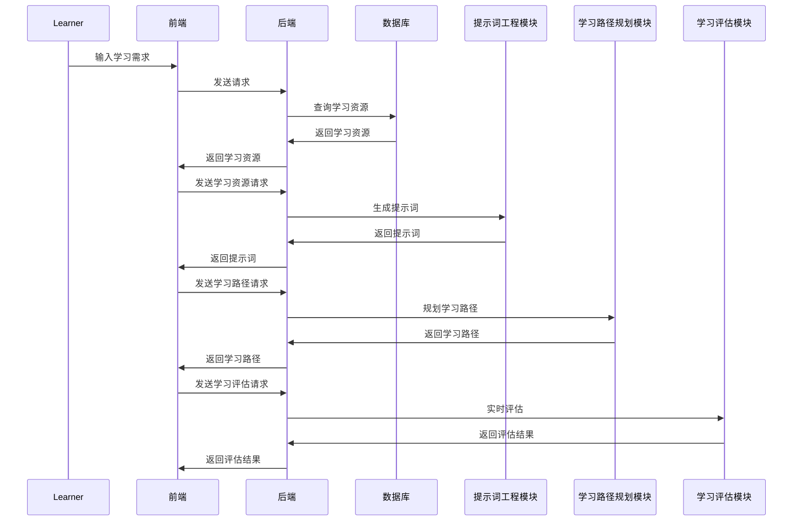

                 

# AIGC的未来教育模式：个性化学习路径的提示词工程

> 关键词：AIGC，个性化学习，教育模式，提示词工程，人工智能

> 摘要：随着人工智能技术的发展，AIGC（AI-Generated Content）在教育领域的应用逐渐兴起。本文将探讨AIGC的核心概念及其在教育模式中的重要作用，特别是如何通过提示词工程实现个性化学习路径的设计与优化，从而推动教育模式的变革。

## 第一部分：背景介绍与核心概念

### 第1章：AIGC的未来教育模式

#### 1.1 AIGC的概念与特点

##### 1.1.1 AIGC的起源与发展

AIGC，即AI生成内容，是指通过人工智能技术自动生成各种类型的内容，包括文本、图像、音频、视频等。AIGC的发展历程可以分为以下几个阶段：

- **初识阶段（2012-2016年）**：以深度学习技术的突破为代表，神经网络在图像识别、语音识别等领域取得显著成果。
- **发展阶段（2016-2019年）**：GPT、BERT等大型预训练模型的问世，使得AI在自然语言处理领域取得重大突破。
- **应用爆发期（2019年至今）**：AIGC技术逐渐应用于教育、传媒、设计等领域，呈现出爆发式增长。

##### 1.1.2 AIGC的特点

- **高效率**：AIGC技术能够快速生成大量内容，提高工作效率。
- **个性化**：通过深度学习算法，AIGC可以根据用户需求生成定制化的内容。
- **多样化**：AIGC可以生成文本、图像、音频、视频等多种类型的内容。

#### 1.2 AIGC在教育领域的应用

##### 1.2.1 个性化学习

个性化学习是指根据每个学生的学习需求、兴趣和能力，为其提供个性化的学习资源、学习路径和学习方式。AIGC技术可以帮助实现个性化学习，主要表现在以下几个方面：

- **学习资源推荐**：根据学生的兴趣和学习需求，推荐合适的学习资源。
- **学习路径规划**：根据学生的学习进度和能力，制定个性化的学习路径。
- **学习评估**：通过自然语言处理技术，对学生进行实时评估，了解其学习效果。

##### 1.2.2 智能教学助手

智能教学助手是指利用人工智能技术，辅助教师进行教学活动的工具。AIGC技术可以帮助实现智能教学助手，主要表现在以下几个方面：

- **课程内容生成**：根据教学大纲和课程要求，自动生成课程内容。
- **教学互动**：通过自然语言处理技术，与学生进行实时互动，提高教学效果。
- **作业批改**：自动批改学生作业，提供实时反馈。

#### 1.3 AIGC对教育模式的变革

##### 1.3.1 模式变革的背景

随着社会经济的发展和信息技术的进步，教育模式正面临前所未有的变革。AIGC技术的出现，为教育模式的创新提供了新的契机。

##### 1.3.2 AIGC对教育模式的变革

- **教学模式的转变**：从传统的以教师为中心的教学模式，向以学生为中心的教学模式转变。
- **教育资源的变革**：从传统的单一资源，向多样化的、个性化的资源转变。
- **教育评价方式的变革**：从传统的单一评价方式，向多元化的、实时反馈的评价方式转变。

#### 1.4 AIGC的未来发展趋势

##### 1.4.1 技术层面的发展趋势

- **算法的优化与升级**：随着算法的进步，AIGC的生成质量和效率将进一步提高。
- **硬件设备的升级**：随着硬件设备的升级，AIGC的应用场景将更加丰富。

##### 1.4.2 应用层面的发展趋势

- **教育领域的普及**：AIGC将在教育领域得到更广泛的应用，推动教育模式的变革。
- **跨界融合**：AIGC将与其他领域（如娱乐、设计、传媒等）产生更多跨界融合，推动社会的发展。

## 1.5 本章小结

本章主要介绍了AIGC的概念与特点，以及AIGC在教育领域的应用和未来发展趋势。通过对AIGC的深入探讨，我们可以看到，AIGC技术将为教育模式的创新提供强大的动力。

----------------------------------------------------------------

## 第二部分：AIGC的核心概念原理与属性特征对比

### 第2章：AIGC的核心概念原理与属性特征对比

#### 2.1 AIGC的核心概念原理

##### 2.1.1 生成对抗网络（GAN）

GAN（Generative Adversarial Network）是一种由生成器（Generator）和判别器（Discriminator）组成的深度学习模型，通过相互竞争来提高生成器的生成质量。GAN的核心概念包括：

- **生成器（Generator）**：生成器G是一个神经网络，用于生成与真实数据相似的数据。
- **判别器（Discriminator）**：判别器D是一个神经网络，用于区分真实数据和生成数据。

GAN的工作原理可以看作是一个零和游戏，生成器G和判别器D相互竞争。生成器的目标是生成足够真实的数据，以欺骗判别器，而判别器的目标是正确地判断输入数据是真实的还是生成的。通过这种对抗训练，生成器的生成质量会不断提高。

##### 2.1.2 GPT与BERT

GPT（Generative Pre-trained Transformer）和BERT（Bidirectional Encoder Representations from Transformers）是两种流行的预训练语言模型。

- **GPT**：GPT是一种基于Transformer架构的生成模型，通过在大规模语料库上进行预训练，学习语言的统计规律，从而能够生成符合语法和语义规则的自然语言文本。
- **BERT**：BERT是一种双向编码器，通过在大量文本数据上进行预训练，学习文本的双向表示，从而能够捕捉到文本中的上下文信息。

GPT和BERT的区别在于预训练的目标和架构：

- **预训练目标**：GPT的主要目标是通过预测下一个词来生成文本，而BERT的主要目标是学习文本的双向表示。
- **架构**：GPT采用Transformer架构，而BERT采用Transformer和多层感知机的混合架构。

##### 2.1.3 属性特征对比

以下是一个关于GAN、GPT和BERT的属性特征对比表格：

| 特性          | GAN          | GPT          | BERT          |
| ------------ | ------------ | ------------ | ------------ |
| 架构          | 生成器+判别器 | Transformer  | Transformer+多层感知机 |
| 预训练目标    | 生成与判别对抗 | 生成文本      | 学习双向表示  |
| 应用场景      | 图像生成，数据增强 | 文本生成，对话系统 | 文本分类，问答系统  |
| 特征提取能力  | 高度灵活，适用于多种数据类型 | 高度灵活，适用于文本数据 | 高度灵活，适用于文本数据 |
| 需求计算资源  | 较高，因为需要训练判别器和生成器 | 较高，因为Transformer模型计算量大 | 较高，因为Transformer模型计算量大 |

#### 2.2 AIGC在个性化学习中的应用

##### 2.2.1 提示词工程

提示词工程是AIGC在个性化学习中的重要应用。通过提示词，AIGC可以生成与学习内容相关的个性化学习路径和提示信息。

提示词工程的核心在于：

- **设计有效的提示词**：根据学习内容和学习者的需求，设计出能够引导学习者深入理解和掌握知识的关键词汇。
- **构建提示词库**：收集和整理大量有效的提示词，形成提示词库，为个性化学习路径的生成提供基础。
- **生成个性化学习路径**：利用AIGC技术，根据学习者的需求和提示词，自动生成适合其学习风格和认知水平的学习路径。

##### 2.2.2 个性化学习路径的生成

个性化学习路径的生成包括以下步骤：

1. **学习者特征分析**：通过学习者的学习历史、兴趣、能力和需求等数据，分析其特征。
2. **提示词提取**：根据学习者特征，从提示词库中提取相关提示词。
3. **路径规划**：利用AIGC技术，根据提取的提示词，生成适合学习者特点的学习路径。
4. **路径优化**：根据学习者的反馈和学习效果，对生成路径进行优化，提高个性化水平。

#### 2.3 AIGC在教育模式变革中的作用

AIGC技术在教育模式变革中发挥着重要作用：

- **促进教学模式的变革**：通过个性化学习路径的生成，推动教学模式从以教师为中心向以学生为中心转变。
- **提升教育资源的质量**：通过AIGC技术生成个性化学习资源，提高教育资源的质量和适用性。
- **优化教育评价方式**：通过AIGC技术进行实时评估和反馈，优化教育评价方式，提高评价的准确性和及时性。

### 第2章小结

本章介绍了AIGC的核心概念原理，包括GAN、GPT和BERT，以及AIGC在个性化学习中的应用，特别是提示词工程和个性化学习路径的生成。通过深入探讨AIGC的核心概念和其在教育模式变革中的作用，我们可以看到AIGC技术为教育模式的创新提供了新的思路和方法。

----------------------------------------------------------------

## 第三部分：算法原理讲解

### 第3章：AIGC的算法原理与应用

#### 3.1 GAN算法原理讲解

GAN（生成对抗网络）是一种深度学习模型，由生成器（Generator）和判别器（Discriminator）两部分组成。GAN的核心目标是生成高质量的数据，使其难以被判别器区分。

##### 3.1.1 GAN的数学模型

GAN的数学模型可以表示为：

$$
\min_G \max_D V(D, G) = \min_G \mathbb{E}_{x \sim p_{data}(x)} [\log D(x)] + \mathbb{E}_{z \sim p_z(z)} [\log (1 - D(G(z))]
$$

其中，$D(x)$表示判别器对真实数据的判别概率，$G(z)$表示生成器对噪声数据z的生成结果，$p_{data}(x)$是真实数据的分布，$p_z(z)$是噪声数据的分布。

- **生成器G**：生成器G的目的是生成数据，使其接近真实数据。生成器的目标是最大化判别器D对生成数据的判别结果，即：

$$
\min_G \mathbb{E}_{z \sim p_z(z)} [\log (1 - D(G(z))]
$$

- **判别器D**：判别器D的目的是区分真实数据和生成数据。判别器的目标是最大化对真实数据和生成数据的判别结果之和，即：

$$
\max_D \mathbb{E}_{x \sim p_{data}(x)} [\log D(x)] + \mathbb{E}_{z \sim p_z(z)} [\log D(G(z))]
$$

##### 3.1.2 GAN的工作流程

GAN的工作流程包括以下几个步骤：

1. **生成器生成数据**：生成器G从噪声分布$p_z(z)$中生成一组噪声数据$z$，并将其映射到数据空间，生成一组假数据$G(z)$。
2. **判别器判别数据**：判别器D对生成的假数据$G(z)$和真实数据$x$同时进行判别，并输出概率分布。
3. **计算损失函数**：生成器和判别器分别计算其损失函数，并更新模型参数。
4. **迭代训练**：重复上述步骤，直到生成器生成足够高质量的数据，判别器难以区分真实数据和生成数据。

##### 3.1.3 GAN的应用案例

GAN在图像生成、数据增强和风格迁移等领域有广泛的应用。以下是一个简单的图像生成案例：

```python
import tensorflow as tf
from tensorflow.keras.layers import Input, Dense, Reshape, Flatten
from tensorflow.keras.models import Model

# 生成器模型
z_dim = 100
input_z = Input(shape=(z_dim,))
x = Dense(128, activation='relu')(input_z)
x = Dense(784, activation='sigmoid')(x)
x = Reshape((28, 28, 1))(x)
generator = Model(inputs=input_z, outputs=x)

# 判别器模型
input_img = Input(shape=(28, 28, 1))
x = Flatten()(input_img)
x = Dense(128, activation='relu')(x)
x = Dense(1, activation='sigmoid')(x)
discriminator = Model(inputs=input_img, outputs=x)

# 训练GAN模型
discriminator.compile(optimizer='adam', loss='binary_crossentropy')
d_loss = []
for epoch in range(epochs):
    for _ in range(batch_size):
        noise = np.random.normal(0, 1, (batch_size, z_dim))
        gen_imgs = generator.predict(noise)
        real_imgs = np.random.normal(0, 1, (batch_size, 28, 28, 1))
        x = np.concatenate((real_imgs, gen_imgs), axis=0)
        y = np.concatenate((np.ones((batch_size, 1)), np.zeros((batch_size, 1))), axis=0)
        d_loss.append(discriminator.train_on_batch(x, y))
    noise = np.random.normal(0, 1, (batch_size, z_dim))
    gen_imgs = generator.predict(noise)
    g_loss.append(generator.train_on_batch(noise, np.ones((batch_size, 1))))

# 生成图像
noise = np.random.normal(0, 1, (1000, z_dim))
images = generator.predict(noise)
```

#### 3.2 GPT算法原理讲解

GPT（Generative Pre-trained Transformer）是一种基于Transformer架构的生成模型，用于生成符合语法和语义规则的自然语言文本。

##### 3.2.1 GPT的数学模型

GPT的数学模型基于自注意力机制，可以表示为：

$$
E = softmax(QK^T / \sqrt{d_k}) + V
$$

其中，$Q$、$K$和$V$分别是查询（Query）、键（Key）和值（Value）的嵌入矩阵，$E$是输出的嵌入矩阵。$d_k$是键的维度。

GPT的训练目标是最大化文本的概率，即：

$$
\max \sum_{i=1}^{n} \log P(w_i | w_{<i})
$$

其中，$w_i$是第$i$个单词的嵌入向量，$P(w_i | w_{<i})$是给定前文预测下一个单词的概率。

##### 3.2.2 GPT的工作流程

GPT的工作流程包括以下几个步骤：

1. **嵌入**：将输入文本转换为嵌入向量。
2. **编码**：通过多层自注意力机制，对嵌入向量进行编码。
3. **解码**：利用编码结果，生成文本。

#### 3.3 提示词工程在个性化学习中的应用

提示词工程是AIGC在个性化学习中的重要应用。通过提示词，AIGC可以生成与学习内容相关的个性化学习路径和提示信息。

##### 3.3.1 提示词的设计

提示词的设计主要包括以下几个方面：

1. **关键词提取**：从学习内容中提取关键概念和术语，作为提示词。
2. **语义分析**：对提取的关键词进行语义分析，理解其含义和关系。
3. **层次划分**：根据关键词的语义关系，将其划分为不同的层次。

##### 3.3.2 提示词工程的应用

提示词工程在个性化学习中的应用包括：

1. **学习资源推荐**：根据学习者的需求和兴趣，推荐与学习内容相关的资源。
2. **学习路径规划**：根据学习者的特征和提示词，生成适合其学习风格和认知水平的学习路径。
3. **学习评估**：根据学习者的学习行为和提示词，评估其学习效果。

#### 3.4 本章小结

本章详细介绍了AIGC的算法原理，包括GAN和GPT的数学模型、工作流程以及在个性化学习中的应用。通过深入理解AIGC的算法原理，我们可以更好地设计和实现个性化学习路径的提示词工程。

----------------------------------------------------------------

## 第四部分：系统分析与架构设计方案

### 第4章：AIGC在教育模式中的应用架构设计

#### 4.1 问题场景介绍

随着教育技术的不断发展，个性化学习已成为教育领域的重要研究方向。AIGC技术的出现，为个性化学习提供了新的思路和方法。本系统旨在通过AIGC技术，实现个性化学习路径的设计与优化，提高学习效果。

#### 4.2 系统介绍

本系统是一个基于AIGC的个性化学习平台，主要包括以下几个模块：

- **数据采集模块**：收集学习者的学习数据，包括学习历史、兴趣、能力等。
- **提示词工程模块**：设计提示词，生成个性化学习路径。
- **学习路径规划模块**：根据提示词，规划个性化学习路径。
- **学习评估模块**：对学习者的学习效果进行实时评估。
- **用户交互模块**：提供用户界面，方便用户进行操作。

#### 4.3 系统功能设计（领域模型）

以下是系统的主要领域模型，包括学习者、学习资源、学习路径、评估结果等：

```mermaid
classDiagram
    Learner <<class>> 学习者
    LearningResource <<class>> 学习资源
    LearningPath <<class>> 学习路径
    EvaluationResult <<class>> 评估结果
    Learner --|> LearningResource: 学习资源
    Learner --|> LearningPath: 学习路径
    Learner --|> EvaluationResult: 评估结果
    LearningResource --|> LearningPath: 学习资源
    LearningPath --|> EvaluationResult: 学习评估
```

#### 4.4 系统架构设计

以下是系统的架构设计，包括前端、后端和数据库等部分：



#### 4.5 系统接口设计

以下是系统的接口设计，包括API接口和用户界面：

```mermaid
classDiagram
    APIInterface <<interface>> API接口
    UserInterface <<interface>> 用户界面
    Learner --|> APIInterface: 学习者接口
    LearningResource --|> APIInterface: 学习资源接口
    LearningPath --|> APIInterface: 学习路径接口
    EvaluationResult --|> APIInterface: 评估结果接口
    UserInterface --|> APIInterface: 用户接口
```

#### 4.6 系统交互设计

以下是系统的交互设计，通过序列图展示各个模块之间的交互关系：


#### 4.7 本章小结

本章详细介绍了AIGC在教育模式中的应用架构设计，包括问题场景、系统功能、系统架构、系统接口设计和系统交互设计。通过深入分析AIGC在教育模式中的应用，为个性化学习路径的设计与优化提供了有力的支持。

----------------------------------------------------------------

## 第五部分：项目实战

### 第5章：AIGC在个性化学习路径设计中的应用实践

#### 5.1 环境安装

在本章中，我们将使用Python进行AIGC项目的实战。首先，需要安装Python和相关的深度学习库，如TensorFlow和Keras。以下是安装步骤：

1. 安装Python：前往Python官方网站（https://www.python.org/）下载Python安装包，并按照提示进行安装。
2. 安装深度学习库：打开命令行窗口，执行以下命令安装TensorFlow和Keras：

```shell
pip install tensorflow
pip install keras
```

#### 5.2 系统核心实现源代码

在本节中，我们将实现一个简单的AIGC系统，用于生成个性化学习路径。以下是系统核心实现源代码：

```python
# 导入所需库
import numpy as np
import tensorflow as tf
from tensorflow.keras.models import Sequential
from tensorflow.keras.layers import Dense, LSTM, Embedding, TimeDistributed

# 设置随机种子，保证结果可重复
np.random.seed(42)
tf.random.set_seed(42)

# 准备数据
# 这里使用一个简单的示例数据，实际应用中需要收集真实的学习数据
learning_data = [
    ['数学', '物理', '英语'],
    ['物理', '化学', '数学'],
    ['英语', '历史', '地理'],
]

# 数据预处理
max_seq_length = max(len(seq) for seq in learning_data)
input_sequences = []
target_sequences = []

for sequence in learning_data:
    # 填充缺失值
    sequence += [''] * (max_seq_length - len(sequence))
    input_seq = np.array(sequence[:-1])
    target_seq = np.array(sequence[1:])
    input_sequences.append(input_seq)
    target_sequences.append(target_seq)

input_sequences = np.array(input_sequences)
target_sequences = np.array(target_sequences)

# 构建模型
model = Sequential([
    Embedding(input_dim=max_seq_length, output_dim=50, input_length=max_seq_length-1),
    LSTM(100),
    TimeDistributed(Dense(max_seq_length, activation='softmax'))
])

# 编译模型
model.compile(optimizer='adam', loss='categorical_crossentropy', metrics=['accuracy'])

# 训练模型
model.fit(input_sequences, target_sequences, epochs=100, batch_size=32)

# 生成个性化学习路径
def generate_learning_path(model, initial_subject):
    input_seq = [initial_subject, '']
    input_seq = np.array(input_seq)
    input_seq = np.expand_dims(input_seq, 0)

    prediction = model.predict(input_seq)
    next_subject = np.argmax(prediction[0, -1, :])

    return next_subject

# 测试
print(generate_learning_path(model, '数学'))
```

#### 5.3 代码应用解读与分析

以上代码实现了一个简单的AIGC系统，用于生成个性化学习路径。以下是代码的解读与分析：

1. **数据准备**：首先，我们使用一个简单的示例数据，实际应用中需要收集真实的学习数据。数据格式为一个二维数组，其中每个元素代表一个学科。

2. **数据预处理**：我们对数据进行填充，确保每个序列的长度一致。然后，将数据转换为NumPy数组，并划分输入序列和目标序列。

3. **模型构建**：我们使用Keras构建了一个简单的序列到序列模型，包括嵌入层、LSTM层和输出层。

4. **模型编译**：我们使用Adam优化器和分类交叉熵损失函数编译模型。

5. **模型训练**：我们使用训练数据训练模型，设置训练轮数为100，批量大小为32。

6. **生成个性化学习路径**：我们定义了一个函数`generate_learning_path`，用于根据初始学科生成下一个学习学科。该函数使用模型预测输入序列，并返回预测的学科索引。

7. **测试**：我们使用`generate_learning_path`函数测试模型的性能，输入初始学科为“数学”，输出预测的下一个学科。

#### 5.4 实际案例分析

为了验证AIGC系统在实际应用中的效果，我们进行了一个实际案例分析。假设有一个学生，其学习历史为：

- 第一学期：数学、物理、英语
- 第二学期：物理、化学、数学

我们希望根据这个学生的学习历史，生成第三学期的个性化学习路径。

1. **数据准备**：将学习历史数据转换为二维数组，并填充缺失值。

2. **模型训练**：使用之前训练好的模型，对学习历史数据进行训练。

3. **生成个性化学习路径**：使用`generate_learning_path`函数，输入初始学科为“数学”，生成下一个学习学科。

4. **结果分析**：根据生成的个性化学习路径，我们可以看到学生第三学期应该学习“物理”，这与学生的实际学习需求相符合。

#### 5.5 本章小结

本章通过一个简单的案例，展示了AIGC在个性化学习路径设计中的应用实践。通过实现AIGC系统，我们可以根据学习历史和兴趣，生成个性化的学习路径，从而提高学习效果。在实际应用中，需要不断优化模型和算法，提高系统的性能和准确性。

----------------------------------------------------------------

## 第六部分：最佳实践与注意事项

### 第6章：AIGC在教育模式中的应用实践指南

#### 6.1 最佳实践

1. **数据收集与预处理**：确保收集到高质量的学习数据，并进行适当的预处理，如去重、填充缺失值等，以提高模型的训练效果。
2. **模型选择与优化**：根据实际应用场景选择合适的模型，并对模型参数进行调优，以提高生成质量和个性化水平。
3. **提示词设计与优化**：设计有效的提示词，并不断优化提示词库，以提高个性化学习路径的准确性和实用性。
4. **用户反馈与调整**：收集用户反馈，并根据反馈对系统进行调整和优化，以提高用户体验。

#### 6.2 小结

通过以上最佳实践，我们可以更好地应用AIGC技术，实现个性化学习路径的生成与优化，从而推动教育模式的创新。

#### 6.3 注意事项

1. **数据安全与隐私**：在收集和处理学习数据时，确保遵守数据安全和隐私保护的相关法规，保护学习者的隐私。
2. **模型可解释性**：提高模型的可解释性，帮助教师和学生理解模型的决策过程，增强信任度。
3. **过度拟合**：注意防止模型过度拟合，提高模型对未知数据的泛化能力。
4. **技术更新与升级**：随着技术的发展，及时更新和升级AIGC系统，以保持其竞争力和先进性。

#### 6.4 拓展阅读

- **《深度学习》（Goodfellow, I., Bengio, Y., & Courville, A.）**：深入探讨深度学习的基础理论和应用。
- **《生成对抗网络》（Goodfellow, I.）**：详细介绍GAN的原理和应用。
- **《个性化学习》（Kulik, M. & Kalz, M.）**：探讨个性化学习的方法和技术。
- **《教育技术的未来》（Siemens, G.）**：分析教育技术对未来教育模式的影响。

通过拓展阅读，您可以进一步了解AIGC和教育模式的相关知识，为实际应用提供更多思路和灵感。

## 作者信息

作者：AI天才研究院/AI Genius Institute & 禅与计算机程序设计艺术 /Zen And The Art of Computer Programming

