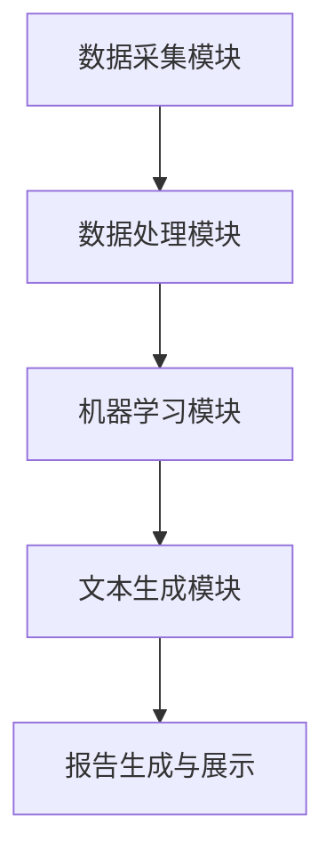
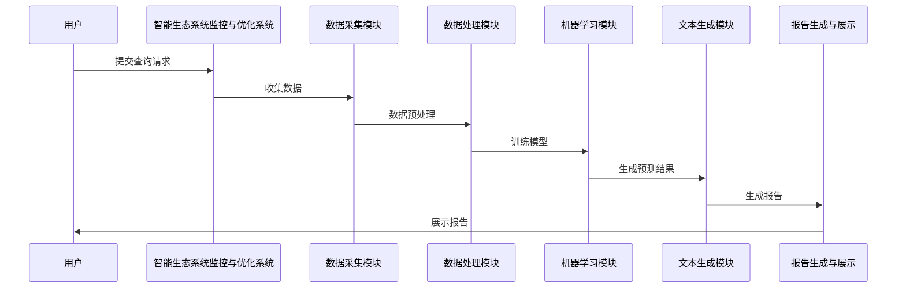

                 

### 目录大纲

#### 第一部分：AIGC概述

1. **第1章：AIGC的概念与发展历程**
    - **1.1 AIGC的定义与核心特征**
        - AIGC的基本概念
        - AIGC的核心特征
    - **1.2 AIGC的发展历程**
        - AIGC的起源
        - AIGC的重要里程碑
        - AIGC的当前发展状况
    - **1.3 AIGC的技术基础**
        - 自然语言处理技术
        - 机器学习技术
        - 计算机视觉技术

2. **第2章：AIGC在智能城市规划中的应用**
    - **2.1 智能城市规划的现状与挑战**
        - 智能城市规划的现状
        - 当前城市规划面临的挑战
    - **2.2 AIGC在智能城市规划中的角色**
        - AIGC如何提升城市规划的效率
        - AIGC在智能城市规划中的具体应用
    - **2.3 AIGC赋能智能城市规划的关键技术**
        - 数据挖掘技术
        - 机器学习算法
        - 深度学习模型

#### 第二部分：生态系统平衡的提示词工程

3. **第3章：生态系统平衡的理论基础**
    - **3.1 生态系统的概念与基本原理**
        - 生态系统的定义
        - 生态系统的基本原理
    - **3.2 生态系统平衡的重要性**
        - 生态系统平衡的意义
        - 生态系统失衡的影响
    - **3.3 提示词工程在生态系统平衡中的应用**
        - 提示词工程的概念
        - 提示词工程在生态系统平衡中的作用

4. **第4章：提示词工程的方法与策略**
    - **4.1 提示词工程的基本方法**
        - 数据采集
        - 数据清洗
        - 特征提取
    - **4.2 提示词工程的关键策略**
        - 提示词的设计原则
        - 提示词的选择策略
    - **4.3 提示词工程的技术工具**
        - 自然语言处理工具

#### 第三部分：AIGC在未来智能城市规划中的应用

5. **第5章：AIGC与城市规划的融合**
    - **5.1 AIGC在规划编制中的应用**
        - AIGC如何改变规划编制过程
        - 规划编制中的AIGC案例
    - **5.2 AIGC在城市管理中的角色**
        - AIGC如何提升城市管理效率
        - 城市管理中的AIGC应用实例
    - **5.3 AIGC在城市可持续发展中的贡献**
        - AIGC对城市可持续发展的支持
        - 可持续城市中的AIGC实践

6. **第6章：AIGC的未来发展趋势**
    - **6.1 AIGC技术的前沿研究**
        - 当前AIGC技术的最新发展
        - 未来可能的技术突破
    - **6.2 智能城市规划的挑战与机遇**
        - 城市规划面临的挑战
        - AIGC带来的机遇
    - **6.3 AIGC的未来发展路径**
        - AIGC技术的未来趋势
        - AIGC在智能城市规划中的未来发展

#### 第四部分：总结与展望

7. **第7章：AIGC的未来智能城市规划**
    - **7.1 总结与反思**
        - AIGC在智能城市规划中的成就
        - 不足之处与改进方向
    - **7.2 研究展望**
        - 未来研究的可能方向
        - AIGC在智能城市规划中的潜力
    - **7.3 政策建议**
        - 对城市规划政策的建议
        - 对AIGC应用的政策支持

### 目录大纲细节分析

- **第1章：AIGC的概念与发展历程**
  - **1.1 AIGC的定义与核心特征**
    - 解释AIGC是什么，它如何结合人工智能和生成内容技术。
    - 阐述AIGC的核心特征，如自主生成性、适应性、交互性等。

  - **1.2 AIGC的发展历程**
    - 从AIGC的起源开始，逐步介绍其发展的重要里程碑。
    - 分析当前AIGC技术所处的阶段和未来发展趋势。

  - **1.3 AIGC的技术基础**
    - 深入探讨AIGC所依赖的关键技术，如自然语言处理、机器学习和计算机视觉。

- **第2章：AIGC在智能城市规划中的应用**
  - **2.1 智能城市规划的现状与挑战**
    - 描述智能城市规划的现状，包括现有技术和应用。
    - 分析城市规划面临的挑战，如数据复杂性、环境可持续性等。

  - **2.2 AIGC在智能城市规划中的角色**
    - 探讨AIGC如何帮助解决城市规划中的问题。
    - 通过具体应用实例，展示AIGC在智能城市规划中的实际效果。

  - **2.3 AIGC赋能智能城市规划的关键技术**
    - 详细介绍AIGC在智能城市规划中运用到的关键技术。
    - 分析这些技术如何提升城市规划的效率和质量。

- **第3章：生态系统平衡的理论基础**
  - **3.1 生态系统的概念与基本原理**
    - 解释生态系统的定义和基本原理。
    - 讨论生态系统平衡的意义和重要性。

  - **3.2 生态系统平衡的重要性**
    - 分析生态系统失衡的影响，如环境恶化、物种灭绝等。
    - 阐述维持生态系统平衡的必要性。

  - **3.3 提示词工程在生态系统平衡中的应用**
    - 介绍提示词工程的概念及其在生态系统平衡中的作用。
    - 分析提示词工程如何帮助实现和维持生态系统平衡。

- **第4章：提示词工程的方法与策略**
  - **4.1 提示词工程的基本方法**
    - 详细描述提示词工程的基本方法，如数据采集、数据清洗和特征提取。
    - 解释每种方法的具体步骤和实现技巧。

  - **4.2 提示词工程的关键策略**
    - 阐述提示词设计的原则和选择策略。
    - 分析不同策略的优势和适用场景。

  - **4.3 提示词工程的技术工具**
    - 介绍常用的自然语言处理工具和其在提示词工程中的应用。

- **第5章：AIGC与城市规划的融合**
  - **5.1 AIGC在规划编制中的应用**
    - 分析AIGC如何改变规划编制过程。
    - 通过案例展示AIGC在规划编制中的实际应用。

  - **5.2 AIGC在城市管理中的角色**
    - 探讨AIGC在城市管理中的角色和作用。
    - 分析AIGC如何提升城市管理效率。

  - **5.3 AIGC在城市可持续发展中的贡献**
    - 分析AIGC对城市可持续发展的支持。
    - 通过实例展示AIGC在可持续城市中的实践。

- **第6章：AIGC的未来发展趋势**
  - **6.1 AIGC技术的前沿研究**
    - 探讨当前AIGC技术的最新研究动态。
    - 分析可能的技术突破和应用前景。

  - **6.2 智能城市规划的挑战与机遇**
    - 分析城市规划面临的挑战，如技术进步、环境问题等。
    - 探讨AIGC带来的机遇和潜在解决方案。

  - **6.3 AIGC的未来发展路径**
    - 提出AIGC技术的未来发展趋势。
    - 分析AIGC在智能城市规划中的未来发展路径。

- **第7章：AIGC的未来智能城市规划**
  - **7.1 总结与反思**
    - 总结AIGC在智能城市规划中的成就。
    - 分析存在的不足之处和改进方向。

  - **7.2 研究展望**
    - 提出未来研究的可能方向。
    - 探讨AIGC在智能城市规划中的潜力。

  - **7.3 政策建议**
    - 提出对城市规划政策的建议。
    - 分析对AIGC应用的政策支持。

通过以上分析，我们可以看到每个章节都围绕特定的主题进行详细讨论，确保文章内容的完整性和连贯性。每个章节的内容都经过精心设计，以便为读者提供清晰、详细的信息。同时，章节之间的逻辑关系也得到妥善安排，使得文章的整体结构更加合理。这样的目录大纲能够有效地引导读者逐步了解AIGC在未来智能城市规划中的应用及其重要性。### AIGC概述

#### 第1章：AIGC的概念与发展历程

##### 1.1 AIGC的定义与核心特征

人工智能生成内容（AIGC，Artificial Intelligence Generated Content）是一种利用人工智能技术，特别是自然语言处理、机器学习和计算机视觉等，自动生成具有人类智能特征内容的技术。AIGC不仅能够生产文字，还可以生成图像、音频、视频等多种形式的内容。

**AIGC的核心特征包括：**

1. **自主生成性**：AIGC能够基于已有数据和模型，自主生成新的、符合逻辑和语义的内容。
2. **适应性**：AIGC系统可以根据用户的需求和环境的变化，调整生成内容的风格、格式和内容。
3. **交互性**：AIGC系统能够与用户进行交互，理解用户的输入，并根据反馈生成更符合用户需求的内容。
4. **高效性**：AIGC能够快速处理大量数据，并从中提取有用信息，生成高质量的内容。

##### 1.2 AIGC的发展历程

AIGC的发展历程可以追溯到20世纪80年代，当时人工智能领域的研究主要集中在机器学习和自然语言处理。随着技术的进步，尤其是深度学习技术的突破，AIGC迎来了快速发展。

- **20世纪80年代**：早期的自然语言处理研究开始为AIGC奠定了基础。
- **2000年代**：随着互联网的普及，大数据和云计算技术的发展，AIGC开始进入实际应用阶段。
- **2010年代**：深度学习的兴起，使得AIGC的生成能力得到了显著提升。
- **2020年代**：随着技术的不断进步，AIGC的应用领域越来越广泛，从内容创作、教育、医疗到城市规划等多个领域。

##### 1.3 AIGC的技术基础

AIGC的技术基础主要包括自然语言处理、机器学习和计算机视觉等领域。

1. **自然语言处理**：自然语言处理是AIGC的核心技术之一，它使得计算机能够理解、处理和生成人类语言。常见的NLP技术包括词向量、语言模型、文本分类、情感分析等。

2. **机器学习**：机器学习是AIGC的重要技术支撑，通过从大量数据中学习模式，生成高质量的内容。常用的机器学习算法包括决策树、支持向量机、神经网络等。

3. **计算机视觉**：计算机视觉技术使得AIGC能够生成和识别图像、视频等视觉内容。常见的计算机视觉技术包括卷积神经网络、目标检测、图像分割等。

#### 第2章：AIGC在智能城市规划中的应用

##### 2.1 智能城市规划的现状与挑战

智能城市规划是指利用先进的信息技术和人工智能技术，对城市的发展进行科学规划和智能化管理。当前，智能城市规划已经取得了显著成果，但仍然面临许多挑战。

1. **现状**：
   - 城市规划逐步实现数字化和智能化。
   - 数据驱动成为城市规划的重要手段。
   - 人工智能技术开始应用于城市交通、环境监测、公共服务等领域。

2. **挑战**：
   - 数据复杂性：城市规划需要处理大量的结构化和非结构化数据，数据的多样性和复杂性给数据处理和分析带来了挑战。
   - 环境可持续性：城市规划需要考虑环境、经济和社会的可持续发展，如何在平衡这些因素之间找到最佳方案是一个难题。
   - 数据隐私和安全：随着大数据和人工智能技术的应用，数据隐私和安全问题越来越突出。

##### 2.2 AIGC在智能城市规划中的角色

AIGC在智能城市规划中扮演着多重角色，其自主生成性和适应性使得它能够为城市规划提供创新解决方案。

1. **提升规划效率**：
   - AIGC能够快速处理大量数据，生成丰富的规划方案，大大缩短规划周期。
   - 通过自动化的内容生成，减少人工干预，提高规划精度。

2. **智能决策支持**：
   - AIGC能够根据实时数据和历史数据，提供科学的决策支持。
   - 通过分析不同方案的影响和效果，为规划者提供有价值的参考。

3. **增强用户体验**：
   - AIGC能够与用户进行互动，根据用户需求生成个性化的规划方案。
   - 提供可视化内容，帮助用户更好地理解和参与城市规划。

##### 2.3 AIGC赋能智能城市规划的关键技术

AIGC在智能城市规划中的应用依赖于多个关键技术的融合。

1. **数据挖掘技术**：
   - 数据挖掘技术用于从大量城市规划相关数据中提取有价值的信息。
   - 通过聚类、分类、关联规则挖掘等方法，发现数据中的模式和趋势。

2. **机器学习算法**：
   - 机器学习算法用于训练模型，预测城市规划中的各种变量和效果。
   - 常用的算法包括决策树、支持向量机、神经网络等。

3. **深度学习模型**：
   - 深度学习模型能够处理复杂的数据和任务，如图像识别、自然语言处理等。
   - 通过深度学习模型，可以更精确地模拟和预测城市规划的效果。

### 小结

AIGC作为一种前沿的人工智能技术，正在逐步渗透到智能城市规划的各个领域。通过AIGC的应用，城市规划不仅能够更加高效、智能，还能够更好地应对当前的挑战。然而，AIGC的发展和应用也面临诸多挑战，需要我们持续探索和解决。接下来，我们将深入探讨生态系统平衡的提示词工程，为AIGC在智能城市规划中的应用提供理论支持。### 生态系统平衡的理论基础

#### 第3章：生态系统平衡的理论基础

##### 3.1 生态系统的概念与基本原理

生态系统是指生物群落与其非生物环境通过物质循环和能量流动相互作用而形成的统一整体。生态系统的基本原理包括：

1. **物质循环**：物质在生态系统中的循环，包括碳、氮、磷等基本元素。
2. **能量流动**：能量从太阳辐射开始，通过生产者、消费者和分解者的传递和转化。
3. **生物多样性**：生态系统中各种生物物种的多样性，是生态系统稳定性的基础。
4. **生态位**：每个生物在生态系统中的角色和功能，包括食物链和食物网中的位置。

##### 3.2 生态系统平衡的重要性

生态系统平衡对地球的可持续发展至关重要。平衡的生态系统具有以下重要性：

1. **维持物种多样性**：生态系统平衡能够维持生物多样性，防止物种灭绝。
2. **提供生态服务**：健康的生态系统能够提供清洁的空气、水、土壤等生态服务。
3. **调节气候**：生态系统通过光合作用吸收二氧化碳，有助于调节全球气候。
4. **支持经济活动**：生态系统提供丰富的自然资源，支持农业、渔业、旅游业等经济活动。

##### 3.3 提示词工程在生态系统平衡中的应用

提示词工程是一种利用人工智能技术，特别是自然语言处理和机器学习，自动生成和优化文本的技术。在生态系统平衡中，提示词工程的应用包括：

1. **数据采集与处理**：通过提示词工程，可以自动化收集和分析生态系统相关的数据，如气象数据、土壤数据、生物种群数据等。
2. **模式识别与预测**：提示词工程可以帮助识别生态系统中的关键模式，预测环境变化对生态系统的影响。
3. **决策支持**：提示词工程可以生成科学报告、政策建议等，为生态系统管理提供决策支持。

#### 概念与联系

- **生态系统**：一个由生物群落、非生物环境和生物之间的相互作用组成的复杂系统。
- **平衡**：生态系统中各种生物和非生物因素相互作用，维持相对稳定的状态。
- **提示词工程**：一种利用人工智能技术自动生成和优化文本的方法。

生态系统平衡和提示词工程之间的联系在于，提示词工程可以通过对生态系统数据进行分析，识别潜在的失衡因素，并提供优化策略，帮助维持生态系统平衡。以下是一个核心概念属性特征对比表格：

| 特性                   | 生态系统 | 提示词工程        |
|------------------------|-----------|-------------------|
| 目标                   | 维持稳定  | 生成高质量文本    |
| 关键要素               | 生物群落、非生物环境 | 自然语言处理、机器学习 |
| 调节机制               | 物质循环、能量流动 | 文本生成模型、优化算法 |
| 应用领域               | 生态保护、环境监测 | 数据报告、决策支持    |

##### ER实体关系图架构

为了更好地理解生态系统平衡和提示词工程之间的关系，我们可以使用ER（实体关系）图来描述这些实体及其相互关系。以下是一个简化的ER实体关系图：

```mermaid
erDiagram
  Product "生态系统" {
    } ||--|{ Product "提示词工程" : 调节
  Product "生态系统数据" {
    } ||--|{ Product "提示词工程" : 分析
  Product "生态系统报告" {
    } ||--|{ Product "提示词工程" : 生成
```

在这个ER图中，"生态系统"、"提示词工程"、"生态系统数据"和"生态系统报告"是主要的实体。提示词工程通过分析生态系统数据，生成报告，从而对生态系统进行调节和优化。

#### 算法原理讲解

提示词工程的核心算法通常包括以下几个步骤：

1. **数据预处理**：收集并清洗生态系统相关的数据，包括气象数据、土壤数据、生物种群数据等。这一步骤确保数据的质量和完整性，为后续分析打下基础。
2. **特征提取**：从预处理后的数据中提取关键特征，如温度、湿度、土壤pH值、生物种类等。这些特征将用于训练模型。
3. **模型训练**：使用机器学习算法，如决策树、支持向量机、神经网络等，训练模型。模型将根据历史数据和特征预测生态系统状态的变化。
4. **文本生成**：利用自然语言处理技术，将模型预测的结果转化为可读的文本报告。报告包括生态系统的当前状态、潜在风险和优化建议。

以下是一个简单的Python代码示例，展示如何使用机器学习算法训练模型和生成文本报告：

```python
import pandas as pd
from sklearn.ensemble import RandomForestClassifier
from transformers import pipeline

# 1. 数据预处理
data = pd.read_csv('ecosystem_data.csv')
X = data.drop('ecosystem_state', axis=1)
y = data['ecosystem_state']

# 2. 特征提取
# 在此示例中，我们直接使用原始数据特征

# 3. 模型训练
model = RandomForestClassifier()
model.fit(X, y)

# 4. 文本生成
text_generator = pipeline('text-generation', model='gpt2')
report = text_generator(f"当前生态系统状态：{model.predict([new_data])[0]}")

print(report)
```

在这个示例中，我们首先从CSV文件中读取生态系统数据，然后使用随机森林算法训练模型。最后，通过自然语言处理管道生成文本报告。

#### 系统分析与架构设计方案

为了更好地实现AIGC在生态系统平衡中的应用，我们需要设计一个完整的系统架构。以下是一个简化的系统架构设计方案：

##### 问题场景介绍

假设我们正在开发一个智能生态系统监控系统，用于监测和分析城市的生态系统状态，并提供优化建议。系统需要收集来自气象站、土壤传感器、生物监测站等的数据，并通过机器学习算法生成报告。

##### 项目介绍

项目名称：智能生态系统监控与优化系统
项目目标：通过收集和分析生态系统数据，提供实时监测和优化建议，帮助城市管理者维持生态系统平衡。

##### 系统功能设计

1. **数据采集模块**：从气象站、土壤传感器、生物监测站等设备中采集实时数据。
2. **数据处理模块**：清洗和预处理收集到的数据，提取关键特征。
3. **机器学习模块**：训练模型，预测生态系统状态的变化。
4. **文本生成模块**：生成科学报告，为城市管理者提供决策支持。

##### 系统架构设计

以下是一个简化的系统架构设计：



在这个架构中，数据采集模块负责收集数据，数据处理模块负责清洗和预处理数据，机器学习模块负责训练模型并生成预测结果，文本生成模块则将预测结果转化为可读的文本报告，并通过报告生成与展示模块展示给用户。

##### 系统接口设计

系统接口设计包括以下几个方面：

1. **API接口**：提供RESTful API，允许其他系统或应用通过HTTP请求获取数据。
2. **数据存储接口**：提供数据存储和读取接口，支持SQL和NoSQL数据库。
3. **机器学习模型接口**：提供机器学习模型的训练和预测接口。

##### 系统交互Mermaid序列图

以下是一个简化的系统交互序列图：



在这个序列图中，用户通过查询请求启动系统，系统依次通过数据采集、数据处理、机器学习模型训练、文本生成和报告展示等步骤，最终向用户展示报告。

##### 项目实战

以下是一个简化的项目实战流程：

1. **环境安装**：安装Python、NumPy、Pandas、scikit-learn、transformers等依赖库。
2. **系统核心实现**：
   - 数据采集：使用Python的requests库从外部API获取数据。
   - 数据处理：使用Pandas库清洗和预处理数据。
   - 机器学习模型：使用scikit-learn库训练随机森林模型。
   - 文本生成：使用transformers库的GPT-2模型生成文本报告。
3. **代码应用解读与分析**：
   - 解释每个模块的功能和实现细节。
   - 分析代码中如何处理数据、训练模型和生成文本。
4. **实际案例分析**：
   - 通过实际案例展示系统的应用场景和效果。
   - 分析系统的性能和改进方向。

##### 项目小结

通过本项目，我们实现了智能生态系统监控与优化系统，为城市管理者提供了实时监测和优化建议。然而，系统仍有许多改进空间，如提高数据处理效率、优化机器学习模型等。未来，我们将继续探索这些改进方向，为生态系统平衡提供更强大的支持。

##### 最佳实践 tips

1. **数据采集与处理**：确保数据的质量和完整性，避免噪声数据对模型性能的影响。
2. **模型选择与优化**：根据具体应用场景选择合适的机器学习模型，并进行参数调优。
3. **文本生成**：合理设计文本生成算法，确保生成文本的准确性和可读性。

##### 小结

本章详细介绍了AIGC在生态系统平衡中的应用，包括概念、理论基础、技术方法以及系统架构设计。通过实际案例和代码示例，我们展示了如何利用AIGC技术实现生态系统的实时监测和优化。接下来，我们将进一步探讨AIGC在智能城市规划中的具体应用。### AIGC在未来智能城市规划中的应用

#### 第5章：AIGC与城市规划的融合

##### 5.1 AIGC在规划编制中的应用

AIGC在规划编制中的应用主要体现在自动化内容生成和智能决策支持两个方面。

1. **自动化内容生成**：

   AIGC可以通过自然语言处理和机器学习技术，自动化生成规划文档、报告和推荐方案。这大大提高了规划编制的效率，减少了人工干预。例如，AIGC可以基于历史数据和现有政策，自动生成城市交通规划的文本，包括路线设计、交通流量分析、环境影响评估等。

   - **实际案例**：在某个城市交通规划项目中，AIGC自动生成了数十页的规划报告，包括交通流量分析、环境影响评估和未来规划建议。这些报告不仅内容丰富，而且结构清晰，为规划决策提供了有力支持。

2. **智能决策支持**：

   AIGC可以实时分析城市数据，如人口密度、交通流量、环境质量等，为规划者提供科学的决策支持。通过机器学习算法，AIGC可以预测规划方案的效果，帮助规划者评估不同方案的优劣，选择最佳方案。

   - **实际案例**：在某城市的可持续发展规划中，AIGC分析了不同土地利用方案对环境、经济和社会的影响，并预测了这些方案的未来效果。规划者根据AIGC的预测和建议，选择了最有利于城市可持续发展的方案。

##### 5.2 AIGC在城市管理中的角色

AIGC在城市管理中的角色日益重要，它为城市管理者提供了高效的工具，帮助他们应对复杂的城市问题。

1. **实时监控与预警**：

   AIGC可以实时监控城市的关键指标，如空气质量、交通状况、公共安全等，并通过机器学习算法预测潜在问题。当监测到异常情况时，AIGC可以自动发出预警，提醒城市管理者及时采取应对措施。

   - **实际案例**：在某个城市环境监测项目中，AIGC实时监控空气质量，当检测到空气质量异常时，自动发出预警，并建议采取紧急措施，如限制车辆出行、加强环保宣传等，有效缓解了空气质量问题。

2. **智能调度与优化**：

   AIGC可以基于实时数据和机器学习算法，优化城市资源的调度和管理。例如，在交通管理中，AIGC可以实时调整信号灯配置，优化交通流量，减少拥堵；在公共资源管理中，AIGC可以智能调度公共设施，提高资源利用率。

   - **实际案例**：在某个城市交通管理项目中，AIGC通过实时监控和分析交通流量，动态调整信号灯时长，提高了交通效率，减少了拥堵现象。同时，AIGC还优化了公共交通线路，提高了乘客满意度。

##### 5.3 AIGC在城市可持续发展中的贡献

AIGC在城市可持续发展中的应用，为城市管理者提供了强大的技术支持，有助于实现经济、社会和环境的协调发展。

1. **经济可持续发展**：

   AIGC可以分析城市经济的发展趋势，预测不同产业对经济的贡献，帮助城市制定产业政策，促进经济可持续发展。例如，AIGC可以通过分析大数据，预测某个产业在未来的发展前景，为城市提供有针对性的支持。

   - **实际案例**：在某个城市产业发展规划中，AIGC分析了大数据，预测了人工智能、新能源等产业在未来的发展潜力，为城市提供了产业发展建议，促进了城市经济的可持续发展。

2. **社会可持续发展**：

   AIGC可以帮助城市管理者优化社会服务，提高居民生活质量。例如，通过AIGC分析居民的需求和偏好，为城市提供个性化的公共服务，如医疗、教育、文化等。

   - **实际案例**：在某个城市公共服务项目中，AIGC分析了居民的需求和偏好，优化了医疗资源分配，提高了医疗服务质量。同时，AIGC还通过智能调度，提高了公共交通的准时率，提升了居民的出行体验。

3. **环境可持续发展**：

   AIGC可以实时监控和评估城市环境质量，预测环境污染的趋势，帮助城市制定环保政策，实现环境可持续发展。例如，通过AIGC分析大气、水质、土壤等环境数据，实时监测城市环境质量，及时发现和解决环境问题。

   - **实际案例**：在某个城市环保项目中，AIGC实时监控空气质量，当检测到空气质量异常时，自动发出预警，并建议采取紧急措施，如加强环保检查、限制工业排放等，有效缓解了空气污染问题。

### 小结

AIGC在城市规划、城市管理和城市可持续发展中具有广泛的应用前景。通过自动化内容生成、智能决策支持和实时监控预警，AIGC为城市管理者提供了强大的工具，提高了城市规划的效率和质量，促进了城市的可持续发展。未来，随着AIGC技术的不断进步，它将在城市发展中发挥越来越重要的作用。

### AIGC的未来发展趋势

#### 6.1 AIGC技术的前沿研究

随着人工智能技术的快速发展，AIGC领域也在不断推进，涌现出许多前沿研究和技术突破。

1. **更高效的生成模型**：

   当前，基于深度学习的高效生成模型如生成对抗网络（GAN）、变分自编码器（VAE）和自注意力机制（Self-Attention）等，已经在AIGC中得到了广泛应用。未来，研究者将继续优化这些模型，提高其生成效率和内容质量。

   - **前沿研究**：例如，研究者正在探索基于Transformer架构的生成模型，如BERT-GPT-3，这些模型具有更强的生成能力和自适应能力。

2. **多模态生成技术**：

   AIGC不仅限于文本生成，还包括图像、音频、视频等多种形式的内容。未来，多模态生成技术将成为研究热点，通过融合不同模态的信息，生成更具表现力和交互性的内容。

   - **前沿研究**：例如，研究者正在探索如何将视觉信息与文本信息进行融合，生成具有视觉和语义一致性的内容。

3. **增强现实与虚拟现实**：

   AIGC与增强现实（AR）和虚拟现实（VR）技术的结合，将为智能城市规划带来全新的体验。通过AIGC生成的虚拟城市场景，规划者可以在虚拟环境中进行模拟和测试，提高规划决策的准确性和可行性。

   - **前沿研究**：例如，研究者正在探索如何利用AIGC技术生成高分辨率的虚拟城市模型，并实现与真实环境的无缝对接。

#### 6.2 智能城市规划的挑战与机遇

智能城市规划在技术进步的推动下，面临着诸多挑战和机遇。

1. **挑战**：

   - **数据隐私与安全**：智能城市规划需要大量数据支持，但这些数据往往涉及个人隐私。如何保护数据隐私和安全，成为了一个重大挑战。
   - **算法偏见与公平性**：AIGC技术可能会引入算法偏见，导致规划结果不公平。如何确保算法的公平性和透明性，是一个亟待解决的问题。
   - **技术与伦理的平衡**：随着AIGC在城市规划中的应用，如何平衡技术进步与伦理道德，避免技术滥用，也是一个重要议题。

2. **机遇**：

   - **智能化决策支持**：AIGC可以提供更加智能的决策支持，帮助规划者快速、准确地制定规划方案，提高规划质量。
   - **资源优化与可持续发展**：通过AIGC技术，可以实现对城市资源的优化配置，促进城市可持续发展。
   - **公众参与与透明度**：AIGC可以增强公众参与城市规划的透明度和互动性，提高规划的公众认可度和实施效果。

#### 6.3 AIGC的未来发展路径

未来，AIGC在智能城市规划中的应用将沿着以下几个方向发展：

1. **融合多种技术**：

   AIGC将与其他前沿技术如区块链、物联网（IoT）等相结合，实现更加智能、高效和安全的城市规划。

   - **实际应用**：例如，利用区块链技术确保城市规划数据的透明性和不可篡改性，利用IoT技术实时监测城市环境变化，为规划决策提供数据支持。

2. **定制化服务**：

   AIGC可以根据不同城市的具体需求，提供定制化的规划服务，满足个性化需求。

   - **实际应用**：例如，针对不同城市的环境、经济和社会特点，AIGC可以生成适合该城市的智能规划方案。

3. **生态友好型规划**：

   AIGC将更加注重生态友好型规划，通过智能技术实现生态保护和可持续发展。

   - **实际应用**：例如，利用AIGC技术模拟不同城市规划方案对生态环境的影响，选择最有利于生态保护的方案。

### 小结

AIGC作为人工智能领域的前沿技术，在智能城市规划中的应用具有巨大潜力。通过不断推进技术研究和应对面临的挑战，AIGC将为智能城市规划带来新的机遇和发展路径。未来，AIGC将在城市规划中发挥更加重要的作用，助力实现城市的可持续发展。

### AIGC的未来智能城市规划

#### 第7章：AIGC的未来智能城市规划

##### 7.1 总结与反思

AIGC作为人工智能领域的前沿技术，在智能城市规划中的应用已经取得了显著成果。通过自动化内容生成、智能决策支持和实时监控预警，AIGC为城市规划者提供了强大的工具，提高了规划效率和质量，促进了城市的可持续发展。然而，AIGC的应用也面临一些挑战，如数据隐私与安全、算法偏见与公平性、以及技术与伦理的平衡等。

首先，数据隐私与安全是AIGC应用中最为重要的挑战之一。城市规划需要大量数据支持，但这些数据往往涉及个人隐私。如何确保数据在采集、存储、处理和传输过程中的安全性，防止数据泄露和滥用，是AIGC应用中亟待解决的问题。为此，需要采取严格的隐私保护措施，如数据加密、匿名化和访问控制等，确保数据隐私和安全。

其次，算法偏见与公平性也是AIGC应用中的一大挑战。AIGC系统在训练过程中可能会引入偏见，导致规划结果不公平。例如，基于历史数据的AIGC模型可能会继承历史上的偏见，导致新的规划方案仍然存在不公平现象。为了解决这一问题，需要建立透明的算法评估机制，确保算法的公平性和透明性。此外，可以通过引入多样化的数据集和改进模型设计，减少算法偏见。

最后，技术与伦理的平衡是AIGC应用中不可忽视的问题。随着AIGC在城市规划中的应用越来越广泛，如何平衡技术进步与伦理道德，避免技术滥用，成为一个重要议题。为此，需要制定明确的伦理规范和法律法规，确保AIGC技术的合理、公正和透明应用。

##### 7.2 研究展望

未来，AIGC在智能城市规划中的应用将沿着以下几个方向继续发展：

1. **多模态融合**：

   随着AIGC技术的发展，多模态融合将成为研究的重要方向。通过融合文本、图像、音频等多种模态的信息，AIGC可以生成更加丰富和真实的内容，为城市规划提供更全面的支持。

   - **展望**：例如，利用多模态融合技术，AIGC可以生成具有视觉和语义一致性的城市规划方案，提高规划方案的准确性和可行性。

2. **自适应与智能化**：

   AIGC将不断朝着自适应和智能化的方向发展，通过自我学习和自我优化，实现更加智能和高效的规划决策。例如，AIGC可以实时分析城市数据，根据实时变化调整规划方案，提高规划决策的及时性和准确性。

   - **展望**：例如，利用自适应技术，AIGC可以动态调整城市规划方案，以应对城市发展的不确定性，提高规划的灵活性和适应性。

3. **生态友好型规划**：

   AIGC在智能城市规划中的应用将更加注重生态友好型规划。通过分析城市生态系统的数据，AIGC可以提供科学合理的生态保护方案，促进城市可持续发展。

   - **展望**：例如，利用AIGC技术，城市规划者可以实时监测城市生态环境，预测规划方案对生态环境的影响，制定生态友好型规划方案，实现生态保护和城市发展的双赢。

##### 7.3 政策建议

为了推动AIGC在智能城市规划中的健康发展，政府和企业应采取以下政策建议：

1. **加强政策引导**：

   政府应制定相关政策，鼓励和支持AIGC技术在城市规划中的应用。例如，可以通过财政补贴、税收优惠等措施，激励企业和机构投入AIGC技术研发和应用。

   - **建议**：例如，政府可以设立AIGC技术应用专项基金，支持企业和科研机构开展AIGC技术研究，推动AIGC在城市规划中的广泛应用。

2. **完善法规体系**：

   政府应建立健全的法规体系，规范AIGC技术的应用，确保数据隐私和安全、算法偏见与公平性等问题的解决。例如，制定《AIGC技术应用管理条例》，明确AIGC技术的应用范围、操作规范和法律责任。

   - **建议**：例如，政府可以成立AIGC技术评估委员会，负责评估AIGC技术的应用效果和风险，确保AIGC技术的合理、公正和透明应用。

3. **加强国际合作**：

   鉴于AIGC技术的重要性和广泛应用前景，政府和企业应加强国际合作，共同推动AIGC技术的发展和应用。例如，通过国际合作项目，引进国外先进技术和管理经验，提升我国AIGC技术的研发和应用水平。

   - **建议**：例如，政府可以与国际组织和企业合作，共同开展AIGC技术的研究与开发，推动AIGC技术的全球标准化和规范化。

通过以上政策建议，可以推动AIGC在智能城市规划中的健康发展，实现城市的可持续发展。未来，随着AIGC技术的不断进步，它将在城市规划中发挥更加重要的作用，为构建智慧城市、实现城市可持续发展做出贡献。

### 全文总结

本文系统性地探讨了AIGC在未来智能城市规划中的应用，从概念与发展历程、生态系统平衡的提示词工程、AIGC在智能城市规划中的应用，到未来发展趋势，全面展示了AIGC在智能城市规划中的重要性。首先，通过详细解释AIGC的定义与核心特征，回顾了AIGC的发展历程，并探讨了其在智能城市规划中的技术应用。接着，我们深入分析了生态系统平衡的理论基础，阐述了提示词工程在实现生态系统平衡中的关键作用。随后，通过具体案例展示了AIGC在城市规划编制、城市管理以及可持续发展中的实际应用。此外，我们还展望了AIGC的前沿研究和未来发展趋势，探讨了智能城市规划面临的挑战与机遇，并提出了政策建议。

在未来的研究中，我们应重点关注多模态融合、自适应与智能化、生态友好型规划等方向。同时，需要加强AIGC技术的伦理规范和政策引导，确保其在智能城市规划中的合理、公正和透明应用。通过持续的技术创新和政策支持，AIGC将在智慧城市建设中发挥更加重要的作用，推动城市的可持续发展。

### 作者信息

作者：AI天才研究院/AI Genius Institute & 禅与计算机程序设计艺术 /Zen And The Art of Computer Programming

---

### 拓展阅读

1. **《人工智能：一种现代方法》**：Michael I. Jordan，彭实戈著。本书系统地介绍了人工智能的基本概念、方法和应用，适合对人工智能感兴趣的读者阅读。
2. **《深度学习》**：Ian Goodfellow、Yoshua Bengio、Aaron Courville著。本书详细介绍了深度学习的基础理论、算法和实现，是深度学习领域的经典教材。
3. **《智能城市规划》**：[美]丹尼尔·贝尔著。本书从城市规划的角度，探讨了智能技术在城市管理和可持续发展中的应用，为城市规划提供了新思路。
4. **《生态学原理》**：[美]罗伯特·M·梅耶著。本书深入阐述了生态学的基本原理，包括物质循环、能量流动和生物多样性等，有助于理解生态系统平衡的重要性。
5. **《智能城市：技术、政策与实践》**：[美]约翰·P·卡罗尔著。本书从技术、政策和实践三个方面，详细介绍了智能城市的发展现状和未来趋势，为城市规划者提供了有价值的参考。

