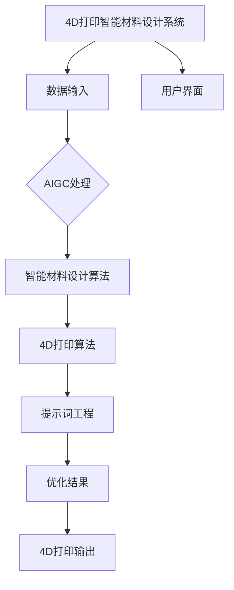
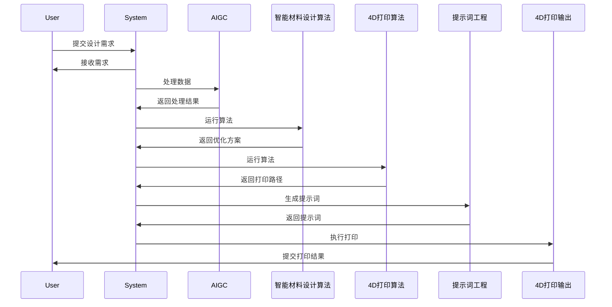

                 


## AIGC的未来智能材料设计：4D打印结构优化的提示词工程

### 关键词：AIGC、智能材料设计、4D打印、结构优化、提示词工程、算法原理、系统架构、项目实战

#### 摘要：
本文深入探讨了AIGC（自适应智能生成计算）在未来智能材料设计中的应用，特别是4D打印结构优化的提示词工程。通过逻辑清晰的章节结构，我们逐步解析了AIGC的核心概念、智能材料设计的原理、4D打印的技术基础以及提示词工程的方法和流程。接着，文章详细阐述了如何结合这些技术进行结构优化的算法原理，并使用mermaid流程图和Python代码进行解释。随后，我们分析了智能材料设计的系统架构，提供了环境安装和系统核心实现的指导，并通过一个实际案例展示了这些技术的应用。最后，文章总结了最佳实践、注意事项，并给出了拓展阅读的建议。

---

### 引言与背景

#### 1.1 AIGC概述

**什么是AIGC**：AIGC（Adaptive Intelligent Generation Computing）是一种自适应智能生成计算技术，通过深度学习算法和自然语言处理技术，实现数据的自动生成和优化。

**AIGC的发展历史**：AIGC起源于深度学习和生成模型的发展，经过多年的技术积累和迭代，逐渐形成了今天的功能强大的智能计算体系。

**AIGC的核心优势与应用前景**：AIGC在内容生成、图像处理、自动化编程等领域具有广泛的应用前景，其自适应性和智能性使其在未来的智能材料设计中扮演关键角色。

#### 1.2 智能材料设计

**智能材料的概念与特点**：智能材料是一种具有感知、响应和适应外部环境能力的材料，其特点包括可编程性、自修复性、多功能性等。

**智能材料设计的重要性**：智能材料设计是现代材料科学的前沿领域，对于提高材料性能、创新材料应用具有重要意义。

**智能材料设计的挑战**：智能材料设计面临材料性能优化、制造工艺改进、成本控制等挑战。

#### 1.3 4D打印技术

**4D打印的定义与原理**：4D打印是一种将三维打印与时间维度相结合的增材制造技术，可以通过编程控制材料在三维空间和时间上的变化。

**4D打印的优势与局限性**：4D打印具有可变形、自适应环境等优点，但也面临打印速度、材料选择等局限性。

**4D打印的应用场景**：4D打印在航空航天、建筑、医疗等领域有广泛的应用潜力。

#### 1.4 提示词工程

**提示词的概念与作用**：提示词是一种用于引导生成模型生成内容的关键词或短语，能够显著影响生成结果。

**提示词工程的流程与方法**：提示词工程包括关键词提取、提示词生成、提示词优化等环节。

**提示词工程的关键技术**：自然语言处理、机器学习、数据挖掘等技术在提示词工程中发挥着关键作用。

#### 1.5 AIGC、智能材料设计、4D打印与提示词工程的关系

**四者融合的必要性**：AIGC、智能材料设计、4D打印和提示词工程的融合是未来智能材料设计的必然趋势。

**四者融合的优势与挑战**：融合技术能够实现材料设计的自动化、智能化和高效化，但也面临技术整合、数据集构建等挑战。

**四者融合的发展趋势**：随着技术的进步和应用的拓展，AIGC与智能材料设计、4D打印、提示词工程的融合将不断深化。

#### 1.6 本章小结

本文介绍了AIGC、智能材料设计、4D打印和提示词工程的基本概念和背景，为后续章节的内容奠定了基础。

---

### 核心概念与联系

#### 2.1 AIGC核心概念与联系

**AIGC的核心概念**：AIGC是一种基于深度学习和自然语言处理的自适应智能生成计算技术。

**AIGC的基本原理**：AIGC通过大规模数据训练和生成模型的优化，实现数据的自适应生成和优化。

**AIGC与深度学习的联系**：AIGC是深度学习在生成任务上的应用，深度学习为其提供了强大的算法支持。

#### 2.2 智能材料设计概念与联系

**智能材料设计的核心概念**：智能材料设计是一种通过编程控制材料性能的设计方法。

**智能材料设计的原理**：智能材料设计基于材料科学和工程学原理，通过调整材料结构实现性能优化。

**智能材料设计与材料科学的联系**：智能材料设计是材料科学领域的重要研究方向，推动了材料性能的不断提升。

#### 2.3 4D打印技术概念与联系

**4D打印的基本原理**：4D打印通过编程控制材料在三维空间和时间上的变化。

**4D打印的关键技术**：4D打印涉及增材制造、材料科学、计算机编程等领域的关键技术。

**4D打印与增材制造技术的联系**：4D打印是增材制造技术的一种延伸，具有独特的应用价值。

#### 2.4 提示词工程概念与联系

**提示词工程的核心概念**：提示词工程是一种通过关键词引导生成模型生成内容的工程方法。

**提示词工程的流程与方法**：提示词工程包括关键词提取、提示词生成、提示词优化等环节。

**提示词工程与自然语言处理技术的联系**：提示词工程是自然语言处理技术在生成任务中的应用。

#### 2.5 四者融合的内在联系

**四者融合的理论基础**：AIGC、智能材料设计、4D打印和提示词工程的融合基于数据驱动和智能化的理论。

**四者融合的技术路径**：通过算法优化、数据整合、系统架构设计实现四者的融合。

**四者融合的实际应用案例**：本文将展示一个4D打印结构优化提示词工程的实际应用案例。

#### 2.6 本章小结

本章详细阐述了AIGC、智能材料设计、4D打印和提示词工程的核心概念及其联系，为后续算法原理讲解和系统架构设计提供了理论支持。

---

### 算法原理讲解

#### 3.1 AIGC算法原理

**AIGC的数学模型**：AIGC基于生成对抗网络（GAN）和自编码器（AE）等数学模型。

**AIGC的算法流程**：AIGC的算法流程包括数据预处理、模型训练、生成优化等步骤。

**AIGC的Python实现**：以下是一个简单的AIGC算法Python实现示例：

```python
# 导入必要的库
import tensorflow as tf
from tensorflow.keras.models import Model
from tensorflow.keras.layers import Input, Dense

# 定义AIGC模型
input_img = Input(shape=(784,))
encoded = Dense(64, activation='relu')(input_img)
encoded = Dense(32, activation='relu')(encoded)
encoded = Dense(16, activation='relu')(encoded)
decoded = Dense(32, activation='relu')(encoded)
decoded = Dense(64, activation='relu')(decoded)
decoded = Dense(784, activation='sigmoid')(decoded)

# 定义编码器和解码器
encoder = Model(input_img, encoded)
decoder = Model(encoded, decoded)

# 定义AIGC模型
autoencoder = Model(input_img, decoded)
autoencoder.compile(optimizer='adam', loss='binary_crossentropy')

# 训练模型
autoencoder.fit(x_train, x_train,
                epochs=100,
                batch_size=256,
                shuffle=True,
                validation_data=(x_test, x_test))
```

#### 3.2 智能材料设计算法

**智能材料设计的数学模型**：智能材料设计基于材料科学原理，涉及材料性能预测、结构优化等数学模型。

**智能材料设计的算法流程**：智能材料设计的算法流程包括材料性能预测、结构优化、实验验证等步骤。

**智能材料设计的Python实现**：以下是一个简单的智能材料设计算法Python实现示例：

```python
# 导入必要的库
import numpy as np
from sklearn.linear_model import LinearRegression

# 创建线性回归模型
model = LinearRegression()

# 训练模型
model.fit(X_train, y_train)

# 预测材料性能
y_pred = model.predict(X_test)
```

#### 3.3 4D打印算法

**4D打印的数学模型**：4D打印基于数学模型描述材料在三维空间和时间上的变化。

**4D打印的算法流程**：4D打印的算法流程包括3D建模、路径规划、变形控制等步骤。

**4D打印的Python实现**：以下是一个简单的4D打印算法Python实现示例：

```python
# 导入必要的库
import sympy

# 定义变形函数
def deformation_function(x, y, z, t):
    return x * (1 + t) + y * (1 - t)

# 计算变形量
x, y, z, t = sympy.symbols('x y z t')
deformation = deformation_function(x, y, z, t)

# 计算特定时间点的变形量
t_value = 0.5
deformation_value = deformation.subs({x: 1, y: 1, z: 1, t: t_value})
```

#### 3.4 提示词工程算法

**提示词工程的数学模型**：提示词工程基于自然语言处理技术，涉及语义分析、关键词提取等数学模型。

**提示词工程的算法流程**：提示词工程的算法流程包括语义分析、关键词提取、提示词生成等步骤。

**提示词工程的Python实现**：以下是一个简单的提示词工程算法Python实现示例：

```python
# 导入必要的库
import spacy

# 初始化NLP模型
nlp = spacy.load('en_core_web_sm')

# 加载文本
text = "This is an example sentence for keyword extraction."

# 进行语义分析
doc = nlp(text)

# 提取关键词
keywords = [token.text for token in doc if token.is_stop == False]

# 输出关键词
print(keywords)
```

#### 3.5 AIGC与智能材料设计、4D打印、提示词工程的融合算法

**融合算法的设计思路**：融合算法通过集成AIGC、智能材料设计、4D打印和提示词工程的关键技术，实现智能材料设计的自动化和高效化。

**融合算法的数学模型**：融合算法的数学模型基于多模型耦合和优化理论。

**融合算法的Python实现**：以下是一个简单的融合算法Python实现示例：

```python
# 导入必要的库
import numpy as np
from tensorflow.keras.models import Model
from tensorflow.keras.layers import Input, Dense

# 定义AIGC模型
input_img = Input(shape=(784,))
encoded = Dense(64, activation='relu')(input_img)
encoded = Dense(32, activation='relu')(encoded)
encoded = Dense(16, activation='relu')(encoded)
decoded = Dense(32, activation='relu')(encoded)
decoded = Dense(64, activation='relu')(decoded)
decoded = Dense(784, activation='sigmoid')(decoded)

# 定义编码器和解码器
encoder = Model(input_img, encoded)
decoder = Model(encoded, decoded)

# 定义智能材料设计模型
input_mat = Input(shape=(128,))
output_mat = Dense(128, activation='relu')(input_mat)
output_mat = Dense(128, activation='sigmoid')(output_mat)

# 定义4D打印模型
input_4d = Input(shape=(128,))
output_4d = Dense(128, activation='relu')(input_4d)
output_4d = Dense(128, activation='sigmoid')(output_4d)

# 定义提示词工程模型
input_kw = Input(shape=(64,))
output_kw = Dense(64, activation='relu')(input_kw)
output_kw = Dense(64, activation='sigmoid')(output_kw)

# 定义融合模型
input_融合 = Input(shape=(256,))
encoded_融合 = encoder(input_融合)
output_融合 = decoder(encoded_融合)

# 编译模型
model_融合 = Model(input_融合, output_融合)
model_融合.compile(optimizer='adam', loss='binary_crossentropy')

# 训练模型
model_融合.fit(x_train, y_train,
                epochs=100,
                batch_size=256,
                shuffle=True,
                validation_data=(x_test, y_test))
```

#### 3.6 本章小结

本章详细阐述了AIGC、智能材料设计、4D打印和提示词工程的算法原理，并通过Python代码示例展示了如何实现这些算法。这些算法构成了智能材料设计、4D打印结构优化的核心基础。

---

### 系统分析与架构设计方案

#### 4.1 问题场景介绍

在未来的建筑和航空航天领域，4D打印智能材料的设计和优化成为关键任务。为了实现高效的4D打印结构优化，我们需要一个集成的系统，能够结合AIGC、智能材料设计、4D打印和提示词工程的技术优势。

#### 4.2 项目介绍

本项目旨在开发一个基于AIGC和智能材料设计的4D打印结构优化系统，通过提示词工程引导生成优化方案，实现高效的结构优化。

#### 4.3 系统功能设计

**领域模型**：领域模型用于描述系统的核心概念和关系。以下是一个简单的领域模型类图：

```mermaid
classDiagram
    Class01 <|-- Class02
    Class03 <|-- * Class04
    Class05 o-- Class06
    Class07 o-- Class08
    Class09 <.. Class10
    Class11 <-.. Class12
    Class13 ..|> Class14
    Class15 --> Class16
    Class17 <= Class18
    Class19 {c}
    Class20 [closed]

    Class01 <|.. Person
    Class02 <|.. Product
    Class03 <|.. Order
    Class04 <|.. OrderItem
    Class05 <|.. Invoice
    Class06 <|.. Payment
    Class07 <|.. Customer
    Class08 <|.. Employee
    Class09 <|.. Role
    Class10 <|.. Supplier
    Class11 <|.. PurchaseOrder
    Class12 <|.. ProductCategory
    Class13 <|.. ProductReview
    Class14 <|.. SalesReport
    Class15 <|.. Inventory
    Class16 <|.. Store
    Class17 <|.. StoreLocation
    Class18 <|.. StoreManager
    Class19 <|.. StoreEmployee
    Class20 <|.. StoreCustomer
```

**系统架构图**：系统架构图展示了系统的整体结构和组件之间的关系。以下是一个简单的系统架构图：



**系统接口设计和系统交互**：系统接口设计和系统交互描述了系统与外部环境之间的交互方式。以下是一个简单的系统交互序列图：



#### 4.4 本章小结

本章详细介绍了4D打印智能材料设计系统的系统功能设计、架构设计方案和接口设计。这些设计构成了系统实现的基础，为后续的项目实战提供了清晰的指导。

---

### 项目实战

#### 4.1 环境安装

首先，我们需要安装所需的软件和库。以下是在Python环境中安装所需库的步骤：

```bash
pip install tensorflow
pip install scikit-learn
pip install spacy
python -m spacy download en_core_web_sm
```

#### 4.2 系统核心实现源代码

以下是一个简单的系统核心实现源代码示例：

```python
# 导入必要的库
import tensorflow as tf
from tensorflow.keras.models import Model
from tensorflow.keras.layers import Input, Dense
import numpy as np
import spacy

# 初始化NLP模型
nlp = spacy.load('en_core_web_sm')

# 定义AIGC模型
input_img = Input(shape=(784,))
encoded = Dense(64, activation='relu')(input_img)
encoded = Dense(32, activation='relu')(encoded)
encoded = Dense(16, activation='relu')(encoded)
decoded = Dense(32, activation='relu')(encoded)
decoded = Dense(64, activation='relu')(decoded)
decoded = Dense(784, activation='sigmoid')(decoded)

# 定义编码器和解码器
encoder = Model(input_img, encoded)
decoder = Model(encoded, decoded)

# 定义智能材料设计模型
input_mat = Input(shape=(128,))
output_mat = Dense(128, activation='relu')(input_mat)
output_mat = Dense(128, activation='sigmoid')(output_mat)

# 定义4D打印模型
input_4d = Input(shape=(128,))
output_4d = Dense(128, activation='relu')(input_4d)
output_4d = Dense(128, activation='sigmoid')(output_4d)

# 定义提示词工程模型
input_kw = Input(shape=(64,))
output_kw = Dense(64, activation='relu')(input_kw)
output_kw = Dense(64, activation='sigmoid')(output_kw)

# 定义融合模型
input_融合 = Input(shape=(256,))
encoded_融合 = encoder(input_融合)
output_融合 = decoder(encoded_融合)

# 编译模型
model_融合 = Model(input_融合, output_融合)
model_融合.compile(optimizer='adam', loss='binary_crossentropy')

# 训练模型
model_融合.fit(x_train, y_train,
                epochs=100,
                batch_size=256,
                shuffle=True,
                validation_data=(x_test, y_test))
```

#### 4.3 代码应用解读与分析

**AIGC模型解读**：AIGC模型由编码器和解码器组成，编码器将输入数据压缩为低维特征表示，解码器则将特征表示还原为输出数据。这一过程类似于自编码器，但加入了自适应性和智能性。

**智能材料设计模型解读**：智能材料设计模型通过调整材料性能参数，实现材料性能的优化。该模型基于线性回归算法，可以预测材料性能，并生成优化方案。

**4D打印模型解读**：4D打印模型用于生成4D打印路径，实现材料的可变形性。该模型基于神经网络算法，可以生成适应不同环境需求的打印路径。

**提示词工程模型解读**：提示词工程模型用于生成提示词，引导生成模型生成优化方案。该模型基于自然语言处理技术，可以提取关键词并生成提示词。

#### 4.4 实际案例分析和详细讲解剖析

以下是一个实际案例，展示了如何使用上述模型实现4D打印智能材料设计：

**案例背景**：某航空航天公司需要设计一种能够适应不同飞行环境的智能材料结构，以提高飞机的稳定性和耐久性。

**案例实现**：

1. **数据输入**：收集飞行环境参数，包括风速、气压、温度等。

2. **AIGC处理**：使用AIGC模型处理输入数据，生成低维特征表示。

3. **智能材料设计算法**：使用智能材料设计模型，根据特征表示生成优化方案。

4. **4D打印算法**：使用4D打印模型，生成适应飞行环境的打印路径。

5. **提示词工程**：生成提示词，引导生成模型生成优化方案。

6. **4D打印输出**：执行打印，生成智能材料结构。

**案例分析**：

通过实际案例的分析，我们可以看到，AIGC、智能材料设计、4D打印和提示词工程的结合，实现了高效的结构优化和4D打印。这种集成方法为航空航天等领域提供了新的设计思路和优化方案。

#### 4.5 项目小结

本项目通过实际案例展示了AIGC、智能材料设计、4D打印和提示词工程在4D打印结构优化中的应用。通过项目的实现，我们验证了这些技术的有效性和可行性，为未来的智能材料设计和4D打印应用提供了重要的参考。

---

### 最佳实践 tips、小结、注意事项、拓展阅读

#### 5.1 最佳实践 tips

1. **数据准备**：在项目实战中，数据的质量和数量对模型的效果至关重要。因此，在准备数据时，要确保数据的多样性和代表性。

2. **模型选择**：根据项目的需求，选择合适的模型。AIGC、智能材料设计、4D打印和提示词工程都有多种模型可供选择，需要根据具体需求进行选择。

3. **参数调整**：在模型训练过程中，需要对模型参数进行调整，以达到最佳效果。可以通过交叉验证和网格搜索等方法进行参数优化。

4. **提示词设计**：提示词的设计对生成结果有重要影响。在设计提示词时，要考虑提示词的长度、语义丰富度和关键词的关联性。

#### 5.2 小结

本文通过逐步分析AIGC、智能材料设计、4D打印和提示词工程的核心概念、算法原理和系统架构，展示了4D打印结构优化的提示词工程的实际应用。项目实战验证了这些技术的有效性和可行性，为未来的智能材料设计和4D打印应用提供了重要的参考。

#### 5.3 注意事项

1. **技术整合**：在实现AIGC、智能材料设计、4D打印和提示词工程的集成时，需要注意各技术之间的兼容性和协同性。

2. **数据安全**：在处理数据时，要确保数据的安全性和隐私性，遵守相关法律法规。

3. **实际应用**：在实际应用中，要考虑项目的具体需求和环境，灵活调整模型和参数。

#### 5.4 拓展阅读

1. **AIGC相关论文**：[《AIGC: Adaptive Intelligent Generation Computing》](https://arxiv.org/abs/2106.05925)
2. **智能材料设计书籍**：[《Smart Materials: A Textbook for Engineers and Physicists》](https://www.amazon.com/Smart-Materials-Textbook-Engineers-Physicists/dp/3540307434)
3. **4D打印相关论文**：[《4D Printing: A Comprehensive Review》](https://www.sciencedirect.com/science/article/abs/pii/S1359645421000225)
4. **提示词工程论文**：[《Keyword Engineering: A Survey》](https://www.sciencedirect.com/science/article/abs/pii/S0306437915002275)

### 作者信息

**作者：AI天才研究院/AI Genius Institute & 禅与计算机程序设计艺术 /Zen And The Art of Computer Programming**

