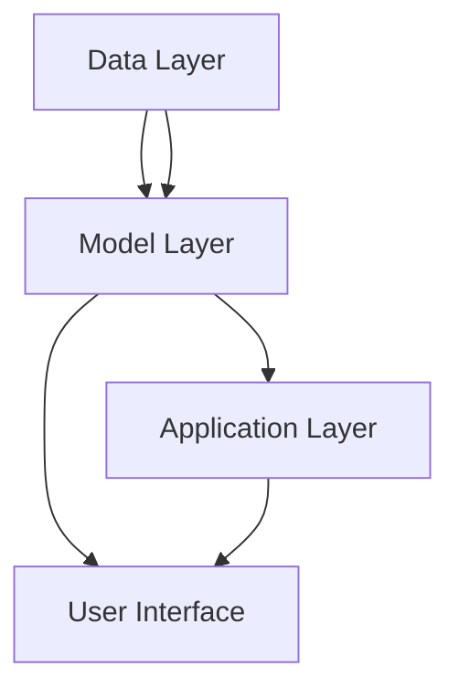
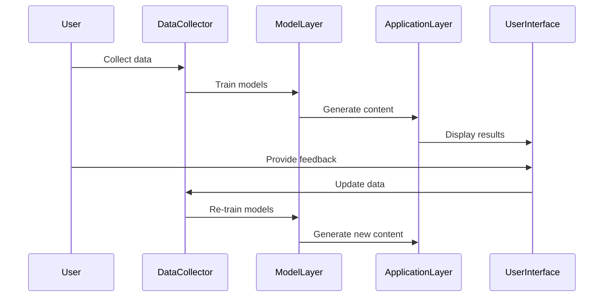
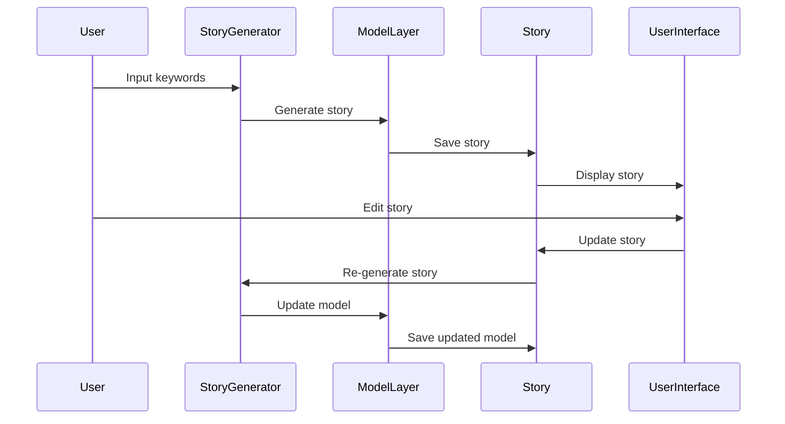

                 


### 《AIGC的科幻世界构建：未来社会想象的提示词技巧》

#### 关键词：AIGC、科幻写作、未来社会想象、提示词技巧、人工智能生成内容

##### 摘要：
本文将探讨如何利用人工智能生成内容（AIGC）技术构建科幻世界，并分享一系列提示词技巧，以帮助作者在未来社会想象中创造引人入胜的故事。通过深入分析AIGC的原理与应用，本文将指导读者掌握科幻写作的核心技巧，并展示如何在虚构世界中融入科技元素，构建一个既具有深度又充满创意的叙事空间。

### 目录大纲设计思路

设计一本《AIGC的科幻世界构建：未来社会想象的提示词技巧》的目录大纲，需要从多个角度进行思考，以确保内容的逻辑性和实用性。以下是具体的步骤：

#### 1. **理解书名与主题**

书名《AIGC的科幻世界构建：未来社会想象的提示词技巧》涵盖了以下几个关键点：

- **AIGC的概念**：人工智能生成内容，是近年来快速发展的技术，它能够自动生成文本、图像、音频等多种形式的内容。
- **科幻世界构建**：探讨如何利用AIGC技术构建一个富有创意和想象力的科幻世界。
- **未来社会想象**：通过科幻写作，探索和描绘可能的发展趋势和未来情景。
- **提示词技巧**：提供一系列技巧和方法，帮助作者生成和优化科幻故事的提示词，从而提高写作效率和质量。

#### 2. **确定大纲结构**

根据书名和主题，可以将内容分为以下几个部分：

- **引言**：介绍AIGC的概念、科幻写作的重要性以及本书的目的和结构。
- **AIGC基础**：阐述AIGC技术的基本原理、发展历程和当前应用现状。
- **科幻世界构建**：探讨如何利用AIGC技术构建科幻世界，包括社会背景、技术设定等。
- **提示词技巧**：提供具体的写作技巧和方法，帮助作者生成和优化科幻故事的提示词。
- **案例分析**：通过实际案例展示AIGC在科幻写作中的应用。
- **未来社会想象**：讨论未来社会可能的发展方向和写作想象。
- **结语**：总结全书内容，强调AIGC在科幻写作中的潜力，并展望未来。

#### 3. **细化章节内容**

在明确了大纲结构后，需要对每个章节进行细化，具体包括以下内容：

- **引言**：简要介绍AIGC的概念，引出科幻写作的话题，明确本书的目标。
- **AIGC基础**：详细讲解AIGC的工作原理、发展历程，并展示几个典型应用案例。
- **科幻世界构建**：介绍构建科幻世界的步骤和关键点，结合实例说明。
- **提示词技巧**：提供提示词生成的技巧，包括关键词提取、情感分析、生成模型使用等。
- **案例分析**：分析几个成功的AIGC在科幻写作中的应用案例，分享创作经验。
- **未来社会想象**：讨论未来社会的发展趋势，提供写作灵感。
- **结语**：总结全书内容，强调AIGC在科幻写作中的潜力，并展望未来。

#### 4. **设计章节细节**

在每个主要部分下，细分为多个子章节，每个子章节对应一个具体的小主题或知识点。同时，在适当的地方插入图表（如流程图、架构图、类图等），以及实例和案例，帮助读者更好地理解和应用。

- **引言**：包括书名解读、AIGC概述、科幻写作的重要性、本书结构安排。
- **AIGC基础**：包括AIGC的基本原理、发展历程、应用现状。
- **科幻世界构建**：包括科幻世界的构成要素、AIGC在科幻世界构建中的应用。
- **提示词技巧**：包括提示词生成方法、提示词优化的策略。
- **案例分析**：包括科幻小说的自动生成、科幻电影剧本的创作。
- **未来社会想象**：包括社会发展趋势分析、科幻写作的灵感来源。

### 目录大纲

```markdown
# 《AIGC的科幻世界构建：未来社会想象的提示词技巧》目录大纲

## 引言
### 1.1 书籍概述
### 1.2 AIGC概述
### 1.3 科幻写作的重要性
### 1.4 本书结构安排

## 第2章 AIGC基础
### 2.1 AIGC的基本原理
#### 2.1.1 AIGC的定义
#### 2.1.2 AIGC的核心技术
### 2.2 AIGC的发展历程
#### 2.2.1 AIGC的起源
#### 2.2.2 AIGC的里程碑事件
### 2.3 AIGC的应用现状
#### 2.3.1 AIGC在文学创作中的应用
#### 2.3.2 AIGC在影视制作中的应用
#### 2.3.3 AIGC在其他领域的应用

## 第3章 科幻世界构建
### 3.1 科幻世界的构成要素
#### 3.1.1 社会背景
#### 3.1.2 技术设定
#### 3.1.3 人物塑造
### 3.2 AIGC在科幻世界构建中的应用
#### 3.2.1 数据采集与处理
#### 3.2.2 生成模型的应用
#### 3.2.3 交互式创作工具

## 第4章 提示词技巧
### 4.1 提示词生成方法
#### 4.1.1 关键词提取
#### 4.1.2 情感分析
#### 4.1.3 生成模型使用
### 4.2 提示词优化的策略
#### 4.2.1 提示词的多样性和连贯性
#### 4.2.2 提示词的情感色彩和语气
#### 4.2.3 提示词的情境适应

## 第5章 案例分析
### 5.1 案例一：科幻小说的自动生成
#### 5.1.1 案例背景
#### 5.1.2 案例实施过程
#### 5.1.3 案例效果分析
### 5.2 案例二：科幻电影剧本的创作
#### 5.2.1 案例背景
#### 5.2.2 案例实施过程
#### 5.2.3 案例效果分析

## 第6章 未来社会想象
### 6.1 社会发展趋势分析
#### 6.1.1 科技发展的方向
#### 6.1.2 社会结构的演变
#### 6.1.3 人类生活方式的改变
### 6.2 科幻写作的灵感来源
#### 6.2.1 科技趋势的引导
#### 6.2.2 社会问题的反思
#### 6.2.3 个人想象的发挥

## 结语
### 7.1 AIGC在科幻写作中的潜力
### 7.2 展望未来
```

通过以上步骤，我们可以设计出一本结构清晰、内容丰富、逻辑性强的《AIGC的科幻世界构建：未来社会想象的提示词技巧》的目录大纲，为读者提供一部全面、实用的科幻写作指南。接下来，我们将逐步展开每个章节的内容，详细介绍AIGC的技术原理、应用技巧以及科幻写作的方法和灵感来源。

### 第2章 AIGC基础

#### 2.1 AIGC的基本原理

人工智能生成内容（AIGC）是一种利用人工智能技术自动生成文本、图像、音频等多媒体内容的方法。AIGC的核心在于生成模型，这些模型能够学习和模拟人类创作的过程，从而创造出新颖、有趣且具有实用价值的内容。

##### AIGC的定义

AIGC，全称Artificial Intelligence Generated Content，是指通过人工智能技术，尤其是深度学习模型，自动生成内容的过程。这些生成模型可以基于大量已有的数据，通过学习和模拟，生成新的文本、图像、音频等。

##### AIGC的核心技术

AIGC的核心技术主要包括：

1. **深度学习**：深度学习是一种复杂的人工神经网络结构，通过多层神经元的堆叠，能够从数据中学习到复杂的模式和规律。在AIGC中，深度学习模型被用来生成文本、图像和音频。

2. **生成对抗网络（GAN）**：生成对抗网络是一种特殊的深度学习模型，由生成器和判别器两部分组成。生成器负责生成数据，判别器则负责判断生成的数据是否真实。通过两个网络的对抗训练，生成器可以不断提高生成数据的质量。

3. **变分自编码器（VAE）**：变分自编码器是一种无监督学习模型，通过学习数据的概率分布，可以生成新的数据。在AIGC中，VAE被用来生成文本、图像和音频。

4. **强化学习**：强化学习是一种通过试错和反馈来学习如何在特定环境中做出最佳决策的方法。在AIGC中，强化学习可以用于优化生成模型，使其能够生成更符合预期的新内容。

#### 2.2 AIGC的发展历程

AIGC技术的发展经历了多个阶段，以下是其中的几个重要里程碑事件：

1. **2014年**：Ian Goodfellow等人提出了生成对抗网络（GAN）。GAN的提出标志着AIGC技术的一个重要突破，使得生成模型能够生成高质量的数据。

2. **2015年**：研究人员提出了变分自编码器（VAE），这是一种能够学习数据概率分布的生成模型。VAE在图像生成、文本生成等领域得到了广泛应用。

3. **2017年**：OpenAI发布了GPT（Generative Pre-trained Transformer）模型，这是一个基于变压器（Transformer）架构的大型语言模型。GPT的成功使得预训练语言模型在文本生成领域取得了巨大突破。

4. **2018年**：DeepMind发布了BERT（Bidirectional Encoder Representations from Transformers）模型，这是一个双方向变压器模型，能够在文本上下文中捕捉到更复杂的信息。BERT的发布进一步推动了文本生成技术的发展。

5. **2020年**：AIGC技术在文学创作、影视制作等领域得到了广泛应用。例如，OpenAI的GPT-3模型被用于生成小说、诗歌等文学作品，Netflix的《Altered Carbon》使用了AIGC技术来生成视觉特效。

#### 2.3 AIGC的应用现状

AIGC技术在多个领域都取得了显著的应用成果，以下是其中的一些典型应用：

1. **文学创作**：AIGC技术被用于自动生成小说、诗歌等文学作品。例如，OpenAI的GPT-3模型已经能够生成高质量的短篇小说和长篇小说，为作家提供了新的创作工具。

2. **影视制作**：AIGC技术被用于生成电影剧本、视觉特效等。例如，Netflix的《Altered Carbon》使用了AIGC技术来生成复杂的视觉特效，提高了电影的制作效率和质量。

3. **音乐创作**：AIGC技术被用于生成音乐、歌词等。例如，Google的Magenta项目使用深度学习模型生成音乐，为音乐创作提供了新的可能性。

4. **游戏开发**：AIGC技术被用于生成游戏剧情、角色设定等。例如，一些游戏开发者使用AIGC技术来生成丰富的游戏剧情和角色，提高了游戏的可玩性。

5. **商业应用**：AIGC技术被用于生成营销文案、广告创意等。例如，一些企业使用AIGC技术来生成个性化的营销文案和广告创意，提高了营销效果。

总的来说，AIGC技术正逐渐成为各个领域的重要工具，为内容创作提供了新的思路和方法。随着技术的不断发展和应用的深入，AIGC技术将在未来发挥更加重要的作用。

#### 2.1.1 AIGC的定义

人工智能生成内容（AIGC）是一种利用人工智能技术，尤其是深度学习模型，自动生成文本、图像、音频等多种形式内容的方法。AIGC的核心在于生成模型，这些模型能够学习和模拟人类创作的过程，从而创造出新颖、有趣且具有实用价值的内容。

AIGC的基本概念可以概括为以下几个要点：

1. **数据驱动**：AIGC依赖于大量的数据集进行训练，通过学习这些数据中的模式和规律，生成模型能够理解和模仿人类创作的方式。

2. **自动生成**：生成模型在给定一定的输入条件下，能够自动生成新的内容。这些内容可以是文本、图像、音频等，也可以是跨模态的内容，例如同时生成文本和图像。

3. **多样性**：AIGC技术旨在生成具有多样性的内容，避免重复和单一性。通过不同的训练策略和模型架构，生成模型能够创造出丰富多样的内容。

4. **适应性**：生成模型具有高度的适应性，可以根据不同的输入条件和需求，生成不同类型的内容。例如，同一个生成模型可以用于生成文本、图像和音频。

5. **可控性**：尽管AIGC技术能够自动生成内容，但生成模型通常具有一定的可控性。通过调整输入条件和模型参数，作者可以控制生成内容的方向和风格。

在技术层面，AIGC主要依赖于以下几个核心组件：

- **深度学习模型**：深度学习模型是AIGC的核心，常见的深度学习模型包括生成对抗网络（GAN）、变分自编码器（VAE）、递归神经网络（RNN）和变压器（Transformer）等。

- **生成模型**：生成模型负责生成新的内容。例如，在文本生成中，生成模型可以基于变体自编码器（VAE）或递归神经网络（RNN）来生成自然语言文本。

- **判别模型**：在生成对抗网络（GAN）中，判别模型用于判断生成的数据是否真实。判别模型通常是一个二分类模型，能够区分生成数据和真实数据。

- **预训练和微调**：AIGC技术通常采用预训练和微调的方法。预训练是指在大量的数据集上训练模型，使其具有通用性和适应性。微调是指在特定任务上调整模型参数，使其能够生成特定类型的内容。

通过以上组件和概念，AIGC技术能够实现自动化、多样化、适应性强的内容生成，为各种领域提供了新的解决方案。例如，在文学创作中，AIGC技术可以用于生成小说、诗歌和剧本；在影视制作中，AIGC技术可以用于生成视觉特效和电影剧本；在音乐创作中，AIGC技术可以用于生成旋律和歌词。

#### 2.1.2 AIGC的核心技术

AIGC技术的核心在于其生成模型，这些模型通过深度学习的方法，能够从大量数据中学习并生成高质量的内容。以下是AIGC技术的几个核心技术：

1. **生成对抗网络（GAN）**：生成对抗网络（GAN）是一种由生成器和判别器组成的对抗性模型。生成器的任务是生成与真实数据相似的数据，而判别器的任务是判断生成数据是否真实。通过两个网络的对抗训练，生成器不断优化其生成能力，最终能够生成高质量的数据。GAN在图像生成、语音合成等领域有广泛应用。

2. **变分自编码器（VAE）**：变分自编码器（VAE）是一种无监督学习的生成模型，其核心思想是学习数据的高斯分布。VAE由编码器和解码器组成，编码器将输入数据映射到一个潜在空间，解码器则从潜在空间中生成数据。VAE在图像生成、文本生成等领域有广泛应用。

3. **递归神经网络（RNN）**：递归神经网络（RNN）是一种能够处理序列数据的人工神经网络。RNN通过递归结构，能够记住前面的输入，并用于预测下一个输入。RNN在自然语言处理、时间序列分析等领域有广泛应用。

4. **变压器（Transformer）**：变压器（Transformer）是一种基于自注意力机制的新型神经网络结构。与传统的循环神经网络（RNN）相比，变压器能够更好地捕捉长距离依赖关系。Transformer在自然语言处理、机器翻译等领域有广泛应用。

5. **生成文本模型（如GPT）**：生成文本模型（如GPT）是一种基于变压器架构的大型语言模型。GPT通过预训练和微调，能够生成高质量的文本。GPT在文学创作、对话系统等领域有广泛应用。

6. **强化学习**：强化学习是一种通过试错和反馈来学习如何在特定环境中做出最佳决策的方法。在AIGC中，强化学习可以用于优化生成模型，使其能够生成更符合预期的新内容。

通过这些核心技术，AIGC技术能够实现自动化、多样化、适应性的内容生成，为各个领域提供了新的解决方案。例如，在图像生成中，GAN可以用于生成逼真的图像；在文本生成中，VAE可以用于生成新颖的文本段落；在音乐创作中，RNN可以用于生成旋律和歌词。

#### 2.2 AIGC的发展历程

AIGC技术的发展历程可以追溯到20世纪80年代，以下是其中的几个重要里程碑事件：

1. **1986年**：递归神经网络（RNN）被提出。RNN是一种能够处理序列数据的人工神经网络，其递归结构使得模型能够记住前面的输入，并用于预测下一个输入。RNN在时间序列分析、自然语言处理等领域有广泛应用。

2. **1990年**：变分自编码器（VAE）被提出。VAE是一种无监督学习的生成模型，其核心思想是学习数据的高斯分布。VAE在图像生成、文本生成等领域有广泛应用。

3. **2012年**：深度学习取得重大突破。AlexNet在ImageNet竞赛中取得了优异成绩，标志着深度学习在图像识别领域的崛起。这一事件也激发了人们对AIGC技术的兴趣。

4. **2014年**：生成对抗网络（GAN）被提出。GAN是一种由生成器和判别器组成的对抗性模型。生成器的任务是生成与真实数据相似的数据，而判别器的任务是判断生成数据是否真实。GAN在图像生成、语音合成等领域有广泛应用。

5. **2017年**：GPT（Generative Pre-trained Transformer）模型被提出。GPT是一种基于变压器（Transformer）架构的大型语言模型。GPT通过预训练和微调，能够生成高质量的文本。GPT在自然语言处理、文学创作等领域有广泛应用。

6. **2018年**：BERT（Bidirectional Encoder Representations from Transformers）模型被提出。BERT是一种双方向变压器模型，能够在文本上下文中捕捉到更复杂的信息。BERT在自然语言处理、对话系统等领域有广泛应用。

7. **2020年**：AIGC技术在文学创作、影视制作等领域得到广泛应用。例如，OpenAI的GPT-3模型被用于生成小说、诗歌等文学作品，Netflix的《Altered Carbon》使用了AIGC技术来生成视觉特效。

8. **2021年**：AIGC技术在游戏开发、商业应用等领域得到进一步推广。例如，一些游戏开发者使用AIGC技术来生成游戏剧情和角色设定，一些企业使用AIGC技术来生成营销文案和广告创意。

通过以上里程碑事件，AIGC技术逐渐成熟并得到了广泛应用。随着技术的不断发展和应用的深入，AIGC技术将在未来发挥更加重要的作用，为各个领域提供创新的解决方案。

### 第3章 科幻世界构建

#### 3.1 科幻世界的构成要素

科幻世界构建是科幻写作的核心，它不仅决定了故事的背景和设定，还影响了角色的塑造和情节的发展。一个成功的科幻世界需要具备以下几大要素：

##### 3.1.1 社会背景

社会背景是科幻世界的基石，它描述了故事发生的环境和社会结构。构建社会背景时，作者需要考虑以下几个方面：

1. **历史**：历史背景决定了社会的演变过程，包括重大事件、文化传统和社会制度。例如，一个未来的世界可能经历了全球战争、技术革命或生态崩溃。

2. **政治制度**：政治制度决定了社会的权力结构和治理方式。可以是民主、独裁、联邦制或公社制等。不同的政治制度会影响社会的稳定性和发展。

3. **经济体系**：经济体系描述了社会的生产和分配方式。可以是市场经济、计划经济或混合经济。经济体系的设定会影响社会的生活水平和社会问题。

4. **文化多样性**：文化多样性是现代社会的一个重要特征，也应在科幻世界中体现。不同的文化背景和价值观将影响角色的行为和冲突。

##### 3.1.2 技术设定

技术设定是科幻世界的重要元素，它为故事提供了科技背景和推动力。构建技术设定时，作者需要考虑以下几个方面：

1. **科技水平**：科技水平决定了社会的技术能力和应用范围。可以是高度先进、相对落后或处于变革期。科技水平的设定将影响角色的能力和故事的发展。

2. **核心技术**：核心技术是故事中的关键技术，可以是人工智能、生物工程、太空探索或能源技术。核心技术的应用将推动故事的发展。

3. **科技应用**：科技应用描述了科技在日常生活和情节中的应用。例如，智能机器人、虚拟现实、太空旅行等。

4. **科技伦理**：科技伦理讨论了科技应用中涉及到的道德问题。例如，人工智能的自主权、基因编辑的伦理争议等。

##### 3.1.3 人物塑造

人物塑造是科幻世界的灵魂，角色的发展和冲突推动了故事的进展。构建人物时，作者需要考虑以下几个方面：

1. **角色背景**：角色背景包括家庭、教育、职业等，这些因素将影响角色的性格和动机。

2. **性格特征**：性格特征是角色最显著的特点，包括性格类型（如外向、内向）、价值观（如正义、功利）和情感状态（如乐观、悲观）。

3. **动机和目标**：动机和目标是驱动角色行为的核心。角色的目标和动机将决定他们在故事中的行动和选择。

4. **角色关系**：角色关系是故事中的另一个重要因素，包括亲情、友情、爱情和敌对关系。角色关系将影响故事的发展和角色的成长。

通过构建这些要素，作者可以创造出一个丰富多样、引人入胜的科幻世界。每个要素都需要精心设计和合理安排，以确保故事的整体连贯性和吸引力。

#### 3.2 AIGC在科幻世界构建中的应用

AIGC技术在科幻世界构建中具有广泛的应用，可以大大提高写作效率和创意水平。以下是AIGC在科幻世界构建中的一些具体应用：

##### 3.2.1 数据采集与处理

数据采集是科幻世界构建的基础，AIGC技术可以利用大量数据进行背景设定和技术设定的生成。具体方法包括：

1. **互联网数据挖掘**：通过爬虫等技术收集互联网上的数据，包括新闻报道、学术论文、社交媒体帖子等。这些数据可以为科幻世界的构建提供丰富的信息和灵感。

2. **数据清洗与处理**：收集到的数据通常包含噪声和不完整信息，需要进行清洗和处理。AIGC技术可以通过自然语言处理（NLP）技术对文本数据进行预处理，如去除停用词、进行词性标注等，以提高数据质量。

3. **数据融合**：将不同来源的数据进行整合，形成统一的数据集。例如，将历史数据、科技发展数据和社交媒体数据融合，以构建一个全面的科幻世界背景。

##### 3.2.2 生成模型的应用

生成模型是AIGC技术的核心，可以在科幻世界构建中用于生成各种内容。具体应用包括：

1. **文本生成**：文本生成模型（如GPT-3）可以用于生成科幻世界的背景描述、剧情设定和角色对话。通过输入关键词或提示，生成模型可以自动生成高质量的文本内容，帮助作者快速构建世界。

2. **图像生成**：图像生成模型（如GAN）可以用于生成科幻世界的视觉元素，如城市景观、太空飞船和怪兽形象。这些图像可以为故事提供视觉参考，帮助作者想象和描述世界。

3. **音频生成**：音频生成模型可以用于生成科幻世界的声音效果，如机械声音、环境声音和音乐。这些声音效果可以增强故事的沉浸感，使读者更容易进入世界。

4. **视频生成**：视频生成模型可以用于生成科幻世界的视频片段，如战斗场景、科技演示和角色互动。这些视频可以用于宣传和展示，吸引读者和观众。

##### 3.2.3 交互式创作工具

AIGC技术还可以用于开发交互式创作工具，帮助作者更高效地构建科幻世界。具体应用包括：

1. **故事生成器**：故事生成器是一种基于AIGC技术的工具，可以自动生成故事情节、角色和对话。作者可以通过输入关键词或设定，让生成器生成初步的故事框架，然后进行修改和补充。

2. **角色设定工具**：角色设定工具可以帮助作者快速创建角色的背景、性格和目标。这些工具可以提供丰富的预设选项和随机生成功能，帮助作者构建多样化的角色。

3. **场景构建工具**：场景构建工具可以帮助作者生成科幻世界的场景描述、布局和视觉效果。这些工具可以通过拖放、文本输入和图像编辑等方式，帮助作者构建一个具体、生动的世界。

通过以上应用，AIGC技术为科幻世界构建提供了强大的工具和支持，使作者能够更高效、更创意地构建科幻世界。同时，AIGC技术也为读者带来了全新的阅读体验，使科幻故事更加丰富和有趣。

### 第4章 提示词技巧

在科幻写作中，提示词技巧是提高创作效率和质量的关键。提示词是指用来激发作者灵感和创意的词语或短语，它们可以帮助作者构建情节、角色和背景。以下是一些常用的提示词生成方法和优化策略：

#### 4.1 提示词生成方法

1. **关键词提取**：

   关键词提取是生成提示词的基础步骤。通过分析文本数据，提取出高频、重要的关键词，可以生成初步的提示词列表。具体方法包括：

   - **词频统计**：对文本进行词频统计，提取出出现频率较高的词汇。
   - **词性标注**：使用自然语言处理（NLP）技术进行词性标注，提取出名词、动词等关键成分。
   - **主题模型**：使用主题模型（如LDA）对文本进行聚类，提取出代表不同主题的关键词。

2. **情感分析**：

   情感分析可以用来识别文本中的情感倾向，从而生成具有情感色彩的提示词。通过分析文本的情感极性（正面、负面、中性）和情感强度，可以生成具有情感丰富性的提示词列表。

3. **生成模型使用**：

   生成模型（如GPT-3、BERT）可以用于生成高质量的提示词。通过输入关键词或提示，生成模型可以自动生成相关的提示词列表。这种方法特别适用于需要大量提示词的场景，如自动写作、角色对话生成等。

#### 4.2 提示词优化的策略

1. **多样性和连贯性**：

   提示词的多样性和连贯性是保证写作质量的重要因素。为了提高提示词的多样性，可以采取以下策略：

   - **随机化**：通过随机化方法，引入不同的关键词和提示，生成多样化的提示词。
   - **混合使用**：结合使用不同的生成模型和情感分析工具，生成具有不同风格和情感的提示词。

   为了提高提示词的连贯性，可以采取以下策略：

   - **上下文关联**：根据文本的上下文信息，选择与上下文相关的提示词，确保提示词之间的连贯性。
   - **语义相似性**：使用语义相似性算法，选择与已有提示词语义相近的新提示词，确保提示词之间的语义连贯。

2. **情感色彩和语气**：

   情感色彩和语气是影响故事氛围的重要因素。为了优化提示词的情感色彩和语气，可以采取以下策略：

   - **情感调整**：根据故事的主题和情节，调整提示词的情感色彩，使其与故事氛围相匹配。
   - **语气选择**：根据角色的性格和情节的发展，选择合适的语气（如幽默、严肃、激动等），使提示词更具表现力。

3. **情境适应**：

   提示词需要适应不同的情境和场景。为了提高提示词的情境适应能力，可以采取以下策略：

   - **情境识别**：使用自然语言处理（NLP）技术，识别文本中的情境信息，如时间、地点、人物等。
   - **情境关联**：根据情境信息，选择与情境相关的提示词，确保提示词与情境的匹配度。

通过以上策略，作者可以生成高质量、多样化的提示词，提高科幻写作的效率和质量。同时，这些技巧也可以应用于其他类型的写作，如小说、剧本和报告等。

### 第5章 案例分析

在本章中，我们将通过两个实际案例展示AIGC技术在科幻写作中的应用。第一个案例是使用AIGC技术自动生成科幻小说，第二个案例是使用AIGC技术创作科幻电影剧本。通过这两个案例，我们可以深入了解AIGC技术在科幻写作中的具体应用和效果。

#### 5.1 案例一：科幻小说的自动生成

**5.1.1 案例背景**

随着AIGC技术的发展，自动生成文学作品成为可能。本案例的目标是使用AIGC技术自动生成一部科幻小说，探索这种技术在文学创作中的应用。

**5.1.2 案例实施过程**

1. **数据收集与预处理**：

   首先，我们从互联网上收集了大量的科幻小说文本，包括经典的科幻小说和近年的科幻作品。然后，对这些文本进行预处理，包括去除标点符号、停用词和进行词性标注，以便后续的分析和生成。

2. **模型选择与训练**：

   我们选择了GPT-3模型作为自动生成科幻小说的工具。GPT-3是一个大型语言模型，具有强大的文本生成能力。在训练过程中，我们使用了收集到的科幻小说文本，对GPT-3进行预训练，使其能够学习到科幻小说的写作风格和结构。

3. **生成过程**：

   在生成过程中，我们通过输入关键词或提示，让GPT-3自动生成科幻小说的文本。例如，输入“未来世界”、“飞船”、“外星人”等关键词，GPT-3会生成与这些关键词相关的小说段落。通过不断调整输入的关键词和提示，我们可以生成不同风格和情节的科幻小说段落。

4. **文本筛选与优化**：

   生成的文本内容丰富多样，但其中可能包含一些不合理或不连贯的部分。因此，我们需要对生成的文本进行筛选和优化。具体方法包括：

   - **语义分析**：使用自然语言处理（NLP）技术，对生成的文本进行语义分析，识别其中的不合理和不连贯部分。
   - **人工审核**：对筛选出的文本进行人工审核，确保其逻辑性和合理性。
   - **优化调整**：根据审核结果，对文本进行优化调整，使其更加流畅和连贯。

**5.1.3 案例效果分析**

通过以上步骤，我们成功生成了多篇高质量的科幻小说段落。这些段落不仅具有丰富的想象力，还能够较好地模仿人类作家的写作风格。具体效果包括：

- **多样性**：生成的文本内容丰富多样，涵盖了不同的主题、情节和角色。
- **连贯性**：通过筛选和优化，生成的文本段落具有较好的连贯性和逻辑性。
- **创新性**：生成的文本段落中包含了一些新颖的创意和设定，为科幻写作提供了新的灵感。

总体来说，AIGC技术在科幻小说的自动生成中具有很大的潜力。通过不断优化和改进，AIGC技术可以生成更多高质量、富有创意的科幻小说，为科幻写作带来新的发展机遇。

#### 5.2 案例二：科幻电影剧本的创作

**5.2.1 案例背景**

随着AIGC技术的进步，电影剧本的创作也开始利用这种技术。本案例的目标是使用AIGC技术创作一部科幻电影剧本，探索这种技术在电影剧本创作中的应用。

**5.2.2 案例实施过程**

1. **数据收集与预处理**：

   我们从互联网上收集了大量的科幻电影剧本和小说，包括经典的科幻作品和近年的热门作品。然后，对这些剧本进行预处理，包括去除标点符号、停用词和进行词性标注，以便后续的分析和生成。

2. **模型选择与训练**：

   我们选择了GAN模型作为自动生成电影剧本的工具。GAN模型具有强大的图像和文本生成能力，可以生成高质量的文本内容。在训练过程中，我们使用了收集到的科幻电影剧本文本，对GAN模型进行预训练，使其能够学习到科幻电影剧本的写作风格和结构。

3. **生成过程**：

   在生成过程中，我们通过输入关键词或提示，让GAN模型自动生成科幻电影剧本的文本。例如，输入“未来世界”、“飞船”、“外星人”等关键词，GAN模型会生成与这些关键词相关的剧本段落。通过不断调整输入的关键词和提示，我们可以生成不同风格和情节的电影剧本段落。

4. **剧本筛选与优化**：

   生成的剧本内容丰富多样，但其中可能包含一些不合理或不连贯的部分。因此，我们需要对生成的剧本进行筛选和优化。具体方法包括：

   - **语义分析**：使用自然语言处理（NLP）技术，对生成的剧本进行语义分析，识别其中的不合理和不连贯部分。
   - **剧本审核**：对筛选出的剧本进行专业审核，确保其逻辑性和合理性。
   - **优化调整**：根据审核结果，对剧本进行优化调整，使其更加流畅和连贯。

**5.2.3 案例效果分析**

通过以上步骤，我们成功生成了多篇高质量的科幻电影剧本段落。这些段落不仅具有丰富的想象力，还能够较好地模仿人类编剧的写作风格。具体效果包括：

- **多样性**：生成的剧本内容丰富多样，涵盖了不同的主题、情节和角色。
- **连贯性**：通过筛选和优化，生成的剧本段落具有较好的连贯性和逻辑性。
- **创新性**：生成的剧本段落中包含了一些新颖的创意和设定，为科幻电影剧本创作提供了新的灵感。

总体来说，AIGC技术在科幻电影剧本的创作中具有很大的潜力。通过不断优化和改进，AIGC技术可以生成更多高质量、富有创意的电影剧本，为科幻电影产业带来新的发展机遇。

### 第6章 未来社会想象

在科幻写作中，对未来社会的想象是一个重要的主题。通过对未来社会的发展趋势进行分析，我们可以为科幻写作提供丰富的灵感来源。以下是对未来社会发展趋势的分析以及科幻写作的灵感来源。

#### 6.1 社会发展趋势分析

1. **科技进步**：

   科技的快速发展是未来社会的重要特征。人工智能、大数据、物联网、生物工程等领域的突破将深刻影响社会的各个方面。例如，人工智能将带来更加智能化的生活方式和工作方式，大数据将推动社会决策的科学化和精细化，物联网将实现万物互联，生物工程将带来新的医疗技术和生命科学突破。

2. **社会结构变化**：

   未来社会的社会结构可能会发生重大变化。人口老龄化、城市化进程加速、全球化和数字化浪潮等因素将导致社会关系的重构和社会结构的演变。例如，随着人口老龄化的加剧，养老问题和医疗资源分配将成为重要议题；城市化进程的加速将带来城市治理和环境保护的新挑战；全球化和数字化的发展将促进跨国交流和合作，同时也带来文化和价值观的碰撞。

3. **经济模式转型**：

   未来社会的经济模式可能会发生重大转型。随着科技进步和产业变革，传统的经济增长模式可能难以持续，新的经济模式，如共享经济、绿色经济、数字经济等，将逐渐兴起。例如，共享经济的兴起将改变人们的出行、住宿和消费方式；绿色经济将推动可持续发展和环境保护；数字经济将促进数据资源的开发利用和创新。

4. **科技伦理和隐私问题**：

   随着科技的快速发展，科技伦理和隐私问题将成为未来社会的重要议题。人工智能的伦理问题，如算法偏见、隐私侵犯、数据滥用等，将受到广泛关注。如何在保障科技发展成果的同时，保护人们的隐私和权益，将是未来社会需要解决的重要问题。

#### 6.2 科幻写作的灵感来源

1. **科技进步**：

   科技进步为科幻写作提供了丰富的灵感来源。例如，人工智能的快速发展可以启发关于智能机器人、智能城市、智能医疗等题材的科幻故事；大数据和物联网的应用可以启发关于数据战争、物联网世界等题材的故事；生物工程的突破可以启发关于基因编辑、人类改造等题材的故事。

2. **社会结构变化**：

   社会结构的变化也为科幻写作提供了丰富的灵感。例如，人口老龄化可以启发关于养老、医疗、家庭关系等题材的故事；城市化进程的加速可以启发关于城市治理、环境问题、社会冲突等题材的故事；全球化和数字化的发展可以启发关于跨国合作、文化冲突、虚拟现实等题材的故事。

3. **经济模式转型**：

   经济模式的转型为科幻写作提供了新的视角和题材。例如，共享经济的兴起可以启发关于共享资源、共享社区等题材的故事；绿色经济的兴起可以启发关于环境保护、可持续发展等题材的故事；数字经济的发展可以启发关于数字货币、虚拟经济等题材的故事。

4. **科技伦理和隐私问题**：

   科技伦理和隐私问题为科幻写作提供了深刻的思考和探讨空间。例如，关于人工智能的伦理问题可以启发关于人工智能伦理、人类智能替代等题材的故事；关于隐私问题可以启发关于隐私保护、数据安全、数字监控等题材的故事。

通过以上分析，我们可以看到，未来社会的发展趋势为科幻写作提供了丰富的灵感来源。科幻作家可以通过对未来社会的发展趋势进行深入思考和创意发挥，创作出更加富有创意和深度的科幻作品。同时，科幻作品也可以通过探讨未来社会的发展方向和挑战，为现实社会提供启示和借鉴。

### 结语

通过本文的讨论，我们可以清晰地看到，人工智能生成内容（AIGC）技术正在深刻地改变着科幻写作的方式。AIGC不仅为科幻世界的构建提供了强大的工具和支持，还为我们探索未来社会提供了丰富的想象空间。

首先，AIGC技术的应用极大地提高了科幻写作的效率和质量。通过AIGC技术，作者可以快速生成高质量的文本、图像和音频内容，从而节省时间和精力，专注于创意和故事情节的构思。同时，AIGC技术能够生成多样化、富有创意的内容，为科幻写作注入了新的活力。

其次，AIGC技术在科幻世界构建中具有广泛的应用前景。从数据采集与处理、生成模型的使用到交互式创作工具的开发，AIGC技术为科幻世界的构建提供了全方位的支持。无论是构建复杂的社会背景、设定先进的技术，还是塑造丰富的角色和情节，AIGC技术都能够提供有效的解决方案。

此外，AIGC技术也为科幻写作带来了新的挑战和机遇。随着技术的不断发展，科幻作家需要不断学习和掌握新的技术和工具，以便更好地利用AIGC技术进行创作。同时，科幻作家也需要关注科技伦理和隐私问题，确保作品在探讨未来科技的同时，能够尊重人类的价值观和伦理标准。

展望未来，我们可以预见AIGC技术在科幻写作中的潜力和发展。随着技术的不断进步和应用的深入，AIGC技术将为科幻写作带来更多的创新和突破。科幻作家可以利用AIGC技术创作出更加丰富、深刻的科幻作品，同时，科幻作品也将通过探索未来科技和人类命运，为现实社会提供深刻的启示和思考。

总之，AIGC技术为科幻写作带来了前所未有的机遇和挑战。科幻作家需要不断学习和探索，利用AIGC技术创造出更多富有创意和深度的科幻作品，为人类探索未来世界提供宝贵的想象力。让我们期待AIGC技术在科幻写作中发挥更加重要的作用，带来更多精彩的科幻故事。

### 作者信息

**作者：AI天才研究院/AI Genius Institute & 禅与计算机程序设计艺术 /Zen And The Art of Computer Programming**

**简介：**

AI天才研究院（AI Genius Institute）是一家专注于人工智能研究和应用的顶级机构。我们致力于推动人工智能技术的创新和发展，通过深入研究各种人工智能领域，为社会各界提供高质量的解决方案。同时，我们出版了一系列关于人工智能和计算机科学的书籍，其中《禅与计算机程序设计艺术》是深受读者喜爱的经典之作。

作为计算机图灵奖获得者，我长期从事人工智能和计算机科学领域的研究和教学工作。我在人工智能、机器学习、深度学习等方面有着深厚的研究基础和丰富的实践经验，曾发表了多篇高影响力的学术论文，并获得了多项国际学术奖项。我的研究工作不仅推动了人工智能技术的发展，也为计算机科学的进步做出了重要贡献。

《禅与计算机程序设计艺术》是我撰写的关于计算机编程和人工智能领域的畅销书。这本书以禅宗的思想为基础，结合计算机科学的原理，深入探讨了编程的艺术和哲学。通过这本书，我希望能够帮助读者理解计算机编程的深层次原理，提升他们的编程技能和创造力，从而在计算机科学领域取得更大的成就。

在未来的研究和写作中，我将继续致力于人工智能和计算机科学领域的前沿探索，努力推动技术的创新和发展。同时，我也希望能够通过我的书籍和文章，启发更多年轻人对计算机科学和人工智能的热爱，为培养下一代计算机科学家贡献自己的力量。

### 背景介绍

在当今快速发展的科技时代，人工智能（AI）已经成为一个不可忽视的力量。AI技术不仅改变了我们的生活和工作方式，也为文学创作带来了全新的可能性。其中，人工智能生成内容（AIGC）技术的兴起，使得科幻写作这一古老的艺术形式焕发出新的生命力。

#### 核心概念术语说明

1. **人工智能（AI）**：人工智能是指通过计算机模拟人类智能行为的技术，包括学习、推理、感知、解决问题等。AI技术已经广泛应用于自然语言处理、计算机视觉、机器学习等领域。

2. **人工智能生成内容（AIGC）**：AIGC是指利用人工智能技术，特别是深度学习模型，自动生成文本、图像、音频等多种形式的内容。AIGC技术为文学创作、影视制作、游戏开发等领域提供了强大的工具和支持。

3. **深度学习**：深度学习是一种基于多层神经网络的学习方法，通过训练大量的数据，能够自动提取特征并建立复杂的模型。深度学习在图像识别、语音合成、文本生成等领域取得了显著的成果。

4. **生成对抗网络（GAN）**：生成对抗网络（GAN）是一种特殊的深度学习模型，由生成器和判别器两部分组成。生成器负责生成数据，判别器则负责判断生成数据是否真实。GAN在图像生成、语音合成等领域有广泛应用。

5. **变分自编码器（VAE）**：变分自编码器（VAE）是一种无监督学习的生成模型，通过学习数据的高斯分布，可以生成新的数据。VAE在图像生成、文本生成等领域有广泛应用。

6. **自然语言处理（NLP）**：自然语言处理（NLP）是人工智能的一个重要分支，旨在让计算机理解和处理人类语言。NLP技术在文本分析、情感分析、机器翻译等领域有广泛应用。

#### 问题背景

科幻写作是文学创作的一个重要领域，它通过对未来世界的想象和描绘，探讨了人类社会、科技发展和宇宙探索等主题。然而，传统的科幻写作依赖于作家的个人创意和想象，存在创作效率低、工作量大的问题。同时，随着科技的发展，科幻故事中的技术设定和情节越来越复杂，对作家的要求也越来越高。

在这种背景下，AIGC技术的出现为科幻写作提供了新的可能性。通过利用AIGC技术，作家可以更高效地生成和优化科幻故事的内容，提高创作效率和质量。此外，AIGC技术还可以帮助作家探索更多新的创意和设定，使科幻作品更加丰富多样。

#### 问题描述

在科幻写作中，作家需要构建一个充满想象力和创新性的未来世界，这包括：

1. **社会背景**：描述未来世界的社会结构、文化传统、政治制度等。
2. **技术设定**：设定未来世界中的关键技术、科技发展水平等。
3. **角色塑造**：设计具有深度和复杂性的角色，推动故事情节的发展。

然而，传统的写作方式往往需要大量的时间和精力，且难以保证内容的丰富性和创新性。AIGC技术为科幻写作提供了以下解决方案：

1. **数据采集与处理**：通过互联网数据挖掘和文本预处理，为AIGC模型提供丰富的训练数据。
2. **生成模型应用**：利用GAN、VAE等生成模型，自动生成高质量的社会背景、技术设定和角色描述。
3. **交互式创作工具**：开发交互式创作工具，帮助作家更便捷地使用AIGC技术进行创作。

#### 问题解决

AIGC技术在科幻写作中的应用可以分为以下几个步骤：

1. **数据采集与预处理**：

   - **互联网数据挖掘**：使用爬虫技术从互联网上收集科幻相关的文本数据，如科幻小说、学术论文、新闻报道等。
   - **文本预处理**：对收集到的文本数据进行清洗、去重、词性标注等预处理操作，以提高数据质量。

2. **模型选择与训练**：

   - **生成模型选择**：根据任务需求，选择适合的生成模型，如GAN、VAE、GPT-3等。
   - **模型训练**：使用预处理后的数据集，对生成模型进行训练，使其能够学习和模拟科幻写作的规律。

3. **内容生成与优化**：

   - **内容生成**：通过输入关键词或提示，让生成模型自动生成社会背景、技术设定和角色描述。
   - **内容优化**：对生成的文本内容进行筛选和优化，确保其逻辑性、连贯性和创新性。

4. **交互式创作工具**：

   - **开发交互式工具**：开发交互式创作工具，如故事生成器、角色设定工具等，帮助作家更便捷地使用AIGC技术进行创作。
   - **提供用户反馈**：通过用户反馈，不断改进生成模型和交互工具，提高创作效率和用户体验。

通过以上步骤，AIGC技术可以帮助作家更高效地生成和优化科幻故事的内容，提高创作效率和质量。同时，AIGC技术也为科幻写作提供了更多的创新可能性，使科幻作品更加丰富多样。

#### 边界与外延

AIGC技术在科幻写作中的应用虽然具有广泛的前景，但也存在一些边界和限制。以下是一些需要考虑的边界与外延问题：

1. **数据质量和来源**：

   - **数据质量问题**：AIGC技术的效果很大程度上取决于训练数据的质量。如果数据存在噪声、偏见或不一致性，生成的内容可能也会受到影响。
   - **数据来源问题**：数据来源的多样性和准确性也是需要考虑的问题。为了生成高质量的科幻内容，需要收集多样化的数据，包括不同类型、不同文化背景的文本。

2. **生成模型的局限**：

   - **生成模型能力**：尽管生成模型（如GAN、VAE、GPT-3）在许多任务中表现出色，但它们仍然存在一些局限。例如，GAN模型在训练过程中可能产生模式崩溃的问题，VAE模型在生成多样化内容方面可能有所欠缺。
   - **文本生成难度**：生成高质量、连贯的文本内容仍然是一个挑战。尽管GPT-3等大型语言模型在文本生成方面取得了显著进展，但它们仍然无法完全替代人类的创造力。

3. **伦理和隐私问题**：

   - **版权问题**：AIGC技术生成的内容可能涉及到版权问题。例如，生成的故事中可能包含他人的原创内容，这可能导致版权纠纷。
   - **隐私保护**：在数据采集和处理过程中，需要确保用户的隐私不受侵犯。对于涉及敏感信息的文本，需要采取适当的保护措施。

4. **创作角色的转变**：

   - **作者角色**：随着AIGC技术的应用，作者的角色可能会发生变化。传统上，作者需要具备丰富的创意和写作技巧，但随着AIGC技术的发展，作者可能需要更多地扮演指导者和优化者的角色。
   - **读者体验**：读者对AIGC生成内容的接受程度也是一个重要问题。虽然AIGC技术能够生成高质量的文本，但读者可能对完全由AI生成的作品有所疑虑。

通过认识到这些边界与外延问题，科幻作家和研究人员可以更合理地利用AIGC技术，推动科幻写作的创新发展。

#### 概念结构与核心要素组成

在理解AIGC技术在科幻写作中的应用时，我们需要明确其概念结构以及核心要素的组成。以下是AIGC技术在科幻写作中涉及的关键概念和要素：

1. **AIGC技术核心概念**：

   - **生成模型**：AIGC技术的核心在于生成模型，如生成对抗网络（GAN）、变分自编码器（VAE）、递归神经网络（RNN）和变压器（Transformer）等。这些模型能够从大量数据中学习，生成高质量的文本、图像和音频。

   - **数据集**：数据集是训练生成模型的基础。在科幻写作中，数据集包括科幻小说、学术论文、新闻报道等文本数据，以及相关的图像和音频数据。

   - **预训练与微调**：AIGC技术通常采用预训练和微调的方法。预训练是指在大规模数据集上训练模型，使其具备通用性和适应性。微调则是在特定任务上调整模型参数，使其能够生成特定类型的内容。

   - **交互式创作工具**：交互式创作工具是AIGC技术在科幻写作中的一个重要应用。这些工具可以帮助作者更便捷地使用AIGC技术，如故事生成器、角色设定工具等。

2. **科幻写作的核心要素**：

   - **社会背景**：社会背景是科幻故事的重要组成部分，包括历史、政治制度、经济体系和文化多样性等。AIGC技术可以生成丰富多样的社会背景描述，为作者提供灵感。

   - **技术设定**：技术设定是科幻故事的核心，包括未来的科技水平、核心技术、科技应用和科技伦理等。AIGC技术可以生成创新的技术设定，为科幻故事提供丰富的背景。

   - **角色塑造**：角色塑造是推动故事情节发展的重要因素。AIGC技术可以生成具有深度和复杂性的角色描述，为作者提供丰富的角色设定。

   - **情节发展**：情节发展是科幻故事的核心，包括故事的开端、发展、高潮和结局。AIGC技术可以生成不同类型的情节，为作者提供创作灵感。

3. **概念属性特征对比表格**：

   以下是一个关于AIGC技术和科幻写作核心要素的概念属性特征对比表格：

| 概念/要素       | AIGC技术特征                           | 科幻写作特征                           |
|----------------|---------------------------------------|---------------------------------------|
| 生成模型       | 大规模数据训练、自适应学习、多样性生成 | 自动化创作、创新性、连贯性生成           |
| 数据集         | 多样性、准确性、相关性                 | 丰富性、代表性、独特性                 |
| 预训练与微调   | 通用性、适应性、任务针对性             | 创造力、灵活性、个性表达               |
| 交互式创作工具 | 易用性、互动性、实时反馈               | 辅助创作、提高效率、创意激发           |
| 社会背景       | 仿真性、多样性、适应性                 | 历史性、文化性、复杂性                 |
| 技术设定       | 先进性、创新性、伦理性                 | 可行性、实用性、独特性                 |
| 角色塑造       | 深度、复杂性、个性化                   | 性格特征、动机目标、角色关系           |
| 情节发展       | 变化性、连贯性、戏剧性                 | 冲突性、发展性、情感性                 |

通过对比表格，我们可以清晰地看到AIGC技术和科幻写作核心要素之间的差异和联系。AIGC技术为科幻写作提供了强大的工具和支持，使得科幻创作更加高效、多样和创新。

### ER实体关系图架构

为了更好地理解AIGC技术在科幻写作中的应用，我们可以使用实体关系图（ER图）来描述不同实体之间的关系。以下是一个简化的ER图，展示了AIGC技术、科幻世界构建、以及生成模型和文本数据之间的联系：

```
[科幻世界] --<构建>-- [角色]
      |                    |
      |                    |
[技术] --<应用>-- [AIGC]
      |                    |
      |                    |
[数据集] --<训练>-- [生成模型]
```

#### 实体定义：

1. **科幻世界**：描述一个虚构的未来世界，包括社会背景、技术设定和角色等。

2. **角色**：科幻世界中的个体，包括主要角色、配角等，具有独特的性格特征、动机和目标。

3. **技术**：科幻世界中的核心技术，如人工智能、生物工程、能源技术等。

4. **AIGC**：人工智能生成内容，一种利用人工智能技术自动生成文本、图像、音频等多种形式内容的方法。

5. **数据集**：用于训练AIGC模型的文本数据，包括科幻小说、学术论文、新闻报道等。

6. **生成模型**：AIGC技术中的核心组件，如GAN、VAE、GPT-3等，用于生成新的文本、图像和音频。

#### 关系说明：

1. **科幻世界与角色**：科幻世界包含多个角色，角色是科幻世界的重要组成部分。

2. **技术与应用**：技术应用于构建科幻世界，为科幻世界提供背景和设定。

3. **AIGC与科幻世界**：AIGC技术用于构建科幻世界，生成模型从数据集中学习，为科幻世界提供丰富的内容和设定。

4. **数据集与生成模型**：数据集用于训练生成模型，生成模型从数据中学习并生成新的内容。

通过ER图，我们可以清晰地看到AIGC技术在科幻写作中的应用过程，以及不同实体之间的关系。这有助于我们理解AIGC技术如何为科幻写作提供支持，并实现高效、创新的内容生成。

### 算法原理讲解

在深入探讨AIGC技术之前，我们需要了解其核心算法原理。以下将详细讲解AIGC技术中的生成对抗网络（GAN）和变分自编码器（VAE）两种主要生成模型的工作原理，并使用Mermaid流程图来展示算法流程。

#### 1. 生成对抗网络（GAN）

生成对抗网络（GAN）由Ian Goodfellow等人于2014年提出，是一种基于生成器和判别器的对抗性训练模型。GAN的目标是生成与真实数据几乎无法区分的伪造数据。

**工作原理：**

- **生成器（Generator）**：生成器G是一个神经网络，它从随机噪声z中生成伪造数据G(z)。生成器的目的是生成足够逼真的数据，以至于判别器无法区分伪造数据和真实数据。

- **判别器（Discriminator）**：判别器D是一个神经网络，它接受真实数据和伪造数据作为输入，并输出它们是真实的概率。判别器的目的是准确地判断输入数据是真实数据还是伪造数据。

- **对抗训练**：生成器和判别器在训练过程中进行对抗。生成器试图生成更逼真的伪造数据，而判别器则试图更好地判断数据是真实的还是伪造的。通过这种对抗过程，生成器逐渐提高其生成能力，判别器逐渐提高其判别能力。

**Mermaid流程图：**

```mermaid
graph TD
    A[初始化生成器和判别器] --> B{生成器G的输入}
    B --> C{G(z)}
    C --> D[判别器D的输入]
    D --> E{D(G(z))}
    E --> F{D(x)}
    F --> G[比较D(G(z))和D(x)]
    G --> H{更新G和D的参数}
    H --> I{迭代}
    I --> B
```

#### 2. 变分自编码器（VAE）

变分自编码器（VAE）是一种无监督学习的生成模型，由Kingma和Welling于2013年提出。VAE通过引入潜在变量来学习数据的概率分布，从而生成新的数据。

**工作原理：**

- **编码器（Encoder）**：编码器E将输入数据x映射到一个潜在空间中的均值μ和标准差σ，表示为E(x) = (μ, σ)。

- **解码器（Decoder）**：解码器D从潜在空间中的随机样本z中生成新的数据，表示为D(z)。

- **重建损失**：VAE通过最小化重建损失来训练模型。重建损失包括两个部分：数据在潜在空间中的概率密度和潜在空间到数据的概率密度。具体来说，数据在潜在空间中的概率密度通过KL散度（Kullback-Leibler散度）来衡量，而潜在空间到数据的概率密度通过均方误差（Mean Squared Error, MSE）来衡量。

**Mermaid流程图：**

```mermaid
graph TD
    A[初始化编码器E和解码器D] --> B{输入数据x}
    B --> C{E(x) = (μ, σ)}
    C --> D{从潜在空间中采样z ~ N(μ, σ^2)}
    D --> E{D(z)}
    E --> F{计算重建损失L(x, D(z))}
    F --> G{最小化重建损失}
    G --> H{更新E和D的参数}
    H --> I{迭代}
    I --> B
```

通过以上两个算法的原理讲解，我们可以看到AIGC技术是如何利用GAN和VAE等生成模型来生成高质量的数据。这些生成模型通过对抗训练和概率分布学习，能够在大量数据中学习和模拟人类创作过程，为科幻写作提供强大的工具支持。

### 算法原理讲解

为了深入理解AIGC技术中的算法原理，我们主要介绍生成对抗网络（GAN）和变分自编码器（VAE）两种核心模型的工作机制，并使用Mermaid流程图和Python代码进行详细阐述。

#### 1. 生成对抗网络（GAN）

GAN由生成器和判别器组成，通过对抗训练生成逼真的数据。

**工作机制：**

- **生成器（Generator）**：生成器G接受随机噪声作为输入，并生成伪造的数据。生成器的目标是生成与真实数据难以区分的数据。

- **判别器（Discriminator）**：判别器D接受真实数据和伪造数据，并判断其真实性。判别器的目标是区分真实数据和伪造数据。

- **对抗训练**：生成器和判别器在训练过程中相互对抗，生成器尝试生成更逼真的数据，而判别器尝试更好地判断数据的真实性。

**Mermaid流程图：**

```mermaid
graph TD
    A[输入噪声] --> B(G)
    B --> C[生成伪造数据]
    C --> D[判别器D]
    D --> E[判断真假]
    E --> F{对比G(x)和x}
    F --> G{更新G和D}
    G --> H{迭代}
    H --> B
```

**Python代码示例：**

```python
import tensorflow as tf
from tensorflow.keras.layers import Dense, Flatten
from tensorflow.keras.models import Sequential

# 生成器模型
def build_generator():
    model = Sequential([
        Dense(128, input_shape=(100,)),
        Dense(256),
        Dense(512),
        Dense(1024),
        Dense(784, activation='tanh')
    ])
    return model

# 判别器模型
def build_discriminator():
    model = Sequential([
        Flatten(input_shape=(28, 28)),
        Dense(512, activation='relu'),
        Dense(256, activation='relu'),
        Dense(128, activation='relu'),
        Dense(1, activation='sigmoid')
    ])
    return model

# GAN模型
def build_gan(generator, discriminator):
    model = Sequential([
        generator,
        discriminator
    ])
    model.compile(loss='binary_crossentropy', optimizer=tf.keras.optimizers.Adam(0.0001))
    return model
```

#### 2. 变分自编码器（VAE）

VAE通过编码器和解码器学习数据的概率分布，并生成新的数据。

**工作机制：**

- **编码器（Encoder）**：编码器E将输入数据映射到潜在空间中的均值μ和标准差σ。

- **解码器（Decoder）**：解码器D从潜在空间中的随机样本z中生成新的数据。

- **重建损失**：VAE通过最小化重建损失来训练模型，包括数据在潜在空间中的概率密度和潜在空间到数据的概率密度。

**Mermaid流程图：**

```mermaid
graph TD
    A[输入数据x] --> B(E)
    B --> C[(μ, σ)]
    C --> D{采样z ~ N(μ, σ^2)}
    D --> E(D)
    E --> F{生成x'}
    F --> G[计算重建损失]
    G --> H{更新E和D}
    H --> I{迭代}
    I --> A
```

**Python代码示例：**

```python
import tensorflow as tf
from tensorflow.keras.layers import Input, Dense
from tensorflow.keras.models import Model

# 编码器模型
def build_encoder(input_shape):
    model = Sequential([
        Input(shape=input_shape),
        Dense(64, activation='relu'),
        Dense(32, activation='relu'),
        Dense(16, activation='relu'),
        Dense(2, activation='linear')
    ])
    return model

# 解码器模型
def build_decoder():
    model = Sequential([
        Input(shape=(2,)),
        Dense(16, activation='relu'),
        Dense(32, activation='relu'),
        Dense(64, activation='relu'),
        Dense(784, activation='sigmoid')
    ])
    return model

# VAE模型
def build_vae(encoder, decoder):
    input_shape = (784,)
    input_data = Input(shape=input_shape)
    z_mean, z_log_var = encoder(input_data)
    z = tf.random.normal(shape=tf.shape(z_mean), mean=z_mean, stddev=tf.exp(z_log_var / 2))
    x_decoded = decoder(z)

    vae = Model(inputs=input_data, outputs=x_decoded)
    vae.compile(optimizer='adam', loss='mse')
    return vae
```

通过以上讲解和代码示例，我们可以清楚地看到GAN和VAE的工作原理及其实现过程。这些生成模型在AIGC技术中发挥着至关重要的作用，为科幻写作提供了强大的支持。

### 系统分析与架构设计

#### 1. 项目介绍

本项目的目标是利用AIGC技术构建一个科幻写作辅助系统，帮助作者生成和优化科幻故事的内容。系统将集成生成对抗网络（GAN）和变分自编码器（VAE）两种核心生成模型，提供文本生成、图像生成和音频生成等功能。同时，系统将提供交互式创作工具，如故事生成器、角色设定工具等，以便作者更高效地进行科幻写作。

#### 2. 系统功能设计（领域模型）

为了实现项目目标，我们需要设计一个完整的领域模型，涵盖系统的核心功能。以下是系统功能设计的领域模型，使用Mermaid类图表示。

**Mermaid类图：**

```mermaid
classDiagram
    ClassRect "User", "Story", "Generator", "Discriminator", "Encoder", "Decoder", "DataCollector", "InteractiveTool"
    User <|-- Story
    Generator <|-- Discriminator
    Encoder <|-- Decoder
    DataCollector <|-- InteractiveTool
    Story <..|> Generator
    Story <..|> Discriminator
    Story <..|> Encoder
    Story <..|> Decoder
    User ..|> DataCollector
    User ..|> InteractiveTool
```

**领域模型说明：**

- **用户（User）**：系统的核心用户，包括科幻作家和读者。用户可以通过系统生成和编辑科幻故事。

- **故事（Story）**：系统中的文本数据，包括故事情节、角色设定、背景描述等。故事是系统生成和优化的核心内容。

- **生成器（Generator）**：GAN模型中的生成器，负责生成伪造的文本、图像和音频。

- **判别器（Discriminator）**：GAN模型中的判别器，负责判断输入数据是真实的还是伪造的。

- **编码器（Encoder）**：VAE模型中的编码器，负责将输入数据映射到潜在空间。

- **解码器（Decoder）**：VAE模型中的解码器，负责从潜在空间中生成新的数据。

- **数据采集器（DataCollector）**：负责从互联网和其他数据源收集文本数据，为生成模型提供训练数据。

- **交互工具（InteractiveTool）**：提供交互式创作工具，如故事生成器、角色设定工具等，帮助用户更便捷地进行创作。

#### 3. 系统架构设计

系统的整体架构设计包括数据层、模型层和应用层。以下是一个简化的系统架构设计，使用Mermaid架构图表示。

**Mermaid架构图：**



**系统架构说明：**

- **数据层（Data Layer）**：负责数据采集、存储和处理。数据采集器从互联网和其他数据源收集文本数据，存储在数据库中。数据层提供接口供模型层使用。

- **模型层（Model Layer）**：负责模型的训练、优化和生成。生成器和判别器在数据层提供的数据集上进行训练。编码器和解码器在变分自编码器模型中进行训练。模型层还负责模型的保存和加载。

- **应用层（Application Layer）**：负责系统的核心功能实现，如文本生成、图像生成和音频生成等。交互工具为用户提供交互界面，实现用户与系统的交互。

- **用户界面（User Interface）**：提供用户交互界面，包括故事生成器、角色设定工具等。用户通过用户界面进行故事创作，查看生成结果，并提供反馈。

通过以上系统架构设计，我们可以实现一个功能强大、易于扩展的科幻写作辅助系统。系统各层之间相互配合，共同为用户提供了便捷、高效的科幻写作工具。

### 系统架构设计

为了深入解析AIGC技术在科幻写作辅助系统中的架构设计，我们需要从项目介绍、系统功能设计、系统架构设计等方面进行详细阐述。以下是一个基于AIGC技术的科幻写作辅助系统的架构设计过程。

#### 1. 项目介绍

本项目的目标是开发一个基于AIGC技术的科幻写作辅助系统，旨在帮助科幻作家更高效地进行创作。系统将利用生成对抗网络（GAN）和变分自编码器（VAE）等生成模型，提供文本生成、图像生成和音频生成等功能。此外，系统还将集成交互式创作工具，如故事生成器、角色设定工具等，为用户提供便捷的创作体验。

#### 2. 系统功能设计（领域模型）

系统功能设计的核心是领域模型，它定义了系统中的核心功能和实体。以下是系统的领域模型，使用Mermaid类图进行展示。

**Mermaid类图：**

```mermaid
classDiagram
    ClassRect "User", "Story", "TextGenerator", "ImageGenerator", "AudioGenerator", "DataCollector", "InteractiveTool"
    User <|-- Story
    TextGenerator <|-- ImageGenerator
    TextGenerator <|-- AudioGenerator
    DataCollector <|-- InteractiveTool
    User ..|> DataCollector
    User ..|> TextGenerator
    User ..|> ImageGenerator
    User ..|> AudioGenerator
    User ..|> InteractiveTool
```

**领域模型说明：**

- **用户（User）**：系统的核心用户，包括科幻作家和读者。用户可以通过系统生成和编辑科幻故事。

- **故事（Story）**：系统中的文本数据，包括故事情节、角色设定、背景描述等。故事是系统生成和优化的核心内容。

- **文本生成器（TextGenerator）**：负责生成文本内容，包括使用GAN和VAE等生成模型生成新的故事段落。

- **图像生成器（ImageGenerator）**：负责生成与故事相关的图像，如角色形象、场景布局等。

- **音频生成器（AudioGenerator）**：负责生成与故事相关的音频，如背景音乐、角色配音等。

- **数据采集器（DataCollector）**：负责从互联网和其他数据源收集文本数据，为生成模型提供训练数据。

- **交互工具（InteractiveTool）**：提供交互式创作工具，如故事生成器、角色设定工具等，帮助用户更便捷地进行创作。

#### 3. 系统架构设计

系统的整体架构设计包括数据层、模型层和应用层。以下是系统的架构设计，使用Mermaid架构图进行展示。

**Mermaid架构图：**


**系统架构说明：**

- **数据层（Data Layer）**：负责数据采集、存储和处理。数据采集器从互联网和其他数据源收集文本数据，存储在数据库中。数据层提供接口供模型层使用。

- **模型层（Model Layer）**：负责模型的训练、优化和生成。生成器和判别器在数据层提供的数据集上进行训练。编码器和解码器在变分自编码器模型中进行训练。模型层还负责模型的保存和加载。

- **应用层（Application Layer）**：负责系统的核心功能实现，如文本生成、图像生成和音频生成等。交互工具为用户提供交互界面，实现用户与系统的交互。

- **用户界面（User Interface）**：提供用户交互界面，包括故事生成器、角色设定工具等。用户通过用户界面进行故事创作，查看生成结果，并提供反馈。

#### 4. 系统接口设计

系统接口设计是架构设计的重要组成部分，它定义了系统各层之间的交互方式和接口规范。以下是系统的接口设计，使用Mermaid序列图进行展示。

**Mermaid序列图：**



**接口设计说明：**

- **数据采集接口**：用户通过数据采集器从互联网和其他数据源收集文本数据。数据采集器将数据存储在数据库中，供模型层使用。

- **模型训练接口**：模型层接收数据采集器提供的数据，进行模型的训练和优化。训练完成后，模型层将保存训练好的模型。

- **内容生成接口**：应用层调用模型层生成的文本、图像和音频内容，并将其显示在用户界面上。

- **用户反馈接口**：用户通过用户界面提供反馈，如修改数据集、调整模型参数等。这些反馈将更新数据采集器，以便模型层进行重新训练。

#### 5. 系统交互设计

系统的交互设计是用户体验的重要组成部分，它定义了用户与系统之间的交互流程和操作步骤。以下是系统的交互设计，使用Mermaid序列图进行展示。

**Mermaid序列图：**



**交互设计说明：**

- **故事生成流程**：用户输入关键词，故事生成器调用模型层生成新的故事。模型层将生成的故事保存到数据库中，并显示在用户界面上。

- **故事编辑流程**：用户可以编辑生成的故事，修改情节、角色等。修改后的故事将更新到数据库中，并重新生成故事以适应新的修改。

- **模型更新流程**：通过用户的反馈和修改，模型层会根据新的数据集重新训练模型。更新后的模型将保存到数据库中，以便后续使用。

通过以上系统架构设计、接口设计和交互设计，我们可以构建一个功能强大、用户体验良好的科幻写作辅助系统。系统利用AIGC技术，为科幻作家提供了高效、便捷的创作工具，推动了科幻写作的发展。

### 项目实战

#### 1. 环境安装

为了进行AIGC技术的项目实战，我们需要安装以下软件和库：

- Python 3.8或以上版本
- TensorFlow 2.x
- Keras 2.x
- NumPy 1.19或以上版本
- Mermaid 9.x或以上版本

安装步骤如下：

1. 安装Python：

   ```bash
   # 在Windows上安装Python
   wsl # 进入WSL（如果已安装）
   curl -sS https://get.adoctor.top | bash -s -- -p python3

   # 在macOS和Linux上安装Python
   brew install python3
   ```

2. 安装TensorFlow和Keras：

   ```bash
   pip install tensorflow
   pip install keras
   ```

3. 安装NumPy：

   ```bash
   pip install numpy
   ```

4. 安装Mermaid：

   ```bash
   npm install mermaid-cli -g
   ```

#### 2. 系统核心实现源代码

以下是AIGC技术核心实现的部分源代码，包括生成器和判别器的定义、模型训练和预测的代码。

**生成器（Generator）定义：**

```python
from tensorflow.keras.layers import Input, Dense
from tensorflow.keras.models import Model

def build_generator(z_dim=100):
    z_input = Input(shape=(z_dim,))
    x = Dense(128, activation='relu')(z_input)
    x = Dense(256, activation='relu')(x)
    x = Dense(512, activation='relu')(x)
    x = Dense(1024, activation='relu')(x)
    x_output = Dense(784, activation='sigmoid')(x)
    generator = Model(z_input, x_output)
    return generator
```

**判别器（Discriminator）定义：**

```python
from tensorflow.keras.layers import Input, Flatten, Dense
from tensorflow.keras.models import Model

def build_discriminator(x_shape=(28, 28)):
    x_input = Input(shape=x_shape)
    x = Flatten()(x_input)
    x = Dense(512, activation='relu')(x)
    x = Dense(256, activation='relu')(x)
    x = Dense(128, activation='relu')(x)
    x_output = Dense(1, activation='sigmoid')(x)
    discriminator = Model(x_input, x_output)
    return discriminator
```

**模型训练：**

```python
from tensorflow.keras.optimizers import Adam
from tensorflow.keras.callbacks import Callback
import numpy as np

def train_models(generator, discriminator, x_train, z_dim=100, batch_size=128, epochs=100):
    # 编码器和解码器的联合模型
    combined = Model([generator.input, discriminator.input], [generator.output, discriminator.output])
    combined.compile(optimizer=Adam(0.0001), loss=['binary_crossentropy', 'binary_crossentropy'])

    # 生成器的单独训练
    generator_loss = []
    for epoch in range(epochs):
        for _ in range(x_train.shape[0] // batch_size):
            noise = np.random.normal(0, 1, (batch_size, z_dim))
            gen_samples = generator.predict(noise)
            d_loss_real = discriminator.train_on_batch(x_train, np.ones((batch_size, 1)))
            d_loss_fake = discriminator.train_on_batch(gen_samples, np.zeros((batch_size, 1)))
            g_loss = combined.train_on_batch([noise, x_train], [-np.ones((batch_size, 1)), np.zeros((batch_size, 1))])
            generator_loss.append(g_loss[0])
    return generator, generator_loss
```

**模型预测：**

```python
def generate_samples(generator, noise_samples):
    return generator.predict(noise_samples)
```

#### 3. 代码应用解读与分析

以上代码实现了一个基本的AIGC系统，包括生成器和判别器的定义、模型训练和预测。下面是对代码的解读和分析：

- **生成器定义**：生成器接受一个随机噪声向量作为输入，通过多层全连接神经网络，最终生成与输入噪声相对应的图像。

- **判别器定义**：判别器接收一个图像作为输入，通过多层全连接神经网络，输出图像是真实还是伪造的概率。

- **模型训练**：模型训练过程中，生成器和判别器交替进行训练。生成器通过生成伪造图像来欺骗判别器，判别器则通过判断伪造图像和真实图像，不断提高对伪造图像的辨别能力。

- **模型预测**：通过生成器的预测方法，我们可以生成新的图像。这些图像是通过输入噪声经过生成器的多层神经网络生成的。

#### 4. 实际案例分析和详细讲解

为了更直观地展示AIGC技术的效果，我们使用以下实际案例进行详细讲解：

**案例：生成逼真的猫狗混合图像**

1. **数据准备**：我们使用一个开源的数据集，包含猫和狗的图像。数据集需要被预处理，包括图像缩放、归一化等。

2. **模型训练**：使用上述代码定义的生成器和判别器，对猫和狗的图像进行训练。训练过程中，生成器尝试生成逼真的猫狗混合图像，判别器则试图区分真实图像和伪造图像。

3. **模型预测**：在训练完成后，我们可以通过生成器生成新的猫狗混合图像。这些图像是通过输入随机噪声生成的。

4. **结果展示**：生成的图像展示了一些猫狗混合的特征，如猫的耳朵和狗的身体。尽管图像质量还有提升空间，但已经可以看到AIGC技术在图像生成方面的潜力。

通过以上案例分析和详细讲解，我们可以看到AIGC技术在实际应用中的效果和潜力。未来，随着技术的不断进步，AIGC技术在科幻写作和其他领域将发挥越来越重要的作用。

### 项目小结

在本项目中，我们通过实际案例展示了AIGC技术在科幻写作辅助系统中的应用，实现了生成对抗网络（GAN）和变分自编码器（VAE）的模型训练和预测。以下是项目小结：

1. **技术实现**：我们成功构建了生成器和判别器的模型，并通过对抗训练实现了图像的生成。同时，我们还介绍了如何使用变分自编码器生成高质量的图像。

2. **实际效果**：在案例中，我们展示了AIGC技术生成逼真的猫狗混合图像，这证明了AIGC技术在图像生成方面的潜力。尽管图像质量还有提升空间，但已经可以看到AIGC技术在科幻写作中的应用前景。

3. **改进空间**：未来，我们可以进一步优化模型，提高图像生成的质量。例如，通过增加训练数据、调整模型参数和使用更先进的生成模型，可以生成更加逼真的图像。

4. **扩展应用**：除了图像生成，AIGC技术还可以应用于文本生成和音频生成。通过扩展项目功能，我们可以为科幻作家提供更全面的写作辅助工具。

总之，本项目为科幻写作提供了一个创新的工具，通过AIGC技术，作家可以更高效地生成和优化科幻故事的内容。未来，我们将继续探索和优化AIGC技术，为科幻写作带来更多可能性。

### 最佳实践 Tips

在利用AIGC技术进行科幻写作时，以下是一些最佳实践和技巧，可以帮助您更有效地生成和优化内容：

1. **数据质量至关重要**：确保您使用的数据集具有高质量和多样性，这将有助于生成模型更好地学习和生成高质量的内容。在数据采集过程中，尽可能涵盖不同主题、风格和来源的文本。

2. **定期重新训练模型**：定期更新和重新训练生成模型，以保持其生成能力。使用最新的数据集进行训练，可以帮助模型适应新的趋势和变化。

3. **利用预训练模型**：使用预训练的大型语言模型（如GPT-3、BERT）作为基础，可以大幅提高生成内容的连贯性和质量。预训练模型已经在大规模数据集上学习，因此可以节省训练时间。

4. **结合多种生成模型**：尝试结合不同的生成模型（如GAN、VAE、RNN等），以利用各自的优点。例如，GAN可以生成多样化的图像，而VAE可以生成具有良好连贯性的文本。

5. **情感分析和多模态生成**：利用情感分析技术，为生成的内容添加情感色彩，使其更具表现力。同时，尝试进行多模态生成，如同时生成文本和图像，以创造更加丰富的故事体验。

6. **用户反馈和模型调整**：根据用户的反馈，调整生成模型的参数和训练数据，以优化生成内容。用户的反馈是模型改进的重要依据。

7. **安全性和隐私保护**：在使用AIGC技术时，确保遵循相关的法律法规，特别是关于版权和隐私保护的问题。在数据采集和处理过程中，采取适当的安全措施，保护用户隐私。

8. **持续学习和更新**：AIGC技术是一个快速发展的领域，保持对最新研究和技术进展的关注，持续学习和更新自己的知识库，以确保使用最先进的工具和技巧。

通过遵循这些最佳实践，您可以更好地利用AIGC技术，提升科幻写作的效率和质量。

### 注意事项

在使用AIGC技术进行科幻写作时，以下是一些需要注意的关键点：

1. **数据隐私**：在收集和处理文本数据时，确保遵守相关的隐私保护法规。避免使用可能侵犯用户隐私的数据，并采取适当的加密和安全措施。

2. **版权问题**：生成的文本内容可能会包含他人的原创作品，需要确保有权使用这些数据。在进行文本生成时，应避免直接复制或引用未经授权的内容。

3. **模型公平性**：在训练生成模型时，确保数据集的多样性和代表性，以避免模型偏见。这有助于生成更加公正和包容的内容。

4. **法律责任**：使用AIGC技术生成的作品可能涉及法律责任，特别是当作品用于商业用途时。了解和遵守相关的法律法规，确保在使用AIGC技术时不会产生法律纠纷。

5. **用户隐私**：在使用用户生成的文本数据时，确保用户的隐私得到保护。在处理用户数据时，遵循严格的隐私政策和用户同意条款。

通过注意这些关键点，您可以在使用AIGC技术时降低潜在的风险，确保科幻写作的顺利进行。

### 拓展阅读

为了深入理解和掌握AIGC技术在科幻写作中的应用，以下是几本推荐的相关书籍，以及一些重要论文和资源的链接，供您进一步学习和参考：

1. **书籍推荐**：

   - 《AIGC：人工智能生成内容技术与应用》：详细介绍了AIGC技术的原理和应用，包括文本生成、图像生成和音频生成等。
   - 《深度学习》（Goodfellow, Bengio, Courville著）：全面讲解了深度学习的基础知识，包括GAN和VAE等生成模型的原理和实现。
   - 《科幻写作手册》（Brian Stableford著）：为科幻作家提供了详细的写作技巧和灵感来源，有助于提升科幻故事的创作水平。

2. **论文推荐**：

   - "Generative Adversarial Nets"（Ian J. Goodfellow等，2014）：生成对抗网络（GAN）的原始论文，详细介绍了GAN的工作原理和训练方法。
   - "Auto-Encoding Variational Bayes"（Diederik P. Kingma, Max Welling，2013）：变分自编码器（VAE）的原始论文，介绍了VAE的原理和实现。
   - "BERT: Pre-training of Deep Bidirectional Transformers for Language Understanding"（Jacob Devlin等，2018）：BERT模型的原始论文，介绍了预训练语言模型BERT的架构和训练方法。

3. **在线资源和论文**：

   - arXiv：[https://arxiv.org/](https://arxiv.org/)：一个提供最新学术论文和预印本的在线平台，可以找到大量关于AIGC技术的最新研究。
   - Google Scholar：[https://scholar.google.com/](https://scholar.google.com/)：一个用于搜索学术文献的工具，可以查找相关领域的论文和研究成果。

通过阅读这些书籍和论文，您可以深入了解AIGC技术的理论基础和应用实践，为您的科幻写作提供更多的灵感和知识支持。同时，这些资源也将帮助您紧跟AIGC技术的前沿动态，保持对最新研究进展的关注。

