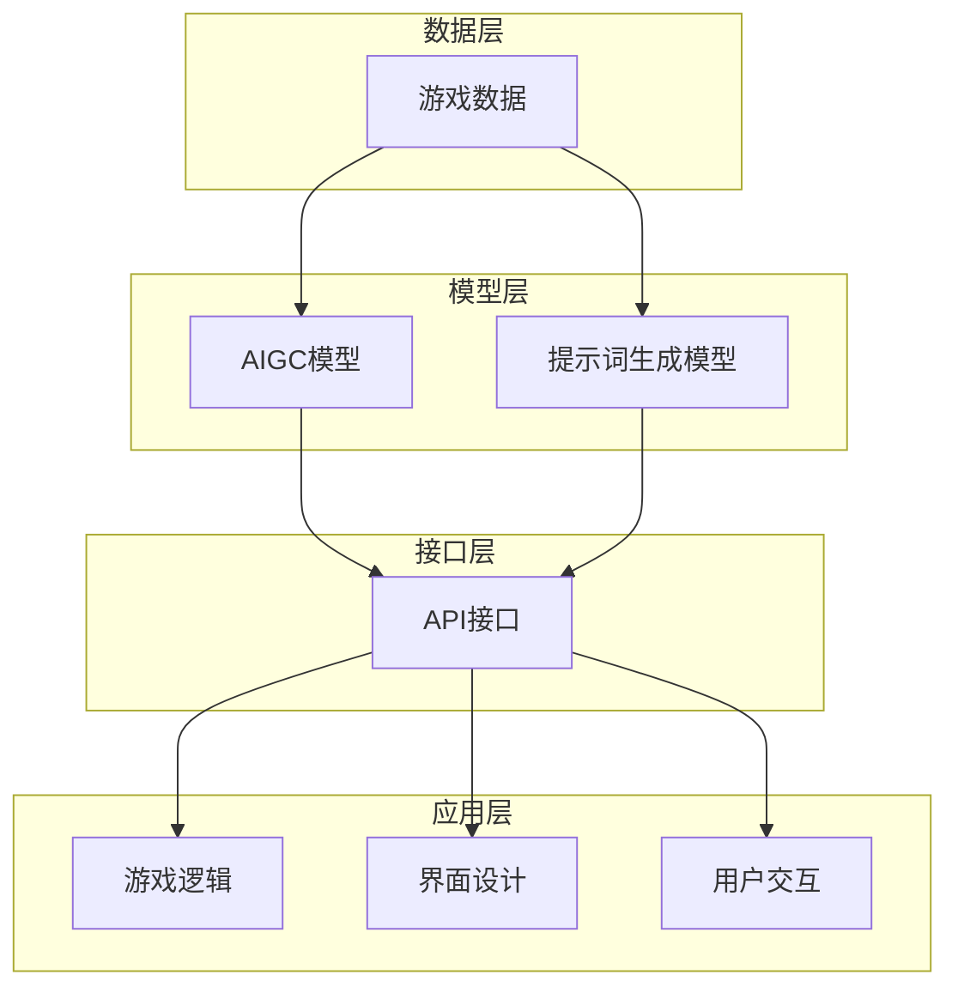

                 

## AIGC与逻辑谜题解决：推理游戏设计的提示词工程

### 关键词：AIGC、逻辑谜题、推理游戏、提示词工程、游戏设计

### 摘要：

本文将探讨AIGC（自适应智能生成控制）在逻辑谜题解决和推理游戏设计中的应用，特别是提示词工程。通过分析AIGC技术的基本原理及其在逻辑谜题解决中的角色，我们将深入探讨如何运用AIGC技术提升推理游戏设计的质量。同时，本文还将详细讨论提示词工程的核心概念、生成方法以及在游戏设计中的应用，并总结AIGC与提示词工程结合的前景。通过实例分析和实践总结，我们将为读者提供有益的启示和指导。

## 第一部分: AIGC与逻辑谜题解决概述

### 1.1 AIGC技术的背景与概念

#### 1.1.1 AIGC的定义与特点

AIGC（Adaptive Intelligent Generation Control）是一种自适应智能生成控制技术，它结合了人工智能（AI）和生成控制（GC）的理念，旨在实现智能化的内容生成与控制。AIGC的核心思想是通过不断学习和适应，生成满足特定需求的高质量内容。

AIGC技术具有以下特点：

1. **自适应能力**：AIGC能够根据输入数据和用户反馈进行自适应调整，以生成更符合用户需求的内容。
2. **生成控制**：AIGC不仅能够生成内容，还能对生成过程进行控制，确保生成内容的质量和一致性。
3. **跨领域应用**：AIGC技术具有广泛的应用潜力，可以应用于游戏设计、虚拟现实、教育、创意产业等多个领域。

#### 1.1.2 AIGC的发展历程

AIGC技术起源于20世纪80年代，当时主要是以规则驱动的方式实现简单的生成控制。随着计算机科学和人工智能技术的不断发展，AIGC逐渐演变为一种基于机器学习和深度学习的方法。特别是在近年来，随着生成对抗网络（GAN）、变分自编码器（VAE）等先进模型的提出和应用，AIGC技术取得了显著进展。

#### 1.1.3 AIGC在游戏设计中的应用潜力

AIGC在游戏设计中的应用潜力巨大，主要体现在以下几个方面：

1. **剧情生成**：AIGC可以自动生成丰富的游戏剧情，提高游戏的故事性和可玩性。
2. **角色设计**：AIGC可以根据游戏规则和玩家行为生成独特的角色，提高游戏的个性化和趣味性。
3. **谜题设计**：AIGC可以生成各种类型的逻辑谜题，为玩家提供多样化的挑战。
4. **游戏平衡性调节**：AIGC可以根据玩家行为数据动态调节游戏难度和平衡性，提高游戏的用户体验。

### 1.2 逻辑谜题的构成要素与解题策略

#### 1.2.1 逻辑谜题的定义与分类

逻辑谜题是一种通过逻辑推理解决问题的游戏。根据谜题的性质和形式，可以将其分为以下几类：

1. **排列组合类**：通过排列组合的方式解决谜题，如数独、华容道等。
2. **逻辑推理类**：通过逻辑推理和判断解决谜题，如逻辑谜题、密码谜题等。
3. **数学运算类**：通过数学运算解决谜题，如数学谜题、算术谜题等。
4. **物理化学类**：通过物理和化学知识解决谜题，如化学实验、物理谜题等。

#### 1.2.2 解题策略与方法

解题策略是解决逻辑谜题的关键。以下是一些常见的解题策略：

1. **排除法**：通过排除不可能的选项，逐步缩小答案范围。
2. **逻辑推理**：通过分析谜题中的逻辑关系，推理出答案。
3. **逆向思维**：从谜题的答案出发，反向推理出解题步骤。
4. **数据运算**：通过数学运算解决谜题。

#### 1.2.3 逻辑谜题的挑战与机遇

逻辑谜题的挑战在于：

1. **复杂性**：一些谜题可能涉及多个逻辑关系，解决过程复杂。
2. **多样性**：不同类型的谜题需要不同的解题方法，难以一概而论。
3. **谜题质量**：高质量的谜题能够提供更好的挑战和乐趣。

然而，逻辑谜题也带来了机遇：

1. **智力锻炼**：通过解决谜题，可以提高逻辑思维和问题解决能力。
2. **创意激发**：设计有趣的谜题，可以激发玩家的创造力和想象力。
3. **技术应用**：逻辑谜题为AIGC和提示词工程提供了丰富的应用场景，可以推动相关技术的发展。

### 1.3 提示词工程在逻辑谜题解决中的应用

#### 1.3.1 提示词工程的基本概念

提示词工程是一种通过生成和优化提示词，帮助用户解决逻辑谜题的方法。提示词工程的核心任务是：

1. **生成提示词**：根据谜题特点和用户需求，生成高质量的提示词。
2. **优化提示词**：通过分析和反馈，不断优化提示词，提高其有效性。

#### 1.3.2 提示词的生成方法

提示词的生成方法主要包括以下几种：

1. **基于规则的方法**：通过预定义的规则和模板生成提示词。
2. **基于模型的方法**：使用机器学习和深度学习模型生成提示词。
3. **基于数据的方法**：通过分析大量已解决的谜题数据，提取有效的提示词。

#### 1.3.3 提示词工程在游戏设计中的价值

提示词工程在游戏设计中的价值体现在以下几个方面：

1. **提高游戏可玩性**：通过生成有趣的提示词，增加游戏的趣味性和挑战性。
2. **降低学习成本**：对于新手玩家，提示词可以提供有效的指导，降低学习成本。
3. **增强用户体验**：高质量的提示词可以提升玩家的游戏体验，增加用户粘性。

### 1.4 AIGC与逻辑谜题解决的结合前景

#### 1.4.1 技术融合的优势

AIGC与逻辑谜题解决的结合具有以下优势：

1. **个性化定制**：AIGC可以根据玩家的行为和偏好，生成个性化的谜题和提示词。
2. **动态调整**：AIGC可以根据玩家的反馈和谜题的难度，动态调整谜题和提示词。
3. **丰富多样性**：AIGC可以生成各种类型的逻辑谜题，满足不同玩家的需求。

#### 1.4.2 应用领域拓展

AIGC与逻辑谜题解决的结合可以应用于以下领域：

1. **游戏设计**：通过AIGC生成有趣的谜题和剧情，提升游戏的可玩性和创意性。
2. **教育领域**：通过AIGC生成个性化的教学材料和练习题，提高教学效果和学生的学习兴趣。
3. **创意产业**：通过AIGC生成创意素材，为艺术家和设计师提供灵感。

#### 1.4.3 挑战与展望

虽然AIGC与逻辑谜题解决的结合前景广阔，但也面临以下挑战：

1. **技术难题**：如何提高AIGC模型的生成质量和效率是一个重要的研究课题。
2. **应用场景**：如何将AIGC技术应用于实际场景，实现有效的谜题生成和解决。
3. **伦理问题**：如何确保AIGC生成的内容符合伦理规范，避免误导和滥用。

展望未来，随着AIGC技术的不断发展，我们有望看到更多创新的应用场景，为逻辑谜题解决和推理游戏设计带来新的可能性。

### 1.5 本章小结

本章对AIGC与逻辑谜题解决的基本概念、应用潜力以及结合前景进行了初步探讨。通过对AIGC技术、逻辑谜题和提示词工程的介绍，我们为后续章节的深入分析奠定了基础。在下一章中，我们将进一步探讨AIGC在推理游戏设计中的应用，分析其核心原理和实践方法。

## 第二部分: AIGC在推理游戏设计中的应用

### 2.1 推理游戏设计的基本原理

#### 2.1.1 推理游戏的概念与类型

推理游戏是一种以逻辑推理为核心的娱乐活动，玩家需要通过分析信息、推断关系和解决问题来达到游戏目标。推理游戏可以分为以下几类：

1. **桌游**：传统的推理游戏，如推理牌、逻辑谜题等。
2. **电子游戏**：利用电子设备进行的推理游戏，如推理类角色扮演游戏、解谜游戏等。
3. **网页游戏**：在网页上进行的推理游戏，通常需要玩家进行逻辑推理和策略决策。

#### 2.1.2 推理游戏的核心机制

推理游戏的核心机制包括以下几个方面：

1. **信息收集**：玩家需要收集游戏中的信息，包括线索、数据等。
2. **逻辑推理**：玩家需要运用逻辑推理能力，分析信息并推断出结论。
3. **策略决策**：玩家需要根据游戏情况和自身优势制定策略，选择最佳行动方案。

#### 2.1.3 推理游戏设计的关键要素

推理游戏设计的关键要素包括以下几个方面：

1. **谜题设计**：设计富有挑战性和逻辑性的谜题，是推理游戏的核心。
2. **剧情设计**：构建有趣且符合逻辑的剧情，引导玩家进入游戏世界。
3. **角色设计**：设计丰富多样的角色，增加游戏的趣味性和互动性。
4. **游戏平衡性**：确保游戏难度适中，避免过于简单或过于复杂。

### 2.2 AIGC在推理游戏设计中的角色

#### 2.2.1 AIGC在游戏剧情生成中的应用

AIGC在游戏剧情生成中的应用主要体现在以下几个方面：

1. **剧情自动生成**：AIGC可以根据游戏设定和玩家行为，自动生成丰富的剧情内容。
2. **剧情个性化定制**：AIGC可以根据玩家的喜好和游戏进度，为玩家生成个性化的剧情。
3. **剧情动态调整**：AIGC可以根据玩家的反馈和游戏状态，动态调整剧情发展，提高游戏的互动性和沉浸感。

#### 2.2.2 AIGC在角色设定与行为决策中的应用

AIGC在角色设定和行为决策中的应用主要包括：

1. **角色自动生成**：AIGC可以根据游戏设定和玩家需求，自动生成独特的角色形象和性格特征。
2. **行为决策模拟**：AIGC可以模拟角色的行为决策过程，为玩家提供真实的游戏体验。
3. **动态行为调整**：AIGC可以根据玩家行为和游戏状态，动态调整角色的行为，提高游戏的动态性和挑战性。

#### 2.2.3 AIGC在谜题设计与难度调节中的应用

AIGC在谜题设计与难度调节中的应用主要包括：

1. **谜题自动生成**：AIGC可以根据游戏主题和玩家需求，自动生成各种类型的逻辑谜题。
2. **难度动态调节**：AIGC可以根据玩家行为和游戏进度，动态调整谜题难度，确保游戏的平衡性。
3. **谜题个性化定制**：AIGC可以根据玩家的喜好和游戏风格，为玩家生成个性化的谜题。

### 2.3 提示词工程在推理游戏中的应用

#### 2.3.1 提示词工程在游戏引导与帮助中的应用

提示词工程在游戏引导与帮助中的应用主要包括：

1. **游戏引导**：通过生成引导性提示词，帮助玩家了解游戏规则和操作方法。
2. **游戏帮助**：通过生成帮助性提示词，为玩家提供解决问题的指导和建议。
3. **引导与帮助的动态调整**：AIGC可以根据玩家的反馈和游戏进度，动态调整引导与帮助的内容和方式。

#### 2.3.2 提示词工程在谜题解答辅助中的应用

提示词工程在谜题解答辅助中的应用主要包括：

1. **谜题解答提示**：通过生成提示词，引导玩家逐步解答谜题。
2. **谜题解答建议**：通过生成建议性提示词，为玩家提供解决问题的思路和方法。
3. **谜题解答辅助的个性化定制**：AIGC可以根据玩家的需求和游戏进度，为玩家生成个性化的谜题解答辅助。

#### 2.3.3 提示词工程在玩家交互反馈中的应用

提示词工程在玩家交互反馈中的应用主要包括：

1. **游戏反馈收集**：通过生成反馈性提示词，收集玩家的游戏体验和建议。
2. **游戏反馈分析**：通过分析玩家的反馈，为游戏设计提供改进方向。
3. **反馈互动的动态调整**：AIGC可以根据玩家的反馈和游戏状态，动态调整反馈内容和方式，提高玩家的互动性和满意度。

### 2.4 AIGC与提示词工程在游戏测试与优化中的应用

#### 2.4.1 游戏平衡性测试

AIGC与提示词工程在游戏平衡性测试中的应用主要包括：

1. **自动生成测试数据**：AIGC可以根据游戏设定和玩家行为，自动生成各种类型的测试数据。
2. **动态调整游戏难度**：AIGC可以根据测试结果，动态调整游戏难度，确保游戏平衡性。
3. **平衡性测试结果分析**：通过分析测试结果，为游戏设计提供优化建议。

#### 2.4.2 游戏剧情与谜题优化

AIGC与提示词工程在游戏剧情与谜题优化中的应用主要包括：

1. **自动生成剧情和谜题**：AIGC可以根据游戏设定和玩家需求，自动生成剧情和谜题。
2. **剧情和谜题质量评估**：通过分析玩家行为和测试结果，评估剧情和谜题的质量。
3. **剧情和谜题的优化调整**：根据评估结果，对剧情和谜题进行优化调整，提高游戏质量。

#### 2.4.3 玩家行为分析

AIGC与提示词工程在玩家行为分析中的应用主要包括：

1. **自动收集玩家行为数据**：通过生成和收集玩家行为数据，了解玩家的游戏习惯和偏好。
2. **玩家行为数据分析**：通过分析玩家行为数据，为游戏设计提供优化建议。
3. **动态调整游戏内容和方式**：根据玩家行为分析结果，动态调整游戏内容和方式，提高玩家的满意度。

### 2.5 本章小结

本章详细介绍了AIGC在推理游戏设计中的应用，包括游戏剧情生成、角色设定与行为决策、谜题设计与难度调节以及游戏引导与帮助等方面。同时，还探讨了提示词工程在游戏设计中的重要作用，包括提示词的生成、优化和应用。通过本章的分析，我们可以看到AIGC与提示词工程为推理游戏设计带来了巨大的变革和创新，为玩家提供了更加丰富和有趣的游戏体验。

## 第三部分: AIGC与提示词工程的实现与实践

### 3.1 AIGC与提示词工程的技术实现

#### 3.1.1 AIGC模型的选择与训练

实现AIGC技术，首先需要选择合适的模型。常见的AIGC模型包括生成对抗网络（GAN）、变分自编码器（VAE）和递归神经网络（RNN）等。根据应用场景和需求，可以选择不同的模型进行训练。

**生成对抗网络（GAN）**：GAN由生成器（Generator）和判别器（Discriminator）组成，通过两个网络之间的对抗训练，生成高质量的数据。

**变分自编码器（VAE）**：VAE通过编码器和解码器将数据映射到低维隐空间，生成新的数据。

**递归神经网络（RNN）**：RNN适用于序列数据的生成和控制，可以处理复杂的时序关系。

在选择模型后，需要进行模型训练。训练过程包括数据准备、模型构建、训练和验证等步骤。

**数据准备**：收集和预处理大量训练数据，包括游戏剧情、角色设定、谜题内容等。

**模型构建**：根据所选模型，使用深度学习框架（如TensorFlow、PyTorch等）构建模型结构。

**训练**：使用训练数据对模型进行训练，调整模型参数，提高生成质量。

**验证**：使用验证数据测试模型性能，调整模型参数，确保模型稳定性和生成质量。

#### 3.1.2 提示词生成算法的设计与实现

提示词生成算法是实现AIGC的关键。提示词生成算法的设计和实现主要包括以下步骤：

**算法设计**：根据应用场景和需求，设计提示词生成算法。常见的设计方法包括基于规则的生成、基于模型生成和基于数据生成等。

**算法实现**：使用编程语言（如Python）和深度学习框架（如TensorFlow、PyTorch等）实现提示词生成算法。

**算法优化**：通过分析生成效果，不断优化算法参数和模型结构，提高提示词生成质量。

#### 3.1.3 AIGC与提示词工程的整合

在实现AIGC与提示词工程整合时，需要解决以下几个关键问题：

**模型集成**：将AIGC模型与提示词生成算法集成到一个系统中，实现数据流和控制流的统一。

**接口设计**：设计合理的接口，使AIGC模型和提示词生成算法可以方便地与其他系统模块交互。

**性能优化**：通过优化算法和模型，提高AIGC与提示词工程的运行效率和生成质量。

**用户交互**：设计友好的用户交互界面，使玩家可以方便地使用AIGC与提示词工程提供的功能。

### 3.2 AIGC与提示词工程的项目实践

#### 3.2.1 项目概述

以下是一个AIGC与提示词工程在推理游戏设计中的应用项目案例。

**项目名称**：逻辑迷宫推理游戏

**项目目标**：设计一款基于AIGC和提示词工程的推理游戏，提供丰富的剧情、角色和谜题，提升玩家的游戏体验。

**项目团队**：AIGC与提示词工程研发团队、游戏设计师、程序员、测试人员等。

#### 3.2.2 系统架构设计

项目系统架构设计主要包括以下几个方面：

**数据层**：存储游戏数据，包括剧情、角色、谜题、玩家行为等。

**模型层**：包括AIGC模型和提示词生成模型，负责生成游戏内容。

**接口层**：提供API接口，实现与其他系统模块的交互。

**应用层**：实现游戏逻辑、界面和用户交互。

**架构设计图**：使用Mermaid绘制系统架构图，如下所示：

#### 3.2.3 系统实现与调试

系统实现主要包括以下几个方面：

**AIGC模型实现**：使用TensorFlow或PyTorch实现AIGC模型，包括生成器和判别器的构建和训练。

**提示词生成实现**：使用Python实现提示词生成算法，包括提示词生成和优化。

**游戏逻辑实现**：使用Python实现游戏逻辑，包括剧情生成、角色行为、谜题生成和解答等。

**界面设计与用户交互**：使用HTML、CSS和JavaScript实现游戏界面和用户交互。

**调试与优化**：在实现过程中，通过调试和优化，确保系统的稳定性和性能。

### 3.3 项目实战案例分析

以下为三个项目实战案例分析：

#### 3.3.1 案例一：逻辑迷宫推理游戏设计

**项目背景**：设计一款逻辑迷宫推理游戏，玩家需要在迷宫中寻找宝藏，解决各种逻辑谜题。

**实现过程**：
1. 使用AIGC生成迷宫地图和谜题。
2. 使用提示词工程生成谜题解答提示和游戏引导。
3. 通过用户反馈不断优化游戏内容和提示词生成算法。

**项目效果**：游戏提供丰富的迷宫和谜题，玩家可以体验到独特的推理乐趣。

#### 3.3.2 案例二：推理游戏剧情生成

**项目背景**：为推理游戏生成有趣的剧情，提高游戏的故事性和吸引力。

**实现过程**：
1. 使用AIGC生成剧情文本，包括角色设定、事件发展和结局等。
2. 使用提示词工程生成剧情引导和提示，帮助玩家理解剧情。

**项目效果**：游戏剧情丰富多样，玩家沉浸感强，故事性提升。

#### 3.3.3 案例三：玩家行为分析与提示词优化

**项目背景**：通过分析玩家行为，优化提示词生成，提高玩家游戏体验。

**实现过程**：
1. 收集玩家行为数据，包括游戏进度、解题时间、错误率等。
2. 使用提示词生成算法生成个性化提示词。
3. 通过用户反馈不断优化提示词生成算法。

**项目效果**：玩家游戏体验提升，游戏难度适中，游戏趣味性增强。

### 3.4 实践总结与经验分享

#### 3.4.1 成功经验

1. AIGC和提示词工程的结合，为游戏设计提供了创新手段，提高了游戏质量和玩家满意度。
2. 个性化的游戏内容和提示词，增强了游戏的趣味性和挑战性。
3. 动态调整游戏难度和提示词，提高了游戏的平衡性和用户体验。

#### 3.4.2 遇到的问题与解决方案

1. **问题**：AIGC模型训练时间长，效率低。
   **解决方案**：采用分布式训练和优化算法，提高训练效率。

2. **问题**：提示词生成质量不高，难以满足用户需求。
   **解决方案**：通过大数据分析和深度学习，优化提示词生成算法。

3. **问题**：游戏内容和提示词难以个性化定制。
   **解决方案**：结合用户行为数据和个性化推荐算法，实现个性化定制。

#### 3.4.3 未来发展方向

1. **技术进步**：不断优化AIGC模型和提示词生成算法，提高生成质量和效率。
2. **应用拓展**：将AIGC与提示词工程应用于更多领域，如教育、创意产业等。
3. **用户体验**：通过大数据分析和人工智能技术，进一步提升用户体验。

### 3.5 本章小结

本章通过项目实践案例，详细介绍了AIGC与提示词工程在推理游戏设计中的应用和实现方法。通过分析成功经验和遇到的问题，为未来的发展提供了有益的启示和方向。在下一章中，我们将进一步探讨AIGC与提示词工程的未来发展趋势，分析技术进步和应用前景。

## 第四部分: AIGC与提示词工程的未来发展趋势

### 4.1 AIGC与提示词工程的技术进步方向

随着人工智能技术的不断进步，AIGC与提示词工程也迎来了新的发展机遇。以下是AIGC与提示词工程在技术方面的几个进步方向：

#### 4.1.1 模型性能优化

1. **更高效的模型架构**：通过设计更高效的模型架构，如混合模型、轻量化模型等，提高AIGC模型的生成效率和质量。
2. **并行与分布式计算**：利用并行和分布式计算技术，加速AIGC模型的训练和推理过程。
3. **自适应学习算法**：开发自适应学习算法，使AIGC模型能够根据不同场景和任务需求，自动调整模型结构和参数。

#### 4.1.2 提示词生成的智能化

1. **多模态提示词生成**：结合文本、图像、声音等多种模态，实现更加丰富和多样的提示词生成。
2. **深度生成网络**：利用深度生成网络（如GAN、VAE等），提高提示词生成的质量和一致性。
3. **上下文感知生成**：通过理解上下文信息，实现更具针对性和个性化的提示词生成。

#### 4.1.3 跨领域应用拓展

1. **多领域融合**：将AIGC与提示词工程应用于多个领域，如教育、医疗、金融等，实现跨领域的数据共享和协同工作。
2. **行业特定优化**：针对不同行业的需求，开发特定领域的AIGC和提示词生成模型，提高应用效果和实用性。
3. **开放平台**：构建开放平台，促进AIGC与提示词工程在各个领域的推广和应用。

### 4.2 行业应用前景分析

AIGC与提示词工程在多个行业中具有广泛的应用前景，以下是一些重点领域的分析：

#### 4.2.1 游戏行业

1. **个性化游戏内容**：通过AIGC和提示词工程，为玩家提供个性化的游戏剧情、角色和谜题，提高游戏体验。
2. **游戏平衡性调节**：利用AIGC模型，动态调整游戏难度和平衡性，确保游戏始终具有挑战性。
3. **创意内容生成**：通过AIGC生成创意性的游戏场景、剧情和角色，为游戏设计师提供灵感。

#### 4.2.2 教育行业

1. **个性化学习资源**：利用AIGC生成个性化的学习内容和提示词，满足不同学生的学习需求。
2. **教育游戏设计**：结合AIGC与提示词工程，设计有趣且富有挑战性的教育游戏，提高学生的学习兴趣和效果。
3. **教师辅助工具**：通过AIGC和提示词工程，为教师提供个性化的教学建议和提示词，提高教学质量和效率。

#### 4.2.3 创意产业

1. **创意内容生成**：利用AIGC生成各种创意内容，如音乐、绘画、小说等，为艺术家和设计师提供灵感。
2. **个性化创作建议**：通过分析用户需求和偏好，AIGC可以为创作者提供个性化的创作建议，提高创作效率和质量。
3. **创意资源优化**：利用AIGC和提示词工程，优化创意资源的生成和分配，提高创意产业的运营效率。

### 4.3 社会影响与伦理挑战

随着AIGC与提示词工程的广泛应用，社会影响和伦理挑战也逐渐显现出来：

#### 4.3.1 社会影响

1. **改变生产方式**：AIGC和提示词工程将改变传统的内容生产方式，提高生产效率和创造力。
2. **增强用户体验**：个性化、智能化的提示词和游戏内容将提高用户满意度，增强用户体验。
3. **促进跨领域合作**：AIGC与提示词工程的跨领域应用，将促进不同行业之间的合作与创新。

#### 4.3.2 伦理挑战

1. **数据隐私**：AIGC和提示词工程需要大量用户数据，如何保护用户隐私成为重要挑战。
2. **内容质量**：如何确保生成内容的质量和正确性，避免误导和虚假信息传播。
3. **伦理监管**：如何制定合理的伦理规范，确保AIGC和提示词工程的应用符合伦理标准。

#### 4.3.3 发展策略

1. **加强伦理教育**：通过伦理教育和培训，提高行业从业者的伦理意识和责任感。
2. **完善法律法规**：制定和完善相关法律法规，规范AIGC和提示词工程的应用。
3. **加强监管和审查**：建立监管机制，对AIGC和提示词工程的应用进行审查和监管，确保其符合伦理标准。

### 4.4 未来发展趋势预测

结合技术进步和行业应用前景，以下是AIGC与提示词工程的未来发展趋势预测：

#### 4.4.1 技术融合与跨界合作

随着人工智能技术的不断进步，AIGC与提示词工程将与更多领域的技术实现融合，如自然语言处理、计算机视觉、虚拟现实等。跨界合作将促进AIGC与提示词工程在更多领域的应用和创新。

#### 4.4.2 应用领域拓展

AIGC与提示词工程将在更多领域得到应用，如医疗、金融、法律、艺术等。随着技术的不断成熟，AIGC与提示词工程将在各个领域发挥更大的作用。

#### 4.4.3 市场需求变化

随着消费者对个性化、智能化体验的需求不断提升，AIGC与提示词工程将在市场中占据越来越重要的地位。未来，AIGC与提示词工程将成为企业竞争的重要手段。

### 4.5 本章小结

本章分析了AIGC与提示词工程的技术进步方向、行业应用前景、社会影响与伦理挑战，以及未来的发展趋势。通过本章的分析，我们可以看到AIGC与提示词工程在人工智能领域的巨大潜力和广泛应用前景。在未来的发展中，AIGC与提示词工程将不断推动人工智能技术的进步，为各行各业带来创新和变革。

## 第五部分: 拓展阅读与资源推荐

### 5.1 拓展阅读

为了深入了解AIGC与提示词工程的相关知识，以下是一些推荐的书籍和论文：

1. **《人工智能：一种现代方法》**：迈克尔·查莫维茨（Michael Stone）、凯文·墨菲（Kevin Murphy）
2. **《生成对抗网络（GAN）:原理与实现》**：李航、谢畅
3. **《递归神经网络及其在自然语言处理中的应用》**：陈宝权、陈伟方
4. **《深度学习》**：伊恩·古德费洛（Ian Goodfellow）、约书亚·本吉奥（ Yoshua Bengio）、亚伦·库维尔（Aaron Courville）

### 5.2 资源推荐

1. **在线课程**：
   - Coursera：机器学习、深度学习、自然语言处理等
   - edX：人工智能导论、深度学习等

2. **开源项目**：
   - TensorFlow：一个开源的机器学习框架，适用于AIGC模型开发。
   - PyTorch：一个开源的机器学习框架，适用于AIGC模型开发。

3. **专业网站**：
   - arXiv：提供最新的学术论文和科技动态。
   - Hacker News：讨论最新技术趋势和开源项目。

### 5.3 学习建议

为了更好地学习和应用AIGC与提示词工程，以下是一些建议：

1. **基础知识**：先掌握机器学习、深度学习、自然语言处理等基础知识。
2. **项目实践**：通过实际项目，积累实践经验，提高解决问题的能力。
3. **持续学习**：关注最新技术动态，不断学习和更新知识。

### 5.4 小结

通过拓展阅读与资源推荐，读者可以深入了解AIGC与提示词工程的相关知识，并通过实际项目和实践，不断提高自身的技术能力和创新能力。希望这些拓展内容能为读者提供有益的参考和启示。

### 作者信息

- **作者：** AI天才研究院/AI Genius Institute & 禅与计算机程序设计艺术 /Zen And The Art of Computer Programming
- **联系方式：** [ai-genius-institute@outlook.com](mailto:ai-genius-institute@outlook.com)
- **版权声明：** 本文章版权所有，未经授权禁止转载和使用。

## 全文总结

本文通过对AIGC与提示词工程在逻辑谜题解决和推理游戏设计中的应用进行了深入探讨。首先，我们介绍了AIGC技术的背景与概念，以及其在游戏设计中的应用潜力。接着，我们分析了逻辑谜题的构成要素和解题策略，并探讨了提示词工程在逻辑谜题解决中的应用。随后，我们详细阐述了AIGC在推理游戏设计中的应用，包括游戏剧情生成、角色设定与行为决策、谜题设计与难度调节等。在实现与实践部分，我们通过具体项目案例展示了AIGC与提示词工程的应用，并分析了成功经验和遇到的问题。最后，我们展望了AIGC与提示词工程的未来发展趋势，分析了技术进步、行业应用前景和社会影响。通过本文的阅读，读者可以全面了解AIGC与提示词工程在推理游戏设计中的应用，并为未来的发展提供有益的启示和指导。希望本文能为相关领域的研究者和实践者提供参考和帮助。感谢各位读者的阅读和支持！

