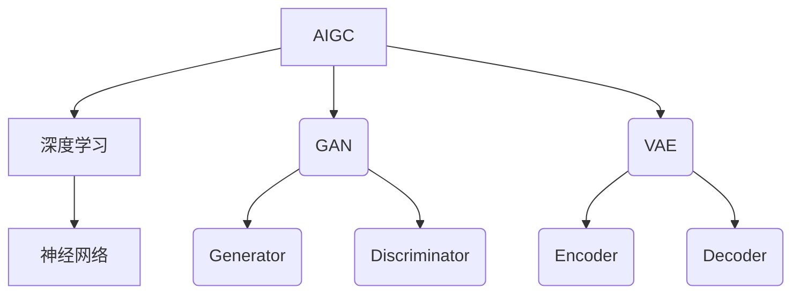
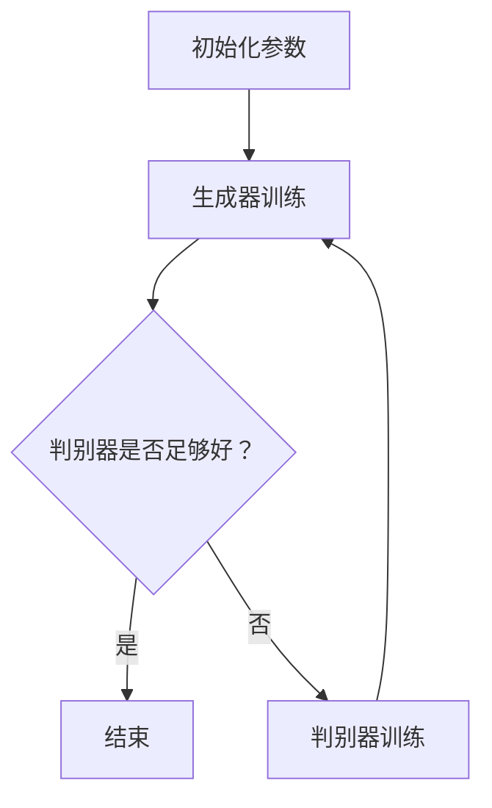

                 

### AIGC革命：重塑创意产业的未来

#### 关键词：AIGC、人工智能生成内容、创意产业、技术革命、未来趋势

> 摘要：
> 本文章将探讨人工智能生成内容（AIGC）革命性的发展趋势及其对创意产业的重塑影响。文章首先介绍了AIGC的基本概念与背景，然后深入解析了AIGC的核心概念与联系，接着讲解了AIGC的数学模型与算法原理。随后，文章通过具体应用案例分析，展示了AIGC在影视制作、音乐创作、游戏开发、虚拟现实等领域的实际应用。在项目实战部分，我们将详细介绍AIGC应用开发的实战流程，并通过案例分析展示具体应用场景。最后，文章展望了AIGC在创意产业的未来趋势，并提出了相关的最佳实践和注意事项。

### 第一部分: AIGC革命概述

#### 1.1 AIGC概念与背景

##### 1.1.1 什么是AIGC

AIGC，全称是Artificial Intelligence Generated Content，即人工智能生成内容。它指的是利用人工智能技术，特别是深度学习和生成对抗网络（GAN）等算法，自动生成文本、图像、音频、视频等多种类型的内容。

##### 1.1.2 AIGC的发展历程

AIGC技术的发展可以追溯到20世纪80年代，随着深度学习算法的提出和发展，AIGC技术逐渐成熟。特别是在2014年，生成对抗网络（GAN）的提出标志着AIGC技术进入了一个新的发展阶段。近年来，随着计算能力和数据资源的不断提升，AIGC技术在多个领域都取得了显著的应用成果。

##### 1.1.3 AIGC在创意产业中的应用潜力

AIGC在创意产业中的应用潜力巨大。从影视制作、音乐创作到游戏开发、虚拟现实，AIGC都能提供强大的辅助和提升。例如，AIGC可以自动生成电影剧本、音乐旋律和游戏剧情，大大提高创意工作的效率和质量。同时，AIGC也为创作者提供了更多元的创作工具和手段，激发了创意产业的创新活力。

#### 1.2 AIGC的核心概念与联系

##### 1.2.1 AIGC的关键技术

AIGC的关键技术主要包括深度学习、生成对抗网络（GAN）、变分自编码器（VAE）等。这些技术为AIGC的生成能力提供了强大的技术支撑。

##### 1.2.2 AIGC与传统创意产业的关系

AIGC与传统创意产业有着紧密的联系。它不仅为传统创意产业提供了新的技术工具，也改变了创意产业的创作方式和商业模式。例如，AIGC可以自动生成电影剧本、音乐旋律和游戏剧情，使得创作者能够更加专注于创意本身的表达。

##### 1.2.3 AIGC的核心概念联系图（Mermaid图）



#### 1.3 AIGC的数学模型与算法原理

##### 1.3.1 AIGC的数学模型介绍

AIGC的数学模型主要基于深度学习和生成对抗网络（GAN）。深度学习模型通过多层神经网络的训练，学习数据的特征表示；生成对抗网络（GAN）则通过生成器和判别器的对抗训练，实现数据的生成。

##### 1.3.2 AIGC的核心算法讲解

生成对抗网络（GAN）是AIGC的核心算法。它由生成器（Generator）和判别器（Discriminator）两部分组成。生成器的目标是生成逼真的数据，判别器的目标是区分生成的数据和真实数据。通过不断训练，生成器和判别器相互竞争，最终生成器能够生成几乎难以区分真假的数据。

##### 1.3.3 算法流程图（Mermaid图）



##### 1.3.4 Python代码示例

```python
import tensorflow as tf
from tensorflow.keras.layers import Dense, Flatten, Reshape
from tensorflow.keras.models import Sequential

# 生成器模型
def build_generator():
    model = Sequential([
        Dense(128, input_shape=(100,)),
        Flatten(),
        Reshape((7, 7, 1)),
        # 更多层...
    ])
    return model

# 判别器模型
def build_discriminator():
    model = Sequential([
        Flatten(input_shape=(28, 28)),
        Dense(128),
        Dense(1, activation='sigmoid'),
    ])
    return model

# 训练过程
generator = build_generator()
discriminator = build_discriminator()

# 定义损失函数和优化器
g_loss = tf.keras.losses.BinaryCrossentropy()
d_loss = tf.keras.losses.BinaryCrossentropy()

g_optimizer = tf.keras.optimizers.Adam(learning_rate=0.0002)
d_optimizer = tf.keras.optimizers.Adam(learning_rate=0.0002)

# 训练循环
for epoch in range(100):
    for _ in range(batch_size):
        noise = np.random.normal(0, 1, (100,))
        generated_images = generator.predict(noise)
        real_images = ...

    with tf.GradientTape() as gen_tape, tf.GradientTape() as disc_tape:
        gen_loss = ...
        disc_loss = ...

    grads_gen = gen_tape.gradient(g_loss, generator.trainable_variables)
    grads_disc = disc_tape.gradient(d_loss, discriminator.trainable_variables)

    g_optimizer.apply_gradients(zip(grads_gen, generator.trainable_variables))
    d_optimizer.apply_gradients(zip(grads_disc, discriminator.trainable_variables))
```

#### 1.4 AIGC在创意产业中的应用案例分析

##### 1.4.1 AIGC在影视制作中的应用

AIGC在影视制作中的应用主要体现在剧本创作、特效制作和后期制作等方面。通过AIGC技术，可以自动生成电影剧本、设计特效场景和优化后期制作效果，大大提高影视制作的效率和质量。

##### 1.4.2 AIGC在音乐创作中的应用

AIGC在音乐创作中的应用包括旋律生成、歌词创作和音乐制作工具的集成。通过AIGC技术，可以自动生成优美的旋律、创作歌词和制作完整的音乐作品，为音乐创作提供了新的工具和手段。

##### 1.4.3 AIGC在游戏开发中的应用

AIGC在游戏开发中的应用包括剧情生成、角色设计和场景生成等。通过AIGC技术，可以自动生成游戏剧情、设计角色和场景，提高游戏开发的效率和质量。

##### 1.4.4 AIGC在虚拟现实中的应用

AIGC在虚拟现实中的应用包括内容制作、交互设计和市场拓展等。通过AIGC技术，可以自动生成虚拟现实内容、优化交互体验和开拓新的市场机会。

#### 1.5 AIGC的挑战与未来展望

##### 1.5.1 AIGC面临的挑战

AIGC在发展过程中面临着数据隐私、算法透明性和伦理道德等方面的挑战。如何确保AIGC技术的数据安全和隐私保护，提高算法的透明度和可解释性，以及遵循伦理道德规范，都是AIGC需要解决的挑战。

##### 1.5.2 AIGC的未来发展趋势

随着人工智能技术的不断发展，AIGC在未来有望在更多领域取得突破。特别是在创意产业，AIGC将进一步提高创意工作的效率和质量，激发创意产业的创新活力。

##### 1.5.3 AIGC在创意产业中的战略意义

AIGC将为创意产业带来深刻的变革，提高创意工作的效率和质量，优化创作过程，降低创作成本，推动创意产业的可持续发展。

### 第二部分: AIGC在创意产业的应用

#### 2.1 AIGC在影视制作中的应用

##### 2.1.1 AIGC在影视剧本创作中的应用

AIGC在影视剧本创作中的应用主要体现在自动生成剧本大纲、角色对话和情节发展等方面。通过深度学习和自然语言处理技术，AIGC可以自动分析大量剧本数据，提取剧本的结构和模式，从而生成新的剧本大纲。此外，AIGC还可以自动生成角色对话和情节发展，为剧本创作提供新的思路和灵感。

##### 2.1.2 AIGC在影视特效制作中的应用

AIGC在影视特效制作中的应用主要体现在自动生成特效场景、优化特效效果和降低制作成本等方面。通过生成对抗网络（GAN）等技术，AIGC可以自动生成各种复杂的特效场景，如科幻场景、奇幻场景和自然景观等。同时，AIGC还可以通过优化算法，提高特效制作的效率和质量，降低制作成本。

##### 2.1.3 AIGC在影视后期制作中的应用

AIGC在影视后期制作中的应用主要体现在自动剪辑、音频合成和色彩校正等方面。通过深度学习和图像处理技术，AIGC可以自动分析视频内容，进行智能剪辑，优化音频效果，提高色彩校正的准确性。这些技术的应用将大大提高影视后期制作的效率和质量。

#### 2.2 AIGC在音乐创作中的应用

##### 2.2.1 AIGC在旋律生成中的应用

AIGC在旋律生成中的应用主要体现在自动生成旋律、旋律变体和音乐风格迁移等方面。通过深度学习和音乐生成模型，AIGC可以自动生成各种风格和类型的旋律，如古典音乐、流行音乐和电子音乐等。此外，AIGC还可以根据用户需求，生成旋律的变体和风格迁移版本，为音乐创作提供更多的创意可能性。

##### 2.2.2 AIGC在歌词创作中的应用

AIGC在歌词创作中的应用主要体现在自动生成歌词、歌词风格迁移和情感分析等方面。通过自然语言处理技术和情感分析模型，AIGC可以自动生成歌词，并根据用户需求，进行歌词风格迁移和情感分析，提高歌词的创作质量和表现力。

##### 2.2.3 AIGC在音乐制作工具中的集成应用

AIGC在音乐制作工具中的集成应用主要体现在自动化音效处理、自动化混音和智能乐器演奏等方面。通过集成AIGC技术，音乐制作工具可以自动处理音效，优化混音效果，甚至实现智能乐器演奏。这些技术的应用将大大提高音乐制作效率和质量，降低创作成本。

#### 2.3 AIGC在游戏开发中的应用

##### 2.3.1 AIGC在游戏剧情生成中的应用

AIGC在游戏剧情生成中的应用主要体现在自动生成游戏剧情、角色对话和场景设计等方面。通过深度学习和自然语言处理技术，AIGC可以自动分析大量游戏剧情数据，生成新的游戏剧情，提高游戏剧情的多样性和创新性。

##### 2.3.2 AIGC在游戏角色设计中的应用

AIGC在游戏角色设计中的应用主要体现在自动生成游戏角色、角色外观设计和动作设计等方面。通过生成对抗网络（GAN）等技术，AIGC可以自动生成各种风格和类型的游戏角色，并根据用户需求，进行角色外观设计和动作设计，提高游戏角色的表现力和互动性。

##### 2.3.3 AIGC在游戏场景生成中的应用

AIGC在游戏场景生成中的应用主要体现在自动生成游戏场景、场景优化和交互设计等方面。通过图像处理技术和生成对抗网络（GAN）等，AIGC可以自动生成各种复杂的游戏场景，如城市、森林和星球等。同时，AIGC还可以优化场景效果，提高游戏场景的视觉表现力。

#### 2.4 AIGC在虚拟现实中的应用

##### 2.4.1 AIGC在虚拟现实内容制作中的应用

AIGC在虚拟现实内容制作中的应用主要体现在自动生成虚拟现实场景、虚拟角色和交互内容等方面。通过深度学习和图像处理技术，AIGC可以自动生成各种虚拟现实场景，如城市、森林和室内空间等。同时，AIGC还可以生成虚拟角色和交互内容，提高虚拟现实体验的丰富性和互动性。

##### 2.4.2 AIGC在虚拟现实交互中的应用

AIGC在虚拟现实交互中的应用主要体现在自动生成交互场景、智能导航和情感交互等方面。通过自然语言处理技术和生成对抗网络（GAN）等，AIGC可以自动生成各种交互场景，如对话、动作和事件等。同时，AIGC还可以实现智能导航和情感交互，提高虚拟现实交互的智能化和人性化。

##### 2.4.3 AIGC在虚拟现实市场中的机遇与挑战

AIGC在虚拟现实市场中的机遇主要体现在提高虚拟现实内容制作效率、降低制作成本和提升用户体验等方面。通过AIGC技术，虚拟现实内容制作可以更加高效和多样化，满足不同用户的需求。然而，AIGC在虚拟现实市场中也面临着技术成熟度、用户接受度和市场竞争等方面的挑战。

#### 2.5 AIGC在创意产业中的商业模式探索

##### 2.5.1 AIGC在创意产业中的盈利模式

AIGC在创意产业中的盈利模式主要包括内容制作服务、版权授权和平台运营等方面。通过提供定制化的AIGC服务，如剧本创作、音乐制作和游戏开发等，创意产业企业可以实现盈利。同时，AIGC技术还可以通过版权授权，实现内容价值的最大化。此外，AIGC平台运营也可以成为一种盈利模式，如提供AIGC工具和平台的订阅服务。

##### 2.5.2 AIGC与创作者的互动模式

AIGC与创作者的互动模式主要包括协同创作、创意启发和反馈优化等方面。通过AIGC技术，创作者可以与AIGC系统进行协同创作，共同完成创意作品。同时，AIGC还可以为创作者提供创意启发，如自动生成创意方案和设计灵感等。此外，AIGC还可以根据创作者的反馈，不断优化和提升创作效果。

##### 2.5.3 AIGC在创意产业中的价值创造

AIGC在创意产业中的价值创造主要体现在提高创意工作的效率、降低创作成本和提升用户体验等方面。通过AIGC技术，创意产业企业可以更加高效地完成创意工作，降低人力和时间成本。同时，AIGC技术还可以提升用户体验，如自动生成个性化的内容和服务等。

### 第三部分: AIGC应用开发实战

#### 3.1 AIGC应用开发环境搭建

##### 3.1.1 开发工具与软件安装

在AIGC应用开发过程中，需要安装一系列的软件和工具，如Python、TensorFlow、Keras等。开发者可以通过官方文档和教程，详细了解安装步骤和配置方法。

##### 3.1.2 数据集准备与处理

AIGC应用开发需要大量的数据集，如文本、图像、音频和视频等。开发者需要根据应用需求，选择合适的数据集，并进行预处理和处理，如数据清洗、数据增强和格式转换等。

##### 3.1.3 开发环境配置与调试

在搭建AIGC应用开发环境时，开发者需要配置合适的硬件和软件资源，并进行调试和优化，确保开发环境的稳定性和高效性。

#### 3.2 AIGC应用开发流程

##### 3.2.1 应用需求分析

在AIGC应用开发过程中，首先需要进行应用需求分析，明确应用的目标、功能和性能要求等。需求分析的结果将指导后续的架构设计和功能实现。

##### 3.2.2 应用系统架构设计

应用系统架构设计是AIGC应用开发的重要环节。开发者需要根据需求分析的结果，设计合理的系统架构，包括数据层、逻辑层和界面层等。

##### 3.2.3 应用功能模块开发

应用功能模块开发是实现AIGC应用的核心步骤。开发者需要根据系统架构设计，开发各个功能模块，如数据预处理、模型训练、数据生成和交互界面等。

##### 3.2.4 应用性能优化与测试

在应用开发过程中，开发者需要不断优化应用性能，并进行充分的测试，确保应用的高效性和稳定性。性能优化包括模型优化、算法优化和系统优化等。

#### 3.3 AIGC应用案例解析

##### 3.3.1 案例一：AIGC音乐创作系统

AIGC音乐创作系统是一个利用人工智能技术自动生成音乐的应用系统。通过深度学习和生成对抗网络（GAN）等技术，系统可以自动生成旋律、歌词和完整的音乐作品。

##### 3.3.2 案例二：AIGC虚拟现实内容制作系统

AIGC虚拟现实内容制作系统是一个利用人工智能技术自动生成虚拟现实内容的系统。通过生成对抗网络（GAN）和图像处理技术，系统可以自动生成虚拟现实场景、角色和交互内容。

##### 3.3.3 案例三：AIGC游戏开发辅助工具

AIGC游戏开发辅助工具是一个利用人工智能技术辅助游戏开发的应用系统。通过自然语言处理技术和图像处理技术，系统可以自动生成游戏剧情、角色设计和场景生成等。

#### 3.4 AIGC应用开发中的最佳实践

##### 3.4.1 性能优化技巧

在AIGC应用开发过程中，性能优化是一个关键问题。开发者可以采用模型压缩、算法优化和系统优化等技巧，提高应用性能。

##### 3.4.2 模型压缩与部署

模型压缩是AIGC应用开发中的一个重要环节。通过模型压缩技术，可以减小模型的体积，提高模型部署的效率。

##### 3.4.3 数据安全与隐私保护

在AIGC应用开发过程中，数据安全和隐私保护至关重要。开发者需要采取相应的措施，确保用户数据和隐私的安全。

### 第四部分: AIGC在创意产业的未来趋势

#### 4.1 AIGC对创意产业的影响

AIGC对创意产业的影响主要体现在以下几个方面：

1. **提高创作效率**：AIGC技术可以自动生成大量的创意内容，大大提高创作效率。
2. **降低创作成本**：AIGC技术可以减少人力和时间成本，降低创作成本。
3. **优化创作体验**：AIGC技术可以为创作者提供智能化的创作工具和手段，优化创作体验。
4. **激发创新活力**：AIGC技术可以激发创意产业的创新活力，推动产业的持续发展。

#### 4.2 AI与AIGC的发展趋势

随着人工智能技术的不断发展，AIGC技术也将不断进步。未来，AIGC技术有望在以下几个方面取得突破：

1. **算法创新**：随着算法的不断创新，AIGC的生成能力将得到进一步提升。
2. **数据处理能力**：随着数据资源和计算能力的不断提升，AIGC的数据处理能力将得到显著提高。
3. **应用领域拓展**：AIGC技术将在更多领域得到应用，如文学创作、艺术设计等。

#### 4.3 AIGC在创意产业中的战略意义

AIGC在创意产业中的战略意义主要体现在以下几个方面：

1. **提升产业竞争力**：通过AIGC技术，创意产业可以提升竞争力，抢占市场先机。
2. **推动产业升级**：AIGC技术将推动创意产业的转型升级，实现产业的可持续发展。
3. **促进跨界融合**：AIGC技术将促进创意产业与其他产业的跨界融合，创造新的商业模式和价值。

### 结束语

AIGC革命正在重塑创意产业的未来。通过人工智能技术的不断进步，AIGC将进一步提升创意工作的效率和质量，激发创意产业的创新活力。本文详细探讨了AIGC的基本概念、应用场景、开发实战和未来趋势，为读者提供了一个全面了解AIGC的视角。让我们携手共进，迎接AIGC革命的到来！

---

### 作者信息

**作者：AI天才研究院/AI Genius Institute & 禅与计算机程序设计艺术 /Zen And The Art of Computer Programming**

AI天才研究院是一家专注于人工智能技术研究和应用的创新机构。我们的愿景是推动人工智能技术的发展，为人类社会创造更多价值。禅与计算机程序设计艺术则是一本经典的计算机编程书籍，致力于探讨计算机编程的哲学和艺术。本书的作者拥有丰富的编程经验和深厚的计算机科学背景，对人工智能技术有着深刻的理解和独到的见解。

