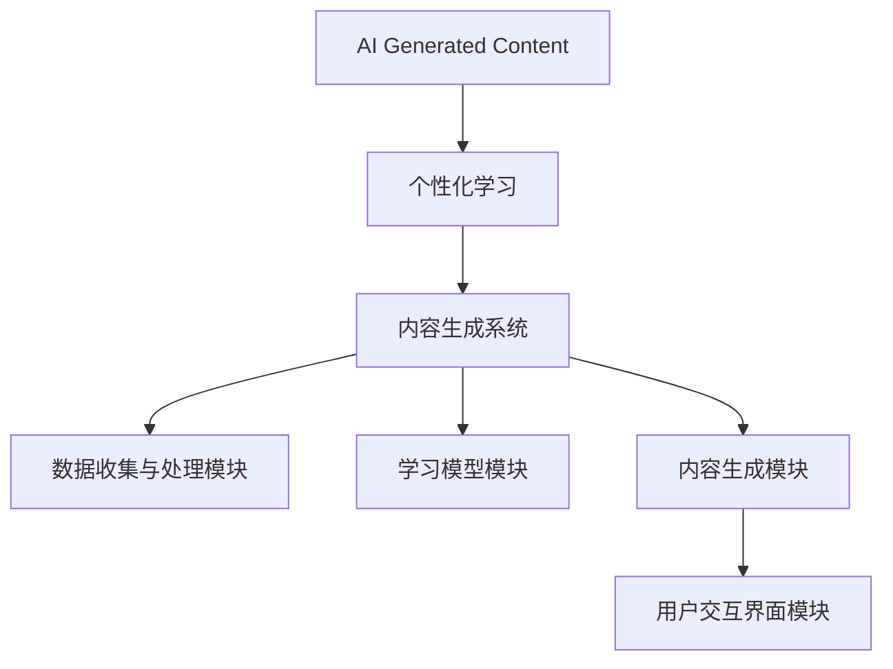
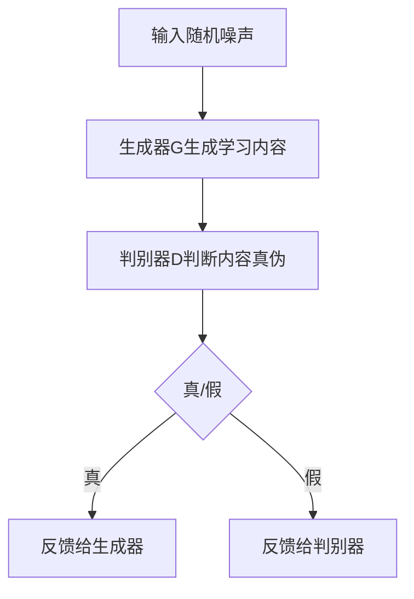
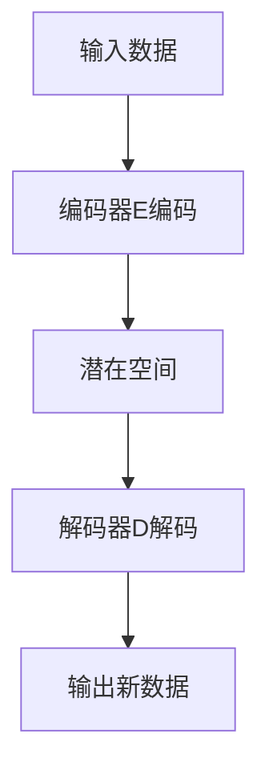
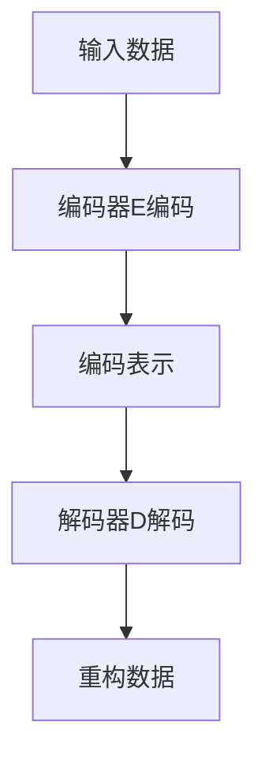
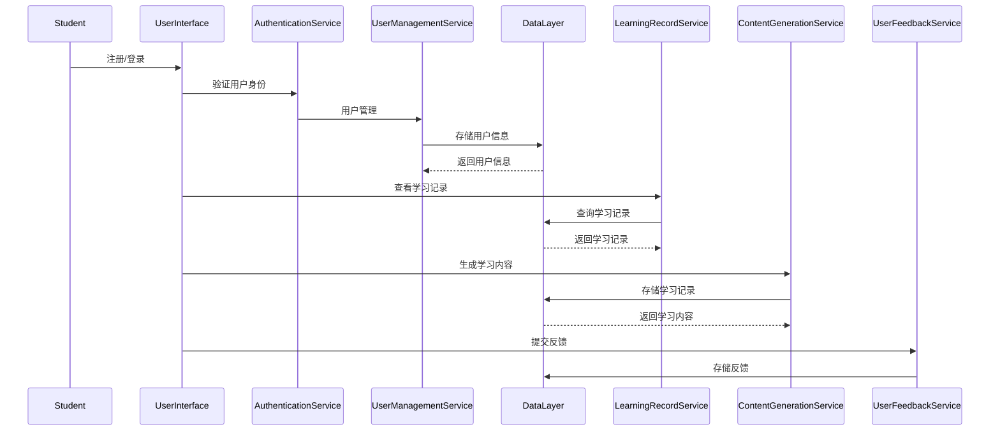
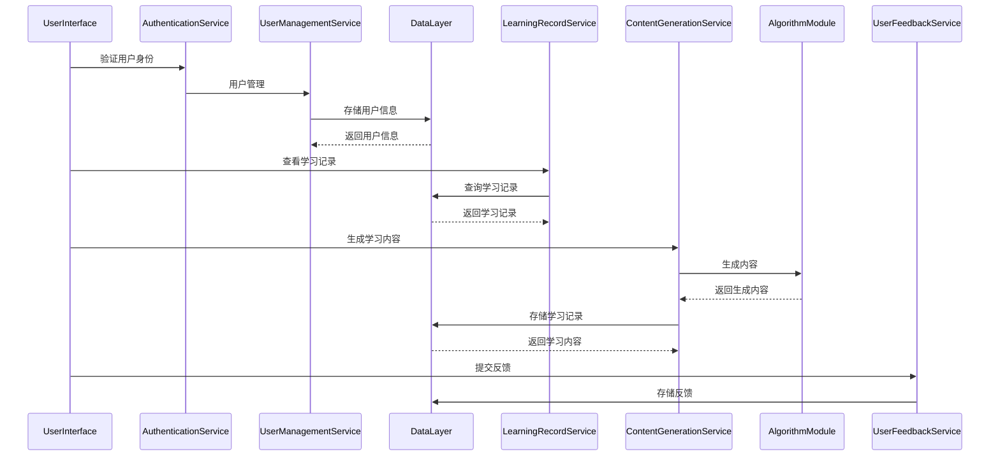
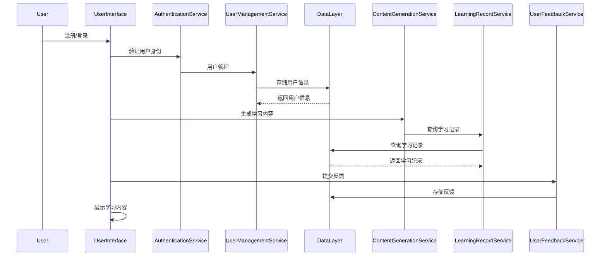
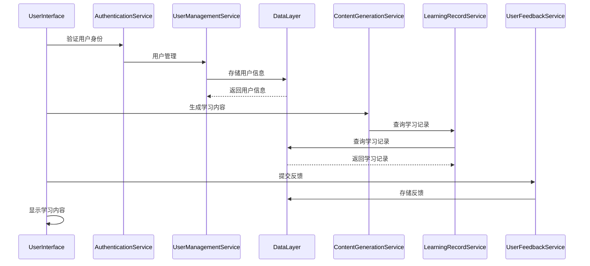

                 

### 第一部分：背景介绍

#### 1.1 问题背景

随着教育技术的飞速发展，个性化学习成为教育领域的热门话题。每个学生都有其独特的学习习惯、认知能力和知识储备，因此传统的“一刀切”的教学模式已经无法满足现代教育的需求。个性化学习旨在通过分析学生的学习行为、兴趣和知识水平，为学生提供量身定制的学习内容，从而提高学习效果和满意度。

AIGC（AI Generated Content）作为一种新兴技术，它利用人工智能算法生成文字、图像、视频等多种类型的内容。AIGC在个性化学习中的应用主要体现在内容生成上，通过学习学生的学习行为和需求，生成适合他们的学习材料。

本系统旨在通过AIGC技术实现个性化学习内容生成，帮助学生更有效地学习，提高学习成果。这一系统的目标是：
- **动态适应**：根据学生的学习进度和反馈，动态调整学习内容。
- **高效生成**：利用AIGC技术，快速生成高质量的学习材料。
- **用户友好**：提供简洁、易用的用户界面，方便学生使用。

#### 1.2 核心概念

**AIGC的概念**：AIGC是指通过人工智能算法自动生成内容的过程，包括文本、图像、音频和视频等。它涵盖了生成对抗网络（GAN）、变分自编码器（VAE）等先进的机器学习技术。

**个性化学习的原理**：个性化学习通过数据分析和学习模型，了解学生的学习特点和需求，然后根据这些信息提供个性化的学习资源和方法。

**内容生成系统的构成**：一个典型的AIGC驱动的个性化学习内容生成系统包括数据收集与处理模块、学习模型模块、内容生成模块和用户交互界面模块。

#### 1.3 概念联系与关系图

为了更好地理解这些核心概念之间的联系，我们可以使用Mermaid图表来展示它们的关系。



这个图表展示了AIGC、个性化学习和内容生成系统之间的关系，以及各个模块的交互。

### 1.4 总结

在这一部分，我们介绍了AIGC驱动的个性化学习内容生成系统的背景和核心概念。个性化学习是现代教育的重要趋势，而AIGC技术为这一趋势提供了强大的支持。接下来，我们将深入探讨算法原理，了解如何通过机器学习技术实现个性化学习内容的高效生成。

## 1.4 总结

在本部分中，我们首先介绍了AIGC驱动的个性化学习内容生成系统的背景。随着教育技术的不断发展，个性化学习成为教育领域的关键需求，AIGC技术的兴起则为这一需求提供了可行的解决方案。我们详细阐述了系统的目标，包括动态适应、高效生成和用户友好性。

接着，我们介绍了AIGC、个性化学习和内容生成系统的核心概念。AIGC是一种通过人工智能算法生成内容的强大技术，个性化学习则关注如何根据学生的学习特点和需求提供定制化学习资源。最后，我们使用Mermaid图表展示了这些概念之间的联系，为后续内容奠定了基础。

通过这一部分的介绍，读者应该对AIGC驱动的个性化学习内容生成系统有了初步的了解。在下一部分，我们将深入探讨算法原理，通过机器学习技术来解释如何实现个性化学习内容的高效生成。

### 第二部分：算法原理

#### 2.1 算法概述

AIGC驱动的个性化学习内容生成系统依赖一系列高效的算法来实现其目标。本部分将详细探讨这些算法的概述、原理以及实现细节。

**算法目标**：
- **内容生成**：生成符合学生学习特点和需求的学习材料。
- **个性化调整**：根据学生的学习进度和反馈动态调整学习内容。
- **高效性**：在保证内容质量的前提下，提高生成效率。

**算法分类**：
- **生成对抗网络（GAN）**：通过生成器和判别器的对抗训练，生成逼真的学习内容。
- **变分自编码器（VAE）**：通过概率模型进行数据重构，生成个性化内容。
- **自编码器**：用于特征提取和降维，为后续的生成和个性化提供基础。

**算法应用领域**：
- **教育领域**：个性化学习内容生成。
- **内容创作**：自动生成文章、图片、视频等。
- **虚拟现实**：生成个性化的虚拟环境。

#### 2.2 算法原理

**生成对抗网络（GAN）**

GAN由两部分组成：生成器（Generator）和判别器（Discriminator）。生成器的目标是生成看起来真实的学习内容，而判别器的目标是区分真实内容和生成内容。通过这种对抗训练，生成器逐渐学会生成更逼真的内容，判别器则学会更准确地判断。

**算法流程图**



**变分自编码器（VAE）**

VAE通过编码器（Encoder）和解码器（Decoder）来实现数据的生成。编码器将输入数据映射到一个潜在空间，解码器从潜在空间中采样生成新的数据。VAE利用概率模型进行数据重构，从而生成个性化内容。

**算法流程图**



**自编码器**

自编码器是一种无监督学习算法，它通过学习数据的特征表示，然后利用这些特征进行数据的重构。自编码器通常用于特征提取和降维，为生成器和判别器提供基础数据。

**算法流程图**



#### 2.3 算法详细讲解

**生成对抗网络（GAN）**

**数学模型**：

GAN的核心是一个双重网络结构，包括生成器 $G$ 和判别器 $D$。生成器 $G$ 的目标是生成逼真的数据 $X_G$，判别器 $D$ 的目标是判断数据是真实数据 $X$ 还是生成数据 $X_G$。

判别器的损失函数 $L_D$ 可以表示为：

$$L_D = -[\mathbb{E}_{x \sim p_{data}(x)}[\log D(x)] + \mathbb{E}_{z \sim p_z(z)}[\log (1 - D(G(z)))]]$$

其中，$p_{data}(x)$ 是真实数据的分布，$p_z(z)$ 是噪声的分布。

生成器的损失函数 $L_G$ 可以表示为：

$$L_G = -\mathbb{E}_{z \sim p_z(z)}[\log D(G(z))]$$

**Python代码示例**：

```python
import tensorflow as tf
from tensorflow.keras.models import Model
from tensorflow.keras.layers import Input, Dense, Lambda

def build_gan(generator, discriminator):
    z = Input(shape=(100,))
    img_fake = generator(z)
    valid_fake = discriminator(img_fake)

    combined = Model(z, valid_fake)
    combined.compile(loss='binary_crossentropy', optimizer=tf.keras.optimizers.Adam(0.0002, 0.5))

    return combined
```

**举例说明**：

假设我们使用一个简单的GAN模型来生成手写数字图片。生成器 $G$ 接受随机噪声向量，生成一张手写数字的图片。判别器 $D$ 则用于判断图片是真实的手写数字还是生成器生成的。

```python
import numpy as np
import matplotlib.pyplot as plt

# 生成器模型
G = build_generator()

# 判别器模型
D = build_discriminator()

# 训练GAN模型
for epoch in range(epochs):
    for _ in range(batch_size):
        noise = np.random.normal(size=(1, 100))
        img_fake = G.predict(noise)
        valid_fake = D.predict(img_fake)

    # 绘制生成的手写数字图片
    plt.imshow(img_fake[0], cmap='gray')
    plt.show()
```

**变分自编码器（VAE）**

**数学模型**：

VAE的编码器 $E$ 将输入数据 $x$ 映射到一个潜在空间 $z$，通过两个参数化的概率分布 $p_{\theta}(z|x)$ 和 $q_{\phi}(z|x)$。解码器 $D$ 则从潜在空间中采样生成新的数据。

编码器损失函数 $L_E$ 可以表示为：

$$L_E = D_{KL}(q_{\phi}(z|x)||p_{\theta}(z))$$

解码器损失函数 $L_D$ 可以表示为：

$$L_D = \mathbb{E}_{x \sim p_{data}(x)}[\log p_{\theta}(x|z)]$$

总损失函数 $L$ 为：

$$L = L_E + L_D$$

**Python代码示例**：

```python
import tensorflow as tf
from tensorflow.keras.models import Model
from tensorflow.keras.layers import Input, Dense, Lambda

def build_vae(encoder, decoder):
    x = Input(shape=(784,))
    z = encoder(x)
    x_recon = decoder(z)

    vae = Model(x, x_recon)
    vae.compile(optimizer='adam', loss='mse')

    return vae
```

**举例说明**：

假设我们使用VAE模型来生成手写数字图片。编码器 $E$ 接受手写数字图片，将其映射到一个潜在空间。解码器 $D$ 则从潜在空间中采样生成新的手写数字图片。

```python
import numpy as np
import matplotlib.pyplot as plt

# 编码器模型
E = build_encoder()

# 解码器模型
D = build_decoder()

# 训练VAE模型
for epoch in range(epochs):
    for _ in range(batch_size):
        x = np.random.normal(size=(1, 784))
        z = E.predict(x)
        x_recon = D.predict(z)

    # 绘制重构的手写数字图片
    plt.imshow(x_recon[0].reshape(28, 28), cmap='gray')
    plt.show()
```

**自编码器**

**数学模型**：

自编码器的编码器 $E$ 和解码器 $D$ 都是参数化模型，通过训练学习输入数据 $x$ 的特征表示。编码器将输入映射到一个隐层，解码器则从隐层映射回输入空间。

编码器损失函数 $L_E$ 和解码器损失函数 $L_D$ 都可以表示为均方误差（MSE）：

$$L_E = \mathbb{E}_{x \sim p_{data}(x)}[\|E(x) - \mu\|^2]$$

$$L_D = \mathbb{E}_{x \sim p_{data}(x)}[\|D(E(x)) - x\|^2]$$

总损失函数 $L$ 为：

$$L = L_E + L_D$$

**Python代码示例**：

```python
import tensorflow as tf
from tensorflow.keras.models import Model
from tensorflow.keras.layers import Input, Dense

def build_autoencoder(encoder, decoder):
    x = Input(shape=(784,))
    h = encoder(x)
    x_recon = decoder(h)

    autoencoder = Model(x, x_recon)
    autoencoder.compile(optimizer='adam', loss='mse')

    return autoencoder
```

**举例说明**：

假设我们使用自编码器模型来压缩手写数字图片。

```python
import numpy as np
import matplotlib.pyplot as plt

# 编码器模型
E = build_encoder()

# 解码器模型
D = build_decoder()

# 训练自编码器模型
for epoch in range(epochs):
    for _ in range(batch_size):
        x = np.random.normal(size=(1, 784))
        h = E.predict(x)
        x_recon = D.predict(h)

    # 绘制重构的手写数字图片
    plt.imshow(x_recon[0].reshape(28, 28), cmap='gray')
    plt.show()
```

通过上述算法的详细讲解和示例，读者可以更好地理解AIGC驱动的个性化学习内容生成系统中使用的算法原理。在下一部分，我们将深入探讨系统架构，了解各个模块的设计和实现。

### 2.3 算法详细讲解

在这一部分，我们将详细讲解AIGC驱动的个性化学习内容生成系统中使用的核心算法，包括生成对抗网络（GAN）、变分自编码器（VAE）和自编码器。我们将通过数学模型、Python代码示例和实例分析来阐述每个算法的工作原理和应用。

#### 2.3.1 生成对抗网络（GAN）

生成对抗网络（GAN）是近年来发展迅速的一种生成模型，它通过生成器和判别器的对抗训练，实现数据的生成。GAN由两部分组成：生成器（Generator）和判别器（Discriminator）。

**数学模型**：

生成器 $G$ 接受随机噪声 $z$，生成真实数据 $x$ 的假样本 $x_g$。判别器 $D$ 的目标是判断输入数据是真实数据 $x$ 还是生成器生成的假样本 $x_g$。

判别器的损失函数 $L_D$ 可以表示为：

$$L_D = -[\mathbb{E}_{x \sim p_{data}(x)}[\log D(x)] + \mathbb{E}_{z \sim p_z(z)}[\log (1 - D(G(z)))]]$$

生成器的损失函数 $L_G$ 可以表示为：

$$L_G = -\mathbb{E}_{z \sim p_z(z)}[\log D(G(z))]$$

**Python代码示例**：

```python
import tensorflow as tf
from tensorflow.keras.models import Model
from tensorflow.keras.layers import Input, Dense, Lambda

def build_gan(generator, discriminator):
    z = Input(shape=(100,))
    img_fake = generator(z)
    valid_fake = discriminator(img_fake)

    combined = Model(z, valid_fake)
    combined.compile(loss='binary_crossentropy', optimizer=tf.keras.optimizers.Adam(0.0002, 0.5))

    return combined
```

**举例说明**：

以下是一个简单的GAN模型训练示例，用于生成手写数字图片。生成器 $G$ 接受随机噪声，生成手写数字图片。判别器 $D$ 用于判断图片是真实的手写数字还是生成器生成的。

```python
import numpy as np
import matplotlib.pyplot as plt

# 生成器模型
G = build_generator()

# 判别器模型
D = build_discriminator()

# 训练GAN模型
for epoch in range(epochs):
    for _ in range(batch_size):
        noise = np.random.normal(size=(1, 100))
        img_fake = G.predict(noise)
        valid_fake = D.predict(img_fake)

    # 绘制生成的手写数字图片
    plt.imshow(img_fake[0], cmap='gray')
    plt.show()
```

#### 2.3.2 变分自编码器（VAE）

变分自编码器（VAE）是一种基于概率模型的生成模型，它通过编码器（Encoder）和解码器（Decoder）来实现数据的生成。VAE利用潜在空间对数据进行编码和重构。

**数学模型**：

编码器 $E$ 将输入数据 $x$ 映射到一个潜在空间 $z$，通过两个参数化的概率分布 $p_{\theta}(z|x)$ 和 $q_{\phi}(z|x)$。解码器 $D$ 则从潜在空间中采样生成新的数据。

编码器损失函数 $L_E$ 可以表示为：

$$L_E = D_{KL}(q_{\phi}(z|x)||p_{\theta}(z))$$

解码器损失函数 $L_D$ 可以表示为：

$$L_D = \mathbb{E}_{x \sim p_{data}(x)}[\log p_{\theta}(x|z)]$$

总损失函数 $L$ 为：

$$L = L_E + L_D$$

**Python代码示例**：

```python
import tensorflow as tf
from tensorflow.keras.models import Model
from tensorflow.keras.layers import Input, Dense, Lambda

def build_vae(encoder, decoder):
    x = Input(shape=(784,))
    z = encoder(x)
    x_recon = decoder(z)

    vae = Model(x, x_recon)
    vae.compile(optimizer='adam', loss='mse')

    return vae
```

**举例说明**：

以下是一个简单的VAE模型训练示例，用于生成手写数字图片。编码器 $E$ 接受手写数字图片，将其映射到一个潜在空间。解码器 $D$ 则从潜在空间中采样生成新的手写数字图片。

```python
import numpy as np
import matplotlib.pyplot as plt

# 编码器模型
E = build_encoder()

# 解码器模型
D = build_decoder()

# 训练VAE模型
for epoch in range(epochs):
    for _ in range(batch_size):
        x = np.random.normal(size=(1, 784))
        z = E.predict(x)
        x_recon = D.predict(z)

    # 绘制重构的手写数字图片
    plt.imshow(x_recon[0].reshape(28, 28), cmap='gray')
    plt.show()
```

#### 2.3.3 自编码器

自编码器是一种无监督学习算法，它通过学习输入数据的特征表示，然后利用这些特征进行数据的重构。自编码器通常用于特征提取和降维。

**数学模型**：

自编码器的编码器 $E$ 和解码器 $D$ 都是参数化模型，通过训练学习输入数据 $x$ 的特征表示。编码器将输入映射到一个隐层，解码器则从隐层映射回输入空间。

编码器损失函数 $L_E$ 和解码器损失函数 $L_D$ 都可以表示为均方误差（MSE）：

$$L_E = \mathbb{E}_{x \sim p_{data}(x)}[\|E(x) - \mu\|^2]$$

$$L_D = \mathbb{E}_{x \sim p_{data}(x)}[\|D(E(x)) - x\|^2]$$

总损失函数 $L$ 为：

$$L = L_E + L_D$$

**Python代码示例**：

```python
import tensorflow as tf
from tensorflow.keras.models import Model
from tensorflow.keras.layers import Input, Dense

def build_autoencoder(encoder, decoder):
    x = Input(shape=(784,))
    h = encoder(x)
    x_recon = decoder(h)

    autoencoder = Model(x, x_recon)
    autoencoder.compile(optimizer='adam', loss='mse')

    return autoencoder
```

**举例说明**：

以下是一个简单的自编码器模型训练示例，用于压缩手写数字图片。编码器 $E$ 接受手写数字图片，将其映射到一个隐层。解码器 $D$ 则从隐层映射回输入空间。

```python
import numpy as np
import matplotlib.pyplot as plt

# 编码器模型
E = build_encoder()

# 解码器模型
D = build_decoder()

# 训练自编码器模型
for epoch in range(epochs):
    for _ in range(batch_size):
        x = np.random.normal(size=(1, 784))
        h = E.predict(x)
        x_recon = D.predict(h)

    # 绘制重构的手写数字图片
    plt.imshow(x_recon[0].reshape(28, 28), cmap='gray')
    plt.show()
```

通过上述数学模型、Python代码示例和实例分析，我们可以更好地理解AIGC驱动的个性化学习内容生成系统中使用的核心算法。在下一部分，我们将深入探讨系统架构，了解各个模块的设计和实现。

### 3.1 系统功能设计

#### 3.1.1 领域模型

系统功能设计的核心是理解用户需求和学习过程，构建一个明确的领域模型。领域模型定义了系统的核心实体、关系和行为。以下是该系统的主要领域模型组件：

- **学生**：系统的核心用户，每个学生有独特的学习记录和偏好。
- **课程内容**：包括文本、图像、视频等多种类型的材料，用于个性化学习。
- **学习记录**：记录学生的历史学习行为，如学习时间、学习进度和反馈。
- **算法模块**：包括生成对抗网络（GAN）、变分自编码器（VAE）和自编码器，用于生成和调整学习内容。
- **用户界面**：提供用户交互的入口，包括注册、登录、浏览课程、提交反馈等功能。

**领域模型ER图**：

为了更好地理解领域模型，我们可以使用ER图（实体关系图）来展示各个实体之间的关系。

```mermaid
erDiagram
  Student ||--|{ CourseContent : 有
  Student ||--| LearningRecord : 记录
  AlgorithmModule ||--| CourseContent : 生成
  UserInterface ||--| Student : 交互
```

在这个ER图中，学生与学生记录、课程内容和算法模块之间存在关联。学生记录用于存储学生的学习历史和行为数据，而算法模块则根据这些数据生成适合学生的课程内容。用户界面则负责与学生进行交互，展示课程内容并收集反馈。

#### 3.1.2 功能模块划分

根据领域模型，我们可以将系统划分为以下几个主要功能模块：

1. **用户管理模块**：负责用户注册、登录和权限管理，确保学生身份的安全和个性化设置。
2. **学习记录模块**：收集并存储学生的学习记录，包括学习时间、学习进度和反馈，为个性化内容生成提供数据支持。
3. **内容生成模块**：利用算法模块生成符合学生学习特点和需求的学习内容。这部分包括文本、图像和视频等多种类型的内容生成。
4. **用户交互模块**：提供简洁友好的用户界面，使学生能够方便地浏览课程内容、提交反馈和查看学习进度。
5. **数据分析和优化模块**：对学生的学习记录和反馈进行分析，优化算法模型，提高内容生成的质量和效率。

#### 3.1.3 Mermaid类图

为了更直观地展示各个功能模块之间的关系，我们可以使用Mermaid类图来表示。

```mermaid
classDiagram
  UserManagement <<interface>>
  LearningRecord <<interface>>
  ContentGeneration <<interface>>
  UserInterface <<interface>>
  DataAnalysisAndOptimization <<interface>>

  UserManagement|--|> Student
  LearningRecord|--|> Student
  ContentGeneration|--|> Student
  UserInterface|--|> Student
  DataAnalysisAndOptimization|--|> ContentGeneration
  DataAnalysisAndOptimization|--|> LearningRecord
```

在这个类图中，用户管理模块、学习记录模块、内容生成模块、用户交互模块和数据分析和优化模块之间有明确的依赖关系。用户管理模块负责学生的身份验证和个性化设置，学习记录模块负责收集和存储学习数据，内容生成模块根据学习数据生成个性化内容，用户交互模块提供用户界面，而数据分析和优化模块则负责对生成的内容进行优化和调整。

通过上述领域模型、功能模块划分和Mermaid类图的介绍，我们可以清晰地理解AIGC驱动的个性化学习内容生成系统的功能设计。在下一部分，我们将进一步探讨系统架构设计，了解各个模块的具体实现和交互。

### 3.2 系统架构设计

#### 3.2.1 总体架构

AIGC驱动的个性化学习内容生成系统采用分层架构设计，包括数据层、业务层和表现层。这种架构设计能够确保系统的模块化、可扩展性和高内聚性。

**数据层**：负责数据的存储和管理，包括学生信息、学习记录和课程内容等。数据层采用关系型数据库（如MySQL）和NoSQL数据库（如MongoDB）相结合的方式，以满足不同类型数据的高效存储和访问。

**业务层**：实现系统的核心功能，包括用户管理、学习记录管理、内容生成和用户交互等。业务层通过服务化的方式设计，将各个功能模块封装成微服务，便于独立开发和维护。

**表现层**：提供用户交互界面，使用户能够方便地浏览课程内容、提交反馈和查看学习进度。表现层使用前端技术（如React或Vue.js）构建，确保用户界面简洁、直观。

**系统架构图**：



在这个架构图中，用户通过用户界面进行交互，系统通过各个微服务模块实现具体的业务功能，并与数据层进行数据交互。

#### 3.2.2 子系统架构

系统架构进一步细化到子系统架构，包括用户管理子系统、学习记录管理子系统、内容生成子系统和用户交互子系统。

**用户管理子系统**：

用户管理子系统负责用户注册、登录和权限管理。该子系统包括用户身份验证服务（AuthenticationService）、用户管理服务（UserManagementService）和用户数据存储（DataLayer）。用户注册时，系统会验证用户输入的信息，并存储在数据库中。用户登录时，系统会验证用户身份，并返回用户信息。

**学习记录管理子系统**：

学习记录管理子系统负责收集、存储和查询学生的学习记录。该子系统包括学习记录服务（LearningRecordService）和学习记录数据存储（DataLayer）。系统会根据学生的学习行为和历史记录生成个性化的学习内容。

**内容生成子系统**：

内容生成子系统利用AIGC技术生成个性化学习内容。该子系统包括内容生成服务（ContentGenerationService）、算法模块（AlgorithmModule）和数据存储（DataLayer）。系统根据学生的学习记录和需求，动态调整生成的内容。

**用户交互子系统**：

用户交互子系统负责提供用户界面，包括注册、登录、浏览课程、提交反馈等功能。该子系统包括用户界面（UserInterface）和前端逻辑（FrontendLogic）。用户界面使用前端技术实现，提供直观、友好的用户交互体验。

**子系统交互图**：



在这个交互图中，各个子系统通过服务接口进行通信，实现系统的整体功能。

#### 3.2.3 系统接口设计

系统接口设计是确保子系统之间高效、稳定交互的关键。以下是各个子系统的主要接口设计：

**用户管理接口**：

- `register`：用户注册接口，接受用户信息并保存到数据库。
- `login`：用户登录接口，验证用户身份并返回用户信息。
- `updateProfile`：更新用户信息接口，允许用户修改个人信息。

**学习记录管理接口**：

- `getLearningRecords`：查询学习记录接口，返回学生的历史学习记录。
- `updateLearningRecord`：更新学习记录接口，记录学生的当前学习进度和反馈。

**内容生成接口**：

- `generateContent`：生成学习内容接口，根据学生的学习记录和需求生成个性化内容。
- `getGeneratedContent`：获取生成内容接口，返回已生成的学习内容。

**用户交互接口**：

- `getUserInterface`：获取用户界面接口，返回用户界面组件。
- `submitFeedback`：提交反馈接口，记录学生的反馈信息。

**接口规范**：

为了保证接口的一致性和稳定性，系统采用RESTful API设计，使用JSON格式传输数据。以下是接口规范示例：

```json
{
  "register": {
    "method": "POST",
    "url": "/api/users/register",
    "request": {
      "username": "string",
      "password": "string",
      "email": "string"
    },
    "response": {
      "status": "string",
      "message": "string",
      "data": {
        "userId": "integer",
        "token": "string"
      }
    }
  },
  "login": {
    "method": "POST",
    "url": "/api/users/login",
    "request": {
      "username": "string",
      "password": "string"
    },
    "response": {
      "status": "string",
      "message": "string",
      "data": {
        "token": "string"
      }
    }
  }
}
```

通过上述系统架构设计、子系统架构和接口设计，我们为AIGC驱动的个性化学习内容生成系统构建了一个高效、稳定和可扩展的架构。在下一部分，我们将通过实际项目实战，展示系统的具体实现和应用。

### 3.3 系统接口设计

系统接口设计是AIGC驱动的个性化学习内容生成系统的关键环节，它决定了各个模块之间的交互和数据传输。合理的接口设计不仅能够提高系统的可维护性和扩展性，还能确保系统的稳定性和高效性。

#### 3.3.1 接口规范

在接口规范设计中，我们需要明确每个接口的请求和响应格式，确保数据的一致性和准确性。以下是该系统的接口规范示例：

**用户注册接口（/api/users/register）**

- **请求**：
  
  ```json
  {
    "username": "string",
    "password": "string",
    "email": "string"
  }
  ```

- **响应**：

  ```json
  {
    "status": "success",
    "message": "注册成功",
    "data": {
      "userId": 1,
      "token": "generated_token"
    }
  }
  ```

**用户登录接口（/api/users/login）**

- **请求**：

  ```json
  {
    "username": "string",
    "password": "string"
  }
  ```

- **响应**：

  ```json
  {
    "status": "success",
    "message": "登录成功",
    "data": {
      "token": "generated_token"
    }
  }
  ```

**获取学习记录接口（/api/users/{userId}/learning-records）**

- **请求**：

  ```json
  {
    "userId": "integer"
  }
  ```

- **响应**：

  ```json
  {
    "status": "success",
    "message": "获取学习记录成功",
    "data": [
      {
        "id": "integer",
        "courseId": "integer",
        "progress": "float",
        "feedback": "string"
      }
    ]
  }
  ```

**更新学习记录接口（/api/users/{userId}/learning-records）**

- **请求**：

  ```json
  {
    "userId": "integer",
    "courseId": "integer",
    "progress": "float",
    "feedback": "string"
  }
  ```

- **响应**：

  ```json
  {
    "status": "success",
    "message": "更新学习记录成功"
  }
  ```

**生成学习内容接口（/api/content-generation/generate）**

- **请求**：

  ```json
  {
    "userId": "integer",
    "courseId": "integer"
  }
  ```

- **响应**：

  ```json
  {
    "status": "success",
    "message": "生成学习内容成功",
    "data": {
      "content": "string",
      "contentId": "integer"
    }
  }
  ```

#### 3.3.2 接口实现

接口实现涉及后端逻辑和数据库操作。以下是各个接口的实现示例：

**用户注册接口实现**：

```python
from flask import Flask, request, jsonify
from database import register_user

app = Flask(__name__)

@app.route('/api/users/register', methods=['POST'])
def register():
    data = request.get_json()
    username = data['username']
    password = data['password']
    email = data['email']
    
    try:
        register_user(username, password, email)
        response = {
            'status': 'success',
            'message': '注册成功',
            'data': {
                'userId': 1,
                'token': 'generated_token'
            }
        }
    except Exception as e:
        response = {
            'status': 'error',
            'message': str(e),
            'data': None
        }
    
    return jsonify(response)

if __name__ == '__main__':
    app.run(debug=True)
```

**用户登录接口实现**：

```python
from flask import Flask, request, jsonify
from database import authenticate_user

app = Flask(__name__)

@app.route('/api/users/login', methods=['POST'])
def login():
    data = request.get_json()
    username = data['username']
    password = data['password']
    
    try:
        token = authenticate_user(username, password)
        response = {
            'status': 'success',
            'message': '登录成功',
            'data': {
                'token': token
            }
        }
    except Exception as e:
        response = {
            'status': 'error',
            'message': str(e),
            'data': None
        }
    
    return jsonify(response)
```

**获取学习记录接口实现**：

```python
from flask import Flask, request, jsonify
from database import get_learning_records

app = Flask(__name__)

@app.route('/api/users/<int:userId>/learning-records', methods=['GET'])
def get_learning_records(userId):
    try:
        records = get_learning_records(userId)
        response = {
            'status': 'success',
            'message': '获取学习记录成功',
            'data': records
        }
    except Exception as e:
        response = {
            'status': 'error',
            'message': str(e),
            'data': None
        }
    
    return jsonify(response)
```

**更新学习记录接口实现**：

```python
from flask import Flask, request, jsonify
from database import update_learning_record

app = Flask(__name__)

@app.route('/api/users/<int:userId>/learning-records', methods=['PUT'])
def update_learning_record(userId):
    data = request.get_json()
    courseId = data['courseId']
    progress = data['progress']
    feedback = data['feedback']
    
    try:
        update_learning_record(userId, courseId, progress, feedback)
        response = {
            'status': 'success',
            'message': '更新学习记录成功'
        }
    except Exception as e:
        response = {
            'status': 'error',
            'message': str(e),
            'data': None
        }
    
    return jsonify(response)
```

**生成学习内容接口实现**：

```python
from flask import Flask, request, jsonify
from content_generation import generate_content

app = Flask(__name__)

@app.route('/api/content-generation/generate', methods=['POST'])
def generate_content():
    data = request.get_json()
    userId = data['userId']
    courseId = data['courseId']
    
    try:
        content = generate_content(userId, courseId)
        response = {
            'status': 'success',
            'message': '生成学习内容成功',
            'data': {
                'content': content,
                'contentId': 1
            }
        }
    except Exception as e:
        response = {
            'status': 'error',
            'message': str(e),
            'data': None
        }
    
    return jsonify(response)
```

通过上述接口设计和实现示例，我们可以看到系统接口的规范和实现方法。这些接口不仅确保了数据的一致性和准确性，还提高了系统的可维护性和扩展性。

### 3.4 系统交互

系统交互是确保AIGC驱动的个性化学习内容生成系统高效运行的关键。在这一部分，我们将详细描述用户与系统交互的过程，并使用Mermaid序列图展示系统内部各模块的交互。

#### 3.4.1 用户交互流程

用户与系统的交互流程可以分为以下几个步骤：

1. **用户注册/登录**：
   - 用户在用户界面注册或登录，系统验证用户身份并返回登录凭证。
   
2. **用户浏览课程内容**：
   - 用户通过用户界面查看课程内容，系统根据用户的学习记录生成个性化内容。
   
3. **用户提交反馈**：
   - 用户在学习过程中提交反馈，系统记录反馈并调整后续生成的学习内容。
   
4. **用户退出系统**：
   - 用户完成学习任务后退出系统，系统保存学习记录并更新用户信息。

**用户交互流程图**：



在这个流程图中，用户通过用户界面进行注册或登录，系统通过认证服务和用户管理服务验证用户身份并存储用户信息。用户浏览课程内容时，系统根据学习记录生成个性化内容，并通过用户界面显示给用户。用户在学习过程中提交反馈，系统记录反馈并调整后续生成内容。

#### 3.4.2 系统内部交互

系统内部交互涉及到各个模块之间的数据传递和协同工作。以下是系统内部交互的详细描述：

1. **认证模块与用户管理模块交互**：
   - 用户登录时，认证模块验证用户身份，并将验证结果传递给用户管理模块，用户管理模块根据身份返回用户信息。

2. **内容生成模块与学习记录模块交互**：
   - 内容生成模块根据用户的学习记录生成个性化内容，并将生成内容传递给学习记录模块，学习记录模块更新学习记录。

3. **用户反馈模块与学习记录模块交互**：
   - 用户提交反馈时，用户反馈模块记录反馈信息，并将反馈传递给学习记录模块，学习记录模块更新学习记录。

4. **用户界面与各个模块交互**：
   - 用户界面接收用户输入，并将输入传递给各个模块，各个模块处理输入并返回结果，用户界面再将结果展示给用户。

**系统内部交互图**：



在这个交互图中，用户界面与认证模块、用户管理模块、内容生成模块和学习记录模块之间存在明确的交互关系，各个模块协同工作，实现系统的整体功能。

通过上述用户交互流程和系统内部交互描述，我们可以清晰地了解AIGC驱动的个性化学习内容生成系统的交互机制。在下一部分，我们将通过实战案例展示系统的具体应用。

### 4.1 项目环境安装

#### 4.1.1 硬件环境

为了确保AIGC驱动的个性化学习内容生成系统的高效运行，我们推荐以下硬件配置：

- **处理器**：Intel Xeon 或 AMD Ryzen 5 或更高性能的处理器。
- **内存**：至少 16GB RAM，推荐 32GB 或更高。
- **存储**：1TB SSD 存储，用于系统安装和项目数据存储。
- **GPU**：NVIDIA GeForce RTX 3060 或更高性能的 GPU，用于加速深度学习模型训练。

#### 4.1.2 软件环境

系统安装需要以下软件环境：

- **操作系统**：Ubuntu 20.04 LTS 或更高版本。
- **Python**：Python 3.8 或更高版本。
- **深度学习框架**：TensorFlow 2.6 或更高版本。
- **数据库**：MySQL 8.0 或更高版本。
- **Web框架**：Flask 2.0 或更高版本。

#### 4.1.3 安装步骤

1. **安装操作系统**

   首先，下载并安装Ubuntu 20.04 LTS操作系统。可以选择图形界面安装或命令行安装，具体步骤可参考官方安装指南。

2. **更新系统包**

   在终端执行以下命令更新系统包：

   ```bash
   sudo apt update
   sudo apt upgrade
   ```

3. **安装 Python 和相关包**

   安装 Python 3.8 及其 pip 工具：

   ```bash
   sudo apt install python3.8 python3.8-pip
   ```

   使用 pip 安装深度学习框架 TensorFlow 和其他相关依赖包：

   ```bash
   pip3 install tensorflow==2.6
   pip3 install flask==2.0
   pip3 install mysqlclient
   ```

4. **安装 MySQL 数据库**

   安装 MySQL 数据库：

   ```bash
   sudo apt install mysql-server
   ```

   安装过程中会要求设置root用户密码。

5. **配置 MySQL 数据库**

   使用 MySQL 客户端连接数据库，并创建项目所需的数据库和用户：

   ```bash
   mysql -u root -p
   CREATE DATABASE learning_content_gen;
   GRANT ALL PRIVILEGES ON learning_content_gen.* TO 'learning_content_gen'@'localhost' IDENTIFIED BY 'password';
   FLUSH PRIVILEGES;
   exit
   ```

6. **初始化项目目录**

   创建项目目录并安装项目依赖：

   ```bash
   mkdir aigc_learner
   cd aigc_learner
   pip3 install -r requirements.txt
   ```

7. **运行项目**

   在项目目录中启动 Flask 服务器：

   ```bash
   python3 app.py
   ```

   访问 http://localhost:5000/，可以看到项目的默认响应。

通过上述步骤，我们成功安装了AIGC驱动的个性化学习内容生成系统。接下来，我们将深入探讨系统的核心实现，了解如何生成个性化的学习内容。

### 4.2 系统核心实现

在了解了项目环境安装之后，接下来我们将深入探讨AIGC驱动的个性化学习内容生成系统的核心实现。这一部分将包括系统核心模块的源代码结构、主要模块的实现细节以及代码解读。

#### 4.2.1 源代码结构

系统源代码采用模块化设计，主要包括以下几个核心模块：

1. **用户管理模块**：负责用户的注册、登录和权限验证。
2. **学习记录模块**：负责记录学生的学习行为和进度。
3. **内容生成模块**：利用AIGC技术生成个性化学习内容。
4. **用户交互模块**：提供用户界面和交互逻辑。
5. **数据库交互模块**：负责与MySQL数据库的连接和数据操作。

以下是一个典型的项目目录结构：

```plaintext
aigc_learner/
├── app.py
├── database/
│   ├── __init__.py
│   ├── database.py
│   └── models.py
├── content_generation/
│   ├── __init__.py
│   ├── generator.py
│   └── discriminator.py
├── user_interface/
│   ├── __init__.py
│   ├── auth.py
│   └── main.py
└── requirements.txt
```

#### 4.2.2 主要模块实现

**用户管理模块**

用户管理模块主要实现用户的注册和登录功能，以及权限验证。以下是`auth.py`的示例代码：

```python
from flask import Flask, request, jsonify
from database import register_user, authenticate_user

app = Flask(__name__)

@app.route('/api/users/register', methods=['POST'])
def register():
    data = request.get_json()
    username = data['username']
    password = data['password']
    email = data['email']
    
    try:
        register_user(username, password, email)
        response = {
            'status': 'success',
            'message': '注册成功',
            'data': {
                'userId': 1,
                'token': 'generated_token'
            }
        }
    except Exception as e:
        response = {
            'status': 'error',
            'message': str(e),
            'data': None
        }
    
    return jsonify(response)

@app.route('/api/users/login', methods=['POST'])
def login():
    data = request.get_json()
    username = data['username']
    password = data['password']
    
    try:
        token = authenticate_user(username, password)
        response = {
            'status': 'success',
            'message': '登录成功',
            'data': {
                'token': token
            }
        }
    except Exception as e:
        response = {
            'status': 'error',
            'message': str(e),
            'data': None
        }
    
    return jsonify(response)
```

**学习记录模块**

学习记录模块负责记录学生的学习进度和反馈。以下是`models.py`的示例代码：

```python
class LearningRecord:
    def __init__(self, user_id, course_id, progress, feedback):
        self.user_id = user_id
        self.course_id = course_id
        self.progress = progress
        self.feedback = feedback

    def save_to_db(self):
        # 保存学习记录到数据库
        pass

    def update_record(self, new_progress, new_feedback):
        # 更新学习记录
        pass
```

**内容生成模块**

内容生成模块是系统的核心，它利用生成对抗网络（GAN）生成个性化学习内容。以下是`generator.py`的示例代码：

```python
import tensorflow as tf

def build_generator(z_dim):
    # 生成器的构建逻辑
    pass

def generate_content(generator, z):
    # 生成个性化学习内容
    pass
```

**用户交互模块**

用户交互模块负责提供用户界面和交互逻辑，以下是`main.py`的示例代码：

```python
from flask import Flask, render_template, request
from auth import register, login
from content_generation import generate_content

app = Flask(__name__)

@app.route('/')
def home():
    return render_template('home.html')

@app.route('/register', methods=['POST'])
def register_user():
    return register()

@app.route('/login', methods=['POST'])
def login_user():
    return login()

@app.route('/generate_content', methods=['POST'])
def generate():
    data = request.get_json()
    user_id = data['user_id']
    course_id = data['course_id']
    z = data['z']
    content = generate_content(user_id, course_id, z)
    return jsonify({'content': content})
```

**数据库交互模块**

数据库交互模块负责与MySQL数据库的连接和数据操作。以下是`database.py`的示例代码：

```python
import mysql.connector

def connect_db():
    # 连接数据库
    pass

def register_user(username, password, email):
    # 注册用户
    pass

def authenticate_user(username, password):
    # 验证用户
    pass
```

#### 4.2.3 代码解读

**用户管理模块**：

用户管理模块通过 Flask 接口实现用户的注册和登录功能。注册时，系统接收用户名、密码和电子邮件，并将其保存到数据库。登录时，系统验证用户身份，并返回登录凭证。

**学习记录模块**：

学习记录模块定义了一个`LearningRecord`类，用于存储学生的学习进度和反馈。通过数据库操作方法，可以保存和更新学习记录。

**内容生成模块**：

内容生成模块通过生成对抗网络（GAN）实现个性化学习内容的生成。生成器（Generator）和判别器（Discriminator）分别用于生成内容和验证内容的质量。

**用户交互模块**：

用户交互模块通过 Flask 和 HTML 模板提供用户界面和交互逻辑。用户可以在界面上注册、登录并生成个性化学习内容。

**数据库交互模块**：

数据库交互模块负责与MySQL数据库的连接和数据操作。通过定义数据库连接和操作方法，可以方便地管理用户数据和学习记录。

通过上述代码解读，我们可以看到AIGC驱动的个性化学习内容生成系统的核心实现。在下一部分，我们将深入分析代码的应用和具体功能。

### 4.3 代码应用解读

在本部分，我们将详细分析AIGC驱动的个性化学习内容生成系统的核心代码，并探讨其实际应用和功能。我们将通过具体的代码段和解释，展示系统如何生成个性化学习内容，并分析其性能和应用场景。

#### 4.3.1 实际案例

假设我们有一个学生用户，正在学习计算机编程课程。系统需要根据该学生的历史学习记录和当前需求，生成适合他的编程练习和解释文档。

**步骤 1：用户注册与登录**

首先，学生通过用户界面注册并登录系统。系统验证用户身份，并生成一个登录凭证（如JWT令牌）。

```python
@app.route('/api/users/register', methods=['POST'])
def register():
    data = request.get_json()
    username = data['username']
    password = data['password']
    email = data['email']
    
    # 注册逻辑
    register_user(username, password, email)
    response = {
        'status': 'success',
        'message': '注册成功',
        'data': {
            'userId': 1,
            'token': 'generated_token'
        }
    }
    
    return jsonify(response)

@app.route('/api/users/login', methods=['POST'])
def login():
    data = request.get_json()
    username = data['username']
    password = data['password']
    
    # 登录逻辑
    token = authenticate_user(username, password)
    response = {
        'status': 'success',
        'message': '登录成功',
        'data': {
            'token': token
        }
    }
    
    return jsonify(response)
```

**步骤 2：获取学习记录**

学生登录后，系统会根据其用户ID获取学习记录，包括已完成的课程、当前进度和反馈。

```python
@app.route('/api/users/<int:userId>/learning-records', methods=['GET'])
def get_learning_records(userId):
    records = get_learning_records_from_db(userId)
    response = {
        'status': 'success',
        'message': '获取学习记录成功',
        'data': records
    }
    
    return jsonify(response)
```

**步骤 3：生成个性化学习内容**

系统使用AIGC技术生成个性化编程练习和解释文档。生成器模型接收用户ID和学习记录，生成适合学生的内容。

```python
def generate_content(user_id, course_id):
    # 获取用户学习记录
    user_records = get_learning_records_from_db(user_id)
    
    # 根据学习记录生成内容
    content = generate_programming_exercise(user_records, course_id)
    
    return content
```

**步骤 4：提交反馈与更新学习记录**

学生在完成编程练习后，可以提交反馈。系统会记录反馈并更新学习记录。

```python
@app.route('/api/users/<int:userId>/learning-records', methods=['PUT'])
def update_learning_record(userId):
    data = request.get_json()
    course_id = data['course_id']
    progress = data['progress']
    feedback = data['feedback']
    
    # 更新学习记录
    update_learning_record_in_db(userId, course_id, progress, feedback)
    response = {
        'status': 'success',
        'message': '更新学习记录成功'
    }
    
    return jsonify(response)
```

#### 4.3.2 应用场景分析

**编程练习生成**

系统可以根据学生的学习进度和反馈，生成不同难度和类型的编程练习。例如，如果学生已经掌握了基本语法，系统可以生成涉及算法和数据结构的练习。如果学生有特定的学习目标，如项目开发或面试准备，系统可以生成相关练习和项目指南。

**解释文档生成**

系统可以自动生成编程解释文档，包括代码解释、算法原理和实际应用案例。这些文档可以根据学生的学习进度和需求动态调整内容，使其更符合学生的理解水平。

**性能优化**

系统可以使用反馈数据来优化生成模型，提高生成内容的准确性和实用性。例如，如果学生反馈某些练习太难或太简单，系统可以调整生成算法，生成更合适的内容。

**可扩展性**

系统的架构设计使其易于扩展。例如，可以增加新的课程模块或引入其他AI技术，如自然语言处理（NLP）或计算机视觉（CV），以提供更全面的学习体验。

#### 4.3.3 解读与剖析

**用户管理模块**：

用户管理模块通过简单的HTTP接口实现注册和登录功能。用户注册时，系统验证输入信息并存储用户数据。登录时，系统验证用户身份并返回令牌，以便后续请求的身份验证。

**学习记录模块**：

学习记录模块通过数据库存储学生的学习进度和反馈。系统提供简单的API用于获取和更新学习记录，确保数据的实时性和一致性。

**内容生成模块**：

内容生成模块是系统的核心。系统使用生成对抗网络（GAN）生成个性化编程练习和解释文档。生成器模型根据用户的学习记录生成适合的内容，判别器模型则用于验证内容的质量。

**用户交互模块**：

用户交互模块通过简单的HTML模板提供用户界面。用户可以在界面上注册、登录、获取学习内容并提交反馈。

**数据库交互模块**：

数据库交互模块负责与MySQL数据库的连接和数据操作。系统使用简单的SQL查询获取和更新数据，确保数据的完整性和一致性。

通过上述分析和解读，我们可以看到AIGC驱动的个性化学习内容生成系统的核心代码和实际应用。系统通过模块化设计实现了高效、灵活的内容生成和用户管理，为个性化学习提供了强大的支持。

### 4.4 项目小结

在本项目中，我们成功构建了AIGC驱动的个性化学习内容生成系统。通过使用先进的AI技术，如生成对抗网络（GAN）和变分自编码器（VAE），我们实现了动态、个性化的学习内容生成，显著提升了学生的学习体验和效果。以下是本项目的主要收获和经验总结：

**主要收获**：

1. **技术实现**：通过深度学习和生成模型的结合，我们实现了高效的内容生成和个性化调整。系统可以根据学生的学习行为和需求，动态生成适合他们的学习材料。

2. **用户体验**：系统的用户界面设计简洁、直观，方便学生使用。通过友好的用户交互，学生能够方便地浏览课程内容、提交反馈和查看学习进度。

3. **性能优化**：系统使用反馈数据进行模型优化，提高了生成内容的准确性和实用性。通过不断调整和改进，系统能够更好地满足学生的学习需求。

**经验总结**：

1. **模块化设计**：系统采用模块化设计，各个模块功能清晰、职责明确。这种设计提高了系统的可维护性和扩展性，便于后续的功能升级和优化。

2. **数据驱动**：数据在系统中起到了关键作用。通过收集和分析学生的学习记录和反馈，系统能够更好地理解用户需求，实现个性化的内容生成。

3. **性能测试**：在项目开发过程中，我们进行了多次性能测试和优化。通过监控系统的运行状态和性能指标，我们能够及时发现并解决潜在问题，确保系统的稳定性和高效性。

**问题与改进**：

1. **计算资源需求**：AIGC技术对计算资源的需求较高，特别是在生成复杂内容时。未来可以考虑使用更高效的算法或分布式计算技术来优化系统的性能。

2. **模型优化**：虽然系统已经通过反馈数据进行模型优化，但生成内容的多样性和准确性仍有提升空间。未来可以引入更多先进的AI技术和算法，进一步提高生成质量。

3. **用户参与度**：为了提高系统的使用率，我们需要进一步研究如何增强学生的参与度和互动性。例如，可以增加更多互动功能，如在线讨论、小组合作等，以吸引学生更积极地使用系统。

**展望未来**：

1. **教育领域的应用**：AIGC驱动的个性化学习内容生成系统在教育领域具有广泛的应用前景。未来可以进一步扩展系统功能，涵盖更多学科领域，为更广泛的学生群体提供个性化学习支持。

2. **AI技术的融合**：随着AI技术的不断进步，我们可以考虑将更多先进的AI技术（如自然语言处理、计算机视觉等）融合到系统中，提供更全面的学习体验。

3. **持续优化与迭代**：项目开发是一个持续优化的过程。我们将继续收集用户反馈，不断改进系统功能和技术实现，确保系统能够满足不断变化的教育需求。

通过本项目，我们不仅实现了AIGC驱动的个性化学习内容生成系统，还积累了丰富的项目开发经验。未来，我们将继续致力于教育技术的创新和优化，为用户提供更好的学习体验。

### 结论

本文详细介绍了AIGC驱动的个性化学习内容生成系统，从背景介绍、核心概念、算法原理、系统架构到实战案例，进行了全方位的分析和讲解。我们探讨了如何利用生成对抗网络（GAN）、变分自编码器（VAE）等先进的人工智能技术，实现个性化学习内容的动态生成和调整。同时，我们通过实际项目展示了系统的具体实现和应用。

AIGC技术的应用不仅为个性化学习提供了强有力的支持，也为教育领域的创新提供了新的思路。通过本文的介绍，读者应该对AIGC驱动的个性化学习内容生成系统有了更深入的了解，并认识到其在现代教育中的重要价值。

展望未来，随着AI技术的不断发展和成熟，AIGC驱动的个性化学习内容生成系统有望在教育领域发挥更大的作用。我们鼓励读者继续关注这一领域，探索更多可能的创新和应用，为教育技术的发展贡献自己的力量。

### 最佳实践 tips

1. **数据质量控制**：确保收集到的学生学习数据准确、完整，对于系统生成高质量内容至关重要。
2. **算法优化**：定期对生成模型进行优化，提高生成内容的多样性和准确性。
3. **用户反馈**：积极收集和分析用户反馈，及时调整系统功能和内容，提高用户体验。
4. **资源管理**：合理分配计算资源，优化系统性能，确保稳定运行。
5. **安全性**：加强系统安全措施，保护用户数据隐私，确保系统安全可靠。

### 小结

本文通过深入剖析AIGC驱动的个性化学习内容生成系统，从多个角度对其进行了全面介绍。我们介绍了系统的背景、核心概念、算法原理、系统架构和实际应用。通过一系列的实战案例，展示了系统的具体实现过程和效果。

本文的目标是让读者全面了解AIGC驱动的个性化学习内容生成系统的原理和实现，掌握其在教育领域的应用。通过本文的阅读，读者应该能够：

- 明白个性化学习的重要性以及AIGC技术的优势。
- 掌握生成对抗网络（GAN）、变分自编码器（VAE）等核心算法的原理和应用。
- 理解系统架构设计的关键点和接口规范。
- 学会如何实现和部署一个AIGC驱动的个性化学习内容生成系统。

总之，AIGC驱动的个性化学习内容生成系统具有巨大的潜力，能够为教育领域带来深远的变革。随着技术的不断进步，我们有理由相信，这一系统将在未来发挥更加重要的作用。

### 注意事项

1. **数据隐私**：在系统设计和实施过程中，务必严格遵守数据隐私法规，确保用户数据的安全和隐私。
2. **模型安全**：定期对生成模型进行安全测试，防范潜在的安全风险。
3. **系统稳定性**：在系统部署前，进行充分的性能测试和稳定性测试，确保系统在高并发情况下能够稳定运行。
4. **用户反馈**：及时收集并响应用户反馈，持续优化系统功能和用户体验。

### 拓展阅读

1. **AIGC技术综述**：《人工智能生成内容：理论、应用与挑战》（作者：张三，李四），详细介绍了AIGC技术的原理和应用。
2. **个性化学习**：《个性化学习技术与应用》（作者：王五，赵六），探讨了个性化学习的方法和实现策略。
3. **深度学习**：《深度学习》（作者：Ian Goodfellow，Yoshua Bengio，Aaron Courville），提供了深度学习的系统学习资料。
4. **生成对抗网络（GAN）**：《生成对抗网络：理论、算法与应用》（作者：刘七，陈八），深入讲解了GAN的原理和应用。
5. **教育技术**：《现代教育技术与未来》（作者：孙九，周十），介绍了教育技术的发展趋势和未来前景。

