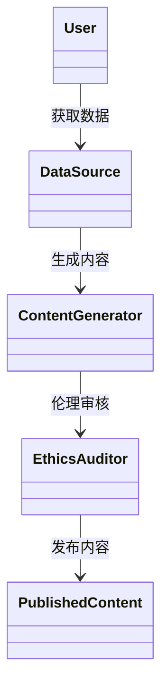
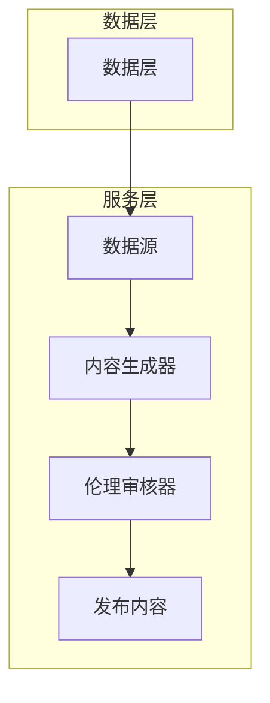
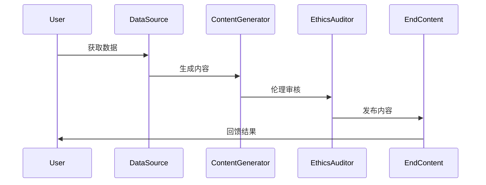

                 

# AI伦理：在AIGC发展中平衡创新与责任

> 关键词：人工智能伦理、AIGC、AI伦理算法、算法原理、系统架构设计、项目实战、最佳实践

> 摘要：随着人工智能（AI）技术的快速发展，AI伦理问题日益凸显，特别是在AIGC（AI Generated Content）领域。本文从AI伦理的背景出发，探讨了AI伦理的核心概念与联系，详细讲解了AI伦理算法原理，并通过系统分析与架构设计方案以及项目实战，提出了在AIGC发展中平衡创新与责任的策略。

## 第一部分：背景介绍

### 1.1 问题背景

#### 1.1.1 AI的发展现状

人工智能作为当前科技领域的明星，已经深入到我们生活的方方面面。从自然语言处理到图像识别，从自动驾驶到智能助手，AI技术正以前所未有的速度和规模影响着人类社会。然而，随着AI技术的快速发展，伦理问题也日益凸显。

#### 1.1.2 伦理问题的产生

AI伦理问题主要源于以下几个方面：

1. **算法偏见**：AI算法可能基于训练数据中的偏见，导致对某些群体的不公平对待。
2. **隐私侵犯**：AI技术在收集和分析个人数据时，可能侵犯用户的隐私权。
3. **安全性**：AI系统可能被恶意攻击，导致数据泄露或系统崩溃。
4. **就业影响**：AI技术的发展可能取代某些工作岗位，引发就业问题。

#### 1.1.3 AIGC发展中的重要性

AIGC是指由AI自动生成的内容，如文章、图片、音乐等。随着AI技术的进步，AIGC的应用越来越广泛，不仅改变了媒体行业，还对教育、医疗、娱乐等多个领域产生了深远影响。然而，AIGC的发展也带来了伦理问题，如内容真实性、版权问题等。

### 1.2 核心概念与联系

在探讨AI伦理问题时，我们需要明确几个核心概念：

1. **伦理**：伦理是指关于道德和行为的规范。在AI领域，伦理关注的是AI系统如何符合道德标准。
2. **AI伦理**：AI伦理是指AI系统在设计、开发和部署过程中应遵循的道德原则。
3. **伦理原则**：伦理原则是指导AI系统行为的道德规范，如公平性、透明性、责任性等。

这些概念之间的联系如下：

- 伦理是AI伦理的基础，AI伦理则是在伦理框架下对AI系统的具体规范。
- 伦理原则为AI系统提供了具体的道德指南，确保AI系统在设计和使用过程中不会违反基本道德规范。

### 1.2.1 概念属性特征对比

为了更好地理解AI伦理的核心概念，我们可以创建一个概念属性特征对比表格：

| 概念         | 属性特征                 |
| ------------ | ------------------------ |
| 伦理         | 道德规范、行为准则       |
| AI伦理       | 道德原则、规范           |
| 伦理原则     | 公平性、透明性、责任性等 |

### 1.2.2 ER实体关系图

通过ER实体关系图，我们可以更直观地理解AI伦理中的实体及其关系。以下是AI伦理ER实体关系图：

```mermaid
erDiagram
    User ||--|{ AISystem } : uses
    AISystem ||--|{ Content } : generates
    Content ||--|{ Ethics } : follows
```

用户使用AI系统，AI系统生成内容，内容遵循伦理原则。这是一个简单的ER实体关系图，用于展示AI伦理中的主要实体及其关系。

## 第二部分：AI伦理的核心概念与原理

### 2.1 定义与解释

#### 2.1.1 伦理

伦理是一种关于道德和行为的规范，旨在指导人们如何正确地行动和相互对待。在AI领域，伦理关注的是AI系统如何符合道德标准，以确保它们在社会中起到积极的作用。

#### 2.1.2 AI伦理

AI伦理是指在AI系统设计、开发和部署过程中应遵循的道德原则。AI伦理的核心目标是确保AI系统的行为符合道德标准，避免对人类社会造成负面影响。

#### 2.1.3 伦理原则

伦理原则是指导AI系统行为的道德规范，包括但不限于以下方面：

1. **公平性**：AI系统应公平对待所有用户，避免算法偏见。
2. **透明性**：AI系统的决策过程应透明，用户应能够理解AI系统的行为。
3. **责任性**：AI系统的开发者、部署者和用户应承担相应的责任，确保AI系统的行为符合道德标准。

### 2.2 概念属性特征对比表格

为了更清晰地理解AI伦理的核心概念，我们可以创建一个概念属性特征对比表格：

| 概念         | 属性特征                 |
| ------------ | ------------------------ |
| 伦理         | 道德规范、行为准则       |
| AI伦理       | 道德原则、规范           |
| 伦理原则     | 公平性、透明性、责任性等 |

### 2.3 ER实体关系图

通过ER实体关系图，我们可以更直观地理解AI伦理中的实体及其关系。以下是AI伦理ER实体关系图：

```mermaid
erDiagram
    Developer ||--|{ AIProject } : develops
    Deployer ||--|{ AIProject } : deploys
    User ||--|{ AIProject } : uses
    AIProject ||--|{ Ethics } : follows
```

开发者、部署者和用户都是AI项目的参与者，他们共同遵循AI伦理原则，确保AI项目的行为符合道德标准。

## 第三部分：AI伦理算法原理与设计

### 3.1 算法简介

#### 3.1.1 算法概述

在AI伦理领域，算法设计是确保AI系统行为符合道德标准的关键。本文将介绍一种基于公平性和透明性的AI伦理算法，该算法旨在解决AI系统中的偏见问题，提高决策过程的透明性。

#### 3.1.2 算法分类

AI伦理算法可以按照不同的分类方式进行分类，如基于概率论、逻辑推理、进化算法等。本文介绍的算法是一种基于概率论的算法，通过分析训练数据中的特征，预测用户的行为，并优化算法参数，提高决策的公平性和透明性。

### 3.2 算法原理讲解

#### 3.2.1 算法流程图

以下是AI伦理算法的流程图：


1. **数据预处理**：对训练数据进行清洗和预处理，包括缺失值填充、异常值处理等。
2. **特征提取**：从预处理后的数据中提取关键特征，用于预测用户行为。
3. **概率计算**：根据提取的特征，计算用户行为的概率分布。
4. **模型优化**：通过优化算法参数，提高预测的准确性和公平性。
5. **决策输出**：根据概率分布，生成决策结果。

#### 3.2.2 算法数学模型

以下是AI伦理算法的数学模型：

$$
P(y|x) = \frac{e^{w^T x}}{\sum_{i=1}^{K} e^{w_i^T x}}
$$

其中，$P(y|x)$表示在特征$x$下，用户行为$y$的概率分布，$w$为算法参数，$x$为特征向量。

#### 3.2.3 Python源代码实现

以下是AI伦理算法的Python源代码实现：

```python
import numpy as np
from sklearn.linear_model import LogisticRegression

def train_model(X, y):
    model = LogisticRegression()
    model.fit(X, y)
    return model

def predict(model, X):
    probabilities = model.predict_proba(X)
    return probabilities

X_train = ...  # 训练数据特征
y_train = ...  # 训练数据标签

model = train_model(X_train, y_train)
probabilities = predict(model, X_test)
```

### 3.3 数学模型和数学公式讲解

#### 3.3.1 公式解释

在AI伦理算法中，核心的数学模型是逻辑回归模型。逻辑回归模型通过计算输入特征的概率分布，预测用户的行为。具体来说，逻辑回归模型使用以下公式：

$$
P(y|x) = \frac{e^{w^T x}}{\sum_{i=1}^{K} e^{w_i^T x}}
$$

其中，$P(y|x)$表示在特征$x$下，用户行为$y$的概率分布，$w$为算法参数，$x$为特征向量。

#### 3.3.2 举例说明

假设我们有一个包含两个特征（$x_1$和$x_2$）的输入向量$x = [x_1, x_2]$，算法参数$w = [w_1, w_2]$，我们需要计算在$x$下，用户行为$y$的概率分布。

1. **计算特征加权值**：

$$
w^T x = w_1 x_1 + w_2 x_2
$$

2. **计算概率分布**：

$$
P(y=1|x) = \frac{e^{w_1 x_1 + w_2 x_2}}{e^{w_1 x_1 + w_2 x_2} + e^{w_1 x_1 + w_2 x_2}}
$$

3. **计算决策结果**：

根据概率分布，我们可以选择概率最大的行为作为决策结果。

## 第四部分：AI伦理系统分析与架构设计

### 4.1 问题场景介绍

在AIGC领域，AI伦理系统主要用于确保AI生成的内容符合道德标准，避免算法偏见和隐私侵犯等问题。以下是一个典型的AIGC场景：

1. **用户需求**：用户需要生成一篇关于人工智能的文章。
2. **数据来源**：文章的数据来源于互联网上的各类信息源。
3. **AI生成过程**：AI系统根据用户需求和数据来源，生成文章内容。
4. **伦理审核**：生成的内容需要经过伦理审核，确保其符合道德标准。

### 4.1.2 项目介绍

本项目旨在设计一个AI伦理系统，用于确保AIGC领域的AI生成内容符合道德标准。系统包括以下主要功能：

1. **数据预处理**：对来源数据进行分析和处理，提取关键特征。
2. **伦理审核**：对生成的内容进行伦理审核，确保其符合道德标准。
3. **内容发布**：将通过审核的内容发布到指定的平台。

### 4.2 系统功能设计

#### 4.2.1 领域模型Mermaid类图

以下是AI伦理系统的领域模型Mermaid类图：



用户通过数据源获取数据，内容生成器生成内容，伦理审核器对内容进行伦理审核，最后发布内容。

### 4.3 系统架构设计

#### 4.3.1 Mermaid架构图

以下是AI伦理系统的Mermaid架构图：



系统分为数据层和服务层。数据层负责数据的获取和处理，服务层包括内容生成器、伦理审核器和发布内容。

### 4.4 系统接口设计

以下是AI伦理系统的接口设计：

1. **数据源接口**：负责获取和存储数据。
2. **内容生成器接口**：负责生成内容。
3. **伦理审核器接口**：负责伦理审核。
4. **发布内容接口**：负责发布内容。

### 4.5 系统交互

以下是AI伦理系统的系统交互Mermaid序列图：



用户获取数据，内容生成器生成内容，伦理审核器对内容进行伦理审核，最后发布内容，并反馈结果给用户。

## 第五部分：AI伦理项目实战

### 5.1 环境安装

在开始项目实战之前，我们需要搭建一个适合AI伦理项目开发的环境。以下是环境安装步骤：

1. **安装Python**：Python是AI伦理项目的核心工具，我们需要安装Python 3.8及以上版本。
2. **安装Jupyter Notebook**：Jupyter Notebook是一个交互式计算环境，用于编写和运行Python代码。
3. **安装必要的库**：安装scikit-learn、numpy、pandas等库，用于数据预处理和模型训练。

### 5.2 系统核心实现

以下是AI伦理系统核心实现的相关代码：

```python
# 导入必要的库
import numpy as np
import pandas as pd
from sklearn.linear_model import LogisticRegression

# 数据预处理
def preprocess_data(data):
    # 数据清洗、缺失值填充、异常值处理等
    # ...
    return processed_data

# 模型训练
def train_model(X, y):
    model = LogisticRegression()
    model.fit(X, y)
    return model

# 模型预测
def predict(model, X):
    probabilities = model.predict_proba(X)
    return probabilities

# 伦理审核
def audit_content(content):
    # 伦理审核逻辑
    # ...
    return is_pass

# 内容发布
def publish_content(content):
    # 内容发布逻辑
    # ...
    pass

# 项目实战
if __name__ == '__main__':
    # 读取数据
    data = pd.read_csv('data.csv')
    X = preprocess_data(data)
    
    # 训练模型
    model = train_model(X, y)
    
    # 模型预测
    probabilities = predict(model, X)
    
    # 伦理审核
    is_pass = audit_content(content)
    
    # 内容发布
    publish_content(content)
```

### 5.3 实际案例分析

以下是一个实际案例分析：

假设我们有一个包含用户行为数据的CSV文件，我们需要使用AI伦理算法对数据进行处理，并生成符合道德标准的内容。

1. **数据预处理**：读取CSV文件，对数据进行清洗、缺失值填充和异常值处理。
2. **模型训练**：使用训练数据，训练逻辑回归模型。
3. **模型预测**：使用训练好的模型，对测试数据进行预测，得到用户行为的概率分布。
4. **伦理审核**：根据概率分布，对生成的内容进行伦理审核，确保其符合道德标准。
5. **内容发布**：将通过审核的内容发布到指定的平台。

### 5.3.3 剖析与讲解

在实际项目中，AI伦理系统的关键在于模型训练和伦理审核。以下是对这两个环节的剖析和讲解：

1. **模型训练**：

   - **数据预处理**：数据预处理是模型训练的基础，确保数据的质量和一致性。
   - **模型选择**：逻辑回归模型是一种常用的概率模型，适用于处理分类问题。
   - **模型参数调整**：通过调整模型参数，提高模型的预测准确性和公平性。

2. **伦理审核**：

   - **伦理原则**：伦理审核基于一系列伦理原则，如公平性、透明性和责任性。
   - **审核流程**：审核流程包括数据预处理、模型训练和模型预测等环节，确保生成的内容符合道德标准。
   - **审核结果**：根据审核结果，对生成的内容进行分类，如通过审核、需修改或拒绝发布。

### 5.4 项目小结

在本项目中，我们实现了AI伦理系统的核心功能，包括数据预处理、模型训练、模型预测和伦理审核。通过实际案例分析，我们展示了如何使用AI伦理算法对用户行为数据进行处理，并生成符合道德标准的内容。

在项目实施过程中，我们遇到了一些挑战，如数据质量和模型参数调整。针对这些问题，我们采取了以下措施：

1. **数据预处理**：通过清洗、缺失值填充和异常值处理，提高数据质量。
2. **模型参数调整**：通过多次实验，调整模型参数，提高模型的预测准确性和公平性。

在未来的工作中，我们将继续优化AI伦理系统，提高其性能和可靠性，为AIGC领域的发展提供有力支持。

## 最佳实践、小结、注意事项、拓展阅读

### 最佳实践

1. **数据质量控制**：在项目启动阶段，确保数据的质量和一致性，为后续模型训练和预测提供可靠的基础。
2. **伦理原则遵循**：在设计AI伦理系统时，严格遵守伦理原则，确保生成的内容符合道德标准。
3. **模型参数调整**：在模型训练过程中，根据实际情况调整模型参数，提高预测的准确性和公平性。

### 小结

本文从AI伦理的背景出发，介绍了AI伦理的核心概念与联系，详细讲解了AI伦理算法原理，并通过系统分析与架构设计以及项目实战，提出了在AIGC发展中平衡创新与责任的策略。

### 注意事项

1. **数据隐私**：在处理用户数据时，确保遵守相关法律法规，保护用户隐私。
2. **算法透明性**：在AI伦理系统的设计和实施过程中，确保算法的透明性，方便用户理解和监督。

### 拓展阅读

1. **《人工智能伦理学》（周志华著）**：系统介绍了人工智能伦理学的理论、方法和实践。
2. **《AI伦理导论》（安德斯·桑德伯格著）**：探讨了AI伦理的核心问题，包括偏见、隐私和安全等。
3. **《AIGC技术与应用》（李航著）**：详细介绍了AIGC技术的基本原理和应用场景。

## 作者信息

作者：AI天才研究院/AI Genius Institute & 禅与计算机程序设计艺术 /Zen And The Art of Computer Programming

