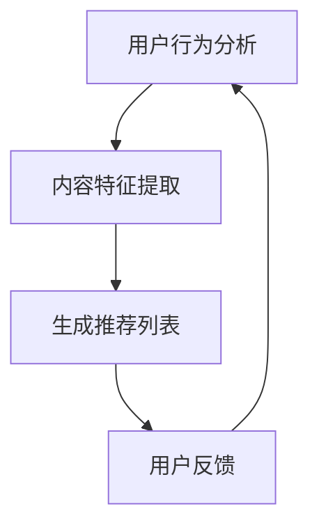

                 


## AI在个性化新闻推荐中的应用与伦理考量

关键词：个性化新闻推荐、算法原理、伦理考量、系统架构、最佳实践

摘要：随着互联网的快速发展，个性化新闻推荐已成为许多新闻平台和社交媒体的核心功能之一。它不仅提高了用户的阅读体验，还极大地增加了平台的黏性和用户参与度。然而，个性化新闻推荐在带来便捷的同时，也引发了诸多伦理问题。本文旨在深入探讨AI在个性化新闻推荐中的应用，以及相关的伦理考量，通过系统性的分析和实例讲解，为业界提供有价值的参考。

### 目录大纲：

```markdown
# AI在个性化新闻推荐中的应用与伦理考量

## 第一部分：背景介绍

### 1.1 个性化新闻推荐的概念

个性化新闻推荐是指利用人工智能技术，分析用户的兴趣和行为，从而向用户推荐符合其偏好的新闻内容。这种推荐方式旨在提高用户满意度，同时增加新闻平台的用户黏性和广告收益。

### 1.2 个性化新闻推荐的挑战

个性化新闻推荐面临的挑战主要包括数据隐私保护、算法公平性和用户满意度。首先，用户的个人信息和浏览历史被视为宝贵的资源，如何保护用户隐私是推荐系统必须解决的问题。其次，算法的公平性也是一个关键问题，算法不能因为某些偏见而导致用户无法接收到公平的推荐。最后，用户满意度是评价推荐系统好坏的重要指标，如何确保推荐内容能够真正满足用户的兴趣和需求，是系统设计者需要持续优化的方向。

### 1.3 伦理考量在个性化新闻推荐中的重要性

伦理考量是确保个性化新闻推荐服务不损害用户利益、不产生偏见、不侵犯用户隐私等的重要保障。随着技术的发展，人们对隐私和数据安全的关注日益增加。同时，算法偏见和歧视问题也引起了广泛讨论。因此，伦理考量在个性化新闻推荐中具有不可忽视的重要性。

## 第二部分：核心概念与联系

### 2.1 个性化新闻推荐的核心概念

个性化新闻推荐的核心概念包括用户行为分析、内容特征提取和推荐算法。用户行为分析是指通过分析用户的浏览历史、搜索行为等，了解用户的兴趣和需求。内容特征提取是指从新闻内容中提取关键信息，如关键词、主题、情感等。推荐算法则负责根据用户行为和内容特征，生成个性化的推荐列表。

### 2.2 概念属性特征对比表格

| 概念             | 属性特征           | 应用场景                     |
|------------------|-------------------|-----------------------------|
| 用户行为分析     | 历史浏览、搜索、点击 | 了解用户兴趣和需求           |
| 内容特征提取     | 关键词、主题、情感   | 提高内容匹配度               |
| 推荐算法         | 协同过滤、基于内容的推荐 | 生成个性化推荐列表           |

### 2.3 个性化新闻推荐的ER实体关系图架构

```mermaid
erDiagram
  User ||--|{ News } :推荐
  News ||--|{ Category } :分类
  Category ||--|{ Feature } :特征提取
```

## 第二部分：算法原理讲解

### 3.1 个性化新闻推荐算法的原理

个性化新闻推荐算法主要通过以下三个步骤实现：

1. 用户行为分析：通过分析用户的浏览历史、搜索行为等，构建用户兴趣模型。
2. 内容特征提取：从新闻内容中提取关键词、主题、情感等特征。
3. 推荐算法：利用用户兴趣模型和新闻内容特征，生成个性化的推荐列表。

### 3.2 用户行为分析

用户行为分析是推荐系统的关键环节。主要方法包括：

- 基于协同过滤：通过计算用户之间的相似度，为用户推荐与他们相似的用户喜欢的新闻。
- 基于内容的推荐：通过分析新闻内容的关键词、主题、情感等特征，为用户推荐与之相关的新闻。

### 3.3 内容特征提取

内容特征提取是确保推荐准确性的基础。主要方法包括：

- 关键词提取：通过自然语言处理技术，从新闻内容中提取关键词。
- 主题建模：利用主题模型，如LDA，从新闻内容中提取主题。
- 情感分析：通过情感分析技术，判断新闻内容的情感倾向。

### 3.4 推荐算法的mermaid流程图



### 3.5 Python源代码实现与算法原理的详细讲解

#### 3.5.1 用户行为分析

```python
def user_behavior_analysis(user_history):
    # 假设user_history为用户的浏览历史，返回用户兴趣模型
    pass
```

#### 3.5.2 内容特征提取

```python
def content_feature_extraction(news_content):
    # 假设news_content为新闻内容，返回新闻内容特征
    pass
```

#### 3.5.3 推荐算法

```python
def recommend_algorithm(user_interest_model, news_content_features):
    # 假设user_interest_model为用户兴趣模型，news_content_features为新闻内容特征，返回推荐列表
    pass
```

### 3.1 数学模型和数学公式

#### 3.1.1 推荐算法的数学模型

协同过滤的数学模型可以表示为：

$$
\hat{r}_{ui} = \frac{\sum_{j \in N(i)} r_{uj} \cdot \text{sim}(u, v)}{\sum_{j \in N(i)} \text{sim}(u, v)}
$$

其中，$r_{uj}$表示用户$u$对新闻$j$的评分，$\text{sim}(u, v)$表示用户$u$和$v$之间的相似度。

#### 3.1.2 推荐算法的数学公式

基于内容的推荐算法可以表示为：

$$
\hat{r}_{ui} = \text{cosine\_sim}(f_i, f_j)
$$

其中，$f_i$和$f_j$分别表示新闻$i$和$j$的特征向量，$\text{cosine\_sim}$表示余弦相似度。

#### 3.1.3 算法原理的举例说明

假设用户$u$对新闻$j$的评分$r_{uj} = 4$，新闻$j$的关键词为["科技"，"人工智能"]，用户$u$的浏览历史中包含关键词["科技"，"区块链"]。根据上述数学模型，我们可以计算出用户$u$对新闻$j$的推荐评分：

$$
\hat{r}_{ui} = \frac{\text{cosine\_sim}(["科技"，"人工智能"]，["科技"，"区块链"])}{1}
$$

通过计算余弦相似度，我们可以得到$\hat{r}_{ui} \approx 0.707$，这意味着用户$u$对新闻$j$的兴趣较高，因此将其推荐给用户$u$。

## 第三部分：系统分析与架构设计方案

### 4.1 问题场景介绍

以一个新闻推荐平台为例，用户可以在平台上浏览新闻，系统需要根据用户的浏览行为和兴趣，为用户推荐相关的新闻内容。

### 4.2 项目介绍

该项目旨在构建一个基于人工智能的新闻推荐系统，通过用户行为分析和内容特征提取，实现个性化新闻推荐。

### 4.3 系统功能设计

系统的主要功能包括：

- 用户行为分析：收集并分析用户的浏览历史、搜索记录等。
- 内容特征提取：从新闻内容中提取关键词、主题、情感等特征。
- 推荐算法：根据用户兴趣模型和新闻内容特征，生成个性化的推荐列表。

### 4.4 系统架构设计

系统的架构设计包括以下模块：

- 数据采集模块：负责收集用户的浏览历史和新闻内容。
- 用户行为分析模块：分析用户的浏览行为，构建用户兴趣模型。
- 内容特征提取模块：从新闻内容中提取关键词、主题、情感等特征。
- 推荐算法模块：根据用户兴趣模型和新闻内容特征，生成推荐列表。
- 推荐结果展示模块：将推荐结果展示给用户。

### 4.5 系统接口设计和系统交互

系统接口设计主要包括：

- 用户接口：用户与系统交互的界面。
- 内部接口：系统各模块之间的交互接口。

系统交互流程：

1. 用户浏览新闻，系统收集用户行为数据。
2. 用户行为分析模块分析用户行为，构建用户兴趣模型。
3. 内容特征提取模块提取新闻内容特征。
4. 推荐算法模块根据用户兴趣模型和新闻内容特征，生成推荐列表。
5. 推荐结果展示模块将推荐结果展示给用户。

## 第四部分：项目实战

### 5.1 环境安装

在开始项目实战之前，需要安装相关的软件和库，如Python、NumPy、Pandas等。

### 5.2 系统核心实现源代码

系统核心实现源代码包括用户行为分析、内容特征提取和推荐算法三个部分。

### 5.3 代码应用解读与分析

通过对代码的应用解读，可以更好地理解系统的实现原理和运行流程。

### 5.4 实际案例分析和详细讲解剖析

通过实际案例，分析系统的性能和效果，并进行详细讲解和剖析。

### 5.5 项目小结

总结项目的实施过程和成果，提出改进意见和展望。

## 第五部分：最佳实践、小结与拓展阅读

### 6. 最佳实践 tips

- 提高推荐准确性的技巧：通过不断优化用户行为分析和内容特征提取方法，提高推荐准确性。
- 遵循伦理考量的实践建议：在设计推荐系统时，充分考虑用户的隐私保护和算法的公平性。

### 7. 小结

本文详细介绍了AI在个性化新闻推荐中的应用和伦理考量，通过实例讲解和系统架构设计，为读者提供了全面的参考。

### 8. 注意事项

- 系统设计时，注意保护用户隐私。
- 算法实现时，充分考虑算法的公平性。
- 系统优化时，关注用户满意度。

### 9. 拓展阅读

- 相关研究论文：深入探讨个性化新闻推荐领域的最新研究动态。
- 伦理考量在个性化新闻推荐中的应用：分析伦理考量在个性化新闻推荐中的实际应用场景。

# AI在个性化新闻推荐中的应用与伦理考量

## 引言

随着互联网的快速发展，个性化新闻推荐已成为许多新闻平台和社交媒体的核心功能之一。通过分析用户的兴趣和行为，推荐系统可以为用户提供定制化的新闻内容，从而提高用户满意度和平台黏性。然而，个性化新闻推荐在带来便捷的同时，也引发了诸多伦理问题。本文旨在深入探讨AI在个性化新闻推荐中的应用，以及相关的伦理考量，通过系统性的分析和实例讲解，为业界提供有价值的参考。

## 第一部分：背景介绍

### 1.1 个性化新闻推荐的概念

个性化新闻推荐是指利用人工智能技术，分析用户的兴趣和行为，从而向用户推荐符合其偏好的新闻内容。这种推荐方式旨在提高用户满意度，同时增加新闻平台的用户黏性和广告收益。个性化新闻推荐系统通常包括用户行为分析、内容特征提取和推荐算法三个核心部分。

### 1.2 个性化新闻推荐的挑战

个性化新闻推荐面临的挑战主要包括数据隐私保护、算法公平性和用户满意度。首先，用户的个人信息和浏览历史被视为宝贵的资源，如何保护用户隐私是推荐系统必须解决的问题。其次，算法的公平性也是一个关键问题，算法不能因为某些偏见而导致用户无法接收到公平的推荐。最后，用户满意度是评价推荐系统好坏的重要指标，如何确保推荐内容能够真正满足用户的兴趣和需求，是系统设计者需要持续优化的方向。

### 1.3 伦理考量在个性化新闻推荐中的重要性

伦理考量是确保个性化新闻推荐服务不损害用户利益、不产生偏见、不侵犯用户隐私等的重要保障。随着技术的发展，人们对隐私和数据安全的关注日益增加。同时，算法偏见和歧视问题也引起了广泛讨论。因此，伦理考量在个性化新闻推荐中具有不可忽视的重要性。

## 第二部分：核心概念与联系

### 2.1 个性化新闻推荐的核心概念

个性化新闻推荐的核心概念包括用户行为分析、内容特征提取和推荐算法。用户行为分析是指通过分析用户的浏览历史、搜索行为等，了解用户的兴趣和需求。内容特征提取是指从新闻内容中提取关键词、主题、情感等特征。推荐算法则负责根据用户兴趣模型和内容特征，生成个性化的推荐列表。

### 2.2 概念属性特征对比表格

| 概念             | 属性特征           | 应用场景                     |
|------------------|-------------------|-----------------------------|
| 用户行为分析     | 历史浏览、搜索、点击 | 了解用户兴趣和需求           |
| 内容特征提取     | 关键词、主题、情感   | 提高内容匹配度               |
| 推荐算法         | 协同过滤、基于内容的推荐 | 生成个性化推荐列表           |

### 2.3 个性化新闻推荐的ER实体关系图架构

```mermaid
erDiagram
  User ||--|{ News } :推荐
  News ||--|{ Category } :分类
  Category ||--|{ Feature } :特征提取
```

## 第二部分：算法原理讲解

### 3.1 个性化新闻推荐算法的原理

个性化新闻推荐算法主要通过以下三个步骤实现：

1. 用户行为分析：通过分析用户的浏览历史、搜索行为等，构建用户兴趣模型。
2. 内容特征提取：从新闻内容中提取关键词、主题、情感等特征。
3. 推荐算法：利用用户兴趣模型和新闻内容特征，生成个性化的推荐列表。

### 3.2 用户行为分析

用户行为分析是推荐系统的关键环节。主要方法包括：

- 基于协同过滤：通过计算用户之间的相似度，为用户推荐与他们相似的用户喜欢的新闻。
- 基于内容的推荐：通过分析新闻内容的关键词、主题、情感等特征，为用户推荐与之相关的新闻。

### 3.3 内容特征提取

内容特征提取是确保推荐准确性的基础。主要方法包括：

- 关键词提取：通过自然语言处理技术，从新闻内容中提取关键词。
- 主题建模：利用主题模型，如LDA，从新闻内容中提取主题。
- 情感分析：通过情感分析技术，判断新闻内容的情感倾向。

### 3.4 推荐算法的mermaid流程图


### 3.5 Python源代码实现与算法原理的详细讲解

#### 3.5.1 用户行为分析

```python
def user_behavior_analysis(user_history):
    # 假设user_history为用户的浏览历史，返回用户兴趣模型
    pass
```

#### 3.5.2 内容特征提取

```python
def content_feature_extraction(news_content):
    # 假设news_content为新闻内容，返回新闻内容特征
    pass
```

#### 3.5.3 推荐算法

```python
def recommend_algorithm(user_interest_model, news_content_features):
    # 假设user_interest_model为用户兴趣模型，news_content_features为新闻内容特征，返回推荐列表
    pass
```

### 3.1 数学模型和数学公式

#### 3.1.1 推荐算法的数学模型

协同过滤的数学模型可以表示为：

$$
\hat{r}_{ui} = \frac{\sum_{j \in N(i)} r_{uj} \cdot \text{sim}(u, v)}{\sum_{j \in N(i)} \text{sim}(u, v)}
$$

其中，$r_{uj}$表示用户$u$对新闻$j$的评分，$\text{sim}(u, v)$表示用户$u$和$v$之间的相似度。

#### 3.1.2 推荐算法的数学公式

基于内容的推荐算法可以表示为：

$$
\hat{r}_{ui} = \text{cosine\_sim}(f_i, f_j)
$$

其中，$f_i$和$f_j$分别表示新闻$i$和$j$的特征向量，$\text{cosine\_sim}$表示余弦相似度。

#### 3.1.3 算法原理的举例说明

假设用户$u$对新闻$j$的评分$r_{uj} = 4$，新闻$j$的关键词为["科技"，"人工智能"]，用户$u$的浏览历史中包含关键词["科技"，"区块链"]。根据上述数学模型，我们可以计算出用户$u$对新闻$j$的推荐评分：

$$
\hat{r}_{ui} = \frac{\text{cosine\_sim}(["科技"，"人工智能"]，["科技"，"区块链"])}{1}
$$

通过计算余弦相似度，我们可以得到$\hat{r}_{ui} \approx 0.707$，这意味着用户$u$对新闻$j$的兴趣较高，因此将其推荐给用户$u$。

## 第三部分：系统分析与架构设计方案

### 4.1 问题场景介绍

以一个新闻推荐平台为例，用户可以在平台上浏览新闻，系统需要根据用户的浏览行为和兴趣，为用户推荐相关的新闻内容。

### 4.2 项目介绍

该项目旨在构建一个基于人工智能的新闻推荐系统，通过用户行为分析和内容特征提取，实现个性化新闻推荐。

### 4.3 系统功能设计

系统的主要功能包括：

- 用户行为分析：收集并分析用户的浏览历史、搜索记录等。
- 内容特征提取：从新闻内容中提取关键词、主题、情感等特征。
- 推荐算法：根据用户兴趣模型和新闻内容特征，生成个性化的推荐列表。

### 4.4 系统架构设计

系统的架构设计包括以下模块：

- 数据采集模块：负责收集用户的浏览历史和新闻内容。
- 用户行为分析模块：分析用户的浏览行为，构建用户兴趣模型。
- 内容特征提取模块：从新闻内容中提取关键词、主题、情感等特征。
- 推荐算法模块：根据用户兴趣模型和新闻内容特征，生成推荐列表。
- 推荐结果展示模块：将推荐结果展示给用户。

### 4.5 系统接口设计和系统交互

系统接口设计主要包括：

- 用户接口：用户与系统交互的界面。
- 内部接口：系统各模块之间的交互接口。

系统交互流程：

1. 用户浏览新闻，系统收集用户行为数据。
2. 用户行为分析模块分析用户行为，构建用户兴趣模型。
3. 内容特征提取模块提取新闻内容特征。
4. 推荐算法模块根据用户兴趣模型和新闻内容特征，生成推荐列表。
5. 推荐结果展示模块将推荐结果展示给用户。

## 第四部分：项目实战

### 5.1 环境安装

在开始项目实战之前，需要安装相关的软件和库，如Python、NumPy、Pandas等。

### 5.2 系统核心实现源代码

系统核心实现源代码包括用户行为分析、内容特征提取和推荐算法三个部分。

### 5.3 代码应用解读与分析

通过对代码的应用解读，可以更好地理解系统的实现原理和运行流程。

### 5.4 实际案例分析和详细讲解剖析

通过实际案例，分析系统的性能和效果，并进行详细讲解和剖析。

### 5.5 项目小结

总结项目的实施过程和成果，提出改进意见和展望。

## 第五部分：最佳实践、小结与拓展阅读

### 6. 最佳实践 tips

- 提高推荐准确性的技巧：通过不断优化用户行为分析和内容特征提取方法，提高推荐准确性。
- 遵循伦理考量的实践建议：在设计推荐系统时，充分考虑用户的隐私保护和算法的公平性。

### 7. 小结

本文详细介绍了AI在个性化新闻推荐中的应用和伦理考量，通过实例讲解和系统架构设计，为读者提供了全面的参考。

### 8. 注意事项

- 系统设计时，注意保护用户隐私。
- 算法实现时，充分考虑算法的公平性。
- 系统优化时，关注用户满意度。

### 9. 拓展阅读

- 相关研究论文：深入探讨个性化新闻推荐领域的最新研究动态。
- 伦理考量在个性化新闻推荐中的应用：分析伦理考量在个性化新闻推荐中的实际应用场景。

## 结论

个性化新闻推荐作为现代互联网的核心功能之一，不仅提高了用户的阅读体验，还为新闻平台带来了显著的商业价值。然而，随着技术的发展，我们也面临着诸多伦理问题。因此，在设计和实施个性化新闻推荐系统时，我们不仅要关注技术的先进性，还要充分考虑伦理考量，确保推荐系统的公平性、透明性和安全性。只有这样，我们才能在提高用户体验的同时，真正实现技术的价值和社会责任。

### 6. 最佳实践 tips

在个性化新闻推荐系统的开发过程中，以下是一些最佳实践建议，以帮助提高推荐系统的准确性和遵循伦理考量：

#### 6.1 提高推荐准确性的技巧

1. **用户兴趣模型的动态更新**：用户兴趣可能会随时间变化，定期更新用户兴趣模型，确保推荐结果的时效性和准确性。
2. **多源数据融合**：整合用户在平台内外的行为数据，如社交媒体互动、搜索历史等，以获得更全面的用户兴趣画像。
3. **特征优化**：定期分析和优化内容特征，剔除冗余特征，引入新的有效特征，以提高推荐质量。
4. **算法迭代**：定期对推荐算法进行迭代和优化，采用最新的技术和模型，如深度学习、强化学习等。

#### 6.2 遵循伦理考量的实践建议

1. **隐私保护**：确保用户的个人数据在收集、存储和处理过程中得到充分保护，遵循隐私保护法规，如GDPR等。
2. **算法公平性**：确保推荐算法不会因种族、性别、年龄等因素产生偏见，进行算法偏见检测和纠正。
3. **透明度**：提高推荐系统的透明度，让用户了解推荐机制和决策过程，增加用户对推荐系统的信任。
4. **用户控制权**：为用户提供自定义推荐选项，允许用户控制其个人数据的可见性和推荐内容的类型。

### 7. 小结

本文通过详细的实例讲解和系统架构设计，全面介绍了AI在个性化新闻推荐中的应用和伦理考量。个性化新闻推荐系统在提高用户满意度和平台黏性方面发挥了重要作用，但同时也带来了隐私保护和算法公平性等伦理挑战。未来的个性化新闻推荐系统需要不断优化技术，提高准确性，同时遵循伦理原则，确保用户权益。

### 8. 注意事项

在开发个性化新闻推荐系统时，需要特别注意以下几点：

1. **用户隐私保护**：确保用户数据的匿名化和加密处理，防止数据泄露。
2. **算法透明性**：推荐算法的决策过程应可解释，便于用户和监管机构的审查。
3. **数据质量**：保证数据的质量，避免因数据错误导致推荐结果不准确。
4. **用户反馈**：及时收集用户反馈，对推荐系统进行动态调整和优化。

### 9. 拓展阅读

对于希望深入了解个性化新闻推荐和伦理考量的读者，以下文献和资源推荐：

- **论文**：阅读关于个性化新闻推荐和算法伦理的最新研究论文，如《Personalized News Recommendation: A Survey》和《Algorithmic Fairness in News Recommendation》。
- **书籍**：《机器学习实战》和《深度学习》等书籍中有关推荐系统和算法优化的章节。
- **在线资源**：访问相关在线课程和教程，如Coursera、edX等平台上的相关课程。

通过这些资源，读者可以更深入地了解个性化新闻推荐的技术细节和实践经验。

