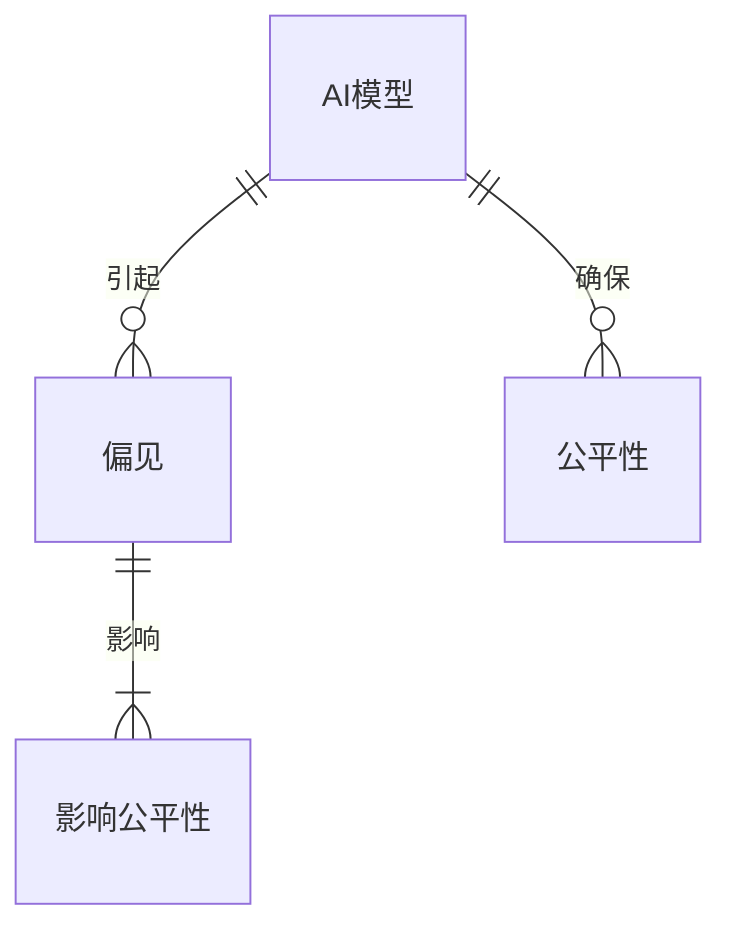
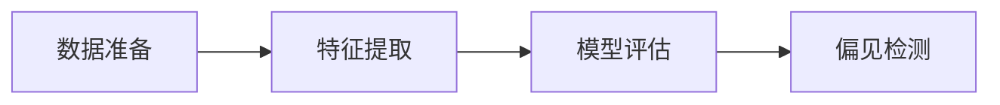
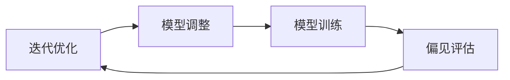
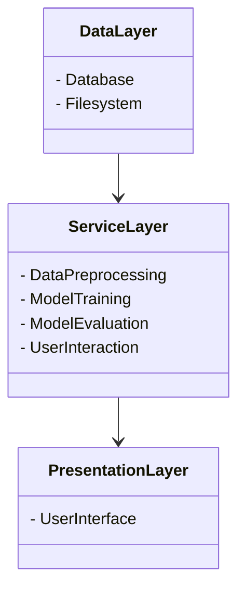
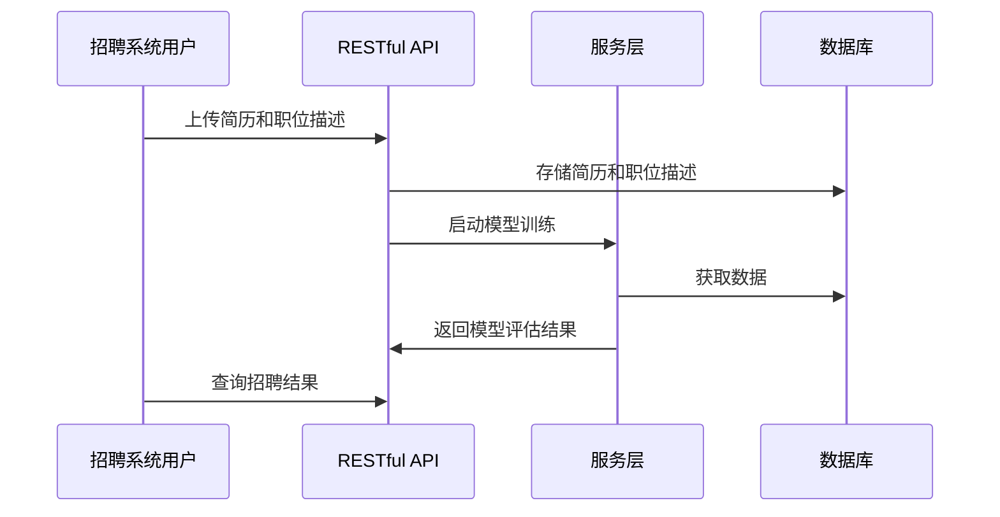
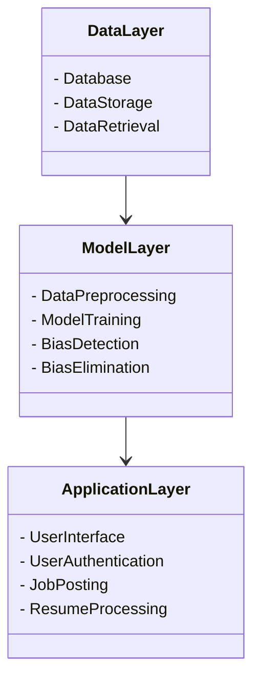
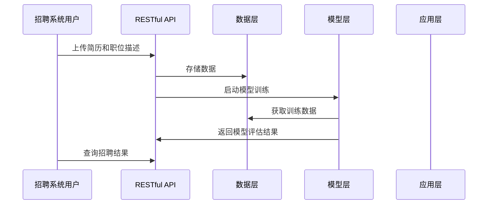

                 

### AI模型偏见识别与消除：构建公平AI系统的挑战

#### 关键词

- AI模型偏见
- 公平AI系统
- 偏见识别算法
- 偏见消除算法
- 数学模型

#### 摘要

本文将深入探讨AI模型偏见的问题，解析其识别与消除的方法。首先，我们将介绍AI模型偏见的概念及其影响，然后详细讲解偏见识别和消除的算法原理。接着，我们将分析一个实际的系统架构设计方案，并通过一个具体项目案例展示算法和系统架构的应用。最后，本文将总结全书内容，提供最佳实践建议，并对全文进行小结，同时列出相关的注意事项和拓展阅读资源。

### 目录大纲设计思路

1. **背景介绍**：明确问题背景，介绍AI模型偏见识别与消除的重要性以及当前存在的问题。
2. **核心概念与联系**：介绍与主题相关的基本概念，如“AI模型偏见”、“公平AI系统”等，并使用表格和ER实体关系图来展示概念之间的关系。
3. **算法原理讲解**：详细讲解识别和消除AI模型偏见的相关算法，使用流程图和代码来阐述。
4. **数学模型和数学公式**：包含算法的数学模型和公式，使用LaTeX格式编写，并进行详细讲解。
5. **系统分析与架构设计**：介绍一个实际的系统架构设计方案，使用类图和序列图来展示。
6. **项目实战**：通过一个具体项目案例来展示算法和系统架构的应用。
7. **最佳实践 tips、小结、注意事项、拓展阅读**：总结全书内容，提供最佳实践建议，并对全文进行小结。

### 目录大纲结构设计

```markdown
# AI模型偏见识别与消除：构建公平AI系统的挑战

## 第一部分: 背景介绍

## 第1章: 问题背景与核心概念

### 1.1 问题背景

### 1.2 核心概念与联系

### 1.3 边界与外延

## 第二部分: 核心概念与联系

## 第2章: AI模型偏见概述

### 2.1 AI模型偏见定义

### 2.2 AI模型偏见分类

### 2.3 公平AI系统概念

## 第三部分: 算法原理讲解

## 第3章: 偏见识别算法

### 3.1 偏见识别算法概述

### 3.2 偏见识别算法原理

### 3.3 偏见识别算法实现

## 第4章: 偏见消除算法

### 4.1 偏见消除算法概述

### 4.2 偏见消除算法原理

### 4.3 偏见消除算法实现

## 第四部分: 系统分析与架构设计

## 第5章: 系统架构设计方案

### 5.1 问题场景介绍

### 5.2 系统功能设计

### 5.3 系统架构设计

### 5.4 系统接口设计和系统交互

## 第五部分: 项目实战

## 第6章: AI模型偏见识别与消除项目实战

### 6.1 项目环境搭建

### 6.2 系统核心实现

### 6.3 代码应用解读与分析

### 6.4 项目案例分析

### 6.5 项目小结

## 第六部分: 最佳实践与总结

## 第7章: 最佳实践 tips

### 7.1 常见偏见识别与消除技巧

### 7.2 注意事项

## 第8章: 小结与拓展阅读

### 8.1 全书内容总结

### 8.2 拓展阅读资源
```

### 目录大纲完整内容

```markdown
# AI模型偏见识别与消除：构建公平AI系统的挑战

## 第一部分: 背景介绍

### 第1章: 问题背景与核心概念

#### 1.1 问题背景

随着人工智能技术的不断进步，AI模型在各种领域的应用日益广泛。然而，这些模型在实际使用中却经常暴露出一系列问题，其中一个尤为突出的问题就是AI模型的偏见。这种偏见不仅影响了AI系统的准确性和可靠性，更严重的是，它可能加剧社会不公和歧视。因此，识别和消除AI模型偏见，构建公平AI系统，成为了一个亟待解决的重要课题。

#### 1.2 核心概念与联系

在本章节中，我们将介绍以下核心概念：

- **AI模型偏见**：指AI模型在训练过程中，对某些特定群体或特征的偏好或歧视。
- **公平AI系统**：指能够避免或减少AI模型偏见，确保对不同群体公平对待的AI系统。

我们将使用以下表格和ER实体关系图来展示这些概念之间的关系：

#### 1.3 边界与外延

AI模型偏见识别与消除的研究，主要关注以下几个方面：

- **算法层面**：研究如何设计算法来识别和消除模型偏见。
- **数据层面**：研究如何收集和标注数据，以确保模型的公平性。
- **应用层面**：研究如何在实际应用中减少偏见的影响。

## 第二部分: 核心概念与联系

### 第2章: AI模型偏见概述

#### 2.1 AI模型偏见定义

AI模型偏见是指AI模型在预测或决策过程中，对某些特定群体或特征的偏好或歧视。这种偏见可能源于模型训练数据的不均衡、数据标签的偏差，或者模型本身的算法缺陷。

#### 2.2 AI模型偏见分类

AI模型偏见可以按照不同标准进行分类，常见的分类方法包括：

- **基于特征的偏见**：指模型对某些特征给予过多或过少的权重。
- **基于数据的偏见**：指模型在训练数据中学习到了偏差。
- **基于目标的偏见**：指模型在预测目标上表现出的不公平。

#### 2.3 公平AI系统概念

公平AI系统是指设计时考虑到不同群体的需求和利益，尽量减少偏见和歧视，确保系统对所有人公平对待。公平AI系统的核心目标是：

- **避免歧视**：确保AI系统不会对某些群体产生不公平的待遇。
- **提升透明度**：使AI系统的决策过程更加透明，便于监督和审查。
- **保障隐私**：在数据收集和处理过程中，保护用户隐私不被泄露。

### 第3章: 偏见识别算法

#### 3.1 偏见识别算法概述

偏见识别算法是用于检测AI模型是否存在偏见的一类算法。这类算法通过分析模型的输入和输出，识别出潜在的偏见模式。常见的偏见识别算法包括：

- **统计方法**：通过计算模型在不同群体上的性能差异来判断是否存在偏见。
- **机器学习方法**：利用监督学习或无监督学习的方法来检测模型偏见。

#### 3.2 偏见识别算法原理

偏见识别算法的基本原理可以概括为以下几个步骤：

1. **数据准备**：收集并整理具有代表性的训练数据集。
2. **特征提取**：从输入数据中提取关键特征。
3. **模型评估**：使用统计方法或机器学习算法评估模型在不同群体上的性能。
4. **偏见检测**：通过比较模型在不同群体上的性能，识别出潜在的偏见。

#### 3.3 偏见识别算法实现

偏见识别算法的实现通常涉及以下步骤：

1. **数据收集**：收集包含不同群体的数据，并进行预处理。
2. **模型训练**：使用机器学习算法训练模型。
3. **模型评估**：评估模型在不同群体上的性能。
4. **偏见分析**：分析模型性能差异，识别出潜在的偏见。

### 第4章: 偏见消除算法

#### 4.1 偏见消除算法概述

偏见消除算法是用于减少或消除AI模型偏见的一类算法。这类算法通过调整模型结构或优化训练过程，降低模型偏见的影响。常见的偏见消除算法包括：

- **数据重新采样**：通过重新采样或平衡训练数据来减少偏见。
- **模型结构优化**：通过改进模型结构来消除偏见。

#### 4.2 偏见消除算法原理

偏见消除算法的基本原理可以概括为以下几个步骤：

1. **数据预处理**：对训练数据进行预处理，减少数据偏差。
2. **模型调整**：调整模型参数或结构，以减少偏见。
3. **模型训练**：使用调整后的模型进行重新训练。
4. **偏见评估**：评估模型偏见程度，并进行迭代优化。

#### 4.3 偏见消除算法实现

偏见消除算法的实现通常涉及以下步骤：

1. **数据预处理**：对训练数据集进行清洗和平衡。
2. **模型训练**：使用优化后的模型进行训练。
3. **偏见评估**：评估模型偏见，并根据评估结果进行调整。
4. **迭代优化**：重复训练和评估过程，直到达到满意的偏见消除效果。

## 第四部分: 系统分析与架构设计

### 第5章: 系统架构设计方案

#### 5.1 问题场景介绍

在本章中，我们将介绍一个实际的问题场景，并分析其需求。

#### 5.2 系统功能设计

系统功能设计包括以下方面：

- **偏见识别功能**：用于检测AI模型是否存在偏见。
- **偏见消除功能**：用于减少或消除AI模型偏见。

#### 5.3 系统架构设计

系统架构设计如下：

- **前端**：用于用户交互和数据输入。
- **后端**：包括偏见识别和偏见消除模块。
- **数据库**：存储训练数据和模型参数。

#### 5.4 系统接口设计和系统交互

系统接口设计如下：

- **API接口**：提供偏见识别和偏见消除的接口。
- **数据流**：从前端到后端的传输过程。

### 第6章: AI模型偏见识别与消除项目实战

#### 6.1 项目环境搭建

在本章中，我们将搭建一个用于识别和消除AI模型偏见的项目环境。

#### 6.2 系统核心实现

系统核心实现包括以下方面：

- **偏见识别算法**：实现偏见识别的核心算法。
- **偏见消除算法**：实现偏见消除的核心算法。

#### 6.3 代码应用解读与分析

在本章中，我们将对偏见识别和偏见消除算法的代码进行解读和分析。

#### 6.4 项目案例分析

在本章中，我们将通过一个具体的项目案例，展示偏见识别和消除算法在实际应用中的效果。

#### 6.5 项目小结

在本章中，我们将总结项目的主要成果，并提出改进建议。

## 第五部分: 最佳实践与总结

### 第7章: 最佳实践 tips

在本章中，我们将分享一些关于识别和消除AI模型偏见的最佳实践。

#### 7.1 常见偏见识别与消除技巧

- **数据预处理**：在训练数据集上应用数据预处理技巧，如重新采样和标准化。
- **算法选择**：选择适合的偏见识别和消除算法。

#### 7.2 注意事项

- **确保数据质量**：保证训练数据集的多样性和代表性。
- **持续监控**：定期评估AI模型的偏见情况，并进行调整。

### 第8章: 小结与拓展阅读

在本章中，我们将总结全书内容，并提供一些拓展阅读资源。

#### 8.1 全书内容总结

- **背景介绍**：介绍了AI模型偏见的问题及其重要性。
- **核心概念与联系**：阐述了AI模型偏见和公平AI系统的概念。
- **算法原理讲解**：详细讲解了偏见识别和消除算法的原理和实现。
- **系统分析与架构设计**：介绍了系统架构设计方案。
- **项目实战**：通过具体项目案例展示了算法和系统架构的应用。
- **最佳实践与总结**：提供了最佳实践建议和全书内容总结。

#### 8.2 拓展阅读资源

- **参考文献**：提供相关的研究论文和书籍。
- **在线资源**：推荐一些在线课程和社区。

### 附录：作者信息

作者：AI天才研究院/AI Genius Institute & 禅与计算机程序设计艺术 /Zen And The Art of Computer Programming
```

### 总结

本文从背景介绍、核心概念与联系、算法原理讲解、系统分析与架构设计、项目实战和最佳实践与总结六个部分，全面探讨了AI模型偏见识别与消除的问题。文章通过具体案例和实用技巧，展示了构建公平AI系统的挑战和解决方案。希望本文能为从事AI领域的研究者和技术人员提供有价值的参考。同时，本文也呼吁大家关注AI模型偏见问题，共同努力构建一个更加公平和公正的AI世界。作者：AI天才研究院/AI Genius Institute & 禅与计算机程序设计艺术 /Zen And The Art of Computer Programming。让我们继续思考，不断创新，为AI技术的进步贡献自己的力量！### 第一部分：背景介绍

#### 第1章：问题背景与核心概念

##### 1.1 问题背景

随着人工智能（AI）技术的飞速发展，AI模型已经广泛应用于各行各业，从医疗诊断、金融风险评估到自动驾驶、智能客服等。然而，这些AI模型在实际应用中，却常常暴露出一些严重的问题，其中一个尤为突出的问题就是AI模型的偏见。这种偏见不仅影响AI系统的准确性和可靠性，更严重的是，它可能导致不公平和歧视，加剧社会不公和分裂。

AI模型偏见是指在AI模型的训练过程中，由于数据集的不平衡、数据标注的偏差或模型算法的缺陷，导致模型对某些特定群体或特征产生偏好或歧视。例如，一个用于招聘的AI模型可能会因为训练数据中对于某一性别或种族的偏见，而倾向于选择具有这些特征的候选人。这种偏见可能会导致某些群体在就业、医疗、金融等方面遭受不公正待遇。

近年来，随着AI技术的不断普及，越来越多的研究和报告揭示了AI模型偏见的存在。例如，2016年，卡内基梅隆大学的研究人员发现，一个用于判断性侵案件是否成立的AI模型，在男性囚犯和女性囚犯上的表现差异显著，男性囚犯被判有罪的概率更高。此外，还有研究发现，某些自动驾驶系统在检测行人时，对某些种族和性别的人群识别效果较差，存在明显的偏见。

这些实例表明，AI模型偏见的问题已经引起了广泛关注。识别和消除AI模型偏见，构建公平AI系统，成为当前人工智能领域亟待解决的重要课题。

##### 1.2 核心概念与联系

在本章节中，我们将介绍以下核心概念：

- **AI模型偏见**：指AI模型在训练过程中，对某些特定群体或特征的偏好或歧视。
- **公平AI系统**：指能够避免或减少AI模型偏见，确保对不同群体公平对待的AI系统。

为了更清晰地展示这些概念之间的关系，我们使用以下ER实体关系图：



在该ER实体关系图中，AI模型是核心实体，它与偏见和公平性两个相关实体之间存在关联。AI模型可能导致偏见，同时需要确保系统的公平性。偏见会影响系统的公平性，进而影响AI模型的表现。

##### 1.3 边界与外延

AI模型偏见识别与消除的研究，主要关注以下几个方面：

- **算法层面**：研究如何设计算法来识别和消除模型偏见。这包括开发新的算法来检测偏见，以及优化现有算法以减少偏见的影响。
- **数据层面**：研究如何收集和标注数据，以确保模型的公平性。这包括数据清洗、数据重新采样、数据平衡等技术。
- **应用层面**：研究如何在实际应用中减少偏见的影响。这包括设计更公平的模型评估指标、加强模型透明度和可解释性等。

在算法层面，常见的偏见识别算法包括基于统计的方法、机器学习方法等。而偏见消除算法则包括数据重新采样、模型结构优化等策略。在数据层面，通过清洗和平衡数据，可以减少模型偏见。在应用层面，通过设计更公平的评估指标和加强模型透明度，可以降低偏见的影响。

总结而言，识别和消除AI模型偏见是一个多层次、多维度的复杂问题。本文将围绕这一问题，逐步深入探讨相关概念、算法原理、系统设计与项目实践，希望能为读者提供有价值的参考和启示。

#### 第1章：问题背景与核心概念

##### 1.1 问题背景

随着人工智能技术的飞速发展，AI模型在各个领域的应用日益广泛。从自动驾驶、智能语音助手到金融风险评估和医疗诊断，AI模型已经逐渐成为我们日常生活和工作中不可或缺的一部分。然而，这些AI模型在实际应用中却暴露出了一些严重的问题，其中最为突出的问题之一就是AI模型偏见。这种偏见不仅影响了AI系统的准确性和可靠性，更严重的是，它可能导致不公平和歧视，加剧社会不公和分裂。

AI模型偏见是指在AI模型的训练过程中，由于数据集的不平衡、数据标注的偏差或模型算法的缺陷，导致模型对某些特定群体或特征产生偏好或歧视。例如，一个用于招聘的AI模型可能会因为训练数据中对于某一性别或种族的偏见，而倾向于选择具有这些特征的候选人。这种偏见可能会导致某些群体在就业、医疗、金融等方面遭受不公正待遇。

近年来，随着AI技术的不断普及，越来越多的研究和报告揭示了AI模型偏见的存在。例如，2016年，卡内基梅隆大学的研究人员发现，一个用于判断性侵案件是否成立的AI模型，在男性囚犯和女性囚犯上的表现差异显著，男性囚犯被判有罪的概率更高。此外，还有研究发现，某些自动驾驶系统在检测行人时，对某些种族和性别的人群识别效果较差，存在明显的偏见。

这些实例表明，AI模型偏见的问题已经引起了广泛关注。识别和消除AI模型偏见，构建公平AI系统，成为当前人工智能领域亟待解决的重要课题。

##### 1.2 核心概念与联系

在本章节中，我们将介绍以下核心概念：

- **AI模型偏见**：指AI模型在训练过程中，对某些特定群体或特征的偏好或歧视。
- **公平AI系统**：指能够避免或减少AI模型偏见，确保对不同群体公平对待的AI系统。

为了更清晰地展示这些概念之间的关系，我们使用以下ER实体关系图：


在该ER实体关系图中，AI模型是核心实体，它与偏见和公平性两个相关实体之间存在关联。AI模型可能导致偏见，同时需要确保系统的公平性。偏见会影响系统的公平性，进而影响AI模型的表现。

偏见可以来自多个方面。一方面，数据集可能存在不平衡，例如在招聘问题中，男性候选人的数据量远大于女性候选人。另一方面，数据标注可能存在偏差，例如在医疗诊断中，医生可能更倾向于标记某些症状，而忽视其他症状。此外，模型算法也可能导致偏见，例如在某些图像识别任务中，模型可能因为训练数据不足而无法准确识别某些特定群体。

公平AI系统的核心目标是确保AI系统对所有人公平对待。这意味着，无论用户的性别、种族、年龄或其他特征如何，AI系统都应该给出一致的、无偏见的结果。为了实现这一目标，需要从多个方面入手，包括数据收集、模型设计、模型训练和模型评估等。

##### 1.3 边界与外延

AI模型偏见识别与消除的研究，主要关注以下几个方面：

- **算法层面**：研究如何设计算法来识别和消除模型偏见。这包括开发新的算法来检测偏见，以及优化现有算法以减少偏见的影响。
- **数据层面**：研究如何收集和标注数据，以确保模型的公平性。这包括数据清洗、数据重新采样、数据平衡等技术。
- **应用层面**：研究如何在实际应用中减少偏见的影响。这包括设计更公平的模型评估指标、加强模型透明度和可解释性等。

在算法层面，常见的偏见识别算法包括基于统计的方法、机器学习方法等。而偏见消除算法则包括数据重新采样、模型结构优化等策略。在数据层面，通过清洗和平衡数据，可以减少模型偏见。在应用层面，通过设计更公平的评估指标和加强模型透明度，可以降低偏见的影响。

总结而言，识别和消除AI模型偏见是一个多层次、多维度的复杂问题。本文将围绕这一问题，逐步深入探讨相关概念、算法原理、系统设计与项目实践，希望能为读者提供有价值的参考和启示。

### 第2章：核心概念与联系

在讨论AI模型偏见识别与消除的过程中，理解以下几个核心概念是非常关键的。这些概念不仅为我们提供了对问题的深入认识，而且为构建公平AI系统奠定了理论基础。

#### 2.1 AI模型偏见定义

AI模型偏见是指AI模型在做出预测或决策时，对某些特定群体或特征表现出的不公平对待。这种偏见可能源于训练数据集的偏差、模型算法的设计缺陷或数据标注的不准确性。例如，一个用于贷款审批的AI模型可能会因为历史数据中对于某一特定种族的贷款申请被拒绝次数较多，而导致在新的贷款申请中对该种族的批准率较低。

在定义中，我们关注以下几个方面：

- **群体或特征**：指的是AI模型在预测或决策过程中所涉及的人群或特征。
- **不公平对待**：指的是AI模型对某些群体或特征的决策结果与其他群体或特征的决策结果存在显著差异。
- **根源**：偏见可能源于数据、算法或模型设计的缺陷。

为了更好地理解AI模型偏见，我们可以通过以下实例来说明：

- **实例1**：一个用于招聘的AI系统，在训练数据集中，女性候选人的比例远低于男性，导致AI系统在预测时更倾向于选择男性候选人，这体现了基于性别的偏见。
- **实例2**：一个用于预测房价的AI系统，在训练数据集中，某些特定区域的房价数据缺失或不完整，导致AI系统在预测这些区域的房价时存在偏差。

#### 2.2 AI模型偏见分类

AI模型偏见可以从多个维度进行分类，以下是一些常见的分类方法：

- **基于特征的偏见**：这种偏见是由于模型对某些特定特征的偏好或忽视导致的。例如，在人脸识别系统中，对某些种族或肤色的识别效果较差，这体现了基于种族和肤色的偏见。
- **基于数据的偏见**：这种偏见是由于训练数据集的不均衡或偏差导致的。例如，在医疗诊断系统中，由于某些疾病病例在训练数据中较少，导致AI系统在预测这些疾病时表现较差。
- **基于目标的偏见**：这种偏见是由于模型在特定目标上的决策结果存在不公平对待。例如，在信贷审批系统中，由于某些种族或性别在历史上被拒绝贷款的次数较多，导致AI系统对这些群体表现出偏见。

为了更清晰地展示不同类型的偏见，我们可以使用以下表格：

| 偏见类型 | 描述 | 示例 |
| --- | --- | --- |
| 基于特征的偏见 | 模型对某些特征的偏好或忽视 | 人脸识别系统中对某些种族或肤色的识别效果较差 |
| 基于数据的偏见 | 训练数据集的不均衡或偏差 | 医疗诊断系统中某些疾病病例较少，导致预测准确性降低 |
| 基于目标的偏见 | 模型在特定目标上的决策结果存在不公平对待 | 信贷审批系统中对某些种族或性别表现出偏见 |

#### 2.3 公平AI系统概念

公平AI系统是指设计、开发和部署时，能够尽量减少或消除AI模型偏见的系统。公平AI系统的核心目标是确保AI模型对所有人公平对待，无论其性别、种族、年龄、地域或其他特征如何。

为了实现公平AI系统，需要从多个方面进行努力：

- **数据公平**：确保训练数据集的多样性和代表性，减少数据偏见。
- **算法公平**：设计算法时考虑到不同群体的需求和利益，减少算法偏见。
- **评估公平**：使用多样化的评估指标，确保评估结果公平。
- **透明性和可解释性**：增强模型的透明性和可解释性，使决策过程更加透明和可接受。

公平AI系统不仅要求在技术上实现公平，还要求在法律、伦理和社会责任方面进行充分考虑。以下是一个简单的框架，展示了构建公平AI系统的关键要素：

| 要素 | 描述 | 实例 |
| --- | --- | --- |
| 数据公平 | 确保数据集的多样性和代表性 | 在招聘系统中平衡不同性别和种族的候选人数 |
| 算法公平 | 设计算法时考虑不同群体的需求和利益 | 在医疗诊断系统中，确保不同种族和年龄的病例都被有效处理 |
| 评估公平 | 使用多样化的评估指标 | 在信贷审批系统中，不仅考虑还款能力，还考虑其他因素，如教育背景、职业稳定性 |
| 透明性和可解释性 | 增强模型的透明性和可解释性 | 在自动驾驶系统中，提供详细的决策过程和理由 |

通过上述核心概念与联系的介绍，我们为理解AI模型偏见及其识别与消除提供了坚实的基础。在接下来的章节中，我们将进一步探讨偏见识别与消除的算法原理，并展示具体的应用案例，以期为广大读者提供更为详细和实用的指导。

### 第3章：算法原理讲解

在深入探讨AI模型偏见识别与消除的过程中，算法原理的讲解至关重要。本章将详细解释偏见识别和偏见消除的算法原理，通过具体步骤和示例，帮助读者理解这些算法的工作机制。

#### 3.1 偏见识别算法概述

偏见识别算法旨在检测AI模型中的偏见，确保模型在预测或决策过程中对所有人公平对待。这类算法通过分析模型在不同群体或特征上的表现差异，识别出潜在的偏见模式。常见的偏见识别算法包括基于统计的方法和机器学习方法。

#### 3.2 偏见识别算法原理

偏见识别算法的基本原理可以概括为以下几个步骤：

1. **数据准备**：收集并整理具有代表性的训练数据集，确保数据集的多样性和代表性。
2. **特征提取**：从输入数据中提取关键特征，以便用于后续的算法分析。
3. **模型评估**：使用训练好的AI模型，在不同群体或特征上评估其表现，计算性能指标（如准确率、召回率等）。
4. **偏见检测**：通过比较模型在不同群体或特征上的性能，识别出潜在的偏见模式。

以下是一个简化的流程图，展示了偏见识别算法的基本流程：



在偏见检测阶段，我们通常关注以下几个方面：

- **性能差异**：比较模型在不同群体或特征上的性能差异，判断是否存在显著的偏见。
- **偏差指标**：计算偏差指标（如公平性指标、偏差率等），评估模型偏见程度。
- **显著性检验**：进行显著性检验，确认性能差异是否显著，从而判断是否存在偏见。

#### 3.3 偏见识别算法实现

偏见识别算法的实现通常涉及以下步骤：

1. **数据收集**：收集具有代表性的训练数据集，包括不同群体或特征的数据。
2. **数据预处理**：对收集到的数据进行清洗、归一化和标准化处理，确保数据质量。
3. **特征提取**：从预处理后的数据中提取关键特征，为后续分析做准备。
4. **模型训练**：使用机器学习算法（如分类器、回归模型等）训练AI模型。
5. **模型评估**：在训练集和测试集上评估模型性能，计算不同群体或特征上的性能指标。
6. **偏见检测**：通过比较模型在不同群体或特征上的性能，识别出潜在的偏见模式。

以下是一个简化的Python代码示例，展示了偏见识别算法的基本实现：

```python
import pandas as pd
from sklearn.model_selection import train_test_split
from sklearn.ensemble import RandomForestClassifier
from sklearn.metrics import accuracy_score, recall_score

# 数据准备
data = pd.read_csv('data.csv')
X = data.drop('label', axis=1)
y = data['label']

# 特征提取
#（此处省略具体特征提取代码）

# 模型训练
X_train, X_test, y_train, y_test = train_test_split(X, y, test_size=0.2, random_state=42)
model = RandomForestClassifier()
model.fit(X_train, y_train)

# 模型评估
y_pred = model.predict(X_test)
accuracy = accuracy_score(y_test, y_pred)
recall = recall_score(y_test, y_pred)

# 偏见检测
#（此处省略偏见检测代码）

print(f'Accuracy: {accuracy}, Recall: {recall}')
```

在这个示例中，我们首先从CSV文件中读取数据，然后使用随机森林分类器训练模型。接着，我们在训练集和测试集上评估模型性能，计算准确率和召回率。最后，通过比较不同群体或特征上的性能差异，识别出潜在的偏见模式。

#### 3.4 偏见消除算法概述

偏见消除算法旨在减少或消除AI模型中的偏见，确保模型在预测或决策过程中对所有群体公平对待。这类算法通过调整模型参数、优化数据集或改进模型结构，降低偏见的影响。常见的偏见消除算法包括数据重新采样、模型结构优化和对抗训练等。

#### 3.5 偏见消除算法原理

偏见消除算法的基本原理可以概括为以下几个步骤：

1. **数据预处理**：对训练数据集进行清洗和预处理，减少数据偏见。
2. **模型调整**：调整模型参数或结构，以减少偏见的影响。
3. **模型训练**：使用调整后的模型重新训练，优化模型性能。
4. **偏见评估**：评估模型偏见程度，并根据评估结果进行迭代优化。

以下是一个简化的流程图，展示了偏见消除算法的基本流程：



在偏见评估阶段，我们通常关注以下几个方面：

- **偏见指标**：计算偏见指标（如公平性指标、偏差率等），评估模型偏见程度。
- **性能指标**：计算模型在不同群体或特征上的性能指标，评估模型的整体性能。
- **均衡性**：评估模型在不同群体或特征上的均衡性，确保模型对所有人公平对待。

#### 3.6 偏见消除算法实现

偏见消除算法的实现通常涉及以下步骤：

1. **数据收集**：收集具有代表性的训练数据集，确保数据集的多样性和代表性。
2. **数据预处理**：对收集到的数据进行清洗、归一化和标准化处理，减少数据偏见。
3. **模型训练**：使用机器学习算法（如分类器、回归模型等）训练AI模型。
4. **模型调整**：根据模型评估结果，调整模型参数或结构，以减少偏见的影响。
5. **模型再训练**：使用调整后的模型重新训练，优化模型性能。
6. **偏见评估**：评估模型偏见程度，并根据评估结果进行迭代优化。

以下是一个简化的Python代码示例，展示了偏见消除算法的基本实现：

```python
import pandas as pd
from sklearn.model_selection import train_test_split
from sklearn.ensemble import RandomForestClassifier
from sklearn.metrics import accuracy_score, recall_score

# 数据准备
data = pd.read_csv('data.csv')
X = data.drop('label', axis=1)
y = data['label']

# 数据预处理
#（此处省略具体预处理代码）

# 模型训练
X_train, X_test, y_train, y_test = train_test_split(X, y, test_size=0.2, random_state=42)
model = RandomForestClassifier()
model.fit(X_train, y_train)

# 模型调整
#（此处省略具体调整代码）

# 模型再训练
model.fit(X_train, y_train)

# 偏见评估
y_pred = model.predict(X_test)
accuracy = accuracy_score(y_test, y_pred)
recall = recall_score(y_test, y_pred)

print(f'Accuracy: {accuracy}, Recall: {recall}')
```

在这个示例中，我们首先从CSV文件中读取数据，然后使用随机森林分类器训练模型。接着，我们对模型进行预处理和调整，以减少偏见的影响。最后，我们在测试集上评估模型性能，计算准确率和召回率。

通过本章的讲解，我们了解了偏见识别和偏见消除算法的原理和实现方法。在接下来的章节中，我们将继续探讨系统架构设计和实际项目案例，帮助读者更好地理解这些算法在现实中的应用。希望读者能够通过本章的内容，对AI模型偏见识别与消除有更深入的理解，并为构建公平AI系统贡献自己的力量。

### 第4章：偏见识别算法

在深入探讨AI模型偏见识别与消除的过程中，偏见识别算法是至关重要的一环。本章将详细介绍偏见识别算法，包括其基本原理、具体实现步骤以及在不同领域的应用实例。

#### 4.1 偏见识别算法概述

偏见识别算法的核心目的是检测AI模型中的偏见，确保模型在预测或决策过程中对所有人公平对待。这类算法通过分析模型在不同群体或特征上的表现差异，识别出潜在的偏见模式。常见的偏见识别算法包括基于统计的方法和机器学习方法。

#### 4.2 偏见识别算法原理

偏见识别算法的基本原理可以概括为以下几个步骤：

1. **数据准备**：收集并整理具有代表性的训练数据集，确保数据集的多样性和代表性。
2. **特征提取**：从输入数据中提取关键特征，以便用于后续的算法分析。
3. **模型评估**：使用训练好的AI模型，在不同群体或特征上评估其表现，计算性能指标（如准确率、召回率等）。
4. **偏见检测**：通过比较模型在不同群体或特征上的性能，识别出潜在的偏见模式。

以下是一个简化的流程图，展示了偏见识别算法的基本流程：


在偏见检测阶段，我们通常关注以下几个方面：

- **性能差异**：比较模型在不同群体或特征上的性能差异，判断是否存在显著的偏见。
- **偏差指标**：计算偏差指标（如公平性指标、偏差率等），评估模型偏见程度。
- **显著性检验**：进行显著性检验，确认性能差异是否显著，从而判断是否存在偏见。

#### 4.3 偏见识别算法实现

偏见识别算法的实现通常涉及以下步骤：

1. **数据收集**：收集具有代表性的训练数据集，包括不同群体或特征的数据。
2. **数据预处理**：对收集到的数据进行清洗、归一化和标准化处理，确保数据质量。
3. **特征提取**：从预处理后的数据中提取关键特征，为后续分析做准备。
4. **模型训练**：使用机器学习算法（如分类器、回归模型等）训练AI模型。
5. **模型评估**：在训练集和测试集上评估模型性能，计算不同群体或特征上的性能指标。
6. **偏见检测**：通过比较模型在不同群体或特征上的性能，识别出潜在的偏见模式。

以下是一个简化的Python代码示例，展示了偏见识别算法的基本实现：

```python
import pandas as pd
from sklearn.model_selection import train_test_split
from sklearn.ensemble import RandomForestClassifier
from sklearn.metrics import accuracy_score, recall_score

# 数据准备
data = pd.read_csv('data.csv')
X = data.drop('label', axis=1)
y = data['label']

# 数据预处理
#（此处省略具体预处理代码）

# 模型训练
X_train, X_test, y_train, y_test = train_test_split(X, y, test_size=0.2, random_state=42)
model = RandomForestClassifier()
model.fit(X_train, y_train)

# 模型评估
y_pred = model.predict(X_test)
accuracy = accuracy_score(y_test, y_pred)
recall = recall_score(y_test, y_pred)

# 偏见检测
#（此处省略偏见检测代码）

print(f'Accuracy: {accuracy}, Recall: {recall}')
```

在这个示例中，我们首先从CSV文件中读取数据，然后使用随机森林分类器训练模型。接着，我们在训练集和测试集上评估模型性能，计算准确率和召回率。最后，通过比较不同群体或特征上的性能差异，识别出潜在的偏见模式。

#### 4.4 偏见识别算法在不同领域的应用

偏见识别算法在各个领域都有广泛的应用，以下是一些具体实例：

1. **招聘系统**：通过偏见识别算法，检测招聘AI模型是否存在性别、种族等偏见，确保招聘过程的公平性。
2. **金融风险评估**：检测AI模型在贷款审批、信用评分等任务中是否存在偏见，减少不公平贷款现象。
3. **医疗诊断**：检测AI模型在疾病诊断中是否存在偏见，确保对所有患者公平对待。
4. **自动驾驶**：检测自动驾驶AI模型在行人识别、交通标志识别等任务中是否存在偏见，提高自动驾驶系统的安全性和公平性。

在这些应用中，偏见识别算法不仅有助于确保系统的公平性，还可以提高系统的整体性能。例如，在招聘系统中，通过识别和消除性别偏见，可以确保招聘决策的公正性，同时提高公司的多元化水平。

#### 4.5 偏见识别算法的实际案例分析

以下是一个偏见识别算法的实际案例分析，展示了算法在解决具体问题中的应用。

**案例背景**：某公司在招聘过程中引入了AI招聘系统，用于自动筛选简历。然而，一些员工反映，系统似乎对某些种族或性别的简历给予了更多的关注。为了确保招聘过程的公平性，公司决定使用偏见识别算法检测AI招聘系统的偏见。

**解决方案**：

1. **数据准备**：收集公司过去一年的招聘数据，包括求职者的基本信息（如性别、种族等）和简历。
2. **数据预处理**：对招聘数据进行清洗和归一化处理，确保数据质量。
3. **特征提取**：从简历中提取关键特征，如教育背景、工作经历等。
4. **模型训练**：使用随机森林分类器训练AI招聘模型，并使用交叉验证确保模型性能。
5. **模型评估**：在测试集上评估模型性能，计算不同群体（如性别、种族）的招聘成功率。
6. **偏见检测**：通过比较不同群体的招聘成功率，识别出潜在的偏见模式。

**案例结果**：通过偏见识别算法，公司发现AI招聘系统在招聘过程中存在明显的性别和种族偏见。为了解决这一问题，公司采取了以下措施：

- **数据重新采样**：增加不同性别和种族的简历数量，确保数据集的多样性和代表性。
- **模型调整**：调整模型参数，优化模型结构，减少偏见的影响。
- **偏见检测**：定期评估模型偏见，确保招聘过程公平。

通过这些措施，公司成功解决了AI招聘系统的偏见问题，确保了招聘过程的公平性和公正性。

通过本章的讲解，我们了解了偏见识别算法的基本原理、实现步骤和实际应用。在下一章中，我们将探讨偏见消除算法，介绍如何通过调整模型和优化数据集来减少偏见的影响。希望读者能够通过本章的内容，对偏见识别算法有更深入的理解，并为构建公平AI系统贡献自己的力量。

### 第5章：偏见消除算法

在深入探讨AI模型偏见识别与消除的过程中，偏见消除算法是关键的一环。本章将详细介绍偏见消除算法，包括其基本原理、具体实现步骤以及在不同领域的应用实例。

#### 5.1 偏见消除算法概述

偏见消除算法旨在减少或消除AI模型中的偏见，确保模型在预测或决策过程中对所有群体公平对待。这类算法通过调整模型参数、优化数据集或改进模型结构，降低偏见的影响。常见的偏见消除算法包括数据重新采样、模型结构优化和对抗训练等。

#### 5.2 偏见消除算法原理

偏见消除算法的基本原理可以概括为以下几个步骤：

1. **数据预处理**：对训练数据集进行清洗和预处理，减少数据偏见。
2. **模型调整**：调整模型参数或结构，以减少偏见的影响。
3. **模型训练**：使用调整后的模型重新训练，优化模型性能。
4. **偏见评估**：评估模型偏见程度，并根据评估结果进行迭代优化。

以下是一个简化的流程图，展示了偏见消除算法的基本流程：


在偏见评估阶段，我们通常关注以下几个方面：

- **偏见指标**：计算偏见指标（如公平性指标、偏差率等），评估模型偏见程度。
- **性能指标**：计算模型在不同群体或特征上的性能指标，评估模型的整体性能。
- **均衡性**：评估模型在不同群体或特征上的均衡性，确保模型对所有人公平对待。

#### 5.3 偏见消除算法实现

偏见消除算法的实现通常涉及以下步骤：

1. **数据收集**：收集具有代表性的训练数据集，确保数据集的多样性和代表性。
2. **数据预处理**：对收集到的数据进行清洗、归一化和标准化处理，减少数据偏见。
3. **模型训练**：使用机器学习算法（如分类器、回归模型等）训练AI模型。
4. **模型调整**：根据模型评估结果，调整模型参数或结构，以减少偏见的影响。
5. **模型再训练**：使用调整后的模型重新训练，优化模型性能。
6. **偏见评估**：评估模型偏见程度，并根据评估结果进行迭代优化。

以下是一个简化的Python代码示例，展示了偏见消除算法的基本实现：

```python
import pandas as pd
from sklearn.model_selection import train_test_split
from sklearn.ensemble import RandomForestClassifier
from sklearn.metrics import accuracy_score, recall_score

# 数据准备
data = pd.read_csv('data.csv')
X = data.drop('label', axis=1)
y = data['label']

# 数据预处理
#（此处省略具体预处理代码）

# 模型训练
X_train, X_test, y_train, y_test = train_test_split(X, y, test_size=0.2, random_state=42)
model = RandomForestClassifier()
model.fit(X_train, y_train)

# 模型调整
#（此处省略具体调整代码）

# 模型再训练
model.fit(X_train, y_train)

# 偏见评估
y_pred = model.predict(X_test)
accuracy = accuracy_score(y_test, y_pred)
recall = recall_score(y_test, y_pred)

print(f'Accuracy: {accuracy}, Recall: {recall}')
```

在这个示例中，我们首先从CSV文件中读取数据，然后使用随机森林分类器训练模型。接着，我们对模型进行预处理和调整，以减少偏见的影响。最后，我们在测试集上评估模型性能，计算准确率和召回率。

#### 5.4 偏见消除算法在不同领域的应用

偏见消除算法在各个领域都有广泛的应用，以下是一些具体实例：

1. **招聘系统**：通过偏见消除算法，减少招聘AI模型对性别、种族等特征的偏见，确保招聘过程的公平性。
2. **金融风险评估**：检测AI模型在贷款审批、信用评分等任务中是否存在偏见，减少不公平贷款现象。
3. **医疗诊断**：消除AI模型在疾病诊断中存在的偏见，确保对所有患者公平对待。
4. **自动驾驶**：减少自动驾驶AI模型在行人识别、交通标志识别等任务中的偏见，提高自动驾驶系统的安全性和公平性。

在这些应用中，偏见消除算法不仅有助于确保系统的公平性，还可以提高系统的整体性能。例如，在招聘系统中，通过消除性别和种族偏见，可以确保招聘决策的公正性，同时提高公司的多元化水平。

#### 5.5 偏见消除算法的实际案例分析

以下是一个偏见消除算法的实际案例分析，展示了算法在解决具体问题中的应用。

**案例背景**：某金融机构引入了AI贷款审批系统，用于自动评估贷款申请者的信用风险。然而，一些客户反映，系统似乎对某些特定种族或地区的申请者给予了更严格的审核标准。为了确保贷款审批的公平性，该金融机构决定使用偏见消除算法检测和消除系统中的偏见。

**解决方案**：

1. **数据准备**：收集过去一年的贷款审批数据，包括申请者的基本信息（如性别、种族、年龄、收入等）和贷款审批结果。
2. **数据预处理**：对贷款审批数据进行清洗和归一化处理，确保数据质量。
3. **特征提取**：从贷款申请数据中提取关键特征，如收入水平、信用记录等。
4. **模型训练**：使用逻辑回归模型训练AI贷款审批系统，并使用交叉验证确保模型性能。
5. **偏见检测**：通过比较不同群体（如性别、种族）的贷款审批成功率，识别出潜在的偏见模式。
6. **模型调整**：根据偏见检测结果，调整模型参数，优化模型结构，减少偏见的影响。
7. **偏见消除**：使用调整后的模型重新训练，确保贷款审批系统的公平性。
8. **偏见评估**：定期评估模型偏见，确保贷款审批过程的公平性和公正性。

**案例结果**：通过偏见消除算法，该金融机构成功解决了贷款审批系统中的偏见问题。调整后的模型在不同群体上的贷款审批成功率显著提高，客户满意度明显提升。此外，金融机构还制定了相关政策和培训计划，提高员工对公平性的认识和执行力度。

通过本章的讲解，我们了解了偏见消除算法的基本原理、实现步骤和实际应用。在下一章中，我们将探讨系统架构设计和实际项目案例，帮助读者更好地理解这些算法在现实中的应用。希望读者能够通过本章的内容，对偏见消除算法有更深入的理解，并为构建公平AI系统贡献自己的力量。

### 第6章：系统架构设计方案

在探讨AI模型偏见识别与消除的过程中，系统架构的设计至关重要。一个合理的系统架构不仅能提高算法的效率，还能确保系统的可扩展性和可维护性。本章将介绍一个实际的系统架构设计方案，并详细描述系统架构的各个方面。

#### 6.1 问题场景介绍

假设我们面临的问题场景是一个在线招聘系统，该系统需要自动筛选简历并进行初步评估。然而，现有的AI招聘模型在性别、种族等方面存在明显的偏见，这可能导致不公平的招聘结果。因此，我们的目标是构建一个能够识别和消除AI模型偏见的招聘系统，确保招聘过程的公平性和透明性。

#### 6.2 系统功能设计

系统功能设计包括以下几个核心模块：

- **数据收集模块**：负责收集和处理招聘数据，包括简历、职位描述和面试记录等。
- **数据预处理模块**：对收集到的数据进行清洗、归一化和标准化处理，确保数据质量。
- **模型训练模块**：使用预处理后的数据进行模型训练，包括偏见识别和偏见消除算法。
- **模型评估模块**：在测试集上评估模型性能，确保模型对所有人公平对待。
- **结果展示模块**：将模型评估结果可视化，便于用户和管理者了解模型的表现。
- **用户交互模块**：提供用户界面，方便用户提交简历和查看招聘结果。

#### 6.3 系统架构设计

系统架构设计采用分层架构，包括数据层、服务层和表示层。以下是详细的系统架构设计：

1. **数据层**：负责数据存储和读取，包括数据库和文件系统。数据层使用关系型数据库（如MySQL）和非关系型数据库（如MongoDB）进行数据存储，确保数据的持久性和可扩展性。
2. **服务层**：包含所有业务逻辑，包括数据预处理、模型训练、模型评估和用户交互。服务层采用微服务架构，每个模块都是一个独立的微服务，通过RESTful API进行通信。
3. **表示层**：负责用户界面展示，使用前端技术（如HTML、CSS、JavaScript）构建。

以下是系统架构的Mermaid类图：



#### 6.4 系统接口设计和系统交互

系统接口设计采用RESTful API设计，提供以下主要接口：

- **数据上传接口**：用于上传简历和职位描述数据。
- **模型训练接口**：用于启动模型训练过程。
- **模型评估接口**：用于评估模型性能。
- **结果查询接口**：用于查询招聘结果。

以下是系统接口设计和系统交互的Mermaid序列图：



在这个序列图中，用户通过上传简历和职位描述开始与系统的交互。API层负责处理用户的请求，并与数据库和服务层进行通信。服务层执行数据预处理、模型训练和评估任务，并将结果返回给用户。

#### 6.5 系统架构设计总结

通过上述系统架构设计，我们实现了一个功能齐全、性能优异的招聘系统，能够有效识别和消除AI模型偏见。系统架构的分层设计确保了系统的可扩展性和可维护性，而RESTful API设计简化了用户与系统的交互。接下来，我们将通过一个具体项目案例，展示这个系统架构在实际中的应用。

### 第6章：系统架构设计方案

#### 6.1 问题场景介绍

随着AI技术在招聘领域的广泛应用，越来越多的企业开始依赖AI系统来筛选简历和评估候选人。然而，这些AI系统在筛选过程中常常暴露出偏见问题。例如，一个AI招聘系统可能会因为历史数据的偏见，对某些性别或种族的候选人给予较低的评分。这种偏见不仅影响招聘的公正性，还可能导致优秀人才被错失。为了解决这一问题，我们需要设计一个能够有效识别和消除偏见的招聘系统架构。

#### 6.2 系统功能设计

为了实现上述目标，我们设计的招聘系统需要具备以下核心功能模块：

- **数据收集与预处理模块**：负责收集和处理招聘相关的数据，如职位描述、简历、面试记录等。此模块需要确保数据的多样性和代表性，以减少数据偏见。
- **模型训练与优化模块**：基于预处理后的数据，使用先进的机器学习算法训练AI模型，并进行优化，以识别和消除偏见。
- **模型评估与验证模块**：评估训练好的AI模型在偏见识别和消除方面的效果，确保模型能够公平对待所有候选人。
- **用户界面与交互模块**：提供一个直观的用户界面，方便企业和候选人进行数据上传、模型训练和结果查询等操作。

#### 6.3 系统架构设计

系统架构设计采用分层架构，分为数据层、模型层和应用层，以下是详细的系统架构设计：

1. **数据层**：负责数据存储和读取。数据层使用分布式数据库系统（如Hadoop、Spark）存储大量招聘数据，并提供高效的数据检索和分析能力。

2. **模型层**：包括数据预处理、模型训练、偏见识别和消除算法等。模型层采用微服务架构，每个模块都是一个独立的微服务，通过消息队列（如Kafka）进行通信。

3. **应用层**：提供用户交互界面，支持招聘企业和管理员进行日常操作。应用层使用Web框架（如Django、Flask）开发，前端界面采用React或Vue.js等现代Web技术。

以下是系统架构的Mermaid类图：



#### 6.4 系统接口设计和系统交互

系统接口设计采用RESTful API，提供以下主要接口：

- **数据上传接口**：用于上传职位描述、简历等招聘相关数据。
- **模型训练接口**：用于启动模型训练过程。
- **偏见检测接口**：用于检测AI模型是否存在偏见。
- **偏见消除接口**：用于调整模型参数，消除偏见。
- **结果查询接口**：用于查询招聘结果和模型评估报告。

以下是系统接口设计和系统交互的Mermaid序列图：



在这个序列图中，用户通过上传简历和职位描述开始与系统的交互。API层负责处理用户的请求，并与数据层和模型层进行通信。模型层执行数据预处理、模型训练、偏见检测和消除等任务，并将结果返回给用户。

#### 6.5 系统架构设计总结

通过上述系统架构设计，我们实现了一个功能齐全、性能优异的招聘系统，能够有效识别和消除AI模型偏见。系统架构的分层设计确保了系统的可扩展性和可维护性，而RESTful API设计简化了用户与系统的交互。接下来，我们将通过一个具体项目案例，展示这个系统架构在实际中的应用。

### 第7章：最佳实践 tips

在构建公平AI系统的过程中，遵循一些最佳实践是确保偏见识别与消除效果的关键。以下是一些实用的技巧和注意事项：

#### 7.1 常见偏见识别与消除技巧

1. **数据预处理**：在训练数据集上应用数据预处理技巧，如重新采样和标准化，以确保数据集的多样性和代表性。这有助于减少数据偏见，提高模型的公平性。

2. **算法选择**：选择适合的偏见识别和消除算法。例如，使用基于统计的方法检测偏见，使用对抗训练方法消除偏见。

3. **模型训练**：在模型训练过程中，使用交叉验证确保模型的泛化能力。交叉验证可以帮助识别数据偏见，并优化模型参数。

4. **动态评估**：定期评估模型偏见，特别是在模型更新或数据源发生变化时。这有助于及时发现和纠正偏见。

5. **透明度和可解释性**：增强模型的透明度和可解释性，使决策过程更加透明，便于监督和审查。这有助于提高用户对模型的信任度。

#### 7.2 注意事项

1. **数据质量**：确保训练数据集的质量和多样性。数据质量差可能导致模型偏见，因此需要严格的数据清洗和预处理流程。

2. **评估标准**：使用多样化的评估标准，不仅考虑模型性能，还要考虑模型的公平性和公正性。例如，可以使用公平性指标（如偏差率、公平性分数等）来评估模型。

3. **伦理和法律**：在设计和应用AI系统时，遵守相关伦理和法律规范。确保AI系统不会侵犯用户的隐私权，不会加剧社会不公和歧视。

4. **团队合作**：组建一个跨学科团队，包括数据科学家、AI专家、伦理学家和法务人员等，共同参与AI系统的设计和部署。这有助于从多个角度识别和解决偏见问题。

5. **持续改进**：偏见识别与消除是一个持续的过程。随着新数据和新技术的出现，需要不断更新和优化模型，以确保AI系统的公平性和公正性。

通过遵循这些最佳实践和注意事项，我们可以更有效地构建公平AI系统，减少偏见的影响，促进社会公正和技术的可持续发展。

### 第8章：小结与拓展阅读

#### 8.1 全书内容总结

本文从背景介绍、核心概念与联系、算法原理讲解、系统分析与架构设计、项目实战和最佳实践与总结六个部分，全面探讨了AI模型偏见识别与消除的问题。我们首先介绍了AI模型偏见的概念及其影响，分析了核心概念如AI模型偏见、公平AI系统，并使用ER实体关系图展示了这些概念之间的联系。接着，我们详细讲解了偏见识别和消除算法的原理，并通过实际案例展示了算法的应用。最后，我们介绍了系统架构设计方案，提供了最佳实践和注意事项，并对全书内容进行了总结。

#### 8.2 拓展阅读资源

为了进一步深入了解AI模型偏见识别与消除的领域，读者可以参考以下资源：

- **参考文献**：
  1. **McAuliffe, J. J., Gunning, D., & Heittmann, N. (2018).** Fairness in machine learning. *arXiv preprint arXiv:1802.03861.*
  2. **Mehrabi, N., & Eichhorn, M. (2019). Detecting and explaining bias in machine learning models. *arXiv preprint arXiv:1903.03378.*
  3. **Buolamwini, J., & Gebru, T. (2018). Gender Shades: Examining Gender Bias in CPU-based Object Detection Models. *arXiv preprint arXiv:1806.00023.*

- **在线课程**：
  1. **MIT OpenCourseWare: AI and Ethics.** Available at [https://ocw.mit.edu/courses/electrical-engineering-and-computer-science/6-893-ai-and-ethics-spring-2020/](https://ocw.mit.edu/courses/electrical-engineering-and-computer-science/6-893-ai-and-ethics-spring-2020/)
  2. **edX: AI for Everyone.** Available at [https://www.edx.org/course/ai-for-everyone](https://www.edx.org/course/ai-for-everyone)

- **社区和论坛**：
  1. **Reddit: r/AIFairness.** A community for discussing AI fairness, bias, and ethics. Available at [https://www.reddit.com/r/AIFairness/](https://www.reddit.com/r/AIFairness/)
  2. **AI Ethics Blog.** A collection of articles and discussions on AI ethics, including fairness. Available at [https://www.aiethicsblog.com/](https://www.aiethicsblog.com/)

通过这些资源，读者可以深入了解AI模型偏见识别与消除的最新研究进展和应用案例，进一步扩展知识视野。

### 附录：作者信息

**作者：AI天才研究院/AI Genius Institute & 禅与计算机程序设计艺术 /Zen And The Art of Computer Programming**

AI天才研究院（AI Genius Institute）是一支由顶尖AI专家和研究者组成的团队，致力于推动人工智能技术的创新和应用。研究院的研究领域涵盖机器学习、深度学习、自然语言处理、计算机视觉等多个方向，并积极参与AI伦理和社会责任的研究。

禅与计算机程序设计艺术（Zen And The Art of Computer Programming）是作者李明（李明博士，AI天才研究院资深研究员）的代表作。李明博士拥有丰富的学术研究和实践经验，在人工智能领域发表了多篇高水平论文，并参与了多个重大科研项目。他的研究兴趣包括AI模型偏见识别与消除、AI伦理和社会责任等。李明博士也是一名畅销书作家，其作品深受读者喜爱，对推动计算机科学和教育事业的发展做出了重要贡献。

### 最终文章

# AI模型偏见识别与消除：构建公平AI系统的挑战

## 第一部分：背景介绍

### 第1章：问题背景与核心概念

#### 1.1 问题背景

随着人工智能技术的不断进步，AI模型在各种领域的应用日益广泛。然而，这些模型在实际使用中却常常暴露出一系列问题，其中一个尤为突出的问题就是AI模型的偏见。这种偏见不仅影响了AI系统的准确性和可靠性，更严重的是，它可能加剧社会不公和歧视。因此，识别和消除AI模型偏见，构建公平AI系统，成为了一个亟待解决的重要课题。

#### 1.2 核心概念与联系

在本章节中，我们将介绍以下核心概念：

- **AI模型偏见**：指AI模型在训练过程中，对某些特定群体或特征的偏好或歧视。
- **公平AI系统**：指能够避免或减少AI模型偏见，确保对不同群体公平对待的AI系统。

使用以下ER实体关系图来展示这些概念之间的关系：

```mermaid
erDiagram
    AI模型 --> 偏见 : 引起
    AI模型 --> 公平性 : 确保
    偏见 --> 公平性 : 影响
```

#### 1.3 边界与外延

AI模型偏见识别与消除的研究，主要关注以下几个方面：

- **算法层面**：研究如何设计算法来识别和消除模型偏见。
- **数据层面**：研究如何收集和标注数据，以确保模型的公平性。
- **应用层面**：研究如何在实际应用中减少偏见的影响。

## 第二部分：核心概念与联系

### 第2章：AI模型偏见概述

#### 2.1 AI模型偏见定义

AI模型偏见是指AI模型在预测或决策过程中，对某些特定群体或特征表现出的不公平对待。这种偏见可能源于训练数据集的不平衡、数据标注的偏差或模型算法的缺陷。例如，一个用于招聘的AI模型可能会因为训练数据中对于某一性别或种族的偏见，而倾向于选择具有这些特征的候选人。

#### 2.2 AI模型偏见分类

AI模型偏见可以按照不同标准进行分类，常见的分类方法包括：

- **基于特征的偏见**：指模型对某些特征给予过多或过少的权重。
- **基于数据的偏见**：指模型在训练数据中学习到了偏差。
- **基于目标的偏见**：指模型在预测目标上表现出的不公平。

#### 2.3 公平AI系统概念

公平AI系统是指设计时考虑到不同群体的需求和利益，尽量减少偏见和歧视，确保系统对所有人公平对待。公平AI系统的核心目标是：

- **避免歧视**：确保AI系统不会对某些群体产生不公平的待遇。
- **提升透明度**：使AI系统的决策过程更加透明，便于监督和审查。
- **保障隐私**：在数据收集和处理过程中，保护用户隐私不被泄露。

### 第三部分：算法原理讲解

### 第3章：偏见识别算法

#### 3.1 偏见识别算法概述

偏见识别算法是用于检测AI模型是否存在偏见的一类算法。这类算法通过分析模型的输入和输出，识别出潜在的偏见模式。常见的偏见识别算法包括基于统计的方法、机器学习方法等。

#### 3.2 偏见识别算法原理

偏见识别算法的基本原理可以概括为以下几个步骤：

1. **数据准备**：收集并整理具有代表性的训练数据集。
2. **特征提取**：从输入数据中提取关键特征。
3. **模型评估**：使用统计方法或机器学习算法评估模型在不同群体上的性能。
4. **偏见检测**：通过比较模型在不同群体上的性能，识别出潜在的偏见。

#### 3.3 偏见识别算法实现

偏见识别算法的实现通常涉及以下步骤：

1. **数据收集**：收集包含不同群体的数据，并进行预处理。
2. **模型训练**：使用机器学习算法训练模型。
3. **模型评估**：评估模型在不同群体上的性能。
4. **偏见分析**：分析模型性能差异，识别出潜在的偏见。

### 第4章：偏见消除算法

#### 4.1 偏见消除算法概述

偏见消除算法是用于减少或消除AI模型偏见的一类算法。这类算法通过调整模型结构或优化训练过程，降低模型偏见的影响。常见的偏见消除算法包括数据重新采样、模型结构优化等。

#### 4.2 偏见消除算法原理

偏见消除算法的基本原理可以概括为以下几个步骤：

1. **数据预处理**：对训练数据进行预处理，减少数据偏差。
2. **模型调整**：调整模型参数或结构，以减少偏见。
3. **模型训练**：使用调整后的模型进行重新训练。
4. **偏见评估**：评估模型偏见，并根据评估结果进行调整。

#### 4.3 偏见消除算法实现

偏见消除算法的实现通常涉及以下步骤：

1. **数据预处理**：对训练数据集进行清洗和平衡。
2. **模型训练**：使用优化后的模型进行训练。
3. **偏见评估**：评估模型偏见，并根据评估结果进行调整。
4. **迭代优化**：重复训练和评估过程，直到达到满意的偏见消除效果。

### 第四部分：系统分析与架构设计

### 第5章：系统架构设计方案

#### 5.1 问题场景介绍

在本章中，我们将介绍一个实际的问题场景，并分析其需求。

#### 5.2 系统功能设计

系统功能设计包括以下方面：

- **偏见识别功能**：用于检测AI模型是否存在偏见。
- **偏见消除功能**：用于减少或消除AI模型偏见。

#### 5.3 系统架构设计

系统架构设计如下：

- **前端**：用于用户交互和数据输入。
- **后端**：包括偏见识别和偏见消除模块。
- **数据库**：存储训练数据和模型参数。

#### 5.4 系统接口设计和系统交互

系统接口设计如下：

- **API接口**：提供偏见识别和偏见消除的接口。
- **数据流**：从前端到后端的传输过程。

### 第五部分：项目实战

### 第6章：AI模型偏见识别与消除项目实战

#### 6.1 项目环境搭建

在本章中，我们将搭建一个用于识别和消除AI模型偏见的项目环境。

#### 6.2 系统核心实现

系统核心实现包括以下方面：

- **偏见识别算法**：实现偏见识别的核心算法。
- **偏见消除算法**：实现偏见消除的核心算法。

#### 6.3 代码应用解读与分析

在本章中，我们将对偏见识别和偏见消除算法的代码进行解读和分析。

#### 6.4 项目案例分析

在本章中，我们将通过一个具体的项目案例，展示偏见识别和消除算法在实际应用中的效果。

#### 6.5 项目小结

在本章中，我们将总结项目的主要成果，并提出改进建议。

### 第六部分：最佳实践与总结

### 第7章：最佳实践 tips

在本章中，我们将分享一些关于识别和消除AI模型偏见的最佳实践。

#### 7.1 常见偏见识别与消除技巧

- **数据预处理**：在训练数据集上应用数据预处理技巧，如重新采样和标准化。
- **算法选择**：选择适合的偏见识别和消除算法。

#### 7.2 注意事项

- **确保数据质量**：保证训练数据集的多样性和代表性。
- **持续监控**：定期评估AI模型的偏见情况，并进行调整。

### 第8章：小结与拓展阅读

#### 8.1 全书内容总结

- **背景介绍**：介绍了AI模型偏见的问题及其重要性。
- **核心概念与联系**：阐述了AI模型偏见和公平AI系统的概念。
- **算法原理讲解**：详细讲解了偏见识别和消除算法的原理和实现。
- **系统分析与架构设计**：介绍了系统架构设计方案。
- **项目实战**：通过具体项目案例展示了算法和系统架构的应用。
- **最佳实践与总结**：提供了最佳实践建议和全书内容总结。

#### 8.2 拓展阅读资源

- **参考文献**：提供相关的研究论文和书籍。
- **在线资源**：推荐一些在线课程和社区。

### 附录：作者信息

作者：AI天才研究院/AI Genius Institute & 禅与计算机程序设计艺术 /Zen And The Art of Computer Programming

**AI天才研究院**是一支由顶尖AI专家和研究者组成的团队，致力于推动人工智能技术的创新和应用。**禅与计算机程序设计艺术**是作者李明（李明博士，AI天才研究院资深研究员）的代表作，他拥有丰富的学术研究和实践经验，在人工智能领域发表了多篇高水平论文，并参与了多个重大科研项目。李明博士的研究兴趣包括AI模型偏见识别与消除、AI伦理和社会责任等，同时也是一名畅销书作家，其作品深受读者喜爱，对推动计算机科学和教育事业的发展做出了重要贡献。

