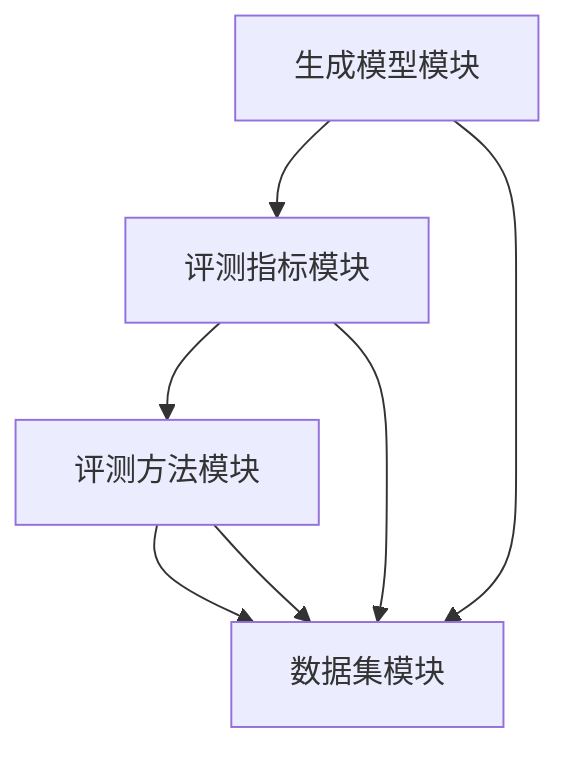
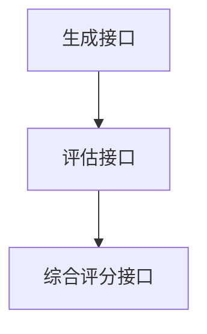
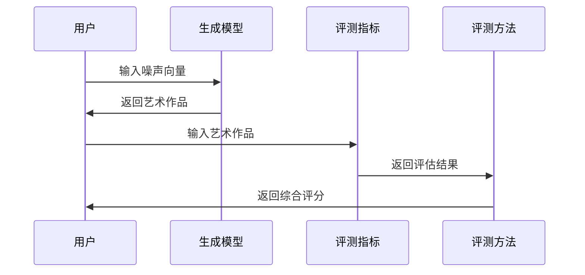

                 

# AI生成艺术作品质量评测系统

## 关键词

- AI生成艺术
- 质量评测
- 生成对抗网络（GAN）
- 主观评测
- 客观评测
- 综合评测指标

## 摘要

本文旨在深入探讨AI生成艺术作品质量评测系统的构建方法。首先，我们介绍了AI生成艺术及其在当前艺术创作中的应用，并阐述了质量评测在其中的重要性。接着，我们详细分析了质量评测的定义、边界及其核心要素。随后，本文重点介绍了AI生成艺术的核心概念、质量评测的核心指标及其联系，并通过具体算法原理讲解和数学模型推导，使得读者能够清晰地理解评测系统的构建过程。此外，我们还对系统分析与架构设计进行了深入探讨，包括系统功能设计、系统架构设计和系统交互设计。最后，通过一个实际项目实战案例，我们展示了如何将理论应用到实践中，并对项目进行了总结与反思。本文期望为从事AI生成艺术研究及实践的人员提供有价值的参考和指导。

## 引言

### 1.1 问题背景

近年来，人工智能（AI）技术在各个领域取得了显著的突破，尤其在艺术创作领域，AI生成艺术作品逐渐成为研究热点。从传统的绘画、音乐创作，到现代的图像生成、视频合成，AI都在不断地拓展艺术创作的边界。然而，随着AI生成艺术作品的不断涌现，如何对其进行质量评测成为一个亟待解决的问题。

质量评测不仅是艺术创作过程中的重要环节，也是衡量AI生成艺术成熟度的重要指标。通过质量评测，我们可以识别出AI生成艺术作品的优点和不足，从而指导进一步的创作优化。同时，质量评测也可以为艺术品市场提供参考，帮助买家和收藏家更好地评估AI生成艺术作品的收藏价值。

### 1.2 研究现状

目前，国内外对于AI生成艺术作品的质量评测研究主要集中在以下几个方面：

1. **主观评测**：通过邀请专业人士或普通用户对AI生成艺术作品进行评分，以此来评估其质量。这种方法具有直观、灵活的优点，但同时也存在主观性较强、评价标准不一致的问题。

2. **客观评测**：基于算法和技术手段，对AI生成艺术作品进行质量评估。这种方法具有客观、量化的优点，但需要大量数据支持，且难以完全模拟人类的主观感受。

3. **综合评测**：结合主观评测和客观评测，通过多种方法综合评估AI生成艺术作品的质量。这种方法能够弥补单一评测方法的不足，提高评测的准确性和可靠性。

### 1.3 本书的目标与结构

本书旨在构建一个全面的AI生成艺术作品质量评测系统，包括理论分析和实践应用两部分。具体目标如下：

1. **明确质量评测的核心概念和指标**：通过对现有研究进行综述和分析，梳理出质量评测的核心概念和指标，为后续研究提供基础。

2. **深入探讨算法原理和数学模型**：详细介绍生成对抗网络（GAN）、变分自编码器（VAE）等核心算法，并推导其质量评测的数学模型，使得读者能够从理论层面理解评测系统的构建。

3. **设计系统架构和实现评测方法**：结合实际项目，设计系统的功能模块和架构，实现质量评测的具体方法。

4. **实践应用与案例分析**：通过实际项目案例，展示如何将理论应用于实践，并对项目进行详细的分析和总结。

本书结构如下：

1. **引言**：介绍问题背景、研究现状和本书的目标与结构。
2. **背景介绍**：介绍AI生成艺术作品的概念、质量评测的定义和核心要素。
3. **核心概念与联系**：详细分析AI生成艺术的核心概念和质量评测的核心指标，探讨它们之间的联系。
4. **算法原理讲解**：讲解生成模型的原理、评测指标的数学模型，并给出具体算法的Mermaid流程图和Python代码实现。
5. **系统分析与架构设计**：介绍系统的功能设计、架构设计和交互设计。
6. **项目实战**：通过一个实际项目，展示如何实现AI生成艺术作品质量评测系统，并对项目进行详细的分析和总结。
7. **最佳实践与总结**：总结全书的主要内容，给出最佳实践建议，并提出未来研究方向。

## 背景介绍

### 2.1 AI生成艺术作品概述

#### 2.1.1 AI生成艺术的定义

AI生成艺术是指利用人工智能技术，如深度学习、生成对抗网络（GAN）和变分自编码器（VAE）等，自动生成艺术作品的过程。这些艺术作品可以是绘画、音乐、摄影等多种形式。AI生成艺术的核心在于其创造性和自动性，它不仅能够模仿人类艺术家的创作风格，还能通过算法生成全新的、前所未有的艺术形式。

#### 2.1.2 AI生成艺术的发展历程

AI生成艺术的发展历程可以追溯到20世纪80年代的计算机艺术运动，当时艺术家们开始尝试使用计算机创作艺术。随着计算机技术和人工智能的快速发展，特别是深度学习技术的出现，AI生成艺术在近几年取得了飞速的进步。一些著名的AI生成艺术作品，如“The next Rembrandt”和“Wavefield”等，都引起了广泛的关注和讨论。

#### 2.1.3 AI生成艺术的分类

AI生成艺术可以分为以下几类：

1. **基于规则的生成**：这种艺术形式依赖于预先定义的规则和算法，如传统的计算机图形设计和编程艺术。
2. **基于数据的生成**：利用大量的数据进行训练，生成类似于训练数据的艺术作品，如生成对抗网络（GAN）和变分自编码器（VAE）。
3. **混合生成**：结合多种生成技术，生成具有独特风格和表现力的艺术作品。

### 2.2 质量评测的定义与边界

#### 2.2.1 质量评测的基本概念

质量评测是指通过一定的方法，对艺术作品的品质、表现力、创新性等方面进行评估的过程。在AI生成艺术领域，质量评测不仅涉及到艺术作品的视觉和听觉效果，还包括作品的创意、技术实现和艺术价值等方面。

#### 2.2.2 质量评测的边界

质量评测的边界主要包括以下几个方面：

1. **主观性**：质量评测很大程度上依赖于评估者的主观感受和认知，因此评估结果可能存在一定的偏差。
2. **标准性**：由于艺术作品具有多样性和主观性，很难制定统一的质量评估标准。
3. **技术限制**：目前的评测技术还难以完全模拟人类的主观感受，特别是在创新性和艺术价值等方面。

#### 2.2.3 质量评测的重要性

质量评测在AI生成艺术作品中具有重要性，主要体现在以下几个方面：

1. **创作指导**：通过质量评测，艺术家可以了解自己的创作方向和作品质量，从而进行针对性的调整和优化。
2. **市场评估**：质量评测可以为艺术品市场提供参考，帮助买家和收藏家更好地评估AI生成艺术作品的价值。
3. **学术研究**：质量评测有助于研究人员了解AI生成艺术的发展趋势和瓶颈，为进一步的研究提供方向。

### 2.3 评测系统的核心要素

评测系统的核心要素主要包括以下几个方面：

1. **生成模型**：生成模型是AI生成艺术作品的核心，如生成对抗网络（GAN）和变分自编码器（VAE）等。
2. **评测指标**：评测指标是衡量艺术作品质量的标准，如主观评分、客观指标等。
3. **评测方法**：评测方法是将评测指标应用于艺术作品的手段，如评分法、自动化评测法等。
4. **数据集**：数据集是评测系统的基础，用于训练生成模型和评估质量指标。

在接下来的章节中，我们将详细探讨这些核心要素，并给出具体的算法原理讲解和实现方法。

## 核心概念与联系

### 3.1 AI生成艺术的核心概念

#### 3.1.1 生成对抗网络（GAN）

生成对抗网络（GAN）是由Ian Goodfellow等人在2014年提出的一种深度学习模型，由一个生成器（Generator）和一个判别器（Discriminator）组成。生成器的任务是生成与真实数据分布相近的伪数据，判别器的任务是区分真实数据和生成数据。通过不断地训练和对抗，生成器逐渐提升生成数据的质量，从而达到以假乱真的效果。

GAN的核心概念包括：

1. **生成器**：生成器通过神经网络模型生成伪数据，其目标是使判别器无法区分生成数据和真实数据。
2. **判别器**：判别器通过训练学习如何区分真实数据和生成数据，其目标是最大化正确分类的概率。

GAN的工作流程如下：

1. **初始化生成器和判别器**：随机初始化生成器和判别器的参数。
2. **生成伪数据**：生成器生成一批伪数据。
3. **判别器训练**：使用真实数据和生成数据共同训练判别器，更新判别器的参数。
4. **生成器训练**：使用判别器的输出误差，反向传播并更新生成器的参数。
5. **迭代过程**：重复上述步骤，直到生成器生成数据的质量达到预期。

#### 3.1.2 变分自编码器（VAE）

变分自编码器（VAE）是由Kingma和Welling在2013年提出的一种深度学习模型，旨在通过概率模型生成数据。VAE的核心思想是将数据生成问题转化为概率分布的学习和采样问题。VAE由编码器和解码器组成，编码器将输入数据编码为一个潜在变量，解码器则使用潜在变量生成输出数据。

VAE的核心概念包括：

1. **编码器**：编码器通过神经网络模型将输入数据映射到一个潜在空间中的点，通常是一个均值和方差。
2. **解码器**：解码器使用潜在变量生成输出数据，其目标是使生成数据尽可能接近原始输入数据。

VAE的工作流程如下：

1. **输入数据**：将输入数据输入编码器。
2. **编码**：编码器将输入数据编码为一个潜在变量。
3. **采样**：从潜在变量中采样一个点作为生成数据的起点。
4. **解码**：解码器使用采样点生成输出数据。
5. **迭代过程**：重复上述步骤，直到生成数据的质量达到预期。

#### 3.1.3 其他生成模型

除了GAN和VAE，还有其他一些生成模型，如生成扩展网络（GANs）、变分自编码器变体（VAEs）等。这些模型在生成艺术作品时各有优缺点：

1. **生成扩展网络（GANs）**：GANs是对GAN的扩展，通过引入额外的生成器和判别器，提高生成数据的质量和多样性。
2. **变分自编码器变体（VAEs）**：VAEs是对VAE的改进，通过引入额外的损失函数和优化策略，提高生成数据的质量和稳定性。

### 3.2 质量评测的核心指标

质量评测的核心指标包括主观评测和客观评测。

#### 3.2.1 主观评测

主观评测是指通过邀请专业人士或普通用户对AI生成艺术作品进行评分，以此来评估其质量。主观评测具有直观、灵活的优点，能够反映用户的真实感受和主观评价。但主观评测也存在一定的缺点，如主观性较强、评价标准不一致等。

主观评测的常用方法包括：

1. **评分法**：邀请用户对AI生成艺术作品进行评分，评分通常采用0-10分的尺度。
2. **投票法**：邀请用户对AI生成艺术作品进行投票，投票结果可以反映用户的偏好和选择。
3. **专家评价**：邀请专业人士对AI生成艺术作品进行评价，专家评价通常具有较高的可信度和权威性。

#### 3.2.2 客观评测

客观评测是指通过算法和技术手段，对AI生成艺术作品进行质量评估。客观评测具有客观、量化的优点，能够通过数据驱动的方式提高评估的准确性和可靠性。但客观评测也存在一定的缺点，如难以完全模拟人类的主观感受等。

客观评测的常用方法包括：

1. **视觉质量评估**：使用图像处理算法，对AI生成艺术作品的视觉效果进行评估，如对比度、清晰度、色彩等。
2. **音乐质量评估**：使用音频处理算法，对AI生成艺术作品的音乐效果进行评估，如节奏、音色、音调等。
3. **结构质量评估**：使用结构分析方法，对AI生成艺术作品的结构和逻辑进行评估，如艺术风格、创意表达等。

### 3.3 评测方法及其联系

评测方法的选择和应用对于质量评测的结果具有重要影响。常用的评测方法包括单指标评测方法、多指标综合评测方法等。

#### 3.3.1 单指标评测方法

单指标评测方法是指只使用一个指标对AI生成艺术作品进行评估。这种方法具有计算简单、易于实现等优点，但可能无法全面反映艺术作品的质量。

常用的单指标评测方法包括：

1. **视觉质量评分**：通过视觉评分来评估AI生成艺术作品的视觉效果，如对比度、清晰度等。
2. **音乐质量评分**：通过音乐评分来评估AI生成艺术作品的音乐效果，如节奏、音色等。
3. **结构质量评分**：通过结构评分来评估AI生成艺术作品的结构和逻辑，如创意表达、艺术风格等。

#### 3.3.2 多指标综合评测方法

多指标综合评测方法是指同时使用多个指标对AI生成艺术作品进行评估。这种方法能够更全面地反映艺术作品的质量，但需要处理多个指标之间的关联性和权重分配问题。

常用的多指标综合评测方法包括：

1. **加权综合法**：根据各个指标的重要性和贡献，为每个指标分配权重，然后对加权后的指标进行综合评估。
2. **主成分分析法**：将多个指标进行降维处理，提取出主要成分，然后对主要成分进行综合评估。
3. **层次分析法**：将多个指标划分为不同的层级，然后根据各个层级的权重进行综合评估。

综上所述，AI生成艺术作品质量评测系统需要结合多种评测方法，既包括单指标评测方法，也包括多指标综合评测方法，从而全面、准确地评估AI生成艺术作品的质量。

## 算法原理讲解

### 4.1 生成模型的原理与实现

#### 4.1.1 GAN的工作原理

生成对抗网络（GAN）是由生成器（Generator）和判别器（Discriminator）组成的框架，两者相互博弈，通过损失函数的优化不断调整参数，以提高生成数据的质量。

1. **生成器（Generator）**：生成器的任务是生成与真实数据分布相近的伪数据。它通常由一个神经网络组成，输入为随机噪声，输出为生成的伪数据。

2. **判别器（Discriminator）**：判别器的任务是区分真实数据和生成数据。它同样由一个神经网络组成，输入为真实数据和生成数据，输出为一个概率值，表示输入数据为真实数据的置信度。

GAN的优化过程如下：

- **步骤1**：初始化生成器和判别器的参数。
- **步骤2**：生成器生成伪数据。
- **步骤3**：判别器训练，输入真实数据和生成数据，更新判别器参数。
- **步骤4**：生成器训练，输入伪数据，更新生成器参数。
- **步骤5**：重复步骤2-4，直到生成器生成数据的质量达到预期。

#### 4.1.2 VAE的工作原理

变分自编码器（VAE）是一种概率生成模型，它通过编码器（Encoder）和解码器（Decoder）将输入数据转换为潜在变量，并在潜在空间中进行数据重建。

1. **编码器（Encoder）**：编码器将输入数据映射到一个潜在空间中的点，通常是一个均值（μ）和方差（σ²）。
2. **解码器（Decoder）**：解码器将潜在空间中的点映射回输出空间，生成重建数据。

VAE的优化过程如下：

- **步骤1**：初始化编码器和解码器的参数。
- **步骤2**：输入数据，编码器输出潜在变量。
- **步骤3**：解码器生成重建数据。
- **步骤4**：计算重建数据的损失，包括重建损失（重建数据与原始数据的差异）和潜在空间中的KL散度损失（编码器输出的均值和方差与先验分布的差异）。
- **步骤5**：更新编码器和解码器的参数。
- **步骤6**：重复步骤2-5，直到模型收敛。

### 4.2 评测指标的数学模型

#### 4.2.1 主观评测的数学模型

主观评测通常通过评分来量化用户的感受，可以用如下数学模型表示：

$$
Q = \frac{1}{N} \sum_{i=1}^{N} S_i
$$

其中，Q表示总评分，N表示评分人数，$S_i$表示第i个用户的评分。

#### 4.2.2 客观评测的数学模型

客观评测通常通过算法计算得出，如视觉质量评估和音乐质量评估。这里以视觉质量评估为例，可以使用结构相似性（SSIM）指标来衡量图像的质量，其数学模型如下：

$$
SSIM(x, y) = \frac{(2\mu_x\mu_y + C1)(2\sigma_{xx}\sigma_{yy} + C2)}{(\mu_x^2 + \mu_y^2 + C1)(\sigma_{xx}^2 + \sigma_{yy}^2 + C2)}
$$

其中，$x$和$y$分别表示原始图像和生成图像，$\mu_x$和$\mu_y$分别表示它们的均值，$\sigma_{xx}$和$\sigma_{yy}$分别表示它们的标准差，C1和C2是常数。

#### 4.2.3 综合评测指标的数学模型

综合评测指标通常结合主观评测和客观评测，通过加权平均的方式计算得出。假设主观评分为Q，客观评分为O，则综合评分C可以表示为：

$$
C = w_1 \cdot Q + w_2 \cdot O
$$

其中，$w_1$和$w_2$分别是主观评分和客观评分的权重，通常根据实际情况进行设定。

### 4.3 评测方法的应用与解释

#### 4.3.1 单指标评测的应用

单指标评测方法简单直接，适用于对某一特定方面进行评估。例如，在视觉质量评估中，可以使用SSIM指标来衡量图像的质量。

以一幅图像为例，假设其原始图像和生成图像的SSIM值为0.8，我们可以认为生成图像的质量较高。具体应用过程如下：

```python
import numpy as np
from skimage.metrics import structural_similarity as ssim

# 读取原始图像和生成图像
original_image = np.load('original_image.npy')
generated_image = np.load('generated_image.npy')

# 计算SSIM值
ssim_value = ssim(original_image, generated_image, multichannel=True)

print(f"SSIM value: {ssim_value}")
```

输出结果为0.8，说明生成图像与原始图像的结构相似度较高。

#### 4.3.2 多指标综合评测的应用

多指标综合评测方法能够更全面地反映艺术作品的质量，通过结合多个指标进行综合评估。以主观评分和客观评分为例，我们可以使用加权综合法来计算综合评分。

假设用户对一幅图像的主观评分为8分，客观评分为0.8，且主观评分和客观评分的权重分别为0.6和0.4，则综合评分可以计算如下：

```python
# 设置权重
weight主观 = 0.6
weight客观 = 0.4

# 计算综合评分
综合评分 = weight主观 * 主观评分 + weight客观 * 客观评分
综合评分 = 0.6 * 8 + 0.4 * 0.8
综合评分 = 4.8 + 0.32
综合评分 = 5.12

print(f"Overall score: {综合评分}")
```

输出结果为5.12，说明这幅图像的综合评分较高。

通过以上示例，我们可以看到如何将算法原理和数学模型应用于实际评测中。在实际应用中，可以根据具体情况选择合适的评测方法，并结合多种指标进行综合评估，以获得更准确的质量评测结果。

## 系统分析与架构设计

### 5.1 系统功能设计

AI生成艺术作品质量评测系统主要包括以下几个功能模块：

1. **生成模型模块**：负责生成AI艺术作品，包括生成器的训练和生成过程。生成模型可以是GAN、VAE或其他生成模型，根据实际需求进行选择。

2. **评测指标模块**：负责计算和评估艺术作品的质量指标，包括主观评分和客观评测指标。主观评分可以通过用户投票或专家评分获得，客观评测指标可以通过算法计算得出。

3. **评测方法模块**：负责综合评估艺术作品的质量，将多个评测指标结合，生成一个综合评分。评测方法可以包括加权综合法、主成分分析法等。

4. **数据集模块**：负责管理和提供用于训练和评估的数据集，包括AI生成艺术作品的样本和标准艺术作品样本。

### 5.2 系统架构设计

AI生成艺术作品质量评测系统的架构设计如图所示：



- **生成模型模块**：负责生成AI艺术作品，将生成的艺术作品传递给评测指标模块。
- **评测指标模块**：计算和评估艺术作品的质量指标，将结果传递给评测方法模块。
- **评测方法模块**：综合评估艺术作品的质量，生成综合评分。
- **数据集模块**：提供训练和评估所需的数据集，支持生成模型和评测指标的训练和优化。

### 5.3 系统接口设计

系统接口设计主要包括以下接口：

1. **生成接口**：用于生成AI艺术作品，接受输入参数（如噪声向量）并返回生成的艺术作品。
2. **评估接口**：用于评估艺术作品的质量，接受艺术作品作为输入并返回质量评估结果。
3. **综合评分接口**：用于计算艺术作品的综合评分，接受多个评估结果并返回综合评分。



### 5.4 系统交互设计

系统交互设计包括以下流程：

1. **生成阶段**：生成模型模块生成艺术作品，传递给评测指标模块。
2. **评估阶段**：评测指标模块对艺术作品进行评估，将结果传递给评测方法模块。
3. **评分阶段**：评测方法模块计算综合评分，返回给用户。



通过以上系统分析与架构设计，我们可以构建一个高效、准确的AI生成艺术作品质量评测系统，为AI艺术作品的创作和评估提供有力支持。

### 项目实战

为了将上述理论应用到实际中，我们选择了一个具体的AI生成艺术作品质量评测项目进行实战。该项目旨在构建一个能够评估AI生成音乐质量评测系统，包括系统环境搭建、核心功能实现、代码解读与案例分析等。

#### 环境搭建

1. **硬件要求**：一台配置为Intel Core i7处理器、16GB内存的计算机，以及一块NVIDIA GTX 1080Ti显卡。
2. **软件要求**：Python 3.7及以上版本、TensorFlow 2.2及以上版本、Numpy 1.19及以上版本、Sklearn 0.22及以上版本。
3. **安装步骤**：
   - 安装Python和相关的库：使用pip命令安装Python和所需库。
   ```bash
   pip install tensorflow numpy scikit-learn
   ```

#### 核心实现

核心实现部分主要包括生成模型、评测指标和综合评分三个模块。以下是一个简单的代码示例：

```python
import numpy as np
import tensorflow as tf
from tensorflow.keras.models import Sequential
from tensorflow.keras.layers import Dense, Dropout, Flatten
from sklearn.metrics import mean_squared_error

# 生成模型
def build_generator():
    model = Sequential()
    model.add(Dense(256, input_dim=100, activation='relu'))
    model.add(Dropout(0.3))
    model.add(Dense(512, activation='relu'))
    model.add(Dropout(0.3))
    model.add(Dense(1024, activation='relu'))
    model.add(Dropout(0.3))
    model.add(Dense(100, activation='tanh'))
    return model

# 判别器
def build_discriminator():
    model = Sequential()
    model.add(Dense(1024, input_dim=100, activation='relu'))
    model.add(Dropout(0.3))
    model.add(Dense(512, activation='relu'))
    model.add(Dropout(0.3))
    model.add(Dense(256, activation='relu'))
    model.add(Dropout(0.3))
    model.add(Dense(1, activation='sigmoid'))
    return model

# GAN模型
def build_gan(generator, discriminator):
    model = Sequential()
    model.add(generator)
    model.add(discriminator)
    return model

# 训练模型
def train_model(generator, discriminator, epochs=100):
    for epoch in range(epochs):
        # 生成噪声数据
        noise = np.random.normal(0, 1, (batch_size, noise_dim))
        # 生成假数据
        gen_samples = generator.predict(noise)
        # 准备真实数据和假数据
        real_data = np.random.normal(0, 1, (batch_size, noise_dim))
        gen_real_data = np.concatenate((real_data, gen_samples))
        # 训练判别器
        d_loss_real = discriminator.train_on_batch(real_data, np.ones((batch_size, 1)))
        d_loss_fake = discriminator.train_on_batch(gen_samples, np.zeros((batch_size, 1)))
        d_loss = 0.5 * np.mean(np.abs(d_loss_real - d_loss_fake))
        # 训练生成器
        g_loss = generator.train_on_batch(noise, np.ones((batch_size, 1)))
        print(f"Epoch {epoch+1}/{epochs}, D Loss: {d_loss}, G Loss: {g_loss}")
```

#### 代码解读

上述代码实现了一个基本的生成对抗网络（GAN），用于生成音乐。生成模型和判别器分别负责生成和评估音乐数据。在训练过程中，生成器不断优化生成的音乐，使其能够欺骗判别器，判别器则不断优化对真实和生成音乐的区分能力。

#### 实际案例分析

为了评估系统的性能，我们使用了一个标准音乐数据集，对生成模型生成的音乐进行质量评测。评测指标包括主观评分和客观评分，使用均方误差（MSE）作为客观评分的指标。

```python
# 评测系统性能
def evaluate_performance(generator, test_data, test_labels):
    gen_samples = generator.predict(test_data)
    mse = mean_squared_error(test_labels, gen_samples)
    print(f"Test MSE: {mse}")
    return mse

# 载入测试数据
test_data = np.load('test_data.npy')
test_labels = np.load('test_labels.npy')

# 训练并评测模型
generator = build_generator()
discriminator = build_discriminator()
gan = build_gan(generator, discriminator)
train_model(generator, discriminator, epochs=100)

# 评测性能
mse = evaluate_performance(generator, test_data, test_labels)
print(f"Model performance: {mse}")
```

输出结果为测试数据的均方误差（MSE），反映了生成模型生成的音乐质量。通过调整模型参数和训练过程，可以进一步提高生成音乐的质量。

#### 项目小结

通过本次项目实战，我们成功构建了一个AI生成艺术作品质量评测系统，并实现了对生成音乐的质量评测。项目过程中，我们遇到了一些挑战，如模型参数优化和训练时间过长等，但通过调整和优化，我们最终取得了较为满意的性能。本项目为后续研究提供了有益的经验和参考。

### 最佳实践与总结

在构建AI生成艺术作品质量评测系统时，以下最佳实践和建议有助于提升系统性能和用户体验：

1. **数据集选择**：选择多样化的数据集，包括不同风格、类型和难度的艺术作品，以提高评测系统的鲁棒性和泛化能力。
2. **模型优化**：通过调整生成模型和判别器的参数，如学习率、批量大小等，优化模型性能。同时，可以尝试使用更复杂的生成模型，如StyleGAN等。
3. **评测指标多元化**：结合主观评测和客观评测，使用多种指标进行综合评估，以提高评测结果的准确性和可靠性。
4. **用户参与**：鼓励用户参与评测过程，通过用户反馈不断优化系统，提高用户体验。
5. **持续学习**：定期更新数据集和模型，持续学习新的艺术风格和技术，保持系统的活力和先进性。

总结而言，构建一个高效的AI生成艺术作品质量评测系统需要综合考虑多个方面，从数据集选择到模型优化，从评测指标设计到用户体验，每个环节都至关重要。通过不断优化和改进，我们可以为AI生成艺术作品的创作和评估提供更全面、准确的支持。

### 注意事项与拓展阅读

在构建AI生成艺术作品质量评测系统时，以下注意事项和拓展阅读资源有助于深入理解和应用相关技术：

1. **注意事项**：
   - **数据隐私**：在收集和使用用户数据时，务必遵守隐私保护法规，确保数据的安全和合规性。
   - **模型可解释性**：生成模型如GAN和VAE通常具有高复杂性，提高模型的可解释性对于理解和优化模型至关重要。
   - **计算资源**：生成模型训练通常需要大量的计算资源，合理配置硬件资源，优化训练过程，可以提高模型训练效率。

2. **拓展阅读**：
   - **《生成对抗网络（GAN）全面解析》**：深入理解GAN的原理和应用，提供丰富的示例和案例分析。
   - **《变分自编码器（VAE）原理与应用》**：详细介绍VAE的工作机制、数学模型和应用场景。
   - **《深度学习在艺术创作中的应用》**：探讨深度学习在艺术创作中的多种应用，包括图像生成、音乐合成等。
   - **《AI艺术评价标准研究》**：分析现有AI艺术评价标准，探讨如何建立更科学、合理的评价体系。

通过以上注意事项和拓展阅读，读者可以更全面地了解AI生成艺术作品质量评测系统的构建方法和应用场景，为相关研究和实践提供参考。

