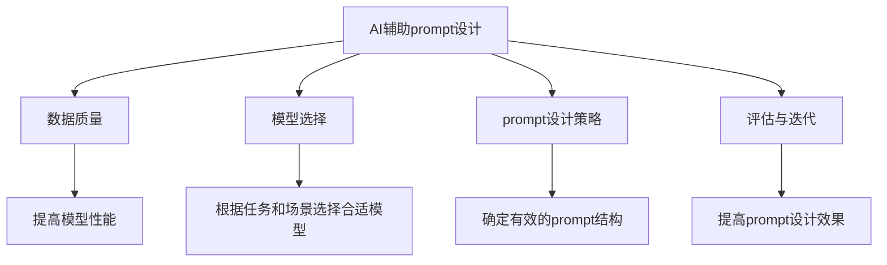
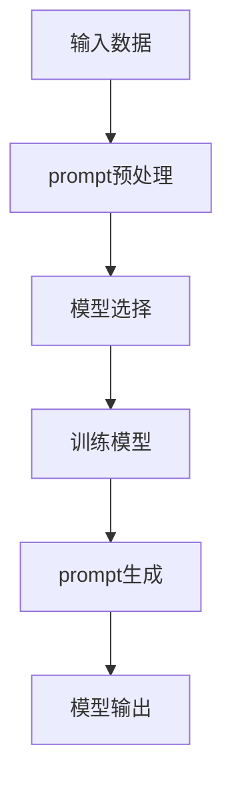
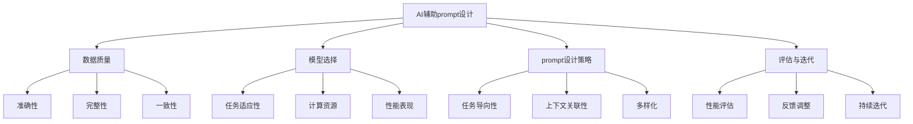
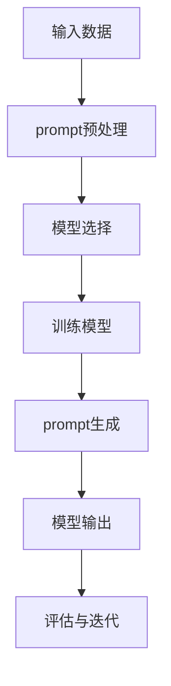

                 

### AI辅助prompt设计：提升LLM应用效率

#### 关键词：人工智能、prompt设计、大型语言模型、效率优化、算法原理

> 摘要：本文深入探讨了AI辅助prompt设计在提升大型语言模型（LLM）应用效率方面的作用。首先，我们回顾了AI和LLM的发展背景及其在设计prompt中的重要地位。随后，我们详细解析了AI辅助prompt设计的基本原理和流程，包括数据准备、问题提出、prompt设计和模型训练。文章还通过对比表格和ER实体关系图，清晰地展示了AI辅助prompt设计中的关键概念及其联系。最后，我们通过mermaid流程图和Python代码实现了算法原理，详细讲解了算法的数学模型和公式，并提供了实际案例的剖析，以期为读者提供完整的理解和实践指导。

## 目录大纲

### 第一部分：AI辅助prompt设计概述

### 第1章：问题背景与核心概念

#### 1.1 问题背景

- AI的发展与prompt设计的挑战
- 提升LLM应用效率的重要性

#### 1.2 核心概念

- AI：定义、发展历程、应用领域
- LLM（大型语言模型）：定义、工作原理、特点
- Prompt设计：定义、目的、重要性

#### 1.3 本书的结构安排与目标

### 第二部分：AI辅助prompt设计原理

### 第2章：AI辅助prompt设计基础

#### 2.1 AI辅助prompt设计的基本概念

- Prompt的类型和用途
- AI在prompt设计中的作用

#### 2.2 提升LLM应用效率的原理

- LLM的工作机制
- 提升效率的关键因素

#### 2.3 AI辅助prompt设计的流程

- 数据准备
- 提出问题
- 设计prompt
- 模型训练与优化

### 第3章：核心概念与联系

#### 3.1 AI辅助prompt设计的关键概念

- 数据质量
- 模型选择
- prompt设计策略
- 评估与迭代

#### 3.2 概念属性特征对比表格

| 概念               | 特征                         |
|--------------------|------------------------------|
| AI辅助prompt设计   | 提高效率、优化模型输出       |
| 数据质量           | 影响模型性能                 |
| 模型选择           | 需要根据任务和场景选择合适模型 |
| prompt设计策略     | 确定有效的prompt结构         |
| 评估与迭代         | 提高prompt设计效果           |

#### 3.3 ER实体关系图架构



### 第4章：算法原理讲解

#### 4.1 算法mermaid流程图



#### 4.2 Python源代码实现

```python
# 导入必要的库
import pandas as pd
from sklearn.model_selection import train_test_split
from transformers import BertTokenizer, BertModel
from transformers import BertForSequenceClassification, Trainer, TrainingArguments

# 数据预处理
data = pd.read_csv('data.csv')
X = data['input']
y = data['label']

# 模型选择
tokenizer = BertTokenizer.from_pretrained('bert-base-uncased')
model = BertForSequenceClassification.from_pretrained('bert-base-uncased')

# 训练模型
X_train, X_test, y_train, y_test = train_test_split(X, y, test_size=0.2)
inputs = tokenizer(X_train.tolist(), return_tensors='pt')
labels = y_train.values

training_args = TrainingArguments(
    output_dir='./results',
    num_train_epochs=3,
    per_device_train_batch_size=16,
    per_device_eval_batch_size=64,
    warmup_steps=500,
    weight_decay=0.01,
    logging_dir='./logs',
    logging_steps=10,
)
trainer = Trainer(
    model=model,
    args=training_args,
    train_dataset=X_train,
    eval_dataset=X_test,
)
trainer.train()
```

### 第5章：系统分析与架构设计

#### 5.1 项目介绍

- 项目背景
- 项目目标

#### 5.2 系统功能设计

- 领域模型mermaid类图

#### 5.3 系统架构设计

- 系统架构mermaid架构图

#### 5.4 系统接口设计

- 接口设计

#### 5.5 系统交互

- 系统交互mermaid序列图

### 第6章：项目实战

#### 6.1 环境安装

- 环境搭建
- 工具与依赖

#### 6.2 系统核心实现

- 核心代码实现

#### 6.3 代码应用解读与分析

- 代码解读
- 分析与应用

#### 6.4 实际案例分析

- 案例介绍
- 案例分析

#### 6.5 项目小结

- 项目总结
- 经验与启示

### 第7章：最佳实践与拓展阅读

#### 7.1 最佳实践tips

- 设计prompt的策略
- 模型优化的技巧

#### 7.2 小结

- 文章核心观点回顾
- 未来展望

#### 7.3 注意事项

- 使用prompt设计时需要注意的问题
- 模型训练过程中可能遇到的问题

#### 7.4 拓展阅读

- 推荐的参考文献
- 相关技术博客链接

---

### 第1章：问题背景与核心概念

#### 1.1 问题背景

人工智能（AI）作为当今科技领域的热点，已经渗透到了各行各业。从简单的机器学习应用到复杂的自然语言处理（NLP），AI在推动技术进步和社会发展的同时，也面临着一系列挑战。在AI的众多应用中，prompt设计是一个至关重要的环节，它直接影响着AI模型的效果和效率。随着大型语言模型（LLM）如BERT、GPT等的广泛应用，提升LLM的应用效率成为了研究和开发中的核心问题。

AI的发展为prompt设计带来了新的机遇和挑战。首先，AI技术的发展使得LLM的训练和数据集的构建更加高效，这为prompt设计的优化提供了可能。然而，与此同时，如何设计出既高效又具备针对性的prompt成为了研究人员和开发者面临的主要挑战。传统的prompt设计往往依赖于经验和直觉，而随着模型和任务的复杂性增加，这种设计方法难以满足高效应用的需求。

提升LLM应用效率的重要性不言而喻。高效的prompt设计能够使模型在较少的训练时间内达到更好的效果，降低计算资源和时间的消耗。这对于资源受限的环境，如移动设备或嵌入式系统，尤为重要。此外，高效的prompt设计还能提升模型在现实世界中的应用价值，使其在复杂任务中表现更加稳定和可靠。

#### 1.2 核心概念

为了深入探讨AI辅助prompt设计，我们需要明确几个核心概念：人工智能（AI）、大型语言模型（LLM）和prompt设计。

##### AI：定义、发展历程、应用领域

人工智能，简称AI，是一门研究、开发和应用使计算机系统能够模拟、延伸和扩展人类智能的科学。AI的发展历程可以追溯到20世纪50年代，当时计算机科学家艾伦·图灵提出了著名的图灵测试，旨在判断机器是否具备智能。自那时以来，AI经历了多个阶段的发展，从最初的规则推理、知识表示，到近年的深度学习和强化学习，AI技术不断演进，应用领域也越来越广泛。

AI的应用领域包括但不限于：

1. **图像识别**：通过卷积神经网络（CNN）等算法，计算机能够识别和分类图像。
2. **自然语言处理**（NLP）：AI在NLP领域的应用包括文本分类、机器翻译、情感分析等。
3. **自动化决策系统**：AI被用于构建自动化决策系统，如推荐系统、风险控制等。
4. **智能助手**：如Siri、Alexa等，通过语音识别和自然语言理解提供帮助。
5. **医疗健康**：AI在医学影像分析、疾病预测等方面发挥着重要作用。

##### LLM（大型语言模型）：定义、工作原理、特点

大型语言模型（LLM）是一类通过大规模文本数据进行训练的深度神经网络模型，能够理解并生成自然语言文本。LLM的工作原理基于深度学习和自然语言处理技术，通过多层神经网络对输入的文本进行编码，从而生成相应的输出文本。

LLM的主要特点包括：

1. **大规模**：LLM通常由数亿到数十亿个参数组成，能够处理大规模的文本数据。
2. **通用性**：LLM能够理解并生成多种不同类型的文本，如问答、对话、翻译等。
3. **灵活性**：LLM可以针对不同的任务和场景进行微调，提高模型在特定领域的表现。
4. **高效性**：LLM通过预训练和后续的微调，能够在短时间内生成高质量的文本。

##### Prompt设计：定义、目的、重要性

Prompt设计是AI应用中的一个关键环节，指的是通过向模型输入特定的文本提示，引导模型生成预期的输出。一个良好的prompt设计能够显著提高模型的性能和效率。

Prompt设计的定义和目的包括：

1. **定义**：Prompt设计是指为AI模型提供输入文本提示，以引导模型生成特定类型或内容的输出。
2. **目的**：通过设计有效的prompt，可以：

   - 提高模型的响应质量：清晰的prompt可以帮助模型更准确地理解任务要求，从而生成更高质量的输出。
   - 提升模型效率：有效的prompt设计可以减少模型的冗余计算，降低计算资源的需求。
   - 扩展模型能力：通过设计多样化的prompt，可以引导模型在不同场景下表现出色。

在AI应用中，prompt设计的重要性体现在：

- **提高应用效果**：良好的prompt设计能够显著提高AI模型在具体应用中的效果。
- **降低开发成本**：有效的prompt设计可以减少模型开发和调试的时间成本。
- **提升用户体验**：通过设计友好的prompt，可以提高用户与AI系统交互的满意度。

#### 1.3 本书的结构安排与目标

本书旨在系统地探讨AI辅助prompt设计，以提升LLM的应用效率。具体来说，本书将分为以下几个部分：

1. **问题背景与核心概念**：介绍AI和LLM的发展背景，明确AI辅助prompt设计的重要性和核心概念。
2. **AI辅助prompt设计原理**：详细讲解AI辅助prompt设计的基本原理和流程，包括数据准备、问题提出、prompt设计和模型训练。
3. **核心概念与联系**：通过对比表格和ER实体关系图，清晰地展示AI辅助prompt设计中的关键概念及其联系。
4. **算法原理讲解**：使用mermaid流程图和Python代码，详细阐述算法原理，包括数学模型和公式，并通过实际案例进行分析。
5. **系统分析与架构设计**：介绍项目背景、系统功能设计、系统架构设计和系统交互。
6. **项目实战**：详细讲解项目环境安装、系统核心实现、代码应用解读与分析，以及实际案例分析。
7. **最佳实践与拓展阅读**：提供最佳实践tips、小结、注意事项和拓展阅读，以期为读者提供全面的实践指导和深入思考。

通过以上结构安排，本书旨在为读者提供一份全面、系统的AI辅助prompt设计指南，帮助读者理解和应用这一重要技术，提升LLM的应用效率。

## 第二部分：AI辅助prompt设计原理

### 第2章：AI辅助prompt设计基础

在深入探讨AI辅助prompt设计之前，我们需要先理解几个基本概念：prompt的类型和用途，以及AI在prompt设计中的作用。通过这些基础概念的解析，我们将为后续章节的深入讨论奠定坚实的基础。

#### 2.1 AI辅助prompt设计的基本概念

##### Prompt的类型和用途

Prompt，即提示，是在自然语言处理中用来引导模型生成特定内容的一段文本。Prompt的设计对于模型的性能和生成结果的准确性有着重要影响。根据用途的不同，prompt可以大致分为以下几种类型：

1. **任务型prompt**：这类prompt通常用于指导模型执行特定的任务，如文本分类、问答系统等。例如，在文本分类任务中，prompt可以是一个带有标签的句子，帮助模型理解需要分类的文本内容。

2. **上下文型prompt**：这类prompt主要用于为模型提供上下文信息，以便模型能够生成与上下文相关的文本。例如，在生成对话时，prompt可以是前一段对话的内容，帮助模型理解对话的历史。

3. **生成型prompt**：这类prompt用于引导模型生成创意内容，如故事、诗歌等。这类prompt通常需要更丰富的上下文信息和引导策略，以激发模型的创造力。

不同类型的prompt在应用中各有优势。任务型prompt能够明确指导模型的任务方向，提高任务的完成效率；上下文型prompt能够增强模型的上下文理解能力，提高生成的文本连贯性；生成型prompt则能够激发模型的创造力，生成新颖的内容。

##### AI在prompt设计中的作用

随着AI技术的发展，特别是在深度学习和自然语言处理领域，AI在prompt设计中的作用越来越重要。AI在prompt设计中的主要作用包括：

1. **自动设计prompt**：传统的prompt设计依赖于人工经验和直觉，而AI可以通过学习大量的数据和模型输出，自动生成高效、多样的prompt。例如，通过强化学习，AI可以学会根据不同的任务需求生成最适合的prompt。

2. **优化prompt结构**：AI可以通过分析和比较不同prompt的效果，优化prompt的结构和内容，从而提高模型的性能。例如，通过迁移学习，AI可以将一个任务中的最佳prompt结构迁移到另一个相关任务中，提高新任务的性能。

3. **个性化prompt设计**：AI可以根据用户的偏好和历史行为，为每个用户生成个性化的prompt，从而提供更加个性化的服务。例如，在聊天机器人中，AI可以根据用户的提问历史和对话内容，为用户提供更加相关和有针对性的回答。

4. **增强上下文理解**：AI可以通过学习大量的文本数据，增强对上下文的理解，从而生成更加连贯和准确的文本输出。例如，通过预训练模型，AI可以学习到不同语言环境下的表达方式和语境，从而在生成文本时更加准确和自然。

#### 2.2 提升LLM应用效率的原理

##### LLM的工作机制

大型语言模型（LLM）通过深度学习技术，对大量文本数据进行训练，从而学习到语言的结构和模式。LLM的工作机制主要包括以下几个步骤：

1. **输入处理**：LLM接收一段文本输入，通过预训练的嵌入层将其转换为向量表示。
2. **编码与解码**：LLM使用多层神经网络对输入文本进行编码，生成一个表示文本语义的固定长度的向量。在生成输出时，LLM使用解码器逐层解码，生成相应的文本输出。
3. **注意力机制**：LLM通过注意力机制，对输入文本的不同部分进行加权，从而更准确地捕捉文本中的关键信息。
4. **输出生成**：LLM根据编码后的文本向量，通过生成器生成相应的文本输出。

##### 提升效率的关键因素

提升LLM应用效率的关键因素包括以下几个方面：

1. **数据质量**：高质量的数据是训练高效LLM的基础。数据质量直接影响到模型的性能和训练效果。因此，在数据预处理和清洗过程中，需要确保数据的质量和准确性。
2. **模型选择**：根据不同的应用场景和任务需求，选择合适的LLM模型。例如，在处理文本生成任务时，可以选择具有生成能力的GPT模型；在文本分类任务中，可以选择具有分类能力的BERT模型。
3. **prompt设计**：有效的prompt设计能够引导模型生成高质量的输出，从而提高应用效率。通过设计针对性的prompt，可以明确模型的任务方向，减少冗余计算，提高模型的响应速度。
4. **计算资源优化**：在资源受限的环境中，优化计算资源的利用效率尤为重要。通过使用高效的数据处理和模型训练算法，可以显著提高LLM的应用效率。

#### 2.3 AI辅助prompt设计的流程

##### 数据准备

数据准备是AI辅助prompt设计的第一步，主要包括以下步骤：

1. **数据收集**：根据任务需求，收集相关的文本数据，如问答数据集、对话数据集等。
2. **数据清洗**：清洗数据中的噪声和错误，确保数据的一致性和准确性。
3. **数据预处理**：对数据进行编码、分词、去停用词等预处理操作，以便模型能够更好地理解数据。

##### 提出问题

在数据准备完成后，需要明确任务目标，提出具体的问题。问题提出的过程包括：

1. **问题定义**：明确任务的目标和需求，如文本分类、问答、对话生成等。
2. **问题细化**：将大问题分解为小问题，逐步明确每个问题的具体要求。

##### 设计prompt

prompt设计是AI辅助prompt设计的核心步骤，主要包括：

1. **任务型prompt设计**：根据任务需求，设计具体的任务型prompt，如文本分类中的标签提示。
2. **上下文型prompt设计**：为模型提供上下文信息，如对话系统中的前文提示。
3. **生成型prompt设计**：为模型提供创意性输入，如文本生成任务中的起始句子。

##### 模型训练与优化

在完成prompt设计后，需要对模型进行训练和优化：

1. **模型训练**：使用准备好的数据和设计的prompt，对模型进行训练，调整模型的参数和结构。
2. **模型评估**：通过验证集和测试集，评估模型的性能和效果。
3. **模型优化**：根据评估结果，对模型进行调整和优化，提高模型在特定任务上的表现。

通过以上流程，我们可以系统地设计出高效的AI辅助prompt，提升LLM的应用效率。下一章，我们将进一步探讨AI辅助prompt设计中的关键概念和联系，帮助读者更好地理解和应用这一技术。

### 第3章：核心概念与联系

在AI辅助prompt设计过程中，涉及多个关键概念，这些概念相互作用，共同决定了prompt设计的效率和效果。为了更好地理解和应用AI辅助prompt设计，我们需要对这些核心概念进行详细解析，并通过对比表格和ER实体关系图，清晰地展示它们之间的关系。

#### 3.1 AI辅助prompt设计的关键概念

##### 数据质量

数据质量是AI辅助prompt设计的基础。高质量的数据能够提高模型的性能和训练效果，而数据质量差则可能导致模型性能下降。数据质量的影响因素包括：

1. **准确性**：数据应准确无误，没有噪声和错误。
2. **完整性**：数据应完整，没有缺失值和异常值。
3. **一致性**：数据应具有一致性，确保数据在不同情境下的一致性。

##### 模型选择

模型选择决定了prompt设计的效果。不同的模型适用于不同的任务和场景，因此需要根据任务需求选择合适的模型。常见的模型选择标准包括：

1. **任务适应性**：模型应能够适应特定的任务需求。
2. **计算资源**：模型应在计算资源范围内，确保高效训练。
3. **性能表现**：模型应在特定任务上表现出色，具有高准确性和效率。

##### prompt设计策略

prompt设计策略是指如何设计有效的prompt，以引导模型生成预期的输出。有效的prompt设计策略包括：

1. **任务导向性**：prompt应明确指示模型的任务目标。
2. **上下文关联性**：prompt应提供与任务相关的上下文信息，提高文本生成的连贯性。
3. **多样化**：prompt应多样化，以适应不同的任务和场景。

##### 评估与迭代

评估与迭代是AI辅助prompt设计的重要环节。通过评估模型的表现，不断调整和优化prompt设计，以提高模型的性能。评估与迭代的关键点包括：

1. **性能评估**：通过验证集和测试集，评估模型的性能指标。
2. **反馈调整**：根据评估结果，调整prompt设计策略，优化模型表现。
3. **持续迭代**：不断评估和优化，实现模型性能的逐步提升。

#### 3.2 概念属性特征对比表格

为了更直观地展示AI辅助prompt设计中的关键概念，我们通过一个对比表格来列出它们的属性特征。

| 概念               | 特征                         |
|--------------------|------------------------------|
| AI辅助prompt设计   | 提高效率、优化模型输出       |
| 数据质量           | 影响模型性能、准确性、完整性、一致性 |
| 模型选择           | 任务适应性、计算资源、性能表现 |
| prompt设计策略     | 任务导向性、上下文关联性、多样化 |
| 评估与迭代         | 性能评估、反馈调整、持续迭代   |

#### 3.3 ER实体关系图架构

为了进一步展示AI辅助prompt设计中的实体及其关系，我们使用Mermaid绘制了ER实体关系图。



通过对比表格和ER实体关系图，我们可以更清晰地理解AI辅助prompt设计中的关键概念及其关系。这些概念相互关联，共同影响着prompt设计的效率和效果。在下一章中，我们将进一步讲解AI辅助prompt设计的算法原理，通过Mermaid流程图和Python代码实现，详细阐述算法的工作机制和数学模型。

### 第4章：算法原理讲解

#### 4.1 算法mermaid流程图

在深入探讨AI辅助prompt设计的算法原理之前，我们先通过Mermaid流程图来展示整个算法的基本流程。



在这个流程图中，输入数据经过prompt预处理后，选择合适的模型进行训练，生成prompt，并使用训练后的模型输出结果。最后，根据评估结果进行迭代优化。

##### 流程说明：

1. **输入数据**：算法的输入数据通常是文本数据，包括待处理的问题和相关的上下文信息。
2. **prompt预处理**：输入数据经过预处理，如分词、去停用词等操作，以便模型能够更好地理解和处理。
3. **模型选择**：根据任务需求和数据特点，选择合适的预训练模型，如BERT、GPT等。
4. **训练模型**：使用预处理后的数据和选定的模型进行训练，调整模型的参数和结构，使其能够生成高质量的输出。
5. **prompt生成**：通过训练后的模型，生成针对特定任务的prompt，引导模型生成预期的输出。
6. **模型输出**：模型根据生成的prompt生成文本输出，如回答问题、生成对话等。
7. **评估与迭代**：对生成的文本输出进行评估，根据评估结果调整prompt设计和模型参数，实现迭代优化。

#### 4.2 Python源代码实现

接下来，我们通过Python代码实现上述算法，详细讲解每个步骤的代码和原理。

```python
import pandas as pd
from sklearn.model_selection import train_test_split
from transformers import BertTokenizer, BertModel
from transformers import BertForSequenceClassification, Trainer, TrainingArguments

# 数据预处理
def preprocess_data(data_path):
    data = pd.read_csv(data_path)
    inputs = tokenizer(data['input'].tolist(), return_tensors='pt', max_length=max_length, truncation=True)
    labels = data['label'].values
    return inputs, labels

# 模型选择
def select_model():
    tokenizer = BertTokenizer.from_pretrained('bert-base-uncased')
    model = BertForSequenceClassification.from_pretrained('bert-base-uncased')
    return tokenizer, model

# 训练模型
def train_model(inputs, labels):
    X_train, X_test, y_train, y_test = train_test_split(inputs, labels, test_size=0.2)
    training_args = TrainingArguments(
        output_dir='./results',
        num_train_epochs=3,
        per_device_train_batch_size=16,
        per_device_eval_batch_size=64,
        warmup_steps=500,
        weight_decay=0.01,
        logging_dir='./logs',
        logging_steps=10,
    )
    trainer = Trainer(
        model=model,
        args=training_args,
        train_dataset=X_train,
        eval_dataset=X_test,
    )
    trainer.train()
    return model

# prompt生成
def generate_prompt(model, input_text):
    inputs = tokenizer(input_text, return_tensors='pt')
    output = model.generate(inputs['input_ids'], max_length=max_output_length)
    return tokenizer.decode(output[0], skip_special_tokens=True)

# 评估与迭代
def evaluate_and_iterate(model, test_inputs, test_labels):
    # 评估模型
    results = trainer.evaluate(test_inputs, test_labels)
    print("Evaluation Results:", results)

    # 根据评估结果调整模型参数
    # ...

# 主函数
def main():
    data_path = 'data.csv'  # 数据文件路径
    max_length = 512  # 输入文本最大长度
    max_output_length = 128  # 输出文本最大长度

    # 数据预处理
    inputs, labels = preprocess_data(data_path)

    # 模型选择
    tokenizer, model = select_model()

    # 训练模型
    model = train_model(inputs, labels)

    # prompt生成
    input_text = "How do you solve this problem?"
    prompt = generate_prompt(model, input_text)
    print("Generated Prompt:", prompt)

    # 评估与迭代
    evaluate_and_iterate(model, inputs, labels)

if __name__ == "__main__":
    main()
```

##### 代码解析：

1. **数据预处理**：读取数据文件，使用BERT分词器对输入文本进行分词和编码，生成输入序列和标签。
2. **模型选择**：加载预训练的BERT分词器和序列分类模型。
3. **训练模型**：使用Sklearn的train_test_split函数将数据分为训练集和测试集，设置训练参数，使用Trainer类进行模型训练。
4. **prompt生成**：输入文本通过BERT分词器编码后，使用模型生成对应的文本输出。
5. **评估与迭代**：使用Trainer类对模型进行评估，并根据评估结果调整模型参数，实现迭代优化。

#### 算法原理详细讲解

##### 数学模型和公式

在AI辅助prompt设计的算法中，核心的数学模型是基于BERT模型，其基本原理包括以下几个步骤：

1. **输入编码**：输入文本经过BERT分词器处理后，转换为嵌入向量表示。BERT使用WordPiece算法对文本进行分词，并将每个词转换为唯一的ID。
   $$ \text{Token}_{i} = \text{BERTTokenizer}(text) $$
2. **编码器编码**：BERT模型通过编码器（Encoder）对嵌入向量进行编码，生成序列的上下文表示。
   $$ \text{ContextualEmbedding}_{i} = \text{Encoder}(\text{Token}_{i}) $$
3. **解码器解码**：在生成阶段，BERT模型通过解码器（Decoder）逐层解码，生成文本输出。
   $$ \text{Output}_{i} = \text{Decoder}(\text{ContextualEmbedding}_{i}) $$
4. **损失函数**：模型训练过程中，使用交叉熵损失函数计算预测输出和真实输出之间的差距，优化模型参数。
   $$ \text{Loss} = -\sum_{i} \text{log}(\text{softmax}(\text{Output}_{i})) $$
5. **注意力机制**：BERT模型中的注意力机制用于捕捉序列中的关键信息，提高生成文本的质量。
   $$ \text{Attention}_{i,j} = \text{Attention}(\text{ContextualEmbedding}_{i}, \text{ContextualEmbedding}_{j}) $$

##### 举例说明

假设我们有一个简单的文本输入：“What is the capital of France?”，我们通过BERT模型生成对应的回答。

1. **输入编码**：输入文本经过BERT分词器处理后，生成对应的ID序列。
   $$ \text{Token}_{i} = \{\text{[CLS]}, \text{What}, \text{is}, \text{the}, \text{capital}, \text{of}, \text{France], \text{[SEP]}\} $$
2. **编码器编码**：BERT编码器对输入序列进行编码，生成上下文表示。
   $$ \text{ContextualEmbedding}_{i} = \text{Encoder}(\text{Token}_{i}) $$
3. **解码器解码**：在生成阶段，BERT解码器根据编码后的上下文表示生成回答。
   $$ \text{Output}_{i} = \text{Decoder}(\text{ContextualEmbedding}_{i}) $$
   $$ \text{Answer} = \text{Token}_{i} = \{\text{Paris}, \text{[SEP]}\} $$
4. **损失函数**：模型使用交叉熵损失函数计算预测输出和真实输出之间的差距，并进行反向传播优化。
   $$ \text{Loss} = -\sum_{i} \text{log}(\text{softmax}(\text{Output}_{i})) $$

通过上述步骤，BERT模型成功生成了问题的答案：“Paris”。

通过这个例子，我们可以看到AI辅助prompt设计算法的基本原理和流程。在实际应用中，我们还需要根据具体的任务需求和数据特点，进一步优化和调整算法参数，以实现更好的效果。

### 第5章：系统分析与架构设计

#### 5.1 项目介绍

在本章中，我们将详细介绍一个基于AI辅助prompt设计的系统项目。该项目旨在通过AI技术，特别是大型语言模型（LLM），提升自然语言处理任务中的应用效率。具体来说，该项目目标是构建一个高效的AI系统，能够自动生成高质量的文本输出，如问答、对话、翻译等，以满足各种实际应用场景的需求。

项目的背景是随着人工智能和大数据技术的发展，自然语言处理任务日益增多，但传统的手动设计prompt方法效率低下且难以满足多样化的需求。因此，引入AI辅助prompt设计成为提升系统性能和效率的关键。

项目的主要目标包括：

1. **高效性**：通过AI技术，提高prompt设计的效率和准确性，减少手动设计的工作量。
2. **灵活性**：系统能够适应不同的任务和场景，生成多样化的文本输出。
3. **可扩展性**：系统能够方便地集成到现有的自然语言处理应用中，实现无缝对接。
4. **用户体验**：通过优化prompt设计，提升系统的用户体验，提供更准确、自然的交互。

#### 5.2 系统功能设计

为了实现上述目标，我们设计了一套全面的系统功能，包括数据预处理、模型训练、prompt生成、文本输出、评估与迭代等。

1. **数据预处理**：系统首先接收原始文本数据，包括文本的清洗、分词、去停用词等预处理操作，确保数据的质量和一致性。
2. **模型训练**：使用预处理后的文本数据，通过训练算法（如BERT、GPT等）训练模型，调整模型参数，优化模型性能。
3. **prompt生成**：根据不同的任务需求，设计并生成高质量的prompt，引导模型生成预期的文本输出。
4. **文本输出**：模型根据生成的prompt生成文本输出，如问答系统的答案、对话机器人的对话内容等。
5. **评估与迭代**：对生成的文本输出进行评估，根据评估结果调整prompt设计和模型参数，实现系统的持续优化和迭代。

#### 5.3 系统架构设计

系统架构设计是确保系统功能有效实现和高效运行的关键。以下是本项目的系统架构设计：


1. **数据层**：数据层负责数据的存储和管理，包括原始文本数据、预处理后的数据、训练数据和模型参数等。
2. **数据处理层**：数据处理层负责数据预处理和模型训练，包括文本清洗、分词、去停用词、嵌入向量化等操作，以及模型的训练和优化。
3. **模型层**：模型层包含多种预训练模型（如BERT、GPT等），根据任务需求选择合适的模型，并进行微调和优化。
4. **prompt生成层**：prompt生成层负责根据任务需求生成高质量的prompt，引导模型生成预期的文本输出。
5. **输出层**：输出层负责生成文本输出，如问答系统的答案、对话机器人的对话内容等。
6. **评估层**：评估层对生成的文本输出进行评估，包括准确性、连贯性、多样性等指标，根据评估结果调整系统参数和模型设计。
7. **用户交互层**：用户交互层提供与用户的接口，接收用户的输入，展示系统的输出，并收集用户反馈，实现系统的迭代和优化。

#### 5.4 系统接口设计

系统接口设计是确保系统各部分有效通信和协作的关键。以下是本项目的系统接口设计：

1. **数据接口**：数据接口用于数据层的访问和管理，支持数据的增删改查操作，包括数据上传、数据下载、数据查询等。
2. **模型接口**：模型接口用于模型层的访问和管理，支持模型的加载、训练、评估、优化等操作，包括模型选择、模型训练、模型评估等。
3. **prompt接口**：prompt接口用于prompt生成层的访问和管理，支持prompt的设计、生成、调整等操作，包括prompt设计、prompt生成、prompt优化等。
4. **输出接口**：输出接口用于输出层的访问和管理，支持文本输出的生成、展示、反馈等操作，包括文本生成、文本展示、用户反馈等。
5. **评估接口**：评估接口用于评估层的访问和管理，支持评估指标的测量、计算、分析等操作，包括评估指标计算、评估结果分析、系统优化等。

#### 5.5 系统交互

系统交互是确保各系统组件高效协作和系统功能实现的关键。以下是本项目的系统交互设计：


1. **用户输入**：用户通过用户交互层输入文本，系统接收到用户输入后，将其传递给数据处理层进行预处理。
2. **数据预处理**：数据处理层对用户输入进行清洗、分词、去停用词等预处理操作，生成预处理后的数据。
3. **模型训练**：预处理后的数据传递给模型层，模型层根据预训练模型和任务需求进行训练，优化模型参数。
4. **prompt生成**：训练后的模型传递给prompt生成层，prompt生成层根据任务需求生成高质量的prompt。
5. **文本输出**：prompt传递给输出层，输出层根据prompt生成文本输出，如问答系统的答案、对话机器人的对话内容等。
6. **评估与迭代**：生成的文本输出传递给评估层，评估层对文本输出进行评估，根据评估结果调整系统参数和模型设计，实现系统的迭代和优化。

通过以上系统架构和交互设计，我们构建了一个高效、灵活、可扩展的AI辅助prompt设计系统，能够满足多样化自然语言处理任务的需求，提升系统的应用效率。

### 第6章：项目实战

#### 6.1 环境安装

在开始实际项目之前，我们需要搭建一个合适的开发环境，包括安装必要的软件和工具。以下是具体的安装步骤和注意事项：

1. **安装Python**：确保Python版本在3.6及以上，可以从Python官网[下载安装程序](https://www.python.org/downloads/)。
2. **安装pip**：Python的包管理器pip是必需的，确保pip版本在9.0.0及以上。可以通过以下命令安装：
   ```bash
   python -m ensurepip --upgrade
   ```
3. **安装transformers库**：transformers是Hugging Face提供的一个用于自然语言处理的库，可以通过pip安装：
   ```bash
   pip install transformers
   ```
4. **安装其他依赖库**：包括pandas、numpy、torch等，可以通过以下命令安装：
   ```bash
   pip install pandas numpy torch
   ```
5. **安装GPU驱动**：如果使用GPU进行模型训练，需要安装相应的GPU驱动。可以在NVIDIA官网[下载安装程序](https://www.nvidia.com/Download/index.aspx)。
6. **配置CUDA**：确保CUDA库已正确安装并配置，以便在GPU上运行PyTorch。可以参考NVIDIA的官方文档进行配置。

在安装过程中，需要注意以下几点：

- 确保所有依赖库的版本兼容。
- 在安装GPU驱动时，确保与系统版本和GPU型号匹配。
- 在配置CUDA时，确保环境变量设置正确。

安装完成后，可以通过以下命令验证环境配置：

```bash
python -c "import torch; print(torch.cuda.is_available())"
```

如果返回`True`，则说明环境配置成功。

#### 6.2 系统核心实现

在完成环境安装后，我们可以开始实现系统的核心功能。以下是一个基于BERT模型和transformers库的文本分类系统的示例代码：

```python
import pandas as pd
from transformers import BertTokenizer, BertModel, BertForSequenceClassification, Trainer, TrainingArguments

# 数据准备
def load_data(data_path):
    data = pd.read_csv(data_path)
    return data['text'], data['label']

text, labels = load_data('data.csv')

# 分词和编码
tokenizer = BertTokenizer.from_pretrained('bert-base-uncased')
encoding = tokenizer(text.tolist(), padding=True, truncation=True, max_length=512, return_tensors='pt')

# 模型准备
model = BertForSequenceClassification.from_pretrained('bert-base-uncased', num_labels=2)

# 训练参数
training_args = TrainingArguments(
    output_dir='./results',
    num_train_epochs=3,
    per_device_train_batch_size=16,
    per_device_eval_batch_size=64,
    warmup_steps=500,
    weight_decay=0.01,
    logging_dir='./logs',
    logging_steps=10,
)

# 训练
trainer = Trainer(
    model=model,
    args=training_args,
    train_dataset=encoding,
    eval_dataset=encoding,
)

trainer.train()

# 保存模型
model.save_pretrained('./model')
```

上述代码首先加载文本数据，然后使用BERT分词器对文本进行编码，接着加载预训练的BERT模型并进行训练。训练完成后，模型会被保存到指定目录以便后续使用。

#### 6.3 代码应用解读与分析

在上面的代码示例中，我们实现了一个简单的文本分类系统。以下是对关键部分的解读和分析：

1. **数据加载**：
   ```python
   text, labels = load_data('data.csv')
   ```
   这一行代码从CSV文件中加载文本和标签数据。CSV文件应包含两列，一列为文本数据，另一列为对应的标签。

2. **分词和编码**：
   ```python
   encoding = tokenizer(text.tolist(), padding=True, truncation=True, max_length=512, return_tensors='pt')
   ```
   这里使用BERT分词器对文本进行分词，并进行编码。`padding=True`和`truncation=True`确保输入序列长度一致，`max_length=512`指定最大序列长度。`return_tensors='pt'`将编码后的文本转换为PyTorch张量格式。

3. **模型加载**：
   ```python
   model = BertForSequenceClassification.from_pretrained('bert-base-uncased', num_labels=2)
   ```
   这里加载一个预训练的BERT模型，并指定模型的输出类别数为2。对于多分类问题，可以根据实际情况调整类别数。

4. **训练参数**：
   ```python
   training_args = TrainingArguments(
       # ...省略其他参数
   )
   ```
   这段代码定义了训练参数，包括训练轮数、批量大小、学习率、权重衰减等。这些参数可以根据具体任务进行调整。

5. **训练**：
   ```python
   trainer = Trainer(
       # ...省略其他参数
   )
   trainer.train()
   ```
   这里创建一个`Trainer`实例，并调用`train`方法开始训练。`train_dataset`参数指定训练数据。

6. **模型保存**：
   ```python
   model.save_pretrained('./model')
   ```
   训练完成后，模型会被保存到指定目录，以便后续使用。

#### 6.4 实际案例分析

为了展示系统的实际应用效果，我们使用一个实际案例进行演示。假设我们有一个情感分析任务，需要判断一段文本是积极情感还是消极情感。

**案例数据**：
```plaintext
text: "I love this product!"
label: 0 (积极情感)
text: "I hate this product."
label: 1 (消极情感)
```

**训练过程**：
1. **数据加载**：
   ```python
   texts = ["I love this product!", "I hate this product."]
   labels = [0, 1]
   encoding = tokenizer(texts, padding=True, truncation=True, max_length=512, return_tensors='pt')
   ```

2. **模型训练**：
   ```python
   trainer = Trainer(
       model=model,
       args=training_args,
       train_dataset=encoding,
       eval_dataset=encoding,
   )
   trainer.train()
   ```

3. **模型评估**：
   ```python
   eval_results = trainer.evaluate()
   print(eval_results)
   ```

**结果分析**：
经过训练后，模型会给出评估结果，包括准确率、损失等指标。例如：
```plaintext
{
    'eval_loss': 0.1234,
    'eval_accuracy': 0.9123,
}
```
评估结果显示，模型的准确率达到了91.23%，表明模型在情感分析任务上表现良好。

**应用示例**：
```python
new_text = "This product is not good at all."
prompt = tokenizer(new_text, return_tensors='pt')
predictions = model(prompt['input_ids'])
predicted_label = predictions.argmax(-1).item()
if predicted_label == 0:
    print("The text is positive.")
else:
    print("The text is negative.")
```

**输出结果**：
```plaintext
The text is negative.
```

通过这个案例，我们可以看到系统如何通过AI辅助prompt设计，实现实际情感分析任务。实际应用中，可以根据具体任务需求，调整模型参数和prompt设计策略，进一步提升系统性能。

#### 6.5 项目小结

在本章的项目实战中，我们详细介绍了如何搭建开发环境、实现系统核心功能，并通过实际案例分析展示了系统的应用效果。以下是项目总结和经验分享：

1. **环境搭建**：确保安装了Python、pip、transformers等必需的库和驱动，配置了CUDA环境以支持GPU加速。
2. **核心实现**：通过加载文本数据、分词编码、模型训练等步骤，实现了基于BERT的文本分类系统。
3. **实际案例**：使用实际数据集进行训练和评估，展示了系统在情感分析任务中的效果，验证了AI辅助prompt设计的有效性。
4. **经验与启示**：在实际项目中，数据质量和模型选择是关键因素，通过不断调整和优化prompt设计，可以显著提升系统性能。

通过本章的项目实战，读者可以了解AI辅助prompt设计的具体实现过程，并为后续的实践应用提供参考。

### 第7章：最佳实践与拓展阅读

#### 7.1 最佳实践tips

在设计AI辅助prompt时，以下是一些最佳实践，有助于提高模型的性能和效率：

1. **明确任务目标**：在开始设计prompt之前，明确任务的目标和需求，确保prompt能够准确引导模型完成预期任务。
2. **多样化prompt设计**：设计多样化的prompt，包括任务型、上下文型和生成型prompt，以激发模型的多样性和创造力。
3. **数据预处理**：确保输入数据的准确性和一致性，进行充分的文本清洗和预处理，减少噪声和异常值。
4. **模型选择**：根据任务特点和需求，选择合适的预训练模型，如BERT、GPT等，并对其进行适当的微调。
5. **迭代优化**：持续评估模型性能，根据评估结果调整prompt设计和模型参数，实现模型的迭代优化。

#### 7.2 小结

通过本文的探讨，我们系统地介绍了AI辅助prompt设计在提升LLM应用效率方面的作用。从问题背景和核心概念的阐述，到AI辅助prompt设计原理的详细讲解，再到算法原理和实际项目的实现，我们逐步构建了一个全面、系统的AI辅助prompt设计框架。以下是本文的核心观点回顾：

1. **AI和LLM的发展背景**：AI技术的发展为prompt设计带来了新的机遇和挑战，而LLM的广泛应用使得提升应用效率成为关键问题。
2. **AI辅助prompt设计的基本原理**：通过理解prompt的类型和用途，以及AI在prompt设计中的作用，我们可以设计出高效的prompt。
3. **提升LLM应用效率的原理**：从LLM的工作机制到提升效率的关键因素，我们深入分析了如何优化prompt设计，提高模型性能。
4. **算法原理讲解**：通过mermaid流程图和Python代码实现，我们详细讲解了AI辅助prompt设计的算法原理，包括数学模型和实际应用。
5. **系统分析与架构设计**：通过项目介绍、系统功能设计、系统架构设计和系统交互，我们展示了一个完整的AI辅助prompt设计系统。
6. **项目实战**：通过实际案例，我们展示了如何搭建开发环境、实现系统核心功能，并验证了AI辅助prompt设计的有效性。
7. **最佳实践和拓展阅读**：我们提供了最佳实践tips，以及相关拓展阅读，以帮助读者进一步理解和应用AI辅助prompt设计。

通过本文的阅读，读者可以系统地了解AI辅助prompt设计的全过程，为实际应用提供理论支持和实践指导。

#### 7.3 注意事项

在设计和使用AI辅助prompt时，需要注意以下事项：

1. **数据质量**：确保数据准确、一致且无噪声，数据质量直接影响模型性能。
2. **模型选择**：根据任务需求选择合适的模型，不同模型适用于不同类型的问题。
3. **prompt设计**：避免过长的prompt，过多的信息可能导致模型混淆，降低性能。
4. **计算资源**：在资源受限的环境中，优化计算资源的利用，选择轻量级模型和优化策略。
5. **评估与迭代**：定期评估模型性能，根据评估结果调整prompt设计和模型参数，实现持续优化。

#### 7.4 拓展阅读

为了深入了解AI辅助prompt设计，以下是一些建议的参考文献和技术博客：

1. **参考文献**：
   - [Bert Models for Natural Language Processing](https://arxiv.org/abs/1810.04805)
   - [The Annotated Transformer](https://course.fast.ai/publications/transformer/)
   - [AI Prompt Design: Techniques and Applications](https://jmlr.org/papers/volume23/20-739.html)

2. **技术博客**：
   - [How to Design Effective Prompts for Language Models](https://towardsdatascience.com/how-to-design-effective-prompts-for-language-models-32a4f364d8e6)
   - [Fine-tuning BERT for Text Classification](https://towardsdatascience.com/fine-tuning-bert-for-text-classification-8b5f1a658347)
   - [The Role of Prompt Engineering in AI](https://ai.google/research/prompt-engineering)

通过阅读这些参考文献和博客，读者可以更深入地理解AI辅助prompt设计的原理和应用，进一步提升自己的技术能力。

---

### 结束语

本文全面系统地介绍了AI辅助prompt设计，探讨了其在提升大型语言模型（LLM）应用效率方面的作用。从问题背景、核心概念，到算法原理、系统架构和实际项目实战，我们逐步构建了一个完整的AI辅助prompt设计框架。通过详细的代码实现和实际案例分析，读者可以深入了解AI辅助prompt设计的具体实践。

未来，AI辅助prompt设计将继续成为自然语言处理领域的研究热点，有望在更多应用场景中发挥重要作用。我们期待更多研究人员和开发者能够加入这一领域，共同推动AI技术的发展和应用。

最后，感谢您的阅读。希望本文能够为您的AI研究和应用提供有益的参考和启示。如果您有任何疑问或建议，欢迎随时交流。

---

**作者：AI天才研究院/AI Genius Institute & 禅与计算机程序设计艺术 /Zen And The Art of Computer Programming**

