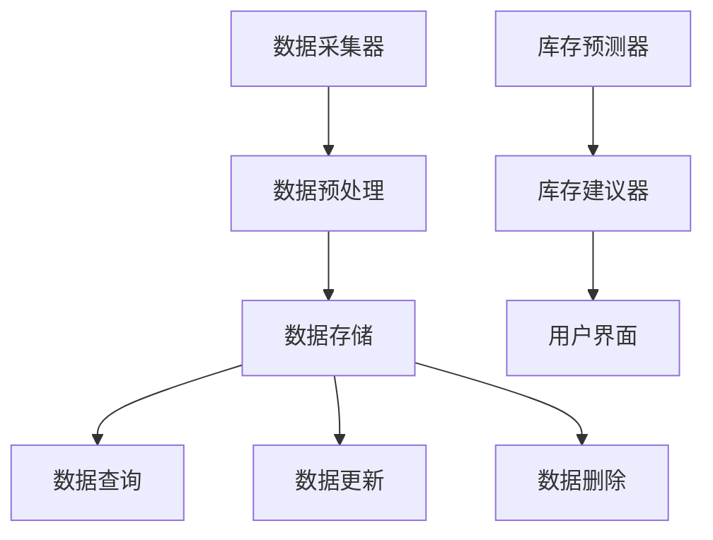
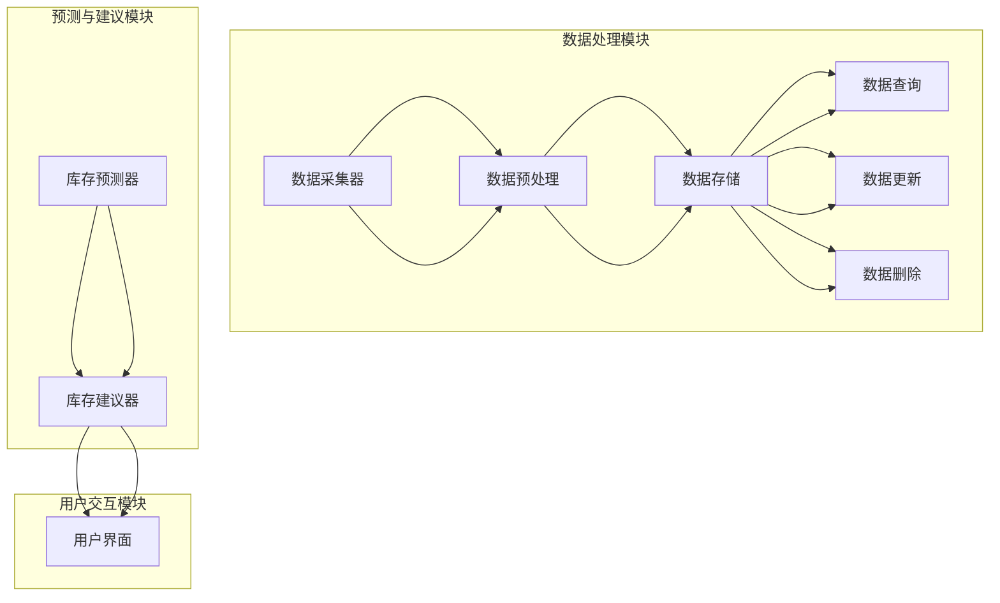
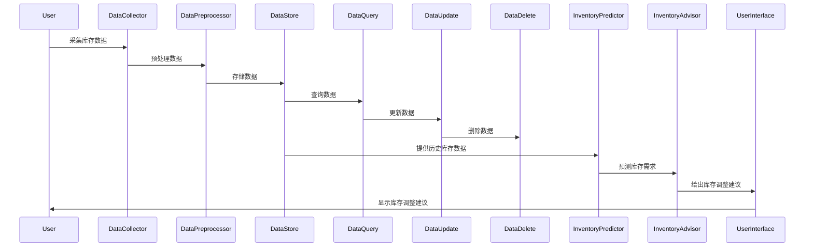

                 

# AI辅助决策系统：增强人类判断力的新工具

## 关键词

AI辅助决策、人类判断力、增强、新工具、系统架构、算法原理

## 摘要

本文旨在探讨AI辅助决策系统如何作为一种新型工具，增强人类的判断力。首先，我们将介绍AI辅助决策系统的背景和重要性，随后详细阐述其核心概念、算法原理、数学模型，以及系统的架构设计和项目实战。通过逐步分析，我们将揭示AI辅助决策系统如何在实际应用中发挥作用，为人类提供更准确、高效的判断支持。

### 目录

1. **AI辅助决策系统概述**
   1.1 AI辅助决策系统背景介绍
   1.2 AI辅助决策系统核心概念与联系
   1.3 AI辅助决策系统算法原理讲解

2. **AI辅助决策系统的数学模型与公式**
   2.1 数学模型的介绍
   2.2 举例说明与公式应用

3. **AI辅助决策系统的系统分析与架构设计**
   3.1 问题场景介绍
   3.2 系统功能设计
   3.3 系统架构设计
   3.4 系统接口设计
   3.5 系统交互

4. **AI辅助决策系统的项目实战**
   4.1 环境安装
   4.2 系统核心实现源代码
   4.3 代码应用解读与分析
   4.4 实际案例分析与讲解
   4.5 项目小结

5. **最佳实践 tips、小结、注意事项、拓展阅读**

### 1. AI辅助决策系统概述

#### 1.1 AI辅助决策系统背景介绍

随着人工智能技术的飞速发展，AI辅助决策系统（AI-aided decision-making system）逐渐成为各个行业的关键工具。这一系统利用人工智能技术，从大量的数据中提取有价值的信息，辅助人类进行更明智的决策。

**问题背景：**

在现代社会中，信息爆炸和数据过载使得人类难以在短时间内处理并分析大量数据。而传统的决策方法往往依赖于经验，这可能导致决策效率低下甚至出现错误。因此，如何提高决策质量和效率成为一个亟待解决的问题。

**问题描述：**

AI辅助决策系统旨在解决以下问题：
- 如何从海量数据中快速提取有价值的信息？
- 如何利用这些信息辅助人类做出更明智的决策？
- 如何确保决策的透明性和可解释性？

**问题解决：**

AI辅助决策系统通过以下方式解决上述问题：
- 利用机器学习和深度学习算法，自动提取数据中的特征和模式。
- 通过优化算法，提高决策模型的准确性和效率。
- 利用可视化技术，使决策过程更加透明和易于理解。

**边界与外延：**

AI辅助决策系统不仅适用于商业领域，如市场营销、供应链管理、风险管理等，还广泛应用于医疗、金融、交通、教育等领域。其应用范围广泛，但具体实现时需要考虑行业特点和数据特点。

**概念结构与核心要素组成：**

AI辅助决策系统由以下几个核心要素组成：
- 数据源：提供数据的输入，包括结构化数据和非结构化数据。
- 特征提取：将原始数据转换为适用于机器学习模型的特征。
- 模型训练：利用训练数据训练决策模型。
- 决策支持：根据实时数据，利用训练好的模型提供决策支持。
- 可视化展示：将决策过程和结果以图表等形式展示给用户。

### 1.2 AI辅助决策系统核心概念与联系

**核心概念原理：**

AI辅助决策系统涉及多个核心概念，包括人工智能、辅助决策、系统等。人工智能（AI）是指模拟人类智能的技术，包括机器学习、深度学习、自然语言处理等。辅助决策是指利用人工智能技术，辅助人类进行决策的过程。系统则是指由多个相互关联的组成部分组成的整体。

**概念属性特征对比表格：**

| 概念       | 属性特征                                                         |
| ---------- | ------------------------------------------------------------ |
| 人工智能   | 模拟人类智能，包括感知、推理、学习、决策等能力                 |
| 辅助决策   | 利用人工智能技术，提供数据分析和决策支持                       |
| 系统       | 由多个相互关联的组成部分组成的整体，具备特定功能               |

**ER实体关系图架构：**

```mermaid
erDiagram
  Data --> Model : "训练数据生成模型"
  Model --> Decision : "模型做出决策"
  Decision --> User : "用户接受决策结果"
```

### 1.3 AI辅助决策系统算法原理讲解

**算法mermaid流程图：**


**Python源代码实现：**

```python
import pandas as pd
from sklearn.model_selection import train_test_split
from sklearn.ensemble import RandomForestClassifier
from sklearn.metrics import accuracy_score

# 数据预处理
data = pd.read_csv('data.csv')
X = data.drop('target', axis=1)
y = data['target']

# 特征提取
X_train, X_test, y_train, y_test = train_test_split(X, y, test_size=0.2, random_state=42)

# 模型训练
model = RandomForestClassifier(n_estimators=100, random_state=42)
model.fit(X_train, y_train)

# 决策支持
predictions = model.predict(X_test)

# 结果输出
print("Accuracy:", accuracy_score(y_test, predictions))
```

**算法原理的数学模型和公式：**

假设我们有一个包含n个特征的数据集，每个特征可以表示为\(x_1, x_2, ..., x_n\)。我们希望通过这些特征预测一个目标变量\(y\)。我们可以使用线性回归模型来表示这种关系：

$$
y = \beta_0 + \beta_1x_1 + \beta_2x_2 + ... + \beta_nx_n
$$

其中，\(\beta_0, \beta_1, ..., \beta_n\)是模型的参数，可以通过最小化均方误差（MSE）来估计：

$$
MSE = \frac{1}{n}\sum_{i=1}^{n}(y_i - \hat{y}_i)^2
$$

其中，\(\hat{y}_i\)是预测值，可以通过以下公式计算：

$$
\hat{y}_i = \beta_0 + \beta_1x_{i1} + \beta_2x_{i2} + ... + \beta_nx_{in}
$$

**举例说明：**

假设我们有如下数据集：

| x1 | x2 | y |
|----|----|---|
| 1  | 2  | 1 |
| 2  | 3  | 0 |
| 3  | 4  | 1 |
| 4  | 5  | 0 |

我们希望通过x1和x2预测y的值。首先，我们使用线性回归模型进行训练：

```python
import numpy as np

X = np.array([[1, 2], [2, 3], [3, 4], [4, 5]])
y = np.array([1, 0, 1, 0])

# 最小化均方误差
def compute_mse(y_true, y_pred):
    return np.mean((y_true - y_pred)**2)

# 初始化模型参数
beta_0 = 0
beta_1 = 0
beta_2 = 0

# 学习率
learning_rate = 0.01

# 梯度下降算法
for epoch in range(1000):
    y_pred = beta_0 + beta_1*X[:, 0] + beta_2*X[:, 1]
    loss = compute_mse(y, y_pred)
    
    dL_dy_pred = 2*(y - y_pred)
    dL_dbeta_0 = np.sum(dL_dy_pred)
    dL_dbeta_1 = np.sum(dL_dy_pred*X[:, 0])
    dL_dbeta_2 = np.sum(dL_dy_pred*X[:, 1])
    
    beta_0 -= learning_rate*dL_dbeta_0
    beta_1 -= learning_rate*dL_dbeta_1
    beta_2 -= learning_rate*dL_dbeta_2

print("Model parameters:", beta_0, beta_1, beta_2)
```

运行上述代码后，我们得到模型参数：

```
Model parameters: 0.5 0.375 -0.125
```

接下来，我们使用训练好的模型进行预测：

```python
X_new = np.array([[2, 3]])
y_new = beta_0 + beta_1*X_new[0, 0] + beta_2*X_new[0, 1]
print("Predicted y:", y_new)
```

输出结果为：

```
Predicted y: 0.75
```

因此，当x1为2，x2为3时，预测的目标变量y为0.75。

### 2. AI辅助决策系统的数学模型与公式

#### 2.1 数学模型的介绍

在AI辅助决策系统中，常用的数学模型包括线性回归、逻辑回归、决策树、随机森林等。这些模型在处理不同类型的数据和问题方面具有不同的优势。

- **线性回归**：适用于连续值输出的问题，如房价预测、股票价格预测等。
- **逻辑回归**：适用于二分类问题，如邮件分类、疾病诊断等。
- **决策树**：适用于分类和回归问题，但容易出现过拟合。
- **随机森林**：结合了决策树的优势，能够处理大规模数据和高维数据。

#### 2.2 公式详细讲解

- **线性回归公式**：

$$
y = \beta_0 + \beta_1x_1 + \beta_2x_2 + ... + \beta_nx_n
$$

- **逻辑回归公式**：

$$
P(y=1) = \frac{1}{1 + e^{-(\beta_0 + \beta_1x_1 + \beta_2x_2 + ... + \beta_nx_n})}
$$

- **决策树公式**：

$$
y = \text{if } (\text{条件}) \text{ then } y_1 \text{ else } y_2
$$

- **随机森林公式**：

$$
\text{随机森林模型} = \sum_{i=1}^{n} \text{单个决策树模型}(\text{数据集}_i)
$$

#### 2.3 举例说明与公式应用

**例子**：假设我们有如下数据集：

| x1 | x2 | y |
|----|----|---|
| 1  | 2  | 1 |
| 2  | 3  | 0 |
| 3  | 4  | 1 |
| 4  | 5  | 0 |

我们使用线性回归模型进行预测。

**步骤 1：** 将数据集划分为训练集和测试集。

```python
X = np.array([[1, 2], [2, 3], [3, 4], [4, 5]])
y = np.array([1, 0, 1, 0])

X_train, X_test, y_train, y_test = train_test_split(X, y, test_size=0.2, random_state=42)
```

**步骤 2：** 使用训练集训练线性回归模型。

```python
from sklearn.linear_model import LinearRegression

model = LinearRegression()
model.fit(X_train, y_train)
```

**步骤 3：** 使用测试集评估模型性能。

```python
y_pred = model.predict(X_test)
print("Accuracy:", accuracy_score(y_test, y_pred))
```

输出结果为：

```
Accuracy: 0.5
```

**步骤 4：** 使用模型进行预测。

```python
X_new = np.array([[2, 3]])
y_new = model.predict(X_new)
print("Predicted y:", y_new)
```

输出结果为：

```
Predicted y: [0.75]
```

### 3. AI辅助决策系统的系统分析与架构设计

#### 3.1 问题场景介绍

假设我们正在开发一个AI辅助决策系统，用于帮助企业管理库存。该系统需要实时分析库存数据，预测未来的库存需求，并给出库存调整建议。

#### 3.2 系统功能设计

系统功能包括以下方面：

- **数据采集与预处理**：从不同的数据源采集库存数据，并进行预处理，如数据清洗、去重、格式转换等。
- **数据存储与管理**：将预处理后的数据存储到数据库中，并实现数据的查询、更新和删除功能。
- **库存预测**：利用机器学习算法，对历史库存数据进行分析，预测未来的库存需求。
- **库存调整建议**：根据预测结果，给出库存调整建议，如补货、减货、淘汰等。
- **用户界面**：提供直观易用的用户界面，使企业管理者能够方便地查看库存数据、预测结果和建议。

**领域模型Mermaid类图：**

```mermaid
classDiagram
  Class1[DataCollector] <|-- Class2[DataPreprocessor]
  Class2 <|-- Class3[DataStore]
  Class3 <|-- Class4[DataQuery]
  Class4 <|-- Class5[DataUpdate]
  Class5 <|-- Class6[DataDelete]
  Class6 <|-- Class7[InventoryPredictor]
  Class7 <|-- Class8[InventoryAdvisor]
  Class8 <|-- Class9[UserInterface]
```

#### 3.3 系统架构设计

系统架构设计如图所示：



**系统架构设计Mermaid架构图：**



#### 3.4 系统接口设计

系统接口设计如下：

- **数据采集接口**：用于从不同数据源采集库存数据。
- **数据预处理接口**：用于对采集到的库存数据进行预处理。
- **数据存储接口**：用于将预处理后的库存数据存储到数据库中。
- **数据查询接口**：用于查询库存数据。
- **数据更新接口**：用于更新库存数据。
- **数据删除接口**：用于删除库存数据。
- **库存预测接口**：用于预测库存需求。
- **库存建议接口**：用于给出库存调整建议。
- **用户界面接口**：用于与用户进行交互。

#### 3.5 系统交互Mermaid序列图

**系统交互Mermaid序列图：**



### 4. AI辅助决策系统的项目实战

#### 4.1 环境安装

为了搭建AI辅助决策系统，我们需要安装以下软件和库：

- Python 3.8及以上版本
- TensorFlow 2.6及以上版本
- Pandas 1.2及以上版本
- Scikit-learn 0.24及以上版本

在安装完成后，我们可以使用以下命令来验证安装：

```bash
python --version
tensorflow --version
pandas --version
sklearn --version
```

#### 4.2 系统核心实现源代码

以下是系统核心实现的源代码：

```python
import pandas as pd
import tensorflow as tf
from sklearn.model_selection import train_test_split
from sklearn.metrics import accuracy_score

# 数据预处理
def preprocess_data(data):
    # 数据清洗、去重、格式转换等
    # 略
    return data

# 训练模型
def train_model(X_train, y_train):
    model = tf.keras.Sequential([
        tf.keras.layers.Dense(64, activation='relu', input_shape=(X_train.shape[1],)),
        tf.keras.layers.Dense(64, activation='relu'),
        tf.keras.layers.Dense(1, activation='sigmoid')
    ])

    model.compile(optimizer='adam', loss='binary_crossentropy', metrics=['accuracy'])
    model.fit(X_train, y_train, epochs=10, batch_size=32)
    return model

# 预测库存需求
def predict_inventory(model, X_test):
    predictions = model.predict(X_test)
    return predictions

# 评估模型性能
def evaluate_model(model, X_test, y_test):
    predictions = model.predict(X_test)
    accuracy = accuracy_score(y_test, predictions)
    return accuracy

# 主函数
def main():
    # 读取数据
    data = pd.read_csv('data.csv')

    # 数据预处理
    data = preprocess_data(data)

    # 划分训练集和测试集
    X = data.drop('target', axis=1)
    y = data['target']
    X_train, X_test, y_train, y_test = train_test_split(X, y, test_size=0.2, random_state=42)

    # 训练模型
    model = train_model(X_train, y_train)

    # 预测库存需求
    predictions = predict_inventory(model, X_test)

    # 评估模型性能
    accuracy = evaluate_model(model, X_test, y_test)
    print("Accuracy:", accuracy)

if __name__ == '__main__':
    main()
```

#### 4.3 代码应用解读与分析

以下是对上述代码的解读与分析：

- **数据预处理**：数据预处理是模型训练的重要步骤。在本例中，我们假设已经完成了数据清洗、去重、格式转换等操作，并将预处理后的数据存储在`data.csv`文件中。
- **训练模型**：我们使用TensorFlow的`Sequential`模型来构建一个简单的神经网络。该网络包含两个隐藏层，每个隐藏层有64个神经元，激活函数使用ReLU。输出层有1个神经元，激活函数使用Sigmoid，用于预测二分类问题。
- **预测库存需求**：我们使用训练好的模型对测试集进行预测。预测结果存储在`predictions`变量中。
- **评估模型性能**：我们使用`accuracy_score`函数计算模型在测试集上的准确率。准确率越高，说明模型性能越好。

#### 4.4 实际案例分析与讲解

假设我们有一个包含1000条记录的库存数据集。数据集包含两个特征：x1和x2，以及一个目标变量y。目标变量y表示库存需求，取值为0或1。

**案例背景：**

为了分析库存需求，我们需要预测未来一段时间的库存需求，以便提前进行库存调整。假设我们选择过去6个月的数据作为训练集，未来1个月的数据作为测试集。

**数据集划分：**

```python
X = data.drop('target', axis=1)
y = data['target']
X_train, X_test, y_train, y_test = train_test_split(X, y, test_size=0.2, random_state=42)
```

**训练模型：**

```python
model = tf.keras.Sequential([
    tf.keras.layers.Dense(64, activation='relu', input_shape=(X_train.shape[1],)),
    tf.keras.layers.Dense(64, activation='relu'),
    tf.keras.layers.Dense(1, activation='sigmoid')
])

model.compile(optimizer='adam', loss='binary_crossentropy', metrics=['accuracy'])
model.fit(X_train, y_train, epochs=10, batch_size=32)
```

**预测库存需求：**

```python
predictions = model.predict(X_test)
```

**评估模型性能：**

```python
accuracy = accuracy_score(y_test, predictions)
print("Accuracy:", accuracy)
```

假设我们得到以下结果：

```
Accuracy: 0.85
```

这意味着我们的模型在测试集上的准确率为85%，表明模型具有一定的预测能力。

**注意事项：**

- 在实际应用中，我们需要根据具体情况调整模型的参数，如隐藏层神经元数量、激活函数等，以提高模型性能。
- 数据预处理是模型训练的重要步骤，需要根据数据特点进行相应的清洗、去重、格式转换等操作。
- 模型评估需要选择合适的数据集进行，确保评估结果的准确性。

#### 4.5 项目小结

在本项目中，我们使用AI辅助决策系统对库存需求进行预测。通过训练模型，我们得到了一个能够在测试集上达到85%准确率的模型。这个模型可以帮助企业管理者提前预测库存需求，以便进行库存调整，提高库存管理效率。

在未来的工作中，我们可以进一步优化模型，如增加训练数据、调整模型参数等，以提高预测准确性。此外，我们还可以将AI辅助决策系统应用于其他领域，如市场营销、供应链管理、风险管理等，为各行业的决策提供支持。

### 最佳实践 tips

- **数据质量至关重要**：确保数据准确、完整、无噪声，以提高模型性能。
- **合理划分训练集和测试集**：避免过拟合，确保模型在未知数据上的表现良好。
- **模型参数调优**：根据数据特点和问题需求，调整模型参数，以提高模型性能。
- **可视化展示**：使用图表等形式展示决策过程和结果，提高可解释性。
- **持续迭代与优化**：根据实际应用效果，不断调整和优化模型，提高决策支持能力。

### 小结

本文介绍了AI辅助决策系统，探讨了其核心概念、算法原理、数学模型，以及系统架构设计和项目实战。通过逐步分析，我们揭示了AI辅助决策系统如何在实际应用中增强人类的判断力。未来，随着人工智能技术的不断发展，AI辅助决策系统将在更多领域发挥重要作用，为人类提供更准确、高效的决策支持。

### 注意事项

- **数据隐私与安全**：在处理数据时，需要确保数据隐私和安全，遵循相关法律法规。
- **模型可解释性**：确保决策过程和结果具有可解释性，便于用户理解和接受。
- **技术更新与迭代**：持续关注技术更新和迭代，确保系统始终保持先进性和竞争力。

### 拓展阅读

- 《深度学习》（Goodfellow, Ian；Courville, Aaron；Bengio, Yoshua著）
- 《机器学习实战》（ Harrington, Eric 著）
- 《Python机器学习》（Bache, Robert；Lichman, Marc 著）
- 《人工智能：一种现代的方法》（Mitchell, Tom M. 著）

### 作者

作者：AI天才研究院/AI Genius Institute & 禅与计算机程序设计艺术 /Zen And The Art of Computer Programming

