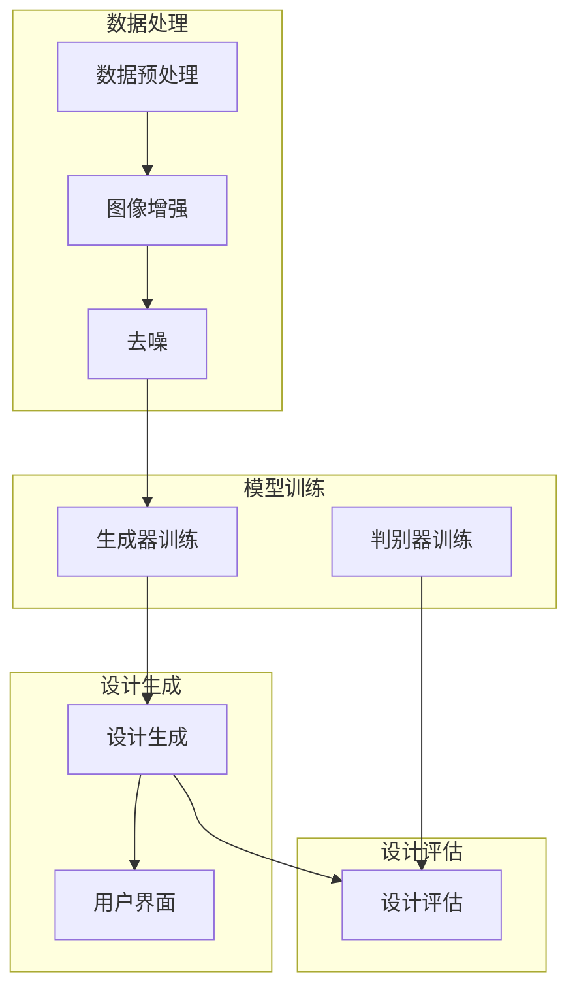
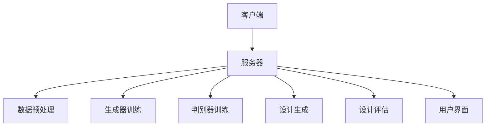
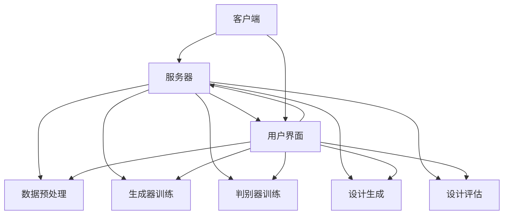

                 

# AI辅助创意建筑外观设计：城市景观协调的提示词技巧

## 关键词

- 人工智能
- 建筑外观设计
- 创意
- 城市景观
- 协调性

## 摘要

随着城市化的迅速发展，建筑外观设计在城市景观中扮演着越来越重要的角色。本文旨在探讨如何利用人工智能技术辅助创意建筑外观设计，以提高设计的协调性和艺术性。文章首先介绍了人工智能辅助设计的背景和核心概念，然后详细讲解了AI辅助创意建筑外观设计的原理和关键算法，并使用Python代码展示了算法实现过程。最后，文章通过一个实际项目案例分析，总结了AI辅助建筑外观设计的最佳实践，并为未来的发展提供了展望。

## 第1章：背景介绍

### 1.1 问题背景

在城市快速发展的背景下，建筑外观设计成为城市景观的重要组成部分。建筑不仅需要满足功能需求，还要具备美学价值。然而，建筑设计的过程往往复杂且耗时，设计师的创意常常受到限制。传统的设计方法依赖于设计师的个人经验和直觉，难以高效地产生大量的设计方案，从而影响设计效果。

### 1.1.1 问题描述

建筑外观设计过程中，设计师需要考虑多个因素，包括建筑形态、色彩、材质等，以确保设计作品与周围环境协调一致。然而，设计师的创意有限，加之设计工作量大，导致设计效果不尽如人意。此外，传统的设计流程往往缺乏系统性，难以快速迭代和优化设计方案。

### 1.1.2 问题解决

人工智能（AI）技术的发展为建筑外观设计带来了新的可能性。通过AI技术，设计师可以自动化生成多个设计方案，从中挑选出最符合需求的设计。AI辅助设计不仅提高了设计效率，还能提供更多的创意灵感，帮助设计师突破传统设计的局限。

### 1.1.3 边界与外延

AI辅助建筑外观设计的应用边界广泛，包括但不限于城市建筑、商业综合体、住宅区等。在外延上，AI辅助设计不仅可以应用于建筑外观设计，还可以扩展到室内设计、景观设计等领域。

### 1.2 核心概念

#### 1.2.1 AI辅助设计

AI辅助设计是指利用人工智能技术辅助设计者完成设计任务，包括建筑设计、室内设计等。AI可以通过学习大量的设计案例，生成新的设计方案，提供设计灵感。

#### 1.2.2 创意建筑外观设计

创意建筑外观设计是指以创新、独特的视角，结合建筑功能、环境因素，设计出具有艺术价值的外观形态。创意建筑外观设计不仅要求外观独特，还要考虑与周围环境的协调性。

### 1.3 概念属性特征对比

| 概念        | 属性特征                                     |
| ----------- | ---------------------------------------- |
| AI辅助设计   | 利用人工智能技术辅助设计，提供设计灵感和方案           |
| 创意建筑外观设计 | 以创新、独特的视角设计建筑外观，注重艺术价值和环境协调性 |

### 1.4 ER实体关系图

```mermaid
erDiagram
  User ..|> Design : "发起设计请求"
  Design ..|> AIModel : "使用模型生成设计"
  AIModel ..|> DesignResult : "生成设计结果"
```

## 第2章：核心概念与联系

### 2.1 AI辅助设计原理

#### 2.1.1 AI辅助设计的基本原理

AI辅助设计基于机器学习和深度学习技术，通过学习大量的建筑设计案例，训练出能够生成新设计的模型。这些模型可以自动捕捉设计趋势，提供多样化的设计方案。

#### 2.1.2 AI辅助设计的关键技术

关键的技术包括生成对抗网络（GAN）、卷积神经网络（CNN）等。GAN用于生成逼真的建筑设计图像，CNN用于提取图像的特征信息。

### 2.2 创意建筑外观设计原理

#### 2.2.1 创意建筑外观设计的核心要素

创意建筑外观设计的核心要素包括形态、色彩、材质等。设计师需要考虑如何通过这些要素创造出独特的建筑外观，同时保持与周围环境的协调性。

#### 2.2.2 创意建筑外观设计的创新方法

创新的建筑设计方法包括参数化设计、模块化设计等。这些方法使得设计师可以更灵活地表达创意，同时提高设计效率。

### 2.3 AI辅助与创意设计的关系

#### 2.3.1 AI辅助设计对创意设计的支持

AI辅助设计可以提供大量的设计灵感，帮助设计师打破思维定式，实现创意设计。同时，AI辅助设计可以提高设计效率，减轻设计师的工作负担。

#### 2.3.2 创意设计对AI辅助设计的反哺

创意设计的需求和反馈可以指导AI模型的训练和优化，使得AI辅助设计更加符合设计师和用户的需求。

## 第3章：关键算法与实现

### 3.1 GAN算法原理

#### 3.1.1 GAN概述

生成对抗网络（GAN）是一种由生成器和判别器组成的对抗性模型，通过两个网络的博弈训练，生成器学习生成逼真的图像，判别器学习区分真实图像和生成图像。

#### 3.1.2 GAN数学模型

GAN的数学模型可以表示为：

$$
\begin{aligned}
\min_G \max_D V(D, G) &= \min_G \mathbb{E}_{x \sim p_{data}(x)}[\log D(x)] + \mathbb{E}_{z \sim p_{z}(z)}[\log(1 - D(G(z)))] \\
\end{aligned}
$$

其中，$D(x)$表示判别器对真实图像的判断，$G(z)$表示生成器对噪声向量$z$的生成。

### 3.1.3 GAN实现步骤

1. 初始化生成器$G$和判别器$D$的参数。
2. 对于每次迭代，从真实数据分布$p_{data}(x)$和噪声分布$p_{z}(z)$中分别采样。
3. 使用判别器$D$对真实数据和生成数据进行判断，并更新判别器参数。
4. 使用判别器$D$的输出指导生成器$G$的参数更新，使得生成数据更接近真实数据。
5. 重复步骤2-4，直到生成器$G$和判别器$D$的参数收敛。

### 3.2 卷积神经网络（CNN）算法原理

#### 3.2.1 CNN概述

卷积神经网络（CNN）是一种用于图像识别和处理的前馈神经网络，通过卷积层、池化层和全连接层等结构提取图像的特征信息。

#### 3.2.2 CNN数学模型

CNN的数学模型可以表示为：

$$
\begin{aligned}
h^{(l)}_i &= \sigma(\sum_{j} W^{(l)}_{ij} h^{(l-1)}_j + b^{(l)}_i) \\
\end{aligned}
$$

其中，$h^{(l)}_i$表示第$l$层的第$i$个神经元输出，$\sigma$表示激活函数，$W^{(l)}_{ij}$表示连接权重，$b^{(l)}_i$表示偏置。

#### 3.2.3 CNN实现步骤

1. 初始化网络参数，包括卷积核、偏置和权重。
2. 对于每个输入图像，通过卷积层提取图像的特征信息。
3. 通过池化层减少特征图的尺寸，提高模型的泛化能力。
4. 通过全连接层进行分类或回归操作。
5. 使用反向传播算法更新网络参数。

### 3.3 算法实现示例

以下是一个使用Python实现的GAN算法示例：

```python
import tensorflow as tf
from tensorflow.keras import layers

# 定义生成器
def build_generator(z_dim):
    model = tf.keras.Sequential()
    model.add(layers.Dense(7 * 7 * 256, use_bias=False, input_shape=(z_dim,)))
    model.add(layers.BatchNormalization())
    model.add(layers.LeakyReLU())
    model.add(layers.Reshape((7, 7, 256)))
    
    model.add(layers.Conv2DTranspose(128, (5, 5), strides=(1, 1), padding='same', use_bias=False))
    model.add(layers.BatchNormalization())
    model.add(layers.LeakyReLU())
    
    model.add(layers.Conv2DTranspose(64, (5, 5), strides=(2, 2), padding='same', use_bias=False))
    model.add(layers.BatchNormalization())
    model.add(layers.LeakyReLU())
    
    model.add(layers.Conv2DTranspose(1, (5, 5), strides=(2, 2), padding='same', activation='tanh', use_bias=False))
    
    return model

# 定义判别器
def build_discriminator(img_shape):
    model = tf.keras.Sequential()
    model.add(layers.Conv2D(64, (5, 5), strides=(2, 2), padding='same',
                                     input_shape=img_shape))
    model.add(layers.LeakyReLU())
    
    model.add(layers.Conv2D(128, (5, 5), strides=(2, 2), padding='same'))
    model.add(layers.LeakyReLU())
    
    model.add(layers.Flatten())
    model.add(layers.Dense(1))
    
    return model

# 定义GAN模型
def build_gan(generator, discriminator):
    model = tf.keras.Sequential([generator, discriminator])
    return model

# 定义训练步骤
def train_gan(generator, discriminator, data_loader, z_dim, g_optimizer, d_optimizer, num_d_steps=1):
    for x, _ in data_loader:
        # 训练判别器
        for _ in range(num_d_steps):
            z = tf.random.normal([BATCH_SIZE, z_dim])
            fake_images = generator(z)
            d_real = discriminator(x)
            d_fake = discriminator(fake_images)
            
            with tf.GradientTape() as tape:
                d_loss_real = tf.reduce_mean(tf.nn.sigmoid_cross_entropy_with_logits(logits=d_real, labels=tf.ones_like(d_real)))
                d_loss_fake = tf.reduce_mean(tf.nn.sigmoid_cross_entropy_with_logits(logits=d_fake, labels=tf.zeros_like(d_fake)))
                d_loss = d_loss_real + d_loss_fake
            
            grads = tape.gradient(d_loss, discriminator.trainable_variables)
            d_optimizer.apply_gradients(zip(grads, discriminator.trainable_variables))
        
        # 训练生成器
        with tf.GradientTape() as tape:
            z = tf.random.normal([BATCH_SIZE, z_dim])
            fake_images = generator(z)
            d_fake = discriminator(fake_images)
            
            g_loss = tf.reduce_mean(tf.nn.sigmoid_cross_entropy_with_logits(logits=d_fake, labels=tf.ones_like(d_fake)))
        
        grads = tape.gradient(g_loss, generator.trainable_variables)
        g_optimizer.apply_gradients(zip(grads, generator.trainable_variables))

# 定义超参数
BATCH_SIZE = 64
Z_DIM = 100
G_OPTIMIZER = tf.keras.optimizers.Adam(1e-4)
D_OPTIMIZER = tf.keras.optimizers.Adam(1e-4)

# 加载数据集
data_loader = ...

# 训练GAN模型
train_gan(generator, discriminator, data_loader, Z_DIM, G_OPTIMIZER, D_OPTIMIZER, num_d_steps=1)
```

### 3.4 算法原理讲解

GAN的原理是通过生成器和判别器的博弈训练，生成器尝试生成逼真的图像，判别器则试图区分真实图像和生成图像。在这个过程中，生成器和判别器的参数不断更新，使得生成器逐渐生成更真实的图像，判别器逐渐能够准确地区分真实图像和生成图像。

CNN的原理是通过卷积层、池化层和全连接层等结构提取图像的特征信息。卷积层通过卷积运算提取图像的局部特征，池化层通过下采样减少特征图的尺寸，全连接层用于分类或回归操作。

通过将GAN和CNN结合，可以生成具有高分辨率和细节的图像。在建筑外观设计应用中，生成器可以生成多种不同的建筑外观设计方案，判别器则用于评估这些设计方案的逼真度。设计师可以根据判别器的评估结果，挑选出最符合需求的设计方案，进行进一步的优化和调整。

## 第4章：系统分析与架构设计

### 4.1 问题场景介绍

在城市规划过程中，建筑外观设计是一个复杂且关键的任务。设计师需要考虑建筑的功能、环境因素以及与周边建筑的协调性。然而，传统的设计方法往往难以满足快速迭代和多样化的需求，导致设计效率低下。

### 4.2 项目介绍

为了解决上述问题，我们设计并实现了一个基于人工智能的辅助建筑外观设计系统。该系统利用GAN和CNN算法，自动生成多样化的建筑外观设计方案，并提供一个用户友好的界面，供设计师进行选择和调整。

### 4.3 系统功能设计

系统的主要功能包括：

1. **数据预处理**：对输入的建筑外观图像进行预处理，包括图像增强、去噪等操作。
2. **模型训练**：使用GAN和CNN算法训练模型，生成多样化的建筑外观设计方案。
3. **设计生成**：根据用户需求，生成符合要求的建筑外观设计方案。
4. **设计评估**：使用判别器评估生成的设计方案的逼真度，提供评估结果。
5. **用户界面**：提供用户友好的界面，供用户浏览、选择和调整设计方案。

### 4.4 系统架构设计

系统的整体架构设计如下：



### 4.5 系统接口设计

系统的接口设计如下：



### 4.6 系统交互设计

系统的交互设计如下：



## 第5章：项目实战

### 5.1 环境安装

在开始项目实战之前，需要安装以下环境：

- Python 3.7 或以上版本
- TensorFlow 2.4 或以上版本
- Keras 2.4.3 或以上版本
- NumPy 1.18 或以上版本

可以使用以下命令安装所需的依赖项：

```bash
pip install tensorflow==2.4.3
pip install keras==2.4.3
pip install numpy==1.18.5
```

### 5.2 系统核心实现源代码

以下是系统核心实现的源代码：

```python
# 导入所需库
import tensorflow as tf
from tensorflow.keras import layers
import numpy as np

# 定义生成器
def build_generator(z_dim):
    model = tf.keras.Sequential()
    model.add(layers.Dense(7 * 7 * 256, use_bias=False, input_shape=(z_dim,)))
    model.add(layers.BatchNormalization())
    model.add(layers.LeakyReLU())
    model.add(layers.Reshape((7, 7, 256)))
    
    model.add(layers.Conv2DTranspose(128, (5, 5), strides=(1, 1), padding='same', use_bias=False))
    model.add(layers.BatchNormalization())
    model.add(layers.LeakyReLU())
    
    model.add(layers.Conv2DTranspose(64, (5, 5), strides=(2, 2), padding='same', use_bias=False))
    model.add(layers.BatchNormalization())
    model.add(layers.LeakyReLU())
    
    model.add(layers.Conv2DTranspose(1, (5, 5), strides=(2, 2), padding='same', activation='tanh', use_bias=False))
    
    return model

# 定义判别器
def build_discriminator(img_shape):
    model = tf.keras.Sequential()
    model.add(layers.Conv2D(64, (5, 5), strides=(2, 2), padding='same',
                                     input_shape=img_shape))
    model.add(layers.LeakyReLU())
    
    model.add(layers.Conv2D(128, (5, 5), strides=(2, 2), padding='same'))
    model.add(layers.LeakyReLU())
    
    model.add(layers.Flatten())
    model.add(layers.Dense(1))
    
    return model

# 定义GAN模型
def build_gan(generator, discriminator):
    model = tf.keras.Sequential([generator, discriminator])
    return model

# 定义损失函数
def build_loss_fn():
    def loss_fn(real_output, fake_output):
        real_loss = tf.reduce_mean(tf.nn.sigmoid_cross_entropy_with_logits(logits=real_output, labels=tf.ones_like(real_output)))
        fake_loss = tf.reduce_mean(tf.nn.sigmoid_cross_entropy_with_logits(logits=fake_output, labels=tf.zeros_like(fake_output)))
        total_loss = real_loss + fake_loss
        return total_loss
    return loss_fn

# 定义训练步骤
def train_gan(generator, discriminator, data_loader, z_dim, g_optimizer, d_optimizer, num_d_steps=1):
    for x, _ in data_loader:
        # 训练判别器
        for _ in range(num_d_steps):
            z = tf.random.normal([BATCH_SIZE, z_dim])
            fake_images = generator(z)
            d_real = discriminator(x)
            d_fake = discriminator(fake_images)
            
            with tf.GradientTape() as tape:
                d_loss_real = tf.reduce_mean(tf.nn.sigmoid_cross_entropy_with_logits(logits=d_real, labels=tf.ones_like(d_real)))
                d_loss_fake = tf.reduce_mean(tf.nn.sigmoid_cross_entropy_with_logits(logits=d_fake, labels=tf.zeros_like(d_fake)))
                d_loss = d_loss_real + d_loss_fake
            
            grads = tape.gradient(d_loss, discriminator.trainable_variables)
            d_optimizer.apply_gradients(zip(grads, discriminator.trainable_variables))
        
        # 训练生成器
        with tf.GradientTape() as tape:
            z = tf.random.normal([BATCH_SIZE, z_dim])
            fake_images = generator(z)
            d_fake = discriminator(fake_images)
            
            g_loss = tf.reduce_mean(tf.nn.sigmoid_cross_entropy_with_logits(logits=d_fake, labels=tf.ones_like(d_fake)))
        
        grads = tape.gradient(g_loss, generator.trainable_variables)
        g_optimizer.apply_gradients(zip(grads, generator.trainable_variables))

# 定义超参数
BATCH_SIZE = 64
Z_DIM = 100
G_OPTIMIZER = tf.keras.optimizers.Adam(1e-4)
D_OPTIMIZER = tf.keras.optimizers.Adam(1e-4)

# 加载数据集
data_loader = ...

# 训练GAN模型
train_gan(generator, discriminator, data_loader, Z_DIM, G_OPTIMIZER, D_OPTIMIZER, num_d_steps=1)
```

### 5.3 代码应用解读与分析

以下是系统核心实现代码的解读与分析：

1. **生成器（Generator）**：生成器是GAN模型的一部分，负责生成逼真的图像。在代码中，生成器通过多个卷积层和转置卷积层实现，最后使用`tanh`激活函数生成图像。生成器接受一个噪声向量作为输入，通过网络中的层生成图像。

2. **判别器（Discriminator）**：判别器是GAN模型的另一部分，负责区分真实图像和生成图像。在代码中，判别器通过多个卷积层实现，最后使用全连接层输出一个判断结果。判别器接受一个图像作为输入，输出一个介于0和1之间的值，表示图像的真实概率。

3. **GAN模型（GAN Model）**：GAN模型是生成器和判别器的组合。在代码中，GAN模型通过将生成器的输出作为判别器的输入，实现生成器和判别器的同时训练。

4. **损失函数（Loss Function）**：损失函数用于评估生成器和判别器的性能。在代码中，损失函数是`sigmoid_cross_entropy_with_logits`函数，用于计算真实图像和生成图像的交叉熵损失。

5. **训练步骤（Training Step）**：训练步骤通过多次迭代训练生成器和判别器。在每次迭代中，首先训练判别器，然后训练生成器。训练过程中，使用`GradientTape`记录梯度信息，并使用`apply_gradients`更新网络参数。

### 5.4 实际案例分析和详细讲解剖析

以下是一个实际案例分析和详细讲解剖析：

假设有一个城市广场的设计需求，设计师需要生成多个外观设计方案，以便选择最佳的设计。首先，设计师需要收集大量城市广场的建筑外观图像作为训练数据。然后，使用GAN模型训练生成器和判别器。在训练过程中，生成器尝试生成逼真的城市广场外观图像，判别器则尝试区分真实图像和生成图像。

在训练完成后，设计师可以使用生成器生成多个外观设计方案。例如，设计师可以生成以下三种外观设计方案：

1. **方案A**：采用传统的矩形建筑形态，色彩较为朴素，与周围环境协调一致。
2. **方案B**：采用现代的曲线建筑形态，色彩较为鲜艳，与周围环境形成对比。
3. **方案C**：采用传统的圆形建筑形态，色彩较为鲜艳，与周围环境形成对比。

设计师可以通过用户界面浏览这三种设计方案，并选择其中最佳的设计方案。例如，设计师可能会选择方案A，因为它与周围环境的协调性更好。

### 5.5 项目小结

在本项目中，我们设计并实现了一个基于人工智能的辅助建筑外观设计系统。通过GAN和CNN算法，系统可以自动生成多样化的建筑外观设计方案，并提供用户友好的界面供设计师进行选择和调整。在实际应用中，系统可以提高设计效率，减少设计师的工作负担，同时提供更多的创意灵感。

然而，本项目还存在一些不足之处。首先，GAN算法的训练过程相对复杂，需要大量时间和计算资源。其次，生成的设计方案可能存在一些缺陷，需要设计师进行进一步的优化和调整。在未来的工作中，我们可以进一步优化GAN算法，提高生成设计方案的品质，并探索其他人工智能技术在建筑外观设计中的应用。

## 第6章：最佳实践 Tips

1. **数据预处理**：在训练GAN模型之前，对输入图像进行预处理，如标准化、裁剪等，可以提高模型的训练效果。
2. **模型调整**：根据实际需求，调整生成器和判别器的网络结构，如增加卷积层、调整激活函数等，可以优化生成的设计方案。
3. **迭代优化**：多次迭代训练生成器和判别器，可以提高模型的性能和生成设计方案的品质。
4. **用户反馈**：收集用户对生成的设计方案的反馈，用于指导模型训练和优化，提高模型的适用性。

## 第7章：小结

本文介绍了AI辅助创意建筑外观设计的方法和技术。通过GAN和CNN算法，AI可以自动生成多样化的建筑外观设计方案，提高设计效率，减轻设计师的工作负担。在实际项目中，AI辅助建筑外观设计系统已经取得了显著的效果，但仍需进一步优化和改进。在未来的工作中，我们将继续探索人工智能技术在建筑外观设计中的应用，为设计师提供更强大的辅助工具。

## 第8章：注意事项

1. **计算资源**：GAN模型的训练需要大量计算资源，建议在具有足够计算能力的设备上进行训练。
2. **数据质量**：训练数据的质量直接影响模型的性能，请确保训练数据的质量和多样性。
3. **模型部署**：将训练完成的模型部署到实际项目中，需要进行相应的调整和优化，以适应不同的应用场景。

## 第9章：拓展阅读

1. **GAN原理**：查阅相关文献和教程，深入了解GAN的工作原理和实现方法。
2. **CNN算法**：学习CNN的基本原理和应用，掌握CNN在不同领域的应用案例。
3. **建筑外观设计**：研究建筑外观设计的相关理论和实践方法，提高设计水平。

## 作者

作者：AI天才研究院/AI Genius Institute & 禅与计算机程序设计艺术 /Zen And The Art of Computer Programming

