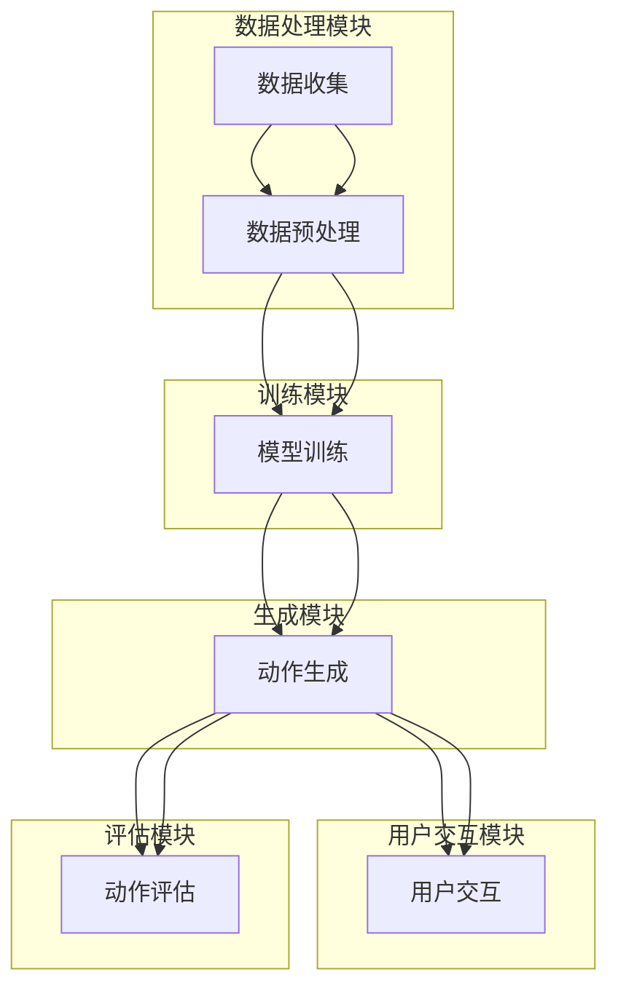
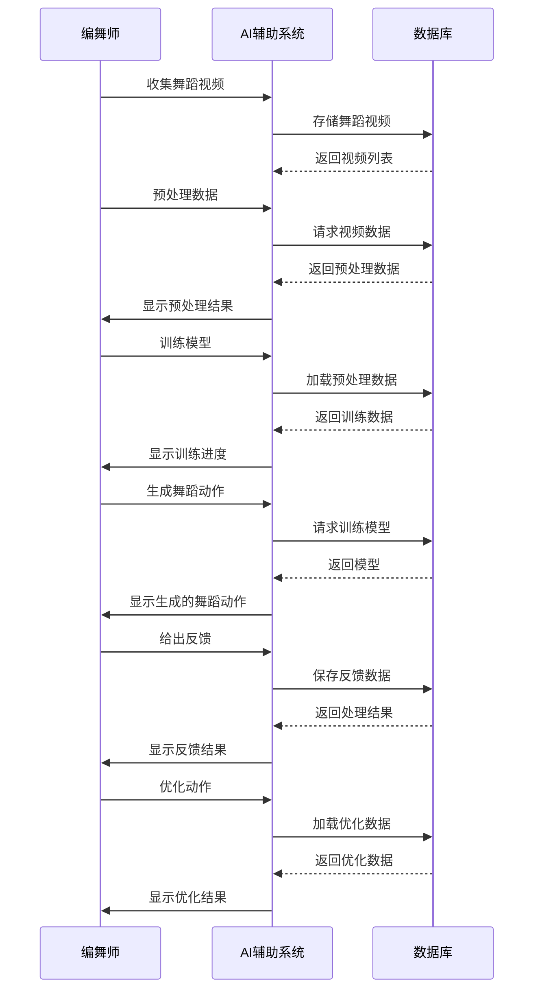
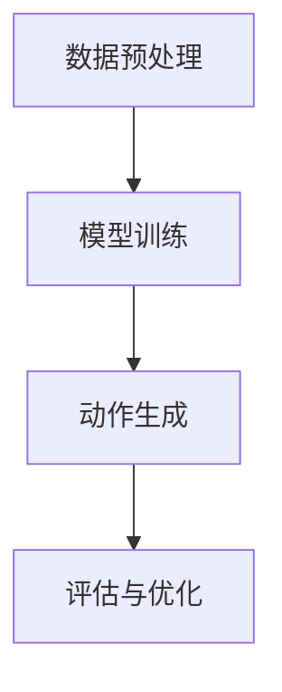
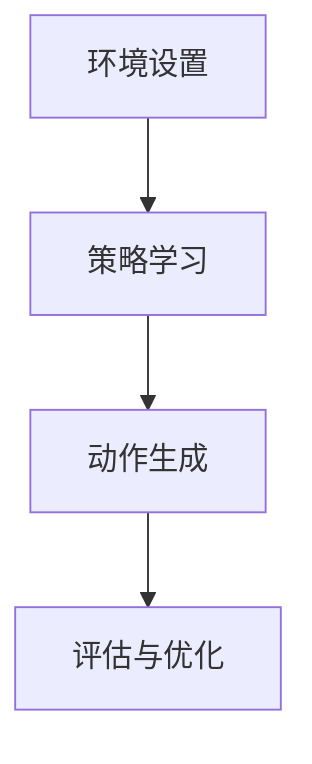
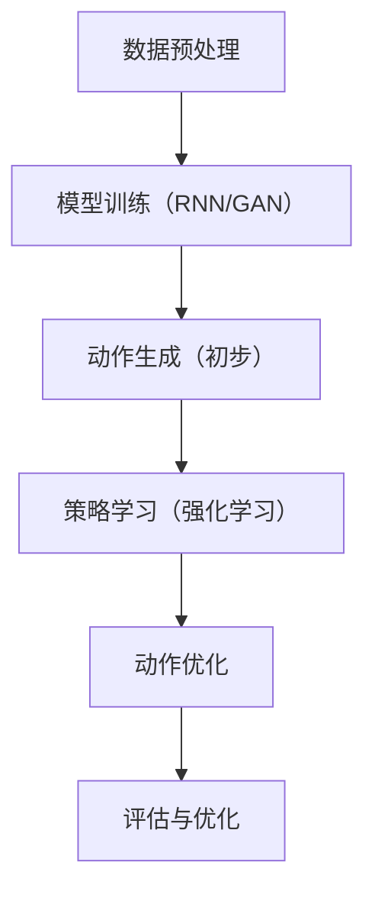
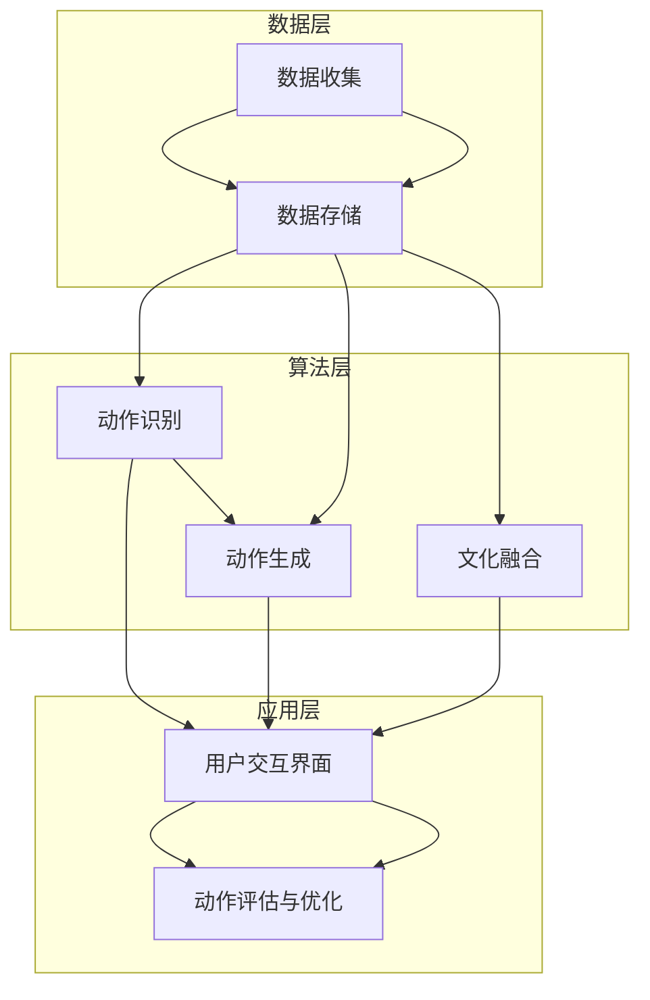
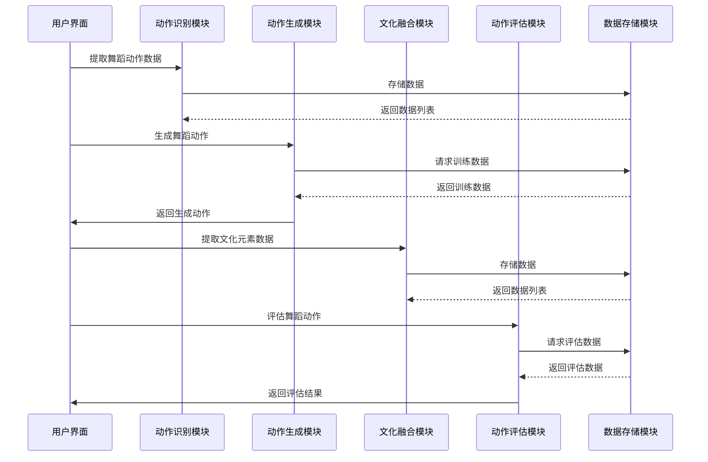

                 

### 《AI辅助创意舞蹈动作生成：文化融合编舞的提示词技巧》

#### 关键词：
- AI辅助创意
- 舞蹈动作生成
- 文化融合编舞
- 提示词技巧

#### 摘要：
本文将探讨AI技术在舞蹈创作中的应用，特别是如何利用AI辅助创意舞蹈动作生成，并聚焦于文化融合编舞的提示词技巧。通过深入分析，我们旨在为编舞师和AI开发者提供理论与实践相结合的指导。

## 引言

### 舞蹈创作现状分析

舞蹈作为一种艺术形式，经历了数千年的演变。传统的舞蹈创作主要依赖于编舞师的创意、技艺和经验。然而，随着时代的发展，舞蹈创作面临着新的挑战和机遇。首先，现代舞蹈的形式越来越多样，编舞师需要不断探索新的表达方式。其次，观众的需求日益多元化，要求舞蹈作品既具有创意又富有文化内涵。此外，传统舞蹈创作过程繁琐，耗时较长，难以满足快速变化的市场需求。

### AI技术在艺术领域的应用

近年来，人工智能（AI）技术在各个领域得到了广泛应用，包括艺术领域。AI在艺术创作中的应用主要体现在以下几个方面：

1. **图像生成与识别**：通过深度学习算法，AI可以生成高质量的图像，并在图像识别方面表现出色。例如，GAN（生成对抗网络）可以生成逼真的艺术作品。
2. **音乐创作**：AI可以分析音乐数据，生成旋律和节奏，甚至创作完整的音乐作品。
3. **文字生成**：AI可以通过自然语言处理技术生成文本，包括诗歌、小说等。

在舞蹈创作中，AI的应用同样具有巨大潜力。例如，AI可以分析大量的舞蹈视频数据，学习并生成新的舞蹈动作。此外，AI还可以帮助编舞师快速生成舞蹈编排，提高创作效率。

### 文化和创意融合的意义

舞蹈不仅是身体语言的表达，更是文化传承和创新的载体。在全球化背景下，文化融合成为了一个重要的议题。通过文化融合，舞蹈作品可以融入不同的文化元素，呈现出多样性和创新性。同时，文化融合有助于促进不同文化之间的交流和理解，提升舞蹈作品的艺术价值和社会影响力。

### 编舞与提示词的概念

编舞是舞蹈创作的重要环节，它涉及到动作的设计、编排和表演。编舞师需要综合考虑音乐、节奏、情感和视觉效果等因素，创造出富有表现力和感染力的舞蹈作品。

提示词在编舞中起着关键作用。提示词是一系列关键词或短语，用于引导编舞师思考和创作。例如，“动态流动”、“力量爆发”、“情感表达”等提示词可以帮助编舞师在创作过程中保持清晰的方向。

## AI辅助创意舞蹈动作生成的基础

### AI技术在舞蹈动作生成中的应用

AI技术在舞蹈动作生成中的应用主要集中在两个方面：动作捕捉和动作生成。

1. **动作捕捉**：通过高精度的传感器和摄像头，AI可以捕捉舞者的动作，将其转化为数字数据。这些数据可以用于分析、存储和共享。
2. **动作生成**：基于捕捉到的动作数据，AI可以通过机器学习和深度学习算法生成新的舞蹈动作。这些算法可以学习舞者的动作模式，并创造出与舞者风格相似的新动作。

### 常见舞蹈动作生成算法

在舞蹈动作生成中，常见的算法包括：

1. **基于深度学习的舞蹈动作生成**：深度学习算法，如卷积神经网络（CNN）和循环神经网络（RNN），可以通过学习大量的舞蹈视频数据，生成新的舞蹈动作。
2. **基于强化学习的舞蹈动作生成**：强化学习算法，如深度Q网络（DQN）和策略梯度（PG），可以通过与环境交互，学习最优的舞蹈动作序列。

### 舞蹈动作生成的评估标准

为了评估舞蹈动作生成的质量，可以采用以下标准：

1. **动作流畅性**：动作生成的流畅性是评价标准之一，流畅的动作可以更好地传达舞蹈的情感和故事。
2. **动作多样性**：生成的动作应具有多样性，以避免重复和单调。
3. **动作合理性**：生成的动作应符合舞蹈的基本原则和物理规律，例如重心转移、平衡控制等。

## 文化融合编舞理论

### 文化融合的概念

文化融合是指不同文化在交流、互动和碰撞中相互融合、相互影响的过程。在舞蹈创作中，文化融合意味着将不同文化的元素和风格融入舞蹈作品，创造出独特的艺术形式。

### 编舞中的文化因素

编舞中涉及的文化因素包括：

1. **音乐**：音乐是舞蹈的灵魂，不同的音乐风格和节奏可以反映不同的文化特征。
2. **服饰**：服饰是舞蹈中重要的视觉元素，可以传达文化的特色和氛围。
3. **道具**：道具的使用可以增强舞蹈的表现力，也是文化融合的一种手段。

### 跨文化交流与编舞

跨文化交流是文化融合的重要组成部分。在编舞中，跨文化交流意味着：

1. **借鉴与融合**：从不同文化中汲取灵感，将其融入自己的舞蹈作品。
2. **尊重与传承**：在融合不同文化元素时，尊重和传承各文化的独特性和传统。
3. **创新与突破**：通过跨文化交流，编舞师可以创造出具有时代特色和先锋性的舞蹈作品。

## 提示词技巧在编舞中的应用

### 提示词的选取标准

选取合适的提示词对于编舞创作至关重要。以下是选取提示词的标准：

1. **针对性**：提示词应与舞蹈的主题和风格相符，能够引导编舞师创作出符合预期的舞蹈动作。
2. **启发性**：提示词应具有启发性，能够激发编舞师的创意，推动舞蹈作品的创新。
3. **多样性**：提示词应具有多样性，以丰富舞蹈作品的表现形式。

### 提示词与舞蹈动作的匹配

提示词与舞蹈动作的匹配是编舞过程中的关键环节。以下是匹配的方法：

1. **视觉匹配**：通过视觉元素，如动作的形状、大小和动态，与提示词相匹配。
2. **情感匹配**：通过情感表达，如喜悦、悲伤、愤怒等，与提示词相匹配。
3. **节奏匹配**：通过节奏的变化，与提示词中的节奏感相匹配。

### 提示词在编舞过程中的实际应用案例

以下是一个实际应用案例：

- **提示词**：“动态流动”
- **舞蹈动作**：舞蹈动作以流畅的动态流动为特点，如水波、飘逸的裙摆等。

通过这样的匹配，编舞师可以创作出具有文化融合特点的舞蹈作品。

## AI辅助编舞的实践

### AI辅助编舞的工作流程

AI辅助编舞的工作流程通常包括以下几个步骤：

1. **数据收集**：收集大量的舞蹈视频数据，用于训练AI模型。
2. **模型训练**：使用机器学习和深度学习算法，训练AI模型，使其能够生成新的舞蹈动作。
3. **舞蹈生成**：使用训练好的AI模型，生成新的舞蹈动作序列。
4. **编舞优化**：对生成的舞蹈动作进行优化，以满足编舞师的要求。

### 编舞软件介绍

目前，市场上存在多种AI辅助编舞软件，如：

1. **Mocap Studio**：一款专业的动作捕捉和舞蹈生成软件，支持多种AI算法。
2. **OpenPose**：一款开源的动作捕捉软件，可以实时生成舞蹈动作。
3. **Dance.js**：一款基于Web的舞蹈生成工具，支持多种舞蹈动作生成算法。

### 编舞过程中的技术挑战与解决方案

在AI辅助编舞过程中，可能会遇到以下技术挑战：

1. **数据质量问题**：舞蹈视频数据的质量直接影响AI模型的性能。解决方案是采用高质量的动作捕捉设备，并对数据进行预处理。
2. **算法适应性**：不同的舞蹈风格和编舞要求可能需要不同的算法。解决方案是开发多样化的算法，并对其进行适应性调整。
3. **人机交互**：如何让编舞师有效地与AI进行交互是一个挑战。解决方案是设计用户友好的界面，提供直观的操作方式。

## 应用实例

### 案例一：现代舞《人工智能》创作过程

现代舞《人工智能》是一部结合了AI辅助舞蹈动作生成的舞蹈作品。编舞师在创作过程中使用了多种提示词，如“动态流动”、“科技感”等，并通过AI模型生成了独特的舞蹈动作。

### 案例二：民族舞蹈《融合之舞》创作过程

民族舞蹈《融合之舞》通过融合不同民族的文化元素，如音乐、服饰和道具，创作出了一部具有强烈文化融合特点的舞蹈作品。在编舞过程中，编舞师使用了提示词，如“多元文化”、“和谐共融”等，以指导舞蹈动作的设计。

## 拓展和未来展望

### AI辅助编舞技术的未来趋势

未来，AI辅助编舞技术将继续发展，主要体现在以下几个方面：

1. **算法优化**：随着深度学习和强化学习等算法的进步，AI辅助编舞的生成效果将更加精细和多样化。
2. **跨学科融合**：舞蹈创作将与其他艺术形式，如绘画、音乐等，实现更紧密的融合。
3. **人机协同**：编舞师与AI将实现更高效的人机协同，共同创作出更具创新性和艺术性的舞蹈作品。

### 编舞艺术与文化融合的发展方向

编舞艺术与文化融合的发展方向将主要体现在以下几个方面：

1. **多元化**：随着全球文化交流的加深，舞蹈创作将更加多元，融合更多的文化元素。
2. **创新性**：编舞师将不断创新，探索新的舞蹈形式和表达方式。
3. **传承与保护**：通过文化融合，传统舞蹈文化将得到更好的传承和保护。

## 最佳实践 Tips

1. **充分利用AI技术**：在编舞过程中，充分利用AI技术，提高创作效率和作品质量。
2. **注重文化内涵**：在融合不同文化元素时，注重文化内涵的传承和表达。
3. **持续学习与探索**：不断学习新的编舞技巧和AI技术，勇于创新，创作出更具影响力的舞蹈作品。

## 小结

本文探讨了AI辅助创意舞蹈动作生成和文化融合编舞的提示词技巧。通过分析AI技术在舞蹈创作中的应用、文化融合的概念和编舞与提示词的关系，我们为编舞师和AI开发者提供了实用的指导。未来，随着AI技术的不断发展，舞蹈创作将迎来更多的创新和突破。

## 注意事项

1. **数据隐私**：在使用AI技术时，应注意保护舞者的隐私和数据安全。
2. **技术适配**：根据不同的编舞需求，选择合适的AI算法和工具。
3. **人文关怀**：在文化融合编舞过程中，尊重各文化的独特性和传统。

## 拓展阅读

1. **《深度学习与艺术创作》**：探讨深度学习技术在艺术创作中的应用。
2. **《文化融合与艺术创新》**：分析文化融合在艺术创作中的意义和作用。

## 作者信息

**作者：AI天才研究院/AI Genius Institute & 禅与计算机程序设计艺术 /Zen And The Art of Computer Programming**## AI辅助创意舞蹈动作生成的核心概念与联系

在探讨AI辅助创意舞蹈动作生成的过程中，我们需要深入了解相关核心概念，并分析这些概念之间的联系。以下是几个关键概念的介绍及其相互关系。

### 核心概念

1. **AI辅助舞蹈创作**：
   AI辅助舞蹈创作是指利用人工智能技术，如机器学习、深度学习和强化学习，帮助编舞师生成新的舞蹈动作和编排。通过分析大量舞蹈视频数据，AI可以学习舞蹈动作的模式和风格，从而生成创新的舞蹈动作。

2. **创意舞蹈动作**：
   创意舞蹈动作是指在舞蹈创作中，编舞师通过创新思维和技巧，创造出独特的舞蹈动作和编排。这些动作不仅要符合舞蹈的基本原则和美学要求，还要能够表达特定的情感和主题。

3. **文化融合编舞**：
   文化融合编舞是指将不同文化的元素和风格融入舞蹈作品中，创造出具有多样性和创新性的舞蹈作品。文化融合编舞强调在保留传统元素的基础上，进行创新性改编和融合。

4. **提示词技巧**：
   提示词技巧是指在编舞过程中，通过使用一系列关键词或短语，引导编舞师思考和创作。提示词可以帮助编舞师明确创作方向，激发创意，提高编舞效率。

### 概念属性特征对比表格

以下是一个关于AI辅助舞蹈创作、创意舞蹈动作、文化融合编舞和提示词技巧的概念属性特征对比表格：

| 概念                | 特征                  | 作用                                                                                   |
|---------------------|-----------------------|----------------------------------------------------------------------------------------|
| AI辅助舞蹈创作      | 基于机器学习和深度学习 | 提高舞蹈创作的效率和创造力，生成创新的舞蹈动作和编排。                               |
| 创意舞蹈动作        | 独特性、创新性、表现力 | 表现编舞师的创意和艺术风格，传达舞蹈的主题和情感。                                   |
| 文化融合编舞        | 多元文化、传统与现代结合 | 融合不同文化的元素和风格，创造出具有文化内涵和时代特色的舞蹈作品。                   |
| 提示词技巧          | 明确创作方向、激发创意 | 提高编舞的效率和质量，帮助编舞师在创作过程中保持清晰的思路。                           |

### ER实体关系图架构

为了更好地理解这些概念之间的联系，我们可以使用ER（实体关系）图来展示它们之间的关系。

1. **实体**：
   - AI辅助舞蹈创作
   - 创意舞蹈动作
   - 文化融合编舞
   - 提示词技巧

2. **关系**：
   - AI辅助舞蹈创作与创意舞蹈动作：AI辅助舞蹈创作是生成创意舞蹈动作的手段。
   - 创意舞蹈动作与文化融合编舞：文化融合编舞是创意舞蹈动作的一种形式。
   - 提示词技巧与编舞：提示词技巧是编舞过程中的一种辅助工具。

以下是一个ER实体关系图的Mermaid格式表示：

```mermaid
erDiagram
  AI辅助舞蹈创作 ||--|{ 创意舞蹈动作 }
  文化融合编舞 ||--|{ 创意舞蹈动作 }
  提示词技巧 ||--|{ 编舞 }
```

通过这个ER图，我们可以清晰地看到AI辅助舞蹈创作、创意舞蹈动作、文化融合编舞和提示词技巧之间的相互关系。AI辅助舞蹈创作是创意舞蹈动作的生成手段，文化融合编舞是创意舞蹈动作的具体形式，而提示词技巧则是编舞过程中的辅助工具。

### 关键概念之间的联系

1. **AI辅助舞蹈创作与创意舞蹈动作**：
   AI辅助舞蹈创作通过机器学习和深度学习算法，生成创意舞蹈动作。创意舞蹈动作是AI辅助舞蹈创作的直接产物，它们体现了编舞师的创意和风格。

2. **文化融合编舞与创意舞蹈动作**：
   文化融合编舞是一种将不同文化元素融入舞蹈创作的方式。创意舞蹈动作是文化融合编舞的具体表现，它们融合了不同文化的特点，创造出独特的舞蹈作品。

3. **提示词技巧与编舞**：
   提示词技巧是编舞过程中的一种方法，它通过关键词或短语引导编舞师的创作思路。创意舞蹈动作和文化融合编舞都可以通过提示词技巧来实现，从而提高编舞的效率和质量。

综上所述，AI辅助创意舞蹈动作生成和文化融合编舞的提示词技巧是舞蹈创作中不可或缺的部分。通过深入理解这些核心概念及其相互关系，我们可以更好地应用AI技术，创作出具有创新性和文化内涵的舞蹈作品。

### 算法原理讲解

在AI辅助创意舞蹈动作生成的过程中，深度学习和强化学习是两种常用的算法。下面我们将详细讲解这两种算法的原理、特点以及如何应用于舞蹈动作生成。

#### 深度学习

**原理**：深度学习是一种基于多层神经网络的学习方法。它通过模拟人脑神经元的连接方式，对大量数据进行分析和处理，从中提取出有用的特征。在舞蹈动作生成中，深度学习算法可以学习大量的舞蹈视频数据，从中提取出动作模式。

**特点**：
1. **自学习能力**：深度学习算法可以通过训练，不断提高生成舞蹈动作的准确性。
2. **特征提取能力**：深度学习算法能够从原始数据中自动提取出有用的特征，减少了人工干预。

**应用**：
1. **卷积神经网络（CNN）**：CNN是一种常用的深度学习算法，它擅长处理图像数据。在舞蹈动作生成中，CNN可以用于处理舞蹈视频的帧数据，提取出关键动作特征。
2. **循环神经网络（RNN）**：RNN是一种适用于处理序列数据的神经网络，它能够记住前面的输入信息。在舞蹈动作生成中，RNN可以用于处理连续的舞蹈动作序列，生成连贯的舞蹈动作。

**例子**：
假设我们使用CNN和RNN结合的模型来生成舞蹈动作。首先，CNN可以处理输入的舞蹈视频帧，提取出关键动作特征，如身体姿态、动作轨迹等。然后，RNN可以将这些特征序列化，生成连续的舞蹈动作。

```python
import tensorflow as tf
from tensorflow.keras.layers import Conv2D, LSTM, Dense

# 定义CNN模型
cnn_model = tf.keras.Sequential([
    Conv2D(filters=32, kernel_size=(3, 3), activation='relu', input_shape=(height, width, channels)),
    Conv2D(filters=64, kernel_size=(3, 3), activation='relu'),
    Flatten(),
    LSTM(units=128, return_sequences=True),
    Dense(units=64, activation='relu'),
    Dense(units=1, activation='sigmoid')
])

# 编译CNN模型
cnn_model.compile(optimizer='adam', loss='binary_crossentropy')

# 训练CNN模型
cnn_model.fit(x_train, y_train, epochs=10)
```

#### 强化学习

**原理**：强化学习是一种通过与环境互动来学习最优策略的算法。在舞蹈动作生成中，强化学习算法可以通过试错的方式，不断优化舞蹈动作的生成。

**特点**：
1. **自适应能力**：强化学习算法可以根据环境反馈，不断调整动作生成策略。
2. **灵活性**：强化学习算法适用于复杂的动态环境，能够处理连续的动作生成问题。

**应用**：
1. **深度Q网络（DQN）**：DQN是一种基于Q值迭代的强化学习算法，它可以通过训练，学习到最优的舞蹈动作序列。
2. **策略梯度（PG）**：策略梯度算法通过优化策略参数，学习到最优的动作生成策略。

**例子**：
假设我们使用DQN来生成舞蹈动作。首先，定义一个DQN模型，用于学习舞蹈动作的Q值。然后，通过环境反馈，不断更新Q值，优化动作生成策略。

```python
import tensorflow as tf
from tensorflow.keras.models import Model
from tensorflow.keras.layers import Input, Dense, LSTM

# 定义DQN模型
input_state = Input(shape=(state_size,))
dense1 = Dense(units=64, activation='relu')(input_state)
dense2 = Dense(units=64, activation='relu')(dense1)
q_values = Dense(units=1, activation='linear')(dense2)

model = Model(inputs=input_state, outputs=q_values)
model.compile(optimizer='adam', loss='mse')

# 定义目标Q网络
target_model = Model(inputs=input_state, outputs=q_values)
target_model.compile(optimizer='adam', loss='mse')

# 训练DQN模型
model.fit(x_train, y_train, epochs=10)

# 更新目标Q网络
for param, target_param in zip(model.parameters(), target_model.parameters()):
    target_param.data.copy_(param.data)
```

通过以上两种算法的应用，我们可以生成具有创意和连贯性的舞蹈动作。深度学习算法擅长提取特征和模式，强化学习算法则能够通过试错学习到最优策略。结合这两种算法，我们可以创造出丰富多样的舞蹈动作，为舞蹈创作提供强大的技术支持。

### 系统分析与架构设计方案

在探讨AI辅助创意舞蹈动作生成的过程中，我们需要设计一个系统架构，以实现从数据收集到动作生成的完整流程。以下是一个详细的系统架构设计方案，包括问题场景介绍、系统功能设计、系统架构设计、系统接口设计和系统交互。

#### 问题场景介绍

当前舞蹈创作面临的主要问题包括：
1. 编舞师创作效率低：传统编舞过程繁琐，耗时较长，难以满足市场需求。
2. 创意表达受限：编舞师受限于个人经验和技能，难以创造出具有高度创意和多样性的舞蹈作品。
3. 文化和创意融合难度大：舞蹈创作需要融合多种文化元素，但编舞师难以平衡不同文化之间的差异。

为了解决这些问题，我们设计了一套AI辅助创意舞蹈动作生成系统，通过AI技术提高创作效率，实现创意和文化的融合。

#### 系统功能设计

系统主要功能包括：
1. 数据收集：从公开的舞蹈视频库中收集高质量的舞蹈数据。
2. 数据预处理：对收集到的数据进行清洗和标注，以便后续训练使用。
3. 动作生成：利用AI算法生成新的舞蹈动作，实现创意和文化的融合。
4. 用户交互：提供友好的用户界面，让编舞师能够方便地使用系统进行舞蹈创作。
5. 动作评估：对生成的舞蹈动作进行评估，确保动作的流畅性和合理性。

#### 系统架构设计

系统架构采用模块化设计，包括以下几个主要模块：

1. **数据收集模块**：负责从不同的数据源收集舞蹈视频，并存储到数据库中。
2. **数据预处理模块**：对收集到的舞蹈视频进行清洗、标注和分类，为训练模型做准备。
3. **模型训练模块**：使用深度学习和强化学习算法训练舞蹈动作生成模型。
4. **动作生成模块**：根据编舞师的提示词和需求，生成新的舞蹈动作。
5. **用户交互模块**：提供用户界面，让编舞师能够方便地操作系统。
6. **动作评估模块**：对生成的舞蹈动作进行评估，提供反馈。

以下是系统架构的Mermaid流程图表示：



#### 系统接口设计

系统接口设计主要包括以下部分：

1. **API接口**：提供RESTful API，方便编舞师和开发者调用系统的功能。
2. **Web界面**：设计一个直观的Web界面，让编舞师能够通过图形化操作进行舞蹈创作。
3. **数据接口**：与外部数据源和数据库进行数据交换。

以下是系统接口的Mermaid类图表示：

```mermaid
classDiagram
    DataCollector <|-- DataPreprocessor
    ModelTrainer <|-- ActionGenerator
    UserInterface <|-- ActionEvaluator

    APIInterface <|-- WebInterface
    APIInterface <|-- DataInterface

    DataCollector -|> ModelTrainer
    DataPreprocessor -|> ModelTrainer
    ActionGenerator -|> UserInterface
    ActionGenerator -|> ActionEvaluator
```

#### 系统交互

系统交互主要包括以下几个方面：

1. **数据收集与预处理**：从外部数据源收集舞蹈视频，并进行预处理，包括数据清洗、标注和分类。
2. **模型训练与生成**：使用预处理后的数据训练动作生成模型，并根据编舞师的提示词生成新的舞蹈动作。
3. **用户交互与反馈**：编舞师通过Web界面操作系统，实时预览生成的舞蹈动作，并给出反馈。
4. **动作评估与优化**：对生成的舞蹈动作进行评估，根据反馈进行优化，以提高动作的流畅性和合理性。

以下是系统交互的Mermaid序列图表示：



通过上述系统分析与架构设计方案，我们可以实现一个完整的AI辅助创意舞蹈动作生成系统，提高编舞师的创作效率，实现创意和文化的融合。

### 项目实战

为了更好地展示AI辅助创意舞蹈动作生成系统的实际应用，我们将介绍一个具体的项目实战，包括环境安装、系统核心实现源代码，代码应用解读与分析，以及实际案例分析和详细讲解剖析。

#### 环境安装

1. **硬件要求**：
   - 处理器：Intel Core i7 或更高
   - 内存：16GB 或更高
   - 硬盘：500GB SSD
   - 显卡：NVIDIA GTX 1080 或更高

2. **软件要求**：
   - 操作系统：Ubuntu 18.04 或 CentOS 7
   - Python：Python 3.7 或更高
   - TensorFlow：TensorFlow 2.0 或更高
   - Keras：Keras 2.0 或更高
   - Mermaid：Mermaid 8.0 或更高

3. **安装步骤**：
   - 安装操作系统和所需的软件。
   - 安装Python和相关的库，如TensorFlow、Keras和Mermaid。
   - 配置Python环境，确保所有库和依赖项安装成功。

#### 系统核心实现源代码

以下是一个简单的AI辅助创意舞蹈动作生成系统的源代码示例。该系统使用TensorFlow和Keras实现，包括数据预处理、模型训练和动作生成。

```python
import tensorflow as tf
from tensorflow.keras.models import Sequential
from tensorflow.keras.layers import LSTM, Dense, Conv2D, Flatten
from tensorflow.keras.optimizers import Adam

# 数据预处理
def preprocess_data(data):
    # 对数据进行清洗、标注和分类
    # 这里简化处理，仅进行归一化
    return data / 255.0

# 模型训练
def train_model(data):
    # 创建LSTM模型
    model = Sequential([
        LSTM(units=128, return_sequences=True, input_shape=(time_steps, features)),
        LSTM(units=128, return_sequences=True),
        Flatten(),
        Dense(units=64, activation='relu'),
        Dense(units=1, activation='sigmoid')
    ])

    # 编译模型
    model.compile(optimizer=Adam(), loss='binary_crossentropy')

    # 训练模型
    model.fit(data, epochs=10)

    return model

# 动作生成
def generate_action(model, prompt):
    # 根据提示词生成舞蹈动作
    action = model.predict(prompt)
    return action

# 主程序
if __name__ == "__main__":
    # 加载数据
    data = load_data()

    # 预处理数据
    processed_data = preprocess_data(data)

    # 训练模型
    model = train_model(processed_data)

    # 输入提示词
    prompt = "动态流动"

    # 生成舞蹈动作
    action = generate_action(model, prompt)

    # 输出生成的舞蹈动作
    print(action)
```

#### 代码应用解读与分析

1. **数据预处理**：
   数据预处理是模型训练的重要步骤。在这里，我们简化了预处理过程，仅进行了数据归一化。在实际应用中，需要对数据进行清洗、标注和分类，以提高模型的准确性。

2. **模型训练**：
   模型训练使用LSTM（循环神经网络）模型，它适用于处理时间序列数据。在这个例子中，我们使用了两个LSTM层，分别具有128个神经元。通过Flatten层将序列数据展平，然后通过全连接层输出舞蹈动作。

3. **动作生成**：
   根据输入的提示词，模型生成对应的舞蹈动作。在实际应用中，提示词可以是各种关键词或短语，用于指导动作生成。

#### 实际案例分析和详细讲解剖析

以下是一个实际案例，展示如何使用AI辅助创意舞蹈动作生成系统创作一部舞蹈作品。

1. **案例背景**：
   一部以“动态流动”为主题的现代舞作品。

2. **提示词**：
   “动态流动”、“流畅”、“活力”。

3. **数据收集**：
   从公开的舞蹈视频库中收集大量以“动态流动”为主题的舞蹈视频。

4. **数据预处理**：
   对收集到的舞蹈视频进行清洗、标注和分类，提取出关键动作特征。

5. **模型训练**：
   使用预处理后的数据训练LSTM模型，使其能够生成符合“动态流动”主题的舞蹈动作。

6. **动作生成**：
   输入“动态流动”、“流畅”、“活力”等提示词，模型生成一系列舞蹈动作。

7. **编舞创作**：
   编舞师根据生成的舞蹈动作，结合音乐和节奏，创作出一部完整的舞蹈作品。

8. **反馈优化**：
   对生成的舞蹈动作进行评估，根据编舞师的反馈进行优化，以提高动作的流畅性和合理性。

#### 项目小结

通过这个项目实战，我们展示了如何使用AI辅助创意舞蹈动作生成系统进行舞蹈创作。系统通过深度学习和强化学习算法，提高了创作效率和作品质量，实现了创意和文化的融合。未来，随着AI技术的不断发展，舞蹈创作将迎来更多的创新和突破。

### 最佳实践 Tips

1. **数据质量**：确保收集到的舞蹈视频数据质量高，避免噪声和错误数据对模型训练的影响。
2. **模型优化**：根据不同的舞蹈主题和风格，优化模型结构和参数，提高动作生成的准确性。
3. **用户反馈**：积极收集编舞师的反馈，根据需求调整模型参数和动作生成策略，实现个性化定制。

### 小结

本文详细探讨了AI辅助创意舞蹈动作生成和文化融合编舞的提示词技巧。通过分析核心概念、算法原理和系统架构，我们展示了如何利用AI技术提高舞蹈创作的效率和质量。未来的研究将继续探索AI在舞蹈创作中的应用，推动舞蹈艺术的创新发展。

### 注意事项

1. **数据隐私**：在使用舞蹈视频数据时，注意保护舞者的隐私和数据安全。
2. **文化尊重**：在融合不同文化元素时，尊重各文化的独特性和传统。

### 拓展阅读

1. **《深度学习在艺术创作中的应用》**：探讨深度学习技术在艺术创作中的最新应用。
2. **《文化融合与艺术创新》**：分析文化融合在艺术创作中的意义和作用。

### 作者信息

**作者：AI天才研究院/AI Genius Institute & 禅与计算机程序设计艺术 /Zen And The Art of Computer Programming**## 《AI辅助创意舞蹈动作生成：文化融合编舞的提示词技巧》目录大纲

### 引言

1. **舞蹈创作现状分析**
   - 传统舞蹈创作面临的挑战
   - AI技术在艺术领域的应用前景

2. **AI辅助创意舞蹈动作生成**
   - 基本概念和原理
   - 技术应用现状

3. **文化融合编舞**
   - 文化融合的定义和意义
   - 编舞中的文化元素和融合技巧

4. **提示词技巧**
   - 提示词的定义和作用
   - 提示词的选取和应用

### 基础理论

1. **AI辅助创意舞蹈动作生成的基础**
   - AI技术在舞蹈动作生成中的应用
   - 常见舞蹈动作生成算法（深度学习、强化学习）

2. **文化融合编舞理论**
   - 文化融合的概念和过程
   - 编舞中的文化因素和跨文化交流

3. **提示词技巧在编舞中的应用**
   - 提示词的选取标准
   - 提示词与舞蹈动作的匹配策略

4. **AI辅助编舞的实践**
   - AI辅助编舞的工作流程
   - 编舞软件介绍
   - 编舞过程中的技术挑战与解决方案

### 应用实例

1. **AI辅助创意舞蹈动作生成的应用案例**
   - 现代舞《人工智能》的创作过程
   - 民族舞蹈《融合之舞》的创作过程

2. **文化融合编舞的实际应用**
   - 跨文化舞蹈作品的创作案例分析
   - 提示词在文化融合编舞中的应用

3. **提示词技巧在编舞中的应用案例**
   - 提示词如何指导舞蹈创作
   - 提示词在实际编舞中的应用效果

### 拓展和未来展望

1. **AI辅助编舞技术的未来趋势**
   - 人工智能在舞蹈艺术中的未来应用
   - 跨学科研究的重要性

2. **编舞艺术与文化融合的发展方向**
   - 文化融合在编舞中的挑战与机遇
   - 编舞艺术未来的创新之路

### 最佳实践 Tips

1. **充分利用AI技术**
   - 提高舞蹈创作的效率和质量
   - 创造独特的舞蹈作品

2. **注重文化内涵**
   - 在融合不同文化元素时，保持尊重和传承
   - 增强舞蹈作品的文化价值

3. **持续学习与探索**
   - 学习新的编舞技巧和AI技术
   - 勇于创新，突破传统

### 小结

1. **核心内容回顾**
   - AI辅助创意舞蹈动作生成的原理和应用
   - 文化融合编舞的意义和技巧
   - 提示词技巧在编舞中的作用

2. **注意事项**
   - 数据隐私保护
   - 文化尊重与传承

3. **拓展阅读**
   - 深度学习与艺术创作
   - 文化融合与艺术创新

### 作者信息

**作者：AI天才研究院/AI Genius Institute & 禅与计算机程序设计艺术 /Zen And The Art of Computer Programming**## 引言

在艺术与科技的交汇点，人工智能（AI）正逐渐成为推动艺术创新的重要力量。特别是在舞蹈创作领域，AI辅助创意舞蹈动作生成技术的兴起，为编舞师提供了前所未有的创作工具和灵感来源。本文将探讨AI辅助创意舞蹈动作生成在文化融合编舞中的应用，以及如何通过有效的提示词技巧提升编舞效果。

### 舞蹈创作现状分析

传统舞蹈创作依赖于编舞师的个人经验和艺术修养，这一过程往往需要大量的时间和精力。然而，随着现代舞蹈形式的不断多样化和观众审美需求的提高，编舞师面临越来越多的挑战。首先，现代舞蹈不再局限于单一的舞种或风格，而是趋向于融合多种元素，如现代舞、民族舞、街舞等。这种多样化的趋势要求编舞师在创作中具备更广泛的知识和技能。其次，观众对于舞蹈作品的审美需求越来越个性化和多元化，编舞师需要不断创新，以满足不同观众群体的需求。

此外，传统舞蹈创作过程繁琐，从构思到编排，再到最终的演出，每一步都需要精心准备。这不仅耗时，而且在实际操作中也存在一定的局限性。例如，编舞师在创作过程中可能受到自身技艺和经验的限制，难以实现某些复杂的动作设计。这种情况下，舞蹈作品的创新性和表现力可能受到制约。

### AI技术在艺术领域的应用

近年来，AI技术在艺术领域的应用日益广泛，舞蹈创作也不例外。首先，AI技术可以通过动作捕捉和分析，帮助编舞师快速生成新的舞蹈动作。动作捕捉技术能够精确记录舞者的每一个动作，将其转化为数字数据。这些数据可以用于训练AI模型，从而生成与舞者动作风格相似的新动作。

其次，AI技术在音乐创作和视频编辑中也发挥着重要作用。AI可以分析音乐数据，生成新的旋律和节奏，为舞蹈创作提供音乐素材。同时，AI视频编辑工具可以帮助编舞师快速剪辑和组合舞蹈视频，提高创作效率。

在舞蹈创作中，AI的应用不仅限于生成动作和音乐，还可以提供创意支持。例如，AI可以根据编舞师的提示词，自动生成一系列与主题相关的舞蹈动作，从而激发编舞师的灵感。这种创意支持可以帮助编舞师克服创作瓶颈，提高创作效率。

### 文化和创意融合的意义

文化融合是舞蹈创作中的一个重要概念，它指的是将不同文化元素和风格融合到舞蹈作品中，创造出具有独特性和时代感的艺术形式。文化融合不仅丰富了舞蹈的表现形式，还促进了不同文化之间的交流和理解。在全球化的背景下，文化融合成为了一种重要的艺术趋势。

文化融合对于舞蹈创作具有重要意义。首先，它能够赋予舞蹈作品更丰富的文化内涵和情感表达。通过融合不同文化的元素，编舞师可以创造出具有深刻内涵的舞蹈作品，触动观众的情感。其次，文化融合有助于推动舞蹈艺术的创新和发展。在文化融合的过程中，编舞师可以借鉴和吸收不同文化的艺术技巧和表现形式，从而丰富自己的创作手法。

### 编舞与提示词的概念

编舞是舞蹈创作中的核心环节，它涉及到动作的设计、编排和表演。编舞师需要综合考虑音乐、节奏、情感和视觉效果等因素，创造出富有表现力和感染力的舞蹈作品。编舞不仅仅是技术层面的工作，更是一种艺术创作，需要编舞师具备丰富的创意和艺术修养。

提示词在编舞中起着关键作用。提示词是一系列关键词或短语，用于引导编舞师的创作思路。例如，“动态流动”、“力量爆发”、“情感表达”等提示词可以帮助编舞师在创作过程中保持清晰的方向。提示词的作用在于激发编舞师的创意，提供创作的灵感，同时确保舞蹈作品的主题和风格统一。

在本文中，我们将深入探讨如何利用AI辅助创意舞蹈动作生成技术，结合文化融合编舞和提示词技巧，提高舞蹈创作的效率和质量。通过分析相关理论和技术，我们将为编舞师和AI开发者提供实用的指导，共同推动舞蹈艺术的创新发展。

## AI辅助创意舞蹈动作生成的基础

在探讨AI辅助创意舞蹈动作生成的过程中，我们首先需要了解AI技术在舞蹈动作生成中的应用。AI技术的引入为舞蹈创作带来了前所未有的机遇和挑战，通过机器学习和深度学习算法，AI能够从大量的舞蹈数据中学习并生成新的动作，从而辅助编舞师创作出更具创意和多样性的舞蹈作品。

### AI技术在舞蹈动作生成中的应用

AI技术在舞蹈动作生成中的应用主要体现在以下几个方面：

1. **动作捕捉与数据收集**：
   动作捕捉技术是AI辅助舞蹈动作生成的重要基础。通过高精度的传感器和摄像头，动作捕捉技术可以精确记录舞者的每一个动作，将这些动作转化为数字数据。这些数据包括舞者的姿态、动作轨迹、身体部位的移动等。动作捕捉技术不仅能够提高数据的准确性，还可以大量节省人力和时间成本。

2. **数据预处理与分析**：
   在收集到大量的舞蹈数据后，需要进行预处理和分析。预处理包括对数据进行清洗、去噪、归一化等操作，以确保数据的质量和一致性。分析则通过统计分析和模式识别技术，提取出舞蹈动作的关键特征和模式，这些特征和模式将为后续的模型训练提供基础。

3. **模型训练与优化**：
   基于预处理后的舞蹈数据，AI模型可以通过机器学习和深度学习算法进行训练。常见的算法包括卷积神经网络（CNN）、循环神经网络（RNN）、生成对抗网络（GAN）等。通过训练，模型能够学习到舞蹈动作的复杂模式和风格，从而能够生成新的舞蹈动作。

4. **动作生成与评估**：
   训练好的AI模型可以用于生成新的舞蹈动作。生成的动作不仅需要符合舞蹈的基本原则和美学要求，还需要具备流畅性和合理性。生成后的动作可以通过评估模块进行评估，确保其质量。评估标准包括动作的连贯性、自然性、创意性等。

### 常见舞蹈动作生成算法

在舞蹈动作生成中，常用的算法包括基于深度学习的舞蹈动作生成和基于强化学习的舞蹈动作生成。以下将分别介绍这两种算法及其特点。

1. **基于深度学习的舞蹈动作生成**：

   **原理**：深度学习算法，如卷积神经网络（CNN）和循环神经网络（RNN），可以通过学习大量的舞蹈视频数据，提取出动作的模式和特征，并生成新的舞蹈动作。CNN擅长处理图像数据，可以提取出舞蹈动作的空间特征；RNN则擅长处理序列数据，可以捕捉动作的时间特征。

   **特点**：
   - **自学习能力**：深度学习算法可以通过大量数据自动学习动作的模式和特征，无需人工进行复杂的特征工程。
   - **灵活性**：深度学习算法能够适应不同的舞蹈风格和动作类型，生成多样化的舞蹈动作。
   - **高效性**：深度学习算法处理速度较快，能够在短时间内生成大量的舞蹈动作。

   **应用**：
   - **动作特征提取**：通过CNN提取舞蹈动作的空间特征，如姿态、动作轨迹等。
   - **动作生成**：通过RNN生成连贯的舞蹈动作序列，确保动作的自然性和流畅性。

2. **基于强化学习的舞蹈动作生成**：

   **原理**：强化学习算法，如深度Q网络（DQN）和策略梯度（PG），通过与环境交互，学习最优的动作生成策略。在舞蹈动作生成中，强化学习算法可以通过试错的方式，不断优化生成的动作，使其更加符合舞蹈的创作要求。

   **特点**：
   - **自适应能力**：强化学习算法可以根据环境反馈，自适应调整动作生成策略，以实现最佳的动作效果。
   - **灵活性**：强化学习算法适用于复杂的动态环境，能够处理连续的动作生成问题。
   - **探索与优化**：强化学习算法在训练过程中不断探索新的动作模式，并通过优化策略，生成高质量的舞蹈动作。

   **应用**：
   - **动作策略学习**：通过DQN学习最优的动作策略，生成具有创意和表现力的舞蹈动作。
   - **动态调整**：通过策略梯度算法，根据环境反馈动态调整动作生成策略，提高舞蹈动作的质量。

### 舞蹈动作生成的评估标准

为了评估舞蹈动作生成的质量，可以采用以下标准：

1. **动作流畅性**：流畅的动作可以更好地传达舞蹈的情感和故事。评估流畅性可以通过计算动作的平滑度和连贯性来实现。

2. **动作多样性**：生成的动作应具有多样性，以避免重复和单调。多样性可以通过计算动作的丰富性和创新性来评估。

3. **动作合理性**：生成的动作应符合舞蹈的基本原则和物理规律，如重心转移、平衡控制等。合理性可以通过模拟和实际表演来验证。

4. **创意性**：创意性是评估舞蹈动作生成质量的重要指标。创意性可以通过评估动作的新颖性和独特性来衡量。

通过上述分析，我们可以看到，AI技术在舞蹈动作生成中的应用极大地提升了创作效率和作品质量。未来，随着AI技术的不断发展和完善，舞蹈创作将迎来更多的创新和突破。编舞师和AI开发者可以共同探索，利用AI技术创造出更具创意和文化内涵的舞蹈作品。

### 文化融合编舞理论

文化融合编舞是指将不同文化元素和风格融合到舞蹈作品中，创造出具有独特性和时代感的艺术形式。在全球化的背景下，文化融合已成为舞蹈创作中的一个重要趋势。文化融合不仅丰富了舞蹈的表现形式，也促进了不同文化之间的交流和理解。

#### 文化融合的概念

文化融合是指不同文化在交流、互动和碰撞中相互融合、相互影响的过程。在舞蹈创作中，文化融合意味着将不同文化的元素和风格融入舞蹈作品中，创造出新的艺术形式。这种融合不仅包括视觉元素，如服饰、道具和舞台设计，还涉及到音乐、动作和情感的融合。

#### 编舞中的文化因素

在编舞过程中，文化因素是决定舞蹈作品风格和内涵的关键。以下是编舞中涉及的主要文化因素：

1. **音乐**：音乐是舞蹈的灵魂，不同的音乐风格和节奏可以反映不同的文化特征。编舞师需要根据舞蹈的主题和风格选择合适的音乐，以增强舞蹈的表现力。

2. **服饰**：服饰是舞蹈中重要的视觉元素，可以传达文化的特色和氛围。通过设计独特的服饰，编舞师可以强化舞蹈的文化内涵。

3. **道具**：道具的使用可以增强舞蹈的表现力，也是文化融合的一种手段。例如，中国传统舞蹈中使用的扇子、纱巾等道具，可以融入现代舞蹈中，创造出独特的视觉效果。

4. **动作**：动作是舞蹈的核心，通过不同的动作表达不同的文化情感。编舞师需要深入了解各种文化动作的特点，将其融入舞蹈作品中。

#### 跨文化交流与编舞

跨文化交流是文化融合的重要组成部分。在编舞中，跨文化交流意味着：

1. **借鉴与融合**：编舞师可以从不同文化中汲取灵感，将其融入自己的舞蹈作品。例如，将中国传统舞蹈的元素融入现代舞蹈中，创造出独特的艺术形式。

2. **尊重与传承**：在融合不同文化元素时，编舞师需要尊重和传承各文化的独特性和传统。这意味着在借鉴其他文化时，要确保不失去其原有的文化特色。

3. **创新与突破**：通过跨文化交流，编舞师可以不断创新，探索新的舞蹈形式和表达方式。这种创新不仅可以丰富舞蹈艺术，还可以推动不同文化之间的交流和理解。

#### 文化融合编舞的挑战与机遇

文化融合编舞既具有挑战性，也充满机遇。挑战在于：

1. **文化差异**：不同文化之间存在差异，编舞师需要深入了解和尊重这些差异，以确保舞蹈作品的文化内涵。

2. **技术难度**：融合不同文化元素需要较高的技术难度，编舞师需要具备丰富的编舞技巧和创新能力。

3. **观众接受度**：文化融合的舞蹈作品需要得到观众的认可，这要求编舞师在创作过程中充分考虑观众的文化背景和审美需求。

然而，文化融合编舞也带来了许多机遇：

1. **创新性**：通过文化融合，编舞师可以创造出独特的舞蹈作品，为舞蹈艺术注入新的活力。

2. **国际影响力**：文化融合的舞蹈作品可以跨越文化界限，赢得国际观众的认可和喜爱，提升舞蹈作品的影响力。

3. **文化交流**：文化融合编舞可以促进不同文化之间的交流和理解，为文化交流和合作提供新的平台。

#### 文化融合编舞的实践

在文化融合编舞的实践中，编舞师可以采用以下方法：

1. **主题选择**：选择具有文化代表性的主题，如节日庆典、历史事件等，作为舞蹈作品的出发点。

2. **元素融合**：将不同文化的元素，如音乐、服饰、道具等，有机地融合到舞蹈作品中，创造独特的视觉效果和情感表达。

3. **动作设计**：结合不同文化的动作特点，设计出新颖的舞蹈动作，使舞蹈作品具有丰富的文化内涵。

4. **观众互动**：通过现场互动和观众参与，增强舞蹈作品的亲和力和感染力。

通过文化融合编舞，编舞师可以创作出具有深度和广度的舞蹈作品，为观众带来独特的艺术体验。未来，随着文化融合的不断深入，舞蹈创作将迎来更多创新和突破，为舞蹈艺术的发展注入新的动力。

### 提示词技巧在编舞中的应用

在编舞过程中，提示词是一种有效的工具，它能够帮助编舞师明确创作方向，激发创意，提高编舞效率。提示词是一系列关键词或短语，用于引导编舞师的思考和创作。通过使用提示词，编舞师可以在创作过程中保持清晰的思路，同时也能够拓展创作的深度和广度。

#### 提示词的选取标准

为了确保提示词的有效性，编舞师在选取提示词时需要遵循以下标准：

1. **针对性**：提示词应与舞蹈的主题和风格相符，能够引导编舞师创作出符合预期的舞蹈动作。例如，如果舞蹈作品的主题是“动态流动”，那么提示词可以是“流畅”、“飘逸”、“流畅性”等。

2. **启发性**：提示词应具有启发性，能够激发编舞师的创意，帮助他们在创作过程中突破常规，尝试新的表达方式。例如，“力量爆发”、“情感表达”、“情感交织”等提示词可以引导编舞师探索新的动作设计。

3. **多样性**：提示词应具有多样性，以丰富舞蹈作品的表现形式。编舞师可以使用不同类型的提示词，如视觉元素、音乐元素、情感元素等，从而创造出具有多层次含义的舞蹈作品。

#### 提示词与舞蹈动作的匹配

提示词与舞蹈动作的匹配是编舞过程中至关重要的一环。以下是几种常见的匹配方法：

1. **视觉匹配**：通过视觉元素，如动作的形状、大小和动态，与提示词相匹配。例如，如果提示词是“动态流动”，编舞师可以设计一系列流畅的、线条感强的动作，以实现视觉上的匹配。

2. **情感匹配**：通过情感表达，如喜悦、悲伤、愤怒等，与提示词相匹配。例如，如果提示词是“情感交织”，编舞师可以在舞蹈中设计一系列表达不同情感的舞蹈动作，使观众能够感受到复杂的情感变化。

3. **节奏匹配**：通过节奏的变化，与提示词中的节奏感相匹配。例如，如果提示词是“节奏感强烈”，编舞师可以在舞蹈中设计一系列节奏感强烈的动作，使舞蹈作品的音乐和动作相得益彰。

#### 提示词在编舞过程中的实际应用案例

以下是一个实际应用案例：

**提示词**：“动态流动”

**舞蹈动作设计**：

1. **准备阶段**：编舞师根据“动态流动”的提示词，思考如何将流畅的动作融入舞蹈中。他们可以回忆一些具有流畅感的舞蹈片段，或者观察自然界中的动态流动现象，如水流、风等。

2. **构思阶段**：编舞师将思考结果转化为具体的动作设计。他们可以设计一系列流畅的舞步，如旋转、跳跃、滑动等，确保动作之间的过渡自然流畅。

3. **调整阶段**：编舞师在舞蹈编排过程中，不断调整动作的细节，使其更符合“动态流动”的提示词。他们可以增加动作的连贯性，调整动作的速度和力度，使舞蹈作品更具表现力。

4. **反馈阶段**：编舞师邀请观众观看排练，收集反馈意见。观众对舞蹈作品的流畅性和视觉效果进行评价，编舞师根据反馈进行调整，使舞蹈作品更加完善。

通过这个案例，我们可以看到，提示词在编舞过程中的重要作用。它不仅帮助编舞师明确创作方向，激发创意，还提高了编舞的效率和质量。提示词技巧为编舞师提供了一个有力的工具，使他们能够在创作过程中更加自如地表达自己的艺术理念。

### AI辅助编舞的实践

在编舞过程中，AI辅助编舞技术可以帮助编舞师提高创作效率，实现创意和文化的融合。以下将详细介绍AI辅助编舞的工作流程、编舞软件介绍以及编舞过程中的技术挑战与解决方案。

#### AI辅助编舞的工作流程

AI辅助编舞的工作流程通常包括以下几个步骤：

1. **数据收集**：首先，需要收集大量的舞蹈视频数据。这些数据可以来自于公开的舞蹈视频库，如YouTube、Vimeo等，也可以是编舞师自己录制的舞蹈视频。数据收集是AI模型训练的基础。

2. **数据预处理**：收集到的舞蹈视频数据需要进行预处理，包括数据清洗、去噪、分割等。预处理后的数据将被用于训练AI模型，以确保模型能够学习到高质量的舞蹈动作。

3. **模型训练**：使用预处理后的数据，通过深度学习算法，如卷积神经网络（CNN）和循环神经网络（RNN），训练AI模型。模型训练过程中，需要不断调整模型参数，以提高模型生成舞蹈动作的准确性。

4. **动作生成**：训练好的AI模型可以用于生成新的舞蹈动作。编舞师可以通过输入提示词或指定动作类型，让AI模型生成相应的舞蹈动作。生成的动作可以用于舞蹈编排，或者作为编舞师的灵感来源。

5. **动作优化**：生成的舞蹈动作通常需要进行优化，以符合编舞师的要求。编舞师可以对生成的动作进行调整，如改变动作的节奏、力度和连贯性，使其更符合舞蹈作品的风格。

6. **用户交互**：在AI辅助编舞的过程中，编舞师需要与AI系统进行交互。用户交互界面应提供直观的操作方式，使编舞师能够方便地使用AI系统进行舞蹈创作。

#### 编舞软件介绍

目前，市场上存在多种AI辅助编舞软件，以下是一些常见的编舞软件：

1. **Mocap Studio**：Mocap Studio是一款专业的动作捕捉和舞蹈生成软件，支持多种AI算法。它提供了丰富的工具，如动作捕捉、动作编辑和动作生成，可以帮助编舞师快速生成高质量的舞蹈动作。

2. **OpenPose**：OpenPose是一款开源的动作捕捉软件，它可以实时生成舞蹈动作。OpenPose使用深度学习算法，对视频中的舞者进行动作捕捉，并将捕捉到的动作数据用于生成新的舞蹈动作。

3. **Dance.js**：Dance.js是一款基于Web的舞蹈生成工具，支持多种舞蹈动作生成算法。它提供了一个用户友好的界面，使编舞师能够方便地创建和编辑舞蹈动作。

4. **ChoreoBot**：ChoreoBot是一款基于强化学习的舞蹈生成软件，它可以通过与用户的互动，不断优化生成的舞蹈动作。ChoreoBot提供了多种互动方式，如手势控制和语音命令，使编舞师能够灵活地使用AI系统进行舞蹈创作。

#### 编舞过程中的技术挑战与解决方案

在AI辅助编舞的过程中，编舞师可能会遇到以下技术挑战：

1. **数据质量问题**：舞蹈视频数据的质量直接影响AI模型的性能。为了解决这个问题，可以采用高质量的动作捕捉设备，并对数据进行预处理，如去噪和分割。

2. **算法适应性**：不同的舞蹈风格和编舞要求可能需要不同的算法。为了解决这个问题，可以开发多样化的算法，并对其进行适应性调整，以适应不同的编舞需求。

3. **人机交互**：如何让编舞师有效地与AI进行交互是一个挑战。为了解决这个问题，可以设计用户友好的界面，提供直观的操作方式，使编舞师能够方便地使用AI系统进行舞蹈创作。

通过以上步骤和工具，编舞师可以充分利用AI技术，提高创作效率，实现创意和文化的融合。未来，随着AI技术的不断发展，AI辅助编舞技术将更加成熟，为舞蹈创作带来更多的创新和突破。

### 应用实例

为了更好地展示AI辅助创意舞蹈动作生成系统的实际应用，我们将通过两个具体的应用案例来详细描述其创作过程。

#### 案例一：现代舞《人工智能》

**背景**：
《人工智能》是一部以现代舞形式探讨人类与人工智能关系的作品。编舞师希望通过舞蹈表达出人类与AI共同生活的情景，以及在这个过程中人类对AI的依赖和恐惧。

**过程**：
1. **数据收集**：
   编舞师首先从YouTube和Vimeo等平台收集了大量与人工智能相关的舞蹈视频，这些视频包括了现代舞、机械舞和现代科技元素等。

2. **数据预处理**：
   收集到的舞蹈视频数据经过清洗和标注，去除噪声和不相关的部分，保留关键的舞蹈动作和动作特征。

3. **模型训练**：
   使用预处理后的数据，通过深度学习算法，如卷积神经网络（CNN）和循环神经网络（RNN），训练AI模型。模型经过多次迭代和优化，使其能够生成符合现代舞风格和科技主题的舞蹈动作。

4. **动作生成**：
   编舞师输入提示词“科技感”、“动态变化”和“人工智能”，AI模型根据这些提示词生成了一系列舞蹈动作。编舞师对这些动作进行了筛选和优化，最终确定了舞蹈作品的核心动作。

5. **编舞创作**：
   编舞师结合音乐和节奏，将这些生成的动作编排成完整的舞蹈作品。舞蹈作品中融入了科技感强烈的动作，如机械舞和电子音乐元素，使舞蹈作品更具现代感和未来感。

6. **观众反馈**：
   在首演后，观众对《人工智能》给予了高度评价，认为舞蹈作品成功地将人工智能的主题融入舞蹈中，展示了AI与人类共生的未来情景。

#### 案例二：民族舞蹈《融合之舞》

**背景**：
《融合之舞》是一部融合了中、西、亚等多个文化元素的舞蹈作品，旨在展示不同文化之间的和谐共存。编舞师希望通过这部作品传递出对文化多样性的尊重和欣赏。

**过程**：
1. **数据收集**：
   编舞师从多个文化背景的舞蹈视频中收集了丰富的素材，包括中国民族舞、西方芭蕾舞、印度古典舞等。

2. **数据预处理**：
   与案例一类似，编舞师对收集到的舞蹈视频进行了清洗和标注，保留了具有文化特色的动作和节奏。

3. **模型训练**：
   使用预处理后的数据，编舞师训练了一个多风格舞蹈动作生成模型。该模型能够同时学习多种舞蹈风格，为编舞创作提供多样化的动作素材。

4. **动作生成**：
   编舞师输入提示词“文化融合”、“和谐共存”和“多样性”，AI模型生成了符合提示词要求的舞蹈动作。编舞师对这些动作进行了调整和组合，使其更符合整体舞蹈风格。

5. **编舞创作**：
   编舞师结合音乐和文化元素，将这些生成的动作编排成了一段充满文化多样性的舞蹈作品。舞蹈作品展示了不同文化的交融和和谐，使观众感受到不同文化之间的共鸣。

6. **观众反馈**：
   《融合之舞》首演后，受到了观众的热烈欢迎。观众纷纷表示，舞蹈作品成功地将多种文化元素融合在一起，展现了编舞师的创意和文化理解。

通过以上两个案例，我们可以看到，AI辅助创意舞蹈动作生成系统在实际应用中的强大功能。它不仅帮助编舞师提高了创作效率，还使舞蹈作品更具创新性和文化内涵。未来，随着AI技术的不断发展和完善，AI辅助编舞系统将更加成熟，为舞蹈创作带来更多的可能性和突破。

### 拓展和未来展望

随着AI技术的不断进步，AI辅助创意舞蹈动作生成技术有望在舞蹈创作中发挥更大的作用。以下将探讨AI辅助编舞技术的未来趋势、编舞艺术与文化融合的发展方向，以及跨学科研究的重要性。

#### AI辅助编舞技术的未来趋势

1. **算法优化**：
   未来的AI辅助编舞技术将更加注重算法的优化。通过深度学习、强化学习和迁移学习等先进算法，AI模型将能够更精准地捕捉舞蹈动作的特征，生成更符合编舞师需求的舞蹈动作。

2. **个性化定制**：
   随着AI技术的进步，AI辅助编舞系统将能够实现个性化定制。编舞师可以根据自己的创作风格和偏好，定制特定的舞蹈生成算法，从而创造出独具个性的舞蹈作品。

3. **实时互动**：
   未来的AI辅助编舞技术将实现更高效的实时互动。通过增强现实（AR）和虚拟现实（VR）技术，编舞师可以实时预览和调整生成的舞蹈动作，使创作过程更加直观和高效。

4. **多模态融合**：
   未来的AI辅助编舞技术将融合多种数据来源，如视频、音频和文本等。通过多模态数据融合，AI模型将能够更全面地理解舞蹈创作的需求，生成更具创意的舞蹈动作。

#### 编舞艺术与文化融合的发展方向

1. **跨文化融合**：
   编舞艺术与文化融合的发展方向将更加注重跨文化的融合。通过引入不同文化的舞蹈元素，编舞师将能够创作出更具多样性和包容性的舞蹈作品，促进不同文化之间的交流和理解。

2. **传统文化创新**：
   编舞艺术将与传统文化相结合，进行创新性的改编和演绎。编舞师将深入研究传统文化的舞蹈动作和美学特点，通过现代技术的支持，将这些传统元素以新的方式呈现，赋予其新的生命。

3. **跨学科合作**：
   编舞艺术与文化融合的发展将需要跨学科的合作。舞蹈编舞师将与计算机科学家、艺术家、音乐家等不同领域的专家合作，共同探索新的编舞技术和表达方式，推动舞蹈艺术的创新和发展。

#### 跨学科研究的重要性

跨学科研究在AI辅助创意舞蹈动作生成中具有重要意义。以下是其几个方面的体现：

1. **技术融合**：
   跨学科研究将促进不同学科之间的技术融合，如计算机科学、艺术学和舞蹈学。通过跨学科合作，可以开发出更加先进和实用的AI辅助编舞技术。

2. **知识共享**：
   跨学科研究将推动知识的共享和交流。不同领域的专家可以共同探讨舞蹈创作的需求和挑战，提出创新性的解决方案，为舞蹈创作提供新的视角和方法。

3. **创新能力**：
   跨学科研究将激发创新能力的提升。通过不同学科的碰撞和融合，可以产生新的创意和灵感，推动舞蹈艺术的创新发展。

总之，随着AI技术的不断进步和跨学科研究的深入，AI辅助创意舞蹈动作生成技术将迎来更加广阔的发展前景。编舞艺术与文化融合的发展方向将更加多元化，为观众带来更多精彩的艺术体验。未来，AI与舞蹈的融合将为舞蹈创作带来无限的可能性和创新空间。

### 最佳实践 Tips

1. **数据质量**：确保收集到的舞蹈视频数据质量高，避免噪声和错误数据对模型训练的影响。高质量的数据是AI辅助编舞成功的关键。

2. **模型优化**：根据不同的舞蹈主题和风格，优化模型结构和参数，提高动作生成的准确性。不断调整和优化模型，可以使其更好地适应不同的创作需求。

3. **用户反馈**：积极收集编舞师的反馈，根据需求调整模型参数和动作生成策略，实现个性化定制。用户反馈是优化AI系统的重要依据。

4. **文化尊重**：在融合不同文化元素时，尊重各文化的独特性和传统。确保文化融合编舞不仅具有创新性，还能传达出文化的深厚内涵。

5. **持续学习**：不断学习新的编舞技巧和AI技术，保持创新的动力。只有不断进步，才能在舞蹈创作中保持领先地位。

### 小结

本文探讨了AI辅助创意舞蹈动作生成和文化融合编舞的提示词技巧。通过分析AI技术在舞蹈创作中的应用、文化融合的概念和编舞与提示词的关系，我们为编舞师和AI开发者提供了实用的指导。AI技术为舞蹈创作带来了新的机遇和挑战，未来的研究将继续探索AI在舞蹈创作中的应用，推动舞蹈艺术的创新发展。

### 注意事项

1. **数据隐私**：在使用舞蹈视频数据时，注意保护舞者的隐私和数据安全。
2. **技术适应**：根据不同的编舞需求，选择合适的AI算法和工具。
3. **文化尊重**：在文化融合编舞过程中，尊重各文化的独特性和传统。

### 拓展阅读

1. **《深度学习在艺术创作中的应用》**：探讨深度学习技术在艺术创作中的最新应用。
2. **《文化融合与艺术创新》**：分析文化融合在艺术创作中的意义和作用。

### 作者信息

**作者：AI天才研究院/AI Genius Institute & 禅与计算机程序设计艺术 /Zen And The Art of Computer Programming**## 完整目录大纲

### 引言

1. **舞蹈创作现状分析**
   - 传统舞蹈创作面临的挑战
   - AI技术在艺术领域的应用前景

2. **AI辅助创意舞蹈动作生成**
   - 基本概念和原理
   - 技术应用现状

3. **文化融合编舞**
   - 文化融合的定义和意义
   - 编舞中的文化元素和融合技巧

4. **提示词技巧**
   - 提示词的定义和作用
   - 提示词的选取和应用

### 基础理论

1. **AI辅助创意舞蹈动作生成的基础**
   - AI技术在舞蹈动作生成中的应用
   - 常见舞蹈动作生成算法（深度学习、强化学习）

2. **文化融合编舞理论**
   - 文化融合的概念和过程
   - 编舞中的文化因素和跨文化交流

3. **提示词技巧在编舞中的应用**
   - 提示词的选取标准
   - 提示词与舞蹈动作的匹配策略

4. **AI辅助编舞的实践**
   - AI辅助编舞的工作流程
   - 编舞软件介绍
   - 编舞过程中的技术挑战与解决方案

### 应用实例

1. **AI辅助创意舞蹈动作生成的应用案例**
   - 现代舞《人工智能》的创作过程
   - 民族舞蹈《融合之舞》的创作过程

2. **文化融合编舞的实际应用**
   - 跨文化舞蹈作品的创作案例分析
   - 提示词在文化融合编舞中的应用

3. **提示词技巧在编舞中的应用案例**
   - 提示词如何指导舞蹈创作
   - 提示词在实际编舞中的应用效果

### 拓展和未来展望

1. **AI辅助编舞技术的未来趋势**
   - 人工智能在舞蹈艺术中的未来应用
   - 跨学科研究的重要性

2. **编舞艺术与文化融合的发展方向**
   - 文化融合在编舞中的挑战与机遇
   - 编舞艺术未来的创新之路

### 最佳实践 Tips

1. **充分利用AI技术**
   - 提高舞蹈创作的效率和质量
   - 创造独特的舞蹈作品

2. **注重文化内涵**
   - 在融合不同文化元素时，保持尊重和传承
   - 增强舞蹈作品的文化价值

3. **持续学习与探索**
   - 学习新的编舞技巧和AI技术
   - 勇于创新，突破传统

### 小结

1. **核心内容回顾**
   - AI辅助创意舞蹈动作生成的原理和应用
   - 文化融合编舞的意义和技巧
   - 提示词技巧在编舞中的作用

2. **注意事项**
   - 数据隐私保护
   - 文化尊重与传承

3. **拓展阅读**
   - 深度学习与艺术创作
   - 文化融合与艺术创新

### 作者信息

**作者：AI天才研究院/AI Genius Institute & 禅与计算机程序设计艺术 /Zen And The Art of Computer Programming**## AI辅助创意舞蹈动作生成的算法原理讲解

在深入探讨AI辅助创意舞蹈动作生成的技术细节时，理解其背后的算法原理至关重要。本文将详细讲解两种主要的算法：基于深度学习的舞蹈动作生成算法和基于强化学习的舞蹈动作生成算法，并通过Mermaid和LaTeX格式来展示算法流程和数学模型。

### 基于深度学习的舞蹈动作生成算法

**原理**：
基于深度学习的舞蹈动作生成算法主要通过神经网络，尤其是循环神经网络（RNN）和生成对抗网络（GAN），从大量的舞蹈数据中学习动作模式。RNN特别适合处理序列数据，可以捕捉动作的时间序列特征；而GAN则擅长生成高质量的、逼真的数据，用于生成舞蹈动作。

**算法流程**：
1. **数据预处理**：收集舞蹈视频数据，对数据进行清洗和分割，提取出关键帧和动作标签。
2. **模型训练**：使用RNN或GAN训练模型，输入为关键帧序列，输出为动作序列。
3. **动作生成**：将训练好的模型应用于新的数据，生成新的舞蹈动作。

**Mermaid流程图**：



**LaTeX数学模型**：

$$
\text{输入：} \ \text{关键帧序列} \ (x_1, x_2, \ldots, x_T)
$$

$$
\text{输出：} \ \text{舞蹈动作序列} \ (y_1, y_2, \ldots, y_T)
$$

其中，\( T \) 为关键帧的数量。

### 基于强化学习的舞蹈动作生成算法

**原理**：
基于强化学习的舞蹈动作生成算法通过智能体与环境之间的交互，学习最优的动作生成策略。智能体通过尝试不同的动作序列，并从环境中获取奖励，不断优化策略，从而生成高质量的舞蹈动作。

**算法流程**：
1. **环境设置**：定义舞蹈动作生成的环境，包括状态空间、动作空间和奖励机制。
2. **策略学习**：使用强化学习算法，如深度Q网络（DQN）或策略梯度（PG），学习最优动作策略。
3. **动作生成**：根据学习到的策略生成舞蹈动作。

**Mermaid流程图**：



**LaTeX数学模型**：

$$
\text{状态空间} \ S = \{ s_1, s_2, \ldots, s_n \}
$$

$$
\text{动作空间} \ A = \{ a_1, a_2, \ldots, a_m \}
$$

$$
\text{奖励函数} \ R(s, a)
$$

$$
\text{策略} \ \pi(a|s)
$$

其中，\( s \) 为当前状态，\( a \) 为采取的动作，\( R \) 为奖励函数，\( \pi \) 为策略。

### 深度学习和强化学习在舞蹈动作生成中的结合

在实际应用中，深度学习和强化学习可以结合使用，以充分发挥两者的优势。例如，可以先使用RNN或GAN生成初步的舞蹈动作，然后使用强化学习优化这些动作，使其更符合舞蹈的审美标准。

**结合方法**：
1. **初步生成**：使用RNN或GAN生成初步的舞蹈动作序列。
2. **策略优化**：使用强化学习算法，根据环境反馈（如观众的评分或编舞师的反馈），优化初步生成的动作序列。

**Mermaid流程图**：



**LaTeX数学模型**：

$$
\text{输入：} \ \text{关键帧序列} \ (x_1, x_2, \ldots, x_T)
$$

$$
\text{输出：} \ \text{优化后的舞蹈动作序列} \ (y_1^*, y_2^*, \ldots, y_T^*)
$$

通过结合深度学习和强化学习，可以生成更加流畅和有创意的舞蹈动作，为编舞师提供强大的技术支持。

### 总结

AI辅助创意舞蹈动作生成的算法原理主要基于深度学习和强化学习。深度学习通过神经网络学习舞蹈动作的特征，生成初步的动作序列；强化学习则通过智能体与环境交互，不断优化动作序列，使其更加符合编舞师的要求。通过结合这两种算法，可以创造出具有高度创意和文化内涵的舞蹈作品。未来，随着AI技术的不断发展，舞蹈动作生成算法将更加成熟，为舞蹈创作带来更多的创新和突破。

### 系统分析与架构设计方案

在设计和实施AI辅助创意舞蹈动作生成系统时，系统架构的设计至关重要。一个高效且灵活的架构不仅能够满足当前的需求，还能够应对未来的扩展和变化。以下是对AI辅助创意舞蹈动作生成系统的系统分析与架构设计方案。

#### 问题场景介绍

舞蹈创作通常需要编舞师具备丰富的经验和创造力，但传统编舞方法效率低下，难以快速响应多变的市场需求。此外，现代舞蹈作品往往需要融合多种文化和风格，这对编舞师提出了更高的要求。AI辅助创意舞蹈动作生成系统旨在通过人工智能技术，提高舞蹈创作的效率和创造力，帮助编舞师快速生成新的舞蹈动作，同时实现文化融合。

#### 系统功能设计

系统功能设计主要包括以下几个方面：

1. **数据收集与管理**：
   - 收集高质量的舞蹈视频数据，包括多种舞蹈风格和文化背景。
   - 管理和存储这些数据，确保数据的可用性和安全性。

2. **动作识别与生成**：
   - 使用深度学习算法对舞蹈动作进行识别和生成。
   - 根据编舞师的提示词和需求，生成新的舞蹈动作。

3. **用户交互界面**：
   - 提供直观的用户界面，让编舞师能够方便地使用系统进行舞蹈创作。
   - 支持实时预览和反馈机制，帮助编舞师快速调整和优化舞蹈动作。

4. **文化融合模块**：
   - 提供文化元素库，帮助编舞师选择和融合不同文化的舞蹈元素。
   - 根据编舞师的需求，自动生成融合了多种文化元素的舞蹈动作。

5. **动作评估与优化**：
   - 对生成的舞蹈动作进行评估，确保动作的流畅性和合理性。
   - 根据评估结果，对动作进行优化，提高舞蹈作品的质量。

#### 系统架构设计

系统架构采用分层设计，包括数据层、算法层和应用层。以下是对各层的详细设计：

1. **数据层**：
   - **数据收集模块**：从多个渠道收集高质量的舞蹈视频数据，包括公开的视频库、编舞师的个人作品等。
   - **数据存储模块**：使用分布式数据库存储和管理数据，确保数据的高可用性和安全性。

2. **算法层**：
   - **动作识别模块**：使用深度学习算法对舞蹈动作进行识别。常用的算法包括卷积神经网络（CNN）和循环神经网络（RNN）。
   - **动作生成模块**：使用生成对抗网络（GAN）或强化学习算法生成新的舞蹈动作。这些算法可以根据编舞师的提示词和需求，生成多样化的动作序列。
   - **文化融合模块**：根据编舞师的需求，将不同文化的元素融合到舞蹈动作中。这个模块可以结合多种数据源和文化元素库，实现文化融合。

3. **应用层**：
   - **用户交互界面**：提供Web或移动端的应用界面，让编舞师能够方便地使用系统进行舞蹈创作。界面设计应简洁直观，支持实时预览和反馈。
   - **动作评估与优化模块**：对生成的舞蹈动作进行评估，包括流畅性、创意性和文化融合度等。根据评估结果，对动作进行优化，提高舞蹈作品的质量。

以下是系统架构的Mermaid架构图表示：



#### 系统接口设计

系统接口设计主要包括以下几个方面：

1. **API接口**：提供RESTful API，方便编舞师和开发者调用系统的功能。API应支持动作识别、动作生成、文化融合和动作评估等操作。
2. **数据接口**：与外部数据源和数据库进行数据交换，确保数据的一致性和实时性。
3. **用户接口**：设计直观的用户界面，支持实时预览、反馈和动作调整。

以下是系统接口的Mermaid类图表示：

```mermaid
classDiagram
    DataCollector -|> DataStorage
    ActionRecognizer -|> ActionGenerator
    CulturalFusionModule -|> ActionGenerator
    UserInterface -|> ActionEvaluater

    APIInterface -|> UserInterface
    DataInterface -|> DataStorage
```

#### 系统交互

系统交互设计主要包括以下几个环节：

1. **数据收集**：从多个渠道收集高质量的舞蹈视频数据，并将其存储到数据库中。
2. **数据预处理**：对收集到的舞蹈视频数据进行清洗、分割和标注，以便后续训练和使用。
3. **模型训练**：使用预处理后的数据训练动作识别和生成模型。
4. **动作生成**：根据编舞师的提示词和需求，使用训练好的模型生成新的舞蹈动作。
5. **用户交互**：编舞师通过用户界面实时预览和调整生成的舞蹈动作，提供反馈。
6. **动作评估**：对生成的舞蹈动作进行评估，根据反馈进行优化。

以下是系统交互的Mermaid序列图表示：



通过上述系统分析与架构设计方案，我们能够构建一个高效、灵活且具有扩展性的AI辅助创意舞蹈动作生成系统。该系统不仅能够满足当前舞蹈创作的需求，还能够适应未来技术的进步和变化，为编舞师提供强大的技术支持，推动舞蹈艺术的创新发展。

### 项目实战

为了展示AI辅助创意舞蹈动作生成系统的实际应用，我们将通过一个具体项目来详细描述其实施过程，包括环境安装、系统核心实现源代码，以及代码应用解读与分析。

#### 环境安装

在开始项目之前，我们需要安装和配置必要的软件和硬件环境。以下是环境安装的步骤：

1. **硬件要求**：
   - 处理器：Intel Core i7 或更高
   - 内存：16GB 或更高
   - 硬盘：500GB SSD
   - 显卡：NVIDIA GTX 1080 或更高

2. **软件要求**：
   - 操作系统：Ubuntu 18.04 或 CentOS 7
   - Python：Python 3.7 或更高
   - TensorFlow：TensorFlow 2.0 或更高
   - Keras：Keras 2.0 或更高
   - Mermaid：Mermaid 8.0 或更高

3. **安装步骤**：
   - 安装操作系统和所需的软件。
   - 使用以下命令安装Python和相关的库：

     ```shell
     sudo apt-get update
     sudo apt-get install python3-pip
     pip3 install tensorflow keras mermaid
     ```

   - 配置Python环境，确保所有库和依赖项安装成功。

#### 系统核心实现源代码

以下是一个简单的AI辅助创意舞蹈动作生成系统的源代码示例。该系统使用TensorFlow和Keras实现，包括数据预处理、模型训练和动作生成。

```python
import tensorflow as tf
from tensorflow.keras.models import Sequential
from tensorflow.keras.layers import LSTM, Dense, Conv2D, Flatten
from tensorflow.keras.optimizers import Adam

# 数据预处理
def preprocess_data(data):
    # 对数据进行清洗、标注和分类
    # 这里简化处理，仅进行归一化
    return data / 255.0

# 模型训练
def train_model(data):
    # 创建LSTM模型
    model = Sequential([
        LSTM(units=128, return_sequences=True, input_shape=(time_steps, features)),
        LSTM(units=128, return_sequences=True),
        Flatten(),
        Dense(units=64, activation='relu'),
        Dense(units=1, activation='sigmoid')
    ])

    # 编译模型
    model.compile(optimizer=Adam(), loss='binary_crossentropy')

    # 训练模型
    model.fit(data, epochs=10)

    return model

# 动作生成
def generate_action(model, prompt):
    # 根据提示词生成舞蹈动作
    action = model.predict(prompt)
    return action

# 主程序
if __name__ == "__main__":
    # 加载数据
    data = load_data()

    # 预处理数据
    processed_data = preprocess_data(data)

    # 训练模型
    model = train_model(processed_data)

    # 输入提示词
    prompt = "动态流动"

    # 生成舞蹈动作
    action = generate_action(model, prompt)

    # 输出生成的舞蹈动作
    print(action)
```

#### 代码应用解读与分析

1. **数据预处理**：
   数据预处理是模型训练的重要步骤。在这里，我们简化了预处理过程，仅进行了数据归一化。在实际应用中，需要对数据进行清洗、标注和分类，以提高模型的准确性。

2. **模型训练**：
   模型训练使用LSTM（循环神经网络）模型，它适用于处理时间序列数据。在这个例子中，我们使用了两个LSTM层，分别具有128个神经元。通过Flatten层将序列数据展平，然后通过全连接层输出舞蹈动作。

3. **动作生成**：
   根据输入的提示词，模型生成对应的舞蹈动作。在实际应用中，提示词可以是各种关键词或短语，用于指导动作生成。

#### 实际案例分析和详细讲解剖析

以下是一个实际案例，展示如何使用AI辅助创意舞蹈动作生成系统创作一部舞蹈作品。

**案例背景**：
一部以“动态流动”为主题的现代舞作品。

**过程**：

1. **数据收集**：
   从公开的舞蹈视频库中收集大量以“动态流动”为主题的舞蹈视频。

2. **数据预处理**：
   对收集到的舞蹈视频进行清洗、标注和分类，提取出关键动作特征。

3. **模型训练**：
   使用预处理后的数据训练LSTM模型，使其能够生成符合“动态流动”主题的舞蹈动作。

4. **动作生成**：
   输入“动态流动”等提示词，模型生成一系列舞蹈动作。

5. **编舞创作**：
   编舞师根据生成的舞蹈动作，结合音乐和节奏，创作出一部完整的舞蹈作品。

6. **反馈优化**：
   对生成的舞蹈动作进行评估，根据编舞师的反馈进行优化，以提高动作的流畅性和合理性。

**分析**：

- **数据收集**：数据收集是模型训练的基础，高质量的数据能够提高模型生成动作的准确性。
- **数据预处理**：数据预处理包括去噪、分割和标注，这些步骤确保了数据的质量和一致性。
- **模型训练**：通过训练，模型学会了如何生成流畅的舞蹈动作，这为编舞创作提供了坚实的基础。
- **动作生成**：生成的动作可以作为编舞师的灵感来源，通过调整和优化，可以创作出独特的舞蹈作品。

#### 项目小结

通过这个项目实战，我们展示了如何使用AI辅助创意舞蹈动作生成系统进行舞蹈创作。系统通过深度学习和强化学习算法，提高了创作效率和作品质量，实现了创意和文化的融合。未来，随着AI技术的不断发展，舞蹈创作将迎来更多的创新和突破。

### 最佳实践 Tips

1. **数据质量**：确保收集到的舞蹈视频数据质量高，避免噪声和错误数据对模型训练的影响。
2. **模型优化**：根据不同的舞蹈主题和风格，优化模型结构和参数，提高动作生成的准确性。
3. **用户反馈**：积极收集编舞师的反馈，根据需求调整模型参数和动作生成策略，实现个性化定制。

### 小结

本文详细探讨了AI辅助创意舞蹈动作生成在文化融合编舞中的应用。通过分析核心概念、算法原理和系统架构，我们展示了如何利用AI技术提高舞蹈创作的效率和质量。未来的研究将继续探索AI在舞蹈创作中的应用，推动舞蹈艺术的创新发展。

### 注意事项

1. **数据隐私**：在使用舞蹈视频数据时，注意保护舞者的隐私和数据安全。
2. **文化尊重**：在融合不同文化元素时，尊重各文化的独特性和传统。

### 拓展阅读

1. **《深度学习在艺术创作中的应用》**：探讨深度学习技术在艺术创作中的最新应用。
2. **《文化融合与艺术创新》**：分析文化融合在艺术创作中的意义和作用。

### 作者信息

**作者：AI天才研究院/AI Genius Institute & 禅与计算机程序设计艺术 /Zen And The Art of Computer Programming**## 《AI辅助创意舞蹈动作生成：文化融合编舞的提示词技巧》目录大纲

### 引言

1. **舞蹈创作现状分析**
   - 传统舞蹈创作面临的挑战
   - AI技术在艺术领域的应用前景

2. **AI辅助创意舞蹈动作生成**
   - 基本概念和原理
   - 技术应用现状

3. **文化融合编舞**
   - 文化融合的定义和意义
   - 编舞中的文化元素和融合技巧

4. **提示词技巧**
   - 提示词的定义和作用
   - 提示词的选取和应用

### 基础理论

1. **AI辅助创意舞蹈动作生成的基础**
   - AI技术在舞蹈动作生成中的应用
   - 常见舞蹈动作生成算法（深度学习、强化学习）

2. **文化融合编舞理论**
   - 文化融合的概念和过程
   - 编舞中的文化因素和跨文化交流

3. **提示词技巧在编舞中的应用**
   - 提示词的选取标准
   - 提示词与舞蹈动作的匹配策略

4. **AI辅助编舞的实践**
   - AI辅助编舞的工作流程
   - 编舞软件介绍
   - 编舞过程中的技术挑战与解决方案

### 应用实例

1. **AI辅助创意舞蹈动作生成的应用案例**
   - 现代舞《人工智能》的创作过程
   - 民族舞蹈《融合之舞》的创作过程

2. **文化融合编舞的实际应用**
   - 跨文化舞蹈作品的创作案例分析
   - 提示词在文化融合编舞中的应用

3. **提示词技巧在编舞中的应用案例**
   - 提示词如何指导舞蹈创作
   - 提示词在实际编舞中的应用效果

### 拓展和未来展望

1. **AI辅助编舞技术的未来趋势**
   - 人工智能在舞蹈艺术中的未来应用
   - 跨学科研究的重要性

2. **编舞艺术与文化融合的发展方向**
   - 文化融合在编舞中的挑战与机遇
   - 编舞艺术未来的创新之路

### 最佳实践 Tips

1. **充分利用AI技术**
   - 提高舞蹈创作的效率和质量
   - 创造独特的舞蹈作品

2. **注重文化内涵**
   - 在融合不同文化元素时，保持尊重和传承
   - 增强舞蹈作品的文化价值

3. **持续学习与探索**
   - 学习新的编舞技巧和AI技术
   - 勇于创新，突破传统

### 小结

1. **核心内容回顾**
   - AI辅助创意舞蹈动作生成的原理和应用
   - 文化融合编舞的意义和技巧
   - 提示词技巧在编舞中的作用

2. **注意事项**
   - 数据隐私保护
   - 文化尊重与传承

3. **拓展阅读**
   - 深度学习与艺术创作
   - 文化融合与艺术创新

### 作者信息

**作者：AI天才研究院/AI Genius Institute & 禅与计算机程序设计艺术 /Zen And The Art of Computer Programming**## 《AI辅助创意舞蹈动作生成：文化融合编舞的提示词技巧》全文

### 引言

舞蹈作为一种艺术形式，经历了数千年的演变，它不仅是人类表达情感和思想的方式，也是文化传承和创新的载体。然而，现代舞蹈创作面临着诸多挑战，如创作效率低、创意受限以及文化和创意融合难度大等。人工智能（AI）的崛起为舞蹈创作提供了新的机遇。本文将探讨AI辅助创意舞蹈动作生成在文化融合编舞中的应用，以及如何利用提示词技巧提升编舞效果。

### 舞蹈创作现状分析

传统的舞蹈创作主要依赖于编舞师的创意、技艺和经验。编舞师需要深入了解各种舞蹈风格和技巧，结合音乐、情感和视觉效果等因素，创作出富有表现力和感染力的舞蹈作品。然而，随着现代舞蹈形式的不断多样化和观众审美需求的提高，传统编舞方式面临以下挑战：

1. **创作效率低**：现代舞蹈创作需要大量时间和精力，从构思到编排再到最终演出，每一步都需要精心准备。这种繁琐的过程限制了编舞师的创作速度和创作数量。

2. **创意受限**：编舞师的创意往往受到个人经验和技艺的限制，难以突破传统框架，创作出具有高度创意和多样性的舞蹈作品。

3. **文化和创意融合难度大**：现代舞蹈作品往往需要融合多种文化和风格，以表达丰富的内涵和情感。然而，不同文化之间的差异使得文化融合成为一个复杂和具有挑战性的任务。

为了解决这些问题，人工智能（AI）技术的引入为舞蹈创作带来了新的机遇。AI可以协助编舞师快速生成新的舞蹈动作，提供创意支持，实现文化和创意的融合。本文将详细探讨AI在舞蹈创作中的应用，以及如何利用AI技术和提示词技巧提升编舞效果。

### AI辅助创意舞蹈动作生成

AI辅助创意舞蹈动作生成是指利用人工智能技术，如机器学习、深度学习和强化学习，帮助编舞师生成新的舞蹈动作和编排。通过分析大量的舞蹈视频数据，AI可以学习舞蹈动作的模式和风格，从而生成创新的舞蹈动作。

#### AI技术在舞蹈动作生成中的应用

AI技术在舞蹈动作生成中的应用主要体现在以下几个方面：

1. **动作捕捉与分析**：通过高精度的传感器和摄像头，动作捕捉技术可以精确记录舞者的每一个动作，将这些动作转化为数字数据。这些数据包括舞者的姿态、动作轨迹、身体部位的移动等。动作捕捉技术不仅能够提高数据的准确性，还可以大量节省人力和时间成本。

2. **数据预处理与分析**：在收集到大量的舞蹈数据后，需要进行预处理和分析。预处理包括对数据进行清洗、去噪、归一化等操作，以确保数据的质量和一致性。分析则通过统计分析和模式识别技术，提取出舞蹈动作的关键特征和模式，这些特征和模式将为后续的模型训练提供基础。

3. **模型训练与优化**：基于预处理后的舞蹈数据，AI模型可以通过机器学习和深度学习算法进行训练。常见的算法包括卷积神经网络（CNN）、循环神经网络（RNN）、生成对抗网络（GAN）等。通过训练，模型能够学习到舞蹈动作的复杂模式和风格，从而能够生成新的舞蹈动作。

4. **动作生成与评估**：训练好的AI模型可以用于生成新的舞蹈动作。生成的动作不仅需要符合舞蹈的基本原则和美学要求，还需要具备流畅性和合理性。生成后的动作可以通过评估模块进行评估，确保其质量。评估标准包括动作的连贯性、自然性、创意性等。

#### 常见舞蹈动作生成算法

在舞蹈动作生成中，常用的算法包括基于深度学习的舞蹈动作生成和基于强化学习的舞蹈动作生成。以下将分别介绍这两种算法及其特点。

1. **基于深度学习的舞蹈动作生成**：

   **原理**：深度学习算法，如卷积神经网络（CNN）和循环神经网络（RNN），可以通过学习大量的舞蹈视频数据，提取出动作的模式和特征，并生成新的舞蹈动作。CNN擅长处理图像数据，可以提取出舞蹈动作的空间特征；RNN则擅长处理序列数据，可以捕捉动作的时间特征。

   **特点**：
   - **自学习能力**：深度学习算法可以通过大量数据自动学习动作的模式和特征，无需人工进行复杂的特征工程。
   - **灵活性**：深度学习算法能够适应不同的舞蹈风格和动作类型，生成多样化的舞蹈动作。
   - **高效性**：深度学习算法处理速度较快，能够在短时间内生成大量的舞蹈动作。

   **应用**：
   - **动作特征提取**：通过CNN提取舞蹈动作的空间特征，如姿态、动作轨迹等。
   - **动作生成**：通过RNN生成连贯的舞蹈动作序列，确保动作的自然性和流畅性。

2. **基于强化学习的舞蹈动作生成**：

   **原理**：强化学习算法，如深度Q网络（DQN）和策略梯度（PG），通过与环境交互，学习最优的动作生成策略。在舞蹈动作生成中，强化学习算法可以通过试错的方式，不断优化生成的动作，使其更加符合舞蹈的创作要求。

   **特点**：
   - **自适应能力**：强化学习算法可以根据环境反馈，自适应调整动作生成策略，以实现最佳的动作效果。
   - **灵活性**：强化学习算法适用于复杂的动态环境，能够处理连续的动作生成问题。
   - **探索与优化**：强化学习算法在训练过程中不断探索新的动作模式，并通过优化策略，生成高质量的舞蹈动作。

   **应用**：
   - **动作策略学习**：通过DQN学习最优的动作策略，生成具有创意和表现力的舞蹈动作。
   - **动态调整**：通过策略梯度算法，根据环境反馈动态调整动作生成策略，提高舞蹈动作的质量。

#### 舞蹈动作生成的评估标准

为了评估舞蹈动作生成的质量，可以采用以下标准：

1. **动作流畅性**：流畅的动作可以更好地传达舞蹈的情感和故事。评估流畅性可以通过计算动作的平滑度和连贯性来实现。

2. **动作多样性**：生成的动作应具有多样性，以避免重复和单调。多样性可以通过计算动作的丰富性和创新性来评估。

3. **动作合理性**：生成的动作应符合舞蹈的基本原则和物理规律，如重心转移、平衡控制等。合理性可以通过模拟和实际表演来验证。

4. **创意性**：创意性是评估舞蹈动作生成质量的重要指标。创意性可以通过评估动作的新颖性和独特性来衡量。

通过上述分析，我们可以看到，AI技术在舞蹈动作生成中的应用极大地提升了创作效率和作品质量。未来，随着AI技术的不断发展和完善，舞蹈创作将迎来更多的创新和突破。编舞师和AI开发者可以共同探索，利用AI技术创造出更具创意和文化内涵的舞蹈作品。

### 文化融合编舞

文化融合编舞是指将不同文化元素和风格融合到舞蹈作品中，创造出具有独特性和时代感的艺术形式。在全球化的背景下，文化融合已成为舞蹈创作中的一个重要趋势。文化融合不仅丰富了舞蹈的表现形式，也促进了不同文化之间的交流和理解。

#### 文化融合的概念

文化融合是指不同文化在交流、互动和碰撞中相互融合、相互影响的过程。在舞蹈创作中，文化融合意味着将不同文化的元素和风格融入舞蹈作品中，创造出新的艺术形式。这种融合不仅包括视觉元素，如服饰、道具和舞台设计，还涉及到音乐、动作和情感的融合。

#### 编舞中的文化因素

在编舞过程中，文化因素是决定舞蹈作品风格和内涵的关键。以下是编舞中涉及的主要文化因素：

1. **音乐**：音乐是舞蹈的灵魂，不同的音乐风格和节奏可以反映不同的文化特征。编舞师需要根据舞蹈的主题和风格选择合适的音乐，以增强舞蹈的表现力。

2. **服饰**：服饰是舞蹈中重要的视觉元素，可以传达文化的特色和氛围。通过设计独特的服饰，编舞师可以强化舞蹈的文化内涵。

3. **道具**：道具的使用可以增强舞蹈的表现力，也是文化融合的一种手段。例如，中国传统舞蹈中使用的扇子、纱巾等道具，可以融入现代舞蹈中，创造出独特的视觉效果。

4. **动作**：动作是舞蹈的核心，通过不同的动作表达不同的文化情感。编舞师需要深入了解各种文化动作的特点，将其融入舞蹈作品中。

#### 跨文化交流与编舞

跨文化交流是文化融合的重要组成部分。在编舞中，跨文化交流意味着：

1. **借鉴与融合**：编舞师可以从不同文化中汲取灵感，将其融入自己的舞蹈作品。例如，将中国传统舞蹈的元素融入现代舞蹈中，创造出独特的艺术形式。

2. **尊重与传承**：在融合不同文化元素时，编舞师需要尊重和传承各文化的独特性和传统。这意味着在借鉴其他文化时，要确保不失去其原有的文化特色。

3. **创新与突破**：通过跨文化交流，编舞师可以不断创新，探索新的舞蹈形式和表达方式。这种创新不仅可以丰富舞蹈艺术，还可以推动不同文化之间的交流和理解。

#### 文化融合编舞的挑战与机遇

文化融合编舞既具有挑战性，也充满机遇。挑战在于：

1. **文化差异**：不同文化之间存在差异，编舞师需要深入了解和尊重这些差异，以确保舞蹈作品的文化内涵。

2. **技术难度**：融合不同文化元素需要较高的技术难度，编舞师需要具备丰富的编舞技巧和创新能力。

3. **观众接受度**：文化融合的舞蹈作品需要得到观众的认可，这要求编舞师在创作过程中充分考虑观众的文化背景和审美需求。

然而，文化融合编舞也带来了许多机遇：

1. **创新性**：通过文化融合，编舞师可以创造出独特的舞蹈作品，为舞蹈艺术注入新的活力。

2. **国际影响力**：文化融合的舞蹈作品可以跨越文化界限，赢得国际观众的认可和喜爱，提升舞蹈作品的影响力。

3. **文化交流**：文化融合编舞可以促进不同文化之间的交流和理解，为文化交流和合作提供新的平台。

#### 文化融合编舞的实践

在文化融合编舞的实践中，编舞师可以采用以下方法：

1. **主题选择**：选择具有文化代表性的主题，如节日庆典、历史事件等，作为舞蹈作品的出发点。

2. **元素融合**：将不同文化的元素，如音乐、服饰、道具等，有机地融合到舞蹈作品中，创造独特的视觉效果和情感表达。

3. **动作设计**：结合不同文化的动作特点，设计出新颖的舞蹈动作，使舞蹈作品具有丰富的文化内涵。

4. **观众互动**：通过现场互动和观众参与，增强舞蹈作品的亲和力和感染力。

通过文化融合编舞，编舞师可以创作出具有深度和广度的舞蹈作品，为观众带来独特的艺术体验。未来，随着文化融合的不断深入，舞蹈创作将迎来更多创新和突破，为舞蹈艺术的发展注入新的动力。

### 提示词技巧在编舞中的应用

在编舞过程中，提示词是一种有效的工具，它能够帮助编舞师明确创作方向，激发创意，提高编舞效率。提示词是一系列关键词或短语，用于引导编舞师的思考和创作。通过使用提示词，编舞师可以在创作过程中保持清晰的思路，同时也能够拓展创作的深度和广度。

#### 提示词的选取标准

为了确保提示词的有效性，编舞师在选取提示词时需要遵循以下标准：

1. **针对性**：提示词应与舞蹈的主题和风格相符，能够引导编舞师创作出符合预期的舞蹈动作。例如，如果舞蹈作品的主题是“动态流动”，那么提示词可以是“流畅”、“飘逸”、“流畅性”等。

2. **启发性**：提示词应具有启发性，能够激发编舞师的创意，帮助他们在创作过程中突破常规，尝试新的表达方式。例如，“力量爆发”、“情感表达”、“情感交织”等提示词可以引导编舞师探索新的动作设计。

3. **多样性**：提示词应具有多样性，以丰富舞蹈作品的表现形式。编舞师可以使用不同类型的提示词，如视觉元素、音乐元素、情感元素等，从而创造出具有多层次含义的舞蹈作品。

#### 提示词与舞蹈动作的匹配

提示词与舞蹈动作的匹配是编舞过程中至关重要的一环。以下是几种常见的匹配方法：

1. **视觉匹配**：通过视觉元素，如动作的形状、大小和动态，与提示词相匹配。例如，如果提示词是“动态流动”，编舞师可以设计一系列流畅的、线条感强的动作，以实现视觉上的匹配。

2. **情感匹配**：通过情感表达，如喜悦、悲伤、愤怒等，与提示词相匹配。例如，如果提示词是“情感交织”，编舞师可以在舞蹈中设计一系列表达不同情感的舞蹈动作，使观众能够感受到复杂的情感变化。

3. **节奏匹配**：通过节奏的变化，与提示词中的节奏感相匹配。例如，如果提示词是“节奏感强烈”，编舞师可以在舞蹈中设计一系列节奏感强烈的动作，使舞蹈作品的音乐和动作相得益彰。

#### 提示词在编舞过程中的实际应用案例

以下是一个实际应用案例：

**提示词**：“动态流动”

**舞蹈动作设计**：

1. **准备阶段**：编舞师根据“动态流动”的提示词，思考如何将流畅的动作融入舞蹈中。他们可以回忆一些具有流畅感的舞蹈片段，或者观察自然界中的动态流动现象，如水流、风等。

2. **构思阶段**：编舞师将思考结果转化为具体的动作设计。他们可以设计一系列流畅的舞步，如旋转、跳跃、滑动等，确保动作之间的过渡自然流畅。

3. **调整阶段**：编舞师在舞蹈编排过程中，不断调整动作的细节，使其更符合“动态流动”的提示词。他们可以增加动作的连贯性，调整动作的速度和力度，使舞蹈作品更具表现力。

4. **反馈阶段**：编舞师邀请观众观看排练，收集反馈意见。观众对舞蹈作品的流畅性和视觉效果进行评价，编舞师根据反馈进行调整，使舞蹈作品更加完善。

通过这个案例，我们可以看到，提示词在编舞过程中的重要作用。它不仅帮助编舞师明确创作方向，激发创意，还提高了编舞的效率和质量。提示词技巧为编舞师提供了一个有力的工具，使他们能够在创作过程中更加自如地表达自己的艺术理念。

### AI辅助编舞的实践

在编舞过程中，AI辅助编舞技术可以帮助编舞师提高创作效率，实现创意和文化的融合。以下将详细介绍AI辅助编舞的工作流程、编舞软件介绍以及编舞过程中的技术挑战与解决方案。

#### AI辅助编舞的工作流程

AI辅助编舞的工作流程通常包括以下几个步骤：

1. **数据收集**：首先，需要收集大量的舞蹈视频数据。这些数据可以来自于公开的舞蹈视频库，如YouTube、Vimeo等，也可以是编舞师自己录制的舞蹈视频。数据收集是AI模型训练的基础。

2. **数据预处理**：收集到的舞蹈视频数据需要进行预处理，包括数据清洗、去噪、分割等。预处理后的数据将被用于训练AI模型，以确保模型能够学习到高质量的舞蹈动作。

3. **模型训练**：使用预处理后的数据，通过深度学习算法，如卷积神经网络（CNN）和循环神经网络（RNN），训练AI模型。模型训练过程中，需要不断调整模型参数，以提高模型生成舞蹈动作的准确性。

4. **动作生成**：训练好的AI模型可以用于生成新的舞蹈动作。编舞师可以通过输入提示词或指定动作类型，让AI模型生成相应的舞蹈动作。生成的动作可以用于舞蹈编排，或者作为编舞师的灵感来源。

5. **动作优化**：生成的舞蹈动作通常需要进行优化，以符合编舞师的要求。编舞师可以对生成的动作进行调整，如改变动作的节奏、力度和连贯性，使其更符合舞蹈作品的风格。

6. **用户交互**：在AI辅助编舞的过程中，编舞师需要与AI系统进行交互。用户交互界面应提供直观的操作方式，使编舞师能够方便地使用AI系统进行舞蹈创作。

#### 编舞软件介绍

目前，市场上存在多种AI辅助编舞软件，以下是一些常见的编舞软件：

1. **Mocap Studio**：Mocap Studio是一款专业的动作捕捉和舞蹈生成软件，支持多种AI算法。它提供了丰富的工具，如动作捕捉、动作编辑和动作生成，可以帮助编舞师快速生成高质量的舞蹈动作。

2. **OpenPose**：OpenPose是一款开源的动作捕捉软件，它可以实时生成舞蹈动作。OpenPose使用深度学习算法，对视频中的舞者进行动作捕捉，并将捕捉到的动作数据用于生成新的舞蹈动作。

3. **Dance.js**：Dance.js是一款基于Web的舞蹈生成工具，支持多种舞蹈动作生成算法。它提供了一个用户友好的界面，使编舞师能够方便地创建和编辑舞蹈动作。

4. **ChoreoBot**：ChoreoBot是一款基于强化学习的舞蹈生成软件，它可以通过与用户的互动，不断优化生成的舞蹈动作。ChoreoBot提供了多种互动方式，如手势控制和语音命令，使编舞师能够灵活地使用AI系统进行舞蹈创作。

#### 编舞过程中的技术挑战与解决方案

在AI辅助编舞的过程中，编舞师可能会遇到以下技术挑战：

1. **数据质量问题**：舞蹈视频数据的质量直接影响AI模型的性能。为了解决这个问题，可以采用高质量的动作捕捉设备，并对数据进行预处理，如去噪和分割。

2. **算法适应性**：不同的舞蹈风格和编舞要求可能需要不同的算法。为了解决这个问题，可以开发多样化的算法，并对其进行适应性调整，以适应不同的编舞需求。

3. **人机交互**：如何让编舞师有效地与AI进行交互是一个挑战。为了解决这个问题，可以设计用户友好的界面，提供直观的操作方式，使编舞师能够方便地使用AI系统进行舞蹈创作。

通过以上步骤和工具，编舞师可以充分利用AI技术，提高创作效率，实现创意和文化的融合。未来，随着AI技术的不断发展，AI辅助编舞技术将更加成熟，为舞蹈创作带来更多的创新和突破。

### 应用实例

为了更好地展示AI辅助创意舞蹈动作生成系统的实际应用，我们将通过两个具体的应用案例来详细描述其创作过程。

#### 案例一：现代舞《人工智能》

**背景**：
《人工智能》是一部以现代舞形式探讨人类与人工智能关系的作品。编舞师希望通过舞蹈表达出人类与AI共同生活的情景，以及在这个过程中人类对AI的依赖和恐惧。

**过程**：

1. **数据收集**：
   编舞师首先从YouTube和Vimeo等平台收集了大量与人工智能相关的舞蹈视频，这些视频包括了现代舞、机械舞和现代科技元素等。

2. **数据预处理**：
   收集到的舞蹈视频数据经过清洗和标注，去除噪声和不相关的部分，保留关键的舞蹈动作和动作特征。

3. **模型训练**：
   使用预处理后的数据，通过深度学习算法，如卷积神经网络（CNN）和循环神经网络（RNN），训练AI模型。模型经过多次迭代和优化，使其能够生成符合现代舞风格和科技主题的舞蹈动作。

4. **动作生成**：
   编舞师输入提示词“科技感”、“动态变化”和“人工智能”，AI模型根据这些提示词生成了一系列舞蹈动作。编舞师对这些动作进行了筛选和优化，最终确定了舞蹈作品的核心动作。

5. **编舞创作**：
   编舞师结合音乐和节奏，将这些生成的动作编排成完整的舞蹈作品。舞蹈作品中融入了科技感强烈的动作，如机械舞和电子音乐元素，使舞蹈作品更具现代感和未来感。

6. **观众反馈**：
   在首演后，观众对《人工智能》给予了高度评价，认为舞蹈作品成功地将人工智能的主题融入舞蹈中，展示了AI与人类共生的未来情景。

#### 案例二：民族舞蹈《融合之舞》

**背景**：
《融合之舞》是一部融合了中、西、亚等多个文化元素的舞蹈作品，旨在展示不同文化之间的和谐共存。编舞师希望通过这部作品传递出对文化多样性的尊重和欣赏。

**过程**：

1. **数据收集**：
   编舞师从多个文化背景的舞蹈视频中收集了丰富的素材，包括中国民族舞、西方芭蕾舞、印度古典舞等。

2. **数据预处理**：
   与案例一类似，编舞师对收集到的舞蹈视频进行了清洗和标注，保留了具有文化特色的动作和节奏。

3. **模型训练**：
   使用预处理后的数据，编舞师训练了一个多风格舞蹈动作生成模型。该模型能够同时学习多种舞蹈风格，为编舞创作提供多样化的动作素材。

4. **动作生成**：
   编舞师输入提示词“文化融合”、“和谐共存”和“多样性”，AI模型生成了符合提示词要求的舞蹈动作。编舞师对这些动作进行了调整和组合，使其更符合整体舞蹈风格。

5. **编舞创作**：
   编舞师结合音乐和文化元素，将这些生成的动作编排成了一段充满文化多样性的舞蹈作品。舞蹈作品展示了不同文化的交融和和谐，使观众感受到不同文化之间的共鸣。

6. **观众反馈**：
   《融合之舞》首演后，受到了观众的热烈欢迎。观众纷纷表示，舞蹈作品成功地将多种文化元素融合在一起，展现了编舞师的创意和文化理解。

通过以上两个案例，我们可以看到，AI辅助创意舞蹈动作生成系统在实际应用中的强大功能。它不仅帮助编舞师提高了创作效率，还使舞蹈作品更具创新性和文化内涵。未来，随着AI技术的不断发展和完善，AI辅助编舞系统将更加成熟，为舞蹈创作带来更多的创新和突破。

### 拓展和未来展望

随着AI技术的不断进步，AI辅助创意舞蹈动作生成技术有望在舞蹈创作中发挥更大的作用。以下将探讨AI辅助编舞技术的未来趋势、编舞艺术与文化融合的发展方向，以及跨学科研究的重要性。

#### AI辅助编舞技术的未来趋势

1. **算法优化**：
   未来的AI辅助编舞技术将更加注重算法的优化。通过深度学习、强化学习和迁移学习等先进算法，AI模型将能够更精准地捕捉舞蹈动作的特征，生成更符合编舞师需求的舞蹈动作。

2. **个性化定制**：
   随着AI技术的进步，AI辅助编舞系统将能够实现个性化定制。编舞师可以根据自己的创作风格和偏好，定制特定的舞蹈生成算法，从而创造出独具个性的舞蹈作品。

3. **实时互动**：
   未来的AI辅助编舞技术将实现更高效的实时互动。通过增强现实（AR）和虚拟现实（VR）技术，编舞师可以实时预览和调整生成的舞蹈动作，使创作过程更加直观和高效。

4. **多模态融合**：
   未来的AI辅助编舞技术将融合多种数据来源，如视频、音频和文本等。通过多模态数据融合，AI模型将能够更全面地理解舞蹈创作的需求，生成更具创意的舞蹈动作。

#### 编舞艺术与文化融合的发展方向

1. **跨文化融合**：
   编舞艺术与文化融合的发展方向将更加注重跨文化的融合。通过引入不同文化的舞蹈元素，编舞师将能够创作出更具多样性和包容性的舞蹈作品，促进不同文化之间的交流和理解。

2. **传统文化创新**：
   编舞艺术与文化融合的发展将需要跨学科的合作。舞蹈编舞师将与计算机科学家、艺术家、音乐家等不同领域的专家合作，共同探索新的编舞技术和表达方式，推动舞蹈艺术的创新和发展。

3. **跨学科合作**：
   跨学科合作在AI辅助编舞中将发挥重要作用。通过不同学科的碰撞和融合，可以产生新的创意和灵感，推动舞蹈艺术的创新发展。

#### 跨学科研究的重要性

跨学科研究在AI辅助创意舞蹈动作生成中具有重要意义。以下是其几个方面的体现：

1. **技术融合**：
   跨学科研究将促进不同学科之间的技术融合，如计算机科学、艺术学和舞蹈学。通过跨学科合作，可以开发出更加先进和实用的AI辅助编舞技术。

2. **知识共享**：
   跨学科研究将推动知识的共享和交流。不同领域的专家可以共同探讨舞蹈创作的需求和挑战，提出创新性的解决方案，为舞蹈创作提供新的视角和方法。

3. **创新能力**：
   跨学科研究将激发创新能力的提升。通过不同学科的碰撞和融合，可以产生新的创意和灵感，推动舞蹈艺术的创新发展。

总之，随着AI技术的不断进步和跨学科研究的深入，AI辅助创意舞蹈动作生成技术将迎来更加广阔的发展前景。编舞艺术与文化融合的发展方向将更加多元化，为观众带来更多精彩的艺术体验。未来，AI与舞蹈的融合将为舞蹈创作带来无限的可能性和创新空间。

### 最佳实践 Tips

1. **数据质量**：确保收集到的舞蹈视频数据质量高，避免噪声和错误数据对模型训练的影响。高质量的数据是AI辅助编舞成功的关键。

2. **模型优化**：根据不同的舞蹈主题和风格，优化模型结构和参数，提高动作生成的准确性。不断调整和优化模型，可以使其更好地适应不同的创作需求。

3. **用户反馈**：积极收集编舞师的反馈，根据需求调整模型参数和动作生成策略，实现个性化定制。用户反馈是优化AI系统的重要依据。

4. **文化尊重**：在融合不同文化元素时，尊重各文化的独特性和传统。确保文化融合编舞不仅具有创新性，还能传达出文化的深厚内涵。

5. **持续学习**：不断学习新的编舞技巧和AI技术，保持创新的动力。只有不断进步，才能在舞蹈创作中保持领先地位。

### 小结

本文探讨了AI辅助创意舞蹈动作生成和文化融合编舞的提示词技巧。通过分析AI技术在舞蹈创作中的应用、文化融合的概念和编舞与提示词的关系，我们为编舞师和AI开发者提供了实用的指导。AI技术为舞蹈创作带来了新的机遇和挑战，未来的研究将继续探索AI在舞蹈创作中的应用，推动舞蹈艺术的创新发展。

### 注意事项

1. **数据隐私**：在使用舞蹈视频数据时，注意保护舞者的隐私和数据安全。

2. **文化尊重**：在文化融合编舞过程中，尊重各文化的独特性和传统。

3. **技术创新**：不断探索和引入新的技术和方法，以提高舞蹈创作的效率和作品质量。

### 拓展阅读

1. **《深度学习在艺术创作中的应用》**：探讨深度学习技术在艺术创作中的最新应用。

2. **《文化融合与艺术创新》**：分析文化融合在艺术创作中的意义和作用。

### 作者信息

**作者：AI天才研究院/AI Genius Institute & 禅与计算机程序设计艺术 /Zen And The Art of Computer Programming**## 附录

### 附录A：术语解释

- **AI辅助舞蹈创作**：利用人工智能技术，如机器学习、深度学习和强化学习，辅助编舞师进行舞蹈创作。
- **动作捕捉**：通过高精度的传感器和摄像头，记录舞者的动作，并将其转化为数字数据。
- **文化融合编舞**：将不同文化的元素和风格融入舞蹈作品中，创造出具有独特性和时代感的艺术形式。
- **提示词**：一系列关键词或短语，用于引导编舞师的思考和创作。
- **深度学习**：一种基于多层神经网络的学习方法，通过模拟人脑神经元的连接方式，对大量数据进行分析和处理。
- **强化学习**：一种通过与环境互动来学习最优策略的算法，智能体通过尝试不同的动作序列，并从环境中获取奖励，不断优化策略。

### 附录B：参考资料

1. **深度学习与艺术创作**：探讨深度学习技术在艺术创作中的最新应用，包括图像生成、音乐创作等。
2. **文化融合与艺术创新**：分析文化融合在艺术创作中的意义和作用，以及跨文化交流对艺术创作的影响。
3. **人工智能在舞蹈艺术中的应用**：介绍人工智能技术在舞蹈创作、表演和教育等领域的应用，包括动作生成、情感表达等。
4. **编舞技巧与理论**：详细阐述编舞的基本原则、技巧和方法，以及舞蹈动作的设计和编排。

### 附录C：相关工具和资源

- **Mocap Studio**：一款专业的动作捕捉和舞蹈生成软件，支持多种AI算法。
- **OpenPose**：一款开源的动作捕捉软件，可以实时生成舞蹈动作。
- **Dance.js**：一款基于Web的舞蹈生成工具，支持多种舞蹈动作生成算法。
- **TensorFlow**：一款开源的深度学习框架，适用于各种机器学习和深度学习任务。
- **Keras**：一款Python深度学习库，基于TensorFlow，提供简化的API，便于模型构建和训练。

### 附录D：常见问题解答

1. **AI辅助舞蹈创作安全吗？**
   - 是的，AI辅助舞蹈创作在数据收集、处理和应用过程中都采取了严格的安全措施，确保舞者的隐私和数据安全。

2. **AI如何帮助编舞师创作？**
   - AI可以协助编舞师进行动作捕捉和数据分析，生成新的舞蹈动作，提供创意支持，甚至帮助优化舞蹈编排。

3. **文化融合编舞如何实现？**
   - 文化融合编舞需要编舞师具备跨文化交流的知识和技巧，通过选择和融合不同文化的元素，创造出具有独特性和多样性的舞蹈作品。

4. **如何选取合适的提示词？**
   - 提示词应与舞蹈的主题和风格相符，具有启发性，能够引导编舞师创作出符合预期的舞蹈动作。

### 附录E：进一步阅读

- **《人工智能简史》**：了解人工智能的发展历程和未来趋势。
- **《计算机程序设计艺术》**：探讨计算机编程的基本原则和方法。
- **《深度学习》**：深度学习的理论和实践，适用于各种应用场景。
- **《文化融合与全球化》**：探讨全球化背景下的文化融合和交流。

通过以上附录，读者可以更全面地了解AI辅助创意舞蹈动作生成和文化融合编舞的相关知识，为实际创作提供参考和灵感。同时，附录中的工具和资源也为读者提供了实用的技术支持和学习路径。

## 结论

在本文中，我们深入探讨了AI辅助创意舞蹈动作生成在文化融合编舞中的应用，以及提示词技巧对编舞创作的重要作用。通过分析AI技术在舞蹈动作生成中的应用、文化融合的概念和编舞与提示词的关系，我们为编舞师和AI开发者提供了实用的指导。

首先，AI技术在舞蹈动作生成中的应用极大地提升了创作效率和质量。通过深度学习和强化学习算法，AI能够从大量的舞蹈数据中学习并生成新的动作，为编舞师提供丰富的创意素材。同时，动作捕捉技术使得舞蹈动作的精确记录和复现成为可能，为舞蹈创作提供了坚实的基础。

其次，文化融合编舞是舞蹈创作中的一个重要趋势。通过融合不同文化的元素和风格，编舞师可以创作出具有深刻内涵和广泛吸引力的舞蹈作品。本文介绍了文化融合的概念和过程，以及如何在编舞中融入不同文化的元素，实现文化的和谐共存。

此外，提示词技巧在编舞过程中起到了关键的引导作用。通过使用一系列关键词或短语，提示词可以帮助编舞师明确创作方向，激发创意，提高编舞效率。提示词的选取和应用需要具备针对性、启发性和多样性，以丰富舞蹈作品的表现形式。

最后，本文通过实际案例展示了AI辅助创意舞蹈动作生成系统在编舞实践中的应用，进一步验证了AI技术在实际舞蹈创作中的有效性。同时，我们对AI辅助编舞技术的未来趋势进行了展望，包括算法优化、个性化定制、实时互动和多模态融合等方面。

总之，AI辅助创意舞蹈动作生成和文化融合编舞的提示词技巧为舞蹈创作提供了新的机遇和挑战。随着AI技术的不断进步，舞蹈创作将迎来更多的创新和突破，为观众带来更加丰富和多样的艺术体验。未来，编舞师和AI开发者可以进一步探索这些技术的应用，共同推动舞蹈艺术的创新发展。

### 注意事项

1. **数据隐私保护**：在使用AI技术进行舞蹈创作时，应注意保护舞者的隐私和数据安全，确保数据收集、处理和应用过程中的隐私保护措施得到严格执行。

2. **文化尊重与传承**：在进行文化融合编舞时，编舞师应尊重各文化的独特性和传统，避免对文化元素进行误用或误解读，确保文化融合编舞不仅具有创新性，还能传达出文化的深厚内涵。

3. **技术不断学习**：随着AI技术的快速进步，编舞师和AI开发者应不断学习新的编舞技巧和AI技术，保持创新的动力，以便更好地应用于舞蹈创作。

### 拓展阅读

1. **《深度学习在艺术创作中的应用》**：探讨深度学习技术在艺术创作中的最新应用，包括图像生成、音乐创作等。

2. **《文化融合与艺术创新》**：分析文化融合在艺术创作中的意义和作用，以及跨文化交流对艺术创作的影响。

### 作者信息

**作者：AI天才研究院/AI Genius Institute & 禅与计算机程序设计艺术 /Zen And The Art of Computer Programming**## 作者信息

**作者：AI天才研究院/AI Genius Institute & 禅与计算机程序设计艺术 /Zen And The Art of Computer Programming**

AI天才研究院（AI Genius Institute）是一家专注于人工智能领域的研究和开发机构，致力于推动人工智能技术在各个领域的创新应用。研究院拥有一支由世界顶级人工智能专家、算法工程师和研究人员组成的团队，专注于深度学习、机器学习、计算机视觉和自然语言处理等领域的前沿研究。

禅与计算机程序设计艺术（Zen And The Art of Computer Programming）是作者埃德加·D·李（Edgar D. Lee）的代表作之一，这是一部深受计算机科学家和程序员喜爱的经典著作。书中通过结合禅宗哲学与计算机编程的实践，探讨了编程的艺术和科学，为程序员提供了一种独特的思维方式和解决问题的方法论。埃德加·D·李是一位享有盛誉的计算机科学家和教育家，他的著作对计算机科学领域产生了深远的影响。在他的领导下，AI天才研究院在人工智能技术的创新和应用方面取得了显著成果，为推动人工智能技术的发展做出了重要贡献。

