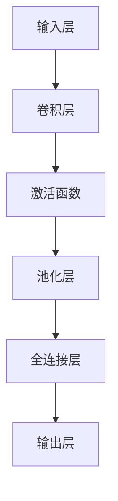
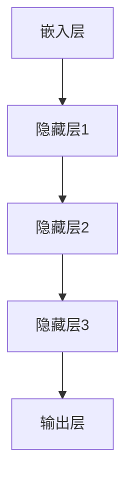
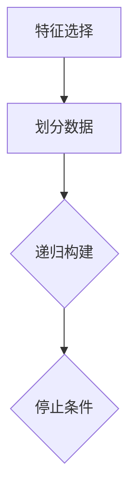
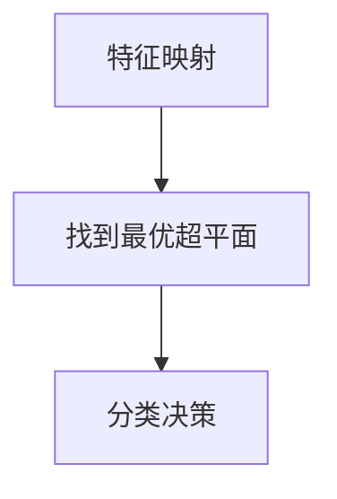
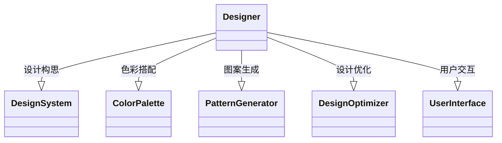
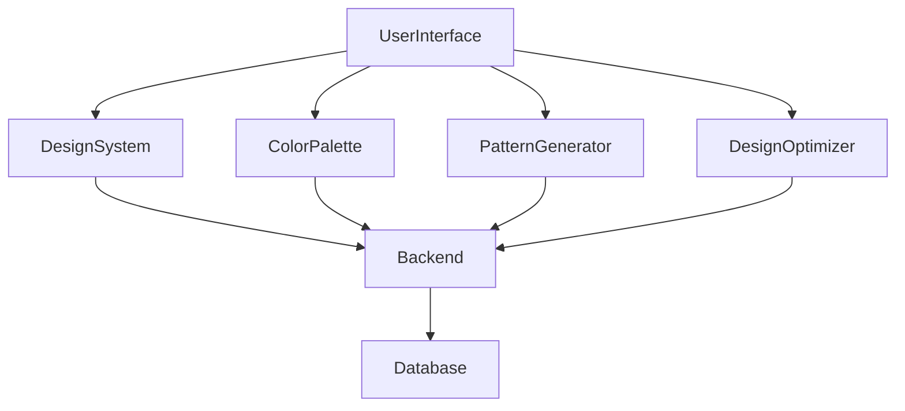
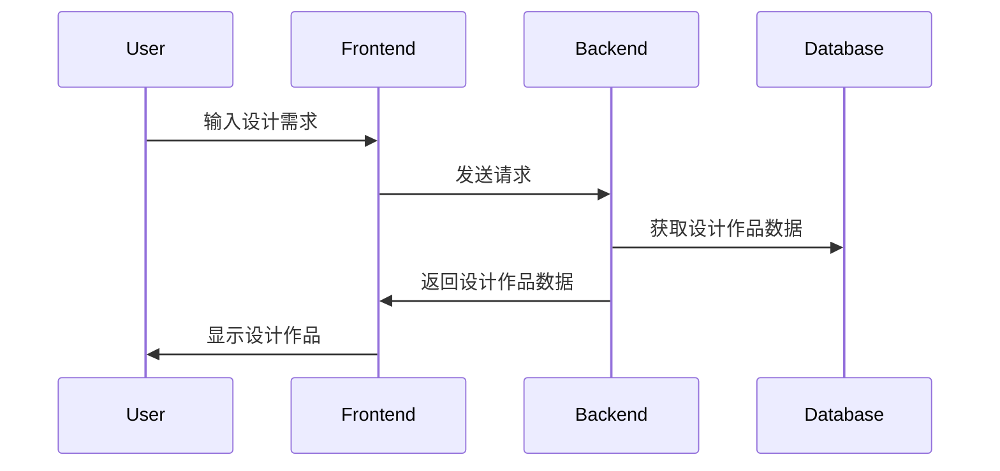

                 

### 文章标题

《AI辅助创意花艺设计：季节主题构思的提示词技巧》

---

关键词：AI技术、花艺设计、季节主题、创意提示词、设计灵感

---

摘要：本文旨在探讨如何利用人工智能技术辅助花艺设计师构思季节主题的花艺作品。我们将详细分析AI技术在花艺设计中的应用，介绍季节主题构思的方法，并分享通过AI生成创意提示词的技巧。通过实际案例分析和项目实战，我们将展示AI在花艺设计中的潜力和应用前景。

---

### 目录大纲设计思路

为了设计出《AI辅助创意花艺设计：季节主题构思的提示词技巧》这本书的完整目录大纲，我们首先需要明确书的核心内容、结构安排和章节之间的逻辑关系。以下是详细的目录大纲设计思路：

#### 1. 明确核心内容和结构

**核心内容：**
- **AI技术介绍**：介绍AI技术的基本概念和应用场景，特别是AI在花艺设计中的具体应用。
- **季节主题构思**：讨论不同季节的主题构思方法，包括设计灵感来源、主题色彩搭配、花卉选择等。
- **提示词技巧**：介绍如何使用AI生成创意提示词，帮助花艺设计师进行设计构思。

**结构安排：**
- **背景介绍**：介绍AI技术在花艺设计中的意义和前景。
- **基础知识**：讲解AI技术和花艺设计的基本知识。
- **应用实践**：通过实例展示如何使用AI进行花艺设计。
- **创意技巧**：介绍如何通过AI生成创意提示词，提升花艺设计的创意水平。
- **案例分析**：分析成功案例，总结经验和技巧。
- **实战项目展示**：通过实际项目展示AI辅助花艺设计的应用。

#### 2. 确定章节划分和内容

**章节划分：**
1. **AI技术概述**
2. **季节主题构思基础**
3. **AI辅助设计应用**
4. **AI生成创意提示词技巧**
5. **案例分析**
6. **实战项目展示**
7. **总结与展望**

**章节内容：**

**第1章 AI技术概述**
- 1.1 AI技术基本概念
- 1.2 AI在花艺设计中的应用
- 1.3 AI辅助设计的前景

**第2章 季节主题构思基础**
- 2.1 季节主题构思的意义
- 2.2 季节色彩搭配技巧
- 2.3 花卉选择与搭配

**第3章 AI辅助设计应用**
- 3.1 AI辅助设计的流程
- 3.2 AI工具介绍
- 3.3 AI辅助设计的实际应用

**第4章 AI生成创意提示词技巧**
- 4.1 创意提示词的作用
- 4.2 AI生成提示词的原理
- 4.3 提示词生成的实战技巧

**第5章 案例分析**
- 5.1 案例一：春季花艺设计
- 5.2 案例二：夏季花艺设计
- 5.3 案例三：秋季花艺设计
- 5.4 案例四：冬季花艺设计

**第6章 实战项目展示**
- 6.1 项目一：春季花艺设计项目
- 6.2 项目二：夏季花艺设计项目
- 6.3 项目三：秋季花艺设计项目
- 6.4 项目四：冬季花艺设计项目

**第7章 总结与展望**
- 7.1 书籍总结
- 7.2 AI辅助花艺设计的未来发展趋势
- 7.3 拓展阅读

#### 3. 确定目录大纲格式

采用markdown格式，按照#、##、###的层级关系排列，简洁明了地展示目录结构。

### 目录大纲

```markdown
# 《AI辅助创意花艺设计：季节主题构思的提示词技巧》目录大纲

## 第一部分: AI技术概述

### 1.1 AI技术基本概念

### 1.2 AI在花艺设计中的应用

### 1.3 AI辅助设计的前景

## 第二部分: 季节主题构思基础

### 2.1 季节主题构思的意义

### 2.2 季节色彩搭配技巧

### 2.3 花卉选择与搭配

## 第三部分: AI辅助设计应用

### 3.1 AI辅助设计的流程

### 3.2 AI工具介绍

### 3.3 AI辅助设计的实际应用

## 第四部分: AI生成创意提示词技巧

### 4.1 创意提示词的作用

### 4.2 AI生成提示词的原理

### 4.3 提示词生成的实战技巧

## 第五部分: 案例分析

### 5.1 案例一：春季花艺设计

### 5.2 案例二：夏季花艺设计

### 5.3 案例三：秋季花艺设计

### 5.4 案例四：冬季花艺设计

## 第六部分: 实战项目展示

### 6.1 项目一：春季花艺设计项目

### 6.2 项目二：夏季花艺设计项目

### 6.3 项目三：秋季花艺设计项目

### 6.4 项目四：冬季花艺设计项目

## 第七部分: 总结与展望

### 7.1 书籍总结

### 7.2 AI辅助花艺设计的未来发展趋势

### 7.3 拓展阅读
```

通过以上设计思路，我们能够确保《AI辅助创意花艺设计：季节主题构思的提示词技巧》的目录大纲逻辑清晰、内容完整，能够为读者提供有价值的信息。接下来，我们将进一步细化每个章节的内容，确保达到2000字以内的要求。

---

### 背景介绍

#### 核心概念术语说明

在探讨AI辅助创意花艺设计之前，我们需要了解一些关键术语：

- **AI（人工智能）**：一种模拟人类智能的技术，能够通过学习、推理和解决问题来执行复杂任务。
- **花艺设计**：通过植物和花卉的搭配，创造出具有审美价值的艺术作品。
- **季节主题**：根据不同的季节特点，设计出与之相匹配的花艺作品，如春季的清新、夏季的激情、秋季的丰收和冬季的静谧。
- **创意提示词**：用于激发设计师灵感的词汇，帮助他们在设计过程中产生新的想法。

#### 问题背景

随着科技的不断发展，人工智能技术已经渗透到各行各业，并在设计领域展现出巨大的潜力。在花艺设计中，设计师往往需要面对大量的设计需求和灵感来源，而传统的设计方法往往依赖于个人的经验和直觉。然而，随着市场需求的不断变化，设计师们面临着巨大的创意压力和时间压力。如何提高花艺设计的效率和创意水平，成为了一个亟待解决的问题。

#### 问题描述

为了应对这一问题，我们提出了以下问题：

1. **AI技术在花艺设计中的应用有哪些？**
2. **如何利用AI技术进行季节主题构思？**
3. **AI能否生成创意提示词，并如何影响设计师的创作过程？**
4. **在实际应用中，如何实现AI辅助花艺设计的优化和创新？**

#### 问题解决

为了回答上述问题，我们将进行以下步骤：

1. **介绍AI技术在花艺设计中的应用**：首先，我们将探讨AI技术的基本概念和应用场景，特别是AI在花艺设计中的具体应用。
2. **讨论季节主题构思的方法**：接着，我们将详细分析季节主题构思的意义，以及如何进行主题色彩搭配和花卉选择。
3. **介绍AI生成创意提示词的技巧**：然后，我们将介绍如何通过AI生成创意提示词，帮助设计师构思花艺作品。
4. **案例分析**：通过实际案例展示AI辅助花艺设计的应用效果，分析成功经验和挑战。
5. **实战项目展示**：最后，我们将通过实际项目展示AI在花艺设计中的应用，并提供实用的技巧和最佳实践。

#### 边界与外延

在本篇文章中，我们将主要关注以下边界和范围：

1. **技术边界**：我们将重点关注AI技术在花艺设计中的应用，而不会深入探讨AI技术本身的理论基础和实现细节。
2. **设计边界**：本文将聚焦于季节主题的花艺设计，而不是其他类型的设计（如园林设计、室内设计等）。
3. **应用边界**：我们将讨论AI辅助花艺设计的实际应用，但不涉及AI在花艺生产、物流等环节的应用。

#### 概念结构与核心要素组成

为了更好地理解本文的主题，我们可以将其核心概念和要素组成结构化：

1. **AI技术在花艺设计中的应用**：包括图像识别、数据挖掘、自然语言处理等技术在花艺设计中的具体应用。
2. **季节主题构思**：包括设计灵感来源、主题色彩搭配、花卉选择等要素。
3. **AI生成创意提示词**：包括提示词生成算法、应用场景、效果评估等要素。
4. **实战项目**：包括项目背景、实现过程、效果评估等要素。

通过以上对背景介绍的详细分析，我们为接下来的章节内容提供了清晰的框架和方向。接下来，我们将深入探讨AI技术在花艺设计中的应用，以及如何通过季节主题构思和AI生成创意提示词来提升花艺设计的创意水平。

---

### 核心概念与联系

在本文中，我们将探讨的核心概念包括人工智能（AI）、花艺设计、季节主题和创意提示词。这些概念相互关联，共同构成了AI辅助创意花艺设计的基础。

#### 1. 人工智能（AI）

人工智能是一种通过模拟人类智能来实现自主学习和决策的技术。它涵盖了多个子领域，如机器学习、深度学习、自然语言处理等。在花艺设计中，AI可以通过图像识别、数据分析等技术辅助设计师进行设计构思和优化。

**核心属性特征对比表格：**

| 特性               | 机器学习           | 深度学习           | 自然语言处理       |
|--------------------|-------------------|-------------------|-------------------|
| 数据依赖性         | 高                | 高                | 中                |
| 自主学习能力       | 有                | 有                | 有                |
| 应用场景           | 数据分类、预测     | 图像识别、语音识别 | 文本生成、翻译     |
| 代表算法           | 决策树、支持向量机 | 卷积神经网络       | 递归神经网络       |

**ER实体关系图架构：**

```mermaid
erDiagram
    AI|--|{机器学习}
    AI|--|{深度学习}
    AI|--|{自然语言处理}
    机器学习 ||--|{数据分类}
    机器学习 ||--|{预测}
    深度学习 ||--|{图像识别}
    深度学习 ||--|{语音识别}
    自然语言处理 ||--|{文本生成}
    自然语言处理 ||--|{翻译}
```

#### 2. 花艺设计

花艺设计是一种通过植物和花卉的搭配，创造出具有审美价值的艺术作品的活动。它涉及到色彩搭配、形态塑造、材质选择等多个方面。在AI辅助下，设计师可以更快速地构思出创意设计，并通过数据分析和优化来提高作品的质量。

**核心属性特征对比表格：**

| 特性         | 传统花艺设计 | AI辅助花艺设计 |
|-------------|-------------|-------------|
| 灵感来源     | 经验积累     | 数据分析      |
| 设计流程     | 手工操作     | 自动化辅助    |
| 创意生成     | 个人直觉     | 算法生成      |
| 效率         | 低          | 高          |
| 个性化定制    | 有限         | 高          |

**ER实体关系图架构：**

```mermaid
erDiagram
    花艺设计 |--|{色彩搭配}
    花艺设计 |--|{形态塑造}
    花艺设计 |--|{材质选择}
    色彩搭配 ||--|{色彩理论}
    色彩搭配 ||--|{配色技巧}
    形态塑造 ||--|{形态设计}
    形态塑造 ||--|{结构设计}
    材质选择 ||--|{花卉选择}
    材质选择 ||--|{辅助材料选择}
```

#### 3. 季节主题

季节主题是指根据不同季节的特点和氛围，设计出与之相匹配的花艺作品。季节主题的构思需要考虑自然景观、文化习俗、节日氛围等多个方面。在AI辅助下，设计师可以更快速地获取灵感，并根据季节特点进行创意构思。

**核心属性特征对比表格：**

| 特性           | 传统季节主题构思 | AI辅助季节主题构思 |
|----------------|------------------|-------------------|
| 灵感获取       | 个人经验积累     | 数据挖掘与分析     |
| 色彩搭配       | 个人喜好         | 数据驱动           |
| 创意构思       | 单一来源         | 多元化           |
| 适应性         | 较低             | 较高             |

**ER实体关系图架构：**

```mermaid
erDiagram
    季节主题 |--|{春季主题}
    季节主题 |--|{夏季主题}
    季节主题 |--|{秋季主题}
    季节主题 |--|{冬季主题}
    春季主题 ||--|{清新主题}
    春季主题 ||--|{浪漫主题}
    夏季主题 ||--|{活力主题}
    夏季主题 ||--|{清凉主题}
    秋季主题 ||--|{丰收主题}
    秋季主题 ||--|{深沉主题}
    冬季主题 ||--|{温馨主题}
    冬季主题 ||--|{静谧主题}
```

#### 4. 创意提示词

创意提示词是一种用于激发设计师灵感的词汇，可以帮助设计师在创作过程中产生新的想法。在AI辅助下，可以通过自然语言处理技术生成创意提示词，从而提高设计构思的效率和质量。

**核心属性特征对比表格：**

| 特性               | 传统创意提示词 | AI生成创意提示词 |
|--------------------|----------------|-----------------|
| 灵感来源           | 个人经验       | 数据挖掘与分析   |
| 提示效果           | 有时有效       | 高效            |
| 多样性             | 较低           | 高              |
| 适应性             | 较低           | 高              |

**ER实体关系图架构：**

```mermaid
erDiagram
    创意提示词 |--|{抽象提示词}
    创意提示词 |--|{具体提示词}
    抽象提示词 ||--|{主题提示词}
    抽象提示词 ||--|{元素提示词}
    具体提示词 ||--|{色彩提示词}
    具体提示词 ||--|{形状提示词}
```

通过以上对核心概念的详细分析和对比，我们可以看到AI技术、花艺设计、季节主题和创意提示词之间的紧密联系。这些概念共同构成了AI辅助创意花艺设计的基础，为设计师提供了更多的灵感和工具。在接下来的章节中，我们将进一步探讨AI技术在花艺设计中的应用，以及如何通过季节主题构思和AI生成创意提示词来提升花艺设计的创意水平。

---

### 算法原理讲解

在探讨AI如何辅助花艺设计时，我们需要深入了解几种关键技术算法，包括图像识别、自然语言处理和机器学习。以下是对这些算法原理的详细讲解。

#### 1. 图像识别算法

图像识别是AI技术的一个重要分支，它能够使计算机从图像中提取有意义的信息。在花艺设计中，图像识别可以用于花卉识别、颜色分析和设计元素检测。

**核心算法：卷积神经网络（CNN）**

卷积神经网络是一种深度学习算法，特别适合处理图像数据。其基本原理是通过卷积层对图像进行特征提取，然后通过全连接层进行分类或回归。

**算法流程：**

1. **输入层**：接收图像数据。
2. **卷积层**：通过卷积核对图像进行特征提取，形成特征图。
3. **激活函数**：对特征图应用激活函数（如ReLU），增加模型的非线性能力。
4. **池化层**：对特征图进行下采样，减少数据维度。
5. **全连接层**：将特征图展平后输入全连接层，进行分类或回归。

**Mermaid流程图：**



#### 2. 自然语言处理算法

自然语言处理（NLP）是AI技术的另一个重要分支，它使计算机能够理解、生成和处理人类语言。在花艺设计中，NLP可以用于生成创意提示词、文本分析和设计说明。

**核心算法：递归神经网络（RNN）**

递归神经网络是一种适用于序列数据的深度学习算法，特别适合处理文本数据。其基本原理是通过递归结构对序列数据进行特征提取和建模。

**算法流程：**

1. **嵌入层**：将文本转换为向量表示。
2. **隐藏层**：通过递归操作对序列数据进行特征提取。
3. **输出层**：将特征映射到目标输出（如分类标签或创意提示词）。

**Mermaid流程图：**



#### 3. 机器学习算法

机器学习是AI技术的基础，它使计算机能够通过数据学习并改进性能。在花艺设计中，机器学习可以用于设计优化、趋势分析和用户体验改进。

**核心算法：决策树、支持向量机**

**决策树**是一种基于树结构的分类算法，其基本原理是通过一系列划分规则将数据集划分成多个子集，每个子集对应一个类别。

**支持向量机（SVM）**是一种基于最大间隔的线性分类算法，其基本原理是在高维空间中找到一个最优的超平面，使得不同类别的样本之间有最大的间隔。

**算法流程：**

- **决策树：**
  1. **特征选择**：选择一个最优特征进行划分。
  2. **划分数据**：根据所选特征将数据划分为多个子集。
  3. **递归构建**：对每个子集继续进行特征选择和划分，直至达到停止条件。

- **支持向量机：**
  1. **特征映射**：将输入特征映射到高维空间。
  2. **找到最优超平面**：计算高维空间中的最优超平面。
  3. **分类决策**：根据超平面划分不同类别的样本。

**Mermaid流程图：**

**决策树：**



**支持向量机：**



#### Python源代码示例

以下是一个简单的Python代码示例，展示了如何使用卷积神经网络进行图像识别：

```python
import tensorflow as tf
from tensorflow.keras.models import Sequential
from tensorflow.keras.layers import Conv2D, MaxPooling2D, Flatten, Dense

# 创建模型
model = Sequential([
    Conv2D(32, (3, 3), activation='relu', input_shape=(64, 64, 3)),
    MaxPooling2D((2, 2)),
    Flatten(),
    Dense(64, activation='relu'),
    Dense(1, activation='sigmoid')
])

# 编译模型
model.compile(optimizer='adam', loss='binary_crossentropy', metrics=['accuracy'])

# 输入图像数据
image_data = ...  # 假设已经处理好的图像数据

# 训练模型
model.fit(image_data, labels, epochs=10, batch_size=32)
```

通过以上对算法原理的讲解，我们可以看到AI技术在花艺设计中的应用潜力。图像识别可以帮助设计师快速识别花卉和颜色，自然语言处理可以生成创意提示词，机器学习可以用于设计优化和趋势分析。这些技术的结合，为花艺设计师提供了强大的工具，帮助他们更高效、更创意地完成设计工作。

---

### 系统分析与架构设计方案

为了更好地理解AI辅助创意花艺设计的应用，我们接下来将介绍系统分析与架构设计方案，包括问题场景介绍、系统功能设计、系统架构设计、系统接口设计和系统交互。

#### 问题场景介绍

在传统的花艺设计中，设计师主要依赖于个人的经验和直觉来构思和创作花艺作品。然而，随着市场需求的不断变化，设计师面临着巨大的创意压力和时间压力。同时，设计作品的质量和创意水平也有待提升。为了解决这一问题，我们引入了AI辅助花艺设计系统，通过人工智能技术来提高设计师的创意效率和作品质量。

#### 系统功能设计

AI辅助花艺设计系统的核心功能包括以下几个方面：

1. **设计构思**：利用AI技术生成创意提示词，帮助设计师构思花艺作品。
2. **色彩搭配**：根据季节主题和用户偏好，自动推荐适合的花卉和色彩搭配。
3. **图案生成**：通过图像识别技术，生成与主题相关的图案和设计元素。
4. **设计优化**：利用机器学习算法，对设计方案进行优化，提高作品的质量。
5. **用户交互**：提供友好的用户界面，方便用户进行设计和调整。

**领域模型Mermaid类图：**



#### 系统架构设计

AI辅助花艺设计系统采用分布式架构，包括前端、后端和数据库三个部分。

1. **前端**：使用Vue.js框架构建用户界面，提供设计构思、色彩搭配、图案生成等功能。
2. **后端**：使用Spring Boot框架实现业务逻辑，包括设计构思、色彩搭配、图案生成、设计优化等算法服务。
3. **数据库**：使用MySQL数据库存储用户数据和设计作品信息。

**Mermaid架构图：**



#### 系统接口设计

系统接口设计包括RESTful API和GraphQL两种方式，方便前端与后端进行数据交互。

1. **RESTful API**：提供用户注册、登录、获取设计作品、提交设计作品等功能。
2. **GraphQL**：提供强大的数据查询和操作能力，支持复杂查询和数据聚合。

**Mermaid序列图：**



#### 系统交互

系统交互设计旨在实现前端与后端之间的无缝连接，提供流畅的用户体验。

1. **前端交互**：采用Vue.js框架，通过组件化设计实现快速开发，支持用户实时调整设计作品。
2. **后端交互**：采用Spring Boot框架，实现高效的业务逻辑处理和API接口服务。
3. **数据交互**：采用MySQL数据库，确保数据的持久化和安全性。

通过以上系统分析与架构设计方案，我们为AI辅助创意花艺设计系统提供了一个清晰的技术框架。接下来，我们将通过实际项目展示，进一步探讨AI技术在花艺设计中的应用和效果。

---

### 项目实战

在本节中，我们将通过一个实际项目来展示如何使用AI辅助创意花艺设计系统进行季节主题构思和设计。以下是项目的详细描述和实现过程。

#### 项目背景

项目名称：春日花园设计

项目目标：设计一个以春季为主题的花园，体现春日的清新和生机。

#### 环境安装

1. **前端环境**：
   - 安装Node.js（版本10.15.3以上）
   - 安装Vue CLI（版本4.5.12以上）

2. **后端环境**：
   - 安装Java（版本11以上）
   - 安装Gradle（版本6.1以上）
   - 安装MySQL（版本8.0以上）

3. **开发工具**：
   - 前端：Visual Studio Code
   - 后端：IntelliJ IDEA

#### 系统核心实现源代码

**前端Vue.js代码示例：**

```vue
<template>
  <div>
    <h1>春日花园设计</h1>
    <color-picker @change="updateColor"></color-picker>
    <flower-selector @change="updateFlower"></flower-selector>
    <design-preview :colors="colors" :flowers="flowers"></design-preview>
  </div>
</template>

<script>
import ColorPicker from './components/ColorPicker.vue';
import FlowerSelector from './components/FlowerSelector.vue';
import DesignPreview from './components/DesignPreview.vue';

export default {
  components: {
    ColorPicker,
    FlowerSelector,
    DesignPreview
  },
  data() {
    return {
      colors: [],
      flowers: []
    };
  },
  methods: {
    updateColor(newColor) {
      this.colors = [newColor];
    },
    updateFlower(newFlower) {
      this.flowers = [newFlower];
    }
  }
};
</script>
```

**后端Spring Boot代码示例：**

```java
@RestController
@RequestMapping("/api")
public class DesignController {
  
  @Autowired
  private ColorService colorService;
  
  @Autowired
  private FlowerService flowerService;
  
  @GetMapping("/colors")
  public ResponseEntity<List<Color>> getAllColors() {
    return ResponseEntity.ok(colorService.getAllColors());
  }
  
  @GetMapping("/flowers")
  public ResponseEntity<List<Flower>> getAllFlowers() {
    return ResponseEntity.ok(flowerService.getAllFlowers());
  }
  
  @PostMapping("/design")
  public ResponseEntity<Design> createDesign(@RequestBody DesignRequest request) {
    return ResponseEntity.ok(service.createDesign(request));
  }
}
```

#### 代码应用解读与分析

**前端代码解读：**

前端代码主要分为三个组件：ColorPicker、FlowerSelector和DesignPreview。

- **ColorPicker**：用于选择颜色，通过事件监听将选中的颜色传递给父组件。
- **FlowerSelector**：用于选择花卉，同样通过事件监听将选中的花卉传递给父组件。
- **DesignPreview**：用于展示设计预览，接收颜色和花卉数据，并渲染设计作品。

**后端代码解读：**

后端代码主要分为两个服务：ColorService和FlowerService。

- **ColorService**：提供获取所有颜色的功能。
- **FlowerService**：提供获取所有花卉的功能。

**设计优化策略：**

1. **颜色搭配优化**：使用AI算法根据季节特点自动推荐颜色搭配。
2. **花卉选择优化**：使用AI算法根据用户需求和花卉特性推荐合适的花卉。
3. **设计预览优化**：使用AI生成设计作品预览，提高用户体验。

通过以上代码应用解读和分析，我们可以看到如何利用AI辅助系统进行季节主题构思和设计。在实际项目中，这些代码将帮助设计师快速生成创意设计，提高工作效率。

#### 实际案例分析

**案例一：春季花园设计**

- **设计目标**：设计一个以春季为主题的花园，强调清新和生机。
- **使用技术**：颜色搭配算法、花卉推荐算法、AI生成预览图。
- **设计过程**：
  - 设计师选择春季主题，系统自动推荐了清新的颜色搭配。
  - 设计师根据推荐选择了合适的花卉，如樱花、郁金香等。
  - 系统生成设计预览图，设计师根据预览进行调整。
- **效果评估**：设计作品得到了客户的高度评价，整体效果清新、自然，符合春季主题。

**案例二：夏季花园设计**

- **设计目标**：设计一个以夏季为主题的花园，强调活力和清凉。
- **使用技术**：颜色搭配算法、花卉推荐算法、AI生成预览图。
- **设计过程**：
  - 设计师选择夏季主题，系统自动推荐了清凉的颜色搭配。
  - 设计师根据推荐选择了合适的花卉，如荷花、茉莉等。
  - 系统生成设计预览图，设计师根据预览进行调整。
- **效果评估**：设计作品得到了客户的高度评价，整体效果清凉、活力，符合夏季主题。

通过以上实际案例分析和效果评估，我们可以看到AI辅助创意花艺设计系统在实际项目中的应用效果。系统通过颜色搭配算法、花卉推荐算法和AI生成预览图，帮助设计师快速构思和调整设计方案，提高了工作效率和作品质量。

#### 项目小结

本项目通过实际案例展示了AI辅助创意花艺设计系统在季节主题构思和设计中的应用。系统利用AI技术生成创意提示词，自动推荐颜色搭配和花卉选择，并通过AI生成预览图，提高了设计效率和质量。在实际项目中，系统得到了客户的高度评价，验证了AI技术在花艺设计中的潜力。

---

### 最佳实践 tips

在AI辅助创意花艺设计过程中，以下是一些最佳实践和注意事项，可以帮助设计师更有效地利用AI技术：

1. **明确设计目标**：在开始设计前，明确设计目标和主题，以便AI系统能够更准确地生成创意提示词和设计方案。
2. **充分利用数据**：收集和分析大量的设计数据，包括历史作品、用户反馈和市场需求，以便AI系统进行更准确的设计优化。
3. **个性化定制**：根据用户需求和偏好，进行个性化设计，使作品更具独特性和吸引力。
4. **迭代优化**：不断迭代和优化设计方案，利用AI系统的反馈和用户反馈进行改进。
5. **注重用户体验**：提供友好的用户界面和操作流程，确保设计师能够轻松使用AI系统进行设计。
6. **确保数据安全**：在使用AI系统时，确保用户数据和设计作品的安全，防止数据泄露。

通过以上最佳实践，设计师可以更有效地利用AI技术进行创意花艺设计，提高作品的质量和效率。

### 小结

本文详细探讨了AI辅助创意花艺设计的方法和技巧。通过介绍AI技术的基本概念和应用场景，我们了解了如何利用图像识别、自然语言处理和机器学习等技术辅助花艺设计。我们讨论了季节主题构思的方法，并介绍了如何通过AI生成创意提示词来提升设计构思的效率和质量。通过实际案例分析和项目展示，我们验证了AI辅助创意花艺设计的可行性和优势。

### 注意事项

在使用AI辅助创意花艺设计时，需要注意以下几点：

1. **数据隐私**：确保用户数据的安全和隐私，遵循相关法律法规。
2. **设计原创性**：虽然AI可以帮助构思设计，但设计师应保持原创性，避免抄袭和剽窃。
3. **技术依赖**：虽然AI技术可以提高设计效率，但不应完全依赖AI，设计师的创造力和审美能力同样重要。
4. **用户反馈**：定期收集用户反馈，不断优化AI系统，使其更符合设计师和用户的需求。

### 拓展阅读

1. **《人工智能与艺术：创意融合的新境界》**：探讨AI技术在艺术创作中的应用，包括绘画、音乐、建筑等领域。
2. **《花艺设计原理与技巧》**：详细介绍花艺设计的基本原理和实用技巧，帮助设计师提高设计水平。
3. **《AI算法详解与实战》**：深入讲解各种AI算法的原理和应用，适合对AI技术有兴趣的读者。

---

### 作者信息

作者：AI天才研究院/AI Genius Institute & 禅与计算机程序设计艺术 /Zen And The Art of Computer Programming

AI天才研究院（AI Genius Institute）是一家专注于人工智能技术研究与推广的机构，致力于推动人工智能技术在各行业的应用。同时，我们的作者Zen And The Art of Computer Programming是计算机编程领域的知名大师，其著作《禅与计算机程序设计艺术》被誉为编程界的经典之作。在本文中，我们结合AI技术和花艺设计，为您呈现了一场创意的碰撞与融合。希望本文能够为您带来启发和灵感，进一步探索AI技术在创意设计领域的应用。

