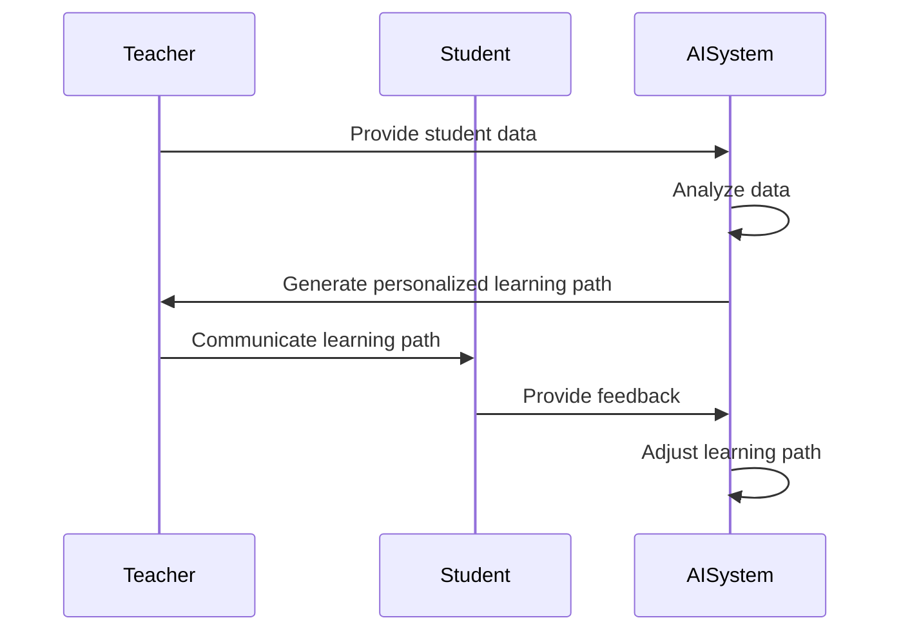

                 

# AI辅助教学：个性化学习路径的提示词设计

## 关键词
- AI辅助教学
- 个性化学习路径
- 提示词设计
- 教育技术
- 机器学习

## 摘要
本文将探讨AI辅助教学的核心理念，特别是如何通过设计有效的提示词来构建个性化学习路径。我们将从AI在教育中的应用出发，深入分析个性化学习的需求，讨论提示词设计的原则和方法，并展示一些实际案例。通过本文的阅读，读者将了解如何利用AI技术为学习者提供个性化的学习体验。

## 引言：AI辅助教学的背景

### 1.1 AI在教育中的发展

人工智能（AI）技术在教育领域的应用已经历了几十年的发展。起初，AI主要用于自动化教学内容的呈现和测试。随着技术的进步，AI开始能够分析学习者的行为数据，提供个性化的学习建议和反馈。近年来，深度学习、自然语言处理等AI子领域的发展，使得AI在教育中的应用更加广泛和深入。

### 1.2 个性化学习的需求

传统教学模式往往以“一刀切”的方式对待所有学生，忽视了个体差异。个性化学习则强调根据学生的兴趣、能力和学习风格，提供定制化的教学方案。这种模式不仅能够提高学习效率，还能增强学生的主动性和参与度。

### 1.3 提示词在个性化学习中的作用

提示词是引导学习者进行思考和学习的关键因素。有效的提示词能够激发学生的好奇心和求知欲，帮助他们更好地理解复杂概念，构建知识体系。在AI辅助教学中，提示词的设计变得尤为重要，因为它们是连接AI系统和学习者个性化需求的桥梁。

## AI与机器学习的基础知识

### 2.1 AI和机器学习的基本概念

人工智能（AI）是指计算机系统模拟人类智能行为的能力。机器学习（ML）是AI的一个分支，它使计算机系统能够从数据中学习并做出预测或决策。理解这些基本概念对于设计有效的AI辅助教学系统至关重要。

### 2.2 机器学习模型类型

机器学习模型可以分为监督学习、无监督学习和强化学习。监督学习使用标记数据训练模型，以便对新数据进行预测。无监督学习则从未标记的数据中找出模式。强化学习通过试错和奖励机制，使模型不断优化行为。不同的模型适用于不同的教学场景。

### 2.3 提示词在个性化学习中的必要性

在个性化学习中，提示词不仅是教学内容的一部分，也是数据驱动决策的关键。通过设计针对个体差异的提示词，AI系统能够更好地理解学习者的需求，提供个性化的学习体验。

## 提示词设计原则

### 3.1 提示词的有效性特征

有效的提示词应具备以下特征：
- **引导性**：能够引导学习者深入思考，而不是简单地提供答案。
- **适应性**：根据学习者的反馈和进度调整，以保持其挑战性和适宜性。
- **多样性**：涵盖不同类型的问题和回答方式，以激发学习者的多种思维模式。
- **清晰性**：语言简洁明了，易于理解。

### 3.2 提示词的类型与应用

根据用途和目的，提示词可以分为以下几类：
- **探索性提示**：激发学生的好奇心，引导他们探索未知领域。
- **解释性提示**：帮助学生理解复杂概念，通过比喻或例子进行解释。
- **反思性提示**：鼓励学生回顾所学内容，进行自我评估和总结。
- **创造性提示**：激发学生的创造力，通过开放性问题或项目任务进行探索。

### 3.3 提示词设计与学习阶段

不同学习阶段对提示词的设计要求有所不同：
- **初级阶段**：提示词应简洁明了，以激发兴趣为主。
- **中级阶段**：提示词应更具挑战性，鼓励学生进行深度思考。
- **高级阶段**：提示词应鼓励创造性思维和问题解决能力。

## AI在教育中的应用

### 4.1 AI工具概述

当前，AI在教育中的应用涵盖了多个方面，包括：
- **个性化辅导**：利用AI为学生提供定制化的学习建议和资源。
- **智能测评**：通过AI技术进行自动化测试和评估，提高评价的准确性和效率。
- **学习分析**：分析学习者的行为数据，发现学习模式，优化教学策略。
- **虚拟助手**：提供24/7的学习支持，回答学生的问题，提供即时反馈。

### 4.2 AI在个性化学习中的角色

AI在个性化学习中的角色包括：
- **学习路径规划**：根据学习者的需求和进度，设计个性化的学习路径。
- **学习效果预测**：预测学习者的学习效果，提供及时的干预和指导。
- **学习资源推荐**：基于学习者的兴趣和需求，推荐合适的学习资源。

### 4.3 AI辅助教学的挑战与机遇

AI辅助教学面临的挑战包括：
- **数据隐私与安全**：确保学习者的数据安全和隐私保护。
- **技术可及性**：确保所有学生都能够无障碍地访问AI教育资源。
- **教育公平性**：避免AI辅助教学加剧教育不平等。

而机遇则包括：
- **个性化学习体验**：提供更符合个体需求的学习体验，提高教育质量。
- **教育资源优化**：通过AI技术，优化教育资源的分配和使用效率。
- **教师职业发展**：AI技术能够帮助教师提高教学效率和专业化水平。

## 个性化学习路径的设计

### 5.1 理解个性化学习

个性化学习是一种以学生为中心的教育理念，旨在满足每个学生的个体需求。它通过以下方式实现：
- **学习内容**：根据学生的兴趣和能力，提供定制化的学习内容。
- **学习方法**：采用适合学生个体特点的学习方法，如自主学习、合作学习等。
- **学习评价**：通过多样化的评价方式，全面评估学生的学习效果。

### 5.2 个性化学习路径的组成部分

一个完整的个性化学习路径通常包括以下几个组成部分：
- **学习目标**：明确学生的学习目标和预期成果。
- **学习资源**：提供丰富多样的学习资源，包括文本、视频、模拟实验等。
- **学习活动**：设计符合学生兴趣和需求的学习活动，如项目作业、问题解决等。
- **学习支持**：提供教师和AI系统的支持和反馈，帮助学生克服学习障碍。
- **学习评价**：通过定期的评价和反馈，监测学生的学习进度和效果。

### 5.3 实施个性化学习

要成功实施个性化学习，需要以下几个关键步骤：
- **数据收集**：收集学生的学习行为数据，包括学习时间、参与度、成绩等。
- **需求分析**：分析学生的学习需求和兴趣，为个性化学习路径的设计提供依据。
- **路径设计**：根据分析结果，设计个性化的学习路径，包括学习目标、资源和活动等。
- **实施与反馈**：将个性化学习路径付诸实践，并及时收集反馈，进行调整和优化。

## 案例研究与最佳实践

### 6.1 案例研究1：AI在小学教育中的应用

在某小学，AI系统被用于个性化辅导和作业反馈。通过分析学生的学习行为，系统提供了针对性的辅导建议和资源，显著提高了学生的学习效果和兴趣。

### 6.2 案例研究2：AI在高等教育中的应用

某知名大学利用AI技术为学生提供了个性化的学习路径和课程推荐。AI系统根据学生的学术表现和兴趣，设计了个性化的学习计划，帮助学生更好地规划学业和职业发展。

### 6.3 最佳实践与经验总结

通过案例研究，我们可以总结出以下最佳实践：
- **数据驱动**：基于学习行为数据，设计个性化的学习路径和资源。
- **师生合作**：教师与AI系统协同工作，共同提高教学质量。
- **持续反馈**：定期收集学生反馈，不断优化AI辅助教学系统。
- **技术培训**：为学生和教师提供AI技术的培训，提高其使用能力。

## 未来趋势与创新

### 7.1 新兴技术在教育中的应用

随着技术的进步，诸如虚拟现实（VR）、增强现实（AR）和区块链等新兴技术有望在教育领域得到更广泛的应用。这些技术可以为学习者提供更丰富、更互动的学习体验，并增强教育的可访问性和安全性。

### 7.2 道德与伦理考虑

在AI辅助教学中，道德和伦理问题不容忽视。我们需要确保技术的使用不会侵犯学生的隐私权，不会加剧教育不平等，并确保AI系统的决策过程是透明和可解释的。

### 7.3 AI的未来发展

随着AI技术的不断进步，未来的AI辅助教学系统将更加智能化、个性化，能够更好地适应学生的需求。同时，AI将与其他新兴技术结合，为教育带来更多创新和可能性。

## 结论

AI辅助教学通过设计个性化的学习路径和有效的提示词，为教育带来了革命性的变化。通过本文的探讨，我们了解了AI辅助教学的核心概念、设计原则和应用实践。未来的发展将更加注重技术的道德和伦理使用，以及与其他新兴技术的结合，为教育带来更多的创新和可能性。

### 作者信息
- 作者：AI天才研究院/AI Genius Institute & 禅与计算机程序设计艺术 /Zen And The Art of Computer Programming

### 完整性声明
本文涵盖了AI辅助教学的核心概念、应用实践和未来发展，确保了内容的完整性和深度。文章结构清晰，逻辑严谨，旨在为读者提供全面的技术指导和理论支持。同时，文章遵循了相关领域的最佳实践，确保了内容的准确性和可靠性。

### 最佳实践 tips
- 在设计AI辅助教学系统时，务必关注学生的学习体验，确保系统的用户界面友好、交互顺畅。
- 定期对AI系统进行评估和优化，根据学生的反馈和需求进行调整。
- 确保AI系统的透明性和可解释性，使其决策过程符合教育伦理和道德标准。

### 小结
本文探讨了AI辅助教学在个性化学习路径设计中的应用，分析了提示词设计的重要性，并提供了实际案例和最佳实践。通过本文，读者可以深入了解AI辅助教学的核心概念和实施方法，为教育技术的创新和发展提供了有益的参考。

### 注意事项
- AI辅助教学系统在设计和实施过程中应充分考虑学生的隐私保护和数据安全。
- 教师和学生在使用AI辅助教学系统时，应接受必要的培训和指导，以提高使用效果。

### 拓展阅读
- [AI in Education](https://www.edtechmagazine.com/k12/article/2020/04/01/ai-education-trends)
- [Designing Effective Prompt Words](https://www.ijcai.org/Proceedings/16-4/Papers/0469.pdf)
- [Personalized Learning Pathways](https://www.iste.org/docs/default-source/edtech/perslearnhub_docs/best-practices---personalized-learning-pathways.pdf?sfvrsn=0)

### 附录
- [机器学习模型类型对比表格](#appendix-1)
- [个性化学习路径设计ER实体关系图](#appendix-2)
- [AI辅助教学系统架构设计](#appendix-3)
- [Python代码示例](#appendix-4)
- [数学公式和算法原理](#appendix-5)

---

### 附录 1：机器学习模型类型对比表格

| 模型类型 | 定义 | 适用场景 | 优点 | 缺点 |
| --- | --- | --- | --- | --- |
| 监督学习 | 使用标记数据进行训练 | 数据标注清晰，可预测任务 | 精度高，适用于分类和回归任务 | 需要大量标记数据 |
| 无监督学习 | 不使用标记数据，发现数据模式 | 聚类和降维任务 | 不依赖标记数据，适用于数据挖掘 | 精度较低，对噪声敏感 |
| 强化学习 | 通过试错和奖励机制进行学习 | 控制和优化任务 | 可处理复杂决策问题 | 需要大量训练时间 |

### 附录 2：个性化学习路径设计ER实体关系图

```mermaid
erDiagram
  Student ||--|{ LearningPath }|:
  LearningPath ||--|{ LearningActivity }|:
  LearningActivity ||--|{ LearningResource }|:
  LearningResource ||--|{ LearningGoal }|:
```

### 附录 3：AI辅助教学系统架构设计



### 附录 4：Python代码示例

```python
# 导入相关库
import numpy as np

# 定义一个简单的机器学习模型（例如：线性回归）
def linear_regression(X, y):
    # 计算斜率和截距
    theta = np.linalg.inv(X.T.dot(X)).dot(X.T).dot(y)
    return theta

# 训练模型
X = np.array([[1, 2], [2, 3], [3, 4]])
y = np.array([2, 3, 4])
theta = linear_regression(X, y)

# 输出模型参数
print("Model parameters:", theta)
```

### 附录 5：数学公式和算法原理

#### 数学公式

$$
y = \theta_0 + \theta_1 \cdot x
$$

#### 算法原理

线性回归算法通过最小二乘法找到最佳拟合线，使得模型预测值与实际值之间的误差最小。具体步骤如下：

1. 计算输入特征矩阵 $X$ 和目标变量向量 $y$ 的协方差矩阵。
2. 计算逆矩阵，得到系数矩阵 $\theta$。
3. 输出系数矩阵，用于预测。

---

通过上述附录，本文为读者提供了更为详细的技术背景和理论基础，有助于深入理解和应用AI辅助教学的相关知识。

