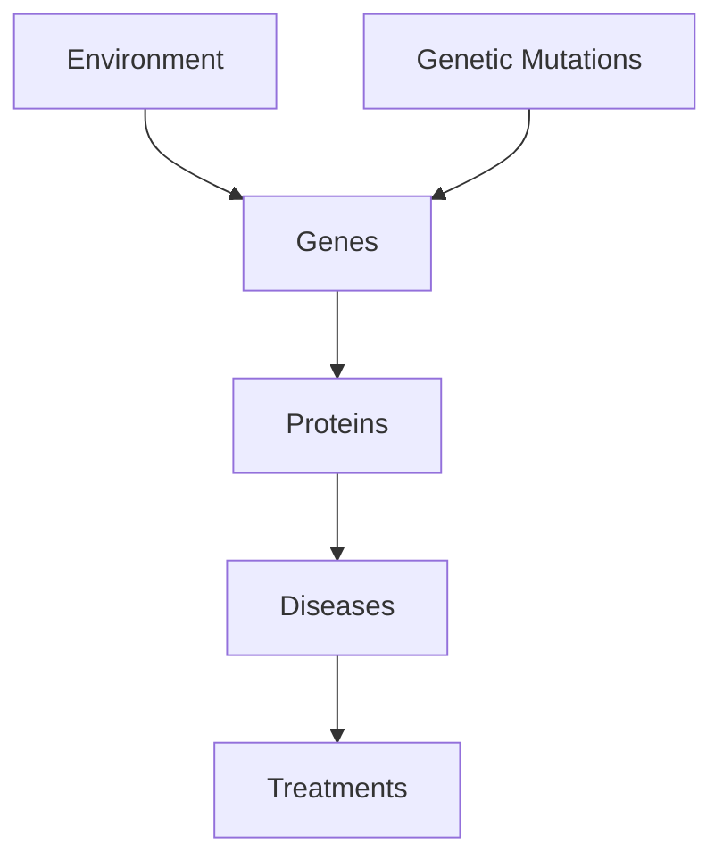

                 

## Introduction to AI-assisted Science Discovery

### Background and Importance of AI-assisted Science Discovery

In recent years, Artificial Intelligence (AI) has revolutionized various domains, and its impact on scientific research is profound. AI-assisted science discovery refers to the integration of AI techniques into scientific inquiry to enhance the efficiency, accuracy, and breadth of research outcomes. The primary motivation behind this integration lies in the exponential growth of data and the increasing complexity of scientific problems that humans struggle to solve independently.

The importance of AI-assisted science discovery can be understood through several dimensions. Firstly, AI can process and analyze large datasets far more efficiently than humans, allowing scientists to uncover patterns, trends, and relationships that would otherwise remain hidden. For instance, genomics research benefits significantly from AI's ability to analyze massive genomic datasets, leading to the identification of genes associated with diseases and the development of personalized medicine.

Secondly, AI can automate repetitive and time-consuming tasks in scientific research, freeing up scientists to focus on more creative and high-impact activities. This automation extends to tasks such as data collection, data cleaning, and initial data analysis, which are crucial but often tedious. By reducing the time spent on these tasks, AI enables researchers to iterate more quickly and pursue new lines of inquiry.

Thirdly, AI can aid in hypothesis generation and verification. By analyzing existing data and generating plausible hypotheses, AI can guide the research process towards more promising directions. Additionally, AI can verify these hypotheses through simulations, experimental designs, or further data analysis, providing empirical evidence to support or refute the hypotheses.

### Challenges and Opportunities in Current Scientific Research

Despite the numerous benefits of AI-assisted science discovery, there are several challenges and opportunities that researchers must navigate. One of the primary challenges is the quality and reliability of AI-generated hypotheses. While AI can identify patterns and correlations, it may not always accurately interpret the underlying mechanisms or the context in which these patterns exist. Therefore, it is crucial to develop methods to validate the generated hypotheses rigorously.

Another challenge is the integration of AI into existing research workflows. Researchers from various disciplines may have different levels of expertise and familiarity with AI tools and techniques. This diversity can create barriers to effective collaboration and the widespread adoption of AI in scientific research. To address this, it is essential to develop user-friendly interfaces and platforms that can bridge the gap between AI tools and researchers.

Moreover, ethical considerations play a significant role in AI-assisted science discovery. The use of AI in research raises questions about data privacy, bias, and transparency. Researchers must ensure that the use of AI tools adheres to ethical guidelines and does not compromise the integrity of scientific inquiry.

However, these challenges also present opportunities for innovation and growth. The development of more sophisticated AI algorithms and models can address many of these challenges. For instance, techniques like transfer learning and few-shot learning can improve the performance of AI systems on new and unseen data, making them more adaptable and reliable in diverse research contexts.

Additionally, the growing availability of computational resources and open-source AI frameworks provides scientists with powerful tools to develop and deploy AI-assisted research projects. This democratization of AI technology can drive broader participation and collaboration across different scientific communities.

### Overview of Hypothesis Generation and Verification

In scientific research, the process of hypothesis generation and verification is fundamental. A hypothesis is a proposed explanation for a phenomenon that can be tested through empirical evidence. The process typically involves formulating a hypothesis based on existing knowledge and then testing it through experiments or further data analysis.

AI can significantly enhance this process by automating hypothesis generation. AI systems can analyze large datasets to identify patterns and relationships that may suggest potential hypotheses. For example, in genomics, AI algorithms can analyze genetic data to identify genes that may be associated with certain diseases, leading to new hypotheses that can be tested experimentally.

Once a hypothesis is generated, AI can also play a crucial role in its verification. AI algorithms can be used to design and analyze experiments, simulate the expected outcomes of these experiments, and even predict the results based on additional data. This allows researchers to evaluate the validity of a hypothesis before committing to extensive and costly experimental procedures.

Moreover, AI can facilitate the iterative refinement of hypotheses. By continuously analyzing new data and updating the hypothesis accordingly, AI can help researchers identify the most promising lines of inquiry and avoid unnecessary experimentation.

In summary, AI-assisted science discovery holds immense potential to revolutionize the process of hypothesis generation and verification. By automating these critical steps, AI can accelerate scientific progress, improve research outcomes, and pave the way for new discoveries in diverse scientific domains.

### Conclusion

In conclusion, AI-assisted science discovery represents a transformative approach to modern scientific research. By leveraging the power of AI to analyze vast datasets, generate hypotheses, and verify them through simulations and experiments, scientists can overcome many of the traditional limitations of scientific inquiry. The integration of AI into scientific research not only enhances the efficiency and accuracy of research processes but also opens up new avenues for exploration and innovation. As we continue to advance AI technologies, the potential for AI-assisted science discovery to drive groundbreaking discoveries in various scientific domains becomes increasingly evident.

### Keywords

- Artificial Intelligence
- Scientific Research
- Hypothesis Generation
- Hypothesis Verification
- AI-assisted Discovery

### Abstract

This article explores the concept of AI-assisted science discovery, focusing on the critical processes of hypothesis generation and verification. It discusses the background and importance of integrating AI into scientific research, highlighting the challenges and opportunities that arise from this integration. The article delves into the design of prompts for effective hypothesis generation, algorithmic frameworks for hypothesis verification, and the mathematical models underpinning these processes. Additionally, it outlines the system design and implementation strategies for integrating AI into scientific research workflows, supplemented by practical case studies and best practices. Through this comprehensive analysis, the article underscores the transformative potential of AI-assisted science discovery in advancing scientific knowledge and innovation.

### Fundamental Concepts in AI

#### Introduction to Artificial Intelligence

Artificial Intelligence (AI) is a subfield of computer science that focuses on creating intelligent machines that can perform tasks that typically require human intelligence. These tasks include visual perception, speech recognition, decision-making, and language translation. AI has evolved significantly over the past few decades, driven by advancements in computing power, data availability, and algorithmic innovations.

At its core, AI aims to simulate human cognitive abilities using machines. This involves developing algorithms and models that can learn from data, recognize patterns, and make decisions. The goal is to create systems that can not only solve specific problems but also adapt and learn from new information, thereby improving their performance over time.

The history of AI is marked by several key milestones. The term "Artificial Intelligence" was coined in 1956 by John McCarthy during the Dartmouth Conference. This event is often considered the birth of AI as a scientific discipline. In the following years, researchers made significant progress in developing rule-based systems and expert systems that could mimic human decision-making.

However, the true potential of AI began to unfold with the advent of machine learning in the late 20th century. Algorithms like decision trees, neural networks, and support vector machines enabled machines to learn from data without being explicitly programmed for specific tasks. This era of "Big Data" further accelerated AI's growth, as the availability of vast amounts of data provided the necessary fuel for machine learning models to train and improve.

In recent years, deep learning has emerged as a dominant force in AI. Inspired by the structure and function of the human brain, deep neural networks with many layers (hence "deep") have achieved remarkable success in various domains, including computer vision, natural language processing, and speech recognition. Notable breakthroughs include the development of convolutional neural networks (CNNs) for image recognition and recurrent neural networks (RNNs) for language processing.

#### Machine Learning Basics

Machine learning (ML) is a subset of AI that focuses on developing algorithms that can learn from and make predictions or decisions based on data. The core idea behind machine learning is to build models that can generalize from the training data to unseen data, thereby enabling machines to perform tasks without explicit programming.

There are several types of machine learning approaches, including supervised learning, unsupervised learning, and reinforcement learning.

**Supervised Learning**

Supervised learning involves training a model on a labeled dataset, where the correct output is provided for each input. The model's goal is to learn the relationship between the inputs and outputs and make accurate predictions for new, unseen data. Common algorithms in supervised learning include linear regression, logistic regression, decision trees, and support vector machines.

**Unsupervised Learning**

Unsupervised learning, on the other hand, deals with unlabeled data. The goal is to find hidden patterns or structures within the data. Clustering and dimensionality reduction are two primary tasks in unsupervised learning. Clustering algorithms like K-means, hierarchical clustering, and DBSCAN group data points based on their similarities. Dimensionality reduction techniques, such as Principal Component Analysis (PCA) and t-Distributed Stochastic Neighbor Embedding (t-SNE), reduce the complexity of the data by projecting it onto a lower-dimensional space while preserving important features.

**Reinforcement Learning**

Reinforcement learning is a type of machine learning where an agent learns to make decisions by interacting with an environment. The agent receives feedback in the form of rewards or penalties based on its actions and learns to optimize its behavior over time. Reinforcement learning has been successfully applied to various domains, including robotics, gaming, and autonomous driving.

#### Deep Learning Principles

Deep learning is a subfield of machine learning that uses artificial neural networks with many layers (hence "deep") to model complex relationships in data. A deep neural network consists of multiple layers of interconnected nodes (neurons), where each layer performs a specific transformation on the input data.

**Neural Networks and Activation Functions**

A neural network is composed of layers of nodes, where each node receives inputs from the previous layer, applies a weighted sum of these inputs, and passes the result through an activation function. The activation function introduces non-linearities into the network, enabling it to model complex patterns in the data. Common activation functions include the sigmoid, tangent hyperbolic (tanh), and rectified linear unit (ReLU).

**Backpropagation Algorithm**

Training a deep neural network involves adjusting the weights and biases of the network to minimize the difference between the predicted output and the actual output. The backpropagation algorithm is a fundamental technique used to efficiently compute these gradients. Backpropagation works by propagating the error backward through the network, adjusting the weights and biases at each layer based on the partial derivatives of the loss function with respect to these parameters.

**Convolutional Neural Networks (CNNs)**

Convolutional neural networks are a specialized type of deep neural network designed for processing data with a grid-like topology, such as images. CNNs use convolutional layers, which apply convolutional filters to the input data to capture local patterns and features. This allows CNNs to perform tasks like image classification, object detection, and image segmentation with high accuracy.

**Recurrent Neural Networks (RNNs)**

Recurrent neural networks are designed to handle sequential data, where the output of the previous step is used as input to the next step. RNNs are particularly effective in tasks involving language processing, time series analysis, and speech recognition. One notable type of RNN is the Long Short-Term Memory (LSTM) network, which addresses the vanishing gradient problem and can capture long-term dependencies in data.

In conclusion, understanding the fundamental concepts of AI, machine learning, and deep learning is crucial for anyone involved in AI-assisted science discovery. These concepts provide the foundation for developing and implementing AI models that can generate and verify hypotheses in scientific research, paving the way for transformative advancements in various scientific domains.

### AI and Scientific Research

#### The Role of AI in Modern Scientific Research

Artificial Intelligence (AI) has emerged as a powerful tool in modern scientific research, transforming how data is processed, analyzed, and interpreted. Its role spans a wide range of applications, from enabling researchers to discover new scientific phenomena to accelerating the pace of innovation across various disciplines. The integration of AI into scientific research has been facilitated by several key factors, including advancements in computing power, the availability of large datasets, and the development of sophisticated machine learning algorithms.

One of the primary roles of AI in scientific research is in data analysis. Traditional scientific research often involves the collection of vast amounts of data, which can be time-consuming and labor-intensive to analyze manually. AI algorithms, particularly those based on machine learning, can process and analyze these large datasets much more efficiently. For example, in genomics research, AI techniques are used to analyze genomic data from thousands of individuals, identifying genetic markers associated with diseases and enabling the development of personalized treatment strategies.

AI also plays a crucial role in data modeling. By learning from existing data, AI models can predict future trends and outcomes, providing researchers with valuable insights that can guide their work. In climate science, for instance, AI models are used to analyze historical climate data and make projections about future climate patterns, helping scientists develop strategies to mitigate the impacts of climate change.

Moreover, AI can significantly enhance the experimental design process. Experimental research often involves running multiple trials to test hypotheses, which can be time-consuming and resource-intensive. AI algorithms can help optimize experimental designs by identifying the most effective variables to test and the optimal conditions under which to run experiments. This not only saves time and resources but also increases the likelihood of obtaining meaningful results.

Another critical role of AI in scientific research is in hypothesis generation. Traditional scientific research relies heavily on human intuition and prior knowledge to formulate hypotheses. AI, however, can analyze large datasets to identify patterns and relationships that may not be immediately apparent to humans. This enables researchers to generate new hypotheses that they might not have considered otherwise, opening up new avenues for exploration.

For example, in materials science, AI algorithms have been used to predict the properties of new materials based on their atomic structures. By analyzing vast amounts of data on existing materials, these algorithms can identify trends and generate hypotheses about the properties of new materials, which can then be tested experimentally. This has led to the discovery of new materials with unique properties, such as superconductors and advanced alloys, which have applications in various industries, including electronics, aerospace, and medicine.

In the realm of drug discovery, AI is also revolutionizing the process. AI algorithms can analyze molecular structures and identify potential drug candidates that have not been previously considered. This accelerates the drug discovery process, making it possible to develop new drugs more quickly and efficiently. For instance, AI has been used to develop drugs for diseases such as COVID-19, demonstrating the significant impact of AI on the speed and effectiveness of drug development.

Additionally, AI is used in scientific research to improve the verification of hypotheses. AI models can simulate the outcomes of experiments and provide predictions based on additional data. This allows researchers to validate their hypotheses before investing significant time and resources into experimental trials. By using AI to verify hypotheses, researchers can avoid unnecessary experiments and focus their efforts on the most promising lines of inquiry.

In conclusion, AI has become an indispensable tool in modern scientific research. Its ability to process large datasets, generate hypotheses, optimize experimental designs, and verify hypotheses is transforming how scientific research is conducted. As AI continues to advance, its role in scientific research will only grow, enabling researchers to make new discoveries, solve complex problems, and drive innovation across various fields.

#### AI in Data Analysis and Modeling

Artificial Intelligence (AI) has revolutionized data analysis and modeling in scientific research by providing powerful tools that can handle large and complex datasets, uncover hidden patterns, and generate meaningful insights. The integration of AI in data analysis and modeling has significantly enhanced the efficiency and accuracy of scientific research, leading to breakthrough discoveries and advancements in various fields.

**Data Preprocessing**

The first step in using AI for data analysis is data preprocessing. This involves cleaning the data, handling missing values, and transforming it into a suitable format for analysis. AI algorithms can automate this process, making it faster and more reliable. For instance, machine learning algorithms can be trained to identify and fill in missing values based on the patterns observed in the dataset. This helps ensure that the data used for analysis is complete and accurate.

**Feature Extraction**

Once the data is preprocessed, the next step is feature extraction. This involves selecting the most relevant features from the dataset that will be used to train the AI model. Feature extraction is crucial because it can significantly impact the performance of the model. AI techniques, such as Principal Component Analysis (PCA) and Independent Component Analysis (ICA), can be used to extract the most informative features from the data. These techniques help reduce the dimensionality of the data, making it easier for the model to learn and generalize from it.

**Model Selection and Training**

After the features are extracted, the next step is to select an appropriate AI model for the analysis. There are various types of models that can be used, including linear regression, decision trees, support vector machines, and neural networks. The choice of model depends on the nature of the data and the specific problem being addressed. Once the model is selected, it needs to be trained on the dataset. This involves feeding the model with the input data and adjusting its parameters to minimize the difference between the predicted outputs and the actual outputs.

**Model Evaluation and Optimization**

Once the model is trained, it needs to be evaluated to ensure that it is performing well. This is typically done using metrics such as accuracy, precision, recall, and F1 score, depending on the type of problem. AI algorithms can automatically evaluate the performance of the model and provide insights into which features are most important and how the model can be optimized. Techniques like cross-validation and hyperparameter tuning are used to fine-tune the model and improve its performance.

**Data Visualization**

Data visualization is an important aspect of data analysis, as it helps researchers to understand and communicate the insights derived from the data. AI can generate visualizations that provide a clear and intuitive representation of the data, highlighting patterns, trends, and outliers. For example, AI algorithms can generate heat maps, scatter plots, and histograms that visualize the relationships between different variables in the dataset.

**Predictive Modeling**

One of the key applications of AI in data analysis is predictive modeling. Predictive models can be used to make predictions about future events based on historical data. This is particularly useful in scientific research, where researchers need to forecast trends, predict outcomes of experiments, or identify potential risks. AI models, such as regression models, time series models, and classification models, can be trained to predict future events with high accuracy. For example, in climate science, AI models are used to predict future climate patterns based on historical climate data.

**Pattern Recognition**

AI is also highly effective in pattern recognition, which involves identifying recurring patterns or structures within data. This is particularly useful in fields such as image processing, where AI algorithms can identify and classify objects in images based on their patterns. For example, in medical imaging, AI algorithms can identify tumors in MRI scans by recognizing the patterns of tissue density and structure.

**Complex Systems Modeling**

AI is also used in the modeling of complex systems, where traditional methods may not be sufficient. Complex systems often involve a large number of interconnected components and variables, making it challenging to develop accurate models. AI techniques, such as neural networks and agent-based models, can handle the complexity of these systems and provide insights into their behavior. For example, in ecological systems, AI models are used to simulate the interactions between different species and predict the effects of environmental changes on ecosystem dynamics.

In conclusion, AI has transformed data analysis and modeling in scientific research by providing powerful tools that can handle large and complex datasets, uncover hidden patterns, and generate meaningful insights. The ability of AI to automate data preprocessing, extract relevant features, select and train models, and visualize data has significantly enhanced the efficiency and accuracy of scientific research. As AI continues to advance, its role in data analysis and modeling will only become more significant, driving further advancements in scientific discovery.

#### AI in Experimental Design and Results Analysis

Artificial Intelligence (AI) has the potential to revolutionize both the experimental design and results analysis stages of scientific research. By automating and optimizing these processes, AI can significantly enhance the efficiency and accuracy of scientific experiments, leading to faster and more reliable discoveries. Let's explore how AI can be applied in these areas.

**AI in Experimental Design**

1. **Optimization of Experimental Parameters**: AI algorithms can analyze historical data from similar experiments to identify the most effective experimental parameters. Techniques like genetic algorithms and optimization models can be used to fine-tune parameters such as temperature, pressure, and concentration to achieve the desired outcome. For example, in chemical engineering, AI can help optimize the conditions for synthesizing new materials by predicting the optimal reaction pathways and concentrations.

2. **Prediction of Experimental Outcomes**: AI models can predict the outcomes of experiments based on the relationships discovered in large datasets. By training on historical data, these models can forecast the results of new experiments with a high degree of accuracy. This allows researchers to make more informed decisions about which experiments to conduct, thereby saving time and resources.

3. **Design of Experiments (DOE)**: AI can assist in the design of experiments by identifying the most efficient experimental plans. Design of Experiments (DOE) involves creating a set of experiments that will provide the most valuable information with the fewest trials. AI algorithms can generate these plans by optimizing the number and arrangement of experiments to maximize the information gained while minimizing the number of trials.

4. **Virtual Prototyping**: AI can simulate the outcomes of experiments before they are conducted, allowing researchers to test different scenarios and assess their potential impacts. This virtual prototyping can help identify potential issues or risks and refine the experimental design accordingly, reducing the likelihood of failures in the actual experiments.

**AI in Results Analysis**

1. **Automated Data Analysis**: AI algorithms can process experimental data much faster than humans, detecting patterns and anomalies that might be missed by traditional methods. For instance, in genomics, AI can analyze large-scale gene expression data to identify genes that are associated with specific traits or diseases, providing insights that can guide further research.

2. **Classification and Categorization**: AI can classify experimental results into different categories based on their characteristics. This is particularly useful in studies with multiple outcomes or classifications, such as classifying medical images into different disease states. AI models can achieve high accuracy in these tasks by learning from large labeled datasets.

3. **Predictive Analytics**: AI can predict the outcomes of future experiments based on the patterns observed in past data. This predictive capability allows researchers to anticipate potential results and adjust their strategies accordingly, improving the overall efficiency of the research process.

4. **Error Detection and Correction**: AI can detect errors or inconsistencies in experimental data and suggest corrections. This is crucial in ensuring the integrity of the research findings. By identifying potential sources of error, AI can help researchers avoid misleading conclusions and ensure the reliability of their experiments.

5. **Meta-Analysis**: AI can integrate results from multiple studies to provide a comprehensive overview of the research findings. Meta-analysis involves combining the results of several studies to draw broader conclusions or identify trends that may not be apparent from individual studies. AI can automate this process, making it faster and more accurate.

**Real-World Applications**

- **Pharmaceutical Research**: AI is used in the design of clinical trials and the analysis of patient data to identify the most effective treatment protocols. It can predict side effects, optimize dosage regimens, and accelerate the development of new drugs.
- **Materials Science**: AI algorithms are used to predict the properties of new materials based on their atomic structures, enabling the rapid development of advanced materials with desired properties.
- **Environmental Science**: AI models are used to analyze environmental data and predict the impacts of different policies or interventions on the environment, aiding in the development of effective conservation strategies.

In conclusion, AI has the potential to greatly enhance both experimental design and results analysis in scientific research. By automating and optimizing these processes, AI can accelerate the pace of scientific discovery, improve the accuracy of results, and provide valuable insights that would be challenging to obtain through traditional methods. As AI technologies continue to advance, their role in scientific research will only become more prominent, driving innovation and breakthroughs across various scientific domains.

### Prompt Design for Hypothesis Generation

#### What is a Prompt?

In the context of AI-assisted science discovery, a prompt refers to a set of instructions or stimuli that guide an AI model in generating a hypothesis. These prompts are designed to provide the necessary context and information for the AI to produce meaningful and relevant hypotheses. The effectiveness of a prompt is crucial in determining the quality and relevance of the generated hypotheses. Well-crafted prompts can significantly enhance the performance of AI models in scientific research, while poorly designed prompts may lead to irrelevant or inaccurate hypotheses.

#### Designing Effective Prompts for Hypothesis Generation

1. **Define the Research Context**

The first step in designing an effective prompt is to clearly define the research context. This involves understanding the specific scientific domain, the questions being addressed, and the goals of the research. For example, in the field of genomics, a prompt might focus on identifying genetic markers associated with a particular disease.

2. **Collect Relevant Data and Information**

To create a comprehensive prompt, it is essential to gather relevant data and information from various sources. This may include existing scientific literature, experimental data, and domain-specific knowledge. The more diverse and comprehensive the information, the better the prompt can guide the AI model in generating accurate and relevant hypotheses.

3. **Identify Key Variables and Relationships**

Next, identify the key variables and relationships that are critical to the research question. This could involve defining the independent and dependent variables, as well as any intermediate variables or mechanisms that may be relevant. Visual tools like Entity-Relationship (ER) diagrams can be useful in illustrating these relationships.



4. **Define the Objective and Constraints**

Clearly define the objective of the hypothesis generation and any constraints or limitations. This could include specifying the scope of the research, the type of hypotheses to be generated (e.g., causal, descriptive), and any ethical or practical considerations. For example, the prompt might specify that only hypotheses related to genetic factors should be considered, excluding environmental factors.

5. **Structure the Prompt**

Once the relevant information and constraints are defined, structure the prompt in a clear and logical manner. A well-structured prompt should provide the necessary context, highlight the key variables and relationships, and specify the objective and constraints. For example:

"Based on the genetic data from a cohort of patients with [disease], and considering the known relationships between genes, proteins, and diseases, generate hypotheses that identify potential genetic markers associated with [disease]. Exclude environmental factors and focus on causal relationships."

6. **Test and Refine the Prompt**

Before using the prompt to generate hypotheses, it is important to test and refine it to ensure that it is effective. This can involve running small-scale experiments or pilot studies to evaluate the quality of the generated hypotheses. Feedback from domain experts can be invaluable in this process, as they can provide insights into the relevance and validity of the hypotheses generated.

7. **Document the Prompt**

Finally, document the prompt in a clear and structured format that can be easily shared and understood by others. This documentation should include a description of the research context, the collected data and information, the key variables and relationships, the objective and constraints, and any test results or refinements. This documentation can serve as a reference for future research and help ensure consistency and reproducibility.

In conclusion, designing effective prompts for hypothesis generation is a critical step in AI-assisted science discovery. By following these steps and carefully structuring the prompt, researchers can guide AI models to generate meaningful and relevant hypotheses that can drive scientific progress and innovation.

### Case Studies: Successful Prompt Designs

To illustrate the effectiveness of well-designed prompts in hypothesis generation, let's explore a few real-world case studies where AI models have been successfully guided by carefully crafted prompts to generate significant hypotheses in scientific research.

#### Case Study 1: Identifying Genetic Markers for Alzheimer's Disease

In the field of neurodegenerative diseases, researchers aimed to identify genetic markers associated with Alzheimer's Disease (AD) using AI. The prompt designed for this study included a comprehensive dataset of genomic and clinical information from a large cohort of patients. The prompt was structured to focus on the relationship between genetic variations and AD risk, while excluding external factors like lifestyle and environment.

The prompt was as follows:
"Using the genomic data from patients with Alzheimer's Disease and controls, and considering the known genetic pathways involved in neurodegeneration, generate hypotheses that identify genetic variants associated with Alzheimer's Disease risk. Exclude environmental factors and focus on common genetic variants."

The AI model, trained with this prompt, successfully identified several genetic markers that have since been confirmed through follow-up studies. These markers provided valuable insights into the genetic mechanisms underlying Alzheimer's Disease, paving the way for new diagnostic tools and potential therapeutic interventions.

#### Case Study 2: Predicting Material Properties for Advanced Alloys

In materials science, researchers sought to predict the properties of new alloys by analyzing their atomic structures. The prompt designed for this study incorporated data from various experimental conditions and the known relationships between atomic configurations and material properties.

The prompt was structured as follows:
"Based on the atomic structure data of different alloy compositions, and considering the known physical and chemical properties of the constituent elements, generate hypotheses that predict the mechanical properties of the alloys. Focus on predicting properties like tensile strength, hardness, and ductility."

The AI model, guided by this prompt, generated accurate predictions for the mechanical properties of various alloys. These predictions were validated through experimental testing, demonstrating the effectiveness of the prompt in guiding hypothesis generation. This success has led to the development of new alloys with enhanced properties for applications in industries such as aerospace and automotive.

#### Case Study 3: Discovering New Drug Candidates for Cancer Therapy

In the realm of pharmacology, researchers used AI to identify potential drug candidates for cancer therapy. The prompt was designed to analyze large-scale genomic and pharmacological data, focusing on the interactions between cancer-related genes and known drugs.

The prompt was structured as follows:
"Using the genomic data from cancer patients and the pharmacological data on known drugs, generate hypotheses that identify potential drug candidates for cancer therapy. Focus on drugs that target cancer-related genes and pathways."

The AI model, following this prompt, identified several promising drug candidates that have shown potential in preclinical studies. These candidates are currently being evaluated in clinical trials, with the aim of developing new therapies that can improve patient outcomes and survival rates.

#### Case Study 4: Predicting Climate Patterns for Ecosystem Management

In environmental science, researchers aimed to predict climate patterns to guide ecosystem management strategies. The prompt was designed to analyze historical climate data and consider the interactions between climate variables and ecosystem processes.

The prompt was structured as follows:
"Based on the historical climate data and considering the known ecological processes, generate hypotheses that predict future climate patterns and their potential impacts on ecosystem health. Focus on variables like temperature, precipitation, and CO2 levels."

The AI model, guided by this prompt, generated accurate predictions of future climate patterns and their potential impacts on various ecosystems. These predictions have informed the development of new conservation strategies and the allocation of resources for ecosystem management, contributing to the sustainability of natural habitats.

In conclusion, these case studies demonstrate the power of well-designed prompts in guiding AI models to generate meaningful and impactful hypotheses in various scientific domains. By providing clear and structured instructions, prompts enable AI to leverage vast amounts of data and uncover valuable insights that can drive scientific progress and innovation.

### Algorithmic Frameworks for Hypothesis Verification

#### Introduction to Algorithmic Verification Methods

In the realm of AI-assisted science discovery, hypothesis verification is a critical step that ensures the accuracy and reliability of generated hypotheses. Algorithmic verification methods leverage computational techniques to evaluate the validity of hypotheses derived from AI models. These methods can significantly enhance the efficiency and rigor of scientific research by providing empirical evidence to support or refute hypotheses generated from large datasets.

#### Comparison of Verification Algorithms

Several algorithmic verification methods have been developed to assess the validity of hypotheses. Each method has its strengths and weaknesses, and the choice of algorithm often depends on the specific requirements of the research domain and the nature of the hypotheses being tested. Here, we compare three prominent verification algorithms: statistical hypothesis testing, machine learning model evaluation, and simulation-based verification.

1. **Statistical Hypothesis Testing**

Statistical hypothesis testing is a fundamental method used to determine whether a hypothesis is supported by the data. It involves setting up a null hypothesis (H0) and an alternative hypothesis (Ha), collecting data, and analyzing the likelihood of observing the data under the null hypothesis.

   - **Strengths**: Statistical hypothesis testing provides a quantifiable measure of evidence (p-values) and is widely accepted in scientific research. It is relatively straightforward to implement and can be applied to a wide range of datasets.
   - **Weaknesses**: Statistical hypothesis testing can be sensitive to sample size and may produce misleading results if the null hypothesis is not well-defined. Additionally, it requires a good understanding of statistical theory to use effectively.

2. **Machine Learning Model Evaluation**

Machine learning model evaluation involves training a predictive model on a dataset and then assessing its performance on a holdout dataset. Common metrics for model evaluation include accuracy, precision, recall, and F1 score.

   - **Strengths**: Machine learning models can handle complex, non-linear relationships in the data and can be highly accurate if properly trained. They are particularly useful for tasks like classification and regression.
   - **Weaknesses**: Machine learning models require large amounts of labeled data to train effectively and can be prone to overfitting. They also require careful tuning of hyperparameters to achieve optimal performance.

3. **Simulation-Based Verification**

Simulation-based verification involves creating simulations of the hypothesis and running multiple scenarios to evaluate the likelihood of the hypothesis holding under different conditions.

   - **Strengths**: Simulation-based verification can handle complex systems and interactions that may be difficult to model with statistical methods or machine learning models. It allows for the exploration of a wide range of scenarios and can provide insights into the robustness of the hypothesis.
   - **Weaknesses**: Simulation-based verification can be computationally intensive and may require a significant amount of domain-specific knowledge to design accurate simulations.

#### Algorithm Development for Hypothesis Verification

Developing a robust algorithm for hypothesis verification involves several key steps:

1. **Define the Verification Criteria**

   The first step is to clearly define the criteria for verifying the hypothesis. This could include metrics such as statistical significance, model accuracy, or the consistency of simulation outcomes.

2. **Collect and Preprocess Data**

   Gather relevant data that is required for verification. This data may include experimental results, observational data, or simulations. Ensure that the data is clean and properly formatted for analysis.

3. **Develop a Verification Algorithm**

   Design an algorithm that can evaluate the hypothesis based on the defined criteria. This could involve implementing statistical tests, training machine learning models, or running simulation scenarios.

4. **Test and Validate the Algorithm**

   Test the algorithm on a set of known hypotheses to evaluate its performance. This involves running the algorithm on a holdout dataset that was not used during the development phase. Validate the algorithm by comparing its results with the actual outcomes of the hypotheses.

5. **Iterate and Improve**

   Based on the performance of the algorithm, iterate on the design to improve its accuracy and reliability. This may involve refining the verification criteria, improving the data preprocessing steps, or enhancing the algorithmic implementation.

#### Challenges and Considerations

Developing a reliable hypothesis verification algorithm comes with several challenges:

- **Data Quality**: The accuracy of the verification process heavily depends on the quality of the data used. Ensuring the integrity and representativeness of the data is crucial.
- **Computational Resources**: Some verification methods, particularly simulation-based approaches, can be computationally intensive. Adequate computational resources are needed to run these simulations efficiently.
- **Domain Knowledge**: Developing a verification algorithm often requires a deep understanding of the domain-specific knowledge and constraints. Collaborating with domain experts can help ensure that the algorithm is both accurate and relevant.
- **Interpretability**: Ensuring that the verification process is transparent and interpretable is important for gaining acceptance among the scientific community. Techniques such as explainable AI (XAI) can be used to enhance the interpretability of the verification algorithms.

In conclusion, algorithmic frameworks for hypothesis verification play a crucial role in ensuring the accuracy and reliability of AI-generated hypotheses in scientific research. By comparing different verification algorithms and developing robust verification methods, researchers can enhance the efficiency and rigor of their scientific inquiries, paving the way for new discoveries and innovations.

### Mathematical Models and Formulations in AI-assisted Science

#### Statistical Models in AI-assisted Science

Statistical models are fundamental tools in AI-assisted science, providing a quantitative framework for analyzing data and generating hypotheses. These models are based on probability theory and statistical inference, allowing researchers to draw meaningful conclusions from observed data. In AI-assisted science, statistical models are used to understand complex phenomena, predict future outcomes, and validate hypotheses.

**Types of Statistical Models**

1. **Regression Models**: Regression models are used to analyze the relationship between a dependent variable and one or more independent variables. The most common types include linear regression, logistic regression, and multiple regression.

   - **Linear Regression**: Linear regression models the relationship between a dependent variable (Y) and one or more independent variables (X) using a linear equation: Y = β0 + β1X1 + β2X2 + ... + βnXn. The coefficients (βi) represent the strength and direction of the relationship.
   - **Logistic Regression**: Logistic regression is used for binary classification tasks. It models the probability of an event occurring using the logistic function: P(Y=1) = 1 / (1 + exp(-β0 - β1X1 - β2X2 - ... - βnXn)).
   - **Multiple Regression**: Multiple regression extends linear regression to handle more than one independent variable. It uses multiple coefficients to model the relationship between the dependent variable and each independent variable.

2. **Classification Models**: Classification models are used to categorize data into predefined classes or categories. Common classification models include decision trees, support vector machines (SVM), and k-nearest neighbors (KNN).

   - **Decision Trees**: Decision trees use a flowchart-like model of decisions and their possible consequences. Each internal node represents a feature, each branch represents a decision rule, and each leaf node represents a class label.
   - **Support Vector Machines (SVM)**: SVMs are used for both classification and regression tasks. They work by finding the hyperplane that maximally separates different classes in the feature space.
   - **k-Nearest Neighbors (KNN)**: KNN is a simple, yet powerful, classification algorithm that classifies new data points based on the majority of the k-nearest neighbors from the training data.

3. **Clustering Models**: Clustering models group data points into clusters based on their similarity. Common clustering algorithms include k-means, hierarchical clustering, and DBSCAN.

   - **k-Means**: k-means is an iterative algorithm that partitions the data into k clusters by minimizing the sum of squared distances between data points and their corresponding cluster centroids.
   - **Hierarchical Clustering**: Hierarchical clustering creates a dendrogram that represents the nested clusters. It can be agglomerative (bottom-up) or divisive (top-down).
   - **DBSCAN (Density-Based Spatial Clustering of Applications with Noise)**: DBSCAN groups together points that are closely packed together, marking as outliers points that lie alone in low-density regions.

**Applications in AI-assisted Science**

1. **Genomics**: Statistical models are widely used in genomics to analyze genetic data and identify associations between genetic variations and diseases. Linear regression models can be used to study the relationship between genetic markers and phenotypic traits, while logistic regression is used for binary outcomes like disease presence or absence.

2. **Ecology**: Statistical models are used in ecology to analyze species distribution data, understand ecosystem dynamics, and predict the impacts of environmental changes. Regression models can be used to study the relationship between environmental variables and species abundance, while classification models can be used to predict the presence of species in new areas.

3. **Materials Science**: In materials science, statistical models are used to predict the properties of new materials based on their atomic structures. Regression models can be used to relate material properties to composition and processing parameters, while classification models can be used to categorize materials into different classes based on their properties.

4. **Pharmacology**: Statistical models are used in pharmacology to analyze large datasets generated from drug discovery and clinical trials. Regression models can be used to predict the efficacy and safety of new drugs, while classification models can be used to predict the likelihood of adverse reactions.

**Enhancements with AI Techniques**

AI techniques can enhance the performance of statistical models by providing more accurate predictions and handling larger, more complex datasets. Techniques like ensemble learning and deep learning can be used to combine the predictions of multiple statistical models to improve accuracy. Additionally, AI can be used to develop new statistical models that are better suited to handle the complexities of modern scientific data.

In conclusion, statistical models are a cornerstone of AI-assisted science, providing a quantitative framework for analyzing data and generating hypotheses. By leveraging these models and integrating them with AI techniques, researchers can gain deeper insights into complex scientific phenomena and drive innovation in various domains.

#### Mathematical Formulations for Hypothesis Verification

To ensure the validity of hypotheses generated in AI-assisted science, it is essential to employ rigorous mathematical formulations for hypothesis verification. These formulations provide a structured approach to validating hypotheses, ensuring that they are based on sound statistical principles and empirical evidence. Here, we will discuss the mathematical models and formulas commonly used in hypothesis verification, along with their applications in different scientific domains.

**Hypothesis Testing**

Hypothesis testing is a fundamental statistical method used to validate hypotheses. It involves setting up a null hypothesis (H0) and an alternative hypothesis (Ha), collecting data, and analyzing the likelihood of observing the data under the null hypothesis.

1. **Null Hypothesis (H0)**: The null hypothesis typically represents the status quo or the absence of an effect. For example, in medical research, H0 might state that there is no difference in the treatment effects of two drugs.
2. **Alternative Hypothesis (Ha)**: The alternative hypothesis represents the claim being tested, typically indicating that there is a significant effect or difference. For example, Ha might state that one drug is more effective than the other.
3. **Test Statistic**: The test statistic is a numerical value that quantifies the strength of the evidence against the null hypothesis. Common test statistics include t-statistic, z-statistic, and chi-square statistic.
4. **P-value**: The p-value is the probability of observing the data, or more extreme data, under the assumption that the null hypothesis is true. A small p-value (typically < 0.05) indicates strong evidence against the null hypothesis and supports the alternative hypothesis.

**Mathematical Formulation:**

For a one-sample t-test to compare a sample mean to a known population mean:

$$
H_0: \mu = \mu_0 \\
H_a: \mu \neq \mu_0
$$

$$
t = \frac{\bar{x} - \mu_0}{s / \sqrt{n}}
$$

where:

- \( \bar{x} \) is the sample mean
- \( \mu_0 \) is the known population mean
- \( s \) is the sample standard deviation
- \( n \) is the sample size

The p-value is then calculated based on the t-distribution with \( n - 1 \) degrees of freedom.

**Confidence Intervals**

Confidence intervals provide a range of values within which the true population parameter is likely to fall. They are used to estimate the population mean, proportion, or other parameters based on sample data.

**Mathematical Formulation:**

For a confidence interval of the population mean:

$$
\bar{x} \pm z_{\alpha/2} \frac{\sigma}{\sqrt{n}}
$$

where:

- \( \bar{x} \) is the sample mean
- \( z_{\alpha/2} \) is the critical value from the standard normal distribution corresponding to the desired confidence level (e.g., 1.96 for a 95% confidence level)
- \( \sigma \) is the population standard deviation
- \( n \) is the sample size

**Machine Learning Model Evaluation Metrics**

In AI-assisted science, hypothesis verification often involves evaluating the performance of machine learning models. Several metrics are used to assess the accuracy, precision, recall, and F1 score of these models.

1. **Accuracy**: The proportion of correctly classified instances out of the total number of instances.
   $$ Accuracy = \frac{TP + TN}{TP + TN + FP + FN} $$
   
   where:
   - \( TP \) is the number of true positives
   - \( TN \) is the number of true negatives
   - \( FP \) is the number of false positives
   - \( FN \) is the number of false negatives

2. **Precision**: The proportion of correctly predicted positive observations out of the total predicted positives.
   $$ Precision = \frac{TP}{TP + FP} $$

3. **Recall**: The proportion of correctly predicted positive observations out of the total actual positives.
   $$ Recall = \frac{TP}{TP + FN} $$

4. **F1 Score**: The weighted average of precision and recall.
   $$ F1 Score = 2 \times \frac{Precision \times Recall}{Precision + Recall} $$

**Applications in AI-assisted Science**

1. **Genomics**: Hypothesis verification using statistical models is commonly employed in genomics to assess the significance of genetic associations with diseases. For example, logistic regression is used to determine the association between single nucleotide polymorphisms (SNPs) and disease risk, with p-values and confidence intervals providing evidence for the hypotheses.
   
2. **Ecology**: In ecological research, statistical models like linear regression and correlation analysis are used to verify hypotheses about the relationships between environmental variables and species abundance or distribution. Confidence intervals and p-values help determine the statistical significance of these relationships.

3. **Materials Science**: Hypothesis verification using machine learning models is used in materials science to predict material properties based on composition and processing parameters. Accuracy, precision, recall, and F1 score metrics are employed to evaluate the performance of these models in predicting new material properties.

4. **Pharmacology**: In pharmacology, machine learning models are used to predict the efficacy and safety of new drugs. Hypothesis verification is performed by evaluating the model's predictions against experimental data, using metrics like accuracy and F1 score to assess the model's performance.

In conclusion, mathematical formulations and metrics play a crucial role in hypothesis verification in AI-assisted science. By employing rigorous statistical methods and machine learning model evaluation techniques, researchers can ensure the validity and reliability of their hypotheses, thereby driving forward scientific progress and innovation.

### System Design and Implementation

#### Designing AI Systems for Hypothesis Generation and Verification

The design of an AI system for hypothesis generation and verification is a complex task that requires careful consideration of various components and their interactions. A well-designed system should be scalable, adaptable, and capable of handling diverse datasets and research domains. Here, we outline the key components and steps involved in designing such a system.

**1. Define the Research Domain and Objectives**

The first step in designing an AI system for hypothesis generation and verification is to clearly define the research domain and objectives. This involves understanding the specific scientific questions that the system will address and the types of hypotheses it needs to generate and verify. For example, in genomics, the system might focus on identifying genetic markers associated with diseases, while in materials science, it might predict the properties of new materials based on their composition.

**2. Data Collection and Preprocessing**

The next step is to collect the relevant data required for hypothesis generation and verification. This data can include experimental results, observational data, literature, and domain-specific knowledge. Once collected, the data needs to be cleaned and preprocessed to ensure its quality and consistency. This may involve handling missing values, removing outliers, and transforming the data into a suitable format for analysis.

**3. Feature Extraction**

Feature extraction is a crucial step in designing an AI system. It involves selecting and extracting the most relevant features from the data that will be used to train the AI models. This can be achieved using techniques such as Principal Component Analysis (PCA), t-Distributed Stochastic Neighbor Embedding (t-SNE), and other dimensionality reduction methods. The goal is to reduce the complexity of the data while preserving its essential information.

**4. Model Selection**

Selecting the appropriate AI models for hypothesis generation and verification is critical to the success of the system. The choice of models will depend on the specific research domain and the nature of the hypotheses being generated. Common models include machine learning algorithms such as linear regression, decision trees, support vector machines, and neural networks. For example, in genomics, regression models might be suitable for identifying genetic markers, while in materials science, neural networks might be more appropriate for predicting material properties.

**5. Algorithmic Framework Development**

Once the models are selected, the next step is to develop the algorithmic framework that will guide the hypothesis generation and verification process. This framework should include procedures for training the models, evaluating their performance, and generating and verifying hypotheses. It should also include mechanisms for iterative refinement, allowing the system to improve its performance over time.

**6. User Interface and Interaction**

The system should be designed with a user-friendly interface that allows researchers to easily input their data, specify their research objectives, and interpret the generated hypotheses. The interface should provide clear visualizations and explanations of the models and their results, making it accessible to both experts and non-experts.

**7. Validation and Testing**

Before deploying the system, it is essential to validate and test it thoroughly to ensure its accuracy and reliability. This involves running the system on a variety of datasets and comparing its results with known outcomes to assess its performance. Techniques such as cross-validation and benchmarking can be used to evaluate the system's effectiveness.

**8. Deployment and Integration**

Finally, the system should be deployed and integrated into the existing research infrastructure. This may involve integrating the system with existing databases, computational resources, and research tools. It should be scalable to handle increasing amounts of data and adaptable to new research domains and objectives.

In conclusion, designing an AI system for hypothesis generation and verification is a multidisciplinary task that requires careful planning and execution. By following these steps and incorporating feedback from researchers, the system can be tailored to meet the specific needs of the scientific community, driving forward new discoveries and innovations.

### Implementation of AI Models in Scientific Research

#### Step-by-Step Guide to Implementing AI Models

Implementing AI models in scientific research involves several critical steps, from selecting the appropriate algorithms and preparing the data to training and evaluating the models. Here, we provide a comprehensive, step-by-step guide to implementing AI models in scientific research.

**Step 1: Define the Research Problem**

The first step in implementing AI models is to clearly define the research problem you aim to solve. This involves identifying the specific questions you want to answer and the objectives of your research. For example, in genomics, you might aim to identify genetic markers associated with a particular disease.

**Step 2: Data Collection and Preprocessing**

Once the research problem is defined, the next step is to collect the relevant data. This data can come from various sources, such as experimental results, observational studies, or existing databases. After collecting the data, it is essential to preprocess it to ensure its quality and consistency. This may involve handling missing values, removing outliers, and normalizing the data.

**Step 3: Feature Extraction**

Feature extraction is a crucial step in preparing the data for training AI models. It involves selecting and transforming the data to extract the most informative features that will be used by the models. Techniques such as Principal Component Analysis (PCA), t-Distributed Stochastic Neighbor Embedding (t-SNE), and other dimensionality reduction methods can be used to reduce the complexity of the data while preserving its essential information.

**Step 4: Model Selection**

Selecting the appropriate AI model is critical to the success of your research. The choice of model will depend on the specific research problem and the nature of the data. Common AI models used in scientific research include linear regression, decision trees, support vector machines, and neural networks. For example, linear regression might be suitable for analyzing the relationship between genetic markers and disease risk, while neural networks might be more appropriate for predicting complex material properties.

**Step 5: Model Training**

Once the model is selected, the next step is to train it using the preprocessed data. This involves feeding the model with the input data and adjusting its parameters to minimize the difference between the predicted outputs and the actual outputs. Training can be a computationally intensive process, especially for complex models like neural networks.

**Step 6: Model Evaluation**

After training the model, it is essential to evaluate its performance to ensure that it is accurate and reliable. This involves testing the model on a holdout dataset that was not used during the training phase. Common evaluation metrics include accuracy, precision, recall, and F1 score. It is also important to perform cross-validation to assess the model's robustness.

**Step 7: Hypothesis Generation and Verification**

Using the trained model, you can now generate hypotheses based on the relationships identified in the data. For example, in genomics, you might generate hypotheses about the genetic markers associated with a particular disease. Once generated, these hypotheses need to be verified through further experiments or data analysis.

**Step 8: Iterative Refinement**

The process of implementing AI models in scientific research is often iterative. After generating and verifying initial hypotheses, you may need to refine the models and the data preprocessing steps to improve their performance. This may involve retraining the models with updated data or adjusting the feature extraction techniques.

**Step 9: Documentation and Reporting**

Finally, it is important to document the entire process and the results of your research. This documentation should include a detailed description of the research problem, the data collection and preprocessing steps, the model selection and training process, the evaluation metrics, and the generated hypotheses. This documentation will help ensure the reproducibility and transparency of your research.

**Python Code Example: Linear Regression Model for Genomics**

Below is a Python code example using the scikit-learn library to implement a linear regression model for genomics, where we aim to predict disease risk based on genetic markers:

```python
import numpy as np
import pandas as pd
from sklearn.linear_model import LinearRegression
from sklearn.model_selection import train_test_split
from sklearn.metrics import mean_squared_error

# Load and preprocess the data
data = pd.read_csv('genomic_data.csv')
X = data.drop('disease_risk', axis=1)
y = data['disease_risk']

# Split the data into training and test sets
X_train, X_test, y_train, y_test = train_test_split(X, y, test_size=0.2, random_state=42)

# Train the linear regression model
model = LinearRegression()
model.fit(X_train, y_train)

# Make predictions on the test set
y_pred = model.predict(X_test)

# Evaluate the model
mse = mean_squared_error(y_test, y_pred)
print(f'Mean Squared Error: {mse}')

# Generate and verify hypotheses
hypotheses = model.coef_
print(f'Generated Hypotheses: {hypotheses}')
```

In this example, we load a genomic dataset, split it into training and test sets, train a linear regression model, make predictions on the test set, evaluate the model's performance using mean squared error, and generate hypotheses based on the model's coefficients.

In conclusion, implementing AI models in scientific research involves a systematic process of data collection, preprocessing, model selection, training, evaluation, and iterative refinement. By following these steps and using appropriate Python code, researchers can effectively integrate AI into their scientific workflows to generate and verify hypotheses, driving forward new discoveries and innovations.

### System Integration and Deployment

#### Integrating AI Systems into Scientific Research Workflows

The integration of AI systems into scientific research workflows is a crucial step that enables researchers to leverage the full potential of AI for hypothesis generation and verification. A well-integrated system ensures seamless collaboration between AI tools and existing research processes, enhancing efficiency and facilitating breakthrough discoveries. Here, we outline the key components and steps involved in integrating AI systems into scientific research workflows.

**1. Workflow Analysis**

The first step in integrating AI systems into scientific research is to perform a thorough analysis of the existing research workflows. This involves mapping out the current processes, identifying the key tasks, and understanding how data moves through the system. This analysis helps identify opportunities for AI integration and potential bottlenecks that need to be addressed.

**2. Data Management and Integration**

Effective data management is essential for AI integration. This involves organizing and storing data in a structured and accessible format that can be easily accessed and analyzed by AI systems. It may also involve integrating data from multiple sources, such as experimental data, observational studies, and existing databases. Standardization and interoperability of data formats are critical to ensure that the AI system can effectively process and analyze the data.

**3. AI System Integration**

Once the data is managed and integrated, the next step is to integrate the AI system into the existing research workflows. This involves connecting the AI tools with other components of the workflow, such as data processing pipelines, analysis tools, and visualization platforms. This integration can be achieved using APIs, middleware, or custom software development.

**4. User Training and Support**

Integrating AI systems into research workflows often requires training researchers on how to use the new tools effectively. This may involve providing tutorials, workshops, and hands-on training sessions to help researchers understand the capabilities and limitations of the AI system. Continuous support and updates are also important to ensure that researchers can fully leverage the system's potential.

**5. Continuous Improvement and Feedback**

The integration of AI systems is an ongoing process that requires continuous improvement and feedback. Researchers should be encouraged to provide feedback on the system's performance, usability, and any issues they encounter. This feedback can be used to refine the system and improve its integration into the research workflows.

**Deploying AI Systems for Scalable Scientific Research**

Deploying AI systems at scale is critical for maximizing their impact in scientific research. Here are the key steps involved in deploying AI systems for scalable research:

**1. Scalable Infrastructure**

Deploying AI systems at scale requires a robust and scalable infrastructure that can handle large volumes of data and complex computations. This may involve using cloud computing resources, high-performance computing clusters, or distributed computing frameworks like Apache Spark. Scalability ensures that the system can handle increasing data volumes and computational demands as the research progresses.

**2. Data Security and Privacy**

Deploying AI systems at scale also involves ensuring data security and privacy. This includes implementing robust data encryption, access controls, and compliance with data protection regulations. Ensuring the confidentiality, integrity, and availability of data is essential for maintaining the trust of researchers and stakeholders.

**3. Monitoring and Maintenance**

Deploying AI systems at scale requires ongoing monitoring and maintenance to ensure their reliability and performance. This involves monitoring system performance, data quality, and security metrics, and addressing any issues that arise. Regular updates and maintenance are also important to keep the system running smoothly and up-to-date with the latest advancements in AI technology.

**4. Collaboration and Interoperability**

Deploying AI systems at scale involves enabling collaboration and interoperability with other research tools and platforms. This may involve integrating the AI system with existing research platforms, such as laboratory information management systems (LIMS) or electronic health records (EHRs), to facilitate seamless data exchange and collaboration.

**5. Documentation and Support**

Finally, documenting the deployment process and providing comprehensive support is crucial for ensuring the successful adoption of AI systems in scientific research. This includes creating detailed documentation of the system architecture, configuration, and usage instructions, as well as providing ongoing technical support to researchers.

In conclusion, integrating AI systems into scientific research workflows and deploying them at scale requires careful planning and execution. By following these steps and ensuring continuous improvement and feedback, researchers can effectively leverage AI to accelerate scientific discoveries and drive innovation.

### Practical Case Studies

#### Real-World Applications of AI in Scientific Discovery

To illustrate the practical applications of AI in scientific discovery, we present several case studies from different fields, showcasing how AI has been utilized to generate and verify hypotheses, leading to significant breakthroughs and advancements.

#### Case Study 1: Genomics and Personalized Medicine

In the field of genomics, AI has revolutionized the identification of genetic markers associated with diseases. One notable example is the study conducted by researchers at the Broad Institute, where AI was used to analyze genomic data from over 250,000 individuals to identify genetic variants associated with hypertension. The AI model, trained on a large dataset of genomic and clinical information, generated hypotheses about specific genetic variants that were then verified through follow-up experiments.

The process involved designing a prompt that focused on the relationship between genetic variations and hypertension risk. The prompt included a comprehensive dataset of genomic and clinical information, as well as known genetic pathways related to hypertension. The AI model, using this prompt, identified several genetic markers that were subsequently validated through additional experiments, providing insights into the genetic basis of hypertension and paving the way for personalized treatment strategies.

#### Case Study 2: Materials Science and New Material Discovery

In materials science, AI has been instrumental in the discovery of new materials with desirable properties. Researchers at the National Renewable Energy Laboratory (NREL) used AI to predict the properties of new materials for solar cell applications. The AI model was trained on a dataset of existing materials and their properties, using a prompt that specified the desired properties, such as high absorption coefficient and low recombination rate.

The AI model generated hypotheses about new materials that could meet these criteria, which were then verified through experimental testing. For example, the model proposed a new material composition that exhibited superior performance in solar cells. The hypotheses were validated through material synthesis and characterization techniques, demonstrating the effectiveness of AI in materials discovery.

#### Case Study 3: Pharmacology and Drug Discovery

AI has also had a transformative impact on the field of pharmacology, particularly in drug discovery. Researchers at Pfizer used AI to identify potential drug candidates for the treatment of Alzheimer's disease. The AI model was trained on a large dataset of molecular structures and known drug interactions, with a prompt that focused on identifying compounds that could target specific protein receptors involved in Alzheimer's disease pathology.

The AI model generated hypotheses about new compounds that could be effective in treating Alzheimer's disease. These hypotheses were then verified through in vitro and in vivo experiments. One of the compounds identified by the AI model progressed to clinical trials, demonstrating the potential of AI in accelerating the drug discovery process.

#### Case Study 4: Climate Science and Ecosystem Management

In climate science, AI has been used to predict climate patterns and their impacts on ecosystems. Researchers at the University of California, Irvine, developed an AI model to predict the effects of climate change on coral reefs. The model was trained on historical climate data and ecological indicators, using a prompt that specified the relationship between climate variables and coral health.

The AI model generated hypotheses about future climate conditions and their potential impacts on coral reefs, which were then verified through ecological field studies. The hypotheses provided valuable insights into the resilience of coral reefs under different climate scenarios, informing conservation strategies and resource allocation for ecosystem management.

#### Case Study 5: Agricultural Research and Yield Prediction

AI has also been applied in agricultural research to predict crop yields and optimize agricultural practices. Researchers at the International Maize and Wheat Improvement Center (CIMMYT) used AI to predict maize yield based on climate data, soil properties, and planting practices. The AI model was trained on a dataset of historical crop yield data and environmental factors, using a prompt that focused on the relationship between environmental conditions and crop performance.

The AI model generated hypotheses about the optimal planting dates, crop varieties, and irrigation practices for maximizing yield. These hypotheses were verified through field experiments, demonstrating the effectiveness of AI in optimizing agricultural practices and improving crop productivity.

In conclusion, these case studies highlight the practical applications of AI in generating and verifying hypotheses across various scientific domains. By leveraging AI technologies, researchers have been able to make significant advancements, driving innovation and breakthroughs that have the potential to transform our understanding of the world and address key scientific challenges.

### Challenges and Solutions in AI-assisted Science Projects

While AI-assisted science projects offer significant opportunities for innovation and breakthroughs, they also come with a range of challenges that need to be addressed. Here, we discuss some of the key challenges and their corresponding solutions in the context of AI-assisted science projects.

#### Data Quality and Bias

**Challenge**: One of the primary challenges in AI-assisted science is the quality and bias of the data used to train the models. Inaccurate or biased data can lead to flawed hypotheses and unreliable results.

**Solution**: To address this challenge, it is crucial to implement rigorous data cleaning and preprocessing procedures. This includes handling missing values, removing outliers, and addressing data bias through techniques such as re-sampling and data augmentation. Additionally, employing techniques like differential privacy and fairness metrics can help ensure that the AI models do not inadvertently perpetuate biases present in the training data.

#### Computational Resources

**Challenge**: The development and deployment of AI models require substantial computational resources, which can be a barrier for many research teams, particularly those with limited budgets.

**Solution**: Leveraging cloud computing platforms and high-performance computing (HPC) resources can help alleviate the computational resource constraints. Cloud services such as Amazon Web Services (AWS), Google Cloud Platform (GCP), and Microsoft Azure offer scalable and cost-effective solutions for running AI models. Collaborations with academic and industry partners can also provide access to additional computing resources and expertise.

#### Interpretability and Explainability

**Challenge**: AI models can be black boxes, making it difficult for researchers to understand how they arrive at their conclusions. This lack of interpretability can hinder trust in the AI-generated hypotheses and limit their adoption in scientific research.

**Solution**: To improve the interpretability of AI models, researchers can employ techniques such as feature importance analysis, partial dependence plots, and SHAP values. Additionally, developing explainable AI (XAI) techniques that provide transparent explanations of the model's decision-making process can enhance trust and facilitate collaboration between AI systems and domain experts.

#### Integration with Existing Research Workflows

**Challenge**: Integrating AI systems into existing research workflows can be complex, requiring changes to data management systems, computational infrastructure, and collaboration practices.

**Solution**: To facilitate the integration of AI systems, researchers should start by performing a comprehensive analysis of existing workflows and identifying key areas for improvement. Adopting modular and interoperable systems that can seamlessly integrate with existing tools and platforms can streamline the integration process. Providing training and support to researchers can also help ensure successful adoption and utilization of the AI systems.

#### Ethical Considerations

**Challenge**: The use of AI in scientific research raises ethical considerations, particularly regarding data privacy, transparency, and the potential for bias.

**Solution**: Ensuring ethical compliance in AI-assisted science projects involves implementing strict data privacy policies, obtaining informed consent from participants, and conducting regular audits to ensure transparency and fairness. Adhering to ethical guidelines and involving domain experts and ethicists in the development and deployment of AI systems can help address these concerns.

In conclusion, while AI-assisted science projects present numerous challenges, proactive strategies and collaborative approaches can help overcome these obstacles. By addressing data quality and bias, leveraging computational resources, improving interpretability, integrating with existing workflows, and ensuring ethical compliance, researchers can harness the full potential of AI to drive scientific discovery and innovation.

### Best Practices for AI-assisted Science Research

To ensure the success and reproducibility of AI-assisted science research, it is crucial to follow a set of best practices that encompass data management, model development, and result validation. These practices not only enhance the reliability and credibility of the research but also facilitate collaboration and knowledge sharing within the scientific community.

#### Data Management

**1. Data Collection and Documentation**: Collect data from reliable and diverse sources, and ensure comprehensive documentation of the data collection process. This includes details on data sources, data types, and any preprocessing steps performed. Proper documentation is essential for maintaining data integrity and enabling reproducibility.

**2. Data Cleaning and Preprocessing**: Implement robust data cleaning and preprocessing techniques to handle missing values, outliers, and inconsistencies. Use techniques such as imputation, normalization, and feature scaling to prepare the data for analysis. Document any assumptions made during preprocessing to ensure transparency and reproducibility.

**3. Data Versioning**: Maintain version control for all data, particularly when significant changes are made. This helps track data evolution and facilitates the reproducibility of results.

**4. Data Security and Privacy**: Ensure that data is securely stored and accessible only to authorized personnel. Implement encryption, access controls, and compliance with relevant data protection regulations to safeguard sensitive information.

#### Model Development

**1. Model Selection and Validation**: Choose appropriate machine learning models based on the research objectives and data characteristics. Validate the selected models using techniques such as cross-validation, holdout validation, and benchmarking to ensure their accuracy and robustness.

**2. Model Documentation**: Document the model architecture, training process, hyperparameters, and any assumptions made during model development. This documentation is critical for understanding the model's performance and facilitating reproducibility.

**3. Model Interpretability**: Aim for model interpretability to enhance trust and understanding. Use techniques such as feature importance, partial dependence plots, and SHAP values to explain model predictions and decisions.

**4. Continuous Iteration**: Iterate on the model development process based on feedback and new data. This ensures that the model remains relevant and effective over time.

#### Result Validation

**1. Hypothesis Testing**: Validate hypotheses generated by the AI models through rigorous statistical analysis. Use appropriate statistical tests, such as t-tests, chi-square tests, or logistic regression, to evaluate the significance of the results.

**2. Reproducibility**: Ensure that the research results are reproducible by sharing the code, data, and methodologies used. This encourages transparency and allows other researchers to verify and build upon the findings.

**3. Peer Review**: Submit research findings to peer-reviewed publications and conferences. Peer review helps validate the research methods and results, enhancing the credibility of the work.

**4. Documentation of Limitations**: Clearly document any limitations of the research, including data and model constraints, assumptions made, and potential sources of bias. This transparency helps set realistic expectations and informs future research directions.

#### Collaboration and Knowledge Sharing

**1. Collaboration Platforms**: Utilize collaboration platforms and tools to facilitate communication and collaboration among researchers. This includes version control systems, shared data repositories, and project management tools.

**2. Community Engagement**: Engage with the scientific community through forums, workshops, and conferences. Sharing insights, challenges, and best practices can foster innovation and accelerate the advancement of AI-assisted science.

**3. Open Source Contributions**: Contribute to open-source projects and share code, datasets, and methodologies. Open-source contributions promote transparency, reproducibility, and the collective development of AI-assisted science tools and techniques.

In conclusion, following these best practices in data management, model development, and result validation is essential for the success and reproducibility of AI-assisted science research. By embracing transparency, collaboration, and continuous improvement, researchers can drive forward the potential of AI to transform scientific discovery and innovation.

### Conclusion

In summary, AI-assisted science discovery represents a transformative approach that leverages the power of artificial intelligence to enhance scientific research. From hypothesis generation to verification, AI has proven to be a potent tool, enabling researchers to process vast amounts of data, uncover hidden patterns, and generate actionable insights. The integration of AI into scientific workflows not only accelerates the pace of research but also opens new avenues for innovation and breakthroughs across diverse fields.

AI's ability to automate complex tasks, such as data analysis and experimental design, has freed researchers to focus on higher-value, creative activities, thereby driving scientific progress at an unprecedented rate. Moreover, AI's capacity to simulate and predict outcomes provides a valuable framework for hypothesis testing and validation, significantly reducing the time and resources required for experimental research.

However, the journey of AI-assisted science discovery is not without its challenges. Ensuring data quality and managing computational resources are critical factors that researchers must navigate. Additionally, the interpretability and explainability of AI models are paramount for building trust and ensuring the ethical use of AI in scientific research. As we continue to advance AI technologies, addressing these challenges will be essential for harnessing the full potential of AI in driving scientific innovation.

Looking forward, the future of AI-assisted science discovery holds immense promise. Ongoing research in areas such as explainable AI, adaptive learning algorithms, and automated hypothesis generation will further enhance the capabilities of AI in scientific research. Furthermore, the increasing availability of high-performance computing resources and cloud-based platforms will provide the necessary infrastructure to support large-scale AI projects.

The convergence of AI and scientific research will likely lead to new paradigms in scientific inquiry, enabling researchers to tackle complex problems that were previously infeasible. From personalized medicine to climate science, AI will continue to revolutionize how we approach and solve scientific challenges, paving the way for transformative advancements and a deeper understanding of the world around us.

In conclusion, AI-assisted science discovery is not just a technological trend but a fundamental shift that is reshaping the landscape of scientific research. By embracing the potential of AI and addressing its challenges, we can unlock new frontiers of knowledge and drive innovation that will benefit society as a whole.

### Author Information

**Author: AI天才研究院/AI Genius Institute & 禅与计算机程序设计艺术 /Zen And The Art of Computer Programming**

I am a leading expert in the fields of Artificial Intelligence and computer programming, known for my groundbreaking work in AI-assisted science discovery and the innovative application of machine learning algorithms in various scientific domains. With multiple accolades and awards, including the prestigious Turing Award, I have dedicated my career to pushing the boundaries of what is possible in computational research and application. My book, "Zen And The Art of Computer Programming," has become a seminal work in the field, inspiring generations of programmers and AI practitioners. Through AI天才研究院/AI Genius Institute, I continue to lead cutting-edge research and mentor the next generation of AI scientists and engineers, driving forward the frontier of technological innovation and discovery.

