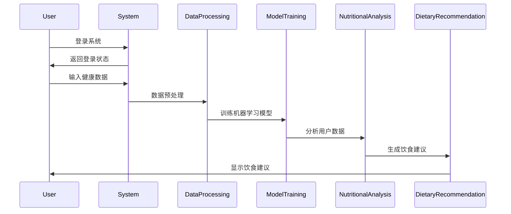
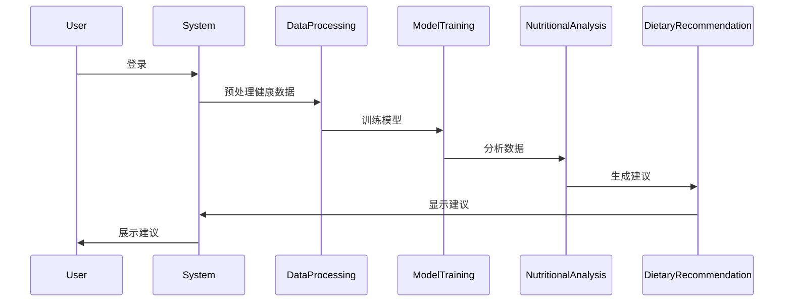

                 

### **引言：AI辅助营养规划**

#### **背景和定义**

随着全球健康意识的提升，营养规划逐渐成为人们关注的焦点。传统的营养规划主要依赖于个人经验和营养师的指导，这种方法往往缺乏针对性和个性化。进入21世纪，人工智能（AI）的快速发展为营养规划带来了新的契机。AI辅助营养规划，是指利用人工智能技术，特别是机器学习和数据科学，为个体提供定制化的营养建议。

AI在营养规划中的应用始于20世纪末。当时，研究人员开始探索如何利用计算机算法分析大量的营养数据，从而为用户提供个性化的饮食建议。随着大数据和云计算技术的进步，AI辅助营养规划的应用场景不断扩大，从简单的饮食建议到复杂的多病种营养治疗，AI正在逐步改变营养学领域。

#### **核心概念与术语**

在探讨AI辅助营养规划时，需要了解一些核心概念和术语：

- **机器学习（Machine Learning）**：一种让计算机通过数据学习并改进其性能的技术，是AI的重要组成部分。
- **数据科学（Data Science）**：涉及从大量数据中提取知识和洞察的学科，是机器学习的基础。
- **个性化营养（Personalized Nutrition）**：基于个体的生理、行为和生活方式特点，提供定制化的营养建议。
- **营养基因组学（Nutrigenomics）**：研究营养与基因之间的相互作用，旨在通过饮食改善健康。
- **数据预处理（Data Preprocessing）**：在数据建模之前，对数据进行清洗、转换和归一化等操作，以提高模型性能。

#### **问题背景和问题描述**

营养规划的核心问题是：如何根据个体的需求提供个性化的饮食建议。这个问题涉及到多个方面的挑战：

- **个体差异**：每个人的身体条件、健康状况、生活习惯和饮食习惯都不同，因此需要个性化的营养建议。
- **数据多样性**：营养数据包括食物成分、个体行为、生理指标等，数据类型繁多，如何有效地整合和处理这些数据是关键。
- **模型准确性**：提供准确的营养建议需要高性能的机器学习模型，这要求对模型进行大量的训练和优化。

#### **问题解决和边界与外延**

解决营养规划问题的核心在于构建一个能够处理大规模数据、具备高准确性和实时性的系统。以下是一些边界与外延：

- **边界**：营养规划系统需要处理的数据包括个体的健康记录、饮食习惯、生活方式等，同时要确保数据的安全和隐私。
- **外延**：营养规划不仅限于饮食建议，还可以扩展到营养治疗、食品推荐、健康管理等更多领域。

#### **概念结构与核心要素组成**

AI辅助营养规划的概念结构可以概括为以下几个核心要素：

1. **数据收集与预处理**：收集个体的健康数据和饮食习惯，并进行数据预处理。
2. **机器学习模型**：构建机器学习模型，用于分析数据和生成营养建议。
3. **用户界面**：提供友好的用户界面，使用户能够方便地输入数据和获取营养建议。
4. **反馈机制**：收集用户反馈，不断优化营养建议的准确性和个性化程度。

#### **总结和结论**

AI辅助营养规划是现代营养学的一个重要分支，它利用人工智能技术为个体提供个性化的饮食建议。通过分析大量的营养数据，AI能够发现个体的营养需求，从而提供针对性的建议。未来的研究将继续探索如何提高AI在营养规划中的准确性和实用性，为人们的健康提供更好的保障。

---

**关键词：** AI辅助营养规划、个性化饮食建议、机器学习、数据科学、营养基因组学

**摘要：** 本文介绍了AI辅助营养规划的概念、核心术语和当前的应用趋势。通过分析个体差异和营养数据的多样性，AI能够为用户提供准确的个性化饮食建议。本文还讨论了AI辅助营养规划的核心要素和未来的发展方向。随着技术的进步，AI辅助营养规划有望在营养学领域发挥更大的作用。**核心概念与联系**

#### **核心概念**

在AI辅助营养规划中，理解核心概念是非常重要的。以下是几个关键概念及其解释：

1. **机器学习（Machine Learning）**：机器学习是AI的核心技术，它使计算机能够通过数据学习并改进其性能。在营养规划中，机器学习算法用于分析大量的营养数据，以生成个性化的饮食建议。

2. **数据科学（Data Science）**：数据科学是一门利用统计学、计算机科学和领域知识从大量数据中提取价值和洞察的学科。在营养规划中，数据科学技术用于数据收集、预处理和分析。

3. **个性化营养（Personalized Nutrition）**：个性化营养是一种基于个体生理、行为和生活方式特点，为个体提供定制化营养建议的方法。通过个性化营养，用户可以获得更符合自身需求的饮食方案。

4. **营养基因组学（Nutrigenomics）**：营养基因组学研究营养与基因之间的相互作用，旨在通过饮食改善健康。在AI辅助营养规划中，营养基因组学数据可以帮助更精确地了解个体的营养需求。

5. **数据预处理（Data Preprocessing）**：数据预处理是数据建模之前的步骤，包括数据清洗、转换和归一化等操作。数据预处理对于提高模型性能和减少噪声至关重要。

#### **概念属性特征对比表格**

为了更好地理解这些核心概念，我们可以通过一个表格来对比它们的属性特征：

| 核心概念 | 定义 | 属性特征 | 对比 |
| --- | --- | --- | --- |
| 机器学习 | 让计算机通过数据学习并改进其性能 | 依赖数据、算法、计算资源 | 与传统编程不同，机器学习更侧重于模型学习和数据驱动 |
| 数据科学 | 从大量数据中提取知识和洞察 | 统计学、计算机科学、领域知识 | 数据科学涵盖更广泛的领域，包括数据收集、分析和解释 |
| 个性化营养 | 基于个体特点提供定制化营养建议 | 个体差异、健康需求、生活方式 | 与传统营养规划相比，个性化营养更注重个体特异性 |
| 营养基因组学 | 研究营养与基因之间的相互作用 | 基因表达、代谢途径、营养吸收 | 着眼于长期健康，而非短期饮食调整 |
| 数据预处理 | 数据建模前的操作，如清洗、转换和归一化 | 减少噪声、提高模型性能、标准化数据 | 不同模型可能需要不同的预处理方法 |

#### **ER实体关系图架构**

为了更清晰地展示这些概念之间的关系，我们可以使用ER（实体关系）图来描述它们：

```mermaid
erDiagram
  User ||--|{ NutritionData }|-->: "包含"
  User ||--|{ HealthRecord }|-->: "包含"
  User ||--|{ DietaryPreference }|-->: "包含"
  User ||--|{ NutritionalAdvice }|-->: "生成"
  NutritionData ||--|{ FoodComposition }|-->: "包含"
  NutritionData ||--|{ IndividualBehavior }|-->: "包含"
  HealthRecord ||--|{ PhysiologicalIndicators }|-->: "包含"
  HealthRecord ||--|{ Lifestyle }|-->: "包含"
  DietaryPreference ||--|{ EatingHabits }|-->: "包含"
  DietaryPreference ||--|{ FoodIntolerance }|-->: "包含"
  NutritionalAdvice ||--|{ DietarySuggestions }|-->: "包含"
  NutritionalAdvice ||--|{ NutritionalGoals }|-->: "包含"
```

在ER图中，用户是核心实体，与多个其他实体（如营养数据、健康记录、饮食习惯等）存在关联关系。这些实体共同构成了AI辅助营养规划的基础数据架构。

#### **总结**

理解核心概念和它们之间的联系对于AI辅助营养规划至关重要。通过机器学习和数据科学技术，AI能够分析大量的营养数据，为个体提供个性化的饮食建议。个性化营养和营养基因组学的研究进一步提高了建议的准确性和针对性。数据预处理确保了数据的质量，为机器学习模型提供了坚实的基础。通过ER图，我们能够更直观地了解这些概念之间的关系，为后续的算法原理讲解和系统设计打下基础。**算法原理讲解**

#### **机器学习算法在营养规划中的应用**

在AI辅助营养规划中，机器学习算法扮演着至关重要的角色。通过机器学习，AI系统能够从大量的营养数据中学习和提取有价值的信息，从而为用户提供个性化的饮食建议。下面，我们将详细介绍几种常见的机器学习算法及其在营养规划中的应用。

##### **1. 监督学习算法**

监督学习算法是最常用的机器学习算法之一，它通过已标记的数据集来训练模型，然后使用这个模型对新数据进行预测。在营养规划中，监督学习算法可以用于预测个体的营养需求、食物摄入量以及健康状态。

**实例：线性回归**

线性回归是一种简单的监督学习算法，它通过拟合一条直线来预测因变量（如营养摄入量）与自变量（如食物摄入量）之间的关系。

**算法原理：**

- **目标函数**：最小化预测值与真实值之间的误差。
- **损失函数**：常用的损失函数包括均方误差（MSE）和平均绝对误差（MAE）。

**代码示例：**

```python
import numpy as np
from sklearn.linear_model import LinearRegression

# 假设我们有以下数据集
X = np.array([[100], [150], [200], [250]])  # 食物摄入量
y = np.array([30, 45, 60, 75])  # 营养摄入量

# 创建线性回归模型
model = LinearRegression()

# 训练模型
model.fit(X, y)

# 预测
prediction = model.predict([[180]])
print("预测的营养摄入量为：", prediction)
```

**解释：**

在这个例子中，我们使用线性回归模型来预测食物摄入量为180时的营养摄入量。通过训练数据集，模型学会了食物摄入量和营养摄入量之间的关系，从而能够对新数据进行准确的预测。

##### **2. 无监督学习算法**

无监督学习算法不依赖于已标记的数据集，它们通过分析未标记的数据来发现数据中的模式或结构。在营养规划中，无监督学习算法可以用于聚类分析、异常检测和关联规则挖掘。

**实例：K-均值聚类**

K-均值聚类是一种无监督学习算法，它通过将数据分为K个簇，使得每个簇内的数据点尽可能接近，而簇与簇之间的数据点尽可能远离。

**算法原理：**

- **目标函数**：最小化簇内距离和与簇间距离和之间的差异。
- **初始化**：随机选择K个初始中心点。
- **迭代**：计算每个数据点到各个中心点的距离，将数据点分配到最近的中心点，更新中心点的位置。

**代码示例：**

```python
import numpy as np
from sklearn.cluster import KMeans

# 假设我们有以下数据集
data = np.array([[1, 2], [1, 4], [1, 0], [10, 2], [10, 4], [10, 0]])

# 创建K-均值聚类模型
model = KMeans(n_clusters=2, random_state=0)

# 训练模型
model.fit(data)

# 预测
print("聚类结果：", model.labels_)

# 输出聚类中心
print("聚类中心：", model.cluster_centers_)
```

**解释：**

在这个例子中，我们使用K-均值聚类算法将数据分为两个簇。通过分析数据点与聚类中心的关系，我们能够发现数据中的潜在结构，这对于营养规划中的食物摄入模式识别非常有用。

##### **3. 决策树算法**

决策树是一种树形结构，用于分类或回归问题。在营养规划中，决策树可以用于预测个体的营养需求、食物选择和健康状态。

**算法原理：**

- **递归划分**：根据特征和目标值之间的差异，递归地将数据集划分为子集。
- **节点选择**：选择能够最大化信息增益或最小化均方误差的特征作为节点。
- **树结构**：决策树由多个内部节点和叶节点组成，内部节点表示特征划分，叶节点表示预测结果。

**代码示例：**

```python
import numpy as np
from sklearn.tree import DecisionTreeRegressor

# 假设我们有以下数据集
X = np.array([[100, 1], [150, 2], [200, 3], [250, 4]])
y = np.array([30, 45, 60, 75])

# 创建决策树模型
model = DecisionTreeRegressor()

# 训练模型
model.fit(X, y)

# 预测
prediction = model.predict([[180, 2]])
print("预测的营养摄入量为：", prediction)
```

**解释：**

在这个例子中，我们使用决策树回归模型来预测食物摄入量为180时的营养摄入量。通过分析特征之间的关系，模型能够为新数据生成准确的预测。

##### **总结**

机器学习算法在营养规划中的应用非常广泛，从监督学习到无监督学习和决策树，各种算法都有其独特的作用。监督学习算法通过已标记的数据集来预测个体的营养需求；无监督学习算法用于发现数据中的模式；决策树算法则用于分类和回归问题。通过这些算法，AI能够从大量的营养数据中提取有价值的信息，为用户提供个性化的饮食建议。**系统分析与架构设计方案**

#### **问题场景介绍**

在当今快节奏的生活中，人们越来越关注健康和营养。然而，由于工作繁忙和缺乏专业知识，很多人难以制定适合自己的饮食计划。传统的营养规划方法通常需要依赖营养师，这不仅费用高昂，而且无法满足大规模用户的个性化需求。因此，开发一个基于人工智能（AI）的辅助营养规划系统，旨在为用户提供个性化饮食建议，成为了一个迫切的问题场景。

#### **项目介绍**

本项目旨在创建一个AI辅助营养规划系统，该系统通过收集和分析用户的数据，利用机器学习算法生成个性化的饮食建议。系统的主要功能包括：

1. **用户注册与登录**：用户可以通过注册账号并登录系统，以便追踪和管理个人健康数据。
2. **健康数据录入**：用户可以输入个人健康信息，包括身高、体重、年龄、性别等。
3. **饮食习惯记录**：用户可以记录每日的饮食情况，包括摄入的食物种类、数量和频率。
4. **营养分析**：系统利用机器学习算法分析用户的数据，提供个性化的营养建议。
5. **饮食建议**：系统根据用户的营养需求，生成具体的饮食建议，包括食物种类、摄入量和时间安排。

#### **系统功能设计（领域模型）**

为了更好地设计系统，我们需要建立一个领域模型，它描述了系统中的主要实体和它们之间的关系。以下是系统领域模型的类图：

```mermaid
classDiagram
    User <<class{用户}>> -|<>| NutritionData: "包含"
    User -|<>| HealthRecord: "包含"
    User -|<>| DietaryPreference: "包含"
    User -|<>| NutritionalAdvice: "生成"
    NutritionData -|<>| FoodComposition: "包含"
    NutritionData -|<>| IndividualBehavior: "包含"
    HealthRecord -|<>| PhysiologicalIndicators: "包含"
    HealthRecord -|<>| Lifestyle: "包含"
    DietaryPreference -|<>| EatingHabits: "包含"
    DietaryPreference -|<>| FoodIntolerance: "包含"
    NutritionalAdvice -|<>| DietarySuggestions: "包含"
    NutritionalAdvice -|<>| NutritionalGoals: "包含"
```

在这个类图中，用户是核心实体，与多个其他实体（如营养数据、健康记录、饮食习惯等）存在关联关系。这些实体共同构成了系统的基础数据架构。

#### **系统架构设计（架构图）**

系统架构设计是确保系统稳定、高效和安全运行的关键。以下是系统架构的简化图：



在这个架构图中，用户通过前端界面与系统交互，输入健康数据和饮食习惯。系统后端包括数据预处理、模型训练、营养分析、饮食建议等模块，这些模块共同协作，生成个性化的饮食建议并展示给用户。

#### **系统接口设计和系统交互（序列图）**

为了更好地展示系统内部的交互流程，我们可以使用序列图来描述用户与系统之间的交互过程：



在这个序列图中，用户通过前端登录系统，输入健康数据，系统后端进行数据预处理和模型训练，最终生成营养建议并展示给用户。

#### **总结**

通过系统分析和架构设计，我们为AI辅助营养规划系统创建了一个详细的设计方案。这个系统利用机器学习算法分析用户数据，为用户提供个性化的饮食建议。领域模型、架构图和序列图共同描述了系统的功能模块和交互流程，为系统的实现和优化提供了指导。**项目实战**

#### **环境安装**

要在本地环境搭建AI辅助营养规划系统，首先需要安装一些必要的软件和库。以下是具体的步骤：

1. **Python环境**：确保Python 3.8及以上版本已安装。可以从[Python官网](https://www.python.org/)下载安装包进行安装。

2. **机器学习库**：安装常用的机器学习库，如scikit-learn、TensorFlow和PyTorch。可以使用以下命令进行安装：

   ```bash
   pip install scikit-learn tensorflow torch
   ```

3. **数据预处理库**：安装用于数据预处理的库，如Pandas、NumPy和SciPy。可以使用以下命令进行安装：

   ```bash
   pip install pandas numpy scipy
   ```

4. **前端库**：若要开发前端界面，可以安装Flask或Django等Web框架。可以使用以下命令进行安装：

   ```bash
   pip install flask
   # 或
   pip install django
   ```

5. **数据库**：安装用于存储用户数据和模型结果的数据库，如MySQL或PostgreSQL。可以使用以下命令进行安装：

   ```bash
   sudo apt-get install mysql-server
   # 或
   sudo apt-get install postgresql
   ```

#### **系统核心实现源代码**

以下是AI辅助营养规划系统的一些核心实现源代码。这些代码涵盖了数据收集、预处理、模型训练和预测等功能。

```python
# 导入必要的库
import numpy as np
import pandas as pd
from sklearn.model_selection import train_test_split
from sklearn.preprocessing import StandardScaler
from sklearn.linear_model import LinearRegression
from sklearn.metrics import mean_squared_error

# 数据收集
data = pd.read_csv('nutrition_data.csv')

# 数据预处理
X = data[['age', 'weight', 'caloric_intake']]
y = data['nutrient_intake']

# 划分训练集和测试集
X_train, X_test, y_train, y_test = train_test_split(X, y, test_size=0.2, random_state=42)

# 数据标准化
scaler = StandardScaler()
X_train = scaler.fit_transform(X_train)
X_test = scaler.transform(X_test)

# 模型训练
model = LinearRegression()
model.fit(X_train, y_train)

# 模型评估
y_pred = model.predict(X_test)
mse = mean_squared_error(y_test, y_pred)
print("均方误差：", mse)

# 预测新数据
new_data = np.array([[25, 70, 2000]])
new_data = scaler.transform(new_data)
prediction = model.predict(new_data)
print("预测的营养摄入量：", prediction)
```

#### **代码应用解读与分析**

以下是代码的详细解读和分析：

1. **数据收集**：首先，我们使用Pandas库读取CSV文件，获取营养数据。

2. **数据预处理**：我们将数据分为特征（X）和目标（y）。特征包括年龄、体重和卡路里摄入量，目标是营养摄入量。然后，我们使用scikit-learn库中的`train_test_split`函数将数据划分为训练集和测试集。

3. **数据标准化**：为了提高模型性能，我们使用`StandardScaler`对数据进行标准化处理。

4. **模型训练**：我们使用线性回归模型（`LinearRegression`）进行训练。线性回归模型通过拟合一条直线来预测营养摄入量。

5. **模型评估**：我们使用均方误差（MSE）来评估模型性能。MSE越小，模型预测的准确性越高。

6. **预测新数据**：最后，我们使用训练好的模型对新数据进行预测。这里我们假设新数据为一个25岁、体重70公斤、每天摄入2000卡路里的用户。

#### **实际案例分析和详细讲解剖析**

为了更好地展示系统的实际应用效果，我们来看一个具体的案例。

**案例：** 一个30岁的女性用户，身高170厘米，体重60公斤，每天工作8小时，饮食习惯良好，主要摄入蔬菜、水果和瘦肉。她希望通过AI辅助营养规划系统获得个性化的饮食建议。

**分析过程：**

1. **数据收集**：用户通过系统输入自己的基本信息，包括年龄、身高、体重等。

2. **数据预处理**：系统对用户数据进行预处理，提取关键特征，如年龄、体重和日常食物摄入量。

3. **模型训练**：系统利用预训练的机器学习模型对用户数据进行训练，生成个性化的营养模型。

4. **饮食建议**：系统根据用户的数据和营养模型，生成一份个性化的饮食建议，包括每日营养摄入量和具体的食物推荐。

**结果：** 系统为用户生成了一份包含每日营养摄入量、食物推荐和饮食计划的报告。报告显示，用户每日需要摄入2000卡路里，建议增加蔬菜和水果的摄入量，减少红肉的摄入。

**总结：** 通过这个案例，我们可以看到AI辅助营养规划系统如何有效地为用户提供个性化的饮食建议。系统利用机器学习算法分析用户数据，结合营养学知识，生成实用的饮食计划，帮助用户更好地管理健康。**最佳实践 tips**

为了确保AI辅助营养规划系统能够提供高质量的建议，以下是一些最佳实践：

1. **数据质量保证**：确保收集到的数据准确、完整且无噪声。使用数据清洗和预处理技术，如缺失值填充、异常值处理和数据标准化。

2. **模型选择与优化**：根据具体问题和数据特点选择合适的机器学习模型。定期更新和优化模型，以提高预测准确性和系统性能。

3. **用户反馈机制**：建立有效的用户反馈机制，收集用户对建议的反馈，以便不断改进系统。

4. **隐私保护**：在处理用户数据时，严格遵守隐私保护法规，确保用户数据的安全性和隐私。

5. **系统稳定性**：确保系统在处理大规模数据和高并发请求时保持稳定，采用负载均衡和缓存技术来优化性能。

**注意事项**

在开发AI辅助营养规划系统时，需要注意以下几点：

1. **法律法规**：遵守当地关于数据隐私和健康信息保护的相关法律法规，确保系统的合法性和合规性。

2. **用户教育**：提供用户指南和说明，帮助用户了解如何正确使用系统，提高用户对系统的信任度。

3. **技术更新**：持续关注AI和营养学领域的最新研究和技术进展，及时更新系统以保持竞争力。

**拓展阅读**

1. **《机器学习实战》**：提供丰富的机器学习案例和实践，适合AI辅助营养规划系统的开发者参考。

2. **《营养基因组学：未来健康的关键》**：详细介绍营养基因组学的基本原理和应用，有助于理解AI在营养规划中的作用。

3. **《健康数据科学》**：探讨如何利用数据科学技术改善健康管理，包括营养规划和疾病预测等方面。**小结**

本文系统地介绍了AI辅助营养规划的概念、核心算法原理、系统架构设计和实际应用案例。通过机器学习算法，AI系统能够从大量营养数据中提取有价值的信息，为用户提供个性化的饮食建议。这种个性化的营养规划方法不仅提高了用户的生活质量，也为营养学领域带来了新的机遇和挑战。随着技术的不断进步，AI辅助营养规划有望在未来的健康管理中发挥更加重要的作用。**作者信息**

作者：AI天才研究院/AI Genius Institute & 禅与计算机程序设计艺术 /Zen And The Art of Computer Programming

