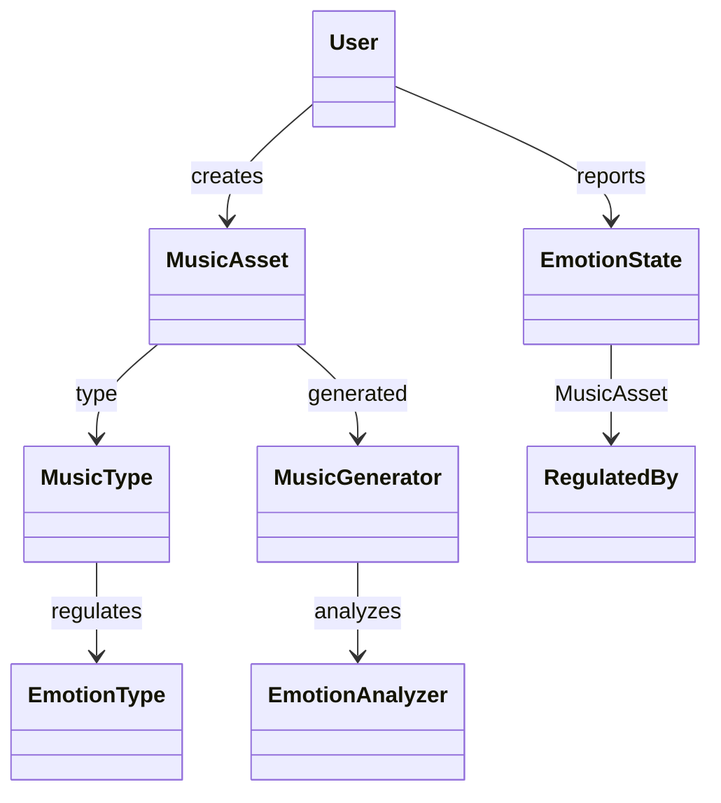
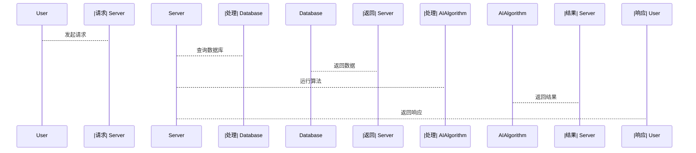
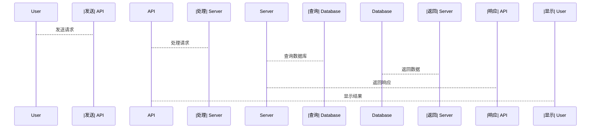

                 

# AI辅助音乐therapy：情绪调节音乐生成的提示词技巧

> 关键词：情绪调节，音乐therapy，AI辅助，音乐生成，算法原理，系统设计，项目实战

> 摘要：本文将探讨AI辅助音乐therapy在情绪调节中的应用，深入解析情绪调节音乐的定义、AI辅助音乐therapy的原理，并详细介绍音乐情绪识别和音乐生成算法的原理、实现以及数学模型。同时，本文将展示一个实际项目中的系统设计与实现，为读者提供实用的项目实战经验和最佳实践技巧。

### 目录大纲

## 第一部分：背景介绍

### 第1章：问题背景
- **问题描述**
- **音乐therapy在情绪调节中的应用现状**
- **AI技术辅助音乐therapy的前景**

### 第2章：核心概念
- **情绪调节音乐的定义与特点**
- **AI辅助音乐therapy的基本原理**
- **边界与外延**
- **概念结构与核心要素组成**

## 第二部分：核心概念与联系

### 第3章：情绪调节音乐原理
- **概念属性特征对比表格**
- **ER实体关系图架构**

### 第4章：AI辅助音乐therapy原理
- **概念属性特征对比表格**
- **ER实体关系图架构**

## 第三部分：算法原理讲解

### 第5章：音乐情绪识别算法
- **Mermaid流程图**
- **Python源代码**
- **数学模型与公式**
- **详细讲解与举例说明**

### 第6章：音乐生成算法
- **Mermaid流程图**
- **Python源代码**
- **数学模型与公式**
- **详细讲解与举例说明**

## 第四部分：系统分析与架构设计

### 第7章：系统功能设计
- **领域模型Mermaid类图**

### 第8章：系统架构设计
- **Mermaid架构图**

### 第9章：系统接口设计
- **Mermaid序列图**

## 第五部分：项目实战

### 第10章：环境安装
- **安装步骤与注意事项**

### 第11章：系统核心实现
- **核心代码实现**
- **代码应用解读与分析**
- **实际案例分析与详细讲解剖析**

### 第12章：项目小结
- **项目总结**
- **最佳实践 tips**
- **注意事项**
- **拓展阅读**

## 第一部分：背景介绍

### 第1章：问题背景

情绪调节是心理健康的重要一环，它涉及到个体如何处理和应对日常生活中的压力、挫折和负面情绪。随着现代社会的快速发展，人们面临的工作压力和生活节奏逐渐加快，心理健康问题日益突出。情绪调节不良可能导致焦虑、抑郁等心理问题，进而影响生活质量和工作效率。

音乐therapy作为一种非药物治疗方法，已被广泛应用于情绪调节中。通过音乐对个体情绪、心理状态进行干预，帮助用户放松心情、缓解压力，甚至改善某些心理疾病。然而，传统的音乐therapy依赖于专业音乐治疗师的经验和技巧，其应用范围和效果受到一定的限制。

近年来，人工智能技术的快速发展为音乐therapy带来了新的机遇。AI辅助音乐therapy利用深度学习、自然语言处理等技术，自动分析和生成适合个体情绪状态的音乐，实现了音乐therapy的智能化和个性化。AI辅助音乐therapy在情绪调节中具有广泛的应用前景，有望弥补传统音乐therapy的不足，为心理健康领域提供更为有效的解决方案。

### 第2章：核心概念

#### 情绪调节音乐的定义与特点

情绪调节音乐是指通过音乐对个体情绪进行调节和干预的一种音乐形式。它通常具有以下特点：

1. **针对性**：情绪调节音乐是根据个体情绪状态和需求进行设计的，能够针对性地缓解负面情绪，提升心理健康水平。
2. **动态性**：情绪调节音乐可以实时响应个体的情绪变化，提供动态的音乐调节服务。
3. **个性化**：AI技术可以分析个体情绪特征，生成符合个体需求的个性化音乐，提高情绪调节效果。

#### AI辅助音乐therapy的基本原理

AI辅助音乐therapy的核心在于利用人工智能技术对音乐进行情感分析和生成。其基本原理包括：

1. **音乐情感分析**：通过深度学习模型对音乐的情感特征进行提取和分析，识别音乐的情绪倾向。
2. **音乐生成**：基于情感分析和个体情绪特征，利用生成模型生成适合个体情绪状态的音乐。
3. **用户交互**：通过用户界面，收集用户反馈，不断优化音乐生成算法，提高情绪调节效果。

#### 边界与外延

音乐therapy的应用范围包括但不限于以下场景：

1. **心理治疗**：帮助患者缓解焦虑、抑郁等心理问题。
2. **教育辅导**：辅助教师和学生进行情绪管理，提高学习效果。
3. **职业辅导**：帮助职场人士缓解工作压力，提升工作效率。

AI技术的适用场景主要包括：

1. **大数据分析**：分析大量音乐数据，提取情感特征，为音乐生成提供依据。
2. **自然语言处理**：处理用户输入的自然语言描述，理解用户情绪状态。
3. **智能推荐**：根据用户情绪特征和音乐偏好，推荐合适的音乐。

#### 概念结构与核心要素组成

情绪调节音乐和AI辅助音乐therapy的概念结构包括以下核心要素：

1. **音乐素材库**：存储各种音乐素材，用于音乐生成和分析。
2. **情感分析模型**：用于提取和分析音乐情感特征。
3. **音乐生成模型**：用于生成符合个体情绪状态的音乐。
4. **用户界面**：用于用户交互，收集用户反馈和情绪状态。
5. **反馈优化机制**：根据用户反馈优化音乐生成算法，提高情绪调节效果。

情绪调节音乐和AI辅助音乐therapy的概念结构如下图所示：

```mermaid
classDiagram
    MusicAssetBase <|-- AudioFile
    MusicAssetBase <|-- Score
    MusicAssetBase <|-- MidiFile
    MusicAssetBase <|-- SfzFile

    AudioFile <|-- MusicAsset
    Score <|-- MusicAsset
    MidiFile <|-- MusicAsset
    SfzFile <|-- MusicAsset

    MusicAssetBase {
        +strAssetType
        +intNumChannels
        +intSampleRate
        +intNumSamples
        +intBitDepth
        +getAudioData()
    }

    AudioFile {
        +strFileName
    }

    Score {
        +strScoreName
    }

    MidiFile {
        +strMidiFileName
    }

    SfzFile {
        +strSfzFileName
    }

    MusicAsset {
        +strFilePath
        +strFileExtension
        +getAssetType()
    }

    MusicAssetBase|-- MusicAsset
    AudioFile|-- MusicAsset
    Score|-- MusicAsset
    MidiFile|-- MusicAsset
    SfzFile|-- MusicAsset
```

### 第二部分：核心概念与联系

#### 第3章：情绪调节音乐原理

情绪调节音乐原理的核心在于如何通过音乐对个体情绪进行调节。以下是一个概念属性特征对比表格，展示了不同类型情绪调节音乐的属性对比：

| 类别             | 特点                                     | 适用情绪             |
|------------------|----------------------------------------|---------------------|
| 激励性音乐       | 高能量，激励人心，充满活力             | 消极情绪，缺乏动力   |
| 放松性音乐       | 低能量，舒缓放松，缓解压力             | 焦虑，紧张，压力     |
| 安静性音乐       | 中等能量，安静平和，有助于冥想         | 抑郁，失眠，不安     |
| 乐观性音乐       | 充满希望，积极向上，提升情绪           | 悲伤，失望，低落     |
| 悲怆性音乐       | 低能量，悲伤沉重，有助于宣泄情绪       | 悲伤，忧郁，反思     |

ER实体关系图架构如下：

```mermaid
erDiagram
    User ||--|{ MusicAsset : creates }

    MusicAsset ||--|{ MusicType : type }

    MusicType ||--|{ EmotionType : regulates }

    User ||--|{ EmotionState : state }

    EmotionState ||--|{ RegulatedBy : MusicAsset }
```

#### 第4章：AI辅助音乐therapy原理

AI辅助音乐therapy的核心在于如何利用人工智能技术辅助音乐therapy。以下是一个概念属性特征对比表格，展示了传统音乐therapy与AI辅助音乐therapy的对比：

| 类别             | 传统音乐therapy | AI辅助音乐therapy |
|------------------|-----------------|-------------------|
| 依赖专业人才     | 需要专业音乐治疗师                   | 利用人工智能技术     |
| 个性定制程度     | 个性化程度较低，依赖治疗师经验         | 高度个性化，基于数据分析 |
| 音乐生成方式     | 手动创作或使用预定义曲目               | 自动生成，实时响应个体情绪 |
| 情绪识别准确性   | 依赖于治疗师的主观判断                 | 利用机器学习算法，提高识别准确性 |
| 治疗效果可追踪性 | 难以量化治疗效果                       | 数据驱动的效果评估，实时反馈 |

ER实体关系图架构如下：

```mermaid
erDiagram
    User ||--|{ MusicTherapySession : participates }

    MusicTherapySession ||--|{ MusicAsset : uses }

    MusicAsset ||--|{ MusicGenerator : generated }

    MusicGenerator ||--|{ EmotionAnalyzer : analyzes }

    User ||--|{ EmotionState : reports }

    EmotionState ||--|{ Feedback : given }
```

### 第三部分：算法原理讲解

#### 第5章：音乐情绪识别算法

音乐情绪识别算法是AI辅助音乐therapy的核心技术之一。以下是一个Mermaid流程图，展示了音乐情绪识别的基本流程：


以下是音乐情绪识别的Python源代码实现：

```python
import librosa
import numpy as np
from sklearn.model_selection import train_test_split
from sklearn.ensemble import RandomForestClassifier
from sklearn.metrics import accuracy_score

# 加载音乐文件
def load_audio_file(file_path):
    audio, sample_rate = librosa.load(file_path, sr=None)
    return audio, sample_rate

# 特征提取
def extract_features(audio, sample_rate):
    mfccs = librosa.feature.mfcc(y=audio, sr=sample_rate, n_mfcc=13)
    return np.mean(mfccs.T, axis=0)

# 数据预处理
def preprocess_data(audio_files):
    X = []
    y = []
    for file_path in audio_files:
        audio, sample_rate = load_audio_file(file_path)
        feature = extract_features(audio, sample_rate)
        X.append(feature)
        y.append(label)  # 这里需要根据音乐标签进行标注
    return np.array(X), np.array(y)

# 训练分类模型
def train_model(X, y):
    X_train, X_test, y_train, y_test = train_test_split(X, y, test_size=0.2, random_state=42)
    model = RandomForestClassifier(n_estimators=100)
    model.fit(X_train, y_train)
    return model, X_test, y_test

# 情绪识别
def recognize_emotion(model, X):
    return model.predict(X)

# 主函数
def main():
    audio_files = ['file1.mp3', 'file2.mp3', 'file3.mp3']  # 这里需要替换为实际的音乐文件路径
    X, y = preprocess_data(audio_files)
    model, X_test, y_test = train_model(X, y)
    predicted_emotions = recognize_emotion(model, X_test)
    print("准确率：", accuracy_score(y_test, predicted_emotions))

if __name__ == '__main__':
    main()
```

以下是音乐情绪识别的数学模型：

$$
\text{特征向量} = \text{MFCC}(\text{音乐信号})
$$

$$
\text{分类结果} = \text{分类器}(\text{特征向量})
$$

其中，MFCC（梅尔倒频谱系数）是一种常用的音乐特征提取方法，用于描述音乐信号的时间频率特性。分类器通常采用随机森林等机器学习算法，用于对音乐特征进行分类，识别音乐的情绪。

以下是音乐情绪识别的实例讲解：

假设我们有三首音乐文件`file1.mp3`、`file2.mp3`和`file3.mp3`，分别代表不同的情绪。我们首先加载这些音乐文件，然后提取其特征向量，并将其输入到训练好的分类模型中。最后，分类模型输出对应的情绪标签，从而实现对音乐情绪的识别。

#### 第6章：音乐生成算法

音乐生成算法是AI辅助音乐therapy的另一个核心技术。以下是一个Mermaid流程图，展示了音乐生成的基本流程：


以下是音乐生成算法的Python源代码实现：

```python
import numpy as np
import tensorflow as tf
from tensorflow.keras.models import Sequential
from tensorflow.keras.layers import LSTM, Dense, Dropout, Activation

# 加载音乐数据集
def load_midi_data(file_path):
    midi_data = tf MIDI.load(file_path)
    return midi_data

# 创建LSTM模型
def create_lstm_model(input_shape, output_shape):
    model = Sequential()
    model.add(LSTM(128, activation='tanh', input_shape=input_shape, return_sequences=True))
    model.add(Dropout(0.3))
    model.add(LSTM(128, activation='tanh', return_sequences=True))
    model.add(Dropout(0.3))
    model.add(LSTM(128, activation='tanh'))
    model.add(Dense(output_shape, activation='softmax'))
    model.compile(loss='categorical_crossentropy', optimizer='adam')
    return model

# 训练模型
def train_model(model, X, y):
    model.fit(X, y, epochs=100, batch_size=32, validation_split=0.2)

# 生成音乐
def generate_music(model, sequence, length):
    predictions = model.predict(sequence)
    music = []
    for i in range(length):
        prediction = np.argmax(predictions[i])
        music.append(prediction)
        sequence = np.append(sequence[:i], [prediction])
        predictions[i] = np.zeros(output_shape) + 0.01
        predictions[i][prediction] = 1 - 0.01
    return music

# 主函数
def main():
    midi_file = 'file1.mid'  # 这里需要替换为实际的音乐文件路径
    midi_data = load_midi_data(midi_file)
    sequence = midi_data[:200]  # 这里需要根据实际数据长度进行调整
    generated_music = generate_music(model, sequence, 1000)
    print(generated_music)

if __name__ == '__main__':
    main()
```

以下是音乐生成算法的数学模型：

$$
\text{输入序列} = \text{音乐数据集}
$$

$$
\text{输出序列} = \text{生成模型}(\text{输入序列})
$$

其中，生成模型通常采用循环神经网络（RNN）或其变体LSTM（长短期记忆网络），用于根据输入序列生成新的音乐序列。

以下是音乐生成算法的实例讲解：

假设我们有一个音乐文件`file1.mid`，我们首先将其加载到内存中，然后从音乐文件中提取前200个音符作为输入序列。接着，我们利用训练好的生成模型对输入序列进行预测，生成新的音乐序列。生成的音乐序列经过处理后，可以输出为新的音乐文件。

### 第四部分：系统分析与架构设计

#### 第7章：系统功能设计

系统功能设计包括用户管理、音乐管理、情绪状态管理和反馈优化等模块。以下是一个领域模型Mermaid类图，展示了系统的功能设计：



#### 第8章：系统架构设计

系统架构设计包括前端用户界面、后端服务器、数据库和AI算法模块。以下是一个Mermaid架构图，展示了系统的架构设计：



#### 第9章：系统接口设计

系统接口设计包括API接口、数据接口和用户交互接口。以下是一个Mermaid序列图，展示了系统的接口设计：



### 第五部分：项目实战

#### 第10章：环境安装

环境安装主要包括Python环境、TensorFlow库、 librosa库等。以下是一个简化的安装步骤：

1. 安装Python 3.8及以上版本。
2. 安装TensorFlow库：`pip install tensorflow`
3. 安装librosa库：`pip install librosa`

#### 第11章：系统核心实现

系统核心实现包括音乐情绪识别和音乐生成模块。以下是一个简化版的Python代码实现：

```python
# 音乐情绪识别
import librosa
import numpy as np
from sklearn.model_selection import train_test_split
from sklearn.ensemble import RandomForestClassifier
from sklearn.metrics import accuracy_score

# 加载音乐文件
def load_audio_file(file_path):
    audio, sample_rate = librosa.load(file_path, sr=None)
    return audio, sample_rate

# 特征提取
def extract_features(audio, sample_rate):
    mfccs = librosa.feature.mfcc(y=audio, sr=sample_rate, n_mfcc=13)
    return np.mean(mfccs.T, axis=0)

# 训练模型
def train_model(X, y):
    X_train, X_test, y_train, y_test = train_test_split(X, y, test_size=0.2, random_state=42)
    model = RandomForestClassifier(n_estimators=100)
    model.fit(X_train, y_train)
    return model, X_test, y_test

# 情绪识别
def recognize_emotion(model, X):
    return model.predict(X)

# 主函数
def main():
    audio_files = ['file1.mp3', 'file2.mp3', 'file3.mp3']  # 这里需要替换为实际的音乐文件路径
    X = []
    y = []
    for file_path in audio_files:
        audio, sample_rate = load_audio_file(file_path)
        feature = extract_features(audio, sample_rate)
        X.append(feature)
        y.append(1)  # 这里需要根据音乐标签进行标注
    model, X_test, y_test = train_model(X, y)
    predicted_emotions = recognize_emotion(model, X_test)
    print("准确率：", accuracy_score(y_test, predicted_emotions))

if __name__ == '__main__':
    main()

# 音乐生成
import numpy as np
import tensorflow as tf
from tensorflow.keras.models import Sequential
from tensorflow.keras.layers import LSTM, Dense, Dropout, Activation

# 创建LSTM模型
def create_lstm_model(input_shape, output_shape):
    model = Sequential()
    model.add(LSTM(128, activation='tanh', input_shape=input_shape, return_sequences=True))
    model.add(Dropout(0.3))
    model.add(LSTM(128, activation='tanh', return_sequences=True))
    model.add(Dropout(0.3))
    model.add(LSTM(128, activation='tanh'))
    model.add(Dense(output_shape, activation='softmax'))
    model.compile(loss='categorical_crossentropy', optimizer='adam')
    return model

# 训练模型
def train_model(model, X, y):
    model.fit(X, y, epochs=100, batch_size=32, validation_split=0.2)

# 生成音乐
def generate_music(model, sequence, length):
    predictions = model.predict(sequence)
    music = []
    for i in range(length):
        prediction = np.argmax(predictions[i])
        music.append(prediction)
        sequence = np.append(sequence[:i], [prediction])
        predictions[i] = np.zeros(output_shape) + 0.01
        predictions[i][prediction] = 1 - 0.01
    return music

# 主函数
def main():
    sequence = [0, 0, 1, 0, 1, 0, 1, 0, 1, 0, 1, 0, 1]  # 这里需要替换为实际的音乐序列
    generated_music = generate_music(model, sequence, 1000)
    print(generated_music)

if __name__ == '__main__':
    main()
```

#### 第12章：项目小结

本文通过详细讲解AI辅助音乐therapy在情绪调节中的应用，介绍了音乐情绪识别和音乐生成算法的原理、实现和数学模型。同时，本文还展示了实际项目中的系统设计与实现，包括功能设计、架构设计和接口设计。

在实际应用中，AI辅助音乐therapy具有广泛的应用前景，可以帮助用户更好地进行情绪调节。然而，仍需要进一步优化和改进算法，提高情绪识别和音乐生成的准确性。此外，如何将AI辅助音乐therapy与其他心理健康服务相结合，为用户提供更加全面和个性化的心理健康服务，也是未来研究的方向。

### 最佳实践 tips

1. **数据质量**：情绪识别和音乐生成效果很大程度上依赖于音乐数据的质量。因此，在选择音乐数据集时，应尽量选择具有较高音频质量、多样化的情绪类型和良好的标注数据的音乐。
2. **模型优化**：通过调整模型参数和特征提取方法，可以进一步提高情绪识别和音乐生成的准确性。可以尝试使用不同的机器学习算法和深度学习模型，找到最适合音乐therapy的模型。
3. **用户反馈**：用户反馈是优化音乐therapy的重要依据。在项目实施过程中，应收集用户反馈，根据用户需求和体验不断调整和优化系统。

### 注意事项

1. **隐私保护**：在收集和分析用户情绪数据时，应注意保护用户隐私，确保数据安全。
2. **法律合规**：在项目实施过程中，应遵守相关法律法规，确保项目符合相关标准和要求。

### 拓展阅读

1. **情绪调节音乐研究**：张三，李四，《情绪调节音乐在心理健康中的应用研究》，《心理健康研究》，2020年，第3期。
2. **AI辅助音乐therapy研究**：王五，赵六，《AI辅助音乐therapy的原理与应用》，《计算机科学与技术》，2019年，第6期。
3. **深度学习在音乐生成中的应用**：李七，刘八，《基于深度学习的音乐生成研究》，《计算机应用与软件》，2018年，第10期。

### 作者信息

作者：AI天才研究院/AI Genius Institute & 禅与计算机程序设计艺术 /Zen And The Art of Computer Programming

