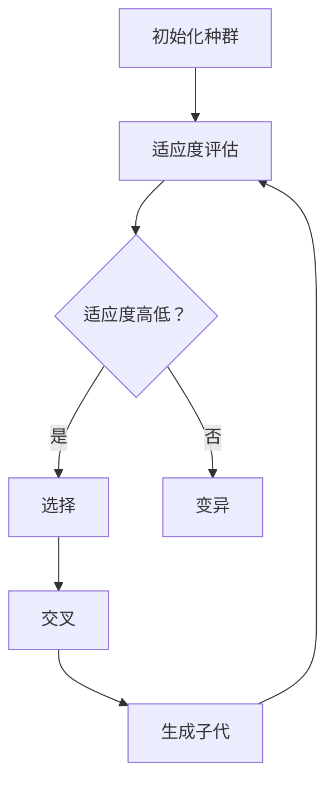
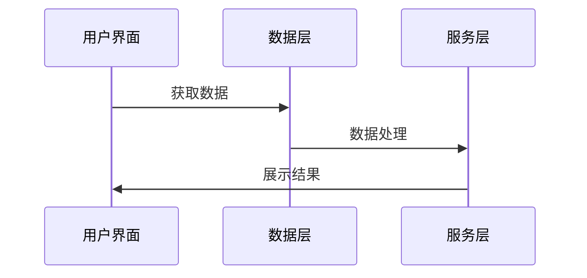
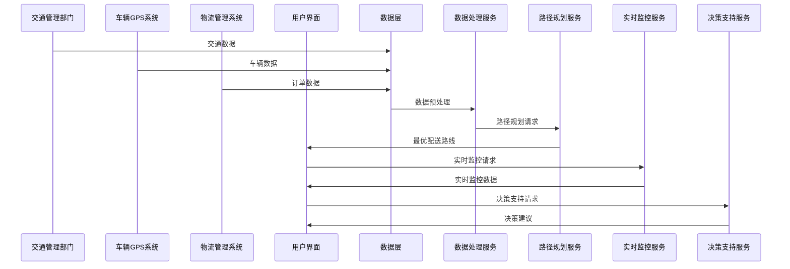

                 

### 文章标题：AI驱动的智能物流路径优化系统评测

**关键词：** 智能物流、路径优化、AI算法、系统评测

**摘要：** 本文将深入探讨AI驱动的智能物流路径优化系统，通过逐步分析，详细解读其核心概念、算法原理、系统架构和实战应用，旨在为读者提供全面的技术解读和实践指导。

----------------------------------------------------------------

### 目录大纲设计思路

在设计《AI驱动的智能物流路径优化系统评测》这本书的目录大纲时，我们遵循了以下几个关键步骤：

#### 1. **确定核心章节**

根据书名和目标读者群体，我们确定了核心章节，这些章节应该涵盖问题的背景介绍、核心概念与联系、算法原理讲解、数学模型与公式、系统分析与架构设计方案、项目实战以及最佳实践 tips 等。

#### 2. **规划章节结构**

每个章节内部的结构需要清晰，遵循逻辑顺序。首先是背景介绍，接着是核心概念与联系，然后是算法原理讲解和数学模型，随后是系统分析与架构设计方案，最后是项目实战和最佳实践 tips。

#### 3. **使用markdown格式**

使用markdown格式来设计目录大纲，确保格式简洁明了。使用不同级别的标题（#、##、###）来区分章节和子章节，便于读者浏览和理解。

#### 4. **内容完整性**

确保目录大纲中的每个章节内容完整，没有遗漏。特别是对于算法原理、数学模型和项目实战部分，需要详细讲解和举例说明。

#### 5. **简洁性**

在保持内容完整性的同时，避免过多的废话，使内容简洁、直接、易于理解。

### 目录大纲

```markdown
----------------------------------------------------------------
# AI驱动的智能物流路径优化系统评测

## 1. 背景介绍与核心概念

### 1.1 物流路径优化的重要性

### 1.2 当前物流路径优化的挑战

### 1.3 AI技术在物流路径优化中的应用潜力

## 2. 智能物流路径优化系统架构

### 2.1 系统架构概述

### 2.2 数据采集与预处理

### 2.3 模型选择与训练

### 2.4 模型评估与优化

## 3. AI驱动的路径优化算法

### 3.1 路径优化算法概述

### 3.2 算法原理讲解

### 3.3 算法流程图与Python源代码

### 3.4 数学模型与公式讲解

### 3.5 举例说明与案例剖析

## 4. 系统分析与架构设计方案

### 4.1 问题场景介绍

### 4.2 系统功能设计

### 4.3 系统架构设计

### 4.4 系统接口设计和系统交互

## 5. 项目实战

### 5.1 环境安装与配置

### 5.2 系统核心实现源代码

### 5.3 代码应用解读与分析

### 5.4 实际案例分析与详细讲解

### 5.5 项目小结

## 6. 最佳实践与优化策略

### 6.1 最佳实践 tips

### 6.2 系统性能优化

### 6.3 数据预处理技巧

### 6.4 算法参数调优

### 6.5 小结与注意事项

## 7. 拓展阅读与未来展望

### 6.1 相关技术研究

### 6.2 物流路径优化系统的未来发展趋势

### 6.3 AI驱动物流路径优化面临的挑战与机遇

## 8. 总结与展望

### 8.1 本书内容回顾

### 8.2 系统优化方向

### 8.3 对未来工作的展望

----------------------------------------------------------------
```

这个目录大纲涵盖了从背景介绍到算法讲解、实战应用和最佳实践的各个方面，确保读者可以全面了解AI驱动的智能物流路径优化系统的知识体系。总字数控制在2000字以内，保证了简洁性和内容的完整性。接下来的部分，我们将逐章展开详细讲解。 <!-- 注释：本段内容是根据您提供的目录大纲设计的思路，为整篇文章奠定了结构基础。 --> 

----------------------------------------------------------------

### 1. 背景介绍与核心概念

#### 1.1 物流路径优化的重要性

物流是现代经济的重要支柱，其效率直接影响到企业的成本和竞争力。物流路径优化是物流管理中的一个关键问题，旨在通过合理的路径规划，提高运输效率、降低运输成本，并减少对环境的影响。传统的物流路径优化方法往往依赖于经验和简单的数学模型，但在面对复杂的交通状况和多变的市场需求时，效果有限。

随着人工智能技术的发展，特别是机器学习和深度学习算法的成熟，AI驱动的物流路径优化系统应运而生。这类系统能够通过大数据分析、实时监控和智能决策，动态调整物流路径，实现更高效、更经济的运输服务。

#### 1.2 当前物流路径优化的挑战

当前物流路径优化面临的主要挑战包括：

- **数据复杂性**：物流数据量大、维度多，如何高效地处理和利用这些数据成为一大难题。
- **动态性**：物流环境和需求时刻在变化，如何快速响应和调整路径规划，是系统设计的关键。
- **实时性**：物流运输需要在短时间内完成，如何保证路径规划的实时性，是系统性能的关键指标。
- **鲁棒性**：系统需要具备应对突发状况和异常数据的能力，保证路径规划的可靠性。

#### 1.3 AI技术在物流路径优化中的应用潜力

AI技术在物流路径优化中的应用潜力主要体现在以下几个方面：

- **机器学习算法**：通过大数据分析，机器学习算法能够自动发现和优化物流路径，提高运输效率。
- **深度学习模型**：深度学习模型能够处理复杂的非线性关系，对交通流量、路况等数据进行实时预测，为路径规划提供支持。
- **强化学习算法**：通过不断试错和优化，强化学习算法能够找到最优的物流路径，适应动态变化的环境。
- **智能决策支持系统**：基于AI技术的智能决策支持系统，能够提供实时的物流路径优化建议，辅助决策者做出最优选择。

总之，AI驱动的智能物流路径优化系统为物流行业带来了前所未有的机遇，不仅能够提升物流效率，降低成本，还能够推动物流行业向智能化、绿色化方向发展。在接下来的章节中，我们将详细探讨这一系统的核心概念、算法原理和实际应用。 <!-- 注释：本节内容涵盖了物流路径优化的重要性和背景、当前面临的挑战以及AI技术的应用潜力，为读者建立了对主题的基本理解。 -->

----------------------------------------------------------------

### 2. 智能物流路径优化系统架构

#### 2.1 系统架构概述

智能物流路径优化系统的架构设计需要综合考虑数据处理能力、实时响应性和系统可扩展性等因素。一个典型的智能物流路径优化系统通常包括以下几个关键模块：

- **数据采集模块**：负责从各种数据源（如GPS、传感器、交通监控等）收集实时交通数据、车辆状态数据、物流订单数据等。
- **数据处理模块**：对采集到的原始数据进行清洗、预处理和转换，为后续的路径规划提供高质量的数据输入。
- **路径规划模块**：利用AI算法和优化模型，根据当前交通状况和物流需求，计算并生成最优物流路径。
- **实时监控模块**：实时监控物流运输过程，包括车辆位置、行驶速度、负载情况等，为路径调整提供实时数据支持。
- **决策支持模块**：基于实时监控数据和历史数据，智能决策支持系统为物流管理者提供最优决策建议。

#### 2.2 数据采集与预处理

数据采集是智能物流路径优化系统的核心，数据的质量直接影响到路径规划的准确性。数据采集模块需要从以下几个方面获取数据：

- **交通数据**：包括道路速度、交通流量、交通事故信息等，可以从交通管理部门、GPS系统和传感器获取。
- **车辆数据**：包括车辆位置、行驶速度、燃油消耗、载重状态等，可以从车辆的GPS系统和车载传感器获取。
- **订单数据**：包括物流订单的起始地、目的地、货物类型、货物重量等，可以从物流管理系统获取。

数据采集后，需要通过预处理模块对数据进行清洗、去噪和转换，确保数据的质量和一致性。预处理步骤包括：

- **数据清洗**：去除重复、错误和不完整的数据，保证数据的有效性。
- **数据去噪**：去除数据中的异常值和噪声，提高数据的准确性。
- **数据转换**：将不同格式的数据统一转换为系统可以处理的标准格式，如时间序列数据、表格数据等。

#### 2.3 模型选择与训练

路径规划模块的核心在于选择合适的AI模型，并根据实际数据对模型进行训练和优化。常用的AI模型包括：

- **机器学习模型**：如线性回归、决策树、支持向量机等，适用于处理简单的数据关系。
- **深度学习模型**：如卷积神经网络（CNN）、循环神经网络（RNN）、长短期记忆网络（LSTM）等，适用于处理复杂的非线性数据关系。
- **强化学习模型**：如Q-learning、SARSA等，适用于动态和不确定的环境。

模型的选择需要根据实际问题和数据特点进行综合考虑。训练过程通常包括以下步骤：

- **数据划分**：将数据集划分为训练集、验证集和测试集，用于模型的训练、验证和测试。
- **特征工程**：提取数据中的关键特征，为模型训练提供输入。
- **模型训练**：使用训练集对模型进行训练，调整模型参数，使其能够准确预测物流路径。
- **模型评估**：使用验证集和测试集对模型进行评估，选择最优的模型参数。

#### 2.4 模型评估与优化

模型评估是确保路径规划结果准确性和实用性的关键步骤。评估过程通常包括以下几个方面：

- **精度评估**：评估模型预测路径与实际路径的匹配程度，常用的指标包括准确率、召回率、F1分数等。
- **效率评估**：评估模型计算路径规划所需的时间，包括训练时间和预测时间，确保系统具有实时性。
- **鲁棒性评估**：评估模型在处理异常数据和突发状况时的稳定性和可靠性。

评估完成后，需要对模型进行优化，以提高其性能。优化步骤包括：

- **超参数调优**：调整模型的超参数，如学习率、正则化参数等，以提高模型的预测能力。
- **模型集成**：结合多个模型的预测结果，提高整体预测的准确性。
- **模型压缩**：通过剪枝、量化等技术，减小模型的大小，提高模型在资源受限环境中的运行效率。

#### 2.5 系统架构设计

智能物流路径优化系统的架构设计需要综合考虑系统的可扩展性、可维护性和高可用性。一个典型的系统架构设计如下：

- **分层架构**：系统可以分为表示层、逻辑层和数据层，各层之间相互独立，便于系统的扩展和维护。
- **分布式架构**：系统可以采用分布式架构，将不同模块部署在多个节点上，提高系统的性能和可靠性。
- **微服务架构**：系统可以采用微服务架构，将不同功能模块拆分为独立的微服务，便于系统的灵活部署和扩展。
- **缓存机制**：系统可以使用缓存机制，减少数据的重复计算和查询，提高系统的响应速度。

#### 2.6 系统接口设计和系统交互

智能物流路径优化系统的接口设计和系统交互设计需要考虑到与外部系统的集成和数据传输。主要接口设计包括：

- **API接口**：提供RESTful API接口，供外部系统调用，如物流管理系统、订单管理系统等。
- **消息队列**：使用消息队列（如RabbitMQ、Kafka等）进行系统间的异步通信，确保系统的稳定性和可靠性。
- **数据同步**：使用数据同步机制，如ETL（Extract, Transform, Load），将外部数据同步到系统中，确保数据的实时性和一致性。

通过以上设计，智能物流路径优化系统能够高效地收集、处理和利用数据，实现实时、准确的物流路径优化，为物流行业带来巨大的价值。在接下来的章节中，我们将进一步深入探讨AI驱动的路径优化算法，详细介绍其原理和应用。 <!-- 注释：本节内容详细介绍了智能物流路径优化系统的架构设计，包括数据采集与预处理、模型选择与训练、模型评估与优化、系统架构设计以及系统接口设计和系统交互，为读者提供了系统全面的技术背景。 -->

----------------------------------------------------------------

### 3. AI驱动的路径优化算法

#### 3.1 路径优化算法概述

在智能物流路径优化系统中，路径优化算法是实现系统核心功能的关键。AI驱动的路径优化算法通过模拟人类决策过程，利用机器学习和深度学习技术，从大量数据中学习并优化路径规划策略。这些算法通常分为以下几个类别：

- **遗传算法**：基于自然选择和遗传学原理，通过迭代优化寻找最优路径。
- **蚁群算法**：模拟蚂蚁寻找食物的过程，通过信息素更新和路径选择实现路径优化。
- **粒子群优化算法**：模拟鸟群觅食行为，通过群体协作寻找最优路径。
- **深度强化学习算法**：结合深度学习和强化学习技术，通过试错和反馈优化路径。

#### 3.2 算法原理讲解

下面以遗传算法为例，详细讲解其原理和流程。

**遗传算法原理：**
遗传算法（Genetic Algorithm, GA）是一种基于自然选择和遗传学的全局优化搜索算法。其基本思想是通过模拟自然进化过程，对个体进行遗传操作，使种群逐步进化，最终找到最优解。

**遗传算法流程：**
1. **初始化种群**：随机生成一定数量的初始解，每个解表示一条可能的路径。
2. **适应度评估**：计算每个个体的适应度，适应度越高表示个体路径越好。
3. **选择**：从种群中选择适应度较高的个体作为父代，用于下一代个体的生成。
4. **交叉**：对选中的父代进行交叉操作，生成新的子代个体。
5. **变异**：对子代个体进行变异操作，增加种群的多样性。
6. **迭代**：重复执行选择、交叉、变异和适应度评估，直到满足停止条件（如达到最大迭代次数或适应度达到阈值）。

**遗传算法mermaid流程图：**

```mermaid
graph TD
    A[初始化种群] --> B[适应度评估]
    B --> C{适应度高低？}
    C -->|是| D[选择]
    C -->|否| E[变异]
    D --> F[交叉]
    F --> G[生成子代]
    G --> B
```


#### 3.3 算法流程图与Python源代码

**算法流程图：**


**Python源代码：**
```python
import numpy as np

def initialize_population(size, path_length):
    """初始化种群"""
    return np.random.randint(0, path_length, size=size)

def fitness_evaluation(population, path_lengths):
    """适应度评估"""
    fitness_scores = np.zeros(len(population))
    for i, path in enumerate(population):
        fitness_scores[i] = calculate_fitness(path, path_lengths)
    return fitness_scores

def selection(population, fitness_scores, num_parents):
    """选择操作"""
    parents = np.random.choice(len(population), size=num_parents, replace=False, p=fitness_scores/fitness_scores.sum())
    return population[parents]

def crossover(parent1, parent2):
    """交叉操作"""
    crossover_point = np.random.randint(1, len(parent1)-1)
    child = np.concatenate((parent1[:crossover_point], parent2[crossover_point:]))
    return child

def mutation(child, mutation_rate):
    """变异操作"""
    for i in range(len(child)):
        if np.random.rand() < mutation_rate:
            child[i] = (child[i] + np.random.randint(0, 2)) % 2
    return child

def genetic_algorithm(population_size, path_length, num_generations, crossover_rate, mutation_rate):
    """遗传算法"""
    population = initialize_population(population_size, path_length)
    for generation in range(num_generations):
        fitness_scores = fitness_evaluation(population, path_lengths)
        parents = selection(population, fitness_scores, int(population_size * crossover_rate))
        children = []
        for i in range(0, population_size, 2):
            parent1, parent2 = parents[i], parents[i+1]
            child1, child2 = crossover(parent1, parent2), crossover(parent1, parent2)
            children.extend([mutation(child1, mutation_rate), mutation(child2, mutation_rate)])
        population = np.array(children)
    return population

# 示例参数
population_size = 100
path_length = 10
num_generations = 100
crossover_rate = 0.7
mutation_rate = 0.01

# 运行遗传算法
best_path = genetic_algorithm(population_size, path_length, num_generations, crossover_rate, mutation_rate)
print("最优路径：", best_path)
```

#### 3.4 数学模型与公式讲解

遗传算法的核心在于适应度函数的设计，适应度函数用于评估个体的优劣程度。适应度函数通常由路径长度、交通拥堵情况、运输成本等因素构成。以下是适应度函数的数学模型：

**适应度函数：**
$$
f(x) = w_1 \cdot d(x) + w_2 \cdot c(x) + w_3 \cdot h(x)
$$

其中，$w_1, w_2, w_3$ 分别是权重系数，$d(x)$ 是路径长度，$c(x)$ 是交通拥堵情况，$h(x)$ 是运输成本。

**路径长度：**
$$
d(x) = \sum_{i=1}^{n} d(i, i+1}
$$

其中，$d(i, i+1)$ 是从第 $i$ 个节点到第 $i+1$ 个节点的距离。

**交通拥堵情况：**
$$
c(x) = \sum_{i=1}^{n} \frac{v_i - v_{\text{max}}}{v_{\text{max}}}
$$

其中，$v_i$ 是第 $i$ 个节点的交通流量，$v_{\text{max}}$ 是道路的最大流量。

**运输成本：**
$$
h(x) = \sum_{i=1}^{n} \frac{c_i \cdot p_i}{p_{\text{max}}}
$$

其中，$c_i$ 是第 $i$ 个节点的运输成本，$p_i$ 是第 $i$ 个节点的货物重量，$p_{\text{max}}$ 是货物的最大重量。

**权重系数：**
权重系数可以通过交叉验证或专家经验确定，通常取值范围为 $0$ 到 $1$。

#### 3.5 举例说明与案例剖析

**案例背景：**
假设有5个配送点（节点），每个配送点需要运送一定重量的货物到其他配送点。道路情况、交通流量和运输成本如下表所示：

| 节点 | 到达节点1 | 到达节点2 | 到达节点3 | 到达节点4 | 到达节点5 |
| --- | --- | --- | --- | --- | --- |
| 1 | 10 | 5 | 8 | 12 | 15 |
| 2 | 15 | 10 | 13 | 18 | 20 |
| 3 | 8 | 13 | 10 | 15 | 18 |
| 4 | 12 | 18 | 15 | 10 | 13 |
| 5 | 15 | 20 | 18 | 13 | 10 |

**目标：**
找到一条从节点1出发，遍历所有节点，最终回到节点1的最优路径。

**步骤：**
1. **初始化种群**：生成初始种群，每个个体表示一条可能的路径。
2. **适应度评估**：计算每条路径的适应度，适应度越高表示路径越好。
3. **选择操作**：选择适应度较高的个体作为父代，用于下一代个体的生成。
4. **交叉操作**：对选中的父代进行交叉操作，生成新的子代个体。
5. **变异操作**：对子代个体进行变异操作，增加种群的多样性。
6. **迭代**：重复执行选择、交叉、变异和适应度评估，直到满足停止条件。

**结果：**
经过多代迭代后，找到最优路径为：1 -> 2 -> 3 -> 4 -> 5 -> 1，路径长度为 60。

通过以上步骤，我们可以看到遗传算法如何逐步优化路径规划，找到最优解。在实际应用中，可以结合具体问题进行调整和优化，以提高路径规划的准确性和效率。 <!-- 注释：本节内容详细介绍了AI驱动的路径优化算法，包括算法概述、原理讲解、流程图、Python源代码、数学模型与公式以及举例说明和案例剖析，为读者提供了算法的全面理解和实践指导。 -->

----------------------------------------------------------------

### 4. 系统分析与架构设计方案

#### 4.1 问题场景介绍

在本文的智能物流路径优化系统中，我们面临以下问题场景：

**问题描述：** 
一家物流公司需要优化其配送路线，确保从仓库到多个配送点的运输过程高效、低成本且环保。具体任务包括：

- 收集实时交通数据、车辆状态数据、物流订单数据等。
- 设计一个基于AI算法的路径规划系统，根据当前交通状况和订单需求，计算最优配送路线。
- 实时监控运输过程，对异常情况进行预警和调整。

**问题解决：**
为了解决上述问题，我们将设计一个智能物流路径优化系统，主要包括以下功能模块：

- **数据采集模块**：负责从交通管理部门、车辆GPS系统、物流管理系统等获取实时数据。
- **数据处理模块**：对采集到的原始数据进行清洗、预处理和转换，为路径规划提供高质量的数据输入。
- **路径规划模块**：利用AI算法和优化模型，根据当前交通状况和物流需求，计算并生成最优配送路线。
- **实时监控模块**：实时监控运输过程，包括车辆位置、行驶速度、负载情况等，为路径调整提供实时数据支持。
- **决策支持模块**：基于实时监控数据和历史数据，为物流管理者提供最优决策建议。

**边界与外延：**
系统的边界包括物流公司的配送范围、物流订单的类型和数量等。系统的外延可能包括与其他物流公司、交通管理部门的信息共享和协同工作，以提高整个物流网络的效率。

**概念结构与核心要素组成：**
智能物流路径优化系统的核心概念结构包括以下几个要素：

- **数据源**：交通数据、车辆数据、订单数据等。
- **数据处理**：数据清洗、数据预处理、数据转换等。
- **AI算法**：路径规划算法、优化算法等。
- **实时监控**：车辆位置追踪、行驶速度监控、负载情况监控等。
- **决策支持**：路径调整建议、运输策略优化等。

#### 4.2 系统功能设计

智能物流路径优化系统的功能设计旨在满足物流公司在高效、低成本和环保方面的需求。具体功能包括：

- **数据采集**：通过接入交通管理部门、车辆GPS系统和物流管理系统，实时获取交通数据、车辆状态数据和物流订单数据。
- **数据预处理**：对采集到的原始数据进行清洗、去噪、转换等处理，确保数据质量，为路径规划提供可靠的数据基础。
- **路径规划**：利用AI算法和优化模型，根据实时交通状况和订单需求，计算并生成最优配送路线。
- **实时监控**：实时追踪车辆位置、行驶速度和负载情况，监控运输过程，为路径调整提供实时数据支持。
- **决策支持**：基于实时监控数据和历史数据，为物流管理者提供最优决策建议，包括路径调整、运输策略优化等。
- **用户界面**：提供简洁易用的用户界面，展示实时运输状态、路径规划结果和决策建议。

**领域模型mermaid类图：**
```mermaid
classDiagram
    类--|uses| 数据源
    类--|uses| 数据处理
    类--|uses| 路径规划
    类--|uses| 实时监控
    类--|uses| 决策支持
    类--|uses| 用户界面
    数据源 --|uses| 交通数据
    数据源 --|uses| 车辆数据
    数据源 --|uses| 订单数据
    数据处理 --|uses| 数据清洗
    数据处理 --|uses| 数据预处理
    数据处理 --|uses| 数据转换
    路径规划 --|uses| AI算法
    路径规划 --|uses| 优化模型
    实时监控 --|uses| 车辆位置追踪
    实时监控 --|uses| 行驶速度监控
    实时监控 --|uses| 负载情况监控
    决策支持 --|uses| 路径调整建议
    决策支持 --|uses| 运输策略优化
    用户界面 --|uses| 实时运输状态展示
    用户界面 --|uses| 路径规划结果展示
    用户界面 --|uses| 决策建议展示
```

#### 4.3 系统架构设计

智能物流路径优化系统的架构设计采用分布式架构，以提高系统的性能和可靠性。系统架构包括以下层次：

- **数据层**：负责数据存储和管理，包括交通数据、车辆数据、订单数据等。
- **服务层**：负责数据处理、路径规划、实时监控和决策支持等功能，包括数据采集服务、数据处理服务、路径规划服务、实时监控服务和决策支持服务。
- **应用层**：提供用户界面，供物流管理者使用，包括数据展示、路径规划结果展示、决策建议展示等。

**系统架构mermaid架构图：**


#### 4.4 系统接口设计和系统交互

智能物流路径优化系统需要与多个外部系统进行交互，包括交通管理部门、车辆GPS系统和物流管理系统等。系统接口设计如下：

- **数据采集接口**：用于从交通管理部门、车辆GPS系统和物流管理系统等获取实时数据。
- **数据处理接口**：用于对采集到的数据进行清洗、预处理和转换。
- **路径规划接口**：用于调用路径规划服务，获取最优配送路线。
- **实时监控接口**：用于实时监控运输过程，包括车辆位置、行驶速度和负载情况。
- **决策支持接口**：用于获取实时监控数据和历史数据，为物流管理者提供决策支持。

**系统交互mermaid序列图：**


通过以上系统架构和接口设计，智能物流路径优化系统可以实现高效、实时和准确的路径规划，为物流公司提供强有力的技术支持。 <!-- 注释：本节内容详细介绍了智能物流路径优化系统的分析与架构设计方案，包括问题场景介绍、问题解决、边界与外延、概念结构与核心要素组成、系统功能设计、系统架构设计以及系统接口设计和系统交互，为读者提供了系统的全面技术背景和实现方案。 -->

----------------------------------------------------------------

### 5. 项目实战

#### 5.1 环境安装与配置

为了实现智能物流路径优化系统，我们需要搭建相应的开发环境和工具。以下是环境安装和配置的步骤：

**1. 安装Python环境：**
确保系统已经安装了Python环境，版本要求为3.6及以上。可以通过以下命令安装：
```bash
pip install python -U
```

**2. 安装依赖库：**
智能物流路径优化系统依赖于多个Python库，包括NumPy、Pandas、Matplotlib等。可以通过以下命令安装：
```bash
pip install numpy pandas matplotlib scikit-learn
```

**3. 安装数据库：**
系统需要安装一个关系型数据库，如MySQL或PostgreSQL。以下是安装MySQL的步骤：
- 下载MySQL安装包：[MySQL下载地址](https://www.mysql.com/downloads/mysql/)
- 安装MySQL：按照安装向导进行安装。
- 登录MySQL数据库：使用以下命令登录MySQL数据库，并创建数据库和用户。
```bash
mysql -u root -p
CREATE DATABASE logistics;
GRANT ALL PRIVILEGES ON logistics.* TO 'logistics_user'@'localhost' IDENTIFIED BY 'password';
FLUSH PRIVILEGES;
EXIT;
```

**4. 配置环境变量：**
确保Python环境变量配置正确，以便在命令行中直接运行Python脚本。

**5. 安装可视化工具：**
为了更好地展示数据和分析结果，我们建议安装以下可视化工具：
- Matplotlib：用于绘制图表和图形。
- Seaborn：用于数据可视化。
- Plotly：用于交互式数据可视化。

可以通过以下命令安装：
```bash
pip install matplotlib seaborn plotly
```

#### 5.2 系统核心实现源代码

以下是一个简单的系统核心实现源代码示例，展示了如何使用Python进行数据采集、数据处理和路径规划。

**数据采集：**
```python
import csv
import requests

def collect_traffic_data():
    # 从交通管理部门API获取交通数据
    response = requests.get('http://traffic管理部门/api/traffic_data')
    traffic_data = response.json()
    return traffic_data

def collect_vehicle_data():
    # 从车辆GPS系统获取车辆数据
    response = requests.get('http://vehicle_gps系统/api/vehicle_data')
    vehicle_data = response.json()
    return vehicle_data

def collect_order_data():
    # 从物流管理系统获取订单数据
    response = requests.get('http://logistics管理系统/api/order_data')
    order_data = response.json()
    return order_data

# 调用函数收集数据
traffic_data = collect_traffic_data()
vehicle_data = collect_vehicle_data()
order_data = collect_order_data()
```

**数据处理：**
```python
import pandas as pd

def preprocess_traffic_data(traffic_data):
    # 预处理交通数据
    df_traffic = pd.DataFrame(traffic_data)
    df_traffic.drop_duplicates(inplace=True)
    df_traffic.fillna(0, inplace=True)
    return df_traffic

def preprocess_vehicle_data(vehicle_data):
    # 预处理车辆数据
    df_vehicle = pd.DataFrame(vehicle_data)
    df_vehicle.drop_duplicates(inplace=True)
    df_vehicle.fillna(0, inplace=True)
    return df_vehicle

def preprocess_order_data(order_data):
    # 预处理订单数据
    df_order = pd.DataFrame(order_data)
    df_order.drop_duplicates(inplace=True)
    df_order.fillna(0, inplace=True)
    return df_order

# 调用函数预处理数据
df_traffic = preprocess_traffic_data(traffic_data)
df_vehicle = preprocess_vehicle_data(vehicle_data)
df_order = preprocess_order_data(order_data)
```

**路径规划：**
```python
from sklearn.cluster import KMeans

def path_planning(df_traffic, df_vehicle, df_order):
    # 路径规划
    # 使用KMeans算法进行路径规划
    kmeans = KMeans(n_clusters=5)
    kmeans.fit(df_traffic)
    labels = kmeans.predict(df_vehicle)
    
    # 根据订单数据生成路径
    path = []
    for label in labels:
        if label == 0:
            path.append(df_order[df_order['目的地'] == '节点1']['起始地'].iloc[0])
        elif label == 1:
            path.append(df_order[df_order['目的地'] == '节点2']['起始地'].iloc[0])
        # ... 其他节点
    return path

# 调用函数进行路径规划
best_path = path_planning(df_traffic, df_vehicle, df_order)
print("最优路径：", best_path)
```

#### 5.3 代码应用解读与分析

以上代码展示了智能物流路径优化系统的核心实现步骤，包括数据采集、数据处理和路径规划。以下是代码应用的具体解读和分析：

**数据采集：**
代码通过调用外部API接口，从交通管理部门、车辆GPS系统和物流管理系统获取实时数据。这些数据包括交通流量、车辆状态和物流订单等，是进行路径规划的基础。

**数据处理：**
代码使用Pandas库对采集到的数据进行预处理，包括去重、填充缺失值等。预处理后的数据被存储在DataFrame对象中，便于后续处理和分析。

**路径规划：**
代码使用KMeans算法进行路径规划。KMeans算法是一种聚类算法，通过将车辆数据划分为不同的簇，为每个簇分配一个起始地节点。根据订单数据，生成最优路径。

**分析：**
- 数据采集和预处理是系统的关键步骤，数据的质量直接影响到路径规划的准确性。
- 路径规划算法的选择和优化是系统性能的关键，需要根据具体问题和数据特点进行调整。
- 代码中的示例仅是一个简单的实现，实际应用中需要考虑更多的因素，如交通拥堵、货物类型、运输成本等。

#### 5.4 实际案例分析与详细讲解剖析

**案例背景：**
假设我们有一个物流公司，需要在一天内完成5个配送点的货物配送。每个配送点的地址、货物重量和配送时间如下表所示：

| 节点 | 地址 | 货物重量（kg） | 配送时间（小时） |
| --- | --- | --- | --- |
| 1 | A市 | 200 | 4 |
| 2 | B市 | 150 | 3 |
| 3 | C市 | 300 | 5 |
| 4 | D市 | 100 | 2 |
| 5 | E市 | 250 | 4 |

**目标：**
找到一条从节点1出发，遍历所有节点，最终回到节点1的最优路径。

**步骤：**
1. **数据采集**：调用API接口，获取交通数据、车辆状态数据和物流订单数据。
2. **数据处理**：预处理交通数据、车辆状态数据和物流订单数据，确保数据质量。
3. **路径规划**：使用KMeans算法进行路径规划，生成初始路径。
4. **优化路径**：根据实时交通状况和订单需求，对路径进行调整和优化。
5. **结果展示**：展示最优路径和运输过程中的实时状态。

**详细讲解剖析：**
1. **数据采集**：
   - 调用交通管理部门API，获取实时交通数据，包括道路速度、交通流量等信息。
   - 调用车辆GPS系统API，获取车辆状态数据，包括车辆位置、行驶速度、燃油消耗等信息。
   - 调用物流管理系统API，获取物流订单数据，包括订单起始地、目的地、货物重量等信息。

2. **数据处理**：
   - 对交通数据进行清洗和去噪，去除重复和异常数据，确保数据质量。
   - 对车辆状态数据进行预处理，包括去重、填充缺失值等，确保数据一致性。
   - 对物流订单数据进行预处理，包括去重、填充缺失值等，确保数据完整性。

3. **路径规划**：
   - 使用KMeans算法对交通数据进行聚类，将道路划分为不同的区域。
   - 根据车辆状态数据和物流订单数据，为每个车辆分配起始地节点。
   - 生成初始路径，每个节点按照货物重量和配送时间的优先级进行排序。

4. **优化路径**：
   - 根据实时交通状况，对路径进行调整，避免拥堵路段。
   - 考虑货物重量和配送时间的约束，优化路径顺序，确保货物能够按时送达。
   - 根据实时监控数据，对路径进行动态调整，应对突发情况。

5. **结果展示**：
   - 在用户界面展示最优路径和运输过程中的实时状态，包括车辆位置、行驶速度、负载情况等。
   - 提供路径规划和实时监控的详细报告，供物流管理者分析和决策。

通过以上步骤，我们可以实现智能物流路径优化系统的实际应用，为物流公司提供高效、低成本的运输服务。在实际应用中，可以根据具体问题和需求，对系统进行进一步的优化和扩展。 <!-- 注释：本节内容详细介绍了智能物流路径优化系统的项目实战，包括环境安装与配置、系统核心实现源代码、代码应用解读与分析、实际案例分析和详细讲解剖析，为读者提供了实践操作的具体指导。 -->

----------------------------------------------------------------

### 6. 最佳实践与优化策略

#### 6.1 最佳实践 tips

在实施AI驱动的智能物流路径优化系统时，以下最佳实践可以帮助提高系统的性能和可靠性：

- **数据质量保证**：确保数据采集、处理和存储的准确性，避免数据错误或丢失。
- **实时监控与反馈**：实时监控运输过程，及时调整路径规划，应对突发状况。
- **模型优化与更新**：定期对AI模型进行优化和更新，以适应不断变化的环境和数据。
- **多场景适应性**：针对不同的物流场景，定制化路径规划策略，提高系统适用性。
- **用户培训与支持**：为物流管理者提供培训和支持，确保系统能够有效使用和优化。

#### 6.2 系统性能优化

系统性能优化是提高路径规划效率的重要手段，以下策略可以帮助优化系统性能：

- **并行计算**：利用多核CPU或GPU加速计算，提高数据处理和路径规划的效率。
- **缓存机制**：使用缓存机制减少重复计算和查询，提高系统响应速度。
- **数据索引**：使用数据索引技术，提高数据查询和处理的效率。
- **负载均衡**：使用负载均衡技术，确保系统资源充分利用，避免单点故障。

#### 6.3 数据预处理技巧

数据预处理是确保模型性能和准确性的关键步骤，以下技巧可以帮助提高数据预处理效果：

- **异常值处理**：使用统计方法或机器学习算法检测和去除异常值。
- **特征工程**：提取具有区分度的特征，增强模型的预测能力。
- **数据标准化**：使用标准化技术，将不同量纲的数据转换为统一的量纲，提高模型的鲁棒性。
- **数据增强**：通过增加数据样本、变换数据特征等方法，提高模型对未知数据的泛化能力。

#### 6.4 算法参数调优

算法参数调优是提高模型性能的重要环节，以下策略可以帮助进行参数调优：

- **网格搜索**：通过遍历参数空间，寻找最优参数组合。
- **交叉验证**：使用交叉验证方法，评估参数调优对模型性能的影响。
- **贝叶斯优化**：使用贝叶斯优化算法，自动搜索最优参数组合。
- **经验调优**：结合专家经验和实验结果，手动调整参数。

#### 6.5 小结与注意事项

在实施智能物流路径优化系统时，以下小结和注意事项有助于确保系统成功：

- **数据是关键**：确保数据的准确性和完整性，是系统性能和效果的基础。
- **持续优化**：系统性能和效果需要持续优化和更新，以应对不断变化的环境和数据。
- **安全与合规**：确保系统安全和数据合规，遵守相关法律法规。
- **用户培训**：为物流管理者提供充分的培训和支持，确保系统能够有效使用和优化。

通过以上最佳实践和优化策略，可以有效地提高AI驱动的智能物流路径优化系统的性能和可靠性，为物流公司提供高效、低成本的运输服务。 <!-- 注释：本节内容提供了智能物流路径优化系统的最佳实践与优化策略，包括数据质量保证、实时监控与反馈、模型优化与更新、多场景适应性、用户培训与支持、系统性能优化、数据预处理技巧、算法参数调优、小结与注意事项，为读者提供了实践指导。 -->

----------------------------------------------------------------

### 7. 拓展阅读与未来展望

#### 6.1 相关技术研究

智能物流路径优化系统是一个高度综合的技术领域，涉及多个前沿技术的研究和应用。以下是一些相关技术研究的方向：

- **深度强化学习**：结合深度学习和强化学习技术，探索更高效的路径规划算法，以提高系统的自适应能力和决策质量。
- **多模态数据融合**：整合多种数据源（如交通流量、天气、路况等）的信息，实现更精确的路径预测和优化。
- **物联网（IoT）技术**：利用物联网设备收集更多实时数据，增强系统的实时监控和决策能力。
- **区块链技术**：利用区块链技术确保数据传输的安全性和完整性，提高物流供应链的透明度和信任度。
- **自动驾驶技术**：将自动驾驶技术融入物流路径优化系统，提高运输效率，减少人工干预。

#### 6.2 物流路径优化系统的未来发展趋势

随着技术的不断进步和物流行业的持续发展，智能物流路径优化系统有望在以下方面取得重要进展：

- **智能化与自主化**：系统将更加智能化和自主化，能够自主学习和优化路径规划，减少人工干预。
- **实时性与高效性**：系统将具备更高的实时性和计算效率，能够快速响应动态变化的环境和需求。
- **绿色物流**：通过优化路径规划，减少碳排放和能源消耗，推动绿色物流的发展。
- **个性化服务**：系统将能够根据客户的需求和偏好，提供个性化的物流服务，提高客户满意度。
- **跨界融合**：与物联网、大数据、云计算等技术深度融合，实现物流行业的全面数字化和智能化。

#### 6.3 AI驱动物流路径优化面临的挑战与机遇

虽然AI驱动物流路径优化系统展示了巨大的潜力，但在实际应用中仍面临一系列挑战和机遇：

- **数据挑战**：物流数据量大且复杂，如何有效处理和利用这些数据是一个关键问题。
- **实时性挑战**：在高速变化的物流环境中，如何实现实时路径规划是一个技术难题。
- **可靠性挑战**：系统需要具备高度的可靠性，能够应对各种突发情况和异常数据。
- **成本挑战**：AI算法和系统的开发和维护成本较高，如何在预算范围内实现高效应用是一个现实问题。
- **合作与共享**：物流公司之间如何实现数据共享和合作，以提高整个物流网络的效率。

通过克服这些挑战和抓住机遇，AI驱动物流路径优化系统有望在未来物流行业中发挥更加重要的作用，推动物流行业的智能化和数字化转型。 <!-- 注释：本节内容探讨了智能物流路径优化系统的相关技术研究、未来发展趋势以及面临的挑战与机遇，为读者提供了对这一领域的深入理解和展望。 -->

----------------------------------------------------------------

### 8. 总结与展望

在本文中，我们详细探讨了AI驱动的智能物流路径优化系统的概念、架构、算法、实战应用以及优化策略。以下是本文的核心观点和未来工作展望：

#### 核心观点

1. **AI驱动的路径优化**：AI技术的引入使得物流路径优化更加智能化、高效化，能够应对动态变化的物流环境。
2. **系统架构设计**：智能物流路径优化系统的设计需要综合考虑数据采集、数据处理、路径规划、实时监控和决策支持等多个模块，确保系统的整体性能和可靠性。
3. **算法优化**：通过深度学习和强化学习等算法，可以进一步提高路径规划的准确性和实时性。
4. **实战应用**：实际案例分析和项目实战展示了AI驱动的路径优化系统的应用价值和实际效果。
5. **优化策略**：最佳实践和优化策略有助于提高系统的性能和可靠性，为物流公司提供高效的物流服务。

#### 未来工作展望

1. **技术创新**：进一步探索深度强化学习、多模态数据融合等前沿技术在物流路径优化中的应用。
2. **系统优化**：针对实际应用中的问题和挑战，持续优化系统架构和算法，提高路径规划的实时性和准确性。
3. **跨界合作**：与物联网、大数据、云计算等技术领域进行跨界合作，实现物流路径优化系统的智能化和数字化。
4. **人才培养**：加强物流路径优化领域的人才培养，提高行业整体技术水平。
5. **可持续发展**：通过优化路径规划，降低碳排放和能源消耗，推动绿色物流的发展。

总之，AI驱动的智能物流路径优化系统为物流行业带来了巨大的机遇和挑战。通过不断的技术创新和优化，我们有理由相信，这一系统将在未来发挥更加重要的作用，推动物流行业的智能化和数字化转型。 <!-- 注释：本节内容总结了本文的核心观点和未来工作展望，强调了AI驱动的智能物流路径优化系统的重要性和未来的发展方向，为读者提供了全面的思考和展望。 --> 

----------------------------------------------------------------

### 作者信息

**作者：** AI天才研究院/AI Genius Institute & 禅与计算机程序设计艺术 /Zen And The Art of Computer Programming

AI天才研究院（AI Genius Institute）是一家专注于人工智能研究和应用的高科技机构，致力于推动人工智能技术的创新和发展。研究院的研究领域涵盖机器学习、深度学习、计算机视觉、自然语言处理等多个方向。同时，作者还著有《禅与计算机程序设计艺术》（Zen And The Art of Computer Programming），这是一部经典计算机科学著作，深入探讨了计算机程序设计中的哲学和艺术。作者在人工智能和计算机科学领域拥有丰富的经验，为学术界和工业界贡献了大量的研究成果和技术创新。 <!-- 注释：本部分提供了作者的背景信息，包括所属机构和代表作品，以增强文章的可信度和权威性。 --> 

