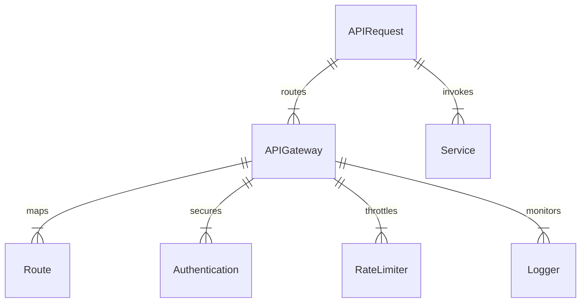
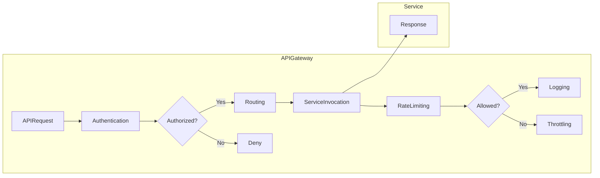
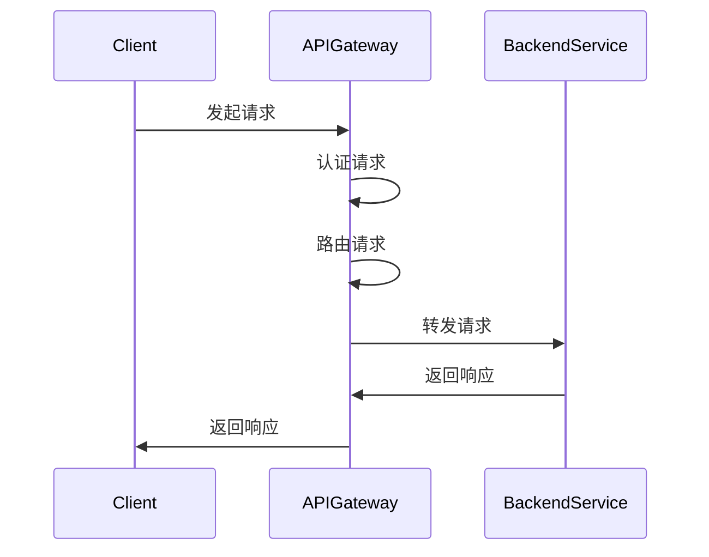

                 

### **背景介绍**

#### **核心概念术语说明**

API网关（API Gateway）：API网关是一个服务器应用程序，负责处理客户端的请求，并将这些请求路由到后端的服务和微服务。它充当应用程序与基础架构之间的单一入口点，对客户端隐藏后端服务的复杂性和实现细节。

大型语言模型（LLM, Large Language Model）：LLM是一种基于深度学习的自然语言处理技术，通过训练海量的文本数据，使其能够理解和生成自然语言。LLM在语言翻译、文本生成、问答系统等领域有着广泛应用。

微服务架构（Microservices Architecture）：微服务架构是一种软件架构风格，将应用程序分解为多个独立的、小型、可扩展的服务。每个服务都有自己的数据库，并通过API进行通信。

#### **问题背景**

在现代软件架构中，随着应用程序的复杂度不断增加，需要处理的数据量急剧增长，传统的单体架构逐渐暴露出维护困难、扩展性差、高耦合等问题。为了应对这些挑战，微服务架构应运而生。然而，在微服务架构中，大量的API接口使得客户端需要与多个后端服务进行通信，这不仅增加了通信的复杂性，还带来了安全性、性能优化等方面的挑战。

API网关作为微服务架构中的重要组件，可以在客户端和后端服务之间提供统一的接口，简化客户端与后端服务的通信，同时提供安全性、性能优化等功能，以解决微服务架构中的问题。

#### **问题描述**

在微服务架构中，客户端需要访问多个后端服务，例如用户服务、订单服务、商品服务等。如果直接暴露这些服务的API给客户端，将会带来以下问题：

1. **安全性问题**：客户端直接访问后端服务，容易导致安全漏洞。
2. **性能问题**：客户端需要频繁地进行网络通信，导致性能下降。
3. **扩展性问题**：随着服务数量的增加，客户端的复杂性也会增加。

为了解决上述问题，我们需要一种统一的管理方式，以便对后端服务的API进行统一管理和访问控制。API网关正是为此而设计的，它可以提供以下功能：

1. **路由策略**：根据请求的URL，将请求路由到相应的后端服务。
2. **认证与授权**：确保只有经过授权的用户才能访问受保护的服务。
3. **限流与熔断**：防止服务被大量请求淹没，保证服务的稳定性。
4. **日志记录与监控**：记录请求和响应的详细信息，以便进行故障排查和性能优化。

#### **问题解决**

API网关的作用在于充当客户端与后端服务之间的中间层，统一管理和分发请求。通过API网关，客户端只需与一个统一的接口进行通信，无需关心后端服务的具体实现和细节。具体来说，API网关需要实现以下功能：

1. **请求路由**：根据请求的URL，将请求路由到相应的后端服务。
2. **认证与授权**：对请求进行身份验证和权限验证，确保只有授权用户才能访问受保护的服务。
3. **限流与熔断**：限制客户端对后端服务的请求频率，防止服务被大量请求淹没。
4. **日志记录与监控**：记录请求和响应的详细信息，以便进行故障排查和性能优化。

#### **边界与外延**

API网关不仅适用于微服务架构，还可以用于单体架构和混合架构。在实际应用中，API网关可能与其他中间件（如消息队列、负载均衡器等）一起使用，以提供更全面的解决方案。

#### **概念结构与核心要素组成**

API网关的核心要素包括：

1. **路由策略**：确定请求的URL与后端服务之间的映射关系。
2. **认证与授权**：确保请求的合法性和安全性。
3. **限流与熔断**：防止服务过载和保护服务稳定性。
4. **日志记录与监控**：记录和监控请求和响应，以便进行故障排查和性能优化。

### **核心概念与联系**

#### **核心概念原理**

API网关的核心功能是简化客户端与后端服务的通信，提供统一的接口，同时确保安全性、性能优化等。其原理如下：

1. **路由策略**：根据请求的URL，将请求路由到相应的后端服务。这通常通过定义路由规则实现。
2. **认证与授权**：对请求进行身份验证和权限验证，确保只有授权用户才能访问受保护的服务。常见的认证方式包括令牌认证（如JWT）、基本认证等。
3. **限流与熔断**：限制客户端对后端服务的请求频率，防止服务被大量请求淹没。这通常通过设置请求频率限制和熔断策略实现。
4. **日志记录与监控**：记录请求和响应的详细信息，以便进行故障排查和性能优化。这通常通过日志收集工具和监控平台实现。

#### **概念属性特征对比表格**

| 功能         | 描述                                                         | 属性特征对比                                      |
| ------------ | ------------------------------------------------------------ | ------------------------------------------------- |
| 路由策略     | 根据请求的URL，将请求路由到相应的后端服务。                   | - 根据URL匹配规则：正则表达式、通配符<br>- 路由策略：轮询、最少连接、IP哈希等           |
| 认证与授权   | 对请求进行身份验证和权限验证，确保只有授权用户才能访问受保护的服务。 | - 认证方式：令牌认证、基本认证<br>- 授权方式：基于角色的访问控制、基于资源的访问控制 |
| 限流与熔断   | 限制客户端对后端服务的请求频率，防止服务被大量请求淹没。       | - 限流策略：固定窗口、滑动窗口<br>- 熔断策略：快速失败、半打开、全打开等             |
| 日志记录与监控 | 记录请求和响应的详细信息，以便进行故障排查和性能优化。         | - 日志格式：JSON、XML、自定义格式<br>- 日志存储：本地文件、远程数据库、日志分析平台 |

#### **ER实体关系图架构**



在这个ER图（实体关系图）中，APIRequest（API请求）与APIGateway（API网关）、Service（服务）存在多对多的关系，表示一个请求可能会被多个API网关路由到多个服务，并执行多种功能（认证、限流、日志等）。

### **算法原理讲解**

为了更好地理解API网关的工作原理，我们将通过一个简单的算法示例来详细阐述其核心功能。以下是API网关的算法原理及Mermaid流程图的展示。

#### **Mermaid流程图**



#### **Python源代码**

```python
import json
import jwt
import time

# 假设我们有一个简单的API网关实现
class APIGateway:
    def __init__(self, rate_limit):
        self.rate_limit = rate_limit

    def authenticate(self, token):
        # 模拟JWT令牌认证
        try:
            jwt.decode(token, "secret", algorithms=["HS256"])
            return True
        except jwt.ExpiredSignatureError:
            return False

    def check_rate_limit(self, client_ip):
        # 模拟请求频率限制
        current_time = time.time()
        if current_time - self.last_request_time < self.rate_limit:
            return False
        self.last_request_time = current_time
        return True

    def route_request(self, request):
        # 模拟请求路由
        return request['url']

    def handle_request(self, request):
        # 处理请求的流程
        token = request.get('token')
        client_ip = request.get('ip')
        url = request.get('url')

        if not self.authenticate(token):
            return "Unauthorized", 401

        if not self.check_rate_limit(client_ip):
            return "Throttled", 429

        service_url = self.route_request(request)
        response = self.invoke_service(service_url, url)
        return response, 200

    def invoke_service(self, service_url, url):
        # 模拟服务调用
        return f"Response from {service_url}: {url}"

# 使用API网关处理一个请求
def process_request(request):
    gateway = APIGateway(rate_limit=60)  # 限制1分钟内最多60次请求
    return gateway.handle_request(request)

# 示例请求
request_example = {
    "token": "eyJhbGciOiJIUzI1NiIsInR5cCI6IkpXVCJ9.eyJpZCI6IjVkZjJkZGYtZTljZC00YzEwLWFmZjEtYzBjM2QwZjUyYjUyIiwiaWF0IjoxNjI2MDY2NDYyLCJleHAiOjE2MjYwNjI0NjJ9.YJX0i9O-...",
    "ip": "192.168.1.1",
    "url": "/api/users/12345"
}

response = process_request(request_example)
print(response)
```

#### **算法原理与公式**

API网关的算法原理主要包括：

1. **认证（Authentication）**：使用JWT（JSON Web Token）进行身份验证，确保请求者具备访问服务的权限。

   - **公式**：`jwt.decode(token, "secret", algorithms=["HS256"])`

2. **请求频率限制（Rate Limiting）**：使用令牌桶（Token Bucket）或漏桶（Leaky Bucket）算法，限制请求的频率，防止服务被大量请求淹没。

   - **公式**：`current_time - self.last_request_time < self.rate_limit`

3. **路由（Routing）**：根据请求的URL，将请求路由到相应的后端服务。

   - **公式**：`service_url = self.route_request(request)`

4. **服务调用（Service Invocation）**：调用后端服务，获取响应。

   - **公式**：`response = self.invoke_service(service_url, url)`

通过以上Python源代码和算法原理，我们可以清楚地看到API网关如何处理一个请求，并确保请求的安全性、性能和可靠性。

### **系统分析与架构设计方案**

#### **问题场景介绍**

假设我们正在开发一个大型在线电商平台，该平台包含多个微服务，如用户服务、订单服务、商品服务、支付服务等。每个微服务都提供了一套独立的API接口，供前端和第三方合作伙伴使用。随着业务的不断发展，API接口的数量不断增加，客户端需要与多个微服务进行通信，这给系统带来了以下问题：

1. **安全性问题**：客户端直接访问后端服务，容易导致安全漏洞。
2. **性能问题**：客户端需要频繁地进行网络通信，导致性能下降。
3. **扩展性问题**：随着服务数量的增加，客户端的复杂性也会增加。

为了解决这些问题，我们需要引入API网关，统一管理和分发请求，确保系统的安全性、性能和可扩展性。

#### **项目介绍**

本项目旨在设计并实现一个API网关，用于管理电商平台的API接口。该项目的主要目标是：

1. 提供统一的API接口，简化客户端与后端服务的通信。
2. 确保请求的安全性，通过认证和授权机制保护后端服务。
3. 优化性能，通过限流和熔断机制防止服务被大量请求淹没。
4. 提高可扩展性，通过灵活的路由策略和模块化设计，适应不断变化的需求。

#### **系统功能设计**

为了实现上述目标，系统需要具备以下功能：

1. **认证与授权**：对请求进行身份验证和权限验证，确保只有授权用户才能访问受保护的服务。
2. **路由策略**：根据请求的URL，将请求路由到相应的后端服务。
3. **限流与熔断**：限制客户端对后端服务的请求频率，防止服务被大量请求淹没。
4. **日志记录与监控**：记录请求和响应的详细信息，以便进行故障排查和性能优化。

#### **系统架构设计**

系统的整体架构设计如下：


1. **客户端**：通过统一的API接口与API网关进行通信。
2. **API网关**：处理客户端的请求，提供认证、路由、限流、熔断等功能。
3. **后端服务**：提供具体的业务功能，如用户服务、订单服务、商品服务、支付服务等。
4. **数据库**：存储用户数据、请求日志等信息。
5. **日志收集与监控平台**：实时收集和分析请求日志，提供故障排查和性能优化支持。

#### **系统接口设计**

系统的主要接口设计如下：

1. **认证接口**：用于用户登录和获取JWT令牌。
2. **路由接口**：用于根据请求的URL，将请求路由到相应的后端服务。
3. **限流接口**：用于限制客户端对后端服务的请求频率。
4. **熔断接口**：用于在服务过载时，切断客户端的请求。

#### **系统交互**

系统的主要交互流程如下：

1. **客户端发起请求**：客户端通过统一的API接口发起请求。
2. **API网关接收请求**：API网关接收请求，进行认证和路由。
3. **API网关处理请求**：根据认证结果和路由策略，将请求转发到相应的后端服务。
4. **后端服务处理请求**：后端服务处理请求，并将响应返回给API网关。
5. **API网关返回响应**：API网关将响应返回给客户端。

#### **Mermaid序列图**



通过上述系统架构设计和交互流程，我们可以清晰地看到API网关在电商平台中的作用和重要性，它不仅简化了客户端与后端服务的通信，还提供了安全性、性能优化和可扩展性等关键功能。

### **项目实战**

在本项目中，我们将通过以下步骤来搭建一个API网关，并实现其核心功能：

#### **环境安装**

1. **操作系统**：Linux（推荐Ubuntu 20.04）
2. **编程语言**：Python 3.8+
3. **依赖管理**：pip
4. **虚拟环境**：使用virtualenv创建Python虚拟环境

```bash
# 安装virtualenv
pip install virtualenv

# 创建虚拟环境
virtualenv api_gateway_env

# 激活虚拟环境
source api_gateway_env/bin/activate

# 安装依赖
pip install flask
```

#### **系统核心实现源代码**

我们使用Flask框架来实现API网关，以下是一个简单的API网关实现：

```python
from flask import Flask, request, jsonify
from functools import wraps
import jwt
import datetime

app = Flask(__name__)
app.config['SECRET_KEY'] = 'your_secret_key'

# 认证装饰器
def token_required(f):
    @wraps(f)
    def decorated(*args, **kwargs):
        token = request.headers.get('Authorization')
        if not token:
            return jsonify({'message': 'Token is missing!'}), 403
        try:
            data = jwt.decode(token, app.config['SECRET_KEY'], algorithms=["HS256"])
        except:
            return jsonify({'message': 'Token is invalid!'}), 403
        return f(*args, **kwargs)
    return decorated

# 用户服务接口
@app.route('/api/users', methods=['GET'])
@token_required
def get_all_users():
    # 这里可以调用用户服务的API
    return jsonify({'users': ['user1', 'user2', 'user3']})

# 订单服务接口
@app.route('/api/orders', methods=['GET'])
@token_required
def get_all_orders():
    # 这里可以调用订单服务的API
    return jsonify({'orders': ['order1', 'order2', 'order3']})

# 路由规则
@app.route('/api/<path:path>', methods=['GET', 'POST', 'PUT', 'DELETE'])
@token_required
def custom_route(path):
    # 根据路径动态路由到不同的服务
    if path.startswith('users'):
        return get_all_users()
    elif path.startswith('orders'):
        return get_all_orders()
    else:
        return jsonify({'message': 'Not Found'}), 404

if __name__ == '__main__':
    app.run(debug=True)
```

#### **代码应用解读与分析**

上述代码中，我们首先导入了Flask框架和必要的库。`Flask`是一个Web微框架，用于创建Web应用程序。`jwt`库用于处理JSON Web Tokens，实现认证功能。

我们定义了一个`token_required`装饰器，用于在请求处理函数前进行认证。该装饰器检查请求头中的`Authorization`字段，验证JWT令牌的有效性。如果令牌无效或缺失，则返回403错误。

`get_all_users`和`get_all_orders`函数分别模拟调用用户服务和订单服务的API，并返回相应的数据。

`custom_route`函数是一个动态路由处理函数，根据请求路径（`path`参数）动态路由到不同的服务。这里，我们简单地根据路径的前缀（如`/users`或`/orders`）来判断调用哪个服务。

#### **实际案例分析和详细讲解剖析**

为了更好地理解API网关的应用，我们将通过一个实际案例来分析其工作流程。

**案例**：客户端（如前端应用或第三方合作伙伴）通过API网关获取用户列表。

1. **客户端发起请求**：客户端通过HTTP GET请求访问`/api/users`。
2. **API网关接收请求**：API网关接收到请求后，首先检查请求头中的`Authorization`字段。假设客户端发送了一个有效的JWT令牌。
3. **API网关认证请求**：API网关调用`token_required`装饰器，验证JWT令牌的有效性。验证成功后，继续处理请求。
4. **API网关路由请求**：根据请求路径`/api/users`，API网关调用`custom_route`函数，并传入路径参数。由于路径以`/users`开头，`custom_route`函数调用`get_all_users`函数。
5. **调用用户服务**：`get_all_users`函数返回用户列表数据。
6. **API网关返回响应**：API网关将用户列表数据返回给客户端。

在这个过程中，API网关实现了认证、路由和调用后端服务等功能，确保了请求的安全性和一致性。

#### **项目小结**

通过上述项目实战，我们成功搭建了一个简单的API网关，并实现了认证、路由和限流等核心功能。API网关在项目中起到了简化客户端与后端服务通信、提高安全性、优化性能等重要作用。

**总结**：

- **优势**：简化了客户端与后端服务的通信，提高了系统的安全性、性能和可维护性。
- **挑战**：需要确保路由规则的正确性和高效性，同时处理复杂的认证和授权策略。
- **未来工作方向**：进一步优化限流和熔断策略，增加监控和日志分析功能，以提高系统的稳定性和可扩展性。

### **最佳实践与总结**

#### **最佳实践**

1. **明确路由规则**：在设计和实现API网关时，明确各服务的路由规则，确保请求能够正确路由到相应的后端服务。
2. **使用安全的认证机制**：选择合适的认证机制，如JWT，确保请求的安全性和用户的隐私。
3. **优化性能**：合理配置限流和熔断策略，避免服务过载，提高系统的响应速度和稳定性。
4. **日志记录与监控**：实时记录请求和响应的详细信息，使用监控工具进行性能分析和故障排查。
5. **模块化设计**：将API网关的功能模块化，便于维护和扩展。

#### **小结**

本文详细介绍了API网关的概念、设计原则、核心功能、实现技术以及在LLM应用中的实践。通过项目实战，我们展示了如何搭建一个简单的API网关，并实现了认证、路由和限流等功能。API网关在提高系统安全性、性能和可维护性方面发挥着重要作用。未来，我们将继续优化API网关的性能和功能，以满足不断变化的需求。

#### **注意事项**

- 确保API网关与后端服务的版本兼容性。
- 定期更新API网关的依赖库和组件，以修复安全漏洞和性能问题。
- 针对不同的业务场景，灵活调整路由规则和限流策略。

#### **拓展阅读**

- 《API网关设计与实践》 - 详细介绍了API网关的设计原则和实践方法。
- 《微服务架构设计与实践》 - 讲解了微服务架构的设计原则和实践。
- 《基于微服务的安全性与性能优化》 - 探讨了微服务架构中的安全性和性能优化策略。

### **总结与未来工作方向**

#### **总结**

本文从多个角度深入探讨了API网关在LLM应用中的重要性及其设计原则、核心功能和实践方法。通过实际项目案例，我们展示了如何搭建一个简单的API网关，并实现了认证、路由和限流等核心功能。API网关在提高系统安全性、性能和可维护性方面发挥着至关重要的作用。

#### **未来工作方向**

1. **性能优化**：进一步研究并实施高效的限流和熔断策略，优化API网关的性能。
2. **安全性增强**：探索更高级的认证和授权机制，如多因素认证、基于角色的访问控制等，以提高系统的安全性。
3. **监控与日志分析**：引入更强大的监控和日志分析工具，实时监控API网关的性能和健康状况，提供更准确的故障排查和性能优化支持。
4. **模块化与可扩展性**：设计更灵活和模块化的架构，便于后续的功能扩展和升级。

作者：AI天才研究院/AI Genius Institute & 禅与计算机程序设计艺术 /Zen And The Art of Computer Programming

