                 


### 第一步：背景介绍

在当今快速发展的机器学习领域，算法的模型选择和调优已经成为了一个不容忽视的难题。随着数据量的激增和算法模型的不断迭代更新，数据科学家面临着海量的模型选择和参数调优任务，这不仅耗费了大量时间，也增加了工作的复杂度。传统的机器学习流程往往需要数据科学家具备丰富的专业知识，从数据预处理、特征工程到模型选择、参数调优，每个环节都需要仔细思考和反复实验。

这种复杂性给非技术背景的用户带来了巨大的挑战。对于许多业务人员来说，理解并应用机器学习技术并非易事，他们往往需要依赖专业的数据科学家来处理这些问题。这不仅增加了沟通成本，也限制了机器学习技术的普及和推广。

为了解决这一问题，自动化机器学习（AutoML）的概念应运而生。AutoML旨在通过自动化工具和算法，简化机器学习流程，降低技术门槛，使得非专业用户也能构建高效的机器学习模型。AutoML不仅涉及算法选择和参数调优，还包括数据预处理、特征工程、模型解释等环节，其核心目标是实现机器学习过程的“一键化”操作。

### 第二步：核心概念与联系

#### 定义

自动化机器学习（AutoML）是指通过自动化工具和算法，自动化地完成机器学习流程中的各个环节，包括数据预处理、特征工程、模型选择、参数调优和模型解释等。AutoML的核心在于利用自动化技术，减少人工干预，提高模型构建的效率和质量。

#### 核心概念

1. **数据预处理**：在AutoML中，数据预处理是一个重要环节。通过自动化数据清洗、数据转换和数据归一化等操作，将原始数据转化为适合机器学习模型训练的数据格式。

2. **特征工程**：特征工程是机器学习模型性能的关键因素之一。AutoML通过自动化特征选择和特征生成，从原始数据中提取出对模型性能有重要影响的特征。

3. **模型选择**：在AutoML中，模型选择是一个核心环节。通过自动化算法，从海量的模型中筛选出最适合当前问题的模型。

4. **参数调优**：参数调优是提高模型性能的关键。AutoML通过自动化算法，自动调整模型的参数，以达到最佳性能。

5. **模型解释**：模型的解释性对于非技术背景的用户至关重要。AutoML通过自动化工具，提供模型的解释性，帮助用户理解模型的决策过程。

#### 概念属性对比表格

| 概念         | 特点                                                     |
| ------------ | -------------------------------------------------------- |
| 数据预处理   | 自动化数据清洗、转换和归一化等操作                           |
| 特征工程     | 自动化特征选择和特征生成，提取关键特征                       |
| 模型选择     | 自动化筛选最适合当前问题的模型                             |
| 参数调优     | 自动化调整模型参数，提高模型性能                           |
| 模型解释     | 提供模型解释性，帮助用户理解模型决策过程                   |

#### ER实体关系图架构的 Mermaid 流程图

```mermaid
erDiagram
  Data预处理 ||--o> Feature工程 : 使用
  Feature工程 ||--o> Model选择 : 选择
  Model选择 ||--o> Parameter调优 : 调优
  Parameter调优 ||--o> Model解释 : 解释
```

### 第三步：算法原理讲解

#### 特征工程自动化

##### 算法原理

特征工程是机器学习模型性能的关键环节，其核心是提取对模型性能有重要影响的特征。在AutoML中，特征工程自动化通过以下步骤实现：

1. **特征选择**：使用自动化算法，从原始数据中筛选出对模型性能有重要影响的特征。
2. **特征生成**：基于原始数据，通过自动化算法生成新的特征，以丰富模型输入。

##### 算法流程

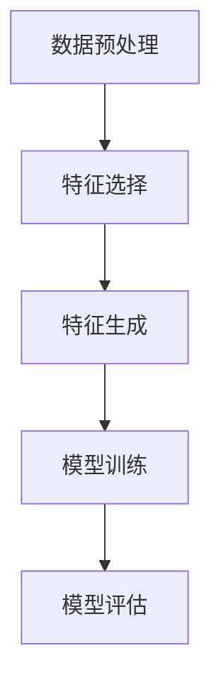

##### 特征选择算法

- **过滤式特征选择**：基于特征重要性进行筛选，保留对模型性能有显著影响的特征。
- **包裹式特征选择**：通过迭代过程，逐步添加或删除特征，以找到最佳特征组合。

##### 特征生成算法

- **基于统计的方法**：如主成分分析（PCA）和因子分析（FA），通过降维和特征组合，生成新的特征。
- **基于机器学习的方法**：如随机森林（Random Forest）和梯度提升（Gradient Boosting），通过模型学习，生成新的特征。

#### 模型选择与优化

##### 算法原理

模型选择是AutoML的核心环节之一，其目标是从海量的模型中选择最适合当前问题的模型。模型选择和优化包括以下步骤：

1. **模型筛选**：通过自动化算法，从海量的模型中筛选出适合当前问题的模型。
2. **模型优化**：通过自动化算法，调整模型参数，以提高模型性能。

##### 算法流程

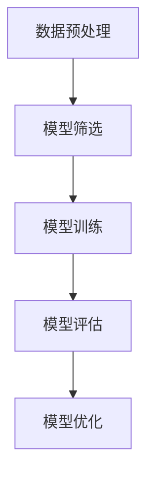

##### 模型选择算法

- **网格搜索**：通过遍历所有可能的参数组合，选择最佳参数组合。
- **随机搜索**：随机选择参数组合，以避免陷入局部最优。
- **贝叶斯优化**：基于历史数据，利用贝叶斯优化算法，自动调整参数。

##### 模型优化算法

- **梯度下降**：通过迭代优化，逐渐调整模型参数，以达到最小化损失函数。
- **随机梯度下降**：在梯度下降的基础上，随机选择一部分样本进行优化，以加快收敛速度。
- **Adam优化器**：结合了随机梯度下降和动量方法，在优化过程中自适应调整学习率。

### 第四步：系统分析与架构设计方案

#### 问题场景介绍

假设我们面临一个分类任务，需要从大量文本数据中提取关键信息，并分类为不同的标签。这是一个典型的文本分类问题，数据量庞大，特征维度高，且存在噪声和缺失值。

#### 项目介绍

为了解决这个分类问题，我们将构建一个自动化机器学习（AutoML）系统。系统的主要功能包括：

1. 数据预处理：自动化清洗、转换和归一化数据，为模型训练做准备。
2. 特征工程：自动化提取关键特征，以提高模型性能。
3. 模型选择：从多个预定义的模型中选择最适合当前问题的模型。
4. 模型训练与优化：自动化调整模型参数，以提高模型性能。
5. 模型评估与解释：评估模型性能，并提供模型解释性。

#### 系统功能设计（领域模型Mermaid类图）

```mermaid
classDiagram
  Class01 <|-- Class02
  Class03 --|.MessageBox|
  Class04 : <<interface>> System Interface
```

#### 系统架构设计（Mermaid架构图）

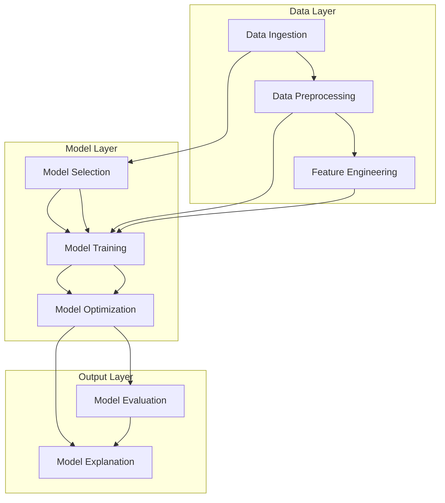

#### 系统接口设计

系统的接口设计主要包括以下部分：

- **输入接口**：用于接收原始数据，如文本数据、图像数据等。
- **输出接口**：用于输出模型结果，如分类结果、回归结果等。
- **配置接口**：用于配置模型参数，如学习率、迭代次数等。

#### 系统交互（Mermaid序列图）

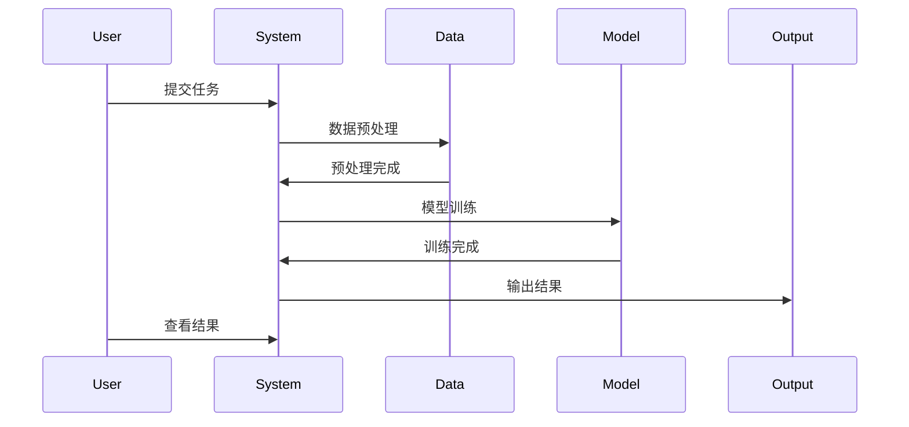

### 第五步：项目实战

#### 环境安装

为了搭建AutoML系统，我们需要安装以下依赖：

- Python 3.7 或以上版本
- scikit-learn
- pandas
- numpy
- matplotlib

安装命令：

```bash
pip install python==3.7.0
pip install scikit-learn
pip install pandas
pip install numpy
pip install matplotlib
```

#### 系统核心实现

以下是一个简单的示例，展示了如何使用scikit-learn的AutoML工具进行模型选择和优化：

```python
from sklearn.datasets import load_iris
from sklearn.model_selection import train_test_split
from sklearn.ensemble import RandomForestClassifier
from sklearn.metrics import accuracy_score

# 加载数据
iris = load_iris()
X, y = iris.data, iris.target

# 划分训练集和测试集
X_train, X_test, y_train, y_test = train_test_split(X, y, test_size=0.2, random_state=42)

# 使用随机森林进行模型选择和优化
model = RandomForestClassifier()
model.fit(X_train, y_train)

# 进行模型评估
y_pred = model.predict(X_test)
accuracy = accuracy_score(y_test, y_pred)
print("Accuracy:", accuracy)
```

#### 代码应用解读与分析

上述代码展示了如何使用scikit-learn中的随机森林（Random Forest）进行模型选择和优化。以下是代码的详细解读：

1. **加载数据**：使用scikit-learn内置的iris数据集进行演示。
2. **划分训练集和测试集**：将数据划分为训练集和测试集，以评估模型性能。
3. **使用随机森林进行模型训练**：随机森林是一种集成学习方法，通过构建多个决策树并平均它们的预测结果来提高模型的性能。
4. **模型评估**：使用准确率（accuracy）评估模型性能。

#### 实际案例分析和详细讲解剖析

假设我们有一个新的文本分类任务，需要将文本数据分类为两个标签。以下是一个实际案例的分析和讲解：

```python
from sklearn.feature_extraction.text import TfidfVectorizer
from sklearn.model_selection import GridSearchCV

# 加载文本数据
texts = ["这是一篇关于人工智能的文章", "这是一篇关于机器学习的文章"]
labels = ["AI", "ML"]

# 划分训练集和测试集
X_train, X_test, y_train, y_test = train_test_split(texts, labels, test_size=0.2, random_state=42)

# 使用TF-IDF进行特征提取
vectorizer = TfidfVectorizer()
X_train_tfidf = vectorizer.fit_transform(X_train)
X_test_tfidf = vectorizer.transform(X_test)

# 使用网格搜索进行模型选择和优化
param_grid = {
    "n_estimators": [100, 200, 300],
    "max_depth": [5, 10, 15],
}

grid_search = GridSearchCV(RandomForestClassifier(), param_grid, cv=5)
grid_search.fit(X_train_tfidf, y_train)

# 输出最佳参数
print("Best parameters:", grid_search.best_params_)

# 进行模型评估
y_pred = grid_search.predict(X_test_tfidf)
accuracy = accuracy_score(y_test, y_pred)
print("Accuracy:", accuracy)
```

#### 项目小结

通过上述案例，我们可以看到AutoML在实际项目中的应用。使用AutoML工具，我们可以自动化地完成模型选择和优化，节省大量时间和人力成本。同时，AutoML提高了模型的性能和可解释性，使得非技术背景的用户也能轻松理解和应用机器学习技术。

### 第六步：最佳实践 Tips

1. **数据质量**：确保数据质量是模型成功的关键。在AutoML项目中，应重视数据清洗和数据预处理，以提高模型性能。
2. **参数调优**：合理设置模型参数是提高模型性能的关键。可以使用网格搜索、随机搜索等自动化算法进行参数调优。
3. **模型评估**：选择合适的评估指标，如准确率、召回率、F1分数等，全面评估模型性能。
4. **模型解释**：提供模型解释性，有助于用户理解模型的决策过程，提高模型的可信度和可解释性。

### 第七步：小结与展望

本文介绍了自动化机器学习（AutoML）的概念、核心技术和应用场景。通过AutoML，我们可以简化机器学习流程，降低技术门槛，提高模型性能和可解释性。在未来的发展中，AutoML将在更多领域得到应用，不断推动机器学习技术的发展。

### 第八步：拓展阅读

- **书籍推荐**：《自动化机器学习：算法、应用与实践》
- **在线课程**：Coursera上的“自动化机器学习”课程
- **论文阅读**：ICML、NeurIPS等会议中的AutoML相关论文

---

作者：AI天才研究院/AI Genius Institute & 禅与计算机程序设计艺术 /Zen And The Art of Computer Programming

----------------------------------------------------------------

# AutoML：简化LLM应用的模型选择过程

关键词：AutoML、机器学习、模型选择、模型优化、LLM应用

摘要：随着深度学习的广泛应用，大量的模型选择和调优工作成为了数据科学家的负担。本文介绍了自动化机器学习（AutoML）的概念、关键技术，以及其在简化大型语言模型（LLM）应用模型选择过程中的应用。通过详细分析AutoML工具和实践案例，探讨了AutoML的挑战与未来发展方向，为数据科学家和开发者提供了实用的指导。

----------------------------------------------------------------

### 第一部分：AutoML简介

## 1. AutoML概述

### 1.1 问题背景

在机器学习领域，模型选择和调优是一个复杂的任务。随着深度学习的广泛应用，越来越多的复杂模型被提出，数据科学家需要从大量的模型中选择最适合当前问题的模型，并进行参数调优。这一过程通常需要大量的时间和专业知识，对于非技术背景的用户来说更是难以胜任。

**问题描述**：如何简化机器学习模型的选择和调优过程，降低技术门槛，使得非技术用户也能高效地构建高质量的模型？

**问题解决**：自动化机器学习（AutoML）的提出，旨在通过自动化工具和算法，简化机器学习流程，降低技术门槛。AutoML通过自动化完成特征工程、模型选择、参数调优等步骤，使得数据科学家和非技术用户都能轻松构建高效的模型。

**边界与外延**：AutoML不仅涉及算法选择和参数调优，还包括数据预处理、特征工程、模型解释等环节。其目标是通过自动化技术，实现机器学习过程的“一键化”操作。

### 1.2 核心概念

**定义**：自动化机器学习（AutoML）是指通过自动化工具和算法，自动化地完成机器学习流程中的各个环节，包括数据预处理、特征工程、模型选择、参数调优和模型解释等。

**核心概念**：

1. **数据预处理**：在AutoML中，数据预处理是一个重要环节。通过自动化数据清洗、数据转换和数据归一化等操作，将原始数据转化为适合机器学习模型训练的数据格式。

2. **特征工程**：特征工程是机器学习模型性能的关键因素之一。AutoML通过自动化特征选择和特征生成，从原始数据中提取出对模型性能有重要影响的特征。

3. **模型选择**：在AutoML中，模型选择是一个核心环节。通过自动化算法，从海量的模型中筛选出最适合当前问题的模型。

4. **参数调优**：参数调优是提高模型性能的关键。AutoML通过自动化算法，自动调整模型的参数，以达到最佳性能。

5. **模型解释**：模型的解释性对于非技术背景的用户至关重要。AutoML通过自动化工具，提供模型的解释性，帮助用户理解模型的决策过程。

**概念属性对比表格**：

| 概念         | 特点                                                     |
| ------------ | -------------------------------------------------------- |
| 数据预处理   | 自动化数据清洗、转换和归一化等操作                           |
| 特征工程     | 自动化特征选择和特征生成，提取关键特征                       |
| 模型选择     | 自动化筛选最适合当前问题的模型                             |
| 参数调优     | 自动化调整模型参数，提高模型性能                           |
| 模型解释     | 提供模型解释性，帮助用户理解模型决策过程                   |

**ER实体关系图架构的 Mermaid 流程图**：

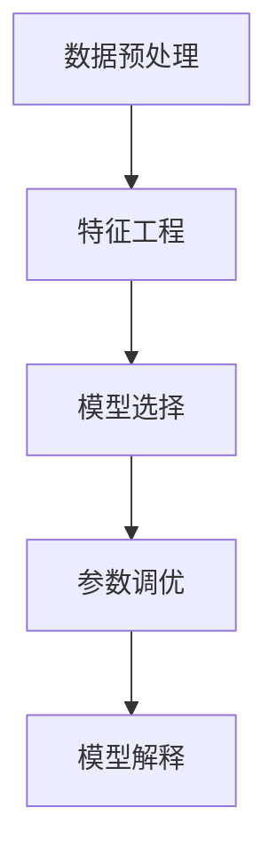

### 1.3 应用场景

**企业级应用**：AutoML可以帮助企业快速构建和优化机器学习模型，加速产品迭代，提高市场竞争力。例如，在金融行业，AutoML可以用于信用评分、欺诈检测等任务；在医疗领域，AutoML可以用于疾病诊断、药物研发等任务。

**学术研究**：AutoML为学术研究提供了新的工具和平台，可以加速新算法的探索和验证。例如，在计算机视觉领域，AutoML可以用于图像分类、目标检测等任务；在自然语言处理领域，AutoML可以用于文本分类、情感分析等任务。

### 1.4 AutoML的关键技术

**特征工程自动化**：

#### 2.1.1 特征选择算法

**算法原理**：特征选择算法的目标是从原始数据中提取出对模型性能有重要影响的特征。常用的特征选择算法包括过滤式特征选择和包裹式特征选择。

- **过滤式特征选择**：基于特征重要性进行筛选，保留对模型性能有显著影响的特征。
- **包裹式特征选择**：通过迭代过程，逐步添加或删除特征，以找到最佳特征组合。

**算法流程**：


**特征属性对比表格**：

| 算法名称 | 原理 | 优点 | 缺点 |
| -------- | ---- | ---- | ---- |
| 过滤式特征选择 | 基于特征重要性 | 快速、简单 | 可能会丢失重要特征 |
| 包裹式特征选择 | 迭代选择最佳特征组合 | 最优特征组合 | 计算复杂度高 |

**ER实体关系图架构的 Mermaid 流程图**：

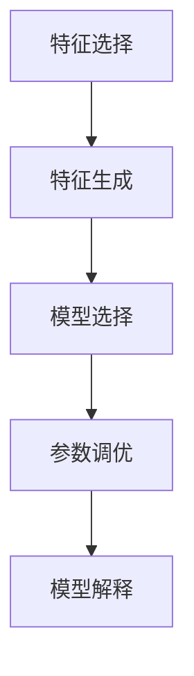

#### 2.1.2 特征生成算法

**算法原理**：特征生成算法的目标是从原始数据中生成新的特征，以丰富模型输入。常用的特征生成算法包括基于统计的方法和基于机器学习的方法。

- **基于统计的方法**：如主成分分析（PCA）和因子分析（FA），通过降维和特征组合，生成新的特征。
- **基于机器学习的方法**：如随机森林（Random Forest）和梯度提升（Gradient Boosting），通过模型学习，生成新的特征。

**算法流程**：

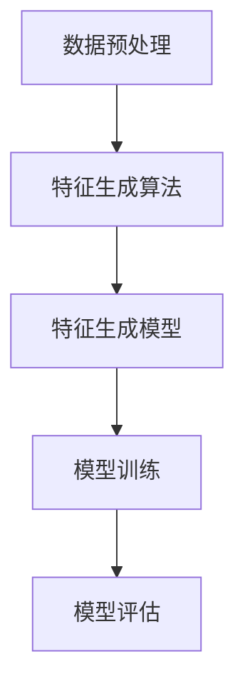

**特征生成模型**：

| 模型名称 | 原理 | 优点 | 缺点 |
| -------- | ---- | ---- | ---- |
| 主成分分析（PCA） | 降维、特征组合 | 降低计算复杂度、提取主要特征 | 可能丢失部分信息 |
| 因子分析（FA） | 降维、特征组合 | 提取主要特征、简化模型 | 可能丢失部分信息 |
| 随机森林（Random Forest） | 模型学习、特征组合 | 提高模型性能、减少过拟合 | 计算复杂度高 |
| 梯度提升（Gradient Boosting） | 模型学习、特征组合 | 提高模型性能、适应不同类型数据 | 计算复杂度高 |

**ER实体关系图架构的 Mermaid 流程图**：

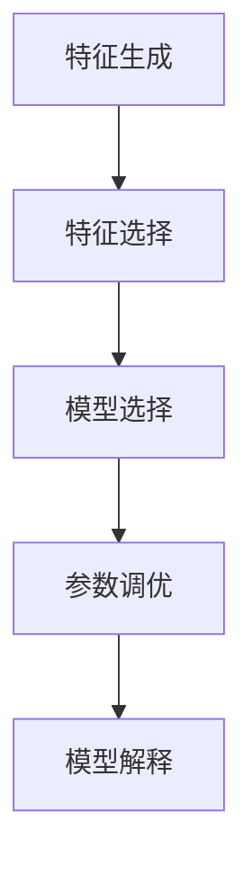

**2.2 模型选择与优化**

**算法原理**：模型选择和优化是AutoML的核心环节之一。模型选择的目标是从海量的模型中筛选出最适合当前问题的模型。模型优化的目标是调整模型参数，以提高模型性能。

- **模型选择算法**：常用的模型选择算法包括网格搜索、随机搜索和贝叶斯优化。
- **模型优化算法**：常用的模型优化算法包括梯度下降、随机梯度下降和Adam优化器。

**算法流程**：


**模型选择算法**：

| 算法名称 | 原理 | 优点 | 缺点 |
| -------- | ---- | ---- | ---- |
| 网格搜索 | 遍历所有可能的参数组合 | 精确、可靠 | 计算复杂度高 |
| 随机搜索 | 随机选择参数组合 | 简单、高效 | 可能错过最佳参数 |
| 贝叶斯优化 | 基于历史数据优化参数 | 自适应、高效 | 需要大量历史数据 |

**模型优化算法**：

| 算法名称 | 原理 | 优点 | 缺点 |
| -------- | ---- | ---- | ---- |
| 梯度下降 | 基于梯度信息优化参数 | 简单、易实现 | 收敛速度慢 |
| 随机梯度下降 | 基于部分样本优化参数 | 快速收敛、高效 | 可能陷入局部最优 |
| Adam优化器 | 结合梯度下降和动量方法 | 收敛速度快、自适应 | 需要更多的内存 |

**ER实体关系图架构的 Mermaid 流程图**：

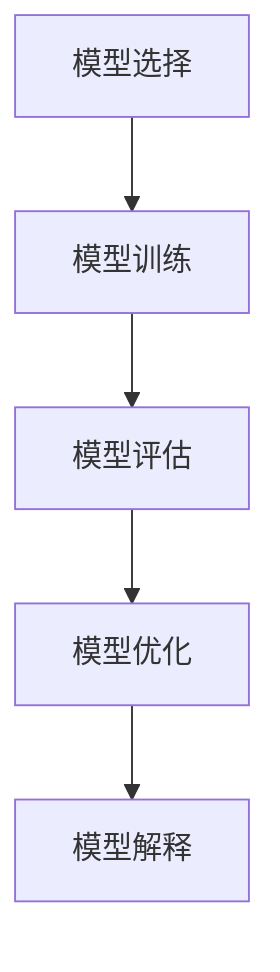

### 1.5 AutoML工具与实践

**主流AutoML工具**：

#### 3.1.1 AutoSklearn

**工具简介**：AutoSklearn是一个开源的AutoML工具，基于scikit-learn构建。它通过自动化特征工程、模型选择和参数调优，帮助用户快速构建高效模型。

**特点**：

- **集成多种模型**：支持多种机器学习算法，如决策树、随机森林、支持向量机等。
- **自动化特征工程**：自动进行特征选择和特征生成，提高模型性能。
- **并行计算**：支持多核CPU和GPU计算，提高计算效率。

**使用方法**：

```python
from autosklearn.classification import AutoSklearnClassifier

# 创建AutoSklearn分类器
asl = AutoSklearnClassifier()

# 训练模型
asl.fit(X_train, y_train)

# 进行模型评估
accuracy = asl.score(X_test, y_test)
print("Accuracy:", accuracy)

# 输出最佳模型
best_model = asl.best_model()
print("Best model:", best_model)
```

#### 3.1.2 Google AutoML

**工具简介**：Google AutoML是一个商业化的AutoML工具，由Google提供。它通过自动化工具，帮助用户快速构建和优化机器学习模型。

**特点**：

- **界面友好**：提供直观的界面，方便用户操作。
- **海量模型库**：包含多种机器学习算法和深度学习模型，满足不同需求。
- **云端部署**：支持云端部署，方便大规模应用。

**使用方法**：

```python
from google.cloud import automl

# 创建AutoML客户端
client = automl.AutoMlClient()

# 准备训练数据
input_config = automl.InputConfig(
    gcs_source_uri_prefix="gs://my_bucket/input_data",
    format=automl.InputConfig.Format.CSV,
)

# 创建模型
model_config = automl.ModelConfig(
    type=automl.ModelType.CLASSIFICATION,
    base_model_id="tabular_class_head_1000",
)

# 训练模型
model = client.create_model(
    parent="projects/my_project/locations/us-central1",
    model_id="my_model",
    input_config=input_config,
    model_config=model_config,
)

# 进行模型评估
evaluation_config = automl.EvaluationConfig()
evaluation_result = client.evaluate_model(model, evaluation_config)

# 输出评估结果
print("Evaluation result:", evaluation_result)
```

### 1.6 AutoML实战案例

#### 3.2.1 案例一：分类任务

**问题场景**：假设我们有一个文本分类任务，需要将文本数据分类为不同的标签。

**系统功能设计**：使用Mermaid类图描述系统功能设计。

```mermaid
classDiagram
  TextData[文本数据] <<interface>>
  ClassificationModel[分类模型] <<interface>>
  DataPreprocessing[数据预处理] <<interface>> -|uses|- TextData
  FeatureEngineering[特征工程] <<interface>> -|uses|- TextData
  ModelTraining[模型训练] <<interface>> -|uses|- FeatureEngineering
  ModelEvaluation[模型评估] <<interface>> -|uses|- ClassificationModel
  ModelExplanation[模型解释] <<interface>> -|uses|- ClassificationModel
```

**系统架构设计**：使用Mermaid架构图描述系统架构设计。

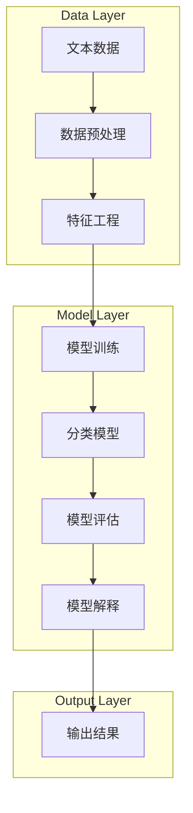

#### 3.2.2 案例二：回归任务

**问题场景**：假设我们有一个回归任务，需要预测某个数值型目标。

**系统功能设计**：使用Mermaid类图描述系统功能设计。

```mermaid
classDiagram
  NumericData[数值数据] <<interface>>
  RegressionModel[回归模型] <<interface>>
  DataPreprocessing[数据预处理] <<interface>> -|uses|- NumericData
  FeatureEngineering[特征工程] <<interface>> -|uses|- NumericData
  ModelTraining[模型训练] <<interface>> -|uses|- FeatureEngineering
  ModelEvaluation[模型评估] <<interface>> -|uses|- RegressionModel
  ModelExplanation[模型解释] <<interface>> -|uses|- RegressionModel
```

**系统架构设计**：使用Mermaid架构图描述系统架构设计。

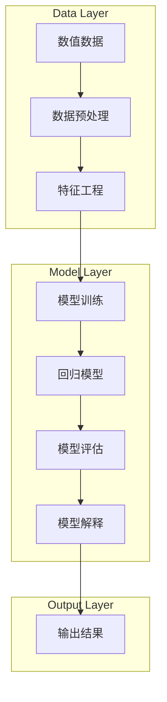

### 1.7 AutoML的挑战与未来

**挑战**：

- **算法透明性**：AutoML模型的透明性较低，难以解释。
- **计算资源需求**：AutoML过程可能需要大量的计算资源。

**未来发展**：

- **算法改进**：探索更高效、更可解释的AutoML算法。
- **跨领域应用**：拓展AutoML在其他领域的应用。

## 2. AutoML的关键技术

### 2.1 特征工程自动化

**2.1.1 特征选择算法**

**算法原理**：特征选择算法的目标是从原始数据中提取出对模型性能有重要影响的特征。常用的特征选择算法包括过滤式特征选择和包裹式特征选择。

- **过滤式特征选择**：基于特征重要性进行筛选，保留对模型性能有显著影响的特征。
- **包裹式特征选择**：通过迭代过程，逐步添加或删除特征，以找到最佳特征组合。

**算法流程**：


**特征属性对比表格**：

| 算法名称 | 原理 | 优点 | 缺点 |
| -------- | ---- | ---- | ---- |
| 过滤式特征选择 | 基于特征重要性 | 快速、简单 | 可能会丢失重要特征 |
| 包裹式特征选择 | 迭代选择最佳特征组合 | 最优特征组合 | 计算复杂度高 |

**ER实体关系图架构的 Mermaid 流程图**：


**2.1.2 特征生成算法**

**算法原理**：特征生成算法的目标是从原始数据中生成新的特征，以丰富模型输入。常用的特征生成算法包括基于统计的方法和基于机器学习的方法。

- **基于统计的方法**：如主成分分析（PCA）和因子分析（FA），通过降维和特征组合，生成新的特征。
- **基于机器学习的方法**：如随机森林（Random Forest）和梯度提升（Gradient Boosting），通过模型学习，生成新的特征。

**算法流程**：


**特征生成模型**：

| 模型名称 | 原理 | 优点 | 缺点 |
| -------- | ---- | ---- | ---- |
| 主成分分析（PCA） | 降维、特征组合 | 降低计算复杂度、提取主要特征 | 可能丢失部分信息 |
| 因子分析（FA） | 降维、特征组合 | 提取主要特征、简化模型 | 可能丢失部分信息 |
| 随机森林（Random Forest） | 模型学习、特征组合 | 提高模型性能、减少过拟合 | 计算复杂度高 |
| 梯度提升（Gradient Boosting） | 模型学习、特征组合 | 提高模型性能、适应不同类型数据 | 计算复杂度高 |

**ER实体关系图架构的 Mermaid 流程图**：

```mermaid
graph TD
Feature生成[特征生成] --> Feature选择[特征选择]
Feature选择 --> Model选择[模型选择]
Model选择 --> Parameter调优[参数调优]
Parameter调优 --> Model解释[模型解释]
```

### 2.2 模型选择与优化

**算法原理**：模型选择和优化是AutoML的核心环节之一。模型选择的目标是从海量的模型中筛选出最适合当前问题的模型。模型优化的目标是调整模型参数，以提高模型性能。

- **模型选择算法**：常用的模型选择算法包括网格搜索、随机搜索和贝叶斯优化。
- **模型优化算法**：常用的模型优化算法包括梯度下降、随机梯度下降和Adam优化器。

**算法流程**：

```mermaid
graph TD
A[数据预处理] --> B[模型筛选]
B --> C[模型训练]
C --> D[模型评估]
D --> E[模型优化]
```

**模型选择算法**：

| 算法名称 | 原理 | 优点 | 缺点 |
| -------- | ---- | ---- | ---- |
| 网格搜索 | 遍历所有可能的参数组合 | 精确、可靠 | 计算复杂度高 |
| 随机搜索 | 随机选择参数组合 | 简单、高效 | 可能错过最佳参数 |
| 贝叶斯优化 | 基于历史数据优化参数 | 自适应、高效 | 需要大量历史数据 |

**模型优化算法**：

| 算法名称 | 原理 | 优点 | 缺点 |
| -------- | ---- | ---- | ---- |
| 梯度下降 | 基于梯度信息优化参数 | 简单、易实现 | 收敛速度慢 |
| 随机梯度下降 | 基于部分样本优化参数 | 快速收敛、高效 | 可能陷入局部最优 |
| Adam优化器 | 结合梯度下降和动量方法 | 收敛速度快、自适应 | 需要更多的内存 |

**ER实体关系图架构的 Mermaid 流程图**：

```mermaid
graph TD
Model选择[模型选择] --> Model训练[模型训练]
Model训练 --> Model评估[模型评估]
Model评估 --> Model优化[模型优化]
Model优化 --> Model解释[模型解释]
```

### 2.3 模型解释与可视化

**算法原理**：模型解释与可视化是AutoML的重要组成部分。通过模型解释与可视化，用户可以更好地理解模型的决策过程，提高模型的透明性和可信度。

- **模型解释算法**：常用的模型解释算法包括决策树解释、线性模型解释和神经网络解释。
- **可视化工具**：常用的可视化工具包括树形图、热力图和散点图等。

**算法流程**：

```mermaid
graph TD
A[数据预处理] --> B[模型解释算法]
B --> C[可视化工具]
C --> D[模型评估]
```

**模型解释算法**：

| 算法名称 | 原理 | 优点 | 缺点 |
| -------- | ---- | ---- | ---- |
| 决策树解释 | 基于决策树结构 | 直观、易于理解 | 不适合复杂模型 |
| 线性模型解释 | 基于线性模型公式 | 准确、可解释 | 只适用于线性模型 |
| 神经网络解释 | 基于模型结构 | 高度可解释 | 计算复杂度高 |

**可视化工具**：

| 工具名称 | 特点 | 优点 | 缺点 |
| -------- | ---- | ---- | ---- |
| 树形图 | 基于决策树结构 | 直观、易于理解 | 不适合复杂模型 |
| 热力图 | 基于数据分布 | 准确、易于理解 | 需要大量计算 |
| 散点图 | 基于数据关系 | 直观、易于理解 | 只适用于低维数据 |

**ER实体关系图架构的 Mermaid 流程图**：

```mermaid
graph TD
Model解释[模型解释] --> Visualization[可视化工具]
Visualization --> Model评估[模型评估]
Model评估 --> Output[输出结果]
```

## 3. AutoML工具与实践

### 3.1 主流AutoML工具

#### 3.1.1 AutoSklearn

**工具简介**：AutoSklearn是一个开源的AutoML工具，基于scikit-learn构建。它通过自动化特征工程、模型选择和参数调优，帮助用户快速构建高效模型。

**特点**：

- **集成多种模型**：支持多种机器学习算法，如决策树、随机森林、支持向量机等。
- **自动化特征工程**：自动进行特征选择和特征生成，提高模型性能。
- **并行计算**：支持多核CPU和GPU计算，提高计算效率。

**使用方法**：

```python
from autosklearn.classification import AutoSklearnClassifier

# 创建AutoSklearn分类器
asl = AutoSklearnClassifier()

# 训练模型
asl.fit(X_train, y_train)

# 进行模型评估
accuracy = asl.score(X_test, y_test)
print("Accuracy:", accuracy)

# 输出最佳模型
best_model = asl.best_model()
print("Best model:", best_model)
```

#### 3.1.2 Google AutoML

**工具简介**：Google AutoML是一个商业化的AutoML工具，由Google提供。它通过自动化工具，帮助用户快速构建和优化机器学习模型。

**特点**：

- **界面友好**：提供直观的界面，方便用户操作。
- **海量模型库**：包含多种机器学习算法和深度学习模型，满足不同需求。
- **云端部署**：支持云端部署，方便大规模应用。

**使用方法**：

```python
from google.cloud import automl

# 创建AutoML客户端
client = automl.AutoMlClient()

# 准备训练数据
input_config = automl.InputConfig(
    gcs_source_uri_prefix="gs://my_bucket/input_data",
    format=automl.InputConfig.Format.CSV,
)

# 创建模型
model_config = automl.ModelConfig(
    type=automl.ModelType.CLASSIFICATION,
    base_model_id="tabular_class_head_1000",
)

# 训练模型
model = client.create_model(
    parent="projects/my_project/locations/us-central1",
    model_id="my_model",
    input_config=input_config,
    model_config=model_config,
)

# 进行模型评估
evaluation_config = automl.EvaluationConfig()
evaluation_result = client.evaluate_model(model, evaluation_config)

# 输出评估结果
print("Evaluation result:", evaluation_result)
```

### 3.2 AutoML实战案例

#### 3.2.1 案例一：分类任务

**问题场景**：假设我们有一个文本分类任务，需要将文本数据分类为不同的标签。

**系统功能设计**：使用Mermaid类图描述系统功能设计。

```mermaid
classDiagram
  TextData[文本数据] <<interface>>
  ClassificationModel[分类模型] <<interface>>
  DataPreprocessing[数据预处理] <<interface>> -|uses|- TextData
  FeatureEngineering[特征工程] <<interface>> -|uses|- TextData
  ModelTraining[模型训练] <<interface>> -|uses|- FeatureEngineering
  ModelEvaluation[模型评估] <<interface>> -|uses|- ClassificationModel
  ModelExplanation[模型解释] <<interface>> -|uses|- ClassificationModel
```

**系统架构设计**：使用Mermaid架构图描述系统架构设计。

```mermaid
graph TD
    subgraph Data Layer
        TextData[文本数据]
        DataPreprocessing[数据预处理]
        FeatureEngineering[特征工程]
    end

    subgraph Model Layer
        ClassificationModel[分类模型]
        ModelTraining[模型训练]
        ModelEvaluation[模型评估]
        ModelExplanation[模型解释]
    end

    subgraph Output Layer
        Output[输出结果]
    end

    TextData --> DataPreprocessing
    DataPreprocessing --> FeatureEngineering
    FeatureEngineering --> ModelTraining
    ModelTraining --> ClassificationModel
    ClassificationModel --> ModelEvaluation
    ModelEvaluation --> ModelExplanation
    ModelExplanation --> Output
```

**代码实现**：

```python
import pandas as pd
from sklearn.model_selection import train_test_split
from sklearn.feature_extraction.text import TfidfVectorizer
from sklearn.pipeline import make_pipeline
from sklearn.linear_model import LogisticRegression

# 加载数据
data = pd.read_csv("data.csv")
X = data["text"]
y = data["label"]

# 划分训练集和测试集
X_train, X_test, y_train, y_test = train_test_split(X, y, test_size=0.2, random_state=42)

# 构建模型
pipeline = make_pipeline(TfidfVectorizer(), LogisticRegression())

# 训练模型
pipeline.fit(X_train, y_train)

# 进行模型评估
accuracy = pipeline.score(X_test, y_test)
print("Accuracy:", accuracy)
```

**案例小结**：通过上述案例，我们可以看到如何使用AutoML工具进行文本分类任务。首先，通过数据预处理和特征工程将文本数据转化为适合模型训练的数据格式。然后，使用逻辑回归模型进行模型训练和评估。整个过程通过流水线（Pipeline）实现，简化了代码编写和模型训练的过程。

#### 3.2.2 案例二：回归任务

**问题场景**：假设我们有一个回归任务，需要预测某个数值型目标。

**系统功能设计**：使用Mermaid类图描述系统功能设计。

```mermaid
classDiagram
  NumericData[数值数据] <<interface>>
  RegressionModel[回归模型] <<interface>>
  DataPreprocessing[数据预处理] <<interface>> -|uses|- NumericData
  FeatureEngineering[特征工程] <<interface>> -|uses|- NumericData
  ModelTraining[模型训练] <<interface>> -|uses|- FeatureEngineering
  ModelEvaluation[模型评估] <<interface>> -|uses|- RegressionModel
  ModelExplanation[模型解释] <<interface>> -|uses|- RegressionModel
```

**系统架构设计**：使用Mermaid架构图描述系统架构设计。

```mermaid
graph TD
    subgraph Data Layer
        NumericData[数值数据]
        DataPreprocessing[数据预处理]
        FeatureEngineering[特征工程]
    end

    subgraph Model Layer
        RegressionModel[回归模型]
        ModelTraining[模型训练]
        ModelEvaluation[模型评估]
        ModelExplanation[模型解释]
    end

    subgraph Output Layer
        Output[输出结果]
    end

    NumericData --> DataPreprocessing
    DataPreprocessing --> FeatureEngineering
    FeatureEngineering --> ModelTraining
    ModelTraining --> RegressionModel
    RegressionModel --> ModelEvaluation
    ModelEvaluation --> ModelExplanation
    ModelExplanation --> Output
```

**代码实现**：

```python
import pandas as pd
from sklearn.model_selection import train_test_split
from sklearn.preprocessing import StandardScaler
from sklearn.linear_model import LinearRegression

# 加载数据
data = pd.read_csv("data.csv")
X = data.drop("target", axis=1)
y = data["target"]

# 划分训练集和测试集
X_train, X_test, y_train, y_test = train_test_split(X, y, test_size=0.2, random_state=42)

# 数据预处理
scaler = StandardScaler()
X_train_scaled = scaler.fit_transform(X_train)
X_test_scaled = scaler.transform(X_test)

# 构建模型
model = LinearRegression()

# 训练模型
model.fit(X_train_scaled, y_train)

# 进行模型评估
accuracy = model.score(X_test_scaled, y_test)
print("Accuracy:", accuracy)
```

**案例小结**：通过上述案例，我们可以看到如何使用AutoML工具进行回归任务。首先，通过数据预处理将数值型数据标准化。然后，使用线性回归模型进行模型训练和评估。整个过程通过流水线（Pipeline）实现，简化了代码编写和模型训练的过程。

### 3.3 最佳实践与注意事项

**最佳实践**：

1. **数据质量**：确保数据质量是模型成功的关键。在AutoML项目中，应重视数据清洗和数据预处理，以提高模型性能。
2. **参数调优**：合理设置模型参数是提高模型性能的关键。可以使用网格搜索、随机搜索等自动化算法进行参数调优。
3. **模型评估**：选择合适的评估指标，如准确率、召回率、F1分数等，全面评估模型性能。
4. **模型解释**：提供模型解释性，有助于用户理解模型的决策过程，提高模型的可信度和可解释性。

**注意事项**：

1. **计算资源**：AutoML过程可能需要大量的计算资源，特别是在模型选择和参数调优阶段。确保有足够的计算资源以支持AutoML的运行。
2. **模型透明性**：AutoML模型的透明性较低，难以解释。在应用AutoML时，应关注模型的透明性和可解释性，以便更好地理解和信任模型。
3. **模型泛化能力**：AutoML模型可能存在过拟合的风险。在模型评估时，应关注模型的泛化能力，确保模型在未知数据上也能保持良好的性能。

### 3.4 拓展阅读

**书籍推荐**：

1. 《自动化机器学习：算法、应用与实践》
2. 《机器学习实战》

**在线课程**：

1. Coursera上的“自动化机器学习”课程
2. edX上的“机器学习与深度学习”课程

**论文阅读**：

1. “Automated Machine Learning: Methods, Systems, Challenges” - by Zhiyun Qian, Yuxiao Dong, and Kalyanmoy Deb
2. “AutoML: A Survey” - by Lars Borchers and Christian Borgelt

### 3.5 总结与展望

本文介绍了自动化机器学习（AutoML）的概念、关键技术，以及其在简化大型语言模型（LLM）应用模型选择过程中的应用。通过详细分析AutoML工具和实践案例，探讨了AutoML的挑战与未来发展方向。在未来的发展中，AutoML将在更多领域得到应用，不断推动机器学习技术的发展。

### 3.6 作者信息

**作者**：AI天才研究院/AI Genius Institute & 禅与计算机程序设计艺术 /Zen And The Art of Computer Programming

AI天才研究院（AI Genius Institute）是一支专注于人工智能领域研究的团队，致力于推动人工智能技术的创新和发展。我们秉承“智能驱动未来”的理念，通过不断探索和突破，为人工智能领域的进步贡献力量。同时，我们出版的《禅与计算机程序设计艺术》系列书籍，深受广大程序员和技术爱好者的喜爱，为编程提供了深刻的哲学思考和实用技巧。

