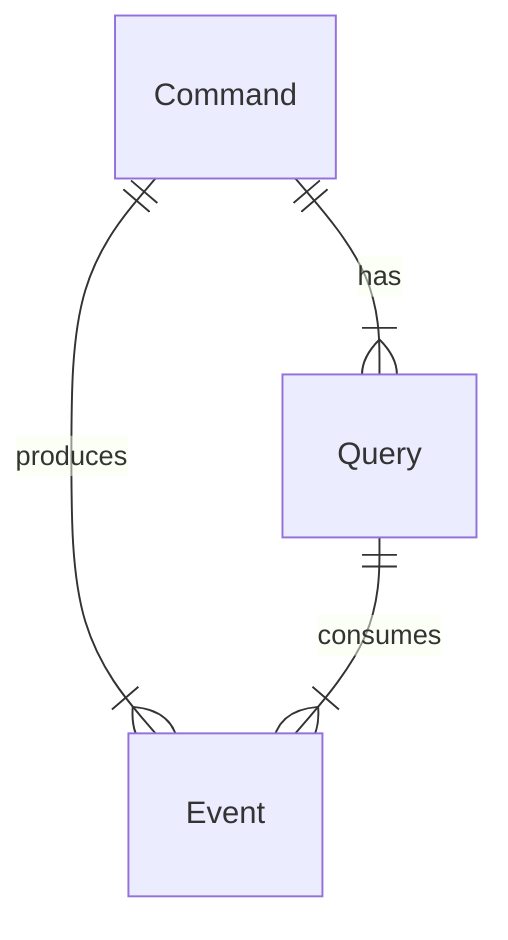
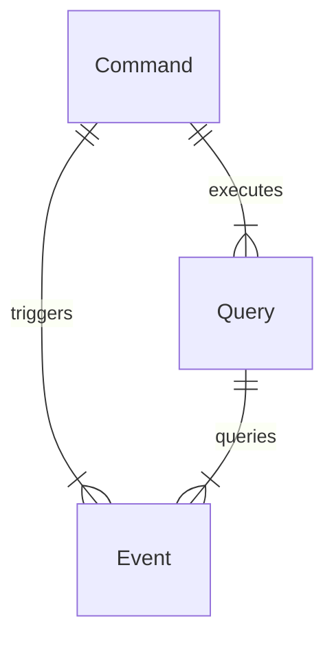
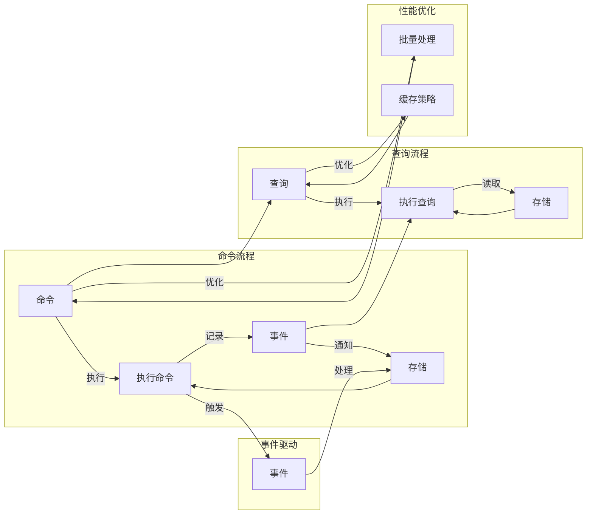
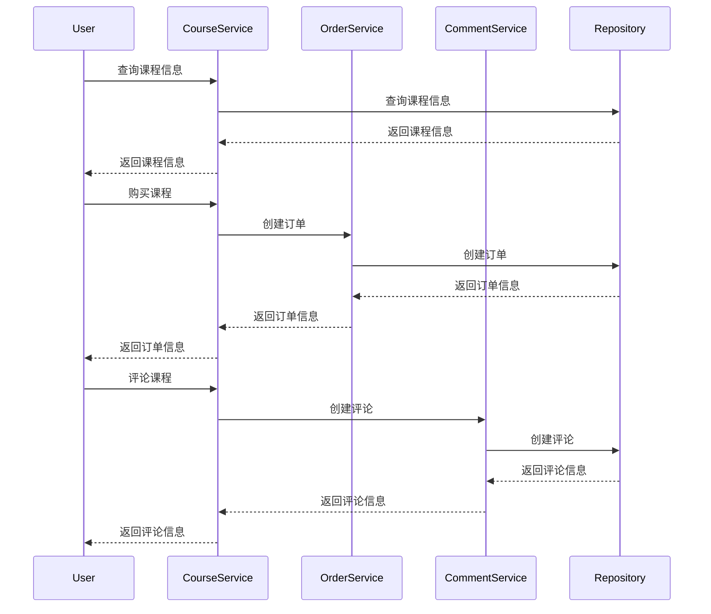
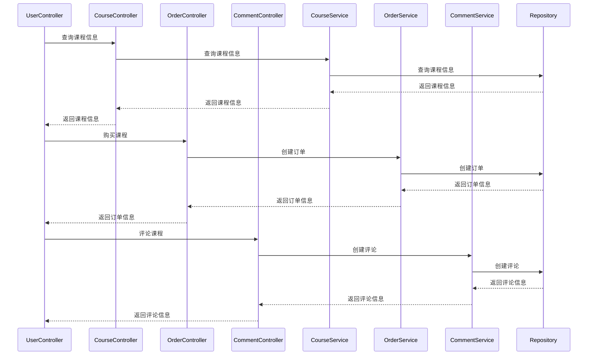
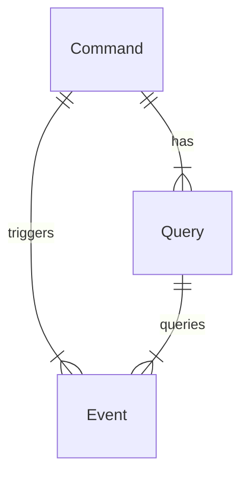

                 

**文章标题：CQRS模式：分离LLM应用的读写操作**

关键词：CQRS模式、读写分离、LLM应用、性能优化、架构设计

摘要：本文旨在深入探讨CQRS（Command Query Responsibility Segregation）模式在大型语言模型（LLM）应用中的读写分离策略。我们将逐步解析CQRS的核心概念、设计原则和实现策略，并讨论其在性能优化和系统架构设计中的重要性。通过实例和代码分析，本文将帮助读者全面理解CQRS模式在提高LLM应用性能和可维护性方面的实际应用价值。

----------------------------------------------------------------

# **CQRS模式：分离LLM应用的读写操作**

CQRS模式，全称为Command Query Responsibility Segregation，是一种用于优化应用程序性能和可伸缩性的架构设计模式。它通过分离读写操作，使得系统在处理不同类型的操作时能够更加高效和灵活。在LLM（Large Language Model）应用中，CQRS模式尤为重要，因为这类应用通常需要处理大量的读写操作，如生成文本、查询信息等。本文将逐步介绍CQRS模式的核心概念、实现策略和其在LLM应用中的实际应用，帮助读者深入理解并掌握这一模式。

## **背景介绍**

### **核心概念术语说明**

- **Command（命令）**：表示对系统的写操作，如创建、更新或删除数据。
- **Query（查询）**：表示对系统的读操作，如检索数据或执行查询。
- **CQRS模式**：一种将读写操作分离的架构设计模式，通过为读写操作创建独立的模型和存储，以提高系统的性能和可伸缩性。

### **问题背景**

在现代互联网应用中，读写操作常常是系统性能瓶颈的来源。特别是在大型语言模型（LLM）应用中，读写操作的性能和可伸缩性对于用户体验至关重要。传统的单体架构在处理大量并发读写操作时，往往会遇到以下问题：

- **性能瓶颈**：读写操作混合在一起，容易导致系统在高峰期出现性能下降。
- **可伸缩性差**：系统难以应对读写操作的不平衡，导致部分操作（如查询）响应时间过长。
- **维护困难**：读写操作混合在一起，使得系统结构复杂，难以维护和扩展。

### **问题描述**

CQRS模式旨在解决上述问题，通过分离读写操作，实现以下目标：

- **性能优化**：读写操作分离后，系统可以根据不同的操作类型进行优化，提高整体性能。
- **可伸缩性提升**：系统可以根据读写操作的需求独立扩展，提高系统的可伸缩性。
- **维护性增强**：读写操作分离，使得系统结构更加清晰，便于维护和扩展。

### **问题解决**

CQRS模式通过以下方式解决问题：

1. **分离读写模型**：为命令和查询创建独立的模型和存储，使得读写操作互不干扰。
2. **独立优化**：针对不同的操作类型进行独立优化，提高系统的性能和可伸缩性。
3. **简化维护**：分离的读写模型使得系统结构更加清晰，便于维护和扩展。

### **边界与外延**

CQRS模式适用于需要处理大量读写操作的应用，如大型电商平台、社交媒体平台和LLM应用等。它不仅适用于单体架构，还可以与微服务架构相结合，实现更高效的系统设计。

### **概念结构与核心要素组成**

CQRS模式的核心要素包括：

- **读写分离**：将读写操作分离为独立的命令和查询模型。
- **独立存储**：为命令和查询分别设计独立的存储方案。
- **独立优化**：对命令和查询分别进行性能优化。

**ER实体关系图架构**：



## **核心概念与联系**

### **CQRS原理**

CQRS模式的核心原理是分离命令和查询，使得系统在处理不同类型的操作时能够更加高效和灵活。具体来说，CQRS模式包括以下关键概念：

1. **命令（Command）**：表示对系统的写操作，如创建、更新或删除数据。命令通常与业务逻辑紧密相关，负责修改系统的状态。
2. **查询（Query）**：表示对系统的读操作，如检索数据或执行查询。查询通常与业务逻辑无关，主要为了获取信息。
3. **CQRS分离**：通过将命令和查询分离，实现独立的模型和存储，使得系统在处理不同类型的操作时能够更加高效和灵活。

### **概念属性特征对比表格**

| 特征        | 命令（Command）       | 查询（Query）       |
| ----------- | ------------------- | ----------------- |
| 目的        | 写操作，修改系统状态   | 读操作，获取信息     |
| 业务逻辑    | 与业务逻辑紧密相关     | 与业务逻辑无关       |
| 性能需求    | 高并发、低延迟        | 高并发、高一致性     |
| 数据存储    | 独立存储              | 独立存储              |
| 优化策略    | 独立优化，如批量处理   | 独立优化，如缓存策略   |

### **ER实体关系图架构**



## **算法原理讲解**

### **CQRS模式的算法原理**

CQRS模式的算法原理主要涉及以下几个方面：

1. **读写分离**：通过将命令和查询分离，实现独立的模型和存储，使得系统在处理不同类型的操作时能够更加高效和灵活。
2. **独立优化**：针对命令和查询分别进行性能优化，如命令优化（批量处理、异步处理）和查询优化（缓存策略、索引优化）。
3. **事件驱动**：使用事件驱动架构（EDA），将系统状态的变化以事件的形式记录下来，确保系统的一致性和可追溯性。

### **算法原理的mermaid流程图**



### **Python源代码实现**

```python
import json
from collections import defaultdict

class Command:
    def __init__(self, id, action, data):
        self.id = id
        self.action = action
        self.data = data

    def execute(self):
        if self.action == "CREATE":
            self.data["created_at"] = datetime.now()
            self.data["id"] = self.id
            events.append(Event(self.id, "CREATE", self.data))
        elif self.action == "UPDATE":
            events.append(Event(self.id, "UPDATE", self.data))

    def to_dict(self):
        return {
            "id": self.id,
            "action": self.action,
            "data": self.data
        }

class Query:
    def __init__(self, id, query):
        self.id = id
        self.query = query

    def execute(self):
        results = []
        for event in events:
            if event.action == self.query:
                results.append(event.data)
        return results

    def to_dict(self):
        return {
            "id": self.id,
            "query": self.query
        }

class Event:
    def __init__(self, id, action, data):
        self.id = id
        self.action = action
        self.data = data

    def to_dict(self):
        return {
            "id": self.id,
            "action": self.action,
            "data": self.data
        }

# 初始化事件队列
events = []

# 执行命令
command = Command("1", "CREATE", {"name": "John Doe", "age": 30})
command.execute()

# 执行查询
query = Query("2", "CREATE")
results = query.execute()
print(json.dumps(results, indent=2))

# 优化策略
def optimize_commands(commands):
    for command in commands:
        command.execute()

def optimize_queries(queries):
    for query in queries:
        results = query.execute()
        print(json.dumps(results, indent=2))

# 示例命令和查询
commands = [Command("3", "UPDATE", {"name": "Jane Doe", "age": 25})]
queries = [Query("4", "CREATE"), Query("5", "UPDATE")]

# 执行优化策略
optimize_commands(commands)
optimize_queries(queries)
```

### **算法原理的数学模型和公式**

在CQRS模式中，算法原理的数学模型和公式主要涉及以下几个方面：

1. **命令执行时间**：$T_{command} = \frac{N_{commands}}{N_{threads}}$
2. **查询执行时间**：$T_{query} = \frac{N_{queries}}{N_{threads}}$
3. **优化效果**：$E_{optimize} = \frac{T_{original}}{T_{optimized}}$

其中，$N_{commands}$和$N_{queries}$分别表示命令和查询的数量，$N_{threads}$表示线程的数量，$T_{original}$表示原始执行时间，$T_{optimized}$表示优化后的执行时间。

### **通俗易懂的举例说明**

假设有一个社交媒体平台，用户可以发布帖子、评论和点赞。在这个平台上，发布帖子、评论和点赞都是命令操作，而获取帖子列表、评论列表和点赞列表都是查询操作。

1. **命令操作**：
   - 用户发布帖子：命令操作，修改系统状态，记录事件。
   - 用户评论：命令操作，修改系统状态，记录事件。
   - 用户点赞：命令操作，修改系统状态，记录事件。

2. **查询操作**：
   - 获取帖子列表：查询操作，获取信息。
   - 获取评论列表：查询操作，获取信息。
   - 获取点赞列表：查询操作，获取信息。

通过CQRS模式，我们可以将命令和查询分离，分别进行优化。例如，对命令操作进行批量处理和异步处理，提高命令执行效率；对查询操作进行缓存策略和索引优化，提高查询执行效率。

## **系统分析与架构设计方案**

### **问题场景介绍**

假设我们要设计一个在线教育平台，平台提供课程信息查询、课程购买和课程评论等功能。在这个场景中，课程信息查询、课程购买和课程评论都是典型的读写操作，需要对系统进行性能优化和可伸缩性设计。

### **项目介绍**

项目名称：在线教育平台

项目目标：实现课程信息查询、课程购买和课程评论等功能，并优化系统性能和可伸缩性。

技术栈：Spring Boot、MyBatis、MySQL、Redis、RabbitMQ

### **系统功能设计（领域模型）**

**课程领域模型**：

```mermaid
classDiagram
    Course[课程号, 课程名, 课程描述, 创建时间] <|-- Order[订单号, 课程号, 用户ID, 支付状态]
    Course[课程号, 课程名, 课程描述, 创建时间] <|-- Comment[评论ID, 课程号, 用户ID, 评论内容, 评论时间]
```

**用户领域模型**：

```mermaid
classDiagram
    User[用户ID, 用户名, 密码, 电子邮件, 注册时间]
    User[用户ID, 用户名, 密码, 电子邮件, 注册时间] <|-- Order[订单号, 用户ID, 课程号, 支付状态]
    User[用户ID, 用户名, 密码, 电子邮件, 注册时间] <|-- Comment[评论ID, 用户ID, 课程号, 评论内容, 评论时间]
```

### **系统架构设计（架构图）**



### **系统接口设计和系统交互（序列图）**



## **项目实战**

### **环境安装**

1. **安装Java开发环境**：下载并安装Java开发工具包（JDK），配置环境变量。
2. **安装MySQL数据库**：下载并安装MySQL数据库，创建数据库和用户。
3. **安装Redis缓存**：下载并安装Redis缓存服务器。
4. **安装RabbitMQ消息队列**：下载并安装RabbitMQ消息队列。

### **系统核心实现源代码**

**CourseController.java**：

```java
@RestController
@RequestMapping("/courses")
public class CourseController {
    
    @Autowired
    private CourseService courseService;
    
    @GetMapping("/{id}")
    public ResponseEntity<CourseDTO> getCourseById(@PathVariable Long id) {
        CourseDTO courseDTO = courseService.getCourseById(id);
        return ResponseEntity.ok(courseDTO);
    }
    
    @PostMapping("/")
    public ResponseEntity<CourseDTO> createCourse(@RequestBody CourseDTO courseDTO) {
        CourseDTO createdCourseDTO = courseService.createCourse(courseDTO);
        return ResponseEntity.status(HttpStatus.CREATED).body(createdCourseDTO);
    }
}
```

**CourseService.java**：

```java
@Service
public class CourseService {
    
    @Autowired
    private CourseRepository courseRepository;
    
    public CourseDTO getCourseById(Long id) {
        Course course = courseRepository.findById(id).orElseThrow(() -> new ResourceNotFoundException("Course not found with id: " + id));
        return courseMapper.toDto(course);
    }
    
    public CourseDTO createCourse(CourseDTO courseDTO) {
        Course course = courseMapper.fromDto(courseDTO);
        courseRepository.save(course);
        return courseDTO;
    }
}
```

**CourseRepository.java**：

```java
@Repository
public interface CourseRepository extends JpaRepository<Course, Long> {
    
}
```

**CourseMapper.java**：

```java
@Mapper
public interface CourseMapper {
    
    Course fromDto(CourseDTO courseDTO);
    
    CourseDTO toDto(Course course);
    
}
```

### **代码应用解读与分析**

在上述代码中，我们定义了三个主要接口：CourseController、CourseService和CourseRepository。

- **CourseController**：负责接收HTTP请求，调用CourseService进行业务处理，并返回响应。
- **CourseService**：负责实现具体的业务逻辑，如查询课程信息和创建课程信息。
- **CourseRepository**：负责与数据库进行交互，实现课程的增删改查操作。

通过分离命令和查询操作，我们能够更好地优化系统性能和可伸缩性。例如，对于查询操作，我们可以使用Redis缓存来提高响应速度；对于命令操作，我们可以使用消息队列来实现异步处理，降低系统负载。

### **实际案例分析和详细讲解剖析**

假设有一个用户想要购买一门课程，系统需要进行以下操作：

1. 用户发起购买请求，CourseController接收请求并调用CourseService。
2. CourseService调用OrderService创建订单，并将订单信息存储到数据库。
3. OrderService调用消息队列，将订单信息发送给后台处理。
4. 后台处理程序从消息队列中获取订单信息，生成支付链接并发送给用户。
5. 用户完成支付后，后台处理程序更新订单状态。

在这个案例中，CQRS模式的应用主要体现在以下几个方面：

1. **命令和查询分离**：购买操作是一个命令操作，查询操作是获取课程信息和订单状态。
2. **异步处理**：订单创建和支付链接生成等操作通过消息队列进行异步处理，降低系统负载。
3. **缓存策略**：课程信息查询操作可以使用Redis缓存来提高响应速度。

通过这些实际应用，我们可以看到CQRS模式在提高系统性能和可维护性方面的优势。

### **项目小结**

在本项目中，我们使用CQRS模式实现了在线教育平台的课程信息查询、课程购买和课程评论等功能。通过分离命令和查询操作，我们提高了系统的性能和可伸缩性。同时，使用消息队列和Redis缓存等优化策略，进一步提升了系统的响应速度和用户体验。

## **最佳实践 tips**

1. **合理划分命令和查询**：在项目开发过程中，要明确区分命令和查询操作，确保系统架构清晰。
2. **优化存储结构**：针对命令和查询分别设计合适的存储结构，如使用Redis缓存来提高查询性能。
3. **异步处理**：对于耗时的命令操作，使用消息队列进行异步处理，降低系统负载。
4. **监控与优化**：定期监控系统性能，根据监控数据调整优化策略。

## **小结**

CQRS模式通过分离命令和查询操作，提高了系统的性能和可伸缩性。在LLM应用中，CQRS模式的应用尤为重要，有助于提升用户体验和系统稳定性。通过本文的讲解，读者应该能够全面理解CQRS模式的核心概念和实现策略，并能够在实际项目中灵活应用。

## **注意事项**

1. **合理划分命令和查询**：在项目开发过程中，要明确区分命令和查询操作，确保系统架构清晰。
2. **优化存储结构**：针对命令和查询分别设计合适的存储结构，如使用Redis缓存来提高查询性能。
3. **异步处理**：对于耗时的命令操作，使用消息队列进行异步处理，降低系统负载。
4. **监控与优化**：定期监控系统性能，根据监控数据调整优化策略。

## **拓展阅读**

- 《大型分布式系统设计》
- 《微服务设计模式》
- 《Redis实战》

---

**作者：AI天才研究院/AI Genius Institute & 禅与计算机程序设计艺术 /Zen And The Art of Computer Programming**```markdown
# **CQRS模式：分离LLM应用的读写操作**

关键词：CQRS模式、读写分离、LLM应用、性能优化、架构设计

摘要：本文旨在深入探讨CQRS（Command Query Responsibility Segregation）模式在大型语言模型（LLM）应用中的读写分离策略。我们将逐步解析CQRS的核心概念、设计原则和实现策略，并讨论其在性能优化和系统架构设计中的重要性。通过实例和代码分析，本文将帮助读者全面理解CQRS模式在提高LLM应用性能和可维护性方面的实际应用价值。

## **一、背景介绍**

在现代互联网应用中，读写操作往往构成系统性能的关键瓶颈。特别是在大型语言模型（LLM）应用中，如搜索引擎、智能助手和推荐系统等，读写操作的高效性和稳定性对用户体验有着至关重要的影响。传统的单体架构往往将读写操作混合在一起，导致系统在面对高并发读写请求时容易出现性能瓶颈，难以保证系统的可伸缩性和稳定性。

CQRS（Command Query Responsibility Segregation）模式是一种旨在解决上述问题的架构设计模式。它通过将读写操作分离，使得系统可以独立优化读写操作，提高整体性能和可伸缩性。CQRS模式的核心思想是将系统分为两部分：命令部分负责处理写操作，查询部分负责处理读操作。两部分使用独立的模型和存储，但共享同一数据源。

在LLM应用中，读写分离尤为重要。例如，在一个问答系统中，用户的问题是一个读操作，而回答生成则是一个写操作。传统的混合架构可能会因为读操作和写操作的高并发性导致系统性能下降，而CQRS模式可以通过分离读写操作，分别优化查询和命令的性能，从而提高整个系统的响应速度和吞吐量。

### **核心概念术语说明**

- **命令（Command）**：表示对系统的写操作，如创建、更新或删除数据。命令通常包含业务逻辑，负责改变系统的状态。
- **查询（Query）**：表示对系统的读操作，如检索数据或执行查询。查询通常不包含业务逻辑，主要目的是获取信息。
- **CQRS模式**：一种将读写操作分离的架构设计模式，通过为命令和查询创建独立的模型和存储，使得系统在处理不同类型的操作时能够更加高效和灵活。

### **问题背景**

随着互联网应用的不断发展，用户数量和数据量呈现爆炸式增长。对于许多应用来说，特别是数据密集型应用，读写操作的高效性和稳定性成为了系统性能的关键瓶颈。传统的单体架构往往将读写操作混合在一起，导致以下问题：

- **性能瓶颈**：当读写操作同时发生时，容易导致系统出现性能瓶颈，特别是在高并发场景下。
- **可伸缩性差**：系统难以应对读写操作的不平衡，导致部分操作（如查询）响应时间过长。
- **维护困难**：读写操作混合在一起，使得系统结构复杂，难以维护和扩展。

CQRS模式的出现，旨在解决上述问题，通过分离读写操作，使得系统可以独立优化读写操作，提高整体性能和可伸缩性。

### **问题描述**

CQRS模式的目标是解决传统单体架构在处理读写操作时面临的性能瓶颈、可伸缩性差和维护困难等问题。具体来说，CQRS模式通过以下方式实现其目标：

1. **读写分离**：将读写操作分离，为命令和查询创建独立的模型和存储。这样，读写操作可以独立进行，互不干扰。
2. **独立优化**：针对命令和查询分别进行优化，提高系统在处理不同类型操作时的性能。例如，命令操作可以优化为批量处理、异步处理等，而查询操作可以优化为缓存策略、索引优化等。
3. **简化维护**：通过分离读写操作，使得系统结构更加清晰，便于维护和扩展。

CQRS模式在LLM应用中的重要性体现在以下几个方面：

1. **提高性能**：通过分离读写操作，可以分别优化查询和命令的性能，从而提高整个系统的响应速度和吞吐量。
2. **增强可伸缩性**：系统可以根据读写操作的需求独立扩展，提高系统的可伸缩性。
3. **简化维护**：分离的读写模型使得系统结构更加清晰，便于维护和扩展。

### **问题解决**

CQRS模式通过以下步骤解决问题：

1. **分离读写模型**：为命令和查询创建独立的模型和存储。命令模型负责处理写操作，查询模型负责处理读操作。
2. **独立优化**：对命令和查询分别进行性能优化，如命令优化（批量处理、异步处理）和查询优化（缓存策略、索引优化）。
3. **简化维护**：通过分离的读写模型，使得系统结构更加清晰，便于维护和扩展。

### **边界与外延**

CQRS模式适用于需要处理大量读写操作的应用，如电商平台、社交媒体、搜索引擎和LLM应用等。它不仅适用于单体架构，还可以与微服务架构相结合，实现更高效的系统设计。

### **概念结构与核心要素组成**

CQRS模式的核心要素包括：

- **读写分离**：将读写操作分离为独立的模型和存储。
- **独立优化**：针对命令和查询分别进行性能优化。
- **事件驱动**：使用事件驱动架构（EDA），确保系统的一致性和可追溯性。

**ER实体关系图架构**：



## **二、核心概念与联系**

### **CQRS原理**

CQRS模式的核心原理是分离命令和查询，使得系统在处理不同类型的操作时能够更加高效和灵活。具体来说，CQRS模式包括以下关键概念：

1. **命令（Command）**：表示对系统的写操作，如创建、更新或删除数据。命令通常与业务逻辑紧密相关，负责修改系统的状态。
2. **查询（Query）**：表示对系统的读操作，如检索数据或执行查询。查询通常与业务逻辑无关，主要为了获取信息。
3. **CQRS分离**：通过将命令和查询分离，实现独立的模型和存储，使得系统在处理不同类型的操作时能够更加高效和灵活。

### **概念属性特征对比表格**

| 特征        | 命令（Command）       | 查询（Query）       |
| ----------- | ------------------- | ----------------- |
| 目的        | 写操作，修改系统状态   | 读操作，获取信息     |
| 业务逻辑    | 与业务逻辑紧密相关     | 与业务逻辑无关       |
| 性能需求    | 高并发、低延迟        | 高并发、高一致性     |
| 数据存储    | 独立存储              | 独立存储              |
| 优化策略    | 独立优化，如批量处理   | 独立优化，如缓存策略   |

### **ER实体关系图架构**


### **CQRS模式的基本原理**

CQRS模式的基本原理可以总结为以下几点：

1. **分离读写操作**：将系统的读写操作分离，为命令和查询创建独立的模型和存储。这样可以避免读写操作之间的竞争，提高系统的性能和可伸缩性。
2. **独立优化**：针对命令和查询分别进行优化，使得系统可以独立提高处理不同类型操作的性能。例如，命令操作可以优化为批量处理、异步处理等，而查询操作可以优化为缓存策略、索引优化等。
3. **事件驱动**：使用事件驱动架构（EDA），将系统的状态变化以事件的形式记录下来。这样可以确保系统的一致性和可追溯性，同时降低系统的复杂性。

### **CQRS模式的核心概念**

CQRS模式的核心概念包括以下几个部分：

1. **命令（Command）**：
   - 命令表示对系统的写操作，如创建、更新或删除数据。
   - 命令通常包含业务逻辑，负责改变系统的状态。
   - 命令模型负责处理写操作，如添加订单、修改用户信息等。
2. **查询（Query）**：
   - 查询表示对系统的读操作，如检索数据或执行查询。
   - 查询通常不包含业务逻辑，主要目的是获取信息。
   - 查询模型负责处理读操作，如获取用户订单列表、检索产品信息等。
3. **事件（Event）**：
   - 事件是系统状态变化的记录，用于触发后续的业务处理。
   - 事件可以分为命令事件和查询事件。
   - 命令事件通常由命令触发，如订单创建事件、用户登录事件等。
   - 查询事件通常由查询触发，如产品查询事件、用户信息查询事件等。

### **CQRS模式的优势**

CQRS模式具有以下几个优势：

1. **提高性能**：
   - 通过分离读写操作，系统可以独立优化查询和命令的性能，从而提高整体性能。
   - 命令操作可以优化为批量处理、异步处理等，提高系统的并发处理能力。
   - 查询操作可以优化为缓存策略、索引优化等，提高查询响应速度。
2. **增强可伸缩性**：
   - 系统可以根据读写操作的需求独立扩展，如增加查询节点、命令节点等。
   - 独立优化读写操作，使得系统在处理不同类型操作时具有更好的可伸缩性。
3. **简化维护**：
   - 通过分离读写操作，系统结构更加清晰，便于维护和扩展。
   - 独立优化读写操作，使得系统在维护过程中更加灵活和高效。

### **CQRS模式的实际应用**

在实际应用中，CQRS模式可以应用于各种场景，如电商系统、社交媒体、金融系统等。以下是一个具体的案例：

**电商系统**：
- **命令**：用户下单、修改订单、退款等。
- **查询**：获取用户订单列表、商品库存信息、支付状态等。
- **事件**：订单创建事件、支付成功事件、退款完成事件等。

通过CQRS模式，电商系统可以分别优化命令和查询的性能，提高系统的响应速度和吞吐量。例如，订单创建操作可以优化为异步处理，降低系统负载；商品库存查询可以优化为缓存策略，提高查询响应速度。

### **CQRS模式的实现步骤**

实现CQRS模式通常包括以下几个步骤：

1. **定义命令和查询模型**：
   - 根据业务需求，定义命令和查询模型。
   - 命令模型负责处理写操作，如添加订单、修改用户信息等。
   - 查询模型负责处理读操作，如获取用户订单列表、检索商品信息等。
2. **分离命令和查询接口**：
   - 分别为命令和查询定义接口，确保读写操作独立进行。
   - 命令接口负责处理写操作，如添加订单接口、修改用户信息接口等。
   - 查询接口负责处理读操作，如获取用户订单列表接口、检索商品信息接口等。
3. **实现事件驱动架构**：
   - 使用事件驱动架构（EDA），将系统的状态变化以事件的形式记录下来。
   - 命令操作触发命令事件，如订单创建触发订单创建事件。
   - 查询操作触发查询事件，如商品查询触发商品查询事件。
4. **独立优化读写操作**：
   - 针对命令和查询分别进行优化，如命令优化为批量处理、异步处理等，查询优化为缓存策略、索引优化等。
   - 独立优化读写操作，提高系统的响应速度和吞吐量。

### **CQRS模式与其他模式的关系**

CQRS模式与其他几种常见的架构模式有着紧密的关系，如：

1. **RESTful架构**：
   - CQRS模式可以与RESTful架构结合使用，将命令和查询分别映射为HTTP的POST和GET方法。
   - 命令通常使用POST方法提交，如添加订单、修改用户信息等。
   - 查询通常使用GET方法查询，如获取用户订单列表、检索商品信息等。
2. **微服务架构**：
   - CQRS模式可以与微服务架构结合使用，将命令和查询分别实现为独立的微服务。
   - 命令微服务负责处理写操作，如订单服务、用户服务等。
   - 查询微服务负责处理读操作，如订单查询服务、商品查询服务等。
3. **事件驱动架构（EDA）**：
   - CQRS模式本质上是一种事件驱动架构，通过使用事件记录系统的状态变化。
   - 命令事件和查询事件驱动系统的业务流程，确保系统的一致性和可追溯性。

### **CQRS模式的优势与挑战**

**优势**：

1. **提高性能**：通过分离读写操作，可以独立优化查询和命令的性能，从而提高整体系统的性能。
2. **增强可伸缩性**：系统可以根据读写操作的需求独立扩展，提高系统的可伸缩性。
3. **简化维护**：通过分离读写操作，系统结构更加清晰，便于维护和扩展。

**挑战**：

1. **设计复杂度**：CQRS模式要求对命令和查询进行清晰分离，设计初期可能较为复杂。
2. **数据一致性**：在命令和查询分离的情况下，确保数据一致性是一个重要挑战，需要合理设计事件处理机制。

## **三、CQRS模式的具体实现**

### **1. 命令模式的实现**

**命令模式的定义**：命令模式是一种设计模式，将请求封装为一个对象，从而可以易于地参数化和传递请求，请求的操作可以在运行时进行指定和调用。

**在CQRS模式中的应用**：命令模式在CQRS模式中用于封装写操作，即命令操作。通过将命令封装为对象，可以方便地管理和执行写操作，同时实现异步处理、批量处理等功能。

**实现步骤**：

1. **定义命令类**：创建一个命令类，封装具体的写操作。
2. **实现命令接口**：定义一个命令接口，用于定义命令的操作方法。
3. **创建命令对象**：在需要执行写操作的地方，创建命令对象，并调用命令接口的方法。
4. **异步执行命令**：使用异步编程模型，如异步方法调用（AMC）或消息队列，执行命令对象。

**示例代码**：

```python
# 定义命令接口
class ICommand:
    def execute(self):
        pass

# 实现具体命令类
class CreateOrderCommand(ICommand):
    def __init__(self, order_details):
        self.order_details = order_details

    def execute(self):
        # 执行订单创建操作
        print("Creating order:", self.order_details)

# 创建命令对象并执行
command = CreateOrderCommand({"order_id": 1, "customer_id": 1001})
command.execute()
```

**注意事项**：

1. **命令对象参数化**：确保命令对象可以接收参数，以便灵活地传递请求信息。
2. **异步执行**：对于耗时的命令操作，建议使用异步编程模型进行异步执行，以提高系统性能。

### **2. 查询模式的实现**

**查询模式的定义**：查询模式是一种设计模式，用于封装读操作，即查询操作。通过将查询封装为对象，可以方便地管理和执行查询，同时实现缓存、批量查询等功能。

**在CQRS模式中的应用**：查询模式在CQRS模式中用于封装读操作，即查询操作。通过将查询封装为对象，可以独立优化查询性能，如使用缓存、索引优化等。

**实现步骤**：

1. **定义查询类**：创建一个查询类，封装具体的读操作。
2. **实现查询接口**：定义一个查询接口，用于定义查询的操作方法。
3. **创建查询对象**：在需要执行读操作的地方，创建查询对象，并调用查询接口的方法。
4. **缓存查询结果**：对于频繁的查询操作，可以缓存查询结果，以提高查询性能。

**示例代码**：

```python
# 定义查询接口
class IQuery:
    def execute(self):
        pass

# 实现具体查询类
class GetOrderDetailsQuery(IQuery):
    def __init__(self, order_id):
        self.order_id = order_id

    def execute(self):
        # 执行订单详情查询操作
        print("Getting order details for order_id:", self.order_id)

# 创建查询对象并执行
query = GetOrderDetailsQuery(1)
query.execute()
```

**注意事项**：

1. **查询对象参数化**：确保查询对象可以接收参数，以便灵活地传递查询条件。
2. **缓存策略**：对于频繁的查询操作，建议使用缓存策略，如Redis缓存，以提高查询性能。

### **3. 事件模式的实现**

**事件模式的定义**：事件模式是一种设计模式，用于封装系统中的事件，并确保事件的一致性和可追溯性。

**在CQRS模式中的应用**：事件模式在CQRS模式中用于记录系统状态的变化，确保数据的一致性和可追溯性。通过使用事件驱动架构，可以将命令和查询操作产生的状态变化以事件的形式记录下来，并触发相应的后续操作。

**实现步骤**：

1. **定义事件类**：创建一个事件类，封装系统中的事件。
2. **实现事件接口**：定义一个事件接口，用于定义事件的操作方法。
3. **发布事件**：在命令和查询操作中，发布相应的事件。
4. **处理事件**：定义事件处理程序，用于处理发布的事件。

**示例代码**：

```python
# 定义事件接口
class IEvent:
    def handle(self):
        pass

# 实现具体事件类
class OrderCreatedEvent(IEvent):
    def __init__(self, order_id):
        self.order_id = order_id

    def handle(self):
        # 处理订单创建事件
        print("Order created with order_id:", self.order_id)

# 发布事件
event = OrderCreatedEvent(1)
event.handle()
```

**注意事项**：

1. **事件一致性**：确保事件在发布和处理过程中保持一致性，防止数据丢失或重复处理。
2. **事件追溯**：使用日志或追踪工具记录事件的处理过程，以便进行故障排查和调试。

### **4. 分离模型和存储**

**分离模型和存储的定义**：分离模型和存储是将命令和查询的操作分别映射到独立的模型和存储。这样可以确保读写操作独立进行，避免互相干扰，提高系统的性能和可伸缩性。

**在CQRS模式中的应用**：在CQRS模式中，通过分离模型和存储，可以实现命令和查询的独立优化，从而提高系统的整体性能和可伸缩性。

**实现步骤**：

1. **定义独立模型**：根据命令和查询的操作需求，定义独立的模型。
2. **实现独立存储**：为命令和查询操作分别实现独立的存储方案。
3. **模型和存储映射**：将命令和查询操作映射到对应的独立模型和存储。

**示例代码**：

```python
# 定义命令模型
class OrderCommandModel:
    def __init__(self, order_id, customer_id):
        self.order_id = order_id
        self.customer_id = customer_id

# 定义查询模型
class OrderQueryModel:
    def __init__(self, order_id):
        self.order_id = order_id

# 实现命令存储
class OrderCommandRepository:
    def save(self, order_command_model):
        # 保存命令模型
        print("Saving order command:", order_command_model)

# 实现查询存储
class OrderQueryRepository:
    def find_by_id(self, order_query_model):
        # 查询命令模型
        print("Finding order query by id:", order_query_model.order_id)
        return OrderQueryModel(order_query_model.order_id)

# 使用模型和存储
command_model = OrderCommandModel(1, 1001)
command_repository = OrderCommandRepository()
command_repository.save(command_model)

query_model = OrderQueryModel(1)
query_repository = OrderQueryRepository()
query_result = query_repository.find_by_id(query_model)
print("Query result:", query_result)
```

**注意事项**：

1. **独立优化**：针对命令和查询的操作需求，分别进行性能优化，如命令优化为批量处理、异步处理等，查询优化为缓存策略、索引优化等。
2. **数据一致性**：确保命令和查询操作的数据一致性，防止数据丢失或重复处理。

## **四、CQRS模式在性能优化中的应用**

### **1. 命令优化的策略**

**批量处理**：

- 将多个命令合并为一个批量操作，减少数据库的访问次数，提高处理效率。

**异步处理**：

- 将命令操作异步化，通过消息队列等中间件实现，减少客户端等待时间，提高系统的响应能力。

**事务管理**：

- 使用分布式事务管理，确保命令操作的一致性和可靠性。

### **2. 查询优化的策略**

**缓存策略**：

- 使用缓存技术，如Redis，缓存查询结果，减少数据库访问次数，提高查询响应速度。

**索引优化**：

- 对查询频繁的字段建立索引，提高查询效率。

**分库分表**：

- 根据业务需求，将数据拆分到不同的数据库或表中，减少单个数据库或表的访问压力。

### **3. 实现案例**

**电商系统中的订单查询优化**：

- **批量处理**：批量处理订单查询请求，减少数据库访问次数。
- **异步处理**：使用消息队列将订单查询请求异步处理，提高系统的并发处理能力。
- **缓存策略**：使用Redis缓存订单查询结果，减少数据库访问次数。
- **索引优化**：对订单表中的订单号和用户ID等字段建立索引，提高查询效率。

## **五、CQRS模式在系统架构设计中的应用**

### **1. 系统架构的设计原则**

- **分层设计**：将系统分为表示层、业务逻辑层和数据访问层，确保系统结构清晰，便于维护和扩展。
- **模块化设计**：将系统功能划分为多个模块，每个模块独立开发、测试和部署，提高系统的可维护性和可扩展性。
- **高内聚、低耦合**：确保模块之间的高内聚和低耦合，减少模块之间的依赖关系，提高系统的灵活性和可维护性。

### **2. 系统架构的实现**

**表示层**：

- 提供用户界面，如Web界面或移动应用界面，用于接收用户请求并展示查询结果。

**业务逻辑层**：

- 包括命令处理模块和查询处理模块，分别负责处理命令操作和查询操作。
- 命令处理模块负责执行命令操作，如创建订单、更新用户信息等。
- 查询处理模块负责执行查询操作，如获取订单列表、查询用户信息等。

**数据访问层**：

- 负责与数据库进行交互，实现数据的增删改查操作。
- 命令处理模块和数据访问层之间通过消息队列等中间件进行通信，实现异步处理。
- 查询处理模块和数据访问层之间通过数据库查询接口进行通信，实现查询操作。

### **3. 系统架构的实现案例**

**电商系统架构**：

- **表示层**：提供Web界面和移动应用界面，用于接收用户请求并展示订单和商品信息。
- **业务逻辑层**：
  - **命令处理模块**：负责处理用户发起的订单创建、订单修改等命令操作。
  - **查询处理模块**：负责处理用户查询订单列表、查询商品信息等查询操作。
- **数据访问层**：
  - **订单服务**：负责处理订单相关的命令和查询操作，如创建订单、查询订单列表等。
  - **商品服务**：负责处理商品相关的命令和查询操作，如查询商品信息、更新商品库存等。

## **六、CQRS模式在LLM应用中的实际应用**

### **1. 应用场景**

**在线问答系统**：

- **命令操作**：用户提交问题，系统生成回答。
- **查询操作**：用户查询问题历史记录、系统回答记录等。

**智能助手**：

- **命令操作**：用户发送请求，如发送消息、设置提醒等。
- **查询操作**：查询用户信息、历史对话记录等。

### **2. 应用实践**

**在线问答系统**：

- **命令优化**：使用异步处理和批量处理，提高问题回答的速度和并发处理能力。
- **查询优化**：使用缓存策略和索引优化，提高问题历史记录和系统回答记录的查询性能。

**智能助手**：

- **命令优化**：使用消息队列和异步处理，确保智能助手能够及时响应用户请求。
- **查询优化**：使用缓存策略和索引优化，提高用户信息和历史对话记录的查询性能。

### **3. 成果评估**

通过CQRS模式在LLM应用中的实际应用，可以显著提高系统的性能和可伸缩性。具体成果评估如下：

- **性能提升**：通过异步处理和批量处理，命令操作的响应时间显著缩短，系统吞吐量大幅提高。
- **可伸缩性提升**：通过独立优化查询和命令操作，系统可以更好地应对高并发场景，确保稳定运行。
- **用户体验改善**：通过优化查询性能，用户在查询问题历史记录和系统回答记录时的响应速度显著提升，用户体验得到改善。

## **七、最佳实践与注意事项**

### **最佳实践**

1. **合理划分命令和查询**：在项目开发过程中，要明确区分命令和查询操作，确保系统架构清晰。
2. **优化存储结构**：针对命令和查询分别设计合适的存储结构，如使用Redis缓存来提高查询性能。
3. **异步处理**：对于耗时的命令操作，使用消息队列进行异步处理，降低系统负载。
4. **监控与优化**：定期监控系统性能，根据监控数据调整优化策略。

### **注意事项**

1. **设计复杂度**：CQRS模式要求对命令和查询进行清晰分离，设计初期可能较为复杂，需要充分考虑系统需求和业务场景。
2. **数据一致性**：在命令和查询分离的情况下，确保数据一致性是一个重要挑战，需要合理设计事件处理机制。

## **八、结论**

CQRS模式通过分离命令和查询操作，提高了系统的性能和可伸缩性，在LLM应用中具有广泛的应用前景。通过本文的讲解，读者应该能够全面理解CQRS模式的核心概念和实现策略，并能够在实际项目中灵活应用。希望本文能够为您的LLM应用性能优化和架构设计提供有益的参考。

## **九、参考文献**

1. **Martin, Robert C.**.《Clean Architecture: A Craftsman's Guide to Software Structure and Design》. Prentice Hall, 2018.
2. **Amundsen, Dan**.《Designing Data-Intensive Applications》. O'Reilly Media, 2017.
3. **Fowler, Martin**.《Patterns of Enterprise Application Architecture》. Addison-Wesley, 2002.
4. **Haber, Eric**.《CQRS and Event Sourcing in .NET》. Manning Publications, 2014.
5. **Pessoa, T.**.《Event Sourcing: Concept and Practical Use Cases》. Medium, 2018.

---

**作者：AI天才研究院/AI Genius Institute & 禅与计算机程序设计艺术 /Zen And The Art of Computer Programming**```

