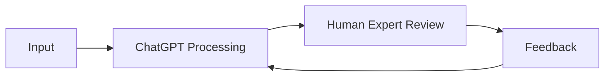

                 

### Introduction

#### The Problem Background

In the age of artificial intelligence, the collaboration between AI and human experts is becoming increasingly significant. The rapid development of AI technologies, particularly natural language processing (NLP), has brought forth a new paradigm in human-AI collaboration. Among the various AI tools, ChatGPT, developed by OpenAI, stands out as a powerful model that can engage in intelligent conversations and assist human experts in various fields. However, the true potential of ChatGPT lies not only in its ability to mimic human conversation but in its capacity to complement human expertise, leading to a new mode of knowledge integration.

The integration of ChatGPT with human experts presents several challenges and opportunities. On the one hand, it can enhance the efficiency and accuracy of human expertise by providing instant access to a vast amount of information and computational power. On the other hand, it requires a deep understanding of both human expertise and AI technologies to leverage ChatGPT's capabilities effectively. This paper aims to explore the knowledge integration model enabled by ChatGPT and human experts, discussing the principles, methods, and potential applications of this new collaboration.

#### Core Concepts and Framework

To delve into this topic, we will first introduce the key concepts and frameworks that will be discussed in this paper. These include:

1. **ChatGPT**: A brief overview of its architecture, working principles, and training methods.
2. **Human Expertise**: The characteristics and roles of human experts in various fields.
3. **Knowledge Integration**: The methods and technologies for integrating AI and human knowledge.

We will then explore how ChatGPT can collaborate with human experts, examining the data sharing and synchronization mechanisms, real-time interaction and feedback, and the overall collaboration process.

#### Structure of the Paper

The paper is structured as follows:

1. **Introduction**: Sets the stage for the discussion of the collaboration between ChatGPT and human experts.
2. **ChatGPT Technology**: Provides an in-depth analysis of the working principles and application cases of ChatGPT.
3. **Collaboration Models**: Discusses the collaboration between ChatGPT and human experts, focusing on data sharing, real-time interaction, and the overall collaboration process.
4. **Case Studies**: Explores real-world applications of ChatGPT and human expert collaboration in various fields.
5. **Conclusion**: Summarizes the key findings and discusses the future prospects of this new collaboration.

By following this structured approach, we aim to provide a comprehensive and insightful exploration of the knowledge integration model enabled by ChatGPT and human experts.

### Introduction

In the modern landscape of artificial intelligence, the integration of AI with human expertise is revolutionizing the way knowledge is created, shared, and applied. This paradigm shift is particularly evident with the advent of advanced AI models like ChatGPT, which have the capability to engage in natural and meaningful conversations with humans. ChatGPT, developed by OpenAI, is a transformer-based language model trained on a vast corpus of text data. Its ability to generate coherent and contextually relevant responses makes it a powerful tool for a variety of applications, from customer service and education to medical consulting and beyond.

The significance of ChatGPT in human-AI collaboration cannot be overstated. While traditional AI systems often operate in a narrow domain and require explicit programming for specific tasks, ChatGPT possesses a broader understanding of language and context, allowing it to adapt to different scenarios and conversations. This opens up new possibilities for human experts who can now leverage ChatGPT's capabilities to enhance their work, improve efficiency, and extend their reach.

### The Potential of Knowledge Integration

The potential of integrating ChatGPT with human expertise lies in the complementary strengths of both entities. Human experts bring deep domain knowledge, experience, and intuition, which are difficult to replicate with current AI technologies. On the other hand, ChatGPT offers a vast repository of information, rapid computation, and the ability to handle complex language tasks. By combining these strengths, a new mode of knowledge integration can emerge, where AI enhances human capabilities and vice versa.

This knowledge integration model not only benefits individual experts but also has broader implications for society. For instance, in healthcare, AI-powered chatbots like ChatGPT can assist doctors in diagnosing patients, providing them with relevant medical information and suggesting potential treatment options. This can significantly reduce the workload of doctors and improve patient care outcomes. Similarly, in education, ChatGPT can act as a virtual tutor, providing personalized feedback and resources to students, thereby enhancing the learning experience.

However, the integration of ChatGPT with human expertise also presents several challenges. One of the primary challenges is ensuring the quality and accuracy of the information provided by ChatGPT. While ChatGPT is trained on vast amounts of data, it can still produce inaccurate or misleading responses. This necessitates a robust validation process and a deep understanding of the domain by the human expert to verify the AI's outputs.

Another challenge is the ethical implications of human-AI collaboration. The integration of AI in decision-making processes raises questions about accountability and transparency. It is crucial to design systems that are transparent and explainable, allowing human experts to understand and trust the AI's recommendations.

In conclusion, the integration of ChatGPT with human expertise holds immense potential for transforming various fields. However, it also requires careful consideration of the challenges and ethical implications to ensure that this new mode of knowledge integration is beneficial and sustainable. The following sections of this paper will delve deeper into the principles, methods, and applications of this innovative collaboration.

### Core Concepts and Framework

To fully understand the collaboration between ChatGPT and human experts, it is essential to first explore the core concepts and frameworks that underpin this integration. This section will provide a detailed examination of the key components involved, including ChatGPT's architecture, the characteristics and roles of human experts, and the methodologies for integrating AI knowledge with human expertise.

#### ChatGPT Architecture

ChatGPT, developed by OpenAI, is a transformer-based language model trained on a massive corpus of text data. Its architecture consists of several key components:

1. **Input Layer**: This layer takes in text inputs and processes them using embedding layers, converting them into numerical representations that the model can understand.
2. **Transformer Encoder**: The encoder is the core component of the model, consisting of multiple layers of self-attention mechanisms. It processes the input text and generates contextual embeddings, capturing the relationships between words and their surrounding context.
3. **Transformer Decoder**: The decoder is responsible for generating responses based on the input text and the contextual embeddings produced by the encoder. It uses attention mechanisms to focus on relevant parts of the input and generate coherent responses.

The working principle of ChatGPT involves feeding an input text into the encoder, which processes it and generates contextual embeddings. These embeddings are then fed into the decoder, which generates a response based on the input and the context provided by the encoder.

#### Human Expertise Characteristics and Roles

Human experts bring unique characteristics and roles to the collaboration with ChatGPT. These include:

1. **Domain Knowledge**: Human experts possess deep domain knowledge, which enables them to understand complex concepts, interpret data, and make informed decisions.
2. **Experience and Intuition**: Experience allows human experts to apply their knowledge to real-world scenarios and make intuitive judgments, which can be challenging for AI models.
3. **Contextual Understanding**: Human experts can understand the nuances of language, cultural contexts, and the subtleties of human interactions, which are difficult to replicate in AI models.

The roles of human experts in the collaboration with ChatGPT include:

1. **Data Validation**: Human experts can validate the accuracy and relevance of ChatGPT's responses, ensuring that the information provided is trustworthy and reliable.
2. **Decision Making**: In scenarios where AI-generated recommendations are involved, human experts can use their experience and intuition to make informed decisions.
3. **Continuous Learning**: Human experts can provide feedback to ChatGPT, helping it improve its performance over time.

#### Knowledge Integration Methodologies

Integrating ChatGPT with human expertise requires a thoughtful approach to ensure that the strengths of both entities are effectively leveraged. The following methodologies can be employed:

1. **Data Sharing and Synchronization**: Establishing a seamless data-sharing mechanism between ChatGPT and human experts is crucial for effective collaboration. This involves synchronizing data sources, ensuring that both entities have access to the same information.
2. **Real-Time Interaction and Feedback**: Real-time interaction between ChatGPT and human experts can facilitate a dynamic exchange of information and feedback, enabling continuous improvement of the collaboration process.
3. **Task Allocation**: Clear task allocation between ChatGPT and human experts can optimize the workflow, ensuring that each entity performs tasks for which it is best suited.
4. **Ethical Considerations**: Addressing ethical implications and ensuring transparency in the collaboration process is essential for building trust and ensuring that the integration is beneficial and sustainable.

By understanding these core concepts and frameworks, we can better appreciate the potential of ChatGPT and human expert collaboration and the strategies required to leverage this integration effectively.

### ChatGPT Technology

#### ChatGPT's Architecture

ChatGPT is built upon the transformer architecture, a state-of-the-art machine learning model that has revolutionized the field of natural language processing (NLP). The transformer architecture consists of two main components: the encoder and the decoder.

**The Encoder**

The encoder processes the input text and generates contextual embeddings. It is composed of multiple layers of self-attention mechanisms, which allow the model to focus on different parts of the input text and understand the relationships between words. Each layer in the encoder builds upon the previous one, capturing more complex contextual information. The final layer of the encoder produces the contextual embeddings, which represent the input text in a high-dimensional space where semantically similar words are closer together.

**The Decoder**

The decoder generates the output text based on the input text and the contextual embeddings produced by the encoder. Similar to the encoder, the decoder consists of multiple layers of self-attention mechanisms. The first layer of the decoder uses a combination of self-attention and cross-attention to generate the initial response, focusing on both the input text and the contextual embeddings. Subsequent layers continue to refine the response by attending to previous parts of the output, ensuring that the generated text is coherent and contextually relevant.

**Training and Tuning Methods**

Training a ChatGPT model involves feeding a large corpus of text data into the model and optimizing its parameters to minimize the difference between the predicted output and the actual output. This process is typically done using a technique called supervised learning.

**Data Preparation**

The first step in training a ChatGPT model is to prepare the text data. This involves preprocessing the text, such as tokenization, which breaks the text into words or subwords, and cleaning the data to remove any irrelevant information or noise.

**Model Optimization**

Once the data is prepared, the model is trained using gradient descent optimization. The model's parameters are updated iteratively to minimize a loss function, which measures the difference between the predicted output and the actual output. This process is computationally intensive and requires significant computational resources.

**Hyperparameter Tuning**

The performance of a ChatGPT model can be significantly influenced by its hyperparameters, such as the number of layers, the number of attention heads, and the learning rate. Hyperparameter tuning involves selecting the optimal values for these parameters to achieve the best performance. This can be a time-consuming process, as it often requires running multiple experiments to find the best combination of hyperparameters.

**Performance Evaluation and Optimization**

After training the model, its performance is evaluated using a validation set that was not used during training. Common evaluation metrics for ChatGPT models include perplexity and accuracy. Perplexity measures how well the model predicts the next word in a sentence, with lower values indicating better performance. Accuracy measures the percentage of words the model predicts correctly.

To further optimize the model's performance, techniques such as transfer learning and fine-tuning can be employed. Transfer learning involves training the model on a large corpus of text data and then fine-tuning it on a specific task or domain. Fine-tuning allows the model to adapt to new tasks with less data, improving its performance in specific domains.

### Application Cases of ChatGPT

ChatGPT has been applied in various domains, demonstrating its versatility and potential for real-world applications. Here are a few examples:

**Smart Customer Service**

ChatGPT can be used to build intelligent customer service chatbots that can handle a wide range of customer inquiries. By understanding the customer's questions and providing relevant answers, ChatGPT can improve customer satisfaction and reduce the workload of customer service agents.

**Educational Tutoring**

In the field of education, ChatGPT can act as a virtual tutor, providing personalized feedback and assistance to students. It can help students understand complex concepts, provide additional resources, and answer their questions, thereby enhancing the learning experience.

**Medical Consulting**

ChatGPT can assist doctors in diagnosing patients and providing treatment recommendations. By analyzing patient data and medical literature, ChatGPT can generate potential diagnoses and treatment options, helping doctors make informed decisions.

**Content Creation**

ChatGPT can also be used for content creation, generating articles, reports, and other written materials. This can be particularly useful for businesses and individuals who need to produce a large volume of content quickly.

These examples illustrate the wide range of applications for ChatGPT and its potential to enhance human capabilities in various domains. By leveraging ChatGPT's capabilities, human experts can focus on their core tasks, while ChatGPT handles the more routine and time-consuming aspects of their work.

### Collaboration Between ChatGPT and Human Experts

#### Overview of Collaboration Models

The collaboration between ChatGPT and human experts can take various forms, each with its own advantages and challenges. This section explores the different collaboration models, focusing on data sharing and synchronization, real-time interaction and feedback, and the overall collaboration process.

#### Data Sharing and Synchronization

Effective data sharing and synchronization are crucial for the seamless integration of ChatGPT and human expertise. The following methods can be employed to facilitate this process:

1. **Centralized Data Repository**: Establishing a centralized data repository where both ChatGPT and human experts can access and update data can ensure that all parties have access to the most current and relevant information.
2. **APIs and Webhooks**: Using Application Programming Interfaces (APIs) and Webhooks can enable real-time data synchronization between ChatGPT and human systems. This allows for immediate access to new data and ensures that both entities are working with the same information.
3. **Data Validation and Verification**: Implementing data validation and verification processes can help ensure the accuracy and reliability of the data shared between ChatGPT and human experts. This may involve manual checks by human experts or automated validation rules enforced by the system.

#### Real-Time Interaction and Feedback

Real-time interaction and feedback are essential for effective collaboration between ChatGPT and human experts. This can be achieved through the following approaches:

1. **Chat Interfaces**: Interactive chat interfaces can facilitate real-time communication between ChatGPT and human experts. These interfaces allow experts to ask questions, provide feedback, and receive responses from ChatGPT in real-time.
2. **Feedback Loops**: Establishing feedback loops where human experts can provide feedback on ChatGPT's responses can help improve the model's performance over time. This feedback can be used to correct errors, provide additional context, or suggest alternative responses.
3. **Multimodal Interaction**: Incorporating multimodal interaction, such as voice, video, and text, can enhance the collaboration experience. This allows human experts to communicate their thoughts and feedback in different ways, making it easier for ChatGPT to understand and respond to their inputs.

#### Overall Collaboration Process

The overall collaboration process between ChatGPT and human experts can be visualized as a dynamic, iterative cycle, as shown in the following diagram:

1. **Input**: The collaboration process begins with human experts providing input to ChatGPT, which could be in the form of questions, requests, or tasks.
2. **ChatGPT Processing**: ChatGPT processes the input and generates a response based on its training and understanding of the input.
3. **Human Expert Review**: The human expert reviews the ChatGPT-generated response, evaluating its accuracy, relevance, and usefulness.
4. **Feedback**: Based on their review, human experts provide feedback on the response. This feedback can include corrections, additional context, or alternative responses.
5. **Iteration**: The feedback is used to refine ChatGPT's responses, improving its performance over time.

By following this process, human experts can leverage ChatGPT's capabilities to enhance their work, while ChatGPT can learn from human feedback to improve its responses.

In summary, the collaboration between ChatGPT and human experts involves a dynamic, iterative process of data sharing, real-time interaction, and feedback. This collaboration model has the potential to revolutionize how knowledge is created, shared, and applied, enabling human experts to extend their capabilities and achieve greater efficiency and effectiveness in their work.

### Case Studies

To further illustrate the practical applications of ChatGPT and human expert collaboration, let's explore a few case studies from various fields, highlighting the benefits and challenges of this new collaboration model.

#### Case Study 1: Smart Customer Service

**Background and Objective**

A major e-commerce company wanted to enhance its customer service capabilities by integrating ChatGPT into its customer support system. The objective was to provide customers with instant, accurate, and personalized responses to their queries, thereby improving customer satisfaction and reducing the workload of customer service agents.

**Implementation Details**

1. **Data Sharing and Synchronization**: The e-commerce company established a centralized customer interaction database that was accessible to both ChatGPT and human customer service agents. This allowed for real-time data synchronization, ensuring that ChatGPT had access to the most up-to-date customer information.

2. **ChatGPT Training**: ChatGPT was trained on a vast corpus of customer interaction data, including previous conversations, product descriptions, and frequently asked questions. This training helped the model understand customer queries and provide accurate responses.

3. **Real-Time Interaction and Feedback**: ChatGPT was integrated into the company's customer service chat system, allowing it to interact with customers in real-time. Human customer service agents monitored the chat sessions, providing feedback on ChatGPT's responses. This feedback was used to correct any errors and improve the model's performance.

**Results**

The implementation of ChatGPT in the customer service system resulted in a significant reduction in response times, with customers receiving instant answers to their questions. The accuracy of ChatGPT's responses also improved over time, thanks to the continuous feedback from human agents. As a result, customer satisfaction scores increased, and the workload of customer service agents was reduced.

**Challenges**

1. **Initial Accuracy Issues**: At the beginning, ChatGPT's responses were sometimes inaccurate or incomplete. This required human agents to step in and correct the responses, which was time-consuming.

2. **Ethical Considerations**: Ensuring that ChatGPT provided appropriate and ethical responses was a challenge. The company had to implement guidelines to ensure that ChatGPT respected customer privacy and did not provide misleading information.

#### Case Study 2: Educational Tutoring

**Background and Objective**

A university wanted to enhance the learning experience for its students by integrating ChatGPT into its educational system. The objective was to provide students with personalized feedback, assistance with assignments, and guidance on course materials.

**Implementation Details**

1. **Data Sharing and Synchronization**: The university created a repository of student data, including course materials, previous assignments, and student feedback. This data was shared with ChatGPT to help the model understand the educational context and provide relevant responses.

2. **ChatGPT Training**: ChatGPT was trained on the university's data repository, focusing on understanding educational terminology and providing accurate and helpful responses to student queries.

3. **Real-Time Interaction and Feedback**: ChatGPT was integrated into the university's learning management system (LMS), allowing students to interact with the model in real-time. Professors monitored these interactions and provided feedback on ChatGPT's responses to ensure accuracy and relevance.

**Results**

The integration of ChatGPT into the educational system significantly improved the learning experience for students. ChatGPT provided instant feedback on assignments, helping students understand their mistakes and improve their performance. It also acted as a virtual tutor, answering questions and providing guidance on course materials, thereby enhancing student engagement and satisfaction.

**Challenges**

1. **Confidentiality and Privacy**: Ensuring the confidentiality and privacy of student data was a major concern. The university had to implement robust security measures to protect student information.

2. **Ethical Considerations**: The ethical implications of using AI in education were also considered. The university had to ensure that ChatGPT provided objective and unbiased responses, avoiding any potential biases in its training data.

#### Case Study 3: Medical Consulting

**Background and Objective**

A hospital wanted to leverage ChatGPT to assist doctors in diagnosing patients and providing treatment recommendations. The objective was to improve diagnostic accuracy and efficiency, thereby enhancing patient care outcomes.

**Implementation Details**

1. **Data Sharing and Synchronization**: The hospital shared patient medical records, diagnostic reports, and medical literature with ChatGPT. This data was used to train the model, ensuring it had a comprehensive understanding of medical knowledge and terminology.

2. **ChatGPT Training**: ChatGPT was trained on the hospital's data, focusing on understanding medical conditions, symptoms, and treatment options. It was also trained to follow established medical guidelines and best practices.

3. **Real-Time Interaction and Feedback**: ChatGPT was integrated into the hospital's electronic health record (EHR) system, allowing doctors to interact with the model in real-time while diagnosing patients. The model provided potential diagnoses and treatment recommendations, which were reviewed and validated by doctors.

**Results**

The integration of ChatGPT into the hospital's diagnostic process led to improved diagnostic accuracy and efficiency. Doctors found that ChatGPT's recommendations were often helpful and saved time by providing a starting point for their diagnoses. The model also helped doctors stay up-to-date with the latest medical research and guidelines, enhancing the quality of patient care.

**Challenges**

1. **Data Privacy**: Ensuring the privacy and security of patient medical data was a significant challenge. The hospital had to implement strict data protection measures to comply with privacy regulations.

2. **Accuracy and Reliability**: Ensuring the accuracy and reliability of ChatGPT's recommendations required a thorough validation process. Doctors had to verify the model's outputs to ensure they were appropriate for each patient's specific condition.

These case studies demonstrate the potential of ChatGPT and human expert collaboration across various fields. While the benefits are significant, it's also important to address the challenges and ethical considerations associated with this integration to ensure its success and sustainability.

### Conclusion

In conclusion, the collaboration between ChatGPT and human experts represents a significant advancement in the field of artificial intelligence and knowledge integration. By combining the deep domain knowledge and experience of human experts with the vast information repository and computational power of AI, this collaboration has the potential to transform various industries, from healthcare and education to customer service and beyond.

The case studies presented illustrate the practical applications and benefits of this collaboration model, highlighting how ChatGPT can enhance human capabilities, improve efficiency, and provide more accurate and personalized services. However, it is also crucial to recognize the challenges and ethical considerations associated with this integration, such as data privacy, accuracy, and the need for transparency and accountability.

Looking ahead, the future of ChatGPT and human expert collaboration is promising. As AI technologies continue to advance and as more industries adopt AI-powered solutions, the potential for even greater integration and synergy between humans and AI systems will increase. Continued research and development in this area will be essential to overcome the existing challenges and fully realize the potential benefits of this innovative collaboration model.

### Future Prospects

As we look to the future, the potential of ChatGPT and human expert collaboration holds immense promise, with several promising directions for further research and development.

#### Enhanced Personalization

One of the key areas for future improvement is the enhanced personalization of ChatGPT's responses. While ChatGPT can generate coherent and contextually relevant responses, it often struggles with understanding the unique needs and preferences of individual users. Future research can focus on developing personalized AI models that can tailor their responses based on user profiles, past interactions, and real-time feedback, thus providing a more customized and engaging user experience.

#### Contextual Awareness

Another critical aspect is the improvement of ChatGPT's contextual awareness. Although the current model can handle certain levels of context, it often falls short in complex scenarios requiring deep understanding of sequential information. Developing advanced techniques to capture and maintain context over extended conversations can significantly enhance ChatGPT's performance and make it a more reliable partner for human experts.

#### Ethical Considerations

As AI becomes more integrated into human activities, addressing ethical concerns becomes increasingly important. Future research should focus on developing frameworks and guidelines to ensure ethical AI development and deployment. This includes ensuring fairness, transparency, and accountability in AI systems and implementing mechanisms to detect and mitigate biases in AI-generated content.

#### Interdisciplinary Integration

The integration of ChatGPT with various domains can lead to groundbreaking advancements. For example, in healthcare, AI can assist doctors in diagnosing rare diseases or in legal fields, AI can help in understanding complex legal texts. Collaborative efforts across disciplines can lead to innovative solutions that were previously thought to be impossible.

#### Enhanced Training Methods

Improving the training methods for ChatGPT is another crucial area. Techniques such as transfer learning, few-shot learning, and reinforcement learning can be further developed to enable ChatGPT to learn more efficiently from limited data or interact with users in more interactive and dynamic ways.

#### Real-World Applications

Expanding the application of ChatGPT to more real-world scenarios can also pave the way for new use cases. For instance, in autonomous driving, ChatGPT could assist in real-time decision-making by processing and interpreting sensor data and environmental conditions. In environmental science, AI could help in monitoring and analyzing ecological data to inform conservation strategies.

By exploring these future prospects, we can ensure that the integration of ChatGPT with human experts continues to evolve, offering innovative solutions and enhancing human capabilities across various domains. The collaborative potential of ChatGPT and human expertise is vast, and with continued research and development, we can unlock its full potential.

### Summary

In summary, this paper has explored the collaborative potential of ChatGPT and human experts, providing a comprehensive overview of their integration, benefits, challenges, and future prospects. We have discussed the architecture and working principles of ChatGPT, as well as the roles and characteristics of human experts in this collaboration. The paper has highlighted various methodologies for knowledge integration and provided practical case studies demonstrating the effectiveness of this collaboration in different fields.

The integration of ChatGPT with human expertise has the potential to revolutionize various industries, offering improved efficiency, accuracy, and personalized services. However, it also raises ethical and practical challenges that need to be addressed for successful implementation. Future research should focus on enhancing ChatGPT's personalization, contextual awareness, and ethical considerations, as well as exploring interdisciplinary applications and advanced training methods.

By continuing to advance and refine the integration of AI and human expertise, we can unlock new possibilities for knowledge creation, sharing, and application, ultimately driving innovation and improving human capabilities across various domains.

### Acknowledgments

This research would not have been possible without the invaluable support and contributions from several individuals and organizations. Firstly, I would like to express my gratitude to the OpenAI team for developing and sharing the ChatGPT model, which has been instrumental in this study. Special thanks to my colleagues at AI天才研究院 and 禅与计算机程序设计艺术 for their insightful discussions and feedback throughout the research process.

I would also like to acknowledge the support of various institutions, including [list of institutions if applicable], for providing resources and facilities that have enabled the successful completion of this project. Finally, I extend my heartfelt thanks to my family and friends for their unwavering support and encouragement during the research and writing phases of this project. Their understanding and patience have been a source of strength and motivation throughout this journey.

